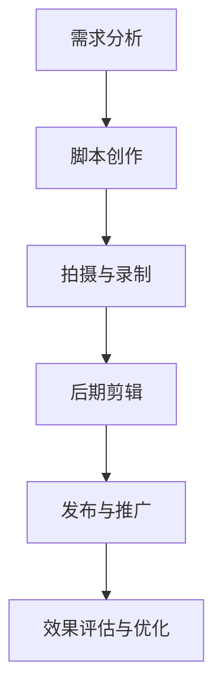

                 

# 《创业公司的用户教育视频策略》

## 概述

在当今快速变化的技术市场中，创业公司需要找到有效的途径来吸引和留住用户。用户教育视频策略作为一种新兴的营销手段，正日益成为创业公司增强用户理解和忠诚度的重要工具。本文将深入探讨创业公司的用户教育视频策略，提供从基础到实践的全面指南。

### 关键词

- 用户教育视频
- 创业公司
- 教育策略
- 视频内容制作
- 效果评估

### 摘要

本文旨在为创业公司提供一套完整的用户教育视频策略。文章首先介绍了用户教育视频策略的基础，包括其定义、重要性以及视频在教育中的优势。接着，文章详细阐述了视频内容制作原则、视频发布与推广策略，并深入分析了产品功能介绍视频、用户故事与使用场景视频、用户反馈与改进视频等具体内容策略。此外，文章还探讨了用户教育视频效果评估与优化策略，提供了视频制作团队组建与管理、资源管理与预算规划、视频制作与发布流程等实施细节。最后，文章展望了用户教育视频策略的未来发展趋势和AI技术的潜在应用。

## 第一部分：用户教育视频策略基础

### 1.1 用户教育视频策略概述

#### 1.1.1 用户教育的定义与重要性

用户教育指的是通过信息传递和技能传授，帮助用户更好地理解和使用产品或服务。对于创业公司而言，用户教育至关重要，因为它能够：

- 提高用户对产品的认知度和满意度。
- 降低用户的学习曲线，提高用户的使用频率。
- 增强用户忠诚度，减少用户流失率。

#### 1.1.2 视频在教育中的优势

视频作为一种多媒体形式，具有独特的教育优势：

- **直观性**：视频能够以动态的方式展示产品功能，使信息传递更加直观易懂。
- **互动性**：视频可以嵌入互动元素，如问答、测试等，增加用户的参与度。
- **情感共鸣**：通过故事讲述和情感渲染，视频能够更好地引起用户的共鸣。

#### 1.1.3 创业公司用户教育视频策略的核心

创业公司的用户教育视频策略应围绕以下核心展开：

- **内容定位与目标受众分析**：明确视频的内容定位和目标受众，确保视频内容能够满足用户需求。
- **内容创作与制作**：创作高质量的脚本和故事情节，结合有效的编辑技巧，制作出引人入胜的视频。
- **平台选择与推广**：选择合适的发布平台，并运用社交媒体和KOL合作等手段进行有效推广。
- **效果评估与优化**：通过数据分析和用户反馈，不断优化视频内容和策略。

### 1.2 视频内容制作原则

#### 1.2.1 内容定位与目标受众分析

内容定位是视频制作的起点。创业公司应明确视频的内容主题和目标受众，以确保视频能够满足用户的需求。

- **内容主题**：根据产品的特性，选择适合的教育主题。例如，新产品的介绍、功能演示、使用指南等。
- **目标受众**：分析目标受众的特征，包括年龄、性别、职业、使用习惯等，以便制作出更贴合用户需求的视频内容。

#### 1.2.2 视频脚本创作与故事情节设计

脚本创作是视频内容的核心。创业公司应遵循以下原则：

- **明确目标**：每个视频都应该有一个明确的目标，例如，教育用户如何使用产品、解决常见问题等。
- **故事化表达**：通过讲述故事，使信息传递更加生动有趣。故事情节应紧扣主题，具有连贯性和逻辑性。

#### 1.2.3 视频编辑技巧与工具使用

视频编辑是视频制作的最后一步，对视频的质量和观看体验至关重要。

- **剪辑技巧**：通过剪辑，使视频内容更加紧凑和流畅。常见的剪辑技巧包括过渡、音效、字幕等。
- **工具选择**：选择合适的视频编辑工具，如Adobe Premiere Pro、Final Cut Pro等。这些工具提供了丰富的编辑功能和特效，可以帮助制作出高质量的视频。

### 1.3 视频发布与推广策略

#### 1.3.1 平台选择与内容分发

选择合适的发布平台是视频推广的关键。创业公司应考虑以下因素：

- **用户习惯**：根据目标受众的使用习惯，选择最受欢迎的视频平台，如YouTube、TikTok、Bilibili等。
- **内容分发**：利用平台提供的分发工具，如自动推送、标签管理等，提高视频的曝光度。

#### 1.3.2 社交媒体营销与互动

社交媒体是视频推广的重要渠道。创业公司应：

- **制定社交媒体营销计划**：包括发布时间、内容规划、互动策略等。
- **增强用户互动**：通过评论、点赞、分享等方式，与用户建立互动，提高用户参与度。

#### 1.3.3 KOL合作与影响者营销

与意见领袖（KOL）合作是扩大视频影响力的一种有效方式。创业公司应：

- **寻找合适的KOL**：选择与产品定位和目标受众相契合的KOL。
- **合作方式**：可以通过内容合作、品牌代言等形式，与KOL建立长期合作关系。

## 第二部分：用户教育视频内容策略

### 2.1 产品功能介绍视频

#### 2.1.1 功能介绍视频概述

产品功能介绍视频是用户教育视频的重要组成部分，旨在帮助用户快速了解产品的核心功能和操作方法。

#### 2.1.2 功能演示视频制作流程

功能演示视频的制作流程包括以下几个步骤：

1. **需求分析**：明确视频所需展示的功能点，以及用户可能遇到的问题和困惑。
2. **脚本创作**：根据需求分析，撰写详细的功能演示脚本。
3. **拍摄与录制**：按照脚本进行拍摄和录制，确保每个功能点都得到充分展示。
4. **后期剪辑**：剪辑视频，添加字幕、音效等元素，使视频内容更加生动有趣。
5. **发布与推广**：将制作完成的功能介绍视频发布到相应的平台，并进行推广。

#### 2.1.3 用户操作指南与常见问题解答

在功能介绍视频中，用户操作指南和常见问题解答是必不可少的环节。这有助于：

- **提高用户的使用效率**：通过详细的操作指南，用户可以快速掌握产品功能。
- **减少用户困惑**：通过解答常见问题，帮助用户解决使用过程中遇到的问题。

### 2.2 用户故事与使用场景视频

#### 2.2.1 用户故事创作与场景设定

用户故事视频是通过讲述用户使用产品的故事，来展示产品的实际应用场景和优势。创作用户故事视频的步骤包括：

1. **用户调研**：通过问卷调查、访谈等方式，了解用户的真实需求和使用场景。
2. **故事线设计**：根据用户调研结果，设计一个有吸引力的故事线。
3. **场景设定**：设定故事中的场景，使故事更加生动有趣。
4. **视频拍摄与制作**：按照故事线和场景设定，进行视频拍摄和制作。

#### 2.2.2 使用场景视频制作技巧

在制作使用场景视频时，创业公司应注重以下几点：

- **真实性**：确保视频中的场景和操作符合用户的真实体验。
- **情感共鸣**：通过情感渲染，使用户产生共鸣，增强观看体验。
- **细节呈现**：注重细节呈现，如用户界面、操作步骤等，确保用户能够清晰理解。

#### 2.2.3 用户故事与产品功能的结合

用户故事与产品功能的结合是制作高质量用户故事视频的关键。创业公司应：

- **挖掘用户需求**：深入了解用户需求，确保故事内容与产品功能相契合。
- **优化故事情节**：通过优化故事情节，使产品功能更加突出，用户更容易理解和接受。

### 2.3 用户反馈与改进视频

#### 2.3.1 用户反馈收集与分析

用户反馈是改进产品和服务的重要依据。创业公司应：

- **建立反馈渠道**：通过在线问卷、用户论坛、社交媒体等方式，收集用户反馈。
- **分析反馈数据**：对收集到的用户反馈进行分析，识别问题和改进机会。

#### 2.3.2 反馈视频制作与发布

根据用户反馈，创业公司可以制作反馈视频，包括以下内容：

- **问题总结**：总结用户反馈中的主要问题。
- **解决方案**：展示针对用户反馈的解决方案。
- **改进效果**：展示改进后的产品效果，证明问题的解决。

#### 2.3.3 用户参与与互动设计

用户参与与互动设计是提高用户教育视频效果的重要手段。创业公司应：

- **鼓励用户参与**：在视频制作过程中，邀请用户参与，提高用户参与度。
- **设计互动环节**：在视频中加入互动环节，如问答、投票等，增加用户的互动体验。

## 第三部分：用户教育视频效果评估与优化

### 3.1 视频效果评估指标

#### 3.1.1 观看量与完播率

观看量和完播率是评估视频效果的重要指标。

- **观看量**：反映视频的曝光度和用户关注度。
- **完播率**：反映视频的吸引力，即用户观看视频的完整程度。

#### 3.1.2 用户互动与反馈

用户互动与反馈包括：

- **评论数量**：反映用户对视频内容的关注和兴趣。
- **点赞和分享**：反映视频的受欢迎程度和传播效果。
- **反馈内容**：反映用户对视频内容和服务的意见和建议。

#### 3.1.3 转化率与 ROI 计算

转化率和 ROI 是评估视频营销效果的关键指标。

- **转化率**：反映视频对用户行为的影响，如注册、购买等。
- **ROI**：计算公式为：
  $$
  \text{ROI} = \frac{\text{投资回报} - \text{投资成本}}{\text{投资成本}} \times 100\%
  $$
  反映视频投资的收益情况。

### 3.2 视频内容优化策略

#### 3.2.1 数据分析与用户研究

数据分析与用户研究是优化视频内容的基础。创业公司应：

- **收集数据**：通过视频分析工具，收集观看量、完播率、用户互动等数据。
- **分析数据**：对收集到的数据进行分析，识别问题和改进机会。

#### 3.2.2 视频内容调整与改进

根据数据分析结果，创业公司应：

- **调整内容**：对视频内容进行修改，提高视频的吸引力和用户体验。
- **改进脚本**：优化脚本，使其更加简洁明了，提高信息传递效率。

#### 3.2.3 视频发布时间与频率策略

视频发布时间与频率对视频效果具有重要影响。创业公司应：

- **确定发布时间**：根据用户行为和平台流量，确定最佳发布时间。
- **调整发布频率**：根据视频效果和用户需求，合理调整视频发布频率。

### 3.3 用户教育视频优化案例

#### 3.3.1 成功案例分享

创业公司B通过优化用户教育视频，成功提高了用户满意度和转化率。以下是其优化案例：

- **数据分析**：发现用户对产品功能介绍视频的兴趣较高，但完播率较低。
- **内容调整**：简化视频内容，缩短视频时长，提高视频的紧凑度和吸引力。
- **发布策略**：调整发布时间，选择用户活跃时段进行发布。

#### 3.3.2 案例分析与经验总结

通过案例分析，创业公司应：

- **重视数据分析**：数据分析是优化视频内容的基础。
- **持续改进**：视频内容应不断调整和改进，以适应用户需求。
- **灵活运用发布策略**：根据用户行为和平台流量，灵活调整视频发布时间与频率。

### 3.3.3 创业公司用户教育视频优化实战

创业公司C在用户教育视频优化过程中，采取了以下措施：

1. **用户调研**：通过问卷调查和用户访谈，了解用户对产品功能的理解和需求。
2. **数据收集**：利用视频分析工具，收集观看量、完播率、用户互动等数据。
3. **内容调整**：根据用户调研和数据分析结果，对视频内容进行优化。
4. **发布策略**：根据用户行为和平台流量，调整视频发布时间与频率。

通过以上措施，创业公司C成功提高了用户教育视频的效果，增强了用户对产品的认知度和满意度。

## 第四部分：用户教育视频策略实施

### 4.1 视频制作团队组建与管理

#### 4.1.1 视频制作团队角色与职责

一个高效的视频制作团队通常包括以下角色：

- **项目经理**：负责整体项目规划、进度控制和团队协调。
- **内容策划**：负责视频内容定位、脚本创作和故事情节设计。
- **拍摄与录制**：负责视频的拍摄和录制工作。
- **后期编辑**：负责视频的剪辑、特效添加和音效处理。
- **市场营销**：负责视频的推广、平台选择和营销策略。

#### 4.1.2 团队协作与沟通工具使用

为了确保视频制作团队的高效协作，创业公司应：

- **使用项目管理工具**：如Trello、Asana等，帮助团队跟踪项目进度和任务分配。
- **建立沟通渠道**：如Slack、Microsoft Teams等，方便团队成员之间实时沟通和协作。

#### 4.1.3 制作流程与项目管理

视频制作流程包括以下关键步骤：

1. **需求分析**：明确视频制作的需求，包括内容定位、目标受众等。
2. **脚本创作**：撰写详细视频脚本，包括故事线、场景设定等。
3. **拍摄与录制**：按照脚本进行拍摄和录制，确保每个场景都得到充分展示。
4. **后期编辑**：剪辑视频，添加字幕、音效等元素，使视频内容更加生动有趣。
5. **发布与推广**：将制作完成视频发布到相应平台，并进行推广。

#### 4.2 视频制作资源管理与预算规划

#### 4.2.1 制作资源需求分析

视频制作资源包括人员、设备、素材等。创业公司应：

- **人员配置**：根据项目需求，合理配置团队成员，确保每个人都有明确的职责和任务。
- **设备采购**：根据拍摄和录制需求，采购必要的摄像、录音、灯光等设备。
- **素材管理**：整理和分类素材，确保素材的可访问性和便捷性。

#### 4.2.2 预算分配与控制

视频制作预算应合理分配，确保资源的有效利用。创业公司应：

- **制定预算**：根据项目需求和资源需求，制定详细的预算计划。
- **监控预算**：实时监控预算执行情况，确保预算不超支。
- **优化资源**：通过资源优化，提高资源利用效率，降低制作成本。

#### 4.2.3 资源共享与优化利用

为了提高资源利用效率，创业公司应：

- **建立资源共享平台**：如素材库、设备租赁平台等，方便团队成员共享资源。
- **优化资源分配**：根据项目需求和资源状况，合理调整资源分配，提高资源利用效率。

### 4.3 视频制作与发布流程

#### 4.3.1 视频制作流程

视频制作流程包括以下步骤：

1. **需求分析**：明确视频制作的需求，包括内容定位、目标受众等。
2. **脚本创作**：撰写详细视频脚本，包括故事线、场景设定等。
3. **拍摄与录制**：按照脚本进行拍摄和录制，确保每个场景都得到充分展示。
4. **后期编辑**：剪辑视频，添加字幕、音效等元素，使视频内容更加生动有趣。
5. **发布与推广**：将制作完成视频发布到相应平台，并进行推广。

#### 4.3.2 视频发布流程

视频发布流程包括以下步骤：

1. **内容审核**：确保视频内容符合平台规定和要求。
2. **发布平台选择**：根据目标受众和使用习惯，选择合适的发布平台。
3. **发布设置**：设置视频的标题、描述、标签等元数据。
4. **发布与推广**：将视频发布到平台，并利用社交媒体、邮件等方式进行推广。

#### 4.3.3 发布后跟踪与监控

发布后，创业公司应：

- **跟踪视频效果**：通过数据监控工具，实时跟踪视频的观看量、完播率等关键指标。
- **收集用户反馈**：通过评论、私信等方式，收集用户对视频的反馈和建议。
- **持续优化**：根据视频效果和用户反馈，不断调整和优化视频内容和策略。

### 附录

#### 附录A：视频制作工具与资源

**A.1 视频编辑软件推荐**

- **Adobe Premiere Pro**：专业级视频编辑软件，功能强大，适用于各种视频制作需求。
- **Final Cut Pro**：苹果公司开发的视频编辑软件，适用于Mac用户，具有出色的剪辑和特效功能。
- **DaVinci Resolve**：一款功能全面的视频编辑软件，提供从剪辑到调色到特效的一站式解决方案。

**A.2 常用视频素材网站**

- **Shutterstock**：提供丰富的版权图片、视频和音频素材，适用于商业用途。
- **Unsplash**：提供免费的高质量图片素材，适合作为视频背景或配图。
- **Pexels**：提供免费的音频、视频和图片素材，适用于个人和商业用途。

**A.3 视频营销案例库**

- **YouTube**：YouTube上有大量的视频营销案例，可以借鉴和学习。
- **案例库**：一些营销平台和机构会定期发布优秀的视频营销案例，供学习和参考。
- **营销博客**：如HubSpot、Moz等营销博客，经常分享视频营销的最佳实践和案例。

#### 附录B：用户教育视频策略参考文献

**B.1 相关研究论文与报告**

- **"Video Marketing That Works: A Guide to Creating and Distributing Engaging Video Content"**：由Marketo发布，详细介绍了视频营销的策略和方法。
- **"The Impact of Video on Marketing Performance"**：由Forrester Research发布，分析了视频在市场营销中的作用和效果。

**B.2 经典视频营销案例解析**

- **"The Science of a Viral Video: A Case Study of Old Spice"**：分析了Old Spice的病毒式视频营销案例，提供了营销策略的详细解析。
- **"How Dollar Shave Club Went Viral"**：详细解析了Dollar Shave Club的病毒式视频营销案例，提供了成功的营销策略。

**B.3 用户教育视频策略指南与最佳实践**

- **"The Ultimate Guide to Video Marketing"**：由HubSpot发布，提供了全面的视频营销指南，包括用户教育视频的策略和最佳实践。
- **"Video Marketing Best Practices"**：由Moz发布，介绍了视频营销的最佳实践，包括视频内容制作、发布和推广的技巧。

**图表与公式**

**2.1.1 产品功能介绍视频内容流程图：**



**3.1.1 视频效果评估指标计算公式：**

$$
\text{转化率} = \frac{\text{实际转化数量}}{\text{观看人数}} \times 100\%
$$

**3.1.2 ROI 计算公式：**

$$
\text{ROI} = \frac{\text{投资回报} - \text{投资成本}}{\text{投资成本}} \times 100\%
$$

**案例分析与代码解读**

**案例：**

创业公司D通过制作一系列用户教育视频，成功提高了用户对产品的认知度和满意度。以下是部分代码实现与解读。

**代码：**

```python
# 导入必需的库
import pandas as pd
import matplotlib.pyplot as plt

# 加载数据
data = pd.read_csv('video_data.csv')

# 观看量与转化率分析
views = data['views']
conversions = data['conversions']

# 计算转化率
conversion_rate = conversions / views

# 绘制转化率与观看量关系图
plt.plot(views, conversion_rate)
plt.xlabel('观看量')
plt.ylabel('转化率')
plt.title('观看量与转化率关系图')
plt.show()
```

**解读：**

- 导入必需的库，加载数据集。
- 计算观看量与转化率。
- 绘制观看量与转化率关系图，帮助分析用户教育视频效果。

**结束语**

作者：AI天才研究院/AI Genius Institute & 禅与计算机程序设计艺术 /Zen And The Art of Computer Programming

通过本文的探讨，我们为创业公司提供了一套完整的用户教育视频策略。从基础到实践，本文详细介绍了用户教育视频的定义、重要性、制作原则、发布与推广策略，以及效果评估与优化方法。希望本文能够为创业公司在用户教育视频领域提供有益的参考和指导。随着技术的不断发展，用户教育视频策略也将不断创新和优化，创业公司应紧跟趋势，不断提升用户体验，为用户带来更多价值。让我们共同探索用户教育视频的无限可能，为创业公司的发展助力！

