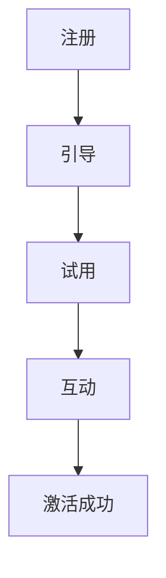

                 

# 创业公司的用户激活与留存策略

> **关键词：** 用户激活、用户留存、用户体验、数据分析、个性化推荐、案例研究

> **摘要：** 本文将深入探讨创业公司在竞争激烈的市场中如何通过有效的用户激活与留存策略来提升产品竞争力。我们将分析用户激活的基本概念与模型，设计用户激活策略，优化用户体验，利用用户反馈与数据分析，以及实施成功的用户留存策略和综合优化方法。通过案例分析，我们将展示这些策略在现实中的应用，为创业公司提供实用的指导和建议。

## 第一部分：用户激活策略

### 第1章：用户激活的基本概念与模型

#### 1.1 用户激活的定义与重要性

用户激活（User Activation）是指将新用户引导到产品中，使其开始使用产品功能并产生互动的过程。这一阶段是用户生命周期中最关键的一环，直接影响用户是否能够进一步转换成活跃用户。用户激活的重要性在于：

- **建立用户初始印象**：用户在初次使用产品时形成的印象会影响其后续的使用体验和品牌忠诚度。
- **提高用户留存率**：成功的用户激活有助于提高用户留存率，减少用户流失。
- **提升产品市场占有率**：激活的用户能够为产品带来口碑，进一步吸引新用户。

#### 1.2 用户激活的核心模型

用户激活过程通常可以划分为以下几个阶段：

1. **注册阶段**：用户注册成为产品用户，填写必要信息。
2. **引导阶段**：通过引导页面或教程，帮助用户了解产品的基本功能。
3. **试用阶段**：提供试用机会，让用户实际使用产品功能。
4. **互动阶段**：鼓励用户与产品互动，如发布内容、参与讨论等。

这些阶段构成了用户激活的核心模型，以下是该模型的Mermaid流程图：

### 第2章：用户激活策略设计

#### 2.1 用户行为分析

用户行为分析是设计有效用户激活策略的基础。通过分析用户在产品中的行为数据，如点击率、使用时长、转化率等，我们可以识别出哪些功能或操作对用户最有吸引力。以下是用户行为分析的关键步骤：

1. **数据收集**：收集用户在产品中的行为数据。
2. **数据清洗**：处理数据中的噪声和不准确信息。
3. **数据分析**：利用统计方法和机器学习算法，分析用户行为模式。
4. **数据可视化**：通过图表和报告，展示分析结果。

#### 2.2 个性化推荐系统

个性化推荐系统能够根据用户的行为和偏好，向其推荐相关的内容或功能，从而提高用户激活率。以下是构建个性化推荐系统的关键步骤：

1. **用户画像**：根据用户的行为数据，构建用户画像。
2. **内容分类**：对产品中的内容进行分类。
3. **推荐算法**：选择合适的推荐算法，如协同过滤、基于内容的推荐等。
4. **推荐结果评估**：评估推荐系统的效果，不断优化推荐策略。

#### 2.3 互动营销策略

互动营销策略通过鼓励用户与产品互动，提高用户激活率。以下是实施互动营销策略的关键步骤：

1. **设计互动活动**：如问答、投票、竞赛等。
2. **互动渠道选择**：选择合适的互动渠道，如社交媒体、论坛、直播等。
3. **用户反馈**：鼓励用户提供反馈，了解其对产品的意见和建议。
4. **互动效果评估**：评估互动活动的效果，优化互动策略。

#### 2.4 用户成长体系

用户成长体系通过设置等级、徽章、奖励等机制，激励用户持续使用产品。以下是构建用户成长体系的关键步骤：

1. **等级设置**：根据用户行为和贡献，设置不同的等级。
2. **徽章设计**：设计不同的徽章，奖励用户在特定方面的成就。
3. **奖励机制**：提供实际奖励，如优惠券、积分等。
4. **成长路径**：为用户规划清晰的成长路径，引导其逐步提升等级。

### 第3章：用户体验优化

#### 3.1 用户体验设计原则

用户体验设计（UX Design）是提高用户激活率的关键因素。以下是用户体验设计的关键原则：

1. **用户为中心**：设计过程中始终以用户需求为中心。
2. **简洁性**：界面简洁明了，避免冗余信息。
3. **一致性**：保持界面和交互的一致性。
4. **易用性**：确保产品易于使用，降低学习成本。

#### 3.2 软件界面优化

软件界面优化是提高用户体验的重要环节。以下是软件界面优化的关键步骤：

1. **界面布局**：合理规划界面布局，确保信息层次分明。
2. **色彩搭配**：选择合适的色彩搭配，提升视觉体验。
3. **图标设计**：设计简洁、直观的图标，便于用户理解。
4. **动画效果**：适度使用动画效果，提升交互体验。

#### 3.3 性能优化与响应时间

性能优化与响应时间是影响用户体验的重要因素。以下是性能优化与响应时间优化的关键步骤：

1. **代码优化**：优化代码，提高执行效率。
2. **资源压缩**：压缩图片、CSS、JS等资源，减少加载时间。
3. **缓存策略**：合理设置缓存策略，提高页面加载速度。
4. **服务器优化**：优化服务器配置，提高处理能力。

### 第4章：用户反馈与数据分析

#### 4.1 用户反馈机制

用户反馈机制是了解用户需求和改进产品的重要途径。以下是建立用户反馈机制的关键步骤：

1. **反馈渠道**：提供多种反馈渠道，如在线表单、论坛、社交媒体等。
2. **反馈处理**：及时处理用户反馈，回应用户需求。
3. **反馈统计**：收集和统计用户反馈，识别问题所在。
4. **反馈分析**：分析用户反馈，为产品改进提供依据。

#### 4.2 数据分析工具与指标

数据分析工具与指标是评估用户激活效果的重要手段。以下是常用的数据分析工具与指标：

1. **数据分析工具**：如Google Analytics、Mixpanel、Segment等。
2. **激活率（Activation Rate）**：新用户在一定时间内完成指定行为的比例。
3. **留存率（Retention Rate）**：在一定时间内，用户重复使用产品的比例。
4. **用户流失率（Churn Rate）**：在一定时间内，停止使用产品的用户比例。

### 第5章：案例研究：用户激活策略实战

#### 5.1 案例一：某电子商务平台

某电子商务平台通过以下策略提高了用户激活率：

1. **注册奖励**：新用户注册后，赠送优惠券和积分。
2. **引导教程**：提供详细的引导教程，帮助用户快速了解产品功能。
3. **个性化推荐**：利用个性化推荐系统，向用户推荐相关商品。
4. **互动活动**：定期举办互动活动，如问答、抽奖等，提高用户参与度。

通过这些策略，该平台的用户激活率提高了30%。

#### 5.2 案例二：某在线教育平台

某在线教育平台通过以下策略提高了用户激活率：

1. **免费试用**：新用户可以免费试用课程，体验教学效果。
2. **用户成长体系**：设置等级和徽章，激励用户持续学习。
3. **个性化推荐**：根据用户学习记录，推荐相关课程。
4. **互动讨论**：提供在线讨论区，鼓励用户分享学习心得。

通过这些策略，该平台的用户激活率提高了25%。

## 第二部分：用户留存策略

### 第6章：用户留存的核心策略

#### 6.1 用户留存率的定义与重要性

用户留存率（Retention Rate）是指在一定时间内，用户重复使用产品的比例。用户留存率是衡量产品受欢迎程度和用户满意度的重要指标，其重要性在于：

- **降低用户流失**：高留存率意味着用户对产品满意度高，减少了用户流失。
- **增加用户生命周期价值**：用户留存时间越长，其价值越大。
- **提升品牌忠诚度**：用户对产品的忠诚度越高，越可能推荐给他人。

#### 6.2 用户留存的核心策略

用户留存策略的核心在于识别并解决用户流失的原因，以下是几个关键策略：

1. **优化用户体验**：通过不断改进产品设计，提高用户体验。
2. **提供优质内容**：提供有价值的内容，满足用户需求。
3. **加强用户互动**：建立用户社群，促进用户间的互动。
4. **实施激励措施**：提供优惠券、积分等激励措施，鼓励用户持续使用产品。

### 第7章：提高用户留存的方法

#### 7.1 内容营销策略

内容营销策略通过提供有价值的内容，吸引用户持续关注和使用产品。以下是实施内容营销策略的关键步骤：

1. **内容策划**：根据用户需求，策划有价值的内容。
2. **内容创作**：创作高质量、专业的内容，提升用户满意度。
3. **内容发布**：定期发布内容，保持用户关注度。
4. **内容推广**：通过社交媒体、邮件营销等渠道，推广内容。

#### 7.2 用户社群建设

用户社群建设是提高用户留存率的有效方法。以下是建设用户社群的关键步骤：

1. **社群定位**：明确社群的目标和定位，吸引目标用户加入。
2. **社群运营**：定期组织活动，促进用户间的互动和交流。
3. **社群管理**：维护社群秩序，确保用户满意度。
4. **社群价值**：为用户提供价值，使其愿意长期参与社群。

#### 7.3 激励措施与优惠活动

激励措施与优惠活动是提高用户留存率的重要手段。以下是实施激励措施与优惠活动的关键步骤：

1. **奖励机制**：设置等级和徽章，奖励用户在特定方面的成就。
2. **优惠活动**：定期举办优惠活动，如限时折扣、免费试用等，吸引用户参与。
3. **互动激励**：通过互动活动，激励用户持续参与产品。
4. **个性化优惠**：根据用户行为和偏好，提供个性化的优惠。

### 第8章：用户生命周期管理

#### 8.1 用户生命周期各阶段的策略

用户生命周期管理是根据用户在产品中的不同阶段，制定相应的策略，以提高用户留存率。以下是用户生命周期各阶段的策略：

1. **新用户阶段**：提供引导教程、优惠活动等，帮助用户快速上手。
2. **活跃用户阶段**：通过内容营销、用户社群等策略，提高用户满意度。
3. **忠诚用户阶段**：提供个性化服务、忠诚度计划等，增强用户忠诚度。
4. **流失用户阶段**：通过挽回策略，尝试将流失用户重新激活。

#### 8.2 用户画像与精准营销

用户画像（User Profile）是了解用户特征和需求的重要工具。通过构建用户画像，可以进行精准营销，提高用户留存率。以下是构建用户画像的关键步骤：

1. **数据收集**：收集用户行为数据、兴趣爱好等。
2. **数据分析**：分析用户数据，识别用户特征和需求。
3. **画像构建**：根据分析结果，构建用户画像。
4. **精准营销**：利用用户画像，进行精准内容推送和优惠活动。

### 第9章：用户忠诚度与品牌建设

#### 9.1 用户忠诚度的定义与衡量

用户忠诚度（Customer Loyalty）是指用户对产品的长期喜爱和信任程度。衡量用户忠诚度的关键指标包括：

- **重复购买率**：用户在一定时间内重复购买产品的比例。
- **推荐意愿**：用户愿意向他人推荐产品的意愿。
- **使用频率**：用户在一定时间内使用产品的频率。

#### 9.2 品牌建设在用户留存中的作用

品牌建设在用户留存中起着至关重要的作用。以下是品牌建设在用户留存中的作用：

1. **建立品牌认知**：通过广告宣传、口碑传播等手段，提高品牌知名度。
2. **提升品牌形象**：通过高质量的产品和服务，树立良好的品牌形象。
3. **增强用户信任**：建立信任关系，使用户对品牌产生依赖。
4. **促进用户留存**：品牌认知和信任关系有助于提高用户留存率。

### 第10章：案例研究：用户留存策略实战

#### 10.1 案例一：某社交媒体平台

某社交媒体平台通过以下策略提高了用户留存率：

1. **内容多样化**：提供丰富多样的内容，满足用户不同需求。
2. **用户互动**：鼓励用户参与评论、点赞、分享等互动行为。
3. **个性化推荐**：根据用户兴趣和行为，推荐相关内容。
4. **社群建设**：建立用户社群，促进用户间的互动。

通过这些策略，该平台的用户留存率提高了20%。

#### 10.2 案例二：某金融科技公司

某金融科技公司通过以下策略提高了用户留存率：

1. **用户教育**：提供金融知识教育，帮助用户了解产品。
2. **个性化服务**：根据用户需求和偏好，提供个性化的金融服务。
3. **奖励机制**：设置积分和奖励，激励用户持续使用产品。
4. **客户关怀**：通过电话、邮件等方式，与用户保持沟通，了解用户需求。

通过这些策略，该公司的用户留存率提高了25%。

## 第三部分：综合策略与优化

### 第11章：多渠道用户激活与留存策略

#### 11.1 社交媒体营销

社交媒体营销是通过社交媒体平台推广产品，提高用户激活与留存率。以下是实施社交媒体营销的关键步骤：

1. **平台选择**：根据目标用户，选择合适的社交媒体平台。
2. **内容策划**：创作有价值、有趣的内容，吸引用户关注。
3. **互动推广**：通过互动活动，提高用户参与度。
4. **数据分析**：分析社交媒体营销效果，优化推广策略。

#### 11.2 广告投放策略

广告投放策略是通过投放广告，吸引潜在用户，提高用户激活与留存率。以下是实施广告投放策略的关键步骤：

1. **目标定位**：明确广告投放的目标用户。
2. **广告创意**：设计有吸引力的广告创意，提高点击率。
3. **渠道选择**：选择合适的广告投放渠道，如Google Ads、Facebook Ads等。
4. **效果评估**：评估广告投放效果，优化投放策略。

#### 11.3 客户服务与支持

客户服务与支持是提高用户满意度和留存率的重要环节。以下是提供优质客户服务与支持的关键步骤：

1. **服务渠道**：提供多种服务渠道，如在线客服、电话客服等。
2. **快速响应**：及时响应用户问题，提供有效解决方案。
3. **知识库建设**：建立用户知识库，提供常见问题解答。
4. **服务优化**：不断优化服务流程，提高服务效率。

### 第12章：数据驱动策略优化

#### 12.1 数据驱动决策

数据驱动决策是通过分析数据，指导产品开发和运营策略。以下是实施数据驱动决策的关键步骤：

1. **数据收集**：收集用户行为数据、市场数据等。
2. **数据分析**：利用数据分析工具，分析数据，识别问题。
3. **数据可视化**：通过图表和报告，展示分析结果。
4. **决策制定**：根据分析结果，制定产品开发和运营策略。

#### 12.2 A/B测试与实验设计

A/B测试与实验设计是通过对比实验，验证产品改进效果。以下是实施A/B测试与实验设计的步骤：

1. **实验目标**：明确实验目标，如提高点击率、提升留存率等。
2. **实验设计**：设计实验方案，包括实验组和对照组。
3. **数据收集**：收集实验数据，分析实验效果。
4. **结果评估**：评估实验结果，优化产品设计和策略。

#### 12.3 基于用户行为的个性化推荐

基于用户行为的个性化推荐是通过分析用户行为数据，为用户推荐相关内容或产品。以下是实施基于用户行为的个性化推荐的关键步骤：

1. **用户画像**：根据用户行为数据，构建用户画像。
2. **推荐算法**：选择合适的推荐算法，如协同过滤、基于内容的推荐等。
3. **推荐结果**：生成个性化推荐结果，推送给用户。
4. **效果评估**：评估推荐效果，优化推荐策略。

### 第13章：持续优化与迭代

#### 13.1 用户留存策略的反馈机制

用户留存策略的反馈机制是通过收集用户反馈，不断优化产品设计和运营策略。以下是建立用户留存策略反馈机制的关键步骤：

1. **反馈渠道**：提供多种反馈渠道，如在线表单、社交媒体等。
2. **反馈处理**：及时处理用户反馈，回应用户需求。
3. **反馈统计**：收集和统计用户反馈，识别问题。
4. **反馈分析**：分析用户反馈，为产品改进提供依据。

#### 13.2 优化与迭代的方法

优化与迭代是通过不断改进产品设计和运营策略，提高用户留存率。以下是优化与迭代的方法：

1. **定期评估**：定期评估用户留存策略效果，识别问题。
2. **数据分析**：利用数据分析，找出问题根源。
3. **A/B测试**：通过A/B测试，验证改进方案的效果。
4. **持续迭代**：根据评估和测试结果，不断优化产品设计和策略。

#### 13.3 用户留存策略的可持续性

用户留存策略的可持续性是通过长期有效的策略，保持用户留存率。以下是保持用户留存策略可持续性的关键步骤：

1. **持续改进**：不断优化产品设计和运营策略，提高用户体验。
2. **数据分析**：利用数据分析，了解用户需求和偏好，调整策略。
3. **用户参与**：鼓励用户参与产品改进，提高用户满意度。
4. **品牌建设**：通过品牌建设，增强用户对品牌的信任和忠诚度。

## 附录

### 附录A：用户激活与留存策略工具与资源

#### A.1 常用工具介绍

- **Google Analytics**：分析用户行为数据的强大工具。
- **Mixpanel**：用户行为分析和用户留存跟踪工具。
- **Segment**：数据集成和分析平台。
- **Userbot**：自动化用户反馈收集和分析工具。

#### A.2 数据分析工具推荐

- **Tableau**：数据可视化工具。
- **Power BI**：商业智能和分析工具。
- **Google Data Studio**：数据报告和可视化工具。

#### A.3 网络营销资源

- **HubSpot**：网络营销和客户关系管理平台。
- **Mailchimp**：邮件营销工具。
- **Unsplash**：免费高质量图片资源。

### 附录B：核心算法原理与公式

#### B.1 个性化推荐算法原理

个性化推荐算法通过分析用户行为和偏好，为用户推荐相关内容或产品。以下是常见的个性化推荐算法：

1. **协同过滤**：
    - **用户基于的协同过滤（User-Based Collaborative Filtering）**：
        $$ \text{推荐评分} = \frac{\sum_{\text{邻居用户}} \text{邻居用户评分} \times \text{邻居用户与目标用户的相似度}}{\sum_{\text{邻居用户}} \text{邻居用户与目标用户的相似度}} $$
    - **物品基于的协同过滤（Item-Based Collaborative Filtering）**：
        $$ \text{相似度} = \frac{\text{共同评分的物品数量}}{\text{用户A的评分物品数量} + \text{用户B的评分物品数量} - 1} $$

2. **基于内容的推荐**：
    - **内容相似度计算**：
        $$ \text{内容相似度} = \frac{\text{共同特征的权重之和}}{\text{特征总权重之和}} $$

#### B.2 用户行为分析公式

1. **用户留存率**：
    $$ \text{留存率} = \frac{\text{留存用户数}}{\text{总用户数}} $$

2. **用户流失率**：
    $$ \text{流失率} = \frac{\text{流失用户数}}{\text{总用户数}} $$

3. **生命周期价值（LTV）**：
    $$ \text{LTV} = \text{预期利润} \times \text{预期使用年限} $$

#### B.3 生命周期价值计算

1. **用户价值（Customer Value）**：
    $$ \text{用户价值} = \text{每次消费的平均价值} \times \text{消费频率} $$

2. **预期使用年限（Expected Life Time）**：
    $$ \text{预期使用年限} = \frac{\text{总使用时间}}{\text{每年使用次数}} $$

3. **LTV计算**：
    $$ \text{LTV} = \text{用户价值} \times \text{预期使用年限} $$

通过以上附录，读者可以更好地理解用户激活与留存策略的核心算法和公式，为实际应用提供指导。

## 作者

**作者：AI天才研究院/AI Genius Institute & 禅与计算机程序设计艺术 /Zen And The Art of Computer Programming**

本文由AI天才研究院与禅与计算机程序设计艺术联合撰写，旨在为创业公司提供实用的用户激活与留存策略指导。希望通过本文，读者能够深入理解用户激活与留存的核心概念、策略和方法，为产品的发展和市场的拓展提供有力支持。如果您有任何疑问或建议，欢迎在评论区留言，我们将竭诚为您解答。

