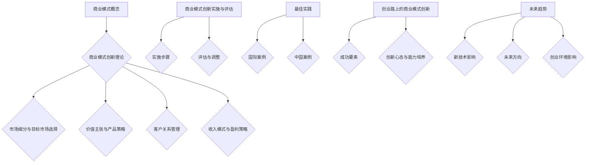

                 

### 《创业路上的商业模式创新：如何脱颖而出》

> **关键词**：商业模式、创新、创业、策略、实施、成功案例

> **摘要**：本文旨在探讨创业过程中的商业模式创新，分析其在市场细分、价值主张、客户关系管理、收入模式与盈利策略等方面的策略与方法，通过成功案例展示商业模式创新的实践路径，帮助创业者实现商业模式的脱颖而出。

### 引言与基础

#### 第1章：商业模式概述

##### 1.1 商业模式的定义与重要性

商业模式（Business Model）是一个组织或企业在市场中运营和盈利的方式。它涵盖了企业如何创造价值、传递价值以及获取价值的过程。一个成功的商业模式不仅决定了企业的生存和发展，还直接影响了企业的竞争力和盈利能力。

在创业过程中，商业模式的重要性不言而喻。它为创业者提供了一个清晰的盈利模式和战略方向，帮助他们在激烈的市场竞争中脱颖而出。创业初期的资源有限，商业模式的有效性直接决定了企业的成长速度和盈利能力。

##### 1.2 商业模式的组成部分

一个完整的商业模式包括以下几个关键组成部分：

1. **价值主张（Value Proposition）**：企业为客户提供的价值和利益，是商业模式的核心。
2. **客户细分（Customer Segments）**：企业目标市场的细分，了解不同客户群体的需求和行为。
3. **渠道（Channels）**：企业如何将价值主张传递给客户，包括直销、分销、在线销售等。
4. **客户关系（Customer Relationships）**：企业与客户建立的关系类型，如个人销售、自助服务、特许经营等。
5. **收入来源（Revenue Streams）**：企业从客户那里获得收入的途径，如订阅费、一次性购买等。
6. **关键资源（Key Resources）**：企业运营所需的资产，包括资金、人员、技术、品牌等。
7. **关键活动（Key Activities）**：企业核心业务运营的活动，如生产、营销、销售、服务等。
8. **合作伙伴网络（Partner Network）**：企业与外部合作伙伴的关系，包括供应商、分销商、客户等。
9. **成本结构（Cost Structure）**：企业运营的成本构成，包括固定成本、可变成本等。

##### 1.3 商业模式的发展历程

商业模式的发展经历了几个重要阶段：

1. **传统商业模式**：以产品为中心，注重成本控制和规模化生产。
2. **互联网商业模式**：利用互联网技术，实现信息的高效传递和服务的个性化。
3. **平台商业模式**：以平台为核心，连接供需两端，实现资源共享和协同效应。
4. **共享经济商业模式**：利用闲置资源，实现资源的共享和优化利用。

随着新兴技术的不断涌现，商业模式也在不断演变和创新。未来，创业者需要更加关注用户体验、数据驱动和创新能力的培养，以适应市场的变化。

#### 第2章：商业模式创新的理论与实践

##### 2.1 商业模式创新的理论框架

商业模式创新是一个系统性、多层次的过程，涉及多个方面的理论和方法。以下是一个常见的商业模式创新理论框架：

1. **价值网络（Value Network）**：分析企业所处的产业链和价值链，识别价值创造的环节和机会。
2. **商业模式画布（Business Model Canvas）**：一种可视化工具，用于描述商业模式的各个组成部分和它们之间的关系。
3. **价值主张设计（Value Proposition Design）**：通过用户研究，理解客户需求，设计能够满足客户需求的价值主张。
4. **商业模式设计（Business Model Design）**：在画布的基础上，制定具体的商业模式策略。
5. **商业模式实施（Business Model Implementation）**：将设计好的商业模式付诸实践，并进行调整和优化。

##### 2.2 商业模式创新的方法论

1. **市场细分与定位**：通过市场细分，识别目标客户群体，进行精准定位。
2. **价值主张创新**：通过技术创新和服务创新，创造独特的价值主张。
3. **收入模式创新**：探索新的收入来源和盈利方式，提高盈利能力。
4. **成本结构优化**：通过流程优化和资源配置，降低运营成本。
5. **合作伙伴关系构建**：建立与供应商、分销商、客户等合作伙伴的良好关系，实现资源共享和协同发展。

##### 2.3 成功案例分析

1. **案例一：Airbnb**：通过共享经济模式，将闲置房源转化为盈利渠道，实现商业模式的创新。
2. **案例二：滴滴出行**：利用互联网技术和大数据分析，优化出行服务，提升用户体验。
3. **案例三：微信**：通过社交平台的运营，实现从社交到电商、支付的多元化收入模式。

这些成功案例展示了不同类型的商业模式创新路径，为创业者提供了有益的启示和借鉴。

### 第二部分：商业模式创新的策略与方法

#### 第3章：市场细分与目标市场选择

##### 3.1 市场细分的方法

市场细分是商业模式创新的重要步骤，有助于企业更好地满足不同客户群体的需求。以下是一些常用的市场细分方法：

1. **地理细分**：根据客户所在的地理位置进行细分，如城市、地区、国家等。
2. **人口细分**：根据客户的年龄、性别、收入、职业等人口统计特征进行细分。
3. **心理细分**：根据客户的心理特征、生活方式、价值观等心理因素进行细分。
4. **行为细分**：根据客户的行为特征、购买习惯、使用情况等行为因素进行细分。

##### 3.2 目标市场选择策略

在市场细分的基础上，企业需要选择一个或多个具有潜力和竞争优势的目标市场。以下是一些常见的目标市场选择策略：

1. **集中化策略**：专注于一个细分市场，提供定制化的产品或服务。
2. **差异化策略**：在多个细分市场中提供独特的价值主张，满足不同客户群体的需求。
3. **低成本策略**：通过降低成本，提供价格优势，吸引价格敏感的客户群体。
4. **高附加值策略**：通过提供高质量的产品或服务，满足高端客户的需求。

##### 3.3 成功案例分析

1. **案例一：苹果公司**：通过心理和行为细分，针对高端客户群体，提供高品质、高附加值的科技产品。
2. **案例二：小米公司**：通过人口和地理细分，专注于年轻、科技爱好者的目标市场，提供性价比高的智能硬件。

这些成功案例展示了市场细分和目标市场选择在商业模式创新中的重要性。

#### 第4章：价值主张与产品策略

##### 4.1 价值主张的创建

价值主张是商业模式的核心组成部分，它定义了企业为客户创造的价值和利益。以下是一些创建价值主张的方法：

1. **用户研究**：通过用户访谈、问卷调查、用户画像等手段，了解客户的需求和痛点。
2. **竞争分析**：分析竞争对手的价值主张，识别差异化和创新的机会。
3. **共创**：与客户共同探讨和设计价值主张，确保其符合客户期望和需求。

##### 4.2 产品策略制定

产品策略是确保价值主张实现的关键，以下是一些常见的制定产品策略的方法：

1. **产品功能定位**：明确产品的主要功能，确保其与价值主张一致。
2. **产品设计**：通过用户体验设计，提升产品的易用性和用户满意度。
3. **产品迭代**：持续优化产品，根据用户反馈和市场变化进行调整。

##### 4.3 成功案例分析

1. **案例一：特斯拉**：通过技术创新和用户体验设计，提供高品质的电动汽车，满足环保和性能需求。
2. **案例二：亚马逊**：通过精准推荐和个性化服务，提升用户的购物体验，增强用户粘性。

这些成功案例展示了价值主张和产品策略在商业模式创新中的重要性。

#### 第5章：客户关系管理

##### 5.1 客户关系管理的重要性

客户关系管理（CRM）是商业模式创新的重要环节，它关系到企业的长期发展和客户满意度。以下是客户关系管理的重要性：

1. **提升客户满意度**：通过有效管理客户关系，提供优质的客户服务，提升客户满意度。
2. **增强客户粘性**：通过持续的客户互动和关怀，增强客户的忠诚度和复购率。
3. **降低客户流失率**：通过预防性维护和问题解决，降低客户流失率，减少客户成本。
4. **挖掘潜在客户**：通过客户数据分析，识别潜在客户，实现精准营销。

##### 5.2 客户关系管理的策略与方法

1. **个性化服务**：根据客户特征和需求，提供个性化的产品和服务，满足客户的个性化需求。
2. **客户互动**：通过社交媒体、电子邮件、短信等方式，与客户保持持续互动，提升客户体验。
3. **客户关怀**：在客户生命周期各个阶段，提供关怀和支持，增强客户忠诚度。
4. **客户反馈**：及时收集和分析客户反馈，优化产品和服务，提升客户满意度。

##### 5.3 成功案例分析

1. **案例一：亚马逊**：通过精准推荐和个性化服务，提升用户的购物体验，增强用户粘性。
2. **案例二：苹果公司**：通过优质的售后服务和客户关怀，赢得客户的忠诚和口碑。

这些成功案例展示了客户关系管理在商业模式创新中的重要性。

#### 第6章：收入模式与盈利策略

##### 6.1 收入模式的种类

收入模式是商业模式的核心组成部分，决定了企业如何从客户那里获取收入。以下是一些常见的收入模式：

1. **产品销售**：通过销售实体或虚拟产品获得收入。
2. **订阅服务**：通过订阅模式，定期向客户提供产品或服务，如SaaS（软件即服务）。
3. **广告收入**：通过展示广告或推广广告，获得广告主的费用。
4. **交易费**：通过交易过程，向交易双方收取费用，如电商平台的交易费。
5. **服务收费**：通过提供专业服务，如咨询、培训等，获得收入。

##### 6.2 盈利策略的制定

盈利策略是企业实现可持续盈利的关键，以下是一些常见的盈利策略：

1. **成本领先**：通过降低生产成本，实现低价竞争，获取市场份额。
2. **差异化**：通过提供独特的价值主张，打造品牌形象，实现高溢价。
3. **细分市场**：专注于特定细分市场，提供定制化产品或服务，获得高利润。
4. **网络效应**：通过平台模式，利用用户规模和协同效应，实现盈利。

##### 6.3 成功案例分析

1. **案例一：腾讯**：通过广告收入、游戏收入和金融科技收入等多种模式，实现多元化盈利。
2. **案例二：美团**：通过交易费和广告收入，实现稳定盈利。

这些成功案例展示了收入模式与盈利策略在商业模式创新中的重要性。

#### 第三部分：商业模式创新的实施与评估

##### 第7章：商业模式创新的实施步骤

##### 7.1 制定实施计划

商业模式创新的实施计划是企业将创新理念转化为实际运营的关键步骤。以下是制定实施计划的步骤：

1. **明确目标**：确定商业模式创新的目标和预期成果，如市场份额、收入增长等。
2. **资源评估**：评估企业现有资源，包括资金、人员、技术等，确保资源充足。
3. **风险分析**：识别商业模式创新过程中可能面临的风险，制定应对策略。
4. **时间规划**：制定详细的时间规划，确保各项任务按时完成。

##### 7.2 资源配置与组织调整

资源配置与组织调整是商业模式创新成功的关键。以下是资源配置与组织调整的步骤：

1. **人员调配**：根据商业模式创新的需求，调整团队结构，确保关键岗位有合适的人选。
2. **技术支持**：确保技术团队有能力支持商业模式创新，包括技术研发、系统升级等。
3. **资源配置**：合理配置企业资源，包括资金、设备、供应链等，确保创新项目顺利进行。
4. **组织文化**：建立创新文化，鼓励员工积极参与商业模式创新，提升企业的创新能力。

##### 7.3 实施过程中的风险与挑战

在商业模式创新过程中，企业可能会面临以下风险和挑战：

1. **市场风险**：市场需求的变化可能影响商业模式创新的成效。
2. **技术风险**：技术创新的不确定性和技术瓶颈可能阻碍创新项目的实施。
3. **资源风险**：资源不足或资源配置不合理可能导致创新项目延误或失败。
4. **管理风险**：管理不善可能导致创新项目缺乏执行力或资源浪费。

企业需要提前识别和应对这些风险，以确保商业模式创新的成功。

##### 第8章：商业模式创新的评估与调整

##### 8.1 评估商业模式创新的效果

评估商业模式创新的效果是衡量创新成果的重要步骤。以下是评估商业模式创新效果的指标和方法：

1. **关键绩效指标（KPI）**：设定具体的关键绩效指标，如收入增长、市场份额、客户满意度等，定期跟踪和评估。
2. **用户反馈**：通过用户调查、访谈等方式，收集用户对商业模式创新的反馈，了解用户满意度。
3. **市场表现**：分析商业模式创新在市场中的表现，如销售额、市场份额等。
4. **财务分析**：通过财务报表分析商业模式创新的盈利能力，如收入、利润、成本等。

##### 8.2 商业模式调整的方法与策略

在评估过程中，如果发现商业模式创新效果不佳，企业需要及时进行调整。以下是商业模式调整的方法与策略：

1. **优化价值主张**：根据用户反馈和市场变化，调整价值主张，确保其与用户需求和市场趋势相符。
2. **调整收入模式**：探索新的收入来源和盈利方式，提高商业模式的多渠道盈利能力。
3. **优化成本结构**：通过流程优化和资源配置，降低运营成本，提高盈利能力。
4. **合作伙伴关系**：调整与合作伙伴的关系，建立更加紧密的合作，实现资源共享和协同发展。

##### 8.3 成功案例分析

1. **案例一：阿里巴巴**：通过不断调整和优化商业模式，从电子商务到云计算，实现多元化发展。
2. **案例二：华为**：通过持续创新和调整，在通信设备领域保持竞争优势。

这些成功案例展示了商业模式评估与调整在持续创新中的重要性。

##### 第9章：商业模式创新的最佳实践

##### 9.1 国际企业商业模式创新案例

在国际企业中，有许多成功的商业模式创新案例，以下是一些典型例子：

1. **亚马逊**：通过电商平台的创新，从在线书店发展成为全球最大的电子商务公司。
2. **微软**：通过云计算和AI技术的创新，实现从传统软件公司到云计算服务提供商的转型。
3. **苹果**：通过智能设备和生态系统的创新，建立强大的品牌影响力，实现持续增长。

这些案例展示了国际企业在商业模式创新中的成功经验。

##### 9.2 中国企业商业模式创新案例

在中国，随着互联网和科技的发展，许多企业通过商业模式创新实现了快速发展。以下是一些典型案例：

1. **阿里巴巴**：通过电商、云计算、金融等多元化业务，构建了强大的商业帝国。
2. **腾讯**：通过社交、游戏、广告等多元化业务，成为中国最大的互联网公司之一。
3. **字节跳动**：通过短视频、信息流广告等创新业务，迅速崛起为全球科技巨头。

这些案例展示了中国企业在商业模式创新中的活力和潜力。

##### 9.3 成功案例分析与启示

通过对国际企业和中国企业商业模式创新案例的分析，可以得出以下启示：

1. **紧跟市场趋势**：企业需要密切关注市场变化，紧跟市场趋势，及时调整商业模式。
2. **创新价值主张**：通过创新价值主张，满足客户需求，提升客户满意度。
3. **多元化发展**：通过多元化业务和跨行业合作，实现业务拓展和盈利能力的提升。
4. **持续创新**：企业需要持续投入研发和创新，保持竞争优势。

这些启示为创业者提供了宝贵的经验。

##### 第四部分：结论与展望

##### 第10章：创业路上的商业模式创新

创业成功的关键在于商业模式创新，以下是创业者在创业过程中需要注意的几个方面：

1. **明确目标**：确定创业目标和愿景，确保商业模式与目标一致。
2. **市场研究**：深入了解市场趋势和用户需求，制定符合市场需求的商业模式。
3. **资源整合**：整合企业内外部资源，确保商业模式创新有足够的资源支持。
4. **持续迭代**：不断优化商业模式，根据市场变化和用户反馈进行调整。

##### 10.1 创业成功的商业模式要素

一个成功的商业模式需要具备以下几个要素：

1. **明确的价值主张**：清晰定义企业为客户创造的价值和利益。
2. **精准的目标市场**：明确目标市场，提供符合市场需求的产品和服务。
3. **创新的收入模式**：探索新的收入来源和盈利方式，提高盈利能力。
4. **高效的运营体系**：建立高效的运营体系，降低成本，提高效率。

##### 10.2 创业过程中的商业模式创新

创业过程中的商业模式创新是一个持续迭代的过程，需要创业者具备以下能力：

1. **市场洞察力**：敏锐捕捉市场趋势和用户需求，及时调整商业模式。
2. **创新能力**：持续投入研发和创新，提供独特的价值主张。
3. **执行力**：确保商业模式创新方案能够得到有效执行。
4. **适应力**：在市场变化中迅速调整和应对，保持竞争优势。

##### 10.3 创业者的心态与能力培养

创业者的心态和能力对商业模式创新至关重要，以下是一些建议：

1. **保持乐观**：面对困难和挑战，保持积极乐观的心态。
2. **学习成长**：不断学习新知识，提升个人能力和专业素养。
3. **勇于尝试**：敢于冒险，勇于尝试新的商业模式和创新方法。
4. **团队合作**：培养团队合作精神，发挥团队的力量。

通过培养这些心态和能力，创业者可以更好地应对创业过程中的挑战，实现商业模式的成功创新。

##### 第11章：未来商业模式创新趋势

##### 11.1 新兴技术对商业模式的影响

随着新兴技术的不断涌现，商业模式也在发生深刻变革。以下是新兴技术对商业模式的影响：

1. **人工智能**：通过人工智能技术，企业可以实现精准营销、智能客服、个性化推荐等功能，提升用户体验和运营效率。
2. **区块链**：区块链技术为商业模式提供了去中心化、透明化的解决方案，有助于构建信任和降低交易成本。
3. **物联网**：物联网技术使得设备之间实现智能连接，为企业提供了新的业务模式和盈利机会。
4. **大数据**：大数据技术为企业提供了强大的数据分析能力，有助于洞察市场趋势和用户需求，优化商业模式。

##### 11.2 商业模式创新的未来方向

未来商业模式创新将朝着以下几个方向演进：

1. **平台化**：企业将更多关注构建平台，连接供需两端，实现资源共享和协同发展。
2. **服务化**：从产品导向转向服务导向，提供全方位的解决方案，提升客户价值和满意度。
3. **生态化**：构建企业生态，与合作伙伴共同创新，实现跨界合作和生态共赢。
4. **全球化**：随着全球化进程的加快，企业将更多关注国际市场，拓展全球业务。

##### 11.3 中国创业环境对商业模式创新的影响

中国创业环境的不断优化，为商业模式创新提供了有利条件。以下是创业环境对商业模式创新的影响：

1. **政策支持**：政府出台了一系列支持创业和创新的政策，为创业者提供了资金、技术、人才等方面的支持。
2. **市场机会**：中国庞大的人口基数和多样化的市场需求，为商业模式创新提供了丰富的机会。
3. **创新氛围**：随着创新文化的普及，创业者更加注重创新和创业，形成了良好的创新氛围。
4. **产业链完善**：完善的产业链体系为企业提供了丰富的合作伙伴和资源，有助于商业模式创新。

通过充分利用中国创业环境的有利条件，创业者可以更好地实现商业模式的创新。

### 附录

#### 附录A：商业模式创新工具与方法简介

附录A将介绍几种常用的商业模式创新工具与方法，包括：

1. **商业模式画布**：一种可视化的工具，用于描述商业模式的各个组成部分。
2. **价值网络分析**：用于分析企业所处的产业链和价值链，识别价值创造的环节和机会。
3. **精益创业**：一种敏捷创业方法，强调快速迭代和用户反馈，以验证和优化商业模式的可行性。

#### 附录B：商业模式画布模板与应用

附录B提供了一个商业模式画布的模板，并介绍了如何应用该模板进行商业模式创新。通过填写和调整画布中的各个部分，创业者可以系统地分析和优化自己的商业模式。

#### 附录C：参考资料与推荐阅读

附录C列出了一些与商业模式创新相关的参考资料和推荐阅读，包括经典商业管理书籍、学术论文、成功案例研究等。这些资料为创业者提供了深入学习和实践商业模式创新的重要资源。

### 结束语

创业路上的商业模式创新是创业者实现成功的关键。通过深入分析商业模式创新的策略与方法，创业者可以更好地理解市场需求，优化商业模型，实现商业模式的脱颖而出。本文旨在为创业者提供有价值的指导和启示，帮助他们在创业过程中取得成功。

### 作者信息

**作者：** AI天才研究院 / AI Genius Institute & 禅与计算机程序设计艺术 / Zen And The Art of Computer Programming

### Mermaid 流程图示例



### 核心算法原理讲解（伪代码示例）

```python
# 伪代码：市场细分算法
def market_segmentation(data):
    # 数据预处理
    preprocess_data(data)
    
    # 特征工程
    features = extract_features(data)
    
    # 建立聚类模型
    clustering_model = KMeans(n_clusters=k, init='k-means++', n_init=10)
    
    # 运行聚类模型
    clusters = clustering_model.fit_predict(features)
    
    # 分析结果
    analyze_results(clusters, data)
    
    return clusters
```

### 数学模型和数学公式（LaTeX格式）

```latex
\section{收益模型}

假设企业采用某种商业模式后，月收入为 \( R \)，月成本为 \( C \)，月利润为 \( P \)。

\begin{equation}
P = R - C
\end{equation}

若企业考虑扩展规模，则月收入和月成本分别为 \( R' \) 和 \( C' \)。

\begin{equation}
P' = R' - C'
\end{equation}

扩展规模后的利润提升为：

\begin{equation}
\Delta P = P' - P
\end{equation}
```

### 项目实战

#### 实战案例：电商平台的会员模式创新

**开发环境搭建：**

- **开发语言**：Python
- **开发工具**：PyCharm
- **数据库**：MySQL
- **消息队列**：RabbitMQ

**源代码实现：**

```python
# 伪代码：会员系统实现
class MembershipSystem:
    def __init__(self, database, queue):
        self.database = database
        self.queue = queue
    
    def enroll_member(self, user):
        # 插入新会员信息到数据库
        self.database.insert_member(user)
        
        # 发送会员注册成功的消息到消息队列
        self.queue.send_message('Member registration success', user)
        
    def upgrade_membership(self, user):
        # 升级会员信息到数据库
        self.database.upgrade_member(user)
        
        # 发送会员升级成功的消息到消息队列
        self.queue.send_message('Membership upgrade success', user)
        
    def analyze_membership_stats(self):
        # 分析会员统计数据
        stats = self.database.get_membership_stats()
        return stats
```

**代码解读与分析：**

1. **会员注册：** `enroll_member` 方法用于会员注册，插入新会员信息到数据库，并发送注册成功的消息到消息队列。
2. **会员升级：** `upgrade_membership` 方法用于会员升级，升级会员信息到数据库，并发送升级成功的消息到消息队列。
3. **会员统计数据分析：** `analyze_membership_stats` 方法用于分析会员统计数据，以便了解会员的活跃度和购买行为。

通过这个会员系统实现，电商企业可以更好地管理会员，提供个性化服务，从而提升用户满意度和粘性。同时，会员数据分析和会员升级策略可以为企业带来更高的利润。

