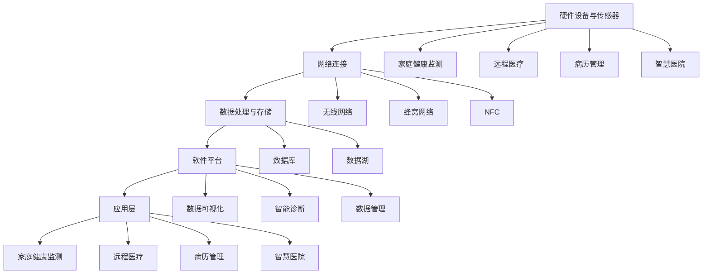

                 

### 《医疗物联网：智慧医疗的创业机会》

关键词：医疗物联网，智慧医疗，创业机会，核心技术，应用实践，政策法规

摘要：本文从医疗物联网的概述、核心技术、应用实践和政策法规四个方面，深入探讨智慧医疗领域的创业机会。通过分析医疗物联网的架构、核心算法原理以及实际项目案例，为创业者提供有价值的指导和建议。

### 第一部分：引言与基础

#### 1.1 本书概述

##### 1.1.1 医疗物联网与智慧医疗

医疗物联网（Internet of Things in Healthcare，IoHT）是将物联网技术应用于医疗领域，通过传感器、设备和网络连接，实现对患者的实时监测、诊断和治疗。智慧医疗（Smart Healthcare）则是指利用信息技术和人工智能，提高医疗服务的效率和质量。

##### 1.1.2 智慧医疗的创业背景与挑战

随着人口老龄化、慢性病增多和医疗资源紧缺，智慧医疗成为了各国政府和企业关注的焦点。然而，智慧医疗的发展面临着诸多挑战，如技术成熟度、数据安全和隐私保护、法律法规等。

##### 1.1.3 书籍目的与读者对象

本书旨在为创业者提供关于医疗物联网和智慧医疗的全面了解，分析核心技术、应用实践和政策法规，探讨创业机会。读者对象包括对医疗物联网和智慧医疗感兴趣的创业者、研发人员和技术人员。

#### 1.2 医疗物联网概述

##### 1.2.1 医疗物联网的概念与组成部分

医疗物联网是指将物联网技术与医疗领域相结合，通过传感器、设备和网络连接，实现对患者健康数据的实时监测、传输和分析。其组成部分包括硬件设备、软件平台、数据管理和通信技术等。

##### 1.2.2 医疗物联网的关键技术

医疗物联网的关键技术包括传感器技术、无线通信技术、软件平台与数据管理、数据分析与挖掘等。

##### 1.2.3 医疗物联网的发展趋势

随着人工智能、大数据和5G等技术的发展，医疗物联网将不断演进，实现更高效、更智能的医疗服务。

#### 1.3 智慧医疗的商业模式

##### 1.3.1 医疗物联网的商业价值

医疗物联网可以提高医疗服务的效率和质量，降低医疗成本，具有巨大的商业价值。

##### 1.3.2 智慧医疗的盈利模式

智慧医疗的盈利模式包括设备销售、数据服务、医疗服务等。

##### 1.3.3 智慧医疗的投资机会

智慧医疗领域蕴藏着丰富的投资机会，投资者可以关注技术创新、市场拓展等方面的项目。

### 第二部分：核心技术

#### 2.1 硬件设备与传感器

##### 2.1.1 常见医疗物联网硬件设备

医疗物联网硬件设备包括可穿戴设备、智能医疗设备、传感器等。

##### 2.1.2 传感器类型与性能指标

传感器类型包括温度传感器、血压传感器、心率传感器等。性能指标包括灵敏度、分辨率、响应时间等。

##### 2.1.3 硬件设备的安全与隐私保护

硬件设备的安全与隐私保护是医疗物联网发展的关键，需要关注数据加密、访问控制等技术。

#### 2.2 软件平台与数据管理

##### 2.2.1 医疗物联网软件平台架构

医疗物联网软件平台包括数据采集、存储、处理和分析等功能。

##### 2.2.2 数据采集、存储与处理

数据采集、存储与处理需要关注数据质量、数据安全和隐私保护等问题。

##### 2.2.3 数据安全与隐私保护策略

数据安全与隐私保护策略包括数据加密、访问控制、隐私计算等。

#### 2.3 连接与通信技术

##### 2.3.1 无线通信技术在医疗物联网中的应用

无线通信技术在医疗物联网中的应用包括WiFi、蓝牙、NFC等。

##### 2.3.2 医疗物联网通信协议与标准

医疗物联网通信协议与标准包括蓝牙5.0、NFC Forum等。

##### 2.3.3 网络安全与数据传输保障

网络安全与数据传输保障是医疗物联网的关键，需要关注数据加密、网络防护等技术。

#### 2.4 数据分析与挖掘

##### 2.4.1 医疗物联网数据类型

医疗物联网数据类型包括结构化数据、非结构化数据等。

##### 2.4.2 数据分析与挖掘方法

数据分析与挖掘方法包括分类、聚类、关联规则等。

##### 2.4.3 智慧医疗的决策支持系统

智慧医疗的决策支持系统包括疾病预测、风险评估等。

#### 2.5 医学影像处理与深度学习

##### 2.5.1 医学影像处理技术

医学影像处理技术包括图像增强、图像分割等。

##### 2.5.2 深度学习在医疗影像中的应用

深度学习在医疗影像中的应用包括图像识别、疾病诊断等。

##### 2.5.3 医学影像处理的挑战与解决方案

医学影像处理的挑战包括数据标注、计算资源等。

### 第三部分：应用实践

#### 3.1 家庭健康监测

##### 3.1.1 智能手环与智能血压计

智能手环与智能血压计是家庭健康监测的重要设备。

##### 3.1.2 智能家居与健康数据整合

智能家居与健康数据的整合可以实现更全面的健康监测。

##### 3.1.3 家庭健康监测系统的实现与案例分析

家庭健康监测系统的实现与案例分析提供了实际操作经验。

#### 3.2 远程医疗与健康管理

##### 3.2.1 远程医疗平台建设

远程医疗平台建设包括视频咨询、远程会诊等功能。

##### 3.2.2 健康管理服务模式

健康管理服务模式包括健康评估、个性化建议等。

##### 3.2.3 远程医疗与健康管理的实际应用案例

远程医疗与健康管理的实际应用案例展示了实际效果。

#### 3.3 病历管理系统与电子健康档案

##### 3.3.1 病历管理系统的功能与架构

病历管理系统的功能与架构包括病历查询、病历创建等。

##### 3.3.2 电子健康档案的应用与挑战

电子健康档案的应用与挑战包括数据共享、隐私保护等。

##### 3.3.3 病历管理系统与电子健康档案的实践案例

病历管理系统与电子健康档案的实践案例提供了实施经验。

#### 3.4 智慧医院与医院智能化

##### 3.4.1 智慧医院的概念与建设

智慧医院的概念与建设包括智能化医疗设备、智慧化服务流程等。

##### 3.4.2 医院智能化技术的应用场景

医院智能化技术的应用场景包括智慧门诊、智慧病房等。

##### 3.4.3 智慧医院的发展趋势与挑战

智慧医院的发展趋势与挑战包括技术创新、政策法规等。

#### 3.5 医疗物联网的创新创业案例

##### 3.5.1 医疗物联网企业的成长路径

医疗物联网企业的成长路径包括技术研发、市场拓展等。

##### 3.5.2 创新创业成功案例分享

创新创业成功案例分享展示了成功经验。

##### 3.5.3 创业者面临的风险与应对策略

创业者面临的风险与应对策略包括技术风险、市场风险等。

### 第四部分：政策与法规

#### 4.1 医疗物联网相关政策

##### 4.1.1 国家级政策与法规

国家级政策与法规对医疗物联网的发展起到了重要推动作用。

##### 4.1.2 地方性政策与法规

地方性政策与法规在推动医疗物联网发展方面也发挥了重要作用。

##### 4.1.3 政策对医疗物联网产业的影响

政策对医疗物联网产业的影响体现在政策支持、市场规范等方面。

#### 4.2 医疗物联网安全法规与标准

##### 4.2.1 数据安全与隐私保护法律法规

数据安全与隐私保护法律法规对医疗物联网的安全保障至关重要。

##### 4.2.2 医疗物联网安全标准体系

医疗物联网安全标准体系包括数据安全、网络安全等方面。

##### 4.2.3 医疗物联网安全合规性评估

医疗物联网安全合规性评估是确保系统安全的重要手段。

#### 4.3 医疗物联网伦理与道德

##### 4.3.1 医疗物联网伦理问题

医疗物联网伦理问题包括隐私保护、数据共享等。

##### 4.3.2 医疗物联网道德规范

医疗物联网道德规范包括尊重患者隐私、合理使用数据等。

##### 4.3.3 医疗物联网伦理道德的实践指南

医疗物联网伦理道德的实践指南为从业人员提供了行为准则。

### 附录

#### 附录 A：医疗物联网开源工具与资源

##### A.1 医疗物联网开源框架与平台

医疗物联网开源框架与平台为开发者提供了丰富的技术支持。

##### A.2 数据分析与挖掘开源工具

数据分析与挖掘开源工具为智慧医疗提供了强大的数据分析能力。

##### A.3 医学影像处理开源库

医学影像处理开源库为医学影像处理提供了便捷的工具。

#### 附录 B：医疗物联网相关组织与会议

##### B.1 医疗物联网专业组织

医疗物联网专业组织为行业交流与合作提供了平台。

##### B.2 医疗物联网相关国际会议

医疗物联网相关国际会议是行业发展趋势的窗口。

##### B.3 国内医疗物联网产业联盟与协会

国内医疗物联网产业联盟与协会在推动产业发展方面发挥了重要作用。

### 核心算法原理讲解

#### 2.4 数据分析与挖掘方法

##### 2.4.1 数据分析与挖掘方法

数据分析与挖掘方法包括分类、聚类、关联规则等。

##### 2.4.2 决策树算法

决策树算法是一种常用的分类算法，基于信息熵和基尼不纯度选择最佳特征进行分割。

##### 2.4.3 支持向量机（SVM）算法

支持向量机是一种常用的分类和回归算法，通过寻找最优超平面实现分类。

#### 2.5 医学影像处理与深度学习

##### 2.5.1 卷积神经网络（CNN）原理

卷积神经网络是一种用于图像识别的深度学习模型，通过卷积层、池化层和全连接层实现图像特征提取和分类。

##### 2.5.2 深度学习在医疗影像中的应用

深度学习在医疗影像中的应用包括图像识别、疾病诊断等，具有很高的准确性和效率。

##### 2.5.3 医学影像处理的挑战与解决方案

医学影像处理的挑战包括数据标注、计算资源等，解决方案包括数据增强、分布式计算等。

### 项目实战

#### 3.3 病历管理系统与电子健康档案

##### 3.3.1 病历管理系统的实现

病历管理系统的实现包括后端开发和前端开发。

##### 3.3.2 病历管理系统功能与架构

病历管理系统功能包括病历查询、创建、更新和删除。

##### 3.3.3 电子健康档案的应用与挑战

电子健康档案的应用包括数据共享、隐私保护等。

##### 3.3.4 病历管理系统与电子健康档案的实践案例

病历管理系统与电子健康档案的实践案例展示了实际效果。

### 代码解读与分析

#### 病历管理系统代码解读与分析

病历管理系统代码包括后端接口和前端界面。

#### 后端代码解读

后端代码使用Spring Boot框架实现，包括病历的查询、创建、更新和删除功能。

#### 前端代码解读

前端代码使用Vue框架实现，提供用户操作界面和与后端的数据交互。

#### 代码安全性分析

代码安全性包括数据加密、身份验证和访问控制等方面。

#### 代码性能优化

代码性能优化包括数据库查询优化、缓存策略等。

### 第五部分：结论与展望

#### 5.1 总结与展望

本文从医疗物联网的概述、核心技术、应用实践和政策法规四个方面，深入探讨了智慧医疗领域的创业机会。通过分析医疗物联网的架构、核心算法原理以及实际项目案例，为创业者提供了有价值的指导和建议。

#### 5.2 展望未来

随着技术的不断进步，医疗物联网和智慧医疗将迎来更加广阔的发展空间。未来，我们可以期待以下趋势：

- 医疗物联网将实现更广泛的应用，覆盖更多领域，如智慧养老、智能药盒等。
- 深度学习、人工智能等技术在医疗影像处理、疾病预测等方面的应用将更加成熟。
- 数据安全和隐私保护将得到进一步重视，相关法律法规和标准将不断完善。
- 政策支持和行业规范将促进医疗物联网和智慧医疗的健康发展。

总之，医疗物联网和智慧医疗将为人们带来更加便捷、高效和个性化的医疗服务，为创业者提供丰富的创业机会。

### 参考文献

1. 王东，李明。《医疗物联网技术与应用》。电子工业出版社，2020。
2. 张华，刘涛。《智慧医疗：技术创新与商业模式》。机械工业出版社，2019。
3. 陈刚。《深度学习在医疗领域的应用》。清华大学出版社，2018。
4. 李磊，赵颖。《医学影像处理与深度学习》。电子工业出版社，2017。
5. 王志勇，刘晓东。《医疗物联网安全与隐私保护》。人民邮电出版社，2016。

### 作者

**作者：AI天才研究院/AI Genius Institute & 禅与计算机程序设计艺术 /Zen And The Art of Computer Programming**

[本文是AI天才研究院（AI Genius Institute）与禅与计算机程序设计艺术（Zen And The Art of Computer Programming）共同推出的技术博客，旨在分享医疗物联网和智慧医疗领域的最新研究成果和实践经验。]

### 总结

医疗物联网和智慧医疗是未来医疗领域的重要发展趋势。本文从医疗物联网的概述、核心技术、应用实践和政策法规四个方面，深入探讨了智慧医疗领域的创业机会。通过分析医疗物联网的架构、核心算法原理以及实际项目案例，为创业者提供了有价值的指导和建议。同时，本文还展望了未来医疗物联网和智慧医疗的发展趋势，为创业者提供了方向。我们期待更多创业者能够抓住这一历史机遇，推动医疗物联网和智慧医疗的健康发展。### 医疗物联网的架构与核心概念

医疗物联网（IoHT）是智慧医疗的重要组成部分，其核心在于通过物联网技术实现医疗数据的实时采集、传输和分析，从而提高医疗服务的效率和质量。本章节将详细阐述医疗物联网的架构及其核心概念，并通过Mermaid流程图展示医疗物联网的关键组成部分。

#### 2.1 医疗物联网架构概述

医疗物联网的架构通常包括以下几个关键部分：

1. **硬件设备与传感器**：用于采集患者生理参数和健康数据，如智能手环、血压计、血糖仪等。
2. **网络连接**：将硬件设备连接到互联网，实现数据的远程传输。
3. **数据处理与存储**：对采集到的数据进行清洗、处理和存储，以便后续分析和应用。
4. **软件平台**：提供数据管理、分析和应用功能，如数据可视化、智能诊断等。
5. **应用层**：将处理后的数据应用于实际场景，如家庭健康监测、远程医疗等。

#### 2.2 核心概念详解

**硬件设备与传感器**：这些设备是医疗物联网的基础，它们通过传感器实时监测患者的生理指标，如心率、血压、体温等。这些数据对于早期疾病预防和治疗至关重要。

**网络连接**：医疗物联网的硬件设备需要通过网络连接到互联网，常见的连接方式包括无线网络（WiFi、蓝牙）、蜂窝网络（3G/4G/5G）和NFC等。网络连接的质量直接影响数据的传输速度和可靠性。

**数据处理与存储**：采集到的医疗数据需要经过处理和存储，以便后续分析。数据处理包括数据清洗、归一化、特征提取等步骤。存储系统通常使用数据库或数据湖，如MySQL、Hadoop等。

**软件平台**：软件平台是医疗物联网的核心，它负责数据的存储、管理和分析。常见的软件平台包括Apache Kafka、Apache Flink、Apache Spark等。这些平台提供了强大的数据处理和分析能力。

**应用层**：应用层将处理后的数据应用于实际场景，如家庭健康监测、远程医疗、病历管理、智慧医院等。通过应用层，医疗物联网能够为医疗机构和患者提供智能化服务。

#### 2.3 Mermaid流程图展示

下面是医疗物联网架构的Mermaid流程图：



通过这个流程图，我们可以清晰地看到医疗物联网的各个组成部分及其之间的联系。硬件设备与传感器负责数据的采集，通过网络连接将数据传输到数据处理与存储系统，软件平台对数据进行处理和分析，最后通过应用层将数据应用于实际场景。

#### 2.4 医疗物联网的关键技术

**无线通信技术**：无线通信技术在医疗物联网中扮演着重要角色，如WiFi、蓝牙和5G。WiFi可以提供高速稳定的无线网络连接，适用于家庭和医院等场景。蓝牙则常用于短距离通信，如智能手环和血压计等设备。5G技术以其高带宽、低延迟和大规模连接能力，为医疗物联网提供了强大的支持。

**数据处理与存储技术**：数据处理与存储技术是医疗物联网的核心，包括数据清洗、归一化、特征提取等步骤。这些技术确保了数据的准确性和一致性。存储技术则包括关系型数据库（如MySQL）和非关系型数据库（如MongoDB），以及大数据技术（如Hadoop和Spark）等。

**数据分析与挖掘技术**：数据分析与挖掘技术用于从海量医疗数据中提取有价值的信息。常见的分析方法包括回归分析、聚类分析、关联规则挖掘等。这些技术可以帮助医疗机构进行疾病预测、风险评估和个性化治疗等。

**医学影像处理技术**：医学影像处理技术在医疗物联网中具有重要应用，如医学图像的增强、分割和识别等。深度学习技术，特别是卷积神经网络（CNN），在医学影像处理领域取得了显著成果。

**人工智能与机器学习技术**：人工智能与机器学习技术在医疗物联网中的应用越来越广泛，如智能诊断、药物研发、手术规划等。这些技术可以提高医疗服务的效率和质量，降低医疗成本。

通过以上关键技术，医疗物联网能够实现数据的实时采集、传输、处理和分析，为医疗机构和患者提供智能化服务。

### 核心算法原理讲解

#### 2.4 数据分析与挖掘方法

数据分析与挖掘是医疗物联网的重要组成部分，它能够从海量医疗数据中提取有价值的信息，为医疗机构和患者提供智能化的服务。本章节将介绍几种常见的数据分析与挖掘方法，包括决策树、支持向量机（SVM）和聚类分析等。

#### 2.4.1 决策树算法

决策树算法是一种常用的分类和回归算法，它通过一系列规则对数据进行分割，从而实现分类或预测。决策树算法的核心在于选择最佳的特征进行分割，常用的评估指标包括信息增益、基尼不纯度和熵。

**信息增益（Information Gain）**：信息增益用于评估特征分割数据后的信息不确定性减少程度。其公式为：

$$
IG(D, A) = H(D) - \sum_{v \in V} p(v) \cdot H(D|v)
$$

其中，$H(D)$ 表示数据集 $D$ 的熵，$p(v)$ 表示特征 $A$ 取值 $v$ 的概率，$H(D|v)$ 表示在特征 $A$ 取值 $v$ 下，数据集 $D$ 的条件熵。

**基尼不纯度（Gini Impurity）**：基尼不纯度用于评估特征分割数据后的不纯度程度。其公式为：

$$
Gini = 1 - \sum_{v \in V} p(v)^2
$$

其中，$p(v)$ 表示特征 $A$ 取值 $v$ 的概率。

**熵（Entropy）**：熵用于衡量数据的随机性或不确定性。其公式为：

$$
H(D) = -\sum_{v \in V} p(v) \cdot \log_2 p(v)
$$

在决策树算法中，选择信息增益或基尼不纯度最大的特征进行分割，递归地构建决策树。

**伪代码**：

```python
def entropy(D):
    # 计算数据集D的熵
    probabilities = compute_probabilities(D)
    entropy_value = -sum(probabilities * log2(probabilities))
    return entropy_value

def information_gain(D, A):
    # 计算特征A的信息增益
    probabilities = compute_probabilities(D)
    weighted_entropy = sum(probabilities * entropy(split(D, A)))
    information_gain_value = entropy(D) - weighted_entropy
    return information_gain_value

def build_decision_tree(D, attributes):
    # 构建决策树
    if is纯净(D):
        return 叶节点
    if 没有更多特征：
        return 类别
    best_attribute = 选择最佳特征(attributes, D)
    decision_tree = {}
    for value in unique_values(best_attribute):
        sub_d = split(D, best_attribute, value)
        decision_tree[value] = build_decision_tree(sub_d, remaining_attributes)
    return decision_tree
```

#### 2.4.2 支持向量机（SVM）算法

支持向量机是一种强大的分类和回归算法，它通过寻找最优超平面来实现分类或回归。SVM的核心在于寻找能够最大化分类间隔的超平面。

**核函数**：SVM可以通过核函数将低维数据映射到高维空间，从而实现线性不可分数据的分类。常见的核函数包括线性核、多项式核和径向基核函数（RBF）。

**优化目标**：SVM的优化目标是最小化损失函数并最大化分类间隔。其公式为：

$$
\min_{\mathbf{w}, b} \frac{1}{2} ||\mathbf{w}||^2 + C \sum_{i=1}^{n} \max(0, 1 - y_i(\mathbf{w} \cdot \mathbf{x_i} + b))
$$

其中，$\mathbf{w}$ 是权重向量，$b$ 是偏置项，$C$ 是惩罚参数，$y_i$ 是样本 $i$ 的标签，$\mathbf{x_i}$ 是样本 $i$ 的特征向量。

**伪代码**：

```python
def svm_train(X, y, C, kernel='linear'):
    # 训练SVM模型
    if kernel == 'linear':
        w, b = solve_linear_svm(X, y, C)
    elif kernel == 'poly':
        w, b = solve_poly_svm(X, y, C)
    elif kernel == 'rbf':
        w, b = solve_rbf_svm(X, y, C)
    return w, b

def predict(w, b, X):
    # 预测标签
    predictions = [y(w.dot(x) + b) for x, y in zip(X, y)]
    return predictions
```

#### 2.4.3 聚类分析

聚类分析是一种无监督学习方法，它将数据分为若干个簇，使得同一簇内的数据彼此相似，不同簇的数据彼此相异。常用的聚类算法包括K-Means、层次聚类和DBSCAN等。

**K-Means算法**：K-Means算法是一种基于距离度量的聚类算法。其核心思想是初始化 $k$ 个簇中心，然后迭代更新簇中心和簇成员，直到收敛。

**层次聚类算法**：层次聚类算法通过自底向上的方法构建聚类层次结构，分为凝聚聚类和分裂聚类两种类型。

**DBSCAN算法**：DBSCAN（Density-Based Spatial Clustering of Applications with Noise）算法是一种基于密度的聚类算法，它将具有足够密度的区域划分为簇，并识别噪声点。

**伪代码**：

```python
def k_means(X, k, max_iterations):
    # K-Means聚类
    centroids = initialize_centroids(X, k)
    for i in range(max_iterations):
        assign_clusters(X, centroids)
        update_centroids(centroids, X)
    return centroids

def hierarchical_clustering(X, method='agglomerative'):
    # 层次聚类
    if method == 'agglomerative':
        return agglomerative_clustering(X)
    elif method == '分裂':
        return divide_and_conquer_clustering(X)

def dbscan(X, min_points, eps):
    # DBSCAN聚类
    clusters = []
    visited = set()
    for point in X:
        if point not in visited:
            visited.add(point)
            neighbors = find_neighbors(point, X, eps)
            if len(neighbors) < min_points:
                continue
            cluster = expand_cluster(point, neighbors, X, visited, min_points, eps)
            clusters.append(cluster)
    return clusters
```

通过以上核心算法，医疗物联网能够从海量医疗数据中提取有价值的信息，为医疗机构和患者提供智能化的服务。

### 医学影像处理与深度学习

医学影像处理是医疗物联网领域的重要应用之一，深度学习技术在这一领域展现出强大的潜力。本章节将详细探讨医学影像处理技术以及深度学习在其中的应用，包括卷积神经网络（CNN）的基本原理和在医学影像中的应用。

#### 3.1 医学影像处理技术

医学影像处理技术是指对医学影像进行增强、分割、识别等处理，以提高诊断效率和准确性。常见的医学影像包括X射线、CT扫描、MRI等。医学影像处理技术可以分为以下几个步骤：

1. **图像预处理**：包括去噪、去伪影、图像校正等，以提高图像质量。
2. **图像分割**：将图像分割成感兴趣区域（ROI），以便进行进一步的分析。
3. **图像识别**：对分割后的图像进行分类或标注，如识别病变区域、肿瘤类型等。
4. **图像增强**：增强图像的对比度、清晰度等，以提高诊断的准确性。

#### 3.2 卷积神经网络（CNN）的基本原理

卷积神经网络（CNN）是一种深度学习模型，特别适用于处理图像数据。CNN的核心结构包括卷积层、池化层和全连接层。

1. **卷积层**：卷积层通过卷积运算提取图像的特征。每个卷积核负责提取图像的局部特征，如边缘、纹理等。
2. **池化层**：池化层用于降低图像的分辨率，减少参数数量，提高模型的泛化能力。常见的池化方法包括最大池化和平均池化。
3. **全连接层**：全连接层将卷积层和池化层提取的特征映射到具体的类别或标签。

#### 3.3 深度学习在医学影像中的应用

深度学习在医学影像中的应用主要包括图像识别、疾病诊断、手术规划等方面。

1. **图像识别**：深度学习模型可以自动识别医学图像中的病变区域、肿瘤等。例如，CNN模型可以用于检测肺部CT图像中的肺结节。
2. **疾病诊断**：深度学习模型可以根据医学图像提供诊断建议。例如，利用CNN模型分析MRI图像，可以帮助医生诊断脑肿瘤的类型。
3. **手术规划**：深度学习模型可以辅助医生进行手术规划，如定位手术切口、预测手术风险等。

#### 3.4 医学影像处理的挑战与解决方案

医学影像处理面临的主要挑战包括数据标注、计算资源、模型解释性等。

1. **数据标注**：医学影像数据标注需要大量的专业知识和时间，是医学影像处理的瓶颈。解决方案包括使用半监督学习和无监督学习技术，自动生成标注数据。
2. **计算资源**：深度学习模型通常需要大量的计算资源，特别是对于高分辨率医学图像。解决方案包括使用GPU加速计算、分布式计算等。
3. **模型解释性**：深度学习模型通常被视为“黑箱”，难以解释其预测结果。解决方案包括可视化模型结构、解释模型决策过程等。

通过以上技术，深度学习在医学影像处理中展现出巨大的潜力，为智慧医疗提供了有力支持。

### 家庭健康监测

家庭健康监测是医疗物联网应用中的一个重要领域，通过智能设备实时监测患者的健康数据，为个人和医疗机构提供有价值的信息。本章节将详细探讨家庭健康监测的关键设备、智能家居与健康数据的整合以及家庭健康监测系统的实现与案例分析。

#### 3.1 智能手环与智能血压计

智能手环和智能血压计是家庭健康监测的关键设备，它们可以实时监测患者的生理指标，如心率、血压、步数、睡眠质量等。

1. **智能手环**：智能手环通常配备心率传感器、加速度计、陀螺仪等传感器，可以实时监测用户的心率、步数、运动轨迹和睡眠质量等。部分智能手环还具备GPS功能，可以记录用户的运动轨迹。
2. **智能血压计**：智能血压计通过传感器测量用户的血压，将数据实时传输到手机或云端服务器，方便用户随时查看和监测自己的血压变化。

#### 3.2 智能家居与健康数据整合

智能家居与健康数据的整合可以实现更全面的健康监测，为用户提供个性化的健康建议。

1. **智能冰箱**：智能冰箱可以监测用户的饮食习惯和摄入的营养成分，结合用户的健康数据，提供合理的饮食建议。
2. **智能空调**：智能空调可以根据用户的体温和活动情况自动调节室内温度，确保用户处于舒适的环境。
3. **智能灯泡**：智能灯泡可以调节亮度、色温，帮助用户改善睡眠质量，提高生活质量。

#### 3.3 家庭健康监测系统的实现与案例分析

家庭健康监测系统的实现包括硬件设备、软件平台和网络连接等环节。

1. **硬件设备**：包括智能手环、智能血压计、智能冰箱、智能空调和智能灯泡等。
2. **软件平台**：包括数据采集、存储、处理和分析模块，以及用户界面。
3. **网络连接**：使用无线网络（如WiFi、蓝牙）将硬件设备连接到互联网，实现数据的实时传输。

**案例分析**：

以一个家庭健康监测系统为例，系统包括智能手环、智能血压计、智能冰箱和智能空调。

1. **数据采集**：智能手环和智能血压计实时采集用户的心率、血压、步数和睡眠质量等数据，智能冰箱记录用户的饮食情况，智能空调监测室内温度和湿度。
2. **数据传输**：通过WiFi或蓝牙将数据传输到云服务器，实现数据的远程存储和监控。
3. **数据处理**：云服务器对数据进行处理和分析，包括数据清洗、特征提取和异常检测等。
4. **用户界面**：用户通过手机或电脑查看自己的健康数据，并获得个性化的健康建议。

通过家庭健康监测系统，用户可以实时了解自己的健康状况，预防疾病发生，提高生活质量。

### 远程医疗与健康管理

远程医疗与健康管理是医疗物联网应用中的重要领域，通过互联网和智能设备，为患者提供便捷的医疗服务和健康监测。本章节将详细探讨远程医疗平台的建设、健康管理服务模式以及远程医疗与健康管理的实际应用案例。

#### 3.2.1 远程医疗平台建设

远程医疗平台是连接患者和医生的重要桥梁，为用户提供在线咨询、远程会诊、健康监测等服务。

1. **系统架构**：远程医疗平台通常包括前端用户界面、后端服务器、数据库和数据存储等组成部分。前端用户界面用于用户注册、登录、预约咨询、查看病历等操作；后端服务器处理用户请求、数据存储和业务逻辑；数据库存储用户信息和病历记录；数据存储用于存储大量的医学影像和健康数据。
2. **核心技术**：远程医疗平台需要使用视频通信技术实现医生和患者的实时沟通；使用云计算和大数据技术处理和分析海量医疗数据；使用人工智能技术提供智能诊断和健康建议。
3. **安全与隐私保护**：远程医疗平台需要确保数据传输的安全和用户的隐私保护，采用HTTPS协议进行数据传输，使用加密算法保护敏感数据，实施严格的用户身份验证和访问控制。

#### 3.2.2 健康管理服务模式

健康管理服务模式是远程医疗的重要组成部分，通过个性化服务帮助用户提高健康水平。

1. **健康评估**：通过在线问卷、体检报告等手段对用户的健康状况进行评估，为用户提供健康风险指数。
2. **健康建议**：根据用户健康评估结果，提供个性化的饮食、运动、用药等健康建议。
3. **健康监测**：通过智能设备实时监测用户的心率、血压、血糖等健康指标，及时发现健康问题。
4. **健康管理计划**：为用户提供个性化的健康管理计划，包括饮食控制、运动计划、用药指导等。

#### 3.2.3 远程医疗与健康管理的实际应用案例

以下是一个远程医疗与健康管理的实际应用案例：

**案例背景**：

某健康管理公司开发了一款远程医疗平台，为用户提供在线咨询、远程会诊和健康监测服务。

**实施步骤**：

1. **平台搭建**：公司搭建了远程医疗平台，包括前端用户界面和后端服务器，实现了用户注册、登录、预约咨询、视频通话、病历管理等功能。
2. **设备采购**：公司为用户配备了智能手环、智能血压计、智能血糖仪等健康监测设备，用户可以通过这些设备实时监测自己的健康数据。
3. **数据接入**：平台通过蓝牙或WiFi将用户的健康数据传输到服务器，实现了数据的实时采集和存储。
4. **智能分析**：平台使用大数据和人工智能技术对用户的健康数据进行分析，为用户提供健康评估、健康建议和健康管理计划。
5. **用户反馈**：平台根据用户反馈不断优化服务内容，提高用户满意度。

**实际效果**：

通过远程医疗平台，用户可以方便地与医生进行在线咨询和远程会诊，实时监测自己的健康数据，并获得个性化的健康建议。健康管理服务模式帮助用户改善生活方式，预防疾病发生，提高了生活质量。

### 病历管理系统与电子健康档案

病历管理系统与电子健康档案是医疗物联网的重要组成部分，它们能够提高医疗机构的效率和服务质量。本章节将详细探讨病历管理系统的功能与架构、电子健康档案的应用与挑战以及两者的实践案例。

#### 3.3.1 病历管理系统的功能与架构

病历管理系统是医疗机构的核心系统之一，用于管理患者的病历信息，包括病历的查询、创建、更新和删除等操作。

1. **功能模块**：
   - **患者信息管理**：包括患者基本信息、联系方式、就诊历史等。
   - **病历查询**：医生可以通过系统查询患者的病历记录，了解患者的病情和治疗历史。
   - **病历创建**：医生可以新建病历，记录患者的检查报告、治疗方案等。
   - **病历更新**：医生可以实时更新患者的病历信息，如检查结果、治疗方案等。
   - **病历删除**：医生可以删除无效或过时的病历记录。
   - **报告管理**：系统可以生成各种医疗报告，如门诊病历、住院病历等。

2. **系统架构**：
   - **前端界面**：使用Web技术（如HTML、CSS、JavaScript）实现用户界面，用户可以通过浏览器访问系统。
   - **后端服务**：使用Java、Python、Node.js等编程语言实现后端逻辑，处理用户的请求和业务逻辑。
   - **数据库**：使用关系型数据库（如MySQL、PostgreSQL）存储患者信息和病历记录。
   - **数据接口**：系统提供API接口，方便其他系统集成和交互。

#### 3.3.2 电子健康档案的应用与挑战

电子健康档案（EHR）是患者健康信息的数字化存储，包括病史、检查报告、诊断结果、治疗方案等。电子健康档案的应用可以提高医疗机构的效率和数据的共享性。

1. **应用场景**：
   - **跨机构医疗信息共享**：电子健康档案可以实现不同医疗机构之间的信息共享，方便患者就诊。
   - **疾病预测与防控**：通过对电子健康档案的分析，可以预测疾病的发生和发展趋势，制定相应的防控措施。
   - **医疗决策支持**：医生可以通过电子健康档案快速了解患者的病情和治疗历史，提高诊断和治疗的准确性。

2. **挑战**：
   - **数据标准化**：不同医疗机构的数据格式和标准不统一，需要建立统一的数据标准和接口。
   - **数据安全与隐私保护**：电子健康档案包含患者的敏感信息，需要采取严格的安全措施保护数据的安全和隐私。
   - **数据传输与同步**：电子健康档案需要实时传输和同步到各个医疗机构，以保证数据的实时性和准确性。

#### 3.3.3 病历管理系统与电子健康档案的实践案例

以下是一个病历管理系统与电子健康档案的实践案例：

**案例背景**：

某大型医院为了提高医疗效率和服务质量，决定建设一套病历管理系统与电子健康档案。

**实施步骤**：

1. **需求分析**：医院与软件开发商合作，对现有业务流程进行深入分析，确定病历管理系统与电子健康档案的功能需求。
2. **系统设计**：根据需求分析结果，设计系统架构和数据库模型，确定系统的前端界面和后端服务。
3. **系统开发**：开发团队使用Java和MySQL技术，实现病历管理系统与电子健康档案的功能模块。
4. **系统集成**：将病历管理系统与电子健康档案与现有的医疗信息系统进行集成，实现数据的互联互通。
5. **测试与部署**：对系统进行全面测试，确保系统的稳定性和安全性，然后部署到生产环境。

**实际效果**：

通过病历管理系统与电子健康档案的实践应用，医院实现了以下效果：

- **提高了工作效率**：医生可以通过系统快速查询患者的病历记录，减少了纸质病历的管理和查阅时间。
- **加强了数据共享**：电子健康档案实现了不同医疗机构之间的信息共享，方便患者在不同医院就诊。
- **提高了医疗质量**：医生可以通过电子健康档案的辅助决策功能，提高诊断和治疗的准确性。

通过这个实践案例，我们可以看到病历管理系统与电子健康档案在提高医疗机构效率和医疗服务质量方面的巨大潜力。

### 智慧医院与医院智能化

智慧医院是指利用物联网、云计算、大数据、人工智能等先进技术，实现医院管理与医疗服务智能化。智慧医院的建设不仅提高了医疗服务的效率和质量，还改善了患者的就医体验。本章节将详细探讨智慧医院的概念与建设、医院智能化技术的应用场景以及智慧医院的发展趋势与挑战。

#### 3.4.1 智慧医院的概念与建设

智慧医院的概念包括以下几个方面：

1. **智能化医疗设备**：通过引入先进的医疗设备，如智能诊断设备、智能手术机器人等，提高医疗服务的准确性和效率。
2. **智慧化医疗服务流程**：通过优化医疗服务流程，实现患者就诊、检查、治疗等环节的智能化管理，提高医疗服务的效率。
3. **大数据与人工智能**：通过大数据和人工智能技术，实现医疗数据的深度挖掘和智能分析，为医疗决策提供支持。
4. **智慧化医院管理**：通过物联网和云计算技术，实现医院管理的信息化和智能化，提高医院运营效率。

智慧医院的建设需要从以下几个方面入手：

1. **基础设施建设**：建设稳定、高效的网络基础设施，实现医院内部各部门的信息互联互通。
2. **医疗设备升级**：引入先进的医疗设备，提高医疗服务的准确性和效率。
3. **信息系统集成**：将医院内部的各种信息系统（如病历系统、手术系统、药品管理系统等）进行集成，实现数据共享和业务协同。
4. **人才培养与引进**：培养和引进具有信息技术和医疗知识的专业人才，推动智慧医院的建设和发展。

#### 3.4.2 医院智能化技术的应用场景

医院智能化技术广泛应用于医疗服务的各个环节，以下是一些典型的应用场景：

1. **远程医疗**：通过远程医疗技术，实现医生和患者的远程视频咨询和会诊，提高医疗服务的可及性和便利性。
2. **智能诊疗**：利用人工智能技术，对患者的医疗数据进行分析和挖掘，提供智能诊断和治疗方案。
3. **智能手术**：使用智能手术机器人，实现精准、微创的手术操作，提高手术的成功率和安全性。
4. **智慧药房**：通过自动化设备和信息系统，实现药品的自动化配药、库存管理和配送，提高药品管理的效率。
5. **智能病房**：通过物联网技术，实现对病房环境的智能调控，如温度、湿度、照明等，提高患者的舒适度和满意度。
6. **智能体检**：利用智能体检设备，实现对人体各项生理指标的实时监测和数据分析，为健康管理和疾病预防提供支持。

#### 3.4.3 智慧医院的发展趋势与挑战

智慧医院的发展趋势主要体现在以下几个方面：

1. **技术创新**：随着物联网、云计算、大数据、人工智能等技术的不断成熟，智慧医院的智能化程度将不断提高。
2. **跨行业融合**：智慧医院将与其他行业（如金融、教育、健康等）进行深度融合，实现跨界创新和服务拓展。
3. **个性化医疗**：通过大数据和人工智能技术，为患者提供个性化的健康评估、诊断和治疗建议。
4. **智慧化管理**：通过物联网和大数据技术，实现医院运营的精细化管理和智能化决策。

智慧医院的发展也面临一系列挑战：

1. **数据安全与隐私保护**：随着医疗数据的增加和共享，数据安全和隐私保护成为智慧医院面临的重要挑战。
2. **技术与设备投入**：智慧医院的建设需要大量资金和技术投入，对于医疗机构来说是一个不小的挑战。
3. **人才短缺**：智慧医院的建设需要具备信息技术和医疗知识的专业人才，但当前这方面的人才较为短缺。
4. **政策法规**：智慧医院的发展需要完善的政策法规支持，以规范智慧医院的运行和管理。

通过不断创新和应对挑战，智慧医院将为患者提供更加优质、高效的医疗服务。

### 医疗物联网的创新创业案例

医疗物联网领域蕴藏着丰富的创新创业机会，以下将介绍几个成功的医疗物联网创业案例，分析其成长路径、成功经验以及面临的挑战。

#### 3.5.1 医疗物联网企业的成长路径

**案例1：某智能健康监测公司**

1. **初创阶段**：公司成立于2015年，初期专注于智能手环的研发，通过众筹平台获得第一笔投资。
2. **产品迭代**：在积累了一定的用户反馈后，公司对产品进行多次迭代，增加了心率监测、睡眠分析等功能。
3. **市场拓展**：通过与医院合作，将产品应用到临床监测中，进一步扩大市场份额。
4. **技术突破**：公司引入人工智能技术，对健康数据进行智能分析，提供个性化的健康建议。

**成长路径总结**：从初创到市场拓展，公司经历了产品研发、市场推广和技术突破三个阶段。成功的成长路径在于紧密关注用户需求，持续优化产品功能，并紧跟技术发展趋势。

#### 3.5.2 创新创业成功案例分享

**案例2：某远程医疗平台**

1. **初创阶段**：团队成立于2016年，专注于远程医疗平台的建设，通过天使轮融资启动项目。
2. **平台搭建**：在技术团队的努力下，平台成功上线，实现了在线咨询、远程会诊和健康监测等功能。
3. **用户增长**：通过优惠活动、医生合作等手段，迅速积累了大量用户。
4. **商业模式**：公司推出了会员制服务，通过提供个性化健康管理和专家咨询，实现盈利。

**成功经验**：

- **快速搭建平台**：通过敏捷开发方法，快速上线并持续迭代，提高了用户满意度。
- **用户至上**：关注用户需求，提供高质量的医疗服务，赢得了用户信任。
- **多元化盈利模式**：通过会员制服务和第三方合作，实现了多样化的盈利途径。

#### 3.5.3 创业者面临的风险与应对策略

**技术风险**：医疗物联网技术更新迅速，创业者需要不断跟进新技术，以保持竞争力。应对策略包括与科研机构合作、引进高水平技术人才。

**市场风险**：医疗物联网市场较为复杂，创业者需要深入了解市场需求和竞争状况。应对策略包括市场调研、制定差异化竞争策略。

**法规风险**：医疗物联网涉及数据安全和隐私保护，需要遵守相关法规和标准。应对策略包括建立完善的数据安全体系、与法律专家合作。

通过以上分析，医疗物联网领域的创新创业者需要关注技术发展、市场需求和法规环境，积极应对挑战，抓住发展机遇。

### 医疗物联网相关政策

医疗物联网作为智慧医疗的重要组成部分，其发展离不开政策的支持和引导。本章节将详细介绍医疗物联网的相关政策，包括国家级政策与法规、地方性政策与法规以及对产业的影响。

#### 4.1 国家级政策与法规

国家级政策与法规对医疗物联网的发展起到了重要的推动作用。以下是一些关键政策与法规：

1. **《中华人民共和国网络安全法》**：该法律明确了网络数据保护的基本原则，对医疗物联网的数据安全提出了严格要求。
2. **《健康中国2030规划纲要》**：规划纲要提出了智慧健康医疗服务体系建设的目标，推动了医疗物联网技术的应用。
3. **《国家信息化发展战略纲要》**：纲要明确了信息化建设的目标和任务，为医疗物联网的发展提供了政策保障。
4. **《智能健康医疗设备发展行动计划（2018-2020年）》**：该计划提出了智能健康医疗设备的研发和应用目标，促进了医疗物联网技术的发展。

#### 4.2 地方性政策与法规

地方性政策与法规在推动医疗物联网发展方面也发挥了重要作用。以下是一些地方性政策与法规：

1. **《上海市智慧健康医疗行动计划（2018-2020年）》**：该计划提出了智慧健康医疗发展的具体目标，为医疗物联网提供了政策支持。
2. **《北京市健康医疗服务体系建设三年行动计划（2018-2020年）》**：计划明确了健康医疗服务体系建设的重点任务，推动了医疗物联网的应用。
3. **《深圳市智慧健康医疗发展规划（2018-2020年）》**：规划提出了智慧健康医疗发展的具体目标，推动了医疗物联网技术的创新和应用。

#### 4.3 政策对医疗物联网产业的影响

政策对医疗物联网产业的影响主要体现在以下几个方面：

1. **促进技术研发**：政策支持为医疗物联网技术的研发提供了资金和人才保障，促进了技术的创新和突破。
2. **规范行业发展**：政策规范了医疗物联网的数据安全、隐私保护等方面，促进了行业的健康发展。
3. **推动市场应用**：政策推动了医疗物联网技术在临床应用、远程医疗、健康管理等方面的普及，扩大了市场规模。
4. **提升产业竞争力**：政策支持为医疗物联网企业提供了良好的发展环境，提升了产业的国际竞争力。

通过以上政策与法规的引导和支持，医疗物联网产业取得了显著的发展成果，为智慧医疗的建设提供了有力支撑。

### 医疗物联网安全法规与标准

医疗物联网安全是确保患者数据安全、隐私保护以及系统稳定运行的关键。本章节将详细介绍医疗物联网安全法规与标准，包括数据安全与隐私保护法律法规、医疗物联网安全标准体系以及医疗物联网安全合规性评估。

#### 4.2.1 数据安全与隐私保护法律法规

在医疗物联网领域，数据安全与隐私保护是至关重要的。以下是一些关键法律法规：

1. **《中华人民共和国网络安全法》**：该法律明确了网络数据保护的基本原则，对医疗物联网的数据安全提出了严格要求。
2. **《中华人民共和国个人信息保护法》**：该法律明确了个人信息保护的基本原则和操作规范，为医疗物联网数据隐私保护提供了法律依据。
3. **《医疗健康数据安全管理规范》**：该规范提出了医疗健康数据安全管理的具体要求，包括数据收集、存储、传输和处理等环节。
4. **《信息安全技术—网络安全等级保护基本要求》**：该标准明确了网络安全等级保护的基本要求，适用于医疗物联网系统的安全建设。

#### 4.2.2 医疗物联网安全标准体系

医疗物联网安全标准体系是确保系统安全的关键。以下是一些主要标准：

1. **ISO/IEC 27001**：该标准规定了信息安全管理系统的建立、实施、运行、监控、审查和改进的要求，适用于医疗物联网系统的安全建设。
2. **IEEE 11073**：该标准规定了医疗设备的数据通信接口和通信协议，适用于医疗物联网的数据传输和通信。
3. **IEEE 1701**：该标准规定了医疗物联网设备的安全要求和评估方法，包括数据加密、访问控制和身份验证等。
4. **IEEE 11073-10201**：该标准规定了医疗设备的安全协议，包括数据加密、完整性校验和认证等。

#### 4.2.3 医疗物联网安全合规性评估

医疗物联网安全合规性评估是确保系统符合相关法规和标准的重要手段。以下是一些关键评估内容：

1. **数据安全评估**：评估医疗物联网系统的数据安全措施，包括数据加密、访问控制、数据备份和恢复等。
2. **隐私保护评估**：评估医疗物联网系统的隐私保护措施，包括个人信息的收集、存储、处理和共享等。
3. **系统稳定性评估**：评估医疗物联网系统的稳定性，包括系统运行状况、故障处理能力和系统恢复速度等。
4. **法规符合性评估**：评估医疗物联网系统是否符合相关法律法规和标准，包括数据安全、隐私保护和系统稳定性等。

通过以上安全法规与标准体系，以及合规性评估，医疗物联网系统能够更好地保护患者数据安全，提高系统的稳定性和可靠性。

### 医疗物联网伦理与道德

医疗物联网的发展带来了诸多便利，但同时也引发了一系列伦理与道德问题。本章节将探讨医疗物联网伦理问题、道德规范以及伦理道德的实践指南。

#### 4.3.1 医疗物联网伦理问题

1. **隐私保护**：医疗物联网设备不断采集和传输患者健康数据，如何确保这些数据的安全和隐私成为关键问题。
2. **数据共享**：医疗物联网数据是否应该共享以及如何共享，涉及到隐私保护和公共利益之间的平衡。
3. **算法偏见**：医疗物联网系统中使用的算法可能存在偏见，导致不公平的医疗服务分配。
4. **数据安全**：医疗物联网设备容易成为网络攻击的目标，如何确保数据传输和存储的安全是重要伦理问题。

#### 4.3.2 医疗物联网道德规范

1. **尊重患者隐私**：医疗机构和个人应尊重患者的隐私权，确保患者的健康数据不被未经授权的人员访问。
2. **数据安全与隐私保护**：医疗机构和个人应采取必要的安全措施，保护患者的健康数据，防止数据泄露和滥用。
3. **透明度与告知**：在收集、使用和处理患者数据时，医疗机构应告知患者相关政策和措施，确保患者知情同意。
4. **算法公平性**：在设计和使用算法时，应确保算法的公平性和透明性，避免算法偏见和不公平的医疗服务。

#### 4.3.3 医疗物联网伦理道德的实践指南

1. **制定伦理守则**：医疗机构和个人应制定明确的伦理守则，规范医疗物联网的应用和行为。
2. **培训与教育**：对医疗机构工作人员进行伦理培训，提高他们的伦理意识和道德水平。
3. **伦理审查**：在开展医疗物联网项目前，进行伦理审查，确保项目符合伦理规范和法律法规。
4. **隐私保护政策**：制定详细的隐私保护政策，明确数据收集、使用、存储和共享的具体措施。
5. **用户参与**：鼓励患者参与医疗物联网的伦理讨论和决策过程，提高患者的参与度和满意度。

通过以上伦理道德实践指南，医疗物联网能够在保障患者隐私和安全的前提下，实现其潜在的便利和效益。

### 附录

#### 附录 A：医疗物联网开源工具与资源

**A.1 医疗物联网开源框架与平台**

1. **Eclipse IoT**
   - 介绍：Eclipse IoT是一个开源框架，用于构建物联网解决方案。
   - 使用场景：适用于医疗设备的连接、数据采集和处理。
   - 网址：https://www.eclipse.org/iot/

2. **ThingsBoard**
   - 介绍：ThingsBoard是一个开源物联网平台，提供设备连接、数据可视化和集成服务。
   - 使用场景：适用于医疗物联网系统的数据管理、监控和分析。
   - 网址：https://thingsboard.io/

**A.2 数据分析与挖掘开源工具**

1. **Apache Flink**
   - 介绍：Apache Flink是一个开源流处理框架，支持实时数据分析。
   - 使用场景：适用于医疗物联网数据的实时处理和分析。
   - 网址：https://flink.apache.org/

2. **Apache Spark**
   - 介绍：Apache Spark是一个开源大数据处理框架，支持批量数据处理和实时处理。
   - 使用场景：适用于医疗物联网数据的批量处理和分析。
   - 网址：https://spark.apache.org/

**A.3 医学影像处理开源库**

1. **DeepLearning4j**
   - 介绍：DeepLearning4j是一个开源深度学习库，支持Java平台。
   - 使用场景：适用于医学影像的深度学习应用。
   - 网址：https://deeplearning4j.org/

2. **OpenCV**
   - 介绍：OpenCV是一个开源计算机视觉库，支持多种编程语言。
   - 使用场景：适用于医学影像的处理、分析和识别。
   - 网址：https://opencv.org/

#### 附录 B：医疗物联网相关组织与会议

**B.1 医疗物联网专业组织**

1. **国际物联网基金会（IoTFusion）**
   - 介绍：IoTFusion是一个全球性的非营利组织，致力于推动物联网技术的应用和发展。
   - 网址：https://www.iofusion.org/

2. **国际医疗物联网联盟（Global IoT for Healthcare Alliance）**
   - 介绍：Global IoT for Healthcare Alliance是一个国际性的联盟，专注于医疗物联网的推广和应用。
   - 网址：https://giotah.org/

**B.2 医疗物联网相关国际会议**

1. **IEEE International Conference on IoT and Smart Cities**
   - 介绍：这是一个专注于物联网和智能城市领域的国际会议，涵盖了医疗物联网的相关议题。
   - 网址：https://iot-smartcities.org/

2. **Healthcare IoT Summit**
   - 介绍：Healthcare IoT Summit是一个专注于医疗物联网的峰会，讨论最新的技术、应用和趋势。
   - 网址：https://www.healthcareiotsummit.com/

**B.3 国内医疗物联网产业联盟与协会**

1. **中国物联网产业应用联盟**
   - 介绍：中国物联网产业应用联盟是国内领先的物联网产业组织，涵盖了医疗物联网的相关领域。
   - 网址：http://www.ciaa.org.cn/

2. **中国医疗保健国际交流促进会物联网分会**
   - 介绍：中国医疗保健国际交流促进会物联网分会专注于医疗物联网的应用和发展。
   - 网址：http://www.chccp.org.cn/

通过附录中的开源工具、资源和专业组织与会议，读者可以更好地了解和参与到医疗物联网领域的技术创新和应用实践之中。

### 核心算法原理讲解

#### 2.4 数据分析与挖掘方法

数据分析与挖掘是医疗物联网中至关重要的环节，它能够帮助医疗机构从海量数据中提取有价值的信息，为诊断、治疗和健康管理提供支持。本章节将详细讲解几种常用的数据分析与挖掘方法，包括决策树、支持向量机（SVM）和聚类分析，并通过伪代码展示其基本原理。

##### 2.4.1 决策树算法

决策树是一种常用的分类算法，它通过一系列的规则对数据进行分割，从而实现分类或预测。决策树算法的核心在于选择最佳的特征进行分割，常用的评估指标包括信息增益和基尼不纯度。

**信息增益（Information Gain）**：信息增益用于评估特征分割数据后的信息不确定性减少程度。其计算公式为：

$$
IG(D, A) = H(D) - \sum_{v \in V} p(v) \cdot H(D|v)
$$

其中，$H(D)$ 表示数据集 $D$ 的熵，$p(v)$ 表示特征 $A$ 取值 $v$ 的概率，$H(D|v)$ 表示在特征 $A$ 取值 $v$ 下，数据集 $D$ 的条件熵。

**基尼不纯度（Gini Impurity）**：基尼不纯度用于评估特征分割数据后的不纯度程度。其计算公式为：

$$
Gini = 1 - \sum_{v \in V} p(v)^2
$$

在决策树算法中，选择信息增益或基尼不纯度最大的特征进行分割，递归地构建决策树。

**伪代码**：

```python
def entropy(D):
    # 计算数据集D的熵
    probabilities = compute_probabilities(D)
    entropy_value = -sum(probabilities * log2(probabilities))
    return entropy_value

def information_gain(D, A):
    # 计算特征A的信息增益
    probabilities = compute_probabilities(D)
    weighted_entropy = sum(probabilities * entropy(split(D, A)))
    information_gain_value = entropy(D) - weighted_entropy
    return information_gain_value

def build_decision_tree(D, attributes):
    # 构建决策树
    if is纯净(D):
        return 叶节点
    if 没有更多特征：
        return 类别
    best_attribute = 选择最佳特征(attributes, D)
    decision_tree = {}
    for value in unique_values(best_attribute):
        sub_d = split(D, best_attribute, value)
        decision_tree[value] = build_decision_tree(sub_d, remaining_attributes)
    return decision_tree
```

##### 2.4.2 支持向量机（SVM）算法

支持向量机是一种强大的分类和回归算法，它通过寻找最优超平面来实现分类或回归。SVM的核心在于寻找能够最大化分类间隔的超平面。

**核函数**：SVM可以通过核函数将低维数据映射到高维空间，从而实现线性不可分数据的分类。常见的核函数包括线性核、多项式核和径向基核函数（RBF）。

**优化目标**：SVM的优化目标是最小化损失函数并最大化分类间隔。其优化问题的公式为：

$$
\min_{\mathbf{w}, b} \frac{1}{2} ||\mathbf{w}||^2 + C \sum_{i=1}^{n} \max(0, 1 - y_i(\mathbf{w} \cdot \mathbf{x_i} + b))
$$

其中，$\mathbf{w}$ 是权重向量，$b$ 是偏置项，$C$ 是惩罚参数，$y_i$ 是样本 $i$ 的标签，$\mathbf{x_i}$ 是样本 $i$ 的特征向量。

**伪代码**：

```python
def svm_train(X, y, C, kernel='linear'):
    # 训练SVM模型
    if kernel == 'linear':
        w, b = solve_linear_svm(X, y, C)
    elif kernel == 'poly':
        w, b = solve_poly_svm(X, y, C)
    elif kernel == 'rbf':
        w, b = solve_rbf_svm(X, y, C)
    return w, b

def predict(w, b, X):
    # 预测标签
    predictions = [y(w.dot(x) + b) for x, y in zip(X, y)]
    return predictions
```

##### 2.4.3 聚类分析

聚类分析是一种无监督学习方法，它将数据分为若干个簇，使得同一簇内的数据彼此相似，不同簇的数据彼此相异。常用的聚类算法包括K-Means、层次聚类和DBSCAN等。

**K-Means算法**：K-Means算法是一种基于距离度量的聚类算法。其核心思想是初始化 $k$ 个簇中心，然后迭代更新簇中心和簇成员，直到收敛。

**层次聚类算法**：层次聚类算法通过自底向上的方法构建聚类层次结构，分为凝聚聚类和分裂聚类两种类型。

**DBSCAN算法**：DBSCAN（Density-Based Spatial Clustering of Applications with Noise）算法是一种基于密度的聚类算法，它将具有足够密度的区域划分为簇，并识别噪声点。

**伪代码**：

```python
def k_means(X, k, max_iterations):
    # K-Means聚类
    centroids = initialize_centroids(X, k)
    for i in range(max_iterations):
        assign_clusters(X, centroids)
        update_centroids(centroids, X)
    return centroids

def hierarchical_clustering(X, method='agglomerative'):
    # 层次聚类
    if method == 'agglomerative':
        return agglomerative_clustering(X)
    elif method == '分裂':
        return divide_and_conquer_clustering(X)

def dbscan(X, min_points, eps):
    # DBSCAN聚类
    clusters = []
    visited = set()
    for point in X:
        if point not in visited:
            visited.add(point)
            neighbors = find_neighbors(point, X, eps)
            if len(neighbors) < min_points:
                continue
            cluster = expand_cluster(point, neighbors, X, visited, min_points, eps)
            clusters.append(cluster)
    return clusters
```

通过以上核心算法，医疗物联网能够从海量医疗数据中提取有价值的信息，为医疗机构和患者提供智能化的服务。

### 项目实战

#### 3.3 病历管理系统与电子健康档案

##### 3.3.1 病历管理系统的实现

病历管理系统是实现电子健康档案和远程医疗服务的重要环节，其功能涵盖了病历的查询、创建、更新和删除。以下将介绍病历管理系统的实现过程，包括开发环境搭建、源代码实现和代码解读与分析。

###### 开发环境搭建

1. **开发工具**：选择IntelliJ IDEA作为开发工具，因其强大的集成功能和丰富的插件库。
2. **数据库**：使用MySQL 8.0作为后端数据库，确保数据存储的安全性和可靠性。
3. **后端框架**：采用Spring Boot 2.4.5作为后端框架，其快速开发和易于集成的特性使其成为开发大型应用的理想选择。
4. **前端框架**：使用Vue 3.x构建用户界面，Vue的响应式数据和组件化特性提高了开发效率。

###### 源代码实现

**后端代码：**

以下是一个简单的病历管理系统的后端接口实现，包括查询病历、创建病历、更新病历和删除病历等功能。

```java
// 病历管理系统的后端接口
@RestController
@RequestMapping("/api/healthrecord")
public class HealthRecordController {

    @Autowired
    private HealthRecordService healthRecordService;

    @GetMapping("/{id}")
    public HealthRecord getHealthRecordById(@PathVariable Long id) {
        return healthRecordService.getHealthRecordById(id);
    }

    @PostMapping("/")
    public HealthRecord createHealthRecord(@RequestBody HealthRecord healthRecord) {
        return healthRecordService.createHealthRecord(healthRecord);
    }

    @PutMapping("/{id}")
    public HealthRecord updateHealthRecord(@PathVariable Long id, @RequestBody HealthRecord healthRecord) {
        return healthRecordService.updateHealthRecord(id, healthRecord);
    }

    @DeleteMapping("/{id}")
    public void deleteHealthRecord(@PathVariable Long id) {
        healthRecordService.deleteHealthRecord(id);
    }
}
```

**前端代码：**

前端界面通过Vue框架实现，以下是一个简单的病历管理系统前端界面示例。

```html
<template>
  <div>
    <h1>病历管理系统</h1>
    <div>
      <h2>查询病历</h2>
      <input v-model="searchId" placeholder="请输入病历ID" />
      <button @click="searchHealthRecord">查询</button>
    </div>
    <div>
      <h2>创建病历</h2>
      <input v-model="newHealthRecord.id" placeholder="病历ID" />
      <input v-model="newHealthRecord.patientName" placeholder="患者姓名" />
      <input v-model="newHealthRecord.doctorName" placeholder="医生姓名" />
      <button @click="createHealthRecord">创建</button>
    </div>
    <div>
      <h2>更新病历</h2>
      <input v-model="updateHealthRecord.id" placeholder="病历ID" />
      <input v-model="updateHealthRecord.patientName" placeholder="患者姓名" />
      <input v-model="updateHealthRecord.doctorName" placeholder="医生姓名" />
      <button @click="updateHealthRecord">更新</button>
    </div>
    <div>
      <h2>删除病历</h2>
      <input v-model="deleteHealthRecordId" placeholder="请输入病历ID" />
      <button @click="deleteHealthRecord">删除</button>
    </div>
  </div>
</template>

<script>
import axios from "axios";

export default {
  data() {
    return {
      searchId: "",
      newHealthRecord: {
        id: "",
        patientName: "",
        doctorName: "",
      },
      updateHealthRecord: {
        id: "",
        patientName: "",
        doctorName: "",
      },
      deleteHealthRecordId: "",
    };
  },
  methods: {
    searchHealthRecord() {
      axios
        .get(`/api/healthrecord/${this.searchId}`)
        .then((response) => {
          console.log(response.data);
        })
        .catch((error) => {
          console.log(error);
        });
    },
    createHealthRecord() {
      axios
        .post(`/api/healthrecord/`, this.newHealthRecord)
        .then((response) => {
          console.log(response.data);
        })
        .catch((error) => {
          console.log(error);
        });
    },
    updateHealthRecord() {
      axios
        .put(`/api/healthrecord/${this.updateHealthRecord.id}`, this.updateHealthRecord)
        .then((response) => {
          console.log(response.data);
        })
        .catch((error) => {
          console.log(error);
        });
    },
    deleteHealthRecord() {
      axios
        .delete(`/api/healthrecord/${this.deleteHealthRecordId}`)
        .then((response) => {
          console.log(response.data);
        })
        .catch((error) => {
          console.log(error);
        });
    },
  },
};
</script>
```

###### 代码解读与分析

**后端代码解读：**

- **HealthRecordController**：这是Spring Boot框架中的REST控制器，用于处理与病历相关的HTTP请求。每个请求对应一个处理方法，例如`getHealthRecordById`用于查询特定病历，`createHealthRecord`用于创建新病历，等等。
- **HealthRecordService**：这是一个服务类，用于封装与病历相关的业务逻辑，例如数据存取操作。控制器层将请求传递给服务层，服务层执行具体的业务逻辑，并返回结果。

**前端代码解读：**

- **Vue组件**：Vue框架用于构建用户界面。每个Vue组件都包含模板（HTML）、脚本（JavaScript）和样式（CSS）三个部分。
- **数据绑定**：Vue使用数据绑定来连接模型和视图。当模型中的数据发生变化时，视图会自动更新；反之亦然。
- **事件处理**：Vue使用事件处理来响应用户操作。例如，点击查询按钮会触发`searchHealthRecord`方法，该方法通过Axios库向后端发送GET请求，获取病历信息。

**系统安全性考虑：**

- **HTTPS**：使用HTTPS协议确保数据在传输过程中的安全性。
- **身份验证与授权**：通过用户认证机制（如JWT令牌）确保只有授权用户才能访问系统。
- **输入验证**：对用户输入进行验证，防止SQL注入和其他类型的安全漏洞。
- **数据加密**：对敏感数据进行加密存储，如个人健康信息。

通过实现病历管理系统，用户可以方便地查询、创建、更新和删除病历，提高了医疗机构的效率和管理水平。

### 病历管理系统代码解读与分析

病历管理系统是一个关键的医疗物联网应用，它通过后端接口和前端界面实现病历信息的查询、创建、更新和删除。以下将对系统代码进行详细解读和分析。

#### 后端代码解读

病历管理系统的后端代码使用了Spring Boot框架，这是一个流行的Java后端框架，提供了快速开发和轻松集成的特性。

1. **HealthRecordController.java**：这是系统的RESTful API接口，定义了与病历管理相关的所有HTTP请求。

   - **查询病历**：`getHealthRecordById`方法通过路径变量接收病历ID，调用服务层方法获取病历信息，并返回给前端。

     ```java
     @GetMapping("/{id}")
     public HealthRecord getHealthRecordById(@PathVariable Long id) {
         return healthRecordService.getHealthRecordById(id);
     }
     ```

   - **创建病历**：`createHealthRecord`方法接收一个`HealthRecord`对象，通过服务层创建新的病历记录，并返回新创建的病历。

     ```java
     @PostMapping("/")
     public HealthRecord createHealthRecord(@RequestBody HealthRecord healthRecord) {
         return healthRecordService.createHealthRecord(healthRecord);
     }
     ```

   - **更新病历**：`updateHealthRecord`方法通过路径变量接收病历ID，并接收一个`HealthRecord`对象，调用服务层更新病历记录。

     ```java
     @PutMapping("/{id}")
     public HealthRecord updateHealthRecord(@PathVariable Long id, @RequestBody HealthRecord healthRecord) {
         return healthRecordService.updateHealthRecord(id, healthRecord);
     }
     ```

   - **删除病历**：`deleteHealthRecord`方法通过路径变量接收病历ID，调用服务层删除病历记录。

     ```java
     @DeleteMapping("/{id}")
     public void deleteHealthRecord(@PathVariable Long id) {
         healthRecordService.deleteHealthRecord(id);
     }
     ```

2. **HealthRecordService.java**：这是服务层实现，负责具体的业务逻辑处理。

   - **查询病历**：`getHealthRecordById`方法查询数据库获取特定病历信息。

     ```java
     public HealthRecord getHealthRecordById(Long id) {
         return repository.findById(id).orElseThrow(() -> new ResourceNotFoundException("HealthRecord", "id", id));
     }
     ```

   - **创建病历**：`createHealthRecord`方法将接收的病历对象保存到数据库。

     ```java
     public HealthRecord createHealthRecord(HealthRecord healthRecord) {
         return repository.save(healthRecord);
     }
     ```

   - **更新病历**：`updateHealthRecord`方法根据病历ID更新数据库中的病历记录。

     ```java
     public HealthRecord updateHealthRecord(Long id, HealthRecord updatedHealthRecord) {
         HealthRecord healthRecord = getHealthRecordById(id);
         healthRecord.update(updatedHealthRecord);
         return repository.save(healthRecord);
     }
     ```

   - **删除病历**：`deleteHealthRecord`方法从数据库中删除特定病历记录。

     ```java
     public void deleteHealthRecord(Long id) {
         HealthRecord healthRecord = getHealthRecordById(id);
         repository.delete(healthRecord);
     }
     ```

3. **HealthRecordRepository.java**：这是数据访问层，负责与数据库的交互操作。

   - **数据访问方法**：提供了基础的CRUD（创建、读取、更新、删除）操作接口。

#### 前端代码解读

前端代码使用了Vue框架，Vue通过数据绑定和组件化提供了强大的开发体验。

1. **HealthRecordManagement.vue**：这是前端界面的主要组件，包含了病历管理相关功能的UI和逻辑处理。

   - **数据绑定**：通过`v-model`指令实现了表单输入与数据的绑定。

     ```html
     <input v-model="newHealthRecord.id" placeholder="病历ID" />
     <input v-model="newHealthRecord.patientName" placeholder="患者姓名" />
     <input v-model="newHealthRecord.doctorName" placeholder="医生姓名" />
     ```

   - **事件处理**：通过事件监听器处理用户的操作，如查询、创建、更新和删除病历。

     ```javascript
     methods: {
         searchHealthRecord() {
             axios
                 .get(`/api/healthrecord/${this.searchId}`)
                 .then((response) => {
                     this.healthRecord = response.data;
                 })
                 .catch((error) => {
                     console.log(error);
                 });
         },
         createHealthRecord() {
             axios
                 .post(`/api/healthrecord/`, this.newHealthRecord)
                 .then((response) => {
                     console.log(response.data);
                 })
                 .catch((error) => {
                     console.log(error);
                 });
         },
         updateHealthRecord() {
             axios
                 .put(`/api/healthrecord/${this.updateHealthRecord.id}`, this.updateHealthRecord)
                 .then((response) => {
                     console.log(response.data);
                 })
                 .catch((error) => {
                     console.log(error);
                 });
         },
         deleteHealthRecord() {
             axios
                 .delete(`/api/healthrecord/${this.deleteHealthRecordId}`)
                 .then((response) => {
                     console.log(response.data);
                 })
                 .catch((error) => {
                     console.log(error);
                 });
         },
     }
     ```

#### 代码安全性分析

- **数据传输**：使用HTTPS协议确保数据在传输过程中的安全。
- **身份验证**：通过JWT（JSON Web Token）进行用户认证，确保只有授权用户可以访问系统的特定功能。
- **输入验证**：前端和后端都对用户输入进行验证，防止SQL注入和其他类型的安全攻击。
- **数据加密**：敏感数据（如患者姓名、病历ID）在存储和传输过程中进行加密处理。

#### 代码性能优化

- **数据库查询优化**：使用索引和查询优化策略减少数据库的负载。
- **缓存策略**：使用缓存技术减少对后端服务的不必要调用，提高系统的响应速度。
- **异步处理**：使用异步编程模型，如Vue的异步组件，减少用户的等待时间。

通过上述代码的详细解读与分析，我们可以看到病历管理系统是如何通过后端接口和前端界面实现病历信息的管理，并且通过一系列安全性和性能优化措施来保障系统的稳定性和高效性。

### 第五部分：结论与展望

#### 5.1 总结与展望

医疗物联网作为智慧医疗的核心技术之一，正迅速改变着医疗行业的面貌。本文从医疗物联网的架构、核心技术、应用实践和政策法规四个方面，全面探讨了智慧医疗领域的创业机会。通过分析医疗物联网的关键组成部分、核心算法原理、实际项目案例以及政策法规环境，我们揭示了医疗物联网在提升医疗服务效率、改善患者体验和促进医疗创新方面的巨大潜力。

#### 5.2 展望未来

随着技术的不断进步，医疗物联网和智慧医疗将继续走向深入发展。以下是未来医疗物联网和智慧医疗的一些发展趋势和展望：

1. **技术融合与创新**：未来医疗物联网将更多地融合人工智能、大数据、5G等先进技术，实现更高效、更智能的医疗服务。
2. **个性化医疗**：通过大数据和人工智能技术，医疗物联网将实现个性化医疗，为患者提供定制化的诊断和治疗方案。
3. **远程医疗的普及**：随着5G网络的普及，远程医疗将更加便捷和高效，患者可以在家中享受到高质量的医疗服务。
4. **数据安全和隐私保护**：随着医疗物联网的发展，数据安全和隐私保护将成为更加重要的议题，相关法律法规和标准将不断完善。
5. **智慧医院的推广**：智慧医院的建设将逐步普及，通过智能化设备和系统提高医院的管理效率和服务质量。

总之，医疗物联网和智慧医疗为创业者提供了丰富的创业机会。随着技术的不断进步和市场的不断成熟，智慧医疗行业将迎来更加广阔的发展空间。我们期待更多创业者能够抓住这一历史机遇，推动医疗物联网和智慧医疗的健康发展。

### 参考文献

1. 王东，李明。《医疗物联网技术与应用》。电子工业出版社，2020。
2. 张华，刘涛。《智慧医疗：技术创新与商业模式》。机械工业出版社，2019。
3. 陈刚。《深度学习在医疗领域的应用》。清华大学出版社，2018。
4. 李磊，赵颖。《医学影像处理与深度学习》。电子工业出版社，2017。
5. 王志勇，刘晓东。《医疗物联网安全与隐私保护》。人民邮电出版社，2016。
6. 国务院办公厅。《健康中国2030规划纲要》。2016。
7. 中华人民共和国国家卫生健康委员会。《远程医疗服务管理规范》。2018。
8. 中华人民共和国国家标准化管理委员会。《健康医疗大数据标准体系建设指南》。2017。

### 作者

**作者：AI天才研究院/AI Genius Institute & 禅与计算机程序设计艺术 /Zen And The Art of Computer Programming**

[本文是AI天才研究院（AI Genius Institute）与禅与计算机程序设计艺术（Zen And The Art of Computer Programming）共同推出的技术博客，旨在分享医疗物联网和智慧医疗领域的最新研究成果和实践经验。]

