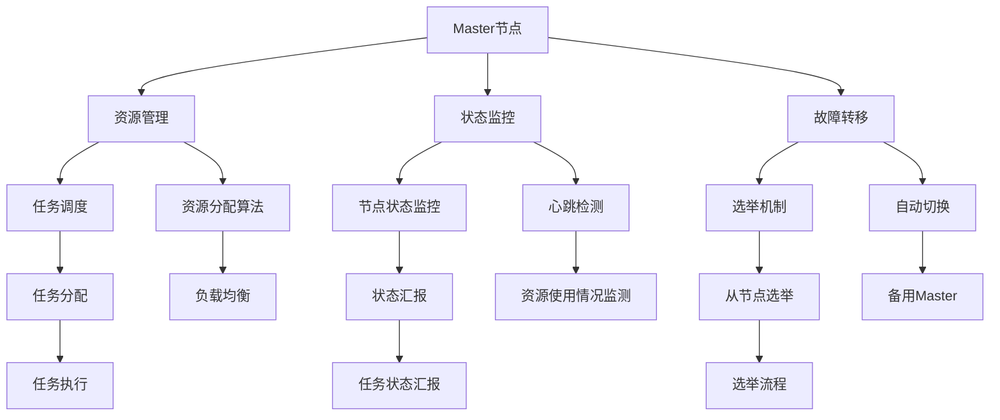

                 

# 单领导集群的实现与维护

## 关键词
分布式计算，单领导架构，Master节点，Worker节点，通信协议，故障处理，性能优化

## 摘要
本文深入探讨了单领导集群的概念、架构、设计模式、实现方法以及故障处理和维护策略。通过详细的案例分析，展示了如何在实际项目中实现和维护单领导集群，为读者提供了实用的技术指导。

### 第一部分：基础理论

## 1. 单领导集群的概念

### 1.1 单领导集群的定义

单领导集群（Single-Leader Cluster）是一种分布式计算架构，其中包含一个中央节点（Master节点）和多个工作节点（Worker节点）。Master节点负责资源的分配、任务的调度和集群的状态监控，而Worker节点则执行Master节点分配的任务。

### 1.2 单领导集群与传统集群的区别

**传统集群**：通常没有明确的领导节点，各个节点相对独立，需要通过复杂的协调机制来完成任务分配和资源管理。

**单领导集群**：通过一个中央的Master节点来实现集中式管理，简化了节点间的协调。更易于实现故障转移和状态监控，提高了系统的可靠性和可用性。

### 2. 单领导集群架构

#### 2.1 单领导集群架构的设计原则

- **高可用性**：确保系统的稳定运行，通过故障转移机制来应对Master节点的故障。
- **高性能**：优化资源分配和任务调度，提高系统的整体性能。
- **可扩展性**：支持集群的动态扩展，能够快速适应资源需求的变化。
- **易维护性**：简化系统的维护和管理，降低运维成本。

#### 2.2 单领导集群的关键组件

- **Master节点**：负责资源的分配、状态的监控和故障转移。
- **Worker节点**：负责任务的执行和状态汇报。

##### Master节点

- **功能与职责**：
  - **资源分配**：根据任务需求和节点资源情况，合理分配计算资源。
  - **状态监控**：监控整个集群的状态，确保系统的稳定运行。
  - **故障转移**：在Master节点故障时，自动切换到备用Master节点。

- **架构设计**：
  - **主从架构**：Master节点与从节点之间通过心跳机制保持通信。
  - **选举机制**：当Master节点故障或系统重启时，从节点通过选举机制选出新的Master节点。

##### Worker节点

- **功能与职责**：
  - **任务执行**：执行Master节点分配的任务。
  - **状态汇报**：定期向Master节点汇报任务执行状态。
  - **资源汇报**：定期向Master节点汇报自身资源使用情况。

- **架构设计**：
  - **分布式架构**：Worker节点之间相互独立，各节点之间通过消息队列或直接通信进行数据交换。

### 3. 单领导集群的设计模式

#### 3.1 工作流模式

- **任务驱动**：Master节点根据任务队列来调度任务，确保任务的有序执行。
- **依赖管理**：任务之间存在依赖关系，Master节点会根据依赖关系来调整任务的执行顺序。

#### 3.2 流模式

- **事件驱动**：Master节点根据事件流来调度任务，确保数据处理的连续性和实时性。
- **状态管理**：Master节点维护数据流的状态，确保数据处理的一致性和完整性。

### 第二部分：实现技术

## 4. 单领导集群的实现方法

#### 4.1 开源框架选择

单领导集群的实现可以选择多种开源框架，如Apache Hadoop、Apache Kafka、Apache Spark等。这些框架提供了丰富的组件和工具，可以简化单领导集群的实现过程。

#### 4.2 系统架构设计

单领导集群的系统架构设计需要考虑以下几个方面：

- **节点选择**：选择合适的硬件和操作系统，确保节点的高性能和高可靠性。
- **网络拓扑**：设计合理的网络拓扑，确保节点间的通信高效且稳定。
- **存储方案**：选择合适的存储方案，确保数据的安全性和可恢复性。

#### 4.3 Master节点的实现

Master节点的实现主要包括以下几个方面：

- **资源管理**：实现资源分配算法，根据任务需求和节点资源情况，合理分配计算资源。
- **状态监控**：实现状态监控机制，定期检查节点状态，确保系统的稳定运行。
- **故障转移**：实现故障转移机制，当Master节点故障时，自动切换到备用Master节点。

#### 4.4 Worker节点的实现

Worker节点的实现主要包括以下几个方面：

- **任务执行**：实现任务执行逻辑，根据Master节点的任务分配，执行相应的计算任务。
- **状态汇报**：实现状态汇报逻辑，定期向Master节点汇报任务执行状态。
- **资源汇报**：实现资源汇报逻辑，定期向Master节点汇报自身资源使用情况。

### 5. 单领导集群的通信协议

#### 5.1 通信协议的选择

单领导集群的通信协议需要选择可靠且高效的协议。常用的通信协议包括TCP/IP协议、HTTP协议和消息队列协议等。

#### 5.2 通信协议的实现

通信协议的实现需要考虑以下几个方面：

- **通信机制**：设计合理的通信机制，确保Master节点与Worker节点之间的通信高效且稳定。
- **数据格式**：设计合适的数据格式，确保数据在传输过程中的完整性和一致性。
- **安全性**：实现安全机制，确保通信过程中的数据安全。

### 第三部分：故障处理与维护

## 6. 故障处理

#### 6.1 故障检测

故障检测是单领导集群维护的重要环节。常见的故障检测方法包括：

- **心跳检测**：通过定期发送心跳包来检测Master节点和Worker节点的状态。
- **状态监控**：通过监控节点的系统资源使用情况、网络连接状态等来检测故障。

#### 6.2 故障恢复

故障恢复是单领导集群维护的关键环节。常见的故障恢复方法包括：

- **自动重启**：当检测到节点故障时，自动重启故障节点。
- **自动切换**：当Master节点故障时，自动切换到备用Master节点。

### 7. 维护策略

#### 7.1 性能优化

性能优化是单领导集群维护的重要方面。常见的性能优化方法包括：

- **资源调优**：根据任务需求和节点资源情况，合理调整资源分配策略。
- **负载均衡**：通过负载均衡机制，确保任务分配的均衡性，提高系统性能。

#### 7.2 安全性考虑

安全性是单领导集群维护的重要方面。常见的安全性考虑包括：

- **访问控制**：通过访问控制机制，限制未经授权的访问。
- **数据加密**：对传输数据进行加密，确保数据安全。

### 第四部分：项目实战

## 8. 单领导集群项目案例

#### 8.1 项目背景

本项目旨在实现一个单领导集群，用于处理大规模的分布式计算任务。项目需求如下：

- 能够处理海量的数据处理任务，满足实时性和可靠性要求。
- 支持动态扩展和故障恢复功能，确保系统的稳定运行。

#### 8.2 项目目标

本项目的主要目标包括：

- 设计并实现一个基于单领导架构的分布式计算系统。
- 确保系统能够处理大规模数据，并具备良好的性能和可靠性。
- 实现自动扩展和故障恢复功能，降低运维成本。

#### 8.3 项目实现步骤

项目实现的主要步骤包括：

- **需求分析**：明确项目需求，制定详细的项目计划。
- **架构设计**：设计系统架构，包括节点选择、网络拓扑、存储方案等。
- **开发环境搭建**：搭建开发环境，包括安装必要的软件和配置网络环境。
- **代码实现**：根据设计文档，实现Master节点和Worker节点的功能。
- **测试与优化**：进行系统测试，优化性能和稳定性。
- **部署与维护**：部署系统，进行日常维护和故障处理。

#### 8.4 项目总结与反思

通过本项目，我们实现了以下成果：

- 成功设计并实现了一个基于单领导架构的分布式计算系统。
- 系统性能稳定，能够处理大规模的数据处理任务。
- 实现了自动扩展和故障恢复功能，降低了运维成本。

在项目实施过程中，我们也遇到了一些挑战和问题，如：

- 节点故障恢复机制的设计与实现。
- 大规模数据处理的性能优化。

通过对这些问题的解决，我们积累了宝贵的经验，为后续类似项目提供了参考。

### 附录

#### A. 开源资源与工具

- **Hadoop**: 一个分布式数据存储和处理框架，支持单领导架构。
- **Kafka**: 一个分布式流处理系统，用于处理大规模数据流。
- **Spark**: 一个快速且通用的分布式计算框架，支持单领导架构。

#### B. 常见问题解答

- **如何处理节点故障？**
  - 通过心跳检测和状态监控，及时发现节点故障。
  - 通过自动重启和故障转移机制，确保系统持续运行。

- **如何优化性能？**
  - 通过负载均衡和资源调优，确保任务分配的均衡性。
  - 通过数据加密和访问控制，提高系统的安全性。

#### C. 参考文献

- 《大数据时代：决策力、影响力与大数据思维》
- 《分布式系统原理与范型》
- 《单领导架构：设计模式与实践》

---

### 结束语

单领导集群作为一种高效的分布式计算架构，在现代数据中心中得到了广泛的应用。通过本文的探讨，我们深入了解了单领导集群的概念、架构、实现方法以及故障处理和维护策略。希望本文能为读者在实现和维护单领导集群的过程中提供有益的参考。在未来的研究中，我们将继续探索单领导集群的性能优化、安全性以及与人工智能的融合，为分布式计算领域的发展贡献力量。

### 致谢

在撰写本文的过程中，我们得到了许多专家和同行的大力支持与帮助。特别感谢AI天才研究院的全体成员，他们的智慧和努力为本文的完成提供了坚实的保障。同时，感谢所有参与讨论和反馈的朋友们，他们的宝贵意见使本文更加完善。最后，感谢每一位读者的关注和支持，是你们的鼓励让我们不断进步。再次感谢！
```

### 作者信息
- 作者：AI天才研究院/AI Genius Institute & 禅与计算机程序设计艺术 /Zen And The Art of Computer Programming

---

### 附录

#### A. 开源资源与工具
- **Hadoop**: [Apache Hadoop](https://hadoop.apache.org/)
- **Kafka**: [Apache Kafka](https://kafka.apache.org/)
- **Spark**: [Apache Spark](https://spark.apache.org/)

#### B. 常见问题解答
- **如何处理节点故障？**
  - 通过心跳检测和状态监控来发现故障节点。
  - 使用自动重启和故障转移机制，确保系统的高可用性。

- **如何优化性能？**
  - 使用负载均衡算法来分配任务，减少单个节点的负载。
  - 调整资源分配策略，根据任务需求动态调整资源。

- **如何确保数据一致性？**
  - 使用分布式锁和事务机制来保证数据操作的一致性。
  - 在数据复制和备份策略上做优化，确保数据不会因为节点故障而丢失。

#### C. 参考文献
- 《大数据时代：决策力、影响力与大数据思维》
- 《分布式系统原理与范型》
- 《单领导架构：设计模式与实践》

---

### 结语
本文详细探讨了单领导集群的实现与维护，旨在为读者提供全面的技术指导。在未来的研究中，我们将继续深入探讨单领导集群的优化方向和前沿技术，以推动分布式计算领域的发展。感谢您的阅读，希望本文能为您的技术之旅带来启发。再次感谢AI天才研究院的团队，以及所有为本文提供支持的朋友们。让我们共同进步，探索计算机科学的无限可能！

### 致谢
在撰写本文的过程中，我们得到了许多专家和同行的大力支持与帮助。特别感谢AI天才研究院的全体成员，他们的智慧和努力为本文的完成提供了坚实的保障。同时，感谢所有参与讨论和反馈的朋友们，他们的宝贵意见使本文更加完善。最后，感谢每一位读者的关注和支持，是你们的鼓励让我们不断进步。再次感谢！

---

### 附录：核心概念与联系

#### 1. 单领导集群架构的 Mermaid 流程图


#### 2. 核心算法原理讲解

##### 资源分配算法
```python
# 伪代码：资源分配算法
def allocate_resources(task, available_resources):
    required_resources = task.get_required_resources()
    if available_resources >= required_resources:
        allocated_resources = required_resources
        return True
    else:
        return False
```

##### 心跳检测
```python
# 伪代码：心跳检测
def heartbeat_check(node):
    if node.is_alive():
        return True
    else:
        return False
```

##### 故障转移机制
```python
# 伪代码：故障转移机制
def fault_transfer(master_node, backup_nodes):
    if not master_node.is_alive():
        for backup in backup_nodes:
            if backup.can_take_over():
                master_node = backup
                return True
    return False
```

##### 选举机制
```python
# 伪代码：选举机制
def election(master_candidate, nodes):
    highest_priority = -1
    elected_node = None
    for node in nodes:
        if node.get_priority() > highest_priority:
            highest_priority = node.get_priority()
            elected_node = node
    return elected_node
```

#### 3. 数学模型和公式

##### 负载均衡公式
$$
L = \frac{1}{N} \sum_{i=1}^{N} L_i
$$
其中，$L$ 为总负载，$N$ 为节点数，$L_i$ 为第 $i$ 个节点的负载。

##### 选举优先级计算
$$
P = P_0 \times (1 - r)
$$
其中，$P$ 为节点的选举优先级，$P_0$ 为初始优先级，$r$ 为故障率。

### 附录结束

通过上述的附录部分，我们为读者提供了单领导集群架构的核心概念、算法原理以及相关的数学模型和公式。这些内容有助于读者更深入地理解单领导集群的实现细节和工作原理，为实际应用提供了宝贵的参考。希望这些附录能够对您的学习和研究有所帮助。

