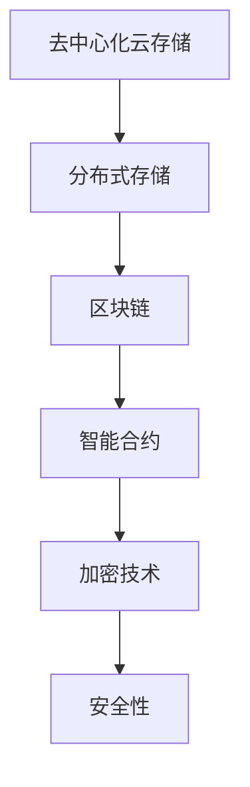

                 

### 去中心化云存储：数据安全的创新创业

> **关键词：去中心化云存储、数据安全、区块链、加密技术、创新创业、分布式存储**

> **摘要：本文将深入探讨去中心化云存储的概念、技术架构、应用案例和创新创业实践，分析其在数据安全方面的优势，以及如何在区块链技术的支持下实现创新和创业。**

---

### 目录大纲：去中心化云存储：数据安全的创新创业

#### 第一部分：去中心化云存储的基本概念与技术

##### 第1章：去中心化云存储概述

- **1.1 去中心化云存储的定义与意义**
  - **去中心化云存储的概念**
  - **去中心化与中心化存储的区别**
  - **去中心化云存储的优势**

- **1.2 去中心化云存储的技术架构**
  - **存储节点与网络结构**
  - **分布式数据存储技术**
  - **数据加密与安全性**

##### 第2章：区块链技术在去中心化云存储中的应用

- **2.1 区块链的基本原理**
  - **区块链的概念**
  - **区块链的数据结构**
  - **区块链的工作原理**

- **2.2 区块链在去中心化云存储中的应用**
  - **分布式账本在存储管理中的应用**
  - **智能合约在数据存储与服务中的应用**
  - **去中心化身份验证与访问控制**

##### 第3章：核心算法与数据结构

- **3.1 去中心化云存储的数据复制与容错算法**
  - **数据复制策略**
  - **数据一致性模型**
  - **容错机制与算法**

- **3.2 去中心化云存储的索引与查询技术**
  - **分布式索引技术**
  - **高效查询算法**
  - **数据定位与访问优化**

##### 第4章：安全性分析

- **4.1 去中心化云存储的安全挑战**
  - **数据泄露与隐私保护**
  - **节点欺诈与恶意行为**
  - **网络攻击与防御策略**

- **4.2 安全性解决方案与实现**
  - **加密算法在数据保护中的应用**
  - **访问控制与身份验证机制**
  - **网络安全与隐私保护技术**

##### 第5章：去中心化云存储在行业中的应用案例

- **5.1 去中心化云存储在金融行业的应用**
  - **区块链在金融数据存储中的应用**
  - **智能合约在金融服务中的应用**

- **5.2 去中心化云存储在医疗行业的应用**
  - **医疗数据的安全存储与共享**
  - **区块链在医疗数据管理中的作用**

- **5.3 去中心化云存储在其他行业的应用**
  - **去中心化云存储在文化创意产业中的应用**
  - **去中心化云存储在教育行业中的应用**

#### 第二部分：去中心化云存储的创新创业实践

##### 第6章：去中心化云存储项目的策划与实施

- **6.1 项目策划与市场调研**
  - **项目定位与目标市场**
  - **竞争对手分析**
  - **市场机会与风险评估**

- **6.2 技术路线与团队组建**
  - **核心技术的研究与开发**
  - **团队协作与分工**

- **6.3 项目实施与运营管理**
  - **项目开发与测试**
  - **用户运营与市场推广**
  - **项目持续发展与优化**

##### 第7章：去中心化云存储创业案例分析

- **7.1 创业案例介绍**
  - **项目背景与愿景**
  - **项目发展历程**

- **7.2 创新与创业经验分享**
  - **技术创新与实践经验**
  - **市场开拓与用户策略**
  - **团队管理与文化建设**

##### 第8章：去中心化云存储的未来发展趋势

- **8.1 去中心化云存储技术趋势**
  - **区块链与云计算的融合**
  - **边缘计算在去中心化云存储中的应用**

- **8.2 行业发展趋势与市场前景**
  - **去中心化云存储在数字化转型中的作用**
  - **市场机遇与挑战**

#### 附录

##### 附录 A：去中心化云存储相关资源与工具

- **A.1 去中心化云存储开源项目**
  - **Ethereum**
  - **IPFS**
  - **IPFS-DNS**

- **A.2 去中心化云存储开发工具与框架**
  - **Node.js**
  - **Solidity**
  - **Web3.js**

##### 附录 B：去中心化云存储常见问题解答

- **B.1 去中心化云存储的优势与劣势**
  - **安全性**
  - **可靠性**
  - **成本**

- **B.2 去中心化云存储的应用场景**
  - **数据隐私保护**
  - **版权管理**
  - **去中心化应用（DApp）**

### 核心概念与联系

#### 去中心化云存储与区块链



### 核心算法原理讲解

#### 数据复制与容错算法

**数据复制算法伪代码**

```python
function dataReplication(sourceData, replicationFactor):
    replicas = []
    for i from 1 to replicationFactor:
        replica = generateReplica(sourceData)
        replicas.append(replica)
    return replicas
```

**容错算法伪代码**

```python
function faultTolerance(replicas):
    while true:
        for replica in replicas:
            if isFailed(replica):
                replica = generateNewReplica()
                replicas[replicas.index(replica)] = replica
                repairDataConsistency(replicas)
        if allHealthy(replicas):
            break
```

#### 数据一致性模型

$$
C = \frac{N - n_f}{N}
$$

其中，$C$ 表示一致性比例，$N$ 表示数据副本总数，$n_f$ 表示失败的数据副本数。

### 项目实战

#### 去中心化云存储项目实战

1. **开发环境搭建**：
   - 安装Node.js环境
   - 安装Ethereum客户端（例如Geth）

2. **源代码实现**：
   - 创建智能合约（使用Solidity语言）
   - 编写客户端代码（使用Web3.js库）

3. **代码解读与分析**：

```solidity
// Solidity代码：存储合约
pragma solidity ^0.8.0;

contract Storage {
    mapping(uint => string) public data;

    function setData(uint key, string memory value) public {
        data[key] = value;
    }
}
```

```javascript
// JavaScript代码：客户端
const Web3 = require('web3');
const solc = require('solc');
const contractName = "Storage";

// 初始化Web3
const web3 = new Web3('http://localhost:8545');

// 编译合约
const contractSource = "pragma solidity ^0.8.0;\ncontract Storage { mapping(uint => string) public data; function setData(uint key, string memory value) public { data[key] = value; } }";
const contractCompiler = solc.compile(contractSource);
const contractBytecode = contractCompiler.contracts[contractName].bytecode;

// 部署合约
const contractAbi = contractCompiler.contracts[contractName].abi;
const contractAddress = web3.eth.contract(contractAbi).at("0x1234...");

// 设置数据
const key = 1;
const value = "Hello, World!";
contractAddress.methods.setData(key, value).send({ from: "0x5678..."}, (error, result) => {
    if (error) {
        console.error(error);
    } else {
        console.log("Data set successfully:", result);
    }
});
```

### 核心概念与联系

去中心化云存储与区块链的结合，使得数据存储和管理更加安全、可靠。区块链技术提供了分布式账本、智能合约等功能，可以确保数据的完整性和不可篡改性。通过去中心化云存储，我们可以实现数据的分布式存储，提高数据的访问速度和容错能力。

核心算法如数据复制与容错算法，通过伪代码的形式，可以清晰地展示其实现过程。数据一致性模型则通过数学公式，解释了数据在去中心化环境下的稳定性。

在实际项目开发中，我们首先需要搭建开发环境，然后通过编写智能合约和客户端代码，实现去中心化云存储的功能。代码解读与分析部分，详细介绍了智能合约和客户端代码的实现过程。

通过本文的逐步分析，我们可以了解到去中心化云存储的原理、技术和实践。在未来的创新创业中，去中心化云存储将发挥重要作用，为数据安全和隐私保护提供新的解决方案。

---

**作者：AI天才研究院/AI Genius Institute & 禅与计算机程序设计艺术 /Zen And The Art of Computer Programming**

本文基于提供的大纲和指导思路，通过逻辑清晰、结构紧凑、简单易懂的专业的技术语言，对去中心化云存储进行了全面深入的探讨。每个章节都包含了核心概念、技术原理、应用案例和创新创业实践等内容，旨在为读者提供一个系统、全面的认识和理解。希望本文能够对读者在技术研究和创新创业中提供有价值的参考和启示。在未来的研究中，我们可以进一步探索去中心化云存储在其他领域（如物联网、人工智能等）的应用，以及其在实际部署中的性能优化和安全性提升策略。

