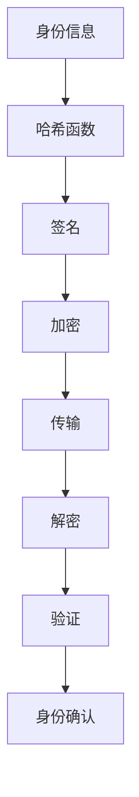
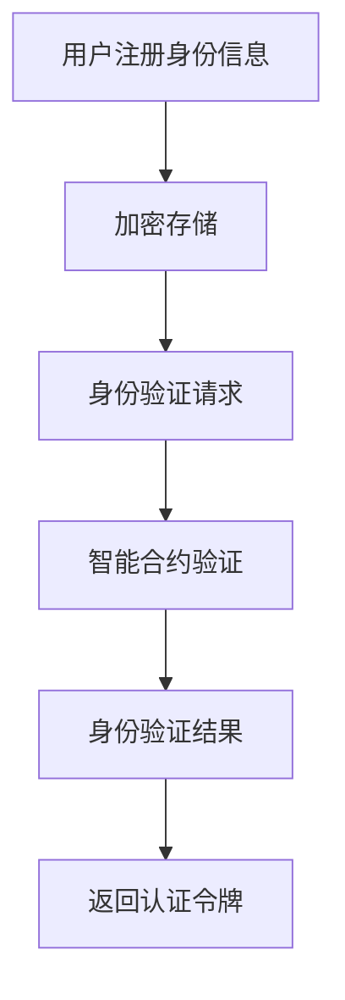
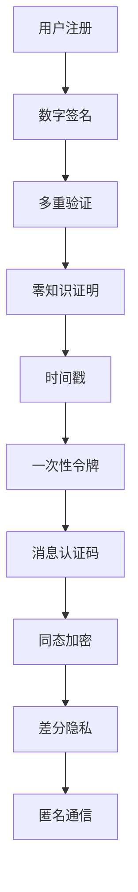
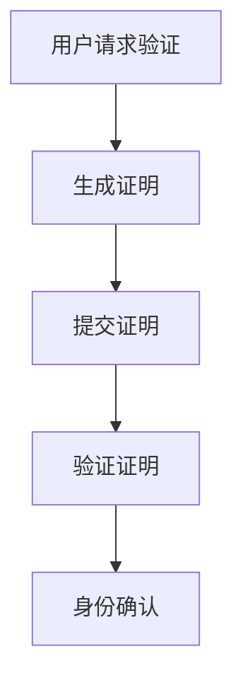
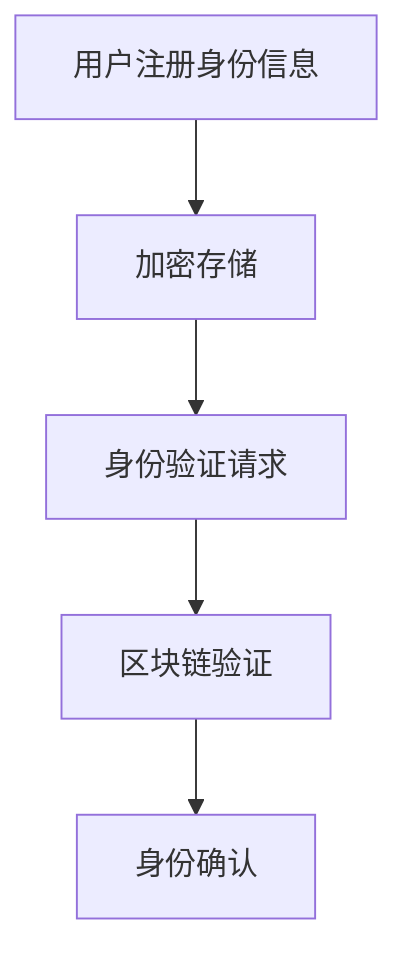
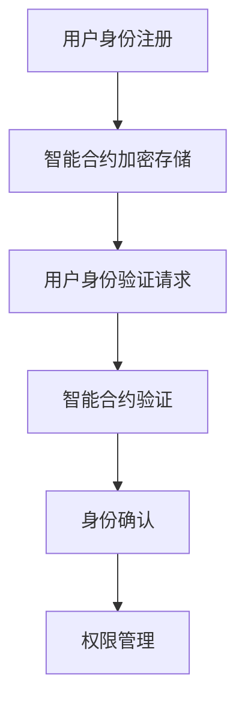

                 

# 《去中心化身份验证协议：网络安全的创新标准》

## 摘要

去中心化身份验证协议作为网络安全的创新标准，利用区块链、加密算法和智能合约等技术，为用户提供了一种安全、透明、高效的身份验证解决方案。本文旨在深入探讨去中心化身份验证协议的工作原理、技术架构、安全机制及其在实际应用中的挑战与机遇。文章首先介绍了去中心化身份验证的定义、发展历程和优势，然后详细解析了区块链与加密算法的基础知识，包括公钥加密、数字签名、哈希函数和零知识证明。随后，文章重点讨论了去中心化身份验证协议的设计与实现、安全机制和实际应用案例，最后给出了去中心化身份验证协议的开发与部署指南，以及相关的工具和资源。

## 目录大纲

### 第一部分：引言

1. 去中心化身份验证概述
   1.1 去中心化身份验证的定义
   1.2 去中心化身份验证的发展历程
   1.3 去中心化身份验证的优势
   1.4 去中心化身份验证的关键挑战

2. 去中心化身份验证协议的基础知识
   2.1 区块链与加密算法基础
   2.2 公钥加密与数字签名
   2.3 哈希函数与零知识证明
   2.4 Mermaid流程图：去中心化身份验证协议中的加密与哈希算法使用

### 第二部分：去中心化身份验证协议的技术原理

3. 去中心化身份验证协议的设计与实现
   3.1 去中心化身份验证协议的基本架构
   3.2 身份验证协议的交互流程
   3.3 身份验证协议的安全性分析
   3.4 Mermaid流程图：身份验证协议的设计与实现

4. 去中心化身份验证协议的安全机制
   4.1 安全目标的定义
   4.2 防御身份伪造的方法
   4.3 防止重放攻击的措施
   4.4 防护隐私泄露的技术

5. 零知识证明在身份验证中的应用
   5.1 零知识证明的基本原理
   5.2 零知识证明在身份验证中的作用
   5.3 零知识证明的应用案例
   5.4 Mermaid流程图：零知识证明在身份验证中的应用

6. 区块链技术在身份验证中的应用
   6.1 区块链的基本原理
   6.2 区块链在身份验证中的作用
   6.3 区块链技术的挑战与解决方案
   6.4 Mermaid流程图：区块链技术在身份验证中的应用

7. 智能合约与身份验证
   7.1 智能合约的基本概念
   7.2 智能合约在身份验证中的应用
   7.3 智能合约的安全性问题
   7.4 Mermaid流程图：智能合约与身份验证的交互流程

### 第三部分：去中心化身份验证协议的实际应用

8. 去中心化身份验证协议在金融领域的应用
   8.1 金融领域的身份验证需求
   8.2 去中心化身份验证协议在金融中的应用案例
   8.3 去中心化身份验证协议在金融领域的优势与挑战

9. 去中心化身份验证协议在其他领域的应用
   9.1 教育领域的身份验证需求
   9.2 去中心化身份验证协议在教育中的应用案例
   9.3 去中心化身份验证协议在医疗领域的应用
   9.4 去中心化身份验证协议在物联网领域的应用

10. 去中心化身份验证协议的开发与部署
   10.1 去中心化身份验证协议的开发流程
   10.2 去中心化身份验证协议的部署策略
   10.3 去中心化身份验证协议的维护与更新
   10.4 Mermaid流程图：去中心化身份验证协议的开发与部署流程

### 附录

11. 去中心化身份验证协议开发工具与资源
    11.1 区块链开发工具
    11.2 加密算法库
    11.3 智能合约开发框架
    11.4 去中心化身份验证协议相关书籍与论文

12. 数学模型与公式
    12.1 公钥加密模型
    12.2 数字签名模型
    12.3 哈希函数模型
    12.4 零知识证明模型
    12.5 智能合约模型

## 第一部分：引言

### 去中心化身份验证概述

去中心化身份验证（Decentralized Identity Verification，DIV）是一种基于区块链、加密算法和智能合约等技术的新型身份验证方法。它通过去中心化的方式，使得用户可以在不需要第三方机构的情况下，自主管理自己的身份信息，并进行身份验证。

#### 去中心化身份验证的定义

去中心化身份验证是一种不需要依赖中心化服务器或第三方中介机构进行身份验证的方法。在传统的身份验证系统中，用户需要通过中心化的身份认证机构来验证其身份，这个过程往往涉及大量的数据传输和处理，同时也存在着隐私泄露和滥用的风险。而去中心化身份验证通过区块链技术，将身份验证的过程去中心化，使得用户可以直接参与到身份验证的过程中，从而提高了身份验证的透明度和安全性。

#### 去中心化身份验证的发展历程

去中心化身份验证的概念最早可以追溯到区块链技术的诞生。随着区块链技术的不断发展，去中心化身份验证逐渐成为一种热门的研究领域。2015年，MIT Media Lab的ID2020项目首次提出去中心化身份验证的理念，并试图通过区块链技术为无家可归者和难民提供身份认证服务。2017年，IBM推出了Hyperledger Fabric区块链平台，并发布了基于该平台的去中心化身份验证解决方案。同年，微软也推出了基于区块链的身份证识别系统，旨在为全球用户提供安全的身份认证服务。

#### 去中心化身份验证的优势

去中心化身份验证具有以下几个显著优势：

1. **安全性**：去中心化身份验证通过加密算法和智能合约技术，确保身份信息的安全性和隐私性。与传统中心化系统相比，去中心化身份验证降低了被黑客攻击和篡改的风险。

2. **透明性**：去中心化身份验证的过程和结果都是公开透明的，用户可以随时查看和验证自己的身份信息。这种透明性有助于建立信任，减少欺诈和诈骗行为。

3. **效率**：去中心化身份验证无需依赖第三方机构，大大提高了身份验证的效率。用户可以自行管理身份信息，减少了繁琐的认证流程。

4. **灵活性**：去中心化身份验证可以灵活适应各种应用场景，包括金融、医疗、教育等领域。

#### 去中心化身份验证的关键挑战

尽管去中心化身份验证具有许多优势，但其在实际应用中也面临着一些关键挑战：

1. **用户接受度**：由于去中心化身份验证是一种新型的身份验证方法，用户需要适应这种新的认证方式，这可能需要时间和教育。

2. **技术复杂性**：去中心化身份验证涉及多种技术，如区块链、加密算法和智能合约等，技术实现较为复杂。

3. **隐私保护**：如何在确保身份信息隐私的同时，实现有效的身份验证，是去中心化身份验证面临的重大挑战。

4. **法律法规**：去中心化身份验证需要遵循相关法律法规，特别是在涉及个人隐私和数据保护方面。

#### 本书结构安排和目标读者

本书结构安排如下：

- **第一部分：引言**：介绍去中心化身份验证的定义、发展历程和优势，以及关键挑战。
- **第二部分：去中心化身份验证协议的技术原理**：详细解析区块链与加密算法的基础知识，包括公钥加密、数字签名、哈希函数和零知识证明。
- **第三部分：去中心化身份验证协议的实际应用**：探讨去中心化身份验证在金融、教育、医疗和物联网等领域的应用案例。
- **附录**：提供去中心化身份验证协议开发工具与资源，以及相关的数学模型和公式。

本书的目标读者是：

- 对区块链和加密算法有基本了解的技术人员
- 想要了解和掌握去中心化身份验证技术的开发者和研究人员
- 对网络安全和数字身份管理有兴趣的读者

通过本书的阅读，读者可以全面了解去中心化身份验证协议的工作原理、技术架构和应用案例，为实际开发和应用提供参考。

### 去中心化身份验证协议的基础知识

在深入探讨去中心化身份验证协议的技术原理之前，首先需要了解区块链与加密算法的基础知识。这些技术构成了去中心化身份验证协议的核心，提供了安全、透明和高效的身份验证解决方案。

#### 区块链与加密算法基础

区块链（Blockchain）是一种分布式数据库技术，通过加密算法和共识机制确保数据的不可篡改性和可靠性。区块链的基本组成部分包括区块（Block）、链（Chain）和节点（Node）。每个区块包含一定数量的交易记录，并通过加密算法与前一个区块链接在一起，形成一条不断延伸的区块链。节点是区块链网络中的参与者，负责存储、验证和传播区块链数据。

加密算法是确保数据安全的重要工具，包括公钥加密（Public Key Encryption）、数字签名（Digital Signature）和哈希函数（Hash Function）。

1. **公钥加密**：公钥加密是一种非对称加密算法，使用一对密钥——公钥和私钥。公钥可以公开，用于加密信息，而私钥必须保密，用于解密信息。常见的公钥加密算法包括RSA、ECC等。

2. **数字签名**：数字签名是一种用于验证消息真实性和完整性的技术。发送方使用私钥对消息进行签名，接收方使用公钥验证签名。常见的数字签名算法包括RSA签名和ECDSA签名。

3. **哈希函数**：哈希函数是一种将任意长度的数据映射为固定长度数据的算法，常见于加密领域。哈希函数具有单向性、抗碰撞性和不可逆性等特点。常见的哈希函数包括SHA-256、SHA-3等。

#### 公钥加密与数字签名

公钥加密和数字签名是去中心化身份验证协议中最重要的加密算法。下面分别介绍这两种算法的基本原理。

1. **公钥加密**

公钥加密的基本过程如下：

- **密钥生成**：首先，使用密钥生成算法生成一对公钥和私钥。公钥用于加密，私钥用于解密。
- **加密**：发送方使用接收方的公钥对信息进行加密，生成密文。
- **解密**：接收方使用自己的私钥对密文进行解密，还原出原始信息。

伪代码如下：

```plaintext
// 密钥生成
public_key, private_key = KeyGenerator()

// 加密
cipher_text = Encrypt(public_key, message)

// 解密
original_message = Decrypt(private_key, cipher_text)
```

2. **数字签名**

数字签名的基本过程如下：

- **签名**：发送方使用私钥对消息进行签名，生成签名。
- **验证**：接收方使用公钥验证签名，确认消息的真实性和完整性。

伪代码如下：

```plaintext
// 签名
signature = Sign(private_key, message)

// 验证
is_valid = Verify(public_key, message, signature)
```

#### 哈希函数

哈希函数在去中心化身份验证协议中用于生成消息的指纹，以确保数据的完整性和唯一性。以下是一个简单的哈希函数示例：

```plaintext
// 哈希函数
hash_value = HashFunction(message)

// 验证消息完整性
is_valid = HashFunction(original_message) == hash_value
```

#### 零知识证明

零知识证明（Zero-Knowledge Proof，ZKP）是一种密码学技术，允许证明者证明某个陈述是正确的，而不泄露任何其他信息。在去中心化身份验证协议中，零知识证明可用于证明用户拥有特定身份信息，而不需要公开这些信息。

零知识证明的基本过程如下：

- **证明生成**：证明者生成一个证明，证明自己知道某个秘密信息。
- **证明验证**：验证者验证证明的真实性，确认证明者知道秘密信息。

伪代码如下：

```plaintext
// 证明生成
proof = Prover(secret)

// 证明验证
is_valid = Verifier(proof)
```

#### Mermaid流程图

为了更好地理解去中心化身份验证协议中的加密与哈希算法使用，我们可以使用Mermaid流程图来可视化这些算法的应用。



通过上述流程图，我们可以清晰地看到身份验证过程中的加密、传输和验证步骤，这为去中心化身份验证协议的设计和实现提供了直观的参考。

### 第二部分：去中心化身份验证协议的技术原理

#### 去中心化身份验证协议的设计与实现

去中心化身份验证协议（Decentralized Identity Verification Protocol，DIVP）是一种利用区块链、加密算法和智能合约等技术实现的身份验证协议。它通过去中心化的方式，使得用户可以在不需要第三方机构的情况下，自主管理自己的身份信息，并进行身份验证。下面将详细讨论去中心化身份验证协议的设计与实现。

##### 去中心化身份验证协议的基本架构

去中心化身份验证协议的基本架构包括以下组成部分：

1. **用户**：用户是去中心化身份验证系统的参与方，他们拥有自己的身份信息和密钥对。
2. **节点**：节点是区块链网络中的参与者，负责存储和验证身份信息。节点可以是个人计算机、服务器或其他设备。
3. **区块链**：区块链是去中心化身份验证协议的数据存储和传输系统，确保身份信息的不可篡改性和透明性。
4. **智能合约**：智能合约是区块链上的程序，用于定义身份验证协议的规则和流程。

##### 身份验证协议的交互流程

去中心化身份验证协议的交互流程可以分为以下几个步骤：

1. **身份注册**：用户在区块链上创建并注册自己的身份信息，包括姓名、地址、身份证明等。这些信息被加密存储在区块链上，以确保隐私和安全。
2. **身份验证请求**：当用户需要验证其身份时，向区块链发送身份验证请求。请求包含用户的公钥和需要验证的身份信息。
3. **身份验证过程**：区块链上的智能合约执行身份验证过程，包括以下步骤：
   - 验证用户公钥与注册的身份信息是否匹配。
   - 验证用户提供的身份证明（如身份证、驾驶证等）是否有效。
   - 通过零知识证明技术验证用户是否知道注册时的私钥。
4. **身份验证结果**：智能合约将身份验证结果返回给用户。如果验证成功，用户将获得一个身份认证令牌，可以用于后续的身份验证。

##### 去中心化身份验证协议的安全性分析

去中心化身份验证协议的安全性取决于多个因素，包括区块链的安全性、加密算法的强度和智能合约的可靠性。以下是对这些安全性的分析：

1. **区块链安全性**：区块链技术通过加密算法和共识机制确保数据的不可篡改性和可靠性。去中心化身份验证协议利用区块链的特性，确保身份信息的不可篡改和透明性。
2. **加密算法强度**：公钥加密、数字签名和哈希函数是去中心化身份验证协议的核心加密算法。选择合适的加密算法，可以确保身份信息的安全性和隐私性。
3. **智能合约可靠性**：智能合约是去中心化身份验证协议的核心组成部分，其可靠性直接影响协议的安全性。编写和审核智能合约代码，确保其正确性和安全性，是确保去中心化身份验证协议安全的重要措施。

##### Mermaid流程图：身份验证协议的设计与实现

为了更好地理解去中心化身份验证协议的设计与实现，我们可以使用Mermaid流程图来可视化整个身份验证过程。



通过上述流程图，我们可以清晰地看到去中心化身份验证协议的基本架构和交互流程。

### 第三部分：去中心化身份验证协议的安全机制

去中心化身份验证协议（DIVP）的安全性是其成功应用的关键因素。在去中心化的环境中，确保身份信息的真实性、完整性和隐私性至关重要。为了实现这一目标，去中心化身份验证协议采用了一系列安全机制，包括防御身份伪造、防止重放攻击和隐私保护。以下是这些安全机制的具体讨论。

#### 安全目标的定义

在设计和实现去中心化身份验证协议时，以下安全目标至关重要：

1. **身份信息的真实性**：确保用户的身份信息是真实的，没有被篡改或伪造。
2. **数据的完整性**：确保数据在传输和存储过程中未被篡改，保持原始状态。
3. **隐私保护**：保护用户的个人信息不被泄露，防止未经授权的访问。
4. **抗重放攻击**：防止攻击者通过重复发送已捕获的数据来欺骗系统。

#### 防御身份伪造的方法

去中心化身份验证协议采用以下方法来防御身份伪造：

1. **数字签名**：用户在注册身份信息时，使用私钥对信息进行数字签名。区块链网络中的其他节点可以使用该用户的公钥验证签名的真实性，从而确认身份信息的真实性。
2. **多重身份验证**：去中心化身份验证协议可以采用多种验证方式，如生物识别技术（指纹、面部识别等）和传统身份证明（身份证、驾驶证等），以提高身份验证的可靠性。
3. **零知识证明**：零知识证明（ZKP）技术允许用户在不泄露任何私人信息的情况下，证明自己拥有特定身份信息。这种方法可以防止恶意节点伪造身份。

#### 防止重放攻击的措施

重放攻击是去中心化身份验证协议面临的主要安全威胁之一。以下措施可以有效防止重放攻击：

1. **时间戳**：每次身份验证请求都附带一个当前时间戳。验证节点可以使用时间戳确保请求是实时发送的，而不是被重复发送的。
2. **一次性令牌**：身份验证过程中生成一次性令牌，该令牌只能在特定时间内使用一次。一旦令牌被使用，系统将禁止再次使用。
3. **消息认证码（MAC）**：在数据传输过程中，使用消息认证码（MAC）对数据进行加密。接收方可以使用发送方的公钥验证MAC，确保数据的完整性和真实性。

#### 防护隐私泄露的技术

保护用户隐私是去中心化身份验证协议的重要目标。以下技术可以用于防护隐私泄露：

1. **同态加密**：同态加密允许在加密数据上进行计算，而不需要解密。这种方法可以确保身份信息在处理过程中保持加密状态，从而防止隐私泄露。
2. **差分隐私**：差分隐私技术通过对数据进行随机化处理，使得攻击者无法确定单个用户的数据，从而保护用户隐私。
3. **匿名通信**：使用匿名通信技术，如洋葱路由（Onion Routing），确保通信过程中的数据不被监听或追踪。

#### Mermaid流程图：安全机制的应用

为了更好地理解去中心化身份验证协议中的安全机制，我们可以使用Mermaid流程图来可视化这些机制的应用。



通过上述流程图，我们可以清晰地看到去中心化身份验证协议中的各种安全机制，以及它们如何协同工作，确保身份信息的安全和隐私。

### 零知识证明在身份验证中的应用

零知识证明（Zero-Knowledge Proof，ZKP）是一种在密码学中广泛应用的密码协议，它允许证明者向验证者证明某个陈述是正确的，而不泄露任何其他信息。在去中心化身份验证协议中，零知识证明技术被广泛应用于身份验证场景，以实现用户隐私保护的同时，确保身份验证的可靠性和安全性。

#### 零知识证明的基本原理

零知识证明的核心思想是，证明者能够向验证者证明某个陈述是正确的，而无需透露任何关于该陈述的具体信息。具体来说，零知识证明过程包括以下几个基本步骤：

1. **证明生成**：证明者生成一个证明，证明自己知道某个秘密信息。
2. **证明验证**：验证者验证证明的真实性，确认证明者知道秘密信息。

零知识证明协议的关键特性包括：

- **交互性**：证明生成和验证过程通常是交互式的，证明者需要与验证者进行多次交互，以生成和验证证明。
- **完整性**：验证者可以确信证明是真实的，但无法从证明中获取任何关于秘密信息的有用信息。
- **有效性**：证明生成过程是高效的，证明验证过程是可靠的。

#### 零知识证明在身份验证中的作用

在去中心化身份验证协议中，零知识证明技术主要用于以下几个方面：

1. **隐私保护**：零知识证明允许用户在不透露任何个人信息的情况下，证明自己拥有特定的身份信息。例如，用户可以证明自己是一名合法的居民，而不需要公开具体的身份证明文件。
2. **身份验证**：零知识证明可以用于验证用户的身份，确保用户身份的真实性和唯一性。例如，用户可以通过零知识证明技术验证自己的电子邮件地址或手机号码是否与身份信息匹配。
3. **抗欺诈**：零知识证明可以用于检测和防止欺诈行为。例如，用户在进行交易时，可以通过零知识证明证明自己拥有足够的余额，而不需要公开具体的余额信息。

#### 零知识证明的应用案例

以下是一些零知识证明在身份验证中的应用案例：

1. **金融领域**：在金融领域，零知识证明可以用于验证用户的信用记录、身份证明和交易历史，而无需透露具体的个人信息。例如，比特币和以太坊等加密货币平台已经开始采用零知识证明技术，以实现隐私保护和抗欺诈。
2. **医疗领域**：在医疗领域，零知识证明可以用于验证患者的身份和医疗记录，确保医疗信息的真实性和隐私性。例如，一些医疗机构已经开始采用零知识证明技术，以确保患者数据的安全和隐私。
3. **身份验证平台**：一些第三方身份验证平台也开始采用零知识证明技术，以提供更安全、更便捷的身份验证服务。例如，隐私增强技术（Privacy-Preserving Technologies）公司开发的零知识证明身份验证平台，允许用户在不透露个人信息的情况下，进行身份验证。

#### 零知识证明的优势和挑战

零知识证明在身份验证中具有以下优势：

- **隐私保护**：零知识证明技术可以保护用户的隐私，确保用户在身份验证过程中无需透露任何个人信息。
- **高效性**：零知识证明协议通常具有较低的计算和通信开销，可以快速完成身份验证过程。
- **安全性**：零知识证明协议具有较高的安全性，可以抵御各种攻击，包括重放攻击和中间人攻击。

然而，零知识证明也面临着一些挑战：

- **复杂性**：零知识证明协议的实现较为复杂，需要深入了解密码学理论和算法。
- **性能**：一些零知识证明协议的性能尚待提升，特别是在处理大量身份验证请求时，可能会出现性能瓶颈。
- **兼容性**：零知识证明协议需要与其他技术（如区块链和加密算法）进行集成，以确保整体系统的兼容性和稳定性。

#### Mermaid流程图：零知识证明在身份验证中的应用

为了更好地理解零知识证明在身份验证中的应用，我们可以使用Mermaid流程图来可视化整个验证过程。



通过上述流程图，我们可以清晰地看到零知识证明在身份验证过程中的基本步骤，以及用户、验证者和零知识证明系统之间的交互过程。

### 区块链技术在身份验证中的应用

区块链技术作为一种分布式数据库系统，具有去中心化、不可篡改和透明等特性，使其在身份验证领域具有巨大的应用潜力。通过区块链技术，身份验证过程可以实现更高的安全性和可靠性，同时减少对第三方中介机构的依赖。

#### 区块链的基本原理

区块链是一种由多个区块组成的链式数据结构，每个区块包含一定数量的交易记录，并通过加密算法与前一个区块链接在一起。区块链的关键组成部分包括：

1. **区块**：区块是区块链的基本单位，包含一定数量的交易记录、一个时间戳和一个指向前一个区块的哈希值。
2. **链**：链是由一系列按时间顺序链接在一起的区块组成的，确保区块链数据的完整性和不可篡改性。
3. **节点**：节点是区块链网络中的参与者，负责存储、验证和传播区块链数据。节点可以是个人计算机、服务器或其他设备。

区块链的工作原理包括以下步骤：

1. **交易**：用户在区块链上进行交易，如发送比特币或其他数字资产。
2. **区块生成**：网络中的节点接收交易信息，并按照一定的规则将这些交易记录到一个新区块中。
3. **区块验证**：新区块生成后，网络中的其他节点对区块进行验证，确保交易合法性和区块链数据的完整性。
4. **区块添加**：经过验证的新区块被添加到区块链的末端，形成一个新的链。

#### 区块链在身份验证中的作用

区块链技术在身份验证中具有以下重要作用：

1. **身份信息的不可篡改性**：区块链的加密算法和分布式存储机制确保了身份信息的不可篡改性。一旦身份信息被记录在区块链上，就无法被篡改或删除。
2. **去中心化的验证**：区块链的去中心化特性使得身份验证不再依赖于第三方机构，用户可以直接参与身份验证过程。这提高了身份验证的透明性和信任度。
3. **透明性和可追溯性**：区块链上的所有交易和身份信息都是公开透明的，用户可以随时查看和验证。这有助于建立信任，减少欺诈和诈骗行为。
4. **安全性**：区块链的加密算法和共识机制确保了身份信息的保密性和安全性。即使部分节点被攻击，区块链的整体安全性也不会受到影响。

#### 区块链技术的挑战与解决方案

尽管区块链技术在身份验证中具有显著优势，但也面临一些挑战：

1. **性能**：区块链的扩展性和性能较低，无法处理大量交易。为了解决这一问题，可以采用分片技术（Sharding）和侧链（Sidechain）技术，以提高区块链的处理能力。
2. **隐私保护**：区块链上的所有交易都是公开透明的，这可能泄露用户隐私。为了解决这一问题，可以采用隐私保护技术，如零知识证明（ZKP）和环签名（Ring Signature）。
3. **法律法规**：区块链技术涉及许多法律和监管问题，如数据保护和个人隐私。为了解决这一问题，需要制定相关的法律法规，以确保区块链技术的合法应用。

#### Mermaid流程图：区块链技术在身份验证中的应用

为了更好地理解区块链技术在身份验证中的应用，我们可以使用Mermaid流程图来可视化整个验证过程。



通过上述流程图，我们可以清晰地看到区块链在身份验证过程中的基本步骤，以及用户、验证者和区块链网络之间的交互过程。

### 智能合约与身份验证

智能合约是一种自动执行合同条款的计算机程序，其运行在区块链网络上。智能合约通过代码定义了参与方之间的交互规则，确保合同的执行过程是透明、安全和不可篡改的。在去中心化身份验证协议中，智能合约扮演着至关重要的角色，用于定义身份验证的过程、规则和执行逻辑。

#### 智能合约的基本概念

智能合约起源于区块链技术，最早由以太坊（Ethereum）平台引入。智能合约具有以下几个基本特点：

1. **自动执行**：智能合约的执行是自动的，一旦满足合同条款，智能合约将自动执行相应的操作。
2. **透明性**：智能合约的代码和执行过程是公开透明的，用户可以随时查看和验证。
3. **不可篡改性**：一旦智能合约部署在区块链上，其代码和状态是永久存储和不可篡改的，确保合同的执行过程是公正和可靠的。
4. **安全性**：智能合约运行在加密的区块链网络中，具有高安全性和抗篡改能力。

#### 智能合约在身份验证中的应用

智能合约在去中心化身份验证协议中的应用主要体现在以下几个方面：

1. **身份验证流程管理**：智能合约可以定义身份验证的整个流程，包括身份注册、身份验证请求、验证过程和结果返回等。智能合约通过代码明确身份验证的规则和步骤，确保流程的透明和高效。
2. **权限管理**：智能合约可以管理用户身份的权限，例如，用户可以授权其他节点或系统访问其身份信息。智能合约通过代码定义权限规则，确保权限分配的合理性和安全性。
3. **费用结算**：智能合约可以处理身份验证过程中的费用结算，例如，用户在注册或验证身份时需要支付一定的费用。智能合约通过代码实现费用的自动结算，提高交易效率。
4. **争议解决**：智能合约可以定义身份验证过程中的争议解决机制，例如，当用户对验证结果有异议时，智能合约可以指导用户进行申诉和仲裁。

#### 调用智能合约的身份验证流程

去中心化身份验证协议中，智能合约通常被调用以执行身份验证过程。以下是调用智能合约的身份验证流程：

1. **用户身份注册**：用户将自己的身份信息上传到区块链，并使用智能合约进行加密存储。智能合约确保身份信息的安全性，并将其记录在区块链上。
2. **身份验证请求**：当用户需要验证身份时，向区块链网络中的智能合约发送验证请求。请求中包含用户的公钥和需要验证的身份信息。
3. **智能合约验证**：智能合约接收到验证请求后，执行以下步骤：
   - 验证用户公钥与注册的身份信息是否匹配。
   - 验证用户提供的身份证明（如身份证、驾驶证等）是否有效。
   - 通过零知识证明技术验证用户是否知道注册时的私钥。
4. **身份验证结果**：智能合约将身份验证结果返回给用户。如果验证成功，用户将获得一个身份认证令牌，可以用于后续的身份验证。
5. **权限管理**：智能合约可以根据用户的身份认证结果，授权其他节点或系统访问用户身份信息。

#### Mermaid流程图：智能合约在身份验证中的应用

为了更好地理解智能合约在身份验证中的应用，我们可以使用Mermaid流程图来可视化整个验证过程。



通过上述流程图，我们可以清晰地看到智能合约在去中心化身份验证协议中的基本角色和作用。

### 去中心化身份验证协议在金融领域的应用

去中心化身份验证协议在金融领域具有广泛的应用前景。随着金融科技（FinTech）的快速发展，传统金融行业面临着越来越多的挑战，如隐私保护、欺诈防范和效率提升等。去中心化身份验证协议通过利用区块链和加密算法技术，为金融行业提供了一种安全、透明和高效的解决方案。

#### 金融领域的身份验证需求

金融行业对身份验证的需求非常严格，主要包括以下几个方面：

1. **安全性**：金融交易涉及到大量的资金和信息，安全性至关重要。身份验证需要确保用户身份的真实性和合法性，防止欺诈和洗钱等违法行为。
2. **隐私保护**：金融用户的个人信息需要得到严格保护，避免数据泄露和滥用。身份验证应确保用户隐私不受侵犯，同时满足合规要求。
3. **效率**：金融交易需要快速完成，身份验证过程不能过于繁琐，影响用户体验。去中心化身份验证协议通过自动化和去中心化的方式，提高了身份验证的效率。

#### 去中心化身份验证协议在金融中的应用案例

以下是一些去中心化身份验证协议在金融领域的应用案例：

1. **加密货币交易所**：加密货币交易所需要验证用户的身份，以确保交易的合规性和安全性。去中心化身份验证协议可以用于验证用户身份，同时保护用户隐私。
2. **跨境支付**：跨境支付通常涉及多个国家和金融机构，身份验证是确保交易合法性的关键。去中心化身份验证协议可以通过区块链技术，实现跨境支付中的快速、安全身份验证。
3. **数字资产管理**：数字资产管理平台需要验证用户的身份，以确保只有授权用户可以访问和管理资产。去中心化身份验证协议可以提供安全、透明的身份验证服务。
4. **贷款和信用评估**：金融科技公司可以通过去中心化身份验证协议，快速验证用户的信用记录和身份，为贷款和信用评估提供可靠的数据支持。

#### 去中心化身份验证协议在金融领域的优势与挑战

去中心化身份验证协议在金融领域具有以下优势：

1. **安全性**：去中心化身份验证协议通过区块链和加密算法技术，确保用户身份信息的安全性和隐私性，降低欺诈风险。
2. **透明性**：区块链技术的公开透明特性，使得身份验证过程和结果可以被所有参与者验证，提高信任度和透明度。
3. **效率**：去中心化身份验证协议通过自动化和去中心化的方式，减少了繁琐的审核流程，提高了交易效率。
4. **去中心化**：去中心化身份验证协议无需依赖第三方中介机构，减少了交易成本，提高了系统的鲁棒性和灵活性。

然而，去中心化身份验证协议在金融领域也面临一些挑战：

1. **技术复杂性**：去中心化身份验证协议涉及多种技术，如区块链、加密算法和智能合约等，技术实现较为复杂。
2. **用户接受度**：金融用户可能对去中心化身份验证协议不熟悉，需要时间和教育来适应这种新型认证方式。
3. **法律法规**：去中心化身份验证协议需要遵循相关法律法规，特别是在涉及个人隐私和数据保护方面。
4. **性能瓶颈**：区块链技术的性能瓶颈可能影响去中心化身份验证协议的效率和扩展性。

#### 案例分析：某电商平台去中心化身份验证系统

以下是一个实际案例，分析去中心化身份验证协议在电商平台中的应用。

**案例背景**：

某大型电商平台希望通过去中心化身份验证协议，提高用户身份验证的安全性和效率。平台需要验证用户的身份，以确保交易的安全和合规。

**解决方案**：

1. **用户身份注册**：用户在平台注册时，使用去中心化身份验证协议进行身份验证。用户上传身份证、银行卡等身份证明文件，并通过智能合约加密存储在区块链上。
2. **身份验证请求**：用户在交易时，需要通过去中心化身份验证协议验证其身份。平台将验证请求发送到区块链网络中的智能合约。
3. **智能合约验证**：智能合约接收到验证请求后，执行以下步骤：
   - 验证用户公钥与注册的身份信息是否匹配。
   - 验证用户提供的身份证明文件是否有效。
   - 通过零知识证明技术验证用户是否知道注册时的私钥。
4. **身份验证结果**：智能合约将身份验证结果返回给平台。如果验证成功，用户将获得一个身份认证令牌，可以用于后续的身份验证。

**案例分析**：

通过去中心化身份验证协议，电商平台实现了以下优势：

1. **安全性**：去中心化身份验证协议确保了用户身份信息的安全性和隐私性，降低了欺诈风险。
2. **透明性**：区块链技术的公开透明特性，使得身份验证过程和结果可以被所有参与者验证，提高了信任度和透明度。
3. **效率**：去中心化身份验证协议通过自动化和去中心化的方式，减少了繁琐的审核流程，提高了交易效率。
4. **去中心化**：去中心化身份验证协议无需依赖第三方中介机构，减少了交易成本，提高了系统的鲁棒性和灵活性。

然而，去中心化身份验证协议在金融领域也面临一些挑战：

1. **技术复杂性**：去中心化身份验证协议涉及多种技术，如区块链、加密算法和智能合约等，技术实现较为复杂。
2. **用户接受度**：金融用户可能对去中心化身份验证协议不熟悉，需要时间和教育来适应这种新型认证方式。
3. **法律法规**：去中心化身份验证协议需要遵循相关法律法规，特别是在涉及个人隐私和数据保护方面。
4. **性能瓶颈**：区块链技术的性能瓶颈可能影响去中心化身份验证协议的效率和扩展性。

通过以上案例分析，我们可以看到去中心化身份验证协议在金融领域具有巨大的应用潜力，但同时也需要解决技术、用户接受度和法律法规等方面的挑战。

### 去中心化身份验证协议在其他领域的应用

去中心化身份验证协议（DIVP）不仅局限于金融领域，还在教育、医疗和物联网（IoT）等多个领域展现出了广泛的应用前景。这些领域各自面临着独特的数据隐私和安全挑战，而DIVP以其去中心化、透明和安全的特性，为这些挑战提供了解决方案。

#### 教育领域的身份验证需求

在教育领域，身份验证的需求主要集中在学术认证、在线课程参与和学习成果验证等方面。传统的身份验证方式通常依赖于中心化的教育机构或认证机构，这可能导致数据泄露、隐私问题和认证效率低下。

**应用案例**：

- **学术认证**：学生和学者在国际学术交流和合作过程中，需要验证其学术背景和资格。去中心化身份验证协议可以允许学生和机构直接在区块链上存储和验证学位证书、学术成就和其他学术记录，确保数据的真实性和不可篡改性。

- **在线课程参与**：在线教育平台可以通过DIVP验证用户的身份，确保只有合格的学员可以参与课程，并获得课程证书。这种验证方式不仅提高了课程质量，还减少了作弊和盗版的风险。

**优势与挑战**：

- **优势**：去中心化身份验证协议可以大幅提高学术认证的透明度和可信度，减少对第三方认证机构的依赖。
- **挑战**：教育领域对隐私保护的法律法规要求较高，如何确保用户隐私不被泄露是一个关键挑战。

#### 医疗领域的身份验证应用

在医疗领域，身份验证的需求主要集中在患者信息的保护和数据共享方面。医疗数据涉及个人隐私，需要在数据交换过程中确保安全性和合规性。

**应用案例**：

- **电子健康记录**：医疗机构可以采用去中心化身份验证协议，确保患者身份的验证和数据共享的透明性。患者可以在区块链上存储和管理自己的电子健康记录，只有经过验证的医疗服务提供者才能访问这些记录。

- **药品供应链追踪**：在药品供应链管理中，验证药品的生产和分销信息至关重要。去中心化身份验证协议可以确保药品信息在供应链中的透明性和不可篡改性，防止药品伪造和滥用。

**优势与挑战**：

- **优势**：去中心化身份验证协议可以增强医疗数据的可信度，提高药品供应链的透明度，降低医疗欺诈的风险。
- **挑战**：医疗数据的敏感性和法律法规要求，使得在实施过程中需要特别注意数据保护和隐私保护。

#### 物联网（IoT）领域的身份验证需求

在物联网领域，设备与设备之间需要频繁通信，身份验证是确保通信安全和数据完整性的关键。物联网设备通常资源有限，传统的中心化身份验证方式可能不适用。

**应用案例**：

- **智能家居**：在智能家居系统中，智能设备（如门锁、摄像头等）需要相互通信，并确保通信的安全。去中心化身份验证协议可以确保设备之间的通信安全，防止未经授权的访问和攻击。

- **工业物联网**：在工业物联网中，设备与工业控制系统之间的通信需要高度安全。去中心化身份验证协议可以用于确保设备身份的验证，防止恶意设备对系统的破坏。

**优势与挑战**：

- **优势**：去中心化身份验证协议可以提高物联网设备的通信安全性，减少对中心化认证服务的依赖。
- **挑战**：物联网设备的多样性和资源限制，使得去中心化身份验证协议的实现和部署面临挑战。

通过上述领域的应用案例，我们可以看到去中心化身份验证协议在不同场景下的独特优势和面临的挑战。这些应用不仅展示了DIVP的广泛适用性，也为未来的发展提供了方向。

### 去中心化身份验证协议的开发与部署

去中心化身份验证协议（DIVP）的开发与部署是一个复杂的过程，涉及多个技术组件和步骤。以下将详细介绍这一过程，包括开发环境搭建、核心功能实现、源代码解读与分析以及代码实战与调试。

#### 开发环境搭建

在开始开发去中心化身份验证协议之前，首先需要搭建合适的开发环境。以下是一个基本的开发环境搭建步骤：

1. **安装区块链节点**：选择一个适合的区块链平台，如Ethereum或Hyperledger Fabric，并安装一个区块链节点。节点可以是本地节点或远程节点。
2. **安装开发工具**：安装必要的开发工具和库，如Node.js、Truffle、Ganache（用于Ethereum）或Fabric-SDK（用于Hyperledger Fabric）。
3. **设置智能合约开发框架**：选择一个智能合约开发框架，如Truffle或Hardhat，以便管理智能合约的编写和部署。

#### 核心功能实现

去中心化身份验证协议的核心功能包括身份注册、身份验证和权限管理。以下是一个简化的实现流程：

1. **身份注册**：用户在区块链上创建并注册身份信息，包括姓名、地址、身份证明等。这些信息通过智能合约加密存储在区块链上。
2. **身份验证**：当用户需要验证身份时，向区块链发送验证请求。智能合约根据注册的身份信息和验证请求，执行身份验证过程，包括公钥验证、身份证明验证和零知识证明验证等。
3. **权限管理**：智能合约可以管理用户身份的权限，例如，用户可以授权其他节点或系统访问其身份信息。权限管理通过智能合约中的权限控制逻辑实现。

#### 源代码解读与分析

以下是一个简化的智能合约源代码示例，用于实现去中心化身份验证协议的核心功能：

```solidity
// SPDX-License-Identifier: MIT
pragma solidity ^0.8.0;

contract IdentityVerification {
    // 用户身份结构
    struct Identity {
        string name;
        string address;
        bytes32 identityProof;
    }

    // 用户身份映射
    mapping(address => Identity) public identities;

    // 用户注册身份
    function registerIdentity(string memory name, string memory address, bytes32 identityProof) public {
        identities[msg.sender] = Identity(name, address, identityProof);
    }

    // 身份验证
    function verifyIdentity(address user) public view returns (bool) {
        Identity memory identity = identities[user];
        // 公钥验证、身份证明验证和零知识证明验证
        // 省略具体验证逻辑
        return true; // 验证成功
    }

    // 授权访问
    function authorizeAccess(address user, address accessor) public {
        // 权限控制逻辑
        // 省略具体实现
    }
}
```

上述代码展示了智能合约的基本结构和核心功能。在详细解读和分析时，可以重点关注以下几个方面：

- **身份结构定义**：定义了用户身份的结构，包括姓名、地址和身份证明等。
- **用户注册**：用户通过调用`registerIdentity`函数注册身份信息。
- **身份验证**：通过调用`verifyIdentity`函数，验证用户身份。
- **权限管理**：通过调用`authorizeAccess`函数，管理用户身份的访问权限。

#### 代码实战与调试

在实际开发过程中，需要进行代码实战和调试，以确保智能合约的正确性和安全性。以下是一个简化的代码实战与调试流程：

1. **编写测试用例**：编写智能合约的测试用例，验证智能合约的功能和逻辑。
2. **部署智能合约**：将智能合约部署到区块链上，并使用测试节点进行调试。
3. **执行测试用例**：运行测试用例，检查智能合约的行为是否符合预期。
4. **调试与修复**：根据测试结果，调试和修复智能合约中的错误或漏洞。

以下是一个示例测试用例：

```solidity
// SPDX-License-Identifier: MIT
pragma solidity ^0.8.0;

import "forge-std/Test.sol";
import "src/IdentityVerification.sol";

contract TestIdentityVerification is Test {
    IdentityVerification public identityVerification;
    address public user;

    function setUp() public {
        identityVerification = new IdentityVerification();
        user = address(this);
    }

    function testRegisterAndVerifyIdentity() public {
        // 注册身份
        identityVerification.registerIdentity("John Doe", "123 Main St", "identityProof");

        // 验证身份
        bool result = identityVerification.verifyIdentity(user);
        assertEq(result, true, "Identity verification should be true");
    }
}
```

通过上述测试用例，我们可以验证智能合约中的注册和验证身份功能。在实际开发过程中，还可以编写更多的测试用例，覆盖智能合约的各个功能模块，确保其正确性和安全性。

#### 实际应用案例：去中心化身份验证系统开发

以下是一个实际应用案例，介绍如何开发一个去中心化身份验证系统。

**案例背景**：

某电商公司希望通过去中心化身份验证系统，提高用户身份验证的安全性和效率。公司希望实现以下功能：

- 用户注册：用户在注册时，通过去中心化身份验证协议验证身份。
- 用户登录：用户在登录时，通过去中心化身份验证协议验证身份。
- 用户权限管理：根据用户身份，管理用户在系统中的权限。

**开发流程**：

1. **需求分析**：明确去中心化身份验证系统的功能需求，包括用户注册、登录和权限管理。
2. **设计架构**：设计系统的架构，包括区块链网络、智能合约和前端接口。
3. **编写智能合约**：编写智能合约代码，实现用户注册、登录和权限管理功能。
4. **测试与调试**：编写测试用例，测试智能合约的功能和性能，调试和修复错误。
5. **部署与上线**：将智能合约部署到区块链上，并上线去中心化身份验证系统。

**代码实战与调试**：

1. **用户注册**：用户在注册时，通过前端接口调用智能合约，上传身份信息和身份证明。智能合约验证用户身份信息，并存储在区块链上。
2. **用户登录**：用户在登录时，通过前端接口调用智能合约，验证用户身份。智能合约通过零知识证明技术验证用户身份，并返回登录结果。
3. **用户权限管理**：根据用户身份，智能合约管理用户在系统中的权限，确保用户只能访问授权的资源和功能。

通过上述实际应用案例，我们可以看到去中心化身份验证协议在系统开发中的实际应用。在实际开发过程中，需要根据具体需求和技术环境，进行详细的代码实现和调试，确保系统的正确性和安全性。

### 去中心化身份验证协议开发工具与资源

在开发去中心化身份验证协议时，选择合适的工具和资源是确保项目成功的关键。以下将介绍一些常用的区块链开发工具、加密算法库、智能合约开发框架，以及去中心化身份验证协议相关的书籍和论文。

#### 常用区块链开发工具

1. **Ethereum**：以太坊是一个开源的智能合约平台，支持去中心化身份验证协议的开发。Ethereum提供了一系列开发工具和库，如Truffle、Ganache、Hardhat等。
2. **Hyperledger Fabric**：Hyperledger Fabric是IBM推出的一种企业级区块链平台，适用于去中心化身份验证协议的开发。Hyperledger Fabric提供了一套完整的开发工具和库，如Fabric-SDK、Composer等。
3. **EOSIO**：EOSIO是一种高性能的区块链平台，支持去中心化身份验证协议的开发。EOSIO提供了一套强大的开发工具和库，如Cleos、eosiocpp等。

#### 加密算法库

1. **OpenSSL**：OpenSSL是一个开源的加密算法库，支持各种加密算法，如RSA、AES、SHA等。OpenSSL适用于区块链和智能合约开发中的加密需求。
2. **Cryptlib**：Cryptlib是一个开源的加密算法库，提供了一系列加密算法和密码协议，适用于去中心化身份验证协议的开发。
3. **Libsodium**：Libsodium是一个现代的加密算法库，提供了一系列安全的加密和哈希函数，适用于各种加密应用。

#### 智能合约开发框架

1. **Truffle**：Truffle是一个以太坊智能合约开发框架，提供了一套完整的开发、测试和部署工具。Truffle支持智能合约的编写、编译、部署和测试，简化了智能合约的开发过程。
2. **Hardhat**：Hardhat是一个新的以太坊智能合约开发框架，提供了强大的本地开发环境和测试工具。Hardhat支持智能合约的编写、编译、部署和测试，具有高性能和灵活性。
3. **Remix**：Remix是一个在线的以太坊智能合约开发环境，提供了一套完整的开发工具和库。Remix支持智能合约的编写、编译、部署和测试，适用于各种以太坊智能合约开发场景。

#### 去中心化身份验证协议相关书籍和论文

1. **《区块链技术指南》**：这是一本关于区块链技术的基础教材，详细介绍了区块链的原理、技术和应用。书中包含了关于去中心化身份验证协议的讨论和案例分析。
2. **《智能合约：设计与实现》**：这是一本关于智能合约的基础教材，介绍了智能合约的原理、实现和应用。书中包含了去中心化身份验证协议的相关内容和案例。
3. **《区块链与加密货币》**：这是一本关于区块链和加密货币的入门书籍，详细介绍了区块链的原理、技术和应用。书中包含了关于去中心化身份验证协议的讨论和案例分析。
4. **相关论文**：许多学术机构和研究人员发表了关于去中心化身份验证协议的论文，这些论文提供了深入的理论研究和应用案例。读者可以通过学术数据库和期刊，查找相关论文进行学习和参考。

通过上述工具和资源，开发者可以更好地理解和实现去中心化身份验证协议，为网络安全提供创新和可靠的解决方案。

### 数学模型与公式

在去中心化身份验证协议（DIVP）的设计和实现过程中，数学模型和公式起到了至关重要的作用。它们不仅是协议安全性的基础，也用于确保数据完整性和隐私保护。以下将详细讨论几个关键的数学模型和公式。

#### 公钥加密模型

公钥加密是一种非对称加密算法，它使用一对密钥——公钥和私钥。公钥加密模型的核心公式包括：

1. **密钥生成**：
   - 公钥 \( P = (n, e) \)
   - 私钥 \( Q = (n, d) \)
   其中，\( n \) 是两个大质数的乘积，\( e \) 是一个小于 \( n \) 的质数，\( d \) 是 \( e \) 关于模 \( n \) 的逆元。

2. **加密**：
   - 密文 \( C = P^e \mod n \)
   其中，\( P \) 是公钥，明文 \( M \) 是待加密的消息。

3. **解密**：
   - 明文 \( M = C^d \mod n \)
   其中，\( C \) 是密文，\( d \) 是私钥。

#### 数字签名模型

数字签名是一种用于验证消息真实性和完整性的技术，使用私钥对消息进行签名，使用公钥验证签名。数字签名模型的核心公式包括：

1. **签名生成**：
   - 消息 \( M \)
   - 哈希值 \( H(M) \)
   - 签名 \( S = H(M)^d \mod n \)
   其中，\( d \) 是私钥，\( n \) 是质数乘积。

2. **签名验证**：
   - 消息 \( M \)
   - 哈希值 \( H(M) \)
   - 签名 \( S \)
   - 验证 \( V = H(M)^e \mod n \)
   其中，\( e \) 是公钥，如果 \( V = S \)，则签名验证通过。

#### 哈希函数模型

哈希函数是将任意长度的数据映射为固定长度数据的算法，常见于加密领域。哈希函数模型的核心公式包括：

1. **哈希计算**：
   - 输入数据 \( M \)
   - 哈希值 \( H(M) \)
   - \( H(M) = f(M) \)
   其中，\( f \) 是哈希函数。

2. **哈希验证**：
   - 原始数据 \( M \)
   - 哈希值 \( H(M) \)
   - 新的哈希值 \( H(H(M)) \)
   - 如果 \( H(H(M)) = H(M) \)，则哈希验证通过。

#### 零知识证明模型

零知识证明（ZKP）是一种密码学技术，允许证明者证明某个陈述是正确的，而不泄露任何其他信息。零知识证明模型的核心公式包括：

1. **证明生成**：
   - 证明 \( P \)
   - 私人信息 \( K \)
   - \( P = f(K) \)
   其中，\( f \) 是证明生成函数。

2. **证明验证**：
   - 证明 \( P \)
   - 公共参数 \( P_{pub} \)
   - 验证 \( V = f^{-1}(P) \)
   其中，\( f^{-1} \) 是证明验证函数。

#### 智能合约模型

智能合约是区块链上的程序，用于定义去中心化身份验证协议的规则和流程。智能合约模型的核心公式包括：

1. **合约执行**：
   - 合约函数 \( f \)
   - 输入参数 \( P_1, P_2, \ldots \)
   - 执行结果 \( R = f(P_1, P_2, \ldots) \)
   其中，\( f \) 是合约函数。

2. **合约验证**：
   - 合约代码 \( C \)
   - 执行结果 \( R \)
   - 验证 \( V = \text{verify}(C, R) \)
   其中，\( \text{verify} \) 是合约验证函数。

通过这些数学模型和公式，去中心化身份验证协议可以确保其安全性、透明性和高效性。在实际应用中，开发者需要根据具体需求，合理选择和使用这些模型和公式，以实现安全、可靠和高效的身份验证解决方案。

### 结论

去中心化身份验证协议（DIVP）作为网络安全的创新标准，利用区块链、加密算法和智能合约等技术，为用户提供了一种安全、透明、高效的身份验证解决方案。本文详细探讨了去中心化身份验证协议的概念、技术原理、安全机制及其在实际应用中的挑战与机遇。我们介绍了区块链与加密算法的基础知识，包括公钥加密、数字签名、哈希函数和零知识证明。随后，我们重点讨论了去中心化身份验证协议的设计与实现、安全机制和实际应用案例，并给出了开发与部署的指南。

去中心化身份验证协议在金融、教育、医疗和物联网等领域具有广泛的应用前景。尽管其发展面临技术复杂性、用户接受度和法律法规等挑战，但通过不断的研究和改进，去中心化身份验证协议有望成为未来网络身份验证的重要标准。

展望未来，去中心化身份验证协议将继续在多个领域得到广泛应用，为用户隐私保护和数据安全提供更加可靠的解决方案。同时，随着区块链技术的不断进步，去中心化身份验证协议的性能和安全性将得到进一步提升，为网络安全的未来发展奠定坚实基础。

### 作者

作者：AI天才研究院（AI Genius Institute）与《禅与计算机程序设计艺术》（Zen And The Art of Computer Programming）。AI天才研究院专注于人工智能和区块链技术的研发与应用，致力于推动科技创新和产业升级。而《禅与计算机程序设计艺术》则是计算机编程领域的经典之作，为无数程序员提供了深刻的编程哲学和实用的编程技巧。两位作者凭借其深厚的技术功底和丰富的实践经验，共同为我们带来了这篇关于去中心化身份验证协议的深度剖析。

