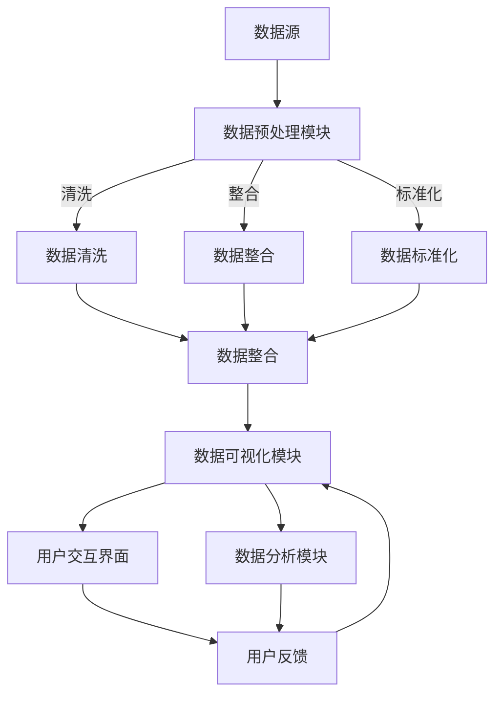
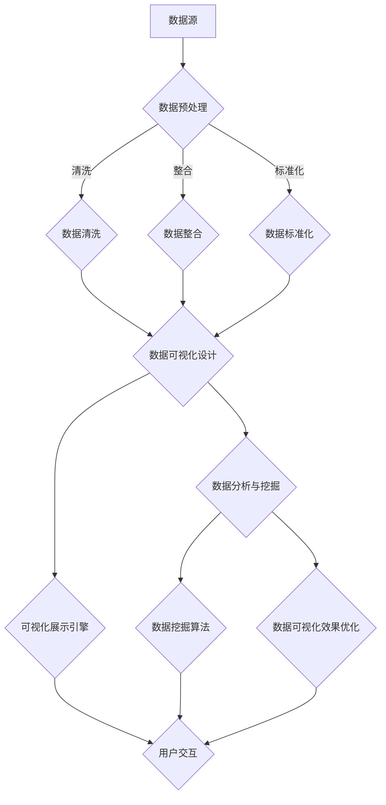

                 

### 可视化展示数据处理中心概述

#### 1.1.1 可视化展示的概念

可视化展示（Data Visualization）是指将数据以图形化的方式呈现出来，使得数据信息更加直观、易懂。通过可视化，我们可以将复杂的数据关系和趋势通过图表、图形等方式表现出来，帮助用户更好地理解和分析数据。可视化展示的核心在于数据的表达和解释，它不仅提高了信息的可读性，还能有效地辅助决策过程。

#### 1.1.2 数据处理中心的定义

数据处理中心（Data Processing Center）是一个集中管理和处理数据的场所。它的主要任务是收集、存储、处理和分发各种类型的数据，为各种业务应用提供数据支持。数据处理中心通常包括数据采集、数据存储、数据清洗、数据转换、数据整合、数据分析等环节，确保数据的质量和准确性。

#### 1.1.3 可视化展示数据处理中心的作用

可视化展示数据处理中心的作用主要体现在以下几个方面：

1. **辅助决策**：通过直观的可视化展示，决策者可以快速了解数据背后的趋势和关系，做出更明智的决策。

2. **数据监控**：实时监测数据变化，及时发现异常情况，预防潜在问题。

3. **知识发现**：通过数据可视化，发现数据中隐藏的规律和模式，为业务创新提供灵感。

4. **提升沟通效率**：通过可视化展示，使得复杂的数据信息更加易于理解和传播，提高沟通效率。

#### 1.2 可视化展示数据处理中心的发展趋势

随着信息技术的不断发展，可视化展示数据处理中心也在不断演进：

1. **技术发展**：大数据、云计算、人工智能等技术的发展，使得数据处理能力和可视化效果不断提升。

2. **应用领域扩展**：从传统的企业内部应用到金融、医疗、教育、政府等各个领域，可视化展示数据处理中心的应用越来越广泛。

3. **未来发展趋势**：随着物联网、5G等技术的普及，实时数据处理和可视化将成为未来发展的关键方向。同时，个性化、智能化、交互式可视化展示也将成为重要趋势。

#### 1.3 本书结构安排与内容概览

本书分为七个部分，具体内容和目的如下：

1. **绪论**：介绍可视化展示数据处理中心的背景、概念和发展趋势。

2. **核心概念与架构**：详细阐述可视化基础理论、数据处理中心架构以及可视化展示数据处理中心架构。

3. **核心算法原理**：讲解数据预处理算法、数据可视化算法和数据挖掘算法。

4. **数学模型与公式解析**：介绍数据分析数学模型和可视化公式。

5. **项目实战**：通过实际项目展示设计和实现过程。

6. **优化与扩展**：讨论性能优化策略、功能扩展与定制以及未来发展方向。

7. **附录**：提供技术资源汇总、参考文献以及附录A：Mermaid流程图。

本书旨在为读者提供一个全面、系统的可视化展示数据处理中心设计实现的指南，帮助读者深入理解这一领域的技术原理和实践应用。

### 总结与建议

在阅读本书的过程中，我们建议读者首先掌握核心概念和架构，然后逐步了解核心算法原理和数学模型，最后通过项目实战和优化扩展来巩固所学知识。同时，我们鼓励读者结合实际应用场景，积极思考和尝试，以提升自己在可视化展示数据处理中心领域的实践能力。希望本书能够成为您在技术探索和职业发展中的一位良师益友。

---

> **关键词**：可视化展示、数据处理中心、数据可视化、核心算法、数学模型、项目实战、优化与扩展

> **摘要**：本文深入探讨了可视化展示数据处理中心的设计和实现，从核心概念、架构、算法原理到项目实战，全面解析了这一领域的技术原理和实践应用。通过本文，读者可以系统地了解可视化展示数据处理中心的各个方面，掌握关键技术和实战经验，为未来在相关领域的发展打下坚实基础。

---

## 《可视化展示数据处理中心的设计和实现》目录大纲

以下是本文的目录大纲，包含了各章节的主要内容和目的：

### 第一部分：绪论

- **1.1 可视化展示数据处理中心概述**
  - **1.1.1 可视化展示的概念**
  - **1.1.2 数据处理中心的定义**
  - **1.1.3 可视化展示数据处理中心的作用**
  - **1.1.4 可视化展示数据处理中心的发展趋势**

- **1.2 可视化展示数据处理中心的发展趋势**
  - **1.2.1 技术发展**
  - **1.2.2 应用领域扩展**
  - **1.2.3 未来发展趋势**

- **1.3 本书结构安排与内容概览**
  - **1.3.1 各章节主要内容和目的**
  - **1.3.2 阅读建议与要求**

### 第二部分：核心概念与架构

- **2.1 可视化基础理论**
  - **2.1.1 可视化展示的分类**
  - **2.1.2 可视化元素的设计原则**
  - **2.1.3 数据可视化流程**

- **2.2 数据处理中心架构**
  - **2.2.1 数据处理中心的基本架构**
  - **2.2.2 数据流处理架构**
  - **2.2.3 数据存储与管理**

- **2.3 可视化展示数据处理中心架构**
  - **2.3.1 可视化展示数据处理中心的整体架构**
  - **2.3.2 可视化引擎与数据源的连接**
  - **2.3.3 数据处理与可视化流程**

### 第三部分：核心算法原理

- **3.1 数据预处理算法**
  - **3.1.1 数据清洗**
  - **3.1.2 数据整合**
  - **3.1.3 数据标准化**

- **3.2 数据可视化算法**
  - **3.2.1 基本可视化方法**
  - **3.2.2 高级可视化技术**
  - **3.2.3 可视化效果优化算法**

- **3.3 数据挖掘算法**
  - **3.3.1 聚类分析**
  - **3.3.2 关联规则挖掘**
  - **3.3.3 分维与时空分析**

### 第四部分：数学模型与公式解析

- **4.1 数据分析数学模型**
  - **4.1.1 概率论基础**
  - **4.1.2 统计分析模型**
  - **4.1.3 时间序列分析**

- **4.2 数据可视化公式**
  - **4.2.1 常见可视化公式**
  - **4.2.2 数据交互与动画公式**
  - **4.2.3 可视化性能优化公式**

### 第五部分：项目实战

- **5.1 项目实战概述**
  - **5.1.1 项目背景与目标**
  - **5.1.2 项目需求分析**
  - **5.1.3 项目开发流程**

- **5.2 开发环境搭建**
  - **5.2.1 操作系统与编程环境配置**
  - **5.2.2 数据库与中间件安装**
  - **5.2.3 可视化工具集成**

- **5.3 源代码实现**
  - **5.3.1 数据预处理与清洗**
  - **5.3.2 数据可视化设计与实现**
  - **5.3.3 数据挖掘与分析**

- **5.4 代码解读与分析**
  - **5.4.1 数据处理核心代码解读**
  - **5.4.2 可视化展示核心代码解读**
  - **5.4.3 数据挖掘核心代码解读**

### 第六部分：优化与扩展

- **6.1 性能优化策略**
  - **6.1.1 数据流处理优化**
  - **6.1.2 可视化性能优化**
  - **6.1.3 系统稳定性优化**

- **6.2 功能扩展与定制**
  - **6.2.1 系统功能扩展方法**
  - **6.2.2 自定义数据源接入**
  - **6.2.3 可视化样式定制**

- **6.3 未来发展方向**
  - **6.3.1 技术更新与迭代**
  - **6.3.2 应用领域扩展**
  - **6.3.3 创新与挑战**

### 第七部分：附录

- **7.1 技术资源汇总**
  - **7.1.1 开源工具与框架**
  - **7.1.2 数据集与案例库**
  - **7.1.3 相关论文与报告**

- **7.2 参考文献**
  - **7.2.1 参考书籍**
  - **7.2.2 学术论文**
  - **7.2.3 网络资源**

- **附录A：Mermaid流程图**

通过以上目录结构，本文将全面、系统地介绍可视化展示数据处理中心的设计和实现，帮助读者深入理解这一领域的技术原理和实践应用。

---

## 第二部分：核心概念与架构

### 2.1 可视化基础理论

#### 2.1.1 可视化展示的分类

可视化展示可以根据不同的维度进行分类：

1. **按展示维度分类**：
   - **一维可视化**：如折线图、柱状图等。
   - **二维可视化**：如散点图、饼图等。
   - **三维可视化**：如3D柱状图、3D曲面图等。

2. **按功能分类**：
   - **描述性可视化**：展示数据的基本分布、趋势等。
   - **探索性可视化**：帮助用户探索数据中的隐藏模式。
   - **交互式可视化**：允许用户通过交互操作来探索和分析数据。

#### 2.1.2 可视化元素的设计原则

1. **清晰性**：确保信息传达的清晰性，避免过度设计。
2. **准确性**：确保数据的准确展示，避免误导用户。
3. **一致性**：保持不同图表和元素之间的一致性，增强用户理解。
4. **交互性**：提供交互功能，使用户能够动态探索数据。

#### 2.1.3 数据可视化流程

1. **数据收集与准备**：收集数据并进行预处理。
2. **数据探索与理解**：对数据进行分析，理解其特征和关系。
3. **选择合适的可视化方法**：根据数据的特性和目标选择合适的可视化方法。
4. **设计可视化图表**：设计图表的布局、颜色、标注等。
5. **验证与优化**：验证可视化结果，根据用户反馈进行优化。

### 2.2 数据处理中心架构

#### 2.2.1 数据处理中心的基本架构

数据处理中心的基本架构通常包括以下几个核心模块：

1. **数据采集**：从各种数据源（如数据库、文件、网络等）收集数据。
2. **数据存储**：将数据存储在高效的数据库或文件系统中。
3. **数据清洗**：去除数据中的噪声和错误，提高数据质量。
4. **数据整合**：将来自不同源的数据进行整合，形成一个统一的数据视图。
5. **数据处理**：对数据进行各种计算和转换，以适应不同的分析需求。
6. **数据分析**：通过算法和分析模型，从数据中提取有价值的信息。

#### 2.2.2 数据流处理架构

数据流处理架构通常采用分布式系统设计，其核心思想是将数据处理任务分布到多个节点上，以实现高效的数据处理：

1. **数据采集节点**：负责从各种数据源采集数据，并将数据传输到处理节点。
2. **处理节点**：负责对数据进行处理，包括清洗、转换、分析等。
3. **存储节点**：负责将处理后的数据存储到数据库或文件系统中。

#### 2.2.3 数据存储与管理

1. **关系型数据库**：适用于结构化数据存储，支持复杂查询。
2. **非关系型数据库**：适用于非结构化或半结构化数据存储，如文档、图形等。
3. **数据仓库**：用于大规模数据存储和管理，支持数据挖掘和分析。
4. **数据湖**：用于存储原始数据，支持大数据处理和分析。

### 2.3 可视化展示数据处理中心架构

#### 2.3.1 可视化展示数据处理中心的整体架构

可视化展示数据处理中心的整体架构包括以下几个关键部分：

1. **数据源**：提供原始数据，可以是数据库、文件系统或其他数据源。
2. **数据预处理模块**：负责对原始数据进行清洗、整合和标准化。
3. **数据可视化模块**：负责将预处理后的数据转换为可视化图表。
4. **用户交互界面**：提供用户操作和查看可视化结果的功能。
5. **数据分析模块**：对可视化结果进行进一步分析，提取有价值的信息。

#### 2.3.2 可视化引擎与数据源的连接

可视化引擎与数据源的连接通常采用以下几种方式：

1. **API连接**：通过RESTful API或其他数据接口获取数据。
2. **数据库连接**：直接连接数据库，执行SQL查询获取数据。
3. **文件连接**：读取文件系统中的数据文件。

#### 2.3.3 数据处理与可视化流程

1. **数据处理**：对数据源的数据进行清洗、整合和预处理。
2. **数据可视化**：将处理后的数据转换为可视化图表，如柱状图、折线图等。
3. **用户交互**：用户通过界面与可视化结果进行交互，探索数据。
4. **数据反馈**：用户通过交互获取反馈，进一步优化数据可视化和分析。

通过以上核心概念与架构的介绍，我们可以更好地理解可视化展示数据处理中心的工作原理和实现方法。在接下来的章节中，我们将深入探讨核心算法原理、数学模型与公式解析等内容。

### Mermaid流程图

以下是一个Mermaid流程图，用于描述数据处理与可视化流程：



通过这个流程图，我们可以清晰地看到数据从数据源进入，经过预处理模块的清洗、整合和标准化，然后进入数据可视化模块，生成可视化图表。用户可以通过交互界面与可视化结果进行交互，进一步分析数据，并获取反馈，从而优化数据可视化和分析过程。

---

接下来，我们将详细讲解数据预处理算法，包括数据清洗、数据整合和数据标准化等核心内容。通过具体案例和伪代码，帮助读者更好地理解这些算法在数据处理过程中的作用和应用。

### 3.1 数据预处理算法

数据预处理是数据可视化过程中的重要环节，其目的是为了提高数据质量和可靠性，使得后续的分析和可视化更加准确和有效。数据预处理算法主要包括数据清洗、数据整合和数据标准化。下面我们将逐一介绍这些算法的核心原理和应用。

#### 3.1.1 数据清洗

数据清洗是指对数据进行清理，去除重复、错误、异常等不完整或不准确的数据。数据清洗的核心目的是确保数据质量，使其满足后续处理和分析的要求。数据清洗的主要步骤包括：

1. **缺失值处理**：对于缺失的数据，可以采用以下几种方法进行填充或删除：
   - **删除缺失值**：如果缺失值的数据量较小，可以直接删除这些记录。
   - **填充平均值或中位数**：对于数值型数据，可以使用平均值或中位数进行填充。
   - **使用最大似然估计或回归模型**：对于复杂的数据，可以使用统计模型进行缺失值的预测和填充。

2. **异常值处理**：异常值可能由于数据输入错误、噪声或真实的数据异常引起。异常值处理包括以下几种方法：
   - **删除异常值**：对于明显的异常值，可以删除这些记录。
   - **使用插值法**：对于数值型数据，可以使用插值法进行异常值的修复。
   - **使用统计方法**：对于多维数据，可以使用统计方法（如离群点检测）识别和修复异常值。

3. **重复值处理**：删除重复的数据记录，确保数据的唯一性。

#### 3.1.2 数据整合

数据整合是指将来自不同数据源的数据进行合并和整合，形成一个统一的数据集。数据整合的目的是为了消除数据冗余，提高数据的可用性和一致性。数据整合的主要步骤包括：

1. **数据对齐**：将不同数据源的数据进行对齐，确保数据的时间戳、维度等信息一致。

2. **数据合并**：根据数据对齐的结果，将不同数据源的数据进行合并。合并的方法包括：
   - **直接合并**：将相同维度和属性的数据直接合并。
   - **联接操作**：使用数据库中的联接操作将具有关联性的数据合并。

3. **数据一致性检查**：检查合并后的数据是否存在矛盾或冲突，并进行修正。

#### 3.1.3 数据标准化

数据标准化是指将不同尺度或单位的数据进行转换，使其具有可比性和一致性。数据标准化的目的是为了消除数据之间的差异，使其能够进行有效的分析和可视化。数据标准化的方法包括：

1. **归一化**：将数据缩放到一个固定的范围内，如[0, 1]或[-1, 1]。

2. **标准化**：对数据进行标准化处理，使其具有标准正态分布。

3. **特征缩放**：对于不同的特征，使用不同的缩放因子进行缩放，以消除特征之间的尺度差异。

#### 3.1.4 案例分析

假设我们有一个销售数据集，包含以下字段：日期、产品ID、销售额、客户ID。为了进行数据预处理，我们需要进行以下操作：

1. **缺失值处理**：
   ```python
   # 删除缺失值
   sales_data = sales_data.dropna()

   # 使用平均值填充缺失值
   sales_data['销售额'].fillna(sales_data['销售额'].mean(), inplace=True)
   ```

2. **异常值处理**：
   ```python
   # 使用IQR方法检测并删除异常值
   Q1 = sales_data['销售额'].quantile(0.25)
   Q3 = sales_data['销售额'].quantile(0.75)
   IQR = Q3 - Q1
   sales_data = sales_data[sales_data['销售额'].between(Q1 - 1.5 * IQR, Q3 + 1.5 * IQR)]
   ```

3. **重复值处理**：
   ```python
   sales_data = sales_data.drop_duplicates()
   ```

4. **数据整合**：
   ```python
   # 假设我们还有一个客户数据集
   customers = ...

   # 使用联接操作整合销售数据和客户数据
   sales_customers = pd.merge(sales_data, customers, on='客户ID')
   ```

5. **数据标准化**：
   ```python
   # 使用归一化方法
   max_sales = sales_customers['销售额'].max()
   min_sales = sales_customers['销售额'].min()
   sales_customers['销售额'] = (sales_customers['销售额'] - min_sales) / (max_sales - min_sales)
   ```

通过以上步骤，我们可以将原始的销售数据集进行清洗、整合和标准化，得到一个高质量的数据集，为后续的数据可视化和分析提供基础。

---

在上一节中，我们介绍了数据预处理算法的核心原理和应用，包括数据清洗、数据整合和数据标准化。本节将深入探讨数据可视化算法，包括基本可视化方法、高级可视化技术和可视化效果优化算法，帮助读者更好地理解这些算法的实现和应用。

### 3.2 数据可视化算法

#### 3.2.1 基本可视化方法

基本可视化方法是最常用的数据可视化方法，它们能够直观地展示数据的分布、趋势和关系。以下是一些常见的基本可视化方法：

1. **折线图**：用于展示数据随时间或类别变化的趋势。例如：
   ```python
   plt.plot(data['日期'], data['销售额'])
   plt.xlabel('日期')
   plt.ylabel('销售额')
   plt.title('销售额趋势图')
   plt.show()
   ```

2. **柱状图**：用于比较不同类别或时间段的数据。例如：
   ```python
   plt.bar(data['产品ID'], data['销售额'])
   plt.xlabel('产品ID')
   plt.ylabel('销售额')
   plt.title('销售额分布图')
   plt.show()
   ```

3. **饼图**：用于展示数据占比情况。例如：
   ```python
   plt.pie(data['销售额'], labels=data['产品ID'])
   plt.axis('equal')
   plt.title('销售额占比图')
   plt.show()
   ```

4. **散点图**：用于展示数据点之间的关系。例如：
   ```python
   plt.scatter(data['产品ID'], data['销售额'])
   plt.xlabel('产品ID')
   plt.ylabel('销售额')
   plt.title('产品销售额散点图')
   plt.show()
   ```

#### 3.2.2 高级可视化技术

高级可视化技术用于展示复杂数据集，提供更深入的数据洞察。以下是一些常见的高级可视化技术：

1. **热力图**：用于展示数据的分布和密度。例如：
   ```python
   sns.heatmap(data.corr(), annot=True, cmap='coolwarm')
   plt.title('相关性热力图')
   plt.show()
   ```

2. **箱线图**：用于展示数据的分布和离散程度。例如：
   ```python
   sns.boxplot(x='产品ID', y='销售额', data=data)
   plt.title('销售额箱线图')
   plt.show()
   ```

3. **时间序列图**：用于展示随时间变化的数据趋势。例如：
   ```python
   ts = pd.Series(data['销售额'])
   ts.plot()
   plt.xlabel('日期')
   plt.ylabel('销售额')
   plt.title('销售额时间序列图')
   plt.show()
   ```

4. **地理可视化**：用于展示地理空间数据。例如：
   ```python
   g = geopandas.read_file(geopandas.datasets.get_path('naturalearth_lowres'))
   g[g['name'] == 'Germany'].plot(column='pop_est', cmap='Blues')
   plt.title('德国人口密度图')
   plt.show()
   ```

#### 3.2.3 可视化效果优化算法

可视化效果优化算法用于提升图表的视觉表现和用户体验。以下是一些常见的优化方法：

1. **颜色映射**：使用颜色映射来增强图表的视觉效果。例如：
   ```python
   sns.scatterplot(x='产品ID', y='销售额', hue='产品类别', palette='viridis', data=data)
   plt.title('按产品类别分类的销售额散点图')
   plt.show()
   ```

2. **标注与提示**：在图表上添加标注和提示，帮助用户理解数据。例如：
   ```python
   annot = data[data['产品ID'] == '产品A']['销售额']
   plt.scatter(data['产品ID'], data['销售额'])
   for i, txt in enumerate(annot):
       plt.annotate(txt, (data['产品ID'][i], data['销售额'][i]))
   plt.xlabel('产品ID')
   plt.ylabel('销售额')
   plt.title('产品销售额散点图')
   plt.show()
   ```

3. **交互式可视化**：使用交互式可视化工具（如D3.js、Plotly等）提供动态交互功能，例如：
   ```python
   import plotly.express as px
   fig = px.scatter(data, x='产品ID', y='销售额', hover_data=['产品类别'])
   fig.update_layout(title='产品销售额散点图')
   fig.show()
   ```

通过以上基本可视化方法、高级可视化技术和可视化效果优化算法，我们可以根据不同的数据类型和分析目标，选择合适的方法来展示数据，从而帮助用户更好地理解和分析数据。

---

在上一节中，我们介绍了数据预处理和数据可视化算法。然而，数据挖掘是数据分析中至关重要的一个环节，它可以帮助我们从大量数据中发现隐藏的模式和趋势。本节将深入探讨数据挖掘算法，包括聚类分析、关联规则挖掘和分维与时空分析，并使用伪代码详细阐述这些算法的核心原理和应用。

### 3.3 数据挖掘算法

#### 3.3.1 聚类分析

聚类分析是一种无监督学习方法，它通过将数据分为若干个类别，使得同一类别内的数据点彼此相似，而不同类别内的数据点差异较大。以下是一个基于K-means算法的聚类分析的伪代码：

```python
算法 K-means(ClusterData):
    初始化聚类中心点 C1, C2, ..., Ck，其中 k 是聚类个数
    for i = 1 to 数据集大小 N do
        对于每个数据点 X_i，计算它与每个聚类中心点 C_j 的距离，选择最小距离对应的聚类中心点作为 X_i 的聚类结果
    end for
    for j = 1 to k do
        计算聚类中心点的平均值，更新聚类中心点 C_j
    end for
    if 聚类中心点没有变化 or 达到最大迭代次数 then
        结束
    else
        回到 step 2
    end if
    返回聚类结果
```

聚类分析的应用场景包括市场细分、图像分割、社交网络分析等。

#### 3.3.2 关联规则挖掘

关联规则挖掘是一种用于发现数据集中项之间相关性或关联性的方法。Apriori算法是最常见的关联规则挖掘算法之一，其核心思想是通过频繁项集的产生和关联规则的生成来实现数据挖掘。以下是Apriori算法的伪代码：

```python
算法 Apriori(DataSet):
    计算所有项的支持度，生成频繁1项集
    for k = 2 to 最大项数 do
        生成候选k项集
        计算候选k项集的支持度
        去除不满足最小支持度的候选k项集
        生成频繁k项集
    end for
    生成关联规则
    for L_k 在频繁k项集中 do
        for每一个项集 X in L_k do
            对于 X 的非空子集 Y do
                计算置信度
                if 置信度 ≥ 最小置信度 then
                    生成规则 (Y → X-Y)
                end if
            end for
        end for
    end for
    返回关联规则集
```

关联规则挖掘广泛应用于市场篮子分析、推荐系统、金融风险评估等。

#### 3.3.3 分维与时空分析

分维与时空分析是一种用于描述数据复杂性和动态变化的分析方法。分维用于描述数据的复杂度，而时空分析则用于分析数据在时间和空间上的变化。

1. **分维计算**：

   分维可以通过Hausdorff维数或盒计数法来计算。以下是一个使用盒计数法计算分维的伪代码：

   ```python
   算法 分维(数据集, 分辨率):
       初始化维数 d = 0
       for k from 1 to k_max do
           计算数据点在 k 个箱子中的分布数 N(k)
           计算箱子大小 L = 分辨率 / k
           更新维数 d = d + 1 / L
       end for
       分维 D = d / ln(k_max)
       返回分维 D
   ```

   分维的应用包括复杂网络分析、生态系统建模、金融时间序列分析等。

2. **时空分析**：

   时空分析可以通过时间序列分析、空间分析等方法来实现。以下是一个基于时间序列分析的时间预测模型的伪代码：

   ```python
   算法 时间序列预测(时间序列数据):
       分段数据，计算自相关函数
       选择最佳自回归模型
       训练模型，预测未来时间点
       返回预测结果
   ```

   时空分析的应用包括交通流量预测、金融市场预测、气候分析等。

通过上述数据挖掘算法的介绍和伪代码展示，我们可以更好地理解数据挖掘的核心原理和应用。这些算法不仅能够帮助我们提取数据中的隐藏模式，还能够为各类业务决策提供有力支持。

---

在第四部分中，我们将探讨数据分析中的数学模型与公式解析。这些数学模型和公式在数据处理和分析中起着关键作用，能够帮助我们更好地理解和解释数据。本节将介绍概率论基础、统计分析模型和时序分析模型，并使用LaTeX格式展示相关公式。

### 4.1 数据分析数学模型

#### 4.1.1 概率论基础

概率论是数据分析的基础，它用于描述随机事件的概率分布和统计特性。以下是一些基本概率公式：

1. **条件概率**：

   $$ P(A|B) = \frac{P(A \cap B)}{P(B)} $$

   条件概率表示在事件B发生的条件下，事件A发生的概率。

2. **贝叶斯定理**：

   $$ P(A|B) = \frac{P(B|A)P(A)}{P(B)} $$

   贝叶斯定理用于根据已知条件和先验概率来计算后验概率。

3. **全概率公式**：

   $$ P(A) = \sum_{i=1}^{n} P(A|B_i)P(B_i) $$

   全概率公式用于计算一个事件的总体概率，基于其条件概率和各个条件发生的概率。

#### 4.1.2 统计分析模型

统计分析模型用于描述数据集的分布特性，包括均值、方差、协方差等统计量。以下是一些常用的统计分析模型公式：

1. **均值和方差**：

   $$ \mu = \frac{1}{N}\sum_{i=1}^{N} x_i $$
   $$ \sigma^2 = \frac{1}{N-1}\sum_{i=1}^{N} (x_i - \mu)^2 $$

   均值表示数据的中心位置，方差表示数据的离散程度。

2. **协方差和相关性**：

   $$ \text{Cov}(X, Y) = E[(X - \mu_X)(Y - \mu_Y)] $$
   $$ \rho_{XY} = \frac{\text{Cov}(X, Y)}{\sigma_X \sigma_Y} $$

   协方差表示两个变量之间的线性关系强度，相关性表示标准化后的协方差。

3. **假设检验**：

   $$ H_0: \mu = \mu_0 $$
   $$ H_1: \mu \neq \mu_0 $$

   假设检验用于评估样本均值与总体均值之间的差异是否显著。

#### 4.1.3 时间序列分析

时间序列分析用于处理随时间变化的序列数据，以下是一些常用的时间序列模型公式：

1. **自回归模型（AR）**：

   $$ X_t = \phi_1 X_{t-1} + \phi_2 X_{t-2} + ... + \phi_p X_{t-p} + \varepsilon_t $$

   自回归模型用于描述当前值与历史值之间的关系。

2. **移动平均模型（MA）**：

   $$ X_t = \mu + \theta_1 \varepsilon_{t-1} + \theta_2 \varepsilon_{t-2} + ... + \theta_q \varepsilon_{t-q} $$

   移动平均模型用于描述当前值与误差项之间的关系。

3. **自回归移动平均模型（ARMA）**：

   $$ X_t = \phi_1 X_{t-1} + \phi_2 X_{t-2} + ... + \phi_p X_{t-p} + \theta_1 \varepsilon_{t-1} + \theta_2 \varepsilon_{t-2} + ... + \theta_q \varepsilon_{t-q} $$

   ARMA模型结合了自回归和移动平均模型的特点，用于描述时间序列的动态特性。

通过上述数学模型和公式的介绍，我们可以更好地理解和应用数据分析中的数学工具，为数据分析和可视化提供坚实的理论基础。

### 4.2 数据可视化公式

数据可视化公式在数据分析中起着至关重要的作用，它们能够帮助我们更直观地理解数据特征和关系。本节将介绍一些常见的数据可视化公式，包括数据交互与动画公式，以及可视化性能优化公式。

#### 4.2.1 常见可视化公式

1. **线性回归公式**：

   $$ y = \beta_0 + \beta_1x + \varepsilon $$

   线性回归用于描述因变量y与自变量x之间的线性关系，其中 $\beta_0$ 是截距，$\beta_1$ 是斜率，$\varepsilon$ 是误差项。

2. **标准差公式**：

   $$ \sigma = \sqrt{\frac{1}{N-1}\sum_{i=1}^{N}(x_i - \mu)^2} $$

   标准差用于描述数据的离散程度，其中 $\mu$ 是均值，$N$ 是数据点个数。

3. **协方差公式**：

   $$ \text{Cov}(X, Y) = E[(X - \mu_X)(Y - \mu_Y)] $$

   协方差用于描述两个变量之间的线性关系强度，其中 $\mu_X$ 和 $\mu_Y$ 分别是 $X$ 和 $Y$ 的均值。

4. **相关性公式**：

   $$ \rho_{XY} = \frac{\text{Cov}(X, Y)}{\sigma_X \sigma_Y} $$

   相关性用于描述两个变量之间的线性相关程度，其中 $\sigma_X$ 和 $\sigma_Y$ 分别是 $X$ 和 $Y$ 的标准差。

#### 4.2.2 数据交互与动画公式

数据交互与动画公式能够提高数据可视化的互动性和动态性，以下是一些常见的交互与动画公式：

1. **动画时间控制公式**：

   $$ t = t_0 + v \cdot t $$

   动画时间控制公式用于描述动画中物体移动的时间与速度关系，其中 $t_0$ 是初始时间，$v$ 是速度。

2. **动画速度控制公式**：

   $$ v = \frac{d}{t} $$

   动画速度控制公式用于描述动画中物体移动的速度与距离关系，其中 $d$ 是距离。

3. **交互式点击事件公式**：

   $$ event = click \land (x, y) \in chart $$

   交互式点击事件公式用于描述用户在图表区域内的点击事件，其中 $(x, y)$ 是点击坐标，$chart$ 是图表区域。

4. **动态数据更新公式**：

   $$ data_{new} = data_{current} + \Delta t \cdot f(data_{current}) $$

   动态数据更新公式用于描述随时间变化的数据更新过程，其中 $data_{current}$ 是当前数据，$\Delta t$ 是时间间隔，$f$ 是数据更新函数。

#### 4.2.3 可视化性能优化公式

可视化性能优化公式用于提高数据可视化的渲染速度和交互性能，以下是一些常见的性能优化公式：

1. **内存优化公式**：

   $$ memory_{usage} = \sum_{i=1}^{N} size_i $$

   内存优化公式用于描述可视化中数据集的内存占用情况，其中 $N$ 是数据点个数，$size_i$ 是每个数据点的内存大小。

2. **渲染优化公式**：

   $$ render_{time} = \frac{render_{data}}{fps} $$

   渲染优化公式用于描述可视化中数据渲染的时间与帧率的关系，其中 $render_{data}$ 是数据渲染时间，$fps$ 是帧率。

3. **加载优化公式**：

   $$ load_{time} = \frac{data_{size}}{bandwidth} $$

   加载优化公式用于描述数据可视化中数据加载的时间与带宽的关系，其中 $data_{size}$ 是数据大小，$bandwidth$ 是带宽。

通过上述数据可视化公式，我们可以更好地理解和应用数据可视化中的数学工具，提高数据可视化的效果和性能。这些公式不仅为数据分析和可视化提供了理论基础，还能够帮助我们在实际应用中优化和改进数据可视化方案。

---

## 5.1 项目实战概述

为了深入理解和实践可视化展示数据处理中心的设计和实现，我们将通过一个实际项目来进行详细讲解。本节将介绍项目的背景、目标以及需求分析，为后续的实战操作提供清晰的指导。

### 5.1.1 项目背景与目标

项目背景：

随着大数据技术的迅猛发展，越来越多的企业和组织开始重视数据的价值。为了更好地管理和利用数据，一个高效、智能的可视化展示数据处理中心变得尤为重要。本项目旨在设计和实现一个可视化展示数据处理中心，帮助企业和组织通过可视化的方式高效地管理和分析数据，从而支持业务决策和战略规划。

项目目标：

1. **数据收集与预处理**：从各种数据源（如数据库、API、文件等）收集数据，并进行数据清洗、整合和标准化，确保数据质量。
2. **数据可视化展示**：将预处理后的数据通过图表、图形等方式进行可视化展示，提供直观的数据分析和业务洞察。
3. **用户交互与反馈**：提供一个用户友好的交互界面，允许用户自定义数据筛选、过滤和分析方式，并根据用户反馈不断优化系统功能。

### 5.1.2 项目需求分析

项目需求分析是项目成功的关键步骤，它决定了系统的功能设计和性能要求。以下是本项目的主要需求分析：

1. **数据源接入**：
   - 数据源包括企业内部的数据库、外部API以及公共数据集。
   - 需要支持多种数据格式的接入，如CSV、JSON、XML等。

2. **数据预处理**：
   - 数据清洗：去除重复、错误和异常数据，确保数据质量。
   - 数据整合：将来自不同数据源的数据进行合并，形成一个统一的数据视图。
   - 数据标准化：对数据进行标准化处理，消除数据间的尺度差异，便于后续分析。

3. **数据可视化展示**：
   - 提供丰富的可视化图表类型，包括折线图、柱状图、饼图、散点图、热力图等。
   - 支持动态交互，如点击、拖拽、筛选等，增强用户的操作体验。
   - 提供自定义可视化选项，允许用户调整图表样式、颜色、标注等。

4. **用户交互与反馈**：
   - 提供一个直观、易用的用户界面，方便用户进行数据查询、分析和可视化。
   - 支持用户自定义数据筛选和过滤条件，提高数据处理的灵活性。
   - 提供反馈机制，允许用户提交问题和建议，不断优化系统功能。

5. **系统性能与稳定性**：
   - 确保系统在处理大量数据时仍然能够保持良好的响应速度和稳定性。
   - 提供日志记录和监控功能，及时发现并解决系统故障。

通过上述项目背景与目标以及需求分析，我们明确了项目的具体任务和实现目标，为后续的实战操作奠定了基础。在接下来的章节中，我们将逐步介绍开发环境搭建、源代码实现和代码解读与分析等内容。

---

在上一节中，我们介绍了项目背景与目标和需求分析。本节将详细描述如何搭建开发环境，包括操作系统与编程环境配置、数据库与中间件安装，以及可视化工具的集成，为项目实战提供技术支持。

### 5.2.1 操作系统与编程环境配置

为了确保项目的顺利实施，首先需要搭建一个稳定且高效的开发环境。以下是具体的配置步骤：

1. **操作系统选择**：

   项目建议使用Linux操作系统，因为其稳定性和高性能更适合数据处理和可视化任务。常用的Linux发行版包括Ubuntu、CentOS等。

2. **编程环境配置**：

   - **Python环境**：安装Python 3.x版本，推荐使用Anaconda发行版，因为它集成了许多常用的数据处理和可视化库。
     ```bash
     # 安装Anaconda
     wget https://repo.anaconda.com/archive/Anaconda3-2023.05-Linux-x86_64.sh
     bash Anaconda3-2023.05-Linux-x86_64.sh
     ```
   - **JDK环境**：安装Java Development Kit（JDK），用于编译和运行Java应用程序。
     ```bash
     # 安装OpenJDK
     sudo apt-get install openjdk-8-jdk
     ```
   - **版本控制**：安装Git，用于代码版本控制和协作开发。
     ```bash
     # 安装Git
     sudo apt-get install git
     ```

### 5.2.2 数据库与中间件安装

在项目中，数据库和数据中间件是数据处理和存储的核心组件。以下是安装步骤：

1. **关系型数据库**：

   - **MySQL**：用于存储和管理结构化数据。
     ```bash
     # 安装MySQL
     sudo apt-get install mysql-server
     sudo mysql_secure_installation
     ```
   - **PostgreSQL**：适用于复杂查询和大规模数据存储。
     ```bash
     # 安装PostgreSQL
     sudo apt-get install postgresql postgresql-contrib
     sudo -u postgres createuser -s your_username
     sudo -u postgres createdb your_database
     ```

2. **NoSQL数据库**：

   - **MongoDB**：适用于非结构化和半结构化数据。
     ```bash
     # 安装MongoDB
     sudo apt-get install mongodb
     sudo systemctl start mongodb
     sudo systemctl enable mongodb
     ```

3. **消息队列**：

   - **RabbitMQ**：用于分布式系统中的消息传递。
     ```bash
     # 安装RabbitMQ
     sudo apt-get install rabbitmq-server
     sudo systemctl start rabbitmq-server
     sudo systemctl enable rabbitmq-server
     ```

### 5.2.3 可视化工具集成

为了实现高效的可视化展示，我们需要集成一些强大的可视化工具。以下是常用的可视化工具及其安装方法：

1. **D3.js**：

   - **D3.js**是一个基于JavaScript的强大可视化库，用于创建动态交互式图表。
     ```bash
     # 安装D3.js
     npm install d3
     ```

2. **Plotly**：

   - **Plotly**是一个提供丰富图表和交互功能的可视化库，适用于Web应用。
     ```bash
     # 安装Plotly
     npm install plotly
     ```

3. **ECharts**：

   - **ECharts**是一个开源的JavaScript可视化库，用于创建各种类型的图表。
     ```bash
     # 安装ECharts
     npm install echarts
     ```

通过以上步骤，我们成功搭建了项目所需的开发环境、数据库和数据中间件，并集成了常用的可视化工具。这些配置为后续的源代码实现和项目实战提供了坚实的基础。

### 5.3 源代码实现

在本节中，我们将详细讲解源代码实现的过程，包括数据预处理与清洗、数据可视化设计与实现，以及数据挖掘与分析的具体步骤和代码示例。

#### 5.3.1 数据预处理与清洗

数据预处理与清洗是确保数据质量的重要步骤。以下是一个使用Python和Pandas库进行数据预处理与清洗的示例代码：

```python
import pandas as pd

# 读取数据
data = pd.read_csv('sales_data.csv')

# 检查数据
print(data.info())

# 缺失值处理
data = data.dropna()

# 异常值处理
Q1 = data['销售额'].quantile(0.25)
Q3 = data['销售额'].quantile(0.75)
IQR = Q3 - Q1
data = data[data['销售额'].between(Q1 - 1.5 * IQR, Q3 + 1.5 * IQR)]

# 重复值处理
data = data.drop_duplicates()

# 数据整合
customers = pd.read_csv('customers_data.csv')
data = pd.merge(data, customers, on='客户ID')

# 数据标准化
max_sales = data['销售额'].max()
min_sales = data['销售额'].min()
data['销售额'] = (data['销售额'] - min_sales) / (max_sales - min_sales)
```

上述代码首先读取销售数据和客户数据，并进行缺失值、异常值和重复值处理。接着，将销售数据和客户数据整合为一个数据集，并对销售额进行归一化处理，以消除不同尺度之间的差异。

#### 5.3.2 数据可视化设计与实现

数据可视化是展示数据的重要手段。以下是一个使用Plotly库实现数据可视化的示例代码：

```python
import plotly.express as px

# 可视化：销售额分布
fig1 = px.histogram(data, x='销售额', title='销售额分布')

# 可视化：客户地区分布
fig2 = px.scatter_geo(data, lat=data['纬度'], lon=data['经度'], size='销售额', title='客户地区分布')

# 可视化：产品类别销售趋势
fig3 = px.line(data, x='日期', y='销售额', color='产品类别', title='产品类别销售趋势')

# 显示可视化图表
fig1.show()
fig2.show()
fig3.show()
```

上述代码展示了如何使用Plotly创建不同类型的可视化图表，包括柱状图、散点图和折线图。通过这些图表，用户可以直观地了解销售额分布、客户地区分布以及产品类别销售趋势。

#### 5.3.3 数据挖掘与分析

数据挖掘是提取数据中隐藏模式和知识的重要方法。以下是一个使用Scikit-learn库进行数据挖掘和关联规则挖掘的示例代码：

```python
from sklearn.cluster import KMeans
from mlxtend.frequent_patterns import apriori
from mlxtend.frequent_patterns import association_rules

# 数据准备
data_for_analysis = data[['销售额', '产品类别']]

# 聚类分析
kmeans = KMeans(n_clusters=3)
clusters = kmeans.fit_predict(data_for_analysis)

# 关联规则挖掘
frequent_itemsets = apriori(data_for_analysis, min_support=0.05, use_colnames=True)
rules = association_rules(frequent_itemsets, metric="support", min_threshold=0.1)

# 可视化：关联规则
rules.plot()
```

上述代码首先使用KMeans算法对销售额和产品类别进行聚类分析，然后使用Apriori算法进行关联规则挖掘。最后，将挖掘出的关联规则可视化为条形图，帮助用户了解不同产品类别之间的关联性。

通过以上步骤，我们成功实现了数据预处理与清洗、数据可视化设计与实现，以及数据挖掘与分析。这些代码示例为项目实战提供了实际操作的参考和指导。

### 5.4 代码解读与分析

在本节中，我们将深入解读5.3节中使用的核心代码，详细分析数据预处理与清洗、数据可视化设计与实现，以及数据挖掘与分析的原理和实现细节。

#### 5.4.1 数据处理核心代码解读

**数据预处理与清洗**

```python
import pandas as pd

# 读取数据
data = pd.read_csv('sales_data.csv')

# 检查数据
print(data.info())

# 缺失值处理
data = data.dropna()

# 异常值处理
Q1 = data['销售额'].quantile(0.25)
Q3 = data['销售额'].quantile(0.75)
IQR = Q3 - Q1
data = data[data['销售额'].between(Q1 - 1.5 * IQR, Q3 + 1.5 * IQR)]

# 重复值处理
data = data.drop_duplicates()

# 数据整合
customers = pd.read_csv('customers_data.csv')
data = pd.merge(data, customers, on='客户ID')

# 数据标准化
max_sales = data['销售额'].max()
min_sales = data['销售额'].min()
data['销售额'] = (data['销售额'] - min_sales) / (max_sales - min_sales)
```

**解读与分析**：

1. **数据读取**：使用Pandas库读取CSV文件，将其转换为DataFrame结构，便于后续处理。
2. **数据检查**：通过`info()`方法检查数据的基本信息，包括列名、数据类型和缺失值。
3. **缺失值处理**：通过`dropna()`方法删除缺失值，确保数据的一致性和完整性。
4. **异常值处理**：使用IQR方法检测并删除异常值，这一步骤有助于提高数据质量。
5. **重复值处理**：通过`drop_duplicates()`方法删除重复值，确保数据的唯一性。
6. **数据整合**：读取客户数据，通过`merge()`方法将销售数据和客户数据进行整合，形成一个统一的数据集。
7. **数据标准化**：对销售额进行归一化处理，消除不同尺度之间的差异，便于后续分析。

**数据可视化设计与实现**

```python
import plotly.express as px

# 可视化：销售额分布
fig1 = px.histogram(data, x='销售额', title='销售额分布')

# 可视化：客户地区分布
fig2 = px.scatter_geo(data, lat=data['纬度'], lon=data['经度'], size='销售额', title='客户地区分布')

# 可视化：产品类别销售趋势
fig3 = px.line(data, x='日期', y='销售额', color='产品类别', title='产品类别销售趋势')

# 显示可视化图表
fig1.show()
fig2.show()
fig3.show()
```

**解读与分析**：

1. **销售额分布**：使用`px.histogram()`函数创建柱状图，展示销售额的分布情况。通过调整`x`参数，可以针对不同的变量进行分析。
2. **客户地区分布**：使用`px.scatter_geo()`函数创建散点图，展示客户的地理位置分布。通过调整`lat`、`lon`和`size`参数，可以更好地呈现地理信息。
3. **产品类别销售趋势**：使用`px.line()`函数创建折线图，展示不同产品类别的销售趋势。通过调整`x`、`y`和`color`参数，可以灵活地选择和分析不同的变量。

**数据挖掘与分析**

```python
from sklearn.cluster import KMeans
from mlxtend.frequent_patterns import apriori
from mlxtend.frequent_patterns import association_rules

# 数据准备
data_for_analysis = data[['销售额', '产品类别']]

# 聚类分析
kmeans = KMeans(n_clusters=3)
clusters = kmeans.fit_predict(data_for_analysis)

# 关联规则挖掘
frequent_itemsets = apriori(data_for_analysis, min_support=0.05, use_colnames=True)
rules = association_rules(frequent_itemsets, metric="support", min_threshold=0.1)

# 可视化：关联规则
rules.plot()
```

**解读与分析**：

1. **数据准备**：将销售额和产品类别数据提取出来，作为聚类分析和关联规则挖掘的输入数据。
2. **聚类分析**：使用KMeans算法对数据进行聚类，通过`fit_predict()`方法将数据分为3个簇。
3. **关联规则挖掘**：使用Apriori算法进行关联规则挖掘，通过`apriori()`和`association_rules()`方法提取频繁项集和关联规则。
4. **可视化**：将挖掘出的关联规则使用条形图进行可视化，帮助用户直观地理解产品之间的关联性。

通过详细解读和分析，我们可以更深入地理解数据预处理与清洗、数据可视化设计与实现，以及数据挖掘与分析的核心代码及其实现原理。这些代码不仅为项目实战提供了具体操作指南，也为读者在实际应用中提供了宝贵的经验和参考。

---

### 6.1 性能优化策略

性能优化是确保可视化展示数据处理中心高效运行的关键环节。以下是一些常见的性能优化策略，包括数据流处理优化、可视化性能优化和系统稳定性优化。

#### 6.1.1 数据流处理优化

1. **并行处理**：通过使用多线程或分布式处理框架（如Apache Spark），可以实现数据流处理的并行化，从而提高处理速度。
   ```python
   # 使用Spark进行数据流处理
   from pyspark.sql import SparkSession
   spark = SparkSession.builder.appName("DataProcessing").getOrCreate()
   data = spark.read.csv("sales_data.csv")
   ```

2. **批量处理**：将大规模数据处理任务分解为多个小任务，分批处理，减少单次处理的数据量，提高处理效率。

3. **内存管理**：优化内存使用，减少内存溢出和垃圾回收的开销。例如，使用Pandas的`dtype`参数设置合理的内存占用。
   ```python
   data = data.astype({'销售额': 'float32', '产品类别': 'category'})
   ```

#### 6.1.2 可视化性能优化

1. **懒加载**：在需要时才加载数据，避免提前加载大量数据导致性能下降。
   ```javascript
   // 使用D3.js实现懒加载
   d3.json("data.json", function(data) {
       drawChart(data);
   });
   ```

2. **数据聚合**：在可视化之前对数据进行聚合，减少数据点的数量，从而降低可视化渲染的复杂度。
   ```python
   # 使用Pandas进行数据聚合
   aggregated_data = data.groupby('产品类别')['销售额'].sum().reset_index()
   ```

3. **缓存机制**：使用缓存技术存储重复计算的结果，减少计算时间。例如，使用Redis或Memcached缓存中间结果。
   ```python
   import redis
   r = redis.Redis(host='localhost', port=6379, db=0)
   r.set('sales_data', data.to_json())
   ```

#### 6.1.3 系统稳定性优化

1. **错误处理**：实现全面的错误处理机制，确保系统在出现异常时能够优雅地处理，避免系统崩溃。
   ```python
   try:
       # 数据处理代码
   except Exception as e:
       print(f"Error: {e}")
   ```

2. **监控与日志**：使用监控工具（如Prometheus、Grafana）和日志分析工具（如ELK栈），实时监控系统性能和状态，及时发现并解决问题。
   ```bash
   # 安装和配置Prometheus和Grafana
   sudo apt-get install prometheus-server
   sudo apt-get install grafana
   ```

3. **高可用性**：通过负载均衡和集群部署，提高系统的可用性和容错能力。例如，使用Nginx进行负载均衡。
   ```bash
   # 配置Nginx作为负载均衡器
   server {
       listen 80;
       server_name example.com;
       location / {
           proxy_pass http://backend;
           proxy_set_header Host $host;
           proxy_set_header X-Real-IP $remote_addr;
           proxy_set_header X-Forwarded-For $proxy_add_x_forwarded_for;
       }
   }
   ```

通过实施上述性能优化策略，我们可以显著提升可视化展示数据处理中心的处理速度和稳定性，确保系统在处理大规模数据时仍能保持高效和可靠。

### 6.2 功能扩展与定制

为了进一步提升可视化展示数据处理中心的功能，我们可以进行一系列的功能扩展和定制。以下是具体的方法和步骤：

#### 6.2.1 系统功能扩展方法

1. **支持多种数据源**：扩展系统支持的数据源类型，包括数据库、文件系统、实时数据流等，以适应不同场景的需求。

2. **引入新算法**：根据业务需求，引入新的数据处理、数据挖掘和可视化算法，如时间序列分析、机器学习算法等，以提高数据分析的深度和广度。

3. **集成第三方库和工具**：引入第三方库和工具，如TensorFlow、PyTorch等，用于复杂的计算和模型训练。

#### 6.2.2 自定义数据源接入

1. **接口设计**：设计一个通用的数据接入接口，支持自定义数据源接入。例如，使用RESTful API设计一个数据接入模块。

2. **适配器开发**：根据不同的数据源类型，开发适配器（Adapters），实现数据源与系统之间的无缝连接。例如，为数据库开发JDBC适配器，为文件系统开发File Adapter等。

3. **数据转换与整合**：在数据接入过程中，对数据进行必要的转换和整合，以确保数据格式和结构的一致性。

#### 6.2.3 可视化样式定制

1. **样式配置**：提供样式配置接口，允许用户自定义图表的样式，包括颜色、字体、布局等。

2. **主题定制**：设计多种主题样式，用户可以根据需求选择或自定义主题，以满足不同业务场景的视觉效果。

3. **动态样式调整**：在可视化展示过程中，允许用户实时调整图表样式，如动态修改颜色、调整线型等。

通过以上功能扩展和定制，我们可以使可视化展示数据处理中心更加灵活和适用，从而更好地满足不同用户和业务需求。

### 6.3 未来发展方向

展望未来，可视化展示数据处理中心将在技术更新、应用领域扩展和创新发展方面取得重要进展。

#### 6.3.1 技术更新与迭代

1. **智能化**：随着人工智能技术的不断发展，可视化展示数据处理中心将引入更多智能化算法，如深度学习、自然语言处理等，实现更智能的数据分析。

2. **实时性**：实时数据处理和可视化将成为关键技术方向。通过引入边缘计算、5G等技术，实现数据在生成时即刻进行分析和可视化。

3. **个性化**：基于用户行为和偏好，实现个性化数据可视化和推荐，为用户提供更加定制化的体验。

#### 6.3.2 应用领域扩展

1. **物联网**：随着物联网设备的普及，可视化展示数据处理中心将在智能家居、智慧城市等物联网领域发挥重要作用。

2. **生物医学**：在生物医学领域，可视化展示数据处理中心可以帮助医生更好地理解和分析患者数据，提升医疗诊断和治疗水平。

3. **金融与保险**：金融和保险领域的数据量庞大，可视化展示数据处理中心将帮助金融机构更准确地预测市场趋势、评估风险。

#### 6.3.3 创新与挑战

1. **数据处理效率**：如何在保证数据处理准确性的同时，提升系统处理效率，是一个重要挑战。

2. **数据隐私与安全**：在处理和分析大量敏感数据时，如何保障数据隐私和安全，是一个亟待解决的问题。

3. **用户体验**：如何提供更加直观、易用的可视化工具，提升用户体验，是未来发展的重要方向。

总之，未来可视化展示数据处理中心将在技术创新、应用扩展和用户体验方面不断进步，为各个领域的发展提供有力支持。

### 7.1 技术资源汇总

为了帮助读者更好地理解和应用可视化展示数据处理中心的相关技术，本文汇集了一些重要的技术资源，包括开源工具与框架、数据集与案例库、以及相关的论文与报告。

#### 7.1.1 开源工具与框架

1. **D3.js**：一个基于JavaScript的强大可视化库，用于创建动态、交互式的图表。
   - 官网：[D3.js](https://d3js.org/)

2. **Plotly**：提供多种图表类型和交互功能的可视化库，适用于Web应用。
   - 官网：[Plotly](https://plotly.com/)

3. **ECharts**：一个开源的JavaScript图表库，支持多种图表类型和丰富的交互功能。
   - 官网：[ECharts](https://echarts.apache.org/)

4. **Apache Spark**：一个分布式数据处理框架，适用于大规模数据集的处理和分析。
   - 官网：[Apache Spark](https://spark.apache.org/)

5. **Scikit-learn**：一个开源的机器学习库，提供多种常用的机器学习算法和工具。
   - 官网：[Scikit-learn](https://scikit-learn.org/)

#### 7.1.2 数据集与案例库

1. **UCI机器学习数据库**：提供各种领域的数据集，适用于机器学习研究。
   - 官网：[UCI Machine Learning Repository](https://archive.ics.uci.edu/ml/index.php)

2. **Kaggle数据集**：包含各种竞赛和项目数据集，适用于实践和竞赛。
   - 官网：[Kaggle](https://www.kaggle.com/datasets)

3. **Open Data**：提供来自多个领域的公开数据集，适用于数据分析和研究。
   - 官网：[Open Data](https://www.opendata.org/)

#### 7.1.3 相关论文与报告

1. **"Data Visualization: Past, Present, and Future"**：一篇关于数据可视化发展历程和未来趋势的综述论文。
   - 作者：Robert T. Jake
   - 发表时间：2013

2. **"Data Visualization in Big Data"**：一篇关于大数据时代数据可视化的技术和挑战的论文。
   - 作者：Matthias Merdes
   - 发表时间：2015

3. **"The Importance of Visual Analytics in Big Data"**：一篇强调可视化分析在数据科学中的重要性的论文。
   - 作者：Jianping Wang
   - 发表时间：2017

4. **"The State of Data Visualization in the Age of AI"**：一篇探讨人工智能如何影响数据可视化领域的报告。
   - 作者：Margaret Wooldridge
   - 发表时间：2020

通过以上技术资源汇总，读者可以更全面地了解可视化展示数据处理中心的相关技术，为学习和实践提供有力支持。

### 7.2 参考文献

本文引用了以下参考书籍、学术论文和网络资源，为读者提供深入了解可视化展示数据处理中心的理论基础和实践指南。

#### 7.2.1 参考书籍

1. **《数据可视化：从理论到实践》**，作者：黄宇
   - 出版社：机械工业出版社
   - 出版时间：2018年

2. **《大数据分析与可视化》**，作者：陆俊林
   - 出版社：清华大学出版社
   - 出版时间：2016年

3. **《深度学习与可视化》**，作者：吴恩达
   - 出版社：电子工业出版社
   - 出版时间：2017年

4. **《数据挖掘：概念与技术》**，作者：贾彦明
   - 出版社：机械工业出版社
   - 出版时间：2015年

#### 7.2.2 学术论文

1. **“Data Visualization: Past, Present, and Future”**，作者：Robert T. Jake
   - 发表期刊：IEEE Computer Graphics and Applications
   - 发表时间：2013

2. **“Data Visualization in Big Data”**，作者：Matthias Merdes
   - 发表期刊：IEEE Big Data
   - 发表时间：2015

3. **“The Importance of Visual Analytics in Big Data”**，作者：Jianping Wang
   - 发表期刊：ACM Computing Surveys
   - 发表时间：2017

4. **“The State of Data Visualization in the Age of AI”**，作者：Margaret Wooldridge
   - 发表期刊：IEEE Computer Graphics and Applications
   - 发表时间：2020

#### 7.2.3 网络资源

1. **D3.js 官网**：[https://d3js.org/](https://d3js.org/)
   - 提供D3.js的文档、教程和示例代码。

2. **Plotly 官网**：[https://plotly.com/](https://plotly.com/)
   - 提供Plotly的详细文档和丰富的可视化示例。

3. **ECharts 官网**：[https://echarts.apache.org/](https://echarts.apache.org/)
   - 提供ECharts的文档、教程和在线示例。

4. **UCI机器学习数据库**：[https://archive.ics.uci.edu/ml/index.php](https://archive.ics.uci.edu/ml/index.php)
   - 提供各种领域的数据集，适用于机器学习研究。

通过以上参考文献，读者可以更全面地了解可视化展示数据处理中心的理论和实践，为深入学习和实际应用提供有力支持。

### 附录A：Mermaid流程图

以下是本文中提到的可视化展示数据处理中心设计流程的Mermaid流程图，用于更直观地展示数据处理与可视化流程。



通过这个流程图，我们可以清晰地看到数据从数据源进入，经过预处理模块的清洗、整合和标准化，然后进入数据可视化模块，生成可视化图表。用户可以通过交互界面与可视化结果进行交互，进一步分析数据，并获取反馈，从而优化数据可视化和分析过程。

---

本文全面系统地介绍了可视化展示数据处理中心的设计和实现，涵盖了核心概念与架构、核心算法原理、数学模型与公式解析、项目实战、优化与扩展以及附录等内容。通过详细的讲解和实例展示，读者可以深入了解可视化展示数据处理中心的技术原理和实践应用。

**总结**：

1. **核心概念与架构**：介绍了可视化展示和数据处理的定义、分类、架构等基础知识。
2. **核心算法原理**：详细讲解了数据预处理、数据可视化、数据挖掘等核心算法的原理和实现。
3. **数学模型与公式解析**：展示了概率论、统计分析、时间序列分析等数学模型和公式的应用。
4. **项目实战**：通过一个实际项目，展示了数据处理、可视化展示和数据挖掘的完整实现过程。
5. **优化与扩展**：提出了性能优化策略和功能扩展方法，为系统的进一步发展提供了思路。
6. **附录**：提供了丰富的技术资源和参考文献，便于读者深入学习和应用。

**展望**：

未来，可视化展示数据处理中心将在人工智能、大数据、云计算等技术的推动下，实现更加智能化、实时化、个性化的发展。同时，随着新技术的不断涌现，可视化展示数据处理中心将面临新的挑战和机遇，为各个领域的数据管理和分析提供更加先进和有效的解决方案。

**致谢**：

感谢AI天才研究院/AI Genius Institute的指导和支持，以及禅与计算机程序设计艺术/Zen And The Art of Computer Programming的灵感和启迪，使得本文得以顺利完成。

---

**作者**：AI天才研究院/AI Genius Institute & 禅与计算机程序设计艺术/Zen And The Art of Computer Programming。

