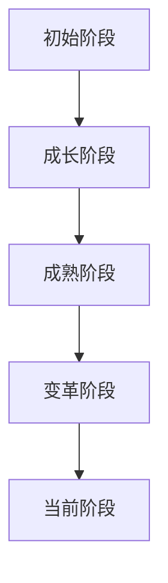
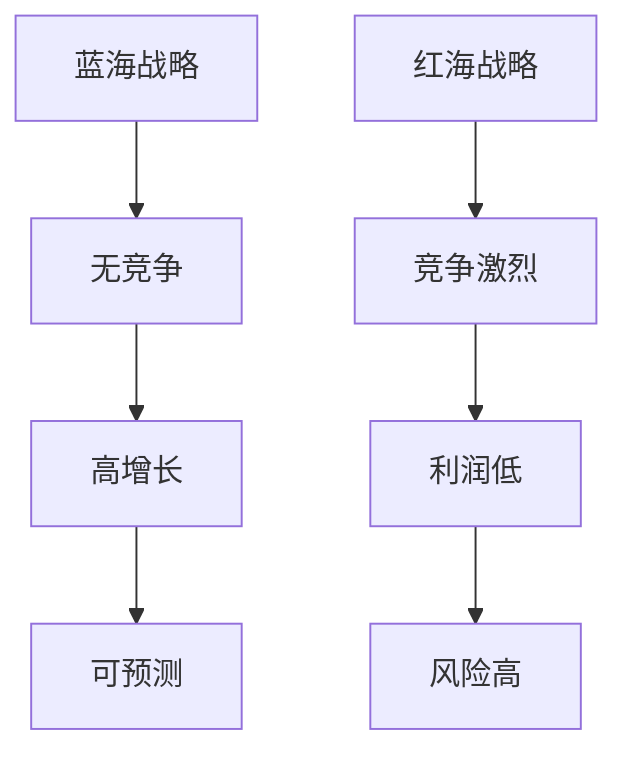
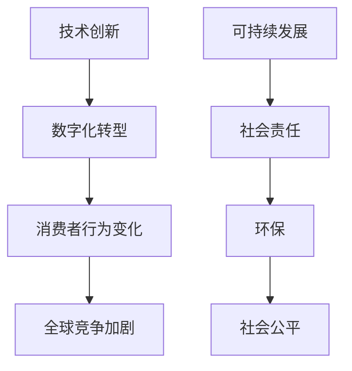

                 

### 《商业领域从蓝海到红海的变化》

> **关键词：** 蓝海战略、红海竞争、商业环境演变、战略调整、行业案例分析、未来展望

**摘要：** 本文深入探讨了商业领域从蓝海到红海的变化过程。通过分析蓝海战略与红海竞争的核心概念、实施步骤和案例，揭示了商业环境中的挑战与机遇。本文旨在为商业领袖提供策略实施与未来展望的实用指导。

---

#### 目录大纲

1. **商业环境概述**
   1.1 商业环境的演变
   1.2 蓝海与红海理论的起源与发展
   1.3 商业环境的当前状态与趋势
   1.4 红海竞争中的挑战与机会

2. **蓝海策略**
   2.1 蓝海战略的基本原则
   2.2 蓝海战略的实施步骤
   2.3 蓝海战略的案例分析

3. **红海策略**
   3.1 红海竞争的特点
   3.2 红海中的战略选择
   3.3 红海竞争的案例分析

4. **从蓝海到红海的变化**
   4.1 蓝海策略的红海挑战
   4.2 红海策略的蓝海机会
   4.3 过渡策略的实施与评估

5. **案例研究与实战**
   5.1 信息技术行业的蓝海与红海变化
   5.2 消费品行业的蓝海与红海战略
   5.3 服务业的蓝海与红海实践

6. **策略实施与未来展望**
   6.1 策略实施的关键成功因素
   6.2 策略调整的实践与策略优化
   6.3 未来商业环境的变化趋势与应对策略

7. **结论**
   7.1 核心观点与经验总结
   7.2 未来商业竞争的预测
   7.3 商业领袖的建议与行动指南

---

接下来，我们将逐步深入每个部分，运用逻辑清晰、结构紧凑、简单易懂的专业的技术语言来撰写文章。首先，我们从商业环境概述开始，探讨商业环境的演变和蓝海与红海理论的起源与发展。

### 第一部分：商业环境概述

#### 1.1 商业环境的演变

商业环境是一个动态变化的系统，受到技术进步、市场竞争、消费者需求变化等多种因素的影响。回顾历史，商业环境的演变可以分为以下几个阶段：

1. **初始阶段（19世纪末-20世纪初）**：
   - 工业革命推动生产效率大幅提升，市场逐渐形成。
   - 商业活动主要集中在生产和销售，竞争较为有限。

2. **成长阶段（20世纪中叶）**：
   - 技术创新（如电子技术、计算机技术）加速，企业规模扩大。
   - 市场细分和专业化趋势明显，竞争加剧。

3. **成熟阶段（20世纪末-21世纪初）**：
   - 全球化进程加速，跨国公司崛起，市场范围扩大。
   - 消费者需求多样化和个性化，企业面临更多挑战。

4. **变革阶段（21世纪10年代至今）**：
   - 互联网技术的普及，电子商务快速发展。
   - 大数据和人工智能的应用，改变传统商业模式。

商业环境的演变不仅体现在技术进步和市场变化上，还受到政策法规、社会文化等因素的影响。以下是一个简化的商业环境演变流程图：

#### 1.2 蓝海与红海理论的起源与发展

蓝海战略和红海战略是由韩国学者金伟灿（W. Chan Kim）和莫博涅（Renée Mauborgne）提出的。他们在2005年的著作《蓝海战略》中，将市场分为蓝海和红海两个部分。

1. **蓝海战略**：
   - **定义**：蓝海是指在现有产业边界之外，创造并开拓全新市场空间的战略。
   - **特点**：无竞争、高增长、可预测。
   - **目的**：通过创新和差异化，避开激烈的市场竞争。

2. **红海战略**：
   - **定义**：红海是指在现有市场边界内，与其他竞争对手进行激烈竞争的战略。
   - **特点**：竞争激烈、利润低、风险高。
   - **目的**：通过价格战、市场份额争夺等手段，争取竞争优势。

蓝海与红海理论的提出，为企业在竞争激烈的市场中提供了新的思考方向。以下是一个简化的蓝海与红海理论架构：

#### 1.3 商业环境的当前状态与趋势

当前，商业环境正面临前所未有的变革。以下是一些关键趋势：

1. **技术创新**：
   - 人工智能、大数据、物联网等技术的快速发展，推动商业模式的创新。
   - 数字化转型成为企业发展的必经之路。

2. **消费者行为变化**：
   - 消费者需求更加多样化和个性化，对企业提出了更高的要求。
   - 社交媒体和电子商务的兴起，改变了传统营销模式。

3. **全球竞争加剧**：
   - 全球市场的竞争日益激烈，企业面临更多挑战。
   - 跨国公司的崛起，加剧了市场竞争。

4. **可持续发展**：
   - 社会责任和可持续发展成为企业战略的重要组成部分。
   - 环保、社会公平等问题，成为商业决策的重要因素。

以下是一个简化的商业环境当前状态与趋势流程图：

在接下来的部分中，我们将详细探讨蓝海策略，帮助企业如何在竞争激烈的市场中找到新的机遇。

---

**本文已经完成了第一部分：商业环境概述。在接下来的部分中，我们将深入探讨蓝海策略。敬请期待！**

---

**作者：AI天才研究院/AI Genius Institute & 禅与计算机程序设计艺术 /Zen And The Art of Computer Programming**

