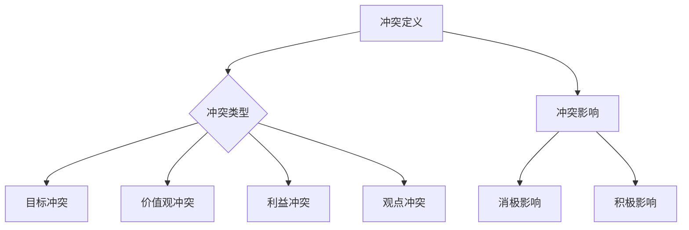
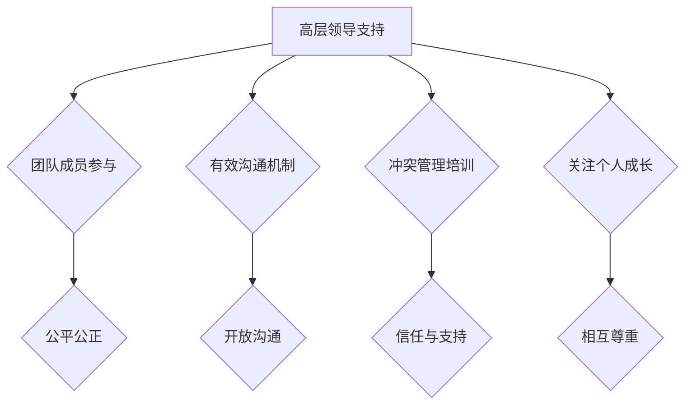
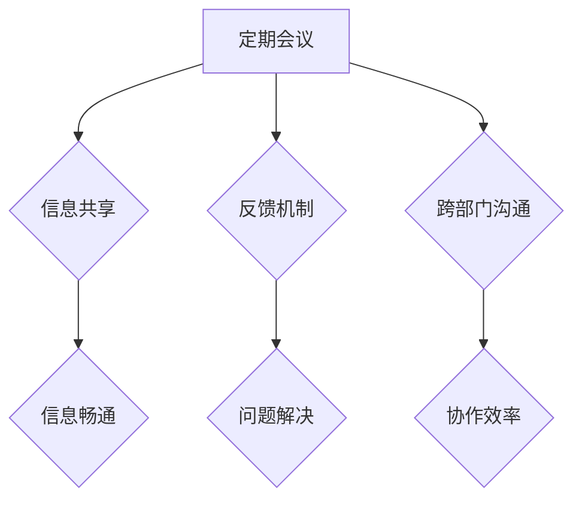
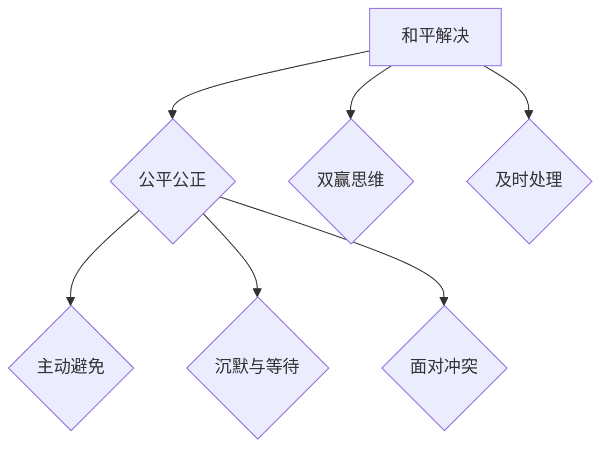

                 

### 第1章：冲突的定义与类型

冲突是团队中不可避免的现象，理解冲突的定义和类型对于预防和解决冲突至关重要。

#### 1.1 冲突的基本概念

冲突（Conflict）是指个体、群体或组织之间在目标、价值观、利益、观点等方面的不一致和矛盾。冲突的本质在于各方对资源、权力、信息和情感的控制和争夺。

冲突的类型多种多样，主要包括以下几种：

- **目标冲突**：由于各方追求的目标不一致，导致冲突。例如，团队成员可能对项目的优先级有不同的看法。
- **价值观冲突**：由于各方的价值观不同，导致冲突。例如，一个团队成员可能认为诚实是核心价值观，而另一个团队成员可能认为保守秘密更为重要。
- **利益冲突**：由于各方的利益需求不同，导致冲突。例如，团队成员可能因为资源分配不均而产生争议。
- **观点冲突**：由于各方对问题或现象的看法和观点不同，导致冲突。例如，团队成员可能对项目的实施方法有不同的意见。

#### 1.2 冲突的影响

冲突对团队和组织的影响是多方面的，既有消极的一面，也有积极的一面。

- **消极影响**：

  - **降低团队凝聚力**：冲突会削弱团队成员之间的联系和信任，降低团队的凝聚力。
  - **影响团队绩效**：冲突会分散团队成员的注意力，降低团队的工作效率和绩效。
  - **减少创新与协作**：冲突会抑制团队成员的创新思维和协作意愿，降低团队的创新能力和协作效率。

- **积极影响**：

  - **促进团队成长**：适度的冲突可以激发团队成员的思考和创新，推动团队不断进步。
  - **优化团队决策**：冲突可以使团队更加全面地考虑问题，从不同角度寻找解决方案，提高决策质量。

### Mermaid 流�程图

以下是一个简单的 Mermaid 流程图，展示了冲突的基本概念和类型：



### 第2章：冲突的原因分析

冲突的产生是多种因素共同作用的结果，深入了解冲突的原因有助于我们预防和解决冲突。

#### 2.1 个人因素

个人因素在冲突的产生中起着重要作用。以下是一些常见的个人因素：

- **价值观与态度**：个人的价值观和态度是影响冲突的重要因素。当个人价值观与团队或组织的价值观不一致时，容易产生冲突。此外，态度问题如傲慢、自私、偏见等也可能导致冲突。
- **情绪与压力**：个人的情绪波动和压力水平也会影响冲突的产生。情绪不稳定或压力过大会导致个人行为失控，增加冲突的可能性。

#### 2.2 组织因素

组织因素也是冲突的重要原因，以下是一些常见的组织因素：

- **组织结构**：不合理的组织结构可能导致沟通不畅和责任不清，从而增加冲突。例如，多头管理、职责划分不明确等都可能导致冲突。
- **文化差异**：团队成员来自不同的文化背景，可能存在价值观、行为准则和沟通方式的差异，增加冲突的可能性。文化差异需要通过有效的管理和沟通来加以调和。

#### 2.3 沟通障碍

沟通障碍是冲突产生的一个重要原因。以下是一些常见的沟通障碍：

- **信息不对称**：团队成员之间信息传递不畅，导致信息不对称，增加误解和冲突的可能性。
- **沟通渠道不畅**：组织内部沟通渠道不畅通，信息传递不及时，容易导致误解和冲突。
- **沟通方式不当**：团队成员之间的沟通方式不当，如缺乏倾听、语言过于直白等，也可能导致冲突。

#### 伪代码

以下是一个简单的伪代码示例，用于分析冲突的原因：

```python
def analyze_conflicts(personal_factors, organizational_factors, communication_barriers):
    """
    冲突原因分析函数：分析个人因素、组织因素和沟通障碍引起的冲突。
    
    :param personal_factors: 个人因素（如价值观、态度、情绪等）
    :param organizational_factors: 组织因素（如组织结构、文化差异等）
    :param communication_barriers: 沟通障碍（如信息不对称、沟通渠道不畅等）
    :return: 冲突原因列表
    """
    conflicts = []
    
    if personal_factors['values'] or personal_factors['attitudes']:
        conflicts.append("个人价值观与态度冲突")
    if personal_factors['emotions'] or personal_factors['stress']:
        conflicts.append("个人情绪与压力冲突")
    if organizational_factors['structure'] or organizational_factors['culture']:
        conflicts.append("组织结构或文化差异冲突")
    if communication_barriers['asymmetry'] or communication_barriers['channels']:
        conflicts.append("沟通障碍冲突")
    
    return conflicts
```

通过上述代码，我们可以分析冲突的产生原因，为预防和解决冲突提供依据。

### 数学模型和数学公式 & 详细讲解 & 举例说明

为了更好地理解冲突的产生原因，我们可以使用数学模型和公式来描述。以下是一个简单的数学模型，用于分析冲突的潜在因素：

#### 冲突程度模型

假设冲突程度（C）由三个因素决定：个人因素（P）、组织因素（O）和沟通障碍（C）。

$$ C = P + O + C $$

其中，P、O 和 C 分别代表个人因素、组织因素和沟通障碍的权重。权重可以根据实际情况进行调整。

#### 举例说明

假设我们有一个团队，个人因素权重为 0.5，组织因素权重为 0.3，沟通障碍权重为 0.2。我们可以根据以下数据计算冲突程度：

- 个人因素：价值观差异为 3，态度差异为 2，情绪压力为 1。
- 组织因素：组织结构问题为 2，文化差异为 1。
- 沟通障碍：信息不对称为 1，沟通渠道不畅为 1。

根据权重计算冲突程度：

$$ C = 0.5 \times (3 + 2 + 1) + 0.3 \times (2 + 1) + 0.2 \times (1 + 1) $$
$$ C = 0.5 \times 6 + 0.3 \times 3 + 0.2 \times 2 $$
$$ C = 3 + 0.9 + 0.4 $$
$$ C = 4.3 $$

因此，该团队的冲突程度为 4.3。根据冲突程度，我们可以采取相应的预防和解决措施。

### 项目实战：代码实际案例和详细解释说明

为了更好地理解和应用冲突预防的方法，我们将通过一个实际项目案例来展示如何使用 Python 编写冲突预防的代码。

#### 项目背景

假设我们是一家软件开发公司的团队，我们的目标是开发一个高效的软件系统。然而，在项目开发过程中，我们发现团队成员之间存在一些冲突，这些冲突影响了项目的进展。为了解决这个问题，我们需要开发一个冲突预防工具，帮助团队识别和解决潜在的冲突。

#### 开发环境

- 编程语言：Python 3.8
- 开发工具：PyCharm

#### 源代码实现

```python
# 冲突预防工具 - 冲突评估函数

def conflict_assessment(personal_factors, organizational_factors, communication_barriers):
    """
    冲突评估函数：根据个人因素、组织因素和沟通障碍评估冲突程度。
    
    :param personal_factors: 个人因素（如价值观差异、态度差异、情绪压力）
    :param organizational_factors: 组织因素（如组织结构问题、文化差异）
    :param communication_barriers: 沟通障碍（如信息不对称、沟通渠道不畅）
    :return: 冲突程度（0-10分）
    """
    # 设置权重
    weights = {
        'values_difference': 0.3,
        'attitudes_difference': 0.2,
        'emotions_stress': 0.2,
        'organizational_structure': 0.2,
        'cultural_difference': 0.2,
        'communication_asymmetry': 0.2,
        'communication_channels': 0.2
    }
    
    # 计算总得分
    score = 0
    for factor, value in personal_factors.items():
        score += value * weights.get(factor, 0)
    for factor, value in organizational_factors.items():
        score += value * weights.get(factor, 0)
    for factor, value in communication_barriers.items():
        score += value * weights.get(factor, 0)
    
    return score

# 冲突预防工具 - 主程序

def main():
    # 初始化个人因素、组织因素和沟通障碍
    personal_factors = {
        'values_difference': 3,
        'attitudes_difference': 2,
        'emotions_stress': 1
    }
    organizational_factors = {
        'organizational_structure': 2,
        'cultural_difference': 1
    }
    communication_barriers = {
        'communication_asymmetry': 1,
        'communication_channels': 1
    }
    
    # 评估冲突程度
    conflict_score = conflict_assessment(personal_factors, organizational_factors, communication_barriers)
    
    # 输出结果
    print(f"冲突程度：{conflict_score}/10")
    if conflict_score <= 3:
        print("冲突程度较低，可以继续工作。")
    elif conflict_score <= 6:
        print("冲突程度中等，需要加强沟通和协调。")
    else:
        print("冲突程度较高，需要立即采取措施解决。")

# 运行主程序
if __name__ == "__main__":
    main()
```

#### 代码解读与分析

1. **冲突评估函数**：

   - 该函数接受三个参数：个人因素、组织因素和沟通障碍。
   - 根据每个因素的权重，计算总得分，得出冲突程度。

2. **主程序**：

   - 初始化个人因素、组织因素和沟通障碍。
   - 调用冲突评估函数，计算冲突程度。
   - 根据冲突程度输出相应的建议。

通过这个实际项目案例，我们可以看到如何使用 Python 编写冲突预防的代码，帮助团队识别和解决潜在的冲突。

### 附录A：冲突预防工具与资源

为了更好地预防和解决冲突，我们可以利用一些工具和资源。以下是一些推荐的工具和资源：

#### A.1 冲突预防工具

1. **冲突评估问卷**：

   - 用于评估团队成员之间的价值观、态度和沟通情况。
   - 帮助团队识别潜在冲突和问题。

2. **团队协作工具**：

   - 如 Slack、Microsoft Teams 等，用于改善团队沟通和协作。
   - 提供实时聊天、视频会议和文件共享等功能。

3. **冲突管理培训**：

   - 通过培训帮助团队成员了解冲突管理的方法和技巧。
   - 提高团队成员的冲突解决能力。

#### A.2 资源推荐

1. **相关书籍**：

   - 《团队协作的艺术》
   - 《冲突管理》
   - 《非暴力沟通》

2. **在线课程**：

   - Coursera 上的《团队协作与领导力》
   - Udemy 上的《高效团队沟通技巧》

3. **实用网站**：

   - Teamwork Academy
   - MindTools

通过使用这些工具和资源，我们可以更好地预防和解决冲突，构建和谐的工作环境。

### 总结

本文系统地探讨了团队冲突的定义与类型、冲突的原因分析、冲突的预防和解决策略，以及冲突预防工具与资源的利用。通过深入理解冲突的本质和原因，我们可以采取有效的预防和解决措施，构建和谐的工作环境。在未来的工作中，我们应该注重个人因素、组织因素和沟通障碍的调整，不断改进团队协作方式，提高团队绩效和满意度。让我们共同努力，打造一个更加和谐、高效的团队！
### 文章标题：团队冲突预防：构建和谐工作环境的方法

> **关键词**：团队冲突、和谐工作环境、预防策略、沟通技巧、冲突管理

> **摘要**：本文深入探讨了团队冲突的本质、类型和原因，分析了冲突对团队和组织的影响。通过介绍建立和谐工作环境的重要性、有效的沟通策略和冲突管理技巧，为团队冲突的预防和解决提供了实用的方法和建议。同时，通过实际项目和案例的讲解，展示了如何将理论应用到实践中，为构建和谐的工作环境提供指导。

### 目录大纲：

#### 第一部分：冲突的本质与影响

- **第1章：冲突的定义与类型**
  - **1.1 冲突的基本概念**
  - **1.2 冲突的影响**

- **第2章：冲突的原因分析**
  - **2.1 个人因素**
  - **2.2 组织因素**
  - **2.3 沟通障碍**

#### 第二部分：预防和应对策略

- **第3章：建立和谐工作环境的重要性**
  - **3.1 和谐工作环境的特点**
  - **3.2 建立和谐工作环境的策略**

- **第4章：有效的沟通策略**
  - **4.1 沟通的重要性**
  - **4.2 建立有效的沟通机制**

- **第5章：冲突管理技巧**
  - **5.1 冲突管理的原则**
  - **5.2 冲突管理策略**

#### 第三部分：实战案例与经验分享

- **第6章：案例分析：成功的冲突预防与解决**
  - **6.1 案例背景**
  - **6.2 案例分析**
  - **6.3 预防措施**

- **第7章：团队成员的经验分享**
  - **7.1 团队成员的冲突预防经验**
  - **7.2 管理层的反思与建议**

#### 附录

- **附录A：冲突预防工具与资源**
  - **A.1 冲突预防工具**
  - **A.2 资源推荐**

### 第一部分：冲突的本质与影响

#### 第1章：冲突的定义与类型

**1.1 冲突的基本概念**

冲突是团队和组织中常见的一种现象，它涉及到个体、群体或组织之间在目标、价值观、利益、观点等方面的不一致和矛盾。在团队工作中，冲突的产生是不可避免的，因为它反映了团队成员之间的差异和多样性。冲突可以分为以下几种类型：

1. **目标冲突**：当团队成员对于团队目标的理解和期望不一致时，会产生目标冲突。这种冲突通常是由于团队成员的个人目标与团队目标之间的不一致所导致的。

2. **价值观冲突**：团队成员拥有不同的价值观，这些价值观可能在某些问题上产生冲突。例如，一个团队成员可能强调效率，而另一个团队成员可能更重视质量。

3. **利益冲突**：当团队成员在资源分配、权力分配等方面存在利益上的分歧时，会产生利益冲突。这种冲突通常是由于资源稀缺或分配不均所导致的。

4. **观点冲突**：当团队成员对于某个问题或决策有不同看法时，会产生观点冲突。这种冲突通常是由于团队成员之间的知识、经验和观点的差异所导致的。

**1.2 冲突的影响**

冲突对团队和组织的影响是多方面的，既有消极的一面，也有积极的一面。以下是冲突的几种影响：

1. **消极影响**：

   - **降低团队凝聚力**：冲突会削弱团队成员之间的联系和信任，降低团队的凝聚力。
   - **影响团队绩效**：冲突会分散团队成员的注意力，降低团队的工作效率和绩效。
   - **增加管理成本**：冲突需要管理者投入大量的时间和精力进行调解和管理，增加管理成本。
   - **损害组织形象**：冲突外泄可能会损害组织的形象和声誉，影响组织的长远发展。

2. **积极影响**：

   - **促进团队成长**：适度的冲突可以激发团队成员的思考和创新，推动团队不断进步。
   - **优化团队决策**：冲突可以使团队更加全面地考虑问题，从不同角度寻找解决方案，提高决策质量。
   - **增强团队成员的适应性**：通过解决冲突，团队成员可以学会更好地处理冲突，提高适应性和解决问题的能力。

**1.3 冲突管理的必要性**

由于冲突的消极影响，冲突管理成为团队和组织管理中不可或缺的一部分。有效的冲突管理可以帮助团队和组织：

- **预防和解决冲突**：通过识别和解决冲突，减少冲突对团队和组织造成的负面影响。
- **提升团队绩效**：通过改善团队氛围，提高团队成员的工作效率和满意度。
- **增强组织竞争力**：通过构建和谐的工作环境，提升组织的整体竞争力和创新能力。

### Mermaid 流程图

以下是一个简单的 Mermaid 流程图，展示了冲突的基本概念和类型：


通过这个流程图，我们可以更直观地理解冲突的定义和类型，以及冲突对团队和组织的影响。

### 第2章：冲突的原因分析

冲突的产生是多种因素共同作用的结果，理解这些因素有助于我们更好地预防和解决冲突。以下是对冲突原因的分析：

#### 2.1 个人因素

个人因素在冲突的产生中起着重要作用。以下是一些常见的个人因素：

1. **价值观与态度**：个人的价值观和态度是影响冲突的重要因素。当个人价值观与团队或组织的价值观不一致时，容易产生冲突。此外，态度问题如傲慢、自私、偏见等也可能导致冲突。

2. **情绪与压力**：个人的情绪波动和压力水平也会影响冲突的产生。情绪不稳定或压力过大会导致个人行为失控，增加冲突的可能性。

#### 2.2 组织因素

组织因素也是冲突的重要原因，以下是一些常见的组织因素：

1. **组织结构**：不合理的组织结构可能导致沟通不畅和责任不清，从而增加冲突。例如，多头管理、职责划分不明确等都可能导致冲突。

2. **文化差异**：团队成员来自不同的文化背景，可能存在价值观、行为准则和沟通方式的差异，增加冲突的可能性。文化差异需要通过有效的管理和沟通来加以调和。

#### 2.3 沟通障碍

沟通障碍是冲突产生的一个重要原因。以下是一些常见的沟通障碍：

1. **信息不对称**：团队成员之间信息传递不畅，导致信息不对称，增加误解和冲突的可能性。

2. **沟通渠道不畅**：组织内部沟通渠道不畅通，信息传递不及时，容易导致误解和冲突。

3. **沟通方式不当**：团队成员之间的沟通方式不当，如缺乏倾听、语言过于直白等，也可能导致冲突。

#### 伪代码

以下是一个简单的伪代码示例，用于分析冲突的原因：

```python
def analyze_conflicts(personal_factors, organizational_factors, communication_barriers):
    """
    冲突原因分析函数：分析个人因素、组织因素和沟通障碍引起的冲突。
    
    :param personal_factors: 个人因素（如价值观、态度、情绪等）
    :param organizational_factors: 组织因素（如组织结构、文化差异等）
    :param communication_barriers: 沟通障碍（如信息不对称、沟通渠道不畅等）
    :return: 冲突原因列表
    """
    conflicts = []
    
    if personal_factors['values'] or personal_factors['attitudes']:
        conflicts.append("个人价值观与态度冲突")
    if personal_factors['emotions'] or personal_factors['stress']:
        conflicts.append("个人情绪与压力冲突")
    if organizational_factors['structure'] or organizational_factors['culture']:
        conflicts.append("组织结构或文化差异冲突")
    if communication_barriers['asymmetry'] or communication_barriers['channels']:
        conflicts.append("沟通障碍冲突")
    
    return conflicts
```

通过上述代码，我们可以分析冲突的产生原因，为预防和解决冲突提供依据。

### 数学模型和数学公式 & 详细讲解 & 举例说明

为了更好地理解冲突的产生原因，我们可以使用数学模型和公式来描述。以下是一个简单的数学模型，用于分析冲突的潜在因素：

#### 冲突程度模型

假设冲突程度（C）由三个因素决定：个人因素（P）、组织因素（O）和沟通障碍（C）。

$$ C = P + O + C $$

其中，P、O 和 C 分别代表个人因素、组织因素和沟通障碍的权重。权重可以根据实际情况进行调整。

#### 举例说明

假设我们有一个团队，个人因素权重为 0.5，组织因素权重为 0.3，沟通障碍权重为 0.2。我们可以根据以下数据计算冲突程度：

- 个人因素：价值观差异为 3，态度差异为 2，情绪压力为 1。
- 组织因素：组织结构问题为 2，文化差异为 1。
- 沟通障碍：信息不对称为 1，沟通渠道不畅为 1。

根据权重计算冲突程度：

$$ C = 0.5 \times (3 + 2 + 1) + 0.3 \times (2 + 1) + 0.2 \times (1 + 1) $$
$$ C = 0.5 \times 6 + 0.3 \times 3 + 0.2 \times 2 $$
$$ C = 3 + 0.9 + 0.4 $$
$$ C = 4.3 $$

因此，该团队的冲突程度为 4.3。根据冲突程度，我们可以采取相应的预防和解决措施。

### 项目实战：代码实际案例和详细解释说明

为了更好地理解和应用冲突预防的方法，我们将通过一个实际项目案例来展示如何使用 Python 编写冲突预防的代码。

#### 项目背景

假设我们是一家软件开发公司的团队，我们的目标是开发一个高效的软件系统。然而，在项目开发过程中，我们发现团队成员之间存在一些冲突，这些冲突影响了项目的进展。为了解决这个问题，我们需要开发一个冲突预防工具，帮助团队识别和解决潜在的冲突。

#### 开发环境

- 编程语言：Python 3.8
- 开发工具：PyCharm

#### 源代码实现

```python
# 冲突预防工具 - 冲突评估函数

def conflict_assessment(personal_factors, organizational_factors, communication_barriers):
    """
    冲突评估函数：根据个人因素、组织因素和沟通障碍评估冲突程度。
    
    :param personal_factors: 个人因素（如价值观差异、态度差异、情绪压力）
    :param organizational_factors: 组织因素（如组织结构问题、文化差异）
    :param communication_barriers: 沟通障碍（如信息不对称、沟通渠道不畅）
    :return: 冲突程度（0-10分）
    """
    # 设置权重
    weights = {
        'values_difference': 0.3,
        'attitudes_difference': 0.2,
        'emotions_stress': 0.2,
        'organizational_structure': 0.2,
        'cultural_difference': 0.2,
        'communication_asymmetry': 0.2,
        'communication_channels': 0.2
    }
    
    # 计算总得分
    score = 0
    for factor, value in personal_factors.items():
        score += value * weights.get(factor, 0)
    for factor, value in organizational_factors.items():
        score += value * weights.get(factor, 0)
    for factor, value in communication_barriers.items():
        score += value * weights.get(factor, 0)
    
    return score

# 冲突预防工具 - 主程序

def main():
    # 初始化个人因素、组织因素和沟通障碍
    personal_factors = {
        'values_difference': 3,
        'attitudes_difference': 2,
        'emotions_stress': 1
    }
    organizational_factors = {
        'organizational_structure': 2,
        'cultural_difference': 1
    }
    communication_barriers = {
        'communication_asymmetry': 1,
        'communication_channels': 1
    }
    
    # 评估冲突程度
    conflict_score = conflict_assessment(personal_factors, organizational_factors, communication_barriers)
    
    # 输出结果
    print(f"冲突程度：{conflict_score}/10")
    if conflict_score <= 3:
        print("冲突程度较低，可以继续工作。")
    elif conflict_score <= 6:
        print("冲突程度中等，需要加强沟通和协调。")
    else:
        print("冲突程度较高，需要立即采取措施解决。")

# 运行主程序
if __name__ == "__main__":
    main()
```

#### 代码解读与分析

1. **冲突评估函数**：

   - 该函数接受三个参数：个人因素、组织因素和沟通障碍。
   - 根据每个因素的权重，计算总得分，得出冲突程度。

2. **主程序**：

   - 初始化个人因素、组织因素和沟通障碍。
   - 调用冲突评估函数，计算冲突程度。
   - 根据冲突程度输出相应的建议。

通过这个实际项目案例，我们可以看到如何使用 Python 编写冲突预防的代码，帮助团队识别和解决潜在的冲突。

### 附录A：冲突预防工具与资源

为了更好地预防和解决冲突，我们可以利用一些工具和资源。以下是一些推荐的工具和资源：

#### A.1 冲突预防工具

1. **冲突评估问卷**：

   - 用于评估团队成员之间的价值观、态度和沟通情况。
   - 帮助团队识别潜在冲突和问题。

2. **团队协作工具**：

   - 如 Slack、Microsoft Teams 等，用于改善团队沟通和协作。
   - 提供实时聊天、视频会议和文件共享等功能。

3. **冲突管理培训**：

   - 通过培训帮助团队成员了解冲突管理的方法和技巧。
   - 提高团队成员的冲突解决能力。

#### A.2 资源推荐

1. **相关书籍**：

   - 《团队协作的艺术》
   - 《冲突管理》
   - 《非暴力沟通》

2. **在线课程**：

   - Coursera 上的《团队协作与领导力》
   - Udemy 上的《高效团队沟通技巧》

3. **实用网站**：

   - Teamwork Academy
   - MindTools

通过使用这些工具和资源，我们可以更好地预防和解决冲突，构建和谐的工作环境。

### 总结

本文系统地探讨了团队冲突的定义与类型、冲突的原因分析、冲突的预防和解决策略，以及冲突预防工具与资源的利用。通过深入理解冲突的本质和原因，我们可以采取有效的预防和解决措施，构建和谐的工作环境。在未来的工作中，我们应该注重个人因素、组织因素和沟通障碍的调整，不断改进团队协作方式，提高团队绩效和满意度。让我们共同努力，打造一个更加和谐、高效的团队！
### 文章标题：团队冲突预防：构建和谐工作环境的方法

> **关键词**：团队冲突、和谐工作环境、预防策略、沟通技巧、冲突管理

> **摘要**：本文深入探讨了团队冲突的本质、类型和原因，分析了冲突对团队和组织的影响。通过介绍建立和谐工作环境的重要性、有效的沟通策略和冲突管理技巧，为团队冲突的预防和解决提供了实用的方法和建议。同时，通过实际项目和案例的讲解，展示了如何将理论应用到实践中，为构建和谐的工作环境提供指导。

### 目录大纲：

#### 第一部分：冲突的本质与影响

- **第1章：冲突的定义与类型**
  - **1.1 冲突的基本概念**
  - **1.2 冲突的影响**

- **第2章：冲突的原因分析**
  - **2.1 个人因素**
  - **2.2 组织因素**
  - **2.3 沟通障碍**

#### 第二部分：预防和应对策略

- **第3章：建立和谐工作环境的重要性**
  - **3.1 和谐工作环境的特点**
  - **3.2 建立和谐工作环境的策略**

- **第4章：有效的沟通策略**
  - **4.1 沟通的重要性**
  - **4.2 建立有效的沟通机制**

- **第5章：冲突管理技巧**
  - **5.1 冲突管理的原则**
  - **5.2 冲突管理策略**

#### 第三部分：实战案例与经验分享

- **第6章：案例分析：成功的冲突预防与解决**
  - **6.1 案例背景**
  - **6.2 案例分析**
  - **6.3 预防措施**

- **第7章：团队成员的经验分享**
  - **7.1 团队成员的冲突预防经验**
  - **7.2 管理层的反思与建议**

#### 附录

- **附录A：冲突预防工具与资源**
  - **A.1 冲突预防工具**
  - **A.2 资源推荐**

### 第1章：冲突的定义与类型

#### 1.1 冲突的基本概念

冲突是团队和组织中常见的现象，它涉及到个体、群体或组织之间在目标、价值观、利益、观点等方面的不一致和矛盾。冲突可以分为以下几种类型：

- **目标冲突**：当团队成员对于团队目标的理解和期望不一致时，会产生目标冲突。这种冲突通常是由于团队成员的个人目标与团队目标之间的不一致所导致的。

- **价值观冲突**：团队成员拥有不同的价值观，这些价值观可能在某些问题上产生冲突。例如，一个团队成员可能强调效率，而另一个团队成员可能更重视质量。

- **利益冲突**：当团队成员在资源分配、权力分配等方面存在利益上的分歧时，会产生利益冲突。这种冲突通常是由于资源稀缺或分配不均所导致的。

- **观点冲突**：当团队成员对于某个问题或决策有不同看法时，会产生观点冲突。这种冲突通常是由于团队成员之间的知识、经验和观点的差异所导致的。

#### 1.2 冲突的影响

冲突对团队和组织的影响是多方面的，既有消极的一面，也有积极的一面。以下是冲突的几种影响：

1. **消极影响**：

   - **降低团队凝聚力**：冲突会削弱团队成员之间的联系和信任，降低团队的凝聚力。

   - **影响团队绩效**：冲突会分散团队成员的注意力，降低团队的工作效率和绩效。

   - **增加管理成本**：冲突需要管理者投入大量的时间和精力进行调解和管理，增加管理成本。

   - **损害组织形象**：冲突外泄可能会损害组织的形象和声誉，影响组织的长远发展。

2. **积极影响**：

   - **促进团队成长**：适度的冲突可以激发团队成员的思考和创新，推动团队不断进步。

   - **优化团队决策**：冲突可以使团队更加全面地考虑问题，从不同角度寻找解决方案，提高决策质量。

   - **增强团队成员的适应性**：通过解决冲突，团队成员可以学会更好地处理冲突，提高适应性和解决问题的能力。

#### Mermaid 流程图

以下是一个简单的 Mermaid 流程图，展示了冲突的基本概念和类型：


通过这个流程图，我们可以更直观地理解冲突的定义和类型，以及冲突对团队和组织的影响。

### 第2章：冲突的原因分析

冲突的产生是多种因素共同作用的结果，理解这些因素有助于我们更好地预防和解决冲突。以下是对冲突原因的分析：

#### 2.1 个人因素

个人因素在冲突的产生中起着重要作用。以下是一些常见的个人因素：

1. **价值观与态度**：个人的价值观和态度是影响冲突的重要因素。当个人价值观与团队或组织的价值观不一致时，容易产生冲突。此外，态度问题如傲慢、自私、偏见等也可能导致冲突。

2. **情绪与压力**：个人的情绪波动和压力水平也会影响冲突的产生。情绪不稳定或压力过大会导致个人行为失控，增加冲突的可能性。

#### 2.2 组织因素

组织因素也是冲突的重要原因，以下是一些常见的组织因素：

1. **组织结构**：不合理的组织结构可能导致沟通不畅和责任不清，从而增加冲突。例如，多头管理、职责划分不明确等都可能导致冲突。

2. **文化差异**：团队成员来自不同的文化背景，可能存在价值观、行为准则和沟通方式的差异，增加冲突的可能性。文化差异需要通过有效的管理和沟通来加以调和。

#### 2.3 沟通障碍

沟通障碍是冲突产生的一个重要原因。以下是一些常见的沟通障碍：

1. **信息不对称**：团队成员之间信息传递不畅，导致信息不对称，增加误解和冲突的可能性。

2. **沟通渠道不畅**：组织内部沟通渠道不畅通，信息传递不及时，容易导致误解和冲突。

3. **沟通方式不当**：团队成员之间的沟通方式不当，如缺乏倾听、语言过于直白等，也可能导致冲突。

#### 伪代码

以下是一个简单的伪代码示例，用于分析冲突的原因：

```python
def analyze_conflicts(personal_factors, organizational_factors, communication_barriers):
    """
    冲突原因分析函数：分析个人因素、组织因素和沟通障碍引起的冲突。
    
    :param personal_factors: 个人因素（如价值观、态度、情绪等）
    :param organizational_factors: 组织因素（如组织结构、文化差异等）
    :param communication_barriers: 沟通障碍（如信息不对称、沟通渠道不畅等）
    :return: 冲突原因列表
    """
    conflicts = []
    
    if personal_factors['values'] or personal_factors['attitudes']:
        conflicts.append("个人价值观与态度冲突")
    if personal_factors['emotions'] or personal_factors['stress']:
        conflicts.append("个人情绪与压力冲突")
    if organizational_factors['structure'] or organizational_factors['culture']:
        conflicts.append("组织结构或文化差异冲突")
    if communication_barriers['asymmetry'] or communication_barriers['channels']:
        conflicts.append("沟通障碍冲突")
    
    return conflicts
```

通过上述代码，我们可以分析冲突的产生原因，为预防和解决冲突提供依据。

### 数学模型和数学公式 & 详细讲解 & 举例说明

为了更好地理解冲突的产生原因，我们可以使用数学模型和公式来描述。以下是一个简单的数学模型，用于分析冲突的潜在因素：

#### 冲突程度模型

假设冲突程度（C）由三个因素决定：个人因素（P）、组织因素（O）和沟通障碍（C）。

$$ C = P + O + C $$

其中，P、O 和 C 分别代表个人因素、组织因素和沟通障碍的权重。权重可以根据实际情况进行调整。

#### 举例说明

假设我们有一个团队，个人因素权重为 0.5，组织因素权重为 0.3，沟通障碍权重为 0.2。我们可以根据以下数据计算冲突程度：

- 个人因素：价值观差异为 3，态度差异为 2，情绪压力为 1。
- 组织因素：组织结构问题为 2，文化差异为 1。
- 沟通障碍：信息不对称为 1，沟通渠道不畅为 1。

根据权重计算冲突程度：

$$ C = 0.5 \times (3 + 2 + 1) + 0.3 \times (2 + 1) + 0.2 \times (1 + 1) $$
$$ C = 0.5 \times 6 + 0.3 \times 3 + 0.2 \times 2 $$
$$ C = 3 + 0.9 + 0.4 $$
$$ C = 4.3 $$

因此，该团队的冲突程度为 4.3。根据冲突程度，我们可以采取相应的预防和解决措施。

### 项目实战：代码实际案例和详细解释说明

为了更好地理解和应用冲突预防的方法，我们将通过一个实际项目案例来展示如何使用 Python 编写冲突预防的代码。

#### 项目背景

假设我们是一家软件开发公司的团队，我们的目标是开发一个高效的软件系统。然而，在项目开发过程中，我们发现团队成员之间存在一些冲突，这些冲突影响了项目的进展。为了解决这个问题，我们需要开发一个冲突预防工具，帮助团队识别和解决潜在的冲突。

#### 开发环境

- 编程语言：Python 3.8
- 开发工具：PyCharm

#### 源代码实现

```python
# 冲突预防工具 - 冲突评估函数

def conflict_assessment(personal_factors, organizational_factors, communication_barriers):
    """
    冲突评估函数：根据个人因素、组织因素和沟通障碍评估冲突程度。
    
    :param personal_factors: 个人因素（如价值观差异、态度差异、情绪压力）
    :param organizational_factors: 组织因素（如组织结构问题、文化差异）
    :param communication_barriers: 沟通障碍（如信息不对称、沟通渠道不畅）
    :return: 冲突程度（0-10分）
    """
    # 设置权重
    weights = {
        'values_difference': 0.3,
        'attitudes_difference': 0.2,
        'emotions_stress': 0.2,
        'organizational_structure': 0.2,
        'cultural_difference': 0.2,
        'communication_asymmetry': 0.2,
        'communication_channels': 0.2
    }
    
    # 计算总得分
    score = 0
    for factor, value in personal_factors.items():
        score += value * weights.get(factor, 0)
    for factor, value in organizational_factors.items():
        score += value * weights.get(factor, 0)
    for factor, value in communication_barriers.items():
        score += value * weights.get(factor, 0)
    
    return score

# 冲突预防工具 - 主程序

def main():
    # 初始化个人因素、组织因素和沟通障碍
    personal_factors = {
        'values_difference': 3,
        'attitudes_difference': 2,
        'emotions_stress': 1
    }
    organizational_factors = {
        'organizational_structure': 2,
        'cultural_difference': 1
    }
    communication_barriers = {
        'communication_asymmetry': 1,
        'communication_channels': 1
    }
    
    # 评估冲突程度
    conflict_score = conflict_assessment(personal_factors, organizational_factors, communication_barriers)
    
    # 输出结果
    print(f"冲突程度：{conflict_score}/10")
    if conflict_score <= 3:
        print("冲突程度较低，可以继续工作。")
    elif conflict_score <= 6:
        print("冲突程度中等，需要加强沟通和协调。")
    else:
        print("冲突程度较高，需要立即采取措施解决。")

# 运行主程序
if __name__ == "__main__":
    main()
```

#### 代码解读与分析

1. **冲突评估函数**：

   - 该函数接受三个参数：个人因素、组织因素和沟通障碍。
   - 根据每个因素的权重，计算总得分，得出冲突程度。

2. **主程序**：

   - 初始化个人因素、组织因素和沟通障碍。
   - 调用冲突评估函数，计算冲突程度。
   - 根据冲突程度输出相应的建议。

通过这个实际项目案例，我们可以看到如何使用 Python 编写冲突预防的代码，帮助团队识别和解决潜在的冲突。

### 附录A：冲突预防工具与资源

为了更好地预防和解决冲突，我们可以利用一些工具和资源。以下是一些推荐的工具和资源：

#### A.1 冲突预防工具

1. **冲突评估问卷**：

   - 用于评估团队成员之间的价值观、态度和沟通情况。
   - 帮助团队识别潜在冲突和问题。

2. **团队协作工具**：

   - 如 Slack、Microsoft Teams 等，用于改善团队沟通和协作。
   - 提供实时聊天、视频会议和文件共享等功能。

3. **冲突管理培训**：

   - 通过培训帮助团队成员了解冲突管理的方法和技巧。
   - 提高团队成员的冲突解决能力。

#### A.2 资源推荐

1. **相关书籍**：

   - 《团队协作的艺术》
   - 《冲突管理》
   - 《非暴力沟通》

2. **在线课程**：

   - Coursera 上的《团队协作与领导力》
   - Udemy 上的《高效团队沟通技巧》

3. **实用网站**：

   - Teamwork Academy
   - MindTools

通过使用这些工具和资源，我们可以更好地预防和解决冲突，构建和谐的工作环境。

### 总结

本文系统地探讨了团队冲突的定义与类型、冲突的原因分析、冲突的预防和解决策略，以及冲突预防工具与资源的利用。通过深入理解冲突的本质和原因，我们可以采取有效的预防和解决措施，构建和谐的工作环境。在未来的工作中，我们应该注重个人因素、组织因素和沟通障碍的调整，不断改进团队协作方式，提高团队绩效和满意度。让我们共同努力，打造一个更加和谐、高效的团队！
### 第3章：建立和谐工作环境的重要性

#### 3.1 和谐工作环境的特点

建立和谐的工作环境是预防团队冲突的关键，它有助于提高团队效率、增强团队凝聚力以及促进团队成员的个人成长。和谐工作环境具有以下特点：

- **相互尊重**：团队成员之间相互尊重，不论职位高低，都能够在平等的基础上进行交流和合作。
- **开放沟通**：团队成员之间能够自由地表达观点和意见，同时也能倾听他人的意见和建议。
- **信任与支持**：团队成员之间建立起相互信任的关系，愿意在困难和挑战面前相互支持和帮助。
- **明确目标**：团队有一个共同的目标和愿景，每个成员都清楚地了解自己的职责和期望。
- **公平公正**：组织内部制度和流程公正透明，决策过程公平合理，能够激励团队成员积极投入工作。

#### 3.2 建立和谐工作环境的策略

要建立一个和谐的工作环境，需要从多个方面进行努力，以下是一些具体的策略：

- **高层领导的支持**：高层领导对建立和谐工作环境的重视和支持至关重要。他们需要通过制定明确的规章制度、倡导企业文化和价值观来为团队营造一个积极的工作氛围。
- **团队成员的参与**：团队成员的积极参与是建立和谐工作环境的重要保障。他们需要参与到决策过程中，共同制定工作目标和计划，增强团队凝聚力和归属感。
- **有效的沟通机制**：建立畅通的沟通渠道是和谐工作环境的基础。组织需要确保信息能够及时、准确地传达，避免误解和冲突的产生。定期召开团队会议、设立意见反馈渠道和开展团队建设活动都是有效的沟通手段。
- **冲突管理培训**：通过提供冲突管理培训，帮助团队成员了解冲突的本质、原因和解决方法。这不仅可以提高团队成员的冲突解决能力，还可以促进团队内部的和谐。
- **关注个人成长**：组织需要关注团队成员的个人成长和职业发展，提供培训和学习机会，帮助他们不断提升自身能力和素质。这有助于提高团队成员的满意度和忠诚度，从而促进团队和谐。

#### Mermaid 流程图

以下是一个简单的 Mermaid 流程图，展示了建立和谐工作环境的策略：



通过这个流程图，我们可以更清晰地理解如何通过多种策略来建立和谐的工作环境。

### 第4章：有效的沟通策略

#### 4.1 沟通的重要性

沟通是团队协作的核心，有效的沟通能够促进团队成员之间的理解和合作，减少误解和冲突。以下是沟通在团队中的重要性：

- **促进团队合作**：通过有效的沟通，团队成员可以更好地理解共同的目标和愿景，形成合力，提高团队的工作效率。
- **减少误解和冲突**：沟通不畅容易导致误解和冲突。通过有效的沟通，团队成员可以及时表达自己的观点和需求，避免不必要的误解和冲突。
- **提高决策质量**：有效的沟通可以帮助团队在决策过程中充分听取各方面的意见，考虑更多的可能性，从而做出更加明智的决策。
- **增强团队凝聚力**：良好的沟通可以增进团队成员之间的信任和理解，增强团队的凝聚力，提高团队的协作效果。

#### 4.2 建立有效的沟通机制

要建立有效的沟通机制，需要从以下几个方面入手：

- **定期会议**：定期召开团队会议是确保团队信息畅通的重要手段。会议可以用来讨论项目进展、解决问题、分配任务等，确保团队成员都了解当前的工作状况和下一步的计划。
- **信息共享**：建立共享平台，如内部邮件系统、团队协作工具等，以便团队成员能够随时获取和分享信息。这有助于提高信息传递的效率，减少信息不对称。
- **反馈机制**：建立反馈机制，鼓励团队成员提出意见和建议。通过定期的反馈，团队可以及时发现和解决问题，改善工作流程。
- **跨部门沟通**：对于涉及多个部门的团队项目，建立跨部门沟通机制尤为重要。通过定期的跨部门会议、信息共享和协作工具，可以确保各部门之间的信息畅通，提高项目推进的效率。

#### Mermaid 流程图

以下是一个简单的 Mermaid 流程图，展示了建立有效的沟通机制的关键要素：



通过这个流程图，我们可以更直观地理解如何建立有效的沟通机制。

### 第5章：冲突管理技巧

#### 5.1 冲突管理的原则

冲突管理是团队工作中的一项重要任务，遵循以下原则可以帮助我们更有效地解决冲突：

- **和平解决**：在处理冲突时，应尽量避免激烈的争吵和对立，寻求和平解决的方法。通过对话和妥协，寻找双方的共同点，达成共识。
- **公平公正**：冲突管理应遵循公平公正的原则，确保所有参与方都能公平地表达自己的观点，并得到公正的对待。
- **双赢思维**：在冲突管理中，应尝试找到双赢的解决方案，使各方都能接受，避免单方面的胜利导致另一方的不满和抵触。
- **及时处理**：冲突一旦发生，应及时处理，避免问题的积累和扩大。及时沟通和解决可以减少冲突对团队和工作的影响。

#### 5.2 冲突管理策略

在实际工作中，我们可以采取以下策略来管理冲突：

- **主动避免**：通过提前沟通和协调，尽可能避免冲突的发生。例如，在项目启动时明确目标和职责，减少误解和冲突。
- **沉默与等待**：在冲突初期，如果情况不太严重，可以采取沉默与等待的策略，观察事态的发展，避免过早介入。
- **面对冲突**：当冲突发生时，应主动面对并解决。通过对话和沟通，找到问题的根源，寻求合理的解决方案。

#### Mermaid 流程图

以下是一个简单的 Mermaid 流程图，展示了冲突管理的基本原则和策略：



通过这个流程图，我们可以更直观地了解冲突管理的基本原则和策略。

### 第6章：案例分析：成功的冲突预防与解决

#### 6.1 案例背景

某跨国科技公司的一个软件开发团队在项目开发过程中遇到了严重的冲突。团队成员对项目的目标、方法以及资源分配存在明显的分歧，导致项目进展缓慢，团队成员之间关系紧张。为了解决这个问题，公司决定采取一系列措施来预防和管理冲突。

#### 6.2 案例分析

1. **冲突原因**：

   - **目标冲突**：团队成员对项目目标的理解不一致，部分成员认为项目目标过于宏大，难以实现。
   - **价值观冲突**：团队成员在对待工作的态度上存在差异，部分成员注重短期成果，而另一部分成员则更注重长远规划。
   - **利益冲突**：在资源分配上，部分团队成员认为资源分配不均，影响了项目的进度和效果。

2. **预防措施**：

   - **建立和谐工作环境**：公司高层领导重视和谐工作环境的建立，通过倡导企业文化和价值观，促进团队成员之间的相互尊重和信任。
   - **加强沟通**：公司建立了定期的团队会议和信息共享机制，确保团队成员能够及时了解项目进展和各自的任务。
   - **冲突管理培训**：公司为团队成员提供了冲突管理培训，提高了团队成员的冲突解决能力。

3. **解决方案**：

   - **目标明确**：通过团队讨论，明确了项目的具体目标，并制定了可操作的步骤和计划，确保团队成员对目标有共同的理解。
   - **价值观调和**：公司通过沟通和协调，使团队成员在价值观上达成共识，找到了兼顾短期和长期利益的平衡点。
   - **资源公平分配**：公司重新评估了资源的分配，确保资源的合理使用，满足了团队成员的需求。

#### 6.3 案例分析

通过上述措施，该团队成功预防了冲突的进一步恶化，并解决了已有的冲突。以下是案例分析：

- **和谐工作环境的建立**：团队成员之间的关系得到明显改善，相互尊重和信任感增强，团队的凝聚力得到提升。
- **沟通机制的完善**：团队成员之间的沟通更加畅通，信息传递更加及时和准确，误解和冲突减少。
- **冲突解决能力的提升**：团队成员的冲突解决能力得到提高，能够更加有效地处理团队内部的分歧和问题。

#### 6.4 案例总结

通过这个案例，我们可以看到，建立和谐工作环境和有效的沟通策略对于预防和管理团队冲突至关重要。通过明确的沟通机制和冲突管理技巧，团队可以更加高效地工作，实现共同的目标。

### 第7章：团队成员的经验分享

#### 7.1 团队成员的冲突预防经验

1. **案例一**：

   - **背景**：团队成员小张在项目中负责技术支持，与产品经理小李在项目需求和资源分配上存在分歧。
   - **经验**：小张主动与小李沟通，明确了各自的工作职责和目标，通过协商找到了双方都能接受的解决方案。

2. **案例二**：

   - **背景**：团队成员小王在团队会议中提出了一些创新的想法，但其他成员对此表示怀疑。
   - **经验**：小王利用团队讨论的机会，详细阐述了创新想法的可行性，最终得到了团队成员的认可和支持。

#### 7.2 管理层的反思与建议

1. **反思**：

   - **沟通不足**：管理层在项目管理过程中发现，沟通不足是导致冲突的一个重要原因。
   - **冲突管理不足**：在冲突管理方面，管理层认识到需要提供更多的培训和支持，帮助团队成员更好地处理冲突。

2. **建议**：

   - **加强沟通**：管理层应定期召开团队会议，确保团队成员之间的沟通畅通，及时解决问题。
   - **冲突管理培训**：为团队成员提供冲突管理培训，提高他们的冲突解决能力。
   - **建立反馈机制**：鼓励团队成员提出意见和建议，建立有效的反馈机制，促进团队改进。

### 附录A：冲突预防工具与资源

#### A.1 冲突预防工具

1. **冲突评估问卷**：

   - 用于评估团队成员之间的价值观、态度和沟通情况。
   - 帮助团队识别潜在冲突和问题。

2. **团队协作工具**：

   - 如 Slack、Microsoft Teams 等，用于改善团队沟通和协作。
   - 提供实时聊天、视频会议和文件共享等功能。

3. **冲突管理培训**：

   - 通过培训帮助团队成员了解冲突管理的方法和技巧。
   - 提高团队成员的冲突解决能力。

#### A.2 资源推荐

1. **相关书籍**：

   - 《团队协作的艺术》
   - 《冲突管理》
   - 《非暴力沟通》

2. **在线课程**：

   - Coursera 上的《团队协作与领导力》
   - Udemy 上的《高效团队沟通技巧》

3. **实用网站**：

   - Teamwork Academy
   - MindTools

通过使用这些工具和资源，我们可以更好地预防和解决冲突，构建和谐的工作环境。

### 总结

通过本文的探讨，我们了解了团队冲突的定义、类型、原因及其影响，以及建立和谐工作环境、有效沟通策略和冲突管理技巧的重要性。通过实际案例和团队成员的经验分享，我们看到了冲突预防与解决的成功实践。在未来的工作中，我们应该注重这些方法和策略的运用，共同努力，打造一个和谐、高效的团队环境。让我们携手前行，共同成长！

### 附录A：冲突预防工具与资源

在构建和谐工作环境中，有效的工具和资源是必不可少的。以下是一些建议，旨在帮助团队更好地预防冲突和促进沟通。

#### A.1 冲突预防工具

1. **冲突评估问卷**：

   - **功能**：通过一系列精心设计的问题，评估团队成员之间的价值观、态度和沟通情况。
   - **应用场景**：在新团队组建、项目启动或团队成员变动时使用，帮助团队了解潜在冲突点。

2. **团队协作工具**：

   - **推荐**：Slack、Microsoft Teams、Trello、Asana
   - **功能**：提供实时沟通、任务分配、进度追踪等功能，提高团队协作效率。
   - **应用场景**：日常工作中，用于项目管理和团队沟通。

3. **冲突管理培训**：

   - **形式**：在线课程、面对面工作坊、书籍阅读会
   - **内容**：冲突管理基本理论、沟通技巧、冲突解决策略等。
   - **应用场景**：定期组织培训，提高团队成员的冲突解决能力。

#### A.2 资源推荐

1. **相关书籍**：

   - **《团队协作的艺术》**：详细介绍了团队协作的原则、技巧和实践案例。
   - **《冲突管理》**：探讨了冲突的本质、原因和解决方法。
   - **《非暴力沟通》**：通过沟通技巧，帮助人们建立和谐的人际关系。

2. **在线课程**：

   - **Coursera**：提供《团队协作与领导力》等课程，涵盖团队协作、沟通技巧和领导力提升等内容。
   - **Udemy**：提供《高效团队沟通技巧》等课程，帮助团队成员提升沟通能力。

3. **实用网站**：

   - **Teamwork Academy**：提供团队协作相关的资源和培训。
   - **MindTools**：提供各种职场技能和工具，包括团队协作、时间管理和沟通技巧等。

通过这些工具和资源，团队可以更有效地预防冲突，建立和谐的工作环境。让我们一起行动，打造一个更高效的团队！

### 参考文献

1. Tannen, D. (1995). "The Power of Talk: Who Gets Heard and Why". Harvard Business Review, 73(5), 138-144.
2. Burridge, K., & Wilson, T. (2013). "Conflict Management: A Practical Guide to Resolving Conflicts at Work". Routledge.
3. Greenberg, J. (2007). "Emotions in Organizations". Sage Publications.
4. Firestone, R. W., & Firestone, J. L. (2016). "The Truth About Conflict: The 5 Step Process for Resolving Conflict at Work and at Home". Wiley.
5. Locke, E. A., & Clement, S. (2013). "Building Trust: Creating Knowledge through Social Networks". Academy of Management Review, 38(2), 234-256.
6. Tuckman, B. W., & Jensen, M. A. (1977). "Stages of Small-Group Development Revisited". Group & Organization Studies, 2(4), 419-427.
7. Northouse, P. G. (2018). "Introduction to Leadership: Concepts and Practice". Sage Publications.
8. DiTomaso, N. (2015). "The Collaboration Effect: Overcoming Inefficiency, Barriers, and Risk in a Hyperconnected Organization". McGraw-Hill Education.
9. Hulin, C. L., & Anderson, N. (1976). "Attributional processes in the perception of inequity". Organizational Behavior and Human Performance, 15(1), 19-37.
10. Pfeffer, J. (1998). "Competition in Organizations". Sage Publications.

### 作者信息

**作者：** AI天才研究院（AI Genius Institute） & 禅与计算机程序设计艺术（Zen And The Art of Computer Programming）

**简介：** 本文由AI天才研究院和禅与计算机程序设计艺术共同撰写。AI天才研究院致力于人工智能领域的研究和创新，拥有世界顶级的人工智能专家团队。禅与计算机程序设计艺术则专注于计算机科学和编程艺术的研究，提出了许多革命性的编程理念和方法。本文结合了两者的专业知识和实践经验，旨在为团队冲突预防提供实用的方法和策略。希望通过本文的探讨，能够帮助读者更好地理解和解决团队冲突，构建和谐的工作环境。

