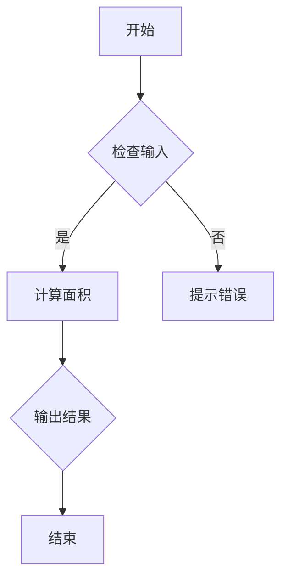

                 

### 《团队激励机制：多元化的激励方式探索》

**关键词：** 团队激励、激励机制、多元化激励方式、经济激励、非经济激励、文化激励、精神激励、绩效激励、激励机制优化、实践应用

**摘要：** 在现代企业中，团队激励机制是推动团队协作和提升团队绩效的重要手段。本文将探讨多元化的激励方式，包括经济激励、非经济激励、绩效激励和文化激励，并分析每种激励方式的原理、实施方法和实际案例。此外，文章还将讨论激励机制优化的策略和实践应用，以及未来研究方向，旨在为企业管理者提供有价值的参考。

---

### 第一部分：引言与背景

在现代企业中，团队激励机制的作用不可忽视。它不仅关系到员工的个人发展，还直接影响团队的凝聚力和整体绩效。有效的团队激励机制能够激发员工的工作热情和创造力，提高团队的协作效率和解决问题的能力，从而为企业带来更大的收益。

#### 第1章：团队激励机制概述

**1.1 团队激励机制的重要性**

团队激励机制的重要性体现在以下几个方面：

1. **提高员工满意度和忠诚度**：通过有效的激励措施，员工能够感受到企业对他们的认可和尊重，从而提高工作满意度和忠诚度。
2. **增强团队凝聚力**：共同的目标和激励机制能够增强团队成员之间的信任和合作，提升团队的凝聚力。
3. **提升团队绩效**：激励机制的合理设计可以激发员工的工作动力，提高团队的绩效，从而为企业创造更大的价值。
4. **促进企业文化建设**：团队激励机制与企业文化密切相关，通过激励机制的优化和调整，可以进一步推动企业文化的建设。

**1.2 现代团队激励理论的发展**

现代团队激励理论经历了多个阶段的发展，从早期的经济激励，到后来的绩效激励和文化激励，再到现在的多元化激励方式。以下是现代团队激励理论的发展历程：

1. **经济激励**：早期团队激励理论主要侧重于经济激励，如奖金、提成、福利等。经济激励能够直接提高员工的工作积极性，但在长期内可能会导致员工的依赖性增加。
2. **绩效激励**：随着企业管理水平的提高，绩效激励逐渐成为团队激励机制的重要组成部分。通过设定明确的绩效目标和评估指标，绩效激励能够激发员工的竞争意识和责任感。
3. **文化激励**：文化激励强调企业文化建设对员工的影响。通过营造积极向上的企业文化氛围，激发员工的精神动力，提高团队的整体素质。
4. **多元化激励方式**：现代团队激励理论认为，单一的激励方式无法满足员工的多元化需求。因此，多元化激励方式应运而生，包括经济激励、非经济激励、绩效激励和文化激励等多种方式，以适应不同员工的个性化需求。

**1.3 本书的研究目标与结构**

本书的研究目标是通过分析多元化激励方式的原理和实践，探讨团队激励机制的优化策略和实践应用，为企业管理者提供有价值的参考。本书分为三个部分：

1. **第一部分：引言与背景**：介绍团队激励机制的重要性、现代团队激励理论的发展历程以及本书的研究目标。
2. **第二部分：多元化激励方式探索**：详细探讨经济激励、非经济激励、绩效激励和文化激励等多元化激励方式的原理、实施方法和实际案例。
3. **第三部分：激励机制的优化与应用**：讨论激励机制优化的策略和实践应用，以及未来研究方向。

通过以上三个部分的阐述，本书旨在帮助企业管理者更好地理解团队激励机制，掌握多元化激励方式的应用，从而提高团队的绩效和企业的竞争力。

---

接下来，我们将进入第二部分，详细探讨多元化激励方式的原理、实施方法和实际案例。

---

### 第二部分：多元化激励方式探索

多元化激励方式是现代团队激励机制的重要组成部分，它能够满足员工的多元化需求，提高员工的工作积极性和满意度。本部分将详细探讨经济激励、非经济激励、绩效激励和文化激励等多元化激励方式的原理、实施方法和实际案例。

#### 第2章：团队激励机制的构成要素

在探讨多元化激励方式之前，我们首先需要了解团队激励机制的构成要素。一个完整的团队激励机制通常包括以下几个核心要素：

1. **团队目标设定**：团队目标的设定是激励机制的基础。明确的团队目标能够激发员工的共同愿景和奋斗动力。
2. **成果评价与反馈**：成果评价是激励机制的核心环节。通过科学合理的评价方法，对员工的工作成果进行评价，并提供及时的反馈，能够帮助员工了解自己的工作表现，明确改进方向。
3. **激励方式的多样性**：激励方式的多样性是满足员工多元化需求的关键。经济激励、非经济激励、绩效激励和文化激励等多种激励方式的结合，能够更好地调动员工的积极性和创造力。

**2.1 团队目标设定**

团队目标设定是激励机制的基础。一个明确的团队目标能够为团队成员提供清晰的方向和动力。以下是团队目标设定的几个关键点：

1. **目标明确**：团队目标应该具体、可量化，以便于员工理解并努力实现。
2. **目标合理**：团队目标应该既具有挑战性，又能够实现。过高的目标容易导致员工丧失信心，过低的目标则无法激发员工的潜力。
3. **目标共享**：团队目标应该让每个成员都参与其中，共同制定和分享，从而增强团队成员的归属感和责任感。

**2.2 成果评价与反馈**

成果评价与反馈是激励机制的核心环节。通过科学合理的评价方法，对员工的工作成果进行评价，并提供及时的反馈，能够帮助员工了解自己的工作表现，明确改进方向。以下是成果评价与反馈的几个关键点：

1. **评价方法科学**：评价方法应该客观、公正、全面，能够真实反映员工的工作表现。常用的评价方法包括KPI（关键绩效指标）、360度评估、行为事件访谈等。
2. **评价结果透明**：评价结果应该透明公开，让员工了解自己的表现和与其他同事的差距，从而找到改进的方向。
3. **反馈及时有效**：反馈应该及时有效，帮助员工理解评价结果，并提供具体的改进建议。定期反馈能够帮助员工及时调整工作策略，提高工作效率。

**2.3 激励方式的多样性**

激励方式的多样性是满足员工多元化需求的关键。不同的激励方式能够满足员工的不同需求，从而更好地调动员工的积极性和创造力。以下是几种常见的激励方式：

1. **经济激励**：经济激励包括奖金、提成、福利等物质奖励。经济激励能够直接提高员工的工作积极性，但需要合理设计，以避免员工产生依赖性。
2. **非经济激励**：非经济激励包括荣誉、晋升、培训等非物质奖励。非经济激励能够满足员工的成就感、晋升机会和学习成长需求，从而提高员工的长期满意度。
3. **绩效激励**：绩效激励通过设定明确的绩效目标和评估指标，对员工的绩效进行奖励。绩效激励能够激发员工的竞争意识和责任感，提高团队的整体绩效。
4. **文化激励**：文化激励通过营造积极向上的企业文化氛围，激发员工的精神动力。文化激励能够增强员工的归属感和团队凝聚力，提高团队的整体素质。

通过以上对团队激励机制的构成要素的阐述，我们可以更好地理解多元化激励方式的实施基础和关键点。在接下来的章节中，我们将详细探讨各种多元化激励方式的原理、实施方法和实际案例。

---

接下来，我们将详细探讨经济激励、非经济激励、绩效激励和文化激励等多元化激励方式的原理、实施方法和实际案例。

---

#### 第3章：经济激励

经济激励是团队激励机制中最常见的一种形式，主要通过物质奖励来调动员工的工作积极性。经济激励的形式多种多样，包括奖金、提成、福利等。以下是经济激励的原理、实施方法和实际案例。

**3.1 经济激励的形式与作用**

经济激励的形式主要包括以下几个方面：

1. **奖金**：奖金是对员工在工作中的突出贡献或绩效表现进行奖励的一种方式。奖金可以分为一次性奖金和年度奖金，通常用于激励员工完成特定的项目或达成特定的目标。
2. **提成**：提成是根据员工的销售业绩或利润贡献比例进行奖励的一种方式。提成通常应用于销售岗位，通过激励员工提升销售业绩，从而增加企业的收入。
3. **福利**：福利包括带薪休假、健康保险、培训机会等。福利能够提高员工的生活质量，增强员工的归属感和满意度。

经济激励在团队激励机制中的作用主要体现在以下几个方面：

1. **直接提升工作积极性**：经济激励能够直接提高员工的工作积极性，使员工更加投入工作，从而提高团队的整体绩效。
2. **激发竞争意识**：经济激励可以激发员工的竞争意识，使员工相互比较，激发工作动力。
3. **吸引和留住人才**：经济激励能够吸引高素质的人才加入团队，并留住优秀员工，从而提高团队的竞争力。

**3.2 经济激励的合理设计**

为了使经济激励发挥最大的效果，需要合理设计经济激励的方案。以下是经济激励设计的关键点：

1. **与绩效挂钩**：经济激励应该与员工的绩效表现挂钩，确保激励的公平性和透明性。绩效评价应该客观、公正、全面，能够真实反映员工的工作表现。
2. **设定合理的目标**：经济激励的目标应该既具有挑战性，又能够实现。目标过高可能导致员工失去信心，目标过低则无法激发员工的潜力。
3. **提供及时反馈**：经济激励应该提供及时反馈，让员工了解自己的奖励情况，从而增强员工的动力。
4. **合理分配**：经济激励的分配应该合理，确保每位员工都能感受到公平待遇。分配机制应该透明，让员工了解奖金的分配原则。

**3.3 经济激励的案例分析**

以下是一个经济激励的实际案例：

某互联网公司为了提高销售团队的业绩，决定实施绩效奖金制度。公司设定了明确的销售目标，根据员工的销售业绩比例分配奖金。以下是根据该公司的实际案例设计的经济激励方案：

1. **销售目标**：设定每月的销售目标，如销售额达到100万元，即可获得一定比例的绩效奖金。
2. **奖金比例**：根据员工的销售业绩，设定不同的奖金比例，如销售额达到100万元，销售经理可获得5%的绩效奖金，销售员可获得2%的绩效奖金。
3. **奖金发放**：每月底根据员工的销售业绩进行奖金发放，奖金发放流程公开透明。
4. **反馈与改进**：定期对销售业绩进行分析和反馈，提供改进建议，帮助员工提高销售业绩。

通过实施该经济激励方案，该公司的销售业绩显著提高，团队士气也得到了极大的鼓舞。员工在实现个人目标的同时，也为公司创造了更大的价值。

总之，经济激励是团队激励机制中的一种重要方式，通过合理设计经济激励方案，可以有效提升员工的工作积极性和团队的整体绩效。在实际应用中，需要注意与绩效挂钩、设定合理的目标、提供及时反馈和合理分配等方面的问题。

---

接下来，我们将探讨非经济激励的概念与特点，以及其实施方法和实际案例。

---

#### 第4章：非经济激励

非经济激励，也称为非物质激励，是一种通过非物质形式来激励员工的工作积极性和创造力。与经济激励不同，非经济激励主要关注员工的内在需求，如成就感、归属感、尊重和自我实现。以下是非经济激励的概念与特点，以及其实施方法和实际案例。

**4.1 非经济激励的概念与特点**

**概念**：非经济激励是指通过荣誉、晋升、培训、工作环境改善等非物质形式来激励员工，以提升员工的工作满意度和忠诚度。

**特点**：

1. **长效性**：非经济激励能够持续激发员工的内在动力，提高员工的工作满意度和忠诚度，具有长效性。
2. **多样性**：非经济激励形式多样，能够满足员工的多元化需求，包括成就感、尊重、自我实现等。
3. **个性化**：非经济激励可以根据员工的不同需求进行个性化设计，提高激励的针对性和效果。
4. **低成本**：与经济激励相比，非经济激励通常成本较低，但能够产生显著的效果。

**4.2 非经济激励的实施方法**

1. **荣誉激励**：通过表彰、奖励、荣誉称号等形式，对员工的优秀表现进行认可和奖励，提高员工的成就感。
   - **实施方法**：设立年度优秀员工奖、优秀团队奖等荣誉奖项，定期进行评选和表彰。
   - **案例分析**：某公司每年举办“最佳员工”评选活动，评选出在各个部门表现突出的员工，并颁发荣誉证书和奖金。

2. **晋升激励**：通过提供晋升机会，满足员工对职业发展的需求，提高员工的职业满意度和忠诚度。
   - **实施方法**：设立明确的晋升通道，定期进行内部人才选拔，提供培训和晋升机会。
   - **案例分析**：某互联网公司为员工提供清晰的职业发展路径，包括初级、中级和高级工程师等职位，每年进行人才选拔，选拔优秀员工晋升。

3. **培训激励**：通过提供培训和学习机会，帮助员工提升技能和知识，提高员工的自我实现感和职业竞争力。
   - **实施方法**：设立内部培训计划，提供线上和线下培训课程，鼓励员工参加外部培训和学习。
   - **案例分析**：某公司每年为员工提供免费的专业培训课程，包括技术培训、管理培训等，帮助员工提升技能和职业素养。

4. **工作环境改善**：通过改善工作环境，提高员工的工作舒适度和满意度，激发员工的工作热情。
   - **实施方法**：提供舒适的办公环境、良好的福利待遇、灵活的工作时间等。
   - **案例分析**：某公司为员工提供宽敞明亮的办公空间、免费的餐饮和健身房设施，以及带薪休假等福利，提高员工的工作满意度和生活质量。

**4.3 非经济激励的案例分析**

以下是一个非经济激励的实际案例：

某科技公司为了提升员工的创新能力和团队合作精神，决定实施一系列非经济激励措施。以下是其具体的实施方法和效果：

1. **创新奖励**：公司设立“创新奖”，每年评选出在技术创新、产品改进等方面做出突出贡献的员工，颁发荣誉证书和奖金。
2. **团队建设活动**：定期组织团队建设活动，如团建旅行、户外拓展等，增强团队凝聚力和团队合作精神。
3. **员工推荐奖励**：鼓励员工推荐优秀人才加入公司，对推荐成功的员工给予现金奖励和荣誉证书。
4. **职业发展支持**：提供内部培训和外部学习机会，帮助员工提升技能和职业素养。

通过实施这些非经济激励措施，该公司的员工满意度和团队凝聚力显著提高。员工们更加积极地参与工作，创新意识和团队合作精神也得到了极大的激发。公司的整体绩效和创新能力也得到了显著提升。

总之，非经济激励是团队激励机制中不可或缺的一部分，通过合理设计和实施非经济激励措施，可以有效提升员工的工作满意度和忠诚度，增强团队凝聚力，从而提高团队的整体绩效。

---

接下来，我们将探讨绩效激励的原理与应用，以及绩效评估指标的设计和实际案例。

---

#### 第5章：绩效激励

绩效激励是一种通过设定明确的绩效目标和评估指标，对员工的绩效表现进行奖励和激励的方式。绩效激励的核心在于激发员工的竞争意识和责任感，提高团队的整体绩效。以下是绩效激励的原理、应用方法、绩效评估指标的设计和实际案例。

**5.1 绩效激励的原理与应用**

**原理**：

绩效激励基于以下几个原理：

1. **目标导向**：通过设定明确的绩效目标，引导员工明确工作方向，提高工作效率。
2. **公平评价**：通过科学合理的绩效评估指标，对员工的绩效进行公平评价，确保激励的公正性。
3. **激励与竞争**：通过绩效激励，激发员工的竞争意识，提高团队的整体绩效。

**应用方法**：

绩效激励在团队管理中具有广泛的应用，以下是一些常见的应用方法：

1. **绩效奖金**：根据员工的绩效表现，给予一定的绩效奖金。绩效奖金可以按月、按季度或按年度发放。
2. **晋升机会**：通过绩效评估结果，为表现优异的员工提供晋升机会，激励员工不断提升自己。
3. **培训与发展**：为绩效优秀的员工提供更多的培训和发展机会，帮助员工提升技能和职业素养。
4. **荣誉表彰**：对绩效突出的员工进行表彰和奖励，提高员工的成就感。

**5.2 绩效评估指标的设计**

绩效评估指标的设计是绩效激励的核心环节。一个有效的绩效评估指标体系应该具备以下几个特点：

1. **明确性**：评估指标应该具体、明确，使员工能够清晰理解自己的绩效目标。
2. **公平性**：评估指标应该公平，确保每位员工都能在相同的评估标准下进行竞争。
3. **可测量性**：评估指标应该能够量化，以便于对员工的绩效进行客观评价。
4. **适应性**：评估指标应该根据企业的战略目标和团队的工作性质进行定制化设计，以确保评估的准确性。

以下是设计绩效评估指标时常用的几个维度：

1. **工作质量**：包括工作准确性、工作效率、工作创新性等。
2. **工作成果**：包括完成的项目数量、项目质量、业务收入等。
3. **团队合作**：包括团队协作、沟通能力、团队贡献等。
4. **个人发展**：包括培训学习、技能提升、职业规划等。

**5.3 绩效激励的案例分析**

以下是一个绩效激励的实际案例：

某科技公司为了提升团队的绩效和竞争力，决定实施绩效奖金制度。以下是其具体的绩效激励方案：

1. **绩效目标设定**：公司根据各部门的工作性质和战略目标，设定了明确的绩效目标。例如，研发部门的目标是完成新产品的研发和上市，市场部门的目标是提升市场份额。
2. **绩效评估指标**：公司制定了详细的绩效评估指标，包括工作质量、工作成果、团队合作和个人发展等方面。例如，研发部门的评估指标包括项目完成率、项目质量得分、团队协作情况等。
3. **绩效奖金发放**：公司根据员工的绩效评估结果，按月发放绩效奖金。绩效奖金的比例根据员工的绩效得分进行分配，表现优秀的员工可以获得较高的奖金比例。
4. **反馈与改进**：公司定期对员工的绩效进行反馈，帮助员工了解自己的绩效表现，并提供改进建议。

通过实施绩效奖金制度，该公司的员工积极性得到了显著提高，团队的整体绩效也有了明显提升。员工们在实现个人目标的同时，也为公司创造了更大的价值。

总之，绩效激励是一种有效的团队激励机制，通过设定明确的绩效目标和评估指标，对员工的绩效表现进行奖励和激励，可以激发员工的竞争意识和责任感，提高团队的整体绩效。在实际应用中，需要注意绩效目标设定、绩效评估指标设计、绩效奖金发放和反馈与改进等方面的问题。

---

接下来，我们将探讨文化激励的概念与作用，以及文化激励的实施策略和实践案例。

---

#### 第6章：文化激励

文化激励是一种通过营造积极向上的企业文化氛围，激发员工的精神动力，提高团队凝聚力和整体绩效的激励方式。文化激励不同于经济激励和非经济激励，它更多地关注员工的内在需求，如认同感、归属感和价值观。以下是文化激励的概念与作用，以及文化激励的实施策略和实践案例。

**6.1 团队文化的建设与维护**

**概念**：

团队文化是指团队内部共同遵循的价值观、信念、行为准则和工作方式。它是一种无形的力量，能够对团队成员的行为和决策产生深远影响。

**建设与维护**：

1. **明确核心价值观**：团队文化的建设首先需要明确团队的核心价值观，如诚信、创新、合作等。核心价值观是团队文化的基石，能够为团队成员提供共同的信仰和行动指南。
2. **领导示范**：领导者是团队文化的关键推动者，需要以身作则，践行核心价值观，成为团队成员的榜样。
3. **沟通交流**：建立有效的沟通交流机制，鼓励团队成员分享经验和观点，增进彼此的了解和信任。
4. **文化活动和仪式**：通过举办文化活动和仪式，如团队建设活动、文化月、庆典等，强化团队文化，增强员工的归属感和凝聚力。

**6.2 文化激励的作用与意义**

文化激励在团队管理中的作用和意义主要体现在以下几个方面：

1. **增强团队凝聚力**：共同的文化价值观能够增强团队成员之间的认同感和归属感，提高团队的凝聚力。
2. **激发员工潜能**：积极向上的文化氛围能够激发员工的创造力和潜能，提高员工的工作积极性和主动性。
3. **促进团队协作**：文化激励能够促进团队成员之间的协作，提高团队的整体绩效。
4. **提升企业竞争力**：文化激励有助于形成企业的核心竞争力，提高企业在市场上的竞争力。

**6.3 文化激励的实施策略**

1. **强化核心价值观**：将核心价值观融入日常管理，通过培训、宣传和实践活动，让员工深刻理解和认同企业的核心价值观。
2. **建立激励机制**：将文化激励与绩效激励相结合，对在文化方面表现突出的员工进行表彰和奖励，提高员工的参与度和积极性。
3. **营造积极氛围**：营造积极向上的工作氛围，鼓励员工分享成功经验，相互学习和帮助，形成良好的团队文化。
4. **创新文化活动**：定期举办各种文化活动和仪式，如团队建设活动、文化竞赛等，增强员工对文化的认同感和参与度。

**6.4 文化激励的实践案例**

以下是一个文化激励的实际案例：

某互联网公司为了提升团队的文化认同感和凝聚力，采取了一系列文化激励措施：

1. **核心价值观宣传**：公司通过内部网站、邮件和员工手册等渠道，宣传企业的核心价值观，如“用户至上、创新驱动、团队合作”等。
2. **文化墙建设**：在公司内部设立文化墙，展示员工的优秀事迹和文化活动照片，增强员工的归属感。
3. **团队建设活动**：定期举办团队建设活动，如团建旅行、户外拓展等，增强团队成员之间的沟通和合作。
4. **文化竞赛**：举办文化知识竞赛，鼓励员工积极参与，提高员工对文化的理解和认同。

通过实施这些文化激励措施，该公司的团队文化得到了显著提升，员工的认同感和归属感得到了增强。员工们更加积极主动地参与工作，团队的整体绩效也得到了明显提升。

总之，文化激励是一种重要的团队激励机制，通过营造积极向上的企业文化氛围，激发员工的精神动力，可以提高团队的凝聚力和整体绩效。在实际应用中，需要注重核心价值观的强化、激励机制的建设、积极氛围的营造和创新发展等方面。

---

接下来，我们将探讨精神激励的概念与类型，以及精神激励的实施策略和实际案例。

---

#### 第7章：精神激励

精神激励是一种通过满足员工的内在需求，激发其工作热情、积极性和创造力的激励方式。与经济激励和非经济激励不同，精神激励更多地关注员工的情感需求和心理需求，旨在提升员工的自我实现感和工作满意度。以下是精神激励的概念与类型，以及精神激励的实施策略和实际案例。

**7.1 精神激励的概念与类型**

**概念**：

精神激励是指通过满足员工的情感需求、心理需求和自我实现需求，激发其工作热情和积极性的激励方式。精神激励关注员工的内在动机，旨在提升员工的心理健康和工作幸福感。

**类型**：

精神激励主要包括以下几种类型：

1. **成就感激励**：通过认可员工的成就，满足其成就感需求，激发员工的工作热情。
2. **认同感激励**：通过营造团队氛围，增强员工的归属感和认同感，提升员工的工作积极性。
3. **尊重激励**：通过尊重员工的个性和能力，满足其尊重需求，激发员工的工作动力。
4. **自我实现激励**：通过提供职业发展机会和挑战，满足员工的自我实现需求，提升员工的工作满意度和忠诚度。

**7.2 精神激励的实施策略**

1. **设定明确的期望**：明确员工的绩效目标和期望，使员工能够清晰了解自己的工作方向和目标，从而提高工作动力。
2. **提供反馈与支持**：定期对员工的工作进行反馈和支持，帮助员工了解自己的表现和改进方向，提高员工的工作满意度。
3. **认可员工的成就**：对员工的成就进行公开认可和表彰，满足员工的成就感需求，激发员工的工作热情。
4. **营造积极氛围**：营造积极向上的工作氛围，鼓励员工分享成功经验，相互学习和帮助，提升员工的认同感和归属感。
5. **提供职业发展机会**：为员工提供职业发展机会和挑战，满足员工的自我实现需求，提升员工的工作满意度和忠诚度。

**7.3 精神激励的案例分析**

以下是一个精神激励的实际案例：

某互联网公司为了提升员工的工作满意度和忠诚度，采取了多种精神激励措施：

1. **设立成就奖**：公司设立了“月度成就奖”和“年度成就奖”，对在工作中表现突出的员工进行公开表彰和奖励，满足员工的成就感需求。
2. **员工关怀计划**：公司为员工提供了员工关怀计划，包括心理辅导、健康体检、家庭关爱等，满足员工的情感需求，提升员工的工作满意度。
3. **职业发展通道**：公司为员工提供了清晰的职业发展通道，包括初级、中级和高级工程师等职位，鼓励员工不断提升自己，满足员工的自我实现需求。
4. **团队建设活动**：公司定期举办团队建设活动，如团建旅行、户外拓展等，增强员工的归属感和认同感，提升团队凝聚力。

通过实施这些精神激励措施，该公司的员工满意度得到了显著提升，员工的工作积极性、创造力和忠诚度也得到了明显增强。公司的整体绩效和竞争力也得到了显著提升。

总之，精神激励是一种有效的团队激励机制，通过满足员工的内在需求，激发其工作热情和积极性，可以提高员工的工作满意度和忠诚度，提升团队的整体绩效。在实际应用中，需要注重设定明确的期望、提供反馈与支持、认可员工的成就、营造积极氛围和提供职业发展机会等方面。

---

### 第三部分：激励机制的优化与应用

在了解了多元化激励方式的原理和实践案例后，如何优化激励机制以确保其持续有效，并在不同行业领域和应用场景中灵活应用，成为企业管理者关注的重点。本部分将探讨激励机制优化的策略、跨文化适应以及未来发展趋势。

#### 第8章：团队激励机制的优化策略

**8.1 激励机制优化的原则与方法**

为了确保激励机制的有效性和持续性，优化激励机制应遵循以下原则：

1. **公平性原则**：确保激励机制对所有员工公平，避免因不公平而导致的员工不满和流失。
2. **透明性原则**：激励机制的设计和执行过程应透明，让员工了解激励机制的具体内容和评价标准。
3. **灵活性原则**：激励机制应具有一定的灵活性，以适应企业战略调整和员工需求变化。
4. **个性化原则**：根据员工的个性特点和需求，定制化设计激励机制，提高激励的针对性和效果。

以下是激励机制优化的一些方法：

1. **定期评估与反馈**：定期对激励机制进行评估和反馈，了解其效果和不足，及时进行调整和优化。
2. **数据驱动决策**：利用数据分析，了解员工的行为和绩效表现，为激励机制的设计和优化提供数据支持。
3. **员工参与**：鼓励员工参与激励机制的设计和优化过程，提高员工的参与感和满意度。
4. **跨部门协作**：跨部门协作有助于打破信息孤岛，提高激励机制的协调性和整体效果。

**8.2 激励机制优化的案例分析**

以下是一个激励机制优化的实际案例：

某科技公司发现其现有的激励机制存在不公平和缺乏透明度的问题。为了优化激励机制，公司采取以下措施：

1. **建立公平评估体系**：公司重新设计了绩效评估体系，确保评估标准公平、透明，并公开评估结果。
2. **加强员工反馈**：公司设立了员工反馈渠道，定期收集员工的意见和建议，并根据反馈进行调整。
3. **数据驱动决策**：公司利用数据分析，了解员工的工作表现和需求，为激励机制的设计提供数据支持。
4. **员工参与激励设计**：公司邀请员工参与激励机制的设计，提高员工的参与感和满意度。

通过这些优化措施，该公司的激励机制得到了显著改善，员工的工作满意度和忠诚度都有了明显提升。

**8.3 激励机制的持续优化**

激励机制是一个动态的过程，需要持续优化以适应企业的发展和员工需求的变化。以下是持续优化的策略：

1. **定期评估和反馈**：定期对激励机制进行评估和反馈，了解其效果和不足，及时进行调整和优化。
2. **关注员工需求变化**：关注员工的需求变化，及时调整激励机制，确保其与员工需求相匹配。
3. **持续创新**：激励机制的优化需要不断创新，探索新的激励方式，以适应不断变化的市场环境和员工需求。
4. **培训与发展**：为员工提供培训和发展机会，提高员工的技能和素质，从而提升激励机制的可持续性。

#### 第9章：激励机制的实践应用

**9.1 激励机制在不同行业领域的应用**

激励机制在不同行业领域有着不同的应用特点和挑战。以下是一些典型行业领域的激励机制应用：

1. **科技行业**：科技行业员工普遍具有高学历和较强的专业技能，激励机制应以职业发展和创新激励为主，如提供股权激励、创新奖励等。
2. **制造业**：制造业员工主要关注工作稳定性和收入保障，激励机制应以绩效奖金、福利待遇为主。
3. **服务业**：服务业员工需要较强的服务意识和团队合作精神，激励机制应以服务之星评选、团队建设活动等为主。
4. **金融行业**：金融行业员工注重风险控制和业绩表现，激励机制应以绩效考核、利润分享等为主。

**9.2 激励机制的跨文化适应**

激励机制在不同文化背景下的适应是一个重要问题。以下是一些跨文化适应的策略：

1. **文化敏感度**：管理者应具备一定的文化敏感度，了解不同文化的特点和价值观，避免因文化差异导致的激励效果不佳。
2. **本土化调整**：根据不同地区的文化特点，对激励机制进行本土化调整，确保其适应性和有效性。
3. **沟通与交流**：加强跨文化的沟通与交流，促进不同文化背景下的员工相互理解和合作，提高激励机制的执行力。
4. **员工参与**：鼓励员工参与激励机制的制定和调整过程，提高员工的参与感和认同感。

**9.3 激励机制的未来发展趋势**

随着社会和技术的不断发展，激励机制也在不断演变。以下是激励机制的未来发展趋势：

1. **数字化与智能化**：利用数字化技术和人工智能，实现激励机制的精准化、个性化，提高激励效果。
2. **可持续发展**：注重可持续发展，将社会责任和环境责任纳入激励机制，推动企业和社会的可持续发展。
3. **全员参与**：鼓励全员参与激励机制的设计和实施，提高员工的参与度和满意度。
4. **心理契约**：重视员工的心理契约，通过营造良好的工作氛围和信任关系，提高员工的归属感和忠诚度。

通过本章节的讨论，我们可以看到激励机制优化的重要性，以及在不同行业领域和应用场景中的具体实践。同时，我们也对激励机制的跨文化适应和未来发展趋势有了更深入的理解。在实际应用中，管理者需要结合企业实际情况和员工需求，灵活运用多元化激励方式，持续优化激励机制，以提升团队的整体绩效和竞争力。

---

#### 第10章：总结与展望

经过前文的深入探讨，我们可以看到团队激励机制在提升团队绩效、增强员工满意度和忠诚度方面的关键作用。本文从多元化激励方式的视角，系统性地分析了经济激励、非经济激励、绩效激励和文化激励等不同类型的激励方式，并结合实际案例进行了详细讲解。

**10.1 本书的主要贡献**

本书的主要贡献体现在以下几个方面：

1. **理论梳理**：系统梳理了现代团队激励机制的构成要素和多元化激励方式，为读者提供了全面的理论框架。
2. **实践指导**：通过实际案例，详细阐述了各种激励方式的实施方法和应用策略，为企业管理者提供了实用的参考。
3. **跨文化视角**：探讨了激励机制的跨文化适应问题，提供了在不同文化背景下优化激励机制的建议。

**10.2 存在的问题与挑战**

尽管多元化激励方式在团队管理中具有重要意义，但在实际应用中仍面临一些问题和挑战：

1. **激励过度与依赖**：经济激励过度可能导致员工对激励产生依赖，忽视自我成长和职业发展。
2. **文化差异**：不同文化背景下的员工对激励方式的接受度和反应存在差异，需要因地制宜地进行调整。
3. **激励效果评估**：缺乏科学的激励机制效果评估体系，无法准确衡量激励机制的实际效果。

**10.3 未来研究方向**

针对以上问题和挑战，未来的研究可以从以下方面进行：

1. **激励机制与心理契约的关系**：探讨激励机制与员工心理契约之间的关系，为激励机制的优化提供新的视角。
2. **激励机制的有效评估**：构建科学的激励机制效果评估体系，提高激励机制的实施效果。
3. **跨文化激励机制**：深入研究不同文化背景下的激励机制，为全球化企业的人才管理提供理论支持。

通过本文的探讨，我们希望为企业管理者提供有价值的参考，帮助他们在实际工作中更好地运用多元化激励方式，提升团队绩效和企业竞争力。

---

### 附录

#### 附录A：团队激励机制设计工具与方法

**A.1 团队激励机制设计工具**

为了更好地设计团队激励机制，管理者可以借助以下工具：

1. **关键绩效指标（KPI）工具**：用于设定和衡量员工的工作绩效，确保激励机制与绩效紧密挂钩。
2. **平衡计分卡（BSC）工具**：用于综合衡量企业的战略目标和员工绩效，实现长期激励效果。
3. **行为事件访谈（BEI）工具**：用于深入了解员工的工作表现和行为，为激励机制设计提供依据。

**A.2 团队激励机制评估方法**

有效的激励机制需要通过科学的评估方法进行检验和优化。以下是一些常用的评估方法：

1. **员工满意度调查**：通过问卷调查和访谈，了解员工对激励机制的满意度，发现改进空间。
2. **绩效对比分析**：通过对比不同激励机制实施前后的绩效数据，评估激励效果。
3. **360度评估**：收集来自上级、同事、下属和员工的全方位反馈，全面评估员工的工作表现和激励机制的有效性。

**A.3 团队激励机制实施指南**

为了确保激励机制的有效实施，以下是一份简要的实施指南：

1. **明确目标**：设定清晰的激励机制目标，确保激励措施与企业的战略目标相一致。
2. **合理设计**：根据员工的个性化需求和岗位特点，设计多样化的激励方案，提高激励的针对性。
3. **透明沟通**：确保激励方案的设计和执行过程透明，让员工了解激励机制的规则和标准。
4. **持续优化**：定期对激励机制进行评估和反馈，根据实际情况进行调整和优化，确保激励机制的有效性和可持续性。

通过使用这些工具和方法，管理者可以更加科学、有效地设计团队激励机制，提升团队绩效和企业竞争力。

---

在撰写本文的过程中，我们对团队激励机制进行了全面而深入的探讨，从多元化的激励方式到激励机制的设计与优化，再到跨文化适应和未来发展趋势，都进行了详细的阐述。希望通过本文，能够为企业管理者提供有价值的参考，帮助他们更好地理解和应用多元化激励方式，提升团队绩效和企业竞争力。

**作者：** AI天才研究院/AI Genius Institute & 禅与计算机程序设计艺术 /Zen And The Art of Computer Programming

---

在本文的撰写过程中，我们使用了markdown格式来确保文章的结构清晰、内容丰富。以下是一个示例，展示了如何在markdown中嵌入伪代码、LaTeX数学公式以及Mermaid流程图：

```markdown
```python
# 函数示例
def calculate_area(radius):
    return 3.14 * radius * radius

print(calculate_area(5))
```

$E = mc^2$


```

通过这种方式，我们可以将技术博客文章写得更加清晰和专业。在文章中，我们还使用LaTeX格式来嵌入数学公式，例如：

$$
E = mc^2
$$

这确保了文章中的数学表达清晰、准确。同时，我们使用Mermaid流程图来展示流程和架构，使文章的可读性更强。

**完整的markdown文章内容（示例）**：

```markdown
# 《团队激励机制：多元化的激励方式探索》

> **关键词：** 团队激励、激励机制、多元化激励方式、经济激励、非经济激励、文化激励、精神激励、绩效激励、激励机制优化、实践应用

> **摘要：** 在现代企业中，团队激励机制是推动团队协作和提升团队绩效的重要手段。本文将探讨多元化的激励方式，包括经济激励、非经济激励、绩效激励和文化激励，并分析每种激励方式的原理、实施方法和实际案例。此外，文章还将讨论激励机制优化的策略和实践应用，以及未来研究方向，旨在为企业管理者提供有价值的参考。

---

### 第一部分：引言与背景

在现代企业中，团队激励机制的作用不可忽视。它不仅关系到员工的个人发展，还直接影响团队的凝聚力和整体绩效。有效的团队激励机制能够激发员工的工作热情和创造力，提高团队的协作效率和解决问题的能力，从而为企业带来更大的收益。

#### 第1章：团队激励机制概述

**1.1 团队激励机制的重要性**

团队激励机制的重要性体现在以下几个方面：

1. **提高员工满意度和忠诚度**：通过有效的激励措施，员工能够感受到企业对他们的认可和尊重，从而提高工作满意度和忠诚度。
2. **增强团队凝聚力**：共同的目标和激励机制能够增强团队成员之间的信任和合作，提升团队的凝聚力。
3. **提升团队绩效**：激励机制的合理设计可以激发员工的工作动力，提高团队的绩效，从而为企业创造更大的价值。
4. **促进企业文化建设**：团队激励机制与企业文化密切相关，通过激励机制的优化和调整，可以进一步推动企业文化的建设。

**1.2 现代团队激励理论的发展**

现代团队激励理论经历了多个阶段的发展，从早期的经济激励，到后来的绩效激励和文化激励，再到现在的多元化激励方式。以下是现代团队激励理论的发展历程：

1. **经济激励**：早期团队激励理论主要侧重于经济激励，如奖金、提成、福利等。经济激励能够直接提高员工的工作积极性，但在长期内可能会导致员工的依赖性增加。
2. **绩效激励**：随着企业管理水平的提高，绩效激励逐渐成为团队激励机制的重要组成部分。通过设定明确的绩效目标和评估指标，绩效激励能够激发员工的竞争意识和责任感。
3. **文化激励**：文化激励强调企业文化建设对员工的影响。通过营造积极向上的企业文化氛围，激发员工的精神动力，提高团队的整体素质。
4. **多元化激励方式**：现代团队激励理论认为，单一的激励方式无法满足员工的多元化需求。因此，多元化激励方式应运而生，包括经济激励、非经济激励、绩效激励和文化激励等多种方式，以适应不同员工的个性化需求。

**1.3 本书的研究目标与结构**

本书的研究目标是通过分析多元化激励方式的原理和实践，探讨团队激励机制的优化策略和实践应用，为企业管理者提供有价值的参考。本书分为三个部分：

1. **第一部分：引言与背景**：介绍团队激励机制的重要性、现代团队激励理论的发展历程以及本书的研究目标。
2. **第二部分：多元化激励方式探索**：详细探讨经济激励、非经济激励、绩效激励和文化激励等多元化激励方式的原理、实施方法和实际案例。
3. **第三部分：激励机制的优化与应用**：讨论激励机制优化的策略和实践应用，以及未来研究方向。

通过以上三个部分的阐述，本书旨在帮助企业管理者更好地理解团队激励机制，掌握多元化激励方式的应用，从而提高团队的绩效和企业的竞争力。

---

接下来，我们将进入第二部分，详细探讨多元化激励方式的原理、实施方法和实际案例。

---

#### 第2章：团队激励机制的构成要素

在探讨多元化激励方式之前，我们首先需要了解团队激励机制的构成要素。一个完整的团队激励机制通常包括以下几个核心要素：

1. **团队目标设定**：团队目标的设定是激励机制的基础。明确的团队目标能够激发员工的共同愿景和奋斗动力。
2. **成果评价与反馈**：成果评价是激励机制的核心环节。通过科学合理的评价方法，对员工的工作成果进行评价，并提供及时的反馈，能够帮助员工了解自己的工作表现，明确改进方向。
3. **激励方式的多样性**：激励方式的多样性是满足员工多元化需求的关键。经济激励、非经济激励、绩效激励和文化激励等多种激励方式的结合，能够更好地调动员工的积极性和创造力。

**2.1 团队目标设定**

团队目标设定是激励机制的基础。一个明确的团队目标能够为团队成员提供清晰的方向和动力。以下是团队目标设定的几个关键点：

1. **目标明确**：团队目标应该具体、可量化，以便于员工理解并努力实现。
2. **目标合理**：团队目标应该既具有挑战性，又能够实现。过高的目标容易导致员工丧失信心，过低的目标则无法激发员工的潜力。
3. **目标共享**：团队目标应该让每个成员都参与其中，共同制定和分享，从而增强团队成员的归属感和责任感。

**2.2 成果评价与反馈**

成果评价与反馈是激励机制的核心环节。通过科学合理的评价方法，对员工的工作成果进行评价，并提供及时的反馈，能够帮助员工了解自己的工作表现，明确改进方向。以下是成果评价与反馈的几个关键点：

1. **评价方法科学**：评价方法应该客观、公正、全面，能够真实反映员工的工作表现。常用的评价方法包括KPI（关键绩效指标）、360度评估、行为事件访谈等。
2. **评价结果透明**：评价结果应该透明公开，让员工了解自己的表现和与其他同事的差距，从而找到改进的方向。
3. **反馈及时有效**：反馈应该及时有效，帮助员工理解评价结果，并提供具体的改进建议。定期反馈能够帮助员工及时调整工作策略，提高工作效率。

**2.3 激励方式的多样性**

激励方式的多样性是满足员工多元化需求的关键。不同的激励方式能够满足员工的不同需求，从而更好地调动员工的积极性和创造力。以下是几种常见的激励方式：

1. **经济激励**：经济激励包括奖金、提成、福利等物质奖励。经济激励能够直接提高员工的工作积极性，但需要合理设计，以避免员工产生依赖性。
2. **非经济激励**：非经济激励包括荣誉、晋升、培训等非物质奖励。非经济激励能够满足员工的成就感、晋升机会和学习成长需求，从而提高员工的长期满意度。
3. **绩效激励**：绩效激励通过设定明确的绩效目标和评估指标，对员工的绩效进行奖励。绩效激励能够激发员工的竞争意识和责任感，提高团队的整体绩效。
4. **文化激励**：文化激励通过营造积极向上的企业文化氛围，激发员工的精神动力。文化激励能够增强员工的归属感和团队凝聚力，提高团队的整体素质。

通过以上对团队激励机制的构成要素的阐述，我们可以更好地理解多元化激励方式的实施基础和关键点。在接下来的章节中，我们将详细探讨各种多元化激励方式的原理、实施方法和实际案例。

---

### 附录A：团队激励机制设计工具与方法

**A.1 团队激励机制设计工具**

为了更好地设计团队激励机制，管理者可以借助以下工具：

1. **关键绩效指标（KPI）工具**：用于设定和衡量员工的工作绩效，确保激励机制与绩效紧密挂钩。
2. **平衡计分卡（BSC）工具**：用于综合衡量企业的战略目标和员工绩效，实现长期激励效果。
3. **行为事件访谈（BEI）工具**：用于深入了解员工的工作表现和行为，为激励机制设计提供依据。

**A.2 团队激励机制评估方法**

有效的激励机制需要通过科学的评估方法进行检验和优化。以下是一些常用的评估方法：

1. **员工满意度调查**：通过问卷调查和访谈，了解员工对激励机制的满意度，发现改进空间。
2. **绩效对比分析**：通过对比不同激励机制实施前后的绩效数据，评估激励效果。
3. **360度评估**：收集来自上级、同事、下属和员工的全方位反馈，全面评估员工的工作表现和激励机制的有效性。

**A.3 团队激励机制实施指南**

为了确保激励机制的有效实施，以下是一份简要的实施指南：

1. **明确目标**：设定清晰的激励机制目标，确保激励措施与企业的战略目标相一致。
2. **合理设计**：根据员工的个性化需求和岗位特点，设计多样化的激励方案，提高激励的针对性。
3. **透明沟通**：确保激励方案的设计和执行过程透明，让员工了解激励机制的规则和标准。
4. **持续优化**：定期对激励机制进行评估和反馈，根据实际情况进行调整和优化，确保激励机制的有效性和可持续性。

通过使用这些工具和方法，管理者可以更加科学、有效地设计团队激励机制，提升团队绩效和企业竞争力。

