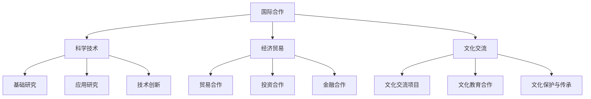

                 

## 《国际合作：携手共进，推动人类计算进步》

### 关键词：
- 国际合作
- 计算进步
- 科技创新
- 经济合作
- 文化交流
- 政策机制

#### 摘要：
本文探讨了国际合作在推动人类计算进步中的重要性。通过分析国际合作的基本原则、领域与形式、机制与政策，以及国际合作在各个领域的具体案例，本文揭示了国际合作在科技进步、经济繁荣和文化交流中的关键作用。同时，本文还展望了国际合作的新趋势，并提出了未来发展的建议。

### 第1章 引言：国际合作的必要性

##### 1.1 国际合作的重要性

国际合作在当今全球化的背景下显得尤为重要。随着科技的迅猛发展和全球经济的深度融合，各国之间的联系日益紧密，国际合作已成为推动人类进步的重要动力。在计算技术领域，国际合作不仅促进了技术的快速传播和融合，还推动了新技术的创新和应用。

国际合作的重要性体现在以下几个方面：

1. **资源共享与优势互补**：通过国际合作，各国可以共享先进的科技资源和研究成果，实现优势互补，共同应对全球性挑战。
2. **技术传播与普及**：国际合作有助于将最新的科技成果迅速传播到全球各地，促进技术的普及和应用，提高全球科技创新的整体水平。
3. **经济利益最大化**：国际合作有助于各国企业通过共享资源和市场，实现经济利益的最大化，推动全球经济的繁荣发展。
4. **文化理解与融合**：国际合作促进了不同文化之间的交流与理解，有助于消除文化隔阂，推动全球文化的融合与发展。

##### 1.2 人类计算进步的背景和挑战

人类计算技术的进步经历了数个阶段，从最早的计算机硬件到软件系统，再到如今的云计算、大数据、人工智能等前沿技术。这些进步不仅极大地改变了我们的生活方式，也推动了社会的发展和经济的增长。

然而，随着计算技术的不断进步，我们也面临着一系列挑战：

1. **技术复杂性增加**：随着计算技术的不断发展，技术的复杂性不断增加，这对技术研发和人才培养提出了更高的要求。
2. **数据安全和隐私保护**：随着数据量的爆炸式增长，数据安全和隐私保护成为了一个严峻的挑战，需要全球合作来共同应对。
3. **全球协同创新**：计算技术的进步需要全球范围内的协同创新，而国际合作是实现这一目标的关键。
4. **技术伦理和规范**：在计算技术快速发展的同时，也产生了一系列伦理和规范问题，需要国际社会共同制定规范和标准。

##### 1.3 国际合作的目标和原则

国际合作在推动人类计算进步中的目标和原则如下：

1. **科技创新**：通过国际合作，实现科技创新的突破，推动计算技术的持续进步。
2. **资源共享**：实现全球科技资源的共享，提高资源利用效率，降低研发成本。
3. **人才培养**：通过国际合作，培养一批高素质的科技人才，推动全球科技创新的可持续发展。
4. **政策协调**：通过国际合作，实现各国政策协调，消除技术贸易壁垒，促进全球技术交流与合作。
5. **文化理解**：通过国际合作，促进不同文化之间的交流与理解，推动全球文化的融合与发展。

### 第2章 国际合作的领域与形式

国际合作在多个领域发挥着重要作用，其中科学技术领域、经济贸易领域和文化交流领域是国际合作的重要领域。这些领域通过不同形式和机制的合作，共同推动了全球的科技进步、经济发展和文化交流。

##### 2.1 国际合作的领域

###### 2.1.1 科学技术领域

科学技术领域的国际合作在推动全球科技进步中起到了至关重要的作用。以下是科学技术领域国际合作的几个主要方面：

1. **基础研究合作**：各国科研机构通过合作开展基础研究，共同攻克科学难题，推动科学技术的创新发展。
2. **应用研究合作**：企业、科研机构和高校通过合作开展应用研究，将研究成果转化为实际应用，推动产业升级和技术创新。
3. **技术创新合作**：各国企业通过技术创新合作，共同开发新技术、新产品，推动全球市场的繁荣发展。

###### 2.1.2 经济贸易领域

经济贸易领域的国际合作对全球经济发展具有重要影响。以下是经济贸易领域国际合作的几个主要方面：

1. **贸易合作**：各国通过签订自由贸易协定，降低贸易壁垒，促进贸易自由化和便利化。
2. **投资合作**：各国通过相互投资，促进资本流动和技术转移，推动全球经济的繁荣发展。
3. **金融合作**：各国通过金融合作，共同应对金融风险，维护金融稳定。

###### 2.1.3 文化交流领域

文化交流领域的国际合作在促进全球文化多样性和文化交流中发挥了重要作用。以下是文化交流领域国际合作的几个主要方面：

1. **文化交流项目**：各国通过举办文化交流活动，展示各自的文化特色，促进文化交流与理解。
2. **文化教育合作**：各国通过合作开展文化教育项目，培养具有国际视野的文化人才，推动全球文化的融合与发展。
3. **文化保护与传承**：各国通过合作保护与传承文化遗产，共同应对文化挑战，维护人类文化的多样性。

##### 2.2 国际合作的常见形式

国际合作的形式多种多样，主要包括以下几种：

###### 2.2.1 政府间合作

政府间合作是指各国政府通过签订协议、开展项目等形式进行的合作。以下是政府间合作的几个主要形式：

1. **双边合作**：两国政府之间签订的合作协议，如科技合作协议、经济合作协议等。
2. **多边合作**：多个国家政府之间的合作，如国际组织、地区合作组织等。
3. **国际会议**：各国政府通过召开国际会议，讨论合作事项，制定合作计划。

###### 2.2.2 企业间合作

企业间合作是指各国企业之间通过签订合同、成立合资公司等形式进行的合作。以下是企业间合作的几个主要形式：

1. **技术合作**：企业之间通过技术交流、技术转让等形式进行合作，共同研发新技术、新产品。
2. **合资公司**：企业之间成立合资公司，共同投资、共同经营，实现优势互补，扩大市场份额。
3. **全球供应链**：企业之间通过建立全球供应链，实现资源优化配置，提高生产效率和竞争力。

###### 2.2.3 学术机构合作

学术机构合作是指各国学术机构之间通过签订合作协议、开展联合研究等形式进行的合作。以下是学术机构合作的几个主要形式：

1. **科研合作**：学术机构之间通过联合开展科研项目，共同攻关科学难题，推动科学技术的创新发展。
2. **学术交流**：学术机构之间通过举办学术会议、研讨会等形式，促进学术交流与合作，提高科研水平。
3. **人才培养**：学术机构之间通过联合培养人才，提高人才培养质量，推动全球科技创新的可持续发展。

### 第3章 国际合作的机制与政策

国际合作的有效运行离不开完善的机制和政策支持。这些机制和政策旨在促进国际合作的顺利进行，确保合作各方能够实现互利共赢。以下将从国际合作机制的概述、国际组织的角色、多边与双边合作机制以及国际合作政策的制定与实施等方面进行详细阐述。

##### 3.1 国际合作机制的概述

国际合作机制是指各国为了实现共同目标，在政治、经济、科技、文化等领域开展合作所形成的制度和规范。这些机制包括：

1. **国际组织**：如联合国、世界贸易组织（WTO）、国际货币基金组织（IMF）等，通过制定国际规则、协调各国政策，推动全球合作。
2. **政府间合作机制**：各国政府通过签订双边或多边协议，建立政府间合作机制，推动合作项目的实施。
3. **企业间合作机制**：企业通过签订合作协议、成立合资公司等形式，建立企业间合作机制，实现资源整合和优势互补。
4. **学术机构合作机制**：学术机构通过签订合作协议、联合开展科研项目等形式，建立学术机构合作机制，促进科技创新和人才培养。

##### 3.1.1 国际组织的作用

国际组织在国际合作中发挥着重要的作用，主要包括以下几个方面：

1. **规则制定**：国际组织制定国际规则和标准，为国际合作提供法律基础和规范。
2. **协调政策**：国际组织协调各国政策，推动全球治理体系的完善。
3. **提供平台**：国际组织为各国政府、企业和学术机构提供交流合作的平台，促进国际间的沟通与理解。
4. **提供支持**：国际组织通过提供资金、技术等支持，帮助各国实现国际合作目标。

##### 3.1.2 多边和双边合作机制

多边和双边合作机制是国际合作中两种重要的形式，各有其特点和优势。

1. **多边合作机制**：多边合作机制涉及多个国家，通过协商一致的方式达成合作共识。其优势包括：
   - **资源整合**：多个国家的资源可以集中起来，实现资源的最优配置。
   - **利益平衡**：多个国家的利益可以通过协商得到平衡，降低合作风险。
   - **广泛参与**：多边合作可以吸引更多国家参与，提高合作的覆盖面和影响力。

2. **双边合作机制**：双边合作机制涉及两个国家，通过签订协议和开展项目进行合作。其优势包括：
   - **灵活高效**：双边合作机制相对简单，决策过程更快捷，合作更高效。
   - **利益明确**：双边合作可以明确双方的利益诉求，有助于实现合作目标。
   - **深入交流**：双边合作可以促进两国之间的深入交流和合作，为后续多边合作奠定基础。

##### 3.2 国际合作政策的制定与实施

国际合作政策的制定与实施是确保国际合作顺利进行的关键环节。以下从政策制定的原则、政策实施的效果评估等方面进行阐述。

###### 3.2.1 政策制定的原则

国际合作政策的制定应遵循以下原则：

1. **平等互利**：政策制定应体现平等互利的原则，确保各国在合作中都能够获得实质性利益。
2. **开放包容**：政策制定应开放包容，鼓励各国参与，促进全球合作。
3. **科学合理**：政策制定应科学合理，充分考虑各国的发展需求和实际情况。
4. **可持续性**：政策制定应注重可持续性，确保合作项目的长期发展。

###### 3.2.2 政策实施的效果评估

政策实施的效果评估是确保国际合作政策达到预期目标的重要手段。以下从政策实施效果的评估标准、评估方法和改进措施等方面进行阐述。

1. **评估标准**：政策实施效果的评估应包括以下标准：
   - **合作目标达成情况**：评估合作目标的达成情况，判断政策是否达到了预期效果。
   - **经济效益**：评估合作项目的经济效益，包括投资回报率、就业机会等。
   - **社会效益**：评估合作项目的社会效益，包括社会福利、文化交流等。
   - **环境影响**：评估合作项目对环境的影响，包括资源利用、环境保护等。

2. **评估方法**：政策实施效果的评估可以采用以下方法：
   - **定量评估**：通过数据分析和统计方法，评估政策实施的效果。
   - **定性评估**：通过案例分析、专家访谈等方法，评估政策实施的影响。
   - **综合评估**：将定量评估和定性评估相结合，全面评估政策实施的效果。

3. **改进措施**：根据评估结果，提出改进措施，优化政策实施效果。改进措施包括：
   - **完善政策体系**：根据评估结果，完善国际合作政策体系，提高政策的科学性和合理性。
   - **加强实施力度**：加强政策实施的力度，确保政策得到有效执行。
   - **加强沟通协调**：加强各国之间的沟通协调，提高合作效率。
   - **加强监督评估**：建立监督评估机制，定期评估政策实施效果，确保政策目标的实现。

### 第4章 国际合作的障碍与挑战

尽管国际合作在推动全球科技进步、经济发展和文化交流中发挥着重要作用，但国际合作也面临着诸多障碍与挑战。这些障碍与挑战不仅影响国际合作的效果，还可能对全球稳定与发展产生不利影响。以下将从文化差异与语言障碍、政策法规与贸易壁垒等方面进行分析。

##### 4.1 文化差异与语言障碍

文化差异与语言障碍是国际合作中最为常见和突出的障碍之一。文化差异包括价值观、行为方式、沟通习惯等各个方面，而语言障碍则体现在语言交流的难度和准确性上。

###### 4.1.1 文化差异对合作的影响

文化差异对国际合作的影响主要表现在以下几个方面：

1. **沟通障碍**：不同文化背景的人在进行沟通时，可能会因为价值观、沟通方式的不同而产生误解和障碍，影响合作的效果。
2. **决策困难**：在跨国合作中，文化差异可能导致决策过程复杂化，难以达成共识。
3. **合作方式**：不同文化背景的国家在合作方式和策略上可能存在差异，这可能导致合作的不顺畅。
4. **信任问题**：文化差异可能导致信任问题，影响合作的稳定性和持续性。

###### 4.1.2 语言障碍的解决方案

针对文化差异与语言障碍，可以采取以下解决方案：

1. **跨文化培训**：对参与国际合作的各方进行跨文化培训，提高对文化差异的认识和理解，增强沟通能力。
2. **多语言支持**：在合作过程中提供多语言支持，确保沟通的准确性和效率。
3. **文化中介**：聘请具有跨文化经验和语言能力的中介，协助解决文化差异和语言障碍问题。
4. **建立文化共识**：在合作初期，通过建立共同的文化共识和价值观，降低文化差异带来的影响。

##### 4.2 政策法规与贸易壁垒

政策法规与贸易壁垒也是影响国际合作的重要因素。政策法规差异和贸易壁垒可能对国际合作产生限制和阻碍，影响合作的效果。

###### 4.2.1 政策法规的差异

政策法规的差异主要体现在以下几个方面：

1. **知识产权保护**：不同国家在知识产权保护方面的法律法规可能存在差异，这可能导致知识产权纠纷和侵权问题。
2. **行业标准**：不同国家在行业标准和认证方面可能存在差异，这可能导致技术和产品的不兼容。
3. **税收政策**：不同国家在税收政策方面可能存在差异，这可能导致跨国企业面临税收负担不公的问题。
4. **环境保护**：不同国家在环境保护方面的法律法规可能存在差异，这可能导致跨国项目面临环保压力。

###### 4.2.2 贸易壁垒的应对策略

针对政策法规差异和贸易壁垒，可以采取以下应对策略：

1. **政策协调**：通过国际合作，协调各国政策法规，减少差异，降低合作成本。
2. **法规对接**：推动各国在政策法规方面进行对接，确保技术和产品的兼容性和可互操作性。
3. **优惠政策**：通过制定优惠政策，降低跨国企业的税收负担，鼓励国际合作。
4. **国际合作机制**：通过建立国际合作机制，如自由贸易区、双边投资协定等，降低贸易壁垒，促进跨国合作。

### 第5章 国际合作的成功案例

国际合作在各个领域都取得了显著的成果，以下列举几个具有代表性的成功案例，并对这些案例进行分析和总结。

##### 5.1 国际合作项目的概述

以下为几个国际合作项目的概述：

1. **欧洲核子研究中心（CERN）**：CERN是世界上最著名的粒子物理实验室之一，其国际合作项目包括大型强子对撞机（LHC）等重大科学项目。通过国际合作，CERN吸引了全球顶尖的科学家和工程师，共同推动粒子物理研究的发展。

2. **国际空间站（ISS）**：国际空间站是一个由多个国家共同建设的太空科研平台，参与国家包括美国、俄罗斯、欧洲航天局、日本和加拿大等。通过国际合作，国际空间站为各国提供了太空科研的机会，推动了空间技术的发展。

3. **全球疫苗免疫联盟（Gavi）**：Gavi是一个由多个国家、企业和国际组织共同组成的疫苗联盟，旨在推动全球疫苗的普及和研发。通过国际合作，Gavi成功推动了数十亿剂疫苗的分发，为全球公共卫生做出了巨大贡献。

4. **全球气候变化协定**：全球气候变化协定是一个由多个国家共同签署的协议，旨在应对全球气候变化问题。通过国际合作，各国共同制定了减排目标和措施，推动了全球气候治理的进程。

##### 5.2 案例分析

以下对上述成功案例进行详细分析：

###### 5.2.1 成功因素

1. **资源整合**：成功案例中，各国通过国际合作，实现了资源的整合和优化配置，提高了科研和项目的效率。

2. **优势互补**：各国在合作中发挥各自的优势，实现了优势互补，推动了技术的创新和应用。

3. **政策支持**：成功案例中，各国政府通过制定优惠政策和支持政策，为国际合作提供了良好的环境。

4. **信任建立**：通过长期的国际合作，各国建立了相互信任的关系，为合作的顺利进行提供了保障。

###### 5.2.2 面临的挑战与解决方法

1. **文化差异**：在跨国合作中，文化差异可能导致沟通障碍和决策困难。解决方法是进行跨文化培训和建立文化共识。

2. **政策法规差异**：政策法规差异可能导致技术标准不统一和法律纠纷。解决方法是推动政策法规对接和国际合作机制的建立。

3. **贸易壁垒**：贸易壁垒可能导致跨国企业的运营成本增加和合作困难。解决方法是制定优惠政策，降低贸易壁垒。

4. **技术竞争**：跨国合作中可能存在技术竞争和利益冲突。解决方法是建立公平的竞争环境，通过合作实现共赢。

### 第6章 国际合作在中国

中国作为世界上最大的发展中国家，在国际合作中扮演着重要角色。特别是在人类计算进步的领域，中国通过积极参与国际合作，取得了显著的成果。以下将从中国国际合作的历史与现状、中国在人类计算进步中的作用以及中国在国际合作中的策略与挑战等方面进行详细阐述。

##### 6.1 中国国际合作的历史与现状

中国在国际合作的历史可以追溯到20世纪中期。自改革开放以来，中国积极参与国际事务，与世界各国开展了广泛的合作。以下是中国国际合作的一些重要历史事件：

1. **加入世界贸易组织（WTO）**：2001年，中国正式加入世界贸易组织，这是中国融入全球经济体系的重要一步，为中国的经济发展和国际合作奠定了基础。

2. **“一带一路”倡议**：2013年，中国提出“一带一路”倡议，旨在通过建设互联互通的基础设施网络，推动沿线国家的经济合作和发展。这一倡议得到了众多国家的积极响应，成为中国国际合作的重要平台。

3. **国际科技合作**：近年来，中国加大了与国际科技合作的力度，参与了多个国际科技项目，如人类基因组计划、国际空间站项目等。通过国际合作，中国获得了大量的科技创新成果，提升了自身的科技实力。

目前，中国已经在国际合作中取得了显著成果。以下是中国国际合作的一些现状：

1. **科技合作**：中国与各国在科技领域开展了广泛的合作，特别是在人工智能、5G通信、新能源等领域，取得了许多重要突破。

2. **经济合作**：中国与各国在经济领域合作不断加深，贸易、投资、金融等方面的合作日益紧密，为全球经济发展作出了重要贡献。

3. **文化交流**：中国积极参与国际文化交流，通过举办国际会议、文化节等活动，推动了中华文化的传播和世界文化的交流。

##### 6.2 中国在人类计算进步中的作用

中国在人类计算进步中发挥了重要作用，以下从中国在人工智能、5G通信等领域的国际合作进行阐述：

###### 6.2.1 人工智能领域的国际合作

1. **技术合作**：中国与各国在人工智能领域开展了广泛的技术合作，共同研发新技术、新产品。例如，中国与欧盟合作开展了“人机交互与认知计算”项目，推动了人工智能技术的创新和应用。

2. **人才培养**：中国与各国合作培养人工智能人才，通过联合培养、学术交流等形式，提高人才质量。例如，中国与澳大利亚合作设立了人工智能硕士课程，培养了大批优秀人才。

3. **标准制定**：中国积极参与国际人工智能标准的制定，通过国际合作，推动人工智能技术的标准化和规范化。

###### 6.2.2 5G通信技术的国际合作

1. **技术合作**：中国与各国在5G通信技术领域开展了深入的技术合作，共同推动5G技术的研发和应用。例如，中国与欧盟合作开展了5G测试验证项目，推动了5G技术的商用化进程。

2. **网络建设**：中国积极参与全球5G网络建设，通过国际合作，推动5G网络的全球覆盖。例如，中国与非洲国家合作建设了5G网络，为非洲国家的数字化发展提供了支持。

3. **应用推广**：中国与各国合作推广5G应用，共同推动5G技术的商业化。例如，中国与欧盟合作开展了5G智能城市项目，推动了5G技术在智慧城市中的应用。

##### 6.3 中国在国际合作中的策略与挑战

中国在国际合作中采取了一系列策略，以实现互利共赢。以下从国际合作策略和面临的挑战两个方面进行阐述：

###### 6.3.1 国际合作策略

1. **政策支持**：中国政府通过制定优惠政策，支持企业参与国际合作，提高企业的国际竞争力。

2. **平台建设**：中国建立了多个国际合作平台，如中国-欧盟科技创新合作中心、中国-东盟科技交流中心等，为国际合作提供了良好的环境。

3. **人才交流**：中国通过人才交流项目，促进国际间的学术交流和人才培养，为国际合作提供人才支持。

4. **文化交流**：中国积极参与国际文化交流，推动中华文化走向世界，增强国际社会对中国的了解和认同。

###### 6.3.2 面临的挑战

1. **技术封锁**：部分国家对中国存在技术封锁，限制中国在国际合作中的技术获取和创新能力。

2. **政策壁垒**：部分国家对中国的国际合作存在政策壁垒，限制中国企业的市场准入和投资。

3. **文化差异**：文化差异可能导致国际合作中的沟通障碍和决策困难。

4. **经济利益冲突**：国际合作中可能存在经济利益冲突，影响合作的稳定性和持续性。

### 第7章 未来展望：国际合作的新趋势

随着全球化和技术革命的不断推进，国际合作正面临着新的机遇和挑战。以下将从新型国际合作模式的出现、国际合作的新挑战以及国际合作的新机遇等方面进行展望。

##### 7.1 新型国际合作模式的出现

在未来，国际合作将呈现出以下新型模式：

###### 7.1.1 数字化合作

数字化合作是未来国际合作的重要趋势。随着互联网、大数据、人工智能等技术的发展，数字化合作将使各国在科技、经济、文化等领域的合作更加紧密。以下为数字化合作的特点：

1. **实时合作**：数字化合作使得各国可以实时分享信息、资源和知识，提高合作效率。
2. **透明度提高**：数字化合作使合作过程更加透明，减少信息不对称和不确定性。
3. **全球化运作**：数字化合作打破了地域限制，使国际合作更加全球化，推动全球资源的优化配置。

###### 7.1.2 绿色发展合作

绿色发展合作是应对全球气候变化和环境问题的重要途径。在未来，国际合作将更加注重可持续发展，推动绿色发展和环境保护。以下为绿色发展合作的特点：

1. **科技创新**：绿色发展合作将推动科技创新，开发清洁能源、节能减排等技术，实现绿色经济转型。
2. **政策协调**：绿色发展合作需要各国在政策层面进行协调，制定共同的绿色发展标准和规范。
3. **跨国合作**：绿色发展合作将推动跨国合作，共同应对全球环境问题，实现全球绿色发展。

##### 7.2 国际合作的新挑战与新机遇

国际合作在未来将面临新的挑战和机遇：

###### 7.2.1 新挑战

1. **数据安全和隐私保护**：随着数字化合作的推进，数据安全和隐私保护成为国际合作的重要挑战。如何确保数据安全，保护个人隐私，将成为国际合作的重要议题。
2. **科技竞争**：在科技领域，国际合作可能面临科技竞争，如何平衡合作与竞争，实现共赢，是国际合作需要解决的问题。
3. **文化冲突**：在文化交流中，不同文化之间的冲突和误解可能增加，如何加强文化交流和理解，促进文化融合，是国际合作需要面对的挑战。

###### 7.2.2 新机遇

1. **科技创新**：国际合作将推动科技创新，通过共享资源和知识，实现科技突破，为人类发展提供新的动力。
2. **经济发展**：国际合作将促进全球经济的发展，通过贸易、投资、金融等领域的合作，实现互利共赢，推动全球经济增长。
3. **文化交流**：国际合作将促进文化交流，通过相互了解和尊重，实现文化融合，推动人类文明的进步。

### 第8章 结论：国际合作推动人类计算进步

国际合作在推动人类计算进步中发挥了至关重要的作用。通过共享资源、优势互补、技术创新和文化交流，国际合作促进了全球计算技术的快速发展。在未来，国际合作将继续在推动人类计算进步中发挥重要作用。

首先，国际合作是科技创新的重要动力。通过跨国合作，各国能够共享先进的科技资源和研究成果，实现优势互补，共同应对全球性科技挑战。例如，在人工智能、5G通信等前沿技术领域，国际合作的推动作用尤为明显。

其次，国际合作是经济发展的重要引擎。通过国际合作，各国能够共同开拓市场，实现资源的优化配置，推动全球经济的繁荣发展。例如，“一带一路”倡议通过基础设施建设、贸易和投资合作，促进了沿线国家的经济发展。

此外，国际合作是文化交流的重要桥梁。通过文化交流，各国能够增进相互了解和尊重，促进文化融合，推动人类文明的进步。例如，中国文化走向世界，通过举办文化活动、推广中华文化，增强了国际社会对中国的了解和认同。

展望未来，国际合作在推动人类计算进步中将面临新的机遇和挑战。随着数字化合作的推进，国际合作将更加紧密，实现全球资源的高效配置和科技创新。同时，国际合作也将面临数据安全、科技竞争和文化冲突等挑战，需要各国共同努力，构建开放、包容、合作的国际环境。

总之，国际合作是推动人类计算进步的重要力量。通过加强国际合作，我们可以实现科技创新、经济发展和文化交流的共赢，共同推动人类计算进步，创造更加美好的未来。

### 附录

#### 附录 A：国际合作相关资源与参考

##### A.1 国际组织介绍

- **联合国（United Nations，UN）**：全球最大的国际组织，致力于维护国际和平与安全、促进全球发展、推动人权保护等。
- **世界贸易组织（World Trade Organization，WTO）**：负责制定和推动全球贸易规则，促进贸易自由化。
- **国际货币基金组织（International Monetary Fund，IMF）**：提供金融稳定和促进全球经济合作的国际机构。
- **世界卫生组织（World Health Organization，WHO）**：负责全球公共卫生事务，提供健康指导和支持。

##### A.2 国际合作案例库

- **联合国开发计划署（United Nations Development Programme，UNDP）**：提供了大量的国际合作案例，涵盖经济发展、社会进步、环境保护等多个领域。
- **世界银行（World Bank）**：发布了丰富的国际合作项目案例，涉及基础设施建设、教育、卫生等多个方面。

##### A.3 国际合作研究报告与政策文件

- **联合国《2021年世界经济状况报告》**：分析了全球经济的现状、挑战和前景。
- **国际货币基金组织（IMF）《全球经济展望报告》**：提供了全球经济的年度展望和分析。
- **经济合作与发展组织（OECD）《跨国企业税收政策报告》**：探讨了跨国企业的税收政策和国际合作问题。

### Mermaid 流程图

以下是一个简单的 Mermaid 流程图，展示了国际合作的主要领域和形式：



### 核心算法原理讲解

#### 深度学习与神经网络基础

深度学习是人工智能领域的一个重要分支，其核心是神经网络。以下将通过伪代码和数学模型，讲解神经网络的基本结构和训练过程。

##### 神经网络的基本结构

神经网络由多个层级组成，包括输入层、隐藏层和输出层。每个层级包含多个神经元，神经元之间通过权重相连。以下是一个简单的神经网络结构：

```python
def NeuralNetwork(input_data, weights, biases):
    layer_1_output = sigmoid(np.dot(input_data, weights['weights_0']) + biases['biases_0'])
    layer_2_output = sigmoid(np.dot(layer_1_output, weights['weights_1']) + biases['biases_1'])
    return layer_2_output
```

在这个结构中，`sigmoid`函数是一个常见的激活函数，用于引入非线性。

##### 前向传播与反向传播

神经网络的训练过程主要包括前向传播和反向传播。

###### 前向传播

前向传播是指从输入层经过多个隐藏层，最终得到输出层的结果。以下是一个简单的伪代码示例：

```python
def forward_propagation(x, weights, biases):
    z = np.dot(x, weights['weights_0']) + biases['biases_0']
    a = sigmoid(z)
    z2 = np.dot(a, weights['weights_1']) + biases['biases_1']
    output = sigmoid(z2)
    return output
```

在这个示例中，`sigmoid`函数将输入映射到输出，并计算中间层的结果。

###### 反向传播

反向传播是训练神经网络的关键步骤，用于更新权重和偏置。以下是一个简单的伪代码示例：

```python
def backward_propagation(output, y, weights, biases):
    dZ2 = output - y
    dW2 = np.dot(a.T, dZ2)
    db2 = np.sum(dZ2, axis=0)
    
    dZ1 = np.dot(dZ2, weights['weights_1'].T) * sigmoid_derivative(z)
    dW1 = np.dot(x.T, dZ1)
    db1 = np.sum(dZ1, axis=0)
    
    return dW1, dW2, db1, db2
```

在这个示例中，反向传播计算了误差的梯度，并使用梯度下降法更新权重和偏置。

##### 数学模型和公式

在神经网络中，常用的数学模型包括激活函数和损失函数。

###### 激活函数

激活函数是神经网络中引入非线性的重要手段。以下是一个常见的激活函数 `sigmoid`：

$$
f(x) = \frac{1}{1 + e^{-x}}
$$

$$
f'(x) = f(x) \cdot (1 - f(x))
$$

###### 损失函数

损失函数用于衡量模型的预测误差。以下是一个常见的损失函数 `mean squared error`：

$$
J(\theta) = \frac{1}{2m} \sum_{i=1}^{m} (h_\theta(x^{(i)}) - y^{(i)})^2
$$

### 项目实战

#### 代码实际案例与详细解释说明

以下是一个简单的神经网络项目实战，用于实现手写数字识别。

##### 开发环境搭建

1. **Python环境**：安装Python 3.6及以上版本。
2. **TensorFlow**：使用pip命令安装TensorFlow：

   ```bash
   pip install tensorflow
   ```

3. **MNIST数据集**：TensorFlow自带MNIST数据集，无需额外下载。

##### 源代码实现

以下是一个简单的手写数字识别项目，使用TensorFlow实现：

```python
import tensorflow as tf
from tensorflow.keras.datasets import mnist
from tensorflow.keras.models import Sequential
from tensorflow.keras.layers import Dense, Flatten
from tensorflow.keras.optimizers import Adam

# 加载数据
(x_train, y_train), (x_test, y_test) = mnist.load_data()

# 预处理数据
x_train = x_train / 255.0
x_test = x_test / 255.0

# 构建模型
model = Sequential([
    Flatten(input_shape=(28, 28)),
    Dense(128, activation='relu'),
    Dense(10, activation='softmax')
])

# 编译模型
model.compile(optimizer=Adam(),
              loss='sparse_categorical_crossentropy',
              metrics=['accuracy'])

# 训练模型
model.fit(x_train, y_train, epochs=5)

# 测试模型
test_loss, test_acc = model.evaluate(x_test, y_test, verbose=2)
print('\nTest accuracy:', test_acc)
```

##### 代码解读与分析

1. **数据加载与预处理**：首先加载数据集，并对数据进行归一化处理，使其适合模型的输入。

2. **模型构建**：使用Sequential模型构建一个简单的神经网络，包括Flatten层将图像数据展平为一维数组，一个具有128个神经元的隐藏层（使用ReLU激活函数），以及一个具有10个神经元的输出层（使用softmax激活函数进行分类输出）。

3. **模型编译**：编译模型，选择Adam优化器和sparse_categorical_crossentropy损失函数，并设置accuracy作为评估指标。

4. **模型训练**：使用fit方法训练模型，设置训练轮数（epochs）为5。

5. **模型测试**：使用evaluate方法测试模型在测试集上的表现，输出测试集的准确率。

通过这个简单的项目实战，我们可以看到如何使用TensorFlow实现神经网络，并进行手写数字识别。这个项目不仅展示了神经网络的基本原理，还提供了实际操作的实践，有助于加深对神经网络的理解。

### 开发环境搭建

#### 环境要求与安装步骤

1. **Python环境**：安装Python 3.6及以上版本。
2. **TensorFlow**：使用pip命令安装TensorFlow：

   ```bash
   pip install tensorflow
   ```

3. **MNIST数据集**：TensorFlow自带MNIST数据集，无需额外下载。

### 源代码详细实现与代码解读

#### 代码实现

以下是一个简单的手写数字识别项目，使用TensorFlow实现：

```python
import tensorflow as tf
from tensorflow.keras.datasets import mnist
from tensorflow.keras.models import Sequential
from tensorflow.keras.layers import Dense, Flatten
from tensorflow.keras.optimizers import Adam

# 加载数据
(x_train, y_train), (x_test, y_test) = mnist.load_data()

# 预处理数据
x_train = x_train / 255.0
x_test = x_test / 255.0

# 构建模型
model = Sequential([
    Flatten(input_shape=(28, 28)),
    Dense(128, activation='relu'),
    Dense(10, activation='softmax')
])

# 编译模型
model.compile(optimizer=Adam(),
              loss='sparse_categorical_crossentropy',
              metrics=['accuracy'])

# 训练模型
model.fit(x_train, y_train, epochs=5)

# 测试模型
test_loss, test_acc = model.evaluate(x_test, y_test, verbose=2)
print('\nTest accuracy:', test_acc)
```

#### 代码解读

1. **数据加载**：使用`mnist.load_data()`加载数据集，返回训练集和测试集的图像数据和标签。

2. **数据预处理**：将图像数据归一化到0到1之间，使其适合神经网络的输入。

3. **模型构建**：使用`Sequential`模型构建一个简单的神经网络，包括一个`Flatten`层（将图像数据展平为一维数组），一个`Dense`层（具有128个神经元，使用ReLU激活函数），以及一个`Dense`层（具有10个神经元，使用softmax激活函数进行分类输出）。

4. **模型编译**：编译模型，选择`Adam`优化器和`sparse_categorical_crossentropy`损失函数，并设置`accuracy`作为评估指标。

5. **模型训练**：使用`fit`方法训练模型，设置训练轮数（epochs）为5。

6. **模型测试**：使用`evaluate`方法测试模型在测试集上的表现，输出测试集的准确率。

#### 代码分析

通过这个简单的项目，我们可以看到如何使用TensorFlow实现神经网络，并进行手写数字识别。以下是代码的分析：

- **模型结构**：神经网络由一个输入层、一个隐藏层和一个输出层组成。输入层将图像数据展平为一维数组，隐藏层通过ReLU激活函数引入非线性，输出层使用softmax激活函数进行分类输出。

- **数据预处理**：归一化处理图像数据，使其在训练过程中收敛更快。

- **损失函数**：使用`sparse_categorical_crossentropy`作为损失函数，这是一个适用于多标签分类问题的损失函数。

- **优化器**：使用`Adam`优化器，这是一种自适应的学习率优化器，适用于大规模神经网络。

- **训练过程**：通过设置合适的训练轮数（epochs），模型在训练集上逐步调整权重和偏置，提高模型的准确率。

通过这个项目，我们可以深入理解神经网络的构建、训练和测试过程，为后续更复杂的项目打下基础。

### 附录

#### 附录 A：国际合作相关资源与参考

##### A.1 国际组织介绍

- **联合国（United Nations，UN）**：全球最大的国际组织，致力于维护国际和平与安全、促进全球发展、推动人权保护等。
- **世界贸易组织（World Trade Organization，WTO）**：负责制定和推动全球贸易规则，促进贸易自由化。
- **国际货币基金组织（International Monetary Fund，IMF）**：提供金融稳定和促进全球经济合作的国际机构。
- **世界卫生组织（World Health Organization，WHO）**：负责全球公共卫生事务，提供健康指导和支持。

##### A.2 国际合作案例库

- **联合国开发计划署（United Nations Development Programme，UNDP）**：提供了大量的国际合作案例，涵盖经济发展、社会进步、环境保护等多个领域。
- **世界银行（World Bank）**：发布了丰富的国际合作项目案例，涉及基础设施建设、教育、卫生等多个方面。

##### A.3 国际合作研究报告与政策文件

- **联合国《2021年世界经济状况报告》**：分析了全球经济的现状、挑战和前景。
- **国际货币基金组织（IMF）《全球经济展望报告》**：提供了全球经济的年度展望和分析。
- **经济合作与发展组织（OECD）《跨国企业税收政策报告》**：探讨了跨国企业的税收政策和国际合作问题。

