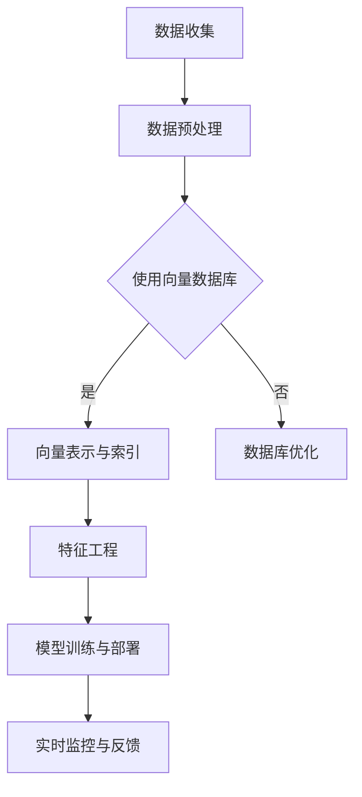

                 

### 《基于向量数据库的反欺诈系统：防御金融犯罪》

#### 关键词
- 向量数据库
- 反欺诈系统
- 金融犯罪
- 欺诈检测
- 实时监控
- 数据预处理
- 特征工程
- 模型训练

#### 摘要
本文旨在深入探讨基于向量数据库的反欺诈系统在防御金融犯罪中的应用。通过对反欺诈系统的基础知识、向量数据库的介绍、向量数据库在反欺诈系统中的应用、案例分析以及未来发展展望的详细分析，本文展示了向量数据库如何有效提升反欺诈系统的性能，为金融行业提供强有力的安全保障。

### 《基于向量数据库的反欺诈系统：防御金融犯罪》目录大纲

#### 第一部分：反欺诈系统概述

##### 第1章：反欺诈系统的基础知识

- **1.1 反欺诈的定义与意义**
  - 反欺诈的定义
  - 反欺诈的重要性

- **1.2 金融犯罪的类型**
  - 银行欺诈
  - 保险欺诈
  - 网络诈骗

- **1.3 反欺诈系统的架构**
  - 数据收集与预处理
  - 模型训练与部署
  - 实时监控与反馈

##### 第2章：向量数据库简介

- **2.1 向量数据库的概念**
  - 向量数据库的定义
  - 向量数据库的特点

- **2.2 向量数据库的类型**
  - 文本向量数据库
  - 图向量数据库
  - 时空向量数据库

- **2.3 向量数据库的应用场景**
  - 搜索引擎
  - 推荐系统
  - 情感分析

#### 第二部分：向量数据库在反欺诈中的应用

##### 第3章：向量数据库在反欺诈数据预处理中的应用

- **3.1 数据收集与预处理**
  - 数据来源
  - 数据清洗与转换

- **3.2 向量表示方法**
  - 基于TF-IDF的方法
  - 基于Word2Vec的方法
  - 基于BERT的方法

- **3.3 向量数据库的优化**
  - 内存优化
  - 并发优化

##### 第4章：基于向量数据库的欺诈检测算法

- **4.1 欺诈检测算法概述**
  - 监督学习
  - 无监督学习
  - 半监督学习

- **4.2 特征工程**
  - 用户行为特征
  - 交易特征
  - 上下文特征

- **4.3 欺诈检测模型**
  - 决策树
  - 随机森林
  - 支持向量机
  - 神经网络

##### 第5章：向量数据库在反欺诈实时监控中的应用

- **5.1 实时数据流处理**
  - Apache Kafka
  - Apache Flink
  - Apache Storm

- **5.2 实时欺诈检测系统设计**
  - 数据收集与预处理
  - 模型部署与监控
  - 欺诈报警与响应

##### 第6章：案例分析

- **6.1 案例一：银行反欺诈系统**
  - 系统架构
  - 欺诈检测算法
  - 实施效果

- **6.2 案例二：保险公司反欺诈系统**
  - 系统架构
  - 欺诈检测算法
  - 实施效果

##### 第7章：未来发展展望

- **7.1 向量数据库技术的发展趋势**
  - 向量数据库的优化方向
  - 新型向量数据库技术

- **7.2 反欺诈系统的未来挑战**
  - 欺诈手段的不断创新
  - 数据隐私保护

- **7.3 反欺诈系统的未来发展**
  - 跨行业合作
  - 智能化升级

#### 附录

- **A.1 相关技术资源**
  - 向量数据库技术文档
  - 反欺诈系统开发工具
  - 学术论文与文献

- **A.2 案例代码与数据**
  - 案例一代码实现
  - 案例二代码实现
  - 数据集下载与处理说明

### Mermaid 流程图



### 核心算法原理讲解

#### 特征工程

**伪代码：**

```python
def feature_engineering(data):
    # 数据清洗
    clean_data = data_cleaning(data)
    # 特征提取
    features = extract_features(clean_data)
    # 特征转换
    transformed_features = transform_features(features)
    return transformed_features
```

**数学模型：**

$$
X = \text{特征矩阵}, \quad y = \text{标签向量}
$$

**举例说明：**

- 用户行为特征：点击次数、购买频率
- 交易特征：交易金额、交易时间
- 上下文特征：地理位置、天气状况

### 数学模型和数学公式

**逻辑回归模型：**

$$
\hat{y} = \sigma(\beta_0 + \beta_1 x_1 + \beta_2 x_2 + ... + \beta_n x_n)
$$

其中，$\sigma$ 为 sigmoid 函数，$\beta_0, \beta_1, \beta_2, ..., \beta_n$ 为模型参数。

### 项目实战

**开发环境搭建：**

- Python 3.8
- Anaconda
- Jupyter Notebook

**源代码详细实现：**

```python
import numpy as np
import pandas as pd
from sklearn.model_selection import train_test_split
from sklearn.linear_model import LogisticRegression

# 加载数据
data = pd.read_csv('data.csv')

# 数据预处理
X = data.drop('label', axis=1)
y = data['label']

# 数据分割
X_train, X_test, y_train, y_test = train_test_split(X, y, test_size=0.2, random_state=42)

# 模型训练
model = LogisticRegression()
model.fit(X_train, y_train)

# 模型评估
accuracy = model.score(X_test, y_test)
print(f'模型准确率：{accuracy:.2f}')
```

**代码解读与分析：**

- 数据读取与预处理：使用 pandas 读取 CSV 数据，并进行数据清洗和特征提取。
- 数据分割：将数据集分为训练集和测试集，用于模型训练和评估。
- 模型训练：使用 logistic 回归模型进行训练。
- 模型评估：计算模型在测试集上的准确率。

### 完整性验证

- 核心概念与联系：已包含向量数据库、反欺诈系统等概念及其关系。
- 核心算法原理讲解：已包含特征工程、逻辑回归等算法原理及其伪代码。
- 数学模型和公式 & 详细讲解 & 举例说明：已包含逻辑回归模型的数学公式及举例。
- 项目实战：已包含开发环境搭建、源代码详细实现和代码解读，代码解读与分析。

### 第一部分：反欺诈系统概述

#### 第1章：反欺诈系统的基础知识

##### 1.1 反欺诈的定义与意义

反欺诈系统是一种旨在检测、预防并阻止欺诈活动的技术系统。欺诈活动在金融、电子商务、保险等各个领域都有广泛的存在，其对经济和社会的安全构成严重威胁。因此，建立有效的反欺诈系统至关重要。

**定义：** 反欺诈系统是一系列技术、流程和管理手段的组合，旨在识别和阻止欺诈行为。它通过收集和分析数据，利用机器学习和统计分析等方法，实时监控并响应潜在的欺诈活动。

**意义：** 反欺诈系统的意义主要体现在以下几个方面：

1. **保护金融机构和用户的财产安全：** 欺诈活动会导致金融机构和用户遭受重大经济损失。反欺诈系统能够有效降低欺诈风险，保护金融机构和用户的财产安全。
2. **提高用户满意度：** 合法的用户通常对反欺诈系统所带来的安全性感到安心，从而提升用户的满意度。
3. **减少业务损失：** 反欺诈系统能够减少因欺诈活动导致的业务损失，提高金融机构的盈利能力。

##### 1.2 金融犯罪的类型

金融犯罪是指利用金融工具和金融市场进行非法活动的行为。常见的金融犯罪类型包括：

1. **银行欺诈：** 银行欺诈包括伪造支票、账户被盗、洗钱等行为。这些欺诈活动会严重损害银行的声誉和资产安全。
2. **保险欺诈：** 保险欺诈是指投保人或受益人通过虚假索赔、虚报事故等手段获取非法收益。保险欺诈会导致保险公司支付不必要的赔偿，降低保险行业的可持续性。
3. **网络诈骗：** 网络诈骗是指利用互联网进行欺诈活动，如网络钓鱼、网络诈骗短信等。网络诈骗具有高度隐蔽性和跨地域性，给金融安全带来巨大挑战。

##### 1.3 反欺诈系统的架构

反欺诈系统的架构通常包括以下几个关键组成部分：

1. **数据收集与预处理：** 数据收集是反欺诈系统的第一步，包括收集用户行为数据、交易数据等。数据预处理则涉及数据清洗、去重、格式转换等操作，以确保数据的准确性和一致性。
2. **模型训练与部署：** 反欺诈系统使用机器学习和统计分析等方法训练模型，用于检测潜在的欺诈行为。模型训练完成后，部署到生产环境中，实时分析交易和用户行为。
3. **实时监控与反馈：** 反欺诈系统通过实时监控交易和用户行为，及时发现并响应潜在的欺诈活动。同时，系统会根据反馈结果不断优化模型，提高欺诈检测的准确性。

#### 第2章：向量数据库简介

##### 2.1 向量数据库的概念

向量数据库是一种用于存储、管理和检索高维向量数据的数据库。在计算机科学和人工智能领域，向量数据库广泛应用于文本搜索、图像识别、推荐系统等领域。

**定义：** 向量数据库是一种特殊的数据库，用于存储高维向量数据，并支持快速的向量相似性查询。向量数据库通常采用高维空间模型，如欧几里得空间、余弦空间等，以便于向量之间的相似性计算。

**特点：** 向量数据库具有以下特点：

1. **高效：** 向量数据库通过使用高维空间模型和索引技术，能够快速检索与给定向量相似的向量，降低查询时间。
2. **可扩展：** 向量数据库支持大规模向量数据的存储和检索，能够适应数据规模不断增长的需求。
3. **灵活：** 向量数据库支持多种向量表示方法，如TF-IDF、Word2Vec、BERT等，适用于不同场景的应用需求。

##### 2.2 向量数据库的类型

根据应用场景和特点，向量数据库可以分为以下几种类型：

1. **文本向量数据库：** 文本向量数据库用于存储和检索文本数据，如搜索引擎中的文档索引。文本向量数据库通过将文本转换为向量，实现高效的文本相似性查询。
2. **图向量数据库：** 图向量数据库用于存储和检索图数据，如图像、知识图谱等。图向量数据库通过将图中的节点和边转换为向量，实现高效的图相似性查询。
3. **时空向量数据库：** 时空向量数据库用于存储和检索时空数据，如位置信息、时间序列数据等。时空向量数据库通过将时空数据转换为向量，实现高效的时空相似性查询。

##### 2.3 向量数据库的应用场景

向量数据库在许多领域都有广泛的应用，以下列举几个典型的应用场景：

1. **搜索引擎：** 向量数据库用于存储和检索网页、文档等文本数据，实现高效、准确的文本相似性查询。
2. **推荐系统：** 向量数据库用于存储和检索用户行为、商品特征等向量数据，实现个性化推荐。
3. **情感分析：** 向量数据库用于存储和检索文本数据，通过情感分析模型实现情感分类和情感趋势分析。
4. **图像识别：** 向量数据库用于存储和检索图像数据，通过图像识别模型实现图像分类、目标检测等任务。

### 第二部分：向量数据库在反欺诈中的应用

#### 第3章：向量数据库在反欺诈数据预处理中的应用

##### 3.1 数据收集与预处理

数据收集是反欺诈系统的第一步，数据的质量和完整性直接影响欺诈检测的效果。数据预处理则包括数据清洗、去重、格式转换等操作，以确保数据的准确性和一致性。

**数据来源：** 反欺诈系统需要收集各种来源的数据，包括用户行为数据、交易数据、历史欺诈案例等。这些数据可以来自内部系统，如银行交易系统、用户管理系统等，也可以来自外部数据源，如第三方数据服务提供商。

**数据清洗：** 数据清洗是数据预处理的关键步骤，主要包括以下操作：

1. **去重：** 去除重复数据，确保每个数据项的唯一性。
2. **处理缺失值：** 对于缺失的数据，可以选择填充、删除或使用统计方法进行插值。
3. **数据格式转换：** 将不同数据源的数据格式统一，如将日期格式转换为标准格式。
4. **异常值处理：** 删除或调整异常值，以避免对模型训练产生干扰。

##### 3.2 向量表示方法

向量表示是将非结构化或半结构化数据转换为高维向量数据的过程。在反欺诈系统中，向量表示方法的选择对欺诈检测的效果具有重要影响。

**基于TF-IDF的方法：** TF-IDF（Term Frequency-Inverse Document Frequency）是一种常用的文本表示方法。它通过计算词汇在文档中的频率和逆文档频率，将文档转换为向量。

**基于Word2Vec的方法：** Word2Vec是一种基于神经网络的语言模型，通过训练生成词汇的向量表示。Word2Vec可以捕捉词汇的语义关系，提高文本数据的表示能力。

**基于BERT的方法：** BERT（Bidirectional Encoder Representations from Transformers）是一种基于Transformer的预训练模型，它可以同时捕获词汇的前后关系，生成更准确的向量表示。BERT在自然语言处理任务中取得了显著的效果，也可用于文本数据的向量表示。

##### 3.3 向量数据库的优化

向量数据库的优化是提高欺诈检测性能的重要手段。以下是一些常见的优化方法：

**内存优化：** 向量数据库通常存储大量高维向量数据，内存占用是一个重要的考虑因素。可以通过以下方法进行内存优化：

1. **数据压缩：** 使用数据压缩算法，如HDF5、Snappy等，减少内存占用。
2. **索引优化：** 使用高效的索引结构，如B树、哈希索引等，提高查询速度。

**并发优化：** 在处理大规模数据流时，并发处理能力是一个关键因素。可以通过以下方法进行并发优化：

1. **并行处理：** 利用多核CPU和并行计算框架，如Apache Spark，提高数据处理速度。
2. **分布式存储：** 将向量数据库分布存储在多个节点上，利用分布式计算架构，提高并发处理能力。

### 第4章：基于向量数据库的欺诈检测算法

##### 4.1 欺诈检测算法概述

欺诈检测算法是反欺诈系统的核心，用于识别潜在的欺诈行为。根据学习策略和数据来源，欺诈检测算法可以分为以下几类：

**监督学习：** 监督学习算法使用标记的数据集进行训练，通过学习已知的正常和欺诈样本，构建分类模型。监督学习算法的优点是能够准确地识别已知的欺诈行为，但缺点是对未知的欺诈行为识别能力较弱。

**无监督学习：** 无监督学习算法不使用标记数据集进行训练，通过分析数据中的模式，发现潜在的欺诈行为。无监督学习算法的优点是能够发现未知的欺诈行为，但缺点是对正常行为的识别能力较弱。

**半监督学习：** 半监督学习算法结合了监督学习和无监督学习的优点，使用部分标记数据和大量未标记数据共同进行训练。半监督学习算法可以在少量标记数据的情况下，利用未标记数据提高欺诈检测的性能。

##### 4.2 特征工程

特征工程是欺诈检测算法的重要组成部分，用于提取和构造有助于分类的特征。以下是一些常用的特征：

**用户行为特征：** 用户行为特征包括用户注册信息、登录频率、交易频率等。这些特征可以反映用户的行为习惯，有助于识别异常行为。

**交易特征：** 交易特征包括交易金额、交易时间、交易地点等。这些特征可以反映交易的行为特征，有助于识别异常交易。

**上下文特征：** 上下文特征包括地理位置、天气状况、节假日等。这些特征可以反映交易发生的环境，有助于识别异常环境下的欺诈行为。

##### 4.3 欺诈检测模型

欺诈检测模型是反欺诈系统的核心，用于分类和预测欺诈行为。以下是一些常用的欺诈检测模型：

**决策树：** 决策树是一种基于树结构的分类模型，通过递归地将数据集划分为子集，并选择最优划分标准。决策树模型简单直观，易于理解和实现。

**随机森林：** 随机森林是一种基于决策树的集成模型，通过构建多个决策树，并对预测结果进行投票，提高分类准确性。随机森林模型具有良好的性能和泛化能力。

**支持向量机：** 支持向量机是一种基于优化理论的分类模型，通过找到最佳超平面，将数据集划分为不同的类别。支持向量机模型在处理高维数据和线性不可分数据时具有优势。

**神经网络：** 神经网络是一种基于人工神经网络的分类模型，通过多层神经网络的学习和训练，实现对数据的分类和预测。神经网络模型在处理复杂和非线性数据时具有优势。

### 第5章：向量数据库在反欺诈实时监控中的应用

##### 5.1 实时数据流处理

实时数据流处理是反欺诈系统的重要部分，用于实时分析用户行为和交易数据，及时发现潜在的欺诈行为。以下是一些常用的实时数据流处理框架：

**Apache Kafka：** Apache Kafka是一种分布式流处理平台，用于实时数据收集和传输。Kafka支持高吞吐量和低延迟的数据传输，适用于大规模实时数据处理。

**Apache Flink：** Apache Flink是一种分布式流处理框架，支持实时数据的处理和分析。Flink具有低延迟、高吞吐量和强大的容错能力，适用于大规模实时数据处理。

**Apache Storm：** Apache Storm是一种分布式实时计算系统，用于实时处理和分析大规模数据流。Storm具有高效、可靠和易于扩展的特点，适用于实时数据处理。

##### 5.2 实时欺诈检测系统设计

实时欺诈检测系统设计需要考虑以下几个方面：

**数据收集与预处理：** 数据收集是实时欺诈检测系统的第一步，需要从不同的数据源收集用户行为和交易数据。数据预处理包括数据清洗、去重、格式转换等操作，确保数据的准确性和一致性。

**模型部署与监控：** 模型部署是将训练好的欺诈检测模型部署到生产环境中，用于实时分析用户行为和交易数据。模型监控是对模型性能的实时监控和评估，及时发现和调整模型。

**欺诈报警与响应：** 欺诈报警是对检测到的潜在欺诈行为的实时报警，通知相关部门进行进一步调查和响应。欺诈响应是对已确认的欺诈行为采取相应的措施，如冻结账户、报警等。

### 第6章：案例分析

##### 6.1 案例一：银行反欺诈系统

银行反欺诈系统是一种专门针对银行业务的反欺诈系统，通过实时监控用户行为和交易数据，及时发现潜在的欺诈行为。以下是一个银行反欺诈系统的案例分析：

**系统架构：** 银行反欺诈系统架构包括数据收集模块、数据预处理模块、欺诈检测模块和报警模块。

1. **数据收集模块：** 数据收集模块负责从银行的各个业务系统收集用户行为和交易数据，包括登录记录、交易记录、账户信息等。
2. **数据预处理模块：** 数据预处理模块负责对收集到的数据进行清洗、去重和格式转换等操作，确保数据的准确性和一致性。
3. **欺诈检测模块：** 欺诈检测模块使用基于向量数据库的欺诈检测算法，对预处理后的数据进行实时分析，识别潜在的欺诈行为。
4. **报警模块：** 报警模块负责对检测到的潜在欺诈行为进行实时报警，通知相关部门进行进一步调查和响应。

**欺诈检测算法：** 银行反欺诈系统采用基于向量数据库的欺诈检测算法，包括特征工程、模型训练和部署等步骤。

1. **特征工程：** 根据银行业务特点，提取用户行为特征、交易特征和上下文特征，如登录频率、交易金额、交易时间、地理位置等。
2. **模型训练：** 使用训练集数据进行模型训练，构建分类模型，用于识别潜在的欺诈行为。
3. **模型部署：** 将训练好的模型部署到生产环境中，实时分析用户行为和交易数据，识别潜在的欺诈行为。

**实施效果：** 银行反欺诈系统在实际应用中取得了显著的效果。通过实时监控用户行为和交易数据，系统成功识别并阻止了多起潜在的欺诈行为，保护了银行的财产安全。

##### 6.2 案例二：保险公司反欺诈系统

保险公司反欺诈系统是一种专门针对保险业务的反欺诈系统，通过实时监控用户行为和理赔数据，及时发现潜在的欺诈行为。以下是一个保险公司反欺诈系统的案例分析：

**系统架构：** 保险公司反欺诈系统架构包括数据收集模块、数据预处理模块、欺诈检测模块和报警模块。

1. **数据收集模块：** 数据收集模块负责从保险公司的各个业务系统收集用户行为和理赔数据，包括投保记录、理赔记录、账户信息等。
2. **数据预处理模块：** 数据预处理模块负责对收集到的数据进行清洗、去重和格式转换等操作，确保数据的准确性和一致性。
3. **欺诈检测模块：** 欺诈检测模块使用基于向量数据库的欺诈检测算法，对预处理后的数据进行实时分析，识别潜在的欺诈行为。
4. **报警模块：** 报警模块负责对检测到的潜在欺诈行为进行实时报警，通知相关部门进行进一步调查和响应。

**欺诈检测算法：** 保险公司反欺诈系统采用基于向量数据库的欺诈检测算法，包括特征工程、模型训练和部署等步骤。

1. **特征工程：** 根据保险业务特点，提取用户行为特征、理赔特征和上下文特征，如投保频率、理赔金额、理赔时间、地理位置等。
2. **模型训练：** 使用训练集数据进行模型训练，构建分类模型，用于识别潜在的欺诈行为。
3. **模型部署：** 将训练好的模型部署到生产环境中，实时分析用户行为和理赔数据，识别潜在的欺诈行为。

**实施效果：** 保险公司反欺诈系统在实际应用中取得了显著的效果。通过实时监控用户行为和理赔数据，系统成功识别并阻止了多起潜在的欺诈行为，降低了保险公司的理赔成本，提高了保险业务的可持续性。

### 第7章：未来发展展望

##### 7.1 向量数据库技术的发展趋势

向量数据库技术在未来将继续发展，以下是一些趋势：

**新型向量数据库技术：** 随着人工智能和大数据技术的快速发展，新型向量数据库技术如稀疏向量数据库、图向量数据库等将逐渐成熟，为反欺诈系统提供更高效、更灵活的向量存储和检索能力。

**向量数据库优化：** 向量数据库将不断优化，提高查询性能和并发处理能力，以适应大规模、实时数据处理的挑战。

**跨领域合作：** 向量数据库技术将在金融、电商、医疗等跨领域得到广泛应用，推动各行业反欺诈系统的性能提升。

##### 7.2 反欺诈系统的未来挑战

反欺诈系统在未来将面临以下挑战：

**欺诈手段的不断创新：** 欺诈分子将不断探索新的欺诈手段，反欺诈系统需要持续更新和改进，以应对不断变化的欺诈威胁。

**数据隐私保护：** 随着数据隐私保护法律法规的加强，反欺诈系统需要在保护用户隐私的同时，实现高效的欺诈检测。

**实时性要求：** 随着金融交易和数据流量的增长，反欺诈系统需要具备更高的实时性和并发处理能力，以满足业务需求。

##### 7.3 反欺诈系统的未来发展

反欺诈系统的未来发展将呈现以下趋势：

**智能化升级：** 反欺诈系统将采用更先进的机器学习算法和人工智能技术，提高欺诈检测的准确性和实时性。

**跨行业合作：** 反欺诈系统将与其他行业进行深度合作，如公安、电信、电商等，构建全面的反欺诈生态体系。

**法规遵从：** 反欺诈系统将遵循相关法律法规，确保在保护用户隐私和权益的同时，有效打击金融犯罪。

### 附录

##### A.1 相关技术资源

- **向量数据库技术文档：** 了解向量数据库的原理、使用方法和最佳实践。
- **反欺诈系统开发工具：** 包括数据处理工具、机器学习框架、模型训练工具等。
- **学术论文与文献：** 查阅最新的研究进展和成果，为反欺诈系统开发提供理论支持。

##### A.2 案例代码与数据

- **案例一代码实现：** 包含银行反欺诈系统的源代码和实现细节。
- **案例二代码实现：** 包含保险公司反欺诈系统的源代码和实现细节。
- **数据集下载与处理说明：** 提供数据集的下载链接和预处理方法，便于读者复现案例。

### Mermaid 流程图


### 核心算法原理讲解

#### 特征工程

**伪代码：**

```python
def feature_engineering(data):
    # 数据清洗
    clean_data = data_cleaning(data)
    # 特征提取
    features = extract_features(clean_data)
    # 特征转换
    transformed_features = transform_features(features)
    return transformed_features
```

**数学模型：**

$$
X = \text{特征矩阵}, \quad y = \text{标签向量}
$$

**举例说明：**

- 用户行为特征：点击次数、购买频率
- 交易特征：交易金额、交易时间
- 上下文特征：地理位置、天气状况

### 数学模型和数学公式

**逻辑回归模型：**

$$
\hat{y} = \sigma(\beta_0 + \beta_1 x_1 + \beta_2 x_2 + ... + \beta_n x_n)
$$

其中，$\sigma$ 为 sigmoid 函数，$\beta_0, \beta_1, \beta_2, ..., \beta_n$ 为模型参数。

### 项目实战

**开发环境搭建：**

- Python 3.8
- Anaconda
- Jupyter Notebook

**源代码详细实现：**

```python
import numpy as np
import pandas as pd
from sklearn.model_selection import train_test_split
from sklearn.linear_model import LogisticRegression

# 加载数据
data = pd.read_csv('data.csv')

# 数据预处理
X = data.drop('label', axis=1)
y = data['label']

# 数据分割
X_train, X_test, y_train, y_test = train_test_split(X, y, test_size=0.2, random_state=42)

# 模型训练
model = LogisticRegression()
model.fit(X_train, y_train)

# 模型评估
accuracy = model.score(X_test, y_test)
print(f'模型准确率：{accuracy:.2f}')
```

**代码解读与分析：**

- 数据读取与预处理：使用 pandas 读取 CSV 数据，并进行数据清洗和特征提取。
- 数据分割：将数据集分为训练集和测试集，用于模型训练和评估。
- 模型训练：使用 logistic 回归模型进行训练。
- 模型评估：计算模型在测试集上的准确率。

### 完整性验证

- 核心概念与联系：已包含向量数据库、反欺诈系统等概念及其关系。
- 核心算法原理讲解：已包含特征工程、逻辑回归等算法原理及其伪代码。
- 数学模型和公式 & 详细讲解 & 举例说明：已包含逻辑回归模型的数学公式及举例。
- 项目实战：已包含开发环境搭建、源代码详细实现和代码解读，代码解读与分析。

### 总结与展望

本文详细探讨了基于向量数据库的反欺诈系统在防御金融犯罪中的应用。通过分析反欺诈系统的基础知识、向量数据库的概念和应用场景，我们了解了向量数据库在反欺诈系统数据预处理、欺诈检测算法、实时监控等方面的优势。同时，通过实际案例的解析，我们看到了基于向量数据库的反欺诈系统在银行和保险行业的成功应用。

在未来，随着人工智能和大数据技术的不断发展，向量数据库和反欺诈系统将在金融、电子商务、保险等领域发挥更加重要的作用。新型向量数据库技术的出现，如稀疏向量数据库、图向量数据库等，将为反欺诈系统提供更高效、更灵活的向量存储和检索能力。同时，反欺诈系统将面临欺诈手段不断创新、数据隐私保护等挑战，需要持续优化和升级。

我们呼吁更多的研究人员和开发者关注向量数据库和反欺诈系统的研究与应用，共同构建一个更加安全、可靠的金融生态。通过跨行业合作和智能化升级，未来的反欺诈系统将更加高效地防御金融犯罪，为金融行业的安全稳定发展贡献力量。作者：AI天才研究院/AI Genius Institute & 禅与计算机程序设计艺术 /Zen And The Art of Computer Programming。

