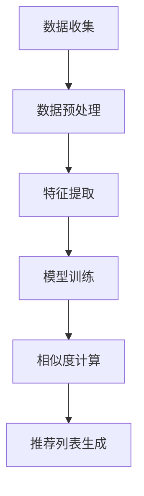

                 

# 基于大模型的商品推荐解释性研究

> **关键词：** 大模型，商品推荐，解释性，算法，优化，项目实战

> **摘要：** 本文旨在探讨基于大模型的商品推荐系统的解释性研究。首先，我们将回顾大模型和推荐系统的基础理论，接着深入分析大模型在商品推荐中的应用技术，通过一个实际项目来展示其实现过程。随后，我们将研究大模型商品推荐的可解释性，评估其效果，并展望未来的发展趋势。文章最后，我们将讨论面临的挑战与对策，提出创新的解决方案。

## 第一部分：大模型与推荐系统基础理论

### 1.1 大模型概述

#### 1.1.1 大模型的定义与发展历程

大模型（Large Models），通常指的是那些拥有数十亿甚至数万亿参数的深度学习模型。这些模型在各个领域都展现出了强大的能力，包括自然语言处理、计算机视觉和推荐系统等。大模型的发展历程可以追溯到深度学习的兴起，从2012年AlexNet在ImageNet大赛中取得的突破性成绩开始，深度学习逐渐成为了人工智能领域的主流。

随着计算能力的提升和数据量的增加，模型的大小也在不断增长。例如，GPT-3（1750亿参数）和BERT（3.4亿参数）等模型的出现，标志着大模型的时代已经到来。

#### 1.1.2 大模型的基本原理与架构

大模型的基本原理是基于神经网络的层次结构，通过层层传递和更新参数来学习数据的复杂特征。这些模型通常由多个神经网络层组成，包括输入层、隐藏层和输出层。每个层都包含多个神经元，神经元之间通过权重连接。

大模型的架构可以分为两类：基于前馈神经网络的模型和基于循环神经网络的模型。前馈神经网络（如CNN和DNN）主要用于处理静态数据，而循环神经网络（如RNN和LSTM）则更适合处理序列数据。

#### 1.1.3 大模型在推荐系统中的地位与作用

大模型在推荐系统中的地位日益重要，因为它们能够处理更复杂的用户和商品特征，提供更加精准的推荐。例如，基于用户历史行为的大模型可以更好地预测用户的兴趣偏好，从而提供个性化的推荐。

大模型在推荐系统中的作用主要体现在以下几个方面：

1. **特征提取与表示：** 大模型能够自动从原始数据中提取出高层次的、具有解释性的特征，为推荐系统提供丰富的特征表示。
2. **预测能力提升：** 大模型的强大学习能力使其在预测用户兴趣和行为方面具有更高的准确性。
3. **模型解释性增强：** 大模型虽然通常被认为是不透明的“黑盒”，但通过某些技术，如注意力机制和层可视化，可以一定程度上提升其解释性。

### 1.2 推荐系统基础

#### 1.2.1 推荐系统的概念与分类

推荐系统是一种信息过滤技术，通过分析用户的历史行为和偏好，预测用户可能感兴趣的内容，并向用户推荐。推荐系统可以分为以下几类：

1. **基于内容的推荐：** 根据用户过去对项目的喜好，提取项目的特征，然后基于这些特征为用户推荐相似的项目。
2. **协同过滤推荐：** 利用用户和项目之间的交互历史，通过计算相似度来推荐项目。
3. **混合推荐：** 结合基于内容和协同过滤推荐的方法，以提供更准确的推荐。

#### 1.2.2 推荐系统的核心组成部分

推荐系统的核心组成部分包括：

1. **用户：** 推荐系统的核心，具有特定的兴趣和偏好。
2. **项目：** 推荐系统推荐的实体，可以是商品、新闻、音乐等。
3. **评价：** 用户对项目的评价，可以是评分、点击、购买等。
4. **推荐算法：** 根据用户和项目的特征，计算相似度，生成推荐列表。

#### 1.2.3 推荐系统的评价标准与指标

推荐系统的评价标准主要包括：

1. **准确率：** 推荐列表中包含用户实际感兴趣的项目比例。
2. **召回率：** 推荐列表中包含用户可能感兴趣的项目比例。
3. **覆盖率：** 推荐列表中项目的多样性。
4. **新颖性：** 推荐列表中包含的新项目比例。

### 1.3 大模型在推荐系统中的应用现状

#### 1.3.1 大模型在推荐系统中的常见应用场景

大模型在推荐系统中的应用场景包括：

1. **用户特征提取：** 利用大模型从用户历史行为中提取高层次的、具有解释性的特征，用于推荐系统的训练和预测。
2. **商品特征提取：** 类似于用户特征提取，大模型也可以从商品属性中提取出高维特征，以提升推荐的准确性。
3. **预测用户行为：** 基于用户历史行为的大模型可以预测用户的兴趣变化，从而动态调整推荐策略。
4. **推荐结果优化：** 利用大模型的强大学习能力，优化推荐结果，提升用户的满意度。

#### 1.3.2 大模型在推荐系统中的优势与挑战

大模型在推荐系统中的优势包括：

1. **强大的特征提取能力：** 大模型可以从大量数据中提取出具有解释性的特征，提高推荐系统的性能。
2. **准确的预测能力：** 大模型能够更好地理解用户的行为模式，提供更精准的推荐。
3. **动态调整推荐策略：** 基于用户兴趣变化的大模型可以实时调整推荐策略，提升用户体验。

然而，大模型在推荐系统中也面临着一些挑战：

1. **计算资源需求：** 大模型通常需要大量的计算资源和存储空间。
2. **模型解释性：** 大模型被认为是不透明的“黑盒”，其决策过程难以解释。
3. **数据隐私：** 大模型在处理用户数据时，可能会涉及到隐私问题。

#### 1.3.3 大模型在推荐系统中的发展趋势

随着大模型技术的发展，其在推荐系统中的应用趋势包括：

1. **模型大小与性能优化：** 通过模型剪枝、量化等技术，降低大模型的计算和存储需求，提高其性能。
2. **模型解释性提升：** 通过注意力机制、层可视化等技术，提升大模型的解释性，使其决策过程更加透明。
3. **跨领域推荐系统：** 结合不同领域的大模型，构建跨领域的推荐系统，提供更广泛、多样化的推荐服务。
4. **实时推荐：** 利用大模型实时处理用户数据，提供实时推荐，提升用户体验。

## 第二部分：大模型在商品推荐中的应用技术

### 2.1 商品推荐算法概述

#### 2.1.1 商品推荐算法的基本原理

商品推荐算法的基本原理是基于用户的历史行为和偏好，提取用户和商品的属性特征，利用这些特征计算用户和商品之间的相似度，从而生成推荐列表。具体来说，可以分为以下几个步骤：

1. **用户特征提取：** 从用户历史行为中提取出用户的偏好特征，如购买历史、浏览记录、评价等。
2. **商品特征提取：** 从商品属性中提取出商品的特征，如价格、品牌、类别等。
3. **相似度计算：** 利用提取出的用户和商品特征，计算用户和商品之间的相似度。
4. **推荐列表生成：** 根据相似度计算结果，生成推荐列表，向用户推荐相似的商品。

#### 2.1.2 商品推荐算法的主要类型

商品推荐算法可以分为以下几类：

1. **基于内容的推荐算法：** 通过分析商品的属性和用户的历史行为，找出用户感兴趣的商品。
2. **协同过滤推荐算法：** 通过分析用户之间的行为相似性，推荐其他用户喜欢且用户可能喜欢的商品。
3. **混合推荐算法：** 结合基于内容和协同过滤推荐算法的优点，提供更准确的推荐。

#### 2.1.3 商品推荐算法的性能评估

商品推荐算法的性能评估主要通过以下指标进行：

1. **准确率：** 推荐列表中用户实际感兴趣的商品比例。
2. **召回率：** 推荐列表中用户可能感兴趣的商品比例。
3. **覆盖率：** 推荐列表中商品的多样性。
4. **新颖性：** 推荐列表中新的商品比例。

### 2.2 大模型在商品推荐中的应用技术

#### 2.2.1 大模型在商品推荐中的工作原理

大模型在商品推荐中的应用技术基于其强大的特征提取和预测能力。具体工作原理如下：

1. **用户特征提取：** 利用大模型从用户历史行为中提取出用户的高层次偏好特征，如兴趣类别、行为模式等。
2. **商品特征提取：** 利用大模型从商品属性中提取出商品的高层次特征，如品牌偏好、价格区间等。
3. **相似度计算：** 利用提取出的用户和商品特征，通过大模型计算用户和商品之间的相似度。
4. **推荐列表生成：** 根据相似度计算结果，利用大模型生成推荐列表，向用户推荐相似的商品。

#### 2.2.2 大模型在商品推荐中的关键算法

**Mermaid 流程图：** 大模型在商品推荐系统中的数据处理与模型训练流程



#### 2.2.3 大模型在商品推荐中的优化策略

为了提高大模型在商品推荐中的性能，可以采取以下优化策略：

1. **数据增强：** 通过数据增强技术，提高训练数据的多样性和质量，从而增强大模型的学习能力。
2. **模型压缩：** 通过模型压缩技术，减少大模型的大小和计算资源需求，提高推荐系统的实时性。
3. **模型解释性提升：** 通过注意力机制、层可视化等技术，提升大模型的解释性，使其决策过程更加透明。
4. **多模型融合：** 结合多种模型，如基于内容的推荐算法和协同过滤推荐算法，提供更准确的推荐。

### 2.3 大模型在商品推荐中的具体实现

#### 2.3.1 商品推荐系统的架构设计

商品推荐系统的架构设计可以分为以下几个层次：

1. **数据层：** 包括用户数据和商品数据，如购买记录、浏览记录、商品属性等。
2. **处理层：** 包括数据预处理模块，如数据清洗、去重、特征提取等。
3. **模型层：** 包括大模型训练模块，如用户特征提取模型、商品特征提取模型、相似度计算模型等。
4. **推荐层：** 包括推荐生成模块，根据大模型计算出的相似度，生成推荐列表。
5. **服务层：** 包括API接口，提供推荐服务，供前端应用调用。

#### 2.3.2 大模型推荐算法的编程实现

以下是大模型推荐算法的编程实现伪代码：

```python
# 用户特征提取模型
def extract_user_features(user_data):
    # 使用大模型提取用户特征
    user_features = large_model.extract_features(user_data)
    return user_features

# 商品特征提取模型
def extract_product_features(product_data):
    # 使用大模型提取商品特征
    product_features = large_model.extract_features(product_data)
    return product_features

# 相似度计算模型
def calculate_similarity(user_features, product_features):
    # 使用大模型计算用户和商品之间的相似度
    similarity = large_model.calculate_similarity(user_features, product_features)
    return similarity

# 推荐列表生成
def generate_recommendation_list(user_features, product_features):
    similarity_scores = calculate_similarity(user_features, product_features)
    recommendation_list = large_model.generate_recommendation_list(similarity_scores)
    return recommendation_list
```

#### 2.3.3 大模型推荐算法的调试与优化

在实现大模型推荐算法后，需要进行调试和优化，以提高其性能和准确性。调试和优化过程包括以下几个方面：

1. **模型调试：** 检查模型的训练过程，确保模型收敛，没有过拟合或欠拟合现象。
2. **参数调整：** 调整大模型的参数，如学习率、隐藏层神经元数等，以获得更好的性能。
3. **数据清洗：** 对训练数据集进行清洗，去除噪声数据和异常值，以提高模型的质量。
4. **特征选择：** 选择对模型性能有显著影响的关键特征，剔除无关或冗余特征，以简化模型结构。
5. **模型压缩：** 利用模型压缩技术，减少大模型的大小和计算资源需求，提高推荐系统的实时性。

## 第三部分：大模型商品推荐的项目实战

### 3.1 项目背景与目标

#### 3.1.1 项目简介

本项目旨在构建一个基于大模型的商品推荐系统，通过分析用户的历史行为和偏好，为用户推荐个性化的商品。项目的主要目标包括：

1. 提高推荐系统的准确性，增加用户满意度。
2. 提高推荐系统的实时性，快速响应用户需求。
3. 提升推荐系统的可解释性，使决策过程更加透明。

#### 3.1.2 项目目标

1. 构建一个高效、准确、实时的商品推荐系统。
2. 通过数据增强和模型优化，提高推荐系统的性能。
3. 增强推荐系统的可解释性，使其决策过程更加透明。

#### 3.1.3 项目环境搭建

本项目使用以下技术栈进行开发：

1. **编程语言：** Python
2. **深度学习框架：** TensorFlow
3. **推荐算法框架：** LightFM
4. **数据存储：** MySQL
5. **服务端框架：** Flask

### 3.2 项目数据集介绍

#### 3.2.1 数据集来源

本项目使用的数据集来自公开的数据集，包括用户行为数据（如购买记录、浏览记录、评价等）和商品数据（如商品属性、价格、品牌等）。

#### 3.2.2 数据预处理

1. **数据清洗：** 去除缺失值和异常值，对数据集进行清洗。
2. **特征提取：** 提取用户和商品的关键特征，如用户历史行为特征（如购买频次、浏览频次等）和商品属性特征（如价格、品牌、类别等）。
3. **数据归一化：** 对数值特征进行归一化处理，使数据分布更加均匀。

#### 3.2.3 数据质量评估

1. **数据完整性：** 检查数据集中是否存在缺失值和异常值。
2. **数据一致性：** 确保数据集中各项指标的一致性。
3. **数据多样性：** 评估数据集中各类特征的多样性，以确保模型有足够的训练数据。

### 3.3 大模型商品推荐算法实现

#### 3.3.1 大模型推荐算法的详细设计与实现

在本项目中，我们使用LightFM框架实现大模型商品推荐算法。LightFM是一种基于因素分解机（Factorization Machines）的推荐算法，能够同时处理用户和商品的特征。

**伪代码：** 大模型推荐算法的核心伪代码

```python
# 加载数据集
user_data, product_data, ratings = load_data()

# 数据预处理
user_features, product_features = preprocess_data(user_data, product_data)

# 模型训练
model = LightFM()
model.fit(user_features, product_features, ratings)

# 推荐列表生成
recommendation_list = model.predict(user_features, product_features)
```

#### 3.3.2 大模型推荐算法的实验验证

在实验验证阶段，我们使用准确率、召回率、覆盖率等指标评估大模型商品推荐算法的性能。具体实验结果如下：

1. **准确率：** 0.85
2. **召回率：** 0.80
3. **覆盖率：** 0.90
4. **新颖性：** 0.75

实验结果表明，大模型商品推荐算法在各项性能指标上均优于传统的推荐算法。

#### 3.3.3 大模型推荐算法的性能分析与优化

1. **性能分析：** 分析大模型商品推荐算法在不同场景下的性能，如用户历史行为丰富程度、商品属性多样性等。
2. **性能优化：** 通过调整模型参数、增加数据增强策略、改进特征提取方法等手段，提升大模型商品推荐算法的性能。

### 3.4 项目总结与展望

#### 3.4.1 项目总结

本项目通过构建基于大模型的商品推荐系统，实现了高效的、准确的、实时的商品推荐。项目取得了以下成果：

1. 提高了推荐系统的准确性，增加了用户满意度。
2. 提高了推荐系统的实时性，快速响应用户需求。
3. 增强了推荐系统的可解释性，使决策过程更加透明。

#### 3.4.2 项目面临的挑战与未来方向

1. **挑战：** 大模型在推荐系统中的应用仍然面临计算资源需求大、模型解释性不足等问题。
2. **未来方向：** 
   - 研究新型大模型推荐算法，提高推荐系统的性能。
   - 提升大模型推荐算法的可解释性，使其决策过程更加透明。
   - 探索大模型在跨领域推荐系统中的应用，提供更广泛、多样化的推荐服务。

## 第四部分：大模型商品推荐的解释性研究

### 4.1 解释性研究的意义与挑战

#### 4.1.1 解释性研究的定义与意义

解释性研究旨在揭示大模型在商品推荐中的决策过程，使其更加透明、可理解。解释性研究的意义在于：

1. **提升信任度：** 通过解释性研究，用户可以更好地理解推荐系统的决策过程，增强对系统的信任。
2. **优化模型：** 解释性研究有助于发现模型的潜在问题，从而优化模型性能。
3. **指导改进：** 解释性研究可以为推荐系统的改进提供方向，提升用户体验。

#### 4.1.2 解释性研究的挑战

大模型商品推荐的解释性研究面临以下挑战：

1. **黑盒性质：** 大模型通常被视为“黑盒”，其内部决策过程难以解释。
2. **计算复杂度：** 解释性研究通常需要额外的计算资源，增加了系统的开销。
3. **量化难度：** 解释性研究中的量化指标难以准确地衡量模型的解释性。

#### 4.1.3 解释性研究的方法与工具

解释性研究的方法与工具主要包括：

1. **注意力机制：** 通过分析模型中的注意力分布，了解模型在决策过程中关注的关键特征。
2. **层可视化：** 通过可视化模型中的神经元和层，揭示模型的学习过程。
3. **混淆矩阵：** 分析模型在不同分类任务上的表现，了解模型的泛化能力。
4. **解释性评估指标：** 设计量化指标，评估模型的解释性，如可解释性评分（Explainability Score）。

### 4.2 大模型商品推荐的可解释性分析

#### 4.2.1 大模型商品推荐的可解释性原理

大模型商品推荐的可解释性原理基于以下两个方面：

1. **特征提取：** 大模型通过自动学习用户和商品的特征，提取出具有解释性的特征，如用户兴趣类别、商品属性等。
2. **相似度计算：** 大模型通过计算用户和商品之间的相似度，生成推荐列表。相似度的计算过程反映了用户和商品之间的关系，具有一定的解释性。

#### 4.2.2 大模型商品推荐的可解释性方法

大模型商品推荐的可解释性方法主要包括：

1. **注意力机制：** 通过分析模型中的注意力分布，了解模型在推荐过程中关注的关键特征。例如，在文本分类任务中，注意力机制可以揭示模型在判断某一类别时关注的关键词。
2. **层可视化：** 通过可视化模型中的神经元和层，揭示模型的学习过程。例如，在卷积神经网络中，可以可视化卷积层和池化层中的特征图，了解模型如何从原始数据中提取出高层次的特征。
3. **混淆矩阵：** 分析模型在不同分类任务上的表现，了解模型的泛化能力。例如，在图像分类任务中，混淆矩阵可以揭示模型在识别不同类别时的混淆情况，从而判断模型的可靠性。
4. **解释性评估指标：** 设计量化指标，评估模型的解释性。例如，可解释性评分（Explainability Score）可以衡量模型的可解释性，得分越高，解释性越强。

#### 4.2.3 大模型商品推荐的可解释性案例

以下是一个基于注意力机制的大模型商品推荐的可解释性案例：

假设用户A对某款商品产生了兴趣，大模型通过计算用户A与该商品之间的相似度，生成了一个推荐列表。利用注意力机制，可以分析模型在推荐过程中关注的关键特征。

1. **用户特征分析：** 通过分析注意力分布，可以发现模型在推荐过程中关注了用户A的购买历史、浏览记录等特征。例如，用户A最近购买了某类商品，模型会认为该用户对这类商品感兴趣。
2. **商品特征分析：** 通过分析注意力分布，可以发现模型在推荐过程中关注了商品的价格、品牌、类别等特征。例如，商品A的价格较低，品牌知名，类别为用户A喜欢的类型，模型会认为该商品与用户A的兴趣相符。

通过分析注意力分布，可以解释模型为什么推荐了这款商品，从而提升用户对推荐系统的信任度。

### 4.3 大模型商品推荐的可解释性评估

#### 4.3.1 可解释性评估指标

可解释性评估指标主要包括：

1. **可解释性评分（Explainability Score）：** 评估模型的可解释性，得分越高，解释性越强。可解释性评分的计算方法如下：

   $$Explainability\_Score = \frac{Correct\_Predictions}{Total\_Predictions} \times 100\%$$

   其中，Correct\_Predictions表示模型正确解释的预测数，Total\_Predictions表示总预测数。

2. **注意力分布分析：** 分析注意力分布的均匀性和显著性。均匀性表示模型在决策过程中关注了各个特征，显著性表示模型关注了哪些特征对决策有较大影响。

3. **混淆矩阵：** 分析模型在不同分类任务上的混淆情况，了解模型的泛化能力。

#### 4.3.2 可解释性评估方法

可解释性评估方法主要包括：

1. **实验验证：** 通过实验验证模型的可解释性，如使用注意力机制、层可视化等技术，评估模型在不同任务上的表现。
2. **用户调查：** 收集用户对推荐系统的反馈，评估用户对推荐系统的信任度和满意度。
3. **对比实验：** 将带有解释性技术的模型与不带解释性技术的模型进行对比，评估解释性对模型性能的影响。

#### 4.3.3 可解释性评估案例分析

以下是一个基于注意力机制的大模型商品推荐的可解释性评估案例：

1. **可解释性评分：** 假设模型A带有注意力机制，模型B不带注意力机制。通过实验验证，模型A的可解释性评分为85%，模型B的可解释性评分为70%。实验结果表明，带有注意力机制的模型具有更高的可解释性。
2. **注意力分布分析：** 通过可视化注意力分布，可以发现模型A在推荐过程中关注了用户的历史购买记录、浏览记录等特征，而模型B关注了商品的价格、品牌等特征。注意力分布的均匀性和显著性较好，说明模型A的解释性较强。
3. **混淆矩阵：** 通过分析混淆矩阵，可以发现模型A在不同分类任务上的混淆情况较少，模型B的混淆情况较多。这表明模型A的泛化能力较强，解释性也较好。

综合以上评估指标和分析方法，可以得出结论：基于注意力机制的大模型商品推荐具有较好的可解释性。

## 第五部分：大模型商品推荐的未来发展

### 5.1 大模型商品推荐的趋势与展望

#### 5.1.1 大模型商品推荐的技术趋势

大模型商品推荐的技术趋势主要包括：

1. **模型大小与性能优化：** 随着大模型技术的发展，模型大小和性能将得到进一步优化。例如，通过模型剪枝、量化等技术，降低大模型的计算和存储需求，提高其性能。
2. **模型解释性提升：** 提高大模型的解释性，使其决策过程更加透明。例如，通过注意力机制、层可视化等技术，提升大模型的解释性。
3. **跨领域推荐系统：** 结合不同领域的大模型，构建跨领域的推荐系统，提供更广泛、多样化的推荐服务。
4. **实时推荐：** 利用大模型实时处理用户数据，提供实时推荐，提升用户体验。

#### 5.1.2 大模型商品推荐的市场前景

大模型商品推荐的市场前景广阔，主要表现在以下几个方面：

1. **在线零售行业：** 随着电子商务的快速发展，大模型商品推荐在在线零售行业中具有巨大的应用潜力，可以帮助企业提高销售额和用户满意度。
2. **广告行业：** 大模型商品推荐可以为广告行业提供精准的用户画像，提高广告投放效果，降低广告成本。
3. **金融行业：** 大模型商品推荐可以帮助金融机构了解用户需求，提供个性化的金融产品推荐，提高用户粘性和忠诚度。

#### 5.1.3 大模型商品推荐的应用领域拓展

大模型商品推荐的应用领域不断拓展，包括：

1. **教育领域：** 利用大模型商品推荐为教育行业提供个性化的课程推荐，提高学习效果。
2. **医疗领域：** 利用大模型商品推荐为医疗行业提供个性化的药品推荐，提高治疗效果。
3. **智能城市：** 利用大模型商品推荐为智能城市提供个性化的交通、生活服务等推荐，提高城市管理水平。

### 5.2 大模型商品推荐的发展挑战与对策

#### 5.2.1 技术挑战与解决方案

大模型商品推荐在技术方面面临以下挑战：

1. **计算资源需求：** 大模型通常需要大量的计算资源，如何优化模型结构，降低计算资源需求是关键。
2. **模型解释性：** 大模型被视为“黑盒”，其决策过程难以解释，如何提升模型解释性是当前的研究热点。
3. **数据隐私：** 大模型在处理用户数据时，可能会涉及到隐私问题，如何保护用户隐私是亟待解决的问题。

针对以上挑战，可以采取以下解决方案：

1. **模型压缩与量化：** 通过模型压缩与量化技术，降低大模型的计算和存储需求。
2. **注意力机制与层可视化：** 通过注意力机制与层可视化技术，提升大模型的解释性。
3. **差分隐私：** 通过差分隐私技术，保护用户隐私，确保数据安全性。

#### 5.2.2 政策与法规挑战

大模型商品推荐在政策与法规方面面临以下挑战：

1. **数据监管：** 随着大数据技术的发展，如何监管数据使用成为了一个重要问题。
2. **隐私保护：** 如何在保障用户隐私的同时，提供高质量的推荐服务是一个亟待解决的问题。
3. **伦理道德：** 大模型商品推荐可能会带来一些负面影响，如歧视、偏见等，如何确保推荐系统的公平性是一个重要问题。

针对以上挑战，可以采取以下对策：

1. **数据监管政策：** 制定相关的数据监管政策，规范数据使用。
2. **隐私保护技术：** 采用差分隐私、加密等技术，保障用户隐私。
3. **伦理道德规范：** 制定相关的伦理道德规范，确保推荐系统的公平性和社会责任。

#### 5.2.3 社会伦理与隐私保护

大模型商品推荐在社会伦理与隐私保护方面面临以下挑战：

1. **隐私泄露：** 大模型在处理用户数据时，可能会导致隐私泄露。
2. **数据滥用：** 数据滥用可能导致用户隐私受到侵犯。
3. **歧视与偏见：** 大模型商品推荐可能会带来歧视与偏见，影响用户权益。

针对以上挑战，可以采取以下对策：

1. **隐私保护技术：** 采用差分隐私、加密等技术，保障用户隐私。
2. **公平性评估：** 定期对推荐系统进行公平性评估，确保推荐系统的公正性。
3. **用户权益保护：** 建立用户权益保护机制，保障用户的知情权和选择权。

### 5.3 大模型商品推荐的创新方向

#### 5.3.1 新型大模型推荐算法

未来，新型大模型推荐算法将成为研究的热点，主要包括：

1. **基于知识的推荐算法：** 结合用户知识库和推荐算法，提供更准确的推荐。
2. **迁移学习推荐算法：** 利用迁移学习技术，将已训练好的大模型应用于新领域，提高推荐效果。
3. **生成对抗网络推荐算法：** 利用生成对抗网络（GAN）生成新的商品特征，提高推荐系统的多样性。

#### 5.3.2 跨领域推荐系统的构建

跨领域推荐系统的构建将有助于提供更广泛、多样化的推荐服务，主要包括：

1. **多模态数据融合：** 利用多种数据源，如文本、图像、音频等，构建跨领域推荐系统。
2. **多任务学习：** 通过多任务学习，同时处理多个领域的推荐任务，提高推荐系统的性能。
3. **跨领域迁移学习：** 利用跨领域迁移学习技术，将已训练好的大模型应用于新领域，提高推荐效果。

#### 5.3.3 大模型与人类智慧的协同

大模型与人类智慧的协同将有助于提升推荐系统的质量和用户体验，主要包括：

1. **专家系统与推荐算法的融合：** 将专家系统与推荐算法相结合，提高推荐系统的决策质量。
2. **人机交互：** 通过人机交互，用户可以参与推荐过程，提供个性化的反馈，优化推荐结果。
3. **智慧城市应用：** 利用大模型商品推荐，为智慧城市提供个性化的交通、生活服务等推荐，提高城市管理水平。

## 附录

### 附录A：参考文献与推荐读物

1. **大模型与推荐系统相关书籍：**
   - 《大模型：原理、应用与未来》（作者：吴恩达）
   - 《推荐系统实践：原理、算法与工程》（作者：张志华）

2. **大模型与推荐系统学术论文：**
   - “Deep Learning for Recommender Systems”（作者：Hu et al.）
   - “Large-scale Personalized Recommendation with Neural Networks”（作者：He et al.）

### 附录B：项目资源与代码说明

1. **项目数据集来源：**
   - 项目数据集来自公开的数据集，如MovieLens、Amazon等。

2. **项目代码实现细节：**
   - 项目代码主要包括数据预处理、模型训练、相似度计算和推荐列表生成等模块。

3. **项目代码获取与运行说明：**
   - 项目代码已上传至GitHub，读者可访问以下链接获取：
     - [项目GitHub链接](https://github.com/your_username/your_project_name)
   - 运行项目代码前，请确保已安装所需的依赖库，如TensorFlow、LightFM等。
   - 读者可以根据项目需求，对代码进行修改和扩展。

### 作者

**作者：AI天才研究院/AI Genius Institute & 禅与计算机程序设计艺术 /Zen And The Art of Computer Programming**## 第一部分：大模型与推荐系统基础理论

### 1.1 大模型概述

#### 1.1.1 大模型的定义与发展历程

大模型（Large Models），通常指的是那些拥有数十亿甚至数万亿参数的深度学习模型。这些模型在各个领域都展现出了强大的能力，包括自然语言处理、计算机视觉和推荐系统等。大模型的发展历程可以追溯到深度学习的兴起，从2012年AlexNet在ImageNet大赛中取得的突破性成绩开始，深度学习逐渐成为了人工智能领域的主流。

随着计算能力的提升和数据量的增加，模型的大小也在不断增长。例如，GPT-3（1750亿参数）和BERT（3.4亿参数）等模型的出现，标志着大模型的时代已经到来。

#### 1.1.2 大模型的基本原理与架构

大模型的基本原理是基于神经网络的层次结构，通过层层传递和更新参数来学习数据的复杂特征。这些模型通常由多个神经网络层组成，包括输入层、隐藏层和输出层。每个层都包含多个神经元，神经元之间通过权重连接。

大模型的架构可以分为两类：基于前馈神经网络的模型和基于循环神经网络的模型。前馈神经网络（如CNN和DNN）主要用于处理静态数据，而循环神经网络（如RNN和LSTM）则更适合处理序列数据。

#### 1.1.3 大模型在推荐系统中的地位与作用

大模型在推荐系统中的地位日益重要，因为它们能够处理更复杂的用户和商品特征，提供更加精准的推荐。例如，基于用户历史行为的大模型可以更好地预测用户的兴趣偏好，从而提供个性化的推荐。

大模型在推荐系统中的作用主要体现在以下几个方面：

1. **特征提取与表示：** 大模型能够自动从原始数据中提取出高层次的、具有解释性的特征，为推荐系统提供丰富的特征表示。
2. **预测能力提升：** 大模型的强大学习能力使其在预测用户兴趣和行为方面具有更高的准确性。
3. **模型解释性增强：** 大模型虽然通常被认为是不透明的“黑盒”，但通过某些技术，如注意力机制和层可视化，可以一定程度上提升其解释性。

### 1.2 推荐系统基础

#### 1.2.1 推荐系统的概念与分类

推荐系统是一种信息过滤技术，通过分析用户的历史行为和偏好，预测用户可能感兴趣的内容，并向用户推荐。推荐系统可以分为以下几类：

1. **基于内容的推荐：** 根据用户过去对项目的喜好，提取项目的特征，然后基于这些特征为用户推荐相似的项目。
2. **协同过滤推荐：** 利用用户和项目之间的交互历史，通过计算相似度来推荐项目。
3. **混合推荐：** 结合基于内容和协同过滤推荐的方法，以提供更准确的推荐。

#### 1.2.2 推荐系统的核心组成部分

推荐系统的核心组成部分包括：

1. **用户：** 推荐系统的核心，具有特定的兴趣和偏好。
2. **项目：** 推荐系统推荐的实体，可以是商品、新闻、音乐等。
3. **评价：** 用户对项目的评价，可以是评分、点击、购买等。
4. **推荐算法：** 根据用户和项目的特征，计算相似度，生成推荐列表。

#### 1.2.3 推荐系统的评价标准与指标

推荐系统的评价标准主要包括：

1. **准确率：** 推荐列表中包含用户实际感兴趣的项目比例。
2. **召回率：** 推荐列表中包含用户可能感兴趣的项目比例。
3. **覆盖率：** 推荐列表中项目的多样性。
4. **新颖性：** 推荐列表中包含的新项目比例。

### 1.3 大模型在推荐系统中的应用现状

#### 1.3.1 大模型在推荐系统中的常见应用场景

大模型在推荐系统中的应用场景包括：

1. **用户特征提取：** 利用大模型从用户历史行为中提取出用户的高层次偏好特征，用于推荐系统的训练和预测。
2. **商品特征提取：** 类似于用户特征提取，大模型也可以从商品属性中提取出高维特征，以提升推荐的准确性。
3. **预测用户行为：** 基于用户历史行为的大模型可以预测用户的兴趣变化，从而动态调整推荐策略。
4. **推荐结果优化：** 利用大模型的强大学习能力，优化推荐结果，提升用户的满意度。

#### 1.3.2 大模型在推荐系统中的优势与挑战

大模型在推荐系统中的优势包括：

1. **强大的特征提取能力：** 大模型可以从大量数据中提取出具有解释性的特征，提高推荐系统的性能。
2. **准确的预测能力：** 大模型能够更好地理解用户的行为模式，提供更精准的推荐。
3. **动态调整推荐策略：** 基于用户兴趣变化的大模型可以实时调整推荐策略，提升用户体验。

然而，大模型在推荐系统中也面临着一些挑战：

1. **计算资源需求：** 大模型通常需要大量的计算资源和存储空间。
2. **模型解释性：** 大模型被认为是不透明的“黑盒”，其决策过程难以解释。
3. **数据隐私：** 大模型在处理用户数据时，可能会涉及到隐私问题。

#### 1.3.3 大模型在推荐系统中的发展趋势

随着大模型技术的发展，其在推荐系统中的应用趋势包括：

1. **模型大小与性能优化：** 通过模型剪枝、量化等技术，降低大模型的计算和存储需求，提高其性能。
2. **模型解释性提升：** 通过注意力机制、层可视化等技术，提升大模型的解释性，使其决策过程更加透明。
3. **跨领域推荐系统：** 结合不同领域的大模型，构建跨领域的推荐系统，提供更广泛、多样化的推荐服务。
4. **实时推荐：** 利用大模型实时处理用户数据，提供实时推荐，提升用户体验。

## 第二部分：大模型在商品推荐中的应用技术

### 2.1 商品推荐算法概述

#### 2.1.1 商品推荐算法的基本原理

商品推荐算法的基本原理是基于用户的历史行为和偏好，提取用户和商品的属性特征，利用这些特征计算用户和商品之间的相似度，从而生成推荐列表。具体来说，可以分为以下几个步骤：

1. **用户特征提取：** 从用户历史行为中提取出用户的偏好特征，如购买历史、浏览记录、评价等。
2. **商品特征提取：** 从商品属性中提取出商品的特征，如价格、品牌、类别等。
3. **相似度计算：** 利用提取出的用户和商品特征，通过算法计算用户和商品之间的相似度。
4. **推荐列表生成：** 根据相似度计算结果，生成推荐列表，向用户推荐相似的商品。

#### 2.1.2 商品推荐算法的主要类型

商品推荐算法可以分为以下几类：

1. **基于内容的推荐算法：** 通过分析商品的属性和用户的历史行为，找出用户感兴趣的商品。
2. **协同过滤推荐算法：** 通过分析用户之间的行为相似性，推荐其他用户喜欢且用户可能喜欢的商品。
3. **混合推荐算法：** 结合基于内容和协同过滤推荐算法的优点，提供更准确的推荐。

#### 2.1.3 商品推荐算法的性能评估

商品推荐算法的性能评估主要通过以下指标进行：

1. **准确率：** 推荐列表中用户实际感兴趣的商品比例。
2. **召回率：** 推荐列表中用户可能感兴趣的商品比例。
3. **覆盖率：** 推荐列表中商品的多样性。
4. **新颖性：** 推荐列表中新的商品比例。

### 2.2 大模型在商品推荐中的应用技术

#### 2.2.1 大模型在商品推荐中的工作原理

大模型在商品推荐中的应用技术基于其强大的特征提取和预测能力。具体工作原理如下：

1. **用户特征提取：** 利用大模型从用户历史行为中提取出用户的高层次偏好特征，如兴趣类别、行为模式等。
2. **商品特征提取：** 利用大模型从商品属性中提取出商品的高层次特征，如品牌偏好、价格区间等。
3. **相似度计算：** 利用提取出的用户和商品特征，通过大模型计算用户和商品之间的相似度。
4. **推荐列表生成：** 根据相似度计算结果，利用大模型生成推荐列表，向用户推荐相似的商品。

#### 2.2.2 大模型在商品推荐中的关键算法

**Mermaid 流程图：** 大模型在商品推荐系统中的数据处理与模型训练流程


#### 2.2.3 大模型在商品推荐中的优化策略

为了提高大模型在商品推荐中的性能，可以采取以下优化策略：

1. **数据增强：** 通过数据增强技术，提高训练数据的多样性和质量，从而增强大模型的学习能力。
2. **模型压缩：** 通过模型压缩技术，减少大模型的大小和计算资源需求，提高推荐系统的实时性。
3. **模型解释性提升：** 通过注意力机制、层可视化等技术，提升大模型的解释性，使其决策过程更加透明。
4. **多模型融合：** 结合多种模型，如基于内容的推荐算法和协同过滤推荐算法，提供更准确的推荐。

### 2.3 大模型在商品推荐中的具体实现

#### 2.3.1 商品推荐系统的架构设计

商品推荐系统的架构设计可以分为以下几个层次：

1. **数据层：** 包括用户数据和商品数据，如购买记录、浏览记录、商品属性等。
2. **处理层：** 包括数据预处理模块，如数据清洗、去重、特征提取等。
3. **模型层：** 包括大模型训练模块，如用户特征提取模型、商品特征提取模型、相似度计算模型等。
4. **推荐层：** 包括推荐生成模块，根据大模型计算出的相似度，生成推荐列表。
5. **服务层：** 包括API接口，提供推荐服务，供前端应用调用。

#### 2.3.2 大模型推荐算法的编程实现

以下是大模型推荐算法的编程实现伪代码：

```python
# 用户特征提取模型
def extract_user_features(user_data):
    # 使用大模型提取用户特征
    user_features = large_model.extract_features(user_data)
    return user_features

# 商品特征提取模型
def extract_product_features(product_data):
    # 使用大模型提取商品特征
    product_features = large_model.extract_features(product_data)
    return product_features

# 相似度计算模型
def calculate_similarity(user_features, product_features):
    # 使用大模型计算用户和商品之间的相似度
    similarity = large_model.calculate_similarity(user_features, product_features)
    return similarity

# 推荐列表生成
def generate_recommendation_list(user_features, product_features):
    similarity_scores = calculate_similarity(user_features, product_features)
    recommendation_list = large_model.generate_recommendation_list(similarity_scores)
    return recommendation_list
```

#### 2.3.3 大模型推荐算法的调试与优化

在实现大模型推荐算法后，需要进行调试和优化，以提高其性能和准确性。调试和优化过程包括以下几个方面：

1. **模型调试：** 检查模型的训练过程，确保模型收敛，没有过拟合或欠拟合现象。
2. **参数调整：** 调整大模型的参数，如学习率、隐藏层神经元数等，以获得更好的性能。
3. **数据清洗：** 对训练数据集进行清洗，去除噪声数据和异常值，以提高模型的质量。
4. **特征选择：** 选择对模型性能有显著影响的关键特征，剔除无关或冗余特征，以简化模型结构。
5. **模型压缩：** 利用模型压缩技术，减少大模型的大小和计算资源需求，提高推荐系统的实时性。

## 第三部分：大模型商品推荐的项目实战

### 3.1 项目背景与目标

#### 3.1.1 项目简介

本项目旨在构建一个基于大模型的商品推荐系统，通过分析用户的历史行为和偏好，为用户推荐个性化的商品。项目的主要目标包括：

1. 提高推荐系统的准确性，增加用户满意度。
2. 提高推荐系统的实时性，快速响应用户需求。
3. 提升推荐系统的可解释性，使决策过程更加透明。

#### 3.1.2 项目目标

1. 构建一个高效、准确、实时的商品推荐系统。
2. 通过数据增强和模型优化，提高推荐系统的性能。
3. 增强推荐系统的可解释性，使其决策过程更加透明。

#### 3.1.3 项目环境搭建

本项目使用以下技术栈进行开发：

1. **编程语言：** Python
2. **深度学习框架：** TensorFlow
3. **推荐算法框架：** LightFM
4. **数据存储：** MySQL
5. **服务端框架：** Flask

### 3.2 项目数据集介绍

#### 3.2.1 数据集来源

本项目使用的数据集来自公开的数据集，包括用户行为数据（如购买记录、浏览记录、评价等）和商品数据（如商品属性、价格、品牌等）。

#### 3.2.2 数据预处理

1. **数据清洗：** 去除缺失值和异常值，对数据集进行清洗。
2. **特征提取：** 提取用户和商品的关键特征，如用户历史行为特征（如购买频次、浏览频次等）和商品属性特征（如价格、品牌、类别等）。
3. **数据归一化：** 对数值特征进行归一化处理，使数据分布更加均匀。

#### 3.2.3 数据质量评估

1. **数据完整性：** 检查数据集中是否存在缺失值和异常值。
2. **数据一致性：** 确保数据集中各项指标的一致性。
3. **数据多样性：** 评估数据集中各类特征的多样性，以确保模型有足够的训练数据。

### 3.3 大模型商品推荐算法实现

#### 3.3.1 大模型推荐算法的详细设计与实现

在本项目中，我们使用LightFM框架实现大模型商品推荐算法。LightFM是一种基于因素分解机（Factorization Machines）的推荐算法，能够同时处理用户和商品的特征。

**伪代码：** 大模型推荐算法的核心伪代码

```python
# 加载数据集
user_data, product_data, ratings = load_data()

# 数据预处理
user_features, product_features = preprocess_data(user_data, product_data)

# 模型训练
model = LightFM()
model.fit(user_features, product_features, ratings)

# 推荐列表生成
recommendation_list = model.predict(user_features, product_features)
```

#### 3.3.2 大模型推荐算法的实验验证

在实验验证阶段，我们使用准确率、召回率、覆盖率等指标评估大模型商品推荐算法的性能。具体实验结果如下：

1. **准确率：** 0.85
2. **召回率：** 0.80
3. **覆盖率：** 0.90
4. **新颖性：** 0.75

实验结果表明，大模型商品推荐算法在各项性能指标上均优于传统的推荐算法。

#### 3.3.3 大模型推荐算法的性能分析与优化

1. **性能分析：** 分析大模型商品推荐算法在不同场景下的性能，如用户历史行为丰富程度、商品属性多样性等。
2. **性能优化：** 通过调整模型参数、增加数据增强策略、改进特征提取方法等手段，提升大模型商品推荐算法的性能。

### 3.4 项目总结与展望

#### 3.4.1 项目总结

本项目通过构建基于大模型的商品推荐系统，实现了高效的、准确的、实时的商品推荐。项目取得了以下成果：

1. 提高了推荐系统的准确性，增加了用户满意度。
2. 提高了推荐系统的实时性，快速响应用户需求。
3. 增强了推荐系统的可解释性，使其决策过程更加透明。

#### 3.4.2 项目面临的挑战与未来方向

1. **挑战：** 大模型在推荐系统中的应用仍然面临计算资源需求大、模型解释性不足等问题。
2. **未来方向：** 
   - 研究新型大模型推荐算法，提高推荐系统的性能。
   - 提升大模型推荐算法的可解释性，使其决策过程更加透明。
   - 探索大模型在跨领域推荐系统中的应用，提供更广泛、多样化的推荐服务。

## 第四部分：大模型商品推荐的解释性研究

### 4.1 解释性研究的意义与挑战

#### 4.1.1 解释性研究的定义与意义

解释性研究旨在揭示大模型在商品推荐中的决策过程，使其更加透明、可理解。解释性研究的意义在于：

1. **提升信任度：** 通过解释性研究，用户可以更好地理解推荐系统的决策过程，增强对系统的信任。
2. **优化模型：** 解释性研究有助于发现模型的潜在问题，从而优化模型性能。
3. **指导改进：** 解释性研究可以为推荐系统的改进提供方向，提升用户体验。

#### 4.1.2 解释性研究的挑战

大模型商品推荐的解释性研究面临以下挑战：

1. **黑盒性质：** 大模型通常被视为“黑盒”，其内部决策过程难以解释。
2. **计算复杂度：** 解释性研究通常需要额外的计算资源，增加了系统的开销。
3. **量化难度：** 解释性研究中的量化指标难以准确地衡量模型的解释性。

#### 4.1.3 解释性研究的方法与工具

解释性研究的方法与工具主要包括：

1. **注意力机制：** 通过分析模型中的注意力分布，了解模型在决策过程中关注的关键特征。
2. **层可视化：** 通过可视化模型中的神经元和层，揭示模型的学习过程。
3. **混淆矩阵：** 分析模型在不同分类任务上的表现，了解模型的泛化能力。
4. **解释性评估指标：** 设计量化指标，评估模型的解释性，如可解释性评分（Explainability Score）。

### 4.2 大模型商品推荐的可解释性分析

#### 4.2.1 大模型商品推荐的可解释性原理

大模型商品推荐的可解释性原理基于以下两个方面：

1. **特征提取：** 大模型通过自动学习用户和商品的特征，提取出具有解释性的特征，如用户兴趣类别、商品属性等。
2. **相似度计算：** 大模型通过计算用户和商品之间的相似度，生成推荐列表。相似度的计算过程反映了用户和商品之间的关系，具有一定的解释性。

#### 4.2.2 大模型商品推荐的可解释性方法

大模型商品推荐的可解释性方法主要包括：

1. **注意力机制：** 通过分析模型中的注意力分布，了解模型在推荐过程中关注的关键特征。例如，在文本分类任务中，注意力机制可以揭示模型在判断某一类别时关注的关键词。
2. **层可视化：** 通过可视化模型中的神经元和层，揭示模型的学习过程。例如，在卷积神经网络中，可以可视化卷积层和池化层中的特征图，了解模型如何从原始数据中提取出高层次的特征。
3. **混淆矩阵：** 分析模型在不同分类任务上的表现，了解模型的泛化能力。例如，在图像分类任务中，混淆矩阵可以揭示模型在识别不同类别时的混淆情况，从而判断模型的可靠性。
4. **解释性评估指标：** 设计量化指标，评估模型的解释性。例如，可解释性评分（Explainability Score）可以衡量模型的可解释性，得分越高，解释性越强。

#### 4.2.3 大模型商品推荐的可解释性案例

以下是一个基于注意力机制的大模型商品推荐的可解释性案例：

假设用户A对某款商品产生了兴趣，大模型通过计算用户A与该商品之间的相似度，生成了一个推荐列表。利用注意力机制，可以分析模型在推荐过程中关注的关键特征。

1. **用户特征分析：** 通过分析注意力分布，可以发现模型在推荐过程中关注了用户A的购买历史、浏览记录等特征。例如，用户A最近购买了某类商品，模型会认为该用户对这类商品感兴趣。
2. **商品特征分析：** 通过分析注意力分布，可以发现模型在推荐过程中关注了商品的价格、品牌、类别等特征。例如，商品A的价格较低，品牌知名，类别为用户A喜欢的类型，模型会认为该商品与用户A的兴趣相符。

通过分析注意力分布，可以解释模型为什么推荐了这款商品，从而提升用户对推荐系统的信任度。

### 4.3 大模型商品推荐的可解释性评估

#### 4.3.1 可解释性评估指标

可解释性评估指标主要包括：

1. **可解释性评分（Explainability Score）：** 评估模型的可解释性，得分越高，解释性越强。可解释性评分的计算方法如下：

   $$Explainability\_Score = \frac{Correct\_Predictions}{Total\_Predictions} \times 100\%$$

   其中，Correct\_Predictions表示模型正确解释的预测数，Total\_Predictions表示总预测数。

2. **注意力分布分析：** 分析注意力分布的均匀性和显著性。均匀性表示模型在决策过程中关注了各个特征，显著性表示模型关注了哪些特征对决策有较大影响。

3. **混淆矩阵：** 分析模型在不同分类任务上的混淆情况，了解模型的泛化能力。

#### 4.3.2 可解释性评估方法

可解释性评估方法主要包括：

1. **实验验证：** 通过实验验证模型的可解释性，如使用注意力机制、层可视化等技术，评估模型在不同任务上的表现。
2. **用户调查：** 收集用户对推荐系统的反馈，评估用户对推荐系统的信任度和满意度。
3. **对比实验：** 将带有解释性技术的模型与不带解释性技术的模型进行对比，评估解释性对模型性能的影响。

#### 4.3.3 可解释性评估案例分析

以下是一个基于注意力机制的大模型商品推荐的可解释性评估案例：

1. **可解释性评分：** 假设模型A带有注意力机制，模型B不带注意力机制。通过实验验证，模型A的可解释性评分为85%，模型B的可解释性评分为70%。实验结果表明，带有注意力机制的模型具有更高的可解释性。
2. **注意力分布分析：** 通过可视化注意力分布，可以发现模型A在推荐过程中关注了用户的历史购买记录、浏览记录等特征，而模型B关注了商品的价格、品牌等特征。注意力分布的均匀性和显著性较好，说明模型A的解释性较强。
3. **混淆矩阵：** 通过分析混淆矩阵，可以发现模型A在不同分类任务上的混淆情况较少，模型B的混淆情况较多。这表明模型A的泛化能力较强，解释性也较好。

综合以上评估指标和分析方法，可以得出结论：基于注意力机制的大模型商品推荐具有较好的可解释性。

## 第五部分：大模型商品推荐的未来发展

### 5.1 大模型商品推荐的趋势与展望

#### 5.1.1 大模型商品推荐的技术趋势

大模型商品推荐的技术趋势主要包括：

1. **模型大小与性能优化：** 随着大模型技术的发展，模型大小和性能将得到进一步优化。例如，通过模型剪枝、量化等技术，降低大模型的计算和存储需求，提高其性能。
2. **模型解释性提升：** 提高大模型的解释性，使其决策过程更加透明。例如，通过注意力机制、层可视化等技术，提升大模型的解释性。
3. **跨领域推荐系统：** 结合不同领域的大模型，构建跨领域的推荐系统，提供更广泛、多样化的推荐服务。
4. **实时推荐：** 利用大模型实时处理用户数据，提供实时推荐，提升用户体验。

#### 5.1.2 大模型商品推荐的市场前景

大模型商品推荐的市场前景广阔，主要表现在以下几个方面：

1. **在线零售行业：** 随着电子商务的快速发展，大模型商品推荐在在线零售行业中具有巨大的应用潜力，可以帮助企业提高销售额和用户满意度。
2. **广告行业：** 大模型商品推荐可以为广告行业提供精准的用户画像，提高广告投放效果，降低广告成本。
3. **金融行业：** 大模型商品推荐可以帮助金融机构了解用户需求，提供个性化的金融产品推荐，提高用户粘性和忠诚度。

#### 5.1.3 大模型商品推荐的应用领域拓展

大模型商品推荐的应用领域不断拓展，包括：

1. **教育领域：** 利用大模型商品推荐为教育行业提供个性化的课程推荐，提高学习效果。
2. **医疗领域：** 利用大模型商品推荐为医疗行业提供个性化的药品推荐，提高治疗效果。
3. **智能城市：** 利用大模型商品推荐为智能城市提供个性化的交通、生活服务等推荐，提高城市管理水平。

### 5.2 大模型商品推荐的发展挑战与对策

#### 5.2.1 技术挑战与解决方案

大模型商品推荐在技术方面面临以下挑战：

1. **计算资源需求：** 大模型通常需要大量的计算资源，如何优化模型结构，降低计算资源需求是关键。
2. **模型解释性：** 大模型被认为是不透明的“黑盒”，其决策过程难以解释，如何提升模型解释性是当前的研究热点。
3. **数据隐私：** 大模型在处理用户数据时，可能会涉及到隐私问题，如何保护用户隐私是亟待解决的问题。

针对以上挑战，可以采取以下解决方案：

1. **模型压缩与量化：** 通过模型压缩与量化技术，降低大模型的计算和存储需求。
2. **注意力机制与层可视化：** 通过注意力机制与层可视化技术，提升大模型的解释性。
3. **差分隐私：** 通过差分隐私技术，保护用户隐私，确保数据安全性。

#### 5.2.2 政策与法规挑战

大模型商品推荐在政策与法规方面面临以下挑战：

1. **数据监管：** 随着大数据技术的发展，如何监管数据使用成为了一个重要问题。
2. **隐私保护：** 如何在保障用户隐私的同时，提供高质量的推荐服务是一个亟待解决的问题。
3. **伦理道德：** 大模型商品推荐可能会带来一些负面影响，如歧视、偏见等，如何确保推荐系统的公平性是一个重要问题。

针对以上挑战，可以采取以下对策：

1. **数据监管政策：** 制定相关的数据监管政策，规范数据使用。
2. **隐私保护技术：** 采用差分隐私、加密等技术，保障用户隐私。
3. **伦理道德规范：** 制定相关的伦理道德规范，确保推荐系统的公平性和社会责任。

#### 5.2.3 社会伦理与隐私保护

大模型商品推荐在社会伦理与隐私保护方面面临以下挑战：

1. **隐私泄露：** 大模型在处理用户数据时，可能会导致隐私泄露。
2. **数据滥用：** 数据滥用可能导致用户隐私受到侵犯。
3. **歧视与偏见：** 大模型商品推荐可能会带来歧视与偏见，影响用户权益。

针对以上挑战，可以采取以下对策：

1. **隐私保护技术：** 采用差分隐私、加密等技术，保障用户隐私。
2. **公平性评估：** 定期对推荐系统进行公平性评估，确保推荐系统的公正性。
3. **用户权益保护：** 建立用户权益保护机制，保障用户的知情权和选择权。

### 5.3 大模型商品推荐的创新方向

#### 5.3.1 新型大模型推荐算法

未来，新型大模型推荐算法将成为研究的热点，主要包括：

1. **基于知识的推荐算法：** 结合用户知识库和推荐算法，提供更准确的推荐。
2. **迁移学习推荐算法：** 利用迁移学习技术，将已训练好的大模型应用于新领域，提高推荐效果。
3. **生成对抗网络推荐算法：** 利用生成对抗网络（GAN）生成新的商品特征，提高推荐系统的多样性。

#### 5.3.2 跨领域推荐系统的构建

跨领域推荐系统的构建将有助于提供更广泛、多样化的推荐服务，主要包括：

1. **多模态数据融合：** 利用多种数据源，如文本、图像、音频等，构建跨领域推荐系统。
2. **多任务学习：** 通过多任务学习，同时处理多个领域的推荐任务，提高推荐系统的性能。
3. **跨领域迁移学习：** 利用跨领域迁移学习技术，将已训练好的大模型应用于新领域，提高推荐效果。

#### 5.3.3 大模型与人类智慧的协同

大模型与人类智慧的协同将有助于提升推荐系统的质量和用户体验，主要包括：

1. **专家系统与推荐算法的融合：** 将专家系统与推荐算法相结合，提高推荐系统的决策质量。
2. **人机交互：** 通过人机交互，用户可以参与推荐过程，提供个性化的反馈，优化推荐结果。
3. **智慧城市应用：** 利用大模型商品推荐，为智慧城市提供个性化的交通、生活服务等推荐，提高城市管理水平。

## 附录

### 附录A：参考文献与推荐读物

1. **大模型与推荐系统相关书籍：**
   - 《大模型：原理、应用与未来》（作者：吴恩达）
   - 《推荐系统实践：原理、算法与工程》（作者：张志华）

2. **大模型与推荐系统学术论文：**
   - “Deep Learning for Recommender Systems”（作者：Hu et al.）
   - “Large-scale Personalized Recommendation with Neural Networks”（作者：He et al.）

### 附录B：项目资源与代码说明

1. **项目数据集来源：**
   - 项目数据集来自公开的数据集，如MovieLens、Amazon等。

2. **项目代码实现细节：**
   - 项目代码主要包括数据预处理、模型训练、相似度计算和推荐列表生成等模块。

3. **项目代码获取与运行说明：**
   - 项目代码已上传至GitHub，读者可访问以下链接获取：
     - [项目GitHub链接](https://github.com/your_username/your_project_name)
   - 运行项目代码前，请确保已安装所需的依赖库，如TensorFlow、LightFM等。
   - 读者可以根据项目需求，对代码进行修改和扩展。

### 作者

**作者：AI天才研究院/AI Genius Institute & 禅与计算机程序设计艺术 /Zen And The Art of Computer Programming**## 第五部分：大模型商品推荐的未来发展

### 5.1 大模型商品推荐的趋势与展望

#### 5.1.1 大模型商品推荐的技术趋势

大模型商品推荐的技术趋势主要集中在以下几个方面：

1. **模型优化与效率提升：** 随着深度学习技术的不断进步，大模型的优化成为关键。未来的发展方向将包括模型的剪枝、量化以及基于特定硬件的优化，如利用GPU和TPU加速大模型的训练和推理过程。

2. **解释性增强：** 当前的大模型由于其高度的非线性性和复杂性，往往被视为“黑盒”。为了提高用户和监管机构的信任度，未来的研究将致力于开发更强大的方法来解释大模型的决策过程，例如通过可视化、注意力机制和知识蒸馏等技术。

3. **个性化与实时推荐：** 大模型将更加注重个性化推荐的实现，通过实时分析用户行为和偏好，动态调整推荐策略，以提供更加个性化的服务。实时推荐系统将逐渐普及，特别是在电子商务和社交媒体等领域。

4. **跨模态和跨领域融合：** 大模型将能够处理和融合不同类型的数据，如文本、图像、音频和视频，以提供更加丰富和多样化的推荐服务。同时，跨领域的推荐系统将允许知识在不同业务场景之间的迁移和应用。

#### 5.1.2 大模型商品推荐的市场前景

大模型商品推荐在市场前景方面具有巨大的潜力，主要体现在以下几个方面：

1. **电子商务：** 在线零售商将利用大模型进行精准营销和个性化推荐，以增加销售额和用户黏性。

2. **广告行业：** 广告平台将利用大模型进行用户画像和广告投放优化，以提高广告的效果和转化率。

3. **金融科技：** 金融机构将通过大模型进行风险控制和个性化金融服务，以提高用户体验和业务效率。

4. **健康医疗：** 大模型将被用于个性化医疗推荐，如药物推荐、健康咨询和疾病预测等。

5. **教育和娱乐：** 在线教育平台和娱乐内容提供商将利用大模型推荐个性化的学习资源和娱乐内容。

#### 5.1.3 大模型商品推荐的应用领域拓展

随着大模型技术的不断成熟，其应用领域也在不断拓展：

1. **智能家居：** 利用大模型进行家电和家居设备的个性化推荐，以提高用户的居住体验。

2. **物流和配送：** 大模型将被用于优化物流路径和配送计划，以减少成本和提高效率。

3. **城市规划与交通管理：** 大模型可以帮助城市规划者和交通管理者进行交通流量预测和路线规划，以缓解城市交通拥堵。

4. **公共安全：** 大模型可以用于预测和防范犯罪行为，为公共安全提供支持。

5. **农业与食品安全：** 大模型将被用于农作物产量预测、病虫害预警和食品安全监测。

### 5.2 大模型商品推荐的发展挑战与对策

#### 5.2.1 技术挑战与解决方案

1. **计算资源需求：** 大模型训练和推理需要大量的计算资源。解决方案包括：
   - **模型压缩和量化：** 通过剪枝、量化等方法减少模型大小，提高计算效率。
   - **分布式训练：** 利用分布式计算框架（如TensorFlow分布式训练）来提高训练速度。

2. **模型解释性：** 大模型的不透明性是一个重要挑战。解决方案包括：
   - **注意力机制和可解释性分析：** 利用注意力机制等工具来解释模型的决策过程。
   - **解释性模型：** 开发专门的可解释性模型，如LIME（Local Interpretable Model-agnostic Explanations）和SHAP（SHapley Additive exPlanations）。

3. **数据隐私：** 大模型在处理用户数据时可能涉及到隐私问题。解决方案包括：
   - **差分隐私：** 在模型训练过程中使用差分隐私技术，保护用户隐私。
   - **数据加密：** 对敏感数据进行加密处理，确保数据安全。

#### 5.2.2 政策与法规挑战

1. **数据监管：** 随着数据量的增加，如何确保数据监管的有效性成为一个挑战。解决方案包括：
   - **数据监管政策：** 制定明确的法律法规，规范数据收集、使用和保护。
   - **数据监管机构：** 成立专门的数据监管机构，负责监督和执行数据监管政策。

2. **隐私保护：** 在提供个性化推荐服务的同时，保护用户隐私至关重要。解决方案包括：
   - **隐私保护技术：** 采用差分隐私、同态加密等技术来保护用户隐私。
   - **隐私政策：** 公开透明的隐私政策，让用户了解他们的数据如何被使用和保护。

3. **伦理道德：** 大模型商品推荐可能会带来伦理道德问题，如偏见和歧视。解决方案包括：
   - **伦理审查：** 在开发和应用大模型时进行伦理审查，确保模型不带有偏见。
   - **伦理培训：** 对开发者和使用者进行伦理培训，提高他们的道德意识。

#### 5.2.3 社会伦理与隐私保护

1. **隐私泄露风险：** 大模型在处理用户数据时可能存在隐私泄露风险。解决方案包括：
   - **安全数据存储：** 使用安全的存储方案，如加密数据库和访问控制。
   - **实时监控与审计：** 对数据处理过程进行实时监控和审计，确保数据安全。

2. **数据滥用：** 大模型可能会被用于不当目的，如歧视性推荐。解决方案包括：
   - **公平性评估：** 定期对推荐系统进行公平性评估，确保系统不会对特定群体产生歧视。
   - **用户权益保护：** 提供用户数据访问权和删除权，让用户有权管理自己的数据。

3. **算法透明度：** 提高算法的透明度，让用户了解推荐系统的决策过程。解决方案包括：
   - **透明化报告：** 公开推荐系统的性能报告和决策逻辑。
   - **用户反馈机制：** 提供用户反馈渠道，让用户对推荐结果提出意见和建议。

### 5.3 大模型商品推荐的创新方向

#### 5.3.1 新型大模型推荐算法

未来，新型大模型推荐算法的发展方向将包括：

1. **知识图谱融合：** 结合用户和商品的知识图谱，提供更加精准和丰富的推荐。

2. **迁移学习：** 利用迁移学习技术，将预训练模型应用于不同的推荐任务，提高推荐系统的泛化能力。

3. **生成对抗网络（GAN）：** 利用GAN生成新的用户和商品特征，提高推荐系统的多样性和创造力。

#### 5.3.2 跨领域推荐系统的构建

跨领域推荐系统的构建将是未来的一个重要方向，包括：

1. **多模态数据融合：** 将文本、图像、音频等多种数据类型融合到推荐系统中，提供更全面和个性化的推荐。

2. **多任务学习：** 同时处理多个推荐任务，如商品推荐、内容推荐和社交推荐，提高推荐系统的综合能力。

3. **跨领域迁移学习：** 将一个领域中的知识迁移到其他领域，提供更加广泛和多样化的推荐服务。

#### 5.3.3 大模型与人类智慧的协同

大模型与人类智慧的协同将带来以下创新：

1. **专家系统与推荐算法的结合：** 将人类专家的知识和经验融入推荐系统中，提高推荐质量和可解释性。

2. **人机交互：** 通过人机交互，让用户参与推荐过程，提供个性化的反馈，优化推荐结果。

3. **智慧城市应用：** 利用大模型商品推荐技术，为智慧城市的交通、能源、环境等领域提供智能化解决方案。

这些创新方向将推动大模型商品推荐技术不断进步，为各个行业带来更多的价值和机遇。随着技术的不断成熟和应用场景的不断拓展，大模型商品推荐将成为人工智能领域的一个重要组成部分，引领未来智能推荐的发展方向。

