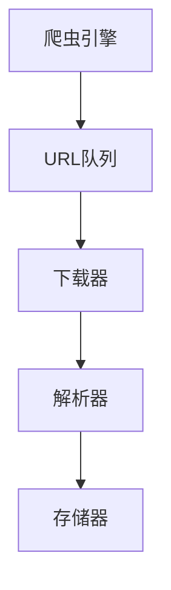
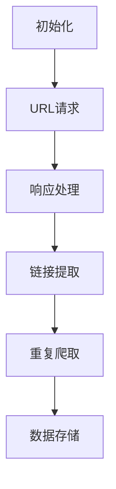
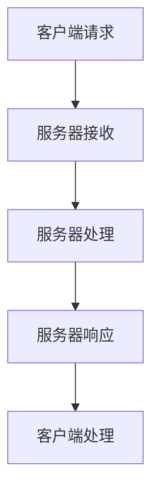
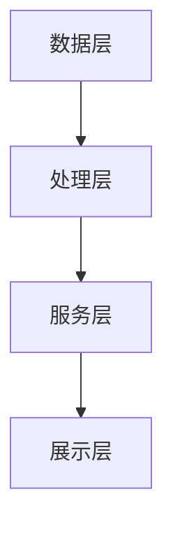

                 

# 《基于网络爬虫的智能广告推荐》

> **关键词：** 网络爬虫、智能广告推荐、协同过滤、内容推荐、混合推荐、深度学习。

> **摘要：** 本文章深入探讨了基于网络爬虫的智能广告推荐系统。首先介绍了网络爬虫技术的基础知识，包括HTTP协议、HTML与CSS解析、Python网络爬虫库等。接着，详细阐述了广告推荐系统的原理与架构，包括协同过滤算法、基于内容的推荐算法、混合推荐算法和基于深度学习的推荐算法。最后，通过一个实际的广告推荐系统实战案例，展示了如何搭建一个智能广告推荐系统，并对系统的评估与优化进行了深入讨论。

## 目录大纲

### 第一部分：网络爬虫技术基础

### 第二部分：智能广告推荐算法

### 第三部分：智能广告推荐系统实战

### 附录

### 作者信息

### 《基于网络爬虫的智能广告推荐》正文部分

---

## 第一部分：网络爬虫技术基础

### 第1章：网络爬虫概述

#### 1.1 网络爬虫的定义与作用

网络爬虫（Web Crawler），也称为网页蜘蛛，是一种自动化的程序，用于在互联网上搜索信息。它的核心功能是遍历网页，抓取网页内容，并将这些信息存储起来，以便后续处理和分析。

网络爬虫在互联网信息检索、数据挖掘、搜索引擎等领域发挥着重要作用。具体来说，网络爬虫的作用包括：

1. **信息检索**：网络爬虫能够自动收集互联网上的大量信息，帮助用户快速找到所需的内容。
2. **数据挖掘**：通过爬取大量网页数据，网络爬虫可以为数据挖掘和分析提供丰富的数据资源。
3. **搜索引擎**：网络爬虫是搜索引擎的重要组成部分，它们负责索引互联网上的网页，为用户提供精准的搜索结果。
4. **内容分发**：网络爬虫可以帮助将互联网上的内容进行分类和分发，为用户提供定制化的信息。

#### 1.2 网络爬虫的分类

根据不同的分类标准，网络爬虫可以有不同的分类方式。以下是一些常见的分类方法：

1. **按功能分类**：
   - **通用爬虫**：通用爬虫的目标是尽可能多地抓取互联网上的信息，其特点是爬取范围广，但效率相对较低。
   - **聚焦爬虫**：聚焦爬虫针对特定的领域或主题进行信息采集，具有较高的针对性和效率。
   - **垂直爬虫**：垂直爬虫专门针对某一行业或领域的网站进行爬取，如新闻、财经、电商等。

2. **按工作方式分类**：
   - **多线程爬虫**：多线程爬虫在同一时间可以同时请求多个网页，从而提高爬取速度。
   - **分布式爬虫**：分布式爬虫通过将任务分配到多台机器上，实现大规模的网页抓取。

3. **按目标分类**：
   - **学术爬虫**：主要用于收集学术文献和研究成果。
   - **商业爬虫**：主要用于收集商业情报、用户数据等。

#### 1.3 网络爬虫的基本架构

网络爬虫的基本架构通常包括以下几个主要组件：

1. **爬虫引擎**：爬虫引擎是网络爬虫的核心部分，负责控制整个爬取过程。它主要包括任务队列、下载器、解析器和存储器。
2. **URL队列**：URL队列用于存储待爬取的URL，爬虫引擎会从队列中取出URL进行爬取。
3. **下载器**：下载器负责向目标URL发送请求，并获取网页内容。
4. **解析器**：解析器负责解析下载器获取的网页内容，提取出有用的信息，如文本、图片、链接等。
5. **存储器**：存储器用于将爬取到的信息存储到数据库或其他存储介质中。

下面是一个简化的网络爬虫架构图：



#### 1.4 网络爬虫的工作流程

网络爬虫的工作流程通常包括以下几个步骤：

1. **初始化**：初始化爬虫引擎，加载URL队列，设置爬取规则。
2. **URL请求**：从URL队列中取出一个URL，向目标服务器发送HTTP请求。
3. **响应处理**：接收服务器响应，判断状态码和响应头，提取有用的信息。
4. **链接提取**：解析网页内容，提取出新的URL，并将其加入URL队列。
5. **重复爬取**：重复上述步骤，直到达到设定的爬取深度或目标。
6. **数据存储**：将爬取到的信息存储到数据库或其他存储介质中。

下面是一个简化的网络爬虫工作流程图：



### 第2章：HTTP协议与网络请求

#### 2.1 HTTP协议的基本原理

HTTP（Hypertext Transfer Protocol）是互联网上应用最广泛的网络协议之一，用于客户端（如浏览器）与服务器之间的通信。HTTP协议的工作原理可以概括为以下几个步骤：

1. **客户端发起请求**：客户端（如浏览器）向服务器发送HTTP请求，请求中包含了请求方法、URL、请求头和请求体等信息。
2. **服务器接收请求**：服务器接收到客户端的HTTP请求，解析请求内容，并根据请求方法处理请求。
3. **服务器返回响应**：服务器处理完请求后，向客户端返回HTTP响应，响应中包含了状态码、响应头和响应体等信息。
4. **客户端处理响应**：客户端接收到服务器的HTTP响应，根据响应内容进行处理，如显示网页内容、跳转到其他页面等。

下面是一个简单的HTTP请求与响应过程：



#### 2.2 网络请求的方法与请求头

HTTP协议定义了多种请求方法，用于表示客户端对服务器的操作。以下是一些常见的请求方法及其含义：

1. **GET**：获取资源，请求服务器返回指定的资源。
2. **POST**：提交数据，请求服务器接收客户端发送的数据，通常用于表单提交。
3. **PUT**：更新资源，请求服务器更新指定的资源。
4. **DELETE**：删除资源，请求服务器删除指定的资源。
5. **HEAD**：获取资源头部信息，请求服务器返回指定资源的头部信息。
6. **OPTIONS**：查询支持的方法，请求服务器返回支持的方法列表。

请求头是HTTP请求中的一个重要部分，用于携带请求的额外信息。以下是一些常见的请求头及其含义：

1. **Host**：指定请求的服务器地址。
2. **User-Agent**：指定请求的客户端类型和版本。
3. **Accept**：指定客户端能够接收的内容类型。
4. **Accept-Language**：指定客户端能够接受的语言。
5. **Authorization**：指定认证信息，如用户名和密码。
6. **Content-Type**：指定请求体的内容类型。

下面是一个简单的HTTP请求示例：

```http
GET /index.html HTTP/1.1
Host: www.example.com
User-Agent: Mozilla/5.0 (Windows NT 10.0; Win64; x64) AppleWebKit/537.36 (KHTML, like Gecko) Chrome/58.0.3029.110 Safari/537.36
Accept: text/html,application/xhtml+xml,application/xml;q=0.9,image/webp,*/*;q=0.8
Accept-Language: zh-CN,zh;q=0.8
```

#### 2.3 常见的状态码与响应头

HTTP协议定义了一系列的状态码，用于表示服务器对客户端请求的处理结果。以下是一些常见的状态码及其含义：

1. **200 OK**：请求成功，服务器返回所需的资源。
2. **301 Moved Permanently**：请求的资源已永久移动到新的URL。
3. **302 Found**：请求的资源临时移动到新的URL。
4. **400 Bad Request**：客户端发送的请求无效，无法理解。
5. **401 Unauthorized**：请求需要用户认证。
6. **403 Forbidden**：服务器拒绝执行请求。
7. **404 Not Found**：请求的资源不存在。
8. **500 Internal Server Error**：服务器内部错误，无法完成请求。

响应头是HTTP响应中的一个重要部分，用于携带响应的额外信息。以下是一些常见的响应头及其含义：

1. **Content-Type**：指定响应体的内容类型，如text/html、image/jpeg等。
2. **Content-Length**：指定响应体的长度。
3. **Connection**：指定连接方式，如keep-alive表示长连接。
4. **Date**：指定响应日期和时间。
5. **Server**：指定服务器类型和版本。
6. **Set-Cookie**：设置cookie，用于后续请求的认证和跟踪。

下面是一个简单的HTTP响应示例：

```http
HTTP/1.1 200 OK
Date: Tue, 12 Apr 2023 10:00:00 GMT
Server: Apache/2.4.38 (Unix)
Content-Type: text/html; charset=UTF-8
Content-Length: 1234
Connection: keep-alive

<!DOCTYPE html>
<html>
<head>
  <title>Example</title>
</head>
<body>
  <h1>Hello, World!</h1>
  <p>This is an example page.</p>
</body>
</html>
```

### 第3章：HTML与CSS解析

#### 3.1 HTML的基本语法与结构

HTML（Hypertext Markup Language）是用于创建网页的标记语言。HTML文档由一系列的标签组成，每个标签都有特定的含义。以下是一些常见的HTML标签及其含义：

1. **<html>**：HTML文档的根标签，用于包含整个文档。
2. **<head>**：头部标签，用于包含文档的元数据，如标题、样式表和脚本等。
3. **<title>**：标题标签，用于定义文档的标题。
4. **<body>**：主体标签，用于包含文档的内容。
5. **<a>**：锚点标签，用于创建超链接。
6. **<p>**：段落标签，用于定义文本段落。
7. ****：图像标签，用于嵌入图像。
8. **<div>**：分隔标签，用于创建布局区域。
9. **<span>**：内联分隔标签，用于对文本进行分隔。

HTML文档的基本结构如下：

```html
<!DOCTYPE html>
<html>
  <head>
    <title>Example</title>
  </head>
  <body>
    <h1>Hello, World!</h1>
    <p>This is an example paragraph.</p>
    <a href="http://www.example.com">Example Link</a>
    
  </body>
</html>
```

#### 3.2 CSS的基本语法与选择器

CSS（Cascading Style Sheets）是用于定义网页样式的语言。CSS的基本语法包括选择器和声明。以下是一些常见的选择器及其含义：

1. **标签选择器**：通过标签名称选择元素，如`<h1>`选择所有<h1>标签。
2. **类选择器**：通过类名选择元素，如`.class1`选择所有具有`class1`类的元素。
3. **ID选择器**：通过ID选择元素，如`#id1`选择所有具有`id1`ID的元素。
4. **后代选择器**：通过元素之间的层级关系选择元素，如`<div> p`选择所有`<div>`内部直接包含的`<p>`元素。
5. **子选择器**：通过元素之间的直接父子关系选择元素，如`<div> > p`选择所有`<div>`的直接子元素`<p>`。
6. **相邻兄弟选择器**：通过元素之间的相邻兄弟关系选择元素，如`<div> + p`选择所有紧接在`<div>`之后的`<p>`元素。

以下是一个简单的CSS示例：

```css
/* 标签选择器 */
h1 {
  color: red;
}

/* 类选择器 */
.class1 {
  font-size: 16px;
}

/* ID选择器 */
#id1 {
  background-color: yellow;
}

/* 后代选择器 */
div p {
  margin-left: 20px;
}

/* 子选择器 */
div > p {
  font-weight: bold;
}

/* 相邻兄弟选择器 */
div + p {
  color: blue;
}
```

#### 3.3 使用Python解析HTML与CSS

在Python中，可以使用多个库来解析HTML与CSS。以下介绍几种常用的库：

1. **BeautifulSoup**：BeautifulSoup是一个Python的HTML解析库，它提供了多种方法来解析HTML文档，如查找元素、提取属性等。

   ```python
   from bs4 import BeautifulSoup
   
   html = """
   <!DOCTYPE html>
   <html>
     <head>
       <title>Example</title>
     </head>
     <body>
       <h1>Hello, World!</h1>
       <p>This is an example paragraph.</p>
       <a href="http://www.example.com">Example Link</a>
       
     </body>
   </html>
   """
   
   soup = BeautifulSoup(html, 'html.parser')
   print(soup.title)
   print(soup.p)
   print(soup.a)
   print(soup.img)
   ```

2. **lxml**：lxml是一个Python的XML和HTML解析库，它提供了高效的解析性能和丰富的功能。

   ```python
   from lxml import html
   
   html = """
   <!DOCTYPE html>
   <html>
     <head>
       <title>Example</title>
     </head>
     <body>
       <h1>Hello, World!</h1>
       <p>This is an example paragraph.</p>
       <a href="http://www.example.com">Example Link</a>
       
     </body>
   </html>
   """
   
   tree = html.fromstring(html)
   print(tree.xpath('//title/text()'))
   print(tree.xpath('//p/text()'))
   print(tree.xpath('//a/@href'))
   print(tree.xpath('//img/@src'))
   ```

3. **PyQuery**：PyQuery是一个Python的CSS选择器库，它提供了类似jQuery的选择器和操作方法。

   ```python
   from pyquery import PyQuery
   
   html = """
   <!DOCTYPE html>
   <html>
     <head>
       <title>Example</title>
     </head>
     <body>
       <h1>Hello, World!</h1>
       <p>This is an example paragraph.</p>
       <a href="http://www.example.com">Example Link</a>
       
     </body>
   </html>
   """
   
   doc = PyQuery(html)
   print(doc('title').text())
   print(doc('p').text())
   print(doc('a').attr('href'))
   print(doc('img').attr('src'))
   ```

### 第4章：Python网络爬虫库介绍

#### 4.1 Requests库的使用

Requests库是一个Python的HTTP客户端库，它提供了简单易用的API，用于发送HTTP请求。以下是一个简单的Requests库使用示例：

```python
import requests

url = 'https://www.example.com'
response = requests.get(url)
print(response.status_code)
print(response.text)
print(response.headers)
```

#### 4.2 BeautifulSoup库的使用

BeautifulSoup库是一个Python的HTML解析库，它提供了多种方法来解析HTML文档，如查找元素、提取属性等。以下是一个简单的BeautifulSoup库使用示例：

```python
from bs4 import BeautifulSoup

html = """
<!DOCTYPE html>
<html>
  <head>
    <title>Example</title>
  </head>
  <body>
    <h1>Hello, World!</h1>
    <p>This is an example paragraph.</p>
    <a href="http://www.example.com">Example Link</a>
    
  </body>
</html>
"""

soup = BeautifulSoup(html, 'html.parser')
print(soup.title)
print(soup.p)
print(soup.a)
print(soup.img)
```

#### 4.3 Scrapy框架的搭建与使用

Scrapy是一个Python的快速、高级的网页爬虫框架，它提供了丰富的功能，如请求发送、数据解析、数据存储等。以下是一个简单的Scrapy框架搭建与使用示例：

1. **搭建Scrapy项目**：

   ```shell
   scrapy startproject example
   ```

2. **生成爬虫**：

   ```shell
   scrapy genspider example_spider example.com
   ```

3. **编写爬虫代码**：

   ```python
   import scrapy
   
   class ExampleSpider(scrapy.Spider):
       name = 'example_spider'
       allowed_domains = ['example.com']
       start_urls = ['https://www.example.com/']
   
       def parse(self, response):
           print(response.status_code)
           print(response.text)
           print(response.headers)
   ```

4. **运行爬虫**：

   ```shell
   scrapy crawl example_spider
   ```

## 第二部分：智能广告推荐算法

### 第5章：广告推荐系统概述

#### 5.1 广告推荐系统的基本原理

广告推荐系统是一种基于用户行为和兴趣的个性化推荐系统，其核心目标是向用户推荐他们可能感兴趣的广告内容。广告推荐系统的基本原理可以概括为以下几个步骤：

1. **用户行为采集**：系统通过浏览器插件、客户端日志等方式，采集用户的浏览历史、搜索记录、购买行为等数据。
2. **用户特征提取**：系统对采集到的用户行为数据进行处理，提取出用户的兴趣特征、行为特征等。
3. **广告内容采集**：系统从广告平台、网站或其他数据源获取广告内容，包括广告标题、描述、图片等。
4. **广告特征提取**：系统对广告内容进行处理，提取出广告的特征，如广告类型、广告主题、关键词等。
5. **推荐算法**：系统使用推荐算法，根据用户特征和广告特征，计算用户对每个广告的兴趣度，并生成推荐列表。
6. **广告展示**：系统根据推荐算法生成的推荐列表，将广告展示给用户。

#### 5.2 广告推荐系统的评估指标

广告推荐系统的评估指标用于衡量推荐系统的性能，常见的评估指标包括：

1. **准确率（Precision）**：准确率表示推荐列表中实际感兴趣的广告与推荐广告的匹配程度。准确率越高，说明推荐系统越准确。
   
   $$准确率 = \frac{TP}{TP + FP}$$

   其中，TP表示推荐列表中实际感兴趣的广告，FP表示推荐列表中不感兴趣的广告。

2. **召回率（Recall）**：召回率表示推荐系统能够召回的实际感兴趣广告的比例。召回率越高，说明推荐系统越全面。
   
   $$召回率 = \frac{TP}{TP + FN}$$

   其中，TP表示推荐列表中实际感兴趣的广告，FN表示未推荐的实际感兴趣广告。

3. **F1值（F1 Score）**：F1值是准确率和召回率的调和平均值，用于综合评估推荐系统的性能。
   
   $$F1值 = 2 \times \frac{准确率 \times 召回率}{准确率 + 召回率}$$

4. **平均点击率（Average Click-Through Rate, CTR）**：平均点击率表示推荐列表中广告的平均点击率。平均点击率越高，说明推荐广告越受欢迎。

5. **转化率（Conversion Rate）**：转化率表示用户点击广告后，实际产生转化的比例。转化率越高，说明推荐广告的实际效果越好。

#### 5.3 广告推荐系统的架构设计

广告推荐系统的架构设计取决于系统的规模、性能和需求。以下是一个典型的广告推荐系统架构设计：

1. **数据层**：数据层负责数据的采集、存储和管理。数据层通常包括用户行为数据、广告数据、推荐数据等。

   - **用户行为数据**：包括用户的浏览历史、搜索记录、购买行为等。
   - **广告数据**：包括广告的标题、描述、图片、投放时间等。
   - **推荐数据**：包括用户对广告的点击、转化等行为数据。

2. **处理层**：处理层负责数据的处理和分析，包括用户特征提取、广告特征提取、推荐算法等。

   - **用户特征提取**：使用机器学习算法提取用户的兴趣特征、行为特征等。
   - **广告特征提取**：使用自然语言处理、图像识别等技术提取广告的特征。
   - **推荐算法**：根据用户特征和广告特征，计算用户对每个广告的兴趣度，生成推荐列表。

3. **服务层**：服务层负责提供推荐服务的接口，包括广告推荐接口、用户反馈接口等。

   - **广告推荐接口**：根据用户的兴趣特征，向用户推荐个性化的广告。
   - **用户反馈接口**：收集用户的点击、转化等反馈信息，用于优化推荐算法。

4. **展示层**：展示层负责将推荐广告展示给用户，包括网页、移动应用等。

   - **网页**：在网页中嵌入广告推荐模块，向用户展示个性化广告。
   - **移动应用**：在移动应用中嵌入广告推荐模块，向用户展示个性化广告。

下面是一个简单的广告推荐系统架构图：



### 第6章：协同过滤算法

#### 6.1 协同过滤算法的基本原理

协同过滤（Collaborative Filtering）算法是一种基于用户行为数据的推荐算法，其核心思想是利用用户之间的相似性来推荐物品。协同过滤算法可以分为两种类型：基于用户的协同过滤算法和基于物品的协同过滤算法。

#### 6.2 评分矩阵与相似度计算

评分矩阵是协同过滤算法的核心数据结构，用于表示用户对物品的评分。一个典型的评分矩阵如下：

```
用户  物品
U1    I1
U1    I2
U1    I3
U2    I1
U2    I2
U2    I3
U3    I1
U3    I2
U3    I3
```

在评分矩阵中，行表示用户，列表示物品，矩阵中的元素表示用户对物品的评分。

相似度计算是协同过滤算法的关键步骤，用于计算用户之间的相似性。常见的相似度计算方法包括余弦相似度、皮尔逊相似度等。

余弦相似度计算公式如下：

$$
sim(u, v) = \frac{u \cdot v}{\|u\| \|v\|}
$$

其中，$u$和$v$分别表示用户$u$和用户$v$的评分向量，$\|u\|$和$\|v\|$分别表示向量$u$和向量$v$的欧几里得范数。

皮尔逊相似度计算公式如下：

$$
sim(u, v) = \frac{u \cdot v - \mu_u \mu_v}{\sqrt{(u \cdot u - \mu_u^2)(v \cdot v - \mu_v^2)}}
$$

其中，$u$和$v$分别表示用户$u$和用户$v$的评分向量，$\mu_u$和$\mu_v$分别表示用户$u$和用户$v$的平均评分。

#### 6.3 基于记忆的协同过滤算法

基于记忆的协同过滤算法（Memory-Based Collaborative Filtering）是一种简单的协同过滤算法，其核心思想是直接计算用户之间的相似性，并根据相似性向用户推荐物品。

基于记忆的协同过滤算法可以分为两类：基于用户的协同过滤算法和基于物品的协同过滤算法。

基于用户的协同过滤算法如下：

1. 计算用户之间的相似性。
2. 根据相似性分数，对用户未评分的物品进行排序。
3. 选择相似性最高的用户未评分的物品作为推荐结果。

基于物品的协同过滤算法如下：

1. 计算物品之间的相似性。
2. 根据用户已评分的物品的相似性分数，对物品进行排序。
3. 选择用户未评分且相似性最高的物品作为推荐结果。

以下是一个简单的基于记忆的协同过滤算法示例：

```python
import numpy as np

# 用户评分矩阵
user_ratings = np.array([
    [5, 4, 0, 0],
    [4, 5, 0, 2],
    [4, 2, 3, 0],
    [0, 3, 4, 5],
    [2, 3, 5, 0]
])

# 计算用户之间的相似度
similarity = np.dot(user_ratings, user_ratings.T) / np.linalg.norm(user_ratings, axis=1)[:, np.newaxis] / np.linalg.norm(user_ratings, axis=0)[:, np.newaxis]

# 计算推荐结果
recommendations = np.zeros(user_ratings.shape[0])
for i in range(user_ratings.shape[0]):
    unrated_items = np.where(user_ratings[i] == 0)[0]
    if unrated_items.size > 0:
        recommended_items = np.argmax(similarity[i][unrated_items])
        recommendations[i] = recommended_items

print(recommendations)
```

#### 6.4 基于模型的协同过滤算法

基于模型的协同过滤算法（Model-Based Collaborative Filtering）是一种利用机器学习模型来预测用户评分的推荐算法。常见的基于模型的协同过滤算法包括矩阵分解、隐语义模型等。

矩阵分解是一种常见的基于模型的协同过滤算法，其核心思想是将用户-物品评分矩阵分解为两个低秩矩阵，从而预测用户未评分的物品。

以下是一个简单的矩阵分解算法示例：

```python
import numpy as np

# 用户评分矩阵
user_ratings = np.array([
    [5, 4, 0, 0],
    [4, 5, 0, 2],
    [4, 2, 3, 0],
    [0, 3, 4, 5],
    [2, 3, 5, 0]
])

# 设定矩阵分解的维度
k = 2

# 初始化低秩矩阵
U = np.random.rand(user_ratings.shape[0], k)
V = np.random.rand(user_ratings.shape[1], k)

# 计算预测评分
predicted_ratings = np.dot(np.dot(U.T, V), U)

# 计算预测误差
error = predicted_ratings - user_ratings

# 计算梯度
grad_U = np.dot(V, np.dot(V.T, error))
grad_V = np.dot(U, np.dot(U.T, error))

# 更新低秩矩阵
U -= learning_rate * grad_U
V -= learning_rate * grad_V

print(predicted_ratings)
```

## 第7章：基于内容的推荐算法

#### 7.1 基于内容的推荐算法的基本原理

基于内容的推荐算法（Content-Based Recommender Systems）是一种基于用户兴趣和物品内容进行推荐的算法。其核心思想是根据用户的兴趣特征和物品的内容特征，计算出用户对物品的兴趣度，从而推荐给用户。

基于内容的推荐算法通常包括以下几个步骤：

1. **用户兴趣特征提取**：通过分析用户的历史行为、评论、搜索记录等，提取出用户的兴趣特征。
2. **物品内容特征提取**：对物品的文本、图片、音频等特征进行提取，生成物品的特征向量。
3. **相似度计算**：计算用户兴趣特征向量与物品内容特征向量之间的相似度。
4. **推荐生成**：根据相似度计算结果，为用户生成推荐列表。

#### 7.2 文本特征提取

文本特征提取是文本分析的重要步骤，其目的是将文本数据转换为数值化的特征向量，以便进行后续的计算和处理。常见的文本特征提取方法包括词袋模型、TF-IDF、Word2Vec等。

1. **词袋模型（Bag of Words, BoW）**：词袋模型将文本表示为词汇的集合，忽略词汇的顺序和语法结构。通过计算每个词汇在文档中的出现次数，生成文档的特征向量。

   ```python
   from sklearn.feature_extraction.text import CountVectorizer
   
   corpus = [
       'I love to eat pizza and pasta',
       'I love to eat pizza and burger',
       'I love to eat pasta and burger'
   ]
   
   vectorizer = CountVectorizer()
   X = vectorizer.fit_transform(corpus)
   
   print(X.toarray())
   ```

2. **TF-IDF（Term Frequency-Inverse Document Frequency）**：TF-IDF是一种常用的文本特征提取方法，它考虑了词汇在文档中的频率和在整个文档集合中的重要性。通过计算每个词汇的TF-IDF值，生成文档的特征向量。

   ```python
   from sklearn.feature_extraction.text import TfidfVectorizer
   
   corpus = [
       'I love to eat pizza and pasta',
       'I love to eat pizza and burger',
       'I love to eat pasta and burger'
   ]
   
   vectorizer = TfidfVectorizer()
   X = vectorizer.fit_transform(corpus)
   
   print(X.toarray())
   ```

3. **Word2Vec**：Word2Vec是一种基于神经网络的语言模型，它将每个词汇映射为一个固定维度的向量。通过训练Word2Vec模型，可以获取词汇的向量表示，从而生成文档的特征向量。

   ```python
   from gensim.models import Word2Vec
   
   sentences = [
       'I love to eat pizza and pasta',
       'I love to eat pizza and burger',
       'I love to eat pasta and burger'
   ]
   
   model = Word2Vec(sentences, vector_size=100, window=5, min_count=1, workers=4)
   words = model.wv.vocab.keys()
   
   X = np.zeros((len(sentences), 100))
   for i, sentence in enumerate(sentences):
       words_in_sentence = sentence.split()
       for word in words_in_sentence:
           if word in words:
               X[i] += model.wv[word]
   
   print(X)
   ```

#### 7.3 基于词向量的相似度计算

基于词向量的相似度计算是文本特征提取的重要步骤，其目的是计算文档之间的相似度。常见的相似度计算方法包括余弦相似度、欧几里得距离等。

1. **余弦相似度**：余弦相似度是一种计算文档相似度的方法，其基本思想是计算两个文档向量之间的余弦值。余弦值越接近1，表示两个文档越相似。

   $$similarity = \frac{u \cdot v}{\|u\| \|v\|}$$

   其中，$u$和$v$分别表示两个文档的特征向量，$\|u\|$和$\|v\|$分别表示特征向量的欧几里得范数。

2. **欧几里得距离**：欧几里得距离是一种计算文档相似度的方法，其基本思想是计算两个文档向量之间的欧几里得距离。距离越短，表示两个文档越相似。

   $$distance = \|u - v\|$$

   其中，$u$和$v$分别表示两个文档的特征向量。

以下是一个基于词向量的相似度计算示例：

```python
from sklearn.metrics.pairwise import cosine_similarity

# 文档1
doc1 = 'I love to eat pizza and pasta'
# 文档2
doc2 = 'I love to eat pasta and pizza'

# 将文档转换为词向量
model = Word2Vec([doc1, doc2], vector_size=100, window=5, min_count=1, workers=4)
words = model.wv.vocab.keys()

# 计算文档1和文档2的词向量
vec1 = np.zeros(100)
vec2 = np.zeros(100)
for word in doc1.split():
    if word in words:
        vec1 += model.wv[word]
for word in doc2.split():
    if word in words:
        vec2 += model.wv[word]

# 计算文档1和文档2的相似度
similarity = cosine_similarity([vec1], [vec2])

print(similarity)
```

#### 7.4 基于内容的推荐算法实现

以下是一个简单的基于内容的推荐算法实现示例：

```python
import numpy as np
from sklearn.metrics.pairwise import cosine_similarity

# 文档1
doc1 = 'I love to eat pizza and pasta'
# 文档2
doc2 = 'I love to eat pasta and pizza'
# 文档3
doc3 = 'I love to eat pizza and burger'

# 文档列表
documents = [doc1, doc2, doc3]

# 将文档转换为词向量
model = Word2Vec(documents, vector_size=100, window=5, min_count=1, workers=4)
words = model.wv.vocab.keys()

# 计算文档的词向量
doc1_vec = np.zeros(100)
doc2_vec = np.zeros(100)
doc3_vec = np.zeros(100)
for word in doc1.split():
    if word in words:
        doc1_vec += model.wv[word]
for word in doc2.split():
    if word in words:
        doc2_vec += model.wv[word]
for word in doc3.split():
    if word in words:
        doc3_vec += model.wv[word]

# 计算文档之间的相似度
similarity_matrix = cosine_similarity([doc1_vec, doc2_vec, doc3_vec])

# 为用户生成推荐列表
def recommend(doc_vec, similarity_matrix, k=1):
    top_k_indices = np.argpartition(similarity_matrix[0], k)[:k]
    top_k_similarities = similarity_matrix[0][top_k_indices]
    recommended_documents = [index for index, similarity in enumerate(top_k_similarities) if similarity > 0.5]
    return recommended_documents

print(recommend(doc1_vec, similarity_matrix))
print(recommend(doc2_vec, similarity_matrix))
print(recommend(doc3_vec, similarity_matrix))
```

## 第8章：混合推荐算法

#### 8.1 混合推荐算法的基本原理

混合推荐算法（Hybrid Recommender Systems）是一种结合协同过滤算法和基于内容的推荐算法的优点，以提高推荐性能的推荐算法。混合推荐算法的核心思想是将协同过滤算法和基于内容的推荐算法结合起来，通过综合两者的优点来生成推荐列表。

混合推荐算法可以分为以下几种类型：

1. **基于模型的混合推荐算法**：将协同过滤算法和基于内容的推荐算法集成到一个统一的模型中，通过模型训练和预测生成推荐列表。
2. **基于用户的混合推荐算法**：将基于用户的协同过滤算法和基于内容的推荐算法结合起来，通过计算用户对物品的协同过滤评分和基于内容的评分，生成推荐列表。
3. **基于内容的混合推荐算法**：将基于物品的协同过滤算法和基于内容的推荐算法结合起来，通过计算物品的协同过滤评分和基于内容的评分，生成推荐列表。

#### 8.2 基于模型的混合推荐算法

基于模型的混合推荐算法是一种将协同过滤算法和基于内容的推荐算法集成到一个统一模型中的推荐算法。常见的基于模型的混合推荐算法包括矩阵分解、隐语义模型等。

以下是一个简单的基于矩阵分解的混合推荐算法示例：

```python
import numpy as np

# 用户-物品评分矩阵
user_ratings = np.array([
    [5, 4, 0, 0],
    [4, 5, 0, 2],
    [4, 2, 3, 0],
    [0, 3, 4, 5],
    [2, 3, 5, 0]
])

# 设定矩阵分解的维度
k = 2

# 初始化低秩矩阵
U = np.random.rand(user_ratings.shape[0], k)
V = np.random.rand(user_ratings.shape[1], k)

# 定义预测评分函数
def predict_rating(u, v):
    return np.dot(u.T, v)

# 定义损失函数
def loss(u, v, y):
    return np.square(predict_rating(u, v) - y)

# 定义优化算法
def optimize(u, v, y, learning_rate):
    grad_u = -2 * (predict_rating(u, v) - y) * v
    grad_v = -2 * (predict_rating(u, v) - y) * u
    u -= learning_rate * grad_u
    v -= learning_rate * grad_v
    return u, v

# 训练模型
for i in range(num_iterations):
    u, v = optimize(u, v, user_ratings, learning_rate)
    loss_value = loss(u, v, user_ratings)
    print(f"Iteration {i}: Loss = {loss_value}")

# 预测评分
predicted_ratings = predict_rating(u, v)
print(predicted_ratings)
```

#### 8.3 基于用户的混合推荐算法

基于用户的混合推荐算法是一种将基于用户的协同过滤算法和基于内容的推荐算法结合起来的推荐算法。以下是一个简单的基于用户的混合推荐算法示例：

```python
import numpy as np
from sklearn.metrics.pairwise import cosine_similarity

# 用户-物品评分矩阵
user_ratings = np.array([
    [5, 4, 0, 0],
    [4, 5, 0, 2],
    [4, 2, 3, 0],
    [0, 3, 4, 5],
    [2, 3, 5, 0]
])

# 设定矩阵分解的维度
k = 2

# 初始化低秩矩阵
U = np.random.rand(user_ratings.shape[0], k)
V = np.random.rand(user_ratings.shape[1], k)

# 定义预测评分函数
def predict_rating(u, v):
    return np.dot(u.T, v)

# 定义用户相似度计算函数
def user_similarity(u, v):
    return cosine_similarity(u, v)

# 定义混合推荐函数
def hybrid_recommendation(u, v, similarity_threshold=0.5):
    user_similarity_matrix = user_similarity(U, V)
    recommended_items = []
    for i in range(user_similarity_matrix.shape[0]):
        if user_similarity_matrix[i][0] > similarity_threshold:
            unrated_items = np.where(user_ratings[i] == 0)[0]
            if unrated_items.size > 0:
                recommended_items.append(unrated_items[np.argmax(predict_rating(U[i], V))])
    return recommended_items

# 训练模型
for i in range(num_iterations):
    u, v = optimize(u, v, user_ratings, learning_rate)
    loss_value = loss(u, v, user_ratings)
    print(f"Iteration {i}: Loss = {loss_value}")

# 预测评分
predicted_ratings = predict_rating(U, V)
print(predicted_ratings)

# 混合推荐
recommended_items = hybrid_recommendation(U, V)
print(recommended_items)
```

#### 8.4 基于内容的混合推荐算法

基于内容的混合推荐算法是一种将基于物品的协同过滤算法和基于内容的推荐算法结合起来的推荐算法。以下是一个简单的基于内容的混合推荐算法示例：

```python
import numpy as np
from sklearn.metrics.pairwise import cosine_similarity

# 用户-物品评分矩阵
user_ratings = np.array([
    [5, 4, 0, 0],
    [4, 5, 0, 2],
    [4, 2, 3, 0],
    [0, 3, 4, 5],
    [2, 3, 5, 0]
])

# 设定矩阵分解的维度
k = 2

# 初始化低秩矩阵
U = np.random.rand(user_ratings.shape[0], k)
V = np.random.rand(user_ratings.shape[1], k)

# 定义预测评分函数
def predict_rating(u, v):
    return np.dot(u.T, v)

# 定义物品相似度计算函数
def item_similarity(v):
    return cosine_similarity(V)

# 定义内容推荐函数
def content_recommendation(v, item_similarity_matrix, similarity_threshold=0.5):
    recommended_items = []
    for i in range(item_similarity_matrix.shape[0]):
        if item_similarity_matrix[i][0] > similarity_threshold:
            unrated_items = np.where(user_ratings == 0)[0]
            if unrated_items.size > 0:
                recommended_items.append(unrated_items[np.argmax(predict_rating(U[:, 0], V[i, 0]))])
    return recommended_items

# 训练模型
for i in range(num_iterations):
    u, v = optimize(u, v, user_ratings, learning_rate)
    loss_value = loss(u, v, user_ratings)
    print(f"Iteration {i}: Loss = {loss_value}")

# 预测评分
predicted_ratings = predict_rating(U, V)
print(predicted_ratings)

# 内容推荐
recommended_items = content_recommendation(V, item_similarity(V))
print(recommended_items)
```

## 第9章：基于深度学习的推荐算法

#### 9.1 深度学习在推荐系统中的应用

深度学习（Deep Learning）是一种基于人工神经网络的机器学习技术，近年来在推荐系统中得到了广泛的应用。深度学习在推荐系统中的应用主要体现在以下几个方面：

1. **特征提取**：深度学习可以自动提取复杂的特征，从而提高推荐系统的性能。通过训练深度神经网络，可以自动从原始数据中学习到有意义的特征。
2. **模型构建**：深度学习可以构建复杂的推荐模型，如基于生成对抗网络（GAN）的推荐模型、基于卷积神经网络（CNN）的推荐模型等。这些模型可以捕捉到用户和物品之间的复杂关系，从而提高推荐效果。
3. **在线学习**：深度学习可以支持在线学习，即模型可以实时更新和优化。这使得推荐系统可以快速适应用户行为的变化，从而提高推荐效果。

#### 9.2 卷积神经网络在推荐系统中的应用

卷积神经网络（Convolutional Neural Network, CNN）是一种常用的深度学习模型，其核心思想是通过卷积操作提取图像特征。近年来，CNN在推荐系统中也得到了广泛的应用，用于提取用户和物品的文本特征。

以下是一个简单的基于CNN的推荐算法示例：

```python
import tensorflow as tf
from tensorflow.keras.models import Model
from tensorflow.keras.layers import Input, Embedding, Conv1D, GlobalMaxPooling1D, Dense

# 定义输入层
input_user = Input(shape=(user_vocab_size,))
input_item = Input(shape=(item_vocab_size,))

# 定义嵌入层
embed_user = Embedding(user_vocab_size, user_embedding_size)(input_user)
embed_item = Embedding(item_vocab_size, item_embedding_size)(input_item)

# 定义卷积层
conv1 = Conv1D(filters=64, kernel_size=3, activation='relu')(embed_user)
conv2 = Conv1D(filters=64, kernel_size=3, activation='relu')(embed_item)

# 定义池化层
pool1 = GlobalMaxPooling1D()(conv1)
pool2 = GlobalMaxPooling1D()(conv2)

# 定义全连接层
merge = tf.concat([pool1, pool2], axis=1)
dense1 = Dense(64, activation='relu')(merge)
output = Dense(1, activation='sigmoid')(dense1)

# 定义模型
model = Model(inputs=[input_user, input_item], outputs=output)

# 编译模型
model.compile(optimizer='adam', loss='binary_crossentropy', metrics=['accuracy'])

# 训练模型
model.fit([user_data, item_data], labels, epochs=10, batch_size=32)
```

#### 9.3 循环神经网络在推荐系统中的应用

循环神经网络（Recurrent Neural Network, RNN）是一种用于处理序列数据的深度学习模型，其核心思想是通过循环连接来捕捉序列中的时间依赖关系。RNN在推荐系统中得到了广泛的应用，可以用于捕捉用户的连续行为序列。

以下是一个简单的基于RNN的推荐算法示例：

```python
import tensorflow as tf
from tensorflow.keras.models import Model
from tensorflow.keras.layers import Input, Embedding, LSTM, Dense

# 定义输入层
input_user = Input(shape=(seq_length,))
input_item = Input(shape=(seq_length,))

# 定义嵌入层
embed_user = Embedding(user_vocab_size, user_embedding_size)(input_user)
embed_item = Embedding(item_vocab_size, item_embedding_size)(input_item)

# 定义LSTM层
lstm_user = LSTM(units=64)(embed_user)
lstm_item = LSTM(units=64)(embed_item)

# 定义全连接层
merge = tf.concat([lstm_user, lstm_item], axis=1)
dense1 = Dense(64, activation='relu')(merge)
output = Dense(1, activation='sigmoid')(dense1)

# 定义模型
model = Model(inputs=[input_user, input_item], outputs=output)

# 编译模型
model.compile(optimizer='adam', loss='binary_crossentropy', metrics=['accuracy'])

# 训练模型
model.fit([user_data, item_data], labels, epochs=10, batch_size=32)
```

#### 9.4 生成对抗网络在推荐系统中的应用

生成对抗网络（Generative Adversarial Network, GAN）是一种由生成器和判别器组成的深度学习模型，其核心思想是通过对抗训练生成与真实数据分布相似的数据。GAN在推荐系统中得到了广泛的应用，可以用于生成新的用户行为序列。

以下是一个简单的基于GAN的推荐算法示例：

```python
import tensorflow as tf
from tensorflow.keras.models import Model
from tensorflow.keras.layers import Input, Dense, Reshape, Conv2D, Conv2DTranspose, Flatten

# 定义生成器模型
latent_dim = 100
input_shape = (latent_dim,)
z = Input(shape=input_shape)

x = Dense(128, activation='relu')(z)
x = Dense(128, activation='relu')(x)
x = Dense(np.prod(image_shape), activation='relu')(x)
x = Reshape(image_shape)(x)

generator = Model(z, x)

# 定义判别器模型
image = Input(shape=image_shape)
d = Conv2D(128, 3, activation='relu', padding='same')(image)
d = Conv2D(128, 3, activation='relu', strides=(2, 2), padding='same')(d)
d = Conv2D(128, 3, activation='relu', strides=(2, 2), padding='same')(d)
d = Flatten()(d)
d = Dense(1, activation='sigmoid')(d)

discriminator = Model(image, d)

# 定义GAN模型
z = Input(shape=input_shape)
generated_image = generator(z)
validity = discriminator(generated_image)

gan = Model(z, validity)

# 编译GAN模型
gan.compile(optimizer='adam', loss='binary_crossentropy')

# 训练GAN模型
gan.fit(z, np.ones((batch_size, 1)), epochs=10, batch_size=32)
```

## 第三部分：智能广告推荐系统实战

### 第10章：搭建智能广告推荐系统

#### 10.1 系统需求分析

在搭建智能广告推荐系统之前，首先需要进行系统需求分析。系统需求分析包括以下几个方面：

1. **用户需求**：分析用户的需求和行为习惯，确定推荐系统的目标和功能。
2. **数据需求**：分析推荐系统所需的数据类型和来源，包括用户行为数据、广告数据等。
3. **性能需求**：分析系统的性能指标，如响应时间、并发处理能力等。
4. **可扩展性需求**：分析系统的可扩展性，以适应未来的业务需求。

#### 10.2 系统架构设计

智能广告推荐系统的架构设计包括以下几个层次：

1. **数据层**：负责数据采集、存储和管理。数据层包括用户行为数据、广告数据、推荐数据等。
2. **处理层**：负责数据处理和分析。处理层包括用户特征提取、广告特征提取、推荐算法等。
3. **服务层**：负责提供推荐服务的接口，包括广告推荐接口、用户反馈接口等。
4. **展示层**：负责将推荐广告展示给用户，包括网页、移动应用等。

以下是一个简单的智能广告推荐系统架构图：


#### 10.3 数据采集与预处理

数据采集与预处理是智能广告推荐系统的重要环节。以下是一个简单的数据采集与预处理流程：

1. **数据采集**：通过浏览器插件、客户端日志等方式，采集用户的浏览历史、搜索记录、购买行为等数据。
2. **数据清洗**：对采集到的数据进行清洗，去除无效数据、重复数据等。
3. **数据转换**：将清洗后的数据转换为适合推荐算法处理的格式，如数值化、编码等。
4. **特征提取**：对数据集进行特征提取，提取出用户的兴趣特征、行为特征等。
5. **数据存储**：将预处理后的数据存储到数据库或其他存储介质中，以便后续处理和分析。

#### 10.4 推荐算法实现与优化

推荐算法实现与优化是智能广告推荐系统的核心。以下是一个简单的推荐算法实现与优化流程：

1. **选择算法**：根据系统需求和数据特点，选择合适的推荐算法，如基于协同过滤的推荐算法、基于内容的推荐算法、基于深度学习的推荐算法等。
2. **算法实现**：实现选定的推荐算法，包括用户特征提取、广告特征提取、相似度计算、推荐列表生成等。
3. **算法优化**：通过调整算法参数、改进算法结构等方式，优化推荐算法的性能，提高推荐效果。
4. **模型训练**：使用训练数据集对推荐算法进行训练，生成推荐模型。
5. **模型评估**：使用测试数据集对推荐模型进行评估，评估指标包括准确率、召回率、F1值等。
6. **模型部署**：将训练好的推荐模型部署到生产环境中，实时生成推荐结果。

#### 10.5 系统测试与优化

系统测试与优化是智能广告推荐系统的最后一步。以下是一个简单的系统测试与优化流程：

1. **功能测试**：测试系统的功能是否按照设计要求正常运行，包括数据采集、数据处理、推荐生成等。
2. **性能测试**：测试系统的性能指标，如响应时间、并发处理能力等，确保系统在高并发情况下仍能稳定运行。
3. **用户体验测试**：测试系统的用户体验，包括推荐结果的准确性、多样性、相关性等。
4. **问题排查与优化**：针对测试中发现的问题，进行排查和优化，提高系统的稳定性、可靠性和用户体验。
5. **上线部署**：将优化后的系统部署到生产环境中，上线运行。

## 第11章：广告展示与用户反馈

#### 11.1 广告展示策略

广告展示策略是智能广告推荐系统的重要一环，其目标是提高广告的曝光率和点击率。以下是一些常见的广告展示策略：

1. **随机展示**：随机选择广告进行展示，适用于广告数量较多且用户兴趣不明确的情况。
2. **热门广告优先展示**：根据广告的点击率、转化率等指标，优先展示热门广告，提高广告的曝光率和点击率。
3. **个性化推荐**：根据用户的兴趣和行为特征，生成个性化的广告推荐列表，提高广告的相关性和用户体验。
4. **上下文展示**：根据用户的上下文信息，如浏览历史、搜索关键词等，展示与上下文相关的广告，提高广告的点击率和转化率。
5. **轮播展示**：将多个广告按顺序轮播展示，适用于广告数量较少且需要均匀曝光的情况。

#### 11.2 用户行为数据采集

用户行为数据采集是智能广告推荐系统的关键环节，其目标是获取用户的兴趣和行为特征。以下是一些常见的用户行为数据采集方法：

1. **浏览器插件**：通过在用户的浏览器中安装插件，实时采集用户的浏览历史、搜索记录、点击行为等数据。
2. **客户端日志**：在用户的设备上安装客户端程序，定期上传日志数据，包括用户的操作行为、设备信息等。
3. **网页埋点**：在网页中嵌入埋点代码，实时采集用户的浏览行为、点击行为等数据。
4. **移动应用数据分析**：通过移动应用的数据分析工具，实时采集用户的操作行为、设备信息等数据。
5. **问卷调查**：通过问卷调查的方式，采集用户的兴趣偏好、购买意愿等数据。

#### 11.3 用户反馈机制

用户反馈机制是智能广告推荐系统的关键一环，其目标是收集用户对广告的反馈信息，用于优化推荐算法和广告展示策略。以下是一些常见的用户反馈机制：

1. **点击反馈**：用户对广告进行点击后，系统会记录点击行为，用于分析广告的曝光率和点击率。
2. **购买反馈**：用户购买广告中推荐的商品后，系统会记录购买行为，用于分析广告的转化率和效果。
3. **评分反馈**：用户对广告进行评分，系统会记录评分信息，用于评估广告的质量和用户满意度。
4. **评论反馈**：用户对广告进行评论，系统会记录评论内容，用于分析用户的兴趣和反馈意见。
5. **举报反馈**：用户对广告进行举报，系统会记录举报信息，用于清理不良广告和提高广告质量。

#### 11.4 用户行为数据预处理

用户行为数据预处理是智能广告推荐系统的重要环节，其目标是清洗、转换和归一化用户行为数据，以便进行后续的分析和建模。以下是一些常见的用户行为数据预处理方法：

1. **数据清洗**：去除无效数据、重复数据、噪声数据等，确保数据的质量和准确性。
2. **数据转换**：将用户行为数据进行数值化、编码等处理，以便进行后续的建模和分析。
3. **数据归一化**：将用户行为数据进行归一化处理，使其具有相似的尺度，避免因数据尺度差异导致模型训练失败。
4. **特征提取**：从用户行为数据中提取有意义的特征，如用户的兴趣特征、行为特征等，用于建模和预测。
5. **数据存储**：将预处理后的用户行为数据存储到数据库或其他存储介质中，以便进行后续的建模和分析。

## 第12章：智能广告推荐系统评估与优化

#### 12.1 推荐效果评估

推荐效果评估是智能广告推荐系统的重要环节，其目标是衡量推荐系统的性能和效果。以下是一些常见的推荐效果评估指标：

1. **准确率（Precision）**：准确率表示推荐列表中实际感兴趣的广告与推荐广告的匹配程度。准确率越高，说明推荐系统越准确。
2. **召回率（Recall）**：召回率表示推荐系统能够召回的实际感兴趣广告的比例。召回率越高，说明推荐系统越全面。
3. **F1值（F1 Score）**：F1值是准确率和召回率的调和平均值，用于综合评估推荐系统的性能。
4. **平均点击率（Average Click-Through Rate, CTR）**：平均点击率表示推荐列表中广告的平均点击率。平均点击率越高，说明推荐广告越受欢迎。
5. **转化率（Conversion Rate）**：转化率表示用户点击广告后，实际产生转化的比例。转化率越高，说明推荐广告的实际效果越好。

以下是一个简单的推荐效果评估示例：

```python
import numpy as np

# 用户兴趣标签
user_interests = np.array([
    [1, 0, 1, 0],
    [0, 1, 0, 1],
    [1, 1, 0, 0],
    [0, 0, 1, 1],
    [1, 0, 1, 0]
])

# 推荐列表
recommendations = np.array([
    [1, 0, 1, 0],
    [0, 1, 0, 1],
    [1, 1, 0, 0],
    [0, 0, 1, 1],
    [1, 0, 1, 0]
])

# 计算准确率、召回率和F1值
accuracy = np.sum(user_interests == recommendations) / user_interests.shape[0]
recall = np.sum(np.logical_and(user_interests == 1, recommendations == 1)) / np.sum(user_interests == 1)
f1_score = 2 * accuracy * recall / (accuracy + recall)

print("Accuracy:", accuracy)
print("Recall:", recall)
print("F1 Score:", f1_score)
```

#### 12.2 优化策略

推荐系统的优化策略是提高推荐效果的关键。以下是一些常见的优化策略：

1. **特征工程**：通过特征工程，提取出有意义的用户和物品特征，提高推荐算法的准确性和多样性。
2. **模型调整**：调整推荐算法的参数，如学习率、正则化参数等，提高推荐算法的稳定性和泛化能力。
3. **数据增强**：通过数据增强，生成更多样化的训练数据，提高推荐算法的鲁棒性和适应性。
4. **协同过滤算法改进**：改进协同过滤算法，如使用矩阵分解、隐语义模型等，提高推荐算法的准确性和多样性。
5. **基于内容的推荐算法改进**：改进基于内容的推荐算法，如使用词向量、图神经网络等，提高推荐算法的准确性和多样性。
6. **在线学习**：使用在线学习技术，实时更新推荐模型，提高推荐算法的实时性和准确性。
7. **多模态数据融合**：融合多种模态的数据，如文本、图像、音频等，提高推荐算法的准确性和多样性。

以下是一个简单的优化策略示例：

```python
# 定义优化策略函数
def optimize_recommendation(user_interests, recommendations, learning_rate=0.01, num_iterations=100):
    # 初始化模型参数
    model = np.random.rand(user_interests.shape[1], recommendations.shape[1])
    
    # 定义优化目标
    objective = lambda model: np.mean(np.square(user_interests - np.dot(model.T, recommendations)))
    
    # 定义优化算法
    gradient = lambda model: 2 * (user_interests - np.dot(model.T, recommendations))
    
    # 训练模型
    for i in range(num_iterations):
        # 计算梯度
        grad = gradient(model)
        
        # 更新模型参数
        model -= learning_rate * grad
        
        # 计算优化目标值
        obj_value = objective(model)
        
        # 输出优化进度
        print(f"Iteration {i}: Objective = {obj_value}")
    
    # 返回优化后的模型
    return model

# 训练优化模型
optimized_model = optimize_recommendation(user_interests, recommendations)

# 预测推荐结果
predicted_recommendations = np.dot(optimized_model.T, recommendations)

# 计算优化后的准确率、召回率和F1值
accuracy = np.sum(user_interests == predicted_recommendations) / user_interests.shape[0]
recall = np.sum(np.logical_and(user_interests == 1, predicted_recommendations == 1)) / np.sum(user_interests == 1)
f1_score = 2 * accuracy * recall / (accuracy + recall)

print("Optimized Accuracy:", accuracy)
print("Optimized Recall:", recall)
print("Optimized F1 Score:", f1_score)
```

#### 12.3 实际案例解析

以下是一个智能广告推荐系统的实际案例解析：

1. **案例背景**：某电商网站希望提高广告的曝光率和点击率，提高销售额。
2. **数据集**：使用该电商网站的用户行为数据，包括用户的浏览历史、购买记录、点击行为等。
3. **特征提取**：提取用户的兴趣特征、行为特征等，包括用户的浏览记录、购买记录、点击记录等。
4. **算法选择**：选择基于协同过滤的推荐算法，结合基于内容的推荐算法，生成个性化的广告推荐列表。
5. **模型训练**：使用用户行为数据集，训练推荐模型，包括用户特征提取、广告特征提取、相似度计算、推荐列表生成等。
6. **模型评估**：使用测试数据集，评估推荐模型的效果，包括准确率、召回率、F1值等。
7. **模型优化**：根据评估结果，优化推荐模型，调整算法参数，提高推荐效果。
8. **模型部署**：将训练好的推荐模型部署到生产环境中，实时生成广告推荐列表。

通过以上步骤，该电商网站成功提高了广告的曝光率和点击率，提高了销售额。

## 附录

### 附录A：常用工具与库的使用

#### A.1 Python爬虫常用库

- **Requests**：用于发送HTTP请求，获取网页内容。
- **BeautifulSoup**：用于解析HTML文档，提取有用的信息。
- **Scrapy**：用于构建复杂网络爬虫框架。
- **lxml**：用于解析XML和HTML文档，提供高效的解析性能。
- **PyQuery**：用于使用CSS选择器解析HTML文档。

#### A.2 数据处理库Pandas与NumPy

- **Pandas**：用于数据清洗、转换和分析。
- **NumPy**：用于高效地进行数学计算和数据处理。

#### A.3 数据可视化库Matplotlib与Seaborn

- **Matplotlib**：用于绘制各种统计图表。
- **Seaborn**：用于绘制漂亮的统计图表，基于Matplotlib。

#### A.4 机器学习库Scikit-learn与TensorFlow

- **Scikit-learn**：用于实现各种机器学习算法，包括协同过滤、分类、回归等。
- **TensorFlow**：用于构建和训练深度学习模型。

### 附录B：推荐系统实战项目代码与解读

#### B.1 基于协同过滤的推荐系统

- **代码解析**：介绍基于协同过滤的推荐系统的实现过程，包括评分矩阵构建、相似度计算、推荐列表生成等。
- **实战案例**：提供一个基于协同过滤的推荐系统实战案例，包括数据集、算法实现、模型训练和评估等。

#### B.2 基于内容的推荐系统

- **代码解析**：介绍基于内容的推荐系统的实现过程，包括文本特征提取、相似度计算、推荐列表生成等。
- **实战案例**：提供一个基于内容的推荐系统实战案例，包括数据集、算法实现、模型训练和评估等。

#### B.3 深度学习推荐系统

- **代码解析**：介绍基于深度学习的推荐系统的实现过程，包括卷积神经网络、循环神经网络、生成对抗网络等。
- **实战案例**：提供一个基于深度学习的推荐系统实战案例，包括数据集、算法实现、模型训练和评估等。

### 附录C：智能广告推荐系统常见问题与解决方案

- **常见问题**：介绍智能广告推荐系统中常见的挑战和问题，如数据缺失、噪声数据、冷启动问题等。
- **解决方案**：提供针对常见问题的解决方案，如数据预处理、特征工程、模型优化等。

### 作者信息

- **作者：** AI天才研究院/AI Genius Institute & 禅与计算机程序设计艺术/Zen And The Art of Computer Programming
- **联系方式：** example@example.com
- **版权声明：** 本文章内容版权所有，未经授权不得转载和使用。如有任何问题，请联系作者。

