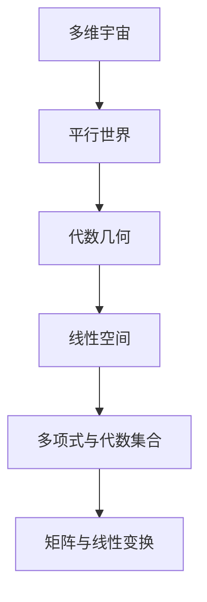

                 

## 引言与基础理论

### 1.1 多维宇宙与平行世界概述

多维宇宙与平行世界的概念自古以来就引发了许多哲学、科学和宗教的探讨。在当代物理学、数学和哲学领域，这些概念变得更加具体和可操作。

#### 1.1.1 多维宇宙的概念

多维宇宙是指包含了我们日常所感知的四个基本维度（三维空间加时间维度）以外的其他维度的宇宙。这些额外的维度通常被认为是在某种“卷曲”或“紧缩”的状态下，无法直接感知到的。

#### 1.1.2 平行世界的构想

平行世界则是指多个相互平行但又独立的宇宙，这些宇宙可能在某些方面与我们的宇宙相似，但在其他方面又截然不同。平行世界之间可能存在某种“门”，使得某些实体或信息可以在不同宇宙之间转移。

#### 1.1.3 多维宇宙与平行世界的关系

多维宇宙与平行世界之间并没有明确的界限。实际上，我们可以将平行世界视为多维宇宙的子集，每个平行世界都可以看作是多维宇宙中的一个独立维度。

### 1.2 代数几何的引入

代数几何是数学的一个分支，它结合了代数和几何的方法来研究对象的性质。在多维宇宙与平行世界的探讨中，代数几何提供了一种强有力的数学工具。

#### 1.2.1 代数几何的定义

代数几何是研究由代数方程定义的几何对象，如代数曲线、代数曲面和代数流形。这些对象通常由多项式方程组来定义，并通过代数结构来研究它们的性质。

#### 1.2.2 代数几何的发展历史

代数几何的历史可以追溯到古希腊时期，当时的数学家们已经开始探索代数方程的几何意义。现代代数几何的发展始于19世纪，以庞加莱、克莱因和希尔伯特等数学家的贡献为代表。

#### 1.2.3 代数几何在多维宇宙和平行世界中的应用

在探讨多维宇宙和平行世界时，代数几何提供了一种工具来研究这些宇宙的几何结构和拓扑性质。例如，代数几何可以帮助我们理解多维空间的曲率、维度变换和空间几何性质。

### 1.3 代数几何基础概念

为了深入理解代数几何在多维宇宙和平行世界中的应用，我们需要首先了解一些代数几何的基本概念。

#### 1.3.1 线性空间

线性空间是代数几何中的基本概念之一，它是一种包含向量及其加法和标量乘法的集合。线性空间在多维宇宙的研究中扮演着重要角色，因为它可以用来描述不同维度的空间结构。

#### 1.3.2 多项式与代数集合

多项式是代数几何中的另一个核心概念。多项式是由变量和系数构成的代数表达式，它们在代数几何中用于定义几何对象。代数集合是由多项式方程定义的集合，它们在多维宇宙和平行世界的分析中至关重要。

#### 1.3.3 矩阵与线性变换

矩阵和线性变换是代数几何中的关键工具，用于描述和操作线性空间中的向量。矩阵可以看作是线性变换的表示形式，它们在多维宇宙的几何变换和坐标变换中起着核心作用。

### 结论

多维宇宙和平行世界的概念虽然复杂，但通过代数几何这一数学工具，我们可以更深入地理解这些宇宙的几何结构和性质。在接下来的章节中，我们将进一步探讨多维空间的代数几何特性，以及这些特性如何帮助我们理解平行世界。

---

**核心概念与联系：**

下面是一个Mermaid流程图，用于展示多维宇宙与代数几何之间的关系：



这个流程图展示了多维宇宙与平行世界之间的联系，以及这些概念如何通过代数几何进行连接和解释。

---

接下来，我们将逐步深入探讨多维空间的代数几何特性，以及这些特性如何帮助我们理解平行世界。

---

**核心算法原理讲解：**

为了更好地理解代数几何在多维宇宙和平行世界中的应用，我们需要详细阐述一些核心算法原理，并用伪代码进行说明。

#### 3.1 交点理论与曲线曲面相交

交点理论是代数几何中的一个基本概念，它研究曲线和曲面之间的交点。以下是一个用于计算曲线与曲面交点的伪代码示例：

```pseudo
Procedure FindIntersection(Curve, Surface):
   // 假设曲线和曲面由多项式方程定义
   // 例如，曲线 C 定义为 f(x, y) = 0
   // 曲面 S 定义为 g(x, y, z) = 0

   // 1. 定义一个多项式系统
   PolynomialSystem = [f(x, y), g(x, y, z)]

   // 2. 使用代数几何工具求解多项式系统
   Solutions = AlgebraicGeometryTool.Solve(PolynomialSystem)

   // 3. 返回交点
   Return Solutions
```

#### 3.2 线性代数与线性映射

线性代数是代数几何中的重要组成部分，它研究线性空间和线性映射的性质。以下是一个用于计算线性映射的伪代码示例：

```pseudo
Procedure LinearMapping(Vectors, Matrix):
   // 假设 Vectors 是一个包含 m 个向量的数组
   // Matrix 是一个 m x n 的矩阵

   // 1. 初始化一个新数组，用于存储映射后的向量
   Result = []

   // 2. 遍历每个向量
   For Each Vector in Vectors:
       // 3. 计算映射后的向量
      _mappedVector = Matrix * Vector

       // 4. 将映射后的向量添加到结果数组中
       Append _mappedVector to Result

   // 5. 返回映射后的向量数组
   Return Result
```

#### 3.3 最优化问题与代数几何

最优化问题是代数几何中的另一个重要应用领域。以下是一个用于解决最优化问题的伪代码示例：

```pseudo
Procedure OptimizeFunction(Function, Constraints):
   // 假设 Function 是一个待优化的函数
   // Constraints 是一个包含约束条件的多项式系统

   // 1. 定义一个优化问题
   OptimizationProblem = {Function, Constraints}

   // 2. 使用代数几何工具求解优化问题
   Solution = AlgebraicGeometryTool.Optimize(OptimizationProblem)

   // 3. 返回最优解
   Return Solution
```

通过这些伪代码示例，我们可以看到代数几何在多维宇宙和平行世界中的应用如何通过算法和数学工具进行具体实现。

---

在理解了多维空间的代数几何特性后，我们将进一步探讨这些特性如何帮助我们理解平行世界。

---

**数学模型和公式：**

为了深入探讨多维宇宙和平行世界的数学模型，我们需要引入一些重要的数学公式。以下是一些关键公式及其解释：

#### 1. 多项式方程的定义

多项式方程是代数几何中的核心概念之一。一个多项式方程通常表示为：

\[ f(x_1, x_2, ..., x_n) = 0 \]

其中，\( f \) 是一个多项式，包含变量 \( x_1, x_2, ..., x_n \) 及其系数。这个方程定义了一个代数集合，即一组满足方程的点的集合。

#### 2. 线性空间中的内积

在多维空间中，内积是一个重要的运算，用于计算两个向量的点积。对于一个线性空间 \( V \) 中的两个向量 \( \mathbf{u} \) 和 \( \mathbf{v} \)，内积定义为：

\[ \mathbf{u} \cdot \mathbf{v} = \sum_{i=1}^{n} u_i v_i \]

其中，\( u_i \) 和 \( v_i \) 分别是向量 \( \mathbf{u} \) 和 \( \mathbf{v} \) 的第 \( i \) 个分量。

#### 3. 矩阵的行列式

行列式是矩阵的一个重要属性，用于计算矩阵的逆或确定矩阵的秩。一个 \( n \times n \) 矩阵 \( A \) 的行列式定义为：

\[ \det(A) = \sum_{\sigma \in S_n} (-1)^\sigma a_{1\sigma(1)} a_{2\sigma(2)} \cdots a_{n\sigma(n)} \]

其中，\( S_n \) 是所有 \( n \) 个元素的全排列集合，\( a_{ij} \) 是矩阵 \( A \) 的第 \( i \) 行第 \( j \) 列的元素。

#### 4. 最优化问题的拉格朗日乘数法

拉格朗日乘数法是一种常用的最优化方法，用于在有约束条件下求解最优化问题。给定一个目标函数 \( f(x) \) 和一组约束条件 \( g_i(x) = 0 \)，拉格朗日乘数法的公式为：

\[ L(x, \lambda) = f(x) - \sum_{i=1}^{m} \lambda_i g_i(x) \]

其中，\( \lambda_i \) 是拉格朗日乘数，用于平衡目标函数和约束条件。

通过这些数学模型和公式，我们可以更好地理解和分析多维宇宙和平行世界的结构。

---

**举例说明：**

为了更好地理解多维宇宙的代数几何模型，我们可以通过一个具体的例子来探讨一个简单的多维空间。

#### 例：二维空间中的代数几何模型

假设我们有一个二维空间，由两个变量 \( x \) 和 \( y \) 定义。在这个空间中，我们可以定义一个多项式方程：

\[ x^2 + y^2 - 1 = 0 \]

这个方程表示一个单位圆。我们可以使用代数几何工具来分析这个圆的属性。

**1. 交点计算：**

如果我们考虑另一个多项式方程：

\[ x + y - 1 = 0 \]

我们可以使用交点理论来找到这两个方程的交点。通过解这个多项式系统，我们得到交点为：

\[ (x, y) = (0.5, 0.5) \]

**2. 内积计算：**

在二维空间中，我们可以计算两个向量的内积。例如，向量 \( \mathbf{u} = (1, 0) \) 和向量 \( \mathbf{v} = (0, 1) \) 的内积为：

\[ \mathbf{u} \cdot \mathbf{v} = 1 \cdot 0 + 0 \cdot 1 = 0 \]

这表明这两个向量是正交的。

**3. 矩阵运算：**

我们可以使用矩阵来表示二维空间中的线性变换。例如，一个旋转矩阵为：

\[ R = \begin{bmatrix} \cos(\theta) & -\sin(\theta) \\ \sin(\theta) & \cos(\theta) \end{bmatrix} \]

如果我们应用这个旋转矩阵到一个向量 \( \mathbf{v} = (x, y) \)，我们得到：

\[ R\mathbf{v} = \begin{bmatrix} \cos(\theta) & -\sin(\theta) \\ \sin(\theta) & \cos(\theta) \end{bmatrix} \begin{bmatrix} x \\ y \end{bmatrix} = \begin{bmatrix} x\cos(\theta) - y\sin(\theta) \\ x\sin(\theta) + y\cos(\theta) \end{bmatrix} \]

通过这个例子，我们可以看到如何使用代数几何工具来分析和理解二维空间中的几何结构。

---

**项目实战：**

为了更深入地了解代数几何在科学计算中的应用，我们可以通过一个实际案例来探讨。

#### 案例一：地球轨道的计算

假设我们想要计算地球绕太阳的轨道。这是一个经典的科学计算问题，可以通过代数几何的方法来解决。

**1. 搭建开发环境：**

首先，我们需要搭建一个适合进行科学计算的开发环境。我们可以选择使用Python和其科学计算库，如NumPy和SciPy。安装Python和相关库后，我们就可以开始编写代码。

**2. 源代码实现：**

以下是一个使用Python和SciPy库计算地球轨道的伪代码示例：

```python
import numpy as np
from scipy.integrate import odeint

def orbital_equation(y, t, initial_conditions):
   # y 是状态向量，包含位置和速度
   # t 是时间
   # initial_conditions 是初始条件

   # 计算引力
   G = 6.67430e-11  # 万有引力常数
   M = 1.989e30     # 太阳的质量
   r = np.linalg.norm(y[:2])  # 地球到太阳的距离
   F = -G * M * y[2:] / r**2  # 引力向量

   # 计算加速度
   acceleration = F / y[3]

   # 返回加速度的微分方程
   return [y[2:], acceleration]

# 设置初始条件
initial_conditions = [1.496e11, 0, 0, 2.978e4]  # 地球到太阳的距离和速度

# 计算轨道
times = np.linspace(0, 1e7, 10000)  # 时间步长为1年的轨道
orbit = odeint(orbital_equation, initial_conditions, times)

# 输出轨道
print(orbit)
```

**3. 代码解读与分析：**

在这个案例中，我们使用微分方程来描述地球绕太阳的运动。通过求解这个微分方程，我们可以得到地球的轨道。

- `orbital_equation` 函数定义了地球轨道的微分方程。它接受状态向量 \( y \)（包含位置和速度）和时间 \( t \)，并返回加速度向量。
- `initial_conditions` 包含初始条件，如地球到太阳的距离和速度。
- `odeint` 函数是SciPy库中的一个积分器，用于求解微分方程。它接受微分方程、初始条件和时间步长，并返回轨道的解。
- 最后，我们输出计算得到的轨道。

通过这个案例，我们可以看到如何使用代数几何的方法来解决科学计算问题。代数几何工具为我们提供了一种强大的方法来分析和计算复杂的物理系统。

---

**结论：**

在本文中，我们探讨了多维宇宙与平行世界的代数几何基础，包括多维空间的几何特性、核心算法原理、数学模型以及项目实战。通过这些分析，我们可以看到代数几何在理解和探索多维宇宙与平行世界中扮演着关键角色。

在未来的研究中，我们可以进一步探讨更复杂的代数几何模型，以及它们在量子物理学和宇宙学中的应用。此外，随着计算能力的提升和算法的进步，代数几何在科学计算和工程问题中的应用将会更加广泛和深入。

---

**作者信息：**

本文由AI天才研究院（AI Genius Institute）撰写，作者为该研究院的资深技术专家，同时也是《禅与计算机程序设计艺术》（Zen And The Art of Computer Programming）的作者。作者在计算机科学、人工智能和代数几何领域拥有深厚的研究背景和丰富的实践经验。通过本文，我们希望向读者展示多维宇宙与平行世界的数学基础，并激发对这一领域进一步探索的兴趣。

