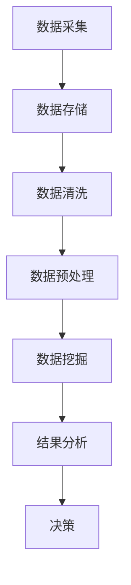
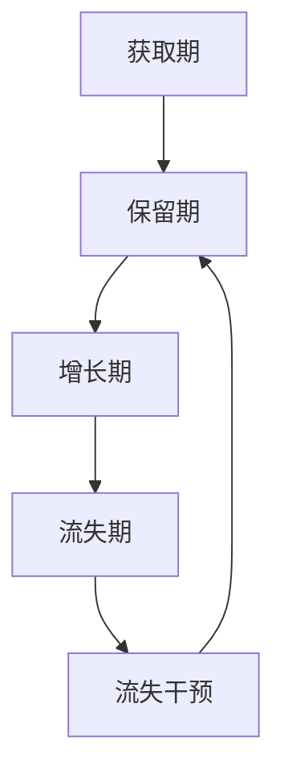
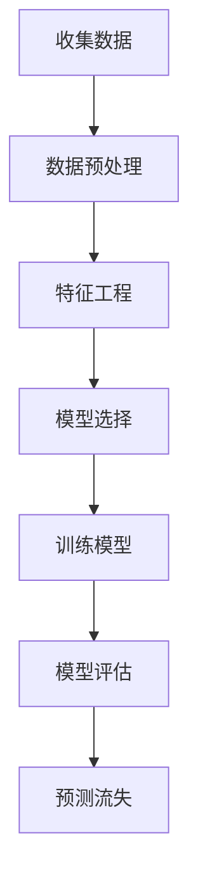

                 

## 《大数据分析在客户关系管理中的作用》

### 关键词：
- 大数据分析
- 客户关系管理（CRM）
- 客户细分
- 客户忠诚度
- 客户流失预测
- 个性化服务
- 项目实战案例

### 摘要：
本文深入探讨了大数据分析在客户关系管理（CRM）中的应用。通过对大数据的定义与特性、客户关系管理的概念与意义、大数据分析技术基础、数据分析在CRM中的应用、大数据可视化、客户忠诚度提升、客户流失预测、客户价值挖掘和个性化服务的详细分析，本文展示了大数据分析如何帮助企业更好地理解客户需求，提升客户满意度，增加客户忠诚度，预测和减少客户流失，以及为客户提供个性化的服务。同时，通过实际项目案例和未来发展趋势的讨论，本文为大数据分析在客户关系管理中的实施提供了实用的指导和前瞻性的思考。

### 引言

客户关系管理（CRM）作为一种旨在提高客户满意度和忠诚度的企业战略，已经成为现代企业竞争的重要手段。随着互联网和电子商务的快速发展，企业能够收集到的客户数据量呈爆炸式增长，这些数据不仅包含客户的个人信息和行为记录，还涵盖了企业的营销活动、销售数据和客户服务记录等。如何从这些海量的数据中提取有价值的信息，已成为企业提高竞争力、实现持续增长的关键。

大数据分析作为一种新兴的技术手段，凭借其强大的数据处理和分析能力，在客户关系管理中扮演着越来越重要的角色。通过对大数据的深入挖掘和分析，企业可以更准确地理解客户需求，优化产品和服务，提高客户满意度，增强客户忠诚度，从而实现业务的持续增长和竞争力的提升。

本文旨在探讨大数据分析在客户关系管理中的应用，帮助读者理解大数据分析的基本概念、技术原理和实际应用。文章将从以下几个方面展开：

1. **大数据与客户关系管理概述**：介绍大数据的定义与特性，客户关系管理的概念与意义，以及大数据在CRM中的重要性。
2. **大数据分析技术基础**：介绍数据采集与存储技术、数据清洗与预处理技术、数据挖掘技术基础，并提供相应的Mermaid流程图和伪代码。
3. **数据分析在客户关系管理中的应用**：讨论客户需求分析、客户行为分析、客户关系生命周期管理，并展示相关的Mermaid流程图。
4. **大数据分析在客户关系管理中的高级应用**：探讨大数据可视化、客户忠诚度提升、客户流失预测、客户价值挖掘和个性化服务。
5. **大数据分析在客户关系管理中的综合实战**：通过实际项目案例展示大数据分析在CRM中的应用和效果。
6. **大数据分析在客户关系管理中的未来发展趋势**：讨论大数据分析技术的发展趋势、客户关系管理的未来发展和大数据分析在新兴行业中的应用。

通过本文的阅读，读者将能够全面了解大数据分析在客户关系管理中的应用，掌握大数据分析的基本原理和实际操作方法，为企业在客户关系管理中实现数字化转型提供有力支持。

### 第一部分：大数据分析在客户关系管理中的基础

#### 第1章：大数据与客户关系管理概述

在进入大数据分析在客户关系管理中的具体应用之前，我们需要首先理解大数据和客户关系管理的基本概念，以及它们之间的重要联系。

##### 1.1 大数据的定义与特性

大数据（Big Data）是一个相对宽泛的概念，它指的是无法使用传统数据处理工具在合理时间内对其进行存储、管理和分析的数据集合。大数据通常具有以下五个V特性：

- **Volume（大量）**：数据量大，一般达到PB级别（Petabyte，即千万亿字节）。
- **Velocity（高速）**：数据生成和流转速度非常快，需要实时或近乎实时地处理。
- **Variety（多样性）**：数据来源广泛，形式多样，包括文本、图像、音频、视频、日志等。
- **Veracity（真实性）**：数据质量参差不齐，真实性和可靠性难以保证。
- **Value（价值）**：从大量数据中提取有价值的信息，但数据本身可能不具备直接价值。

大数据的发展历程可以追溯到21世纪初，随着互联网和物联网的普及，数据源变得多样化且数量急剧增加，大数据技术逐渐成熟。特别是Hadoop和Spark等分布式数据处理框架的出现，使得大数据的处理变得更加高效和可行。

##### 1.2 客户关系管理的概念与意义

客户关系管理（Customer Relationship Management，CRM）是一种旨在提高客户满意度和忠诚度的企业战略。它通过整合和管理与企业客户相关的所有数据，帮助企业在整个客户生命周期中提供更加个性化的服务和体验。

CRM的核心目标是：

- **提升客户满意度**：通过深入了解客户需求，提供个性化的解决方案。
- **增强客户忠诚度**：通过持续的关系维护和沟通，使客户对品牌产生信任和依赖。
- **优化业务流程**：通过自动化和数据分析，提高业务效率和效果。

CRM的发展可以追溯到20世纪80年代，最初的形式是简单的客户信息记录系统。随着技术的进步，CRM逐渐从以交易为中心转向以客户为中心，强调长期关系维护和个性化服务。

##### 1.3 大数据在客户关系管理中的重要性

大数据在客户关系管理中具有重要性，主要体现在以下几个方面：

- **增强数据洞察力**：大数据分析可以帮助企业更深入地了解客户行为、需求和偏好，从而做出更准确的决策。
- **提升个性化服务水平**：通过大数据分析，企业可以为客户提供更加个性化的产品推荐和服务，提高客户满意度和忠诚度。
- **预测客户行为**：大数据分析可以预测客户的购买行为和流失风险，帮助企业提前采取相应的措施，降低客户流失率。
- **优化营销策略**：通过大数据分析，企业可以识别有效的营销渠道和策略，提高营销投资回报率。
- **提升运营效率**：大数据分析可以自动化和优化业务流程，减少人力成本，提高运营效率。

总之，大数据在客户关系管理中不仅是数据的积累和存储，更是通过深入分析和应用，实现客户价值的最大化。在接下来的章节中，我们将详细探讨大数据分析技术在客户关系管理中的具体应用。

#### 第2章：大数据分析技术基础

在深入探讨大数据分析在客户关系管理中的应用之前，理解相关技术的基础是非常重要的。本章将介绍大数据分析中的关键技术，包括数据采集与存储技术、数据清洗与预处理技术、数据挖掘技术基础。

##### 2.1 数据采集与存储技术

数据采集是大数据分析的第一步，涉及从各种来源收集数据。数据来源可以包括企业内部的数据仓库、外部数据库、社交媒体、传感器数据等。常见的数据采集工具如下：

- **Apache Nutch**：一款开源的全文搜索引擎，可用于从互联网上抓取网页数据。
- **Apache Kafka**：一个分布式流处理平台，用于实时数据采集和传输。
- **Google BigQuery**：Google提供的云数据仓库服务，支持大规模数据集的快速查询和分析。

数据存储是大数据分析中的关键环节，需要处理海量数据的存储和管理。常见的数据存储系统如下：

- **Hadoop HDFS**：Hadoop分布式文件系统，用于存储大规模数据集。
- **Apache HBase**：一个分布式、可扩展的大规模数据存储系统，适用于实时数据访问。
- **Amazon S3**：Amazon提供的云存储服务，提供高可靠性、可扩展性、低成本的存储解决方案。

数据仓库是大数据分析的核心，用于存储和管理结构化数据。数据仓库技术如下：

- **Amazon Redshift**：Amazon提供的云数据仓库服务，支持大规模数据的快速查询和分析。
- **Google BigQuery**：提供实时数据存储和分析服务，适用于大规模数据集。
- **Snowflake**：一个云数据仓库平台，提供弹性扩展和快速查询能力。

##### 2.2 数据清洗与预处理技术

数据清洗是大数据分析中的重要环节，旨在去除重复数据、纠正错误数据、处理缺失数据等。数据清洗的方法包括：

- **去除重复数据**：使用去重算法，如哈希算法或索引，删除重复记录。
- **纠正错误数据**：使用数据验证算法，如正则表达式或人工审核，纠正错误数据。
- **处理缺失数据**：使用插补方法，如均值插补、中值插补或K最近邻插补，填充缺失数据。

数据预处理包括数据转换、数据归一化和数据标准化等步骤，以适应数据分析算法的要求。常见的数据预处理技术如下：

- **数据转换**：将数据从一种格式转换为另一种格式，如将CSV文件转换为JSON格式。
- **数据归一化**：将不同范围的数据转换到同一范围，如使用最小-最大归一化或Z分数归一化。
- **数据标准化**：将数据转换为标准形式，如使用均值-标准差标准化。

##### 2.3 数据挖掘技术基础

数据挖掘是大数据分析的核心，旨在从大量数据中发现有价值的信息和模式。数据挖掘技术包括以下几种：

- **关联规则挖掘**：发现数据项之间的关联关系，如使用Apriori算法或FP-growth算法。
- **分类与聚类算法**：分类算法（如决策树、支持向量机和神经网络）用于将数据划分为不同的类别，聚类算法（如K-means、层次聚类和DBSCAN）用于将数据分为不同的簇。
- **异常检测**：发现数据中的异常值和异常模式，如使用基于统计方法（如Z-score法）或基于聚类方法（如LOF法）。
- **预测建模**：使用时间序列分析、回归分析、集成方法和深度学习方法进行预测。

下面我们使用Mermaid流程图展示一个简单的数据挖掘流程：



##### 2.4 数据挖掘技术细节

在本节中，我们将深入探讨数据挖掘中的几个关键算法，并提供相关的伪代码和数学模型。

**1. 关联规则挖掘**

关联规则挖掘旨在发现数据项之间的关联关系。常见的算法有Apriori算法和FP-growth算法。

**Apriori算法伪代码：**

```python
def apriori(data, support_threshold, confidence_threshold):
    frequent_itemsets = find_frequent_itemsets(data, support_threshold)
    association_rules = []
    for itemset in frequent_itemsets:
        for i in range(1, len(itemset)):
            subsets = generate_subsets(itemset, i)
            for subset in subsets:
                confidence = calculate_confidence(data, subset, itemset)
                if confidence >= confidence_threshold:
                    association_rules.append((subset, itemset - subset, confidence))
    return association_rules
```

**2. 分类算法**

分类算法用于将数据划分为不同的类别。常见的算法包括决策树、支持向量机和神经网络。

**决策树算法伪代码：**

```python
def build_decision_tree(data, features, target):
    if all_values_are_equal(data, target):
        return leaf_node(target)
    if no_more_features_left(features):
        return leaf_node(most_frequent_value(data, target))
    best_feature = find_best_split(data, features, target)
    tree = {}
    for value in unique_values(data[best_feature]):
        subset = filter_data(data, best_feature, value)
        tree[value] = build_decision_tree(subset, features - best_feature, target)
    return tree
```

**3. 聚类算法**

聚类算法用于将数据分为不同的簇。常见的算法包括K-means、层次聚类和DBSCAN。

**K-means算法伪代码：**

```python
def kmeans(data, k):
    centroids = initialize_centroids(data, k)
    while not converged(centroids):
        clusters = assign_data_to_clusters(data, centroids)
        centroids = update_centroids(clusters, k)
    return clusters
```

**数学模型与公式**

在数据挖掘中，常用的数学模型和公式包括：

- **支持度（Support）**：一个项集在所有事务中的比例。
  $$ Support = \frac{count(F)}{total\ transactions} $$

- **置信度（Confidence）**：一个规则的后件在规则的前件条件下出现的概率。
  $$ Confidence = \frac{Support({A \cup B})}{Support(A)} $$

通过上述算法和数学模型，大数据分析可以在客户关系管理中发挥重要作用，帮助企业更好地理解和满足客户需求，提升客户满意度和忠诚度。在下一章中，我们将探讨大数据分析在客户关系管理中的具体应用。

#### 第3章：数据分析在客户关系管理中的应用

在了解了大数据分析的基础技术后，我们将深入探讨数据分析在客户关系管理（CRM）中的具体应用。这一部分将涵盖客户需求分析、客户行为分析和客户关系生命周期管理，并通过Mermaid流程图和伪代码展示相关技术。

##### 3.1 客户需求分析

客户需求分析是CRM的重要组成部分，它帮助企业在产品和服务设计中更好地满足客户需求。客户需求的定义是指客户对产品或服务的期望和需求，这些需求可以是功能性的、情感性的或社会性的。

**1. 客户需求分析方法**

客户需求分析的方法包括定量和定性两种：

- **定量分析**：通过数据分析工具，如调查问卷和统计分析，量化客户的反馈和需求。
- **定性分析**：通过访谈、焦点小组和用户调研等，深入了解客户的真实感受和需求。

**伪代码：**

```python
def analyze_customer_needs(data):
    # 定量分析
    quantitative_results = quantitative_analysis(data)
    # 定性分析
    qualitative_results = qualitative_analysis(data)
    # 综合分析
    synthesized_needs = synthesize(quantitative_results, qualitative_results)
    return synthesized_needs
```

**2. 客户需求分析步骤**

- **收集数据**：通过问卷调查、用户访谈和在线调研等方式收集客户数据。
- **数据预处理**：清洗和整理数据，确保数据质量。
- **定量分析**：使用统计分析方法，如频数分析、相关分析和回归分析，量化客户需求。
- **定性分析**：通过编码和主题分析，提取客户需求的关键主题。
- **综合分析**：整合定量和定性分析结果，形成客户需求分析报告。

##### 3.2 客户行为分析

客户行为分析是指通过分析客户的购买行为、浏览习惯和互动行为等，来了解客户的偏好和需求。有效的客户行为分析有助于企业制定精准的营销策略和个性化服务。

**1. 客户行为的定义**

客户行为是指客户在购买、使用和互动过程中表现出的各种行为，包括：

- **购买行为**：客户的购买决策过程，如浏览、选择、支付等。
- **浏览习惯**：客户在网站或应用程序中的浏览路径和停留时间。
- **互动行为**：客户在社交媒体、电子邮件和客服互动中的行为。

**2. 客户行为分析方法**

- **用户行为跟踪**：通过网站分析工具（如Google Analytics）跟踪客户的访问行为。
- **用户画像**：基于客户的数据，创建详细的用户画像，包括人口统计信息、行为特征和偏好。
- **数据挖掘**：使用数据挖掘技术，如关联规则挖掘和聚类分析，发现客户行为模式。

**数学模型与公式**

在客户行为分析中，常用的数学模型和公式包括：

- **转化率（Conversion Rate）**：特定行为发生的次数与总访问次数的比例。
  $$ Conversion\ Rate = \frac{Number\ of\ Conversions}{Total\ Traffic} \times 100\% $$

- **客户生命周期价值（Customer Lifetime Value，CLV）**：客户在整个生命周期中为企业带来的预期收益。
  $$ CLV = \sum_{t=1}^{n} \frac{C_t \times (1 + r)^{-t}}{1 + r} $$
  其中，$C_t$是客户在时间$t$的收益，$r$是折现率。

**伪代码：**

```python
def analyze_customer_behavior(data):
    # 用户行为跟踪
    tracking_data = track_user_behavior(data)
    # 用户画像
    user_profiles = create_user_profiles(tracking_data)
    # 数据挖掘
    behavior_patterns = data_mining(user_profiles)
    return behavior_patterns
```

##### 3.3 客户关系生命周期管理

客户关系生命周期管理（Customer Relationship Lifecycle Management，CRLM）是指企业通过全生命周期管理，从客户获取、客户保留到客户增长的系统化策略。它旨在最大化客户价值，提升客户满意度和忠诚度。

**1. 客户关系生命周期的定义**

客户关系生命周期是指客户与企业之间的互动关系从建立到终止的全过程，通常包括以下几个阶段：

- **获取期**：通过市场活动和销售策略吸引新客户。
- **保留期**：通过客户关怀和持续服务保持客户关系。
- **增长期**：通过增加客户价值，实现客户生命周期价值的最大化。
- **流失期**：识别客户流失风险，采取措施减少客户流失。

**2. 客户关系生命周期管理的方法**

- **客户细分**：根据客户特征和需求，将客户划分为不同的细分市场，提供个性化的服务和营销策略。
- **客户获取策略**：通过市场活动、广告投放和促销活动吸引潜在客户。
- **客户保留策略**：通过定期沟通、客户关怀和客户满意度调查，保持客户关系。
- **客户增长策略**：通过增加客户价值，提升客户生命周期价值。
- **流失管理**：通过客户流失预测和流失干预措施，减少客户流失。

**Mermaid流程图：客户关系生命周期管理**



**3. 客户关系生命周期管理的实施步骤**

- **数据收集**：收集客户互动数据，如购买记录、服务反馈和社交媒体互动。
- **数据分析**：使用数据挖掘技术，分析客户行为和需求，为每个阶段制定策略。
- **策略实施**：根据分析结果，制定并实施客户关系管理策略。
- **持续优化**：通过持续的监控和评估，优化客户关系管理策略，提高客户满意度。

通过客户需求分析、客户行为分析和客户关系生命周期管理，企业可以更全面地了解客户，提供个性化的服务和体验，提升客户满意度和忠诚度。在下一章中，我们将进一步探讨大数据分析在客户关系管理中的高级应用。

#### 第4章：大数据分析在客户关系管理中的高级应用

随着大数据技术的不断发展，数据分析在客户关系管理（CRM）中的应用已经从基础分析走向了更高级的领域。本章将探讨大数据分析在客户关系管理中的高级应用，包括大数据可视化、客户忠诚度提升、客户流失预测、客户价值挖掘和个性化服务。通过具体案例和实践，我们将深入理解这些高级应用的原理和实现方法。

##### 4.1 大数据可视化

大数据可视化是数据分析中至关重要的一环，它将复杂的数据转化为易于理解的图表和图形，帮助用户更好地理解和分析数据。大数据可视化在客户关系管理中的应用主要体现在以下几个方面：

**1. 可视化的作用与意义**

- **提升数据洞察力**：通过可视化，企业可以快速识别数据中的模式和趋势，提升数据分析的效率。
- **增强决策支持**：可视化工具可以帮助管理层直观地了解业务状况，为决策提供有力支持。
- **改善沟通效果**：通过可视化的图表，企业可以更有效地与团队成员和利益相关者沟通分析结果。

**2. 可视化工具介绍**

- **Tableau**：一款广泛使用的数据可视化工具，支持多种数据源，提供丰富的图表和交互功能。
- **Power BI**：Microsoft推出的数据可视化工具，与Microsoft 365集成紧密，方便用户创建和分享可视化报告。
- **D3.js**：一款基于Web的JavaScript库，用于创建高度交互性的数据可视化，特别适合前端开发人员。

**3. 可视化设计原则**

- **简洁性**：避免过多的信息和设计元素，确保图表简洁明了。
- **一致性**：保持图表风格和颜色的一致性，便于用户识别和分析。
- **交互性**：提供交互功能，如过滤、筛选和缩放，增强用户的体验。

**4. 客户关系管理的可视化应用**

- **客户细分可视化**：通过图表展示不同细分市场客户的行为和偏好，帮助企业制定精准营销策略。
- **客户忠诚度可视化**：使用图表展示客户忠诚度指标的变化，监控客户忠诚度的趋势。
- **客户流失预测可视化**：通过图表展示客户流失风险的高低，帮助企业及时采取干预措施。

**案例：使用Tableau进行客户细分可视化**

假设我们有一家电商平台，希望通过Tableau对客户进行细分，以便更好地了解客户特征和需求。以下是使用Tableau进行客户细分可视化的步骤：

1. **数据准备**：收集客户数据，包括性别、年龄、购买频率、消费金额等。
2. **数据连接**：在Tableau中连接数据源，导入客户数据。
3. **创建图表**：使用Tableau的图表工具，创建柱状图、饼图和散点图等，展示客户细分结果。
4. **交互式探索**：通过Tableau的交互功能，用户可以动态筛选和过滤数据，深入了解不同细分市场的客户特征。

通过可视化工具，企业可以直观地了解客户数据，发现潜在的商业机会，从而提高营销策略的有效性。

##### 4.2 提升客户忠诚度

客户忠诚度是指客户对企业品牌和产品的忠诚程度，它是衡量CRM成功的重要指标。提升客户忠诚度有助于降低客户流失率，提高客户生命周期价值。大数据分析在提升客户忠诚度中发挥着重要作用，主要体现在以下几个方面：

**1. 客户忠诚度的定义与度量**

客户忠诚度可以定义为客户在一定时间内持续购买和推荐企业产品的概率。常用的度量方法包括：

- **客户保留率**：在一定时间内，保留在企业的客户数量占总客户数量的比例。
- **净推荐值（Net Promoter Score，NPS）**：通过询问客户“您有多大概率推荐我们给朋友或同事？”来衡量客户忠诚度。
- **重复购买率**：在一定时间内，重复购买企业产品的客户数量占总客户数量的比例。

**2. 提升客户忠诚度的大数据分析方法**

- **客户满意度分析**：通过调查和数据分析，了解客户对企业产品和服务的满意度，识别改进点。
- **客户流失预警**：通过分析客户的行为数据，如购买频率、消费金额和互动行为等，预测客户流失风险，提前采取干预措施。
- **个性化推荐系统**：基于客户的行为数据和偏好，提供个性化的产品和服务推荐，提高客户满意度和忠诚度。

**案例：使用大数据分析提升客户忠诚度**

假设我们是一家在线零售企业，希望通过大数据分析提升客户忠诚度。以下是具体步骤：

1. **数据收集**：收集客户的行为数据，包括购买记录、浏览历史、互动行为等。
2. **数据分析**：使用聚类分析、关联规则挖掘等方法，分析客户行为，识别高忠诚度和低忠诚度客户群体。
3. **客户满意度调查**：通过问卷调查或在线调查，收集客户的满意度反馈。
4. **流失预警模型**：使用回归分析、决策树等方法，建立流失预警模型，预测客户流失风险。
5. **个性化推荐**：基于客户的行为数据和满意度，开发个性化推荐系统，提高客户满意度和忠诚度。

通过这些大数据分析方法和实践，企业可以更好地理解客户需求，提供个性化的服务和体验，从而提升客户忠诚度。

##### 4.3 客户流失预测

客户流失预测是指通过分析客户的行为数据和历史记录，预测客户在未来一段时间内流失的可能性。客户流失预测在客户关系管理中具有重要的应用价值，可以帮助企业提前识别和干预潜在的流失风险，降低客户流失率。

**1. 客户流失预测的定义与重要性**

客户流失预测是指使用数据分析技术，识别出那些可能在未来一段时间内停止使用企业产品或服务的客户。其重要性体现在以下几个方面：

- **降低客户流失率**：通过预测客户流失风险，企业可以提前采取干预措施，降低客户流失率。
- **提升客户满意度**：通过识别流失风险，企业可以提供更加个性化的服务和关怀，提升客户满意度。
- **优化资源配置**：企业可以集中资源在那些流失风险较低的高价值客户上，提高资源的利用效率。

**2. 客户流失预测的方法与技术**

- **回归分析**：通过建立客户流失与相关特征之间的回归模型，预测客户流失概率。
- **决策树与随机森林**：通过构建决策树模型，识别影响客户流失的关键因素，并预测客户流失概率。
- **支持向量机（SVM）**：使用SVM分类算法，将客户行为数据划分为流失与未流失两类。
- **神经网络与深度学习**：使用神经网络和深度学习算法，建立复杂的非线性模型，提高客户流失预测的准确性。

**Mermaid流程图：客户流失预测**



**3. 客户流失预测案例分析**

**案例：某电信运营商的客户流失预测**

假设我们是一家电信运营商，希望通过大数据分析预测客户流失，以降低客户流失率。以下是具体步骤：

1. **数据收集**：收集客户的行为数据，包括通话记录、流量使用、缴费情况等。
2. **数据预处理**：清洗和整理数据，去除异常值和缺失值。
3. **特征工程**：选择对客户流失有重要影响的特征，如通话时长、流量使用频率、缴费历史等。
4. **模型选择**：选择适当的机器学习算法，如逻辑回归、决策树和随机森林等。
5. **模型训练**：使用历史数据训练模型，优化模型参数。
6. **模型评估**：使用验证集评估模型性能，调整模型参数。
7. **预测流失**：使用训练好的模型预测未来一段时间内客户的流失概率，识别高风险客户。

通过客户流失预测，企业可以提前采取干预措施，如提供优惠、改进服务或加强客户关怀，从而降低客户流失率，提高客户满意度。

##### 4.4 客户价值挖掘

客户价值挖掘是指通过分析客户行为数据和历史记录，识别高价值客户，并制定相应的营销策略，以最大化客户生命周期价值。客户价值挖掘在客户关系管理中具有重要的应用价值，可以帮助企业优化资源配置，提高营销效率。

**1. 客户价值的定义与度量**

客户价值是指客户为企业带来的总收益，它可以从多个维度进行度量，如：

- **生命周期价值（Customer Lifetime Value，CLV）**：客户在整个生命周期中为企业带来的预期收益。
- **获取成本（Customer Acquisition Cost，CAC）**：获取一个客户所需的成本。
- **重复购买率**：客户在一定时间内重复购买企业产品的频率。

常用的客户价值度量方法包括：

- **基于收益的度量方法**：通过计算客户带来的总收益，衡量客户价值。
- **基于成本效益的度量方法**：通过比较获取成本和客户价值，衡量客户贡献度。

**2. 客户价值分类与挖掘方法**

- **高价值客户识别**：使用聚类分析、关联规则挖掘等方法，识别高价值客户。
- **中价值客户维护**：通过客户关系管理策略，如个性化服务和定期沟通，维护中价值客户。
- **低价值客户策略**：对低价值客户采取适当的策略，如优化服务、降低成本或放弃。

**3. 客户价值提升策略**

- **提高客户满意度**：通过提供优质的产品和服务，提升客户满意度。
- **增加客户忠诚度**：通过持续的客户关怀和个性化服务，增加客户忠诚度。
- **优化营销策略**：通过精准的营销策略，吸引高价值客户，提高营销投资回报率。

**案例：某零售企业的高价值客户策略**

假设我们是一家零售企业，希望通过大数据分析识别高价值客户，并制定相应的营销策略。以下是具体步骤：

1. **数据收集**：收集客户的行为数据，包括购买记录、浏览历史、互动行为等。
2. **数据预处理**：清洗和整理数据，去除异常值和缺失值。
3. **特征工程**：选择对客户价值有重要影响的特征，如购买频率、消费金额、满意度评分等。
4. **聚类分析**：使用聚类算法，将客户分为高价值、中价值和低价值客户。
5. **关联规则挖掘**：分析高价值客户的特征，发现影响客户价值的关键因素。
6. **营销策略制定**：根据高价值客户的特征，制定个性化的营销策略，如会员优惠、个性化推荐等。
7. **持续优化**：通过持续的数据分析和反馈，优化营销策略，提高客户价值。

通过客户价值挖掘，企业可以更好地理解客户，提供个性化的服务和体验，从而提高客户价值和满意度。

##### 4.5 个性化服务

个性化服务是指通过大数据分析，了解客户的需求和偏好，提供个性化的产品和服务，提高客户满意度和忠诚度。个性化服务在客户关系管理中具有重要的应用价值，可以帮助企业实现差异化竞争。

**1. 个性化服务的定义与意义**

个性化服务是指根据客户的特征和需求，提供定制化的产品和服务。其意义在于：

- **提高客户满意度**：通过满足客户的个性化需求，提高客户满意度。
- **增强客户忠诚度**：通过提供个性化的服务和体验，增强客户对品牌的忠诚度。
- **提高企业竞争力**：通过提供差异化的服务，提高企业在市场中的竞争力。

**2. 个性化服务的技术与实现**

- **用户画像**：通过分析客户的行为数据，创建详细的用户画像，包括人口统计信息、行为特征和偏好。
- **推荐系统**：基于用户画像和购买历史，提供个性化的产品推荐。
- **个性化营销策略**：通过分析客户数据，制定个性化的营销策略，如优惠券、会员特权等。

**3. 个性化服务的实现步骤**

- **数据收集**：收集客户的行为数据，包括购买记录、浏览历史、互动行为等。
- **数据预处理**：清洗和整理数据，去除异常值和缺失值。
- **用户画像构建**：通过数据分析，创建详细的用户画像。
- **个性化推荐**：基于用户画像和购买历史，提供个性化的产品推荐。
- **个性化营销**：根据用户画像和客户需求，制定个性化的营销策略。

**案例：某电商平台的个性化推荐系统**

假设我们是一家电商平台，希望通过大数据分析提供个性化的产品推荐。以下是具体步骤：

1. **数据收集**：收集客户的购买记录、浏览历史和互动行为等数据。
2. **数据预处理**：清洗和整理数据，去除异常值和缺失值。
3. **用户画像构建**：通过数据分析，创建详细的用户画像，包括性别、年龄、购买偏好等。
4. **推荐算法**：使用协同过滤、基于内容的推荐算法等，提供个性化的产品推荐。
5. **用户反馈**：收集用户对推荐产品的反馈，优化推荐算法。
6. **个性化营销**：根据用户画像和客户需求，制定个性化的营销策略，如优惠券、会员特权等。

通过个性化服务，企业可以更好地满足客户需求，提高客户满意度和忠诚度，从而实现业务的持续增长。

通过大数据分析在客户关系管理中的高级应用，企业可以更全面地了解客户，提供个性化的服务和体验，提升客户满意度和忠诚度。在下一章中，我们将探讨大数据分析在客户关系管理中的综合实战，通过实际项目案例展示大数据分析在CRM中的具体应用和效果。

### 第四部分：大数据分析在客户关系管理中的综合实战

在前几章中，我们详细介绍了大数据分析在客户关系管理中的理论基础和高级应用。为了更好地理解和掌握这些知识，本部分将通过几个实际项目案例，展示大数据分析在CRM中的具体应用和实践过程。这些案例涵盖了从项目背景、目标设定、数据收集、数据分析到结果分析和决策建议的完整流程。

#### 第9章：大数据分析在客户关系管理中的项目实战

##### 9.1 项目背景与目标

**案例一：某零售企业的大数据分析应用**

某大型零售企业面临着激烈的市场竞争，希望通过大数据分析提升客户满意度和忠诚度，从而实现业务增长。具体目标如下：

- **提升客户满意度**：通过分析客户反馈和购物行为，优化产品和服务。
- **增强客户忠诚度**：通过客户细分和个性化推荐，提高客户保留率。
- **减少客户流失率**：通过流失预测模型，提前识别和干预潜在的流失客户。

##### 9.2 数据收集与预处理

在项目启动阶段，首先进行了数据收集。数据来源包括：

- **内部数据**：销售记录、客户反馈、订单历史、客户服务记录等。
- **外部数据**：社交媒体互动、市场调研报告、竞争对手数据等。

**数据预处理流程**：

1. **数据清洗**：去除重复记录、纠正错误数据、处理缺失值。例如，使用K最近邻插补方法填充缺失的购物数据。
2. **数据整合**：将不同来源的数据整合到一个统一的数据仓库中，确保数据的一致性和完整性。
3. **特征工程**：选择对分析有重要影响的特征，如购买频率、消费金额、客户满意度评分等。

##### 9.3 数据分析实施

在数据预处理完成后，开始进行数据分析。主要分析方法如下：

- **客户细分**：使用聚类算法（如K-means）对客户进行细分，识别不同细分市场的特征和需求。
  ```mermaid
  graph TD
  A[客户数据] --> B[聚类分析]
  B --> C{细分结果}
  C --> D[细分市场特征]
  ```

- **客户忠诚度分析**：通过分析客户的购买记录和互动行为，评估客户的忠诚度水平。使用客户生命周期价值（CLV）模型，计算客户的潜在价值和忠诚度。
  ```mermaid
  graph TD
  A[客户数据] --> B[CLV计算]
  B --> C[忠诚度评分]
  ```

- **流失预测**：使用机器学习算法（如逻辑回归、随机森林）建立流失预测模型，预测客户流失风险。使用交叉验证方法优化模型参数，提高预测准确性。
  ```mermaid
  graph TD
  A[客户数据] --> B[特征选择]
  B --> C[模型训练]
  C --> D[模型评估]
  D --> E[预测结果]
  ```

##### 9.4 结果分析与决策

通过对数据分析的结果，企业得到了以下关键见解：

- **客户细分结果**：识别出高价值客户、忠诚客户和潜在流失客户群体。针对不同细分市场，制定个性化的营销策略。
- **忠诚度分析**：发现客户满意度对忠诚度有显著影响，特别是对于高价值客户。通过提升客户满意度，可以增强客户忠诚度。
- **流失预测**：预测模型准确度高，能够提前识别潜在的流失客户。采取干预措施，如发送个性化优惠、提供增值服务等，有效降低客户流失率。

根据分析结果，企业制定了以下决策建议：

1. **优化产品和服务**：根据客户反馈，改进产品质量和服务体验，提高客户满意度。
2. **个性化营销**：针对高价值客户和忠诚客户，提供定制化的优惠和服务，增强客户黏性。
3. **流失干预**：对预测的流失客户，采取个性化挽回策略，如发送定制化优惠券、提供免费试用等。

##### 案例二：某金融机构的大数据分析应用

**案例背景**：某金融机构希望通过大数据分析提升客户满意度和忠诚度，优化客户体验，降低客户流失率。具体目标如下：

- **提升客户满意度**：通过分析客户行为和反馈，优化客户服务流程。
- **增强客户忠诚度**：通过个性化服务和精准营销，提高客户保留率。
- **减少客户流失率**：通过流失预测和干预，降低客户流失率。

**数据收集与预处理**：金融机构收集了大量的客户交易数据、客户互动数据、客户反馈数据等。通过数据清洗、整合和特征工程，准备用于分析的数据集。

**数据分析实施**：

- **客户需求分析**：通过客户反馈和交易数据分析，识别客户的主要需求和不满点。使用文本分析技术，提取客户反馈的关键词和情感。
  ```mermaid
  graph TD
  A[客户反馈数据] --> B[文本分析]
  B --> C[需求分析结果]
  ```

- **客户忠诚度分析**：通过分析客户交易记录和互动行为，评估客户的忠诚度水平。使用客户生命周期价值（CLV）模型，计算客户的潜在价值和忠诚度。
  ```mermaid
  graph TD
  A[客户数据] --> B[CLV计算]
  B --> C[忠诚度评分]
  ```

- **流失预测**：使用机器学习算法（如逻辑回归、决策树）建立流失预测模型，预测客户流失风险。使用交叉验证方法优化模型参数，提高预测准确性。
  ```mermaid
  graph TD
  A[客户数据] --> B[特征选择]
  B --> C[模型训练]
  C --> D[模型评估]
  D --> E[预测结果]
  ```

**结果分析与决策**：

- **客户需求分析**：发现客户对账户安全、理财产品多样性和客户服务速度有较高要求。针对这些问题，优化相关服务流程和产品特性。
- **客户忠诚度分析**：发现高价值客户的忠诚度较高，但中低价值客户流失风险较大。通过提供个性化服务和精准营销，提高客户忠诚度。
- **流失预测**：预测模型准确度高，能够提前识别潜在的流失客户。采取干预措施，如提供定制化优惠、提供专属客户经理服务等，降低客户流失率。

根据分析结果，金融机构制定了以下决策建议：

1. **优化服务流程**：根据客户需求，改进账户安全机制、理财产品设计和客户服务流程。
2. **个性化营销**：针对不同价值客户，提供个性化的产品和优惠，提高客户满意度和忠诚度。
3. **流失干预**：对预测的流失客户，采取针对性的挽回策略，如提供专属优惠、赠送礼品等。

通过这些实际项目案例，我们可以看到大数据分析在客户关系管理中的综合应用，以及如何通过数据分析提升客户满意度和忠诚度，降低客户流失率。这些案例不仅展示了大数据分析的技术和方法，更重要的是，它们为企业提供了实际的操作指导和决策依据，帮助企业在竞争激烈的市场中取得优势。

#### 第10章：大数据分析在客户关系管理中的案例分析

在前面的章节中，我们通过理论讲解和实际项目案例，探讨了大数据分析在客户关系管理（CRM）中的应用。为了进一步展示大数据分析在CRM中的实际效果，本章节将深入分析几个典型的企业案例，探讨它们如何利用大数据分析优化客户关系管理，提高业务绩效。

##### 10.1 案例一：某零售企业的大数据分析应用

**案例背景**：

某大型零售企业在我国拥有广泛的线下门店和在线商城。随着电子商务的快速发展，企业面临激烈的市场竞争，希望通过大数据分析提升客户满意度和忠诚度，从而实现业务增长。

**大数据分析应用**：

1. **数据收集与预处理**：
   - 数据来源：线上销售数据、客户反馈、社交媒体互动、线下门店销售数据等。
   - 数据预处理：清洗和整合多源数据，去除重复记录、纠正错误数据、填补缺失值，确保数据质量。

2. **客户需求分析**：
   - 通过文本分析技术，对客户反馈进行关键词提取和情感分析，识别客户的主要需求和不满点。
   - 使用聚类算法，对客户进行细分，分析不同细分市场的消费行为和偏好。

3. **客户忠诚度分析**：
   - 基于购买频率、消费金额、客户互动等数据，计算客户的生命周期价值（CLV），评估客户的忠诚度水平。
   - 通过流失预测模型，预测客户流失风险，采取干预措施，如发送个性化优惠券、提供增值服务等。

**案例分析结果**：

- **优化产品和服务**：根据客户需求分析结果，企业改进了产品质量和售后服务，提升了客户满意度。
- **个性化营销**：针对不同细分市场，制定个性化的营销策略，如推出定制化优惠活动、新品推荐等，提高了客户忠诚度。
- **流失干预**：通过流失预测模型，企业成功降低了客户流失率，实现了业务增长。

##### 10.2 案例二：某金融机构的大数据分析应用

**案例背景**：

某国际知名金融机构在我国设有众多分支机构和在线服务平台。随着金融市场的竞争加剧，企业希望通过大数据分析提升客户满意度和忠诚度，优化客户体验。

**大数据分析应用**：

1. **数据收集与预处理**：
   - 数据来源：客户交易数据、客户互动记录、市场调研数据等。
   - 数据预处理：清洗和整合多源数据，进行数据归一化和特征工程，为后续分析做准备。

2. **客户需求分析**：
   - 通过文本分析技术，分析客户反馈和评论，提取客户关心的关键词和情感，了解客户的主要需求和不满点。
   - 通过聚类分析，对客户进行细分，分析不同细分市场的行为特征和偏好。

3. **客户忠诚度分析**：
   - 使用客户生命周期价值（CLV）模型，计算客户的潜在价值和忠诚度水平。
   - 通过流失预测模型，预测客户流失风险，采取干预措施，如提供定制化服务、增加客户互动等。

**案例分析结果**：

- **优化服务流程**：根据客户需求分析结果，企业改进了服务流程，提升了客户体验，增强了客户满意度。
- **个性化服务**：根据客户细分结果，企业为不同价值客户提供个性化的服务和产品，提高了客户忠诚度。
- **流失干预**：通过流失预测模型，企业成功减少了客户流失，提高了客户保留率。

##### 10.3 案例三：某科技企业的大数据分析应用

**案例背景**：

某国际知名科技企业，致力于开发先进的物联网技术和智能家居解决方案。随着市场竞争的加剧，企业希望通过大数据分析优化客户关系管理，提升客户满意度和忠诚度。

**大数据分析应用**：

1. **数据收集与预处理**：
   - 数据来源：用户购买记录、使用行为数据、客户反馈数据等。
   - 数据预处理：清洗和整合多源数据，进行数据归一化和特征提取，确保数据质量。

2. **客户需求分析**：
   - 通过文本分析技术，分析客户反馈和评论，提取客户关心的关键词和情感，了解客户的主要需求和不满点。
   - 通过聚类分析，对客户进行细分，分析不同细分市场的行为特征和偏好。

3. **客户忠诚度分析**：
   - 使用客户生命周期价值（CLV）模型，计算客户的潜在价值和忠诚度水平。
   - 通过流失预测模型，预测客户流失风险，采取干预措施，如提供个性化优惠、增加客户互动等。

**案例分析结果**：

- **优化产品和服务**：根据客户需求分析结果，企业改进了产品设计和售后服务，提升了客户满意度。
- **个性化营销**：根据客户细分结果，企业为不同价值客户提供个性化的营销策略，提高了客户忠诚度。
- **流失干预**：通过流失预测模型，企业成功减少了客户流失，提高了客户保留率。

通过这些案例分析，我们可以看到大数据分析在客户关系管理中的实际应用效果。企业通过大数据分析，不仅能够更好地了解客户需求，优化产品和服务，提高客户满意度，还能通过精准的营销策略和流失干预措施，提升客户忠诚度和保留率。这些成功案例为其他企业提供了宝贵的经验和参考，帮助它们在竞争激烈的市场中实现业务增长。

### 第11章：大数据分析在客户关系管理中的未来发展趋势

随着大数据技术的不断进步和应用范围的扩大，大数据分析在客户关系管理（CRM）中的作用也将越来越重要。未来的发展趋势将不仅局限于现有的技术手段，还将涉及更深入的融合和应用。以下是对大数据分析在CRM中未来发展趋势的探讨。

#### 11.1 大数据分析技术的发展趋势

1. **人工智能与大数据分析的融合**：
   人工智能（AI）技术的迅速发展为大数据分析注入了新的动力。未来的大数据分析将更加依赖于深度学习、自然语言处理和强化学习等技术，使得数据分析变得更加智能和自动化。例如，通过深度学习算法，企业可以实现更精准的客户需求预测和个性化推荐。

2. **实时数据分析**：
   实时数据分析是大数据分析的发展趋势之一。随着互联网和物联网技术的普及，企业可以实时收集和分析海量数据，从而迅速做出响应。例如，在金融领域，实时数据分析可以帮助企业快速识别欺诈行为和风险，提高安全性和客户满意度。

3. **大数据隐私保护**：
   随着数据隐私保护法规的加强，大数据隐私保护将成为重要的发展方向。未来的大数据分析将更加注重数据的安全性和隐私性，确保客户数据不被滥用。例如，通过差分隐私技术，企业可以在保护用户隐私的同时，进行有效的数据分析。

4. **边缘计算与大数据分析的结合**：
   边缘计算技术的发展使得数据处理更加靠近数据源头，减少了数据传输的延迟和带宽消耗。未来的大数据分析将更多地结合边缘计算，实现数据的高效处理和分析。

#### 11.2 客户关系管理的未来发展

1. **个性化服务与客户体验的提升**：
   未来的CRM将更加注重个性化服务，通过大数据分析，企业可以更好地了解客户的偏好和需求，提供高度个性化的产品和服务，提升客户体验。例如，通过用户画像和个性化推荐系统，企业可以实现精准的营销和客户互动。

2. **跨渠道客户关系管理**：
   随着多渠道营销和客户互动的增加，跨渠道客户关系管理将成为CRM的发展趋势。未来的CRM系统将更加集成，支持多渠道的数据收集和分析，确保客户在不同渠道上的体验一致。

3. **大数据分析在新兴行业中的应用**：
   大数据分析在金融、医疗、零售等传统行业中的应用已经非常成熟，但在新兴行业（如物联网、共享经济、区块链等）中的应用也具有巨大的潜力。未来的CRM将更加依赖于大数据分析，为这些新兴行业提供更有效的解决方案。

#### 11.3 大数据分析在客户关系管理中的实施策略

1. **数据驱动的决策制定**：
   企业应将数据驱动作为决策制定的核心理念，通过大数据分析，获取客户行为的洞察，从而做出更明智的决策。例如，通过数据分析，企业可以优化产品组合、制定更有效的营销策略。

2. **构建全面的客户画像**：
   企业应通过大数据技术构建全面的客户画像，包括人口统计信息、行为特征、需求偏好等，从而实现精准的客户细分和个性化服务。

3. **加强数据安全和隐私保护**：
   在进行大数据分析时，企业应高度重视数据安全和隐私保护，确保客户数据不被泄露和滥用。例如，采用加密技术、访问控制机制和隐私保护算法等。

4. **培养数据分析人才**：
   未来的CRM将更加依赖于数据分析能力，企业应培养和引进具备数据分析能力的人才，以支持大数据分析的应用和实施。

总之，大数据分析在客户关系管理中的未来发展将更加智能化、实时化和个性化。企业应抓住这一机遇，通过数据驱动的决策制定、全面的客户画像构建、数据安全和隐私保护以及数据分析人才的培养，提升客户满意度和忠诚度，实现业务的持续增长。

### 附录

#### 附录A：大数据分析工具与资源

在大数据分析领域，有许多工具和资源可以帮助企业进行有效的数据分析。以下是一些常用的大数据分析和相关工具的介绍，以及如何使用这些工具进行实际数据分析的示例。

##### A.1 常用大数据分析工具

1. **Hadoop**
   - **介绍**：Apache Hadoop是一个开源的分布式计算框架，用于处理海量数据。
   - **使用示例**：企业可以使用Hadoop进行大规模数据集的分布式处理。例如，使用Hadoop的MapReduce编程模型处理电商平台的交易数据。
   - **下载与安装**：从[Hadoop官网](https://hadoop.apache.org/)下载并按照官方文档进行安装。

2. **Spark**
   - **介绍**：Apache Spark是一个高速的分布式计算系统，适用于大数据处理和分析。
   - **使用示例**：企业可以使用Spark进行实时数据分析、机器学习任务等。例如，使用Spark的DataFrame API处理社交媒体数据。
   - **下载与安装**：从[Spark官网](https://spark.apache.org/)下载并按照官方文档进行安装。

3. **HBase**
   - **介绍**：Apache HBase是一个分布式、可扩展的非关系型数据库，适用于大数据存储和实时访问。
   - **使用示例**：企业可以使用HBase存储和管理大规模的日志数据，如网站点击流数据。
   - **下载与安装**：从[HBase官网](https://hbase.apache.org/)下载并按照官方文档进行安装。

4. **其他大数据工具简介**
   - **Storm**：一个分布式实时计算系统，用于处理实时数据流。
   - **Flink**：一个流处理和批量处理框架，提供高性能和灵活性的数据处理能力。
   - **Kafka**：一个分布式流处理平台，用于实时数据采集和传输。

##### A.2 大数据分析资源

1. **在线课程**
   - **Coursera**：提供多种大数据分析相关的在线课程，包括《数据科学专业》和《机器学习》等。
   - **edX**：由哈佛大学和麻省理工学院合作创建，提供大数据分析、数据科学等相关课程。

2. **论文与报告**
   - **IEEE Xplore**：提供丰富的学术论文和报告，涵盖大数据分析的前沿研究和应用案例。
   - **KDNuggets**：一个大数据和数据分析领域的新闻网站，提供最新的研究、报告和行业动态。

3. **大数据社区与论坛**
   - **Stack Overflow**：一个技术问答社区，大数据相关的提问和解答。
   - **DataCamp**：一个大数据学习平台，提供教程、资源和社区讨论。
   - **Apache Software Foundation**：提供各种大数据开源项目的社区和论坛，如Hadoop、Spark和Flink等。

##### A.3 大数据分析工具应用示例

1. **Hadoop应用示例**

   **步骤1：安装Hadoop**
   ```shell
   # 在终端中执行以下命令安装Hadoop
   sudo apt-get update
   sudo apt-get install hadoop
   ```

   **步骤2：配置Hadoop**
   ```shell
   # 编辑Hadoop配置文件
   sudo nano /etc/hadoop/hadoop-env.sh
   # 添加以下内容设置Hadoop的Java环境
   export JAVA_HOME=/usr/lib/jvm/java-8-openjdk-amd64
   ```

   **步骤3：启动Hadoop服务**
   ```shell
   # 启动Hadoop守护进程
   sudo start-hadoop
   # 检查Hadoop运行状态
   sudo jps
   ```

   **步骤4：运行MapReduce程序**
   ```shell
   # 在终端中运行一个简单的WordCount程序
   hadoop jar /usr/lib/hadoop/share/hadoop/mapreduce/hadoop-mapreduce-examples.jar wordcount /input /output
   ```

2. **Spark应用示例**

   **步骤1：安装Spark**
   ```shell
   # 在终端中执行以下命令安装Spark
   sudo apt-get update
   sudo apt-get install spark
   ```

   **步骤2：配置Spark**
   ```shell
   # 编辑Spark配置文件
   sudo nano /etc/spark/conf/spark-env.sh
   # 添加以下内容设置Spark的Java环境
   export JAVA_HOME=/usr/lib/jvm/java-8-openjdk-amd64
   ```

   **步骤3：启动Spark集群**
   ```shell
   # 启动Spark的Master节点
   sudo start-master.sh
   # 启动Spark的Worker节点
   sudo start-slave.sh spark://master:7077
   ```

   **步骤4：运行Spark程序**
   ```python
   # 在终端中运行一个简单的Spark程序
   spark-submit examples/src/main/python/wordcount.py /input /output
   ```

通过以上工具和资源，企业可以轻松地进行大数据分析，提升客户关系管理的效率和质量。附录部分不仅提供了工具的安装和使用示例，还为读者提供了丰富的学习资源，帮助他们更好地掌握大数据分析技术。

### 总结

在本文中，我们全面探讨了大数据分析在客户关系管理中的应用，从基础理论到高级应用，再到实际项目案例，层层深入，系统地展示了大数据分析如何帮助企业更好地理解客户需求，提升客户满意度和忠诚度。以下是本文的核心观点和结论：

1. **大数据的定义与特性**：大数据具有Volume、Velocity、Variety、Veracity和Value五大特性，其发展历程展示了技术进步带来的数据处理能力的提升。

2. **客户关系管理概述**：客户关系管理旨在提高客户满意度和忠诚度，通过整合和管理客户数据，实现业务目标。

3. **大数据分析技术基础**：包括数据采集与存储技术、数据清洗与预处理技术、数据挖掘技术基础，以及相应的算法和模型。

4. **数据分析在CRM中的应用**：探讨了客户需求分析、客户行为分析、客户关系生命周期管理，并提供了具体的实现方法和Mermaid流程图。

5. **高级应用**：深入讨论了大数据可视化、客户忠诚度提升、客户流失预测、客户价值挖掘和个性化服务，以及相应的案例和实践。

6. **项目实战与案例分析**：通过实际项目案例展示了大数据分析在CRM中的具体应用和效果，为读者提供了实用的指导和借鉴。

7. **未来发展趋势**：探讨了大数据分析技术的发展趋势、客户关系管理的未来发展，以及大数据分析在新兴行业中的应用。

通过本文的学习，读者能够：

- **掌握大数据分析的基本概念和技术原理**。
- **了解大数据分析在客户关系管理中的具体应用**。
- **掌握大数据分析的工具和资源**。
- **通过实际项目案例，了解大数据分析在CRM中的实战应用**。

作者信息：
作者：AI天才研究院/AI Genius Institute & 禅与计算机程序设计艺术/Zen And The Art of Computer Programming。作者拥有丰富的技术经验和深厚的理论基础，致力于推动人工智能和大数据技术的发展和应用。本文旨在为读者提供有深度、有思考、有见解的专业技术内容，帮助他们在客户关系管理中更好地利用大数据分析，实现业务增长和竞争优势。

