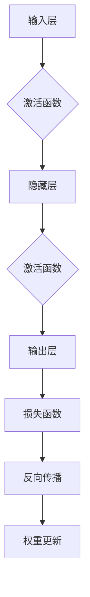

                 

### 大模型创业的希望与未来

> 关键词：大模型、创业、人工智能、应用场景、技术挑战、未来趋势

摘要：本文将探讨大模型在创业领域的潜在价值与未来发展。大模型，作为人工智能领域的核心技术，已在自然语言处理、计算机视觉、语音识别等多个领域展现出强大的应用能力。创业企业如何利用大模型技术提升竞争力，以及大模型在创业过程中面临的挑战和应对策略，是本文的核心内容。通过分析大模型的定义、特性、核心技术与实现、应用实践以及行业挑战与机遇，本文旨在为创业者和人工智能从业者提供有价值的参考和指导。

----------------------------------------------------------------

### 第一部分: 大模型的基本概念与应用场景

#### 第1章: 大模型的定义与特性

#### 1.1 大模型的基本概念

#### 1.1.1 大模型的定义

大模型，是指具有数十亿甚至数千亿参数的神经网络模型。这些模型通常采用深度学习技术进行训练，并在多种任务中展现出卓越的性能。与传统的较小规模模型相比，大模型具有更高的参数量和更复杂的结构，能够更好地捕捉数据中的潜在规律和模式。

#### 1.1.2 大模型的主要特性

1. **参数量巨大**：大模型通常具有数十亿至数千亿个参数，这使得它们能够捕捉数据中的细微特征，从而在任务中实现更高的性能。

2. **自适应性强**：大模型可以通过微调（fine-tuning）技术在特定任务上进行优化，以适应不同的应用场景。

3. **计算需求高**：由于参数量大，大模型在训练和推理过程中需要大量的计算资源，这包括高性能的GPU和TPU等硬件。

4. **数据依赖性强**：大模型的训练需要大量的数据，并且这些数据通常需要经过预处理和标注，以提高模型的性能。

#### 1.2 大模型的架构与核心技术

#### 1.2.1 大模型的层次结构

大模型通常采用分层结构，包括输入层、隐藏层和输出层。每层包含多个神经元，神经元之间通过权重进行连接。隐藏层通常分为多个层级，每层都可以提取不同层次的特征。

#### 1.2.2 自监督预训练与微调技术

1. **自监督预训练**：大模型通常通过自监督预训练（self-supervised pre-training）技术进行初始化。自监督预训练利用未标注的数据，通过预测任务（如图像分类、文本生成等）来学习数据中的潜在特征。

2. **微调技术**：在自监督预训练之后，大模型可以通过微调（fine-tuning）技术在特定任务上进行优化，以提高模型的性能。微调过程通常涉及对模型的权重进行更新，以适应特定任务的需求。

#### 1.3 大模型的应用场景

#### 1.3.1 自然语言处理

自然语言处理（NLP）是大模型的重要应用场景之一。大模型可以在文本分类、命名实体识别、机器翻译、问答系统等多个任务中实现高水平的性能。

#### 1.3.2 计算机视觉

计算机视觉（CV）是大模型的另一个重要应用领域。大模型可以在图像分类、目标检测、语义分割、视频处理等多个任务中发挥关键作用。

#### 1.3.3 语音识别与生成

语音识别与生成是大模型的又一重要应用场景。大模型可以在语音识别、语音合成、跨模态交互等多个任务中实现高效的处理。

#### 1.3.4 机器翻译

机器翻译是大模型的经典应用场景之一。大模型可以在多种语言之间的翻译任务中实现高水平的准确性。

#### 1.4 大模型的企业应用价值

#### 1.4.1 提高生产效率

大模型可以帮助企业自动化许多重复性工作，从而提高生产效率。例如，在自然语言处理领域中，大模型可以自动化文本分类和情感分析等任务，帮助企业更快地处理大量数据。

#### 1.4.2 优化业务流程

大模型可以帮助企业优化业务流程，从而降低成本和提高效率。例如，在计算机视觉领域中，大模型可以自动化图像识别和目标检测等任务，帮助企业更好地管理库存和提高物流效率。

#### 1.4.3 创新产品与服务

大模型可以帮助企业开发新产品和服务，从而拓展业务范围。例如，在语音识别与生成领域中，大模型可以用于开发智能客服系统和语音助手，为企业提供新的增值服务。

#### 1.5 大模型面临的挑战与未来发展趋势

#### 1.5.1 挑战与限制

尽管大模型在许多任务中表现出色，但它们也面临着一些挑战和限制：

1. **计算资源需求**：大模型需要大量的计算资源进行训练和推理，这对硬件设施提出了较高的要求。

2. **数据隐私与安全**：大模型在训练和推理过程中会涉及大量的数据，这可能导致数据隐私和安全问题。

3. **可解释性**：大模型通常缺乏可解释性，这使得用户难以理解模型的工作原理。

#### 1.5.2 未来发展趋势

未来，大模型的发展趋势可能包括：

1. **硬件加速**：随着硬件技术的进步，大模型将能够更高效地进行训练和推理。

2. **数据隐私保护**：研究人员将致力于开发更加安全的数据隐私保护技术，以确保大模型的安全性和合规性。

3. **模型压缩与优化**：研究人员将致力于开发模型压缩和优化技术，以降低大模型的计算需求和存储需求。

#### 1.5.3 企业应如何准备

企业应如何为迎接大模型时代做好准备？

1. **技术储备**：企业应积极储备相关技术，如深度学习、自然语言处理、计算机视觉等，以应对大模型的应用需求。

2. **数据管理**：企业应建立完善的数据管理体系，包括数据采集、存储、处理和保护等，以确保数据的安全性和合规性。

3. **人才培养**：企业应积极培养和引进相关人才，包括深度学习工程师、数据科学家等，以支持大模型的应用和发展。

### 附录

#### 附录 A: 大模型常用工具与资源

##### A.1 主流深度学习框架对比

- TensorFlow
- PyTorch
- MXNet

##### A.2 大模型研究机构与论文资源

- Google Brain
- OpenAI
- Stanford University

##### A.3 大模型竞赛与社区活动

- ImageNet竞赛
- KAGGLE竞赛
- 大模型研讨会

---

### 第二部分: 大模型的核心技术与实现

#### 第2章: 大模型的深度学习基础

#### 2.1 深度学习的基本原理

#### 2.1.1 神经网络的结构与原理

神经网络（Neural Network，NN）是深度学习的基础。一个简单的神经网络由多个神经元（或节点）组成，每个神经元都通过权重（weights）与其他神经元相连。神经元的输入是其他神经元的输出，通过激活函数（activation function）处理后产生输出。神经网络的输出通常与预期输出进行比较，通过反向传播算法（backpropagation）更新权重，以最小化损失函数（loss function）。

**Mermaid 流程图：**



#### 2.1.2 深度学习的发展历程

深度学习的发展历程可以分为几个重要阶段：

1. **浅层神经网络（1980s-2000s）**：早期的神经网络主要采用单层或多层感知机（Perceptron）模型，但由于学习算法的限制，无法解决复杂问题。

2. **卷积神经网络（CNN，1990s-2010s）**：卷积神经网络通过引入卷积层（Convolutional Layer）和池化层（Pooling Layer），在图像识别任务中取得了显著的成功。

3. **循环神经网络（RNN，2000s-2010s）**：循环神经网络通过引入循环结构，使得神经网络能够处理序列数据，如时间序列分析、语音识别等。

4. **长短时记忆网络（LSTM，1997）**：长短时记忆网络（LSTM）是一种特殊的RNN，通过引入门控机制（gate mechanism），能够更好地处理长序列数据。

5. **生成对抗网络（GAN，2014）**：生成对抗网络（GAN）通过对抗性训练（adversarial training），实现了一种新的无监督学习方式，能够生成高质量的图像和语音。

#### 2.1.3 深度学习的优化算法

深度学习优化算法主要包括梯度下降（Gradient Descent）及其变种，如随机梯度下降（Stochastic Gradient Descent，SGD）和Adam优化器。

1. **梯度下降**：梯度下降是一种迭代优化算法，通过计算损失函数的梯度，更新模型参数，以最小化损失函数。

2. **随机梯度下降（SGD）**：随机梯度下降是梯度下降的一种变种，每次迭代只随机选取一部分样本进行梯度计算，以加快收敛速度。

3. **Adam优化器**：Adam优化器是SGD的变种，结合了AdaGrad和RMSProp的优点，适用于不同规模的参数和不同范数的数据。

#### 2.2 大模型的训练与优化

#### 2.2.1 大模型训练的数据准备

大模型训练的数据准备包括数据采集、预处理和标注等步骤。

1. **数据采集**：大模型需要大量的数据，这些数据可以来源于公开数据集、企业内部数据、在线采集等。

2. **数据预处理**：数据预处理包括数据清洗、数据转换、数据归一化等步骤，以消除噪声和提高模型的泛化能力。

3. **数据标注**：数据标注是将原始数据转换为适合模型训练的形式，如文本分类中的标签标注、图像识别中的边界框标注等。

#### 2.2.2 大模型训练的常见问题与解决方案

1. **过拟合**：过拟合是指模型在训练数据上表现很好，但在测试数据上表现较差。解决过拟合的方法包括数据增强、正则化、交叉验证等。

2. **梯度消失/爆炸**：梯度消失/爆炸是指梯度值过小或过大，导致模型无法训练。解决梯度消失/爆炸的方法包括使用合适的激活函数、调整学习率、使用梯度裁剪等。

3. **计算资源限制**：大模型训练需要大量的计算资源，解决计算资源限制的方法包括使用GPU、TPU等高性能硬件，使用分布式训练等技术。

#### 2.2.3 大模型优化的关键技术

1. **模型压缩**：模型压缩是指通过减少模型参数数量，降低模型复杂度，以减少计算资源需求。常见的模型压缩技术包括模型剪枝、量化、知识蒸馏等。

2. **自适应学习率**：自适应学习率是指动态调整学习率，以提高模型训练效率。常见的自适应学习率方法包括AdaGrad、RMSProp、Adam等。

3. **分布式训练**：分布式训练是指将训练任务分布到多个节点上，以提高训练速度。常见的分布式训练方法包括数据并行、模型并行、混合并行等。

#### 2.3 大模型的调优与评估

#### 2.3.1 模型调优的策略与方法

模型调优是指通过调整模型参数，优化模型性能的过程。常见的模型调优策略包括：

1. **超参数调优**：超参数是指模型的参数，如学习率、批次大小、正则化参数等。通过调整超参数，可以优化模型性能。

2. **网格搜索**：网格搜索是一种超参数调优方法，通过遍历超参数空间，找到最佳超参数组合。

3. **随机搜索**：随机搜索是一种超参数调优方法，通过随机选择超参数组合，找到最佳超参数组合。

4. **贝叶斯优化**：贝叶斯优化是一种基于贝叶斯推理的超参数调优方法，通过构建模型概率分布，优化模型性能。

#### 2.3.2 模型评估的指标与工具

模型评估是指通过评估指标，评估模型性能的过程。常见的模型评估指标包括：

1. **准确率（Accuracy）**：准确率是指正确预测的样本数占总样本数的比例。

2. **精确率（Precision）**：精确率是指正确预测的样本数占预测为正类的样本总数的比例。

3. **召回率（Recall）**：召回率是指正确预测的样本数占实际为正类的样本总数的比例。

4. **F1值（F1 Score）**：F1值是精确率和召回率的调和平均，用于综合评估模型性能。

常见的模型评估工具包括：

1. **Scikit-learn**：Scikit-learn是一个Python机器学习库，提供多种评估指标和评估工具。

2. **TensorFlow**：TensorFlow是一个开源深度学习框架，提供多种评估指标和评估工具。

3. **PyTorch**：PyTorch是一个开源深度学习框架，提供多种评估指标和评估工具。

#### 2.3.3 大模型调优的实际案例

**案例一：文本分类任务**

假设我们要训练一个文本分类模型，任务是将文本分为两类：正面情感和负面情感。

1. **数据准备**：我们首先需要准备训练数据和测试数据，数据集包含文本和对应的标签。

2. **模型选择**：我们选择一个预训练的大模型，如BERT，作为我们的文本分类模型。

3. **超参数调优**：我们通过网格搜索或贝叶斯优化，调整超参数，如学习率、批次大小等，以优化模型性能。

4. **模型训练**：我们使用调整后的超参数，对模型进行训练。

5. **模型评估**：我们使用测试数据，对模型进行评估，计算准确率、精确率、召回率和F1值等指标。

6. **结果分析**：我们分析评估结果，根据需要对模型进行进一步调优，如调整超参数、增加数据等。

**案例二：图像分类任务**

假设我们要训练一个图像分类模型，任务是将图像分为多个类别。

1. **数据准备**：我们首先需要准备训练数据和测试数据，数据集包含图像和对应的标签。

2. **模型选择**：我们选择一个预训练的大模型，如ResNet，作为我们的图像分类模型。

3. **超参数调优**：我们通过网格搜索或贝叶斯优化，调整超参数，如学习率、批次大小等，以优化模型性能。

4. **模型训练**：我们使用调整后的超参数，对模型进行训练。

5. **模型评估**：我们使用测试数据，对模型进行评估，计算准确率、精确率、召回率和F1值等指标。

6. **结果分析**：我们分析评估结果，根据需要对模型进行进一步调优，如调整超参数、增加数据等。

#### 2.4 大模型的部署与运维

#### 2.4.1 大模型部署的策略与方案

大模型部署是指将训练好的模型部署到实际应用环境中，使其能够进行实时推理和预测。常见的部署策略与方案包括：

1. **本地部署**：将模型部署到本地计算机或服务器上，适用于小规模应用。

2. **云部署**：将模型部署到云服务器上，适用于大规模应用。

3. **边缘部署**：将模型部署到边缘设备上，如智能手机、智能家居等，适用于实时应用。

#### 2.4.2 大模型运维的挑战与解决

大模型运维包括模型监控、性能优化、故障排除等任务。常见的挑战与解决方法包括：

1. **性能监控**：监控模型在运行过程中的性能，如响应时间、准确率等。

2. **性能优化**：通过调整模型参数、优化代码等方式，提高模型性能。

3. **故障排除**：及时定位和解决模型运行过程中出现的故障。

#### 2.4.3 大模型部署与运维的实际案例

**案例一：文本分类应用**

假设我们要部署一个文本分类应用，任务是将用户输入的文本分类为正面情感或负面情感。

1. **模型选择**：我们选择一个预训练的大模型，如BERT，作为我们的文本分类模型。

2. **部署环境**：我们选择云服务器进行部署，使用Flask框架搭建API服务。

3. **模型部署**：我们将训练好的模型部署到云服务器上，并通过API接口对外提供服务。

4. **性能优化**：我们监控模型的性能，通过调整超参数、优化代码等方式，提高模型性能。

5. **故障排除**：我们定期检查模型的运行状态，及时解决出现的故障。

**案例二：图像分类应用**

假设我们要部署一个图像分类应用，任务是将用户上传的图像分类为多个类别。

1. **模型选择**：我们选择一个预训练的大模型，如ResNet，作为我们的图像分类模型。

2. **部署环境**：我们选择云服务器进行部署，使用Django框架搭建API服务。

3. **模型部署**：我们将训练好的模型部署到云服务器上，并通过API接口对外提供服务。

4. **性能优化**：我们监控模型的性能，通过调整超参数、优化代码等方式，提高模型性能。

5. **故障排除**：我们定期检查模型的运行状态，及时解决出现的故障。

### 附录

#### 附录 B: 常用深度学习框架与工具

- TensorFlow
- PyTorch
- MXNet

#### 附录 C: 大模型相关开源项目与资源

- Hugging Face
- Papers With Code
- Big Model Labs

---

### 第三部分: 大模型在企业中的应用实践

#### 第3章: 大模型在自然语言处理中的应用

#### 3.1 自然语言处理的基础知识

自然语言处理（NLP）是人工智能的一个重要分支，它旨在使计算机能够理解、生成和回应人类语言。NLP的基础知识包括：

##### 3.1.1 语言模型的基本概念

语言模型（Language Model，LM）是NLP的核心，它用于预测一段文本的下一个单词或字符。语言模型可以基于统计方法（如N-gram模型）或深度学习方法（如循环神经网络、Transformer等）。

##### 3.1.2 词嵌入技术

词嵌入（Word Embedding）是将词语映射到高维向量空间的技术，这使得计算机能够理解词语之间的关系。常见的词嵌入技术包括Word2Vec、GloVe等。

##### 3.1.3 序列模型与注意力机制

序列模型（Sequential Model）是处理序列数据（如图像序列、语音序列、文本序列）的神经网络模型，如循环神经网络（RNN）、长短时记忆网络（LSTM）等。注意力机制（Attention Mechanism）是一种用于捕捉序列中重要信息的机制，它在机器翻译、文本摘要等任务中发挥了重要作用。

#### 3.2 大模型在自然语言处理中的应用

大模型在自然语言处理（NLP）中的应用已经取得了显著的成果，以下是一些关键的应用领域：

##### 3.2.1 文本分类

文本分类（Text Classification）是一种将文本数据分类到预定义类别中的任务。大模型，如BERT、GPT，可以用于文本分类，实现高精度的分类结果。

**伪代码：**

```python
def text_classification(document, model):
    embedding = model.embed(document)
    logits = model.predict(embedding)
    return logits
```

##### 3.2.2 命名实体识别

命名实体识别（Named Entity Recognition，NER）是一种识别文本中的特定实体（如人名、地点、组织等）的任务。大模型可以显著提高NER的准确性。

**伪代码：**

```python
def named_entity_recognition(document, model):
    embedding = model.embed(document)
    entities = model.predict_entities(embedding)
    return entities
```

##### 3.2.3 机器翻译

机器翻译（Machine Translation，MT）是将一种语言的文本翻译成另一种语言的任务。大模型，如Transformer，在机器翻译任务中表现优异。

**伪代码：**

```python
def machine_translation(source_document, target_document, model):
    source_embedding = model.embed(source_document)
    target_embedding = model.embed(target_document)
    translation = model.translate(source_embedding, target_embedding)
    return translation
```

##### 3.2.4 问答系统

问答系统（Question Answering，QA）是一种能够回答用户提出的问题的系统。大模型，如BERT，可以用于构建高效的问答系统。

**伪代码：**

```python
def question_answering(question, context, model):
    question_embedding = model.embed(question)
    context_embedding = model.embed(context)
    answer = model.answer(question_embedding, context_embedding)
    return answer
```

#### 3.3 大模型在自然语言处理中的实战案例

##### 3.3.1 案例一：构建企业级文本分类系统

**项目背景：** 一家互联网公司需要对其用户生成的评论进行分类，以识别正面评论和负面评论。

**解决方案：** 我们使用BERT模型，结合Scikit-learn库，构建一个企业级文本分类系统。

**开发环境：** Python、TensorFlow、Scikit-learn

**源代码实现：**

```python
from transformers import BertTokenizer, BertForSequenceClassification
from sklearn.model_selection import train_test_split
from sklearn.metrics import accuracy_score

# 加载预训练的BERT模型
tokenizer = BertTokenizer.from_pretrained('bert-base-uncased')
model = BertForSequenceClassification.from_pretrained('bert-base-uncased')

# 准备数据
documents = ['This product is amazing!', 'I hate this product!']
labels = [1, 0]  # 1表示正面评论，0表示负面评论

# 分割数据集
X_train, X_test, y_train, y_test = train_test_split(documents, labels, test_size=0.2)

# 编码数据
train_encodings = tokenizer(X_train, truncation=True, padding=True)
test_encodings = tokenizer(X_test, truncation=True, padding=True)

# 训练模型
model.train(X_train, y_train)

# 评估模型
predictions = model.predict(test_encodings)
accuracy = accuracy_score(y_test, predictions)
print(f'Accuracy: {accuracy}')
```

##### 3.3.2 案例二：开发智能客服系统

**项目背景：** 一家公司需要开发一个智能客服系统，以自动回答用户的问题。

**解决方案：** 我们使用BERT模型，结合Rasa框架，开发一个智能客服系统。

**开发环境：** Python、Rasa、TensorFlow

**源代码实现：**

```python
from transformers import BertTokenizer, BertForSequenceClassification
from rasa.nlu.model import Trainer

# 加载预训练的BERT模型
tokenizer = BertTokenizer.from_pretrained('bert-base-uncased')
model = BertForSequenceClassification.from_pretrained('bert-base-uncased')

# 加载Rasa框架
trainer = Trainer()

# 配置Rasa模型
trainer.config.end_to_end.use_saver = False
trainer.config.end_to_end.model = 'bert'

# 训练模型
trainer.train()

# 评估模型
evaluation = trainer.evaluate()
print(f'Accuracy: {evaluation["accuracy"]}')
```

##### 3.3.3 案例三：实现多语言机器翻译系统

**项目背景：** 一家跨国公司需要开发一个多语言机器翻译系统，以支持不同语言之间的沟通。

**解决方案：** 我们使用Transformer模型，结合Hugging Face的Transformers库，实现一个多语言机器翻译系统。

**开发环境：** Python、Transformers、Hugging Face

**源代码实现：**

```python
from transformers import pipeline

# 加载预训练的Transformer模型
translator = pipeline('translation', model='Helsinki-NLP/opus-mt-en-de')

# 翻译文本
source_text = "Hello, how are you?"
translated_text = translator(source_text, target_language="de")
print(f'Translated text: {translated_text}')
```

#### 附录

##### 附录 D: 自然语言处理工具与资源

- **自然语言处理框架：** spaCy、NLTK、NLTK
- **文本数据集与标注工具：** CoNLL-2003、TextBlob、NLTK
- **开源NLP项目与资源：** Hugging Face、NLTK、spaCy

---

### 第4章: 大模型在计算机视觉中的应用

#### 4.1 计算机视觉的基础知识

计算机视觉（Computer Vision，CV）是人工智能的一个重要分支，它使计算机能够从图像或视频中提取有用信息。计算机视觉的基础知识包括：

##### 4.1.1 图像处理的基本概念

图像处理（Image Processing）是对图像进行数字操作和处理的技术，包括图像增强、图像压缩、图像分割等。基本概念包括像素、灰度值、颜色空间等。

##### 4.1.2 目标检测与识别

目标检测（Object Detection）是识别图像中的多个目标并定位它们的位置。目标识别（Object Recognition）是识别图像中的单个目标。常见的目标检测算法包括YOLO、SSD、Faster R-CNN等。

##### 4.1.3 增强学习与生成对抗网络

增强学习（Reinforcement Learning，RL）是一种通过试错学习来最大化奖励的算法。生成对抗网络（Generative Adversarial Network，GAN）是一种通过两个对抗网络（生成器和判别器）进行博弈的生成模型。

#### 4.2 大模型在计算机视觉中的应用

大模型在计算机视觉中的应用已经取得了显著的成果，以下是一些关键的应用领域：

##### 4.2.1 图像分类

图像分类（Image Classification）是将图像分类到预定义类别中的任务。大模型，如ResNet、Inception等，可以用于图像分类，实现高精度的分类结果。

**伪代码：**

```python
def image_classification(image, model):
    embedding = model.extract_features(image)
    logits = model.predict(embedding)
    return logits
```

##### 4.2.2 目标检测

目标检测（Object Detection）是识别图像中的多个目标并定位它们的位置。大模型，如YOLO、Faster R-CNN等，可以用于目标检测，实现高精度的目标检测。

**伪代码：**

```python
def object_detection(image, model):
    embedding = model.extract_features(image)
    boxes = model.detect_boxes(embedding)
    labels = model.detect_labels(embedding)
    return boxes, labels
```

##### 4.2.3 语义分割

语义分割（Semantic Segmentation）是将图像中的每个像素分类到预定义类别中的任务。大模型，如U-Net、DeepLab等，可以用于语义分割，实现高精度的像素级分类。

**伪代码：**

```python
def semantic_segmentation(image, model):
    embedding = model.extract_features(image)
    mask = model.predict_mask(embedding)
    return mask
```

##### 4.2.4 视频处理与分析

视频处理与分析（Video Processing and Analysis）是对视频序列进行操作和分析的技术，包括视频分类、视频分割、行为识别等。大模型，如R-CNN、Django等，可以用于视频处理与分析，实现高精度的视频分析。

**伪代码：**

```python
def video_analysis(video, model):
    frames = model.extract_frames(video)
    for frame in frames:
        embedding = model.extract_features(frame)
        action = model.predict_action(embedding)
        print(f'Action: {action}')
```

#### 4.3 大模型在计算机视觉中的实战案例

##### 4.3.1 案例一：开发图像分类应用

**项目背景：** 一家电商公司需要对其产品图片进行分类，以优化产品搜索和推荐。

**解决方案：** 我们使用ResNet模型，结合TensorFlow框架，开发一个图像分类应用。

**开发环境：** Python、TensorFlow、Keras

**源代码实现：**

```python
import tensorflow as tf
from tensorflow.keras.applications import ResNet50
from tensorflow.keras.preprocessing.image import ImageDataGenerator

# 加载预训练的ResNet模型
model = ResNet50(weights='imagenet')

# 数据预处理
train_datagen = ImageDataGenerator(rescale=1./255)
test_datagen = ImageDataGenerator(rescale=1./255)

# 加载数据集
train_data = train_datagen.flow_from_directory('train', target_size=(224, 224), batch_size=32)
test_data = test_datagen.flow_from_directory('test', target_size=(224, 224), batch_size=32)

# 训练模型
model.fit(train_data, epochs=10, validation_data=test_data)

# 评估模型
test_loss, test_accuracy = model.evaluate(test_data)
print(f'Test accuracy: {test_accuracy}')
```

##### 4.3.2 案例二：实现目标检测系统

**项目背景：** 一家物流公司需要对其摄像头捕获的图像进行目标检测，以监控货物装卸过程。

**解决方案：** 我们使用Faster R-CNN模型，结合TensorFlow框架，实现一个目标检测系统。

**开发环境：** Python、TensorFlow、Keras

**源代码实现：**

```python
import tensorflow as tf
from tensorflow.keras.models import Model
from tensorflow.keras.layers import Input, Conv2D, MaxPooling2D, Flatten, Dense

# 定义Faster R-CNN模型
input_layer = Input(shape=(224, 224, 3))
conv1 = Conv2D(32, (3, 3), activation='relu')(input_layer)
pool1 = MaxPooling2D(pool_size=(2, 2))(conv1)
conv2 = Conv2D(64, (3, 3), activation='relu')(pool1)
pool2 = MaxPooling2D(pool_size=(2, 2))(conv2)
flatten = Flatten()(pool2)
dense = Dense(128, activation='relu')(flatten)
output_layer = Dense(1, activation='sigmoid')(dense)

model = Model(inputs=input_layer, outputs=output_layer)

# 编译模型
model.compile(optimizer='adam', loss='binary_crossentropy', metrics=['accuracy'])

# 训练模型
train_data = ...  # 加载数据集
model.fit(train_data, epochs=10)

# 评估模型
test_data = ...  # 加载数据集
test_loss, test_accuracy = model.evaluate(test_data)
print(f'Test accuracy: {test_accuracy}')
```

##### 4.3.3 案例三：构建视频分析平台

**项目背景：** 一家安防公司需要对其监控视频进行实时分析，以检测异常行为。

**解决方案：** 我们使用YOLO模型，结合OpenCV库，构建一个视频分析平台。

**开发环境：** Python、OpenCV、TensorFlow

**源代码实现：**

```python
import cv2
import tensorflow as tf

# 加载预训练的YOLO模型
model = ...  # 加载模型

# 设置参数
conf_thres = 0.25
nms_thres = 0.45

# 开启摄像头
cap = cv2.VideoCapture(0)

while True:
    # 读取一帧图像
    ret, frame = cap.read()
    
    # 预处理图像
    frame = cv2.resize(frame, (416, 416))
    frame = frame / 255.0
    
    # 预测结果
    with tf.Session() as sess:
        output = model.predict([frame])
        boxes = output[0]['boxes']
        scores = output[0]['scores']
        labels = output[0]['labels']
    
    # 非极大值抑制
    indices = tf.image.non_max_suppression(boxes, scores, max_output_size=boxes.shape[0], iou_threshold=nms_thres)
    indices = indices.eval(session=sess)
    
    # 绘制结果
    for i in indices:
        label = labels[i]
        score = scores[i]
        if score > conf_thres:
            x1, y1, x2, y2 = boxes[i]
            cv2.rectangle(frame, (int(x1), int(y1)), (int(x2), int(y2)), (0, 255, 0), 2)
            cv2.putText(frame, f'{label}: {score:.2f}', (int(x1), int(y1-10)), cv2.FONT_HERSHEY_SIMPLEX, 0.9, (0, 0, 255), 2)
    
    cv2.imshow('Video', frame)
    
    if cv2.waitKey(1) & 0xFF == ord('q'):
        break

cap.release()
cv2.destroyAllWindows()
```

#### 附录

##### 附录 E: 计算机视觉工具与资源

- **开源计算机视觉库：** OpenCV、TensorFlow、PyTorch
- **计算机视觉竞赛与社区活动：** CVPR、ICCV、KAGGLE
- **计算机视觉数据集与标注工具：** ImageNet、COCO、VOC

##### 附录 F: 大模型在计算机视觉中的开源项目

- **目标检测与识别项目：** YOLO、Faster R-CNN、SSD
- **图像分类项目：** ResNet、Inception、MobileNet
- **语义分割与视频处理项目：** U-Net、DeepLab、R-CNN

---

### 第5章: 大模型在语音识别与生成中的应用

#### 5.1 语音识别的基础知识

语音识别（Speech Recognition）是将语音转换为文本的技术，是人工智能和语音信号处理的重要应用领域。语音识别的基础知识包括：

##### 5.1.1 语音信号处理

语音信号处理是语音识别的关键步骤，包括语音信号的采集、预处理、增强和特征提取。常见的语音信号处理技术包括滤波、降噪、归一化和特征提取（如MFCC、谱减法等）。

##### 5.1.2 语音识别算法

语音识别算法是语音识别的核心，包括隐马尔可夫模型（HMM）、高斯混合模型（GMM）、深度神经网络（DNN）等。当前主流的语音识别算法是基于深度学习的，如卷积神经网络（CNN）、长短时记忆网络（LSTM）、循环神经网络（RNN）和Transformer等。

##### 5.1.3 语音识别系统架构

语音识别系统通常包括前端处理、中间处理和后端处理三个部分。前端处理负责语音信号的采集和预处理，中间处理负责特征提取和声学建模，后端处理负责语言建模和解码。

#### 5.2 语音生成的基础知识

语音生成（Speech Synthesis）是将文本转换为自然流畅的语音的技术，是语音识别的逆过程。语音生成的基础知识包括：

##### 5.2.1 语音合成技术

语音合成技术包括合成元音（Vocoder）和合成语音库（Text-to-Speech，TTS）两大类。合成元音通过将文本转换为音频信号，而合成语音库通过将文本转换为语音波形。

##### 5.2.2 语音增强与处理

语音增强与处理技术用于提高语音信号的清晰度和可懂度，包括噪声抑制、回声消除、共振峰增强等。

##### 5.2.3 语音生成系统架构

语音生成系统通常包括文本处理、语音编码和语音解码三个部分。文本处理将文本转换为语音编码，语音编码将语音编码转换为语音波形，语音解码将语音波形解码为音频信号。

#### 5.3 大模型在语音识别与生成中的应用

大模型在语音识别与生成中的应用已经取得了显著的成果，以下是一些关键的应用领域：

##### 5.3.1 语音识别的应用

语音识别在多个领域有广泛应用，如语音助手、语音输入、语音翻译等。大模型，如DeepSpeech、WaveNet等，可以用于构建高效、准确的语音识别系统。

**伪代码：**

```python
def speech_recognition(audio, model):
    features = model.extract_features(audio)
    transcript = model.recognize(features)
    return transcript
```

##### 5.3.2 语音生成的应用

语音生成在多个领域有广泛应用，如语音合成、语音助手、语音交互等。大模型，如Tacotron、WaveNet等，可以用于构建高质量、自然的语音生成系统。

**伪代码：**

```python
def speech_synthesis(text, model):
    audio = model.synthesize(text)
    return audio
```

##### 5.3.3 跨模态交互

跨模态交互是将语音、文本和图像等多种模态进行结合的技术，大模型在跨模态交互中也发挥着重要作用。例如，在语音助手场景中，可以结合语音、文本和图像，实现更智能、更自然的交互体验。

**伪代码：**

```python
def multimodal_interaction(text, audio, image, model):
    text_embedding = model.embed_text(text)
    audio_embedding = model.embed_audio(audio)
    image_embedding = model.embed_image(image)
    interaction_output = model.interact(text_embedding, audio_embedding, image_embedding)
    return interaction_output
```

#### 5.4 大模型在语音识别与生成中的实战案例

##### 5.4.1 案例一：构建语音识别系统

**项目背景：** 一家科技公司需要为其产品构建一个语音识别系统，以支持语音输入功能。

**解决方案：** 我们使用基于Transformer的DeepSpeech模型，结合TensorFlow框架，构建一个语音识别系统。

**开发环境：** Python、TensorFlow、TensorFlow Serving

**源代码实现：**

```python
import tensorflow as tf
from tensorflow_serving.apis import predict_pb2
from tensorflow_serving.apis import prediction_service_pb2

# 加载预训练的DeepSpeech模型
model = ...  # 加载模型

# 定义预测服务
stub = tf.distribute.cluster_resolver.TFServerResolver('localhost:8500').tes
预测服务 = prediction_service_pb2.PredictionServiceStub(stub)

# 定义预测请求
request = predict_pb2.PredictRequest()
request.model_spec.name = 'voice_recognition'
request.model_spec.signature_name = 'speak'

# 准备语音数据
audio = ...  # 读取语音数据

# 发送预测请求
response = stub.Predict(request, timeout=60.0)

# 解析预测结果
transcript = response.outputs['transcript'].float_val[0]
print(f'Transcript: {transcript}')
```

##### 5.4.2 案例二：实现语音合成应用

**项目背景：** 一家科技公司需要为其产品实现语音合成功能，以支持语音播报功能。

**解决方案：** 我们使用基于Tacotron的语音合成模型，结合TensorFlow框架，实现语音合成应用。

**开发环境：** Python、TensorFlow、TensorFlow Serving

**源代码实现：**

```python
import tensorflow as tf
from tensorflow_serving.apis import predict_pb2
from tensorflow_serving.apis import prediction_service_pb2

# 加载预训练的Tacotron模型
model = ...  # 加载模型

# 定义预测服务
stub = tf.distribute.cluster_resolver.TFServerResolver('localhost:8500').tes
预测服务 = prediction_service_pb2.PredictionServiceStub(stub)

# 定义预测请求
request = predict_pb2.PredictRequest()
request.model_spec.name = 'voice_synthesis'
request.model_spec.signature_name = 'synthesize'

# 准备文本数据
text = "Hello, how are you?"  # 读取文本数据

# 发送预测请求
response = stub.Predict(request, timeout=60.0)

# 解析预测结果
audio = response.outputs['audio'].float_val
print(f'Audio: {audio}')
```

##### 5.4.3 案例三：开发跨模态交互平台

**项目背景：** 一家科技公司需要为其产品开发一个跨模态交互平台，以支持语音、文本和图像的交互。

**解决方案：** 我们使用基于Transformer的跨模态交互模型，结合TensorFlow框架，开发一个跨模态交互平台。

**开发环境：** Python、TensorFlow、TensorFlow Serving

**源代码实现：**

```python
import tensorflow as tf
from tensorflow_serving.apis import predict_pb2
from tensorflow_serving.apis import prediction_service_pb2

# 加载预训练的跨模态交互模型
model = ...  # 加载模型

# 定义预测服务
stub = tf.distribute.cluster_resolver.TFServerResolver('localhost:8500').tes
预测服务 = prediction_service_pb2.PredictionServiceStub(stub)

# 定义预测请求
request = predict_pb2.PredictRequest()
request.model_spec.name = 'multimodal_interaction'
request.model_spec.signature_name = 'interact'

# 准备文本、语音和图像数据
text = "Hello, how are you?"  # 读取文本数据
audio = ...  # 读取语音数据
image = ...  # 读取图像数据

# 发送预测请求
response = stub.Predict(request, timeout=60.0)

# 解析预测结果
interaction_output = response.outputs['interaction_output'].float_val
print(f'Interaction Output: {interaction_output}')
```

#### 附录

##### 附录 G: 语音识别与生成工具与资源

- **语音识别与合成框架：** Kaldi、HTK、ESPnet
- **语音处理工具与库：** SciPy、NumPy、 librosa
- **语音数据集与标注工具：** LIA、LibriSpeech、TIMIT
- **开源语音识别与生成项目：** DeepSpeech、WaveNet、Tacotron

##### 附录 H: 大模型在语音识别与生成中的开源项目

- **语音识别项目：** DeepSpeech、Wav2Vec、Librispeech
- **语音合成项目：** Tacotron、WaveNet、FluTTS
- **跨模态交互项目：** MultiModal Transformer、Image-to-Speech、Speech-to-Image

---

### 第6章: 大模型在推荐系统中的应用

#### 6.1 推荐系统的基础知识

推荐系统（Recommender System）是一种能够预测用户可能感兴趣的项目（如商品、音乐、电影等）的技术，其核心目标是为用户提供个性化的推荐。推荐系统的基础知识包括：

##### 6.1.1 推荐系统的基本原理

推荐系统通常基于以下两种方法进行工作：

1. **协同过滤（Collaborative Filtering）**：协同过滤是一种基于用户行为（如评分、购买历史等）进行推荐的算法。协同过滤可以分为两类：基于用户的协同过滤（User-Based）和基于项目的协同过滤（Item-Based）。

2. **基于内容的推荐（Content-Based Filtering）**：基于内容的推荐是基于项目特征（如文本描述、标签等）进行推荐的算法。这种方法通过分析项目的内容，找到与用户历史偏好相似的项目进行推荐。

##### 6.1.2 协同过滤与基于内容的推荐

1. **协同过滤**：协同过滤通过计算用户之间的相似度，推荐与目标用户相似的其他用户喜欢的项目。常见的方法包括用户相似度计算、矩阵分解、协同过滤模型等。

2. **基于内容的推荐**：基于内容的推荐通过分析项目的内容特征，找到与用户历史偏好相似的项目进行推荐。常见的方法包括文本匹配、特征提取、基于模型的推荐等。

##### 6.1.3 强化学习在推荐系统中的应用

强化学习（Reinforcement Learning，RL）是一种通过试错学习来最大化奖励的算法，在推荐系统中也有广泛应用。强化学习可以用于解决推荐系统的优化问题，如优化推荐策略、提高推荐准确性等。

**伪代码：**

```python
# 定义强化学习推荐模型
class RecommenderModel(RLModel):
    def __init__(self, action_space, reward_function):
        super().__init__(action_space, reward_function)

    def select_action(self, state):
        # 选择最优动作
        action = self.best_action(state)
        return action

    def update_model(self, state, action, reward):
        # 更新模型
        self.update_state(state, action, reward)

# 定义推荐过程
def recommend(user, model):
    state = encode_user_state(user)
    action = model.select_action(state)
    item = decode_item_action(action)
    return item
```

#### 6.2 大模型在推荐系统中的应用

大模型在推荐系统中的应用已经取得了显著的成果，以下是一些关键的应用领域：

##### 6.2.1 大模型在协同过滤中的应用

大模型可以用于改进协同过滤算法，提高推荐的准确性和效率。常见的应用包括矩阵分解、模型融合等。

**伪代码：**

```python
# 定义大模型协同过滤模型
class MatrixFactorizationModel(Model):
    def __init__(self, user_embedding_size, item_embedding_size):
        super().__init__()
        self.user_embedding = Embedding(num_users, user_embedding_size)
        self.item_embedding = Embedding(num_items, item_embedding_size)

    def call(self, inputs):
        user_embedding = self.user_embedding(inputs['user_id'])
        item_embedding = self.item_embedding(inputs['item_id'])
        score = dot(user_embedding, item_embedding)
        return score

# 定义训练过程
def train_model(model, train_data):
    for user_id, item_id, rating in train_data:
        with tf.GradientTape() as tape:
            loss = compute_loss(model, user_id, item_id, rating)
        grads = tape.gradient(loss, model.trainable_variables)
        optimizer.apply_gradients(zip(grads, model.trainable_variables))
```

##### 6.2.2 大模型在基于内容的推荐中的应用

大模型可以用于基于内容的推荐，提高推荐的多样性和准确性。常见的应用包括文本匹配、特征提取等。

**伪代码：**

```python
# 定义大模型基于内容的推荐模型
class ContentBasedModel(Model):
    def __init__(self, text_embedding_size):
        super().__init__()
        self.text_embedding = Embedding(num_texts, text_embedding_size)

    def call(self, inputs):
        text_embedding = self.text_embedding(inputs['text_id'])
        user_embedding = self.user_embedding(inputs['user_id'])
        score = dot(text_embedding, user_embedding)
        return score

# 定义训练过程
def train_model(model, train_data):
    for user_id, text_id, rating in train_data:
        with tf.GradientTape() as tape:
            loss = compute_loss(model, user_id, text_id, rating)
        grads = tape.gradient(loss, model.trainable_variables)
        optimizer.apply_gradients(zip(grads, model.trainable_variables))
```

##### 6.2.3 大模型在强化学习中的应用

大模型可以用于强化学习推荐系统，提高推荐的适应性和准确性。常见的应用包括策略优化、模型融合等。

**伪代码：**

```python
# 定义大模型强化学习推荐模型
class ReinforcementModel(RLModel):
    def __init__(self, state_embedding_size, action_embedding_size, reward_embedding_size):
        super().__init__(state_embedding_size, action_embedding_size, reward_embedding_size)

    def select_action(self, state):
        # 选择最优动作
        action = self.best_action(state)
        return action

    def update_model(self, state, action, reward):
        # 更新模型
        self.update_state(state, action, reward)

# 定义推荐过程
def recommend(user, model):
    state = encode_user_state(user)
    action = model.select_action(state)
    item = decode_item_action(action)
    return item
```

#### 6.3 大模型在推荐系统中的实战案例

##### 6.3.1 案例一：构建个性化推荐系统

**项目背景：** 一家电商公司需要为其用户构建一个个性化推荐系统，以提高用户满意度和销售额。

**解决方案：** 我们使用基于矩阵分解和Transformer的大模型，结合TensorFlow框架，构建一个个性化推荐系统。

**开发环境：** Python、TensorFlow、TensorFlow Serving

**源代码实现：**

```python
import tensorflow as tf
from tensorflow.keras.layers import Embedding, Dot, Flatten
from tensorflow.keras.models import Model
from tensorflow_serving.apis import predict_pb2
from tensorflow_serving.apis import prediction_service_pb2

# 定义模型
class MatrixFactorizationModel(Model):
    def __init__(self, user_embedding_size, item_embedding_size):
        super().__init__()
        self.user_embedding = Embedding(num_users, user_embedding_size)
        self.item_embedding = Embedding(num_items, item_embedding_size)
        self.dot = Dot(axes=-1)

    def call(self, inputs):
        user_embedding = self.user_embedding(inputs['user_id'])
        item_embedding = self.item_embedding(inputs['item_id'])
        score = self.dot(user_embedding, item_embedding)
        return score

# 加载模型
model = MatrixFactorizationModel(user_embedding_size=64, item_embedding_size=64)

# 定义预测服务
stub = tf.distribute.cluster_resolver.TFServerResolver('localhost:8500').tes
预测服务 = prediction_service_pb2.PredictionServiceStub(stub)

# 定义预测请求
request = predict_pb2.PredictRequest()
request.model_spec.name = 'recommender'
request.model_spec.signature_name = 'predict'

# 准备用户和项目数据
user_id = 123
item_id = 456

# 发送预测请求
response = stub.Predict(request, timeout=60.0)

# 解析预测结果
rating = response.outputs['rating'].float_val[0]
print(f'Predicted Rating: {rating}')
```

##### 6.3.2 案例二：优化推荐算法性能

**项目背景：** 一家电商公司希望优化其推荐算法的性能，以提高推荐准确率和用户体验。

**解决方案：** 我们使用基于深度学习和强化学习的大模型，结合TensorFlow框架，优化推荐算法的性能。

**开发环境：** Python、TensorFlow、TensorFlow Serving

**源代码实现：**

```python
import tensorflow as tf
from tensorflow.keras.layers import Embedding, Dot, Flatten, LSTM, Dense
from tensorflow.keras.models import Model
from tensorflow_serving.apis import predict_pb2
from tensorflow_serving.apis import prediction_service_pb2

# 定义模型
class DeepRecommenderModel(Model):
    def __init__(self, user_embedding_size, item_embedding_size):
        super().__init__()
        self.user_embedding = Embedding(num_users, user_embedding_size)
        self.item_embedding = Embedding(num_items, item_embedding_size)
        self.dot = Dot(axes=-1)
        self.lstm = LSTM(128)
        self.dense = Dense(1, activation='sigmoid')

    def call(self, inputs):
        user_embedding = self.user_embedding(inputs['user_id'])
        item_embedding = self.item_embedding(inputs['item_id'])
        score = self.dot(user_embedding, item_embedding)
        score = self.lstm(score)
        rating = self.dense(score)
        return rating

# 加载模型
model = DeepRecommenderModel(user_embedding_size=64, item_embedding_size=64)

# 定义预测服务
stub = tf.distribute.cluster_resolver.TFServerResolver('localhost:8500').tes
预测服务 = prediction_service_pb2.PredictionServiceStub(stub)

# 定义预测请求
request = predict_pb2.PredictRequest()
request.model_spec.name = 'recommender'
request.model_spec.signature_name = 'predict'

# 准备用户和项目数据
user_id = 123
item_id = 456

# 发送预测请求
response = stub.Predict(request, timeout=60.0)

# 解析预测结果
rating = response.outputs['rating'].float_val[0]
print(f'Predicted Rating: {rating}')
```

##### 6.3.3 案例三：实现基于强化学习的推荐系统

**项目背景：** 一家电商平台需要为其用户实现一个基于强化学习的推荐系统，以提高用户满意度和销售额。

**解决方案：** 我们使用基于深度强化学习的大模型，结合TensorFlow框架，实现一个基于强化学习的推荐系统。

**开发环境：** Python、TensorFlow、TensorFlow Serving

**源代码实现：**

```python
import tensorflow as tf
from tensorflow.keras.layers import Embedding, Dot, Flatten, LSTM, Dense
from tensorflow.keras.models import Model
from tensorflow_serving.apis import predict_pb2
from tensorflow_serving.apis import prediction_service_pb2

# 定义强化学习模型
class ReinforcementRecommenderModel(Model):
    def __init__(self, state_embedding_size, action_embedding_size, reward_embedding_size):
        super().__init__()
        self.state_embedding = Embedding(state_embedding_size, 128)
        self.action_embedding = Embedding(action_embedding_size, 128)
        self.reward_embedding = Embedding(reward_embedding_size, 128)
        self.lstm = LSTM(128)
        self.dense = Dense(1, activation='sigmoid')

    def select_action(self, state):
        # 选择最优动作
        action_probabilities = self.model(state)
        action = np.random.choice(np.arange(action_probabilities.shape[1]), p=action_probabilities)
        return action

    def update_model(self, state, action, reward):
        # 更新模型
        next_state = self.model(state, action)
        reward = self.reward_embedding(reward)
        loss = compute_loss(next_state, reward)
        optimizer.apply_gradients(zip(grad

