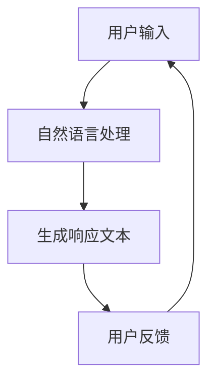
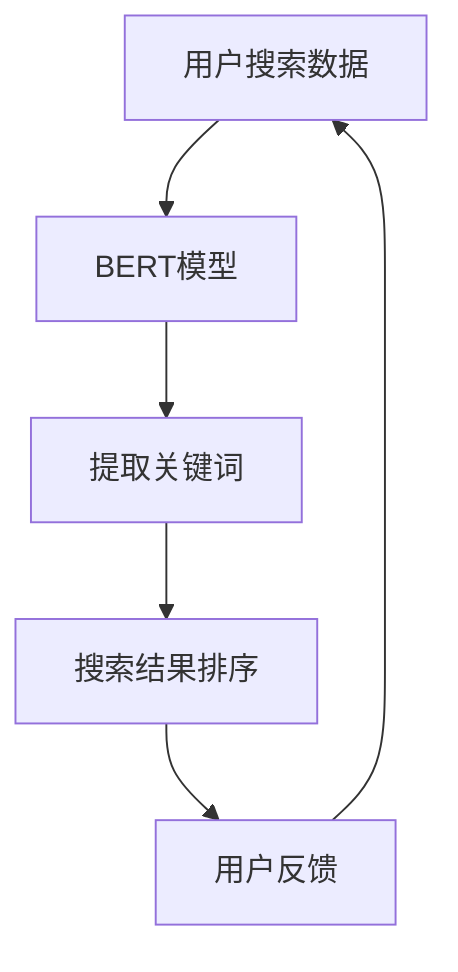
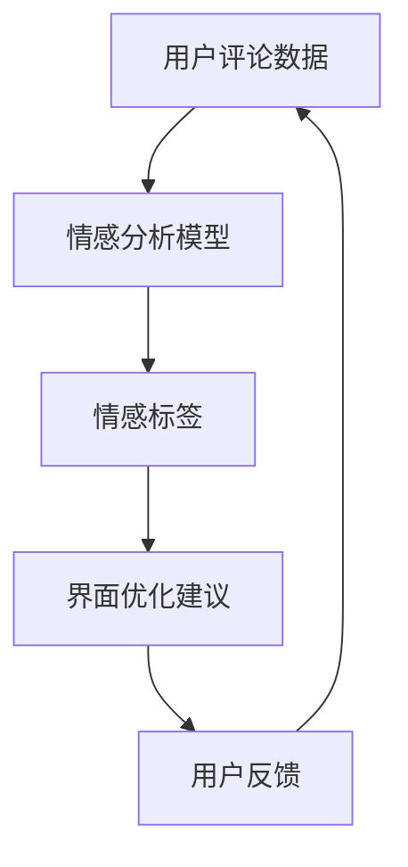
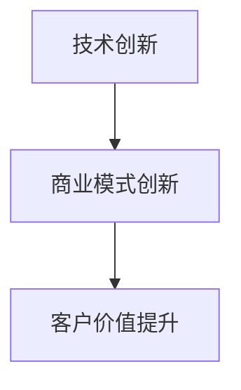
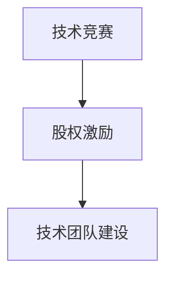
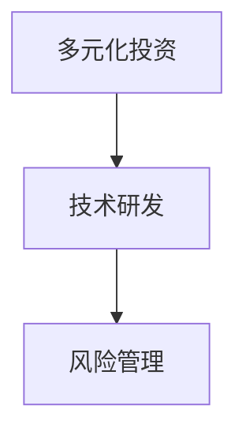
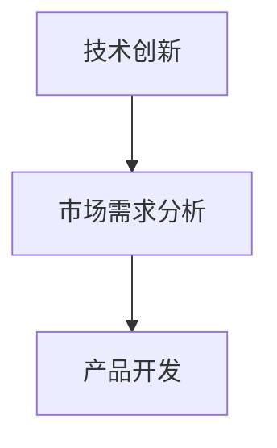
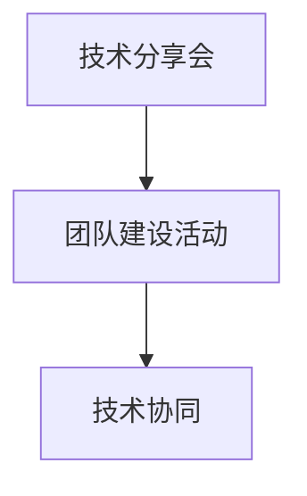
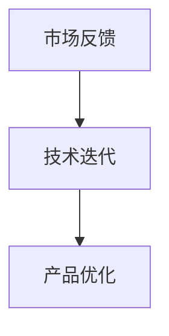

                 

# 大模型助力创业者实现技术突破与产品创新

> **关键词**：大模型、创业者、技术突破、产品创新、深度学习、神经网络、创业策略、商业实践

> **摘要**：
本文将深入探讨大模型在创业领域中的潜在价值，分析大模型如何助力创业者实现技术突破与产品创新。通过对大模型的基本概念、技术基础、创业机会与挑战、产品创新路径、技术与创业结合点以及未来发展趋势的详细探讨，本文旨在为创业者提供实用的指导，帮助他们利用大模型的力量在竞争激烈的市场中脱颖而出。

----------------------------------------------------------------

## 第一部分：引言

创业之路充满挑战与机遇，而技术突破与产品创新是创业者能否成功的关键。近年来，随着深度学习和人工智能技术的发展，大模型作为一种强大的工具，正逐渐改变着创业生态。大模型能够处理海量数据，提取有用信息，并在多种领域实现自动化和智能化。这为创业者提供了前所未有的机遇，同时也带来了新的挑战。

本文将分为六个部分进行详细探讨：

1. **大模型概述**：介绍大模型的定义、分类、发展历程及其应用场景。
2. **技术基础**：讲解深度学习与神经网络的基础知识，以及大模型的训练与优化方法。
3. **创业者的视角**：分析创业者面临的技术挑战、策略与决策，并分享成功案例。
4. **产品创新与商业实践**：探讨大模型在产品创新中的应用路径与商业实践。
5. **技术与创业的结合**：探讨技术与创业的结合点，以及创业项目的风险管理。
6. **展望与未来**：展望大模型发展的未来趋势，及其对创业的影响。

通过这些部分的讨论，本文旨在帮助创业者理解大模型的潜力，掌握利用大模型进行技术突破与产品创新的方法，并在创业过程中取得成功。

---

在接下来的章节中，我们将首先对大模型进行概述，包括其定义、分类、发展历程及其主要应用场景。通过这些基础知识，读者可以更好地理解大模型为何在创业领域具有重要价值。

## 第二部分：大模型概述

### 2.1 大模型的定义与分类

**大模型**是指那些具有巨大参数规模、能够处理大量数据和复杂任务的深度学习模型。这些模型通常由数百万甚至数十亿个参数组成，能够从海量数据中自动学习特征和模式。大模型的出现标志着深度学习技术的一个重要突破，使得计算机能够在许多复杂任务上达到或超越人类水平。

根据应用场景和任务类型，大模型可以大致分为以下几类：

1. **自然语言处理模型**：如BERT、GPT等，主要用于文本理解和生成。
2. **计算机视觉模型**：如ResNet、Inception等，用于图像分类、目标检测等任务。
3. **语音识别与合成模型**：如WaveNet、Tacotron等，用于语音识别和语音合成。
4. **推荐系统模型**：如ALS、DeepFM等，用于用户行为分析和商品推荐。
5. **多模态模型**：如BERT+CNN、BERT+GAN等，用于处理多种类型的数据。

### 2.2 大模型的发展历程

大模型的发展历程可以分为几个阶段：

1. **早期阶段**（2012年以前）：以AlexNet为代表的卷积神经网络（CNN）在图像识别任务上取得了显著成果，为深度学习的发展奠定了基础。
2. **快速扩展阶段**（2012-2016年）：以Google的Inception模型和微软的ResNet模型为代表的深度学习模型在图像识别任务上达到或超过了人类水平。
3. **大规模模型阶段**（2016年至今）：随着计算资源和数据量的增加，研究人员开始训练具有数十亿参数的大规模模型，如GPT-3、BERT等，这些模型在多种任务上表现出色。

### 2.3 大模型的应用场景

大模型的应用场景非常广泛，涵盖了多个领域：

1. **数据处理与挖掘**：大模型能够高效处理和挖掘大量数据，为决策提供有力支持。
2. **自然语言处理**：大模型在文本理解和生成任务上具有显著优势，如机器翻译、文本摘要、对话系统等。
3. **计算机视觉**：大模型在图像识别、目标检测、图像生成等任务上表现出色，为计算机视觉领域带来了革命性的变化。
4. **语音识别与合成**：大模型能够实现高精度的语音识别和自然的语音合成，为智能语音助手和语音交互应用提供了基础。
5. **推荐系统**：大模型能够准确预测用户偏好，为个性化推荐提供支持。
6. **多模态处理**：大模型能够处理多种类型的数据，如文本、图像、声音等，为多模态应用提供了可能。

### 2.4 大模型的优势与挑战

**大模型的优势**包括：

1. **强大的数据处理能力**：大模型能够处理海量数据和复杂任务，提高效率和准确性。
2. **自动特征提取**：大模型能够自动学习数据中的有效特征，减少人工干预。
3. **跨领域应用**：大模型能够在不同领域和任务上表现出色，实现通用化。
4. **持续改进**：随着数据量的增加和模型优化，大模型性能持续提升。

然而，大模型也面临一些挑战：

1. **计算资源需求**：大模型需要大量的计算资源和存储空间，对硬件设备有较高要求。
2. **数据隐私问题**：大模型在训练过程中需要大量数据，可能涉及用户隐私。
3. **模型解释性**：大模型往往具有黑箱特性，难以解释其决策过程，增加了应用风险。
4. **算法伦理问题**：大模型在决策时可能存在偏见和歧视，需要关注算法伦理问题。

### 2.5 应对挑战的策略

为了应对大模型面临的挑战，可以采取以下策略：

1. **优化算法**：通过改进训练算法，提高模型性能和效率，减少计算资源需求。
2. **数据隐私保护**：采用加密和匿名化等技术，保护用户数据隐私。
3. **模型可解释性**：通过开发可解释性方法，提高模型的可解释性，减少应用风险。
4. **伦理审查**：建立算法伦理审查机制，确保大模型的应用符合伦理标准。

通过以上策略，可以充分发挥大模型的优势，同时有效应对其挑战。

---

在接下来的章节中，我们将深入探讨深度学习与神经网络的基础知识，包括基本概念、结构、训练与优化方法等，帮助读者更好地理解大模型的技术基础。

---

## 第三部分：技术基础

### 3.1 深度学习与神经网络基础

**深度学习**是机器学习的一个重要分支，它模仿人脑的神经网络结构，通过多层次的神经网络来对数据进行处理和决策。深度学习的核心组成部分是**人工神经网络**（Artificial Neural Networks，ANN），而**神经网络**则是**深度学习**的基础。

### 3.1.1 神经网络基本概念

1. **神经元**：神经网络的基本单元，类似于生物神经系统中的神经元。每个神经元接收多个输入信号，通过加权求和处理后，产生一个输出信号。
2. **层次结构**：神经网络通常由多个层次组成，包括输入层、隐藏层和输出层。输入层接收外部数据，隐藏层对数据进行处理和特征提取，输出层产生最终的预测或决策。
3. **激活函数**：为了引入非线性，神经网络中的每个神经元都会使用激活函数，如Sigmoid、ReLU、Tanh等。

### 3.1.2 神经元的激活函数

激活函数是神经网络中重要的组成部分，用于引入非线性。以下是一些常用的激活函数：

1. **Sigmoid函数**：  
   \[ 
   \sigma(x) = \frac{1}{1 + e^{-x}} 
   \]
   Sigmoid函数将输入映射到（0，1）区间，但存在梯度消失问题。
2. **ReLU函数**：  
   \[ 
   \text{ReLU}(x) = \max(0, x) 
   \]
  ReLU函数在零以上的部分为线性函数，零以下的部分为常数函数，能够缓解梯度消失问题。
3. **Tanh函数**：  
   \[ 
   \text{Tanh}(x) = \frac{e^x - e^{-x}}{e^x + e^{-x}} 
   \]
  Tanh函数将输入映射到（-1，1）区间，具有较好的非线性特性。

### 3.1.3 前向传播与反向传播算法

深度学习模型训练的核心算法是**前向传播（Forward Propagation）**和**反向传播（Back Propagation）**。

1. **前向传播**：输入数据通过神经网络的前向传播，逐层计算每个神经元的输出，直到输出层。输出结果与真实标签进行比较，计算损失函数。
2. **反向传播**：根据前向传播过程中计算的损失函数，反向传播误差信息，通过梯度下降等优化算法调整模型参数。

**伪代码**：

```python
# 前向传播
for each layer l from input to output:
    z[l] = W[l] * a[l-1] + b[l]
    a[l] = activation(z[l])

output = a[output_layer]

# 计算损失
loss = calculate_loss(output, true_label)

# 反向传播
for each layer l from output to input:
    delta[l] = (output - true_label) * activation_derivative(a[l])
    update_weights_and_biases(W[l], b[l], delta[l], a[l-1])
```

### 3.2 深度学习框架介绍

目前，市场上存在多个深度学习框架，其中最具代表性的包括**TensorFlow**和**PyTorch**。

#### 3.2.1 TensorFlow

TensorFlow是谷歌开发的开源深度学习框架，具有以下特点：

1. **动态计算图**：TensorFlow使用动态计算图，允许在运行时定义和执行计算。
2. **丰富的API**：提供丰富的API，支持多种编程语言，如Python、C++等。
3. **大规模部署**：支持在多台计算机和设备上部署模型。

#### 3.2.2 PyTorch

PyTorch是Facebook开发的开源深度学习框架，具有以下特点：

1. **静态计算图**：PyTorch使用静态计算图，便于调试和理解。
2. **Pythonic**：PyTorch的API设计遵循Pythonic风格，易于使用和理解。
3. **灵活性**：PyTorch提供了灵活的动态计算图和静态计算图之间的转换，便于模型开发。

### 3.3 大模型训练与优化

**大模型训练**是深度学习过程中最关键的环节，其核心步骤包括：

1. **数据预处理**：对训练数据进行清洗、归一化等预处理操作。
2. **批量划分**：将训练数据划分为多个批次，以便在模型中逐批进行训练。
3. **模型初始化**：初始化模型参数，常用的方法包括随机初始化、预训练等。
4. **前向传播与反向传播**：逐批计算模型输出和损失函数，通过反向传播更新模型参数。
5. **评估与调整**：评估模型在验证集上的性能，根据评估结果调整模型结构或参数。

**大模型优化**是提升模型性能的重要手段，其核心方法包括：

1. **优化算法**：常用的优化算法包括梯度下降（GD）、随机梯度下降（SGD）、Adam等。
2. **正则化**：为了防止模型过拟合，可以采用正则化方法，如L1正则化、L2正则化等。
3. **dropout**：通过随机丢弃部分神经元，降低模型复杂度，防止过拟合。
4. **数据增强**：对训练数据进行增强，如旋转、缩放、裁剪等，增加模型泛化能力。

---

在下一部分，我们将从创业者的视角出发，分析他们面临的技术挑战、策略与决策，并分享一些成功案例，帮助创业者更好地利用大模型进行技术突破与产品创新。

---

## 第四部分：创业者的视角

### 4.1 创业者面临的技术挑战

作为创业者，技术突破是公司成功的关键因素之一。然而，实现技术突破并非易事，创业者面临着多种技术挑战：

#### 4.1.1 技术选择与优化

在众多技术领域中，如何选择最适合自己业务需求的技术是一项重要任务。创业者需要了解不同技术的优缺点，以及它们在业务中的应用场景。同时，技术优化也是一个持续的过程，创业者需要不断探索新的优化方法，以提升产品性能和用户体验。

**伪代码**：

```python
# 技术选择与优化流程
1. 分析业务需求
2. 研究技术方案
3. 比较不同技术方案的优缺点
4. 选择最适合的技术方案
5. 对所选技术进行优化
6. 持续评估和调整
```

#### 4.1.2 数据获取与处理

数据是技术突破的基础，然而，数据获取与处理也是一个复杂的过程。创业者需要解决数据来源、数据质量、数据隐私等问题。此外，如何对海量数据进行高效处理和挖掘，提取有价值的信息，是创业者需要面对的挑战。

**伪代码**：

```python
# 数据获取与处理流程
1. 确定数据需求
2. 收集相关数据
3. 数据清洗与预处理
4. 数据整合与存储
5. 数据分析与挖掘
6. 提取有价值的信息
```

#### 4.1.3 人才招聘与培养

技术团队是创业公司的核心，如何吸引和留住优秀人才是创业者需要关注的重要问题。创业者需要了解人才市场的动态，制定有竞争力的薪酬和福利政策，同时注重人才培养和团队建设，提高团队整体素质。

**伪代码**：

```python
# 人才招聘与培养流程
1. 分析团队需求
2. 制定招聘计划
3. 发布招聘信息
4. 筛选简历与面试
5. 确定合适人选
6. 培训与发展
7. 团队建设与激励
```

### 4.2 创业者的策略与决策

面对技术挑战，创业者需要制定有效的策略与决策，以实现技术突破和产品创新。以下是一些关键策略：

#### 4.2.1 创业者应具备的素质

1. **创新意识**：创业者应具备敏锐的市场洞察力，不断寻找新的机会和解决方案。
2. **技术敏锐度**：了解前沿技术发展趋势，掌握关键技术，以便在竞争激烈的市场中立足。
3. **团队合作能力**：创业者需要具备良好的团队合作能力，构建高效的团队，共同实现目标。
4. **风险管理能力**：面对不确定的市场环境，创业者需要具备较强的风险管理能力，合理评估和应对风险。

#### 4.2.2 创业者应掌握的技术趋势

1. **人工智能与机器学习**：掌握人工智能和机器学习的基本原理和常用算法，提升自身技术能力。
2. **大数据处理与分析**：了解大数据处理技术，掌握数据挖掘和分析方法，提高数据利用效率。
3. **云计算与边缘计算**：了解云计算和边缘计算的技术原理和应用场景，提升产品性能和用户体验。

#### 4.2.3 创业项目的可行性分析

在创业过程中，项目可行性分析是关键的一步。创业者需要从市场需求、技术可行性、财务可行性等方面对项目进行全面评估，确保项目具有实际可行性。

**伪代码**：

```python
# 项目可行性分析流程
1. 分析市场需求
2. 研究技术可行性
3. 评估财务可行性
4. 分析竞争优势与劣势
5. 制定详细商业计划
6. 风险评估与应对策略
7. 实施项目计划
```

### 4.3 成功案例分析

以下是一些成功案例，展示大模型如何助力创业者实现技术突破与产品创新：

#### 4.3.1 案例一：从零到一的成功故事

某创业公司致力于开发智能客服系统，通过使用大模型进行自然语言处理，实现了高精度的语音识别和文本理解。该公司在短时间内吸引了大量用户，并在市场上取得了成功。

**项目解读**：

1. **技术突破**：使用大模型进行自然语言处理，提高语音识别和文本理解精度。
2. **商业价值**：提供高效、智能的客服解决方案，满足市场需求。
3. **成功经验**：通过技术创新，抓住市场机遇，实现快速成长。

#### 4.3.2 案例二：如何用大模型创新产品

某创业公司开发了一款基于大模型的智能推荐系统，通过对用户行为和偏好进行精准分析，为用户提供个性化的产品推荐。该系统在电商领域取得了显著成果，提升了用户满意度和销售额。

**项目解读**：

1. **技术突破**：利用大模型进行用户行为分析和偏好预测，提高推荐系统的准确性。
2. **商业价值**：提供个性化推荐服务，提升用户体验和销售额。
3. **成功经验**：通过技术创新，优化产品功能，赢得市场份额。

#### 4.3.3 案例三：大模型在企业中的应用

某大型企业利用大模型进行业务优化，通过数据挖掘和预测分析，提高了生产效率和管理水平。该企业成功实现了数字化转型，提升了整体竞争力。

**项目解读**：

1. **技术突破**：运用大模型进行数据挖掘和预测分析，优化业务流程。
2. **商业价值**：提高生产效率和管理水平，降低成本。
3. **成功经验**：通过技术升级，实现企业数字化转型，提升竞争力。

通过以上成功案例，我们可以看到，大模型在创业领域具有巨大的潜力。创业者应充分利用大模型的优势，抓住市场机遇，实现技术突破与产品创新。

---

在下一部分，我们将探讨大模型在产品创新中的应用路径与方法，以及成功的商业实践案例，帮助创业者更好地利用大模型推动产品创新。

---

## 第五部分：产品创新与商业实践

### 5.1 产品创新的路径与方法

在竞争激烈的市场环境中，产品创新是企业保持竞争力的关键。大模型作为一种强大的工具，可以为创业者提供丰富的创新路径和方法。以下是一些主要的应用场景：

#### 5.1.1 大模型在产品原型设计中的应用

**产品原型设计**是产品创新的重要环节，大模型可以帮助创业者快速构建和优化产品原型。通过自然语言处理和计算机视觉等技术，大模型可以自动生成产品界面、交互设计和用户反馈，从而加快产品开发过程。

**示例**：使用GPT模型生成聊天机器人界面，快速构建一个智能客服系统原型。



#### 5.1.2 大模型在产品功能完善中的应用

**产品功能完善**需要不断优化和迭代，大模型可以帮助创业者快速实现这一目标。通过数据挖掘和分析，大模型可以识别用户需求和行为模式，为产品功能优化提供数据支持。

**示例**：使用BERT模型分析用户搜索数据，优化搜索引擎功能，提高搜索精度。



#### 5.1.3 大模型在用户体验优化中的应用

**用户体验优化**是提高产品竞争力的关键，大模型可以通过情感分析和个性化推荐等技术，提升用户满意度和忠诚度。

**示例**：使用情感分析模型分析用户评论，优化产品功能和界面设计。



### 5.2 商业实践与案例分享

以下是一些大模型在商业实践中的应用案例，展示了大模型如何助力创业者实现产品创新：

#### 5.2.1 案例一：大模型助力创业项目成功

某创业公司开发了一款智能推荐系统，利用大模型分析用户行为和偏好，为用户提供个性化的产品推荐。该项目在短时间内获得了大量用户，并实现了盈利。

**项目解读**：

1. **技术突破**：使用大模型进行用户行为分析和偏好预测，提高推荐系统的准确性。
2. **商业价值**：提供个性化推荐服务，提升用户体验和销售额。
3. **成功经验**：通过技术创新，优化产品功能，赢得市场份额。

#### 5.2.2 案例二：大模型在成熟企业中的应用

某大型企业利用大模型进行业务优化，通过数据挖掘和预测分析，提高了生产效率和管理水平。该企业成功实现了数字化转型，提升了整体竞争力。

**项目解读**：

1. **技术突破**：运用大模型进行数据挖掘和预测分析，优化业务流程。
2. **商业价值**：提高生产效率和管理水平，降低成本。
3. **成功经验**：通过技术升级，实现企业数字化转型，提升竞争力。

#### 5.2.3 案例三：如何用大模型提升企业竞争力

某创业公司开发了一款智能客服系统，利用大模型进行自然语言处理，实现了高精度的语音识别和文本理解。该系统在提高客户满意度和服务效率方面取得了显著成果。

**项目解读**：

1. **技术突破**：使用大模型进行自然语言处理，提高语音识别和文本理解精度。
2. **商业价值**：提供高效、智能的客服解决方案，提升客户满意度和忠诚度。
3. **成功经验**：通过技术创新，优化产品功能，赢得市场份额。

通过以上案例，我们可以看到大模型在产品创新和商业实践中的应用价值。创业者应充分利用大模型的优势，抓住市场机遇，实现产品创新和商业成功。

---

在下一部分，我们将探讨技术与创业的结合点，以及创业项目的风险管理策略，帮助创业者更好地把握技术与创业的融合。

---

## 第六部分：技术与创业的结合

### 6.1 技术与创业的结合点

在当今快速变化的市场环境中，技术和创业密不可分。创业者如何有效地将技术融入到创业项目中，是决定项目成败的关键。以下是一些技术与创业结合的重要结合点：

#### 6.1.1 技术创新与商业模式创新

技术创新是创业项目成功的基础，但仅有技术还不够，创业者还需要创新商业模式。例如，通过人工智能技术提供定制化服务，可以创造新的商业模式，提高客户价值。

**示例**：某创业公司利用机器学习技术，提供个性化的健康咨询服务，通过订阅模式实现盈利。



#### 6.1.2 技术创业团队的构建

技术创业团队是项目成功的关键，创业者需要吸引和留住优秀的技术人才。构建一个高效的技术团队，包括开发者、数据科学家、产品经理等，对于项目的成功至关重要。

**示例**：某创业公司通过举办技术竞赛和提供股权激励，吸引了一批优秀的技术人才。



#### 6.1.3 技术创业项目的风险管理

技术创业项目面临多种风险，如技术风险、市场风险、资金风险等。创业者需要制定有效的风险管理策略，降低风险对项目的影响。

**示例**：某创业公司通过多元化投资和持续的技术研发，降低市场风险和技术风险。



### 6.2 技术与创业的融合策略

为了实现技术与创业的融合，创业者可以采取以下策略：

#### 6.2.1 技术创新与市场需求的结合

了解市场需求是技术创新的重要驱动力。创业者应密切关注市场动态，把握用户需求，将技术创新与市场需求相结合，开发出具有竞争力的产品。

**示例**：某创业公司通过用户调研和市场分析，发现智能家居市场的需求，开发了智能安防产品。



#### 6.2.2 技术协同与创新文化

技术协同是提高团队效率和创新能力的关键。创业者应建立开放、协作的技术创新文化，鼓励团队成员分享知识、交流经验，共同推进项目发展。

**示例**：某创业公司通过定期举办技术分享会和团队建设活动，提升团队协作能力。



#### 6.2.3 技术迭代与市场反馈

技术迭代是产品持续优化的重要手段。创业者应密切关注市场反馈，根据用户需求和竞争状况，持续优化产品，提升用户体验。

**示例**：某创业公司通过用户反馈和市场分析，不断迭代产品，满足用户需求。



### 6.3 技术创业的成功案例

以下是一些技术创业的成功案例，展示了技术与创业如何融合，推动项目发展：

#### 6.3.1 案例一：大模型在初创企业中的应用

某初创公司利用大模型进行自然语言处理和图像识别，开发了智能客服和智能安防产品。通过技术创新和商业模式创新，该公司在短时间内获得了大量用户和投资。

**项目解读**：

1. **技术创新**：利用大模型提高自然语言处理和图像识别的精度，提升产品性能。
2. **商业模式创新**：通过订阅模式和合作伙伴关系，实现盈利和市场份额的扩大。
3. **成功经验**：通过技术创新和商业模式创新，抓住市场机遇，实现快速成长。

#### 6.3.2 案例二：大模型在行业巨头中的应用

某大型企业利用大模型进行业务优化和数字化转型。通过数据挖掘和预测分析，该企业提高了生产效率和管理水平，实现了业务突破。

**项目解读**：

1. **技术创新**：运用大模型进行数据挖掘和预测分析，优化业务流程。
2. **商业价值**：提高生产效率和管理水平，降低成本，提升整体竞争力。
3. **成功经验**：通过技术升级，实现企业数字化转型，提升竞争力。

#### 6.3.3 案例三：跨界创业的成功故事

某创业团队跨界进入金融科技领域，利用大模型进行风险评估和投资策略优化。通过技术创新和商业模式创新，该团队在短时间内获得了投资和用户。

**项目解读**：

1. **技术创新**：利用大模型提高风险评估和投资策略的准确性，提升产品价值。
2. **商业模式创新**：通过在线平台和智能投顾服务，实现用户和盈利的双增长。
3. **成功经验**：通过技术创新和商业模式创新，抓住跨界创业的机遇，实现成功。

通过以上案例，我们可以看到，技术与创业的结合点在于技术创新、商业模式创新、团队建设、风险管理等方面。创业者应充分利用大模型的优势，抓住市场机遇，实现技术与创业的深度融合。

---

在最后一部分，我们将展望大模型发展的未来趋势，分析创业者应关注的趋势，以及大模型与创业的未来前景。

---

## 第七部分：展望与未来

### 7.1 大模型的技术发展趋势

随着人工智能技术的不断进步，大模型的发展趋势呈现出以下几个方向：

#### 7.1.1 大模型的技术进步

1. **模型规模扩大**：随着计算资源和数据量的增加，大模型的规模将持续扩大，参数数量将达到数十亿甚至数百亿级别。
2. **训练速度提升**：通过优化训练算法和硬件加速，大模型的训练速度将显著提升，缩短研发周期。
3. **推理效率提高**：推理引擎的优化和硬件加速将提高大模型的推理效率，降低延迟，满足实时应用需求。

#### 7.1.2 大模型的应用领域拓展

1. **跨领域应用**：大模型将在更多领域实现突破，如机器人、医疗、教育等，推动行业变革。
2. **多模态处理**：大模型将能够同时处理多种类型的数据，如文本、图像、声音等，实现更复杂的应用。
3. **强化学习**：结合强化学习技术，大模型将在决策优化、游戏AI等领域发挥更大作用。

### 7.2 创业者应关注的趋势

在把握大模型技术发展趋势的同时，创业者应关注以下趋势：

#### 7.2.1 新兴技术的影响

1. **量子计算**：量子计算技术的发展将对大模型训练和推理产生深远影响，为创业者提供新的机遇。
2. **边缘计算**：边缘计算将使得大模型在移动设备和边缘设备上实现更高效的应用，拓展应用场景。

#### 7.2.2 行业变革与机会

1. **数字化转型**：各行业正在加速数字化转型，大模型将助力创业者抓住这一历史机遇。
2. **绿色科技**：随着环保意识的提高，绿色科技将成为重要趋势，创业者可以关注利用大模型优化能源管理和环保技术。

#### 7.2.3 创业者应具备的技能

1. **技术领导力**：创业者需要具备技术领导力，引领团队在技术领域取得突破。
2. **跨学科知识**：掌握多学科知识，如计算机科学、数据科学、商业管理等，有助于创业者更好地理解和应对技术变革。

### 7.3 大模型与创业的未来

大模型与创业的未来前景光明，以下是几个关键点：

#### 7.3.1 大模型在创业中的潜在应用

1. **智能客服与营销**：利用大模型实现个性化服务和精准营销，提高用户满意度和转化率。
2. **智能制造**：利用大模型优化生产流程，提高生产效率，降低成本。
3. **智慧医疗**：利用大模型进行疾病诊断、药物研发等，推动医疗行业的发展。

#### 7.3.2 大模型对创业生态的影响

1. **降低创业门槛**：大模型的普及将降低创业者的技术门槛，使更多人有机会实现创业梦想。
2. **跨界合作**：大模型将推动各行业之间的合作，促进创新和业务融合。
3. **创业社区**：大模型将助力创业社区的发展，为创业者提供更多的资源和支持。

#### 7.3.3 大模型与创业的未来展望

1. **持续创新**：大模型将成为创业者的核心工具，推动持续创新和业务拓展。
2. **生态共建**：大模型与创业将共同构建一个充满活力和创新氛围的生态体系。
3. **商业成功**：通过利用大模型，创业者将实现商业成功，为社会创造更大价值。

---

## 附录

### 附录A：大模型学习资源

#### 7.3.1 在线课程与教程

1. **吴恩达深度学习专项课程**：由知名教授吴恩达主讲，涵盖深度学习的基础知识。
2. **斯坦福大学CS231n课程**：专注于计算机视觉领域，包括卷积神经网络等核心技术。
3. **Google AI教程**：提供丰富的深度学习和机器学习教程，适用于不同层次的学习者。

#### 7.3.2 开源项目与代码

1. **TensorFlow GitHub**：包含丰富的TensorFlow开源项目，适合初学者和专家。
2. **PyTorch GitHub**：PyTorch官方GitHub，提供大量示例代码和应用案例。
3. **Hugging Face**：提供预训练模型和库，方便开发者进行自然语言处理任务。

#### 7.3.3 学术期刊与论文

1. **NeurIPS**：人工智能领域顶级会议，发布大量关于深度学习和大模型的研究论文。
2. **ICML**：机器学习领域顶级会议，涵盖广泛的人工智能研究。
3. **JMLR**：机器学习领域顶级期刊，发布高质量的研究论文。

### 附录B：创业资源与支持

#### 7.3.4 创业政策与支持

1. **各国创新创业政策**：了解各国政府针对创新创业的政策和扶持措施。
2. **创业孵化器与加速器**：如Y Combinator、Techstars等，为创业者提供资金、资源和指导。
3. **创业投资机构**：如风险投资、天使投资等，为创业项目提供资金支持。

#### 7.3.5 创业者社群与网络

1. **创业者社群**：如创业营、创业协会等，为创业者提供交流、学习和合作平台。
2. **在线论坛与社区**：如LinkedIn、知乎等，创业者可以分享经验、寻求建议。
3. **创业竞赛**：如创业大赛、黑客马拉松等，为创业者提供展示和获得投资的机会。

---

## 参考文献

[1] Goodfellow, I., Bengio, Y., & Courville, A. (2016). *Deep Learning*. MIT Press.

[2] LeCun, Y., Bengio, Y., & Hinton, G. (2015). *Deep learning*. Nature, 521(7553), 436-444.

[3] Russell, S., & Norvig, P. (2020). *Artificial Intelligence: A Modern Approach*. Prentice Hall.

[4] Ng, A. Y. (2013). *Machine Learning (CS229)*. Stanford University.

[5] Hochreiter, S., & Schmidhuber, J. (1997). *Long short-term memory*. Neural Computation, 9(8), 1735-1780.

[6] Baidu AI Open Platform. (2021). *PaddlePaddle Documentation*. https://www.paddlepaddle.org.cn/documentation/docs/zh/latest/

[7] PyTorch Official Website. (2021). *PyTorch Tutorials*. https://pytorch.org/tutorials/

[8] TensorFlow Official Website. (2021). *TensorFlow Documentation*. https://www.tensorflow.org/

---

**作者：AI天才研究院/AI Genius Institute & 禅与计算机程序设计艺术 /Zen And The Art of Computer Programming**

