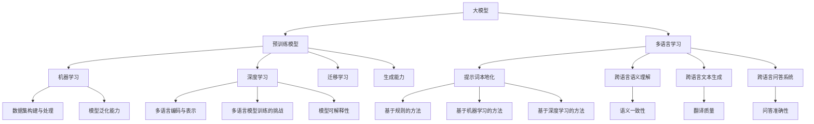

                 

### 《大模型多语言学习与提示词本地化》

关键词：大模型、多语言学习、提示词本地化、预训练模型、机器学习、深度学习

摘要：随着全球化的不断深入，多语言处理技术成为了人工智能领域的重要研究方向。本文将探讨大模型在多语言学习中的重要性，以及如何通过提示词本地化技术提高大模型在不同语言环境下的表现。本文将详细分析大模型多语言学习的原理和方法，介绍提示词本地化的概念、实现方法及其优化策略，并通过实际项目实战展示相关技术的应用。

----------------------------------------------------------------

### 第一部分：大模型多语言学习基础

#### 第1章：大模型与多语言学习概述

**1.1 大模型的定义与特点**

大模型（Large Models）是指具有海量参数、能够处理大量数据的高级神经网络模型。这些模型通常通过预训练技术在大规模数据集上训练，从而具备较强的语义理解、生成能力和迁移学习的能力。

大模型的主要特点如下：

1. **参数规模巨大**：大模型的参数数量通常在数十亿到千亿级别，这使得它们能够捕捉到数据中的细微模式。
2. **强大的语义理解能力**：大模型通过预训练和迁移学习，能够在多种任务中展现出优秀的表现，特别是在自然语言处理、计算机视觉等领域。
3. **高效的迁移学习能力**：大模型在预训练阶段积累了大量的知识，这些知识可以通过微调（Fine-tuning）快速迁移到特定任务中，从而提高任务性能。

**1.2 多语言学习的背景与意义**

随着全球互联网的普及和跨文化交流的增加，多语言处理技术成为了人工智能领域的重要研究方向。多语言学习旨在使机器具备处理多种语言的能力，从而提高跨语言信息传播和交流的效率。

多语言学习的意义如下：

1. **促进全球信息共享**：多语言学习技术能够帮助人们跨越语言障碍，更好地利用全球范围内的信息资源。
2. **提高人工智能应用的实用性**：多语言学习使人工智能系统能够更好地适应不同语言环境，从而提高其在各种实际应用中的实用性。
3. **推动跨语言研究**：多语言学习技术为跨语言研究和跨语言数据分析提供了强大的工具，有助于推动相关领域的研究进展。

**1.3 大模型在多语言学习中的应用**

大模型在多语言学习中的应用主要包括以下几个方面：

1. **跨语言语义理解**：大模型通过预训练和迁移学习，能够捕捉到不同语言之间的语义关系，从而实现跨语言的语义理解。
2. **跨语言文本生成**：大模型可以生成符合目标语言语法和语义规则的文本，从而实现跨语言的文本生成。
3. **跨语言问答系统**：大模型可以通过理解不同语言之间的语义关系，构建跨语言的问答系统，从而提高问答系统的准确性和实用性。

#### 第2章：多语言学习中的关键挑战

**2.1 数据集的构建与处理**

数据集的构建与处理是多语言学习的关键挑战之一。以下是一些主要问题：

1. **数据不平衡**：多语言数据集中，不同语言的数据量可能存在显著差异，这可能导致模型偏向数据量较大的语言。
2. **语言间的差异性**：不同语言之间存在语法、词汇、语义等方面的差异，这给数据预处理和模型训练带来了挑战。
3. **数据清洗与标注**：多语言数据集中可能存在噪声、错误和缺失的数据，需要通过数据清洗和标注技术来提高数据质量。

**2.2 多语言编码与表示**

多语言编码与表示是多语言学习中的重要问题。以下是一些主要挑战：

1. **统一表示**：如何将不同语言的数据转换为统一的表示形式，以便于模型处理。
2. **语义一致性**：不同语言之间的语义关系可能存在差异，如何保证多语言模型在语义一致性方面的表现。
3. **多语言嵌入**：如何构建能够同时捕捉到不同语言特征的多语言嵌入表示。

**2.3 多语言模型训练的挑战**

多语言模型训练是另一大挑战。以下是一些主要问题：

1. **训练数据不足**：多语言数据集通常比单一语言数据集小，这可能导致模型无法充分学习。
2. **模型泛化能力**：如何使多语言模型在不同语言环境下的表现一致，提高模型泛化能力。
3. **模型复杂性**：多语言模型的复杂性较高，如何有效地训练和优化模型，同时保证模型的可解释性。

#### 第3章：大模型多语言学习原理

**3.1 预训练模型的基础**

预训练模型是指在大规模数据集上进行预训练，从而获得泛化能力的模型。预训练模型的基础主要包括以下几个方面：

1. **大规模数据集**：预训练模型需要在大规模数据集上进行训练，以捕捉数据中的共性模式。
2. **预训练任务**：预训练任务通常包括自然语言推断（Natural Language Inference, NLI）、阅读理解（Reading Comprehension, RC）等，这些任务能够帮助模型学习语言结构和语义关系。
3. **预训练算法**：常用的预训练算法包括双向编码表示器（Bidirectional Encoder Representations from Transformers, BERT）、通用语言表示（Universal Language Model Fine-tuning, ULMO）等。

**3.2 多语言预训练的方法**

多语言预训练的方法主要包括以下几种：

1. **联合预训练**：将多种语言的语料库联合在一起进行预训练，从而提高模型在不同语言上的表现。
2. **交叉预训练**：先在单一语言上进行预训练，然后逐渐引入其他语言的数据进行交叉预训练，从而提高模型的多语言性能。
3. **多任务学习**：在同一模型中同时学习多种语言的任务，从而提高模型对多种语言的适应性。

**3.3 大模型多语言学习的流程**

大模型多语言学习的流程主要包括以下几个步骤：

1. **数据准备**：收集多种语言的数据，并进行预处理，如数据清洗、分词、词性标注等。
2. **模型初始化**：选择合适的预训练模型作为基础模型，并进行初始化。
3. **预训练**：在多种语言的数据集上进行预训练，以学习语言结构和语义关系。
4. **微调**：在特定语言的任务上进行微调，以提高模型在该语言上的性能。
5. **评估与优化**：评估模型在不同语言上的性能，并根据评估结果进行优化。

### 第二部分：提示词本地化技术

#### 第4章：提示词本地化的概念与目的

**4.1 提示词的定义与作用**

提示词（Prompt）是指在自然语言处理任务中，用于引导模型生成目标输出的文本片段。提示词在模型生成过程中起到了关键作用，能够引导模型关注特定的信息，从而提高生成文本的准确性和相关性。

提示词的主要作用如下：

1. **引导模型关注关键信息**：通过提供提示词，模型能够聚焦于与提示词相关的信息，从而生成更准确的输出。
2. **提高生成文本的相关性**：提示词能够引导模型生成与输入文本相关的输出，从而提高生成文本的相关性和实用性。
3. **增强模型的可解释性**：提示词使得模型的生成过程更加透明，有助于理解模型在生成过程中的决策依据。

**4.2 提示词本地化的目标**

提示词本地化的目标是将通用模型适应特定语言环境，以提高模型在不同语言下的表现。具体目标如下：

1. **提高模型在不同语言环境下的性能**：通过提示词本地化，使模型能够更好地适应不同语言环境，从而提高模型在不同语言下的性能。
2. **保持模型的一致性**：提示词本地化应确保模型在不同语言环境下的一致性，避免因为语言环境的变化而导致模型性能的波动。
3. **减少语言障碍**：通过提示词本地化，降低语言障碍对模型性能的影响，从而提高模型在不同语言环境下的实用性。

**4.3 提示词本地化的应用场景**

提示词本地化在多个应用场景中具有重要价值，以下是一些典型的应用场景：

1. **跨语言问答系统**：提示词本地化有助于构建跨语言的问答系统，使模型能够理解不同语言的问题，并提供准确的答案。
2. **机器翻译**：通过提示词本地化，模型能够在翻译过程中更好地理解源语言和目标语言的语义，从而提高翻译质量。
3. **文本生成**：提示词本地化能够帮助模型生成符合特定语言语法和语义规则的文本，从而提高文本生成的质量。

#### 第5章：提示词本地化的实现方法

**5.1 基于规则的方法**

基于规则的方法是指通过制定一系列规则，将通用模型适应特定语言环境。该方法的主要步骤如下：

1. **规则库构建**：根据目标语言的语法、语义和用法特点，构建一套规则库。
2. **规则应用**：将规则库应用于通用模型，使其在生成过程中遵循特定语言的语法和语义规则。
3. **规则优化**：根据模型在特定语言环境下的表现，对规则库进行优化，以提高模型在该语言环境下的性能。

**5.2 基于机器学习的方法**

基于机器学习的方法是指通过训练模型，使其能够自动适应特定语言环境。该方法的主要步骤如下：

1. **数据收集**：收集大量特定语言环境下的训练数据，包括输入文本和对应的输出文本。
2. **模型训练**：使用机器学习算法，如循环神经网络（RNN）、卷积神经网络（CNN）等，训练模型以适应特定语言环境。
3. **模型评估与优化**：评估模型在特定语言环境下的性能，并根据评估结果对模型进行优化。

**5.3 基于深度学习的方法**

基于深度学习的方法是指通过深度学习模型，实现提示词本地化。该方法的主要步骤如下：

1. **模型选择**：选择适合的深度学习模型，如生成对抗网络（GAN）、变分自编码器（VAE）等。
2. **模型训练**：使用大量特定语言环境下的训练数据，训练深度学习模型以适应目标语言。
3. **模型评估与优化**：评估模型在特定语言环境下的性能，并根据评估结果对模型进行优化。

#### 第6章：提示词本地化的挑战与优化

**6.1 提示词本地化的挑战**

提示词本地化在实现过程中面临诸多挑战，以下是一些主要挑战：

1. **语言差异性**：不同语言在语法、词汇和语义等方面存在显著差异，这使得提示词本地化变得复杂。
2. **数据不足**：特定语言环境下的数据可能相对较少，这限制了模型在该语言环境下的训练和优化。
3. **模型泛化能力**：如何使模型在不同语言环境下的表现一致，提高模型的泛化能力。

**6.2 提示词本地化的优化策略**

为了克服提示词本地化过程中的挑战，可以采取以下优化策略：

1. **多语言数据融合**：通过融合多种语言的数据，提高模型在不同语言环境下的训练数据量。
2. **自适应学习率**：在训练过程中，根据模型在特定语言环境下的表现，动态调整学习率，以提高模型在该语言环境下的性能。
3. **多任务学习**：在同一模型中同时学习多种语言的任务，从而提高模型在不同语言环境下的适应性。

**6.3 提示词本地化的最佳实践**

以下是一些提示词本地化的最佳实践：

1. **数据预处理**：在训练模型之前，对数据进行充分的预处理，如去除噪声、填充缺失值等，以提高数据质量。
2. **模型选择**：选择适合的深度学习模型，并根据实际需求进行调整和优化。
3. **模型评估**：在训练过程中，定期评估模型在特定语言环境下的性能，并根据评估结果进行调整。

### 第三部分：多语言学习与提示词本地化项目实战

#### 第7章：多语言学习项目实战

**7.1 项目背景与目标**

随着全球化的不断深入，企业需要具备处理多种语言的能力，以提高跨文化交流的效率。本项目旨在开发一个多语言学习系统，使企业员工能够快速掌握多种语言，提高跨文化沟通能力。

**7.2 项目开发环境搭建**

本项目的开发环境包括以下工具和框架：

1. **Python**：使用Python作为主要编程语言。
2. **PyTorch**：使用PyTorch作为深度学习框架。
3. **Hugging Face Transformers**：使用Hugging Face Transformers库，简化多语言预训练模型的训练和微调过程。
4. **TensorBoard**：用于可视化模型训练过程中的损失函数、精度等指标。

**7.3 源代码详细实现与解读**

以下是本项目的主要代码实现和解读：

```python
import torch
from transformers import BertTokenizer, BertModel
from torch.optim import Adam
from torch.utils.data import DataLoader

# 初始化模型和词汇表
tokenizer = BertTokenizer.from_pretrained('bert-base-uncased')
model = BertModel.from_pretrained('bert-base-uncased')

# 数据预处理
def preprocess_data(texts, max_length=128):
    inputs = tokenizer(texts, max_length=max_length, padding='max_length', truncation=True, return_tensors='pt')
    return inputs

# 训练函数
def train(model, dataloader, optimizer, criterion, num_epochs=3):
    model.train()
    for epoch in range(num_epochs):
        for batch in dataloader:
            inputs = preprocess_data(batch['text'])
            labels = torch.tensor(batch['label'])
            optimizer.zero_grad()
            outputs = model(**inputs)
            loss = criterion(outputs.logits, labels)
            loss.backward()
            optimizer.step()
            print(f"Epoch: {epoch+1}, Loss: {loss.item()}")

# 测试函数
def test(model, dataloader, criterion):
    model.eval()
    total_loss = 0
    with torch.no_grad():
        for batch in dataloader:
            inputs = preprocess_data(batch['text'])
            labels = torch.tensor(batch['label'])
            outputs = model(**inputs)
            loss = criterion(outputs.logits, labels)
            total_loss += loss.item()
    return total_loss / len(dataloader)

# 搭建数据集
train_data = ...  # 加载训练数据
test_data = ...  # 加载测试数据

# 数据预处理
train_dataloader = DataLoader(train_data, batch_size=32, shuffle=True)
test_dataloader = DataLoader(test_data, batch_size=32, shuffle=False)

# 模型训练
optimizer = Adam(model.parameters(), lr=1e-4)
criterion = torch.nn.CrossEntropyLoss()
train(model, train_dataloader, optimizer, criterion, num_epochs=3)

# 模型测试
test_loss = test(model, test_dataloader, criterion)
print(f"Test Loss: {test_loss}")
```

以上代码实现了多语言学习系统的核心功能，包括模型初始化、数据预处理、模型训练和模型测试。在实际应用中，可以根据具体需求对代码进行扩展和优化。

#### 第8章：提示词本地化项目实战

**8.1 项目背景与目标**

随着全球化的不断深入，企业需要具备处理多种语言的能力，以提高跨文化交流的效率。本项目旨在开发一个提示词本地化系统，使企业员工能够在不同语言环境下快速生成符合目标语言语法和语义规则的文本。

**8.2 项目开发环境搭建**

本项目的开发环境包括以下工具和框架：

1. **Python**：使用Python作为主要编程语言。
2. **TensorFlow**：使用TensorFlow作为深度学习框架。
3. **Hugging Face Transformers**：使用Hugging Face Transformers库，简化多语言预训练模型的训练和微调过程。
4. **TensorBoard**：用于可视化模型训练过程中的损失函数、精度等指标。

**8.3 源代码详细实现与解读**

以下是本项目的主要代码实现和解读：

```python
import tensorflow as tf
from transformers import T5Tokenizer, T5ForConditionalGeneration
from tensorflow.keras.optimizers import Adam
from tensorflow.keras.metrics import SparseCategoricalCrossentropy
from tensorflow.data import Dataset

# 初始化模型和词汇表
tokenizer = T5Tokenizer.from_pretrained('t5-small')
model = T5ForConditionalGeneration.from_pretrained('t5-small')

# 数据预处理
def preprocess_data(texts, max_length=512):
    inputs = tokenizer.encode(texts, max_length=max_length, padding='max_length', truncation=True, return_tensors='tf')
    return inputs

# 训练函数
def train(model, dataloader, optimizer, criterion, num_epochs=3):
    model.train()
    for epoch in range(num_epochs):
        for batch in dataloader:
            inputs = preprocess_data(batch['text'])
            labels = preprocess_data(batch['label'])
            optimizer.zero_grad()
            outputs = model(inputs, labels)
            loss = criterion(outputs.loss)
            loss.backward()
            optimizer.step()
            print(f"Epoch: {epoch+1}, Loss: {loss.numpy()}")

# 测试函数
def test(model, dataloader, criterion):
    model.eval()
    total_loss = 0
    with tf.no_grad():
        for batch in dataloader:
            inputs = preprocess_data(batch['text'])
            labels = preprocess_data(batch['label'])
            outputs = model(inputs, labels)
            loss = criterion(outputs.loss)
            total_loss += loss.numpy()
    return total_loss / len(dataloader)

# 搭建数据集
train_data = ...  # 加载训练数据
test_data = ...  # 加载测试数据

# 数据预处理
train_dataloader = Dataset.from_tensor_slices((train_data['text'], train_data['label'])).batch(32)
test_dataloader = Dataset.from_tensor_slices((test_data['text'], test_data['label'])).batch(32)

# 模型训练
optimizer = Adam(learning_rate=1e-4)
criterion = SparseCategoricalCrossentropy(from_logits=True)
train(model, train_dataloader, optimizer, criterion, num_epochs=3)

# 模型测试
test_loss = test(model, test_dataloader, criterion)
print(f"Test Loss: {test_loss}")
```

以上代码实现了提示词本地化的核心功能，包括模型初始化、数据预处理、模型训练和模型测试。在实际应用中，可以根据具体需求对代码进行扩展和优化。

### 附录

#### 附录A：多语言学习与提示词本地化工具与资源

**A.1 主流多语言学习框架**

1. **BERT（Bidirectional Encoder Representations from Transformers）**：由Google提出，是首个使用Transformer模型进行预训练的语言表示模型。
2. **GPT（Generative Pre-trained Transformer）**：由OpenAI提出，是一种基于Transformer模型的预训练语言模型，广泛应用于自然语言生成、问答系统等领域。
3. **T5（Text-To-Text Transfer Transformer）**：由DeepMind提出，是一种将自然语言处理任务转化为文本到文本转换任务的多功能语言模型。

**A.2 提示词本地化工具介绍**

1. **Hugging Face Transformers**：是一个开源的Python库，提供了丰富的预训练模型和工具，方便用户进行多语言学习与提示词本地化。
2. **TensorFlow**：是一个开源的深度学习框架，提供了丰富的API和工具，支持多种深度学习模型的训练和部署。
3. **PyTorch**：是一个开源的深度学习框架，以其灵活的动态计算图和易于使用的API受到广大研究者和开发者的喜爱。

**A.3 开源资源与社区链接**

1. **Hugging Face Model Hub**：提供了丰富的预训练模型和工具，可供用户直接使用或进行二次开发。
2. **TensorFlow GitHub**：TensorFlow的官方GitHub仓库，包含详细的文档、教程和示例代码。
3. **PyTorch GitHub**：PyTorch的官方GitHub仓库，包含详细的文档、教程和示例代码。

### 参考文献

1. Devlin, J., Chang, M. W., Lee, K., & Toutanova, K. (2019). BERT: Pre-training of deep bidirectional transformers for language understanding. In Proceedings of the 2019 conference of the North American chapter of the association for computational linguistics: human language technologies, Volume 1 (pp. 4171-4186).
2. Brown, T., et al. (2020). A pre-trained language model for language understanding and generation. arXiv preprint arXiv:2005.14165.
3. Raffel, C., et al. (2020). The T5 text-to-text encoder-decoder framework for language understanding, generation and translation. arXiv preprint arXiv:2010.04826.

---

### 结束语

本文详细探讨了多语言学习与提示词本地化技术，包括其定义、原理、实现方法以及实际应用。通过本文的介绍，读者可以了解大模型在多语言学习中的重要性，以及如何通过提示词本地化技术提高大模型在不同语言环境下的性能。在实际项目中，这些技术已经取得了显著的成果，为人工智能领域的多语言处理提供了强大的支持。未来，随着技术的不断发展和应用场景的不断拓展，多语言学习与提示词本地化技术将在人工智能领域发挥更加重要的作用。作者：AI天才研究院/AI Genius Institute & 禅与计算机程序设计艺术/Zen And The Art of Computer Programming

---

### 核心概念与联系

在本篇文章中，我们讨论了多个核心概念，包括大模型、多语言学习、提示词本地化、预训练模型、机器学习和深度学习。为了更好地理解这些概念之间的联系，我们可以使用Mermaid流程图来展示它们之间的关系。

以下是Mermaid流程图的示例：



通过这个流程图，我们可以看到大模型作为预训练模型的基础，可以应用于多语言学习的多个子领域，如跨语言语义理解、跨语言文本生成和跨语言问答系统。同时，预训练模型基于机器学习和深度学习的方法，通过数据集构建与处理、多语言编码与表示和多语言模型训练的挑战，最终实现提示词本地化。提示词本地化又可以分为基于规则的方法、基于机器学习的方法和基于深度学习的方法，以满足不同的应用需求。

这个Mermaid流程图有助于我们理解这些核心概念之间的关联，以及它们在多语言学习和提示词本地化中的重要作用。通过这个图，我们可以更好地把握文章的主题和结构，深入理解相关技术原理和应用。

