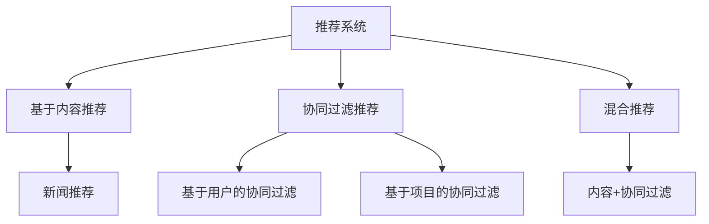

                 

# 大模型对推荐系统探索与利用平衡的影响

> **关键词**：大模型，推荐系统，探索与利用平衡，协同过滤，基于内容推荐，混合推荐

> **摘要**：本文将探讨大模型在推荐系统中的应用，特别是在探索与利用平衡方面的影响。我们将详细分析大模型如何改进传统推荐算法，并通过实际案例展示其在现实世界中的应用效果。

## 目录大纲：大模型对推荐系统探索与利用平衡的影响

### 第一部分：推荐系统基础

#### 第1章：推荐系统概述

##### 1.1 推荐系统的定义与分类

##### 1.2 推荐系统的工作原理

##### 1.3 推荐系统的评价指标

### 第二部分：传统推荐系统算法

#### 第2章：传统推荐系统算法

##### 2.1 协同过滤算法

##### 2.2 基于内容的推荐算法

##### 2.3 混合推荐算法

### 第三部分：大模型在推荐系统中的应用

#### 第3章：大模型在推荐系统中的作用与挑战

##### 3.1 大模型在推荐系统中的作用

##### 3.2 大模型在推荐系统中的应用挑战

##### 3.3 大模型在推荐系统中的前景

### 第四部分：大模型与协同过滤的结合

#### 第4章：大模型与协同过滤的结合

##### 4.1 大模型在协同过滤中的改进

##### 4.2 大模型协同过滤算法的实现

##### 4.3 大模型协同过滤的实验分析

### 第五部分：大模型与基于内容的推荐系统的结合

#### 第5章：大模型与基于内容的推荐系统的结合

##### 5.1 大模型在基于内容推荐系统中的改进

##### 5.2 大模型基于内容推荐算法的实现

##### 5.3 大模型基于内容推荐系统的实验分析

### 第六部分：大模型与混合推荐系统的结合

#### 第6章：大模型与混合推荐系统的结合

##### 6.1 大模型在混合推荐系统中的优化

##### 6.2 大模型混合推荐算法的实现

##### 6.3 大模型混合推荐系统的实验分析

### 第七部分：探索与利用平衡

#### 第7章：探索与利用平衡的理论基础

##### 7.1 探索与利用平衡的定义

##### 7.2 探索与利用平衡的数学模型

##### 7.3 探索与利用平衡的优化算法

### 第八部分：大模型在探索与利用平衡中的应用

#### 第8章：大模型在探索与利用平衡中的应用

##### 8.1 大模型在探索与利用平衡中的优化

##### 8.2 大模型探索与利用平衡算法的实现

##### 8.3 大模型探索与利用平衡的实验分析

### 第九部分：案例分析：大模型在推荐系统中的实际应用

#### 第9章：案例分析：大模型在推荐系统中的实际应用

##### 9.1 案例背景

##### 9.2 案例分析

##### 9.3 案例结果

### 第十部分：未来展望与挑战

#### 第10章：未来展望与挑战

##### 10.1 大模型在推荐系统中的未来发展

##### 10.2 大模型在推荐系统中面临的挑战

##### 10.3 未来研究方向

### 第十一部分：附录

#### 附录A：大模型推荐系统开发工具与资源

##### A.1 开发工具简介

##### A.2 常用数据集

##### A.3 算法实现代码示例

##### A.4 参考文献

---

现在，我们已经完成了文章的目录大纲。接下来，我们将逐章详细撰写文章内容，深入探讨大模型在推荐系统探索与利用平衡中的应用。首先，我们从推荐系统的概述开始。<|assistant|>

## 第一部分：推荐系统基础

### 第1章：推荐系统概述

推荐系统是一种基于数据挖掘和机器学习技术的信息过滤方法，旨在根据用户的历史行为和偏好，为用户提供个性化的信息推荐。推荐系统广泛应用于电子商务、社交媒体、视频流媒体、新闻网站等多个领域，极大地提升了用户体验和业务收益。

#### 1.1 推荐系统的定义与分类

**核心概念与联系**

**推荐系统定义**
推荐系统是一种通过计算用户之间的相似性或者用户与物品之间的相似性，从而为用户推荐他们可能感兴趣的商品、内容或服务的系统。推荐系统的核心目标是提高用户满意度，增加用户参与度和提升业务转化率。

**推荐系统分类**
根据推荐策略的不同，推荐系统主要分为以下几类：

1. **基于内容的推荐**：推荐系统根据用户的历史行为和偏好，通过分析物品的内容特征，为用户推荐相似的内容。这种方法通常用于新闻推荐、商品推荐等领域。
2. **协同过滤推荐**：推荐系统通过分析用户之间的相似性，根据相似用户的评价来预测目标用户的偏好。协同过滤推荐分为基于用户的协同过滤和基于项目的协同过滤。
3. **混合推荐**：结合基于内容和协同过滤的方法，以提高推荐的准确性和多样性。

**Mermaid流程图**


#### 1.2 推荐系统的工作原理

**核心算法原理讲解**

推荐系统的工作原理可以概括为以下几个步骤：

1. **用户兴趣建模**：通过用户的历史行为数据（如浏览记录、购买历史、评分等）来建模用户的兴趣。
2. **物品特征提取**：通过分析物品的属性（如标题、标签、类别等）来提取物品的特征。
3. **相似性计算**：计算用户与用户之间的相似度，或者用户与物品之间的相似度。
4. **推荐生成**：根据相似性计算结果，为用户生成推荐列表。

**数学模型和数学公式**

用户兴趣建模可以通过以下数学模型实现：
$$
User\_Profile(u) = \text{Vectorize}( \{ behavior(u) | behavior \in \text{History}(u) \} )
$$
其中，$User\_Profile(u)$表示用户$u$的兴趣向量，$\text{Vectorize}$是将行为序列转换为向量的过程，$\text{History}(u)$表示用户$u$的历史行为集合。

物品特征提取可以通过以下数学模型实现：
$$
Item\_Features(i) = \text{Extract}( \{ attributes(i) | attributes \in \text{Attributes}(i) \} )
$$
其中，$Item\_Features(i)$表示物品$i$的特征向量，$\text{Extract}$是从属性集合中提取特征的过程，$\text{Attributes}(i)$表示物品$i$的属性集合。

相似性计算可以通过余弦相似度、皮尔逊相关系数等数学模型实现：
$$
similarity(u, i) = \frac{User\_Profile(u) \cdot Item\_Features(i)}{\|User\_Profile(u)\| \|Item\_Features(i)\|}
$$
其中，$\cdot$表示内积运算，$\|\|$表示向量范数。

推荐生成可以通过以下数学模型实现：
$$
Recommendations(u) = \text{Top}( \{ i | i \in Items, similarity(u, i) > \text{Threshold} \} )
$$
其中，$Recommendations(u)$表示用户$u$的推荐列表，$\text{Top}$表示从相似度排序中选取前几项，$\text{Threshold}$为相似度的阈值。

**举例说明**

假设用户$u$的历史行为为浏览了商品$A$、$B$和$C$，用户$u$的兴趣向量为$[0.1, 0.4, 0.5]$。商品$D$的特征向量为$[0.2, 0.3, 0.5]$。则用户$u$和商品$D$的相似度计算如下：

$$
similarity(u, D) = \frac{[0.1, 0.4, 0.5] \cdot [0.2, 0.3, 0.5]}{\sqrt{[0.1^2 + 0.4^2 + 0.5^2] \cdot [0.2^2 + 0.3^2 + 0.5^2]}} = \frac{0.02 + 0.12 + 0.25}{\sqrt{0.42 \cdot 0.42}} = \frac{0.39}{0.42} \approx 0.93
$$

如果设定相似度的阈值为0.8，则用户$u$对商品$D$的推荐概率为0.93，因此可以将商品$D$推荐给用户$u$。

#### 1.3 推荐系统的评价指标

**核心算法原理讲解**

推荐系统的性能评估主要通过以下三个指标进行：

1. **准确率（Precision）**：推荐的物品中正确推荐的数量占总推荐数量的比例。
2. **召回率（Recall）**：推荐的物品中正确推荐的数量占所有可能的正确推荐数量的比例。
3. **F1值（F1 Score）**：准确率和召回率的调和平均数。

**数学模型和数学公式**

准确率的计算公式为：
$$
Precision = \frac{TP}{TP + FP}
$$
其中，$TP$表示真正例（正确推荐的物品），$FP$表示假正例（错误推荐的物品）。

召回率的计算公式为：
$$
Recall = \frac{TP}{TP + FN}
$$
其中，$FN$表示假反例（未推荐的但用户感兴趣的物品）。

F1值的计算公式为：
$$
F1 Score = 2 \cdot \frac{Precision \cdot Recall}{Precision + Recall}
$$

**举例说明**

假设有一个推荐列表，其中包含5个物品，其中3个是用户真正感兴趣的物品（真正例），有1个是用户不感兴趣的物品（假正例），则有：

$$
Precision = \frac{3}{3 + 1} = 0.75
$$

$$
Recall = \frac{3}{3 + 1} = 0.75
$$

$$
F1 Score = 2 \cdot \frac{0.75 \cdot 0.75}{0.75 + 0.75} = 0.75
$$

因此，该推荐列表的准确率、召回率和F1值都为0.75。

通过上述三个指标的评估，推荐系统可以更好地衡量其推荐效果，并针对性地进行优化。

### 第2章：传统推荐系统算法

#### 2.1 协同过滤算法

协同过滤算法是推荐系统中最常用的算法之一，它通过分析用户之间的相似性或物品之间的相似性来预测用户的偏好。协同过滤算法分为基于用户的协同过滤和基于项目的协同过滤。

**核心算法原理讲解**

**基于用户的协同过滤**

基于用户的协同过滤算法的基本思想是：找到与目标用户相似的邻居用户，根据邻居用户的评分预测目标用户对未评分物品的评分。

**数学模型和数学公式**

用户相似度的计算可以使用余弦相似度或皮尔逊相关系数。余弦相似度的计算公式为：

$$
similarity(u, v) = \frac{u \cdot v}{\|u\| \|v\|}
$$

其中，$u$和$v$是两个用户的评分向量，$\cdot$表示内积，$\|\|$表示向量的欧几里得范数。

评分预测的公式为：

$$
\hat{r}_{uv} = \sum_{i \in I} r_i^+ sim(u, v) \cdot \frac{r_i^+}{\sum_{j \in N(u)} r_j^+}
$$

其中，$r_i^+$表示用户$v$对物品$i$的评分，$N(u)$表示与用户$u$相似的邻居用户集合，$I$是所有物品的集合。

**举例说明**

假设有两个用户$u$和$v$的评分向量如下：

用户$u$的评分向量：$[5, 4, 1, 5, 0]$

用户$v$的评分向量：$[4, 5, 3, 1, 5]$

首先计算用户$u$和$v$之间的相似度：

$$
similarity(u, v) = \frac{[5, 4, 1, 5, 0] \cdot [4, 5, 3, 1, 5]}{\sqrt{[5^2 + 4^2 + 1^2 + 5^2 + 0^2] \cdot [4^2 + 5^2 + 3^2 + 1^2 + 5^2]}} = \frac{20 + 20 + 3 + 5 + 0}{\sqrt{42 \cdot 55}} \approx 0.732
$$

接下来计算用户$v$对未评分物品的预测评分：

假设物品$w$的评分向量未知，则：

$$
\hat{r}_{vw} = \sum_{i \in I} r_i^+ sim(u, v) \cdot \frac{r_i^+}{\sum_{j \in N(u)} r_j^+} = 4 \cdot 0.732 \cdot \frac{4}{\sum_{j \in N(u)} r_j^+} \approx 2.58
$$

**基于项目的协同过滤**

基于项目的协同过滤算法的基本思想是：找到与目标物品相似的邻居物品，根据邻居物品的评分预测目标用户对物品的评分。

**数学模型和数学公式**

项目相似度的计算也可以使用余弦相似度或皮尔逊相关系数。余弦相似度的计算公式为：

$$
similarity(i, j) = \frac{i \cdot j}{\|i\| \|j\|}
$$

其中，$i$和$j$是两个物品的评分向量。

评分预测的公式为：

$$
\hat{r}_{uv} = \sum_{i \in I} r_i^+ sim(i, j) \cdot \frac{r_i^+}{\sum_{j \in N(i)} r_j^+}
$$

其中，$r_i^+$表示用户$u$对物品$i$的评分，$N(i)$表示与物品$i$相似的邻居物品集合，$I$是所有物品的集合。

**举例说明**

假设有两个物品$i$和$j$的评分向量如下：

物品$i$的评分向量：$[5, 4, 1, 5, 0]$

物品$j$的评分向量：$[4, 5, 3, 1, 5]$

首先计算物品$i$和$j$之间的相似度：

$$
similarity(i, j) = \frac{[5, 4, 1, 5, 0] \cdot [4, 5, 3, 1, 5]}{\sqrt{[5^2 + 4^2 + 1^2 + 5^2 + 0^2] \cdot [4^2 + 5^2 + 3^2 + 1^2 + 5^2]}} = \frac{20 + 20 + 3 + 5 + 0}{\sqrt{42 \cdot 55}} \approx 0.732
$$

接下来计算用户$v$对物品$w$的预测评分：

假设用户$v$对物品$w$的评分向量未知，则：

$$
\hat{r}_{vw} = \sum_{i \in I} r_i^+ sim(i, j) \cdot \frac{r_i^+}{\sum_{j \in N(i)} r_j^+} = 4 \cdot 0.732 \cdot \frac{4}{\sum_{j \in N(i)} r_j^+} \approx 2.58
$$

#### 2.2 基于内容的推荐算法

基于内容的推荐算法是一种利用物品的属性信息进行推荐的算法。它的基本思想是：根据用户的历史行为和偏好，提取用户的兴趣特征，然后根据这些特征为用户推荐具有相似属性的物品。

**核心算法原理讲解**

**内容表示**

首先，需要对物品和用户进行内容表示。通常，物品的内容可以通过其属性或特征进行表示，例如电影可以通过导演、演员、类型等属性进行表示。用户的兴趣可以通过其历史行为数据或显式反馈（如评分、标签）进行表示。

**数学模型和数学公式**

物品的内容表示可以采用向量表示法。例如，假设物品$i$具有$n$个属性，每个属性$a_k$对应一个权重$w_{ik}$，则物品$i$的内容向量可以表示为：

$$
Content(i) = \{a_1, a_2, ..., a_n\} \rightarrow \text{Vector}(i) = [w_{i1}, w_{i2}, ..., w_{in}]
$$

用户的兴趣表示可以采用向量表示法。例如，假设用户$u$具有$m$个兴趣，每个兴趣$b_j$对应一个权重$w_{uj}$，则用户$u$的兴趣向量可以表示为：

$$
Interest(u) = \{b_1, b_2, ..., b_m\} \rightarrow \text{Vector}(u) = [w_{u1}, w_{u2}, ..., w_{um}]
$$

**相似性计算**

物品和用户之间的相似性可以通过余弦相似度或欧几里得距离进行计算。余弦相似度的计算公式为：

$$
similarity(u, i) = \frac{\text{Vector}(u) \cdot \text{Vector}(i)}{\|\text{Vector}(u)\| \|\text{Vector}(i)\|}
$$

其中，$\cdot$表示内积，$\|\|$表示向量的欧几里得范数。

**推荐生成**

根据物品和用户之间的相似性，可以为用户生成推荐列表。推荐的物品应该具有较高的相似度值。推荐生成的公式为：

$$
Recommendation(u) = \{i | i \in Items, similarity(u, i) > \text{Threshold}\}
$$

其中，$Items$是所有物品的集合，$\text{Threshold}$是相似性的阈值。

**举例说明**

假设有两个物品$i$和$j$的内容向量如下：

物品$i$的内容向量：$[0.5, 0.3, 0.2]$

物品$j$的内容向量：$[0.4, 0.5, 0.1]$

首先计算物品$i$和$j$之间的相似度：

$$
similarity(i, j) = \frac{[0.5, 0.3, 0.2] \cdot [0.4, 0.5, 0.1]}{\sqrt{[0.5^2 + 0.3^2 + 0.2^2] \cdot [0.4^2 + 0.5^2 + 0.1^2]}} = \frac{0.2 + 0.15 + 0.02}{\sqrt{0.5 \cdot 0.5}} = 0.75
$$

然后，根据用户的兴趣向量$[0.1, 0.4, 0.5]$，生成推荐列表：

$$
Recommendation(u) = \{i | i \in Items, similarity(u, i) > 0.7\}
$$

由于物品$i$和$j$的相似度都大于0.7，因此它们都被推荐给用户。

#### 2.3 混合推荐算法

混合推荐算法结合了协同过滤和基于内容的推荐算法的优点，通过综合利用用户的历史行为和物品的属性信息来进行推荐。混合推荐算法可以提高推荐的准确性和多样性。

**核心算法原理讲解**

**加权融合**

混合推荐算法通常使用加权融合的方法，将协同过滤和基于内容的推荐结果进行加权融合。加权的依据可以是协同过滤和基于内容的推荐的重要性，或者是用户的兴趣度。

**数学模型和数学公式**

假设协同过滤的推荐结果为$Recommendation_{CF}(u)$，基于内容的推荐结果为$Recommendation_{Content}(u)$，则混合推荐结果为：

$$
Recommendation_{Hybrid}(u) = \alpha \cdot Recommendation_{CF}(u) + (1 - \alpha) \cdot Recommendation_{Content}(u)
$$

其中，$\alpha$是加权系数，可以根据实验结果或用户反馈进行调整。

**举例说明**

假设协同过滤的推荐结果为$\{i_1, i_2, i_3\}$，基于内容的推荐结果为$\{i_2, i_3, i_4\}$，加权系数$\alpha = 0.6$，则混合推荐结果为：

$$
Recommendation_{Hybrid}(u) = 0.6 \cdot \{i_1, i_2, i_3\} + 0.4 \cdot \{i_2, i_3, i_4\} = \{i_1, i_2, i_3, i_4\}
$$

混合推荐算法可以根据不同的场景和用户需求进行灵活调整，以提高推荐的准确性和多样性。

### 第3章：大模型在推荐系统中的作用与挑战

#### 3.1 大模型在推荐系统中的作用

大模型在推荐系统中发挥着重要的作用，它能够处理大量的用户数据和物品信息，提供更准确的推荐结果。大模型可以用于以下几个方面：

1. **用户兴趣建模**：大模型可以通过学习用户的语言和行为模式，提取用户的兴趣特征，从而提供更个性化的推荐。
2. **物品特征提取**：大模型可以自动提取物品的关键特征，这些特征可能无法直接从原始数据中获取，从而提高推荐的准确性。
3. **预测评分**：大模型可以用于预测用户对未评分物品的评分，从而提供更可靠的推荐结果。

**数学模型和数学公式**

大模型通常使用深度学习技术，如循环神经网络（RNN）、变换器（Transformer）等。以下是一个简单的变换器模型的结构：

```
Input Embeddings
  ┌─────────────┐
  │     Embedding Layer     │
  └─────────────┘
     │        │
     ▼        ▼
  ┌─────────────┐
  │  Multi-head Attention  │
  └─────────────┘
     │        │
     ▼        ▼
  ┌─────────────┐
  │  Feedforward  │
  └─────────────┘
     │        │
     ▼        ▼
  ┌─────────────┐
  │ Output Layer │
  └─────────────┘
```

输入嵌入层将文本数据转换为向量表示，多头的注意力机制用于捕捉数据中的长距离依赖关系，前馈神经网络用于进一步处理数据，输出层生成最终的预测结果。

**举例说明**

假设我们有一个用户对物品的评论文本，可以使用变换器模型提取其兴趣特征。首先，将文本数据通过嵌入层转换为向量：

$$
X = \text{Embedding}(Text)
$$

然后，使用变换器模型处理这些向量：

$$
\text{Output} = \text{Transformer}(X)
$$

变换器模型的输出是一个高维向量，可以用于计算用户和物品之间的相似性：

$$
similarity(u, i) = \frac{\text{Output}(u) \cdot \text{Output}(i)}{\|\text{Output}(u)\| \|\text{Output}(i)\|}
$$

#### 3.2 大模型在推荐系统中的应用挑战

尽管大模型在推荐系统中具有很大的潜力，但其应用也面临着一些挑战：

1. **数据隐私**：推荐系统通常需要处理大量的用户数据，这些数据可能包含敏感信息。如何在保护用户隐私的同时提供高质量的推荐是一个重要的挑战。
2. **计算资源**：大模型的训练和部署需要大量的计算资源，这可能导致成本高昂。如何高效地利用现有资源是一个重要的挑战。
3. **模型可解释性**：大模型的预测过程通常不够透明，难以解释。这对于需要高解释性的应用场景（如金融、医疗等）来说是一个挑战。

**数学模型和数学公式**

为了解决数据隐私问题，可以采用差分隐私技术。差分隐私通过添加噪声来保护用户数据的隐私，其数学模型如下：

$$
L(\theta, \Delta) = \int_{x} \frac{1}{|D|} \log P(f(x; \theta) = y) \, d\mu(x)
$$

其中，$f(x; \theta)$是模型的预测函数，$\theta$是模型参数，$D$是数据集，$\mu$是数据分布，$L$是损失函数。

为了提高模型的解释性，可以采用可解释性技术，如LIME（局部可解释模型解释）和SHAP（SHapley Additive exPlanations）。这些技术的核心思想是通过局部线性化模型来解释大模型的预测。

**举例说明**

假设我们有一个使用变换器模型的大模型，我们希望解释其对某个特定预测的决策过程。首先，使用LIME技术生成一个局部线性模型：

$$
\text{Local Model} = \text{LIME}(f, x; \epsilon)
$$

其中，$f$是变换器模型，$x$是输入数据，$\epsilon$是噪声水平。

然后，使用局部线性模型生成对特定预测的解释：

$$
\text{Explanation} = \text{Local Model} \cdot \epsilon
$$

这个解释显示了模型在做出特定预测时考虑的局部特征，从而提高了模型的可解释性。

#### 3.3 大模型在推荐系统中的前景

随着大模型技术的发展，其在推荐系统中的应用前景广阔。以下是一些可能的趋势和机会：

1. **多模态推荐**：结合文本、图像、音频等多模态数据，提高推荐的多样性和准确性。
2. **实时推荐**：通过实时处理用户行为数据，提供更加动态和个性化的推荐。
3. **深度个性化**：通过挖掘更深入的个性化特征，提供更加精准的推荐。

同时，大模型在推荐系统中也面临着一些挑战，如计算资源消耗、数据隐私保护等。未来，需要进一步研究如何平衡这些挑战与机会，以实现更加高效和可解释的推荐系统。

### 第4章：大模型与协同过滤的结合

#### 4.1 大模型在协同过滤中的改进

大模型在协同过滤中的应用可以通过改进传统协同过滤算法的预测能力和推荐效果来实现。以下是一些具体的方法：

1. **用户和物品嵌入**：使用大模型学习用户和物品的高维嵌入向量，从而提高相似性计算和预测的准确性。
2. **上下文信息**：通过大模型捕捉用户的行为上下文信息，如时间、地理位置等，进一步优化推荐效果。
3. **动态更新**：大模型可以实时更新用户和物品的特征，从而动态调整推荐策略。

**数学模型和数学公式**

假设我们有一个变换器模型用于学习用户和物品的嵌入向量。输入嵌入层将用户和物品的原始特征转换为嵌入向量：

$$
X_u = \text{Embedding}(User\_Features), \quad X_i = \text{Embedding}(Item\_Features)
$$

然后，通过变换器模型处理这些嵌入向量：

$$
H_u = \text{Transformer}(X_u), \quad H_i = \text{Transformer}(X_i)
$$

变换器模型的输出是高维的嵌入向量，可以用于计算用户和物品之间的相似性：

$$
similarity(u, i) = \frac{H_u \cdot H_i}{\|H_u\| \|H_i\|}
$$

其中，$\cdot$表示内积，$\|\|$表示向量的欧几里得范数。

进一步，可以使用这些相似性进行评分预测：

$$
\hat{r}_{ui} = \sum_{i \in Items} r_i sim(u, i)
$$

其中，

