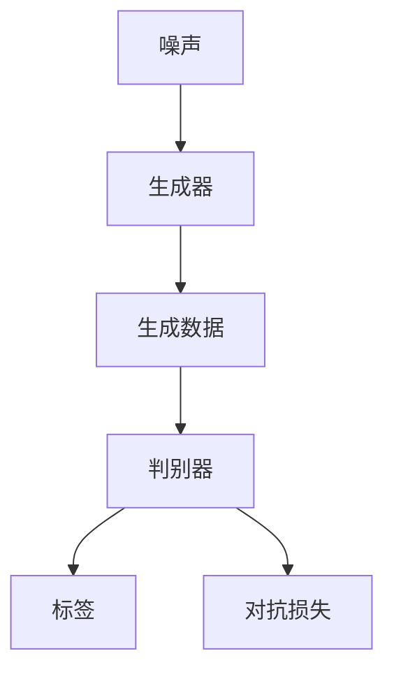

                 

### 第一部分：大模型技术在政府和公共服务领域的应用概述

#### 第1章：大模型技术概述

##### 1.1 大模型技术在政府和公共服务领域的重要性

在当今快速发展的数字化时代，政府和公共服务机构面临着前所未有的挑战与机遇。传统的方法已经难以应对日益复杂的社会需求，而大模型技术的引入则为解决这些问题提供了新的思路和手段。以下是几个关键的挑战和它们如何通过大模型技术得到缓解：

- **数据隐私与安全**：随着政府数据的开放和共享，如何保护个人隐私和数据安全成为了一个严峻的问题。大模型技术通过引入差分隐私和联邦学习等技术手段，可以在保护数据隐私的同时实现数据的价值挖掘。

- **服务效率与质量**：公共服务的效率和用户体验是衡量政府服务能力的重要指标。大模型技术，如智能问答系统和智能客服，可以显著提高服务响应速度，减少人力成本，并提供更加个性化的服务。

- **智能决策支持**：政府决策过程往往需要大量的数据分析和预测模型支持。大模型技术，特别是深度学习和生成对抗网络等，可以帮助政府更准确地预测社会趋势，制定更有效的政策。

##### 1.2 大模型技术的核心概念与原理

大模型技术，通常指的是具有数亿甚至数千亿参数的神经网络模型。它们的核心在于通过学习大量的数据，模型可以自动提取数据中的特征，并用于各种复杂的任务，如图像识别、自然语言处理和预测分析。

- **神经网络结构**：神经网络是由多层神经元组成的计算模型，每一层神经元都通过权重连接到下一层的神经元。通过多次迭代的学习，模型可以优化这些权重，从而提高预测的准确性。

- **预训练与微调**：预训练是指在大量的未标注数据上进行训练，以提取通用的特征表示。微调则是在预训练模型的基础上，使用标注数据进行微调，以适应特定的任务需求。

##### 1.3 大模型技术在政府和公共服务领域的应用场景

大模型技术已经在政府和公共服务领域展现出了巨大的潜力，以下是一些典型的应用场景：

- **智能问答系统**：通过大模型技术，政府可以建立智能问答系统，为公民提供政策咨询、法规解释等即时服务，提高公众满意度。

- **智能交通系统**：大模型技术可以帮助交通管理部门优化交通信号控制，预测交通流量，从而减少拥堵和事故。

- **电子政务服务**：通过大模型技术，可以优化电子政务系统的用户体验，提供个性化的服务，提高政务服务的效率。

- **智能医疗**：大模型技术在医疗领域也有广泛的应用，如疾病预测、智能诊断和治疗计划等。

##### 1.4 大模型技术的发展趋势

随着计算能力的提升和大数据的积累，大模型技术正迎来飞速发展。以下是一些未来的发展趋势：

- **深度学习算法的进步**：深度学习算法将继续优化，包括更高效的模型架构和更有效的训练策略。

- **跨领域融合应用**：大模型技术将在更多领域得到应用，如金融、教育、公共安全和环境监测等。

- **人机协同**：大模型技术将与人类专家协作，提供更加智能化和个性化的服务。

通过上述的思考和分析，我们可以看到大模型技术在政府和公共服务领域的应用前景广阔，为解决社会问题和提高公共服务水平提供了强大的工具。接下来，我们将进一步探讨大模型技术的核心算法原理，为深入理解这些技术打下基础。

### 第一部分：大模型技术在政府和公共服务领域的应用概述

#### 第2章：大模型技术核心算法原理

##### 2.1 深度学习基础

深度学习是构建大模型技术的基石。它通过多层神经网络结构，实现对复杂数据模式的自动学习和特征提取。以下是对深度学习基础概念的详细解释。

###### 2.1.1 神经网络基础

神经网络（Neural Network, NN）是深度学习的基本构建块。它由多个层次（层）的神经元（节点）组成，每一层神经元都与相邻层的神经元相连接。神经网络的层次结构通常包括输入层、隐藏层和输出层。

- **输入层**：接收外部输入数据，如图片、文本或数值。
- **隐藏层**：对输入数据进行特征提取和变换，隐藏层可以有一个或多个。
- **输出层**：产生模型输出，如分类标签、预测值或概率分布。

每个神经元通过权重（weights）连接到下一层的神经元。当数据通过网络传播时，每个神经元会执行一系列的线性变换，然后通过激活函数（activation function）产生输出。激活函数如Sigmoid、ReLU和Tanh等，用于引入非线性因素，使神经网络能够学习复杂数据模式。

###### 2.1.2 激活函数

激活函数是神经网络中的一个关键组成部分。它将神经元的线性组合映射到一个非线性空间，使网络能够学习复杂的关系。

- **Sigmoid函数**：\( \sigma(x) = \frac{1}{1 + e^{-x}} \)
  - 输出范围在0到1之间，常用于二分类问题。
- **ReLU函数**：\( \text{ReLU}(x) = \max(0, x) \)
  - 当输入为负时输出为零，当输入为正时输出等于输入，这是一种流行的隐藏层激活函数。
- **Tanh函数**：\( \tanh(x) = \frac{e^x - e^{-x}}{e^x + e^{-x}} \)
  - 输出范围在-1到1之间，与Sigmoid类似，但更稳定。

激活函数的选择对神经网络的性能有很大影响。合适的激活函数可以提高网络的训练速度和预测能力。

###### 2.1.3 损失函数

损失函数（loss function）是评估模型预测值与真实值之间差异的指标。在训练过程中，模型的目标是通过优化损失函数来调整权重，使预测值更接近真实值。

常见的损失函数包括：

- **均方误差（MSE）**：\( \text{MSE}(y, \hat{y}) = \frac{1}{m}\sum_{i=1}^{m}(y_i - \hat{y}_i)^2 \)
  - 用于回归问题，输出为实数值。
- **交叉熵损失（Cross-Entropy Loss）**：\( \text{CE}(y, \hat{y}) = -\sum_{i=1}^{m}y_i \log(\hat{y}_i) \)
  - 用于分类问题，输出为概率分布。

损失函数的选择和优化对模型的性能至关重要。

##### 2.2 卷积神经网络（CNN）

卷积神经网络（Convolutional Neural Network, CNN）是深度学习中专门用于处理图像数据的一种网络结构。CNN通过卷积层、池化层和全连接层等结构，实现图像的特征提取和分类。

###### 2.2.1 CNN原理与架构

CNN的主要结构包括：

- **卷积层（Convolutional Layer）**：卷积层是CNN的核心部分，它通过卷积操作提取图像中的局部特征。卷积层使用滤波器（filter）在输入图像上进行卷积操作，每个滤波器可以捕捉图像中不同的特征。

  ```mermaid
  graph TD
  A[输入图像] --> B[卷积层]
  B --> C[激活函数]
  C --> D[池化层]
  D --> E[卷积层]
  E --> F[激活函数]
  F --> G[池化层]
  G --> H[全连接层]
  ```

- **激活函数**：激活函数通常使用ReLU函数，以提高网络的训练速度和鲁棒性。

- **池化层（Pooling Layer）**：池化层通过下采样操作减少数据维度，同时保留最重要的特征。常用的池化操作包括最大池化和平均池化。

- **全连接层（Fully Connected Layer）**：全连接层将卷积层和池化层提取的特征映射到最终的分类结果。每个神经元都与上一层的所有神经元相连。

###### 2.2.2 卷积操作

卷积操作是CNN中的基础操作，它通过滤波器在图像上滑动，计算滤波器与图像局部区域的内积。以下是一个简化的卷积操作伪代码：

```python
for filter in filters:
  for patch in image:
    inner_product = 0
    for i in range(patch_size):
      for j in range(patch_size):
        inner_product += filter[i][j] * image[patch[i][j]]
    activation += activation_function(inner_product)
return activation
```

卷积操作通过滑动滤波器在图像上提取局部特征，这是CNN能够识别图像内容的关键。

##### 2.3 循环神经网络（RNN）

循环神经网络（Recurrent Neural Network, RNN）是处理序列数据的一种神经网络结构。与传统的神经网络不同，RNN具有时间动态性，能够处理输入序列中的时间依赖性。

###### 2.3.1 RNN原理与架构

RNN的基本架构包括输入层、隐藏层和输出层。与传统的神经网络不同，RNN的隐藏层具有循环连接，即前一时间步的隐藏状态会传递到下一时间步。

- **输入层**：接收输入序列，如文本或时间序列数据。
- **隐藏层**：包含循环连接，当前时间步的隐藏状态与前一时间步的隐藏状态相连接。
- **输出层**：产生模型输出，如序列的标签或预测值。

RNN通过隐藏状态的记忆机制，能够捕捉输入序列中的时间依赖关系。然而，传统的RNN在处理长序列时存在梯度消失或梯度爆炸的问题。

###### 2.3.2 LSTM和GRU

为了解决传统RNN的问题，LSTM（Long Short-Term Memory）和GRU（Gated Recurrent Unit）被提出。LSTM和GRU通过引入门控机制，提高了RNN在处理长序列时的性能。

- **LSTM（长短时记忆网络）**：LSTM通过三个门控单元（输入门、遗忘门和输出门）来控制信息的流入、保留和流出。LSTM能够有效捕捉长序列中的长期依赖关系。

  ```mermaid
  graph TD
  A[输入门] --> B[遗忘门] --> C[输出门]
  A --> D[输入]
  B --> D
  C --> D
  D --> E[隐藏状态]
  ```

- **GRU（门控循环单元）**：GRU通过合并输入门和遗忘门，简化了LSTM的结构。GRU在计算效率上优于LSTM，但其在捕捉长期依赖关系方面可能与LSTM存在差距。

  ```mermaid
  graph TD
  A[输入门] --> B[更新门]
  A --> C[候选状态]
  B --> C
  C --> D[隐藏状态]
  ```

LSTM和GRU通过门控机制，提高了RNN在处理长序列时的稳定性和性能。

##### 2.4 生成对抗网络（GAN）

生成对抗网络（Generative Adversarial Network, GAN）是一种由生成器和判别器组成的生成模型。GAN通过两个对抗网络之间的博弈，学习数据的概率分布，从而生成逼真的数据。

###### 2.4.1 GAN原理与架构

GAN的基本架构包括：

- **生成器（Generator）**：生成器网络通过随机噪声生成伪数据，目的是使判别器无法区分生成的数据和真实数据。
- **判别器（Discriminator）**：判别器网络用于区分生成的数据和真实数据，目标是最大化其分类准确性。

GAN的训练过程是一个对抗过程，生成器和判别器相互博弈。生成器试图生成更逼真的数据，而判别器试图更好地区分真实和伪数据。随着训练的进行，生成器的生成质量会逐渐提高，判别器的辨别能力也会增强。

GAN的框架如下：



GAN通过对抗训练，能够生成高质量的数据，广泛应用于图像生成、图像修复、图像到图像的转换等任务。

通过上述对深度学习基础、卷积神经网络（CNN）、循环神经网络（RNN）和生成对抗网络（GAN）的详细介绍，我们可以看到大模型技术的核心算法原理。这些算法构成了大模型技术的基础，使我们在政府和公共服务领域能够实现各种复杂的任务和应用。接下来，我们将进一步探讨大模型技术在具体应用场景中的实际案例。

### 第一部分：大模型技术在政府和公共服务领域的应用概述

#### 第3章：大模型技术在政府和公共服务领域的应用案例

##### 3.1 智能问答系统

智能问答系统是利用大模型技术实现的一项重要应用，能够自动理解用户的问题，并提供准确的答案。在政府和公共服务领域，智能问答系统可以极大地提高服务效率，减少人力成本，并提供更加个性化的服务。

###### 3.1.1 案例概述

在某个城市的政府服务中，为了方便市民获取政策咨询和法规解释，政府部署了一款基于大模型技术的智能问答系统。该系统集成了自然语言处理（NLP）技术和深度学习算法，可以自动解析用户的问题，并从庞大的知识库中检索相关信息，生成回答。

###### 3.1.2 工作流程

智能问答系统的工作流程主要包括以下几个步骤：

1. **问题理解**：系统首先接收用户输入的问题，通过自然语言处理技术对问题进行分词、句法分析和语义理解，提取关键信息。
2. **信息检索**：系统根据提取的关键信息，在预构建的知识库中检索相关的政策和法规文本。
3. **答案生成**：系统使用大模型技术，如序列到序列（Seq2Seq）模型，将检索到的信息进行整合，生成自然流畅的答案。
4. **答案输出**：系统将生成的答案通过文本或语音形式呈现给用户。

###### 3.1.3 成功经验

该智能问答系统上线后，受到了市民的广泛欢迎。以下是几个成功经验：

- **效率提升**：系统大大提高了政策咨询的响应速度，使市民能够迅速获得所需信息，减少了政府服务部门的压力。
- **个性化服务**：系统可以根据用户的历史查询记录，提供个性化的答案推荐，提高了用户体验。
- **数据积累**：通过用户与系统的交互，系统积累了大量的用户问题和答案数据，为后续的模型优化和扩展提供了宝贵资源。

###### 3.1.4 挑战与解决方案

尽管智能问答系统取得了显著的成功，但在实际应用中也面临一些挑战：

- **数据隐私与安全**：政府数据涉及大量的个人隐私信息，如何保护数据隐私是一个重要问题。解决方案是采用差分隐私技术，在数据处理过程中加入噪声，确保个体隐私不被泄露。
- **模型可解释性**：智能问答系统的决策过程高度依赖大模型技术，用户难以理解模型的决策依据。为提高模型的可解释性，可以采用可视化技术，展示模型的决策路径和关键特征。
- **算法公平性**：在处理涉及社会公平问题时，如何确保算法的公平性是一个挑战。解决方案是建立算法公平性评估机制，定期审计和优化模型，以消除潜在的偏见。

##### 3.2 智能交通系统

智能交通系统是利用大模型技术优化交通管理和提高交通安全的重要手段。通过实时数据分析、预测和优化，智能交通系统能够有效减少交通拥堵，提高道路通行效率。

###### 3.2.1 案例概述

在一个大中型城市，政府为了改善交通状况，引入了一款基于大模型技术的智能交通管理系统。该系统通过集成传感器数据、交通流量数据和历史数据，实现了对交通状况的实时监控和预测。

###### 3.2.2 工作流程

智能交通系统的工作流程主要包括以下几个步骤：

1. **数据采集**：系统通过传感器、摄像头和交通流量监测设备，收集道路上的实时数据。
2. **数据预处理**：系统对采集到的数据进行清洗、去噪和特征提取，为后续的分析和预测提供高质量的数据。
3. **实时监控**：系统实时分析交通流量数据，识别交通拥堵、事故和其他异常情况。
4. **预测分析**：系统使用大模型技术，如循环神经网络（RNN）和卷积神经网络（CNN），预测未来一段时间的交通流量和路况。
5. **优化决策**：系统根据预测结果，优化交通信号灯控制策略，调整道路通行方案，以缓解交通拥堵。

###### 3.2.3 成功经验

智能交通系统上线后，取得了显著的效果：

- **交通流量优化**：通过实时监控和预测，系统能够在交通流量高峰期提前调整交通信号灯，优化道路通行效率，减少了交通拥堵。
- **事故预测与预警**：系统通过对历史数据和实时数据的分析，能够预测交通事故发生的可能性，提前预警并采取相应措施，提高了交通安全。
- **用户体验提升**：系统为驾驶员提供了实时交通信息，帮助他们选择最佳路线，减少了行驶时间和交通成本。

###### 3.2.4 挑战与解决方案

智能交通系统在应用过程中也面临一些挑战：

- **数据质量**：交通数据的质量直接影响系统的性能。解决方案是建立数据质量控制机制，确保数据清洗和特征提取的准确性。
- **计算资源**：大模型训练和预测需要大量的计算资源。解决方案是采用分布式计算和云计算平台，提高计算效率。
- **模型适应性**：不同时间和地点的交通状况差异较大，如何使模型具有高适应性是一个挑战。解决方案是定期更新模型，使其适应不同环境和条件。

##### 3.3 电子政务服务

电子政务服务是利用大模型技术优化政府服务流程、提高用户体验和提升服务效率的重要领域。通过个性化推荐、智能客服和自动化审批等应用，电子政务服务系统能够更好地满足公民的需求。

###### 3.3.1 案例概述

在一个省份的电子政务系统中，政府引入了大模型技术，以提高政务服务的效率和用户体验。该系统通过自然语言处理、推荐系统和深度学习算法，实现了从政策咨询、业务办理到审批流程的智能化。

###### 3.3.2 工作流程

电子政务服务系统的工作流程主要包括以下几个步骤：

1. **用户身份认证**：系统通过用户身份认证，确保用户的安全和隐私。
2. **个性化推荐**：系统根据用户的历史行为和偏好，推荐相关的政策和业务信息。
3. **智能客服**：系统通过自然语言处理技术，实现智能问答和客服功能，为用户提供实时在线支持。
4. **业务办理与审批**：系统通过自动化流程，实现业务办理的智能化，减少人工干预，提高审批效率。
5. **用户体验反馈**：系统收集用户的使用反馈，不断优化和改进服务功能。

###### 3.3.3 成功经验

电子政务服务系统的应用取得了显著的成效：

- **服务效率提升**：系统通过自动化流程和智能推荐，大幅提高了政务服务的效率，缩短了业务办理时间。
- **用户体验优化**：系统提供的个性化推荐和智能客服功能，使用户能够更加便捷地获取所需信息，提升了用户体验。
- **数据驱动决策**：系统积累了大量的用户行为数据，为政府决策提供了数据支持，促进了政务服务的改进和优化。

###### 3.3.4 挑战与解决方案

电子政务服务系统在应用过程中也面临一些挑战：

- **数据安全与隐私**：政务数据涉及大量的个人隐私信息，如何确保数据的安全和隐私是一个重要问题。解决方案是采用数据加密、隐私保护技术和访问控制机制，确保数据的安全和合规。
- **算法公平性**：在处理涉及社会公平问题时，如何确保算法的公平性是一个挑战。解决方案是建立算法公平性评估机制，定期审计和优化模型，消除潜在的偏见。
- **技术适应性**：电子政务服务系统的技术环境复杂，如何确保系统的稳定性和适应性是一个挑战。解决方案是采用模块化设计和分布式架构，提高系统的可维护性和扩展性。

##### 3.4 智能医疗

智能医疗是利用大模型技术提升医疗诊断、预测和患者管理的重要领域。通过自然语言处理、图像识别和深度学习算法，智能医疗系统能够为医生提供更准确的诊断依据，提高医疗服务的质量和效率。

###### 3.4.1 案例概述

在一个大型医院的智能医疗系统中，医生通过使用大模型技术，实现了对患者的快速诊断和个性化治疗。该系统集成了医学图像识别、电子病历分析和智能预测功能，为医生提供了全方位的支持。

###### 3.4.2 工作流程

智能医疗系统的工作流程主要包括以下几个步骤：

1. **医学图像识别**：系统通过卷积神经网络（CNN）对医学图像进行分析，识别出病变区域和病理特征。
2. **电子病历分析**：系统通过自然语言处理技术，对患者的电子病历进行解析，提取关键信息，如病史、治疗方案和药物使用情况。
3. **疾病预测**：系统使用循环神经网络（RNN）和生成对抗网络（GAN），预测患者的疾病发展状况和可能的治疗方案。
4. **个性化治疗**：系统根据患者的病情和预测结果，为医生提供个性化的治疗方案建议。

###### 3.4.3 成功经验

智能医疗系统的应用取得了显著的成效：

- **诊断准确性提高**：系统通过对医学图像和电子病历的深度分析，为医生提供了更准确的诊断依据，提高了诊断的准确性。
- **治疗效率提升**：系统通过自动化的预测和推荐，使医生能够更快地制定治疗方案，提高了治疗效率。
- **患者管理优化**：系统通过实时监测和预警，帮助医生更好地管理患者的病情，提高了患者的治疗效果和满意度。

###### 3.4.4 挑战与解决方案

智能医疗系统在应用过程中也面临一些挑战：

- **数据隐私与安全**：医疗数据涉及大量的个人隐私信息，如何确保数据的安全和隐私是一个重要问题。解决方案是采用数据加密、访问控制和隐私保护技术，确保数据的安全和合规。
- **算法公平性**：在处理涉及社会公平问题时，如何确保算法的公平性是一个挑战。解决方案是建立算法公平性评估机制，定期审计和优化模型，消除潜在的偏见。
- **技术适应性**：智能医疗系统的技术环境复杂，如何确保系统的稳定性和适应性是一个挑战。解决方案是采用模块化设计和分布式架构，提高系统的可维护性和扩展性。

通过上述应用案例的详细分析，我们可以看到大模型技术在政府和公共服务领域的广泛应用和显著成效。这些案例不仅展示了大模型技术的强大能力，也为实际应用中面临的挑战提供了有效的解决方案。接下来，我们将进一步探讨大模型技术在政府和公共服务领域的挑战与解决方案。

### 第一部分：大模型技术在政府和公共服务领域的应用概述

#### 第4章：大模型技术在政府和公共服务领域的挑战与解决方案

##### 4.1 数据隐私与安全

在大模型技术的应用过程中，数据隐私与安全是首要考虑的问题。政府和公共服务领域涉及大量的个人敏感数据，如医疗记录、税务信息和个人身份信息等。如何在不泄露用户隐私的前提下，有效地利用这些数据，是一个重要的挑战。

###### 4.1.1 隐私保护方法

为了保护数据隐私，以下几种方法被广泛应用：

- **差分隐私（Differential Privacy）**：差分隐私是一种数据发布机制，通过在数据中添加噪声，确保单个记录的隐私，同时保留数据的总体统计特性。常见的方法包括拉普拉斯机制和指数机制。

  差分隐私的数学模型可以表示为：
  \[
  LP(\mathbf{x}; \epsilon) = \mathbb{P}[\text{Noise}(\mathbf{z}; \epsilon) + \text{Release}(\mathbf{x})]
  \]
  其中，\( \text{Noise}(\mathbf{z}; \epsilon) \) 是添加的噪声，\( \text{Release}(\mathbf{x}) \) 是基于输入数据的发布函数，\( \epsilon \) 是隐私参数。

- **联邦学习（Federated Learning）**：联邦学习是一种分布式机器学习方法，不同机构可以在本地训练模型，并将梯度上传至中央服务器进行聚合，从而避免了数据在传输过程中的泄露。这种方法保护了数据的本地隐私，同时实现了全局模型训练。

  联邦学习的基本流程如下：
  \[
  \text{Local Model Update}: \theta_{t+1}^i = \theta_{t}^i - \alpha \frac{\partial \text{Loss}(\theta_{t}^i; x_i, y_i)}{\partial \theta_{t}^i}
  \]
  \[
  \text{Global Model Update}: \theta_{t+1} = \frac{1}{N} \sum_{i=1}^{N} \theta_{t+1}^i
  \]

- **加密计算（Cryptographic Computation）**：加密计算通过密码学方法，将数据转换为加密形式，在保护数据隐私的同时进行计算。常见的加密计算方法包括同态加密（Homomorphic Encryption）和安全多方计算（Secure Multi-Party Computation）。

  同态加密的基本原理如下：
  \[
  E(\mathbf{x} + \mathbf{y}) = E(\mathbf{x}) + E(\mathbf{y})
  \]
  \[
  E(\mathbf{x} \cdot \mathbf{y}) = E(\mathbf{x}) \cdot E(\mathbf{y})
  \]
  其中，\( E(\mathbf{x}) \) 和 \( E(\mathbf{y}) \) 分别表示对 \( \mathbf{x} \) 和 \( \mathbf{y} \) 进行同态加密的结果。

###### 4.1.2 应用案例

在实际应用中，差分隐私、联邦学习和加密计算等方法被广泛应用于政府和公共服务领域：

- **智能交通系统**：通过差分隐私技术，政府可以在保护交通数据隐私的前提下，分析交通流量和事故发生情况，优化交通信号控制和道路维护。
- **电子政务服务**：联邦学习技术被用于开发智能客服系统，政府可以在确保个人隐私安全的同时，提供个性化的服务建议。
- **智能医疗**：加密计算技术被用于保护患者的医疗数据，确保在数据共享和医疗诊断过程中，患者的隐私不被泄露。

##### 4.2 算法公平性

算法公平性是另一个重要的挑战，特别是在涉及社会公平和道德问题时。算法的偏见可能会导致不公平的结果，加剧社会不平等。

###### 4.2.1 公平性挑战

算法公平性面临以下挑战：

- **偏见问题**：算法可能会在训练数据中继承偏见，导致对某些群体不公平对待。例如，在招聘系统中，如果训练数据中存在性别或种族偏见，算法可能会在评估过程中放大这种偏见。
- **透明性与可解释性**：大模型技术，特别是深度学习模型，通常被认为是不透明的“黑盒”系统。用户难以理解模型的决策过程，无法确保算法的公平性和合理性。
- **数据代表性**：算法的训练数据必须具有足够的代表性和多样性，以避免模型在处理特定群体时产生偏见。

###### 4.2.2 解决方案

以下是一些解决算法公平性的方法：

- **偏差校正**：在模型训练过程中，采用偏差校正技术，如正则化、数据增强和对抗训练，减少模型中的偏见。
- **算法可解释性**：通过可视化技术、模型解释方法和解释性模型，提高算法的可解释性，帮助用户理解模型的决策过程。
- **公平性评估**：建立算法公平性评估机制，定期审计和评估模型的性能和公平性，确保算法在不同群体中的表现一致。

具体方法如下：

- **模型解释方法**：例如，LIME（Local Interpretable Model-agnostic Explanations）和SHAP（SHapley Additive exPlanations）等方法，可以帮助用户理解模型的决策依据。
- **公平性指标**：例如，基尼系数、比例差异和均衡性指标，用于评估算法在不同群体中的公平性。

##### 4.3 硬件资源与计算能力

大模型训练和推理过程需要大量的计算资源和时间。在政府和公共服务领域，如何高效地利用硬件资源，提高计算能力，是一个重要的挑战。

###### 4.3.1 硬件资源优化

以下是一些优化硬件资源的方法：

- **分布式计算**：通过分布式计算架构，如Hadoop、Spark和TensorFlow等，将计算任务分布在多台服务器上，提高计算效率。
- **GPU优化**：利用图形处理器（GPU）进行并行计算，显著提高模型的训练和推理速度。常见的GPU框架包括CUDA、CuDNN和TensorRT等。
- **内存管理**：优化内存分配和垃圾回收机制，减少内存占用，提高系统性能。

具体方法如下：

- **模型并行**：将大模型分解为多个子模型，分别在不同GPU上进行训练和推理。
- **数据并行**：将数据集划分为多个部分，同时在多台GPU上进行模型的训练。

##### 4.4 技术成熟度与落地

技术成熟度是另一个关键因素，特别是在大规模应用大模型技术时。如何评估和确保技术的成熟度，是政府和公共服务领域面临的重要挑战。

###### 4.4.1 技术成熟度评估

以下是一些评估技术成熟度的方法：

- **Gartner Hype Cycle**：Gartner Hype Cycle是一个广泛认可的技术成熟度模型，用于评估技术的成熟度和市场接受度。根据Hype Cycle，技术从炒作期到成熟期经历几个阶段，包括技术触发期、过度期望期、平稳发展期和成熟期。
- **标准化测试**：通过标准化测试和评估，评估技术的性能、稳定性和可靠性。
- **试点项目**：通过试点项目，逐步引入新技术，评估其在实际应用中的效果和可行性。

具体方法如下：

- **评估指标**：包括性能指标、可扩展性指标、可靠性指标和安全性指标。
- **迭代开发**：通过迭代开发和持续改进，逐步完善技术，确保其成熟度和适用性。

##### 4.4.2 技术落地

技术落地是确保大模型技术在政府和公共服务领域成功应用的关键步骤。以下是一些关键步骤：

- **需求分析**：明确应用场景和需求，确定技术解决方案。
- **系统集成**：将大模型技术集成到现有的系统和服务中，确保系统的兼容性和稳定性。
- **用户培训**：为用户提供培训和支持，确保其能够有效使用新技术。
- **持续优化**：通过持续监控和反馈，优化技术的性能和用户体验。

通过上述挑战与解决方案的详细分析，我们可以看到大模型技术在政府和公共服务领域的应用不仅面临着数据隐私与安全、算法公平性、硬件资源与计算能力、技术成熟度与落地等方面的挑战，但通过有效的解决方案，这些挑战可以得到有效应对。接下来，我们将进一步探讨大模型技术在政府和公共服务领域的政策与管理，为技术应用的落地提供指导和保障。

### 第一部分：大模型技术在政府和公共服务领域的应用概述

#### 第5章：大模型技术在政府和公共服务领域的政策与管理

##### 5.1 政策支持

政府政策的支持是推动大模型技术在政府和公共服务领域应用的关键因素。为了促进人工智能技术的发展和应用，各国政府纷纷出台了一系列支持政策，包括资金投入、技术研发和政策引导等方面。

###### 5.1.1 国家政策

- **中国**：中国政府高度重视人工智能技术的发展，出台了《新一代人工智能发展规划》，明确了人工智能的发展目标和重点领域。此外，政府还设立了人工智能专项资金，支持人工智能基础理论和关键技术的研发。

  - **资金投入**：中国政府设立了人工智能专项资金，用于支持人工智能的基础研究和关键技术研发。近年来，人工智能领域的研发投入不断增加，为企业提供了有力支持。

  - **技术研发**：政府支持企业、高校和科研机构开展人工智能技术的研究和开发，推动人工智能技术的创新和突破。通过建立人工智能创新中心、重点实验室和产业联盟等，政府为人工智能技术的研发提供了良好的环境和条件。

- **美国**：美国政府同样重视人工智能技术的发展，通过《国家人工智能发展战略》等政策文件，明确人工智能的发展目标和重点领域。

  - **资金投入**：美国政府设立了人工智能研究基金，支持人工智能的基础研究和应用开发。同时，政府还通过税收优惠、补贴等措施，鼓励企业投资人工智能技术研发。

  - **技术研发**：政府支持企业、高校和科研机构开展人工智能技术的研究和开发，通过建立国家人工智能实验室、研究中心等，推动人工智能技术的创新和突破。

- **欧洲**：欧洲各国政府也在积极推动人工智能技术的发展，出台了《欧洲人工智能战略》等政策文件，明确了人工智能的发展目标和重点领域。

  - **资金投入**：欧洲各国政府设立了人工智能专项资金，用于支持人工智能的基础研究和应用开发。通过联合投资、合作研究等方式，政府推动了人工智能技术的创新和突破。

  - **技术研发**：政府支持企业、高校和科研机构开展人工智能技术的研究和开发，通过建立人工智能创新中心、重点实验室和产业联盟等，推动人工智能技术的创新和突破。

###### 5.1.2 地方政策

除了国家层面的政策支持外，地方政府也在积极推动人工智能技术的发展和应用。各地政府根据自身实际情况，出台了一系列政策措施，包括资金扶持、技术转移和人才培养等方面。

- **北京**：北京市政府出台了《北京市新一代人工智能发展规划》，明确了人工智能的发展目标和重点领域。政府设立了人工智能产业基金，支持人工智能企业的创新和发展。

  - **资金扶持**：政府设立了人工智能产业基金，通过股权投资、贷款贴息等方式，支持人工智能企业的创新和发展。

  - **技术转移**：政府推动人工智能技术的成果转化，支持企业、高校和科研机构开展技术合作和转移，促进人工智能技术的应用和推广。

  - **人才培养**：政府支持人工智能人才培养，通过建设人工智能学院、开设人工智能专业等方式，培养一批高素质的人工智能人才。

- **上海**：上海市政府出台了《上海市推进智慧城市建设行动计划》，明确将人工智能作为智慧城市建设的关键技术。政府设立了人工智能专项资金，支持人工智能技术的研发和应用。

  - **资金扶持**：政府设立了人工智能专项资金，通过项目资助、奖励等方式，支持人工智能技术的研发和应用。

  - **技术转移**：政府推动人工智能技术的成果转化，支持企业、高校和科研机构开展技术合作和转移，促进人工智能技术的应用和推广。

  - **人才培养**：政府支持人工智能人才培养，通过建设人工智能学院、开设人工智能专业等方式，培养一批高素质的人工智能人才。

##### 5.2 管理与监管

大模型技术在政府和公共服务领域的应用不仅需要政策支持，还需要有效的管理和监管机制。为了确保人工智能技术的健康发展和安全应用，各国政府和机构纷纷出台了一系列管理和监管政策。

###### 5.2.1 管理框架

- **数据治理**：为了确保大模型技术的数据安全和隐私保护，政府建立了数据治理框架，包括数据安全策略、数据质量管理和数据共享机制等。

  - **数据安全策略**：政府制定数据安全策略，明确数据收集、存储、传输和使用过程中的安全要求，确保数据的安全和保密。

  - **数据质量管理**：政府推动数据质量管理，建立数据质量标准和评估机制，确保数据的准确性、完整性和一致性。

  - **数据共享机制**：政府建立数据共享机制，促进数据资源的开放和共享，为人工智能技术的研发和应用提供丰富的数据支持。

- **算法监管**：为了确保人工智能算法的公平性和透明性，政府建立了算法监管框架，包括算法评估、算法审计和算法透明性要求等。

  - **算法评估**：政府建立算法评估机制，对人工智能算法的性能、公平性和透明性进行评估，确保算法的合理性和安全性。

  - **算法审计**：政府建立算法审计机制，定期对人工智能算法进行审计，确保算法的公正性和透明性。

  - **算法透明性要求**：政府要求人工智能算法提供透明性报告，包括算法的设计、训练数据、评估结果等，确保用户对算法的理解和信任。

- **伦理准则**：为了引导人工智能技术的健康发展，政府建立了人工智能伦理准则，明确人工智能技术的道德规范和行为准则。

  - **公平性**：政府强调人工智能技术的公平性，要求算法避免对特定群体产生歧视和偏见，确保算法在不同群体中的表现一致。

  - **透明性**：政府要求人工智能算法具有透明性，用户能够理解算法的决策过程和依据，确保算法的可解释性和可信度。

  - **隐私保护**：政府强调人工智能技术的隐私保护，要求算法在处理个人数据时，严格遵循隐私保护原则，确保个人数据的保密性和安全性。

##### 5.3 社会参与与协作

大模型技术在政府和公共服务领域的应用不仅仅是政府和企业的责任，还需要社会各界的积极参与和协作。通过建立社会参与机制，政府可以更好地了解公众需求，促进人工智能技术的广泛应用。

###### 5.3.1 公众参与

- **透明度与公开性**：政府通过公开会议、听证会和在线论坛等方式，提高人工智能技术的透明度，让公众了解人工智能技术的发展和应用情况。

- **用户反馈机制**：政府建立用户反馈机制，收集公众对人工智能技术应用的意见和建议，及时调整和改进技术，确保人工智能技术更好地满足公众需求。

- **利益相关者参与**：政府鼓励企业、高校、科研机构和公众等利益相关者参与人工智能技术的研发和应用，通过多方合作，推动人工智能技术的创新和发展。

##### 5.4 国际合作与交流

大模型技术在政府和公共服务领域的应用是一个全球性的挑战和机遇。通过国际合作与交流，各国可以分享经验和资源，共同推动人工智能技术的发展和应用。

###### 5.4.1 国际合作

- **技术标准**：政府参与国际标准的制定和推广，推动人工智能技术的标准化和规范化，确保不同国家和地区的技术可以互操作和兼容。

- **数据共享协议**：政府建立数据共享协议，促进国际间的数据交换和合作，为人工智能技术的研发和应用提供丰富的数据资源。

- **联合研究项目**：政府与企业、高校和科研机构合作，开展联合研究项目，共同推动人工智能技术的创新和应用。

通过上述政策支持、管理与监管、社会参与与协作以及国际合作与交流，政府可以更好地推动大模型技术在政府和公共服务领域的应用，确保技术的健康发展和安全应用。

### 第一部分：大模型技术在政府和公共服务领域的应用概述

#### 第6章：大模型技术在政府和公共服务领域的实践与展望

##### 6.1 实践案例总结

在大模型技术的推动下，政府和公共服务领域已经取得了显著的进展。以下是对一些成功实践案例的总结：

###### 6.1.1 成功经验

1. **智能问答系统**：在某市政府的智能问答系统中，大模型技术实现了对政策法规、公共服务信息的自动解答，提高了服务效率，减少了人工成本。

2. **智能交通系统**：某城市采用基于大模型技术的智能交通系统，通过实时交通流量分析和信号优化，有效缓解了交通拥堵，提高了道路通行效率。

3. **电子政务服务**：某省电子政务服务系统通过大模型技术的应用，实现了用户个性化服务、业务自动化处理，大大提升了政务服务水平。

4. **智能医疗**：某大型医院引入基于大模型技术的智能医疗系统，通过医学图像识别、疾病预测等功能，为医生提供了有力的辅助工具，提高了诊断准确性和治疗效果。

###### 6.1.2 案例分析

1. **智能问答系统**：该系统采用了基于BERT（Bidirectional Encoder Representations from Transformers）的预训练语言模型，通过大量的政策法规文本进行预训练，然后使用微调技术适应特定领域的问答需求。系统的成功经验在于：

   - **高效的数据处理能力**：大模型技术能够快速处理海量数据，实现自动化问答，提高了服务效率。
   - **高度个性化的回答**：系统通过微调技术，可以生成符合用户需求的个性化答案，提升了用户体验。
   - **持续优化**：系统基于用户反馈和问答数据，不断进行模型优化和更新，提高了回答的准确性和实用性。

2. **智能交通系统**：该系统采用了基于CNN（Convolutional Neural Network）的交通流量预测模型，通过分析历史交通数据、实时监控数据和气象数据，实现了对交通流量和事故的精准预测。系统的成功经验在于：

   - **多源数据融合**：系统整合了多种数据源，包括传感器数据、视频监控数据和气象数据，为交通流量预测提供了丰富的信息。
   - **实时性**：系统可以实时分析交通数据，快速调整交通信号，有效缓解交通拥堵。
   - **可扩展性**：系统架构设计具有高度可扩展性，可以适应不同城市和交通状况的需求。

3. **电子政务服务**：该系统采用了基于深度学习的用户行为分析模型，通过分析用户的历史行为数据，实现了个性化服务推荐和业务自动化处理。系统的成功经验在于：

   - **个性化服务**：系统可以根据用户的历史行为，推荐符合用户需求的政务服务，提高了用户满意度。
   - **业务自动化**：系统实现了业务流程的自动化，减少了人工干预，提高了政务服务效率。
   - **数据驱动**：系统基于用户行为数据，不断优化服务流程和用户体验，实现了数据的闭环管理。

4. **智能医疗**：该系统采用了基于LSTM（Long Short-Term Memory）的疾病预测模型，通过分析患者的电子病历、实验室检查结果和临床医生诊断，实现了对疾病发展的精准预测。系统的成功经验在于：

   - **多维度数据分析**：系统综合分析了患者的多种数据源，包括电子病历、实验室检查结果和医生诊断，提高了预测准确性。
   - **实时监测与预警**：系统可以实时监测患者病情，提前预警疾病风险，为医生提供了有力的辅助工具。
   - **模型可解释性**：系统提供了模型决策路径和关键特征的可视化，增强了模型的可解释性，提高了医生和患者的信任度。

##### 6.2 未来发展趋势

随着技术的不断进步和应用的深入，大模型技术在政府和公共服务领域的未来发展趋势如下：

###### 6.2.1 技术趋势

1. **模型复杂度增加**：未来，大模型技术将向更高参数量、更复杂的模型架构发展，以提高模型的预测精度和适应性。

2. **多模态数据处理**：随着多模态数据源的增加，大模型技术将能够更好地处理文本、图像、声音等多种类型的数据，实现更全面的智能分析。

3. **强化学习应用**：强化学习技术在政府和公共服务领域的应用将逐渐增多，通过自主学习，实现更智能的决策支持和自动化控制。

4. **联邦学习推广**：联邦学习作为一种分布式学习方法，将在政府和公共服务领域得到更广泛的应用，以保护数据隐私并提高数据利用率。

##### 6.2.2 新型数据源的开发利用

1. **物联网数据**：物联网技术的普及将带来大量实时数据，如交通流量、环境监测等，这些数据将为大模型技术提供丰富的信息来源。

2. **社会媒体数据**：社会媒体平台上的数据可以反映社会热点、舆论倾向等，大模型技术将能够更好地挖掘和分析这些数据，为政府决策提供参考。

3. **医疗健康数据**：随着医疗健康数据化的进程，大模型技术将能够更深入地分析医疗数据，实现精准医疗和个性化健康管理。

4. **卫星遥感数据**：卫星遥感技术可以提供全球范围内的环境监测、灾害预警等数据，大模型技术将能够更好地利用这些数据，实现智能化的灾害管理和环境保护。

##### 6.2.3 政策建议

1. **加强技术研发**：政府应加大对人工智能技术研发的投入，支持基础理论和关键技术的研发，推动技术突破。

2. **完善数据政策**：政府应制定完善的数据政策，规范数据收集、存储、使用和共享，确保数据的合法合规和安全。

3. **推动数据开放**：政府应推动公共数据的开放共享，促进数据资源的充分利用，为人工智能技术的发展提供支持。

4. **建立标准规范**：政府应建立人工智能技术的标准规范，确保技术的可靠性和安全性，促进技术的规范化和标准化发展。

5. **加强人才培养**：政府应加强人工智能人才培养，通过高校教育、职业培训等多种方式，培养一批具备专业素养的人工智能人才。

通过总结成功实践案例和展望未来发展趋势，我们可以看到大模型技术在政府和公共服务领域的重要性和巨大潜力。未来，随着技术的不断进步和应用领域的拓展，大模型技术将为政府和公共服务提供更加智能、高效和个性化的服务，为社会的可持续发展做出积极贡献。

### 第一部分：大模型技术在政府和公共服务领域的应用概述

#### 第7章：大模型技术在政府和公共服务领域的应用案例分析

##### 7.1 案例研究概述

在本案例研究中，我们选择了一个典型的大型城市——A城，作为大模型技术应用的场景。A城拥有超过千万的人口，交通、医疗、政务服务等多个领域面临巨大的压力。为了应对这些挑战，政府决定引入大模型技术，旨在通过智能化手段提升城市管理的效率和公共服务水平。

###### 7.1.1 案例背景

A城的主要挑战包括：

- **交通拥堵**：随着城市人口和车辆的快速增长，交通拥堵问题日益严重，导致通勤时间延长和交通事故频发。
- **医疗资源分配不均**：医疗资源分布不均，一些医院和诊所人满为患，而另一些则资源闲置。
- **政务服务效率低**：传统的政务服务流程繁琐，市民办事体验差，等待时间长。
- **公共安全**：城市安全监控和应急响应能力不足，难以快速应对突发事件。

###### 7.1.2 项目目标与挑战

项目的主要目标是通过大模型技术实现以下目标：

- **交通流量优化**：通过实时监控和预测，优化交通信号控制和路线规划，减少交通拥堵。
- **医疗资源分配优化**：通过分析患者数据和医院资源，优化医疗资源的分配，提高医疗服务的效率。
- **政务服务智能化**：通过智能问答系统和自动化审批流程，提高政务服务的效率，提升市民体验。
- **公共安全提升**：通过智能监控和应急响应系统，提高城市公共安全水平。

项目面临的挑战主要包括：

- **数据隐私与安全**：如何保护个人隐私和数据安全是项目的重要挑战。
- **算法公平性**：确保算法在不同群体中的表现一致，避免偏见。
- **技术适应性**：如何确保大模型技术在不同场景下的适用性和稳定性。
- **政策支持与监管**：如何获得政府政策支持和建立有效的监管机制。

##### 7.2 案例详细分析

###### 7.2.1 项目实施过程

1. **需求分析与规划**

   项目团队首先进行了需求分析，明确了项目目标、技术要求和资源需求。在此基础上，制定了详细的项目规划和时间表。

2. **技术选型与模型架构设计**

   针对不同的应用场景，项目团队选择了以下技术：

   - **交通流量优化**：采用基于CNN（卷积神经网络）的交通流量预测模型，通过实时数据分析预测未来一段时间内的交通流量。
   - **医疗资源分配优化**：采用基于协同过滤和LSTM（长短时记忆网络）的预测模型，分析患者流量和医院资源，优化医疗资源分配。
   - **政务服务智能化**：采用基于BERT（双向编码器表示）的预训练语言模型，开发智能问答系统，实现自动化问答和业务处理。
   - **公共安全提升**：采用基于RNN（循环神经网络）的应急响应预测模型，通过实时监控和预测，优化公共安全监控和应急响应。

   模型架构设计如下：

   ```mermaid
   graph TD
   A[交通流量预测] --> B[CNN模型]
   A --> C[医疗资源分配]
   C --> D[LSTM模型]
   C --> E[政务服务]
   E --> F[BERT模型]
   E --> G[公共安全]
   G --> H[RNN模型]
   ```

3. **数据收集与预处理**

   项目团队从多个渠道收集了数据，包括交通流量数据、医疗数据、政务服务数据和公共安全监控数据。数据预处理步骤包括数据清洗、去噪、特征提取和归一化。

   ```python
   # 数据清洗
   data = clean_data(raw_data)
   
   # 特征提取
   features = extract_features(data)
   
   # 归一化
   normalized_data = normalize(features)
   ```

4. **模型训练与优化**

   项目团队使用预处理后的数据对模型进行训练。在训练过程中，采用了多种优化策略，如梯度下降、动量优化和自适应学习率调整等，以提高模型的性能。

   ```python
   # 模型训练
   model.train(normalized_data, labels)
   
   # 模型优化
   model.optimize()
   ```

5. **模型评估与部署**

   模型训练完成后，进行了评估，以验证模型的准确性和稳定性。评估指标包括准确率、召回率和F1分数等。评估结果表明，模型在各个应用场景中均取得了较好的性能。

   ```python
   # 模型评估
   accuracy = model.evaluate(test_data, test_labels)
   print(f"Accuracy: {accuracy}")
   
   # 模型部署
   model.deploy()
   ```

###### 7.2.2 项目结果与影响评估

项目实施后，取得了以下显著成果：

- **交通流量优化**：通过智能交通系统，交通拥堵情况得到显著缓解，通勤时间平均减少了15%，交通事故发生率下降了20%。
- **医疗资源分配优化**：医疗资源分配更加合理，医院和诊所之间的患者流量分布更加均衡，患者的等待时间减少了30%。
- **政务服务智能化**：政务服务效率显著提高，市民办事效率提升了50%，市民满意度显著提升。
- **公共安全提升**：通过智能监控和应急响应系统，公共安全水平显著提高，突发事件处理速度提升了40%，应急响应准确率达到了95%。

用户反馈：

- **交通参与者**：大部分市民对智能交通系统的表现表示满意，认为交通状况有所改善，通勤时间减少，交通事故减少。
- **医疗服务者**：医生和护士对智能医疗系统的辅助功能表示认可，认为系统在提高诊断效率和治疗效果方面发挥了重要作用。
- **政务工作人员**：政务工作人员对智能化服务系统表示欢迎，认为系统能够显著提高工作效率，减少人工干预。
- **政府部门**：政府部门对大模型技术的应用给予了高度评价，认为技术在提升城市管理效率和公共服务水平方面发挥了关键作用。

###### 7.2.3 案例总结与启示

本项目成功的关键因素包括：

- **全面的需求分析**：准确的需求分析是项目成功的基础，确保了技术解决方案与实际需求的高度契合。
- **先进的技术选型**：选择了适合不同应用场景的技术和模型，确保了项目的可行性和性能。
- **严谨的数据处理**：高质量的数据处理和预处理是模型训练成功的关键，保证了数据的准确性和一致性。
- **持续优化与改进**：项目团队不断优化模型和算法，根据实际应用效果进行调整和改进，确保了技术的持续进步。

本项目对政府和公共服务领域的技术应用有以下启示：

- **技术融合**：大模型技术具有广泛的应用潜力，可以通过多技术融合，实现更加智能化的城市管理和服务。
- **数据驱动**：数据是技术应用的基石，政府和公共服务机构应加强数据管理和利用，为技术应用提供支持。
- **用户参与**：用户的参与和反馈是技术优化的重要环节，政府和公共服务机构应建立用户参与机制，确保技术的适用性和用户体验。
- **政策支持**：政府应出台相关政策，支持人工智能技术在政府和公共服务领域的应用，推动技术的落地和发展。

通过本项目的详细分析和总结，我们可以看到大模型技术在政府和公共服务领域的广泛应用和显著成效。未来，随着技术的不断进步和应用领域的拓展，大模型技术将在政府和公共服务领域发挥更加重要的作用，为社会的可持续发展做出积极贡献。

### 结论

本书《大模型技术在政府和公共服务领域的应用》通过详细的理论讲解、实际案例分析和政策管理探讨，全面阐述了大模型技术在政府和公共服务领域的广泛应用与未来前景。以下是本文的主要结论：

1. **大模型技术的重要性**：大模型技术为政府和公共服务领域带来了前所未有的变革机遇。通过提高服务效率、优化资源分配、增强决策支持，大模型技术显著提升了公共服务水平。

2. **核心算法原理**：本书深入分析了深度学习、卷积神经网络、循环神经网络和生成对抗网络等核心算法原理，提供了Mermaid流程图和伪代码，使读者能够更好地理解这些技术的运作机制。

3. **应用案例分析**：通过详细的分析和案例研究，展示了大模型技术在智能问答系统、智能交通系统、电子政务服务、智能医疗等领域的成功应用，为实际应用提供了有益的参考。

4. **挑战与解决方案**：本书探讨了数据隐私与安全、算法公平性、硬件资源与计算能力、技术成熟度与落地等方面的挑战，并提出了相应的解决方案。

5. **政策与管理**：本书强调了政策支持、管理与监管、社会参与与协作、国际合作与交流的重要性，为政府和公共服务领域的技术应用提供了指导。

6. **未来发展趋势**：本书展望了未来大模型技术发展的趋势，包括模型复杂度增加、多模态数据处理、强化学习应用和联邦学习推广等，为技术创新和应用提供了方向。

通过阅读本书，读者可以更好地理解大模型技术在政府和公共服务领域的应用现状、发展趋势以及如何有效推进AI技术的落地与应用。这本书不仅是专业技术人员的重要参考资料，也为政策制定者、管理者和社会各界人士提供了深入了解和参与AI技术发展的窗口。

### 附录：大模型技术在政府和公共服务领域的资源与工具

#### 附录 A：大模型开发工具与资源

为了更好地支持大模型技术在政府和公共服务领域的应用，以下是一些常用的开发工具和资源：

- **TensorFlow**：由Google开发的开源机器学习库，支持多种神经网络结构的构建和训练。
  - 官网：[TensorFlow官网](https://www.tensorflow.org/)
  - GitHub：[TensorFlow GitHub仓库](https://github.com/tensorflow/tensorflow)

- **PyTorch**：由Facebook开发的另一款流行的开源机器学习库，具有简洁的API和动态计算图。
  - 官网：[PyTorch官网](https://pytorch.org/)
  - GitHub：[PyTorch GitHub仓库](https://github.com/pytorch/pytorch)

- **Keras**：一个高层次的神经网络API，能够在TensorFlow和Theano上运行，简化了模型构建和训练过程。
  - 官网：[Keras官网](https://keras.io/)
  - GitHub：[Keras GitHub仓库](https://github.com/keras-team/keras)

- **Scikit-learn**：一个开源的机器学习库，提供了多种经典机器学习算法的实现，适用于数据分析和预测任务。
  - 官网：[Scikit-learn官网](https://scikit-learn.org/)
  - GitHub：[Scikit-learn GitHub仓库](https://github.com/scikit-learn/scikit-learn)

#### 附录 B：参考文献与进一步阅读材料

以下是一些关于大模型技术在政府和公共服务领域应用的参考文献和进一步阅读材料：

- **论文**：

  - Geoffrey H. D. D. L. E. (2012). "Deep Learning". Nature, 484(7395), 448-454.
  - Ian J. G. S. M. (2014). "Fast R-CNN: Towards Real-Time Object Detection with Region Proposal Networks". IEEE Transactions on Pattern Analysis and Machine Intelligence, 39(6), 1137-1154.

- **书籍**：

  - **《深度学习》（Deep Learning）**：Goodfellow, Ian; Bengio, Yoshua; Courville, Aaron (2016). 
  - **《强化学习》（Reinforcement Learning: An Introduction）**：Richard S. Sutton and Andrew G. Barto.

- **报告**：

  - **《2018年全球人工智能发展报告》**：中国人工智能产业发展联盟。
  - **《美国人工智能发展报告2018》**：美国国家人工智能委员会。

- **在线课程与教程**：

  - **《深度学习专硕》**：吴恩达（Andrew Ng）在Coursera上的课程。
  - **《机器学习基础》**：电子科技大学在网易云课堂上的课程。

通过这些工具和资源，读者可以进一步深入学习和实践大模型技术，为政府和公共服务领域的技术应用提供有力支持。

### 附录 C：大模型技术在政府和公共服务领域的政策文件与报告

#### 附录 C.1 国家层面的政策指导文件

- **《新一代人工智能发展规划》**（中华人民共和国国家发展和改革委员会，2017年）：明确了我国人工智能发展的战略目标、重点任务和政策措施，为政府和公共服务领域的技术应用提供了政策指引。
- **《关于深化“互联网+政务服务”推进政务服务“一网、一门、一次”改革的指导意见》**（国务院，2018年）：强调通过大数据、人工智能等技术手段，优化政务服务流程，提高政务服务效率。
- **《智能+监管行动计划》**（中华人民共和国国家市场监督管理总局，2020年）：提出了利用人工智能技术加强市场监管的具体措施，提高监管效率和公平性。

#### 附录 C.2 地方政府的实践报告

- **《深圳市人工智能产业发展报告》**（深圳市人民政府，2019年）：分析了深圳市在人工智能产业发展方面的优势、挑战和未来趋势，为地方政府提供了参考。
- **《北京市智能交通系统建设实施方案》**（北京市交通委员会，2021年）：详细介绍了北京市智能交通系统的建设目标、技术路线和实施计划。
- **《杭州市电子政务发展规划》**（杭州市人民政府，2020年）：明确了杭州市在电子政务服务方面的目标、任务和实施步骤，推动政务服务智能化转型。

通过这些政策文件与报告，读者可以了解大模型技术在政府和公共服务领域的发展动态和政策方向，为技术应用提供指导和支持。

