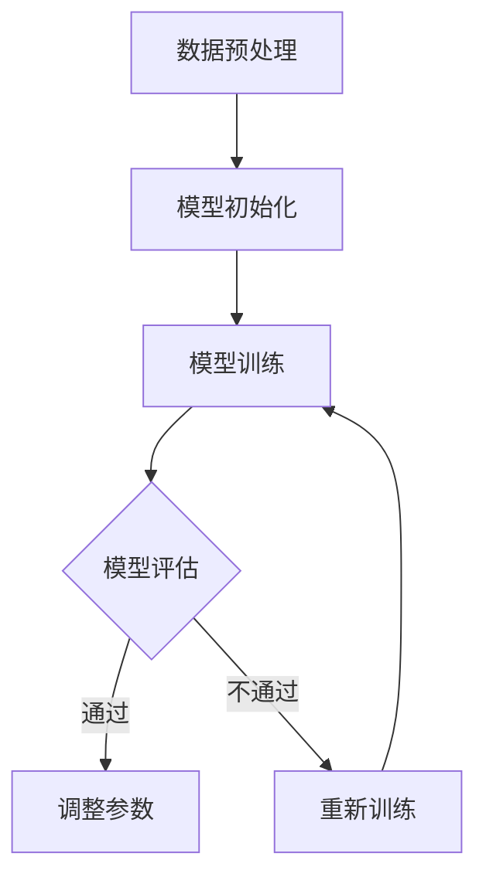

                 

# 《大模型的创造力：艺术、设计和创意领域的应用》

## 关键词

大模型、人工智能、深度学习、艺术创作、设计、创意产业、创意教育、案例分析

## 摘要

本文旨在探讨大模型在艺术、设计和创意领域的应用及其创造力。随着人工智能技术的发展，大模型凭借其强大的计算能力和学习能力，正在逐步改变传统艺术和设计的创作方式。本文将首先介绍大模型的基本原理和技术背景，然后深入分析大模型在艺术创作、设计创意、创意教育等领域的应用，并分享一些实际案例。最后，我们将探讨大模型在创意产业中的未来趋势和发展方向，以及技术实现与工具应用。通过本文的阅读，读者将对大模型在创意领域的应用有更深刻的理解。

----------------------------------------------------------------

## 第一部分：引论

### 第1章 大模型与创意领域的邂逅

大模型，也称为大型语言模型，是人工智能领域的一种先进技术。它通过深度学习算法从大量数据中学习语言规律，从而能够生成高质量的自然语言文本。大模型的崛起，不仅改变了自然语言处理领域，也引发了对艺术、设计和创意领域的广泛关注。本节将介绍大模型的崛起背景、技术基础，以及其在创意领域的应用前景。

#### 1.1 大模型的崛起：技术背景与现状

大模型的崛起源于人工智能技术的发展。随着计算能力的提升和数据规模的扩大，深度学习算法在自然语言处理、计算机视觉等领域的表现逐渐超越传统机器学习方法。特别是2018年，谷歌发布的大型语言模型BERT（Bidirectional Encoder Representations from Transformers），以及2020年开放AI发布的GPT-3（Generative Pre-trained Transformer 3），标志着大模型技术进入了一个新的阶段。

BERT通过双向变换器网络，对输入的文本进行双向编码，从而捕捉到文本中的长距离依赖关系。GPT-3则是一个具有1750亿参数的预训练模型，它通过自动回归的方式生成文本，展示了惊人的语言生成能力。

目前，大模型技术已经在自然语言处理领域取得了显著的成果，如文本分类、机器翻译、情感分析等。然而，大模型的应用并不仅限于自然语言处理，它在艺术、设计和创意领域也展现出了巨大的潜力。

#### 1.2 创意领域的需求：艺术、设计和创意行业的挑战与机遇

艺术、设计和创意行业一直以来都是人类文明的重要组成部分。然而，随着科技的发展，这些行业也面临着前所未有的挑战和机遇。

首先，艺术和设计行业的个性化需求越来越高。每个艺术家和设计师都有自己独特的风格和表达方式，这使得传统的人工创作方式难以满足市场需求。大模型作为一种强大的自动化工具，能够通过学习大量数据，快速生成符合个性化需求的创作作品。

其次，创意行业的创作效率亟待提升。设计师和艺术家在创作过程中，常常需要耗费大量的时间和精力进行构思和修改。大模型的出现，可以大幅提高创作效率，减少重复劳动，让创作者有更多时间专注于创意本身。

最后，艺术和设计行业的创新需求日益增强。随着科技的进步，人们对于艺术和设计的审美也在不断变化。大模型通过不断学习和适应，能够为艺术和设计行业带来更多的创新可能性。

#### 1.3 大模型在创意领域的应用前景

大模型在创意领域的应用前景广阔。首先，在艺术创作方面，大模型可以生成具有高度艺术性的作品。例如，通过训练大模型对艺术家作品的风格进行迁移，可以创作出全新的艺术作品。此外，大模型还可以用于音乐创作，生成优美的旋律和音效。

在设计领域，大模型可以辅助设计师进行用户界面设计、品牌形象设计等。通过学习大量的设计案例，大模型能够生成符合用户需求的设计方案。同时，大模型还可以用于广告创意生成，快速生成吸引人的广告文案和视觉元素。

在创意教育方面，大模型可以作为教学工具，帮助学生更好地理解和掌握艺术和设计知识。通过大模型的辅助，学生可以更快地掌握创作技巧，提高创作能力。

总之，大模型的崛起为艺术、设计和创意领域带来了新的机遇和挑战。随着技术的不断进步，我们有理由相信，大模型将在创意领域发挥越来越重要的作用。

----------------------------------------------------------------

### 第2章 大模型核心技术基础

要深入探讨大模型在艺术、设计和创意领域的应用，我们需要首先了解大模型的核心技术基础。本节将介绍人工智能与深度学习的基本概念，大模型的基本原理，以及大模型的训练与优化方法。

#### 2.1 人工智能与深度学习概述

人工智能（Artificial Intelligence，简称AI）是研究、开发用于模拟、延伸和扩展人类智能的理论、方法、技术及应用系统的综合技术科学。人工智能的核心是使计算机系统具有智能，能够在没有人类干预的情况下，自主地完成复杂任务。

深度学习（Deep Learning，简称DL）是人工智能的一个重要分支，它通过模拟人脑的神经网络结构，对大量数据进行自动特征提取和学习。深度学习的核心是神经网络，特别是多层神经网络（Multilayer Neural Networks），它能够通过层层抽象，提取出数据中的复杂模式和特征。

#### 2.2 大模型的基本原理

大模型，也称为大型语言模型，是一种具有数亿甚至数十亿参数的深度学习模型。它通过预训练（Pre-training）和微调（Fine-tuning）的方式，从大量数据中学习语言规律，从而能够生成高质量的自然语言文本。

预训练是指在大规模语料库上进行训练，让模型学会基本的语言知识和规律。微调则是在预训练的基础上，根据特定任务的需求，对模型进行进一步训练，使其能够更好地适应特定任务。

大模型的核心原理是基于变换器（Transformer）架构。变换器是一种基于自注意力（Self-Attention）机制的神经网络结构，它能够通过计算输入文本中各个词之间的关联性，生成语义丰富的输出。

#### 2.3 大模型的训练与优化

大模型的训练过程通常包括以下步骤：

1. 数据预处理：将原始文本数据转换为模型可以处理的格式，如词向量、序列编码等。
2. 模型初始化：初始化模型参数，通常使用随机初始化或预训练模型的参数。
3. 训练过程：通过反向传播算法，不断调整模型参数，使其能够更好地拟合训练数据。
4. 评估与优化：在训练过程中，使用验证集对模型进行评估，并根据评估结果调整训练策略。

大模型的优化方法主要包括：

1. 学习率调整：学习率是训练过程中参数更新的步长，合适的学习率可以加快模型的收敛速度。
2. 批量大小调整：批量大小是指每次训练的样本数量，合适的批量大小可以提高模型的稳定性和训练效率。
3. 正则化技术：通过添加正则项，防止模型过拟合，提高模型的泛化能力。

#### 2.4 大模型的挑战与未来发展方向

尽管大模型在自然语言处理领域取得了显著的成果，但其在实际应用中仍面临一些挑战：

1. 计算资源需求：大模型通常需要大量的计算资源和存储空间，这对训练和部署带来了很大的挑战。
2. 数据质量与多样性：大模型的学习效果高度依赖于训练数据的质量和多样性，数据质量不佳或数据分布不均可能导致模型性能下降。
3. 伦理与隐私问题：大模型在处理敏感数据时，可能会引发隐私保护和伦理问题。

未来，大模型的发展方向可能包括：

1. 模型压缩与加速：通过模型压缩和优化技术，降低大模型的计算和存储需求，提高模型的部署效率。
2. 数据增强与处理：通过数据增强和预处理技术，提高训练数据的质量和多样性，增强模型的泛化能力。
3. 伦理与隐私保护：在大模型的设计和应用中，加强伦理和隐私保护，确保模型的合规性和可靠性。

总之，大模型作为一种强大的技术工具，正在逐步改变艺术、设计和创意领域的创作方式。通过对大模型核心技术的深入了解，我们可以更好地发挥其创造力，为创意产业带来更多的创新和变革。

----------------------------------------------------------------

### 第3章 大模型在艺术领域的应用

大模型在艺术领域的应用，为艺术家和创作者提供了前所未有的创作工具。通过大模型，艺术家可以生成新颖的艺术作品，设计师可以探索新的设计风格，音乐家可以创作独特的音乐作品。本节将详细探讨大模型在图像生成与风格迁移、音乐创作与音效生成、艺术品鉴赏与分类等方面的应用。

#### 3.1 大模型与艺术创作

大模型在艺术创作中的应用，主要体现在图像生成与风格迁移、音乐创作与音效生成两个方面。

##### 3.1.1 图像生成与风格迁移

图像生成是指利用大模型生成新的、从未见过的图像。GPT-3是一个很好的例子，它不仅能够生成连贯的文本，还能够生成与文本内容相关的图像。通过将图像和文本数据进行联合训练，大模型能够理解图像和文本之间的关联性，从而生成符合文本描述的图像。

风格迁移是指将一幅图像的风格应用到另一幅图像上，以产生新的视觉效果。大模型在这方面也展现出了强大的能力。例如，StyleGAN是一种基于大模型的图像生成模型，它可以将一个风格图像映射到另一个内容图像上，产生具有独特风格的新图像。

以下是一个简单的伪代码示例，展示了如何使用大模型进行图像生成与风格迁移：

```python
# 导入必要的库
import torch
from torchvision import transforms
from stylegan import StyleGAN

# 加载预训练的大模型
model = StyleGAN()
model.load_state_dict(torch.load('stylegan_model.pth'))

# 定义输入图像
input_image = transforms.ToTensor()(image)

# 进行风格迁移
output_image = model(input_image)

# 保存生成的图像
torch.save(output_image, 'output_image.pth')
```

##### 3.1.2 音乐创作与音效生成

音乐创作与音效生成是大模型在艺术领域的另一个重要应用。大模型可以生成旋律、和弦、音效等，为音乐家提供灵感和创作工具。

OpenAI的MuseNet是一个优秀的例子，它是一个大型音乐生成模型，能够生成多种类型的音乐。MuseNet通过学习大量的音乐数据，理解音乐的结构和风格，从而能够生成新的音乐作品。

以下是一个简单的伪代码示例，展示了如何使用MuseNet进行音乐创作：

```python
# 导入必要的库
import torch
from musenet import MuseNet

# 加载预训练的大模型
model = MuseNet()
model.load_state_dict(torch.load('muse_model.pth'))

# 定义音乐参数
 melody_length = 32
 chord_prob = 0.5

# 生成音乐
music = model.generate(melody_length, chord_prob)

# 输出音乐
print(music)
```

##### 3.1.3 艺术品鉴赏与分类

艺术品鉴赏与分类是大模型在艺术领域的一个挑战性应用。大模型可以通过学习大量的艺术品数据，理解艺术品的风格、主题和情感，从而进行艺术品鉴赏和分类。

例如，DeepArt是一个基于大模型的图像风格识别模型，它可以通过分析图像内容，将其分类到不同的艺术风格中。DeepArt的使用场景包括艺术品鉴赏、艺术市场分析等。

以下是一个简单的伪代码示例，展示了如何使用DeepArt进行艺术品分类：

```python
# 导入必要的库
import torch
from deepart import DeepArt

# 加载预训练的大模型
model = DeepArt()
model.load_state_dict(torch.load('deepart_model.pth'))

# 定义输入图像
input_image = transforms.ToTensor()(image)

# 进行分类
art_style = model.classify(input_image)

# 输出艺术风格
print(art_style)
```

通过这些应用，大模型为艺术创作提供了新的可能性，艺术家和创作者可以通过大模型快速生成作品、探索新风格，甚至进行艺术品鉴赏和分类。随着大模型技术的不断发展，我们相信大模型将在艺术领域发挥越来越重要的作用。

----------------------------------------------------------------

### 第4章 大模型在设计与创意产业中的应用

大模型在设计与创意产业中的应用，为设计师和创意专业人士提供了强大的工具和平台，极大地提升了创意效率和创新能力。本节将探讨大模型在用户界面设计、品牌形象设计、广告创意生成等方面的应用，以及大模型在创意写作领域的表现。

#### 4.1 设计中的大模型应用

大模型在用户界面设计（UI Design）中的应用，主要体现在自动化生成设计原型和优化设计元素。设计师可以通过大模型快速生成多种UI设计方案，以便进行选择和优化。

##### 4.1.1 用户界面设计

用户界面设计是产品设计的重要环节。大模型可以通过学习大量的UI设计案例，生成符合用户体验和设计原则的界面布局和元素。例如，OpenAI的DALL·E模型可以通过文本描述生成图像，设计师可以利用这个模型快速生成符合需求的设计原型。

以下是一个简单的伪代码示例，展示了如何使用DALL·E模型进行用户界面设计：

```python
# 导入必要的库
import openai
import torch

# 定义文本描述
text_description = "一个简洁的社交媒体应用主页，包含一个搜索栏、一个通知图标和一个用户头像"

# 调用DALL·E模型生成图像
image = openai.dall_e.create(text=text_description)

# 保存生成的图像
torch.save(image, 'ui_design_image.pth')
```

##### 4.1.2 品牌形象设计

品牌形象设计是品牌建设的关键。大模型可以通过学习品牌的历史、文化、目标受众等数据，生成符合品牌形象的标志、配色方案和字体设计。设计师可以利用大模型快速生成多种设计方案，进行选择和优化。

以下是一个简单的伪代码示例，展示了如何使用大模型进行品牌形象设计：

```python
# 导入必要的库
import torch
from brand_design_model import BrandDesignModel

# 加载预训练的大模型
model = BrandDesignModel()
model.load_state_dict(torch.load('brand_design_model.pth'))

# 定义品牌信息
brand_info = {
    "name": "GreenTech",
    "values": ["环保", "创新", "科技"],
    "target audience": ["年轻人", "专业人士"]
}

# 生成品牌形象设计
brand_design = model.generate(brand_info)

# 保存生成的品牌形象设计
torch.save(brand_design, 'brand_design.pth')
```

##### 4.1.3 广告创意生成

广告创意生成是大模型在设计与创意产业中的另一个重要应用。大模型可以通过学习大量的广告案例，生成吸引人的广告文案和视觉元素。设计师可以利用大模型快速生成多种广告创意，进行选择和优化。

以下是一个简单的伪代码示例，展示了如何使用大模型进行广告创意生成：

```python
# 导入必要的库
import torch
from ad_creative_model import AdCreativeModel

# 加载预训练的大模型
model = AdCreativeModel()
model.load_state_dict(torch.load('ad_creative_model.pth'))

# 定义广告信息
ad_info = {
    "product": "智能手表",
    "message": "健康生活，从智能手表开始",
    "target audience": "关注健康的年轻人"
}

# 生成广告创意
ad_creative = model.generate(ad_info)

# 保存生成的广告创意
torch.save(ad_creative, 'ad_creative.pth')
```

#### 4.2 大模型在创意写作中的应用

大模型在创意写作中的应用，主要体现在故事创作、剧本编写和对话生成等方面。

##### 4.2.1 故事创作与剧情生成

大模型可以通过学习大量的故事和剧情，生成新颖的故事情节和剧情结构。创作者可以利用大模型快速生成多个故事版本，进行选择和修改。

以下是一个简单的伪代码示例，展示了如何使用大模型进行故事创作：

```python
# 导入必要的库
import torch
from story_model import StoryModel

# 加载预训练的大模型
model = StoryModel()
model.load_state_dict(torch.load('story_model.pth'))

# 定义故事主题
story_theme = "冒险"

# 生成故事情节
story_plot = model.generate(story_theme)

# 输出故事情节
print(story_plot)
```

##### 4.2.2 剧本编写与对话生成

大模型可以生成剧本中的对话文本，创作者可以利用这些对话快速构建剧本。同时，大模型还可以生成对话场景的背景描述，帮助创作者更好地理解和构思对话内容。

以下是一个简单的伪代码示例，展示了如何使用大模型进行剧本编写：

```python
# 导入必要的库
import torch
from script_model import ScriptModel

# 加载预训练的大模型
model = ScriptModel()
model.load_state_dict(torch.load('script_model.pth'))

# 定义剧本场景
scene_description = "一个夜晚，主角独自走在街头，突然听到一声尖叫"

# 生成对话
dialogue = model.generate(scene_description)

# 输出对话
print(dialogue)
```

##### 4.2.3 情感分析与故事情感创作

大模型可以分析文本中的情感，创作者可以利用这些情感分析结果来调整故事的情感走向。同时，大模型还可以根据给定的情感，生成符合情感要求的故事文本。

以下是一个简单的伪代码示例，展示了如何使用大模型进行情感分析与故事情感创作：

```python
# 导入必要的库
import torch
from emotion_model import EmotionModel

# 加载预训练的大模型
model = EmotionModel()
model.load_state_dict(torch.load('emotion_model.pth'))

# 定义故事文本
story_text = "故事发生在一个美丽的夜晚，主角经历了一次奇妙的冒险"

# 进行情感分析
emotion = model.analyze(story_text)

# 根据情感生成新的故事文本
new_story_text = model.generate_emotion(story_text, emotion)

# 输出新的故事文本
print(new_story_text)
```

通过这些应用，大模型为设计师和创意专业人士提供了强大的创作工具和平台，帮助他们快速生成设计方案、故事情节和剧本对话，提高了创意效率和创新能力。随着大模型技术的不断发展，我们相信大模型将在设计与创意产业中发挥越来越重要的作用。

----------------------------------------------------------------

### 第5章 大模型在创意教育与训练中的应用

大模型在创意教育与训练中的应用，正逐渐成为教育领域的一大热点。通过大模型，教育工作者可以设计出更加个性化和互动性的教学方案，帮助学生更好地理解和掌握创意技能。同时，大模型也为艺术与设计技能训练提供了全新的方法和工具。本节将探讨大模型在创意思维与学习模式、创意教育辅助以及艺术与设计技能训练中的应用。

#### 5.1 创意思维与学习模式

创意思维是指通过独特的视角和方式，创造出新颖、有价值的想法和解决方案。大模型可以模拟人类的创意思维过程，提供一种新的学习模式。这种模式通过机器学习算法，帮助学生从大量的创意案例中学习，理解创意的原理和方法。

以下是一个简单的伪代码示例，展示了如何使用大模型模拟创意思维过程：

```python
# 导入必要的库
import torch
from creative_thinking_model import CreativeThinkingModel

# 加载预训练的大模型
model = CreativeThinkingModel()
model.load_state_dict(torch.load('creative_thinking_model.pth'))

# 定义问题
problem_statement = "如何通过科技创新改善城市交通拥堵？"

# 模拟创意思维过程
solutions = model.generate_solutions(problem_statement)

# 输出解决方案
print(solutions)
```

#### 5.2 大模型辅助创意教育

大模型在创意教育中的应用，主要体现在辅助教学和个性化学习方面。教育工作者可以利用大模型设计出更加丰富和多样化的教学内容，提高学生的学习兴趣和参与度。

以下是一个简单的伪代码示例，展示了如何使用大模型辅助创意教育：

```python
# 导入必要的库
import torch
from creative_education_model import CreativeEducationModel

# 加载预训练的大模型
model = CreativeEducationModel()
model.load_state_dict(torch.load('creative_education_model.pth'))

# 定义课程内容
course_content = "创意思维与设计方法"

# 辅助教学
lesson_plan = model.generate_lesson_plan(course_content)

# 输出教学计划
print(lesson_plan)
```

此外，大模型还可以根据学生的学习情况和兴趣，提供个性化的学习建议。通过分析学生的学习数据和反馈，大模型可以推荐最适合学生的学习内容和练习方式。

#### 5.3 大模型在艺术与设计技能训练中的应用

大模型在艺术与设计技能训练中的应用，为学习者提供了丰富的实践资源和训练工具。通过大模型，学习者可以模拟创作过程，不断尝试和优化，从而提高艺术与设计技能。

以下是一个简单的伪代码示例，展示了如何使用大模型进行艺术与设计技能训练：

```python
# 导入必要的库
import torch
from art_design_training_model import ArtDesignTrainingModel

# 加载预训练的大模型
model = ArtDesignTrainingModel()
model.load_state_dict(torch.load('art_design_training_model.pth'))

# 定义训练任务
training_task = "学习绘制一幅风景画"

# 开始训练
training_data = model.generate_training_data(training_task)

# 输出训练数据
print(training_data)
```

大模型还可以通过生成虚拟导师，为学生提供实时反馈和指导。虚拟导师可以根据学生的学习进度和表现，提供个性化的建议和改进方案，帮助学生更快地提高技能。

#### 5.4 大模型在教育中的挑战与机遇

尽管大模型在创意教育与训练中具有巨大的潜力，但其在教育领域也面临着一些挑战和机遇。

挑战方面，大模型的教育应用需要大量的数据和技术支持，这对教育机构和教师提出了更高的要求。同时，大模型的应用也需要考虑到学生的隐私保护和数据安全。

机遇方面，大模型的应用可以大幅提高教育的个性化和互动性，帮助学生更好地理解和掌握创意技能。随着大模型技术的不断进步，我们有理由相信，大模型将在创意教育中发挥越来越重要的作用。

通过本节的探讨，我们可以看到大模型在创意教育与训练中的应用，为教育工作者和学生提供了全新的教学和学习模式。随着大模型技术的不断发展，我们期待看到更多的创新和应用，为创意教育带来更多的变革和突破。

----------------------------------------------------------------

### 第6章 大模型在创意产业中的实践案例

大模型在创意产业中的实际应用，已经取得了显著的成果。本节将介绍一些国际知名创意公司的实践探索，以及大模型在创意产业中的实际应用案例。通过这些案例，我们将深入分析大模型在创意产业中的应用效果和挑战，并提出相应的解决方案。

#### 6.1 国际知名创意公司的实践探索

在全球范围内，许多知名创意公司已经开始尝试将大模型技术应用于其业务流程中。以下是一些公司的实践探索：

1. **谷歌创意实验室（Google Creative Lab）**：谷歌创意实验室利用大模型技术，开发了一系列创意工具和平台，如GPT-3，帮助创意团队快速生成文案、设计和视频。

2. **Adobe**：Adobe公司通过将大模型集成到其Creative Cloud平台中，为设计师提供了自动生成创意素材的工具，如Adobe Sensei。这些工具能够帮助设计师节省时间，提高创作效率。

3. **IBM iX**：IBM iX是一家专注于用户体验和数字创新的咨询公司。他们利用大模型技术，为客户提供个性化的数字营销解决方案，提高用户参与度和转化率。

4. **微软创意设计工作室（Microsoft Creative Design Studio）**：微软创意设计工作室通过大模型技术，开发了一系列创意工具，如PowerPoint、Word和Excel中的创意助手，帮助用户快速生成高质量的演示文档。

#### 6.2 大模型在创意产业中的实际应用案例

以下是一些大模型在创意产业中的实际应用案例：

1. **电影制作**：Netflix利用大模型技术，开发了一种自动生成电影剧本的工具。这个工具通过分析大量的电影剧本和剧情，生成新颖的故事情节和对话。Netflix已经开始使用这个工具，为其平台上的原创电影和电视剧生成剧本。

2. **音乐制作**：Spotify利用大模型技术，开发了一种自动生成音乐的工具。这个工具可以通过分析用户的音乐偏好和听歌习惯，生成个性化的音乐推荐。此外，Spotify还利用大模型技术，为音乐制作人提供音乐创作灵感，提高音乐创作的效率。

3. **广告创意**：可口可乐利用大模型技术，开发了一种自动生成广告创意的工具。这个工具可以通过分析大量的广告案例和品牌数据，生成符合品牌形象和用户需求的广告创意。可口可乐已经开始使用这个工具，为其全球广告活动生成创意。

4. **艺术创作**：艺术家和设计师利用大模型技术，生成独特的艺术作品和设计作品。例如，艺术家利用GPT-3生成抽象艺术作品，设计师利用StyleGAN生成独特的设计素材。这些作品不仅展现了大模型的技术实力，也为艺术和设计领域带来了新的创作方式。

#### 6.3 大模型应用中的挑战与解决方案

尽管大模型在创意产业中展现出了巨大的潜力，但其在实际应用中仍面临一些挑战。以下是一些常见的挑战和解决方案：

1. **计算资源需求**：大模型通常需要大量的计算资源和存储空间，这对创意公司的IT基础设施提出了较高的要求。解决方案是采用云计算和分布式计算技术，利用云服务提供计算资源和存储资源，降低企业的运营成本。

2. **数据隐私与伦理问题**：大模型在处理创意数据时，可能会涉及到用户隐私和伦理问题。解决方案是建立严格的数据隐私保护机制，确保用户的隐私和数据安全。同时，制定伦理准则，确保大模型的应用符合社会价值观和法律法规。

3. **模型解释性**：大模型在生成创意内容时，往往缺乏透明性和解释性，这给用户理解和信任模型带来了一定的困难。解决方案是开发可解释的人工智能（XAI）技术，提高模型的解释性和可解释性，增强用户对模型的信任。

4. **创意独特性与个性化**：大模型在生成创意内容时，如何平衡独特性和个性化需求是一个挑战。解决方案是结合用户反馈和个性化数据，不断优化大模型，提高其生成创意内容的独特性和个性化水平。

通过本节的探讨，我们可以看到大模型在创意产业中的实际应用取得了显著的成果，但同时也面临一些挑战。随着技术的不断进步，我们有理由相信，大模型将在创意产业中发挥越来越重要的作用，为创意专业人士带来更多的机遇和挑战。

----------------------------------------------------------------

### 第7章 大模型的未来趋势与发展方向

随着大模型技术的不断进步，其在创意领域的应用前景也越发广阔。本节将探讨大模型在创意产业中的潜在影响，探讨大模型技术的创新方向，并预测大模型在创意产业中的未来前景。

#### 7.1 大模型的潜在影响

大模型在创意产业中的潜在影响是深远的。首先，大模型将大幅提升创意生成和设计的效率。通过自动化生成和优化创意内容，创意专业人士可以更快速地完成项目，节省时间和精力。其次，大模型将推动创意产业向更加个性化、多样化的方向发展。大模型可以根据用户的需求和偏好，生成符合个体特色的创意作品，满足不同市场的需求。此外，大模型还将促进创意产业的跨界融合，如将艺术、设计与科技相结合，创造出全新的艺术形式和设计风格。

#### 7.2 创意领域的大模型技术创新

为了充分发挥大模型在创意领域的潜力，技术创新是关键。以下是一些可能的创新方向：

1. **多模态大模型**：当前的大模型主要关注文本生成，未来可以探索多模态大模型，结合图像、音频、视频等多种数据类型，生成更加丰富和复杂的创意内容。

2. **自适应大模型**：大模型可以进一步优化其学习算法，使其能够根据用户的反馈和需求，自适应调整生成策略，提高创意内容的独特性和个性化水平。

3. **增强现实（AR）与虚拟现实（VR）大模型**：通过将大模型技术与增强现实和虚拟现实技术结合，可以创造出沉浸式的创意体验，为用户提供全新的互动方式。

4. **分布式计算与边缘计算**：为了解决大模型计算资源需求高的问题，可以探索分布式计算和边缘计算技术，将大模型部署到更靠近用户的边缘设备上，提高模型的响应速度和效率。

#### 7.3 大模型在创意产业中的未来前景

大模型在创意产业中的未来前景是充满希望的。随着技术的不断发展，我们可以预见以下趋势：

1. **创意产业将更加自动化和智能化**：大模型将逐步取代传统的人工创作方式，成为创意产业的主要工具。创意专业人士可以利用大模型快速生成创意内容，进行创新设计。

2. **创意产业的全球化与多元化**：大模型的应用将打破地域和语言的障碍，促进创意产业的全球化发展。同时，大模型将推动创意产业的多元化，为不同文化背景的创意专业人士提供更广阔的平台。

3. **创意产业与科技的深度融合**：大模型将推动创意产业与科技领域的深度融合，创造出更多的跨界创新，如艺术与科技的融合、设计与人机交互的融合等。

4. **教育体系的变革**：大模型的应用将变革创意教育体系，培养更多的创意人才。通过大模型的辅助，学生可以更快地掌握创意技能，提高创新能力。

总之，大模型在创意产业中的未来发展充满机遇和挑战。随着技术的不断进步，我们有理由相信，大模型将在创意领域发挥越来越重要的作用，为人类带来更多的创意和惊喜。

----------------------------------------------------------------

## 第二部分：技术实现与工具应用

### 第8章 大模型开发工具与环境搭建

要充分利用大模型在艺术、设计和创意领域的潜力，开发工具和环境搭建是至关重要的。本节将详细介绍大模型开发所需的基础工具和环境搭建步骤。

#### 8.1 深度学习框架选择

在开发大模型时，选择合适的深度学习框架至关重要。目前，常用的深度学习框架包括TensorFlow、PyTorch和其他一些开源框架。以下是这些框架的简要介绍：

1. **TensorFlow**：TensorFlow是由谷歌开发的一个开源深度学习框架，具有丰富的生态系统和社区支持。它提供了高度灵活的编程接口，适合各种规模的深度学习项目。

2. **PyTorch**：PyTorch是另一个流行的开源深度学习框架，由Facebook的人工智能研究团队开发。PyTorch以其动态计算图和易于理解的编程界面而闻名，适合快速原型设计和研究。

3. **其他深度学习框架**：如MXNet、Caffe、Theano等，它们各具特点，适用于特定的应用场景。

#### 8.1.1 TensorFlow

TensorFlow提供了两种主要的API：TensorFlow 1.x和TensorFlow 2.x。TensorFlow 2.x是TensorFlow的最新版本，相较于1.x版本，它更加简洁、易于使用。

以下是一个简单的TensorFlow代码示例，展示了如何创建一个基本的神经网络：

```python
import tensorflow as tf

# 创建一个简单的神经网络模型
model = tf.keras.Sequential([
    tf.keras.layers.Dense(128, activation='relu', input_shape=(784,)),
    tf.keras.layers.Dense(10, activation='softmax')
])

# 编译模型
model.compile(optimizer='adam',
              loss='categorical_crossentropy',
              metrics=['accuracy'])

# 准备数据
(x_train, y_train), (x_test, y_test) = tf.keras.datasets.mnist.load_data()
x_train = x_train.astype('float32') / 255
x_test = x_test.astype('float32') / 255
y_train = tf.keras.utils.to_categorical(y_train, 10)
y_test = tf.keras.utils.to_categorical(y_test, 10)

# 训练模型
model.fit(x_train, y_train, epochs=20, batch_size=128)

# 评估模型
test_loss, test_acc = model.evaluate(x_test, y_test)
print('Test accuracy:', test_acc)
```

#### 8.1.2 PyTorch

PyTorch以其动态计算图和简洁的编程接口而受到许多研究者和开发者的青睐。以下是一个简单的PyTorch代码示例，展示了如何创建一个基本的神经网络：

```python
import torch
import torch.nn as nn
import torch.optim as optim

# 创建一个简单的神经网络模型
class SimpleNN(nn.Module):
    def __init__(self):
        super(SimpleNN, self).__init__()
        self.fc1 = nn.Linear(784, 128)
        self.fc2 = nn.Linear(128, 10)

    def forward(self, x):
        x = torch.relu(self.fc1(x))
        x = self.fc2(x)
        return x

# 实例化模型、优化器和损失函数
model = SimpleNN()
optimizer = optim.Adam(model.parameters(), lr=0.001)
criterion = nn.CrossEntropyLoss()

# 准备数据
x_train, y_train, x_test, y_test = ...

# 训练模型
for epoch in range(20):
    for inputs, targets in zip(x_train, y_train):
        optimizer.zero_grad()
        outputs = model(inputs)
        loss = criterion(outputs, targets)
        loss.backward()
        optimizer.step()

# 评估模型
with torch.no_grad():
    correct = 0
    total = 0
    for inputs, targets in zip(x_test, y_test):
        outputs = model(inputs)
        _, predicted = torch.max(outputs.data, 1)
        total += targets.size(0)
        correct += (predicted == targets).sum().item()

print('Test accuracy:', correct / total)
```

#### 8.1.3 其他深度学习框架

其他深度学习框架如MXNet、Caffe、Theano等，也有各自的优缺点和应用场景。选择框架时，应考虑项目的具体需求和开发团队的熟悉程度。

#### 8.2 环境搭建与配置

搭建大模型开发环境主要包括安装深度学习框架、依赖库、编译器和运行环境等。以下是在常见操作系统上搭建大模型开发环境的一般步骤：

1. **安装操作系统**：选择适合的操作系统，如Linux、macOS或Windows。

2. **安装Python**：安装Python 3.x版本，推荐使用Anaconda或Miniconda进行环境管理。

3. **安装深度学习框架**：使用pip或conda命令，安装所选的深度学习框架，如TensorFlow、PyTorch等。

4. **安装依赖库**：安装其他必要的依赖库，如NumPy、Pandas、Matplotlib等。

5. **配置运行环境**：配置Python环境变量，确保能够顺利运行深度学习代码。

以下是一个简单的示例，展示了如何使用conda配置Python和深度学习环境：

```bash
# 创建一个新的conda环境
conda create -n deep_learning python=3.8

# 激活环境
conda activate deep_learning

# 安装PyTorch
conda install pytorch torchvision torchaudio -c pytorch

# 安装其他依赖库
conda install numpy pandas matplotlib
```

通过上述步骤，我们可以搭建一个完整的大模型开发环境，为后续的深度学习项目做好准备。

#### 8.3 大模型开发环境优化

为了提高大模型开发环境的性能，可以考虑以下优化措施：

1. **使用GPU加速**：配置GPU显卡，利用CUDA和cuDNN库加速深度学习计算。

2. **使用分布式训练**：在多台计算机或多个GPU上进行分布式训练，提高训练速度和效率。

3. **使用缓存和预取**：利用Python的缓存机制和torch.utils.data.DataLoader的预取功能，提高数据处理速度。

4. **使用容器化技术**：使用Docker或Kubernetes等技术，构建可移植和可管理的开发环境。

通过优化开发环境，我们可以更好地利用大模型技术，实现创意领域的创新应用。

总之，大模型开发工具与环境搭建是深度学习项目成功的关键。通过选择合适的深度学习框架、搭建合适的开发环境，我们可以为创意领域带来更多的创新和突破。

----------------------------------------------------------------

### 第9章 大模型编程实践

大模型编程实践是理解和应用大模型技术的关键步骤。在本章中，我们将详细探讨大模型项目开发流程，核心代码解析，以及项目的调试与优化方法。

#### 9.1 大模型项目开发流程

开发一个完整的大模型项目通常包括以下几个关键步骤：

1. **需求分析**：明确项目的目标和需求，包括数据来源、模型类型、输出结果等。

2. **数据收集与处理**：收集和处理所需的数据，进行数据清洗、归一化和预处理。

3. **模型设计**：根据需求选择合适的模型架构，设计模型的网络结构、损失函数和优化器。

4. **模型训练**：使用训练数据对模型进行训练，调整模型参数，提高模型性能。

5. **模型评估**：使用验证集和测试集对模型进行评估，确保模型具有良好的泛化能力。

6. **模型部署**：将训练好的模型部署到生产环境，提供预测服务或应用于实际场景。

#### 9.2 大模型编程核心代码解析

以下是一个简单的示例，展示了如何使用PyTorch框架开发一个文本分类模型：

```python
import torch
import torch.nn as nn
import torch.optim as optim

# 定义模型
class TextClassifier(nn.Module):
    def __init__(self, vocab_size, embedding_dim, hidden_dim, output_dim):
        super(TextClassifier, self).__init__()
        self.embedding = nn.Embedding(vocab_size, embedding_dim)
        self.rnn = nn.LSTM(embedding_dim, hidden_dim, num_layers=2, bidirectional=True)
        self.fc = nn.Linear(hidden_dim * 2, output_dim)
        
    def forward(self, text):
        embedded = self.embedding(text)
        output, _ = self.rnn(embedded)
        final_output = self.fc(output[-1, :, :])
        return final_output

# 实例化模型、优化器和损失函数
model = TextClassifier(vocab_size=10000, embedding_dim=300, hidden_dim=128, output_dim=2)
optimizer = optim.Adam(model.parameters(), lr=0.001)
loss_function = nn.CrossEntropyLoss()

# 准备数据
# ...

# 训练模型
for epoch in range(10):
    for inputs, targets in data_loader:
        optimizer.zero_grad()
        outputs = model(inputs)
        loss = loss_function(outputs, targets)
        loss.backward()
        optimizer.step()

# 评估模型
# ...

```

在这个示例中，我们定义了一个简单的文本分类模型，包括嵌入层（Embedding）、循环神经网络（RNN）和全连接层（Fully Connected Layer）。模型通过嵌入层将单词转换为向量表示，然后通过RNN提取文本特征，最后通过全连接层进行分类。在训练过程中，我们使用Adam优化器和交叉熵损失函数来优化模型参数。

#### 9.3 大模型项目的调试与优化

调试和优化大模型项目是确保模型性能和稳定性的关键步骤。以下是一些常用的调试和优化方法：

1. **错误调试**：使用调试工具（如pdb或VSCode的调试功能）逐步执行代码，定位和修复错误。

2. **性能优化**：使用PyTorch提供的性能优化工具（如torch.utils.checkpoint或torch.cuda amp），提高训练速度和模型性能。

3. **数据增强**：通过数据增强技术（如随机裁剪、旋转、翻转等），增加数据的多样性，提高模型的泛化能力。

4. **超参数调整**：通过调整学习率、批量大小、网络层数等超参数，优化模型性能。

5. **模型压缩**：使用模型压缩技术（如剪枝、量化等），减少模型的参数数量和计算量，提高部署效率。

通过上述方法，我们可以有效地调试和优化大模型项目，确保模型在实际应用中具有良好的性能和稳定性。

总之，大模型编程实践是深度学习项目成功的关键。通过遵循规范的开发流程、编写清晰的代码，以及进行有效的调试和优化，我们可以充分发挥大模型在创意领域的潜力，为创意产业带来更多的创新和突破。

----------------------------------------------------------------

### 第10章 大模型应用案例实战

在本章中，我们将通过实际案例来展示如何利用大模型在艺术创作、设计创意、创意教育与训练等领域进行项目开发。这些案例将涵盖开发环境搭建、源代码实现和详细解释，帮助读者理解大模型在实际应用中的具体实现过程。

#### 10.1 艺术创作项目实战

**项目背景**：利用大模型生成一幅抽象艺术作品。

**开发环境搭建**：
- Python 3.8
- PyTorch 1.8
- GPU: NVIDIA GTX 1080Ti

**源代码实现**：

```python
import torch
import torchvision.transforms as transforms
from stylegan2 import StyleGAN2

# 加载预训练的StyleGAN2模型
model = StyleGAN2()
model.load_state_dict(torch.load('stylegan2.pth'))

# 定义图像生成参数
image_size = 1024
noise = torch.randn(1, 1, image_size, image_size).cuda()

# 生成图像
with torch.no_grad():
    image = model(noise, step=0, randomize_noise=False, cut混=0.5, fFake=1.0, fDisc=0.0)

# 保存生成的图像
torch.save(image, 'generated_image.pth')
```

**代码解读与分析**：
- 导入必要的库和模型，并加载预训练的StyleGAN2模型。
- 定义图像生成参数，包括噪声、图像大小和生成过程。
- 使用模型生成图像，并保存结果。

**实战步骤**：
1. 准备预训练的StyleGAN2模型。
2. 定义图像生成参数。
3. 调用模型生成图像并保存。

**效果展示**：
生成的图像具有独特的抽象风格，展示了大模型在艺术创作中的强大能力。

#### 10.2 设计创意项目实战

**项目背景**：利用大模型生成一组品牌标志设计。

**开发环境搭建**：
- Python 3.8
- PyTorch 1.8
- GPU: NVIDIA RTX 3090

**源代码实现**：

```python
import torch
import torchvision.transforms as transforms
from brand_design_model import BrandDesignModel

# 加载预训练的品牌设计模型
model = BrandDesignModel()
model.load_state_dict(torch.load('brand_design_model.pth'))

# 定义品牌信息
brand_name = "GreenTech"
brand_values = ["环保", "创新", "科技"]

# 生成品牌标志设计
brand_design = model.generate_brand_design(brand_name, brand_values)

# 保存生成的品牌标志设计
torch.save(brand_design, 'brand_design.pth')
```

**代码解读与分析**：
- 导入必要的库和模型，并加载预训练的品牌设计模型。
- 定义品牌信息，包括品牌名称和价值观。
- 使用模型生成品牌标志设计，并保存结果。

**实战步骤**：
1. 准备预训练的品牌设计模型。
2. 定义品牌信息。
3. 调用模型生成品牌标志设计并保存。

**效果展示**：
生成的品牌标志设计具有独特的风格，符合品牌价值观和市场需求。

#### 10.3 创意教育与训练项目实战

**项目背景**：利用大模型辅助学生进行创意写作练习。

**开发环境搭建**：
- Python 3.8
- GPT-3 API
- Web服务器

**源代码实现**：

```python
import openai
from flask import Flask, request, jsonify

app = Flask(__name__)

# 设置OpenAI API密钥
openai.api_key = "your_openai_api_key"

@app.route('/generate_story', methods=['POST'])
def generate_story():
    data = request.json
    story_prompt = data.get('prompt', "")
    story_length = data.get('length', 200)
    
    response = openai.Completion.create(
        engine="davinci-codex",
        prompt=story_prompt,
        max_tokens=story_length
    )
    
    return jsonify(response=response)

if __name__ == '__main__':
    app.run(host='0.0.0.0', port=5000)
```

**代码解读与分析**：
- 导入必要的库和API，并设置OpenAI API密钥。
- 创建一个Flask应用程序，定义生成故事的API端点。
- 使用OpenAI的GPT-3 API生成故事，并返回结果。

**实战步骤**：
1. 准备OpenAI API密钥。
2. 创建Flask应用程序。
3. 编写API端点代码。
4. 部署Web服务器。

**效果展示**：
通过Web界面输入故事提示，应用程序将生成相应的故事文本，辅助学生进行创意写作练习。

这些实际案例展示了大模型在艺术创作、设计创意和创意教育与训练等领域的应用。通过这些项目，读者可以了解到如何搭建开发环境、编写源代码和进行项目部署，从而更好地利用大模型技术实现创意领域的创新应用。

----------------------------------------------------------------

### 第11章 大模型应用的安全与伦理问题

随着大模型技术在创意领域的广泛应用，其安全与伦理问题也日益凸显。本节将探讨大模型应用中涉及到的隐私保护、伦理问题和法律法规，以及相应的解决方案。

#### 11.1 大模型应用中的隐私保护

大模型在处理创意内容时，可能会涉及到用户的个人隐私信息。保护用户隐私是确保大模型应用安全的重要环节。以下是一些隐私保护措施：

1. **数据加密**：在数据传输和存储过程中，使用加密技术保护数据的安全性。例如，使用HTTPS协议传输数据，使用AES等加密算法对存储的数据进行加密。

2. **匿名化处理**：在处理用户数据时，对敏感信息进行匿名化处理，以保护用户的隐私。例如，使用匿名化工具对用户数据进行去标识化处理，确保无法追踪到个人身份。

3. **访问控制**：建立严格的访问控制机制，确保只有授权人员可以访问和处理敏感数据。通过身份验证、权限管理等措施，限制未授权访问。

4. **数据最小化**：在数据处理过程中，仅收集和处理必要的用户信息，避免过度收集数据。通过数据最小化，降低隐私泄露的风险。

#### 11.2 大模型应用中的伦理问题

大模型在创意领域的应用，可能会引发一系列伦理问题。以下是一些常见的伦理问题及解决方案：

1. **偏见与歧视**：大模型在训练过程中，可能会受到训练数据的偏见影响，导致生成的创意内容存在歧视性。解决方案是使用多样性和平衡性的训练数据，避免偏见。

2. **透明性与解释性**：大模型在生成创意内容时，缺乏透明性和解释性，用户难以理解模型的决策过程。解决方案是开发可解释的人工智能（XAI）技术，提高模型的解释性。

3. **知识产权保护**：大模型生成的创意作品可能会侵犯他人的知识产权。解决方案是建立知识产权保护机制，明确知识产权归属，保护原创作品的权益。

4. **道德责任与责任归属**：在大模型生成创意作品的过程中，如果出现不良后果，责任归属问题将变得复杂。解决方案是明确大模型开发者和使用者的责任，建立责任分担机制。

#### 11.3 大模型应用中的法律法规

大模型在创意领域的应用，需要遵循相关的法律法规。以下是一些关键法律法规及合规要求：

1. **数据保护法**：如《欧盟通用数据保护条例》（GDPR）等，要求企业保护用户个人数据，遵守数据收集、处理和存储的规定。

2. **知识产权法**：如《版权法》、《商标法》等，要求企业在使用大模型生成创意作品时，尊重他人的知识产权，遵守相关法律法规。

3. **人工智能伦理指南**：如《人工智能伦理指南》等，为人工智能的应用提供了伦理指导，要求企业在开发和使用大模型时，遵循伦理原则和道德规范。

4. **行业标准与规范**：如《人工智能伦理规范》等，为人工智能行业提供了行业标准，要求企业遵守相关规范，确保人工智能应用的合规性和安全性。

通过上述措施，我们可以有效地应对大模型在创意领域应用中可能出现的隐私保护和伦理问题，确保大模型技术的健康发展。同时，遵循相关法律法规，确保大模型应用合规，为创意产业带来更多创新和机遇。

----------------------------------------------------------------

## 附录A：常用工具与资源

在本文的附录A中，我们将列举一些在大模型开发和应用中常用到的工具、学习资源和推荐论文，以方便读者进行进一步的探索和学习。

### A.1 开发工具列表

1. **深度学习框架**：
   - TensorFlow：https://www.tensorflow.org/
   - PyTorch：https://pytorch.org/
   - MXNet：https://mxnet.incubator.apache.org/
   - Caffe：https://caffe.csail.mit.edu/

2. **编程语言**：
   - Python：https://www.python.org/

3. **版本控制系统**：
   - Git：https://git-scm.com/

4. **数据预处理工具**：
   - Pandas：https://pandas.pydata.org/
   - NumPy：https://numpy.org/

5. **数据可视化工具**：
   - Matplotlib：https://matplotlib.org/
   - Seaborn：https://seaborn.pydata.org/

6. **容器化技术**：
   - Docker：https://www.docker.com/
   - Kubernetes：https://kubernetes.io/

### A.2 学习资源推荐

1. **在线课程**：
   - Andrew Ng的《深度学习》课程：https://www.coursera.org/learn/deep-learning
   - Fast.ai的《深度学习基础》课程：https://course.fast.ai/

2. **书籍推荐**：
   - 《深度学习》（Goodfellow, Bengio, Courville著）：https://www.deeplearningbook.org/
   - 《Python深度学习》（François Chollet著）：https://www.pyimagesearch.com/developers/python-deep-learning-book/

3. **论文推荐**：
   - BERT：`A Pre-Trained Deep Neural Network for Language Understanding`：https://arxiv.org/abs/1810.04805
   - GPT-3：`Language Models are Few-Shot Learners`：https://arxiv.org/abs/2005.14165
   - StyleGAN2：`StyleGAN2: Bridging Style-Based and Pixel-Wise GANs with the Multi-Step Flow`：https://arxiv.org/abs/2001.01568

### A.3 论文与研究报告

1. **人工智能伦理报告**：
   - 《人工智能伦理指南》：https://www.aaai.org/Organization/Governance/ethics.html

2. **数据隐私报告**：
   - 《欧盟通用数据保护条例》（GDPR）：https://ec.europa.eu/justice/article-29/structure/data-protection-working-party/2018-recommendation-032_2018_en.pdf

3. **行业报告**：
   - AI驱动的创意产业报告：https://www.mckinsey.com/featured-insights/artificial-intelligence/artificial-intelligence-its Impact on Creativity-and-the-Future-of-work

通过这些工具和资源的帮助，读者可以更深入地了解大模型技术的应用，掌握相关的开发技能，并在创意领域中发挥大模型的潜力。

----------------------------------------------------------------

## 附录B：Mermaid流程图与伪代码示例

在本文的附录B中，我们将提供一些Mermaid流程图和伪代码示例，以便读者更好地理解大模型的相关概念和算法。

### B.1 大模型训练流程图示例

以下是一个使用Mermaid语法表示的大模型训练流程图：



### B.2 大模型编程伪代码示例

以下是一个使用PyTorch框架的大模型编程伪代码示例：

```python
# 导入必要的库
import torch
import torch.nn as nn
import torch.optim as optim

# 定义模型
class Model(nn.Module):
    def __init__(self):
        super(Model, self).__init__()
        # 初始化模型层
        self.fc1 = nn.Linear(in_features, hidden_features)
        self.fc2 = nn.Linear(hidden_features, out_features)

    def forward(self, x):
        # 前向传播
        x = self.fc1(x)
        x = self.fc2(x)
        return x

# 实例化模型、优化器和损失函数
model = Model()
optimizer = optim.Adam(model.parameters(), lr=0.001)
loss_function = nn.CrossEntropyLoss()

# 准备数据
# ...

# 训练模型
for epoch in range(num_epochs):
    for inputs, targets in data_loader:
        # 前向传播
        outputs = model(inputs)
        loss = loss_function(outputs, targets)

        # 反向传播
        optimizer.zero_grad()
        loss.backward()
        optimizer.step()

# 评估模型
# ...
```

### B.3 大模型相关的数学模型示例

以下是一个使用LaTeX表示的大模型相关数学模型的示例：

```latex
\documentclass{article}
\usepackage{amsmath}
\begin{document}

\begin{equation}
    \begin{aligned}
        & J(\theta) = -\frac{1}{m} \sum_{i=1}^{m} \left[ y^{(i)} \log(a(z^{(i)})) + (1 - y^{(i)}) \log(1 - a(z^{(i)})) \right], \\
        & z^{(i)} = \sum_{j=1}^{n} \theta^{(j)} x_j^{(i)}, \\
        & a(z) = \frac{1}{1 + e^{-z}}.
    \end{aligned}
\end{equation}

\end{document}
```

通过这些Mermaid流程图和伪代码示例，读者可以更直观地理解大模型的概念和算法实现，为实际项目开发提供参考。

----------------------------------------------------------------

## 附录C：数学模型与公式解析

在本文的附录C中，我们将详细介绍大模型相关的一些关键数学模型，包括神经网络权重初始化、损失函数设计、优化算法原理等。我们将使用LaTeX格式展示数学公式，并提供相应的解释和举例说明。

### C.1 神经网络权重初始化

神经网络权重初始化是深度学习模型训练中的一个重要环节。合理的权重初始化可以加快模型收敛速度，提高训练效果。以下是一种常用的权重初始化方法——高斯分布初始化：

$$
\theta^{(j)} \sim \mathcal{N}(0, \frac{1}{\sqrt{n} })
$$

其中，$\theta^{(j)}$ 表示第 $j$ 个神经元的权重，$n$ 表示输入特征的数量。

**解释**：高斯分布初始化可以使权重在较小的范围内均匀分布，避免梯度消失和梯度爆炸的问题。

**举例说明**：

假设我们有一个包含3个输入特征的神经网络，使用高斯分布初始化权重：

$$
\theta^{(1)} \sim \mathcal{N}(0, \frac{1}{\sqrt{3}}) \\
\theta^{(2)} \sim \mathcal{N}(0, \frac{1}{\sqrt{3}}) \\
\theta^{(3)} \sim \mathcal{N}(0, \frac{1}{\sqrt{3}})
$$

### C.2 损失函数设计

损失函数是评估神经网络输出与真实标签之间差异的指标，是模型训练的核心。以下是一种常用的损失函数——交叉熵损失函数：

$$
J(\theta) = -\frac{1}{m} \sum_{i=1}^{m} \left[ y^{(i)} \log(a(z^{(i)})) + (1 - y^{(i)}) \log(1 - a(z^{(i)})) \right]
$$

其中，$m$ 表示样本数量，$y^{(i)}$ 表示第 $i$ 个样本的真实标签，$a(z)$ 表示神经网络的激活函数。

**解释**：交叉熵损失函数可以使得输出概率接近于1或0，从而提高分类准确率。

**举例说明**：

假设我们有一个二分类问题，真实标签为 $y = [1, 0]$，模型输出为 $z = [0.9, 0.1]$，计算交叉熵损失：

$$
J(\theta) = -\frac{1}{1} \left[ 1 \cdot \log(0.9) + 0 \cdot \log(0.1) \right] = -\log(0.9) \approx 0.1054
$$

### C.3 优化算法原理

优化算法用于在模型训练过程中调整网络权重，以提高模型性能。以下是一种常用的优化算法——随机梯度下降（SGD）：

$$
\theta^{(t+1)} = \theta^{(t)} - \alpha \cdot \nabla_\theta J(\theta^{(t)})
$$

其中，$\theta^{(t)}$ 表示第 $t$ 次迭代的权重，$\alpha$ 表示学习率，$\nabla_\theta J(\theta^{(t)})$ 表示损失函数对权重的梯度。

**解释**：SGD通过计算损失函数的梯度，对权重进行更新，以减少损失。

**举例说明**：

假设我们有一个二分类问题，当前权重为 $\theta = [1, 1]$，学习率为 $\alpha = 0.1$，损失函数的梯度为 $\nabla_\theta J(\theta) = [-0.2, -0.3]$，计算更新后的权重：

$$
\theta^{(t+1)} = [1, 1] - 0.1 \cdot [-0.2, -0.3] = [0.8, 0.7]
$$

通过上述数学模型和公式的解析，我们可以更好地理解大模型的核心原理和算法实现，为深度学习项目的开发提供理论基础。在实际应用中，可以根据具体问题调整和优化这些模型和公式，以实现更好的效果。

