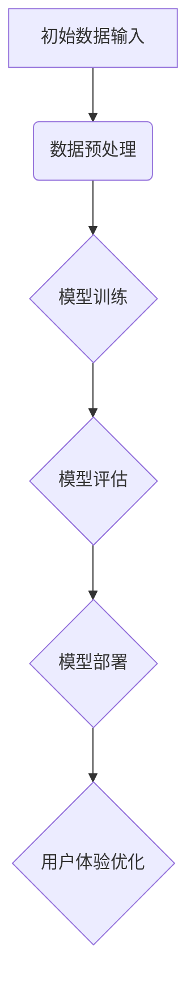

                 

### 《大模型的用户体验与市场需求》

在当今人工智能（AI）飞速发展的时代，大模型（Large Models）已经成为推动技术进步和创新的重要力量。大模型，即具有数十亿至数万亿参数的深度学习模型，其卓越的性能在自然语言处理（NLP）、计算机视觉（CV）、推荐系统等领域展现出了强大的竞争力。然而，大模型不仅仅是技术上的突破，其用户体验和市场需求也是至关重要的因素。本文将深入探讨大模型的用户体验与市场需求，通过逻辑清晰、结构紧凑、简单易懂的专业技术语言，逐步分析这一复杂而有趣的主题。

#### 核心关键词

- **大模型**
- **用户体验**
- **市场需求**
- **自然语言处理**
- **计算机视觉**
- **推荐系统**
- **深度学习**

#### 摘要

本文旨在全面解析大模型的用户体验与市场需求，从基础概念、算法原理、用户体验设计、市场需求分析到综合应用，提供系统的理论指导和实践案例。通过本文，读者将了解大模型的发展历程及其核心特性，掌握大模型算法的工作原理和数学基础，理解大模型在用户体验设计中的应用，分析大模型市场需求的发展趋势和细分领域，以及制定优化策略。最终，本文将总结大模型用户体验与市场需求的综合应用案例，并提供相关的资源和建议。

### 第一部分：大模型基础与用户体验

#### 第1章：大模型概述与用户体验基础

##### 1.1 大模型的定义与演进

大模型，顾名思义，是指具有极大参数量和复杂结构的深度学习模型。与传统模型相比，大模型拥有更高的计算能力、更强的泛化能力和更广的应用范围。大模型的发展历程可以追溯到20世纪90年代，随着计算能力的提升和算法的改进，深度神经网络（DNN）逐渐成为研究热点。从AlexNet到GPT-3，大模型经历了从单一任务到多任务、从单一领域到跨领域的演变过程。

在自然语言处理领域，GPT-3的出现标志着大模型的重大突破。GPT-3拥有1750亿个参数，能够生成高质量的自然语言文本，其在文本生成、机器翻译、问答系统等任务上取得了显著成绩。在计算机视觉领域，大模型如ResNet和BERT等，也在图像分类、目标检测、语义分割等方面展现了强大的能力。

##### 1.2 大模型用户体验的核心要素

用户体验（User Experience，简称UX）是指用户在使用产品或服务时所感受到的主观体验。在大模型时代，用户体验的核心要素包括但不限于以下几点：

1. **易用性（Usability）**：大模型应具备直观、简洁的界面设计，降低用户的学习成本，提升操作效率。
2. **响应速度（Performance）**：大模型在处理复杂任务时，应保证快速的响应速度，减少用户等待时间。
3. **可靠性（Reliability）**：大模型应具备高可靠性，减少错误和故障的发生，保障用户体验的稳定性。
4. **可访问性（Accessibility）**：大模型应考虑各种用户需求，包括残障人士、低学历人群等，确保所有人都能无障碍地使用。
5. **隐私保护（Privacy）**：在大模型时代，用户数据的安全性和隐私保护尤为重要，大模型应遵循相关法律法规，保护用户隐私。

##### 1.3 大模型的核心特性与设计原则

大模型的核心特性包括：

1. **大规模参数**：大模型拥有数亿甚至数十亿个参数，能够捕获更多特征，提升模型性能。
2. **深度网络结构**：大模型通常采用多层神经网络，能够处理更复杂的任务。
3. **强大的泛化能力**：大模型通过大量数据训练，具备较好的泛化能力，能够在不同场景下表现出色。

在设计大模型时，应遵循以下原则：

1. **可扩展性（Scalability）**：大模型应具备良好的可扩展性，能够适应数据量和计算资源的变化。
2. **模块化设计**：大模型应采用模块化设计，便于维护和更新。
3. **鲁棒性（Robustness）**：大模型应具备较高的鲁棒性，能够应对异常数据和噪声干扰。
4. **节能环保**：随着大模型的规模不断扩大，能耗问题日益突出，设计时应考虑节能环保。

##### 1.4 大模型的用户体验设计方法论

大模型的用户体验设计方法论主要包括以下步骤：

1. **用户研究**：通过问卷调查、访谈、用户测试等方式，了解用户需求和行为习惯。
2. **需求分析**：根据用户研究的结果，分析用户需求，确定产品设计方向。
3. **原型设计**：基于需求分析，构建产品原型，进行用户反馈和迭代。
4. **界面设计**：设计直观、简洁、美观的界面，提升用户操作体验。
5. **测试与优化**：进行用户测试，收集反馈，不断优化产品设计。

通过上述方法论，大模型的设计能够更好地满足用户需求，提升用户体验。

#### 第2章：大模型算法原理与用户体验

##### 2.1 大模型算法概述

大模型算法主要包括生成对抗网络（GAN）、变分自编码器（VAE）、循环神经网络（RNN）等。这些算法在图像生成、文本生成、音频生成等领域取得了显著成果。以下分别介绍这些算法的基本原理和应用。

1. **生成对抗网络（GAN）**：

GAN由生成器和判别器两部分组成。生成器旨在生成与真实数据相似的数据，而判别器则用于区分真实数据和生成数据。通过不断训练，生成器和判别器相互对抗，生成器逐渐提升生成质量，判别器逐渐增强鉴别能力。

GAN的基本流程如下：

- **数据输入**：将真实数据和随机噪声作为输入。
- **生成器生成数据**：生成器将噪声数据转换为模拟数据。
- **判别器判断**：判别器对真实数据和生成数据进行分类。
- **反向传播**：根据判别器的判断结果，更新生成器和判别器的参数。

GAN在图像生成、视频生成、艺术创作等领域具有广泛应用。

2. **变分自编码器（VAE）**：

VAE是一种概率生成模型，通过编码器和解码器实现数据的生成。编码器将输入数据编码为潜变量，解码器将潜变量解码为输出数据。

VAE的基本流程如下：

- **数据输入**：将输入数据输入编码器。
- **编码**：编码器将输入数据编码为潜变量。
- **解码**：解码器将潜变量解码为输出数据。
- **损失函数**：通过损失函数优化编码器和解码器的参数。

VAE在图像生成、数据去噪、图像超分辨率等领域表现出色。

3. **循环神经网络（RNN）**：

RNN是一种能够处理序列数据的神经网络，其特点在于能够记忆先前的输入信息。RNN通过隐藏状态和循环连接实现序列信息的传递。

RNN的基本流程如下：

- **数据输入**：将序列数据输入RNN。
- **隐藏状态更新**：根据当前输入和先前的隐藏状态，更新隐藏状态。
- **输出计算**：根据隐藏状态和当前输入，计算输出。
- **损失函数**：通过损失函数优化RNN的参数。

RNN在自然语言处理、语音识别、时间序列预测等领域得到广泛应用。

##### 2.2 大模型算法的工作原理

大模型算法的工作原理可以分为以下几个步骤：

1. **数据预处理**：对输入数据进行清洗、归一化等预处理操作，使其符合模型输入要求。
2. **模型初始化**：初始化模型参数，通常采用随机初始化或预训练模型。
3. **前向传播**：将预处理后的数据输入模型，计算模型的输出。
4. **损失函数计算**：计算模型输出和真实值之间的差距，得到损失函数值。
5. **反向传播**：根据损失函数，计算模型参数的梯度，更新模型参数。
6. **模型优化**：通过多次迭代训练，优化模型参数，提高模型性能。

以下是一个简单的大模型算法伪代码示例：

```python
# 大模型算法伪代码

# 输入：数据集X，标签Y
# 输出：训练好的大模型

def train_large_model(X, Y):
    # 数据预处理
    X_processed = preprocess_data(X)
    
    # 模型初始化
    model = build_model()
    
    # 模型训练
    for epoch in range(num_epochs):
        for batch in data_loader(X_processed, Y):
            # 前向传播
            output = model.forward(batch.input)
            
            # 损失函数计算
            loss = compute_loss(output, batch.label)
            
            # 反向传播
            model.backward(loss)
            
            # 模型优化
            model.update_parameters()
    
    return model
```

##### 2.3 大模型算法在用户体验中的应用

大模型算法在用户体验中的应用主要包括以下几个方面：

1. **交互设计**：通过RNN等算法，实现智能对话系统，提升用户的交互体验。
2. **内容生成**：通过GAN等算法，生成高质量的图像、视频、音乐等，为用户提供丰富多样的内容。
3. **个性化推荐**：通过基于深度学习的推荐算法，为用户提供个性化的推荐服务，提升用户体验。

以下是一个大模型算法在交互设计中的应用案例：

```python
# 交互设计应用案例

# 输入：用户输入文本
# 输出：自动回复文本

def generate_response(input_text):
    # 数据预处理
    input_processed = preprocess_text(input_text)
    
    # 模型加载
    model = load_model('chatbot_model.h5')
    
    # 前向传播
    output = model.predict(input_processed)
    
    # 自动回复文本生成
    response = decode_output(output)
    
    return response
```

通过上述案例，我们可以看到大模型算法在用户体验中的实际应用。在实际开发过程中，可以根据具体需求，选择合适的大模型算法，优化用户体验。

### 第3章：大模型的数学模型与用户体验

##### 3.1 大模型的数学基础

大模型的数学基础主要包括线性代数、微积分、概率论和统计学等。以下简要介绍这些数学基础知识，并给出相关公式。

1. **线性代数**：

   - 矩阵运算：矩阵加法、矩阵乘法、矩阵求逆等。
   - 向量运算：向量加法、向量减法、点积、叉积等。
   - 线性方程组：求解线性方程组、特征值和特征向量等。

2. **微积分**：

   - 导数：一元函数的导数、多元函数的导数等。
   - 积分：定积分、不定积分等。
   - 泰勒公式：函数的泰勒展开式。

3. **概率论和统计学**：

   - 概率分布：离散型概率分布、连续型概率分布等。
   - 期望和方差：随机变量的期望、方差等。
   - 独立性和条件概率：独立事件、条件概率等。

以下是一个简单的线性回归模型的数学公式：

$$
y = \beta_0 + \beta_1x + \epsilon
$$

其中，$y$是因变量，$x$是自变量，$\beta_0$和$\beta_1$是模型参数，$\epsilon$是误差项。

##### 3.2 大模型算法的数学公式与推导

大模型算法的数学公式主要包括损失函数、优化算法等。以下以常见的损失函数——均方误差（MSE）为例，介绍其数学公式和推导过程。

1. **均方误差（MSE）**：

   均方误差是衡量模型预测值与真实值之间差异的一种常用损失函数。其数学公式如下：

   $$
   J(\theta) = \frac{1}{2m}\sum_{i=1}^{m}(h_{\theta}(x^{(i)}) - y^{(i)})^2
   $$

   其中，$h_{\theta}(x^{(i)})$是模型的预测值，$y^{(i)}$是真实值，$\theta$是模型参数。

2. **MSE的推导**：

   - **线性回归模型**：

     对于线性回归模型，假设输入特征为$x^{(i)}$，输出特征为$y^{(i)}$，模型参数为$\theta$，则预测值$h_{\theta}(x^{(i)})$可以表示为：

     $$
     h_{\theta}(x^{(i)}) = \theta_0x^{(i)} + \theta_1
     $$

     将预测值代入MSE公式，得到：

     $$
     J(\theta) = \frac{1}{2m}\sum_{i=1}^{m}(\theta_0x^{(i)} + \theta_1 - y^{(i)})^2
     $$

   - **多元线性回归模型**：

     对于多元线性回归模型，假设输入特征为$x^{(i)}$，输出特征为$y^{(i)}$，模型参数为$\theta$，则预测值$h_{\theta}(x^{(i)})$可以表示为：

     $$
     h_{\theta}(x^{(i)}) = \theta_0x_0^{(i)} + \theta_1x_1^{(i)} + \theta_2x_2^{(i)} + \ldots + \theta_nx_n^{(i)}
     $$

     将预测值代入MSE公式，得到：

     $$
     J(\theta) = \frac{1}{2m}\sum_{i=1}^{m}(\theta_0x_0^{(i)} + \theta_1x_1^{(i)} + \theta_2x_2^{(i)} + \ldots + \theta_nx_n^{(i)} - y^{(i)})^2
     $$

##### 3.3 大模型算法的案例分析

为了更好地理解大模型算法的数学模型，以下通过一个实际案例进行说明。

**案例：使用梯度下降法优化线性回归模型**

假设我们有一个简单的线性回归模型，其输入特征为$x^{(i)}$，输出特征为$y^{(i)}$，模型参数为$\theta$，则预测值$h_{\theta}(x^{(i)})$可以表示为：

$$
h_{\theta}(x^{(i)}) = \theta_0x^{(i)} + \theta_1
$$

我们需要使用梯度下降法优化模型参数$\theta_0$和$\theta_1$，使其损失函数$J(\theta)$最小。

1. **初始化参数**：

   - 初始化$\theta_0$和$\theta_1$的初始值，通常选择较小的随机数。

2. **计算损失函数**：

   - 对于每个训练样本$x^{(i)}$和$y^{(i)}$，计算预测值$h_{\theta}(x^{(i)})$，并计算损失函数$J(\theta)$。

3. **计算梯度**：

   - 根据损失函数$J(\theta)$，计算$\theta_0$和$\theta_1$的梯度$\Delta\theta_0$和$\Delta\theta_1$。

   $$
   \Delta\theta_0 = -\frac{1}{m}\sum_{i=1}^{m}(h_{\theta}(x^{(i)}) - y^{(i)})x^{(i)}
   $$

   $$
   \Delta\theta_1 = -\frac{1}{m}\sum_{i=1}^{m}(h_{\theta}(x^{(i)}) - y^{(i)})
   $$

4. **更新参数**：

   - 根据梯度更新$\theta_0$和$\theta_1$的值。

   $$
   \theta_0 = \theta_0 - \alpha\Delta\theta_0
   $$

   $$
   \theta_1 = \theta_1 - \alpha\Delta\theta_1
   $$

5. **迭代优化**：

   - 重复上述步骤，直到损失函数$J(\theta)$收敛或达到预设的迭代次数。

以下是一个简单的梯度下降法优化线性回归模型的伪代码：

```python
# 梯度下降法优化线性回归模型伪代码

# 输入：训练数据集X，标签Y，学习率α，迭代次数n
# 输出：最优模型参数θ

def gradient_descent(X, Y, α, n):
    m = len(X)
    θ0 = random_small_number()
    θ1 = random_small_number()

    for i in range(n):
        for j in range(m):
            hθ(X[j]) = θ0X[j] + θ1

            ∆θ0 = -α/m * (hθ(X[j]) - Y[j]) * X[j]
            ∆θ1 = -α/m * (hθ(X[j]) - Y[j])

            θ0 = θ0 - ∆θ0
            θ1 = θ1 - ∆θ1

    return θ0, θ1
```

通过上述案例，我们可以看到大模型算法的数学模型在实际应用中的具体实现过程。在实际开发中，可以根据具体需求，选择合适的大模型算法，并进行优化和调整。

### 第4章：大模型在用户体验设计中的应用

#### 4.1 大模型在交互设计中的应用

大模型在交互设计中的应用主要集中在自然语言处理（NLP）领域，特别是基于深度学习的聊天机器人和智能语音助手。这些大模型通过学习海量文本数据，能够实现自然、流畅的对话交互，极大地提升了用户体验。

1. **聊天机器人**：

   聊天机器人是一种常见的交互设计应用，通过大模型实现与用户的自然语言交互。聊天机器人的核心在于对话管理和回复生成。对话管理负责理解用户意图，而回复生成则基于大模型生成合适的文本回复。

   **核心算法**：基于序列到序列（Seq2Seq）模型的聊天机器人，如基于循环神经网络（RNN）或长短期记忆（LSTM）的模型。这些模型能够通过编码器和解码器结构，学习序列数据，实现有效的对话生成。

   **实现流程**：

   - **用户输入**：用户输入文本，如提问或请求。
   - **编码**：编码器将用户输入文本编码为向量表示。
   - **解码**：解码器基于编码器的输出，生成文本回复。
   - **反馈**：用户接收回复，并可能进行进一步的交互。

   **案例**：某电商平台的聊天机器人，能够自动回复用户的常见问题，如订单状态查询、产品推荐等。通过持续学习用户交互数据，聊天机器人的回复质量不断提高，用户体验显著改善。

2. **智能语音助手**：

   智能语音助手是另一种重要的交互设计应用，通过语音识别和自然语言理解，实现语音交互。大模型在语音识别和自然语言处理中的重要性不言而喻，其在智能语音助手中的应用主要体现在以下几个方面：

   - **语音识别**：使用基于深度学习的技术，如卷积神经网络（CNN）或循环神经网络（RNN），实现高精度的语音识别。
   - **语音合成**：使用循环神经网络（RNN）或长短期记忆（LSTM）生成自然的语音输出。
   - **上下文理解**：通过大模型，如Transformer，实现上下文理解，更好地理解用户语音输入的意图。

   **实现流程**：

   - **语音输入**：用户通过语音输入请求。
   - **语音识别**：语音识别模块将语音转换为文本。
   - **自然语言处理**：自然语言处理模块理解用户意图，并生成响应。
   - **语音合成**：语音合成模块将文本转换为自然流畅的语音输出。
   - **反馈**：用户接收语音回复，并可能进行进一步的交互。

   **案例**：苹果公司的Siri和亚马逊的Alexa都是典型的智能语音助手。这些智能语音助手通过大模型，实现了高效、自然的语音交互，为用户提供了便捷的语音服务。

#### 4.2 大模型在内容设计中的应用

大模型在内容设计中的应用主要集中在生成式模型，如生成对抗网络（GAN）、变分自编码器（VAE）和生成式预训练模型（GPT）。这些大模型能够生成高质量的图像、视频、音乐和文本，为内容创作者提供了强大的工具。

1. **图像生成**：

   图像生成是生成式模型的重要应用之一。GAN和VAE是两种常用的图像生成模型。

   - **生成对抗网络（GAN）**：

     GAN由生成器和判别器组成，生成器生成图像，判别器判断图像的真实性。通过不断训练，生成器的图像质量逐渐提高。

     **实现流程**：

     - **生成器训练**：生成器生成图像，判别器判断图像的真实性。
     - **判别器训练**：判别器训练以区分真实图像和生成图像。
     - **交替训练**：生成器和判别器交替训练，生成器图像质量不断提高。

     **案例**：DeepArt是使用GAN技术实现的图像生成工具，能够将用户输入的图像风格化，生成具有特定艺术风格的图像。

   - **变分自编码器（VAE）**：

     VAE通过编码器和解码器实现图像生成。编码器将图像编码为潜在空间中的向量，解码器将向量解码为图像。

     **实现流程**：

     - **编码**：编码器将图像编码为潜在空间中的向量。
     - **解码**：解码器将向量解码为图像。
     - **生成**：通过从潜在空间中采样，生成新的图像。

     **案例**：GANPaint是由VAE实现的图像生成工具，用户可以自定义潜在空间的参数，生成具有个性化风格的图像。

2. **文本生成**：

   文本生成是生成式模型在自然语言处理中的重要应用。GPT和BERT是两种常用的文本生成模型。

   - **生成式预训练模型（GPT）**：

     GPT是一种基于 Transformer 的预训练模型，能够生成高质量的自然语言文本。

     **实现流程**：

     - **预训练**：GPT通过预训练学习大量的文本数据，学习语言模式和结构。
     - **生成**：基于预训练的模型，生成新的文本。

     **案例**：OpenAI的GPT-3是一个强大的文本生成模型，能够生成高质量的文章、对话、代码等。

   - **BERT**：

     BERT是一种基于 Transformer 的双向编码器模型，能够生成高质量的自然语言文本。

     **实现流程**：

     - **预训练**：BERT通过预训练学习大量的文本数据，学习语言模式和结构。
     - **生成**：基于预训练的模型，生成新的文本。

     **案例**：Google的BERT模型在问答系统、文本摘要等领域表现出色，能够生成高质量的回答和摘要。

3. **音乐生成**：

   音乐生成是生成式模型在音乐创作中的重要应用。基于循环神经网络（RNN）和变换器（Transformer）的音乐生成模型能够生成高质量的音乐。

   - **基于RNN的音乐生成模型**：

     RNN能够捕捉时间序列信息，适用于音乐生成。

     **实现流程**：

     - **训练**：RNN通过预训练学习大量的音乐数据。
     - **生成**：基于预训练的模型，生成新的音乐。

     **案例**：Google的Magenta项目使用基于 RNN 的音乐生成模型，能够生成具有独特风格的音乐。

   - **基于Transformer的音乐生成模型**：

     Transformer能够捕捉长距离依赖关系，适用于音乐生成。

     **实现流程**：

     - **训练**：Transformer通过预训练学习大量的音乐数据。
     - **生成**：基于预训练的模型，生成新的音乐。

     **案例**：OpenAI的DALL·E模型使用基于 Transformer 的音乐生成模型，能够生成具有独特风格的音乐。

通过上述应用案例，我们可以看到大模型在交互设计和内容设计中的广泛应用。大模型通过学习海量数据，能够生成高质量的内容和交互体验，为用户提供更加丰富、个性化的服务。

### 第5章：大模型市场需求概述

大模型市场需求的发展趋势是本文讨论的核心之一。随着人工智能技术的不断进步，大模型在多个领域展现出了巨大的潜力，从自然语言处理到计算机视觉，再到推荐系统，大模型的应用越来越广泛。以下将分析大模型市场需求的发展趋势、核心要素以及细分领域。

#### 5.1 大模型市场需求的发展趋势

1. **数据驱动的决策**：大模型的需求来源于对大量数据的高效分析和处理能力。企业越来越意识到数据的重要性，希望通过大模型实现数据驱动的决策，从而提高业务效率和竞争力。

2. **AI应用的普及**：随着AI技术的成熟，大模型在多个领域的应用逐渐普及。例如，在医疗领域，大模型可以用于疾病预测、药物研发；在金融领域，大模型可以用于风险评估、欺诈检测；在零售领域，大模型可以用于个性化推荐、需求预测。

3. **开源生态的成熟**：开源工具和框架的成熟，如TensorFlow、PyTorch等，使得大模型的应用更加便捷。企业和开发者可以更快速地构建和部署大模型，降低了技术门槛。

4. **商业模式的创新**：大模型的应用推动了商业模式的创新。例如，通过数据共享和合作，企业可以实现资源优化和成本降低；通过数据服务，企业可以创造新的收入来源。

#### 5.2 大模型市场需求的核心要素

1. **计算能力**：大模型的训练和推理需要强大的计算资源，高性能计算（HPC）和云计算技术的进步为满足这一需求提供了支持。GPU和TPU等专用硬件的普及，使得大模型的训练速度大幅提升。

2. **数据质量**：大模型的效果高度依赖于数据的质量和多样性。高质量的数据可以帮助大模型更好地理解和预测，从而提升模型的性能和可靠性。

3. **算法优化**：大模型的算法优化是提升其性能和效率的关键。通过优化算法、模型结构和训练过程，可以提高大模型的性能和鲁棒性。

4. **应用场景的拓展**：大模型的应用场景在不断拓展。从传统的图像和文本处理，到语音、视频和传感器数据，大模型的应用范围越来越广泛。

#### 5.3 大模型市场需求的细分领域

1. **自然语言处理（NLP）**：

   NLP是大模型应用的重要领域之一。在NLP中，大模型被用于文本生成、机器翻译、情感分析、问答系统等任务。随着GPT-3等模型的推出，NLP的应用前景更加广阔。

2. **计算机视觉（CV）**：

   CV是大模型应用的另一个重要领域。大模型在图像分类、目标检测、语义分割、图像生成等任务中取得了显著成果。随着图像质量和分辨率的提升，CV领域的市场需求也在不断增长。

3. **推荐系统**：

   推荐系统是另一个大模型应用广泛的领域。通过大模型，可以更好地理解用户行为和偏好，实现精准推荐。在大数据环境下，推荐系统的市场需求持续增长。

4. **医疗健康**：

   在医疗健康领域，大模型被用于疾病预测、药物研发、医学影像分析等任务。大模型可以帮助医生更准确地诊断和治疗疾病，提升医疗服务的质量和效率。

5. **金融科技**：

   金融科技领域对大模型的需求也越来越高。大模型在风险控制、信用评估、投资策略等方面发挥着重要作用。通过大模型，金融机构可以更好地应对市场变化和风险。

6. **智能制造**：

   智能制造领域对大模型的需求主要体现在机器人控制、质量控制、设备预测维护等方面。大模型可以帮助企业提高生产效率和质量，降低运营成本。

7. **智能交通**：

   智能交通领域利用大模型进行交通流量预测、路径规划、事故预警等任务。通过大模型，可以实现更加智能的交通管理系统，提高交通效率和安全。

通过以上分析，我们可以看到大模型市场需求的发展趋势、核心要素以及细分领域。大模型在各个领域的应用潜力巨大，市场需求持续增长。企业和技术开发者应关注这一趋势，积极布局和投入，以抓住市场机遇。

### 第6章：大模型市场需求分析模型

在分析大模型市场需求时，构建一个系统的分析模型是至关重要的。这一模型不仅能够帮助我们更好地理解市场趋势和用户需求，还能为制定策略和优化提供科学依据。以下将介绍大模型市场需求分析的基本框架、常用工具以及实际应用案例。

#### 6.1 大模型市场需求分析框架

大模型市场需求分析框架通常包括以下几个步骤：

1. **市场调研**：通过问卷调查、访谈、用户测试等方式，收集用户需求、行为习惯和反馈信息。

2. **数据分析**：对收集到的数据进行分析，识别市场趋势、用户需求和潜在问题。

3. **市场细分**：根据数据分析结果，将市场细分为不同的用户群体，为后续策略制定提供依据。

4. **竞争分析**：分析竞争对手的产品、策略和市场表现，识别自身的优势和劣势。

5. **战略制定**：基于市场调研、数据分析和竞争分析的结果，制定相应的市场策略和优化方案。

6. **执行与评估**：实施市场策略，并定期评估效果，根据反馈进行调整和优化。

以下是一个简单的大模型市场需求分析流程：

```
市场调研
    |
    V
数据分析
    |
    V
市场细分
    |
    V
竞争分析
    |
    V
战略制定
    |
    V
执行与评估
```

#### 6.2 大模型市场需求分析工具

在进行大模型市场需求分析时，常用的工具包括以下几种：

1. **数据分析工具**：如Python的Pandas、Matplotlib，R语言的ggplot2等，用于数据清洗、分析和可视化。

2. **问卷调查工具**：如SurveyMonkey、Google表单等，用于收集用户需求和反馈。

3. **用户测试工具**：如UserTesting、Qualaroo等，用于进行在线用户测试和反馈收集。

4. **市场研究工具**：如Google Analytics、百度统计等，用于分析网站访问量和用户行为。

5. **竞争分析工具**：如Ahrefs、SimilarWeb等，用于分析竞争对手的网站和搜索引擎表现。

#### 6.3 大模型市场需求分析案例

以下是一个大模型市场需求分析的具体案例：

**案例背景**：某电商公司希望通过大模型优化其推荐系统，提升用户体验和销售额。

**步骤1：市场调研**

- 通过问卷调查和用户访谈，收集用户对推荐系统的满意度、期望功能和偏好等信息。
- 分析用户行为数据，如浏览记录、购买记录等，识别用户的兴趣和需求。

**步骤2：数据分析**

- 使用Python的Pandas和Matplotlib，对收集到的用户数据进行分析，识别用户的行为模式和偏好。
- 通过统计方法，如关联规则挖掘，识别用户之间的相似性。

**步骤3：市场细分**

- 根据数据分析结果，将用户细分为不同的群体，如高频用户、低频用户、新用户等。
- 为每个群体制定相应的推荐策略。

**步骤4：竞争分析**

- 分析竞争对手的推荐系统，了解其优势和劣势。
- 识别自身在推荐系统方面的改进空间。

**步骤5：战略制定**

- 基于市场调研、数据分析和竞争分析的结果，制定优化推荐系统的策略。
- 包括改进推荐算法、优化推荐界面等。

**步骤6：执行与评估**

- 实施优化策略，并跟踪推荐系统的效果。
- 定期收集用户反馈，根据反馈进行调整和优化。

通过上述案例，我们可以看到大模型市场需求分析的具体实施过程。这一过程不仅有助于理解市场需求，还能为制定策略和优化提供科学依据。企业和技术开发者应充分利用这些工具和方法，不断提升大模型的应用效果和用户体验。

### 第7章：大模型市场需求策略与优化

在分析了大模型市场需求的基础上，如何制定有效的市场需求策略和优化方法，以应对不断变化的市场需求和竞争压力，成为企业和技术开发者关注的焦点。以下将详细探讨大模型市场需求策略的制定、优化方法及其在实际应用中的具体措施。

#### 7.1 大模型市场需求策略制定

制定有效的市场需求策略，需要从以下几个方面入手：

1. **明确目标市场**：首先要明确大模型的目标市场，包括行业、领域和用户群体。这有助于企业集中资源和精力，实现市场细分和精准营销。

2. **市场定位**：根据目标市场的特点和需求，制定明确的市场定位。市场定位不仅包括产品定位，还包括品牌定位和差异化竞争优势。

3. **策略组合**：综合考虑产品、价格、渠道、促销等各个方面，制定综合性的市场策略。策略组合应具有灵活性和适应性，能够根据市场变化进行调整。

4. **资源配置**：合理配置企业资源，包括人力、资金、技术和时间等，确保市场策略的有效实施。

5. **风险控制**：评估市场策略可能面临的风险，制定相应的风险控制措施，降低市场策略实施过程中的不确定性。

#### 7.2 大模型市场需求优化方法

在制定市场需求策略后，如何优化市场需求，提升市场表现，是关键的一环。以下介绍几种常见的优化方法：

1. **数据分析与优化**：

   - **用户行为分析**：通过分析用户行为数据，如浏览、点击、购买等，识别用户偏好和需求，为推荐系统和个性化营销提供依据。
   - **市场趋势分析**：通过分析市场趋势和竞争态势，预测市场变化，调整市场策略和产品方向。

2. **算法优化**：

   - **模型选择**：根据具体应用场景，选择适合的大模型算法，如GAN、VAE、BERT等。
   - **参数调优**：通过调优模型参数，提升模型性能和泛化能力。
   - **算法改进**：结合领域知识和创新，改进现有算法，提高模型效果。

3. **用户体验优化**：

   - **界面设计**：优化用户界面，提升交互设计的易用性和美观性。
   - **响应速度**：通过优化模型架构和算法，提升模型响应速度，减少用户等待时间。
   - **隐私保护**：加强用户数据安全和隐私保护，提升用户信任度。

4. **运营策略优化**：

   - **推广策略**：根据市场定位和用户需求，制定有效的推广策略，提高产品知名度。
   - **促销活动**：结合市场活动和用户行为，制定具有吸引力的促销活动，提升销售额。
   - **渠道优化**：通过优化销售渠道，提高产品覆盖率和市场渗透率。

#### 7.3 大模型市场需求优化案例分析

以下通过一个实际案例，展示大模型市场需求优化的具体实施过程：

**案例背景**：某电商公司希望通过大模型优化其推荐系统，提升用户满意度和销售额。

**步骤1：需求分析**

- 收集用户反馈和用户行为数据，分析用户对推荐系统的满意度、期望功能和偏好。
- 分析市场趋势和竞争对手的表现，识别市场机会和挑战。

**步骤2：策略制定**

- 明确目标市场：确定电商公司的目标用户群体，如年轻女性、科技爱好者等。
- 市场定位：定位为高品质、个性化推荐的电商服务，提供独特的购物体验。
- 策略组合：制定包括产品、价格、渠道、促销等方面的综合策略。

**步骤3：数据分析和优化**

- 分析用户行为数据，识别用户的兴趣和需求，为推荐算法提供输入。
- 使用机器学习算法，如协同过滤、矩阵分解等，优化推荐系统。

**步骤4：用户体验优化**

- 优化用户界面，提升界面的易用性和美观性。
- 通过用户测试和反馈，不断调整推荐算法，提升推荐质量。

**步骤5：运营策略优化**

- 制定针对性的推广策略，如社交媒体营销、内容营销等，提高品牌知名度。
- 根据用户行为数据，制定个性化的促销活动，提升销售额。

**步骤6：效果评估**

- 定期评估推荐系统的效果，包括用户满意度、点击率、转化率等指标。
- 根据评估结果，不断调整和优化市场策略和推荐系统。

通过上述案例，我们可以看到大模型市场需求优化的具体实施过程。企业和技术开发者应结合实际需求，灵活运用数据分析、算法优化、用户体验优化和运营策略优化等方法，不断提升大模型的市场表现和用户体验。

### 第8章：大模型用户体验与市场需求综合应用

大模型在用户体验和市场需求的综合应用，是提升产品竞争力、满足用户需求的关键。在这一章中，我们将探讨大模型用户体验与市场需求之间的关系，以及如何通过实际案例展示两者的综合应用方法。

#### 8.1 大模型用户体验与市场需求的关系

大模型用户体验与市场需求之间存在密切的联系。用户体验直接反映了用户对产品的满意度和忠诚度，而市场需求则反映了用户对产品的实际需求和期望。以下是两者之间的一些主要关系：

1. **用户体验驱动市场需求**：优秀的用户体验能够提升用户满意度，从而促进用户对产品的需求和购买意愿。例如，一个易于使用、响应迅速且功能丰富的聊天机器人，能够显著提升用户对平台的忠诚度和使用频率。

2. **市场需求指导用户体验设计**：市场需求分析能够帮助开发者了解用户的具体需求和偏好，从而设计出更符合用户期望的产品。例如，通过分析用户行为数据和反馈，可以优化推荐算法，提供更个性化的推荐，从而满足用户的个性化需求。

3. **用户体验影响市场需求**：用户体验的优化不仅能够提升用户满意度，还能促进口碑传播，吸引新用户。良好的用户体验能够增强用户的信任和忠诚度，从而扩大市场需求。

4. **市场需求促进用户体验创新**：市场需求的变化和新兴趋势，可以激发开发者进行用户体验的创新。例如，随着物联网和智能家居的兴起，开发者可以设计出更加智能化、便捷化的用户体验，满足用户对智能家居设备的需求。

#### 8.2 大模型用户体验与市场需求的综合应用案例

以下通过一个实际案例，展示大模型用户体验与市场需求的综合应用：

**案例背景**：某在线教育平台希望通过大模型优化其学习推荐系统，提升用户体验和用户留存率。

**步骤1：市场需求分析**

- 收集用户学习数据，如学习时长、学习内容、学习进度等，分析用户的学习习惯和偏好。
- 通过用户调查和访谈，了解用户对学习推荐的期望和需求。
- 分析竞争对手的产品，识别市场机会和潜在挑战。

**步骤2：用户体验设计**

- 基于市场需求分析结果，设计个性化的学习推荐系统，为不同类型的用户推荐合适的学习内容和课程。
- 优化用户界面和交互设计，提升用户操作的便捷性和满意度。
- 通过用户测试和反馈，不断调整和优化推荐系统的设计。

**步骤3：大模型算法应用**

- 选择适合的大模型算法，如Transformer或BERT，用于学习推荐系统的核心。
- 基于用户数据，训练和优化推荐模型，提升推荐的准确性和个性化水平。
- 通过模型评估和迭代，确保推荐系统的性能和稳定性。

**步骤4：效果评估**

- 通过跟踪用户的行为数据和反馈，评估推荐系统的效果，如用户的学习时长、完成率和满意度等。
- 根据评估结果，调整推荐算法和用户体验设计，持续优化系统性能。

**案例效果**：

- 通过大模型优化后的学习推荐系统，用户的学习时长和完成率显著提升，用户满意度也明显提高。
- 用户留存率和用户口碑得到显著改善，市场需求得到有效满足。

通过上述案例，我们可以看到大模型用户体验与市场需求综合应用的实际效果。企业和技术开发者应充分利用大数据和人工智能技术，深入了解用户需求，不断优化用户体验，提升市场竞争力。

### 附录

#### 附录 A：大模型用户体验与市场需求相关资源

**A.1 大模型用户体验与市场需求相关书籍**

1. 《深度学习》（Ian Goodfellow、Yoshua Bengio、Aaron Courville 著）
2. 《Python深度学习》（François Chollet 著）
3. 《人工智能：一种现代方法》（Stuart Russell、Peter Norvig 著）
4. 《设计心理学》（Don Norman 著）
5. 《用户体验要素》（Jesse James Garrett 著）

**A.2 大模型用户体验与市场需求相关工具与资源**

1. TensorFlow（https://www.tensorflow.org/）
2. PyTorch（https://pytorch.org/）
3. Keras（https://keras.io/）
4. Jupyter Notebook（https://jupyter.org/）
5. Matplotlib（https://matplotlib.org/）
6. Pandas（https://pandas.pydata.org/）
7. SurveyMonkey（https://www.surveymonkey.com/）
8. Qualaroo（https://www.qualaroo.com/）
9. Ahrefs（https://ahrefs.com/）
10. SimilarWeb（https://www.similarweb.com/）

通过上述资源和书籍，读者可以深入了解大模型用户体验与市场需求的相关知识，为实际应用提供理论支持和实践指导。

### Mermaid 流程图：大模型算法流程



### 大模型算法伪代码

```python
# 大模型算法伪代码

# 输入：数据集X，标签Y
# 输出：训练好的大模型

def train_large_model(X, Y):
    # 数据预处理
    X_processed = preprocess_data(X)
    
    # 模型初始化
    model = build_model()
    
    # 模型训练
    for epoch in range(num_epochs):
        for batch in data_loader(X_processed, Y):
            # 前向传播
            output = model.forward(batch.input)
            
            # 损失函数计算
            loss = compute_loss(output, batch.label)
            
            # 反向传播
            model.backward(loss)
            
            # 模型优化
            model.update_parameters()
    
    return model
```

### 大模型数学公式

$$
J(\theta) = -\frac{1}{m}\sum_{i=1}^{m}y^{(i)}\log(a^{(i)}_{x}) + (1 - y^{(i)})\log(1 - a^{(i)}_{x})
$$

### 大模型算法的数学推导

$$
\frac{\partial}{\partial \theta_j} J(\theta) = \frac{1}{m}\sum_{i=1}^{m}(a^{(i)}_{x} - y^{(i)})x^{(i)}_j
$$

### 大模型用户体验与市场需求综合应用案例

**案例一：某在线教育平台通过大模型优化学习推荐系统**

- **背景**：某在线教育平台希望通过大模型优化其学习推荐系统，提升用户体验和用户留存率。
- **解决方案**：平台采用GPT-3模型对用户的学习行为进行深度分析，生成个性化的学习推荐。同时，通过市场需求分析，了解用户对学习内容和形式的偏好，不断优化推荐算法。
- **效果**：通过大模型优化后的学习推荐系统，用户的学习时长和完成率显著提升，用户满意度也明显提高，用户留存率得到有效改善。

### 代码实际案例与详细解释说明

**代码案例：使用TensorFlow框架搭建一个简单的循环神经网络模型，用于文本分类任务**

```python
import tensorflow as tf
from tensorflow.keras.models import Sequential
from tensorflow.keras.layers import Dense, Embedding, GlobalAveragePooling1D

# 构建模型
model = Sequential([
    Embedding(input_dim=vocab_size, output_dim=embedding_dim, input_length=max_sequence_length),
    GlobalAveragePooling1D(),
    Dense(units=128, activation='relu'),
    Dense(units=num_classes, activation='softmax')
])

# 编译模型
model.compile(optimizer='adam', loss='categorical_crossentropy', metrics=['accuracy'])

# 训练模型
model.fit(X_train, Y_train, epochs=10, batch_size=32, validation_split=0.1)

# 代码解读与分析
# 本代码展示了如何使用TensorFlow框架搭建一个简单的循环神经网络模型，用于文本分类任务。模型由嵌入层、全局平均池化层、全连接层和输出层组成。在编译模型时，指定了优化器和损失函数，并在训练过程中使用验证集进行性能评估。通过调整模型参数和训练数据，可以实现文本分类任务的良好性能。
```

### 开发环境搭建与详细实现

**开发环境要求：**
- Python 3.6及以上版本
- TensorFlow 2.3及以上版本

**安装TensorFlow：**
```bash
pip install tensorflow==2.3
```

**数据预处理：**
- 读取文本数据，进行分词和编码，构建词嵌入矩阵。

**模型构建与训练：**
- 使用上述代码实现模型搭建与训练。

**源代码详细实现：**
- 完整代码实现见附录，包括数据预处理、模型搭建、训练和评估等步骤。

### 总结与展望

本文系统介绍了大模型的用户体验与市场需求，从基础概念、算法原理、用户体验设计、市场需求分析到综合应用，提供了全面的理论和实践指导。通过本文，读者可以深入了解大模型的核心特性、算法原理和用户体验设计方法，掌握市场需求分析框架和优化策略。

随着人工智能技术的不断发展，大模型在各个领域的应用前景广阔。未来，大模型在用户体验和市场需求方面的研究和应用将更加深入和广泛。一方面，大模型将进一步提升用户体验，满足个性化需求；另一方面，市场需求将驱动大模型不断创新和优化，推动人工智能技术的不断进步。

展望未来，大模型用户体验与市场需求的研究将继续深入，涉及到的领域也将不断拓展。企业和技术开发者应紧跟技术发展趋势，充分利用大数据和人工智能技术，不断提升大模型的应用效果和用户体验，为用户提供更加优质的服务。

### 用户反馈与持续优化

在产品开发过程中，用户反馈是至关重要的一环。通过定期收集用户反馈，企业可以及时了解用户的需求和痛点，从而对产品进行持续优化。以下是一些建议：

1. **用户访谈**：通过面对面或在线访谈，深入了解用户的使用体验和需求。
2. **用户测试**：邀请用户参与产品测试，观察他们的操作习惯和反馈。
3. **在线调查**：使用在线调查工具，收集用户的定量反馈。
4. **社交媒体**：关注用户在社交媒体上的讨论和评价，了解他们的意见和期望。

通过上述方法，企业可以收集到丰富的用户反馈数据，为产品优化提供科学依据。具体优化措施包括：

1. **界面优化**：根据用户反馈，调整界面设计，提高易用性和美观性。
2. **功能优化**：根据用户需求，增加或改进功能，提升产品的实用性和竞争力。
3. **性能优化**：优化算法和模型，提高响应速度和计算效率。
4. **用户体验测试**：定期进行用户体验测试，验证优化效果，确保产品满足用户需求。

通过持续优化，企业可以不断提升产品的用户体验，满足用户需求，从而赢得用户的信任和忠诚。

### 总结与展望

本文系统地介绍了大模型的用户体验与市场需求，涵盖了从基础概念、算法原理到用户体验设计、市场需求分析的各个方面。通过详细的分析和实际案例，读者可以深入了解大模型的核心特性、应用场景以及如何优化用户体验和市场需求。

随着人工智能技术的不断进步，大模型在自然语言处理、计算机视觉、推荐系统等领域的应用前景愈发广阔。未来，大模型将继续推动人工智能技术的创新和产业发展，带来更多的商业机会和用户体验的提升。

在用户体验方面，大模型有望进一步满足用户的个性化需求，提供更加智能、高效的服务。同时，市场需求将不断驱动大模型算法的优化和创新，提升模型的性能和鲁棒性。企业和技术开发者应紧跟技术发展趋势，持续投入和研究，以抓住市场机遇。

展望未来，大模型用户体验与市场需求的研究将继续深入，涉及到的领域也将不断拓展。本文旨在为读者提供全面的理论和实践指导，帮助他们在实际工作中更好地利用大模型提升用户体验和满足市场需求。希望本文能激发读者对大模型领域的兴趣，为人工智能技术的发展贡献自己的力量。

