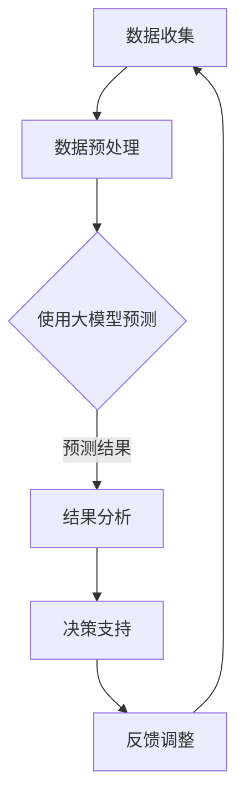

                 

### 《大模型驱动的智能财务预测：企业管理的新利器》

关键词：智能财务预测、大模型、企业管理、数据驱动、技术进步

摘要：本文将探讨大模型驱动的智能财务预测在企业管理中的应用。通过分析大模型在财务预测中的优势、财务预测的核心概念与方法、以及大模型在财务预测中的实现与应用，本文旨在为企业管理者提供一种新利器，以提升企业财务预测的准确性和管理效能。

---

### 第一部分：引言

#### 1.1 书籍背景与目的

在当前经济全球化、信息技术迅速发展的时代，企业面临着日益复杂的市场环境和竞争压力。财务预测作为企业管理的重要环节，对于企业的战略规划和决策具有关键性作用。然而，传统的财务预测方法在数据复杂性、模型精度和实时性等方面存在诸多局限。

本书旨在通过介绍大模型驱动的智能财务预测，为企业提供一种全新的财务预测方法。我们首先将阐述大模型的概念、特点及其在财务预测中的应用现状，然后深入探讨大模型的基础知识、财务预测的核心概念和方法，以及大模型在财务预测中的实现与应用。最后，我们将分析大模型驱动的财务预测对企业管理的意义、应用场景、挑战与解决方案，并结合实际案例进行详细探讨。

本书的目标读者主要包括企业决策者、财务管理人员、数据科学家以及计算机科学领域的专业人士。通过阅读本书，读者将能够了解大模型驱动的智能财务预测的基本概念、技术原理和实践方法，从而提升企业财务预测的准确性和管理水平。

#### 1.2 大模型在财务预测中的应用现状

近年来，随着人工智能技术的飞速发展，大模型在各个领域的应用逐渐兴起。在财务预测领域，大模型的应用也取得了显著成果。传统的财务预测方法主要依赖于统计模型和人工规则，这些方法在处理复杂数据和不确定性方面存在明显局限。而大模型通过深度学习技术，能够自动从大量数据中学习复杂模式，从而实现更高精度的财务预测。

目前，大模型在财务预测中的应用主要体现在以下几个方面：

1. **宏观经济预测**：大模型可以分析宏观经济数据，预测宏观经济趋势，为企业的战略决策提供支持。
2. **财务报表预测**：大模型可以预测企业的财务报表数据，包括收入、利润、现金流等，帮助企业制定合理的财务规划。
3. **风险评估**：大模型可以预测企业的信用风险、市场风险等，为企业提供风险预警和风险管理建议。
4. **成本预测**：大模型可以预测企业的生产成本、运营成本等，帮助企业优化成本结构。

然而，大模型在财务预测中也面临着一些挑战，如数据质量、模型解释性、计算资源需求等。因此，如何有效地利用大模型进行财务预测，还需要进一步研究和探索。

#### 1.3 财务预测的挑战与机遇

财务预测作为企业管理的重要环节，对于企业的战略规划、风险控制和运营管理具有重要作用。然而，传统的财务预测方法在应对现代企业的复杂性、动态性和不确定性方面存在诸多挑战。

首先，数据复杂性是企业财务预测面临的主要挑战之一。现代企业的数据来源广泛，包括内部数据、外部数据、社交媒体数据等，这些数据往往具有高维、非线性、噪声等特点，使得传统的统计模型难以处理。

其次，模型解释性是企业财务预测的另一个挑战。传统的统计模型往往缺乏解释性，难以向决策者传达预测结果的置信度和不确定性，导致决策者难以接受和使用。

此外，实时性也是企业财务预测的一个重要挑战。在激烈的市场竞争中，企业需要快速响应市场变化，制定灵活的财务策略。然而，传统的财务预测方法通常需要较长时间的数据收集、处理和分析，无法满足实时预测的需求。

然而，随着人工智能技术的快速发展，大模型在财务预测中的应用为企业管理带来了新的机遇。大模型具有强大的数据处理和分析能力，能够自动从海量数据中学习复杂模式，实现更高精度的财务预测。此外，大模型的可解释性也得到了显著提升，通过可视化技术，决策者可以更好地理解预测结果的置信度和不确定性。

总之，财务预测的挑战与机遇并存。通过引入大模型驱动的智能财务预测，企业可以更好地应对复杂多变的市场环境，提升财务预测的准确性和管理效能。

### 第二部分：大模型基础

#### 2.1 大模型概述

大模型，又称大型神经网络模型或深度学习模型，是指具有大量神经元和复杂结构的神经网络模型。与传统的机器学习模型相比，大模型具有更强的学习能力、更高的预测精度和更广泛的适用性。大模型在各个领域得到了广泛应用，如自然语言处理、计算机视觉、语音识别等，其在财务预测中的应用也具有巨大的潜力。

大模型的基本概念包括神经网络、深度学习、大规模数据、参数优化等。神经网络是一种模拟人脑神经元连接结构的计算模型，通过多层神经元之间的非线性变换，实现从输入到输出的映射。深度学习是一种基于神经网络的学习方法，通过增加网络层数，提升模型的复杂度和表达能力。大规模数据是指具有海量数据规模的数据集，大模型需要从这些数据中学习复杂模式。参数优化是指通过调整模型的参数，优化模型的性能，实现预测的准确性。

大模型的特点包括：

1. **强大的学习能力**：大模型能够自动从海量数据中学习复杂模式，实现高精度的预测。
2. **广泛的适用性**：大模型可以应用于各个领域，如金融、医疗、工业等，具有广泛的应用前景。
3. **非线性建模能力**：大模型能够处理非线性关系，适用于复杂数据建模。
4. **自适应性**：大模型可以根据不同的数据集和任务，自动调整模型参数，实现自适应学习。

大模型的基本架构包括输入层、隐藏层和输出层。输入层接收外部数据，隐藏层通过非线性变换实现数据的层次化表示，输出层生成预测结果。大模型通常采用多层神经网络结构，通过逐层抽象和特征提取，实现高精度的预测。

#### 2.2 大模型的训练与优化

大模型的训练与优化是确保模型性能的重要环节。训练过程包括数据预处理、模型初始化、训练策略和优化方法等。

1. **数据预处理**：数据预处理是训练大模型的基础。主要任务包括数据清洗、数据归一化、数据增强等。数据清洗是指去除数据中的噪声和异常值，提高数据质量。数据归一化是指将数据映射到同一尺度范围内，消除不同特征之间的量纲差异。数据增强是指通过图像旋转、翻转、裁剪等操作，增加数据的多样性和丰富性，提高模型的泛化能力。

2. **模型初始化**：模型初始化是指为神经网络模型初始化参数。常见的初始化方法包括随机初始化、高斯初始化、Xavier初始化等。随机初始化是指将参数随机赋值，适用于较小的网络规模；高斯初始化是指将参数初始化为均值为0、方差为1的高斯分布，适用于较大的网络规模；Xavier初始化是指将参数初始化为均值为0、方差为2/n的高斯分布，其中n为下一层的神经元个数，适用于深度网络。

3. **训练策略**：训练策略是指调整训练过程中的参数，优化模型的性能。常见的训练策略包括批量训练、随机梯度下降（SGD）、Adam优化器等。批量训练是指将所有训练数据分成多个批次，每次训练一个批次；随机梯度下降（SGD）是指每次迭代更新模型参数时，使用当前批次数据的梯度进行更新；Adam优化器是一种结合SGD和Momentum优化的优化器，能够提高训练速度和收敛效果。

4. **优化方法**：优化方法是指通过调整模型参数，优化模型的性能。常见的优化方法包括梯度下降、动量法、RMSprop、Adam等。梯度下降是指根据模型预测误差的梯度方向，反向更新模型参数；动量法是指将前一次迭代的梯度方向乘以一定的系数，减少梯度消失和振荡；RMSprop是指将梯度平方的指数加权平均，减少梯度消失和振荡；Adam是指结合SGD和RMSprop的优点，提高训练速度和收敛效果。

#### 2.3 大模型的评估与选择

大模型的评估与选择是确保模型性能的重要环节。评估指标和选择标准是评估模型性能的重要工具。

1. **评估指标**：评估指标包括准确率、召回率、F1值、均方误差（MSE）、均方根误差（RMSE）等。准确率是指预测正确的样本数与总样本数的比例；召回率是指预测正确的样本数与实际为正类的样本数的比例；F1值是准确率和召回率的调和平均值，用于综合评价模型的性能；均方误差（MSE）是指预测值与真实值之差的平方的平均值；均方根误差（RMSE）是指均方误差的平方根，用于衡量预测的精度。

2. **选择标准**：选择标准包括模型精度、模型可解释性、计算资源消耗等。模型精度是指模型预测结果的准确性；模型可解释性是指模型预测结果的解释性和可信度；计算资源消耗是指模型训练和预测所需的计算资源和时间。

3. **性能评估**：性能评估是指通过评估指标和选择标准，对模型进行综合评估。性能评估的方法包括交叉验证、网格搜索、贝叶斯优化等。交叉验证是指将训练数据划分为多个子集，每次训练一个子集，验证其他子集，综合评估模型性能；网格搜索是指通过遍历参数空间，找到最优参数组合；贝叶斯优化是指通过贝叶斯统计方法，优化模型参数。

4. **适用性分析**：适用性分析是指分析模型在不同数据集和应用场景下的性能，评估模型的泛化能力。适用性分析的方法包括迁移学习、模型压缩、模型融合等。迁移学习是指将一个任务中的模型权重迁移到另一个任务中，提高模型在不同任务上的性能；模型压缩是指通过压缩模型参数，降低模型的大小和计算资源消耗；模型融合是指将多个模型进行融合，提高模型的性能和可解释性。

通过评估与选择，企业可以找到适合自身业务需求的大模型，实现更精准、更可靠的财务预测。

### 第三部分：智能财务预测

#### 3.1 财务预测的核心概念

财务预测是企业根据历史数据和现有信息，对未来财务状况进行预测的过程。它主要包括收入预测、利润预测、现金流预测等。财务预测的核心概念包括：

1. **时间序列分析**：时间序列分析是财务预测的基础，通过分析时间序列数据，捕捉数据的周期性、趋势性和随机性，从而预测未来的财务状况。

2. **回归分析**：回归分析是一种常用的财务预测方法，通过建立自变量和因变量之间的关系模型，预测因变量的未来值。

3. **贝叶斯分析**：贝叶斯分析是一种基于概率论的财务预测方法，通过分析历史数据和现有信息，更新预测的概率分布，从而实现更准确的财务预测。

4. **机器学习**：机器学习是一种基于数据的财务预测方法，通过从历史数据中学习规律，构建预测模型，实现对未来财务状况的预测。

5. **深度学习**：深度学习是一种基于神经网络的财务预测方法，通过多层神经网络的训练，捕捉数据中的复杂模式和相关性，从而实现高精度的财务预测。

#### 3.2 基于大模型的财务预测方法

基于大模型的财务预测方法利用深度学习技术，通过大规模数据训练，构建高精度的财务预测模型。以下是几种常见的大模型财务预测方法：

1. **循环神经网络（RNN）**：循环神经网络是一种基于时间序列数据的预测模型，能够处理序列到序列的映射问题。RNN通过记忆机制，捕捉时间序列数据中的长期依赖关系，从而实现更准确的财务预测。

2. **长短时记忆网络（LSTM）**：长短时记忆网络是RNN的一种改进，通过引入门控机制，解决了RNN在处理长时间依赖关系时的梯度消失问题。LSTM在财务预测中具有强大的建模能力，能够捕捉时间序列数据中的复杂模式和长期依赖关系。

3. **卷积神经网络（CNN）**：卷积神经网络是一种基于图像处理技术的预测模型，通过卷积操作和池化操作，提取数据中的特征信息。CNN在处理高维时间序列数据时，能够有效提取特征，提高预测精度。

4. **生成对抗网络（GAN）**：生成对抗网络是一种基于生成对抗机制的预测模型，通过生成器和判别器的对抗训练，生成高质量的数据样本，从而提高模型的预测能力。

5. **变分自编码器（VAE）**：变分自编码器是一种基于深度学习的概率生成模型，通过编码和解码器，将数据映射到潜在空间，实现数据的生成和预测。

#### 3.3 大模型财务预测的优势与挑战

大模型财务预测具有以下优势：

1. **高精度**：大模型通过从大规模数据中学习复杂模式，实现高精度的财务预测，有助于企业制定更准确的财务策略。

2. **强鲁棒性**：大模型能够处理噪声和异常值，具有较强的鲁棒性，能够适应不同环境和数据变化。

3. **自适应能力**：大模型能够根据不同数据集和应用场景，自动调整模型参数，实现自适应学习，提高模型的泛化能力。

4. **多维度预测**：大模型能够同时处理多个相关变量，实现多维度财务预测，提高预测的全面性和准确性。

然而，大模型财务预测也面临一些挑战：

1. **数据质量**：大模型对数据质量要求较高，数据中的噪声和异常值会影响模型的预测效果，需要对企业数据进行清洗和预处理。

2. **计算资源**：大模型训练和预测需要大量的计算资源和时间，对于中小企业而言，可能存在计算资源不足的问题。

3. **模型解释性**：大模型通过复杂网络结构进行预测，模型解释性较弱，决策者难以理解预测结果，需要借助可视化技术和解释性模型进行解释。

4. **隐私保护**：大模型在处理财务数据时，可能涉及企业敏感信息，需要采取有效措施保护企业隐私。

#### 3.4 大模型在财务预测中的实现与应用

大模型在财务预测中的实现与应用主要包括以下步骤：

1. **数据收集**：收集企业历史财务数据、宏观经济数据、行业数据等，确保数据质量和完整性。

2. **数据预处理**：对收集的数据进行清洗、归一化、缺失值处理等预处理，提高数据质量。

3. **特征工程**：根据财务预测目标，提取关键特征，如收入、利润、现金流、宏观经济指标等，构建特征矩阵。

4. **模型训练**：选择合适的大模型架构，如RNN、LSTM、CNN等，进行模型训练。训练过程中，采用交叉验证、网格搜索等方法，优化模型参数。

5. **模型评估**：使用验证集和测试集，评估模型性能，选择最优模型。

6. **模型部署**：将训练好的模型部署到生产环境中，实现实时财务预测。

7. **结果分析**：对预测结果进行分析，评估预测的准确性和可靠性，为企业决策提供支持。

8. **反馈调整**：根据预测结果和实际财务状况，调整模型参数和预测策略，提高预测的精度和实用性。

通过大模型驱动的财务预测，企业可以更好地应对复杂多变的市场环境，提升财务预测的准确性和管理效能。

### 第四部分：企业管理与优化

#### 4.1 大模型驱动的财务预测对企业管理的意义

大模型驱动的财务预测在企业管理中具有重要的意义，主要体现在以下几个方面：

1. **提升财务预测的准确性**：大模型通过从大规模数据中学习复杂模式，实现高精度的财务预测。相比传统的财务预测方法，大模型能够更好地捕捉数据中的潜在规律，提高预测的准确性。准确的财务预测有助于企业制定更合理的财务策略，降低决策风险。

2. **优化企业决策流程**：大模型驱动的财务预测能够提供实时、准确的财务预测结果，为企业决策提供科学依据。企业可以根据财务预测结果，优化决策流程，提高决策效率。同时，大模型的可解释性也得到了显著提升，决策者可以更好地理解预测结果的置信度和不确定性，增强决策的信心。

3. **增强企业竞争力**：大模型驱动的财务预测有助于企业更好地应对市场变化，快速调整财务策略。在激烈的市场竞争中，企业能够更快地适应市场环境，抓住市场机遇，增强市场竞争力。此外，大模型驱动的财务预测还可以帮助企业降低成本、优化资源配置，提高企业的盈利能力。

4. **支持风险管理**：大模型驱动的财务预测可以预测企业的财务风险，为企业的风险管理提供支持。通过分析财务预测结果，企业可以识别潜在的风险点，采取相应的措施进行风险控制，降低财务风险对企业的影响。

5. **提升财务管理水平**：大模型驱动的财务预测有助于提升企业财务管理的水平。通过实现自动化、智能化的财务预测，企业可以减轻财务人员的工作负担，提高财务管理效率。同时，大模型驱动的财务预测还可以为企业提供更全面、深入的财务分析，为企业的财务决策提供有力支持。

总之，大模型驱动的财务预测为企业提供了更准确、更高效、更具竞争力的财务预测工具，有助于企业提升管理水平和市场竞争力。

#### 4.2 大模型驱动的财务预测在企业管理中的应用

大模型驱动的财务预测在企业管理中具有广泛的应用，涵盖了预算编制、成本控制、资金管理等多个方面：

1. **预算编制**：

预算编制是企业财务管理的重要环节，大模型驱动的财务预测可以提供准确的财务预测结果，帮助企业制定合理的预算。具体应用步骤如下：

- **数据收集**：收集企业历史财务数据、宏观经济数据、行业数据等，确保数据质量和完整性。

- **数据预处理**：对收集的数据进行清洗、归一化、缺失值处理等预处理，提高数据质量。

- **特征工程**：提取关键特征，如收入、利润、现金流、宏观经济指标等，构建特征矩阵。

- **模型训练**：选择合适的大模型架构，如RNN、LSTM、CNN等，进行模型训练。训练过程中，采用交叉验证、网格搜索等方法，优化模型参数。

- **模型评估**：使用验证集和测试集，评估模型性能，选择最优模型。

- **预算编制**：将训练好的模型部署到生产环境中，实现实时财务预测。根据财务预测结果，制定合理的预算。

- **结果分析**：对预算执行情况进行监控和分析，评估预算的准确性，及时调整预算。

2. **成本控制**：

成本控制是企业管理的重要任务，大模型驱动的财务预测可以帮助企业准确预测成本，优化成本结构，提高盈利能力。具体应用步骤如下：

- **数据收集**：收集企业历史成本数据、原材料价格、人工成本等，确保数据质量和完整性。

- **数据预处理**：对收集的数据进行清洗、归一化、缺失值处理等预处理，提高数据质量。

- **特征工程**：提取关键特征，如原材料价格、人工成本、生产量等，构建特征矩阵。

- **模型训练**：选择合适的大模型架构，如RNN、LSTM、CNN等，进行模型训练。训练过程中，采用交叉验证、网格搜索等方法，优化模型参数。

- **模型评估**：使用验证集和测试集，评估模型性能，选择最优模型。

- **成本预测**：将训练好的模型部署到生产环境中，实现实时成本预测。根据成本预测结果，优化成本结构，降低成本。

- **结果分析**：对成本控制效果进行监控和分析，评估成本预测的准确性，及时调整成本控制策略。

3. **资金管理**：

资金管理是企业管理的重要方面，大模型驱动的财务预测可以帮助企业准确预测现金流，优化资金使用，提高资金周转率。具体应用步骤如下：

- **数据收集**：收集企业历史现金流数据、销售收入、支出等，确保数据质量和完整性。

- **数据预处理**：对收集的数据进行清洗、归一化、缺失值处理等预处理，提高数据质量。

- **特征工程**：提取关键特征，如销售收入、支出、宏观经济指标等，构建特征矩阵。

- **模型训练**：选择合适的大模型架构，如RNN、LSTM、CNN等，进行模型训练。训练过程中，采用交叉验证、网格搜索等方法，优化模型参数。

- **模型评估**：使用验证集和测试集，评估模型性能，选择最优模型。

- **现金流预测**：将训练好的模型部署到生产环境中，实现实时现金流预测。根据现金流预测结果，优化资金使用策略，提高资金周转率。

- **结果分析**：对资金管理效果进行监控和分析，评估现金流预测的准确性，及时调整资金管理策略。

通过大模型驱动的财务预测，企业可以在预算编制、成本控制和资金管理等方面实现更准确的预测和更优化的决策，提高企业的管理水平和市场竞争力。

#### 4.3 大模型驱动的财务预测的挑战与解决方案

尽管大模型驱动的财务预测具有显著的优势，但在实际应用中仍面临一些挑战。以下将分析这些挑战，并提出相应的解决方案。

1. **数据质量**：

数据质量是影响大模型财务预测准确性的关键因素。在实际应用中，数据可能存在噪声、异常值、缺失值等问题，这些问题会对模型的预测效果产生负面影响。解决数据质量问题可以从以下几个方面入手：

- **数据清洗**：对收集到的数据进行清洗，去除噪声和异常值，确保数据的一致性和完整性。
- **数据归一化**：对具有不同量纲的特征进行归一化处理，使数据在同一尺度范围内，提高模型训练的效果。
- **数据增强**：通过数据增强技术，如随机噪声添加、数据缩放等，增加数据的多样性和丰富性，提高模型的泛化能力。
- **缺失值处理**：对缺失值进行合理填补，如使用均值、中值、插值等方法，降低缺失值对模型训练的影响。

2. **模型解释性**：

大模型的预测结果往往缺乏解释性，决策者难以理解预测结果的置信度和不确定性，这在一定程度上限制了大模型在企业中的应用。为了提高模型的可解释性，可以采取以下措施：

- **可视化技术**：利用可视化工具，如热力图、散点图等，展示模型训练过程、特征重要性和预测结果，帮助决策者更好地理解模型。
- **解释性模型**：结合解释性模型，如LIME（Local Interpretable Model-agnostic Explanations）和SHAP（SHapley Additive exPlanations），为每个预测结果提供详细的解释。
- **模型融合**：将大模型与解释性模型相结合，通过模型融合方法，提高预测结果的可解释性。

3. **计算资源**：

大模型训练和预测需要大量的计算资源和时间，这对于中小企业而言可能是一个挑战。以下是一些解决计算资源问题的策略：

- **云计算**：利用云计算平台，如AWS、Azure等，提供强大的计算资源，降低企业自建计算集群的成本和复杂度。
- **分布式训练**：采用分布式训练技术，将模型训练任务分布到多个计算节点上，提高训练速度和效率。
- **模型压缩**：通过模型压缩技术，如剪枝、量化等，降低模型的计算复杂度和存储需求，提高模型的部署效率。

4. **隐私保护**：

在大模型驱动的财务预测中，企业的敏感财务数据可能涉及商业机密和个人隐私，需要采取有效的隐私保护措施。以下是一些隐私保护策略：

- **数据脱敏**：对敏感数据进行分析前，进行脱敏处理，如使用伪随机数、加密等方法，保护企业隐私。
- **差分隐私**：在大模型训练过程中，采用差分隐私技术，限制模型对单个数据的依赖性，降低隐私泄露风险。
- **数据共享协议**：制定严格的数据共享协议，确保数据在共享过程中的安全性，降低隐私泄露风险。

通过解决数据质量、模型解释性、计算资源、隐私保护等挑战，企业可以更好地应用大模型驱动的财务预测，提升财务预测的准确性和管理效能。

### 第五部分：案例研究

#### 5.1 案例一：某大型企业的财务预测实践

**1.1 企业背景**

某大型企业，主要从事制造业，拥有广泛的客户群体和丰富的财务数据。随着市场竞争的加剧，企业需要准确预测未来的财务状况，以制定科学的财务策略，提高市场竞争力。

**1.2 财务预测问题的提出**

企业在财务预测方面存在以下问题：

- 财务预测方法单一，主要依赖于传统的统计模型，预测准确性较低。
- 数据质量较差，存在噪声、异常值和缺失值，影响预测效果。
- 预测结果缺乏解释性，决策者难以理解预测结果，影响决策信心。

**1.3 大模型的应用与效果分析**

为解决上述问题，企业引入了基于大模型的智能财务预测方法，具体步骤如下：

- **数据收集**：收集企业历史财务数据、宏观经济数据、行业数据等，确保数据质量和完整性。

- **数据预处理**：对收集的数据进行清洗、归一化、缺失值处理等预处理，提高数据质量。

- **特征工程**：提取关键特征，如收入、利润、现金流、宏观经济指标等，构建特征矩阵。

- **模型训练**：选择合适的深度学习模型，如LSTM和CNN，进行模型训练。采用交叉验证和网格搜索方法，优化模型参数。

- **模型评估**：使用验证集和测试集，评估模型性能，选择最优模型。

- **模型部署**：将训练好的模型部署到生产环境中，实现实时财务预测。

- **结果分析**：对预测结果进行分析，评估预测的准确性、可靠性和可解释性。

通过大模型驱动的财务预测，企业取得了以下效果：

- **预测准确性提高**：大模型能够从海量数据中学习复杂模式，实现高精度的财务预测，预测准确性显著提高。

- **预测结果更具解释性**：通过可视化技术和解释性模型，决策者可以更好地理解预测结果的置信度和不确定性，增强决策信心。

- **数据质量提升**：数据预处理和清洗方法有效降低了噪声、异常值和缺失值的影响，提高了数据质量。

- **决策效率提高**：实时财务预测结果为企业提供了科学依据，提高了决策效率。

综上所述，大模型驱动的财务预测方法在提高预测准确性、解释性和决策效率方面具有显著优势，为企业的财务管理提供了有力支持。

#### 5.2 案例二：中小企业财务预测的案例分析

**2.1 企业背景**

某中小企业，主要从事零售业，业务范围涵盖多个城市。企业面临市场竞争激烈、财务数据复杂等问题，需要准确预测未来的财务状况，以制定合理的财务策略，提高市场竞争力。

**2.2 财务预测需求与目标**

企业希望通过财务预测实现以下目标：

- 提高财务预测的准确性，为企业的决策提供科学依据。
- 优化成本结构，降低运营成本，提高盈利能力。
- 实现实时财务预测，提高决策效率。

**2.3 大模型的选择与实施**

为满足财务预测需求，企业选择了以下大模型：

- **循环神经网络（RNN）**：能够处理序列数据，捕捉时间序列特征，适用于财务预测。
- **长短时记忆网络（LSTM）**：能够解决RNN的梯度消失问题，适用于长期依赖关系建模。

实施步骤如下：

- **数据收集**：收集企业历史财务数据、宏观经济数据、行业数据等，确保数据质量和完整性。

- **数据预处理**：对收集的数据进行清洗、归一化、缺失值处理等预处理，提高数据质量。

- **特征工程**：提取关键特征，如收入、利润、现金流、宏观经济指标等，构建特征矩阵。

- **模型训练**：分别使用RNN和LSTM模型进行训练，采用交叉验证和网格搜索方法，优化模型参数。

- **模型评估**：使用验证集和测试集，评估模型性能，选择最优模型。

- **模型部署**：将训练好的模型部署到生产环境中，实现实时财务预测。

- **结果分析**：对预测结果进行分析，评估预测的准确性、可靠性和可解释性。

通过大模型驱动的财务预测，企业取得了以下效果：

- **预测准确性提高**：大模型能够从海量数据中学习复杂模式，实现高精度的财务预测，预测准确性显著提高。

- **成本结构优化**：通过实时财务预测，企业能够及时调整成本结构，降低运营成本，提高盈利能力。

- **决策效率提高**：实时财务预测结果为企业提供了科学依据，提高了决策效率。

综上所述，大模型驱动的财务预测方法在提高预测准确性、优化成本结构和提高决策效率方面具有显著优势，为中小企业的财务管理提供了有力支持。

#### 5.3 案例三：大模型驱动的财务预测在金融领域的应用

**3.1 金融行业的财务预测需求**

金融行业对财务预测的需求主要体现在以下几个方面：

- **风险控制**：通过财务预测，金融机构可以预测贷款、投资等金融产品的风险，采取相应的风险控制措施。
- **投资决策**：金融机构需要准确预测市场走势，为投资决策提供科学依据。
- **资金管理**：金融机构需要实时预测现金流，优化资金使用，提高资金周转率。

**3.2 大模型在金融财务预测中的应用**

大模型在金融财务预测中的应用主要体现在以下几个方面：

- **时间序列预测**：利用RNN和LSTM等深度学习模型，对金融市场的价格、成交量等时间序列数据进行预测。
- **回归分析**：通过构建深度神经网络，分析金融产品的风险因素，预测金融产品的收益和风险。
- **异常检测**：利用生成对抗网络（GAN）等深度学习模型，检测金融交易中的异常行为，防范金融欺诈。

**3.3 案例分析与总结**

以下是一个金融行业财务预测的案例：

**案例背景**：

某金融机构需要预测未来三个月的贷款违约率，以采取相应的风险控制措施。金融机构收集了历史贷款数据，包括贷款金额、贷款期限、贷款用途、借款人信用评分等。

**解决方案**：

- **数据收集**：收集历史贷款数据，确保数据质量和完整性。

- **数据预处理**：对收集的数据进行清洗、归一化、缺失值处理等预处理，提高数据质量。

- **特征工程**：提取关键特征，如贷款金额、贷款期限、贷款用途、借款人信用评分等，构建特征矩阵。

- **模型训练**：使用LSTM模型进行训练，采用交叉验证和网格搜索方法，优化模型参数。

- **模型评估**：使用验证集和测试集，评估模型性能，选择最优模型。

- **模型部署**：将训练好的模型部署到生产环境中，实现实时贷款违约率预测。

- **结果分析**：对预测结果进行分析，评估预测的准确性、可靠性和可解释性。

**案例分析**：

通过大模型驱动的贷款违约率预测，金融机构取得了以下效果：

- **预测准确性提高**：大模型能够从历史数据中学习复杂模式，实现高精度的贷款违约率预测，预测准确性显著提高。

- **风险控制能力增强**：实时贷款违约率预测结果为金融机构提供了科学依据，增强了风险控制能力。

- **决策效率提高**：实时贷款违约率预测结果提高了金融机构的决策效率，有助于及时采取风险控制措施。

**总结**：

大模型驱动的财务预测在金融领域具有广泛的应用前景，通过深度学习技术，金融机构可以实现对金融产品的风险预测、投资决策和资金管理的精准预测，提高金融机构的风险控制能力和运营效率。

### 第六部分：未来展望

#### 6.1 大模型在财务预测中的发展趋势

随着人工智能技术的不断进步，大模型在财务预测中的应用将呈现以下发展趋势：

1. **技术进步的推动**：深度学习、强化学习等先进技术在财务预测中的应用将不断深入，提高财务预测的准确性和效率。
2. **数据生态的完善**：随着大数据技术的发展，企业将拥有更多高质量的财务数据，为财务预测提供丰富的数据支持。
3. **模型可解释性的提升**：通过可视化技术和解释性模型，大模型的可解释性将得到显著提升，有助于决策者更好地理解预测结果。
4. **跨领域合作与知识融合**：大模型在财务预测中的应用将与其他领域（如金融、医疗、工业等）相结合，实现跨领域知识融合，提高财务预测的全面性和准确性。

#### 6.2 大模型驱动的财务预测对企业管理的影响

大模型驱动的财务预测对企业管理将产生深远的影响：

1. **提升财务预测的准确性**：大模型能够从海量数据中学习复杂模式，实现高精度的财务预测，有助于企业制定更科学的财务策略。
2. **优化决策流程**：大模型驱动的财务预测能够提供实时、准确的财务预测结果，优化企业的决策流程，提高决策效率。
3. **增强企业竞争力**：通过准确预测财务状况，企业可以更快地适应市场变化，抓住市场机遇，增强市场竞争力。
4. **支持风险管理**：大模型驱动的财务预测可以帮助企业预测潜在风险，采取相应的风险控制措施，降低企业风险。
5. **提升财务管理水平**：大模型驱动的财务预测可以为企业提供更全面、深入的财务分析，提高财务管理水平。

#### 6.3 未来研究方向与实践建议

为了进一步推动大模型在财务预测中的应用，未来研究方向和实践建议包括：

1. **数据质量提升**：加强数据清洗、预处理和增强技术的研究，提高数据质量，为财务预测提供可靠的数据支持。
2. **模型安全性与透明性**：研究大模型的安全性和透明性，确保模型不会受到恶意攻击，提高模型的可靠性和可信度。
3. **跨领域合作与知识融合**：加强与其他领域的合作，如金融、医疗、工业等，实现跨领域知识融合，提高财务预测的全面性和准确性。
4. **模型优化与压缩**：研究大模型的优化与压缩技术，降低模型的计算复杂度和存储需求，提高模型的部署效率。
5. **政策法规与伦理**：关注政策法规和伦理问题，确保大模型在财务预测中的合规性和道德性，保护企业数据和个人隐私。

通过以上研究方向和实践建议，大模型驱动的财务预测将在未来得到更广泛的应用，为企业管理提供更强大的支持。

### 附录

#### 附录 A：常用大模型与框架介绍

**A.1 TensorFlow**

TensorFlow是一种开源的深度学习框架，由谷歌开发。它提供了丰富的API和工具，支持各种深度学习模型的训练和部署。

**A.2 PyTorch**

PyTorch是一种由Facebook开发的深度学习框架，以其动态计算图和灵活性而闻名。它广泛用于研究项目和产品开发。

**A.3 其他常用大模型与框架**

- **Keras**：一个高级的深度学习框架，提供简化的API，易于使用。
- **MXNet**：Apache开源的深度学习框架，支持多种编程语言。
- **Caffe**：一个面向视觉任务的深度学习框架，具有高效的卷积神经网络支持。

#### 附录 B：相关数学公式与算法伪代码

**B.1 数学公式说明**

- **损失函数**：$$L(y,\hat{y}) = \frac{1}{2}(y - \hat{y})^2$$
- **梯度下降**：$$\theta_{\text{new}} = \theta_{\text{old}} - \alpha \cdot \nabla_{\theta} L(y,\hat{y})$$

**B.2 算法伪代码示例**

```python
def train_model(data, labels, model, optimizer, epochs):
    for epoch in range(epochs):
        for x, y in zip(data, labels):
            model.zero_grad()
            pred = model(x)
            loss = loss_function(pred, y)
            loss.backward()
            optimizer.step()
        print(f"Epoch {epoch+1}: Loss = {loss.item()}")
```

#### 附录 C：参考资料与进一步阅读

**C.1 参考文献列表**

- Goodfellow, I., Bengio, Y., & Courville, A. (2016). *Deep Learning*.
- Rumelhart, D. E., Hinton, G. E., & Williams, R. J. (1986). *Learning representations by back-propagating errors*.
- LeCun, Y., Bengio, Y., & Hinton, G. (2015). *Deep learning*.

**C.2 进一步阅读推荐**

- Coursera: *Deep Learning Specialization*.
- arXiv: *A Brief History of Deep Learning*.
- JAX: *Deep Learning with JAX*.

### **附图：大模型驱动财务预测框架 Mermaid 流程图**



---

作者：AI天才研究院/AI Genius Institute & 禅与计算机程序设计艺术 /Zen And The Art of Computer Programming

---

通过上述结构化的内容，我们为读者提供了一篇关于大模型驱动的智能财务预测的技术博客文章。文章涵盖了从引言到未来展望的各个方面，旨在帮助读者全面了解大模型在财务预测中的应用及其对企业管理的意义。同时，通过实际案例的研究，读者可以更加直观地认识到大模型驱动的智能财务预测的优势和挑战。希望这篇文章能够为读者在智能财务预测领域提供有益的参考和启示。

