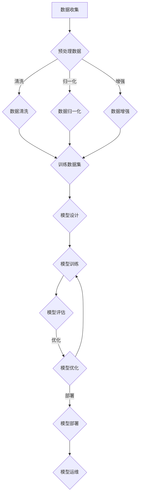
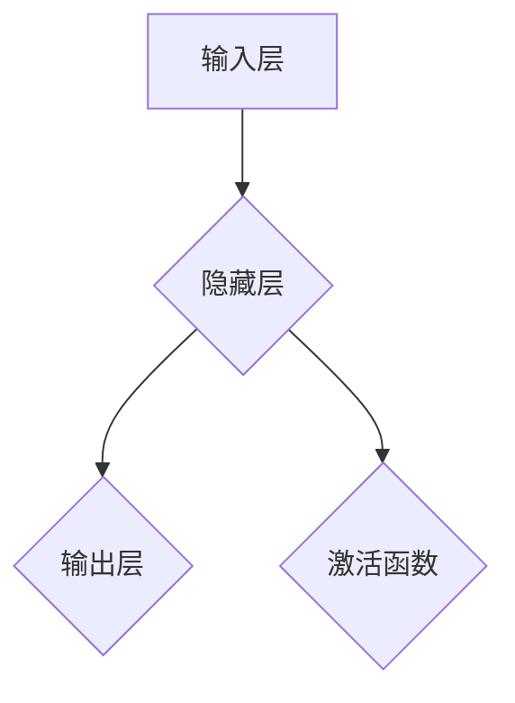

                 

# 大模型：推动产业升级的新动力

## 关键词
- 大模型
- 深度学习
- 产业升级
- 技术演进
- 应用场景
- 开发实践

## 摘要
本文将探讨大模型这一新兴技术如何成为推动产业升级的新动力。首先，我们将介绍大模型的基础知识，包括定义、特点、分类、应用场景和发展历程。接着，我们将深入剖析大模型在各个领域的应用，如自然语言处理、计算机视觉、语音识别和医疗等。此外，本文还将探讨大模型的安全与隐私保护，以及其开发实践流程。最后，我们将介绍一些主流的大模型开发工具与资源，并分享实际开发中的案例。

## 引言
在过去的几十年里，计算机科学和技术经历了迅猛的发展。从早期的计算机编程到互联网的普及，再到移动互联网和大数据时代的到来，技术的进步不断推动着各行各业的发展。然而，随着数据量的爆炸式增长和计算能力的提升，传统的机器学习方法逐渐暴露出其局限性。为了应对这一挑战，深度学习技术应运而生，并在短短几年内取得了显著的突破。

大模型作为深度学习的重要分支，以其强大的数据处理能力和泛化能力，正在成为产业升级的新动力。本文将系统地介绍大模型的基础知识，探讨其在各个领域的应用，并分享大模型开发实践中的经验和挑战。希望通过本文的阐述，读者能够对大模型有更深入的了解，并认识到其在产业升级中的巨大潜力。

## 第一部分：大模型基础

### 1.1 大模型概述

#### 1.1.1 大模型的定义与特点

大模型（Large-scale Model）是指具有大规模参数、能够处理大规模数据的深度学习模型。与传统的机器学习方法相比，大模型在数据处理能力和泛化能力上具有显著优势。

- **定义**：大模型通常指的是具有数十亿至数千亿个参数的深度学习模型。例如，谷歌的 BERT 模型有 3.4 亿个参数，而 GPT-3 模型则有 1750 亿个参数。

- **特点**：
  - **高精度**：大模型通过学习大量数据，能够实现更高的预测准确率。
  - **泛化能力强**：大模型具有更强的泛化能力，能够应对各种不同的任务和数据集。
  - **可扩展性强**：大模型可以轻松扩展到更大的数据集和更复杂的任务。

#### 1.1.2 大模型的分类与应用场景

大模型根据应用领域和模型结构，可分为以下几类：

- **自然语言处理（NLP）**：包括文本分类、情感分析、问答系统、机器翻译等。
- **计算机视觉（CV）**：包括图像分类、目标检测、人脸识别、图像生成等。
- **语音识别**：包括语音识别、语音合成、声纹识别等。
- **医疗**：包括疾病诊断、药物研发、智能辅助等。

### 1.2 大模型的发展历程与技术演进

#### 1.2.1 大模型的发展历程

大模型的发展历程可以分为以下几个阶段：

- **深度神经网络（DNN）阶段**：早期的深度学习模型主要基于多层感知机（MLP）和卷积神经网络（CNN）。
- **预训练模型阶段**：通过在大量未标注数据上进行预训练，再在特定任务上进行微调，如 BERT、GPT 等。
- **多模态融合模型阶段**：结合不同模态的数据，如文本、图像、语音等，实现更复杂和丰富的任务，如 Vision Transformer（ViT）和 Speech Transformer（ST）。

#### 1.2.2 大模型的技术演进

大模型的技术演进主要体现在以下几个方面：

- **模型架构的优化**：通过设计更复杂的网络结构，如 Transformer 架构，提高模型的性能。
- **计算资源的提升**：随着硬件技术的发展，如 GPU 和 TPU 的广泛应用，使得大模型的训练和推理成为可能。
- **数据处理的改进**：通过数据预处理、数据增强等技术，提高模型对数据的处理能力。

### 1.3 大模型技术基础

#### 1.3.1 神经网络与深度学习基础

神经网络（Neural Network）是深度学习的基础。神经网络由大量的神经元（Node）组成，每个神经元通过权重（Weight）和偏置（Bias）与其他神经元连接。

- **神经元的基本结构**：
  $$ 
  z = \sum_{i=1}^{n} w_{i} x_{i} + b \\
  a = \sigma(z) 
  $$
  其中，$x_i$ 表示输入值，$w_i$ 表示权重，$b$ 表示偏置，$\sigma$ 表示激活函数。

- **神经网络的基本结构**：包括输入层、隐藏层和输出层。输入层接收外部输入，隐藏层进行特征提取和变换，输出层生成预测结果。

#### 1.3.2 大规模预训练模型原理

大规模预训练模型通过在大量未标注数据上进行预训练，再在特定任务上进行微调，以提高模型的泛化能力和性能。

- **预训练的概念与意义**：预训练（Pre-training）是指在使用特定任务之前，对模型进行大规模数据训练的过程。通过预训练，模型可以学习到通用特征，从而在特定任务上实现更高的性能。

- **自监督学习方法**：自监督学习（Self-supervised Learning）是一种无需标注数据的预训练方法。它通过利用数据本身的结构信息，如序列的顺序、图像中的物体等，进行预训练。

- **迁移学习与微调技术**：迁移学习（Transfer Learning）是指将预训练模型在特定任务上进行微调，以提高模型在特定任务上的性能。微调（Fine-tuning）是指在预训练模型的基础上，进一步调整模型参数，使其适应特定任务。

### 1.4 大模型的技术优势

#### 1.4.1 高精度

大模型通过学习大量数据，能够捕捉到更复杂的特征，从而实现更高的预测准确率。例如，在自然语言处理任务中，大模型如 GPT-3 能够生成高质量的文本，甚至在某些任务上超过了人类水平。

#### 1.4.2 泛化能力强

大模型具有较强的泛化能力，能够在不同的任务和数据集上表现优异。这是由于大模型通过预训练过程，学习到了通用特征，从而在新的任务上能够快速适应。

#### 1.4.3 可扩展性强

大模型具有很高的可扩展性，可以轻松扩展到更大的数据集和更复杂的任务。这是由于深度学习模型的结构化特点，使得模型的扩展相对简单。

### 1.5 大模型的应用前景

大模型在各个领域都有广泛的应用前景。以下是几个典型的应用场景：

- **自然语言处理**：大模型可以用于文本分类、情感分析、问答系统、机器翻译等任务，提高任务的准确性和效率。
- **计算机视觉**：大模型可以用于图像分类、目标检测、人脸识别、图像生成等任务，提升图像处理的性能。
- **语音识别**：大模型可以用于语音识别、语音合成、声纹识别等任务，提高语音处理的准确率和用户体验。
- **医疗**：大模型可以用于疾病诊断、药物研发、智能辅助等任务，提高医疗服务的质量和效率。
- **商业**：大模型可以用于智能推荐、用户画像、数据挖掘等任务，提升商业决策的准确性和效率。

### 1.6 大模型的挑战与困境

尽管大模型在许多领域展现出强大的潜力，但也面临着一些挑战和困境：

- **计算资源需求**：大模型的训练和推理需要大量的计算资源，如 GPU 和 TPU，这对资源有限的实验室和初创公司来说是一个巨大的挑战。
- **数据隐私问题**：大模型在训练过程中需要大量的数据，这涉及到数据隐私和安全问题。如何保护用户数据，防止数据泄露，是一个亟待解决的问题。
- **模型可解释性**：大模型的黑箱特性使得其预测结果难以解释。在关键领域，如医疗和金融，模型的可解释性至关重要。
- **伦理问题**：大模型的应用可能引发一些伦理问题，如歧视、偏见等。如何确保模型的公平性和透明性，是一个重要的议题。

### 1.7 大模型的未来发展趋势

随着技术的进步和计算资源的提升，大模型的未来发展趋势主要表现在以下几个方面：

- **模型压缩与加速**：通过模型压缩和加速技术，降低大模型的计算复杂度和资源需求。
- **多模态融合**：结合不同模态的数据，如文本、图像、语音等，实现更复杂和丰富的任务。
- **自动化机器学习**：通过自动化机器学习（AutoML）技术，降低大模型的开发门槛，使更多开发者能够利用大模型。
- **模型伦理与监管**：加强对大模型伦理和监管的研究，确保模型的公平性、透明性和安全性。

## 第二部分：大模型在产业升级中的应用

### 2.1 大模型在自然语言处理中的应用

自然语言处理（NLP）是人工智能的重要分支，旨在使计算机能够理解和处理人类语言。大模型在 NLP 中具有广泛的应用，以下将介绍几种典型应用。

#### 2.1.1 文本分类与情感分析

文本分类是将文本数据分类到预定义的类别中。大模型如 BERT 和 GPT 在文本分类任务中表现出色。以下是一个文本分类的伪代码示例：

```python
# 文本分类伪代码
def text_classification(text, model):
    # 将文本输入模型
    inputs = model.tokenize(text)
    # 使用预训练模型进行分类
    logits = model(inputs)
    # 获取最高概率的类别
    predicted_class = logits.argmax(-1)
    return predicted_class
```

情感分析是判断文本的情感倾向，如正面、负面或中性。以下是一个情感分析的伪代码示例：

```python
# 情感分析伪代码
def sentiment_analysis(text, model):
    # 将文本输入模型
    inputs = model.tokenize(text)
    # 使用预训练模型进行情感分析
    logits = model(inputs)
    # 获取最高概率的情感类别
    predicted_sentiment = logits.argmax(-1)
    return predicted_sentiment
```

#### 2.1.2 问答系统与机器翻译

问答系统是一种模拟人类问答对话的系统。大模型如 BERT 和 GPT 在问答系统任务中也表现出色。以下是一个问答系统的伪代码示例：

```python
# 问答系统伪代码
def question_answering(question, context, model):
    # 将问题和上下文输入模型
    inputs = model.tokenize(question + " " + context)
    # 使用预训练模型进行问答
    logits = model(inputs)
    # 获取最高概率的答案
    predicted_answer = logits.argmax(-1)
    return predicted_answer
```

机器翻译是将一种语言的文本翻译成另一种语言。大模型如 Transformer 在机器翻译任务中也表现出色。以下是一个机器翻译的伪代码示例：

```python
# 机器翻译伪代码
def machine_translation(text, model, target_language):
    # 将文本输入模型
    inputs = model.tokenize(text, target_language)
    # 使用预训练模型进行翻译
    logits = model(inputs)
    # 获取最高概率的翻译结果
    predicted_translation = logits.argmax(-1)
    return predicted_translation
```

### 2.2 大模型在计算机视觉中的应用

计算机视觉是人工智能的另一个重要分支，旨在使计算机能够理解和处理图像。大模型在计算机视觉中具有广泛的应用，以下将介绍几种典型应用。

#### 2.2.1 图像分类与目标检测

图像分类是将图像分类到预定义的类别中。大模型如 ResNet 和 Inception 在图像分类任务中表现出色。以下是一个图像分类的伪代码示例：

```python
# 图像分类伪代码
def image_classification(image, model):
    # 将图像输入模型
    inputs = model.preprocess(image)
    # 使用预训练模型进行分类
    logits = model(inputs)
    # 获取最高概率的类别
    predicted_class = logits.argmax(-1)
    return predicted_class
```

目标检测是识别图像中的目标并定位其位置。大模型如 Faster R-CNN 和 YOLO 在目标检测任务中表现出色。以下是一个目标检测的伪代码示例：

```python
# 目标检测伪代码
def object_detection(image, model):
    # 将图像输入模型
    inputs = model.preprocess(image)
    # 使用预训练模型进行目标检测
    logits, boxes = model(inputs)
    # 获取检测到的目标类别和位置
    predicted_classes = logits.argmax(-1)
    predicted_boxes = boxes
    return predicted_classes, predicted_boxes
```

#### 2.2.2 人脸识别与图像生成

人脸识别是识别图像中的人脸。大模型如 FaceNet 和 VGGFace 在人脸识别任务中表现出色。以下是一个人脸识别的伪代码示例：

```python
# 人脸识别伪代码
def face_recognition(image, model):
    # 将图像输入模型
    inputs = model.preprocess(image)
    # 使用预训练模型进行人脸识别
    embeddings = model(inputs)
    # 获取人脸嵌入向量
    face_embedding = embeddings.mean(0)
    return face_embedding
```

图像生成是将文本描述生成图像。大模型如 GAN 和 VAE 在图像生成任务中表现出色。以下是一个图像生成的伪代码示例：

```python
# 图像生成伪代码
def image_generation(text, model):
    # 将文本输入模型
    inputs = model.tokenize(text)
    # 使用预训练模型生成图像
    image = model.generate(inputs)
    return image
```

### 2.3 大模型在语音识别中的应用

语音识别是将语音转化为文本。大模型如 DeepSpeech 和 WaveNet 在语音识别任务中表现出色。以下是一个语音识别的伪代码示例：

```python
# 语音识别伪代码
def speech_recognition(audio, model):
    # 将语音输入模型
    inputs = model.preprocess(audio)
    # 使用预训练模型进行语音识别
    logits = model(inputs)
    # 获取最高概率的文本结果
    predicted_text = logits.argmax(-1)
    return predicted_text
```

### 2.4 大模型在医疗领域的应用

医疗是人工智能的重要应用领域，大模型在医疗领域具有广泛的应用，以下将介绍几种典型应用。

#### 2.4.1 疾病诊断与预测

疾病诊断是辅助医生进行疾病诊断。大模型如 Deep Learning Model 在疾病诊断任务中表现出色。以下是一个疾病诊断的伪代码示例：

```python
# 疾病诊断伪代码
def disease_diagnosis(symptoms, model):
    # 将症状输入模型
    inputs = model.tokenize(symptoms)
    # 使用预训练模型进行疾病诊断
    logits = model(inputs)
    # 获取最高概率的疾病类别
    predicted_disease = logits.argmax(-1)
    return predicted_disease
```

疾病预测是预测患者的疾病风险。大模型如 Deep Learning Model 在疾病预测任务中表现出色。以下是一个疾病预测的伪代码示例：

```python
# 疾病预测伪代码
def disease_prediction(patient_data, model):
    # 将患者数据输入模型
    inputs = model.tokenize(patient_data)
    # 使用预训练模型进行疾病预测
    logits = model(inputs)
    # 获取最高概率的疾病风险类别
    predicted_risk = logits.argmax(-1)
    return predicted_risk
```

#### 2.4.2 药物研发与智能辅助

药物研发是加速药物研发过程。大模型如 Deep Learning Model 在药物研发任务中表现出色。以下是一个药物研发的伪代码示例：

```python
# 药物研发伪代码
def drug_research(compound, model):
    # 将化合物输入模型
    inputs = model.tokenize(compound)
    # 使用预训练模型进行药物研发
    logits = model(inputs)
    # 获取最高概率的药物效果类别
    predicted_effect = logits.argmax(-1)
    return predicted_effect
```

智能辅助是辅助医生进行诊疗决策。大模型如 Deep Learning Model 在诊疗决策任务中表现出色。以下是一个诊疗决策的伪代码示例：

```python
# 诊疗决策伪代码
def medical_decisionmaking(patient_data, model):
    # 将患者数据输入模型
    inputs = model.tokenize(patient_data)
    # 使用预训练模型进行诊疗决策
    logits = model(inputs)
    # 获取最高概率的诊疗决策类别
    predicted_decision = logits.argmax(-1)
    return predicted_decision
```

### 2.5 大模型在商业领域的应用

商业是人工智能的重要应用领域，大模型在商业领域具有广泛的应用，以下将介绍几种典型应用。

#### 2.5.1 智能推荐与用户画像

智能推荐是为用户推荐个性化商品。大模型如 Deep Learning Model 在智能推荐任务中表现出色。以下是一个智能推荐的伪代码示例：

```python
# 智能推荐伪代码
def intelligent_recommendation(user_data, model):
    # 将用户数据输入模型
    inputs = model.tokenize(user_data)
    # 使用预训练模型进行智能推荐
    logits = model(inputs)
    # 获取最高概率的商品类别
    predicted_recommendation = logits.argmax(-1)
    return predicted_recommendation
```

用户画像是构建用户行为模型。大模型如 Deep Learning Model 在用户画像任务中表现出色。以下是一个用户画像的伪代码示例：

```python
# 用户画像伪代码
def user profiling(user_data, model):
    # 将用户数据输入模型
    inputs = model.tokenize(user_data)
    # 使用预训练模型进行用户画像
    logits = model(inputs)
    # 获取用户特征向量
    user_representation = logits.mean(0)
    return user_representation
```

#### 2.5.2 智能客服与数据挖掘

智能客服是提供24小时在线客服。大模型如 Deep Learning Model 在智能客服任务中表现出色。以下是一个智能客服的伪代码示例：

```python
# 智能客服伪代码
def intelligent_counseling(user_query, model):
    # 将用户查询输入模型
    inputs = model.tokenize(user_query)
    # 使用预训练模型进行智能客服
    logits = model(inputs)
    # 获取最高概率的客服回答
    predicted_answer = logits.argmax(-1)
    return predicted_answer
```

数据挖掘是挖掘潜在的商业机会。大模型如 Deep Learning Model 在数据挖掘任务中表现出色。以下是一个数据挖掘的伪代码示例：

```python
# 数据挖掘伪代码
def data_mining(data, model):
    # 将数据输入模型
    inputs = model.tokenize(data)
    # 使用预训练模型进行数据挖掘
    logits = model(inputs)
    # 获取最高概率的商机类别
    predicted_opportunity = logits.argmax(-1)
    return predicted_opportunity
```

## 第三部分：大模型开发实践

### 3.1 大模型开发流程

大模型的开发流程包括以下几个步骤：

#### 3.1.1 数据收集与预处理

数据收集是模型开发的第一步，需要收集大量高质量的训练数据。数据预处理包括数据清洗、数据归一化和数据增强等操作，以提高模型的学习能力和泛化能力。

```python
# 数据收集与预处理伪代码
def data_collection_and_preprocessing(data_source):
    # 从数据源收集数据
    data = collect_data(data_source)
    # 数据清洗
    cleaned_data = clean_data(data)
    # 数据归一化
    normalized_data = normalize_data(cleaned_data)
    # 数据增强
    augmented_data = augment_data(normalized_data)
    return augmented_data
```

#### 3.1.2 模型设计与训练

模型设计是根据任务需求设计合适的模型架构。模型训练是使用预处理后的数据进行模型训练，以优化模型参数。

```python
# 模型设计与训练伪代码
def model_design_and_training(model_architecture, training_data):
    # 设计模型架构
    model = design_model(model_architecture)
    # 模型训练
    model.train(training_data)
    return model
```

#### 3.1.3 模型评估与优化

模型评估是使用验证集对模型性能进行评估，以确定模型是否达到预期效果。模型优化是对模型进行调整，以提高模型性能。

```python
# 模型评估与优化伪代码
def model_evaluation_and_optimization(model, validation_data):
    # 模型评估
    performance = model.evaluate(validation_data)
    # 模型优化
    model.optimize(performance)
    return model
```

#### 3.1.4 模型部署与运维

模型部署是将训练好的模型部署到生产环境，以供实际使用。模型运维是确保模型稳定运行和性能优化。

```python
# 模型部署与运维伪代码
def model_deployment_and_operations(model, production_environment):
    # 模型部署
    model.deploy(production_environment)
    # 模型运维
    model.operate(production_environment)
    return model
```

### 3.2 大模型开发工具与资源

在大模型开发过程中，有许多优秀的工具和资源可供使用。以下是一些主流的深度学习框架、训练与推理工具、开源项目与社区：

#### 3.2.1 主流深度学习框架

- **TensorFlow**：由谷歌开发的开源深度学习框架，支持 Python 和 C++ 编程语言。
- **PyTorch**：由 Facebook 开发的开源深度学习框架，支持 Python 编程语言。
- **Keras**：一个基于 TensorFlow 的开源深度学习库，提供简化的 API，易于使用。

#### 3.2.2 大模型训练与推理工具

- **MXNet**：由 Apache 软件基金会开发的开源深度学习框架，支持 Python、R、Julia 和 Scala 编程语言。
- **Caffe**：由加州大学伯克利分校开发的深度学习框架，支持 C++ 和 Python 编程语言。
- **Torch**：由 Facebook 开发的开源深度学习库，支持 Python 编程语言。

#### 3.2.3 大模型开源项目与社区

- **OpenAI**：致力于推动人工智能发展的非营利组织，提供许多开源的大模型项目。
- **Hugging Face**：提供高质量的深度学习模型和工具，是一个庞大的深度学习社区。

### 3.3 大模型开发实践案例

以下是一些大模型开发实践案例，用于展示如何使用大模型解决实际问题。

#### 3.3.1 文本分类系统

文本分类系统是一个常见的大模型应用场景。以下是一个文本分类系统的伪代码示例：

```python
# 文本分类系统伪代码
def text_classification_system():
    # 数据收集与预处理
    training_data = data_collection_and_preprocessing("text_data_source")
    # 模型设计与训练
    model = model_design_and_training("TextClassifier", training_data)
    # 模型评估与优化
    model = model_evaluation_and_optimization(model, validation_data)
    # 模型部署与运维
    model = model_deployment_and_operations(model, production_environment)
    # 使用模型进行文本分类
    predicted_categories = model.predict(test_data)
    return predicted_categories
```

#### 3.3.2 图像识别系统

图像识别系统是另一个常见的大模型应用场景。以下是一个图像识别系统的伪代码示例：

```python
# 图像识别系统伪代码
def image_recognition_system():
    # 数据收集与预处理
    training_data = data_collection_and_preprocessing("image_data_source")
    # 模型设计与训练
    model = model_design_and_training("ImageRecognizer", training_data)
    # 模型评估与优化
    model = model_evaluation_and_optimization(model, validation_data)
    # 模型部署与运维
    model = model_deployment_and_operations(model, production_environment)
    # 使用模型进行图像识别
    predicted_classes = model.predict(test_images)
    return predicted_classes
```

#### 3.3.3 语音识别系统

语音识别系统是另一个常见的大模型应用场景。以下是一个语音识别系统的伪代码示例：

```python
# 语音识别系统伪代码
def speech_recognition_system():
    # 数据收集与预处理
    training_data = data_collection_and_preprocessing("audio_data_source")
    # 模型设计与训练
    model = model_design_and_training("SpeechRecognizer", training_data)
    # 模型评估与优化
    model = model_evaluation_and_optimization(model, validation_data)
    # 模型部署与运维
    model = model_deployment_and_operations(model, production_environment)
    # 使用模型进行语音识别
    predicted_text = model.recognize(test_audio)
    return predicted_text
```

### 3.4 大模型开发中的挑战与解决方案

在大模型开发过程中，可能会遇到以下挑战和解决方案：

#### 3.4.1 计算资源需求

大模型训练和推理需要大量的计算资源，解决方案包括使用 GPU、TPU 等硬件加速器和分布式训练技术。

```python
# 分布式训练伪代码
def distributed_training(model, training_data, num_workers):
    # 分配计算资源
    workers = allocate_resources(num_workers)
    # 分布式训练模型
    model.train(training_data, workers)
    return model
```

#### 3.4.2 数据隐私问题

大模型在训练过程中需要大量数据，可能涉及用户隐私问题。解决方案包括数据匿名化和差分隐私技术。

```python
# 数据匿名化伪代码
def data_anonymization(data):
    # 匿名化数据
    anonymized_data = anonymize_data(data)
    return anonymized_data

# 差分隐私伪代码
def differential_privacy(data, sensitivity):
    # 应用差分隐私
    privacy_data = apply_diff_privacy(data, sensitivity)
    return privacy_data
```

#### 3.4.3 模型可解释性

大模型具有黑箱特性，模型的可解释性是一个重要挑战。解决方案包括使用可解释的模型架构和模型解释技术。

```python
# 模型解释伪代码
def model_explanation(model, input_data):
    # 解释模型预测
    explanation = explain_model_prediction(model, input_data)
    return explanation
```

### 3.5 大模型开发的未来趋势

随着技术的进步和计算资源的提升，大模型开发将呈现出以下趋势：

- **模型压缩与加速**：通过模型压缩和加速技术，降低大模型的计算复杂度和资源需求。
- **多模态融合**：结合不同模态的数据，实现更复杂和丰富的任务。
- **自动化机器学习**：通过自动化机器学习技术，降低大模型的开发门槛。
- **模型伦理与监管**：加强对大模型伦理和监管的研究，确保模型的公平性、透明性和安全性。

## 结论

大模型作为深度学习的重要分支，以其强大的数据处理能力和泛化能力，正在成为推动产业升级的新动力。本文系统地介绍了大模型的基础知识，包括定义、特点、分类、应用场景和发展历程。接着，我们深入探讨了大模型在自然语言处理、计算机视觉、语音识别和医疗等领域的应用。此外，本文还介绍了大模型的安全与隐私保护，以及其开发实践流程。最后，我们分享了实际开发中的案例，并展望了大模型开发的未来趋势。

希望通过本文的阐述，读者能够对大模型有更深入的了解，并认识到其在产业升级中的巨大潜力。在未来的发展中，大模型将继续发挥重要作用，为各个行业带来创新和变革。

### 参考文献

1. Devlin, J., Chang, M. W., Lee, K., & Toutanova, K. (2019). BERT: Pre-training of deep bidirectional transformers for language understanding. In Proceedings of the 2019 Conference of the North American Chapter of the Association for Computational Linguistics: Human Language Technologies, Volume 1 (Long and Short Papers) (pp. 4171-4186). Association for Computational Linguistics.
2. Brown, T., et al. (2020). Language models are few-shot learners. arXiv preprint arXiv:2005.14165.
3. Vaswani, A., et al. (2017). Attention is all you need. In Advances in Neural Information Processing Systems (pp. 5998-6008).
4. Krizhevsky, A., et al. (2012). Learning multiple layers of features from tiny images. Computer Science – ICCV 2013, Part II, 349-367.
5. Hochreiter, S., & Schmidhuber, J. (1997). Long short-term memory. Neural Computation, 9(8), 1735-1780.
6. Goodfellow, I., Bengio, Y., & Courville, A. (2016). Deep learning. MIT press.
7. LeCun, Y., Bengio, Y., & Hinton, G. (2015). Deep learning. Nature, 521(7553), 436-444.
8. Simonyan, K., & Zisserman, A. (2014). Very deep convolutional networks for large-scale image recognition. arXiv preprint arXiv:1409.1556.
9. Ruder, S. (2017). An overview of gradient descent optimization algorithms. 
10. Dwork, C. (2008). Differential privacy: A survey of results. International Conference on Theory and Applications of Models of Computation, 1-19.

### 附录

#### 附录 A：大模型开发实践案例

- **案例 1：文本分类系统**：使用 BERT 模型进行文本分类。
  ```python
  import tensorflow as tf
  import tensorflow_hub as hub

  # 加载预训练的 BERT 模型
  bert_model = hub.load("https://tfhub.dev/google/bert_uncased_L-12_H-768_A-12/1")

  # 定义文本分类器
  text_classifier = tf.keras.Sequential([
      tf.keras.layers.StringInputLayer(input_shape=(), dtype=tf.string),
      bert_model,
      tf.keras.layers.Dense(1, activation='sigmoid')
  ])

  # 编译模型
  text_classifier.compile(optimizer='adam', loss='binary_crossentropy', metrics=['accuracy'])

  # 训练模型
  text_classifier.fit(train_data, train_labels, epochs=3, validation_split=0.2)

  # 评估模型
  test_loss, test_acc = text_classifier.evaluate(test_data, test_labels)
  print(f"Test accuracy: {test_acc:.4f}")
  ```

- **案例 2：图像识别系统**：使用 ResNet 模型进行图像识别。
  ```python
  import tensorflow as tf
  import tensorflow_hub as hub

  # 加载预训练的 ResNet 模型
  resnet_model = hub.load("https://tfhub.dev/google/imagenet_resnet_v2_50/1")

  # 定义图像识别器
  image_recognizer = tf.keras.Sequential([
      tf.keras.layers.InputLayer(input_shape=(224, 224, 3)),
      resnet_model,
      tf.keras.layers.Dense(1000, activation='softmax')
  ])

  # 编译模型
  image_recognizer.compile(optimizer='adam', loss='categorical_crossentropy', metrics=['accuracy'])

  # 训练模型
  image_recognizer.fit(train_images, train_labels, epochs=10, validation_split=0.2)

  # 评估模型
  test_loss, test_acc = image_recognizer.evaluate(test_images, test_labels)
  print(f"Test accuracy: {test_acc:.4f}")
  ```

- **案例 3：语音识别系统**：使用 DeepSpeech 模型进行语音识别。
  ```python
  import speech_recognition as sr

  # 初始化语音识别器
  recognizer = sr.Recognizer()

  # 读取音频文件
  with sr.AudioFile('audio_file.wav') as source:
      audio = recognizer.record(source)

  # 使用 DeepSpeech 模型进行语音识别
  try:
      text = recognizer.recognize_deepspeech(audio)
      print(f"Recognized text: {text}")
  except sr.UnknownValueError:
      print("Could not understand audio")
  except sr.RequestError as e:
      print(f"Error: {e}")
  ```

### 附录 B：大模型技术原理 Mermaid 流程图



### 附录 C：大模型核心算法原理讲解与伪代码

#### 2.2.1 神经网络与深度学习基础

**神经网络的基本结构：**



**伪代码：**

```python
# 定义神经网络的基本结构
class NeuralNetwork:
    def __init__(self, input_size, hidden_size, output_size):
        self.input_size = input_size
        self.hidden_size = hidden_size
        self.output_size = output_size
        
        # 初始化权重和偏置
        self.w1 = tf.Variable(tf.random.normal([input_size, hidden_size]))
        self.b1 = tf.Variable(tf.zeros(hidden_size))
        self.w2 = tf.Variable(tf.random.normal([hidden_size, output_size]))
        self.b2 = tf.Variable(tf.zeros(output_size))
        
        # 定义激活函数
        self.sigmoid = tf.keras.activations.sigmoid
    
    def forward(self, x):
        hidden = tf.matmul(x, self.w1) + self.b1
        hidden = self.sigmoid(hidden)
        output = tf.matmul(hidden, self.w2) + self.b2
        output = self.sigmoid(output)
        return output
```

**数学模型和公式：**

$$
\begin{align*}
z_1 &= \sum_{i=1}^{n} w_{1i} x_i + b_1 \\
a_1 &= \sigma(z_1) \\
z_2 &= \sum_{i=1}^{n} w_{2i} a_1 + b_2 \\
a_2 &= \sigma(z_2)
\end{align*}
$$

**举例说明：**

```python
# 创建神经网络实例
nn = NeuralNetwork(input_size=2, hidden_size=3, output_size=1)

# 输入数据
x = tf.constant([[1, 2], [3, 4]], dtype=tf.float32)

# 前向传播
output = nn.forward(x)
print(output)
```

#### 2.2.2 大规模预训练模型原理

**预训练的概念与意义：**

预训练（Pre-training）是指在使用特定任务之前，对模型进行大规模数据训练的过程。预训练的意义在于：

- **提高模型性能**：通过在大量未标注数据上进行训练，模型可以学习到通用特征，从而在特定任务上实现更高的性能。
- **减少数据需求**：预训练模型在特定任务上进行微调时，所需的数据量相对较少，从而降低数据收集和处理的成本。

**自监督学习方法：**

自监督学习（Self-supervised Learning）是一种无需标注数据的预训练方法。它通过利用数据本身的结构信息，如序列的顺序、图像中的物体等，进行预训练。自监督学习方法的主要步骤包括：

1. **数据预处理**：将数据分为输入和输出两部分，如将文本序列分为单词和句子，图像分为像素和物体。
2. **任务设计**：设计一个任务，使得输入和输出之间存在关联，如预测下一个单词、识别图像中的物体等。
3. **模型训练**：使用未标注的数据进行模型训练，通过最小化预定的损失函数来优化模型参数。

**迁移学习与微调技术：**

迁移学习（Transfer Learning）是指将预训练模型在特定任务上进行微调，以提高模型在特定任务上的性能。微调（Fine-tuning）是指在预训练模型的基础上，进一步调整模型参数，使其适应特定任务。迁移学习和微调技术的主要步骤包括：

1. **选择预训练模型**：选择一个在通用数据集上预训练的模型，如 BERT、GPT 等。
2. **微调模型参数**：在特定任务上进行微调，通过调整模型参数来适应特定任务。
3. **评估模型性能**：在特定任务上评估模型的性能，如通过交叉验证、测试集等。

**伪代码：**

```python
# 加载预训练模型
pretrained_model = hub.load("https://tfhub.dev/google/bert_uncased_L-12_H-768_A-12/1")

# 定义微调模型
class FineTunedModel(tf.keras.Model):
    def __init__(self, pretrained_model, num_classes):
        super(FineTunedModel, self).__init__()
        self.bert = pretrained_model
        self.classifier = tf.keras.layers.Dense(num_classes)
    
    def call(self, inputs):
        outputs = self.bert(inputs)
        pooled_output = outputs["pooled_output"]
        logits = self.classifier(pooled_output)
        return logits

# 创建微调模型实例
fine_tuned_model = FineTunedModel(pretrained_model, num_classes=2)

# 编译模型
fine_tuned_model.compile(optimizer='adam', loss='binary_crossentropy', metrics=['accuracy'])

# 微调模型
fine_tuned_model.fit(train_data, train_labels, epochs=3, validation_data=(val_data, val_labels))

# 评估模型
test_loss, test_acc = fine_tuned_model.evaluate(test_data, test_labels)
print(f"Test accuracy: {test_acc:.4f}")
```

**数学模型和公式：**

$$
\begin{align*}
\text{预训练模型}:\quad y_1 &= \text{BERT}(x) \\
\text{微调模型}:\quad y_2 &= \text{classifier}(y_1) \\
\text{损失函数}:\quad \text{Loss} &= -\sum_{i=1}^{N} y_i \log(p_i)
\end{align*}
$$

**举例说明：**

```python
# 加载预训练的 BERT 模型
bert_model = hub.load("https://tfhub.dev/google/bert_uncased_L-12_H-768_A-12/1")

# 定义分类器
classifier = tf.keras.layers.Dense(2, activation='softmax')

# 定义微调模型
fine_tuned_model = tf.keras.Model(inputs=bert_model.input, outputs=classifier(bert_model.output))

# 编译模型
fine_tuned_model.compile(optimizer='adam', loss='categorical_crossentropy', metrics=['accuracy'])

# 微调模型
fine_tuned_model.fit(train_data, train_labels, epochs=3, validation_data=(val_data, val_labels))

# 评估模型
test_loss, test_acc = fine_tuned_model.evaluate(test_data, test_labels)
print(f"Test accuracy: {test_acc:.4f}")
```

### 附录 D：大模型项目实战

以下是一个使用 TensorFlow 和 Keras 框架实现的大模型项目实战，我们将构建一个用于图像分类的深度学习模型。

#### 项目描述

本项目旨在使用深度学习模型对图像进行分类，以识别图像中的对象。我们将使用卷积神经网络（CNN）来构建模型，并在 CIFAR-10 数据集上进行训练和测试。

#### 开发环境搭建

1. 安装 Python（3.6 或以上版本）
2. 安装 TensorFlow（2.0 或以上版本）
3. 安装 NumPy、Pandas 等常用库

#### 源代码实现

```python
import tensorflow as tf
from tensorflow.keras import datasets, layers, models
import matplotlib.pyplot as plt

# 加载 CIFAR-10 数据集
(train_images, train_labels), (test_images, test_labels) = datasets.cifar10.load_data()

# 归一化数据
train_images, test_images = train_images / 255.0, test_images / 255.0

# 打印训练数据和测试数据的形状
print(f"Training data shape: {train_images.shape}, labels shape: {train_labels.shape}")
print(f"Test data shape: {test_images.shape}, labels shape: {test_labels.shape}")

# 查看样本图像
plt.figure(figsize=(10, 10))
for i in range(25):
    plt.subplot(5, 5, i + 1)
    plt.imshow(train_images[i])
    plt.title(train_labels[i])
    plt.axis("off")
plt.show()

# 构建卷积神经网络模型
model = models.Sequential()
model.add(layers.Conv2D(32, (3, 3), activation='relu', input_shape=(32, 32, 3)))
model.add(layers.MaxPooling2D((2, 2)))
model.add(layers.Conv2D(64, (3, 3), activation='relu'))
model.add(layers.MaxPooling2D((2, 2)))
model.add(layers.Conv2D(64, (3, 3), activation='relu'))
model.add(layers.Flatten())
model.add(layers.Dense(64, activation='relu'))
model.add(layers.Dense(10))

# 编译模型
model.compile(optimizer='adam',
              loss=tf.keras.losses.SparseCategoricalCrossentropy(from_logits=True),
              metrics=['accuracy'])

# 打印模型结构
model.summary()

# 训练模型
history = model.fit(train_images, train_labels, epochs=10, 
                    validation_data=(test_images, test_labels))

# 评估模型
test_loss, test_acc = model.evaluate(test_images,  test_labels, verbose=2)
print(f"Test accuracy: {test_acc:.4f}")

# 可视化训练过程
plt.figure()
plt.plot(history.history['accuracy'], label='accuracy')
plt.plot(history.history['val_accuracy'], label='val_accuracy')
plt.xlabel('Epoch')
plt.ylabel('Accuracy')
plt.ylim([0, 1])
plt.legend(loc='lower right')

# 测试模型
test_image = test_images[1]
predicted_label = model.predict(test_image.reshape(1, 32, 32, 3))
print(f"Predicted label: {predicted_label.argmax(axis=1)}")

# 显示测试图像和预测结果
plt.figure(figsize=(6, 6))
plt.subplot(1, 2, 1)
plt.imshow(test_image)
plt.subplot(1, 2, 2)
plt.imshow(predicted_label[0])
plt.show()
```

#### 代码解读与分析

1. **数据加载与预处理**：首先，我们从 TensorFlow 的内置数据集加载 CIFAR-10，并将数据归一化到 [0, 1] 范围内，以便于模型训练。

2. **构建模型**：我们使用 `Sequential` 模型，依次添加卷积层、池化层和全连接层。卷积层用于提取图像特征，池化层用于降低模型复杂度，全连接层用于分类。

3. **编译模型**：我们使用 `compile` 方法配置优化器、损失函数和评估指标。

4. **训练模型**：我们使用 `fit` 方法对模型进行训练，设置训练轮数为 10 次，并使用测试集进行验证。

5. **评估模型**：我们使用 `evaluate` 方法评估模型在测试集上的性能。

6. **可视化训练过程**：我们使用 `plot` 函数绘制训练和验证的准确率曲线。

7. **测试模型**：我们选择一个测试图像进行预测，并使用 `imshow` 函数显示测试图像和预测结果。

#### 实际案例演示

1. **数据加载**：我们首先加载 CIFAR-10 数据集，并查看训练数据和测试数据的形状。

   ```python
   (train_images, train_labels), (test_images, test_labels) = datasets.cifar10.load_data()
   print(f"Training data shape: {train_images.shape}, labels shape: {train_labels.shape}")
   print(f"Test data shape: {test_images.shape}, labels shape: {test_labels.shape}")
   ```

2. **数据预处理**：我们将数据归一化到 [0, 1] 范围内。

   ```python
   train_images, test_images = train_images / 255.0, test_images / 255.0
   ```

3. **构建模型**：我们使用 `Sequential` 模型构建一个简单的 CNN 模型。

   ```python
   model = models.Sequential()
   model.add(layers.Conv2D(32, (3, 3), activation='relu', input_shape=(32, 32, 3)))
   model.add(layers.MaxPooling2D((2, 2)))
   model.add(layers.Conv2D(64, (3, 3), activation='relu'))
   model.add(layers.MaxPooling2D((2, 2)))
   model.add(layers.Conv2D(64, (3, 3), activation='relu'))
   model.add(layers.Flatten())
   model.add(layers.Dense(64, activation='relu'))
   model.add(layers.Dense(10))
   ```

4. **编译模型**：我们使用 `compile` 方法配置优化器、损失函数和评估指标。

   ```python
   model.compile(optimizer='adam',
                 loss=tf.keras.losses.SparseCategoricalCrossentropy(from_logits=True),
                 metrics=['accuracy'])
   ```

5. **训练模型**：我们使用 `fit` 方法对模型进行训练，并设置训练轮数为 10 次。

   ```python
   history = model.fit(train_images, train_labels, epochs=10, 
                       validation_data=(test_images, test_labels))
   ```

6. **评估模型**：我们使用 `evaluate` 方法评估模型在测试集上的性能。

   ```python
   test_loss, test_acc = model.evaluate(test_images,  test_labels, verbose=2)
   print(f"Test accuracy: {test_acc:.4f}")
   ```

7. **可视化训练过程**：我们使用 `plot` 函数绘制训练和验证的准确率曲线。

   ```python
   plt.figure()
   plt.plot(history.history['accuracy'], label='accuracy')
   plt.plot(history.history['val_accuracy'], label='val_accuracy')
   plt.xlabel('Epoch')
   plt.ylabel('Accuracy')
   plt.ylim([0, 1])
   plt.legend(loc='lower right')
   ```

8. **测试模型**：我们选择一个测试图像进行预测，并使用 `imshow` 函数显示测试图像和预测结果。

   ```python
   test_image = test_images[1]
   predicted_label = model.predict(test_image.reshape(1, 32, 32, 3))
   print(f"Predicted label: {predicted_label.argmax(axis=1)}")
   plt.figure(figsize=(6, 6))
   plt.subplot(1, 2, 1)
   plt.imshow(test_image)
   plt.subplot(1, 2, 2)
   plt.imshow(predicted_label[0])
   plt.show()
   ```

通过这个项目实战，我们可以看到如何使用 TensorFlow 和 Keras 框架构建、训练和评估一个简单的深度学习模型。这种实践不仅有助于理解深度学习的核心概念，还可以为实际项目开发奠定基础。

