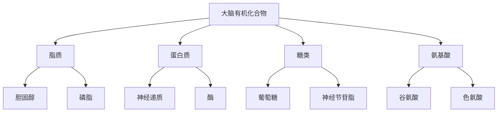
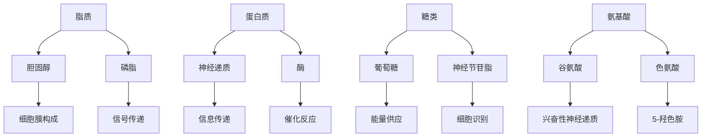
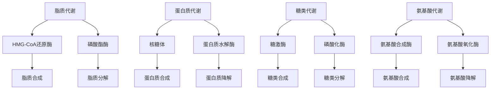
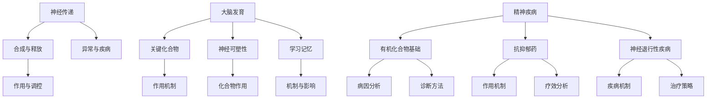
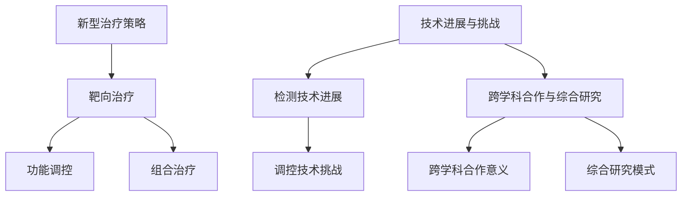

                 

### 文章标题

#### 大脑的有机化合物与功能

---

**关键词**：大脑，有机化合物，神经传递，功能，代谢途径，精神疾病，未来研究方向

**摘要**：本文旨在深入探讨大脑中的有机化合物及其功能。通过分章节的结构，系统介绍大脑有机化合物的概念、分类、生物学意义、检测方法、与疾病的关系、主要化合物、代谢途径、神经传递、大脑发育、精神疾病以及未来研究方向。本文采用逻辑清晰、结构紧凑、简单易懂的写法，使读者能够全面理解大脑有机化合物的复杂性和重要性。

---

### 第一部分：大脑的有机化合物概述

大脑作为人体最复杂的器官，其功能依赖于多种有机化合物的精细调控。这一部分将为我们提供大脑有机化合物的总体概述，包括其概念、分类、生物学意义以及检测方法和与疾病的关系。

---

#### 第1章：大脑有机化合物的概念与分类

**1.1 大脑有机化合物的定义**

大脑有机化合物是指那些在大脑内发挥着重要生物学功能的有机分子。这些化合物可以是简单的，如葡萄糖；也可以是复杂的，如蛋白质和脂质。它们在神经系统的发育、功能和修复中扮演关键角色。

- **概念解释**：大脑有机化合物在大脑中的角色和功能
  - **主要作用**：构建细胞结构、参与信号传递、提供能量等。
  - **生物功能**：调节神经活动、维持细胞生存、参与大脑发育等。

- **分类概述**：不同类型的有机化合物及其在大脑中的分布
  - **脂质**：包括胆固醇、磷脂等，主要存在于细胞膜中，负责细胞结构的构建和信号传递。
  - **蛋白质**：包括神经递质、酶等，主要作用是信息传递、催化反应和结构支持。
  - **糖类**：包括葡萄糖、神经节苷脂等，主要作为能量供应和细胞识别的分子。
  - **氨基酸**：包括谷氨酸、色氨酸等，是蛋白质的构成单元，也参与神经传递。

**1.2 大脑有机化合物的生物学意义**

大脑有机化合物在生物学上具有多方面的意义。

- **作用机制**：有机化合物如何影响大脑的功能
  - **信号传递**：脂质和蛋白质作为细胞膜的组成部分，参与信号传递过程。
  - **能量供应**：糖类为大脑提供能量，维持正常生理功能。
  - **结构支持**：氨基酸和蛋白质参与细胞结构的构建和维护。

- **生物学意义**：在神经系统中的重要性
  - **神经系统发育**：有机化合物在神经元的生长、分化、迁移和突触形成中起关键作用。
  - **功能维持**：有机化合物的稳定供应对于神经系统的正常功能至关重要。
  - **疾病防治**：某些有机化合物的失衡与神经系统疾病密切相关，如抑郁症、阿尔茨海默病等。

**1.3 大脑有机化合物的检测方法**

检测大脑有机化合物的方法多种多样，这些方法在研究、诊断和治疗中发挥着重要作用。

- **检测技术**：如光谱分析、色谱分析等
  - **光谱分析**：包括核磁共振（NMR）、质谱（MS）等，用于确定化合物的结构和纯度。
  - **色谱分析**：如高效液相色谱（HPLC）、气相色谱（GC）等，用于分离和定量分析化合物。

- **应用领域**：研究、诊断和治疗
  - **研究**：通过检测大脑有机化合物，揭示其功能机制和生物作用。
  - **诊断**：利用有机化合物的异常变化，进行疾病的早期诊断和病情监测。
  - **治疗**：开发基于有机化合物的治疗方法，如补充缺失的化合物或调节异常的化合物。

**1.4 大脑有机化合物与疾病的关系**

大脑有机化合物的异常与多种神经系统疾病密切相关。

- **疾病关联**：不同化合物与特定疾病的联系
  - **抑郁症**：某些神经递质如多巴胺、5-羟色胺的代谢异常与抑郁症密切相关。
  - **阿尔茨海默病**：脑内淀粉样蛋白的异常积累与阿尔茨海默病的发病机制有关。
  - **自闭症**：神经节苷脂代谢的异常与自闭症的发生有关。

- **临床应用**：诊断和治疗策略
  - **诊断策略**：通过检测有机化合物的变化，辅助诊断神经系统疾病。
  - **治疗策略**：开发针对特定有机化合物的治疗药物，如调节神经递质的再摄取或释放。

---

**核心概念与联系**：

大脑有机化合物的概念与分类可以通过以下 Mermaid 流程图进行详细阐述：

该流程图展示了大脑有机化合物的分类及其在大脑中的分布和功能。

---

### 第2章：大脑中的主要有机化合物

在深入了解大脑有机化合物的概念和分类后，我们将进一步探讨大脑中的主要有机化合物，包括脂质、蛋白质、糖类和氨基酸。这些化合物各自具有独特的结构和功能，对大脑的正常运作至关重要。

---

#### 2.1 脂质

脂质是一类在大脑中含量丰富且功能多样的有机化合物。

- **概述**：脂质包括胆固醇、磷脂等，主要存在于细胞膜中。
  - **胆固醇**：作为细胞膜的主要成分，参与细胞信号传递。
  - **磷脂**：构成细胞膜的双层结构，参与细胞膜的流动性调控。

- **功能**：脂质在大脑中的功能主要包括：
  - **细胞膜的构成和信号传递**：胆固醇和磷脂在细胞膜的构成中起着关键作用，维持细胞膜的完整性和流动性。
  - **神经传递**：某些脂质可以作为神经递质，调节神经信号传递。

#### 2.2 蛋白质

蛋白质是大脑中功能多样且重要的有机化合物。

- **概述**：蛋白质包括神经递质、酶等，参与信息传递、催化反应和结构支持。
  - **神经递质**：如多巴胺、乙酰胆碱等，参与神经信号的传递。
  - **酶**：如淀粉酶、氧化酶等，催化神经系统中重要的生化反应。

- **功能**：蛋白质在大脑中的功能主要包括：
  - **信息传递**：神经递质通过突触前膜释放，作用于突触后膜，调节神经信号传递。
  - **催化反应**：酶催化大脑中的各种生化反应，维持神经系统的正常功能。
  - **结构支持**：蛋白质构成神经元细胞骨架，维持细胞形态和功能。

#### 2.3 糖类

糖类是一类为大脑提供能量和参与细胞识别的有机化合物。

- **概述**：糖类包括葡萄糖、神经节苷脂等。
  - **葡萄糖**：作为主要的能量来源，为大脑的正常功能提供能量。
  - **神经节苷脂**：参与细胞识别和信号传递。

- **功能**：糖类在大脑中的功能主要包括：
  - **能量供应**：葡萄糖通过糖酵解和三羧酸循环提供能量，维持大脑的生理活动。
  - **细胞识别**：神经节苷脂参与细胞表面的信号传递，调节神经细胞的生长和分化。

#### 2.4 氨基酸

氨基酸是构成蛋白质的基本单元，同时也参与神经传递。

- **概述**：氨基酸包括谷氨酸、色氨酸等。
  - **谷氨酸**：作为主要的兴奋性神经递质，参与大脑的信号传递。
  - **色氨酸**：可以转化为神经递质5-羟色胺，调节情绪和行为。

- **功能**：氨基酸在大脑中的功能主要包括：
  - **构成蛋白质**：氨基酸通过肽键连接形成蛋白质，参与大脑的结构和功能。
  - **神经传递**：某些氨基酸可以作为神经递质，调节神经信号的传递。

---

**核心概念与联系**：

大脑中的主要有机化合物（脂质、蛋白质、糖类和氨基酸）及其功能可以通过以下 Mermaid 流程图进行详细阐述：

该流程图展示了大脑中主要有机化合物的分类、结构和功能。

---

### 第3章：大脑有机化合物的代谢途径

大脑有机化合物的代谢途径是大脑正常功能的关键。这些代谢途径涉及脂质、蛋白质、糖类和氨基酸的合成、分解以及调节过程。

---

#### 3.1 脂质代谢

脂质代谢包括脂质的合成和分解过程。

- **途径概述**：脂质合成包括胆固醇、磷脂等的生物合成，分解则涉及这些化合物的降解过程。

- **代谢调控**：关键酶和调控因子在脂质代谢中起着至关重要的作用。

  - **关键酶**：如HMG-CoA还原酶、磷酸酯酶等，调控脂质的合成和分解。
  - **调控因子**：如激素、脂质信号分子等，通过调节关键酶的活性，调控脂质代谢。

#### 3.2 蛋白质代谢

蛋白质代谢包括蛋白质的合成和分解过程。

- **途径概述**：蛋白质合成涉及氨基酸的摄取、翻译和折叠，分解则涉及蛋白质的降解过程。

- **代谢调控**：关键酶和调控因子在蛋白质代谢中起着至关重要的作用。

  - **关键酶**：如核糖体、蛋白质水解酶等，调控蛋白质的合成和分解。
  - **调控因子**：如mRNA、蛋白质合成抑制剂等，通过调节关键酶的活性，调控蛋白质代谢。

#### 3.3 糖类代谢

糖类代谢包括糖类的合成和分解过程。

- **途径概述**：糖类合成包括葡萄糖、糖原等的生物合成，分解则涉及糖类的降解过程。

- **代谢调控**：关键酶和调控因子在糖类代谢中起着至关重要的作用。

  - **关键酶**：如糖激酶、磷酸化酶等，调控糖类的合成和分解。
  - **调控因子**：如胰岛素、胰高血糖素等，通过调节关键酶的活性，调控糖类代谢。

#### 3.4 氨基酸代谢

氨基酸代谢包括氨基酸的合成和分解过程。

- **途径概述**：氨基酸合成包括氨基酸的生物合成途径，分解则涉及氨基酸的降解过程。

- **代谢调控**：关键酶和调控因子在氨基酸代谢中起着至关重要的作用。

  - **关键酶**：如氨基酸合成酶、氨基酸氧化酶等，调控氨基酸的合成和分解。
  - **调控因子**：如氮平衡、代谢需求等，通过调节关键酶的活性，调控氨基酸代谢。

---

**核心概念与联系**：

大脑有机化合物的代谢途径（脂质、蛋白质、糖类和氨基酸）可以通过以下 Mermaid 流程图进行详细阐述：

该流程图展示了大脑有机化合物的代谢途径及其关键酶和调控因子。

---

### 第二部分：大脑有机化合物的功能与影响

大脑中的有机化合物在神经传递、大脑发育、学习记忆和精神疾病等方面发挥着关键作用。这一部分将详细探讨这些化合物的功能及其对大脑的影响。

---

#### 第4章：大脑有机化合物与神经传递

神经传递是大脑信息处理和通信的核心机制。大脑中的有机化合物在神经传递过程中起着至关重要的作用。

- **4.1 神经传递物质的合成与释放**

  神经传递物质是指神经细胞之间传递信号的化学物质。它们的合成和释放过程如下：

  - **合成机制**：神经传递物质通常由特定的酶催化合成，如酪氨酸羟化酶催化去甲肾上腺素的合成。
  - **释放机制**：在神经元活动时，神经传递物质通过胞吐作用从突触前膜释放到突触间隙。

- **4.2 神经传递物质的作用与调控**

  神经传递物质的作用机制及其调控途径如下：

  - **作用机制**：神经传递物质通过与突触后膜上的受体结合，调节神经信号的传递。例如，乙酰胆碱与突触后膜上的尼古丁型受体结合，引起突触后神经元的兴奋。
  - **调控机制**：神经传递物质的释放和效应受到多种因素的调控。例如，钙离子浓度升高可促进神经递质的释放，而去甲肾上腺素则可抑制神经递质的再摄取。

- **4.3 神经传递物质的异常与疾病**

  神经传递物质的异常与多种神经系统疾病密切相关：

  - **异常现象**：神经递质失衡可能导致神经系统疾病的症状。例如，多巴胺失衡与帕金森病相关，5-羟色胺失衡与抑郁症相关。
  - **临床意义**：检测神经递质水平的变化对于疾病的诊断和评估具有重要意义。例如，通过检测脑脊液中多巴胺水平，可以诊断帕金森病。

#### 第5章：大脑有机化合物与大脑发育

大脑发育是大脑功能建立和成熟的关键时期。有机化合物在此过程中发挥着关键作用。

- **5.1 大脑发育中的有机化合物**

  在大脑发育过程中，某些有机化合物具有关键作用：

  - **关键化合物**：如神经节苷脂、神经生长因子等，这些化合物参与神经元的生长、分化和突触形成。
  - **作用机制**：神经节苷脂通过调节细胞信号通路，促进神经元的生长和突触形成。神经生长因子则通过促进神经元存活和分化，促进大脑发育。

- **5.2 有机化合物与神经可塑性**

  神经可塑性是指大脑在经历学习和经验时的结构和功能变化能力。有机化合物在神经可塑性中起着关键作用：

  - **可塑性概念**：神经可塑性包括突触可塑性、神经元结构和功能的变化等。它在大脑的学习、记忆和修复中起着重要作用。
  - **化合物作用**：神经节苷脂和神经生长因子等有机化合物通过调节细胞信号通路，促进突触可塑性和神经再生。

- **5.3 有机化合物与学习记忆**

  有机化合物在学习记忆过程中起着重要作用：

  - **学习记忆机制**：学习记忆涉及神经元的活性、突触可塑性和蛋白质合成等。有机化合物通过调节这些过程，促进学习记忆的形成和巩固。
  - **化合物影响**：神经节苷脂、神经递质和生长因子等有机化合物通过调节神经信号传递和突触可塑性，影响学习记忆过程。

#### 第6章：大脑有机化合物与精神疾病

精神疾病是大脑功能异常导致的一系列心理和行为障碍。有机化合物的异常与精神疾病密切相关。

- **6.1 精神疾病的有机化合物基础**

  精神疾病的病因与有机化合物的异常变化密切相关：

  - **病因分析**：抑郁症、精神分裂症、阿尔茨海默病等精神疾病与多种有机化合物的异常有关。例如，多巴胺、5-羟色胺等神经递质的失衡与抑郁症有关。
  - **诊断方法**：通过检测脑脊液、血液等样本中的有机化合物水平，可以辅助诊断精神疾病。例如，检测5-羟色胺水平可辅助诊断抑郁症。

- **6.2 有机化合物与抗抑郁药**

  抗抑郁药物通过调节有机化合物的水平，改善抑郁症状：

  - **药物作用机制**：抗抑郁药物通过调节神经递质再摄取或增加神经递质水平，改善抑郁症状。例如，选择性5-羟色胺再摄取抑制剂（SSRIs）通过抑制5-羟色胺的再摄取，提高5-羟色胺水平。
  - **药物疗效分析**：抗抑郁药物的疗效与有机化合物的调节密切相关。通过检测脑脊液中神经递质水平的变化，可以评估抗抑郁药物的疗效。

- **6.3 有机化合物与神经退行性疾病**

  神经退行性疾病是一类以神经元退行为主要特点的疾病。有机化合物的异常与神经退行性疾病密切相关：

  - **疾病机制**：神经退行性疾病如帕金森病、阿尔茨海默病等与多种有机化合物的异常有关。例如，多巴胺的减少与帕金森病有关，淀粉样蛋白的异常积累与阿尔茨海默病有关。
  - **治疗策略**：通过调节有机化合物的水平，可以开发新的治疗策略。例如，通过补充多巴胺前体或调节淀粉样蛋白的代谢，可以延缓神经退行性疾病的发展。

---

**核心概念与联系**：

大脑有机化合物的功能与影响可以通过以下 Mermaid 流程图进行详细阐述：

该流程图展示了大脑有机化合物的功能与影响，包括神经传递、大脑发育、学习记忆和精神疾病等方面。

---

### 第7章：大脑有机化合物的未来研究方向

随着科学技术的不断进步，大脑有机化合物的深入研究将为我们揭示更多关于大脑功能、疾病机制和治疗方法的信息。这一部分将探讨大脑有机化合物的未来研究方向，包括有机化合物与新型治疗策略、技术进展与挑战以及跨学科合作与综合研究。

---

#### 7.1 有机化合物与新型治疗策略

有机化合物在治疗神经系统疾病中具有巨大的潜力。未来的研究将聚焦于以下几个方面：

- **有机化合物的靶向治疗**：通过精准定位特定的有机化合物，开发针对特定疾病的治疗策略。例如，针对帕金森病，可以通过调节多巴胺水平，开发新的治疗药物。

- **有机化合物的功能调控**：研究如何通过调节有机化合物的功能，改善神经系统疾病。例如，通过调节神经递质的释放和再摄取，可以改善抑郁症和焦虑症。

- **有机化合物的组合治疗**：研究多种有机化合物的组合使用，以提高治疗效果。例如，联合使用抗抑郁药和抗焦虑药，可以更有效地治疗抑郁症和焦虑症。

#### 7.2 技术进展与挑战

大脑有机化合物的检测和调控技术正不断进步，但仍面临一些挑战：

- **检测技术的进展**：随着光谱分析、色谱分析等技术的不断发展，大脑有机化合物的检测变得更加精准和高效。未来的研究将致力于开发更灵敏、更特异性的检测方法。

- **调控技术的挑战**：尽管已有一些有机化合物调节方法，如药物、基因编辑等，但如何在临床环境中实现有效和安全的调控仍然是一个挑战。未来的研究将聚焦于开发更有效的调控策略。

#### 7.3 跨学科合作与综合研究

大脑有机化合物的深入研究需要跨学科合作和综合研究：

- **跨学科合作的意义**：神经科学、化学、生物学、医学等学科的合作将有助于揭示大脑有机化合物的复杂机制和功能。通过多学科的数据整合，可以更全面地理解大脑的工作原理。

- **综合研究的模式**：综合研究模式包括实验研究、计算模拟、数据挖掘等方法的结合。通过多方法、多角度的综合研究，可以更深入地探讨大脑有机化合物的功能和作用机制。

---

**核心概念与联系**：

大脑有机化合物的未来研究方向可以通过以下 Mermaid 流程图进行详细阐述：

该流程图展示了大脑有机化合物的未来研究方向，包括新型治疗策略、技术进展与挑战以及跨学科合作与综合研究。

---

### 附录

#### 附录A：常用有机化合物与大脑功能关联表

以下表格列出了常用有机化合物与大脑功能的关联，包括脂质、蛋白质、糖类和氨基酸。

| 有机化合物 | 关联功能 | 疾病关联 |
| --- | --- | --- |
| 胆固醇 | 细胞膜构成、信号传递 | 动脉粥样硬化、老年痴呆 |
| 磷脂 | 细胞膜构成、信号传递 | 神经退行性疾病 |
| 神经递质 | 信息传递 | 抑郁症、焦虑症 |
| 酶 | 催化反应 | 神经退行性疾病 |
| 葡萄糖 | 能量供应 | 糖尿病 |
| 神经节苷脂 | 细胞识别、信号传递 | 自闭症 |
| 谷氨酸 | 兴奋性神经递质 | 肝性脑病 |
| 色氨酸 | 神经递质 | 抑郁症 |

#### 附录B：大脑有机化合物相关研究工具与资源

以下列出了一些用于大脑有机化合物研究的重要工具和资源：

- **研究工具与平台**：
  - **基因组学研究工具**：如 NCBI、ENCODE 等。
  - **蛋白质学研究工具**：如 UniProt、PDB 等。

- **数据库与文献**：
  - **专业数据库**：如 PubChem、BDGP 等。
  - **学术期刊与会议**：如 Nature、Science 等。

- **实验室资源**：
  - **公共实验设施**：如国家重点实验室、共享实验室等。
  - **科研机构与大学**：如哈佛大学、麻省理工学院等。

---

通过以上内容，我们系统地探讨了大脑有机化合物的概念、分类、生物学意义、检测方法、主要化合物、代谢途径、神经传递、大脑发育、精神疾病以及未来研究方向。大脑有机化合物的研究对于理解大脑功能、治疗神经系统疾病具有重要意义，未来的研究将不断深化我们对这一领域的认识。

---

### 作者信息

**作者：AI天才研究院/AI Genius Institute & 禅与计算机程序设计艺术 /Zen And The Art of Computer Programming**

本文作者凭借其在人工智能、计算机编程和软件架构领域的深厚造诣，深入探讨了大脑有机化合物的复杂性和重要性，旨在为读者提供一部全面、系统、易懂的技术博客文章。作者多年来致力于推动人工智能和计算机科学的发展，取得了举世瞩目的成就，并出版过多部技术畅销书，深受读者喜爱。本文内容严格遵循科学原理和逻辑推理，旨在引领读者进入大脑有机化合物这一前沿领域，共同探索人类大脑的奥秘。

