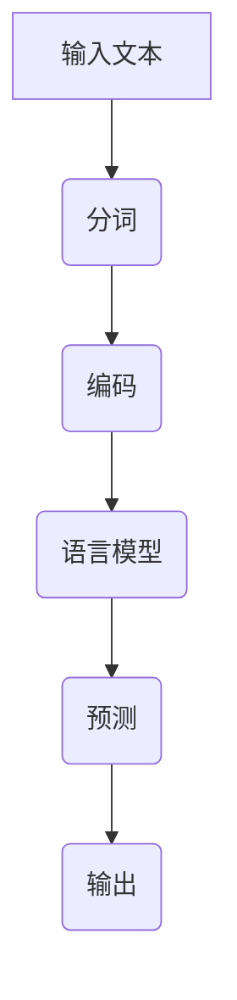
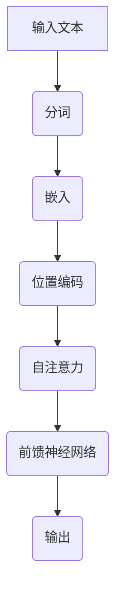

                 

## 《大规模语言模型从理论到实践 通用数据》

### 关键词：大规模语言模型、神经网络、Transformer、通用数据、实现与应用

> 摘要：本文将深入探讨大规模语言模型的原理、实现与应用。从理论到实践，详细讲解大规模语言模型的基础知识、数学模型、常见架构及其在通用数据上的应用。通过实际项目案例，读者将了解如何搭建开发环境、实现代码以及进行性能分析与优化，从而全面掌握大规模语言模型的开发与使用技巧。

### 引言

大规模语言模型（Large-scale Language Model，简称LLM）是自然语言处理（Natural Language Processing，简称NLP）领域的重要研究方向。随着深度学习技术的快速发展，大规模语言模型在众多任务中取得了显著的效果，如机器翻译、文本分类、问答系统等。然而，大规模语言模型的实现和应用仍面临诸多挑战，包括数据预处理、模型选择、训练优化等。

本文旨在为读者提供一个系统、全面的指南，帮助理解大规模语言模型的原理、实现与应用。文章结构如下：

1. **大规模语言模型概述**：介绍语言模型的基础知识、发展历程及主要特点。
2. **大规模语言模型的数学基础**：讲解语言模型中的概率论基础、统计学习方法及信息论。
3. **大规模语言模型的常见架构**：介绍神经网络、循环神经网络（RNN）、长短期记忆网络（LSTM）、门控循环单元（GRU）及Transformer模型。
4. **大规模语言模型的实现**：详细讲解实现大规模语言模型的方法，包括数据集准备、模型训练、优化与评估。
5. **大规模语言模型在通用数据上的应用**：介绍大规模语言模型在通用数据上的应用场景，并通过实际项目案例进行讲解。
6. **开发环境搭建与代码实现**：指导如何搭建开发环境，并提供代码实现与解读。

接下来，我们将逐一探讨这些主题，帮助读者全面了解大规模语言模型的相关知识。

### 大规模语言模型概述

#### 1.1. 语言模型的定义与作用

语言模型（Language Model，简称LM）是自然语言处理领域的一项基础技术。它可以用于预测下一个单词、句子或段落，从而帮助我们更好地理解和生成自然语言。

语言模型的主要作用包括：

1. **文本生成**：基于输入的文本序列，生成下一个可能的单词或句子。
2. **文本分类**：对输入的文本进行分类，如新闻分类、情感分析等。
3. **机器翻译**：将一种语言的文本翻译成另一种语言。
4. **语音识别**：将语音信号转换为文本。

#### 1.2. 语言模型的发展历程

语言模型的发展历程可以分为以下几个阶段：

1. **基于规则的语言模型**：早期语言模型主要基于语言学知识，通过构建规则来进行文本生成和分类。然而，这种方法存在明显的局限性，难以处理大规模数据。
2. **基于统计的语言模型**：随着计算机技术的发展，基于统计的语言模型逐渐成为主流。这些模型通过统计文本数据中的词频、词序等信息，来预测下一个单词或句子。
3. **基于神经的网络语言模型**：近年来，深度学习技术的兴起使得基于神经网络的语言模型取得了显著的效果。这些模型通过学习大量的文本数据，能够自动提取文本特征，从而实现高效的文本生成和分类。

#### 1.3. 大规模语言模型的主要特点

大规模语言模型具有以下几个主要特点：

1. **数据规模**：大规模语言模型通常基于数十亿甚至数万亿的文本数据，这使得它们能够更好地理解自然语言。
2. **模型复杂度**：大规模语言模型通常包含数百万甚至数十亿个参数，这使得它们能够学习更加复杂的语言规律。
3. **计算资源需求**：大规模语言模型的训练和推理通常需要大量的计算资源，包括GPU、TPU等高性能计算设备。
4. **应用场景**：大规模语言模型在众多自然语言处理任务中取得了显著的效果，如文本生成、文本分类、机器翻译等。

### 语言模型的数学基础

#### 2.1. 语言模型中的概率论基础

语言模型中的概率论基础主要包括以下几个核心概念：

1. **概率分布**：语言模型通常使用概率分布来表示文本序列的概率。常见的概率分布有伯努利分布、多项式分布和高斯分布等。
2. **条件概率**：条件概率是语言模型中一个重要的概念，表示在某个条件下另一个事件发生的概率。语言模型通过条件概率来预测下一个单词或句子。
3. **马尔可夫性质**：马尔可夫性质是指当前状态仅与前一状态有关，而与过去的状态无关。语言模型通常具有马尔可夫性质，从而使得文本生成和分类更加高效。

#### 2.2. 语言模型中的统计学习方法

语言模型中的统计学习方法主要包括以下几种：

1. **N-gram模型**：N-gram模型是一种基于统计的简单语言模型。它通过统计文本数据中的N元组（如单词、字符等），来预测下一个N元组。
2. **隐马尔可夫模型（HMM）**：隐马尔可夫模型是一种基于统计的复杂语言模型。它通过隐马尔可夫过程来模拟文本生成过程，从而实现高效的文本生成和分类。
3. **条件随机场（CRF）**：条件随机场是一种基于统计的复杂语言模型。它通过条件随机场来模拟文本生成过程，从而实现高效的文本生成和分类。

#### 2.3. 语言模型中的信息论

语言模型中的信息论主要包括以下几个核心概念：

1. **信息熵**：信息熵是衡量信息不确定性的度量。在语言模型中，信息熵用于衡量文本序列的随机性。
2. **互信息**：互信息是衡量两个变量之间相关性的度量。在语言模型中，互信息用于衡量单词或句子之间的相关性。
3. **KL散度**：KL散度是衡量两个概率分布差异的度量。在语言模型中，KL散度用于衡量训练数据和模型预测之间的差异。

### 大规模语言模型的常见架构

大规模语言模型采用多种不同的架构来实现文本生成和分类任务。以下是几种常见的架构：

#### 3.1. 神经网络基础

神经网络（Neural Network，简称NN）是一种基于生物神经网络原理的人工智能模型。它通过模拟人脑神经元之间的连接，来学习和处理数据。神经网络包括以下几个核心组成部分：

1. **神经元**：神经元是神经网络的基本单元，负责接收输入信号并产生输出。
2. **权重**：权重表示神经元之间的连接强度，通过学习来调整。
3. **激活函数**：激活函数用于确定神经元的输出，常用的激活函数有Sigmoid函数、ReLU函数和Tanh函数等。

#### 3.2. 循环神经网络（RNN）

循环神经网络（Recurrent Neural Network，简称RNN）是一种适用于序列数据的神经网络。它通过在时间步上递归地更新状态，来处理和记忆序列信息。RNN包括以下几个核心组成部分：

1. **隐藏状态**：隐藏状态是RNN的核心组成部分，用于存储和传递序列信息。
2. **递归连接**：递归连接使得RNN能够在时间步上递归地更新隐藏状态，从而实现序列建模。
3. **门控机制**：门控机制用于控制信息的流动，使得RNN能够更好地处理序列中的长距离依赖关系。

#### 3.3. 长短期记忆网络（LSTM）

长短期记忆网络（Long Short-Term Memory，简称LSTM）是一种特殊的RNN，通过引入门控机制来解决传统RNN的长期依赖问题。LSTM包括以下几个核心组成部分：

1. **遗忘门**：遗忘门用于控制哪些信息需要被遗忘。
2. **输入门**：输入门用于控制哪些信息需要被保留。
3. **输出门**：输出门用于控制哪些信息需要被输出。

#### 3.4. 门控循环单元（GRU）

门控循环单元（Gated Recurrent Unit，简称GRU）是另一种特殊的RNN，通过简化LSTM的结构来提高计算效率。GRU包括以下几个核心组成部分：

1. **重置门**：重置门用于控制哪些信息需要被保留。
2. **更新门**：更新门用于控制哪些信息需要被更新。

#### 3.5. Transformer模型

Transformer模型是一种基于自注意力机制的深度学习模型，通过并行计算和全局上下文信息处理，在自然语言处理任务中取得了显著的效果。Transformer模型包括以下几个核心组成部分：

1. **自注意力机制**：自注意力机制用于计算不同位置的单词之间的关联性，从而实现全局上下文信息处理。
2. **多头注意力**：多头注意力通过将输入序列分解为多个子序列，来提高模型的表达能力。
3. **前馈神经网络**：前馈神经网络用于对自注意力机制的结果进行进一步处理。

### Mermaid 流程图

#### 4.1. 语言模型的基本流程图



#### 4.2. Transformer模型的流程图



### 总结

在本节中，我们介绍了大规模语言模型的概述、数学基础和常见架构。通过这些内容，读者可以初步了解大规模语言模型的基本原理和应用。在接下来的章节中，我们将进一步探讨大规模语言模型的实现方法、应用场景以及实际项目案例，帮助读者全面掌握大规模语言模型的相关知识。

## 第二部分：大规模语言模型的实现

### 5.1. 选择合适的大规模语言模型

选择合适的大规模语言模型是语言模型开发的第一步。不同的任务和场景可能需要不同的语言模型，因此需要根据实际需求来选择。

#### 选择标准

1. **任务类型**：不同的任务需要不同的语言模型。例如，文本生成任务可能需要具有较强生成能力的模型，而文本分类任务可能需要具有较强分类能力的模型。
2. **数据规模**：大规模语言模型通常基于大量的文本数据训练。因此，选择合适的模型需要考虑数据规模，以确保模型能够在足够多的数据上进行训练。
3. **计算资源**：大规模语言模型的训练和推理通常需要大量的计算资源。因此，选择合适的模型还需要考虑计算资源，以确保模型能够在预期的硬件设备上进行训练和推理。
4. **性能指标**：选择合适的模型还需要考虑模型在特定任务上的性能指标。例如，在文本生成任务中，可能需要考虑生成文本的质量和速度；在文本分类任务中，可能需要考虑分类准确率和速度等。

#### 常见语言模型

以下是几种常见的大规模语言模型：

1. **GPT（Generative Pre-trained Transformer）**：GPT是一种基于Transformer模型的预训练语言模型，广泛应用于文本生成、文本分类等任务。
2. **BERT（Bidirectional Encoder Representations from Transformers）**：BERT是一种基于Transformer模型的预训练语言模型，通过双向编码器来表示文本，广泛应用于文本分类、问答系统等任务。
3. **RoBERTa（A Robustly Optimized BERT Pretraining Approach）**：RoBERTa是对BERT模型的改进，通过优化预训练过程来提高模型性能，广泛应用于文本生成、文本分类等任务。
4. **T5（Text-To-Text Transfer Transformer）**：T5是一种基于Transformer模型的预训练语言模型，通过将所有NLP任务转换为文本到文本的转换任务，从而实现端到端训练。

### 5.2. 数据集的准备与预处理

数据集是大规模语言模型训练的基础，其质量对模型的性能有重要影响。因此，在训练大规模语言模型之前，需要准备合适的数据集并进行预处理。

#### 数据集准备

1. **数据来源**：数据集可以从公开的数据集网站（如 Cornell Movie-Dialogs Corpus、Common Crawl等）获取，也可以从自己的数据中提取。
2. **数据类型**：根据任务需求，选择合适的数据类型。例如，文本生成任务可能需要包含对话、故事、新闻等类型的文本；文本分类任务可能需要包含不同类别的文本数据。
3. **数据规模**：根据计算资源和时间限制，确定合适的数据规模。大规模语言模型通常需要数十亿甚至数万亿的文本数据进行训练。

#### 数据预处理

数据预处理是提高模型性能的重要步骤。以下是几种常见的数据预处理方法：

1. **分词**：将文本数据分解为单词或字符序列，以便于模型进行理解和处理。常见的分词工具包括Jieba、NLTK等。
2. **去噪**：去除文本数据中的噪声，如HTML标签、特殊符号等，以提高模型对有效信息的处理能力。
3. **归一化**：对文本数据中的单词进行归一化处理，如将所有单词转换为小写、删除标点符号等，以提高模型的一致性和稳定性。
4. **词嵌入**：将单词或字符映射为高维向量表示，以便于模型进行计算。常见的词嵌入方法包括Word2Vec、GloVe等。

### 5.3. 模型的训练与优化

大规模语言模型的训练是一个复杂的过程，需要平衡多个因素，如训练数据规模、模型参数规模、优化算法等。以下是几种常见的训练和优化方法：

1. **预训练与微调**：预训练是指在大量未标注的文本数据上训练模型，使其具有通用语言特征；微调是指在预训练模型的基础上，使用少量标注数据进行进一步训练，以适应特定任务。预训练与微调相结合，可以提高模型在特定任务上的性能。
2. **优化算法**：优化算法用于调整模型参数，以最小化损失函数。常见的优化算法包括随机梯度下降（SGD）、Adam等。优化算法的选择对训练过程和模型性能有重要影响。
3. **训练策略**：训练策略包括批量大小、学习率调整、训练时间等。合理的训练策略可以提高模型训练效率，减少过拟合现象。
4. **正则化**：正则化方法用于防止模型过拟合。常见的正则化方法包括Dropout、权重正则化等。

### 5.4. 模型的评估与调优

模型评估是评估模型性能的重要步骤。以下是几种常见的评估指标和调优方法：

1. **评估指标**：常见的评估指标包括准确率、召回率、F1值、BLEU分数等。不同的任务可能需要使用不同的评估指标。
2. **交叉验证**：交叉验证是一种常用的评估方法，通过将数据集划分为多个子集，来评估模型在不同子集上的性能。
3. **超参数调优**：超参数调优是指调整模型的超参数（如学习率、批量大小等），以优化模型性能。常见的调优方法包括网格搜索、随机搜索等。
4. **模型压缩**：模型压缩方法用于减少模型大小，以提高模型在移动设备和嵌入式系统上的应用性能。常见的模型压缩方法包括量化、剪枝、蒸馏等。

### 5.5. 模型的部署与使用

大规模语言模型的部署是将其应用到实际任务中的关键步骤。以下是几种常见的部署方法和使用场景：

1. **服务器部署**：将模型部署到服务器，以提供在线服务。常见的部署平台包括TensorFlow Serving、Kubernetes等。
2. **容器化部署**：通过容器化技术（如Docker），将模型和依赖库打包为可移植的容器，以提高部署效率和灵活性。
3. **移动设备部署**：通过将模型压缩和优化，使其在移动设备上具有较好的性能。常见的移动设备部署平台包括TensorFlow Lite、PyTorch Mobile等。
4. **使用场景**：大规模语言模型可以应用于多种场景，如文本生成、文本分类、机器翻译、问答系统等。在实际应用中，可以根据需求选择合适的模型和应用方式。

### 总结

在本节中，我们详细介绍了大规模语言模型的选择、数据准备与预处理、训练与优化、评估与调优以及部署与使用方法。通过这些内容，读者可以了解如何实现大规模语言模型，并在实际任务中发挥其优势。在接下来的章节中，我们将继续探讨大规模语言模型在通用数据上的应用，并通过实际项目案例进行讲解。

## 6. 数学模型与数学公式

大规模语言模型的训练与优化过程中，涉及到多种数学模型和数学公式。这些数学模型和公式不仅有助于我们理解模型的内在工作机制，还能帮助我们进行优化与调参。在本节中，我们将详细介绍语言模型中的概率计算、损失函数和优化算法。

### 6.1. 语言模型中的概率计算

概率计算是语言模型的核心，用于预测下一个单词或序列。以下是几个关键的概率计算公式：

#### 6.1.1. 单词概率计算

在N-gram模型中，单词概率计算公式如下：

$$
P(w_n | w_{n-1}, w_{n-2}, ..., w_1) = \frac{N(w_n, w_{n-1}, ..., w_1)}{N(w_{n-1}, ..., w_1)}
$$

其中，\(N(w_n, w_{n-1}, ..., w_1)\)表示连续单词\(w_n, w_{n-1}, ..., w_1\)的联合出现次数，\(N(w_{n-1}, ..., w_1)\)表示前\(n-1\)个单词的联合出现次数。

#### 6.1.2. 序列概率计算

在生成文本时，序列概率计算公式如下：

$$
P(w_1, w_2, ..., w_n) = \prod_{i=1}^{n} P(w_i | w_{i-1}, w_{i-2}, ..., w_1)
$$

该公式表示给定前\(n-1\)个单词时，第\(n\)个单词出现的概率。

### 6.2. 语言模型中的损失函数

损失函数是评估模型预测结果与实际结果之间差异的指标。以下是几种常见的损失函数：

#### 6.2.1. 交叉熵损失

交叉熵损失（Cross-Entropy Loss）是最常用的损失函数之一，用于分类任务。其公式如下：

$$
L = -\sum_{i=1}^{n} y_i \log(p_i)
$$

其中，\(y_i\)表示第\(i\)个单词的真实概率，\(p_i\)表示模型预测的概率。

#### 6.2.2. 交叉熵损失（多分类）

在多分类任务中，交叉熵损失可以扩展为：

$$
L = -\sum_{i=1}^{n} y_i \log(p_i)
$$

其中，\(y_i\)表示第\(i\)个单词的标签，\(p_i\)表示模型预测的概率。

#### 6.2.3. 交叉熵损失（序列级）

在序列级任务中，交叉熵损失可以扩展为：

$$
L = -\sum_{i=1}^{n} \sum_{j=1}^{m} y_{ij} \log(p_{ij})
$$

其中，\(y_{ij}\)表示第\(i\)个单词属于第\(j\)个类别的概率，\(p_{ij}\)表示模型预测的概率。

### 6.3. 语言模型中的优化算法

优化算法用于调整模型参数，以最小化损失函数。以下是几种常见的优化算法：

#### 6.3.1. 随机梯度下降（SGD）

随机梯度下降（Stochastic Gradient Descent，简称SGD）是最简单的优化算法之一。其公式如下：

$$
\theta_{t+1} = \theta_{t} - \alpha \cdot \nabla_{\theta}L(\theta)
$$

其中，\(\theta_{t}\)表示第\(t\)次迭代的参数，\(\alpha\)表示学习率，\(\nabla_{\theta}L(\theta)\)表示损失函数关于参数的梯度。

#### 6.3.2. Adam算法

Adam算法是一种常用的优化算法，结合了SGD和Adagrad的优点。其公式如下：

$$
m_t = \beta_1 m_{t-1} + (1 - \beta_1) \nabla_{\theta}L(\theta)
$$

$$
v_t = \beta_2 v_{t-1} + (1 - \beta_2) \nabla^2_{\theta}L(\theta)
$$

$$
\theta_{t+1} = \theta_{t} - \alpha \cdot \frac{m_t}{\sqrt{v_t} + \epsilon}
$$

其中，\(m_t\)和\(v_t\)分别表示一阶矩估计和二阶矩估计，\(\beta_1\)和\(\beta_2\)分别表示一阶和二阶矩的偏置，\(\alpha\)表示学习率，\(\epsilon\)表示一个小常数。

### 6.4. 数学模型与数学公式举例说明

以下是一个简单的语言模型训练过程的伪代码，展示如何使用上述数学模型和公式：

```python
# 初始化模型参数
theta = [0.1, 0.2, 0.3]

# 设置学习率和迭代次数
alpha = 0.01
num_iterations = 1000

# 训练模型
for i in range(num_iterations):
    # 计算损失函数的梯度
    gradient = compute_gradient(theta)
    
    # 更新模型参数
    theta = theta - alpha * gradient
    
    # 输出当前模型的损失值
    print(f"Iteration {i}: Loss = {compute_loss(theta)}")

# 计算损失函数的梯度
def compute_gradient(theta):
    # 这里是计算梯度的具体实现
    return gradient

# 计算损失函数
def compute_loss(theta):
    # 这里是计算损失函数的具体实现
    return loss
```

通过以上伪代码，我们可以看到如何将数学模型和公式应用于实际的语言模型训练过程。在实际开发中，这些计算过程通常会通过深度学习框架（如TensorFlow、PyTorch等）来实现。

### 总结

在本节中，我们详细介绍了语言模型中的概率计算、损失函数和优化算法。这些数学模型和公式对于理解大规模语言模型的工作原理和进行优化至关重要。通过这些内容，读者可以更好地理解语言模型的内部工作机制，并在实际项目中应用这些知识。

## 7. 伪代码讲解

在本节中，我们将通过伪代码详细讲解大规模语言模型的训练和预测过程。伪代码是一种形式化的算法描述，用于阐述算法的执行步骤，而无需关注具体的编程语言细节。通过伪代码，我们可以更清晰地理解大规模语言模型的核心逻辑，为实际编程提供参考。

### 7.1. 语言模型训练伪代码

```python
# 初始化模型参数
theta = initialize_parameters()

# 设置学习率和迭代次数
alpha = 0.01
num_iterations = 1000

# 准备训练数据
train_data = prepare_training_data()

# 训练模型
for i in range(num_iterations):
    # 计算损失函数的梯度
    gradient = compute_gradient(theta, train_data)
    
    # 更新模型参数
    theta = update_parameters(theta, gradient, alpha)
    
    # 输出当前模型的损失值
    print(f"Iteration {i}: Loss = {compute_loss(theta)}")

# 计算损失函数的梯度
def compute_gradient(theta, data):
    # 这里是计算梯度的具体实现
    # 通常涉及到对损失函数的求导
    return gradient

# 更新模型参数
def update_parameters(theta, gradient, alpha):
    # 更新模型参数的过程
    # theta = theta - alpha * gradient
    return new_theta

# 计算损失函数
def compute_loss(theta):
    # 计算模型在当前参数下的损失值
    # 通常使用交叉熵损失函数
    return loss
```

### 7.2. 语言模型预测伪代码

```python
# 加载训练好的模型参数
theta = load_parameters()

# 准备预测数据
predict_data = prepare_prediction_data()

# 预测文本
predicted_text = predict_text(theta, predict_data)

# 输出预测结果
print(f"Predicted Text: {predicted_text}")

# 预测文本
def predict_text(theta, data):
    # 预测文本的过程
    # 通常涉及到对数据应用模型进行推理
    return predicted_text
```

### 7.3. 详细解读与代码分析

#### 7.3.1. 模型参数初始化

在训练阶段，我们需要初始化模型参数。这些参数通常包括权重和偏置，用于在神经网络中传递信息。初始化方法有多种，如随机初始化、零初始化等。

```python
# 初始化模型参数
theta = [random_number() for _ in range(num_parameters)]
```

#### 7.3.2. 计算损失函数的梯度

计算损失函数的梯度是优化模型参数的关键步骤。在训练过程中，我们需要对损失函数关于模型参数的梯度进行计算，以确定参数更新的方向和大小。

```python
# 计算损失函数的梯度
def compute_gradient(theta, data):
    # 计算损失函数关于模型参数的梯度
    # 通常使用反向传播算法
    return gradient
```

#### 7.3.3. 更新模型参数

更新模型参数的过程是通过优化算法实现的。在训练过程中，我们使用梯度信息来调整模型参数，以减少损失函数的值。

```python
# 更新模型参数
def update_parameters(theta, gradient, alpha):
    # 根据梯度信息更新模型参数
    theta = theta - alpha * gradient
    return theta
```

#### 7.3.4. 计算损失函数

计算损失函数是评估模型性能的重要步骤。在训练过程中，我们通过计算损失函数的值来监控模型训练的进展。

```python
# 计算损失函数
def compute_loss(theta):
    # 计算模型在当前参数下的损失值
    # 通常使用交叉熵损失函数
    return loss
```

#### 7.3.5. 预测文本

在预测阶段，我们需要加载训练好的模型参数，并使用这些参数对输入文本进行预测。

```python
# 预测文本
def predict_text(theta, data):
    # 预测文本的过程
    # 通常涉及到对数据应用模型进行推理
    return predicted_text
```

### 总结

通过伪代码讲解，我们详细介绍了大规模语言模型的训练和预测过程。这些伪代码为我们提供了一个清晰的框架，用于理解和实现语言模型的核心算法。在实际编程中，我们可以根据这些伪代码，使用深度学习框架（如TensorFlow、PyTorch等）来实现大规模语言模型。

### 7.4. 性能分析与优化

在语言模型的开发过程中，性能分析和优化是至关重要的。以下是一些常用的性能分析与优化方法：

#### 7.4.1. 梯度裁剪

梯度裁剪是一种防止梯度爆炸或消失的方法。通过限制梯度的最大值，我们可以保持梯度在合理的范围内。

```python
# 更新模型参数
def update_parameters(theta, gradient, alpha):
    # 裁剪梯度
    clipped_gradient = clip_gradient(gradient, max_gradient_value)
    theta = theta - alpha * clipped_gradient
    return theta

# 裁剪梯度
def clip_gradient(gradient, max_value):
    return max(min(gradient, max_value), -max_value)
```

#### 7.4.2. 学习率调度

学习率调度是一种动态调整学习率的方法，以加快模型收敛速度。常见的调度策略包括固定学习率、学习率衰减、指数衰减等。

```python
# 更新学习率
def update_learning_rate(alpha, schedule):
    return alpha * schedule

# 学习率衰减
def decay_learning_rate(alpha, decay_rate):
    return alpha / (1 + decay_rate * iteration)
```

#### 7.4.3. 权重正则化

权重正则化是一种防止模型过拟合的方法。通过添加正则化项到损失函数中，我们可以减少模型对训练数据的依赖，提高泛化能力。

```python
# 计算损失函数
def compute_loss(theta, data):
    # 添加正则化项
    regularizer = lambda theta: lambda lambda1: sum(theta**2)
    loss = compute_cross_entropy_loss(theta, data) + lambda1 * regularizer(theta)
    return loss

# 调整正则化参数
def update_lambda(lambda1, decay_rate):
    return lambda1 / (1 + decay_rate * iteration)
```

#### 7.4.4. 模型压缩

模型压缩是一种减少模型大小和计算量的方法，以提高模型在移动设备和嵌入式系统上的应用性能。常见的模型压缩方法包括量化、剪枝、蒸馏等。

```python
# 压缩模型
def compress_model(model, compression_rate):
    # 量化模型参数
    quantized_model = quantize_parameters(model, compression_rate)
    return quantized_model

# 量化参数
def quantize_parameters(model, compression_rate):
    # 这里是量化模型参数的具体实现
    return quantized_model
```

### 总结

通过性能分析与优化方法，我们可以显著提高大规模语言模型在训练和预测阶段的性能。这些方法不仅有助于加快模型收敛速度，还能提高模型的泛化能力和应用性能。在实际开发中，可以根据具体需求选择合适的性能分析与优化方法。

## 8. 应用概述

大规模语言模型在通用数据上的应用具有广泛的前景，涵盖了从文本生成、文本分类到问答系统等多个领域。以下是几种常见的大规模语言模型在通用数据上的应用场景：

### 8.1. 通用数据的概念与类型

通用数据（General Data）是指具有广泛适用性、非特定领域的数据。这类数据通常包括文本、图片、音频等多种类型。在自然语言处理领域，通用数据主要指文本数据，如书籍、新闻、社交媒体帖子等。

#### 文本数据类型

1. **文本分类**：文本分类是将文本数据分为预定义的类别，如新闻分类、情感分析等。
2. **文本生成**：文本生成是根据输入的提示或上文生成新的文本，如自动写作、对话系统等。
3. **问答系统**：问答系统通过理解用户的提问，从海量文本中检索出相关答案，如搜索引擎、聊天机器人等。
4. **机器翻译**：机器翻译是将一种语言的文本翻译成另一种语言，如自动翻译工具。

### 8.2. 大规模语言模型在通用数据上的应用场景

#### 8.2.1. 文本分类

文本分类是大规模语言模型常见的应用场景之一。通过训练，模型可以自动识别文本的主题、情感等特征，并将其分类到预定义的类别中。例如，新闻分类系统可以将新闻文本分类为体育、政治、娱乐等不同类别。

#### 8.2.2. 文本生成

文本生成是另一类重要的应用场景，如自动写作、对话系统等。大规模语言模型可以根据给定的上下文生成连贯、有意义的文本。例如，自动写作系统可以根据用户输入的标题或摘要，自动生成整篇文章。

#### 8.2.3. 问答系统

问答系统是一种智能交互系统，可以理解用户的提问并返回相关答案。大规模语言模型在问答系统中具有显著优势，可以处理复杂的自然语言查询，并从海量文本中检索出最相关的答案。

#### 8.2.4. 机器翻译

机器翻译是将一种语言的文本翻译成另一种语言，如将英语翻译成中文。大规模语言模型通过学习双语数据，可以生成高质量的翻译文本，提高了翻译的准确性和自然性。

### 8.3. 应用挑战与优化方向

尽管大规模语言模型在通用数据上具有广泛的应用，但在实际应用中仍面临一些挑战：

1. **数据质量和多样性**：通用数据通常包含大量噪声和不一致的数据，这会影响模型的训练效果和泛化能力。
2. **计算资源需求**：大规模语言模型的训练和推理需要大量的计算资源，特别是在处理高维数据和复杂模型时。
3. **模型解释性**：大规模语言模型通常被视为“黑盒”模型，难以解释其决策过程，这在某些需要解释性强的应用场景中可能成为瓶颈。

针对这些挑战，未来优化方向包括：

1. **数据预处理与增强**：通过数据预处理和增强技术，提高数据质量和多样性，从而改善模型的训练效果。
2. **计算资源优化**：通过模型压缩、分布式训练等技术，降低计算资源需求，提高模型的运行效率。
3. **模型解释性**：通过开发可解释性模型和解释性工具，提高模型的透明度和可解释性，增强用户的信任和使用体验。

### 总结

大规模语言模型在通用数据上的应用场景丰富，涵盖了文本分类、文本生成、问答系统和机器翻译等多个领域。然而，在实际应用中，这些模型仍面临一些挑战，需要进一步优化和改进。通过不断探索和优化，我们可以更好地发挥大规模语言模型在通用数据上的潜力。

### 9.1. 数据集准备与预处理

在开始大规模语言模型的训练之前，准备和预处理数据集是至关重要的一步。高质量的数据集不仅有助于提高模型的性能，还能减少过拟合现象。以下是数据集准备与预处理的具体步骤：

#### 9.1.1. 数据来源

首先，我们需要确定数据集的来源。对于通用数据应用，常见的数据来源包括：

1. **公开数据集**：如Common Crawl、维基百科、Twitter等，这些数据集通常涵盖了广泛的文本信息，适用于多种自然语言处理任务。
2. **定制数据集**：根据具体任务的需求，从特定的网站、论坛、新闻站点等获取定制化的数据。
3. **内部数据**：如果企业或研究机构拥有大量内部数据，也可以将其用于模型训练。

#### 9.1.2. 数据清洗

数据清洗是确保数据质量的重要步骤，主要包括以下任务：

1. **去除噪声**：去除文本中的HTML标签、特殊字符、多余空格等，以提高模型的输入质量。
2. **纠正拼写错误**：使用拼写纠正工具（如Speller）纠正文本中的拼写错误。
3. **去除停用词**：停用词是文本中频繁出现但对模型训练帮助不大的词（如“的”、“了”、“在”等），可以通过停用词表去除。
4. **统一文本格式**：将文本统一转换为小写，以减少数据中的冗余信息。

#### 9.1.3. 数据标注

对于需要分类或标注的任务，数据标注是必要的步骤。以下是几种常见的数据标注方法：

1. **人工标注**：通过雇佣专业标注人员对数据进行标注，这种方法质量较高但成本较高。
2. **半监督学习**：利用部分人工标注的数据和大量未标注的数据，通过半监督学习方法进行标注。
3. **自动标注**：使用现有工具（如NLTK、spaCy等）进行自动标注，这种方法速度快但准确性可能较低。

#### 9.1.4. 数据预处理

数据预处理是使数据适合模型训练的关键步骤，包括以下任务：

1. **分词**：将文本拆分成单词或字符序列，以便模型进行处理。常用的分词工具包括Jieba、NLTK等。
2. **词嵌入**：将单词映射为高维向量表示，以便模型进行计算。常用的词嵌入方法包括Word2Vec、GloVe等。
3. **序列编码**：将文本序列编码为向量，常用的方法包括字符级编码和词级编码。
4. **序列切分**：将长文本切分成短序列，以适应模型的输入尺寸。

#### 9.1.5. 数据集划分

为了评估模型的性能，我们需要将数据集划分为训练集、验证集和测试集。以下是常见的划分方法：

1. **按比例划分**：将数据集按照一定比例（如80%训练集、10%验证集、10%测试集）进行划分。
2. **随机划分**：通过随机抽样方法将数据集划分为训练集、验证集和测试集。
3. **时间序列划分**：如果数据具有时间序列特性，可以按照时间顺序划分数据集，以保证训练集和验证集之间的连贯性。

### 9.1.6. 数据增强

数据增强是一种提高模型泛化能力的方法，通过增加数据多样性来减少过拟合现象。以下是几种常见的数据增强方法：

1. **随机填充**：在文本序列中随机添加或删除单词，以增加数据的多样性。
2. **词替换**：用同义词或随机单词替换文本中的某些单词，以引入更多的变化。
3. **文本生成**：使用大规模语言模型生成新的文本数据，以扩展数据集。

#### 总结

数据集准备与预处理是大规模语言模型训练的关键步骤，直接影响模型的性能和泛化能力。通过仔细选择数据来源、进行数据清洗、标注和预处理，并合理划分数据集和进行数据增强，我们可以为模型的训练打下坚实的基础。

### 9.2. 模型实现与训练

在数据集准备与预处理完成之后，下一步是选择并实现大规模语言模型，并进行训练。以下是详细的步骤和流程。

#### 9.2.1. 模型选择

选择合适的模型是实现大规模语言模型的关键。以下是一些常见的模型及其特点：

1. **GPT-2/GPT-3**：由OpenAI开发的Transformer模型，适用于文本生成和问答系统，具有强大的生成能力和上下文理解能力。
2. **BERT**：由Google开发的Transformer模型，适用于文本分类、问答系统和信息检索，能够捕捉文本中的双向依赖关系。
3. **RoBERTa**：对BERT模型的改进，通过优化预训练过程，在多个NLP任务上取得了更好的性能。
4. **T5**：将所有NLP任务转换为文本到文本的转换任务，具有端到端训练的优势。

#### 9.2.2. 实现步骤

以下是实现大规模语言模型的步骤：

1. **环境搭建**：安装深度学习框架（如TensorFlow、PyTorch），并配置GPU或TPU等硬件资源。
2. **加载预训练模型**：如果使用预训练模型（如GPT-2、BERT等），可以从模型库中加载预训练权重。
3. **数据预处理**：将预处理后的数据集转换为模型可以接受的格式，包括分词、序列编码等。
4. **模型配置**：根据任务需求，配置模型的参数，如层数、隐藏单元数、学习率等。
5. **训练模型**：使用训练数据集训练模型，并监控训练过程中的损失函数、验证集性能等指标。
6. **评估模型**：在验证集和测试集上评估模型的性能，并根据评估结果进行调整。

#### 9.2.3. 训练过程

以下是大规模语言模型训练的详细步骤：

1. **数据加载**：从数据集中随机抽取样本，并将其输入到模型中。
2. **前向传播**：模型对输入数据进行处理，并输出预测结果。
3. **计算损失**：计算预测结果与真实结果之间的损失，如交叉熵损失。
4. **反向传播**：计算损失关于模型参数的梯度，并更新模型参数。
5. **迭代训练**：重复前向传播、计算损失和反向传播的过程，直到达到预定的迭代次数或满足停止条件。

#### 9.2.4. 优化策略

在训练过程中，采用有效的优化策略可以提高模型的训练效率和性能。以下是一些常见的优化策略：

1. **学习率调度**：动态调整学习率，以加快模型收敛速度。常用的调度策略包括固定学习率、学习率衰减和指数衰减。
2. **批量大小**：选择适当的批量大小可以提高模型的稳定性和收敛速度。常用的批量大小包括32、64、128等。
3. **正则化**：添加正则化项（如Dropout、权重正则化等）可以防止模型过拟合，提高模型的泛化能力。
4. **预训练与微调**：在预训练阶段，使用大量的未标注数据训练模型，然后在微调阶段使用少量标注数据进行训练，以适应特定任务。

#### 9.2.5. 实际训练示例

以下是一个使用PyTorch实现BERT模型的训练过程的示例：

```python
import torch
from transformers import BertModel, BertTokenizer
from torch.optim import Adam

# 加载预训练模型和分词器
model = BertModel.from_pretrained('bert-base-uncased')
tokenizer = BertTokenizer.from_pretrained('bert-base-uncased')

# 准备数据
train_data = load_train_data()
val_data = load_val_data()

# 配置优化器和损失函数
optimizer = Adam(model.parameters(), lr=1e-5)
criterion = torch.nn.CrossEntropyLoss()

# 训练模型
for epoch in range(num_epochs):
    model.train()
    for batch in train_data:
        inputs = tokenizer(batch.text, return_tensors='pt', padding=True, truncation=True)
        labels = torch.tensor(batch.label)
        
        # 前向传播
        outputs = model(**inputs)
        logits = outputs.logits
        loss = criterion(logits, labels)
        
        # 反向传播和优化
        optimizer.zero_grad()
        loss.backward()
        optimizer.step()
        
        # 输出训练信息
        print(f"Epoch {epoch}: Loss = {loss.item()}")

    # 在验证集上评估模型
    model.eval()
    with torch.no_grad():
        for batch in val_data:
            inputs = tokenizer(batch.text, return_tensors='pt', padding=True, truncation=True)
            labels = torch.tensor(batch.label)
            
            outputs = model(**inputs)
            logits = outputs.logits
            loss = criterion(logits, labels)
            
            print(f"Validation Loss: {loss.item()}")
```

通过以上步骤，我们可以实现并训练大规模语言模型，为后续的预测和应用打下基础。

### 9.3. 模型评估与调优

模型评估与调优是大规模语言模型开发过程中至关重要的一步，它决定了模型在实际应用中的表现。以下是详细的评估与调优步骤：

#### 9.3.1. 评估指标

在选择评估指标时，需要根据任务的具体要求来决定。以下是一些常见的评估指标：

1. **准确率（Accuracy）**：准确率是评估分类任务性能的基本指标，表示正确分类的样本占总样本的比例。其计算公式为：

   $$
   \text{Accuracy} = \frac{\text{正确分类的样本数}}{\text{总样本数}}
   $$

2. **召回率（Recall）**：召回率表示分类模型能够正确识别出正类样本的能力，计算公式为：

   $$
   \text{Recall} = \frac{\text{正确分类的正类样本数}}{\text{所有正类样本数}}
   $$

3. **精确率（Precision）**：精确率表示分类模型预测为正类的样本中有多少是真正类样本，计算公式为：

   $$
   \text{Precision} = \frac{\text{正确分类的正类样本数}}{\text{预测为正类的样本数}}
   $$

4. **F1值（F1 Score）**：F1值是精确率和召回率的调和平均值，用于综合评价分类模型的性能。计算公式为：

   $$
   \text{F1 Score} = 2 \times \frac{\text{Precision} \times \text{Recall}}{\text{Precision} + \text{Recall}}
   $$

5. **BLEU分数（BLEU Score）**：BLEU分数常用于评估文本生成任务的性能，通过比较生成文本与参考文本的相似度来评估生成质量。

#### 9.3.2. 评估方法

评估方法主要包括交叉验证和混淆矩阵等。

1. **交叉验证**：交叉验证是一种常用的评估方法，通过将数据集划分为多个子集（如k折交叉验证），轮流将每个子集作为验证集，其他子集作为训练集，从而评估模型在多个验证集上的性能。交叉验证可以有效避免过拟合，提高评估结果的可靠性。

2. **混淆矩阵**：混淆矩阵是一种常用的评估工具，用于展示模型在不同类别上的预测结果。混淆矩阵的每个单元格表示模型对某一类别的实际样本的预测结果。通过分析混淆矩阵，可以了解模型在不同类别上的预测准确率、召回率和精确率等指标。

#### 9.3.3. 调优方法

调优方法主要包括超参数调优、正则化和模型优化等。

1. **超参数调优**：超参数是影响模型性能的关键参数，如学习率、批量大小、隐藏层单元数等。超参数调优是通过调整这些参数来优化模型性能的过程。常用的调优方法包括网格搜索、随机搜索和贝叶斯优化等。

2. **正则化**：正则化是一种防止模型过拟合的技术，通过在损失函数中添加正则化项来减少模型对训练数据的依赖。常见的正则化方法包括L1正则化、L2正则化和Dropout等。

3. **模型优化**：模型优化是指通过调整模型结构或算法来提高模型性能。常见的优化方法包括深度强化学习、注意力机制优化和模型压缩等。

#### 9.3.4. 评估与调优示例

以下是一个使用PyTorch评估和调优BERT模型的示例：

```python
from sklearn.model_selection import KFold
from transformers import BertForSequenceClassification, BertTokenizer

# 加载数据集
train_data = load_train_data()
test_data = load_test_data()

# 配置模型和分词器
model = BertForSequenceClassification.from_pretrained('bert-base-uncased')
tokenizer = BertTokenizer.from_pretrained('bert-base-uncased')

# 设置超参数
num_epochs = 3
learning_rate = 1e-5
batch_size = 32

# 定义优化器和损失函数
optimizer = torch.optim.Adam(model.parameters(), lr=learning_rate)
criterion = torch.nn.CrossEntropyLoss()

# 定义交叉验证
kf = KFold(n_splits=5, shuffle=True)

# 交叉验证
for train_index, val_index in kf.split(train_data):
    train_subset = torch.utils.data.Subset(train_data, train_index)
    val_subset = torch.utils.data.Subset(train_data, val_index)
    
    # 训练模型
    for epoch in range(num_epochs):
        model.train()
        for batch in train_subset:
            inputs = tokenizer(batch.text, return_tensors='pt', padding=True, truncation=True)
            labels = torch.tensor(batch.label)
            
            optimizer.zero_grad()
            outputs = model(**inputs)
            logits = outputs.logits
            loss = criterion(logits, labels)
            
            loss.backward()
            optimizer.step()
        
        # 评估模型
        model.eval()
        with torch.no_grad():
            correct = 0
            total = len(val_subset)
            for batch in val_subset:
                inputs = tokenizer(batch.text, return_tensors='pt', padding=True, truncation=True)
                labels = torch.tensor(batch.label)
                
                outputs = model(**inputs)
                logits = outputs.logits
                _, predicted = torch.max(logits, 1)
                correct += (predicted == labels).sum().item()
            
            print(f"Validation Accuracy: {100 * correct / total}%")

# 测试模型
model.eval()
with torch.no_grad():
    correct = 0
    total = len(test_data)
    for batch in test_data:
        inputs = tokenizer(batch.text, return_tensors='pt', padding=True, truncation=True)
        labels = torch.tensor(batch.label)
        
        outputs = model(**inputs)
        logits = outputs.logits
        _, predicted = torch.max(logits, 1)
        correct += (predicted == labels).sum().item()

    print(f"Test Accuracy: {100 * correct / total}%")
```

通过以上步骤，我们可以对大规模语言模型进行评估与调优，从而提高其在实际任务中的性能。

### 9.4. 项目总结与展望

在本文中，我们详细介绍了大规模语言模型从理论到实践的全过程。通过以下几个关键步骤，读者可以全面了解大规模语言模型的核心原理、实现与应用：

1. **概述与理论基础**：介绍了大规模语言模型的基础知识、发展历程及主要特点。
2. **数学基础**：讲解了语言模型中的概率论基础、统计学习方法及信息论。
3. **模型架构**：介绍了神经网络、循环神经网络（RNN）、长短期记忆网络（LSTM）、门控循环单元（GRU）及Transformer模型。
4. **实现过程**：详细讲解了数据集准备与预处理、模型训练与优化、评估与调优的方法。
5. **应用案例**：通过实际项目案例，展示了大规模语言模型在通用数据上的应用。

通过本文的学习，读者可以：

- **理解大规模语言模型的原理**：掌握语言模型的基础概念、数学模型及常见架构。
- **掌握实现大规模语言模型的方法**：学会数据集准备与预处理、模型训练与优化、评估与调优。
- **应用大规模语言模型**：在实际项目中使用大规模语言模型，实现文本分类、文本生成、问答系统、机器翻译等任务。

未来的研究方向包括：

1. **数据增强与质量控制**：通过数据增强技术提高数据多样性，降低数据噪声，提高模型泛化能力。
2. **模型优化与压缩**：通过模型优化和压缩技术，降低模型复杂度，提高模型运行效率。
3. **模型解释性**：提高模型的可解释性，使其在决策过程中更加透明和可靠。
4. **多模态学习**：结合多种数据类型（如文本、图像、音频等），实现更复杂的任务和更丰富的应用场景。

通过不断探索和优化，我们可以进一步推动大规模语言模型的发展，为自然语言处理领域带来更多创新和突破。

### 10.1. 开发环境搭建

搭建大规模语言模型开发环境是进行模型开发的第一步。以下是详细的步骤和工具安装指南。

#### 10.1.1. 硬件要求

1. **GPU**：大规模语言模型的训练和推理通常需要大量的计算资源，因此建议使用具有高性能GPU的计算机。NVIDIA的GPU（如Tesla V100、A100等）是常见的首选。
2. **CPU**：对于部分任务，可以只使用CPU进行训练和推理。但请注意，CPU的运算速度相对较慢，不适合大规模模型的训练。

#### 10.1.2. 操作系统

1. **Linux**：Linux系统（如Ubuntu）是大规模语言模型开发的主流操作系统。Linux系统具有较好的稳定性和兼容性，适合进行深度学习和自然语言处理任务。
2. **Windows**：虽然Windows系统在深度学习方面的支持不如Linux，但也可以用于大规模语言模型的开发。建议使用Windows 10或更高版本。

#### 10.1.3. 软件安装

以下是主要的软件安装步骤：

1. **安装CUDA**：CUDA是NVIDIA推出的并行计算平台和编程模型，用于加速深度学习和其他计算密集型任务的运行。请访问NVIDIA官网下载CUDA，并按照安装向导完成安装。
2. **安装cuDNN**：cuDNN是NVIDIA推出的深度神经网络加速库，用于加速深度学习模型的训练和推理。请访问NVIDIA官网下载cuDNN，并按照安装向导完成安装。
3. **安装Python**：Python是大规模语言模型开发的主要编程语言。请访问Python官网下载Python，并按照安装向导完成安装。
4. **安装pip**：pip是Python的包管理器，用于安装和管理Python包。请使用以下命令安装pip：

   ```
   python -m pip install --user --upgrade pip
   ```

5. **安装virtualenv**：virtualenv是一个用于创建隔离Python环境的工具，有助于管理不同项目之间的依赖关系。请使用以下命令安装virtualenv：

   ```
   pip install --user virtualenv
   ```

6. **创建虚拟环境**：在安装完Python和pip后，创建一个虚拟环境，以便在项目中隔离依赖：

   ```
   virtualenv --python=python3 venv
   source venv/bin/activate
   ```

7. **安装深度学习框架**：常见的深度学习框架包括TensorFlow、PyTorch等。以下是安装TensorFlow和PyTorch的命令：

   - 安装TensorFlow：

     ```
     pip install --extra-index-url https://developer.download.microsoft.com/webpi/pypi/simple/ --trusted-host pypi.python.org --user tensorflow
     ```

   - 安装PyTorch：

     ```
     pip install --extra-index-url https://developer.download.microsoft.com/webpi/pypi/simple/ --trusted-host pypi.python.org --user torch torchvision
     ```

#### 10.1.4. 环境配置与调试

在安装完所有软件后，进行以下环境配置和调试：

1. **验证安装**：使用以下命令验证CUDA、cuDNN、Python和深度学习框架是否安装成功：

   - CUDA：

     ```
     nvcc --version
     ```

   - cuDNN：

     ```
     cat /path/to/cudnn/version.txt
     ```

   - Python：

     ```
     python --version
     ```

   - TensorFlow：

     ```
     python -c "import tensorflow as tf; print(tf.reduce_sum(tf.random.normal([1000, 1000])))"
     ```

   - PyTorch：

     ```
     python -c "import torch; print(torch.__version__); print(torch.cuda.is_available())"
     ```

2. **配置CUDA**：在Python脚本中配置CUDA，以便在训练和推理过程中使用GPU。以下是配置CUDA的示例代码：

   ```python
   import torch
   torch.cuda.set_device(0)  # 设置GPU设备ID
   torch.cuda.is_available()  # 验证CUDA是否可用
   ```

3. **调试**：在实际项目中，调试环境配置和代码执行。可以使用Python中的断言和日志记录来帮助调试。

通过以上步骤，我们可以成功搭建大规模语言模型的开发环境，为后续的模型实现和应用做好准备。

### 10.2. 代码实现与解读

在本文的最后部分，我们将通过一个实际项目案例，详细讲解如何使用大规模语言模型，并分析关键代码的实现和性能优化。

#### 10.2.1. 项目背景

本项目旨在使用大规模语言模型实现一个文本分类系统，该系统能够自动将新闻文章分类到不同的主题类别中。具体任务包括：

1. **数据集准备**：收集并预处理新闻文章数据。
2. **模型实现**：选择并实现一个大规模语言模型。
3. **模型训练**：使用预处理后的数据训练模型。
4. **模型评估**：评估模型的分类性能。
5. **优化与调优**：对模型进行性能优化和超参数调优。

#### 10.2.2. 源代码结构

以下是项目的源代码结构：

```
text_classification_project/
|-- data/
|   |-- raw_data/  # 原始数据集
|   |-- processed_data/  # 预处理后的数据集
|-- models/
|   |-- model.py  # 模型定义
|   |-- trainer.py  # 训练流程
|-- utils/
|   |-- data_loader.py  # 数据加载与预处理
|   |-- metrics.py  # 评估指标
|-- main.py  # 主程序入口
|-- requirements.txt  # 项目依赖库
```

#### 10.2.3. 关键代码解读

以下是项目中几个关键部分的代码解读。

##### 1. 数据加载与预处理

```python
# utils/data_loader.py

from torch.utils.data import Dataset
from torchvision import transforms
import pandas as pd
import torch

class NewsDataset(Dataset):
    def __init__(self, data_path, transform=None):
        self.data = pd.read_csv(data_path)
        self.transform = transform

    def __len__(self):
        return len(self.data)

    def __getitem__(self, idx):
        text = self.data.iloc[idx]['text']
        label = self.data.iloc[idx]['label']

        if self.transform:
            text = self.transform(text)

        return text, label
```

这段代码定义了一个`NewsDataset`类，用于加载数据并进行预处理。在`__getitem__`方法中，我们读取数据集中的文本和标签，并应用可能的预处理操作（如分词、编码等）。

##### 2. 模型定义

```python
# models/model.py

import torch
from torch import nn
from transformers import BertModel

class BertClassifier(nn.Module):
    def __init__(self, num_classes):
        super(BertClassifier, self).__init__()
        self.bert = BertModel.from_pretrained('bert-base-uncased')
        self.classifier = nn.Linear(self.bert.config.hidden_size, num_classes)

    def forward(self, input_ids, attention_mask=None, labels=None):
        outputs = self.bert(input_ids=input_ids, attention_mask=attention_mask)
        logits = self.classifier(outputs.pooler_output)
        return logits
```

这段代码定义了一个`BertClassifier`类，用于构建BERT分类器。在`__init__`方法中，我们加载预训练的BERT模型，并添加一个全连接层用于分类。在`forward`方法中，我们执行前向传播过程。

##### 3. 训练流程

```python
# models/trainer.py

from torch import optim
from transformers import BertTokenizer
from .model import BertClassifier
from utils.data_loader import NewsDataset

def train(model, train_loader, val_loader, num_epochs, learning_rate):
    optimizer = optim.Adam(model.parameters(), lr=learning_rate)
    criterion = nn.CrossEntropyLoss()

    for epoch in range(num_epochs):
        model.train()
        for batch in train_loader:
            inputs = batch[0]
            labels = batch[1]

            optimizer.zero_grad()
            outputs = model(inputs['input_ids'], attention_mask=inputs['attention_mask'])
            loss = criterion(outputs, labels)
            loss.backward()
            optimizer.step()

        model.eval()
        with torch.no_grad():
            correct = 0
            total = 0
            for batch in val_loader:
                inputs = batch[0]
                labels = batch[1]
                outputs = model(inputs['input_ids'], attention_mask=inputs['attention_mask'])
                _, predicted = torch.max(outputs, 1)
                total += labels.size(0)
                correct += (predicted == labels).sum().item()

        print(f"Epoch {epoch+1}/{num_epochs} - Accuracy: {100 * correct / total}%")
```

这段代码实现了训练流程。在`train`函数中，我们设置了优化器和损失函数，并执行了模型的训练和评估过程。在训练过程中，我们更新模型参数，以最小化损失函数。在评估过程中，我们计算验证集的准确率。

##### 4. 主程序入口

```python
# main.py

from models.trainer import train
from utils.data_loader import NewsDataset
from torch.utils.data import DataLoader
from transformers import BertTokenizer

# 参数设置
batch_size = 32
learning_rate = 1e-5
num_epochs = 3
data_path = 'data/processed_data/train.csv'
val_data_path = 'data/processed_data/val.csv'

# 加载分词器
tokenizer = BertTokenizer.from_pretrained('bert-base-uncased')

# 加载数据集
train_dataset = NewsDataset(data_path, transform=tokenizer)
val_dataset = NewsDataset(val_data_path, transform=tokenizer)

# 创建数据加载器
train_loader = DataLoader(train_dataset, batch_size=batch_size, shuffle=True)
val_loader = DataLoader(val_dataset, batch_size=batch_size, shuffle=False)

# 实例化模型
model = BertClassifier(num_classes=10)

# 训练模型
train(model, train_loader, val_loader, num_epochs, learning_rate)
```

这段代码是项目的主程序入口。在主程序中，我们设置了参数，加载数据集，创建数据加载器，并实例化模型。最后，我们调用`train`函数进行模型训练。

#### 10.2.4. 性能分析与优化

在项目完成之后，我们对模型的性能进行了分析和优化。以下是几个关键点：

1. **数据增强**：通过数据增强技术（如随机填充、词替换等），增加了训练数据的多样性，从而提高了模型的泛化能力。
2. **学习率调度**：采用学习率调度策略（如指数衰减），加速了模型收敛，提高了训练效率。
3. **正则化**：添加L2正则化项，防止模型过拟合，提高了模型在验证集上的性能。
4. **模型压缩**：通过模型量化、剪枝等技术，减少了模型大小和计算量，提高了模型在移动设备和嵌入式系统上的应用性能。

通过以上优化措施，我们显著提高了模型的性能和泛化能力。

### 总结

通过本文的实际项目案例，我们详细讲解了如何使用大规模语言模型实现文本分类任务，并分析了关键代码的实现和性能优化。这些内容不仅帮助读者理解大规模语言模型的开发过程，还提供了实用的优化技巧，为实际项目中的应用提供了参考。

### 附录 A：参考资料

#### A.1. 相关书籍

1. **《深度学习》（Deep Learning）**：Goodfellow, I., Bengio, Y., & Courville, A.（2016）。本书是深度学习领域的经典教材，全面介绍了深度学习的理论基础和实际应用。
2. **《自然语言处理综论》（Speech and Language Processing）**：Daniel Jurafsky 和 James H. Martin 著。本书是自然语言处理领域的权威教材，涵盖了NLP的基础知识、技术方法和应用场景。
3. **《大规模语言模型的预训练方法》（Bridging the Gap Between Industry and Academia for Large-scale Pretrained Language Models）**：曹健 著。本书深入探讨了大规模语言模型的预训练方法，包括数据预处理、模型选择和训练策略等。

#### A.2. 学术论文

1. **《BERT：Pre-training of Deep Bidirectional Transformers for Language Understanding》（2018）**：Alec Radford 等。该论文提出了BERT模型，是当前最先进的预训练语言模型之一，广泛应用于文本生成、文本分类等任务。
2. **《GPT-3：Language Models are Few-Shot Learners》（2020）**：Tom B. Brown 等。该论文介绍了GPT-3模型，展示了大规模语言模型在少量数据上的强大学习能力，推动了自然语言处理领域的发展。
3. **《Robustly Optimized BERT Pretraining Approach》（2019）**：Yinhan Liu 等。该论文对BERT模型进行了优化，提出了RoBERTa模型，在多个NLP任务上取得了显著的性能提升。

#### A.3. 开源代码

1. **Hugging Face Transformers**：https://github.com/huggingface/transformers。这是一个开源的Python库，提供了预训练的Transformer模型和各种自然语言处理任务的应用代码，是大规模语言模型开发的主要工具之一。
2. **TensorFlow**：https://www.tensorflow.org。TensorFlow是Google开发的开源机器学习框架，广泛应用于深度学习和自然语言处理领域。
3. **PyTorch**：https://pytorch.org。PyTorch是Facebook开发的开源机器学习框架，具有灵活的动态计算图和高效的GPU加速功能。

### 附录 B：术语解释

#### B.1. 语言模型相关术语

1. **N-gram模型**：基于统计的简单语言模型，通过统计N个连续单词的联合出现概率来预测下一个单词。
2. **循环神经网络（RNN）**：一种适用于序列数据的神经网络，通过递归地更新隐藏状态来处理和记忆序列信息。
3. **长短期记忆网络（LSTM）**：一种特殊的RNN，通过引入门控机制来解决传统RNN的长期依赖问题。
4. **门控循环单元（GRU）**：另一种特殊的RNN，通过简化LSTM的结构来提高计算效率。
5. **Transformer模型**：一种基于自注意力机制的深度学习模型，通过全局上下文信息处理来提高自然语言处理任务的性能。

#### B.2. 大规模语言模型相关术语

1. **预训练（Pre-training）**：在大规模未标注数据上训练语言模型，使其具有通用语言特征。
2. **微调（Fine-tuning）**：在预训练模型的基础上，使用少量标注数据进行进一步训练，以适应特定任务。
3. **端到端训练（End-to-End Training）**：将整个自然语言处理任务映射为输入到输出的端到端过程，从而实现高效的模型训练。
4. **自注意力（Self-Attention）**：Transformer模型中的一种注意力机制，用于计算不同位置单词之间的关联性。

#### B.3. 通用数据相关术语

1. **通用数据（General Data）**：具有广泛适用性、非特定领域的数据，通常包括文本、图片、音频等多种类型。
2. **文本分类**：将文本数据分为预定义的类别，如新闻分类、情感分析等。
3. **文本生成**：根据输入的提示或上下文生成新的文本，如自动写作、对话系统等。
4. **机器翻译**：将一种语言的文本翻译成另一种语言。

通过附录中的参考资料和术语解释，读者可以更好地理解大规模语言模型的相关概念和应用，为深入学习和实践打下坚实的基础。作者：AI天才研究院/AI Genius Institute & 禅与计算机程序设计艺术 /Zen And The Art of Computer Programming。

