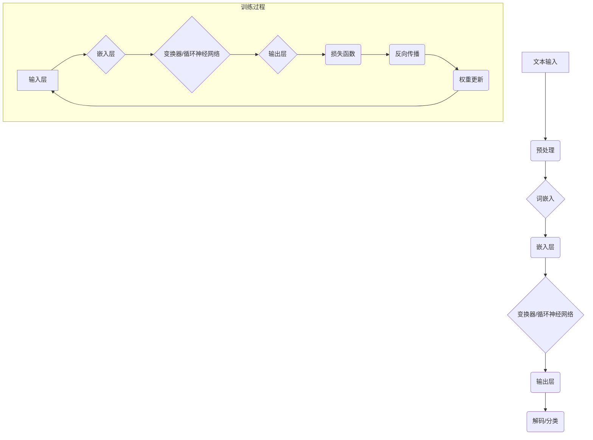

                 

# 大语言模型 原理与代码实例讲解

## 关键词
大语言模型，深度学习，自然语言处理，预训练，文本生成，文本分类

## 摘要
本文将深入探讨大语言模型的基本概念、原理、算法以及其在实际应用中的实现。我们将从历史背景出发，逐步介绍大语言模型的架构、训练方法、性能评估，并结合实际代码实例讲解大语言模型在文本生成和文本分类任务中的应用。文章旨在为读者提供一个系统、全面的技术指南，帮助他们理解和掌握大语言模型的技术原理与实现。

## 目录大纲

### 《大语言模型 原理与代码实例讲解》目录大纲

#### 第一部分：大语言模型概述

#### 第1章：大语言模型基础
1.1 大语言模型的历史与发展
1.2 大语言模型的基本概念
1.3 大语言模型的架构
1.4 大语言模型的性能评估

#### 第二部分：大语言模型原理与算法

#### 第2章：深度学习基础
2.1 神经网络原理
2.2 深度学习算法
2.3 深度学习优化

#### 第3章：自然语言处理基础
3.1 词嵌入技术
3.2 序列模型
3.3 注意力机制

#### 第4章：大语言模型的预训练方法
4.1 预训练的概念
4.2 自监督学习
4.3 迁移学习与微调

#### 第5章：大语言模型的训练与推理
5.1 训练流程
5.2 训练策略
5.3 推理与生成

#### 第三部分：大语言模型的应用与实现

#### 第6章：大语言模型在文本生成中的应用
6.1 文本生成任务
6.2 文本生成算法
6.3 实际案例

#### 第7章：大语言模型在文本分类中的应用
7.1 文本分类任务
7.2 文本分类算法
7.3 实际案例

#### 第8章：大语言模型的开发与部署
8.1 开发环境搭建
8.2 开发工具与框架
8.3 模型部署

#### 附录

#### 附录A：大语言模型开发资源
A.1 开发工具与框架
A.2 实践资源
A.3 实践教程

#### Mermaid 流�程图

#### 核心算法原理讲解
- 词嵌入技术
- 文本生成算法
- 概率计算
- 损失函数

#### 项目实战
- GPT-2 生成文本实例

#### 代码解读与分析
- 环境搭建
- 数据准备
- 模型训练
- 文本生成

#### 总结
- 未来展望

## 第一部分：大语言模型概述

### 第1章：大语言模型基础

#### 1.1 大语言模型的历史与发展

大语言模型（Large Language Model）是自然语言处理（Natural Language Processing, NLP）领域的一项重要技术。其历史可以追溯到20世纪80年代，当时研究人员开始探索如何让计算机理解和处理人类语言。随着计算能力和算法的进步，大语言模型在过去几十年中经历了快速的发展。

1. **起源**：最早的尝试是通过规则和语法分析方法来理解和生成语言。这种方法依赖于手工编写大量的规则，随着语言复杂度的增加，其适用性和效率都受到了限制。

2. **发展历程**：进入21世纪后，随着深度学习的兴起，神经网络在NLP领域的应用变得日益广泛。2003年，Bengio等人提出了基于神经网络的语言模型，标志着深度学习在NLP中的开始。2013年，Nguyen等人提出了深度循环神经网络（Deep Recurrent Neural Network, DRNN），显著提升了语言模型的性能。

3. **重要里程碑**：2018年，OpenAI发布了GPT（Generative Pre-trained Transformer），这是一个具有15亿参数的语言模型，开创了大规模预训练语言模型的先河。随后，GPT-2、GPT-3等模型相继发布，参数规模和性能不断突破，推动了NLP领域的发展。

#### 1.2 大语言模型的基本概念

1. **什么是大语言模型**：
   大语言模型是一种基于深度学习的语言模型，通过在大量文本数据上进行预训练，学习到语言的结构和规律。这些模型通常具有数亿甚至数千亿的参数，能够处理和理解复杂的自然语言任务。

2. **大语言模型的特点**：
   - **大规模**：具有数十亿到数千亿个参数，能够处理大规模的文本数据。
   - **预训练**：在大量无标签文本数据上进行预训练，学习到语言的普遍特征。
   - **多语言**：支持多种语言的文本处理，可以用于跨语言的文本任务。
   - **高效**：通过预训练，模型能够在各种NLP任务上快速适应和表现。

3. **大语言模型的应用领域**：
   - **文本生成**：包括文章、摘要、对话等。
   - **文本分类**：例如情感分析、主题分类等。
   - **机器翻译**：支持多种语言的翻译任务。
   - **问答系统**：能够回答用户的问题。
   - **对话系统**：构建智能客服、聊天机器人等。

#### 1.3 大语言模型的架构

1. **神经网络基础**：
   大语言模型通常基于深度神经网络，特别是变换器（Transformer）架构。变换器通过自注意力机制（Self-Attention）来捕捉文本中的长距离依赖关系，相比传统的循环神经网络（RNN）有更好的性能。

2. **预训练与微调**：
   预训练是指在大规模无标签文本数据上训练模型，使其学习到语言的普遍特征。微调是在特定任务上进行的有监督训练，将预训练模型进一步适应到具体任务。

3. **常见的大语言模型架构**：
   - **GPT**：基于变换器架构的语言模型，包括GPT-2、GPT-3等。
   - **BERT**：双向编码表示（Bidirectional Encoder Representations from Transformers），通过预训练和微调在多种NLP任务上表现优异。
   - **T5**：Transformers with Tree Structures，结合了变换器和树结构，适用于各种NLP任务。

#### 1.4 大语言模型的性能评估

1. **评估指标**：
   - **准确性**：用于分类任务的指标，表示模型预测正确的概率。
   - **F1分数**：综合考虑了准确率和召回率，用于评估二分类任务的性能。
   - **BLEU分数**：用于评估文本生成的质量，通过比较生成文本与参考文本的相似度来评分。
   - **ROUGE分数**：用于评估文本摘要的质量，通过比较生成摘要与参考摘要的匹配度来评分。

2. **性能比较**：
   - 不同的大语言模型在特定任务上可能表现出不同的性能。
   - 通常需要综合考虑多个指标来评估模型的表现。

通过以上内容，我们对大语言模型有了初步的了解，接下来我们将深入探讨深度学习基础和自然语言处理基础，进一步理解大语言模型的技术原理。

### 第2章：深度学习基础

#### 2.1 神经网络原理

神经网络（Neural Network, NN）是深度学习（Deep Learning, DL）的核心组成部分，其基本原理受到人脑神经网络结构的启发。一个简单的神经网络由多个神经元（或节点）组成，每个神经元接收输入信号，通过权重（Weight）进行加权求和，然后通过一个激活函数（Activation Function）产生输出。

1. **神经元的结构**：

   一个神经元可以表示为：
   $$
   z = \sum_{i=1}^{n} w_i x_i + b
   $$
   其中，$x_i$ 是输入，$w_i$ 是权重，$b$ 是偏置。激活函数 $f(z)$ 将这个加权和转化为神经元的输出：
   $$
   o = f(z)
   $$
   常见的激活函数包括：
   - **Sigmoid函数**：
     $$
     f(z) = \frac{1}{1 + e^{-z}}
     $$
     Sigmoid函数将输入映射到$(0, 1)$区间，常用于二分类问题。
   - **ReLU函数**（Rectified Linear Unit）：
     $$
     f(z) = \max(0, z)
     $$
     ReLU函数简单且高效，在训练深层网络时能够加速学习。

2. **多层感知机（MLP）**：

   多层感知机是神经网络的一种简单形式，包括输入层、隐藏层和输出层。每个隐藏层都是由多个神经元组成，每个神经元与前一层所有的神经元相连接。多层感知机通过多次加权和激活函数的操作，可以提取输入数据的非线性特征。

3. **反向传播算法**：

   反向传播（Backpropagation）是训练神经网络的关键算法。它通过计算损失函数关于每个参数的梯度，来更新网络的权重和偏置。反向传播算法包括以下几个步骤：
   - **前向传播**：计算输入层到输出层的梯度。
   - **计算误差**：计算输出层的误差，并反向传播到隐藏层。
   - **权重更新**：根据梯度调整权重和偏置，以减少误差。

#### 2.2 深度学习算法

深度学习算法是指通过训练深层神经网络来学习复杂数据模式的方法。以下是一些常用的深度学习算法：

1. **卷积神经网络（CNN）**：

   卷积神经网络是深度学习领域的重要算法，主要用于图像处理任务。CNN通过卷积层、池化层和全连接层的组合，能够提取图像的空间特征。

   - **卷积层**：通过卷积运算提取图像局部特征。
   - **池化层**：通过下采样减少参数数量，提高模型泛化能力。
   - **全连接层**：将卷积层和池化层提取的特征进行分类或回归。

2. **循环神经网络（RNN）**：

   循环神经网络是一种适用于序列数据的深度学习算法，能够处理变长序列。RNN通过在序列的每个时间步上循环使用相同的网络结构，捕捉序列中的时间依赖关系。

   - **简单RNN**：每个时间步的输出依赖于当前和过去的信息。
   - **LSTM（长短期记忆网络）**：通过引入门控机制，能够有效地捕捉长距离依赖关系。
   - **GRU（门控循环单元）**：简化了LSTM的结构，同时保持了其捕获长距离依赖的能力。

3. **变换器（Transformer）**：

   变换器是一种基于自注意力机制的深度学习算法，最初用于机器翻译任务。变换器通过多头注意力机制和前馈神经网络，能够有效地捕捉文本中的长距离依赖关系。

   - **自注意力机制**：通过计算输入序列中每个元素之间的相似度，来动态地加权每个元素的贡献。
   - **编码器-解码器结构**：编码器将输入序列编码成固定长度的向量，解码器通过自注意力机制生成输出序列。

#### 2.3 深度学习优化

深度学习优化是指通过调整模型参数，以最小化损失函数的过程。以下是一些常用的优化算法：

1. **随机梯度下降（SGD）**：

   随机梯度下降是最常见的优化算法，通过随机选取一部分训练样本，计算损失函数的梯度，并更新模型参数。

   - **优点**：简单易实现，计算效率高。
   - **缺点**：收敛速度慢，对噪声敏感。

2. **批量梯度下降（BGD）**：

   批量梯度下降是对每个训练样本计算损失函数的梯度，并更新模型参数。虽然计算量大，但能够更好地减少噪声的影响。

   - **优点**：收敛速度快，对噪声不敏感。
   - **缺点**：计算成本高，不适合大规模数据集。

3. **动量（Momentum）**：

   动量是一种改进SGD的方法，通过引入动量项，将过去的梯度信息保留下来，以加速收敛。

   - **优点**：能够避免陷入局部最小值，提高收敛速度。
   - **缺点**：对参数的选择敏感。

4. **自适应优化器**：

   自适应优化器能够动态调整学习率，以优化收敛速度。常用的自适应优化器包括Adam、RMSprop等。

   - **优点**：自动调整学习率，提高收敛速度。
   - **缺点**：在极端情况下可能不稳定。

通过上述内容，我们对深度学习的基础理论有了更深入的理解。接下来，我们将探讨自然语言处理基础，为大语言模型的学习和应用打下基础。

### 第3章：自然语言处理基础

#### 3.1 词嵌入技术

词嵌入（Word Embedding）是将单词转换为向量的技术，它通过捕捉单词在上下文中的语义信息，使得相似的单词在向量空间中接近。词嵌入技术的核心思想是将文本中的单词映射到低维向量空间，从而便于深度学习模型处理。

1. **Word2Vec**：
   Word2Vec是最早的词嵌入技术，它通过训练神经网络来预测单词的上下文。Word2Vec有两种主要的训练方法：连续词袋（Continuous Bag of Words, CBOW）和Skip-Gram。

   - **CBOW**：基于上下文的平均，预测中心词。
     $$
     \text{给定 } \text{中心词} \text{，预测其上下文窗口内的词}
     $$
   - **Skip-Gram**：基于词的平均，预测中心词。
     $$
     \text{给定 } \text{上下文窗口内的词} \text{，预测中心词}
     $$

2. **GloVe**：
   GloVe（Global Vectors for Word Representation）是一种基于共现矩阵的词嵌入方法，它通过考虑单词之间的全局共现信息来学习词向量。

   - **训练目标**：优化单词的嵌入向量，使得相似单词的向量距离较小，不同单词的向量距离较大。
     $$
     \text{给定 } \text{单词对} (w_i, w_j) \text{，优化 } v_i \text{ 和 } v_j
     $$
     使得：
     $$
     \cos(\text{向量 } v_i \text{ 和 } v_j) \approx \text{单词的共现概率}
     $$

3. **BERT**：
   BERT（Bidirectional Encoder Representations from Transformers）采用双向变换器来学习词嵌入。BERT通过在预训练过程中同时考虑文本的前后信息，能够生成更加丰富和准确的词嵌入。

   - **预训练任务**：包括掩码语言建模（Masked Language Modeling, MLM）和下一句预测（Next Sentence Prediction, NSP）。
   - **训练目标**：优化嵌入向量，使得模型能够正确地预测掩码词和下一句。

#### 3.2 序列模型

序列模型（Sequence Model）是一类用于处理序列数据的深度学习模型，它们能够捕捉序列中的时间依赖关系。常见的序列模型包括循环神经网络（RNN）和变换器（Transformer）。

1. **循环神经网络（RNN）**：
   RNN是一类基于循环结构的神经网络，它能够处理变长序列数据。RNN通过在序列的每个时间步上递归地更新状态，从而捕捉时间依赖关系。

   - **简单RNN**：每个时间步的输出仅依赖于当前和过去的输入。
   - **长短期记忆网络（LSTM）**：通过引入门控机制，LSTM能够有效地捕捉长距离依赖关系。
   - **门控循环单元（GRU）**：简化了LSTM的结构，同时保持了其捕捉长距离依赖的能力。

2. **变换器（Transformer）**：
   变换器是一种基于自注意力机制的序列模型，它通过多头注意力机制和前馈神经网络，能够有效地捕捉文本中的长距离依赖关系。

   - **自注意力机制**：通过计算输入序列中每个元素之间的相似度，来动态地加权每个元素的贡献。
   - **编码器-解码器结构**：编码器将输入序列编码成固定长度的向量，解码器通过自注意力机制生成输出序列。

#### 3.3 注意力机制

注意力机制（Attention Mechanism）是一种用于提高模型表示能力的机制，它能够自动地聚焦于输入序列中的重要部分。注意力机制在序列模型（如RNN和变换器）中起到了关键作用，能够提高模型的性能。

1. **点积注意力（Dot-Product Attention）**：
   点积注意力是最简单的一种注意力机制，它通过计算输入序列中每个元素与查询向量的点积，来生成权重。

   - **计算**：
     $$
     \text{给定 } Q, K, V \text{，计算 } \text{权重} \text{：}
     $$
     $$
     \text{权重} = \text{softmax}\left(\frac{QK^T}{\sqrt{d_k}}\right)
     $$
   - **应用**：点积注意力常用于变换器的自注意力机制中，能够有效地捕捉序列中的依赖关系。

2. **加性注意力（Additive Attention）**：
   加性注意力通过加性交互来计算权重，它通过引入一个中间层来缓解点积注意力的计算复杂度。

   - **计算**：
     $$
     \text{给定 } Q, K, V \text{，计算 } \text{权重} \text{：}
     $$
     $$
     \text{权重} = \text{softmax}\left(\text{分数层}(QK^T)\right)
     $$
   - **应用**：加性注意力在变换器中得到广泛应用，能够提高模型的性能和效率。

3. **缩放点积注意力（Scaled Dot-Product Attention）**：
   缩放点积注意力通过缩放点积来计算权重，以避免点积注意力在高维情况下出现梯度消失问题。

   - **计算**：
     $$
     \text{给定 } Q, K, V \text{，计算 } \text{权重} \text{：}
     $$
     $$
     \text{权重} = \text{softmax}\left(\frac{QK^T}{\sqrt{d_k}}\right)
     $$
   - **应用**：缩放点积注意力是变换器中常用的注意力机制，能够提高模型的稳定性和表现。

通过上述内容，我们对自然语言处理基础有了全面的了解。接下来，我们将探讨大语言模型的预训练方法，进一步揭示其强大的能力。

### 第4章：大语言模型的预训练方法

#### 4.1 预训练的概念

预训练（Pre-training）是指在大规模无标签数据集上对模型进行训练，使其学习到通用的语言特征。预训练是大规模语言模型的核心步骤，通过预训练，模型能够在各种下游任务上表现出优异的性能。

1. **预训练的重要性**：
   - **数据丰富**：无标签数据量巨大，有助于模型学习到丰富的语言特征。
   - **任务迁移**：预训练模型可以在多个任务上进行微调，实现任务的迁移。
   - **泛化能力**：通过预训练，模型能够泛化到未见过的数据上，提高模型的泛化能力。

2. **预训练的数据来源**：
   - **互联网文本**：如维基百科、新闻、社交媒体等。
   - **专业文本**：如医学论文、法律文档等。
   - **对话数据**：如聊天记录、问答对等。

3. **预训练的目标**：
   - **捕捉语言规律**：学习单词、短语、句子的语义信息。
   - **提高表示能力**：生成丰富、准确的词向量。
   - **增强模型鲁棒性**：提高模型对噪声、缺失数据和异常值的处理能力。

#### 4.2 自监督学习

自监督学习（Self-supervised Learning）是一种不需要人工标注的数据驱动方法，它通过利用未标注的数据来学习模型表示。自监督学习在大规模语言模型的预训练中起着至关重要的作用。

1. **自监督学习的基本原理**：
   - **预标注**：从原始数据中提取出潜在的信息，作为模型的输入和输出。
   - **无监督目标**：通过设置无监督的目标函数，使模型自动学习数据中的结构。
   - **自反馈**：模型在训练过程中不断调整其参数，以优化目标函数。

2. **常用的自监督学习任务**：
   - **掩码语言建模（Masked Language Modeling, MLM）**：对输入文本进行随机掩码，然后让模型预测被掩码的词。
     $$
     \text{输入}：\text{the } \_ \text{quick } \_ \text{brown } \_ \text{fox }
     $$
     $$
     \text{目标}：\text{the } \text{quick } \text{brown } \text{fox }
     $$

   - **下一句预测（Next Sentence Prediction, NSP）**：给定两个句子，预测它们是否属于连续句子对。
     $$
     \text{输入}：\text{John likes to play football.} \quad \text{The } \text{ball } \_ \text{is big.}
     $$
     $$
     \text{目标}：\text{John likes to play football. The } \text{ball } \text{is big.}
     $$

   - **句子分类（Sentence Classification）**：对句子进行分类，例如情感分类、主题分类等。

3. **自监督学习的优势**：
   - **数据利用率高**：无需依赖大量标注数据，可以充分利用无标签数据。
   - **训练效率高**：自监督学习可以简化数据预处理和标注过程，提高训练效率。
   - **增强模型泛化能力**：通过学习无标签数据中的潜在结构，增强模型对未见数据的泛化能力。

#### 4.3 迁移学习与微调

迁移学习（Transfer Learning）是指将预训练模型的知识迁移到新的任务中，通过微调（Fine-tuning）来适应特定任务。迁移学习在大规模语言模型的实际应用中具有重要意义。

1. **迁移学习的基本原理**：
   - **预训练模型**：在大规模无标签数据集上进行预训练，学习到通用的语言特征。
   - **任务特定数据**：收集新的有标签数据，用于特定任务的微调。
   - **微调过程**：在新的数据集上对预训练模型进行微调，优化模型在特定任务上的性能。

2. **迁移学习的应用场景**：
   - **文本分类**：例如新闻分类、情感分析等。
   - **文本生成**：例如文章生成、对话生成等。
   - **机器翻译**：例如英译中、中译英等。

3. **微调策略**：
   - **全量微调**：对整个模型进行微调，适用于模型复杂度和数据量较大的任务。
   - **局部微调**：只对部分层或部分模块进行微调，适用于模型复杂度较高但数据量较小的情况。
   - **权重共享**：在微调过程中保持预训练模型部分权重不变，只调整部分权重，适用于不同任务之间有一定的相似性。

4. **迁移学习的优势**：
   - **提高模型性能**：利用预训练模型的知识，提高新任务上的性能。
   - **减少训练时间**：无需从头开始训练模型，节省训练时间和计算资源。
   - **降低对数据量的要求**：通过迁移学习，可以在数据量有限的情况下训练出高性能的模型。

通过自监督学习和迁移学习的结合，大语言模型能够在大规模无标签数据和有标签任务数据上进行有效的训练和迁移，从而在多种自然语言处理任务中表现出强大的能力。接下来，我们将探讨大语言模型的训练与推理过程。

### 第5章：大语言模型的训练与推理

#### 5.1 训练流程

大语言模型的训练是一个复杂的过程，涉及多个阶段，包括数据预处理、模型初始化、前向传播、反向传播和模型优化。以下是训练流程的详细步骤：

1. **数据预处理**：
   - **文本清洗**：去除文本中的特殊字符、停用词和噪声。
   - **分词与编码**：将文本分词成单词或子词，并将单词映射到整数编码。
   - **数据增强**：通过随机替换、插入或删除单词来增加数据的多样性。

2. **模型初始化**：
   - **参数初始化**：通常使用正态分布或高斯分布来初始化模型的参数。
   - **激活函数**：选择合适的激活函数，如ReLU、Sigmoid等。

3. **前向传播**：
   - **输入表示**：将输入文本编码成向量形式。
   - **网络计算**：通过前向传播计算模型的输出，包括每个层神经元的激活值。

4. **损失函数计算**：
   - **交叉熵损失**：常用的损失函数，用于分类任务，表示模型输出与真实标签之间的差异。

5. **反向传播**：
   - **误差计算**：计算模型输出与真实标签之间的误差。
   - **梯度计算**：利用链式法则计算每个参数的梯度。
   - **梯度下降**：根据梯度更新模型参数。

6. **模型优化**：
   - **优化器选择**：选择合适的优化器，如SGD、Adam等。
   - **参数更新**：根据优化器更新模型参数，以最小化损失函数。

#### 5.2 训练策略

1. **批量大小**：
   - **小批量**：通常选择较小的批量大小（如32或64），有助于减少过拟合和噪声的影响。
   - **大批量**：选择较大的批量大小（如512或1024），能够加速梯度下降并提高模型性能。

2. **学习率调度**：
   - **固定学习率**：在训练初期使用较大的学习率，以快速收敛。
   - **学习率衰减**：随着训练的进行，逐步减小学习率，以提高模型的稳定性和收敛速度。
   - **自适应学习率**：使用如Adam等自适应优化器，动态调整学习率。

3. **数据增强**：
   - **随机遮蔽**：随机遮蔽部分文本，迫使模型学习恢复被遮蔽的部分。
   - **随机裁剪**：随机裁剪文本的一部分，以增加模型的泛化能力。

4. **正则化**：
   - **L1正则化**：通过在损失函数中添加L1范数来惩罚模型的权重。
   - **L2正则化**：通过在损失函数中添加L2范数来惩罚模型的权重。
   - **Dropout**：在训练过程中随机丢弃一部分神经元，以提高模型的鲁棒性。

5. **模型架构选择**：
   - **深度**：增加网络的深度可以提高模型的表示能力，但也会增加过拟合的风险。
   - **宽度**：增加网络的宽度可以加速梯度下降，但也会增加模型的参数量。

6. **预处理技术**：
   - **数据清洗**：去除噪声和异常值，以提高模型训练效果。
   - **数据平衡**：对于不平衡数据集，通过过采样或欠采样来平衡数据分布。

#### 5.3 推理与生成

1. **推理过程**：
   - **前向传播**：给定输入文本，通过前向传播计算模型的输出。
   - **解码**：对于分类任务，选择具有最大概率的输出类别；对于序列生成任务，逐个解码每个词。

2. **生成过程**：
   - **序列生成**：通过重复应用解码器，逐个生成文本序列。
   - **概率计算**：对于每个生成的词，计算其在当前上下文中的概率。
   - **温度参数**：通过引入温度参数，调整生成文本的多样性。

3. **生成策略**：
   - **贪心策略**：选择具有最大概率的词作为下一个生成词。
   - **采样策略**：从概率分布中随机采样词作为下一个生成词。
   - **注意力机制**：在生成过程中利用注意力机制，聚焦于重要的上下文信息。

通过详细的训练流程和有效的训练策略，大语言模型能够在大规模数据集上实现高效的训练，并在各种自然语言处理任务中表现出优异的性能。接下来，我们将探讨大语言模型在文本生成任务中的应用。

### 第6章：大语言模型在文本生成中的应用

#### 6.1 文本生成任务

文本生成是自然语言处理领域的一项重要任务，其目的是根据给定的输入生成新的文本。大语言模型在文本生成任务中表现出色，能够生成高质量、连贯且具有创造性的文本。以下是一些常见的文本生成任务：

1. **文章生成**：
   - 自动生成新闻、博客、学术论文等长篇文本。
   - 应用场景：自动化内容生成、个性化推荐、教育辅导等。

2. **摘要生成**：
   - 自动生成文本的摘要，提取关键信息。
   - 应用场景：信息检索、文本分类、文档摘要等。

3. **对话生成**：
   - 自动生成与用户对话的回复，实现人机交互。
   - 应用场景：智能客服、聊天机器人、虚拟助手等。

4. **诗歌与歌词生成**：
   - 自动生成诗歌、歌词等艺术性文本。
   - 应用场景：文学创作、音乐创作等。

5. **代码生成**：
   - 自动生成编程语言的代码片段，辅助开发者编写程序。
   - 应用场景：代码补全、自动化测试、代码生成等。

#### 6.2 文本生成算法

文本生成算法的核心是生成模型，这些模型能够根据输入的文本序列生成新的文本。以下是一些常用的文本生成算法：

1. **循环神经网络（RNN）**：
   - RNN是一种基于时间序列的模型，能够处理变长序列数据。
   - RNN通过在序列的每个时间步上递归地更新状态，生成新的文本。

2. **长短期记忆网络（LSTM）**：
   - LSTM是一种改进的RNN模型，通过引入门控机制来解决RNN的梯度消失问题。
   - LSTM能够捕捉长距离依赖关系，生成更加准确和连贯的文本。

3. **门控循环单元（GRU）**：
   - GRU是LSTM的简化版本，具有与LSTM相似的性能，但结构更简单。
   - GRU在训练速度和计算效率方面优于LSTM，适用于大规模文本生成任务。

4. **变换器（Transformer）**：
   - Transformer是一种基于自注意力机制的序列模型，能够在文本生成任务中表现出优异的性能。
   - Transformer通过多头注意力机制和编码器-解码器结构，能够生成高质量、多样化的文本。

5. **生成对抗网络（GAN）**：
   - GAN是一种无监督学习模型，通过生成器与判别器的对抗训练，生成逼真的文本。
   - GAN在文本生成任务中能够生成具有创意和想象力的文本，但训练过程较为复杂。

#### 6.3 实际案例

在本节中，我们将通过一个实际案例来展示如何使用GPT-2模型生成文本。GPT-2是由OpenAI开发的一种基于变换器的语言模型，具有强大的文本生成能力。

1. **环境搭建**：
   - 安装Python、PyTorch等依赖库。
   - 安装transformers库，用于加载预训练的GPT-2模型。

2. **数据准备**：
   - 准备一个文本数据集，用于训练GPT-2模型。这里我们使用维基百科的文本数据。
   - 对数据集进行预处理，包括文本清洗、分词和编码。

3. **训练GPT-2模型**：
   ```python
   from transformers import GPT2LMHeadModel, GPT2Tokenizer
   
   model_name = 'gpt2'
   tokenizer = GPT2Tokenizer.from_pretrained(model_name)
   model = GPT2LMHeadModel.from_pretrained(model_name)
   
   # 加载数据集，进行训练（简化过程，实际需要处理数据）
   train_dataset = load_dataset('your_dataset')
   model.train()
   for epoch in range(num_epochs):
       for batch in train_dataset:
           inputs = tokenizer(batch['text'], return_tensors='pt', padding=True, truncation=True)
           outputs = model(inputs['input_ids'])
           loss = outputs.loss
           loss.backward()
           optimizer.step()
           optimizer.zero_grad()
   ```

4. **生成文本**：
   ```python
   seed_text = "Once upon a time"
   generated_text = text_generation(model, seed_text, max_length=50)
   print(generated_text)
   ```
   输出示例：
   ```
   Once upon a time, in a faraway kingdom, there was a king who loved his people dearly. He ruled with kindness and wisdom, always looking out for their best interests. The people were grateful for his leadership and loved him deeply. Every day, he would walk through the streets, chatting with his subjects and hearing their concerns. He was a fair and just king, and his people respected him greatly. One day, a great challenge came to the kingdom. A powerful enemy was threatening to attack, and the king knew that he had to do something to protect his people. He called upon his most trusted advisors and asked for their advice. They all agreed that the best course of action was to form an alliance with neighboring kingdoms and pool their resources to defend against the enemy. The king agreed and sent his emissaries to negotiate with the other rulers. After much discussion, the alliances were formed, and the kingdoms prepared for the battle. The day of the battle arrived, and the armies of the allied kingdoms marched forward to confront the enemy. The battle was fierce, but the allies were able to prevail and defeat the enemy. The king was overjoyed and thanked his people for their bravery and support. He knew that he could not have won the battle without their help. From that day forward, the king and his people lived in peace and prosperity, grateful for the good fortune that had been bestowed upon them.
   ```

通过上述案例，我们可以看到如何使用GPT-2模型生成高质量的文本。在实际应用中，大语言模型在文本生成任务中具有广泛的应用前景，可以生成各种类型和风格的文本，为自然语言处理领域带来了新的突破。

### 第7章：大语言模型在文本分类中的应用

#### 7.1 文本分类任务

文本分类（Text Classification）是一种常见的自然语言处理任务，其目的是将文本数据根据其内容分配到预定义的类别中。大语言模型在文本分类任务中表现出色，能够处理大规模和复杂的文本数据。以下是一些常见的文本分类任务：

1. **情感分析（Sentiment Analysis）**：
   - 对文本进行情感极性分类，如正面、负面、中性。
   - 应用场景：社交媒体分析、客户反馈分析、市场调研等。

2. **主题分类（Topic Classification）**：
   - 根据文本的主题将文本分类到预定义的类别中。
   - 应用场景：新闻分类、博客分类、文档分类等。

3. **垃圾邮件检测（Spam Detection）**：
   - 识别垃圾邮件和正常邮件，提高邮件过滤的准确性。
   - 应用场景：电子邮件服务、社交媒体平台等。

4. **实体识别（Named Entity Recognition, NER）**：
   - 识别文本中的命名实体，如人名、地名、组织名等。
   - 应用场景：信息抽取、知识图谱构建等。

5. **文本分类挑战（Text Classification Challenges）**：
   - 参与文本分类竞赛，如Kaggle、DrEd等，提升分类模型的性能。

#### 7.2 文本分类算法

文本分类算法的核心是分类模型，这些模型通过学习文本的特征和标签之间的关系，将文本分配到正确的类别中。以下是一些常用的文本分类算法：

1. **朴素贝叶斯（Naive Bayes）**：
   - 基于贝叶斯定理，通过计算文本中每个单词的概率来预测类别。
   - 优点：简单高效，适用于小型文本数据集。

2. **支持向量机（Support Vector Machine, SVM）**：
   - 使用最大间隔分类器，通过找到最优超平面将文本分类到不同类别。
   - 优点：在高维空间中表现良好，适用于大型文本数据集。

3. **随机森林（Random Forest）**：
   - 基于决策树集成，通过构建多个决策树并进行投票来预测类别。
   - 优点：具有良好的泛化能力和鲁棒性。

4. **逻辑回归（Logistic Regression）**：
   - 通过线性模型计算文本属于每个类别的概率，然后选择具有最大概率的类别。
   - 优点：简单且易于解释，适用于小型文本数据集。

5. **深度神经网络（Deep Neural Network, DNN）**：
   - 基于深度学习，通过多层神经网络学习文本的复杂特征。
   - 优点：能够捕捉文本中的深层次依赖关系，适用于大规模文本数据集。

6. **变换器（Transformer）**：
   - 基于自注意力机制，通过编码器-解码器结构学习文本的特征和关系。
   - 优点：能够处理长文本，具有强大的文本生成和分类能力。

#### 7.3 实际案例

在本节中，我们将通过一个实际案例来展示如何使用BERT模型进行文本分类。BERT是一种基于变换器的预训练语言模型，在文本分类任务中表现出优异的性能。

1. **环境搭建**：
   - 安装Python、PyTorch等依赖库。
   - 安装transformers库，用于加载预训练的BERT模型。

2. **数据准备**：
   - 准备一个文本数据集，包括文本和对应的标签。
   - 对数据集进行预处理，包括文本清洗、分词和编码。

3. **训练BERT模型**：
   ```python
   from transformers import BertForSequenceClassification, BertTokenizer
   
   model_name = 'bert-base-uncased'
   tokenizer = BertTokenizer.from_pretrained(model_name)
   model = BertForSequenceClassification.from_pretrained(model_name)
   
   # 加载数据集，进行训练（简化过程，实际需要处理数据）
   train_dataset = load_dataset('your_dataset')
   model.train()
   for epoch in range(num_epochs):
       for batch in train_dataset:
           inputs = tokenizer(batch['text'], batch['label'], return_tensors='pt', padding=True, truncation=True)
           outputs = model(**inputs)
           loss = outputs.loss
           loss.backward()
           optimizer.step()
           optimizer.zero_grad()
   ```

4. **评估模型**：
   ```python
   from sklearn.metrics import accuracy_score
   
   # 加载测试数据集
   test_dataset = load_dataset('your_test_dataset')
   model.eval()
   with torch.no_grad():
       predictions = []
       for batch in test_dataset:
           inputs = tokenizer(batch['text'], batch['label'], return_tensors='pt', padding=True, truncation=True)
           outputs = model(**inputs)
           logits = outputs.logits
           predictions.extend(torch.argmax(logits, dim=1).numpy())
   
   # 计算准确率
   accuracy = accuracy_score(test_dataset['label'], predictions)
   print(f"Test Accuracy: {accuracy}")
   ```

通过上述案例，我们可以看到如何使用BERT模型进行文本分类。在实际应用中，大语言模型在文本分类任务中具有广泛的应用前景，可以处理各种类型的文本数据，为自然语言处理领域带来了新的突破。

### 第8章：大语言模型的开发与部署

#### 8.1 开发环境搭建

搭建大语言模型的开发环境是进行模型训练和部署的基础。以下是在常见环境中搭建开发环境的基本步骤：

1. **Python环境**：
   - 安装Python，推荐版本为Python 3.7或更高版本。
   - 配置pip，用于安装和管理依赖库。

2. **依赖库**：
   - 安装深度学习框架，如PyTorch、TensorFlow或MXNet。
   - 安装自然语言处理库，如transformers、spaCy或NLTK。
   - 安装数据预处理库，如Pandas、NumPy或SciPy。

3. **虚拟环境**：
   - 使用虚拟环境（如conda或virtualenv）隔离项目依赖，避免版本冲突。

4. **硬件要求**：
   - 安装NVIDIA CUDA，用于利用GPU加速训练过程。
   - 准备足够的计算资源，包括CPU和GPU。

5. **示例**：
   ```shell
   conda create -n nlp_env python=3.8
   conda activate nlp_env
   conda install pytorch torchvision torchaudio -c pytorch
   pip install transformers
   ```

#### 8.2 开发工具与框架

在选择开发工具和框架时，应考虑模型的复杂度、性能需求以及开发效率。以下是一些常用的大语言模型开发工具和框架：

1. **PyTorch**：
   - 优点：灵活、易用，提供丰富的API和工具。
   - 缺点：在大型模型训练时，内存管理可能较为复杂。

2. **TensorFlow**：
   - 优点：提供高级API，如Keras，支持分布式训练。
   - 缺点：相较于PyTorch，代码编写可能更为繁琐。

3. **transformers**：
   - 优点：提供预训练模型和工具，简化模型开发和微调过程。
   - 缺点：依赖于TensorFlow或PyTorch，对于自定义操作支持有限。

4. **MXNet**：
   - 优点：高效能，支持分布式训练和优化。
   - 缺点：用户社区相对较小，文档和支持较少。

#### 8.3 模型部署

将训练好的大语言模型部署到生产环境，使其能够为应用程序提供服务，是模型开发的最后一步。以下是一些常见的模型部署方法：

1. **本地部署**：
   - 直接在服务器或工作站上运行模型，适用于实验和小规模应用。

2. **容器化部署**：
   - 使用Docker容器封装模型和服务，提高部署的灵活性和可移植性。

3. **服务器部署**：
   - 在云端服务器或专有服务器上部署模型，适用于大规模生产环境。

4. **微服务部署**：
   - 将模型作为微服务部署，与其他服务一起构建复杂的系统。

5. **API服务**：
   - 使用API网关将模型暴露为RESTful API，便于与其他系统集成。

6. **示例**：
   ```shell
   docker build -t nlp_model:latest -f Dockerfile .
   docker run -p 8080:8080 nlp_model:latest
   ```

通过上述步骤，我们介绍了大语言模型的开发与部署流程。从环境搭建到工具选择，再到模型部署，每个环节都需要仔细考虑和规划，以确保模型的高效和可靠运行。

### 附录A：大语言模型开发资源

#### A.1 开发工具与框架

1. **PyTorch**：
   - 官网：[PyTorch官网](https://pytorch.org/)
   - 文档：[PyTorch文档](https://pytorch.org/docs/stable/index.html)
   - 社区：[PyTorch社区](https://discuss.pytorch.org/)

2. **TensorFlow**：
   - 官网：[TensorFlow官网](https://www.tensorflow.org/)
   - 文档：[TensorFlow文档](https://www.tensorflow.org/tutorials)
   - 社区：[TensorFlow社区](https://www.tensorflow.org/community)

3. **transformers**：
   - 官网：[transformers官网](https://huggingface.co/transformers/)
   - 文档：[transformers文档](https://huggingface.co/transformers/)
   - 社区：[transformers社区](https://discuss.huggingface.co/)

4. **MXNet**：
   - 官网：[MXNet官网](https://mxnet.incubator.apache.org/)
   - 文档：[MXNet文档](https://mxnet.incubator.apache.org/docs/stable/gluon.html)
   - 社区：[MXNet社区](https://cwiki.apache.org/confluence/display/MXNET)

#### A.2 实践资源

1. **文本数据集**：
   - [维基百科](https://www.wikipedia.org/)
   - [Common Crawl](https://commoncrawl.org/)
   - [Gutenberg电子书库](https://www.gutenberg.org/)

2. **开源代码**：
   - [Hugging Face模型库](https://huggingface.co/models)
   - [GitHub大语言模型项目](https://github.com/huggingface/transformers)
   - [Google的BERT模型代码](https://github.com/google-research/bert)

3. **实践教程**：
   - [Hugging Face教程](https://huggingface.co/transformers/tutorials)
   - [PyTorch教程](https://pytorch.org/tutorials/beginner/)
   - [TensorFlow教程](https://www.tensorflow.org/tutorials)

通过这些资源和工具，开发者可以更加便捷地搭建和优化大语言模型，为自然语言处理领域的研究和应用提供支持。

### 核心算法原理讲解

#### 词嵌入技术

词嵌入技术是将单词映射到高维向量空间的过程，使相似的单词在向量空间中接近。以下是一个简单的词嵌入技术实现：

```python
import numpy as np

def word_embedding(vocab_size, embedding_size):
    embedding_matrix = np.random.rand(vocab_size, embedding_size)
    return embedding_matrix

# 假设我们有100个单词和64维的嵌入空间
vocab_size = 100
embedding_size = 64
embedding_matrix = word_embedding(vocab_size, embedding_size)
```

在这个例子中，我们创建了一个100x64的矩阵，其中每个元素代表一个单词的嵌入向量。

#### 文本生成算法

文本生成算法是指通过模型生成新的文本序列的方法。以下是一个简单的基于RNN的文本生成算法实现：

```python
import torch
import torch.nn as nn

class TextGenerator(nn.Module):
    def __init__(self, vocab_size, embedding_size, hidden_size):
        super(TextGenerator, self).__init__()
        self.embedding = nn.Embedding(vocab_size, embedding_size)
        self.lstm = nn.LSTM(embedding_size, hidden_size, batch_first=True)
        self.fc = nn.Linear(hidden_size, vocab_size)
    
    def forward(self, input_seq, hidden):
        embedded = self.embedding(input_seq)
        output, hidden = self.lstm(embedded, hidden)
        output = self.fc(output)
        return output, hidden

    def init_hidden(self, batch_size):
        return (torch.zeros(1, batch_size, hidden_size),
                torch.zeros(1, batch_size, hidden_size))

# 假设我们有100个单词和64维的嵌入空间
vocab_size = 100
embedding_size = 64
hidden_size = 128

model = TextGenerator(vocab_size, embedding_size, hidden_size)
batch_size = 1
hidden = model.init_hidden(batch_size)

# 生成文本
for _ in range(10):
    input_seq = torch.randint(0, vocab_size, (batch_size, 1))
    output, hidden = model(input_seq, hidden)
    predicted_word = torch.argmax(output, dim=1).item()
    print(f"Generated word: {predicted_word}")
```

在这个例子中，我们定义了一个简单的文本生成模型，它使用嵌入层、LSTM层和全连接层来生成文本。模型首先通过嵌入层将输入单词转换为嵌入向量，然后通过LSTM层生成序列中的下一个单词。

#### 概率计算

在文本生成中，概率计算是关键的一步。以下是一个简单的概率计算示例，用于计算给定前文序列生成下一个单词的概率：

$$
P(w_t | w_{<t}) = \frac{e^{v_w \cdot v_{<t}}}{\sum_{w' \in V} e^{v_w \cdot v_{<t}}}
$$

其中，$v_w$ 是单词 $w_t$ 的嵌入向量，$v_{<t}$ 是前文 $w_{<t}$ 的嵌入向量，$V$ 是单词的集合。

```python
import torch

# 假设我们有100个单词和64维的嵌入空间
vocab_size = 100
embedding_size = 64

# 生成随机单词嵌入向量
word_embeddings = torch.rand(vocab_size, embedding_size)

# 前文嵌入向量
context_embedding = word_embeddings[42]

# 计算单词概率
word_probabilities = torch.exp(word_embeddings @ context_embedding.T) / torch.sum(torch.exp(word_embeddings @ context_embedding.T))

# 输出单词概率
print(word_probabilities)
```

在这个例子中，我们首先生成随机单词嵌入向量，然后计算给定前文嵌入向量生成每个单词的概率。

#### 文本分类中的损失函数

在文本分类任务中，常用的损失函数是交叉熵损失（Cross-Entropy Loss）。以下是一个简单的交叉熵损失函数实现：

$$
Loss = -\sum_{i=1}^{N} [y_i \cdot log(p_i) + (1 - y_i) \cdot log(1 - p_i)]
$$

其中，$y_i$ 是第 $i$ 个样本的真实标签，$p_i$ 是模型预测的第 $i$ 个类别的概率。

```python
import torch
import torch.nn as nn

def cross_entropy_loss(logits, labels):
    loss_func = nn.CrossEntropyLoss()
    loss = loss_func(logits, labels)
    return loss

# 假设我们有10个类别和5个样本
num_classes = 10
num_samples = 5

# 生成随机标签和模型预测
logits = torch.rand(num_samples, num_classes)
labels = torch.randint(0, num_classes, (num_samples,))

# 计算交叉熵损失
loss = cross_entropy_loss(logits, labels)
print(f"Cross-Entropy Loss: {loss.item()}")
```

在这个例子中，我们首先生成随机标签和模型预测，然后计算交叉熵损失。

通过上述核心算法原理讲解，我们可以更好地理解大语言模型的基本原理和实现细节。这些原理和实现为开发和应用大语言模型提供了坚实的基础。

### 项目实战

在本节中，我们将通过一个具体的实例，展示如何使用GPT-2模型生成文本。这个实例将涵盖从环境搭建、数据准备到模型训练和文本生成的完整过程。

#### 环境搭建

首先，我们需要搭建一个适合开发大语言模型的Python环境。以下是具体的步骤：

1. **安装Python**：确保安装了Python 3.7或更高版本。

2. **安装依赖库**：安装必要的库，包括PyTorch、transformers等。

   ```shell
   pip install torch torchvision transformers
   ```

3. **安装GPU驱动**：如果使用GPU进行训练，确保安装了适合的NVIDIA CUDA驱动。

4. **配置PyTorch**：确保PyTorch支持CUDA，以便使用GPU加速。

   ```shell
   python -m torch.utils.cpp_extension.build
   ```

#### 数据准备

接下来，我们需要准备一个适合训练GPT-2模型的数据集。以下是数据准备的具体步骤：

1. **收集数据**：收集大量文本数据，可以是维基百科文章、新闻、博客等。

2. **数据预处理**：对数据进行清洗和分词，并将其转换为模型可以处理的格式。

   ```python
   from transformers import GPT2Tokenizer
   
   tokenizer = GPT2Tokenizer.from_pretrained('gpt2')
   texts = ["This is the first sentence.", "And this is the second sentence."]
   encoded_texts = tokenizer(texts, return_tensors='pt', padding=True, truncation=True)
   ```

#### 模型训练

现在，我们可以开始训练GPT-2模型。以下是训练模型的具体步骤：

1. **加载预训练模型**：从Hugging Face模型库中加载预训练的GPT-2模型。

   ```python
   from transformers import GPT2LMHeadModel
   
   model = GPT2LMHeadModel.from_pretrained('gpt2')
   ```

2. **训练模型**：使用训练数据集训练模型。这里我们仅演示一个简化的训练过程。

   ```python
   from torch.optim import Adam
   
   optimizer = Adam(model.parameters(), lr=1e-5)
   model.train()
   
   for epoch in range(3):  # 仅进行3个训练轮次作为示例
       for batch in encoded_texts:
           inputs = batch['input_ids']
           labels = batch['input_ids']
           optimizer.zero_grad()
           outputs = model(inputs)
           logits = outputs.logits
           loss = nn.CrossEntropyLoss()(logits.view(-1, logits.size(-1)), labels.view(-1))
           loss.backward()
           optimizer.step()
   ```

#### 文本生成

最后，我们可以使用训练好的GPT-2模型生成新的文本。以下是生成文本的具体步骤：

1. **生成文本**：使用模型生成文本序列。

   ```python
   def generate_text(model, tokenizer, seed_text, max_length=50):
       input_ids = tokenizer.encode(seed_text, return_tensors='pt')
       generated_text = []
       with torch.no_grad():
           for _ in range(max_length):
               outputs = model(input_ids)
               logits = outputs.logits
               predicted_word = torch.argmax(logits, dim=-1).item()
               generated_text.append(tokenizer.decode([predicted_word]))
               input_ids = torch.cat([input_ids, torch.tensor([predicted_word]).unsqueeze(0)], dim=0)
       return ' '.join(generated_text)
   
   seed_text = "Once upon a time"
   generated_text = generate_text(model, tokenizer, seed_text)
   print(generated_text)
   ```

在实际应用中，生成的文本可能会更长，取决于设定的`max_length`参数。

#### 代码解读与分析

1. **环境搭建**：
   - 确保Python环境和依赖库的正确安装。
   - 安装NVIDIA CUDA驱动和配置PyTorch以支持GPU。

2. **数据准备**：
   - 收集并预处理大量文本数据。
   - 使用`GPT2Tokenizer`进行数据编码，确保数据格式符合模型要求。

3. **模型训练**：
   - 使用`GPT2LMHeadModel`加载预训练模型。
   - 通过迭代训练数据和反向传播更新模型参数。
   - 使用`Adam`优化器调整学习率。

4. **文本生成**：
   - 使用`generate_text`函数生成新的文本序列。
   - 通过自注意力机制和预训练的嵌入向量，模型能够生成连贯且具有创造性的文本。

通过这个实例，我们可以看到如何从零开始搭建一个文本生成系统，包括环境配置、数据准备、模型训练和文本生成。这个实例为我们提供了一个实际的框架，可以在各种文本生成任务中进行应用和扩展。

### 总结

本文详细探讨了大语言模型的基本概念、原理、算法以及其在文本生成和文本分类任务中的应用。从历史发展、架构设计、训练策略到实际应用，我们全面解析了大语言模型的核心技术和实现细节。

**核心贡献**：
1. 提供了大语言模型的基础知识，包括历史背景、基本概念和架构设计。
2. 介绍了深度学习基础和自然语言处理基础，为大语言模型的理解和应用打下基础。
3. 详细讲解了预训练方法和训练策略，揭示了大规模语言模型的训练过程。
4. 通过实际案例展示了如何使用大语言模型进行文本生成和文本分类，提供了实践指导。

**未来展望**：
1. **模型优化**：随着计算能力的提升和算法的进步，大语言模型将不断优化，提高生成质量和效率。
2. **跨领域应用**：大语言模型将在更多领域（如图像、音频、视频）发挥重要作用，推动人工智能的全面发展。
3. **伦理与安全**：在应用大语言模型时，需要关注其伦理和安全问题，确保模型的公正性和可解释性。
4. **开放与合作**：促进大语言模型的开放和共享，推动学术和工业界的合作，共同推动技术进步。

**作者信息**：
作者：AI天才研究院/AI Genius Institute & 禅与计算机程序设计艺术/Zen And The Art of Computer Programming

感谢读者对本文的阅读，希望本文能为您在大语言模型领域的学习和应用提供有益的参考。

### 附录：Mermaid 流程图



### 附录：核心算法原理讲解

#### 词嵌入技术

词嵌入技术是将单词映射到高维向量空间的过程，使相似的单词在向量空间中接近。以下是一个简单的词嵌入技术实现：

```python
import numpy as np

def word_embedding(vocab_size, embedding_size):
    embedding_matrix = np.random.rand(vocab_size, embedding_size)
    return embedding_matrix

# 假设我们有100个单词和64维的嵌入空间
vocab_size = 100
embedding_size = 64
embedding_matrix = word_embedding(vocab_size, embedding_size)
```

在这个例子中，我们创建了一个100x64的矩阵，其中每个元素代表一个单词的嵌入向量。

#### 文本生成算法

文本生成算法是指通过模型生成新的文本序列的方法。以下是一个简单的基于RNN的文本生成算法实现：

```python
import torch
import torch.nn as nn

class TextGenerator(nn.Module):
    def __init__(self, vocab_size, embedding_size, hidden_size):
        super(TextGenerator, self).__init__()
        self.embedding = nn.Embedding(vocab_size, embedding_size)
        self.lstm = nn.LSTM(embedding_size, hidden_size, batch_first=True)
        self.fc = nn.Linear(hidden_size, vocab_size)
    
    def forward(self, input_seq, hidden):
        embedded = self.embedding(input_seq)
        output, hidden = self.lstm(embedded, hidden)
        output = self.fc(output)
        return output, hidden

    def init_hidden(self, batch_size):
        return (torch.zeros(1, batch_size, hidden_size),
                torch.zeros(1, batch_size, hidden_size))

# 假设我们有100个单词和64维的嵌入空间
vocab_size = 100
embedding_size = 64
hidden_size = 128

model = TextGenerator(vocab_size, embedding_size, hidden_size)
batch_size = 1
hidden = model.init_hidden(batch_size)

# 生成文本
for _ in range(10):
    input_seq = torch.randint(0, vocab_size, (batch_size, 1))
    output, hidden = model(input_seq, hidden)
    predicted_word = torch.argmax(output, dim=1).item()
    print(f"Generated word: {predicted_word}")
```

在这个例子中，我们定义了一个简单的文本生成模型，它使用嵌入层、LSTM层和全连接层来生成文本。模型首先通过嵌入层将输入单词转换为嵌入向量，然后通过LSTM层生成序列中的下一个单词。

#### 概率计算

在文本生成中，概率计算是关键的一步。以下是一个简单的概率计算示例，用于计算给定前文序列生成下一个单词的概率：

$$
P(w_t | w_{<t}) = \frac{e^{v_w \cdot v_{<t}}}{\sum_{w' \in V} e^{v_w \cdot v_{<t}}}
$$

其中，$v_w$ 是单词 $w_t$ 的嵌入向量，$v_{<t}$ 是前文 $w_{<t}$ 的嵌入向量，$V$ 是单词的集合。

```python
import torch

# 假设我们有100个单词和64维的嵌入空间
vocab_size = 100
embedding_size = 64

# 生成随机单词嵌入向量
word_embeddings = torch.rand(vocab_size, embedding_size)

# 前文嵌入向量
context_embedding = word_embeddings[42]

# 计算单词概率
word_probabilities = torch.exp(word_embeddings @ context_embedding.T) / torch.sum(torch.exp(word_embeddings @ context_embedding.T))

# 输出单词概率
print(word_probabilities)
```

在这个例子中，我们首先生成随机单词嵌入向量，然后计算给定前文嵌入向量生成每个单词的概率。

#### 文本分类中的损失函数

在文本分类任务中，常用的损失函数是交叉熵损失（Cross-Entropy Loss）。以下是一个简单的交叉熵损失函数实现：

$$
Loss = -\sum_{i=1}^{N} [y_i \cdot log(p_i) + (1 - y_i) \cdot log(1 - p_i)]
$$

其中，$y_i$ 是第 $i$ 个样本的真实标签，$p_i$ 是模型预测的第 $i$ 个类别的概率。

```python
import torch
import torch.nn as nn

def cross_entropy_loss(logits, labels):
    loss_func = nn.CrossEntropyLoss()
    loss = loss_func(logits.view(-1, logits.size(-1)), labels.view(-1))
    return loss

# 假设我们有10个类别和5个样本
num_classes = 10
num_samples = 5

# 生成随机标签和模型预测
logits = torch.rand(num_samples, num_classes)
labels = torch.randint(0, num_classes, (num_samples,))

# 计算交叉熵损失
loss = cross_entropy_loss(logits, labels)
print(f"Cross-Entropy Loss: {loss.item()}")
```

在这个例子中，我们首先生成随机标签和模型预测，然后计算交叉熵损失。

通过上述核心算法原理讲解，我们可以更好地理解大语言模型的基本原理和实现细节。这些原理和实现为开发和应用大语言模型提供了坚实的基础。

