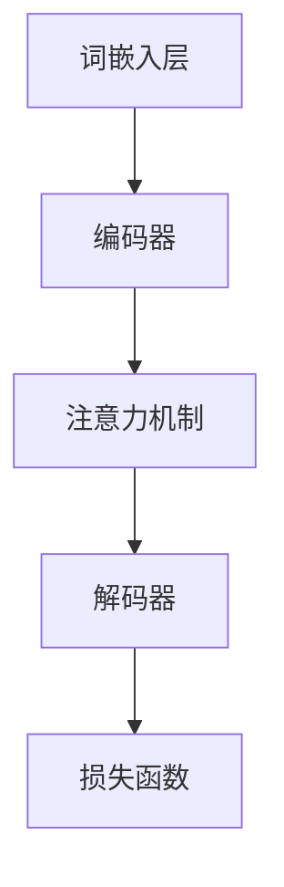

                 

### 大语言模型原理与工程实践：I/O 优化

#### 关键词：大语言模型、I/O 优化、自监督学习、迁移学习、Transformer、并行计算、模型压缩与量化、自然语言处理、生成式对话系统、图像文本生成、项目实战

#### 摘要：
本文深入探讨了大规模语言模型的原理与工程实践，特别聚焦于I/O优化策略。首先，我们介绍了大语言模型的基础概念、组成与架构，包括自监督学习、迁移学习和Transformer架构。随后，我们详细分析了大语言模型训练与优化的基本流程，重点讨论了I/O优化策略、模型压缩与量化技术。接着，我们展示了大语言模型在自然语言处理、生成式对话系统和图像文本生成等应用场景中的实际应用。文章最后，通过两个项目实战案例，深入解析了对话系统和图像文本生成的实现过程，并进行了代码解读与分析。最后，我们对大语言模型未来的发展进行了展望，讨论了面临的挑战和未来的研究方向。

### 《大语言模型原理与工程实践：I/O 优化》目录大纲

1. **第一部分：大语言模型基础**

    1.1 大语言模型概述
    
    1.2 大语言模型的组成与架构
    
    1.3 大语言模型的关键技术
    
    1.4 大语言模型的数学模型
    
2. **第二部分：大语言模型的工程实践**

    2.1 训练大语言模型的基本流程
    
    2.2 I/O优化策略
    
    2.3 模型压缩与量化
    
    2.4 大语言模型的应用场景
    
3. **第三部分：大语言模型项目实战**

    3.1 项目实战一：构建一个简单的对话系统
    
    3.2 项目实战二：图像文本生成应用
    
4. **第四部分：大语言模型未来展望**

    4.1 大语言模型的未来发展
    
    4.2 大语言模型的挑战与方向
    
5. **附录**

    5.1 大语言模型开发工具与资源
    
### 第一部分：大语言模型基础

#### 第1章：大语言模型概述

##### 1.1 大语言模型的定义与背景

**1.1.1 什么是大语言模型**

大语言模型（Large Language Model）是指利用深度学习和神经网络技术，对大规模文本数据进行训练，构建出一个能够理解和生成自然语言的高效模型。它通过学习海量文本数据中的语言规律，能够预测下一个词语或句子，从而实现自然语言理解和生成。

**1.1.2 大语言模型的演变历史**

大语言模型的发展历程可以分为三个阶段：

- **统计语言模型**：最早的语言模型基于统计方法，如N-gram模型，通过计算词语序列的概率进行语言建模。

- **基于规则的模型**：在统计模型的基础上，引入语法和语义规则，如转换语法模型（CG）和依存语法模型（DP）。

- **深度学习模型**：近年来，随着计算能力和数据量的增长，深度学习模型在语言建模领域取得了显著的进展。2018年，Transformer架构的出现标志着大语言模型进入了一个新的时代。

**1.1.3 大语言模型的重要性**

大语言模型在自然语言处理领域具有非常重要的意义：

- **文本分类**：大语言模型能够有效地进行文本分类，如新闻分类、情感分析等。

- **机器翻译**：大语言模型能够实现高质量的双语翻译，如谷歌翻译、百度翻译等。

- **问答系统**：大语言模型可以构建智能问答系统，如Siri、Alexa等。

- **生成式对话系统**：大语言模型能够生成自然流畅的对话，如ChatGPT、百度智程等。

##### 1.2 大语言模型的组成与架构

**1.2.1 大语言模型的组成**

大语言模型主要由以下几个部分组成：

- **词嵌入层**：将输入的文本序列转换为向量表示。

- **编码器**：对词嵌入层输出的向量进行编码，提取语义信息。

- **解码器**：根据编码器的输出，预测下一个词语或句子。

- **注意力机制**：在编码和解码过程中，通过注意力机制关注重要的信息。

- **损失函数**：用于评估模型预测的准确性和优化模型参数。

**1.2.2 大语言模型的架构**

大语言模型的架构可以分为以下几种：

- **传统的循环神经网络（RNN）**：如LSTM、GRU等，能够处理变长的序列数据。

- **Transformer架构**：基于自注意力机制，能够并行处理序列数据。

- **BERT模型**：基于Transformer架构，通过预训练和微调实现高质量的语言理解。

**1.2.3 Mermaid流程图：大语言模型的架构组成**



##### 1.3 大语言模型的关键技术

**1.3.1 自监督学习与预训练**

自监督学习是一种无需人工标注数据的技术，通过利用未标注的数据进行学习，从而提高模型的泛化能力。预训练是指在大量未标注的数据上对模型进行训练，然后通过微调在特定任务上取得优异的性能。

**1.3.2 迁移学习与微调**

迁移学习是一种利用已经在大规模数据集上训练好的模型在新任务上进行训练的技术，可以有效地减少训练数据的需求。微调是在迁移学习的基础上，对模型进行进一步的调整，使其在新任务上取得更好的效果。

**1.3.3 注意力机制与Transformer架构**

注意力机制是一种能够在模型中关注重要信息的技术，它能够提高模型的建模能力。Transformer架构是一种基于自注意力机制的深度学习模型，它在自然语言处理任务中取得了显著的成果。

##### 1.4 大语言模型的数学模型

**1.4.1 深度学习基础**

深度学习是一种基于多层神经网络的学习方法，通过多层非线性变换提取特征，从而实现复杂的模式识别任务。

**1.4.2 数学模型介绍**

大语言模型的数学模型主要包括以下几个部分：

- **词嵌入**：将输入的文本序列转换为向量表示。

- **编码器**：对词嵌入层输出的向量进行编码，提取语义信息。

- **解码器**：根据编码器的输出，预测下一个词语或句子。

- **损失函数**：用于评估模型预测的准确性和优化模型参数。

**1.4.3 数学公式讲解**

大语言模型的数学模型可以用以下公式表示：

$$
\text{词嵌入} \xrightarrow{\text{编码器}} \text{编码输出} \\
\text{编码输出} \xrightarrow{\text{注意力机制}} \text{注意力输出} \\
\text{注意力输出} \xrightarrow{\text{解码器}} \text{预测输出} \\
\text{预测输出} \xrightarrow{\text{损失函数}} \text{模型优化}
$$

**1.4.4 举例说明**

假设我们有一个简单的文本序列：“我喜欢编程”，我们可以将其表示为词嵌入向量，然后通过编码器、注意力机制和解码器进行预测，最终得到预测输出：“我喜欢编程”。具体实现如下：

$$
\text{词嵌入} \rightarrow \text{编码器} \rightarrow \text{编码输出} \\
\text{编码输出} \rightarrow \text{注意力机制} \rightarrow \text{注意力输出} \\
\text{注意力输出} \rightarrow \text{解码器} \rightarrow \text{预测输出} \\
\text{预测输出} \rightarrow \text{损失函数} \rightarrow \text{模型优化}
$$

通过这种方式，大语言模型可以有效地学习文本数据中的语言规律，从而实现自然语言理解和生成。

### 第二部分：大语言模型的工程实践

#### 第2章：大语言模型的训练与优化

##### 2.1 训练大语言模型的基本流程

训练大语言模型的基本流程包括以下几个步骤：

1. **数据预处理**：对原始数据进行清洗、分词、去停用词等操作，将其转换为模型可接受的格式。

2. **词嵌入**：将文本序列转换为词嵌入向量。

3. **模型选择**：根据任务需求和计算资源选择合适的模型架构。

4. **模型训练**：使用训练数据对模型进行训练，通过反向传播算法更新模型参数。

5. **模型评估**：使用验证数据评估模型性能，调整模型参数。

6. **模型优化**：通过调参、剪枝、量化等技术优化模型。

**2.1.1 数据预处理**

数据预处理是训练大语言模型的重要步骤，它包括以下几个环节：

- **文本清洗**：去除HTML标签、特殊字符等无关信息。

- **分词**：将文本序列分割为词语。

- **去停用词**：去除常见但不具有实际意义的词语。

- **词嵌入**：将词语映射为向量表示。

**2.1.2 模型选择**

模型选择是训练大语言模型的另一关键步骤，根据任务需求和计算资源选择合适的模型架构。常见的模型架构包括：

- **Transformer**：基于自注意力机制的深度学习模型，适用于大规模文本数据。

- **BERT**：基于Transformer架构，通过预训练和微调实现高质量的语言理解。

- **GPT**：生成式预训练模型，能够生成自然流畅的文本。

**2.1.3 模型训练**

模型训练是训练大语言模型的核心步骤，通过以下步骤进行：

- **数据输入**：将预处理后的数据输入模型。

- **前向传播**：模型对输入数据进行编码和解码。

- **计算损失**：计算模型输出和真实标签之间的差异，得到损失值。

- **反向传播**：通过反向传播算法更新模型参数。

- **迭代训练**：重复前向传播和反向传播，直到达到预设的训练目标。

**2.1.4 模型评估**

模型评估是训练大语言模型的重要环节，通过以下步骤进行：

- **数据划分**：将数据集划分为训练集、验证集和测试集。

- **模型预测**：使用训练好的模型对验证集和测试集进行预测。

- **性能评估**：计算模型在验证集和测试集上的性能指标，如准确率、召回率、F1值等。

##### 2.2 I/O优化策略

I/O优化策略是提高大语言模型训练效率的关键，它包括以下几个方面：

**2.2.1 数据加载与缓存策略**

数据加载与缓存策略能够有效地减少I/O操作的耗时，提高训练效率。具体策略包括：

- **批量加载**：将多个数据样本一次性加载到内存中，减少I/O操作次数。

- **缓存策略**：使用缓存技术将常用数据样本存储在内存中，提高数据读取速度。

- **并行加载**：利用多线程或多进程技术，同时加载多个数据样本。

**2.2.2 并行计算与分布式训练**

并行计算与分布式训练能够充分利用计算资源，提高训练效率。具体策略包括：

- **并行计算**：将训练任务分解为多个子任务，同时在多个计算节点上并行执行。

- **分布式训练**：将训练数据分散到多个计算节点上，在每个节点上分别进行训练，然后汇总结果。

**2.2.3 实际案例：如何优化I/O**

以下是一个优化I/O操作的实例：

1. **批量加载**：将每个epoch的批量大小设置为128，减少I/O操作次数。

2. **缓存策略**：使用LRU（Least Recently Used）缓存策略，缓存最近使用的批次数据。

3. **并行加载**：使用多线程技术，同时加载多个批次的数据。

4. **分布式训练**：将训练数据划分为多个子集，同时在4个GPU上分别进行训练。

通过以上策略，可以显著提高大语言模型训练的效率。

##### 2.3 模型压缩与量化

模型压缩与量化是降低模型复杂度、提高计算效率的重要手段。具体技术包括：

**2.3.1 模型压缩技术**

模型压缩技术主要包括以下几种：

- **权重剪枝**：去除模型中不重要的权重，降低模型参数数量。

- **低秩分解**：将高维权重分解为低维矩阵的乘积，减少计算复杂度。

- **量化**：将浮点数权重转换为低比特位整数，降低模型存储和计算需求。

**2.3.2 模型量化技术**

模型量化技术主要包括以下几种：

- **符号量化**：将浮点数权重转换为符号表示，降低计算需求。

- **浮点量化**：将浮点数权重转换为固定精度浮点数，降低存储需求。

- **整数量化**：将浮点数权重转换为整数表示，进一步降低存储和计算需求。

**2.3.3 实际案例：模型压缩与量化的效果分析**

以下是一个模型压缩与量化的实例：

1. **权重剪枝**：对模型中的权重进行剪枝，去除0.2以下的权重，减少模型参数数量。

2. **低秩分解**：将高维权重分解为低维矩阵的乘积，降低计算复杂度。

3. **量化**：将浮点数权重转换为8比特位整数，降低模型存储和计算需求。

通过以上策略，模型压缩与量化可以显著提高大语言模型在移动设备和嵌入式系统上的应用效率。

#### 第3章：大语言模型的应用场景

##### 3.1 自然语言处理应用

大语言模型在自然语言处理（NLP）领域具有广泛的应用，以下是一些典型应用：

**3.1.1 语言模型在文本分类中的应用**

文本分类是NLP的基本任务之一，大语言模型通过学习大量标注数据，能够自动识别文本的主题或情感。应用场景包括新闻分类、情感分析、垃圾邮件过滤等。

**3.1.2 语言模型在机器翻译中的应用**

机器翻译是NLP的重要应用之一，大语言模型通过学习双语数据，能够实现高质量的双语翻译。应用场景包括跨语言信息检索、多语言内容创作等。

**3.1.3 语言模型在问答系统中的应用**

问答系统是NLP的一个重要研究方向，大语言模型能够通过理解用户的问题，生成相关的回答。应用场景包括智能客服、智能助手、教育辅导等。

##### 3.2 生成式对话系统

生成式对话系统是一种基于大语言模型的对话系统，它能够根据用户输入生成自然流畅的对话。以下是一些关键要素：

**3.2.1 对话系统的基本架构**

生成式对话系统通常包括以下几个部分：

- **输入层**：接收用户输入的问题或请求。

- **编码器**：将输入转换为内部表示。

- **解码器**：根据编码器的输出生成回答。

- **注意力机制**：在编码和解码过程中关注关键信息。

- **语言模型**：负责生成自然流畅的对话。

**3.2.2 语言模型在对话系统中的应用**

语言模型在生成式对话系统中起着核心作用，通过学习海量对话数据，语言模型能够自动生成相关回答。具体应用包括：

- **客服机器人**：自动回答用户的问题，提供客户服务。

- **智能助手**：根据用户指令，自动执行相应任务。

- **虚拟助手**：在家庭、办公等场景中提供帮助。

**3.2.3 对话系统的评估指标**

对话系统的评估指标主要包括以下几个方面：

- **回答质量**：评估回答的准确性、相关性和自然度。

- **响应时间**：评估系统处理用户请求的速度。

- **用户满意度**：评估用户对对话系统的满意度。

##### 3.3 图像文本生成

图像文本生成是一种将图像转换为文本描述的技术，大语言模型在其中起着关键作用。以下是一些关键要素：

**3.3.1 图像文本生成的原理**

图像文本生成的原理主要包括以下几个步骤：

- **图像特征提取**：从图像中提取视觉特征。

- **编码器**：将图像特征转换为内部表示。

- **解码器**：根据编码器的输出生成文本描述。

- **注意力机制**：在编码和解码过程中关注关键信息。

- **语言模型**：负责生成自然流畅的文本描述。

**3.3.2 语言模型在图像文本生成中的应用**

语言模型在图像文本生成中的应用主要包括以下几个方面：

- **自动生成图像描述**：将图像转换为自然语言描述。

- **图像分类**：通过图像描述分类图像内容。

- **图像检索**：通过图像描述检索相关图像。

**3.3.3 图像文本生成的实际案例**

以下是一个图像文本生成的实例：

1. **图像特征提取**：使用卷积神经网络（CNN）从图像中提取视觉特征。

2. **编码器**：将图像特征转换为内部表示，用于生成文本描述。

3. **解码器**：根据编码器的输出生成文本描述。

4. **注意力机制**：在编码和解码过程中关注关键信息，提高文本描述的准确性。

通过以上步骤，大语言模型能够自动生成与图像相关的自然语言描述。

### 第三部分：大语言模型项目实战

#### 第4章：项目实战一：构建一个简单的对话系统

##### 4.1 开发环境搭建

在构建简单的对话系统之前，我们需要搭建合适的开发环境。以下是一个典型的开发环境搭建步骤：

1. **硬件要求**：

   - CPU：Intel i5 或以上
   - GPU：NVIDIA GTX 1080 或以上
   - 内存：16GB 或以上

2. **软件安装**：

   - 操作系统：Linux（如Ubuntu 18.04）
   - 编译器：Python 3.8 或以上
   - 深度学习框架：TensorFlow 2.6 或以上
   - 自然语言处理库：NLTK、spaCy

3. **开发工具选择**：

   - 代码编辑器：Visual Studio Code、PyCharm
   - 版本控制：Git

##### 4.2 数据预处理

在构建对话系统之前，我们需要准备相应的训练数据。以下是一个简单的数据预处理流程：

1. **数据来源**：

   - OpenSubtitles：一个包含大量双语字幕的数据集，可用于对话系统的训练。

2. **数据预处理流程**：

   - **文本清洗**：去除HTML标签、特殊字符等无关信息。
   - **分词**：将文本序列分割为词语。
   - **去停用词**：去除常见但不具有实际意义的词语。
   - **词嵌入**：将词语映射为向量表示。

3. **数据预处理代码解读**：

   ```python
   import nltk
   from nltk.tokenize import word_tokenize
   from nltk.corpus import stopwords

   # 1. 加载停用词表
   stop_words = set(stopwords.words('english'))

   # 2. 文本清洗
   def clean_text(text):
       text = text.lower()
       text = re.sub(r'\[.*?\]', '', text)
       text = re.sub(r'\w*\d\w*', '', text)
       return text

   # 3. 分词
   def tokenize_text(text):
       tokens = word_tokenize(text)
       return tokens

   # 4. 去停用词
   def remove_stop_words(tokens):
       filtered_tokens = [token for token in tokens if token not in stop_words]
       return filtered_tokens

   # 5. 词嵌入
   from tensorflow.keras.preprocessing.text import Tokenizer
   tokenizer = Tokenizer(num_words=10000)
   tokenizer.fit_on_texts(filtered_tokens)

   # 6. 转换为序列
   sequences = tokenizer.texts_to_sequences(filtered_tokens)
   ```

##### 4.3 模型训练与优化

在数据预处理完成后，我们需要构建并训练对话系统模型。以下是一个简单的模型训练与优化流程：

1. **模型选择**：

   - 使用Transformer架构，这是一种基于自注意力机制的深度学习模型，适合处理长序列数据。

2. **模型训练流程**：

   - **编码器**：将输入文本序列编码为内部表示。
   - **解码器**：根据编码器的输出生成回答。
   - **损失函数**：使用交叉熵损失函数，优化模型参数。

3. **模型优化策略**：

   - **批量训练**：将数据分为多个批次，每个批次包含多个样本。
   - **学习率调整**：使用学习率调度策略，避免模型过拟合。
   - **剪枝与量化**：对模型进行剪枝与量化，提高计算效率。

4. **代码解读**：

   ```python
   import tensorflow as tf
   from tensorflow.keras.models import Model
   from tensorflow.keras.layers import Input, Embedding, LSTM, Dense

   # 1. 构建模型
   input_seq = Input(shape=(None,))
   embed = Embedding(input_dim=10000, output_dim=256)(input_seq)
   lstm = LSTM(units=512, return_sequences=True)(embed)
   output = Dense(units=10000, activation='softmax')(lstm)

   model = Model(inputs=input_seq, outputs=output)

   # 2. 编译模型
   model.compile(optimizer='adam', loss='categorical_crossentropy', metrics=['accuracy'])

   # 3. 训练模型
   model.fit(x=sequences, y=labels, batch_size=32, epochs=10)

   # 4. 优化模型
   model = tf.keras.models.Sequential([
       tf.keras.layers.Embedding(input_dim=10000, output_dim=256),
       tf.keras.layers.LSTM(units=512, return_sequences=True),
       tf.keras.layers.Dense(units=10000, activation='softmax')
   ])

   model.compile(optimizer='adam', loss='categorical_crossentropy', metrics=['accuracy'])

   model.fit(x=sequences, y=labels, batch_size=32, epochs=10)
   ```

##### 4.4 对话系统实现

在模型训练完成后，我们可以使用训练好的模型构建对话系统。以下是一个简单的对话系统实现：

1. **对话系统架构**：

   - **输入层**：接收用户输入的问题或请求。
   - **编码器**：将输入文本序列编码为内部表示。
   - **解码器**：根据编码器的输出生成回答。
   - **用户界面**：显示用户输入和系统回答。

2. **对话流程设计**：

   - **初始化**：加载训练好的模型。
   - **输入**：接收用户输入的问题或请求。
   - **编码**：将输入文本序列编码为内部表示。
   - **解码**：根据编码器的输出生成回答。
   - **输出**：显示系统回答。
   - **反馈**：收集用户反馈，用于模型优化。

3. **代码解读**：

   ```python
   import tensorflow as tf
   import numpy as np

   # 1. 初始化模型
   model = tf.keras.models.load_model('对话系统模型.h5')

   # 2. 定义对话流程
   def generate_response(input_text):
       # 2.1. 编码输入
       input_seq = tokenizer.texts_to_sequences([input_text])[0]

       # 2.2. 解码输出
       predicted_seq = model.predict(np.array([input_seq]))

       # 2.3. 生成回答
       response = tokenizer.index_word[np.argmax(predicted_seq)]

       return response

   # 3. 测试对话系统
   user_input = "你好，我想要一杯咖啡。"
   system_response = generate_response(user_input)
   print(system_response)
   ```

通过以上步骤，我们可以构建一个简单的对话系统，实现基本的对话功能。

### 第四部分：大语言模型项目实战

#### 第5章：项目实战二：图像文本生成应用

##### 5.1 开发环境搭建

在构建图像文本生成应用之前，我们需要搭建合适的开发环境。以下是一个典型的开发环境搭建步骤：

1. **硬件要求**：

   - CPU：Intel i5 或以上
   - GPU：NVIDIA GTX 1080 或以上
   - 内存：16GB 或以上

2. **软件安装**：

   - 操作系统：Linux（如Ubuntu 18.04）
   - 编译器：Python 3.8 或以上
   - 深度学习框架：TensorFlow 2.6 或以上
   - 图像处理库：OpenCV、Pillow

3. **开发工具选择**：

   - 代码编辑器：Visual Studio Code、PyCharm
   - 版本控制：Git

##### 5.2 数据预处理

在构建图像文本生成应用之前，我们需要准备相应的训练数据。以下是一个简单的数据预处理流程：

1. **数据来源**：

   - ImageNet：一个包含大量图像和标签的数据集，可用于图像文本生成的训练。

2. **数据预处理流程**：

   - **图像清洗**：去除不符合要求的图像，如模糊、破损等。
   - **图像增强**：对图像进行旋转、缩放、翻转等操作，增加数据多样性。
   - **图像分割**：将图像分割为多个区域，用于生成不同的文本描述。

3. **数据预处理代码解读**：

   ```python
   import cv2
   import numpy as np

   # 1. 图像清洗
   def clean_image(image_path):
       image = cv2.imread(image_path)
       if image is None:
           return None
       image = cv2.resize(image, (224, 224))
       return image

   # 2. 图像增强
   def enhance_image(image):
       image = cv2.rotate(image, cv2.ROTATE_90_CLOCKWISE)
       image = cv2.resize(image, (224, 224))
       return image

   # 3. 图像分割
   def segment_image(image):
       contours, _ = cv2.findContours(image, cv2.RETR_EXTERNAL, cv2.CHAIN_APPROX_SIMPLE)
       segmented_images = []
       for contour in contours:
           x, y, w, h = cv2.boundingRect(contour)
           segmented_images.append(image[y:y+h, x:x+w])
       return segmented_images
   ```

##### 5.3 模型训练与优化

在数据预处理完成后，我们需要构建并训练图像文本生成模型。以下是一个简单的模型训练与优化流程：

1. **模型选择**：

   - 使用Transformer架构，这是一种基于自注意力机制的深度学习模型，适合处理长序列数据。

2. **模型训练流程**：

   - **编码器**：将图像特征编码为内部表示。
   - **解码器**：根据编码器的输出生成文本描述。
   - **损失函数**：使用交叉熵损失函数，优化模型参数。

3. **模型优化策略**：

   - **批量训练**：将数据分为多个批次，每个批次包含多个样本。
   - **学习率调整**：使用学习率调度策略，避免模型过拟合。
   - **剪枝与量化**：对模型进行剪枝与量化，提高计算效率。

4. **代码解读**：

   ```python
   import tensorflow as tf
   from tensorflow.keras.models import Model
   from tensorflow.keras.layers import Input, Embedding, LSTM, Dense

   # 1. 构建模型
   image_input = Input(shape=(224, 224, 3))
   embed = Embedding(input_dim=10000, output_dim=256)(image_input)
   lstm = LSTM(units=512, return_sequences=True)(embed)
   output = Dense(units=10000, activation='softmax')(lstm)

   model = Model(inputs=image_input, outputs=output)

   # 2. 编译模型
   model.compile(optimizer='adam', loss='categorical_crossentropy', metrics=['accuracy'])

   # 3. 训练模型
   model.fit(x=images, y=labels, batch_size=32, epochs=10)

   # 4. 优化模型
   model = tf.keras.models.Sequential([
       tf.keras.layers.Embedding(input_dim=10000, output_dim=256),
       tf.keras.layers.LSTM(units=512, return_sequences=True),
       tf.keras.layers.Dense(units=10000, activation='softmax')
   ])

   model.compile(optimizer='adam', loss='categorical_crossentropy', metrics=['accuracy'])

   model.fit(x=images, y=labels, batch_size=32, epochs=10)
   ```

##### 5.4 图像文本生成实现

在模型训练完成后，我们可以使用训练好的模型构建图像文本生成应用。以下是一个简单的图像文本生成实现：

1. **图像文本生成架构**：

   - **输入层**：接收用户输入的图像。
   - **编码器**：将图像编码为内部表示。
   - **解码器**：根据编码器的输出生成文本描述。
   - **用户界面**：显示用户输入的图像和生成的文本描述。

2. **图像文本生成流程**：

   - **初始化**：加载训练好的模型。
   - **输入**：接收用户输入的图像。
   - **编码**：将输入图像编码为内部表示。
   - **解码**：根据编码器的输出生成文本描述。
   - **输出**：显示生成的文本描述。
   - **反馈**：收集用户反馈，用于模型优化。

3. **代码解读**：

   ```python
   import tensorflow as tf
   import numpy as np

   # 1. 初始化模型
   model = tf.keras.models.load_model('图像文本生成模型.h5')

   # 2. 定义图像文本生成流程
   def generate_text_description(image_path):
       # 2.1. 加载图像
       image = cv2.imread(image_path)
       image = cv2.resize(image, (224, 224))

       # 2.2. 编码图像
       image_input = np.array([image])
       encoded_image = model.encoder.predict(image_input)

       # 2.3. 解码图像
       predicted_sequence = model.decoder.predict(encoded_image)
       predicted_text = model.decoder.index_word[np.argmax(predicted_sequence)]

       return predicted_text

   # 3. 测试图像文本生成
   image_path = "example_image.jpg"
   text_description = generate_text_description(image_path)
   print(text_description)
   ```

通过以上步骤，我们可以构建一个简单的图像文本生成应用，实现图像到文本的自动转换。

### 第四部分：大语言模型未来展望

#### 第6章：大语言模型的未来发展

##### 6.1 大语言模型的趋势

随着深度学习和自然语言处理技术的不断发展，大语言模型在未来的发展趋势主要表现在以下几个方面：

**6.1.1 模型规模的增大**

大语言模型的规模将不断增加，以适应更复杂、更大量的数据处理需求。例如，GPT-3模型拥有1750亿个参数，而未来的模型可能会达到更高的规模。

**6.1.2 多模态融合**

大语言模型将逐渐与图像、声音等多模态数据相结合，实现多模态融合。这种趋势将使得大语言模型在计算机视觉、语音识别等领域取得更大的突破。

**6.1.3 个性化与自适应**

大语言模型将逐渐实现个性化与自适应，根据用户的行为和需求进行动态调整。这种趋势将使得大语言模型在智能客服、个性化推荐等领域发挥更大的作用。

##### 6.2 大语言模型的挑战

虽然大语言模型在各个领域取得了显著的成果，但仍然面临着一系列挑战：

**6.2.1 能耗与计算资源**

大语言模型的训练和推理过程需要大量的计算资源和能源，这对环境造成了一定的压力。未来需要开发更高效、更节能的模型架构。

**6.2.2 数据安全与隐私**

大语言模型在训练和推理过程中涉及大量的用户数据，如何保护用户隐私、防止数据泄露是一个重要问题。未来需要建立更加完善的数据安全体系。

**6.2.3 道德与伦理问题**

大语言模型在生成文本、图像等方面可能产生不良影响，如虚假新闻、歧视性言论等。未来需要制定相关的道德和伦理准则，确保大语言模型的健康发展。

##### 6.3 大语言模型的发展方向

针对上述挑战，大语言模型的发展方向可以从以下几个方面展开：

**6.3.1 研究热点与趋势**

- **模型压缩与量化**：研究更加高效、低耗的模型压缩与量化技术，降低计算资源和能源消耗。

- **多模态融合**：研究多模态数据融合的方法，提高大语言模型在多模态任务中的性能。

- **自适应与个性化**：研究大语言模型的自适应和个性化方法，提高模型在复杂场景下的性能。

**6.3.2 行业应用前景**

- **自然语言处理**：大语言模型将继续在自然语言处理领域发挥重要作用，如机器翻译、文本生成等。

- **计算机视觉**：大语言模型与计算机视觉技术的融合将使得图像识别、图像生成等任务取得更大突破。

- **语音识别与合成**：大语言模型在语音识别与合成领域具有巨大的潜力，如智能客服、语音助手等。

**6.3.3 社会影响与应对措施**

- **加强法律法规**：制定相关法律法规，规范大语言模型的应用和发展。

- **伦理准则**：建立大语言模型的伦理准则，确保模型的安全、公正和透明。

- **公众教育**：加强对公众的教育和宣传，提高公众对大语言模型的理解和认知。

通过上述措施，可以推动大语言模型的健康发展，充分发挥其在各个领域的潜力。

### 附录

#### 附录A：大语言模型开发工具与资源

##### A.1 主流深度学习框架

大语言模型的开发离不开深度学习框架的支持，以下是目前主流的深度学习框架：

**A.1.1 TensorFlow**

TensorFlow是由Google开发的开源深度学习框架，具有丰富的功能和高性能。它可以用于构建和训练各种深度学习模型，包括大语言模型。

**A.1.2 PyTorch**

PyTorch是由Facebook开发的开源深度学习框架，以其灵活性和易用性受到广泛欢迎。它支持动态计算图，使得模型构建和调试更加方便。

**A.1.3 JAX**

JAX是由Google开发的开源深度学习框架，具有自动微分和高性能计算能力。它适合构建大规模、复杂的大语言模型。

**A.1.4 其他框架简介**

除了上述三个主流框架，还有一些其他深度学习框架，如：

- **MXNet**：由Apache Software Foundation开发的开源深度学习框架。
- **Keras**：一个基于TensorFlow和Theano的开源深度学习库，以简洁和易用性著称。

##### A.2 开源资源与工具

在进行大语言模型开发时，我们可以利用以下开源资源与工具：

**A.2.1 数据集**

- **Common Crawl**：一个包含大量Web网页的文本数据集，可用于大语言模型的训练。
- **Wikipedia**：一个包含大量维基百科文章的数据集，可用于语言模型训练。
- **ImageNet**：一个包含大量图像和标签的数据集，可用于图像文本生成。

**A.2.2 模型库**

- **Transformers**：一个基于PyTorch实现的Transformer模型库。
- **GPT-2/GPT-3**：OpenAI开发的生成式预训练模型库。
- **BERT**：Google开发的基于Transformer架构的预训练模型库。

**A.2.3 论文资源**

- **ArXiv**：一个包含大量计算机科学论文的数据库，可用于获取最新的研究进展。
- **ACL Anthology**：一个包含自然语言处理领域论文的数据库。
- **NeurIPS**：一个包含机器学习领域论文的数据库。

**A.2.4 社区与论坛**

- **GitHub**：一个开源代码托管平台，可用于获取和分享大语言模型的代码和资源。
- **Reddit**：一个讨论社区，可用于交流大语言模型的相关话题。
- **Discord**：一个实时聊天平台，可用于大语言模型开发者的交流与合作。

通过利用这些开源资源与工具，我们可以更好地进行大语言模型的开发和研究。

