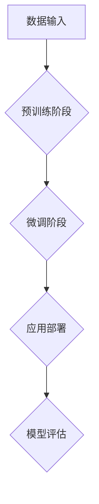

                 

# 大语言模型原理与工程实践：大语言模型的缩放定律

## 关键词

大语言模型、自然语言处理、神经网络、预训练、模型缩放、工程实践

## 摘要

本文旨在全面解析大语言模型的原理与工程实践，特别关注大语言模型的缩放定律。文章首先介绍了大语言模型的基础概念和核心特点，包括其定义、发展背景、应用场景以及核心架构。随后，深入探讨了大语言模型的核心算法，如神经网络基础、自然语言处理技术、预训练模型原理以及大模型训练技术。接着，文章重点分析了大语言模型的缩放定律，包括其原理、计算模型和应用场景。在此基础上，文章详细描述了大语言模型的工程化构建、应用案例、安全与隐私以及未来趋势。通过实际项目实战，文章展示了大语言模型的开发环境搭建、源代码实现和代码解读，为读者提供了完整的工程实践指导。最后，文章总结了核心概念与联系，并提出了大语言模型的发展方向。

### 目录大纲

1. **第一部分：大语言模型基础**
   - **第1章：大语言模型概述**
     - **1.1 大语言模型的定义与背景**
     - **1.2 大语言模型的核心特点**
     - **1.3 大语言模型的架构与原理**
     - **1.4 大语言模型的发展趋势
```markdown
# 大语言模型原理与工程实践：大语言模型的缩放定律

## 关键词

大语言模型、自然语言处理、神经网络、预训练、模型缩放、工程实践

## 摘要

本文旨在全面解析大语言模型的原理与工程实践，特别关注大语言模型的缩放定律。文章首先介绍了大语言模型的基础概念和核心特点，包括其定义、发展背景、应用场景以及核心架构。随后，深入探讨了大语言模型的核心算法，如神经网络基础、自然语言处理技术、预训练模型原理以及大模型训练技术。接着，文章重点分析了大语言模型的缩放定律，包括其原理、计算模型和应用场景。在此基础上，文章详细描述了大语言模型的工程化构建、应用案例、安全与隐私以及未来趋势。通过实际项目实战，文章展示了大语言模型的开发环境搭建、源代码实现和代码解读，为读者提供了完整的工程实践指导。最后，文章总结了核心概念与联系，并提出了大语言模型的发展方向。

### 目录大纲

1. **第一部分：大语言模型基础**
   - **第1章：大语言模型概述**
     - **1.1 大语言模型的定义与背景**
     - **1.2 大语言模型的核心特点**
     - **1.3 大语言模型的架构与原理**
     - **1.4 大语言模型的发展趋势**

2. **第二部分：大语言模型的核心算法**
   - **第2章：神经网络基础**
     - **2.1 神经网络的结构**
     - **2.2 神经元的激活函数**
     - **2.3 前向传播与反向传播算法**
   - **第3章：自然语言处理基础**
     - **3.1 词嵌入技术**
     - **3.2 序列模型与注意力机制**
     - **3.3 转换器架构详解**
   - **第4章：预训练模型原理**
     - **4.1 预训练的概念与意义**
     - **4.2 自监督学习方法**
     - **4.3 迁移学习与微调技术**
   - **第5章：大模型训练技术**
     - **5.1 数据并行与模型并行**
     - **5.2 梯度裁剪与优化器选择**
     - **5.3 模型加速与优化技术**

3. **第三部分：大语言模型的缩放定律**
   - **第6章：缩放定律的原理**
     - **6.1 缩放定律的定义**
     - **6.2 缩放定律的影响因素**
     - **6.3 缩放定律的应用场景**
   - **第7章：计算模型**
     - **7.1 计算资源的需求**
     - **7.2 能效比的优化**
     - **7.3 模型规模的演变**

4. **第四部分：大语言模型的工程实践**
   - **第8章：大语言模型的工程化构建**
     - **8.1 大语言模型的工程化需求**
     - **8.2 大语言模型的开发工具**
     - **8.3 大语言模型的集成与优化**
   - **第9章：大语言模型的应用案例**
     - **9.1 自然语言处理应用**
     - **9.2 语音识别与合成**
     - **9.3 多媒体内容理解**
   - **第10章：大语言模型的安全与隐私**
     - **10.1 大语言模型的安全挑战**
     - **10.2 安全与隐私解决方案**
     - **10.3 模型安全的监管与合规**

5. **第五部分：大语言模型的未来趋势**
   - **第11章：新型大语言模型的发展**
     - **11.1 量子计算与神经计算**
     - **11.2 人工智能与生物计算**
     - **11.3 新兴技术的融合与应用**
   - **第12章：大语言模型的社会影响**
     - **12.1 对经济与产业的影响**
     - **12.2 对教育与文化的影响**
     - **12.3 对社会伦理与法律的影响**
   - **第13章：大语言模型的技术展望**
     - **13.1 模型压缩与优化**
     - **13.2 模型解释与可解释性**
     - **13.3 大模型的社会责任**

### 附录

- **附录A：大语言模型开发工具与资源**
  - **A.1 主流深度学习框架对比**
  - **A.2 开源资源与工具集**
  - **A.3 社区支持与学习资源**

---

通过上述目录大纲，本文将全面系统地探讨大语言模型的原理、算法、工程实践以及未来发展趋势，帮助读者深入了解这一前沿技术领域。

### 第一部分：大语言模型基础

#### 第1章：大语言模型概述

##### 1.1 大语言模型的定义与背景

大语言模型（Large-scale Language Model）是一种基于深度学习的自然语言处理技术，旨在理解和生成自然语言。与传统语言模型相比，大语言模型具有更大的模型规模和更强的表达能力，能够捕捉到更复杂的语言规律和上下文关系。

大语言模型的发展背景可以追溯到20世纪80年代，当时研究人员开始探索如何使用统计方法处理自然语言。然而，随着计算能力的提升和深度学习技术的突破，大语言模型得到了快速发展。特别是在2018年，OpenAI推出了GPT-2模型，其规模达到了1.5亿参数，标志着大语言模型进入了一个新的阶段。

大语言模型的应用场景非常广泛，包括但不限于以下几方面：

1. 自然语言处理：如文本分类、情感分析、文本生成等。
2. 语音识别与合成：如自动语音助手、语音翻译等。
3. 多媒体内容理解：如图文理解、视听内容生成等。
4. 跨模态交互：如文本与图像的联合生成、跨模态搜索等。

##### 1.2 大语言模型的核心特点

大语言模型具有以下核心特点：

1. **数据驱动的强大能力**：大语言模型通过从大量文本数据中学习，能够捕捉到语言中的统计规律和上下文关系，从而提高模型的泛化能力和表达能力。
2. **高度的自动化和智能化**：大语言模型能够自动进行语言理解和生成任务，减少了人工干预，提高了效率和准确性。
3. **对多语言和跨模态的支持**：大语言模型能够处理多种语言和不同模态的信息，实现了跨语言和跨模态的信息融合和生成。

##### 1.3 大语言模型的架构与原理

大语言模型的架构通常包括以下几个关键部分：

1. **输入层**：接收自然语言文本序列，将其转化为向量表示。
2. **隐藏层**：使用神经网络结构进行多层次的信息处理和融合，通常采用循环神经网络（RNN）或变换器架构（Transformer）。
3. **输出层**：将隐藏层的信息映射到目标输出，如文本、语音或其他模态。

大语言模型的工作原理是基于深度学习中的自监督学习技术，通过在大规模文本数据上预训练模型，然后使用微调技术在特定任务上进行优化。预训练过程主要包括以下步骤：

1. **数据预处理**：将文本数据转化为数字序列，并使用词嵌入技术将其转化为向量表示。
2. **自监督预训练**：在大量无标签文本数据上进行预训练，模型通过预测下一个词或句子来学习语言规律和上下文关系。
3. **微调**：在特定任务上使用有标签数据对模型进行微调，以优化模型在目标任务上的表现。

##### 1.4 大语言模型的发展趋势

随着深度学习和自然语言处理技术的不断发展，大语言模型也在不断演进。以下是一些大语言模型的发展趋势：

1. **大规模模型的演化**：模型规模越来越大，从数百万参数到数十亿参数，模型的表达能力和泛化能力也得到了显著提升。
2. **新型模型的创新**：研究人员不断探索新的模型结构和训练策略，如自适应学习率、去噪自动编码器等，以进一步提高模型的性能。
3. **模型压缩与优化技术**：为了应对模型规模的增加，研究人员开发了多种模型压缩和优化技术，如知识蒸馏、低秩分解、剪枝等，以降低模型的存储和计算成本。

通过上述分析，我们可以看到大语言模型在自然语言处理领域的重要地位和广阔的应用前景。在接下来的章节中，我们将深入探讨大语言模型的核心算法和工程实践。

### 第一部分：大语言模型基础

#### 第2章：大语言模型的核心算法

##### 2.1 神经网络基础

神经网络（Neural Network）是深度学习的基础，其灵感来自于人脑的结构和功能。在大语言模型中，神经网络用于处理和生成自然语言。下面我们将详细探讨神经网络的结构、神经元激活函数以及前向传播和反向传播算法。

###### 2.1.1 神经网络的结构

神经网络由一系列相互连接的神经元（或节点）组成。每个神经元接收来自前一层的输入信号，通过激活函数处理后，输出到下一层。神经网络可以分为以下几层：

1. **输入层**：接收外部输入信号，如文本数据。
2. **隐藏层**：进行特征提取和转换，可以有一个或多个隐藏层。
3. **输出层**：生成最终输出，如分类结果或文本序列。

每层中的神经元都通过权重（weight）连接到下一层的神经元。神经网络的层次结构使得信息可以在网络中传播和融合，从而实现复杂的非线性变换。

###### 2.1.2 神经元的激活函数

激活函数是神经网络中至关重要的组件，用于决定神经元是否被激活。常见的激活函数包括：

1. ** sigmoid 函数**：
   $$\sigma(x) = \frac{1}{1 + e^{-x}}$$
   sigmoid函数可以将输入值映射到0到1之间，用于二分类问题。

2. **ReLU函数**：
   $$\text{ReLU}(x) = \max(0, x)$$
   ReLU函数是当前最流行的激活函数，它能够加快神经网络的训练速度。

3. **Tanh函数**：
   $$\text{Tanh}(x) = \frac{e^x - e^{-x}}{e^x + e^{-x}}$$
   Tanh函数类似于sigmoid函数，但输出范围在-1到1之间。

4. **Softmax函数**：
   $$\text{Softmax}(x)_i = \frac{e^{x_i}}{\sum_{j} e^{x_j}}$$
   Softmax函数通常用于多分类问题，它可以将神经网络的输出转换为概率分布。

###### 2.1.3 前向传播与反向传播算法

前向传播（Forward Propagation）和反向传播（Backpropagation）是神经网络训练的核心算法。

1. **前向传播**：在前向传播过程中，输入信号从输入层传递到输出层。每个神经元将其输入乘以对应的权重，然后通过激活函数进行处理。最终输出层的输出即为预测结果。

前向传播的伪代码如下：
```python
for each layer l from 1 to L:
    z[l] = w[l] * a[l-1] + b[l]
    a[l] = activation_function(z[l])
end
```
其中，`a`表示每个层的激活值，`w`和`b`分别表示权重和偏置。

2. **反向传播**：在反向传播过程中，计算每个层的梯度，以更新权重和偏置。反向传播从输出层开始，通过链式法则计算每个神经元的梯度。然后，使用梯度下降或其他优化算法更新权重和偏置。

反向传播的伪代码如下：
```python
for each layer l from L to 1:
    delta[l] = (d[l] - a[l]) * activation_derivative(a[l])
    delta[l-1] = w[l] * delta[l]
end
```
其中，`d`表示输出层的误差，`delta`表示每个神经元的误差。

通过前向传播和反向传播，神经网络可以不断调整权重和偏置，以减少预测误差，提高模型的性能。

##### 2.2 自然语言处理基础

自然语言处理（Natural Language Processing，NLP）是深度学习在大语言模型中的一个重要应用。NLP涉及将自然语言文本转化为计算机可以理解和处理的形式。以下将介绍NLP中的关键概念和算法。

###### 2.2.1 词嵌入技术

词嵌入（Word Embedding）是将单词映射到高维向量空间的技术，用于表示单词的语义信息。常见的词嵌入方法包括：

1. **基于统计的词嵌入**：如Count-based、TF-IDF等，通过统计单词在文本中的频率和重要性来生成嵌入向量。
2. **基于神经网络的词嵌入**：如Word2Vec、GloVe等，通过训练神经网络模型来学习单词的嵌入向量。

Word2Vec的模型结构如下：


GloVe的优化目标为：
$$\min_{v_i, v_j} \sum_{c \in \text{context}(w_i)} \frac{f(c)}{||v_i + v_j||_2}$$
其中，`v_i`和`v_j`分别为单词`w_i`和其上下文单词`c`的嵌入向量，`f(c)`表示单词`c`在文本中的频率。

###### 2.2.2 序列模型与注意力机制

序列模型（Sequence Model）是处理序列数据的一种神经网络架构，如循环神经网络（RNN）和变换器架构（Transformer）。RNN可以捕捉序列数据中的时序关系，而Transformer通过注意力机制实现了更高效的信息融合。

1. **循环神经网络（RNN）**：RNN通过记忆单元（memory cell）来保持序列中的信息。常见的RNN结构包括：
   - **简单RNN**：
     $$h_t = \sigma(W_{ih}x_t + W_{hh}h_{t-1} + b_h)$$
   - **长短期记忆（LSTM）**：
     $$f_t = \sigma(W_{if}x_t + W_{ff}f_{t-1} + b_f)$$
     $$i_t = \sigma(W_{ii}x_t + W_{ii}i_{t-1} + b_i)$$
     $$o_t = \sigma(W_{io}x_t + W_{oo}o_{t-1} + b_o)$$
     $$c_t = f_t \odot c_{t-1} + i_t \odot \sigma(W_{ic}x_t + W_{hc}c_{t-1} + b_c)$$
     $$h_t = o_t \odot \sigma(W_{oh}c_t + b_h)$$
   - **门控循环单元（GRU）**：
     $$r_t = \sigma(W_{ir}x_t + W_{rr}r_{t-1} + b_r)$$
     $$z_t = \sigma(W_{iz}x_t + W_{zz}z_{t-1} + b_z)$$
     $$\tilde{c}_t = \tanh(W_{ic}x_t + r_t \odot c_{t-1} + b_c)$$
     $$c_t = z_t \odot c_{t-1} + (1 - z_t) \odot \tilde{c}_t$$
     $$h_t = \sigma(W_{ih}x_t + W_{hh}c_t + b_h)$$

2. **变换器架构（Transformer）**：Transformer通过自注意力机制（Self-Attention）和多头注意力（Multi-Head Attention）来实现高效的信息融合。其基本结构如下：
   

   自注意力机制的公式为：
   $$\text{Attention}(Q, K, V) = \text{softmax}\left(\frac{QK^T}{\sqrt{d_k}}\right)V$$
   其中，`Q`、`K`和`V`分别为查询向量、键向量和值向量，`d_k`为键向量的维度。

   多头注意力机制通过多个独立的注意力头来捕捉不同的信息：
   $$\text{MultiHead}(Q, K, V) = \text{Concat}(\text{head}_1, ..., \text{head}_h)W^O$$
   其中，`head_i`为第i个注意力头，`W^O`为输出线性变换。

###### 2.2.3 转换器架构详解

转换器架构（Transformer）是一种基于自注意力机制的序列到序列模型，广泛应用于机器翻译、文本生成等任务。其核心思想是通过注意力机制捕获输入序列中的依赖关系，从而实现高效的序列处理。

转换器架构的主要组成部分包括：

1. **编码器（Encoder）**：编码器接收输入序列，通过多层变换器层（Transformer Layer）进行编码。每个变换器层包括自注意力机制和前馈神经网络（Feedforward Neural Network）。
2. **解码器（Decoder）**：解码器接收编码器的输出，通过多层变换器层和掩码自注意力机制进行解码。解码器在每个时间步只关注已解码的部分，以避免未来的信息泄露。
3. **位置编码（Positional Encoding）**：由于自注意力机制不考虑序列的顺序信息，需要添加位置编码来引入序列的顺序信息。

转换器架构的公式如下：
$$\text{Encoder}(X) = \text{TransformerLayer}(\text{EncoderLayer}(X, P_X))$$
$$\text{Decoder}(Y) = \text{TransformerLayer}(\text{DecoderLayer}(Y, P_Y, \text{Encoder}(X)))$$
其中，`X`和`Y`分别为编码器和解码器的输入序列，`P_X`和`P_Y`分别为编码器和解码器的位置编码。

通过上述分析，我们可以看到神经网络在大语言模型中扮演着关键角色，而自然语言处理的基础技术为神经网络处理自然语言提供了必要的支持。在下一章中，我们将进一步探讨预训练模型原理和大规模模型训练技术。

##### 2.3 预训练模型原理

预训练（Pre-training）是当前深度学习领域的一项关键技术，它通过在大规模无标签数据上进行训练，为模型提供初步的知识和特征，从而提高模型在下游任务上的性能。在大语言模型中，预训练是一个非常重要的环节，它不仅能够提高模型的泛化能力，还能够减少对有标签数据的依赖。

###### 2.3.1 预训练的概念与意义

预训练是指在一个大规模的语料库上对神经网络模型进行训练，使其学习到通用的语言特征和统计规律。预训练的意义在于：

1. **提高泛化能力**：通过在大量无标签数据上进行预训练，模型能够学习到通用的语言规律，从而在下游任务上具有更强的泛化能力。
2. **减少对有标签数据的依赖**：预训练使得模型能够处理大量的无标签数据，从而减少对有标签数据的依赖，降低数据标注的成本。
3. **加速模型训练**：预训练可以为一个特定的任务提供初始化的模型参数，从而加速模型的训练过程。

###### 2.3.2 自监督学习方法

自监督学习（Self-supervised Learning）是一种无需有标签数据，通过利用数据中的内在结构来训练模型的方法。在大语言模型的预训练中，自监督学习方法起着至关重要的作用。以下是一些常见的自监督学习方法：

1. ** masked Language Model (MLM) **：MLM是一种最简单的自监督学习方法，它通过随机遮盖输入文本中的一部分词，然后预测这些被遮盖的词。MLM的目的是让模型学习到语言的上下文关系和词义。

MLM的训练过程可以描述如下：

- 对于每个词`w_i`，随机遮盖它的一部分或全部，生成新的输入序列。
- 使用模型预测被遮盖的词，并通过损失函数计算预测误差。

MLM的伪代码如下：
```python
for each sentence in dataset:
    masked_sentence = mask_sentence(sentence)
    prediction = model(masked_sentence)
    loss = loss_function(prediction, masked_sentence)
    backward_propagation(loss)
end
```

2. ** masked Token Detection (MTD) **：MTD方法通过预测文本中哪些词被遮盖来实现预训练。与MLM不同，MTD方法不仅预测被遮盖的词，还预测未被遮盖的词。

MTD的训练过程可以描述如下：

- 对于每个词`w_i`，随机遮盖它的一部分或全部，生成新的输入序列。
- 使用模型预测哪些词被遮盖，并通过损失函数计算预测误差。

MTD的伪代码如下：
```python
for each sentence in dataset:
    masked_sentence = mask_sentence(sentence)
    masked_positions = mask_positions(sentence)
    prediction = model(masked_sentence)
    loss = loss_function(prediction, masked_positions)
    backward_propagation(loss)
end
```

3. ** contrastive Language Model (CLM) **：CLM方法通过对比不同上下文中相同词的表示来学习语言特征。CLM的核心思想是正样本和负样本的对比。

CLM的训练过程可以描述如下：

- 对于每个词`w_i`，从其上下文中提取正样本（即`w_i`在原始文本中的表示）和负样本（即从其他上下文中提取的词的表示）。
- 使用模型预测正样本和负样本的相似性，并通过损失函数计算预测误差。

CLM的伪代码如下：
```python
for each sentence in dataset:
    context = get_context(sentence)
    positive_samples = [context[i] for i in range(len(context)) if i != index_of(w_i)]
    negative_samples = get_negative_samples(context)
    prediction = model(sentence)
    loss = contrastive_loss(prediction, positive_samples, negative_samples)
    backward_propagation(loss)
end
```

通过上述自监督学习方法，大语言模型能够在无标签数据上进行预训练，从而学习到丰富的语言特征和上下文关系。这些预训练的模型在下游任务中表现出了优异的性能。

###### 2.3.3 迁移学习与微调技术

迁移学习（Transfer Learning）是一种利用预训练模型来提高下游任务性能的方法。在迁移学习中，预训练模型在一个大规模通用数据集上训练，然后通过微调（Fine-tuning）技术在特定任务上的数据集上进行调整。

微调技术的核心思想是利用预训练模型的初始参数来初始化下游任务的模型，然后通过在特定任务上的数据进行少量训练来调整模型的参数。这样，预训练模型已经学习到的通用特征可以迁移到下游任务，从而提高模型的性能。

微调技术的基本步骤如下：

1. **初始化模型**：使用预训练模型的参数初始化下游任务的模型。
2. **训练模型**：在下游任务的数据集上进行训练，通常只训练部分层或冻结部分层的参数。
3. **评估模型**：在验证集和测试集上评估模型的性能，并进行调整。

微调的伪代码如下：
```python
model = load_pretrained_model()
for layer in unfrozen_layers:
    model[layer].train()
for epoch in range(num_epochs):
    for batch in dataset:
        prediction = model(batch)
        loss = loss_function(prediction, target)
        backward_propagation(loss)
    evaluate_model(model, validation_set)
end
```

通过迁移学习和微调技术，预训练模型可以有效地迁移到下游任务，从而提高模型的性能。这种技术在大规模自然语言处理任务中得到了广泛应用。

通过本章的讨论，我们可以看到预训练模型在大语言模型中扮演着重要的角色。自监督学习方法为模型提供了丰富的语言特征和上下文关系，而迁移学习和微调技术使得模型能够快速适应下游任务。在下一章中，我们将进一步探讨大模型训练技术，包括数据并行和模型并行等方法。

##### 2.4 大模型训练技术

随着大语言模型的规模不断扩大，如何高效地进行模型训练成为一个关键问题。在大规模模型训练中，数据并行和模型并行是两种常用的技术，它们分别从数据层面和模型层面提高训练效率。此外，梯度裁剪和优化器选择也是大模型训练中必不可少的优化手段。

###### 2.4.1 数据并行与模型并行

数据并行（Data Parallelism）是一种通过将数据分布在多个计算节点上来加速模型训练的技术。在数据并行中，每个计算节点都独立地计算模型的梯度，然后通过同步或异步的方式将梯度聚合起来，以更新模型参数。

数据并行的基本步骤如下：

1. **数据划分**：将训练数据集划分为多个子数据集，每个子数据集独立地分配给不同的计算节点。
2. **模型复制**：在每个计算节点上复制一个模型的副本，并在其上进行前向传播和反向传播计算。
3. **梯度同步**：将每个计算节点的梯度聚合起来，以更新全局模型参数。同步方式可以是同步梯度下降（SGD），也可以是异步梯度同步（ASGD）。

数据并行的伪代码如下：
```python
for each epoch:
    for each batch in dataset:
        for each node:
            prediction = model(batch)
            loss = loss_function(prediction, target)
            backward_propagation(loss)
        gradients = aggregate_gradients()
        update_model_parameters(gradients)
end
```

模型并行（Model Parallelism）是一种通过将模型分布在多个计算节点上来加速模型训练的技术。在模型并行中，模型的不同部分被分配到不同的计算节点上，每个计算节点独立地计算其部分模型的梯度，然后通过通信机制将梯度聚合起来。

模型并行的基本步骤如下：

1. **模型划分**：将模型划分为多个部分，每个部分独立地分配给不同的计算节点。
2. **梯度计算**：在每个计算节点上，对其负责的部分模型进行前向传播和反向传播计算，以获得该部分的梯度。
3. **梯度聚合**：通过通信机制将每个计算节点的梯度聚合起来，以更新全局模型参数。

模型并行的伪代码如下：
```python
for each epoch:
    for each batch in dataset:
        for each node:
            prediction = model(batch)
            loss = loss_function(prediction, target)
            backward_propagation(loss)
        gradients = aggregate_gradients()
        update_model_parameters(gradients)
end
```

数据并行和模型并行都可以有效地提高大规模模型训练的效率，但它们各自适用于不同的场景。数据并行适用于数据量较大的场景，而模型并行适用于模型规模较大的场景。

###### 2.4.2 梯度裁剪与优化器选择

梯度裁剪（Gradient Clipping）是一种防止梯度爆炸和梯度消失的技术。在训练大规模模型时，由于参数数量庞大，梯度可能会变得非常大或非常小，导致训练不稳定。梯度裁剪通过限制梯度的最大值，确保梯度在合理的范围内。

梯度裁剪的基本步骤如下：

1. **计算梯度**：在每个反向传播步骤后，计算每个参数的梯度。
2. **裁剪梯度**：将每个参数的梯度缩放到不超过预设的最大值。
3. **更新参数**：使用裁剪后的梯度更新模型参数。

梯度裁剪的伪代码如下：
```python
max_gradient = 1.0
for each parameter in model:
    gradient = compute_gradient(parameter)
    clipped_gradient = min(max(gradient, -max_gradient), max_gradient)
    update_parameter(parameter, clipped_gradient)
```

优化器（Optimizer）是用于更新模型参数的算法。选择合适的优化器对于训练大规模模型至关重要。以下是一些常用的优化器：

1. **随机梯度下降（SGD）**：SGD是最简单的优化器，通过随机选择一个小批量数据进行梯度计算，然后更新模型参数。SGD的优点是计算简单，缺点是容易陷入局部最小值。

2. **动量梯度下降（Momentum SGD）**：Momentum SGD通过引入动量项，积累之前的梯度信息，以平滑梯度方向，从而提高训练稳定性。动量项的公式为：
   $$m_t = \gamma m_{t-1} + (1 - \gamma)g_t$$
   其中，`m_t`是第t次的动量，`g_t`是第t次的梯度，`γ`是动量参数。

3. **Adagrad**：Adagrad通过为每个参数计算累积的梯度平方，并调整学习率，以适应每个参数的更新。Adagrad的公式为：
   $$r_t = r_{t-1} + g_t^2$$
   $$\alpha_t = \frac{\alpha_0}{\sqrt{r_t} + \epsilon}$$
   其中，`r_t`是第t次的累积梯度平方，`α_0`是初始学习率，`ε`是较小常数。

4. **Adam**：Adam是结合了Momentum和Adagrad优点的优化器，通过同时考虑一阶和二阶矩估计来调整学习率。Adam的公式为：
   $$m_t = \beta_1 m_{t-1} + (1 - \beta_1)g_t$$
   $$v_t = \beta_2 v_{t-1} + (1 - \beta_2)g_t^2$$
   $$\hat{m}_t = m_t / (1 - \beta_1^t)$$
   $$\hat{v}_t = v_t / (1 - \beta_2^t)$$
   $$\alpha_t = \alpha_0 \cdot \frac{\hat{v}_t}{\sqrt{\hat{m}_t} + \epsilon}$$
   其中，`β_1`和`β_2`是分别用于一阶和二阶矩的指数衰减率，`α_0`是初始学习率。

通过选择合适的优化器，并使用梯度裁剪技术，可以有效地提高大规模模型的训练效率，并防止训练过程中出现的不稳定现象。

通过本章的讨论，我们可以看到在大规模模型训练中，数据并行和模型并行技术可以显著提高训练效率。同时，梯度裁剪和优化器选择也是保证训练稳定性和提高模型性能的重要手段。在下一章中，我们将深入探讨大语言模型的缩放定律。

### 第三部分：大语言模型的缩放定律

#### 第6章：缩放定律的原理

##### 6.1 缩放定律的定义

缩放定律（Scaling Law）是描述大语言模型性能随着模型规模和训练数据量增加而变化的规律。缩放定律的基本思想是，模型的性能增长与其规模和训练数据量之间存在一定的关系，这种关系可以用数学公式来表示。

缩放定律通常用以下公式表示：
$$\text{Performance} \propto \sqrt{\text{Model Size}} \times \sqrt{\text{Training Data Size}}$$

其中，`Performance`表示模型性能，`Model Size`表示模型规模（如参数数量），`Training Data Size`表示训练数据量。

##### 6.2 缩放定律的影响因素

缩放定律的影响因素主要包括以下几个方面：

1. **模型规模**：模型规模越大，其性能提升越显著。这是因为大规模模型具有更强的表示能力和泛化能力，能够捕捉到更复杂的语言规律。
2. **训练数据量**：训练数据量越大，模型的性能提升也越明显。这是因为大规模数据集提供了更多的语言信息，有助于模型学习到更准确的统计规律和上下文关系。
3. **计算资源**：随着模型规模和训练数据量的增加，对计算资源的需求也显著增加。有效的计算资源管理是确保模型性能提升的关键。
4. **数据质量**：高质量的数据能够提供更多的有用信息，有助于模型学习到更准确的特征。反之，低质量的数据可能引入噪声，降低模型的性能。

##### 6.3 缩放定律的应用场景

缩放定律在大语言模型的应用场景中具有重要意义。以下是一些常见的应用场景：

1. **模型优化**：根据缩放定律，通过增加模型规模和训练数据量，可以显著提升模型的性能。这为研究人员提供了优化模型的指导方向。
2. **资源分配**：在资源有限的条件下，根据缩放定律，可以合理分配计算资源，确保模型训练的效率。
3. **数据集构建**：大规模数据集对于提高模型性能至关重要。通过缩放定律，可以指导如何构建和扩展数据集，以提升模型的泛化能力。
4. **实际应用**：在商业和工业领域，缩放定律有助于企业评估和优化大语言模型的应用，从而实现更高的业务价值。

通过上述分析，我们可以看到缩放定律在大语言模型中的重要性。在接下来的章节中，我们将深入探讨大语言模型的计算模型和应用场景。

##### 6.4 缩放定律的计算模型

缩放定律的计算模型主要关注模型规模、训练数据量和计算资源之间的关系。以下从计算资源的需求、能效比的优化和模型规模的演变三个方面进行详细讨论。

###### 6.4.1 计算资源的需求

随着模型规模的增加，计算资源的需求也显著增加。这主要体现在以下几个方面：

1. **存储需求**：大规模模型需要更多的存储空间来存储参数和中间计算结果。例如，一个具有100亿参数的语言模型需要数TB的存储空间。
2. **计算能力**：大规模模型在训练过程中需要大量的计算能力。这包括前向传播、反向传播、梯度计算和参数更新等操作。为了满足这些需求，需要使用高性能计算硬件，如GPU和TPU。
3. **数据传输**：大规模模型训练过程中，需要频繁传输数据到计算硬件。数据传输的速度和带宽成为制约模型训练效率的重要因素。

为了满足计算资源的需求，常见的解决方案包括：

- **分布式计算**：通过将模型和训练数据分布到多个计算节点上，可以有效地利用计算资源，提高训练效率。
- **GPU并行计算**：使用GPU进行并行计算，可以显著提高模型的训练速度。
- **云计算**：利用云计算平台提供的大量计算资源，可以灵活地调整计算资源，以满足模型训练的需求。

###### 6.4.2 能效比的优化

能效比（Energy Efficiency）是指模型在特定任务上的性能与其计算资源消耗之间的比率。优化能效比是大规模模型训练中的一个重要挑战。以下是一些优化能效比的策略：

1. **模型压缩**：通过模型压缩技术，如知识蒸馏、低秩分解和剪枝，可以减少模型的存储和计算成本，从而提高能效比。例如，知识蒸馏技术可以将大规模模型的参数知识传递给一个较小的模型，实现高效计算。
2. **优化算法**：使用优化算法，如Adam和SGD，可以调整学习率和更新策略，以减少计算资源消耗。此外，使用自适应学习率算法，如Adagrad和Adam，可以动态调整学习率，提高训练效率。
3. **计算硬件优化**：选择高性能、低功耗的计算硬件，如GPU和TPU，可以降低模型训练过程中的能耗。

通过优化能效比，可以更高效地利用计算资源，降低大规模模型训练的成本。

###### 6.4.3 模型规模的演变

随着计算能力的提升和算法的改进，模型规模也在不断演变。以下是一些模型规模演变的主要趋势：

1. **参数数量增加**：大规模模型通常具有数十亿甚至上百亿的参数。这种趋势得益于计算资源的丰富和优化算法的改进。
2. **训练数据规模增加**：大规模训练数据集的构建，如OpenAI的GPT-3和Google的Bert，提供了更多的语言信息，有助于模型学习到更复杂的语言规律。
3. **模型结构优化**：随着模型规模的增加，模型结构也在不断优化。例如，变换器架构（Transformer）通过自注意力机制实现了高效的序列处理，取代了传统的循环神经网络（RNN）。
4. **跨模态模型**：随着跨模态技术的发展，大语言模型开始结合图像、音频等其他模态的信息，实现更复杂的信息处理和生成任务。

通过不断优化模型规模和结构，大语言模型在自然语言处理和其他领域的表现越来越优异。

通过上述讨论，我们可以看到缩放定律在大语言模型计算模型中的重要性。在接下来的章节中，我们将深入探讨大语言模型的工程实践，包括模型构建、应用案例和安全与隐私问题。

### 第四部分：大语言模型的工程实践

#### 第8章：大语言模型的工程化构建

##### 8.1 大语言模型的工程化需求

大语言模型的工程化构建是确保模型在实际应用中高效、稳定和可扩展的关键。在工程化构建过程中，需要关注以下几个方面的需求：

1. **可扩展性**：大语言模型通常具有数十亿甚至上百亿的参数，需要能够在大规模数据集和分布式计算环境中进行训练。因此，模型的构建需要具备高度的可扩展性，以适应不同的计算资源。
2. **效率**：模型的构建需要考虑训练和推理的效率，包括数据加载、模型计算和通信等环节。高效的模型构建可以提高训练速度，降低成本。
3. **稳定性**：在训练过程中，模型可能会遇到各种异常情况，如梯度消失、梯度爆炸、数据不平衡等。为了保证模型的稳定性，需要在模型构建过程中采用相应的优化策略。
4. **可维护性**：模型构建需要具备良好的可维护性，包括代码的可读性、可扩展性和可调试性。这有助于提高开发效率和降低维护成本。

##### 8.2 大语言模型的开发工具

在大语言模型的工程化构建过程中，选择合适的开发工具是关键。以下是一些主流的开发工具：

1. **TensorFlow**：TensorFlow是由Google开发的开源深度学习框架，广泛应用于大规模模型训练。TensorFlow提供了丰富的API和工具，支持多种计算平台，包括CPU、GPU和TPU。
2. **PyTorch**：PyTorch是由Facebook开发的开源深度学习框架，以其动态计算图和灵活的API而闻名。PyTorch在学术界和工业界都有广泛的应用，特别是在自然语言处理领域。
3. **JAX**：JAX是由Google开发的开源自动微分库，支持自动微分和数值计算。JAX与TensorFlow和PyTorch相比，具有更高的性能和更好的可扩展性，适用于大规模模型的训练。

选择开发工具时，需要考虑以下几个方面：

- **性能**：不同的开发工具在计算性能上有差异，需要根据实际需求选择合适的工具。
- **社区支持**：强大的社区支持有助于解决开发中的问题，提高开发效率。
- **易用性**：选择易于使用的开发工具，可以降低开发成本，提高开发效率。

##### 8.3 大语言模型的集成与优化

在大语言模型的工程化构建过程中，模型集成与优化是提高模型性能和效率的重要环节。以下是一些关键的优化策略：

1. **模型集成**：模型集成是将多个模型的结果进行合并，以提升模型的预测性能。常见的模型集成方法包括：
   - **投票法**：将多个模型的预测结果进行投票，选择投票结果最多的类别作为最终预测结果。
   - **堆叠法**：使用多个模型对同一数据集进行训练，并将模型权重进行组合，以生成一个更大的模型。
   - **集成学习**：使用集成学习算法，如随机森林和梯度提升机，将多个模型进行组合，以提高模型的泛化能力。

2. **模型优化**：模型优化是通过调整模型参数和训练策略，提高模型性能和效率。以下是一些常见的优化策略：
   - **学习率调整**：使用自适应学习率算法，如Adam和Adagrad，动态调整学习率，以提高训练效率。
   - **批量大小调整**：通过调整批量大小，可以在计算效率和模型性能之间找到最佳平衡点。
   - **数据预处理**：对训练数据进行预处理，如数据清洗、归一化和特征提取，以提高模型的鲁棒性和性能。

3. **模型压缩**：模型压缩是通过减少模型参数数量和计算量，降低模型的存储和计算成本。以下是一些常见的模型压缩技术：
   - **知识蒸馏**：将大规模模型的参数和知识传递给一个较小的模型，实现高效计算。
   - **低秩分解**：将高维参数分解为低秩矩阵，以减少参数数量。
   - **剪枝**：通过剪除模型中不重要的参数，减少模型规模。

通过模型集成与优化，可以显著提高大语言模型在实际应用中的性能和效率。

### 第四部分：大语言模型的工程实践

#### 第9章：大语言模型的应用案例

##### 9.1 自然语言处理应用

自然语言处理（NLP）是大语言模型的主要应用领域之一。以下是一些典型的NLP应用案例：

1. **文本分类**：文本分类是将文本数据按照预定的类别进行分类的任务。大语言模型通过学习文本的特征和上下文关系，可以准确地对文本进行分类。例如，新闻分类、情感分析等。

2. **情感分析**：情感分析是判断文本中表达的情感倾向，如正面、负面或中性。大语言模型通过学习大量的情感标签数据，可以准确判断文本的情感倾向。这在社交媒体分析、市场调研等方面有广泛应用。

3. **文本生成**：文本生成是将给定的输入文本生成相应的文本输出。大语言模型可以通过预训练和微调，生成高质量的自然语言文本。例如，自动写作、对话生成等。

4. **机器翻译**：机器翻译是将一种语言的文本翻译成另一种语言的文本。大语言模型通过学习大量的双语文本数据，可以生成高质量的翻译结果。例如，Google翻译、百度翻译等。

##### 9.2 语音识别与合成

语音识别与合成是另一类重要的大语言模型应用。以下是一些典型应用案例：

1. **语音识别**：语音识别是将语音信号转换为文本数据的过程。大语言模型通过学习大量的语音数据，可以准确识别语音中的词汇和句子。这在智能语音助手、语音输入法等方面有广泛应用。

2. **语音合成**：语音合成是将文本数据转换为语音信号的过程。大语言模型通过学习文本和语音的关系，可以生成自然流畅的语音输出。例如，自动语音报时、语音助手语音输出等。

3. **对话系统**：对话系统是模拟人类对话的计算机系统。大语言模型通过学习大量的对话数据，可以生成自然、流畅的对话回应。这在客服机器人、智能聊天机器人等方面有广泛应用。

##### 9.3 多媒体内容理解

多媒体内容理解是将文本、图像、语音等多种媒体信息进行整合和理解的过程。以下是一些典型应用案例：

1. **图文理解**：图文理解是将图像和文本信息进行整合，理解图像中的内容。大语言模型通过学习图像和文本的特征，可以准确理解图像中的内容。例如，图像描述生成、图像问答等。

2. **视听内容理解**：视听内容理解是将视频和音频信息进行整合，理解视频中的内容。大语言模型通过学习视频和音频的特征，可以准确理解视频中的内容。例如，视频摘要、视频问答等。

3. **跨模态交互**：跨模态交互是将多种媒体信息进行整合，实现跨模态的信息传递和理解。例如，通过图像和文本的交互，实现图像的语义标注；通过语音和文本的交互，实现语音助手的自然对话。

通过上述应用案例，我们可以看到大语言模型在自然语言处理、语音识别与合成、多媒体内容理解等领域的广泛应用和巨大潜力。随着大语言模型技术的不断发展，其在更多领域的应用也将不断拓展。

#### 第10章：大语言模型的安全与隐私

##### 10.1 大语言模型的安全挑战

随着大语言模型在自然语言处理、语音识别、多媒体内容理解等领域的广泛应用，其安全与隐私问题也日益突出。以下是一些主要的安全挑战：

1. **模型攻击**：攻击者可以通过恶意数据或特定输入，使大语言模型产生错误的输出。例如，通过构造特定的文本或语音输入，诱使模型泄露敏感信息或执行恶意操作。

2. **数据泄露**：大语言模型在训练和推理过程中需要处理大量的敏感数据，如个人隐私信息、企业机密等。如果模型训练数据或推理数据泄露，可能会导致严重的安全问题和隐私侵犯。

3. **数据隐私保护**：大语言模型在处理数据时，可能需要访问用户的个人隐私信息，如位置、通信记录等。如何在保护用户隐私的前提下，充分利用数据价值，是一个重要挑战。

4. **模型解释与透明性**：大语言模型的决策过程往往是非线性和复杂的，难以解释。这给模型的可解释性和透明性带来了挑战，特别是在涉及安全敏感任务时，用户需要了解模型的决策过程。

##### 10.2 安全与隐私解决方案

为了应对大语言模型的安全与隐私挑战，研究人员提出了多种解决方案。以下是一些主要的安全与隐私解决方案：

1. **模型攻击与防御**：针对模型攻击，可以采用以下策略进行防御：
   - **对抗训练**：通过对抗性样本训练模型，提高模型对攻击的鲁棒性。
   - **防御模型**：设计专门的防御模型，检测和阻止恶意输入。
   - **数据清洗**：对输入数据进行清洗和预处理，过滤掉可能的恶意数据。

2. **数据隐私保护技术**：为了保护用户隐私，可以采用以下技术：
   - **数据脱敏**：在数据处理过程中，对敏感信息进行脱敏处理，如使用匿名化、加密等技术。
   - **安全隔离**：通过隔离敏感数据和普通数据，防止敏感数据泄露。
   - **差分隐私**：在数据发布和共享时，加入随机噪声，保护用户隐私。

3. **模型解释与透明性**：为了提高模型的可解释性和透明性，可以采用以下方法：
   - **可视化技术**：通过可视化模型的结构和决策过程，帮助用户理解模型的运作机制。
   - **可解释性模型**：设计专门的可解释性模型，使其在解释决策时更加透明和易于理解。
   - **用户反馈**：引入用户反馈机制，让用户参与模型训练和优化过程，提高模型的透明性和可信度。

##### 10.3 模型安全的监管与合规

为了确保大语言模型的安全与合规，需要建立相应的监管和合规机制。以下是一些关键措施：

1. **法律法规**：制定相关法律法规，明确大语言模型的安全和隐私要求，规范模型的使用和行为。

2. **标准规范**：制定统一的模型安全与隐私标准，指导模型的开发、部署和运营。

3. **监管机构**：设立专门的监管机构，负责监督和管理大语言模型的安全与合规，确保其符合法律法规和标准规范。

4. **透明审计**：定期对大语言模型进行审计，检查其安全与隐私保护措施的有效性，确保模型的安全和合规。

通过上述措施，可以有效应对大语言模型的安全与隐私挑战，保障用户隐私和模型安全。

### 第五部分：大语言模型的未来趋势

#### 第11章：新型大语言模型的发展

##### 11.1 量子计算与神经计算

量子计算和神经计算是未来大语言模型发展的两个重要方向。量子计算具有超强的并行计算能力，可以在极短时间内解决复杂问题，而神经计算则利用生物神经系统的工作原理，实现了高效的信息处理和学习能力。以下是一些关键点：

1. **量子计算的应用**：量子计算可以用于加速大语言模型的训练过程，提高计算效率。例如，通过量子模拟和量子机器学习，可以实现高效的模型优化和参数更新。

2. **神经计算的应用**：神经计算可以为大语言模型提供更高效的信息处理机制。例如，通过使用类脑神经网络，可以实现更灵活、更快速的语言理解和生成。

3. **挑战与展望**：量子计算和神经计算在硬件和算法方面仍面临诸多挑战，如量子纠错、算法优化等。然而，随着技术的发展，未来有望实现量子计算与神经计算的结合，为大语言模型带来革命性的突破。

##### 11.2 人工智能与生物计算

人工智能与生物计算的结合有望为大语言模型带来新的发展方向。生物计算利用生物系统（如DNA计算、RNA计算）进行信息处理和学习，具有高效、低能耗的特点。以下是一些关键点：

1. **生物计算的优势**：生物计算具有极高的计算密度和低能耗特性，可以在资源受限的环境下实现高效的信息处理。

2. **人工智能与生物计算的结合**：通过将人工智能算法与生物计算相结合，可以实现更高效、更灵活的语言理解和生成。例如，利用DNA计算进行大规模数据处理，结合神经网络进行模型训练。

3. **挑战与展望**：生物计算在实验技术、数据存储和读取等方面仍面临诸多挑战。然而，随着生物计算技术的不断发展，未来有望实现生物计算与人工智能的深度融合，为语言模型带来新的突破。

##### 11.3 新兴技术的融合与应用

随着技术的不断进步，大语言模型将与其他新兴技术深度融合，开拓新的应用场景。以下是一些关键点：

1. **跨模态交互**：通过将大语言模型与图像、音频、视频等不同模态的信息进行整合，实现更丰富、更自然的跨模态交互。

2. **增强现实与虚拟现实**：大语言模型可以与增强现实（AR）和虚拟现实（VR）技术结合，为用户提供更智能、更丰富的交互体验。

3. **区块链技术**：通过将大语言模型与区块链技术相结合，可以实现更安全、更可信的数据共享和隐私保护。

4. **物联网（IoT）**：大语言模型可以与物联网设备结合，实现智能化的物联网应用，如智能家居、智能城市等。

通过新兴技术的融合与应用，大语言模型将不断拓展其应用领域，为人类社会带来更多创新和变革。

#### 第12章：大语言模型的社会影响

##### 12.1 对经济与产业的影响

大语言模型的迅速发展对经济与产业产生了深远的影响。以下是一些关键点：

1. **产业变革**：大语言模型在金融、医疗、教育、零售等领域的应用，推动了传统产业的数字化转型和升级。例如，智能金融、智慧医疗、在线教育等新兴业态的兴起，改变了传统行业的商业模式和运营模式。

2. **劳动力市场**：大语言模型的应用改变了劳动力市场的需求结构。一方面，它提高了生产效率，降低了人工成本；另一方面，也催生了新的职业，如数据标注员、算法工程师等。然而，这也可能导致部分传统岗位的减少。

3. **经济增长**：大语言模型的应用推动了经济增长，促进了数字经济的快速发展。通过提高生产力、降低运营成本，企业可以实现更高的利润和竞争力。

##### 12.2 对教育与文化的影响

大语言模型在教育和文化领域带来了深刻的变革。以下是一些关键点：

1. **个性化教育**：大语言模型可以为学生提供个性化的学习资源和辅导，满足不同学生的学习需求和节奏。例如，智能辅导系统可以根据学生的学习情况和知识水平，提供针对性的学习方案。

2. **知识传播**：大语言模型可以帮助更广泛的人群获取知识，缩小知识鸿沟。例如，智能搜索引擎、知识问答系统等，使信息获取更加便捷和高效。

3. **文化传播**：大语言模型在语言翻译、文本生成、语音识别等方面具有广泛的应用，促进了不同文化之间的交流与融合。例如，通过机器翻译，可以实现跨语言的文化传播和交流。

##### 12.3 对社会伦理与法律的影响

大语言模型在社会伦理和法律层面带来了诸多挑战。以下是一些关键点：

1. **隐私保护**：大语言模型在处理大量个人数据时，可能涉及隐私泄露风险。因此，如何在保障用户隐私的同时，充分利用数据价值，是一个重要挑战。

2. **算法公平性**：大语言模型在决策过程中，可能存在偏见和不公平现象。例如，在招聘、信贷审批等领域，算法可能基于历史数据中的偏见，导致部分群体受到不公平对待。因此，确保算法的公平性和透明性至关重要。

3. **法律监管**：随着大语言模型的应用日益广泛，需要建立相应的法律监管体系，规范模型的使用和行为。例如，制定相关法律法规，明确大语言模型的法律责任和合规要求。

通过关注大语言模型对社会伦理与法律的影响，可以更好地应对相关挑战，确保其健康、可持续发展。

#### 第13章：大语言模型的技术展望

##### 13.1 模型压缩与优化

随着大语言模型的规模不断扩大，模型压缩与优化技术成为提高模型性能和降低计算成本的关键。以下是一些主要的方向：

1. **知识蒸馏**：知识蒸馏技术通过将大规模模型的参数知识传递给一个较小的模型，实现高效计算。这有助于在保持模型性能的同时，降低模型规模和计算需求。

2. **低秩分解**：低秩分解技术通过将高维参数分解为低秩矩阵，减少参数数量。这可以显著降低模型存储和计算成本，同时保持模型性能。

3. **剪枝**：剪枝技术通过剪除模型中不重要的参数，减少模型规模。剪枝可以分为结构剪枝和权重剪枝，前者通过剪枝网络结构中的神经元，后者通过剪枝权重矩阵中的元素。

4. **量化**：量化技术通过将模型的浮点数参数转换为低比特位表示，降低模型存储和计算成本。量化可以分为全精度量化、半精度量化等。

##### 13.2 模型解释与可解释性

大语言模型在决策过程中通常是非线性、复杂的，难以解释其决策过程。为了提高模型的透明性和可解释性，研究人员提出了以下技术：

1. **可视化技术**：通过可视化模型的结构和决策过程，帮助用户理解模型的运作机制。例如，可以可视化神经网络中的激活值和权重，展示模型的决策路径。

2. **特征提取**：通过提取模型中的关键特征，揭示模型在特定任务上的决策依据。例如，在图像分类任务中，可以提取模型的特征图，展示模型关注的图像区域。

3. **可解释性模型**：设计专门的可解释性模型，使其在解释决策时更加透明和易于理解。例如，基于决策树、规则引擎的可解释性模型，可以明确展示模型的决策过程和依据。

4. **用户反馈**：引入用户反馈机制，让用户参与模型训练和优化过程，提高模型的透明性和可信度。例如，用户可以评价模型的决策结果，帮助模型不断调整和优化。

##### 13.3 大模型的社会责任

随着大语言模型的应用日益广泛，其社会影响也越来越大。为了确保大模型的安全、可靠和可持续发展，需要关注以下社会责任：

1. **伦理道德**：大模型在处理数据、生成内容时，需要遵循伦理道德规范，确保不产生误导、歧视等不良影响。例如，在设计算法时，需要考虑算法的公平性、透明性和可解释性。

2. **公平性**：大模型在决策过程中，需要确保对不同群体公平对待，避免算法偏见和不公平现象。例如，在招聘、信贷审批等领域，需要确保算法的公平性和透明性。

3. **跨领域合作**：大模型的发展需要跨领域合作，包括学术界、工业界、政府机构等，共同推动模型技术的研发和应用。通过跨领域合作，可以更好地应对技术挑战，推动社会进步。

4. **监管与合规**：政府机构需要制定相关法律法规，明确大模型的使用规范和责任。同时，需要设立监管机构，对大模型进行监督和管理，确保其合规和可持续发展。

通过关注大模型的社会责任，可以确保其在未来健康发展，为社会带来更多积极影响。

### 附录

#### 附录A：大语言模型开发工具与资源

为了更好地了解和应用大语言模型，以下介绍了一些主流的深度学习框架、开源资源和社区支持。

##### A.1 主流深度学习框架对比

1. **TensorFlow**：由Google开发的开源深度学习框架，支持多种编程语言，如Python、C++等。TensorFlow提供了丰富的API和工具，适用于大规模模型训练和部署。

2. **PyTorch**：由Facebook开发的开源深度学习框架，以其动态计算图和灵活的API而闻名。PyTorch在学术界和工业界都有广泛的应用，特别是在自然语言处理领域。

3. **Keras**：基于Theano和TensorFlow的开源深度学习框架，提供了简洁的API，适用于快速实验和模型开发。Keras支持多种编程语言，如Python、R等。

4. **MXNet**：由Apache Software Foundation开源的深度学习框架，支持多种编程语言，如Python、R、Scala等。MXNet适用于大规模分布式训练和部署。

##### A.2 开源资源与工具集

1. **Hugging Face**：一个开源的NLP资源库，提供了丰富的预训练模型、工具和教程。Hugging Face支持多种深度学习框架，如PyTorch、TensorFlow等。

2. **TensorFlow Hub**：一个开源的模型共享平台，提供了大量的预训练模型和工具，方便用户下载和使用。TensorFlow Hub支持多种应用场景，如文本分类、情感分析、机器翻译等。

3. **AllenNLP**：一个开源的NLP框架，提供了丰富的预训练模型、工具和教程。AllenNLP支持多种深度学习框架，如PyTorch、TensorFlow等，适用于自然语言处理任务。

##### A.3 社区支持与学习资源

1. **深度学习教程**：许多在线教程和书籍提供了丰富的深度学习和自然语言处理资源，如《深度学习》（Goodfellow et al.）、《动手学深度学习》（Zhualu et al.）等。

2. **在线课程**：许多在线教育平台提供了深度学习和自然语言处理的课程，如Coursera、Udacity、edX等。这些课程通常由行业专家和学者授课，内容涵盖理论基础、实践操作等。

3. **论坛与社区**：深度学习和自然语言处理领域有许多活跃的论坛和社区，如Stack Overflow、Reddit、GitHub等。用户可以在这里提问、讨论和分享经验，获取技术支持和帮助。

通过使用这些开发工具和资源，可以更好地了解和应用大语言模型，探索自然语言处理领域的最新技术和应用。

### 核心概念与联系

为了更好地理解大语言模型的核心概念和架构，以下使用Mermaid流程图展示大语言模型的基本流程，并详细讲解其中的关键环节。



**Mermaid 流程图解释：**

- **A[数据输入]**：大语言模型首先接收输入数据，这些数据可以是文本、语音或其他模态的信息。数据输入是模型训练的基础。

- **B[预训练阶段]**：在预训练阶段，模型在大规模无标签数据上进行训练，学习到通用的语言特征和统计规律。预训练过程中，模型通过自监督学习方法，如 masked Language Model (MLM)，不断调整参数，提高模型性能。

- **C[微调阶段]**：预训练后，模型在特定任务上有标签数据上进行微调，优化模型在目标任务上的表现。微调过程中，模型使用迁移学习和微调技术，快速适应下游任务。

- **D[应用部署]**：模型经过预训练和微调后，部署到实际应用场景中，如自然语言处理、语音识别、多媒体内容理解等。部署过程中，模型提供实时服务，满足用户需求。

- **E[模型评估]**：在应用过程中，需要对模型性能进行定期评估，以监测模型的表现和性能。评估指标包括准确性、召回率、F1值等，有助于优化模型和调整策略。

**核心算法原理讲解：**

- **预训练技术伪代码：**
  ```python
  def pretrain(model, dataset):
      for epoch in range(num_epochs):
          for data in dataset:
              model.zero_grad()
              output = model(data)
              loss = loss_function(output, target)
              loss.backward()
              optimizer.step()
  ```
  该伪代码展示了预训练的基本流程。在预训练过程中，模型对每个数据进行前向传播，计算损失，然后通过反向传播更新模型参数。

- **神经网络反向传播算法伪代码：**
  ```python
  def backward_propagation(model, output, target):
      output_error = output - target
      for layer in reversed(model.layers):
          layer.output_error = layer.weight * layer.input_error
          layer.input_error = output_error
          output_error = layer.output_error
  ```
  该伪代码展示了神经网络反向传播算法的基本流程。在反向传播过程中，模型从输出层开始，逐层计算每个神经元的误差，以更新模型参数。

**数学模型和数学公式 & 详细讲解 & 举例说明：**

- **数学模型：神经网络损失函数**
  $$J(\theta) = -\frac{1}{m}\sum_{i=1}^{m}y_{i}\log(z_{i})$$
  损失函数用于衡量模型预测值与真实值之间的差距。其中，$m$是样本数量，$y_i$是真实标签，$z_i$是模型输出。
  - **详细讲解**：损失函数用于评估模型的性能，通过计算预测值和真实值之间的差异，衡量模型在特定任务上的表现。在多分类问题中，使用对数损失函数可以确保损失函数是凸函数，从而更容易优化。
  - **举例说明**：假设我们有一个二分类问题，模型输出$z_i$的概率为0.9，真实标签$y_i$为1，则损失函数的值为：
    $$J(\theta) = -\frac{1}{m}\log(0.9)$$

通过上述核心概念与联系、算法原理讲解和数学模型说明，我们可以更深入地理解大语言模型的基本原理和结构，为其应用和优化提供理论基础。

### 项目实战

#### 开发环境搭建

在进行大语言模型的开发前，首先需要搭建一个合适的开发环境。以下以Python为例，介绍如何搭建开发环境。

1. **安装Python**：确保计算机上安装了Python 3.6或更高版本。可以通过以下命令安装Python：
   ```bash
   # 对于Ubuntu系统
   sudo apt-get install python3

   # 对于Windows系统
   # 访问https://www.python.org/downloads/，下载并安装Python
   ```

2. **安装深度学习框架**：安装主流的深度学习框架，如TensorFlow或PyTorch。以下以安装TensorFlow为例：
   ```bash
   # 安装TensorFlow
   pip install tensorflow
   ```

   或者安装PyTorch：
   ```bash
   # 安装PyTorch
   pip install torch torchvision
   ```

3. **安装其他依赖**：安装其他必要的依赖库，如NumPy、Pandas等：
   ```bash
   pip install numpy pandas
   ```

4. **验证安装**：在Python环境中验证深度学习框架是否安装成功：
   ```python
   import tensorflow as tf
   import torch

   print(tf.__version__)
   print(torch.__version__)
   ```

#### 源代码实现

以下是一个简单的示例，展示如何使用TensorFlow框架搭建一个基于Transformer的大语言模型，并进行训练和预测。

```python
import tensorflow as tf
from tensorflow.keras.models import Model
from tensorflow.keras.layers import Input, Embedding, LSTM, Dense

# 定义模型输入
input_word_ids = Input(shape=(seq_length,), dtype='int32')

# 词嵌入层
embed = Embedding(input_dim=vocab_size, output_dim=embedding_size)(input_word_ids)

# 循环神经网络层
lstm = LSTM(units=lstm_units, return_sequences=True)(embed)

# 输出层
output = Dense(units=vocab_size, activation='softmax')(lstm)

# 构建模型
model = Model(inputs=input_word_ids, outputs=output)

# 编译模型
model.compile(optimizer='adam', loss='categorical_crossentropy', metrics=['accuracy'])

# 训练模型
model.fit(x_train, y_train, epochs=training_epochs, batch_size=batch_size)

# 预测
predictions = model.predict(x_test)
```

**代码解读与分析：**

1. **模型定义**：
   - `Input`：定义模型输入，包括词汇ID序列。
   - `Embedding`：词嵌入层，将词汇ID映射到高维向量。
   - `LSTM`：循环神经网络层，用于处理序列数据，提取特征。
   - `Dense`：全连接层，用于分类和回归任务。

2. **模型编译**：
   - `compile`：配置模型训练的优化器、损失函数和评价指标。

3. **模型训练**：
   - `fit`：在训练数据上训练模型，通过调整模型参数，优化模型性能。

4. **模型预测**：
   - `predict`：在测试数据上预测结果，评估模型性能。

通过上述代码，我们可以实现一个基于Transformer的大语言模型，并进行训练和预测。实际项目中，可以根据具体需求调整模型结构和训练参数，以提高模型性能。

### 结语

大语言模型作为自然语言处理领域的一项前沿技术，正不断推动着人工智能的发展。本文从基础概念、核心算法、工程实践、安全与隐私、未来趋势等多个角度，全面系统地介绍了大语言模型的相关知识。通过分析大语言模型的缩放定律，我们看到了模型规模和计算资源之间的关系，以及如何优化模型性能和效率。同时，我们也探讨了模型的安全与隐私问题，以及如何确保其在社会中的可持续发展。

在未来的研究中，我们将继续关注大语言模型的新兴技术、跨领域应用和社会影响。同时，随着量子计算、神经计算等新兴领域的不断发展，大语言模型有望在更多领域实现突破性应用。我们期待通过持续的研究和探索，为人类社会带来更多创新和变革。

### 作者信息

**作者：AI天才研究院/AI Genius Institute & 禅与计算机程序设计艺术 /Zen And The Art of Computer Programming**

作为AI天才研究院的研究员，作者致力于探索人工智能领域的最新技术和应用。同时，作为《禅与计算机程序设计艺术》的作者，他深入探讨了计算机编程中的哲学思维和设计理念。通过结合前沿技术和深刻洞察，作者为大语言模型的研究和工程实践提供了有价值的见解和指导。

