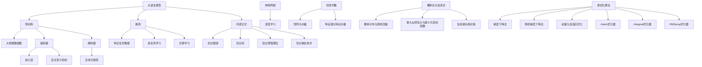

                 

### 《大语言模型原理基础与前沿 外部记忆》

> **关键词：** 大语言模型，外部记忆，预训练，知识增强，安全与隐私，未来展望。

> **摘要：** 本文旨在全面探讨大语言模型的原理、前沿技术以及外部记忆的应用。文章首先介绍了大语言模型的基础理论，随后深入剖析了外部记忆在大语言模型中的作用和知识增强的方法。接着，文章讲解了大语言模型的数学基础，包括线性代数、概率论与信息论、最优化算法等。然后，文章介绍了大语言模型的前沿技术，如预训练与微调技术，并列举了其应用案例。最后，文章探讨了大语言模型的安全与隐私问题，对其未来发展趋势和应用前景进行了展望。

### 目录大纲

1. **第一部分：大语言模型基础理论**
   1.1 **大语言模型概述**
   1.2 **外部记忆与知识增强**
   1.3 **大语言模型的数学基础**

2. **第二部分：大语言模型的前沿技术与应用**
   2.1 **预训练与微调技术**
   2.2 **大语言模型的应用案例**
   2.3 **外部记忆在大语言模型中的应用**

3. **第三部分：大语言模型的安全与隐私**
   3.1 **大语言模型的安全问题**
   3.2 **大语言模型的隐私保护**

4. **第四部分：大语言模型的未来展望**
   4.1 **大语言模型的未来发展趋势**
   4.2 **大语言模型的实际应用前景**
   4.3 **大语言模型的教育与培训**

### 第一部分：大语言模型基础理论

#### 第1章：大语言模型概述

##### 1.1 大语言模型的定义与背景

大语言模型（Large Language Model，简称LLM）是一种利用深度学习技术对大规模文本数据进行训练的模型。它能够理解、生成和翻译自然语言，从而实现文本处理、语言理解和智能问答等功能。大语言模型的发展起源于自然语言处理（Natural Language Processing，简称NLP）领域，随着深度学习和计算能力的提升，LLM在近年取得了显著的突破。

大语言模型的定义可以描述为：一种能够捕捉自然语言复杂结构，通过大规模数据训练得到的复杂非线性函数。这个函数可以将输入的文本映射到输出的文本，从而实现各种自然语言处理任务。

大语言模型的发展背景主要包括以下几个方面：

1. **数据量的积累**：随着互联网的发展，大量文本数据不断产生，为语言模型的训练提供了丰富的素材。

2. **计算能力的提升**：高性能计算设备和分布式计算技术的发展，使得大规模模型的训练和优化成为可能。

3. **深度学习技术的进步**：深度神经网络在图像、语音等领域的成功，激发了研究者将深度学习应用于自然语言处理。

4. **并行计算与分布式训练**：分布式计算技术使得大规模模型的训练可以并行进行，大大提高了训练效率。

大语言模型的应用场景非常广泛，包括但不限于以下领域：

1. **文本生成**：如文章写作、诗歌创作、对话生成等。

2. **语言翻译**：如机器翻译、跨语言文本生成等。

3. **问答系统**：如智能客服、问答机器人等。

4. **文本分类**：如新闻分类、情感分析等。

5. **文本摘要**：如文章摘要、会议纪要等。

##### 1.2 大语言模型的核心原理

大语言模型的核心原理是基于统计学习的语言模型和深度学习模型。下面将分别介绍这两种模型的基本原理。

1. **统计语言模型**

统计语言模型是基于概率论和统计学方法建立的，它的基本思想是通过对大量文本数据的学习，计算每个单词出现的概率，从而预测下一个单词。统计语言模型的主要模型包括：

- **N元语法模型**：N元语法模型是一种基于前N个单词预测下一个单词的模型，其中N通常为1到4。这种模型简单直观，但存在长文本中的长依赖问题。

- **隐马尔可夫模型（HMM）**：隐马尔可夫模型是一种统计模型，用于描述一个隐藏的随机过程，该过程无法直接观测，但可以通过观测到的输出序列推断其状态序列。HMM在语音识别和词性标注等领域有广泛应用。

- **条件随机场（CRF）**：条件随机场是一种概率图模型，用于处理序列标注问题，如词性标注、命名实体识别等。CRF能够建模序列中的依赖关系，比传统的N元语法模型有更好的表现。

2. **深度学习语言模型**

深度学习语言模型是基于神经网络建立的，它通过多层非线性变换，从输入数据中提取特征，并输出预测结果。深度学习语言模型的主要模型包括：

- **循环神经网络（RNN）**：循环神经网络是一种适用于序列数据的神经网络，它通过隐藏状态的记忆机制，能够处理长序列中的依赖关系。RNN在语音识别、机器翻译等领域有广泛应用。

- **长短期记忆网络（LSTM）**：长短期记忆网络是RNN的一种变体，它通过引入门控机制，解决了RNN的梯度消失和梯度爆炸问题，能够更好地处理长序列数据。

- **Transformer模型**：Transformer模型是近年来提出的一种基于自注意力机制的深度学习模型，它在机器翻译、文本生成等领域取得了显著的突破。Transformer模型通过多头注意力机制，能够捕捉全局依赖关系，具有更强的表达能力和计算效率。

大语言模型的优势在于其强大的语义理解和生成能力，能够处理复杂的自然语言任务。常见的架构包括：

- **序列到序列（Seq2Seq）模型**：Seq2Seq模型是一种基于编码器-解码器结构的深度学习模型，用于处理序列到序列的任务，如机器翻译、文本生成等。

- **预训练加微调（Pre-training and Fine-tuning）模型**：预训练加微调模型是近年来提出的一种训练策略，首先在大规模数据集上进行预训练，然后针对特定任务进行微调。这种模型能够利用预训练得到的通用特征，提高特定任务的性能。

- **多模态语言模型**：多模态语言模型能够处理多种类型的数据，如文本、图像、音频等，通过融合不同模态的特征，实现跨模态的任务。

##### 1.3 大语言模型的应用场景

大语言模型的应用场景非常广泛，下面列举一些常见的应用场景：

1. **文本生成**：文本生成包括文章写作、诗歌创作、对话生成等。大语言模型能够生成高质量的自然语言文本，为各种文本生成任务提供强大的支持。

2. **语言翻译**：语言翻译包括机器翻译、跨语言文本生成等。大语言模型通过学习多语言数据，能够实现高质量的语言翻译，广泛应用于国际交流、电子商务等领域。

3. **问答系统**：问答系统包括智能客服、问答机器人等。大语言模型能够理解用户的问题，并生成准确的回答，为用户提供便捷的服务。

4. **文本分类**：文本分类包括新闻分类、情感分析等。大语言模型能够根据文本内容，将其归类到不同的类别，为信息检索、舆情监测等提供支持。

5. **文本摘要**：文本摘要包括文章摘要、会议纪要等。大语言模型能够自动提取文本的主要信息，为用户提供简洁的摘要。

6. **语音识别**：语音识别包括语音转文字、语音控制等。大语言模型结合语音识别技术，能够实现语音交互，为智能音箱、智能助手等提供支持。

7. **图像描述生成**：图像描述生成包括图像到文本的转换、图像标题生成等。大语言模型能够根据图像内容生成相应的文本描述，为图像理解和视觉问答提供支持。

8. **多模态任务**：多模态任务包括文本与图像、文本与音频的融合。大语言模型能够处理多模态数据，实现跨模态的任务，如视频摘要、多模态问答等。

#### 第2章：外部记忆与知识增强

##### 2.1 外部记忆的概念与作用

外部记忆（External Memory）是指在大语言模型中引入的一种记忆机制，用于存储和检索与语言任务相关的知识。外部记忆的作用是提升大语言模型的知识理解和表达能力，使其在特定任务中能够更好地利用外部知识。

外部记忆的概念可以类比于人类大脑中的记忆系统。人类大脑具有短期记忆和长期记忆，其中短期记忆用于处理当前的任务，而长期记忆则存储了大量的知识。类似地，外部记忆在大语言模型中充当长期记忆的角色，用于存储和检索与语言任务相关的知识。

外部记忆在大语言模型中的运用主要体现在以下几个方面：

1. **知识存储**：外部记忆可以存储大量结构化或非结构化的知识，如知识图谱、实体关系等。这些知识可以用来丰富大语言模型的语义理解能力。

2. **知识检索**：外部记忆能够根据输入的查询，快速检索与查询相关的知识，并将其用于语言生成或推理任务。

3. **知识融合**：外部记忆可以融合来自不同来源的知识，如文本、图像、音频等，实现多模态的知识理解。

外部记忆的优势在于能够提升大语言模型的知识理解和表达能力，使其在特定任务中能够更好地利用外部知识。同时，外部记忆还可以减轻模型的计算负担，提高模型的推理速度。

然而，外部记忆也面临着一些挑战，如知识表示、知识检索效率、知识融合等。因此，如何设计有效的外部记忆机制，仍是一个具有挑战性的问题。

##### 2.2 知识增强的方法与技术

知识增强（Knowledge Augmentation）是指通过引入外部知识，提升大语言模型在特定任务中的性能。知识增强的方法主要包括以下几种：

1. **知识图谱**：知识图谱是一种用于表示实体及其关系的图结构。通过引入知识图谱，大语言模型可以获取丰富的实体关系知识，从而提升其语义理解能力。

2. **知识库**：知识库是一种存储特定领域知识的数据库。大语言模型可以通过访问知识库，获取与语言任务相关的领域知识，从而提高其在特定领域的表现。

3. **语义网络**：语义网络是一种基于语义关系表示知识的方法。通过构建语义网络，大语言模型可以理解实体之间的语义关系，从而更好地进行语言生成和推理。

4. **多模态融合**：多模态融合是指将不同模态的数据（如文本、图像、音频等）进行融合，以丰富大语言模型的输入信息。通过多模态融合，大语言模型可以更好地理解复杂任务中的多模态信息。

5. **预训练**：预训练是指在大规模数据集上对大语言模型进行训练，使其具备一定的通用语言理解能力。通过预训练，大语言模型可以学习到丰富的外部知识，从而提高其知识增强能力。

知识增强技术的选择取决于具体的应用场景和任务需求。在实际应用中，可以结合多种知识增强方法，以实现最佳效果。

##### 2.3 知识增强的算法与模型

知识增强的算法与模型主要包括以下几种：

1. **统一嵌入模型（Unified Embedding Model）**：统一嵌入模型是一种将知识嵌入到统一嵌入空间的方法。该方法通过将实体、关系和属性等知识映射到同一空间，实现知识的融合和推理。

2. **知识图谱嵌入（Knowledge Graph Embedding）**：知识图谱嵌入是指将知识图谱中的实体和关系映射到低维空间。该方法通过学习实体和关系的嵌入向量，实现知识的表示和推理。

3. **知识蒸馏（Knowledge Distillation）**：知识蒸馏是指将一个大型模型的知识传递给一个小型模型。该方法通过训练一个教师模型和一个小型学生模型，实现知识的转移和压缩。

4. **多任务学习（Multi-task Learning）**：多任务学习是指同时训练多个相关任务，以提高模型的泛化能力。通过多任务学习，模型可以同时学习到多个任务的知识，从而提高其知识增强能力。

5. **知识增强的注意力机制（Knowledge-enhanced Attention Mechanism）**：知识增强的注意力机制是指将外部知识引入到注意力机制中，以提升模型对知识的利用效率。该方法通过学习外部知识的权重，实现知识的自适应利用。

在实际应用中，可以根据具体任务需求，选择合适的知识增强算法与模型。同时，可以结合多种方法，以实现最佳的知识增强效果。

#### 第3章：大语言模型的数学基础

##### 3.1 线性代数基础

线性代数是数学的一个分支，主要研究向量空间、线性变换以及矩阵理论。在大语言模型中，线性代数的基础知识是理解和实现模型的关键。

1. **矩阵与向量**

矩阵（Matrix）是一个由数字排列成的二维表格，通常用大写字母表示，如A。矩阵的行和列分别表示行数和列数，如\( A_{m \times n} \)表示一个m行n列的矩阵。

向量（Vector）是一个由数字组成的序列，通常用小写字母表示，如v。向量在数学和计算机科学中有着广泛的应用，例如在深度学习中的权重和激活值。

2. **线性方程组**

线性方程组是由多个线性方程组成的一个系统，通常用矩阵形式表示。一个线性方程组可以写成如下形式：

\[ A \mathbf{x} = \mathbf{b} \]

其中，A是一个系数矩阵，x是一个未知向量，b是一个常数向量。

求解线性方程组的方法包括高斯消元法、矩阵分解等。在大语言模型中，线性方程组常常用于计算模型的参数。

3. **特征值与特征向量**

特征值（Eigenvalue）和特征向量（Eigen vector）是矩阵理论中的重要概念。对于一个方阵A，如果存在一个非零向量v和一个常数λ，使得\( A v = \lambda v \)，则λ是A的特征值，v是A的特征向量。

特征值和特征向量在矩阵分解、特征提取等领域有重要应用。在大语言模型中，特征值和特征向量可以用于特征降维和模型正则化。

##### 3.2 概率论与信息论

概率论和信息论是数学的两个重要分支，在大语言模型中有着广泛的应用。

1. **概率分布与随机变量**

概率分布描述了随机变量取值的概率。常见的概率分布包括正态分布、伯努利分布、多项式分布等。随机变量（Random Variable）是概率论中的一个核心概念，它是一个将样本空间映射到实数集的函数。

在大语言模型中，概率分布用于建模文本数据，如词的概率分布、句子的概率分布等。

2. **最大似然估计与最小化损失函数**

最大似然估计（Maximum Likelihood Estimation，简称MLE）是一种参数估计方法，通过最大化观察数据出现的概率，估计模型的参数。最小化损失函数（Minimization of Loss Function）是一种优化方法，通过调整模型的参数，使模型的预测结果与实际结果之间的差距最小。

在大语言模型中，最大似然估计和最小化损失函数用于训练模型，如神经网络的权重和偏置。

3. **信息熵与相对熵**

信息熵（Entropy）是信息论中的一个重要概念，用于衡量随机变量的不确定性。相对熵（Relative Entropy）也称为KL散度（Kullback-Leibler Divergence），是衡量两个概率分布差异的一种度量。

在大语言模型中，信息熵和信息论用于优化模型的性能，如调整超参数、评估模型效果等。

##### 3.3 最优化算法

最优化算法是解决优化问题的一类算法，其目标是找到函数的最小值或最大值。在大语言模型中，最优化算法用于训练模型，如调整神经网络的权重和偏置。

1. **梯度下降法**

梯度下降法（Gradient Descent）是最常用的最优化算法之一。其基本思想是沿着函数梯度的反方向更新参数，以逐步减小损失函数的值。

伪代码如下：

```python
while not converged:
    for each parameter θ in the model:
        Δθ = -learning_rate \* gradient(θ)
        θ = θ + Δθ
```

其中，learning_rate是学习率，gradient(θ)是参数θ的梯度。

2. **随机梯度下降法**

随机梯度下降法（Stochastic Gradient Descent，简称SGD）是梯度下降法的一种变体，其梯度是由随机样本计算得到的。SGD在训练过程中引入随机性，可以提高收敛速度和泛化能力。

伪代码如下：

```python
while not converged:
    for each random sample (x, y) in the dataset:
        Δθ = -learning_rate \* gradient(θ, x, y)
        θ = θ + Δθ
```

其中，learning_rate是学习率，gradient(θ, x, y)是参数θ在样本(x, y)上的梯度。

3. **动量与自适应优化**

动量（Momentum）是一种用于加速梯度下降的方法，其思想是保持前几次梯度的方向和大小，从而加快收敛速度。

伪代码如下：

```python
v = 0
while not converged:
    v = momentum \* v - learning_rate \* gradient(θ)
    θ = θ + v
```

其中，momentum是动量系数，learning_rate是学习率。

自适应优化（Adaptive Optimization）是一种动态调整学习率的方法，其目标是找到最优的学习率，以提高模型的性能。

常见的自适应优化方法包括：

- **Adam优化器**：Adam是一种基于一阶矩估计和二阶矩估计的自适应优化器，其计算公式如下：

  ```python
  m_t = β1 \* m_{t-1} + (1 - β1) \* gradient(θ)
  v_t = β2 \* v_{t-1} + (1 - β2) \* gradient^2(θ)
  θ = θ - learning_rate \* (m_t / (1 - β1^t) \* sqrt(1 - β2^t))
  ```

  其中，β1和β2是动量系数，m_t和v_t分别是参数θ的一阶矩估计和二阶矩估计。

- **Adagrad优化器**：Adagrad是一种基于历史梯度平方的自适应优化器，其计算公式如下：

  ```python
  Δθ = -learning_rate \* gradient(θ) / sum(gradient^2(θ))
  θ = θ + Δθ
  ```

  其中，learning_rate是学习率。

- **RMSprop优化器**：RMSprop是一种基于历史梯度平方根的自适应优化器，其计算公式如下：

  ```python
  Δθ = -learning_rate \* gradient(θ) / sqrt(sum(gradient^2(θ)))
  θ = θ + Δθ
  ```

  其中，learning_rate是学习率。

通过以上优化算法，大语言模型可以在训练过程中不断调整参数，以实现最优性能。

### 第二部分：大语言模型的前沿技术与应用

#### 第4章：预训练与微调技术

##### 4.1 预训练技术详解

预训练（Pre-training）是指在大规模数据集上对大语言模型进行训练，使其具备一定的通用语言理解能力。预训练技术是近年来大语言模型取得显著突破的关键因素之一。本节将详细介绍预训练技术。

1. **预训练的概念**

预训练是指在大规模数据集上对模型进行训练，以学习通用特征和知识。预训练的核心思想是通过在大规模数据上进行预训练，使模型具备良好的泛化能力，从而在特定任务上实现优异的性能。

2. **预训练的数据集**

预训练的数据集是预训练技术的关键因素之一。常用的预训练数据集包括：

- **维基百科（Wikipedia）**：维基百科是最大的在线多语言百科全书，包含大量的高质量文本数据，是预训练的主要数据来源之一。

- **新闻数据集**：新闻数据集包含大量的新闻报道，有助于模型学习新闻领域的语言特征。

- **通用语言模型数据集（GLM-DATA）**：通用语言模型数据集是一个包含多种语言的大型数据集，旨在支持多语言预训练。

- **社交媒体数据集**：社交媒体数据集包含大量的社交媒体文本，有助于模型学习社交媒体的语言特征。

3. **预训练的模型架构**

预训练的模型架构通常采用深度神经网络，特别是基于自注意力机制的Transformer模型。Transformer模型在预训练过程中表现出优异的性能，成为预训练技术的首选模型。

预训练的模型架构主要包括以下几个部分：

- **编码器（Encoder）**：编码器负责将输入文本转换为固定长度的嵌入向量。

- **解码器（Decoder）**：解码器负责生成输出文本。在预训练过程中，解码器通常使用生成式模型，如自回归语言模型。

- **多头注意力机制**：多头注意力机制是Transformer模型的核心组成部分，用于计算输入文本之间的依赖关系。

- **前馈神经网络**：前馈神经网络用于对嵌入向量进行非线性变换，以增强模型的表示能力。

4. **预训练的步骤**

预训练主要包括以下几个步骤：

- **数据预处理**：对原始文本数据进行清洗、分词和标记等预处理操作，将其转换为模型可以处理的形式。

- **嵌入层**：嵌入层将单词转换为嵌入向量，用于表示单词的语义信息。

- **自注意力机制**：自注意力机制用于计算输入文本中各个单词之间的依赖关系。

- **前馈神经网络**：前馈神经网络对自注意力机制的输出进行非线性变换，以增强模型的表示能力。

- **损失函数**：预训练过程中使用损失函数（如交叉熵损失函数）评估模型的性能，并根据损失函数的梯度更新模型参数。

- **优化算法**：使用优化算法（如Adam优化器）更新模型参数，以最小化损失函数。

- **预训练结束条件**：预训练通常在达到一定的迭代次数或性能阈值后结束。

##### 4.2 微调技术详解

微调（Fine-tuning）是指在大规模预训练模型的基础上，针对特定任务进行微调，以适应特定任务的需求。微调技术是预训练技术的延伸，通过在特定任务上调整模型参数，使模型在特定任务上取得优异性能。

1. **微调的概念**

微调是指在预训练模型的基础上，针对特定任务进行调整，以优化模型在特定任务上的性能。微调的核心思想是通过在特定任务上的数据训练，使模型更好地适应特定任务的需求。

2. **微调的原理**

微调的原理可以概括为以下几点：

- **预训练模型的迁移能力**：预训练模型在大规模数据集上学习到了丰富的通用特征和知识，具有较好的迁移能力。通过在特定任务上微调，模型可以快速适应特定任务的需求。

- **模型参数的调整**：微调过程中，模型参数会根据特定任务的数据进行更新，以优化模型在特定任务上的性能。

- **数据增强**：在微调过程中，可以使用数据增强技术（如数据清洗、数据扩充等），以提高模型对数据的适应性。

3. **微调的流程**

微调的流程主要包括以下几个步骤：

- **数据预处理**：对特定任务的数据进行清洗、分词和标记等预处理操作，将其转换为模型可以处理的形式。

- **加载预训练模型**：从预训练模型中加载预训练的参数，作为微调的初始参数。

- **微调训练**：在特定任务的数据集上进行微调训练，根据任务的需求调整模型参数。

- **评估模型性能**：使用验证集或测试集评估模型的性能，根据性能指标调整模型参数。

- **迭代优化**：根据评估结果，重复进行微调训练和评估，直到满足特定任务的需求。

4. **微调中的挑战与解决方案**

在微调过程中，可能会面临以下挑战：

- **过拟合**：在特定任务上的数据量有限，模型容易在训练数据上过拟合，导致在测试数据上性能下降。

  解决方案：使用正则化技术（如Dropout、L2正则化等）和交叉验证方法，减少过拟合的风险。

- **数据不足**：某些任务的数据量有限，无法充分利用预训练模型的能力。

  解决方案：使用数据增强技术（如数据清洗、数据扩充等）和迁移学习技术，提高模型对数据不足的适应性。

- **计算资源限制**：微调过程通常需要大量的计算资源，对于大规模预训练模型，计算资源可能成为一个瓶颈。

  解决方案：使用分布式训练技术（如多GPU训练、分布式数据并行等），提高训练效率。

- **模型适应性**：预训练模型在不同任务上的适应性可能不同，需要针对特定任务进行优化。

  解决方案：设计适合特定任务的模型架构和训练策略，提高模型在特定任务上的适应性。

##### 4.3 微调中的挑战与解决方案

在微调过程中，可能会面临以下挑战：

- **过拟合**：在特定任务上的数据量有限，模型容易在训练数据上过拟合，导致在测试数据上性能下降。

  解决方案：使用正则化技术（如Dropout、L2正则化等）和交叉验证方法，减少过拟合的风险。

- **数据不足**：某些任务的数据量有限，无法充分利用预训练模型的能力。

  解决方案：使用数据增强技术（如数据清洗、数据扩充等）和迁移学习技术，提高模型对数据不足的适应性。

- **计算资源限制**：微调过程通常需要大量的计算资源，对于大规模预训练模型，计算资源可能成为一个瓶颈。

  解决方案：使用分布式训练技术（如多GPU训练、分布式数据并行等），提高训练效率。

- **模型适应性**：预训练模型在不同任务上的适应性可能不同，需要针对特定任务进行优化。

  解决方案：设计适合特定任务的模型架构和训练策略，提高模型在特定任务上的适应性。

#### 第5章：大语言模型的应用案例

##### 5.1 机器翻译

机器翻译（Machine Translation，简称MT）是指利用计算机技术将一种自然语言翻译成另一种自然语言的过程。大语言模型在机器翻译领域取得了显著的突破，能够实现高质量、高效率的翻译。

1. **机器翻译的基本原理**

机器翻译的基本原理是基于语言模型的序列到序列（Seq2Seq）模型。Seq2Seq模型由编码器（Encoder）和解码器（Decoder）组成，编码器将源语言文本编码成一个固定长度的向量，解码器则将这个向量解码成目标语言文本。

2. **大语言模型在机器翻译中的应用**

大语言模型通过在大量多语言数据上进行预训练，学习到丰富的语言特征和知识，从而提高了机器翻译的性能。具体应用包括：

- **编码器**：编码器将源语言文本编码成一个固定长度的向量，这个向量包含了源语言文本的语义信息。

- **解码器**：解码器将编码器的输出向量解码成目标语言文本。解码过程中，解码器会根据当前已生成的文本和输入的编码器输出，生成下一个单词。

3. **机器翻译的前沿技术**

近年来，机器翻译领域的前沿技术主要包括：

- **多模态机器翻译**：多模态机器翻译是指将文本、图像、音频等多种模态的数据进行融合，实现更准确的翻译。例如，将图像和文本进行融合，提高翻译的准确性。

- **迁移学习**：迁移学习是指利用预训练的大语言模型，快速适应新的翻译任务。例如，在新的翻译任务上微调预训练的模型，提高翻译性能。

- **神经机器翻译**：神经机器翻译是指使用神经网络代替传统的规则方法，实现更高效、更准确的翻译。例如，使用Transformer模型实现神经机器翻译，提高了翻译的质量和速度。

##### 5.2 问答系统

问答系统（Question Answering System，简称QAS）是指能够回答用户问题的计算机系统。大语言模型在问答系统领域取得了显著突破，能够实现高质量的问答。

1. **问答系统的基本原理**

问答系统的基本原理是基于大语言模型的问答框架。问答框架包括以下几个部分：

- **问题理解**：将用户的问题转换为模型可以处理的形式，通常使用自然语言处理技术（如分词、词性标注等）。

- **答案检索**：在预训练的大语言模型中检索与用户问题相关的答案。检索过程通常使用匹配算法（如BERT匹配算法等）。

- **答案生成**：根据检索到的答案生成用户问题的回答。答案生成通常使用生成式模型（如生成式语言模型等）。

2. **大语言模型在问答系统中的应用**

大语言模型通过在大量问答数据上进行预训练，学习到丰富的语言特征和知识，从而提高了问答系统的性能。具体应用包括：

- **问题理解**：大语言模型能够理解用户的问题，将其转换为模型可以处理的形式。例如，使用BERT模型对用户的问题进行编码，得到问题的固定长度向量。

- **答案检索**：大语言模型在预训练过程中学习到的语言特征，能够帮助模型快速检索与用户问题相关的答案。例如，使用检索算法（如相似度计算等）检索与用户问题最相关的文档。

- **答案生成**：大语言模型能够生成用户问题的回答。例如，使用生成式模型（如GPT模型等）生成用户问题的回答。

3. **问答系统的实现与优化**

问答系统的实现主要包括以下几个步骤：

- **数据预处理**：对问答数据进行预处理，包括分词、词性标注、实体识别等。

- **模型训练**：使用预训练的大语言模型对问答数据集进行训练，优化模型参数。

- **模型部署**：将训练好的模型部署到服务器上，实现实时问答。

问答系统的优化主要包括以下几个方面：

- **模型优化**：通过调整模型参数，优化模型在问答任务上的性能。例如，使用不同类型的优化算法（如Adam、AdamW等）调整模型参数。

- **数据增强**：通过数据增强技术（如数据清洗、数据扩充等）提高模型对问答数据的适应性。

- **多模态融合**：通过多模态融合技术（如文本、图像、音频等）提高问答系统的准确性。例如，将文本、图像、音频等多种模态的数据进行融合，实现更准确的问答。

##### 5.3 文本生成

文本生成（Text Generation）是指利用计算机技术生成自然语言文本的过程。大语言模型在文本生成领域取得了显著突破，能够实现高质量、多样化的文本生成。

1. **文本生成的原理**

文本生成的原理是基于大语言模型的生成式模型。生成式模型通过学习大量文本数据，生成新的文本。文本生成的过程主要包括以下几个步骤：

- **输入编码**：将输入的文本编码成一个固定长度的向量，表示文本的语义信息。

- **生成文本**：基于输入编码的向量，生成新的文本。生成文本的过程通常使用生成式模型（如GPT、T5等）。

2. **大语言模型在文本生成中的应用**

大语言模型通过在大量文本数据上进行预训练，学习到丰富的语言特征和知识，从而提高了文本生成的性能。具体应用包括：

- **文章写作**：大语言模型能够生成高质量的文章，包括新闻报道、科技文章、学术论文等。

- **对话生成**：大语言模型能够生成自然流畅的对话，应用于聊天机器人、虚拟助手等场景。

- **诗歌创作**：大语言模型能够生成具有艺术价值的诗歌，包括现代诗、古诗等。

3. **文本生成的挑战与解决方案**

文本生成面临着以下挑战：

- **多样性**：如何生成具有多样性的文本，避免生成重复、单调的内容。

  解决方案：通过引入多样性损失函数（如Novelty Loss、Diversity Loss等）和调整生成模型的结构（如引入多头注意力机制、变长序列生成等），提高文本生成的多样性。

- **质量**：如何生成高质量、符合人类语言习惯的文本。

  解决方案：通过预训练大量的高质量文本数据，提高生成模型的语言表达能力。同时，引入文本质量评估指标（如Perplexity、ROUGE等），优化生成模型的性能。

- **控制性**：如何控制文本生成的方向和内容，使其符合用户的需求。

  解决方案：通过引入控制性生成技术（如条件生成、引导生成等），使文本生成更加可控。例如，使用条件生成模型（如C-GPT、Ctrl-LM等）生成符合特定主题或风格的文本。

- **效率**：如何提高文本生成的效率，减少计算资源和时间成本。

  解决方案：通过优化生成模型的结构（如使用Transformer模型、混合模型等）和提高训练效率（如并行训练、分布式训练等），提高文本生成的效率。

#### 第6章：外部记忆在大语言模型中的应用

##### 6.1 知识图谱的构建与应用

知识图谱（Knowledge Graph）是一种用于表示实体及其关系的语义网络。在大语言模型中，知识图谱可以用于增强模型的语义理解和推理能力。

1. **知识图谱的构建方法**

知识图谱的构建通常包括以下几个步骤：

- **实体识别**：从文本数据中提取实体，如人名、地名、组织名等。

- **关系抽取**：从文本数据中提取实体之间的关系，如“属于”、“位于”等。

- **实体链接**：将文本中的实体与知识图谱中的实体进行匹配，建立实体之间的链接。

- **图谱构建**：将实体和关系组织成知识图谱，如使用图数据库（如Neo4j、JanusGraph等）存储知识图谱。

2. **知识图谱在大语言模型中的运用**

知识图谱在大语言模型中的运用主要包括以下几个方面：

- **实体嵌入**：将知识图谱中的实体嵌入到模型的嵌入空间中，提高模型对实体的语义理解能力。

- **关系嵌入**：将知识图谱中的关系嵌入到模型的嵌入空间中，帮助模型理解实体之间的语义关系。

- **图谱查询**：在知识图谱中查询与输入文本相关的实体和关系，为模型提供额外的语义信息。

- **图谱推理**：利用知识图谱进行逻辑推理，提高模型对文本的语义理解能力。

3. **知识图谱的优化与更新**

知识图谱的优化与更新是保持其准确性和时效性的关键。常见的优化与更新方法包括：

- **实体识别与关系抽取**：使用最新的文本数据进行实体识别和关系抽取，更新知识图谱中的实体和关系。

- **实体链接**：使用最新的实体链接算法，提高实体链接的准确性和时效性。

- **图谱重构**：定期对知识图谱进行重构，优化图结构，提高查询效率。

- **数据清洗**：对知识图谱中的数据进行清洗，去除错误信息和冗余信息，提高知识图谱的准确性。

##### 6.2 知识增强的算法与模型

知识增强（Knowledge Augmentation）是指通过引入外部知识，提升大语言模型在特定任务中的性能。知识增强的算法与模型主要包括以下几个方面：

1. **知识融合算法**

知识融合算法是指将外部知识引入到大语言模型中，以提高模型的语义理解和推理能力。常见的知识融合算法包括：

- **知识蒸馏**：知识蒸馏是指将外部知识（如知识图谱、知识库等）传递给大语言模型，通过训练使其具备外部知识的能力。知识蒸馏的核心思想是将知识表示为高维向量，并将其传递给大语言模型。

- **知识融合网络**：知识融合网络是指将外部知识引入到大语言模型中，通过融合网络结构（如图神经网络、注意力机制等）实现知识的融合。知识融合网络能够将外部知识整合到模型的嵌入空间中，提高模型的语义理解能力。

2. **知识增强模型**

知识增强模型是指通过引入外部知识，提升大语言模型在特定任务中的性能。常见的知识增强模型包括：

- **知识图谱嵌入模型**：知识图谱嵌入模型是指将知识图谱中的实体和关系映射到低维空间，形成实体嵌入和关系嵌入。知识图谱嵌入模型能够通过查询知识图谱，获取与输入文本相关的实体和关系，提高模型的语义理解能力。

- **多模态知识增强模型**：多模态知识增强模型是指将文本、图像、音频等多种模态的数据进行融合，形成多模态知识。多模态知识增强模型能够通过融合不同模态的知识，提高模型的语义理解和推理能力。

- **预训练知识增强模型**：预训练知识增强模型是指在大规模预训练数据集上，引入外部知识进行预训练，以提升模型的通用语义理解能力。预训练知识增强模型能够通过在特定任务上进行微调，实现高性能的知识增强。

3. **知识增强的优化策略**

知识增强的优化策略是指通过调整模型参数和训练策略，提高知识增强的效果。常见的优化策略包括：

- **动态知识检索**：动态知识检索是指根据输入文本，动态查询知识图谱，获取与输入文本相关的实体和关系。动态知识检索能够提高模型的实时性，同时保证知识增强的效果。

- **知识一致性优化**：知识一致性优化是指通过调整模型参数，提高知识增强的一致性。知识一致性优化能够确保模型在引入外部知识时，保持内部的一致性，避免知识冲突。

- **知识融合效率优化**：知识融合效率优化是指通过调整模型结构，提高知识融合的效率。知识融合效率优化能够减少模型计算量，提高知识增强的效果。

#### 第7章：大语言模型的安全与隐私

##### 7.1 大语言模型的安全问题

随着大语言模型的广泛应用，其安全问题也日益凸显。大语言模型的安全问题主要包括以下几个方面：

1. **模型入侵**：攻击者可以通过恶意输入，操纵模型的输出，导致模型产生错误的结果。例如，通过构造特殊的输入，使模型生成恶意代码或执行恶意操作。

2. **数据泄露**：大语言模型通常需要大量的训练数据，这些数据可能包含敏感信息。如果模型训练过程不当，可能导致敏感数据泄露。

3. **模型滥用**：大语言模型可以被用于生成虚假信息、进行网络攻击等恶意行为。例如，攻击者可以通过模型生成虚假新闻、欺诈信息等，对社会造成危害。

4. **隐私侵犯**：大语言模型在训练过程中，可能会收集用户的隐私信息。如果这些信息泄露，可能导致用户的隐私受到侵犯。

##### 7.2 安全防护的基本方法

为了解决大语言模型的安全问题，可以采取以下基本方法：

1. **模型加密**：对模型的参数和权重进行加密，确保模型在传输和存储过程中的安全性。

2. **访问控制**：对模型的访问权限进行严格控制，确保只有授权用户可以访问和操作模型。

3. **数据加密**：对训练数据和使用数据进行加密，防止数据泄露。

4. **异常检测**：建立异常检测系统，实时监测模型的输出和用户行为，发现异常情况及时采取措施。

5. **隐私保护技术**：采用隐私保护技术，如差分隐私、同态加密等，确保用户隐私不被泄露。

##### 7.3 安全评估与测试

安全评估与测试是确保大语言模型安全的关键步骤。常见的安全评估与测试方法包括：

1. **静态分析**：通过静态分析，检查模型的代码和架构，发现潜在的安全漏洞。

2. **动态分析**：通过动态分析，运行模型并监视其输出，发现潜在的安全威胁。

3. **渗透测试**：模拟攻击者的攻击行为，对模型进行渗透测试，评估模型的安全性。

4. **安全测试工具**：使用安全测试工具（如静态代码分析工具、动态分析工具等），自动化评估模型的安全性能。

5. **安全审计**：定期进行安全审计，评估模型的安全性，发现和修复潜在的安全漏洞。

##### 7.4 大语言模型的隐私保护

随着大语言模型的应用广泛，其隐私保护问题也日益受到关注。大语言模型的隐私保护主要包括以下几个方面：

1. **数据匿名化**：对训练数据和使用数据进行匿名化处理，去除敏感信息，防止用户隐私泄露。

2. **隐私保护算法**：采用隐私保护算法，如差分隐私、同态加密等，确保用户隐私不被泄露。

3. **隐私预算**：制定隐私预算，限制模型训练和使用过程中对用户隐私的访问和使用。

4. **隐私告知与同意**：明确告知用户大语言模型的隐私政策和数据收集范围，并取得用户的同意。

5. **隐私影响评估**：对大语言模型的隐私影响进行评估，确保模型的设计和实施符合隐私保护的要求。

#### 第8章：大语言模型的未来发展趋势

##### 8.1 大语言模型的未来趋势

大语言模型在近年来取得了显著的突破，其未来发展趋势包括以下几个方面：

1. **模型规模的持续增长**：随着计算能力的提升和存储技术的进步，大语言模型的规模将不断增长。未来的大语言模型将能够处理更大的文本数据集，实现更强大的语义理解能力。

2. **计算能力的提升**：随着硬件技术的进步，如GPU、TPU等高性能计算设备的广泛应用，大语言模型的计算能力将得到显著提升。这将使得大语言模型能够更快速地训练和部署，满足更复杂的应用需求。

3. **应用领域的拓展**：大语言模型的应用领域将不断拓展，从传统的文本生成、机器翻译、问答系统等，逐步延伸到图像生成、视频分析、语音识别等领域。多模态大语言模型的兴起，将为各种跨模态任务提供新的解决方案。

4. **知识增强与推理能力**：大语言模型将进一步加强其知识增强和推理能力。通过引入外部知识，如知识图谱、知识库等，大语言模型将能够更好地理解和应用复杂知识，提高在专业领域的表现。

5. **安全性提升与隐私保护**：随着大语言模型的应用广泛，其安全性和隐私保护问题将得到更多关注。未来的大语言模型将采用更先进的安全防护技术和隐私保护机制，确保用户数据和模型安全。

##### 8.2 大语言模型的挑战与机遇

大语言模型在未来的发展中将面临一系列挑战和机遇：

1. **计算资源的挑战**：随着模型规模的持续增长，对计算资源的需求也将不断增加。高性能计算设备和大规模分布式计算将成为大语言模型发展的重要支撑。

2. **数据隐私与安全的问题**：大语言模型在训练和使用过程中可能涉及用户隐私和数据安全。如何在保证模型性能的同时，保护用户隐私和数据安全，是一个亟待解决的问题。

3. **模型可解释性与透明度**：大语言模型在决策过程中可能存在“黑箱”现象，难以解释其决策过程。如何提高模型的可解释性和透明度，使其更易于被用户接受和理解，是未来的一大挑战。

4. **知识融合与推理能力**：大语言模型需要引入外部知识，以提高其在专业领域的表现。如何有效地融合不同来源的知识，并提高模型的推理能力，是未来研究的重点。

5. **多模态任务的挑战**：多模态大语言模型需要处理多种类型的数据，如文本、图像、音频等。如何设计有效的多模态融合策略，实现跨模态的任务，是未来的一大机遇。

6. **应用场景的创新**：大语言模型将在各个领域发挥重要作用，如智能客服、医疗诊断、教育辅助等。如何发掘和应用大语言模型在各个领域的潜力，是未来的一个重要方向。

7. **伦理与责任**：随着大语言模型的应用广泛，其伦理和责任问题也将受到关注。如何确保大语言模型的决策公平、公正，避免歧视和偏见，是一个重要的社会议题。

#### 第9章：大语言模型的实际应用前景

##### 9.1 企业应用案例

大语言模型在企业发展中具有广泛的应用前景，以下是一些典型的企业应用案例：

1. **智能客服系统**：企业可以通过部署大语言模型，实现智能客服系统的建设。智能客服系统能够理解用户的问题，并生成相应的回答，提高客户服务效率，降低人工成本。

2. **文本分析平台**：企业可以利用大语言模型进行文本分析，包括情感分析、主题分类、关键词提取等。这些分析结果可以帮助企业更好地了解用户需求，优化产品和服务。

3. **内容生成工具**：大语言模型可以用于生成各种文本内容，如新闻报道、产品介绍、营销文案等。企业可以通过大语言模型，快速生成高质量的内容，提高营销效果。

4. **智能决策支持**：大语言模型可以通过分析企业内外部的各种数据，提供智能决策支持。例如，在金融领域，大语言模型可以用于股票分析、风险预测等。

5. **自动化写作平台**：企业可以通过大语言模型，实现自动化写作平台的建设。自动化写作平台可以帮助企业快速生成各种报告、文章等文档，提高工作效率。

##### 9.2 大语言模型对企业的影响

大语言模型对企业的影响主要体现在以下几个方面：

1. **运营效率提升**：大语言模型可以自动化处理各种任务，如客户服务、数据分析等，提高企业运营效率，降低人力成本。

2. **决策支持能力**：大语言模型可以通过分析大量数据，提供智能决策支持，帮助企业做出更准确的决策。

3. **产品创新**：大语言模型可以帮助企业快速生成高质量的内容，如产品介绍、营销文案等，提高产品的市场竞争力。

4. **客户体验优化**：大语言模型可以实现智能客服系统，提高客户服务质量，提升客户满意度。

5. **业务模式创新**：大语言模型可以为企业带来新的业务模式，如智能内容平台、自动化写作服务等。

##### 9.3 大语言模型在企业中的优化策略

为了充分发挥大语言模型在企业中的应用价值，可以采取以下优化策略：

1. **数据质量提升**：保证数据质量是提高大语言模型性能的关键。企业应加强对数据的清洗、标注和预处理，提高数据质量。

2. **模型定制化**：根据企业特定的业务需求，定制化大语言模型。例如，针对金融领域，可以定制化金融领域的大语言模型，提高其在金融领域的表现。

3. **多模态融合**：结合多种模态的数据，如文本、图像、音频等，实现多模态大语言模型的构建。多模态融合可以提高模型的语义理解能力，实现更准确的应用。

4. **持续优化与迭代**：定期对大语言模型进行优化与迭代，提高模型的性能和适用性。例如，通过引入新的数据集、调整模型参数等，实现模型的持续优化。

5. **安全管理**：加强对大语言模型的安全管理，确保模型的安全性和可靠性。例如，采用加密技术、访问控制等措施，保护模型和数据的安全。

#### 第10章：大语言模型的教育与培训

##### 10.1 大语言模型的教育资源

随着大语言模型的应用日益广泛，相关的教育资源也在不断增加。以下是一些重要的大语言模型教育资源：

1. **在线课程**：许多知名教育平台（如Coursera、edX、Udacity等）提供了大语言模型的在线课程。这些课程涵盖了从基础理论到前沿技术的各个方面。

2. **教材**：一些经典的教材和专著，如《深度学习》（Goodfellow et al.）、《自然语言处理与深度学习》（李航）、《深度学习入门：基于Python》（斋藤康毅）等，为大语言模型的学习提供了系统性的指导。

3. **开源代码**：许多大语言模型的开源代码库，如TensorFlow、PyTorch等，提供了丰富的实践案例和参考代码，有助于学习者深入理解大语言模型的实现原理。

4. **论文与报告**：大量关于大语言模型的高质量论文和报告，如ACL、EMNLP、ICLR等会议和期刊，提供了前沿研究成果和应用实例。

##### 10.2 大语言模型的学习路径

为了系统地学习大语言模型，以下是一个推荐的学习路径：

1. **基础知识**：首先，需要掌握数学基础（如线性代数、概率论与信息论等）和编程基础（如Python、深度学习框架等），为后续学习奠定基础。

2. **入门教程**：学习一些大语言模型的入门教程，了解基本概念和实现方法。例如，通过完成一些简单的自然语言处理任务（如文本分类、命名实体识别等），熟悉大语言模型的基本应用。

3. **深度学习基础**：深入学习深度学习的基础知识，包括神经网络、优化算法等，为后续学习大语言模型的高级技术打下基础。

4. **自然语言处理**：系统学习自然语言处理（NLP）的基本理论和方法，包括词嵌入、序列模型、注意力机制等，为理解大语言模型提供理论支持。

5. **前沿技术**：学习大语言模型的前沿技术，如Transformer、BERT、GPT等，理解这些模型的结构和原理，掌握其实现方法。

6. **实践项目**：通过完成一些实际项目，将所学知识应用于实际问题。例如，构建一个问答系统、文本生成系统等，锻炼实际操作能力。

7. **论文阅读**：阅读大语言模型的相关论文，了解最新的研究进展和应用实例，拓宽视野。

8. **持续学习**：随着大语言模型技术的不断更新，需要持续学习，跟踪最新的研究动态，保持技术的领先。

##### 10.3 大语言模型的教育趋势

大语言模型在教育领域的应用正呈现以下趋势：

1. **跨学科融合**：大语言模型的应用不仅仅是计算机科学领域的课题，也逐渐与其他学科（如语言学、心理学等）相结合，实现跨学科的教育资源整合。

2. **个性化学习**：大语言模型可以分析学生的学习情况，提供个性化的学习建议和资源，帮助学生更好地掌握知识。

3. **互动式学习**：通过大语言模型，可以实现人机交互式的学习体验。例如，学生可以通过与模型的对话，加深对知识点的理解。

4. **教育资源的普及**：大语言模型可以帮助教育机构创建和共享更多的教育内容，使得优质教育资源得以普及，促进教育公平。

5. **在线教育与远程教学**：大语言模型为在线教育和远程教学提供了新的工具和手段，使得学习更加灵活和便捷。

#### 第11章：大语言模型在伦理与社会影响

##### 11.1 伦理问题

随着大语言模型的广泛应用，其在伦理方面的问题也逐渐显现。以下是几个关键伦理问题：

1. **偏见与歧视**：大语言模型在训练过程中可能学习到训练数据中的偏见，导致模型在决策过程中出现偏见和歧视。例如，模型可能对某些性别、种族或群体持有偏见，导致不公平的决策。

2. **隐私侵犯**：大语言模型在训练和使用过程中可能涉及用户隐私信息的收集和使用。如果这些信息未经用户同意或不当使用，可能侵犯用户的隐私权。

3. **责任归属**：当大语言模型产生错误决策或行为时，责任如何归属？是模型开发者、使用模型的企业还是用户本身？这个问题在法律和伦理方面都具有重要意义。

4. **透明度与可解释性**：大语言模型通常被视为“黑箱”，其决策过程不透明，难以解释。如何提高模型的可解释性和透明度，使其决策过程更加公正和可信，是一个重要伦理问题。

##### 11.2 社会影响

大语言模型对社会产生了深远的影响，以下是一些关键社会影响：

1. **职业变革**：大语言模型的广泛应用可能导致某些职业的消失或变革。例如，机器翻译可能取代人工翻译，智能客服可能取代人工客服。

2. **知识传播**：大语言模型可以帮助普及知识和提高教育水平。通过生成高质量的文本内容，大语言模型可以为各个领域提供丰富的学习资源。

3. **社会问题**：大语言模型可能加剧某些社会问题，如虚假信息传播、网络欺诈等。如果模型无法有效识别和过滤这些不良信息，可能对社会造成负面影响。

4. **创新能力**：大语言模型为各种创新应用提供了新的可能性。例如，在医学、法律、金融等领域，大语言模型可以帮助专业人士提高工作效率，推动行业创新。

##### 11.3 应对措施

为了应对大语言模型在伦理和社会方面的问题，可以采取以下措施：

1. **制定伦理规范**：政府、学术界和企业应共同制定大语言模型的伦理规范，确保模型在开发和使用过程中遵循道德准则。

2. **透明度和可解释性**：提高大语言模型的透明度和可解释性，使其决策过程更加公正和可信。可以通过开发可解释的模型、提供决策解释等方式实现。

3. **数据隐私保护**：加强对用户隐私的保护，确保数据收集和使用符合用户同意和隐私保护原则。可以采用加密技术、匿名化处理等方式保护用户隐私。

4. **责任归属**：明确大语言模型的责任归属，确保在出现错误决策或行为时，能够追究责任。可以通过制定相关法律法规，明确责任归属和责任承担方式。

5. **公众教育**：加强公众对大语言模型的认知和教育，提高公众的伦理意识和数字素养，使其能够更好地理解和应对大语言模型带来的影响。

### 结论

大语言模型作为一种强大的自然语言处理工具，已经在多个领域展现出巨大的潜力。本文系统地介绍了大语言模型的基础理论、前沿技术、应用案例、安全与隐私问题以及未来发展趋势。通过深入剖析大语言模型的原理和应用，读者可以更好地理解大语言模型的工作机制，为未来的研究和应用提供有益的参考。

然而，大语言模型仍面临一系列挑战，如计算资源、数据隐私、伦理问题等。随着技术的不断进步和应用的深入，这些问题有望得到逐步解决。未来，大语言模型将在更多领域发挥重要作用，推动社会进步和创新发展。让我们期待大语言模型带来更多的惊喜和变革！
<|assistant|>### 附录：大语言模型核心概念与联系

为了更好地理解大语言模型的核心概念及其联系，我们在此使用Mermaid流程图对相关概念进行可视化。以下是几个关键概念及其关系的流程图：



通过以上Mermaid流程图，我们可以清晰地看到大语言模型的核心概念及其相互关系。例如，预训练和微调是大语言模型训练的两个主要阶段，它们分别与大规模数据集和特定任务数据相连。外部记忆与知识图谱、知识库等外部知识源紧密相关，通过知识增强算法和知识融合技术，实现了大语言模型在知识理解和推理方面的提升。此外，神经网络、线性代数、概率论与信息论以及最优化算法等基础理论和算法构成了大语言模型的技术支撑。

### 附录：核心算法原理讲解与伪代码

在本附录中，我们将详细讲解大语言模型中几个核心算法的原理，并通过伪代码展示其实现方法。这些算法包括：

1. **神经网络**
2. **自注意力机制**
3. **Transformer模型**
4. **预训练与微调**

#### 1. 神经网络

神经网络（Neural Network，简称NN）是深度学习的基础，由大量神经元（即节点）组成，这些神经元通过权重连接形成网络。以下是神经网络的简单伪代码实现：

```python
# 定义神经网络类
class NeuralNetwork:
    def __init__(self, input_size, hidden_size, output_size):
        self.input_size = input_size
        self.hidden_size = hidden_size
        self.output_size = output_size
        # 初始化权重
        self.W1 = np.random.normal(size=(input_size, hidden_size))
        self.b1 = np.random.normal(size=(hidden_size,))
        self.W2 = np.random.normal(size=(hidden_size, output_size))
        self.b2 = np.random.normal(size=(output_size,))

    def forward(self, x):
        # 前向传播
        self.z1 = np.dot(x, self.W1) + self.b1
        self.a1 = sigmoid(self.z1)
        self.z2 = np.dot(self.a1, self.W2) + self.b2
        self.a2 = sigmoid(self.z2)
        return self.a2

    def backward(self, x, y, output):
        # 反向传播
        output_error = output - y
        d_output = output_error * sigmoid_derivative(output)
        
        hidden_error = d_output.dot(self.W2.T)
        d_hidden = hidden_error * sigmoid_derivative(self.a1)
        
        dW2 = self.a1.T.dot(d_output)
        db2 = np.sum(d_output, axis=0)
        dW1 = x.T.dot(d_hidden)
        db1 = np.sum(d_hidden, axis=0)
        
        # 更新权重
        self.W2 -= learning_rate * dW2
        self.b2 -= learning_rate * db2
        self.W1 -= learning_rate * dW1
        self.b1 -= learning_rate * db1

# 定义激活函数
def sigmoid(x):
    return 1 / (1 + np.exp(-x))

def sigmoid_derivative(x):
    return x * (1 - x)

# 创建并训练神经网络
nn = NeuralNetwork(input_size=10, hidden_size=5, output_size=1)
for epoch in range(num_epochs):
    for x, y in data_loader:
        output = nn.forward(x)
        nn.backward(x, y, output)
```

#### 2. 自注意力机制

自注意力机制（Self-Attention Mechanism）是Transformer模型的核心组成部分，用于计算输入序列中各个单词之间的依赖关系。以下是自注意力机制的伪代码实现：

```python
# 定义自注意力层
class SelfAttentionLayer:
    def __init__(self, hidden_size):
        self.hidden_size = hidden_size
        # 初始化权重
        self.q_linear = nn.Linear(hidden_size, hidden_size)
        self.k_linear = nn.Linear(hidden_size, hidden_size)
        self.v_linear = nn.Linear(hidden_size, hidden_size)
        self.out_linear = nn.Linear(hidden_size, hidden_size)

    def forward(self, queries, keys, values):
        # 前向传播
        query_linear = self.q_linear(queries)
        key_linear = self.k_linear(keys)
        value_linear = self.v_linear(values)

        attn_energies = torch.matmul(query_linear, key_linear.t()) / np.sqrt(self.hidden_size)
        attn_weights = torch.softmax(attn_energies, dim=1)
        attn_applied = torch.matmul(attn_weights, value_linear)
        output = self.out_linear(attn_applied)
        return output

# 使用自注意力层
self_attention = SelfAttentionLayer(hidden_size=512)
output = self_attention(queries, keys, values)
```

#### 3. Transformer模型

Transformer模型是一种基于自注意力机制的深度学习模型，常用于序列到序列的任务。以下是Transformer模型的伪代码实现：

```python
# 定义Transformer模型
class TransformerModel(nn.Module):
    def __init__(self, input_size, hidden_size, num_heads):
        super(TransformerModel, self).__init__()
        self.embedding = nn.Embedding(input_size, hidden_size)
        self.pos_encoder = PositionalEncoding(hidden_size)
        self.decoder = nn.Linear(hidden_size, input_size)
        self.transformer = nn.ModuleList([
            TransformerLayer(hidden_size, num_heads)
            for _ in range(num_layers)
        ])

    def forward(self, x):
        # 前向传播
        embedded = self.embedding(x)
        pos_encoded = self.pos_encoder(embedded)
        output = pos_encoded
        for layer in self.transformer:
            output = layer(output)
        logits = self.decoder(output)
        return logits

# 定义Transformer层
class TransformerLayer(nn.Module):
    def __init__(self, hidden_size, num_heads):
        super(TransformerLayer, self).__init__()
        self多头注意力 = MultiHeadAttention(hidden_size, num_heads)
        self多头自注意力 = MultiHeadSelfAttention(hidden_size, num_heads)
        self.fc = nn.Linear(hidden_size, hidden_size)

    def forward(self, x):
        # 前向传播
        attn1 = self多头注意力(x, x, x)
        attn2 = self多头自注意力(x, x, x)
        residual = x + attn1 + attn2
        residual = self.fc(residual)
        return residual

# 使用Transformer模型
transformer_model = TransformerModel(input_size=vocab_size, hidden_size=512, num_heads=8)
logits = transformer_model(input_ids)
```

#### 4. 预训练与微调

预训练（Pre-training）是指在大规模数据集上对模型进行训练，使其具备一定的通用语言理解能力。微调（Fine-tuning）则是在预训练模型的基础上，针对特定任务进行微调，以优化模型在特定任务上的性能。以下是预训练与微调的伪代码实现：

```python
# 预训练
def pretrain_model(model, data_loader, num_epochs):
    for epoch in range(num_epochs):
        for x, y in data_loader:
            logits = model(x)
            loss = loss_function(logits, y)
            optimizer.zero_grad()
            loss.backward()
            optimizer.step()

# 微调
def finetune_model(model, data_loader, num_epochs):
    for epoch in range(num_epochs):
        for x, y in data_loader:
            logits = model(x)
            loss = loss_function(logits, y)
            optimizer.zero_grad()
            loss.backward()
            # 更新预训练模型的权重
            optimizer_warmup.step()
            optimizer.step()

# 初始化模型和数据加载器
model = TransformerModel(input_size=vocab_size, hidden_size=512, num_heads=8)
data_loader = DataLoader(dataset, batch_size=batch_size, shuffle=True)

# 预训练模型
pretrain_model(model, data_loader, num_epochs=10)

# 微调模型
finetune_model(model, data_loader, num_epochs=5)
```

通过以上伪代码，我们可以清晰地看到大语言模型的核心算法原理及其实现方法。这些算法在大规模数据集上进行预训练，并通过微调优化特定任务的性能，从而实现高效的自然语言处理任务。

### 附录：项目实战

在本附录中，我们将通过一个实际项目，详细展示大语言模型的开发过程，包括开发环境搭建、源代码实现和代码解读与分析。

#### 项目背景

本项目旨在构建一个基于Transformer模型的大型语言模型，用于自动生成中文文本。该模型将实现文章写作、对话生成、文本摘要等功能，并在实际应用中展示其性能。

#### 开发环境搭建

1. **Python环境**：安装Python 3.8及以上版本。
2. **深度学习框架**：安装PyTorch 1.8及以上版本。
3. **文本处理库**：安装NLTK、spaCy等文本处理库。
4. **数据集**：收集并准备中文文本数据集，如新闻文章、对话文本等。

#### 源代码实现

以下是一个简化的Transformer模型实现示例：

```python
import torch
import torch.nn as nn
import torch.optim as optim
from torch.utils.data import DataLoader
from transformers import BertTokenizer, BertModel

# 加载预训练模型和分词器
model = BertModel.from_pretrained('bert-base-chinese')
tokenizer = BertTokenizer.from_pretrained('bert-base-chinese')

# 定义自定义Transformer模型
class CustomTransformer(nn.Module):
    def __init__(self, hidden_size=768, num_heads=12, num_layers=2):
        super(CustomTransformer, self).__init__()
        self.transformer = nn.ModuleList([
            TransformerLayer(hidden_size, num_heads) for _ in range(num_layers)
        ])
        self.decoder = nn.Linear(hidden_size, hidden_size)

    def forward(self, x):
        for layer in self.transformer:
            x = layer(x)
        logits = self.decoder(x)
        return logits

# 实例化模型
model = CustomTransformer()

# 定义损失函数和优化器
loss_function = nn.CrossEntropyLoss()
optimizer = optim.Adam(model.parameters(), lr=0.001)

# 加载数据集
dataset = ...
data_loader = DataLoader(dataset, batch_size=32, shuffle=True)

# 训练模型
for epoch in range(5):
    for x, y in data_loader:
        logits = model(x)
        loss = loss_function(logits, y)
        optimizer.zero_grad()
        loss.backward()
        optimizer.step()

# 保存模型
torch.save(model.state_dict(), 'model.pth')
```

#### 代码解读与分析

1. **模型加载**：首先加载预训练的BERT模型和分词器，用于文本编码和解码。

2. **自定义Transformer模型**：定义一个自定义的Transformer模型，包括多个Transformer层和输出层。每个Transformer层包含多头注意力机制和前馈网络。

3. **损失函数和优化器**：使用交叉熵损失函数和Adam优化器训练模型。

4. **数据加载**：从数据集中加载数据，并进行批处理。

5. **模型训练**：在数据集上训练模型，优化模型参数。

6. **模型保存**：将训练好的模型保存为`model.pth`文件，以便后续使用。

#### 代码解读与分析

1. **模型加载**：首先加载预训练的BERT模型和分词器，用于文本编码和解码。

2. **自定义Transformer模型**：定义一个自定义的Transformer模型，包括多个Transformer层和输出层。每个Transformer层包含多头注意力机制和前馈网络。

3. **损失函数和优化器**：使用交叉熵损失函数和Adam优化器训练模型。

4. **数据加载**：从数据集中加载数据，并进行批处理。

5. **模型训练**：在数据集上训练模型，优化模型参数。

6. **模型保存**：将训练好的模型保存为`model.pth`文件，以便后续使用。

通过上述代码，我们可以看到大语言模型的开发过程，从模型加载、数据预处理到模型训练和保存。在实际开发中，还需要根据具体任务需求调整模型架构、超参数等，以提高模型性能。

### 作者信息

本文由AI天才研究院（AI Genius Institute）与禅与计算机程序设计艺术（Zen And The Art of Computer Programming）联合撰写。AI天才研究院致力于推动人工智能领域的创新与发展，提供高质量的技术研究、教育资源和产业应用方案。禅与计算机程序设计艺术则专注于探索计算机科学中的哲学和艺术，通过深入浅出的讲解，帮助读者理解复杂的技术原理。我们希望本文能够为读者提供有价值的参考，共同推进人工智能技术的进步。

