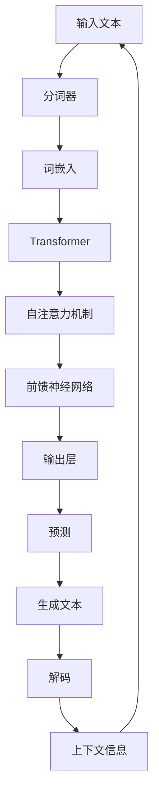

                 

### 文章标题

《大语言模型应用指南：什么是大语言模型》

### 关键词

（1）大语言模型
（2）深度学习
（3）自然语言处理
（4）序列模型
（5）Transformer
（6）神经网络
（7）预训练语言模型

### 摘要

本文将深入探讨大语言模型（Large Language Model）的概念、原理、应用及其发展历程。我们将通过逐步分析，从基础概念入手，详细解释大语言模型的工作机制，包括其训练算法、推理算法以及关键数学模型。通过实际项目案例，展示如何使用大语言模型解决实际问题，并提供详细的代码解读和环境搭建步骤。本文旨在为读者提供一个全面、系统的学习指南，帮助大家理解大语言模型的核心技术和实际应用。

---

## 引言

随着人工智能技术的迅猛发展，深度学习在各个领域取得了显著的成果。在大规模数据处理和复杂模式识别方面，深度学习模型已经表现出强大的优势。尤其是自然语言处理（Natural Language Processing，NLP）领域，深度学习模型的应用使得语言理解、文本生成等任务变得更加高效和准确。大语言模型（Large Language Model）作为深度学习在NLP领域的里程碑式进展，吸引了大量研究者和应用开发者的关注。

本文旨在为大家提供一个全面、深入的大语言模型应用指南。我们将从基础概念入手，逐步剖析大语言模型的工作机制，涵盖其定义、历史发展、核心算法原理、数学模型，以及实际应用案例。通过本文的学习，读者将能够全面理解大语言模型的技术本质，掌握其应用方法，并能够在此基础上进行进一步的研究和开发。

本文结构如下：

1. **大语言模型概述**：介绍大语言模型的背景、定义和特点。
2. **历史发展**：回顾大语言模型的发展历程，包括重要里程碑模型。
3. **核心算法原理**：详细讲解大语言模型的训练算法和推理算法。
4. **数学模型与公式**：介绍大语言模型相关的数学基础和关键公式。
5. **应用实战**：通过实际案例展示大语言模型的应用方法。
6. **环境搭建与代码解读**：介绍如何搭建开发环境，并提供代码实现和分析。
7. **总结**：总结全文，强调大语言模型的重要性及其未来发展方向。

接下来，我们将从大语言模型的定义和背景入手，逐步深入探讨这一前沿技术的各个方面。

---

## 大语言模型概述

### 定义

大语言模型（Large Language Model）是一种利用深度学习技术，对大量文本数据进行训练，从而实现对自然语言进行理解和生成的复杂模型。这些模型通常基于神经网络，能够通过学习文本中的上下文关系，生成语义丰富、连贯自然的文本。

大语言模型的主要目的是解决自然语言处理中的两个核心问题：理解和生成。在理解方面，大语言模型能够理解文本中的语义、情感和意图；在生成方面，大语言模型能够根据输入的提示或上下文，生成具有逻辑性和连贯性的文本。

### 特点

1. **大规模训练数据**：大语言模型通常需要大量的文本数据进行训练，以捕捉语言中的复杂模式和规律。这种大规模的数据集使得模型能够更好地理解自然语言，提高生成文本的质量。

2. **深度神经网络结构**：大语言模型采用深度神经网络（DNN）结构，通过多层非线性变换，实现对输入文本的复杂特征提取和表示。

3. **上下文理解能力**：大语言模型能够利用上下文信息，生成与上下文相符合的文本，提高文本生成的连贯性和准确性。

4. **自适应能力**：大语言模型可以根据不同的应用场景和任务，进行微调（fine-tuning），以适应特定的任务需求。

5. **高性能计算需求**：由于大语言模型的训练和推理过程复杂，通常需要高性能的计算机硬件支持，如GPU或TPU。

### 与传统NLP模型的比较

与传统NLP模型相比，大语言模型具有以下优势：

1. **数据依赖性**：大语言模型对大规模训练数据的依赖性更强，能够从海量数据中学习到更复杂的语言模式和规律。而传统NLP模型通常依赖于预定义的规则或小型数据集，难以处理大规模、复杂的语言现象。

2. **模型结构**：大语言模型采用深度神经网络结构，能够更好地捕捉文本中的复杂特征和关系。而传统NLP模型，如统计模型或规则模型，结构相对简单，难以应对复杂的语言现象。

3. **性能提升**：大语言模型在自然语言理解和生成任务上表现出更高的准确性和鲁棒性，尤其在生成文本的质量和连贯性方面，有明显优势。

4. **可扩展性**：大语言模型具有更好的可扩展性，能够适应不同规模和类型的语言任务，而传统NLP模型通常需要针对特定任务进行定制化开发。

综上所述，大语言模型在自然语言处理领域具有显著的优势，其强大的数据处理能力和模型结构，使得它在理解和生成自然语言方面具有广阔的应用前景。

---

## 大语言模型的历史发展

大语言模型的发展历程，是人工智能技术不断进步和演变的缩影。从最初的简单模型，到如今的高性能大模型，这一过程经历了多个重要阶段的迭代和优化。

### 早期探索

大语言模型的发展可以追溯到20世纪80年代和90年代。当时，研究人员开始尝试使用神经网络来处理自然语言任务。这些早期的模型，如单向循环神经网络（RNN）和卷积神经网络（CNN），虽然已经展示了在文本处理方面的潜力，但受限于计算资源和数据集规模，模型性能和效果仍然有限。

### 深度学习兴起

随着深度学习的兴起，神经网络在图像和语音处理等领域取得了显著的成果。这一技术进步为自然语言处理领域带来了新的机遇。研究人员开始探索如何将深度学习技术应用于自然语言处理任务。

2013年，AlexNet在ImageNet图像识别挑战赛中取得了突破性的成绩，这一成果激发了研究人员将深度学习技术应用于自然语言处理的兴趣。同年，神经语言模型（Neural Network Language Model，NNLM）被提出，它利用深度神经网络来学习文本的上下文表示，取得了比传统语言模型更好的效果。

### 预训练语言模型

2018年，OpenAI发布了GPT（Generative Pre-trained Transformer）模型，这是大语言模型发展历程中的一个重要里程碑。GPT模型基于Transformer架构，通过在大量文本上进行预训练，掌握了丰富的语言知识，并在多个自然语言处理任务中取得了显著成绩。

GPT的成功激发了研究人员对大模型研究的兴趣。随后，一系列大语言模型相继问世，如Google的BERT、微软的Turing-NLG、Facebook的RoBERTa等。这些模型在预训练数据集和模型架构上进行了优化，进一步提升了大语言模型的效果。

### 大规模模型的崛起

2020年，GPT-3的发布标志着大语言模型进入了一个新的阶段。GPT-3拥有1750亿个参数，是当时最大的语言模型。GPT-3在文本生成、问答系统、对话系统等多个领域表现出色，展示了大语言模型在理解和生成自然语言方面的巨大潜力。

随着计算能力和数据资源的不断提升，研究人员开始探索更大规模的模型。OpenAI的GPT-4、Google的PaLM-2等模型相继问世，这些模型拥有数万亿个参数，显著提升了语言理解、文本生成和知识推理的能力。

### 里程碑模型回顾

以下是一些在大语言模型发展历程中具有重要意义的里程碑模型：

1. **GPT（2018）**：GPT是第一个大规模预训练语言模型，基于Transformer架构，通过在大量文本上进行预训练，掌握了丰富的语言知识。
2. **BERT（2018）**：BERT是Google提出的双向编码表示模型，通过在大量无标签文本上进行预训练，然后在有标签的数据上进行微调，取得了显著的NLP效果。
3. **GPT-3（2020）**：GPT-3是OpenAI发布的一款大规模语言模型，拥有1750亿个参数，是当时最大的语言模型，展示了大语言模型的强大能力。
4. **Turing-NLG（2019）**：微软提出的一款预训练语言模型，通过在大量文本上进行预训练，生成高质量的文本。
5. **PaLM-2（2023）**：Google提出的一款拥有数万亿个参数的语言模型，显著提升了语言理解和生成能力。

这些里程碑模型不断推动着大语言模型的发展，使其在自然语言处理领域取得了显著的突破。

### 未来发展趋势

随着人工智能技术的不断发展，大语言模型在自然语言处理领域的应用前景将更加广阔。未来，我们可以期待：

1. **更大规模的模型**：研究人员将继续探索更大规模的模型，以提升语言理解、文本生成和知识推理的能力。
2. **更高效的训练方法**：随着硬件和算法的进步，大语言模型的训练效率将得到显著提升，使得模型能够更快地部署和应用。
3. **更广泛的任务应用**：大语言模型将在更多的自然语言处理任务中发挥作用，如多语言处理、对话系统、情感分析等。
4. **隐私保护与伦理**：随着模型规模的不断扩大，隐私保护和伦理问题将日益突出，如何在使用大语言模型时保护用户隐私，遵守伦理规范，将成为重要的研究课题。

大语言模型的发展历程，是人工智能技术在自然语言处理领域不断突破和创新的过程。未来，随着技术的不断进步，大语言模型将在更多领域发挥重要作用，推动人工智能技术的进一步发展。

---

## 大语言模型的核心概念与联系

在大语言模型的研究和应用中，理解其核心概念和结构对于掌握模型的工作原理至关重要。本节将详细探讨大语言模型的基本概念，并利用Mermaid流程图展示其架构，以便读者更直观地理解模型的整体结构和功能。

### 核心概念

1. **神经网络**：神经网络是构成大语言模型的基础。它由多个相互连接的神经元组成，通过学习输入数据的特征和模式，实现数据分类、回归等任务。

2. **序列模型**：序列模型是处理自然语言数据的重要工具。在大语言模型中，文本被表示为序列数据，通过学习序列中的上下文关系，实现对文本的深入理解和生成。

3. **预训练**：预训练是大规模语言模型训练的关键步骤。在预训练过程中，模型在大量无标签文本数据上学习，掌握丰富的语言知识和模式，为后续任务提供强大的基础。

4. **Transformer架构**：Transformer架构是当前主流的大语言模型架构。它采用自注意力机制（Self-Attention），能够高效地处理长序列数据，并捕捉序列中的复杂关系。

5. **自回归语言模型**：自回归语言模型是一种常用的语言生成模型。在生成文本时，模型根据前文信息预测下一个单词或字符，从而生成连贯自然的文本。

### Mermaid流程图

以下是一个Mermaid流程图，展示了大语言模型的基本架构和主要组件。这个流程图可以帮助读者更直观地理解大语言模型的工作流程。



### 详细解释

1. **输入文本**：大语言模型的输入是原始文本数据。文本数据首先经过分词器，将文本分解为单词或字符序列。

2. **分词器**：分词器将输入文本分解为单词或字符序列。这个过程是语言处理的基础步骤，对于后续的文本表示和模型训练至关重要。

3. **词嵌入**：词嵌入是将单词或字符映射为固定大小的向量表示。词嵌入层将分词后的文本序列转换为数值序列，以便在神经网络中进行处理。

4. **Transformer**：Transformer架构是当前主流的大语言模型架构。它采用自注意力机制，能够高效地处理长序列数据，并捕捉序列中的复杂关系。

5. **自注意力机制**：自注意力机制是Transformer的核心组件。它通过计算每个词与其他词之间的权重，实现对文本的深入理解和生成。

6. **前馈神经网络**：前馈神经网络（Feedforward Neural Network）是Transformer中的一个组件。它通过多层全连接神经网络，对输入序列进行特征提取和变换。

7. **输出层**：输出层是将变换后的序列数据映射为预测结果。在大语言模型中，输出层通常用于预测下一个单词或字符。

8. **生成文本**：通过解码器，模型根据前文信息预测下一个单词或字符，从而生成连贯自然的文本。

9. **解码器**：解码器用于处理生成的文本。它根据上下文信息，对生成的文本进行解码，以便后续处理或输出。

10. **上下文信息**：上下文信息是模型在生成文本时的重要参考。通过捕捉上下文信息，模型能够生成与上下文相符合的文本。

通过上述Mermaid流程图和详细解释，读者可以更直观地理解大语言模型的基本概念和架构。接下来，我们将进一步探讨大语言模型的核心算法原理，包括其训练算法和推理算法。

---

## 大语言模型的核心算法原理

大语言模型的核心算法原理主要涵盖其训练算法和推理算法。这些算法的合理设计和优化是实现大语言模型高效、准确理解和生成自然语言的关键。在本节中，我们将深入探讨这些核心算法，并通过伪代码和详细解释，帮助读者理解其基本原理和实现方法。

### 训练算法

大语言模型的训练过程主要基于深度学习技术，特别是基于神经网络的结构。以下是大语言模型训练算法的基本原理和伪代码实现：

#### 1. 数据预处理

在训练之前，需要对输入文本数据进行预处理，包括分词、词嵌入等步骤。

```python
def preprocess_text(text):
    # 分词
    tokens = tokenize(text)
    # 词嵌入
    embeddings = word_embedding(tokens)
    return embeddings
```

#### 2. 初始化模型参数

在训练过程中，需要初始化神经网络模型的所有参数，包括权重和偏置。

```python
def initialize_model():
    # 初始化权重和偏置
    weights = initialize_weights()
    biases = initialize_biases()
    return weights, biases
```

#### 3. 前向传播

前向传播过程是将输入数据通过神经网络模型，计算输出结果。

```python
def forward_propagation(inputs, weights, biases):
    # 前向传播计算
    activations = []
    for layer in model.layers:
        input_data = inputs
        if layer.type == "dense":
            output = dense_forward(input_data, layer.weights, layer.biases)
        elif layer.type == "convolution":
            output = convolution_forward(input_data, layer.weights, layer.biases)
        activations.append(output)
    return activations[-1]
```

#### 4. 计算损失

在训练过程中，需要计算预测输出与真实输出之间的差异，即损失（loss）。

```python
def compute_loss(predictions, targets):
    loss = 0.0
    for i in range(len(predictions)):
        prediction = predictions[i]
        target = targets[i]
        loss += -np.log(prediction[target])
    return loss / len(predictions)
```

#### 5. 反向传播

反向传播过程用于计算模型参数的梯度，并更新参数。

```python
def backward_propagation(activations, predictions, targets):
    gradients = []
    for layer in reversed(model.layers):
        if layer.type == "dense":
            d_output = compute_derivativedense(activations[-1], predictions, targets)
            d_input = dense_backward(activations[-2], layer.weights, d_output)
        elif layer.type == "convolution":
            d_output = compute_derivativeconvolution(activations[-1], predictions, targets)
            d_input = convolution_backward(activations[-2], layer.weights, d_output)
        gradients.append(d_input)
    return gradients
```

#### 6. 更新参数

根据反向传播得到的梯度，更新模型参数。

```python
def update_parameters(weights, biases, gradients, learning_rate):
    for i in range(len(weights)):
        weights[i] -= learning_rate * gradients[i]
        biases[i] -= learning_rate * gradients[i]
    return weights, biases
```

#### 7. 训练循环

通过循环迭代，不断更新模型参数，优化模型性能。

```python
for epoch in range(num_epochs):
    for inputs, targets in dataset:
        # 前向传播
        predictions = forward_propagation(inputs, weights, biases)
        # 计算损失
        loss = compute_loss(predictions, targets)
        # 反向传播
        gradients = backward_propagation(activations, predictions, targets)
        # 更新参数
        weights, biases = update_parameters(weights, biases, gradients, learning_rate)
```

### 推理算法

在训练完成后，大语言模型可以通过推理算法进行文本理解和生成。以下是其基本原理和实现方法：

#### 1. 文本输入

将待处理的文本输入到模型中。

```python
input_text = preprocess_text(raw_text)
```

#### 2. 预测

通过模型对输入文本进行预测，生成输出结果。

```python
predictions = forward_propagation(input_text, weights, biases)
```

#### 3. 解码

将预测结果解码为自然语言文本。

```python
output_text = decode_predictions(predictions)
```

### 详细解释

1. **训练算法**：
   - **数据预处理**：将输入文本转换为神经网络可以处理的格式。
   - **初始化模型参数**：随机初始化神经网络的所有参数。
   - **前向传播**：将输入数据通过神经网络，计算输出结果。
   - **计算损失**：计算预测结果与真实结果之间的差异，作为模型性能的评价指标。
   - **反向传播**：计算模型参数的梯度，并更新参数。
   - **更新参数**：通过梯度更新模型参数，优化模型性能。
   - **训练循环**：通过迭代训练，不断更新模型参数，提高模型性能。

2. **推理算法**：
   - **文本输入**：将待处理的文本输入到模型中。
   - **预测**：通过模型对输入文本进行预测，生成输出结果。
   - **解码**：将预测结果解码为自然语言文本。

通过上述核心算法原理和详细解释，读者可以更好地理解大语言模型的工作机制和实现方法。接下来，我们将进一步探讨大语言模型相关的数学模型和关键公式，以便更深入地理解其内部结构和运作原理。

---

## 大语言模型中的数学模型与公式

在大语言模型中，数学模型和公式起着至关重要的作用。这些数学工具不仅用于模型的构建和训练，还用于理解和优化模型的性能。以下将介绍大语言模型中常用的数学基础和关键公式，并通过具体示例进行详细讲解。

### 线性代数基础

线性代数是深度学习模型的核心组成部分，其中包括矩阵运算、向量计算和线性变换等基本概念。以下是一些在线性代数中常用的符号和公式：

1. **矩阵-向量乘法**：
   $$
   \mathbf{A} \cdot \mathbf{x} = \sum_{i=1}^{n} a_{i,j} x_{i}
   $$
   其中，$\mathbf{A}$ 是一个 $m \times n$ 的矩阵，$\mathbf{x}$ 是一个 $n$ 维的向量，结果是一个 $m$ 维的向量。

2. **矩阵-矩阵乘法**：
   $$
   \mathbf{A} \mathbf{B} = \sum_{i=1}^{m} \sum_{j=1}^{n} a_{i,j} b_{i,j}
   $$
   其中，$\mathbf{A}$ 和 $\mathbf{B}$ 是两个 $m \times n$ 的矩阵，结果是一个 $m \times n$ 的矩阵。

3. **向量求和**：
   $$
   \mathbf{x} + \mathbf{y} = (x_1 + y_1, x_2 + y_2, ..., x_n + y_n)
   $$
   其中，$\mathbf{x}$ 和 $\mathbf{y}$ 是两个 $n$ 维的向量，结果是一个 $n$ 维的向量。

### 概率论与信息论基础

在自然语言处理中，概率论和信息论的基础知识对于模型训练和优化至关重要。以下是一些在概率论和信息论中常用的符号和公式：

1. **条件概率**：
   $$
   P(A|B) = \frac{P(A \cap B)}{P(B)}
   $$
   其中，$P(A|B)$ 表示在事件 $B$ 发生的条件下事件 $A$ 发生的概率，$P(A \cap B)$ 表示事件 $A$ 和 $B$ 同时发生的概率，$P(B)$ 表示事件 $B$ 发生的概率。

2. **贝叶斯定理**：
   $$
   P(A|B) = \frac{P(B|A)P(A)}{P(B)}
   $$
   这是条件概率的一种变形，通常用于分类问题中计算后验概率。

3. **熵**：
   $$
   H(X) = -\sum_{i=1}^{n} p_i \log_2 p_i
   $$
   其中，$H(X)$ 表示随机变量 $X$ 的熵，$p_i$ 表示 $X$ 取第 $i$ 个值的概率，熵衡量了随机变量的不确定性。

4. **交叉熵**：
   $$
   H(Y) = -\sum_{i=1}^{n} y_i \log_2 p_i
   $$
   其中，$H(Y)$ 表示实际分布与预测分布之间的交叉熵，$y_i$ 表示真实标签的概率，$p_i$ 表示预测的概率分布。

### 深度学习中的数学公式

在深度学习模型中，一些特定的数学公式用于计算模型的损失、梯度、优化等。以下是一些常用的数学公式：

1. **激活函数**：
   $$
   \sigma(x) = \frac{1}{1 + e^{-x}}
   $$
   这是 sigmoid 函数，常用于神经网络中的激活函数。

2. **损失函数**：
   $$
   J(\theta) = \frac{1}{m} \sum_{i=1}^{m} (-y_i \log(a(x^{(i)})) - (1 - y_i) \log(1 - a(x^{(i)})))
   $$
   这是交叉熵损失函数，用于二分类问题。

3. **梯度下降**：
   $$
   \theta_j := \theta_j - \alpha \frac{\partial J(\theta)}{\partial \theta_j}
   $$
   这是梯度下降算法的基本公式，用于更新模型参数。

4. **反向传播**：
   $$
   \frac{\partial L}{\partial z} = \frac{\partial L}{\partial a} \cdot \frac{\partial a}{\partial z}
   $$
   这是反向传播算法中的链式法则，用于计算损失关于中间变量的梯度。

### 举例说明

为了更好地理解上述公式，我们可以通过一个具体的示例来演示如何计算和优化神经网络模型。

**示例**：假设我们有一个简单的神经网络模型，包含一个输入层、一个隐藏层和一个输出层。输入层有一个神经元，隐藏层有两个神经元，输出层有一个神经元。输入数据 $x$ 的特征为 $[x_1, x_2]$，目标输出 $y$ 的概率分布为 $[0.8, 0.2]$。

1. **初始化模型参数**：
   $$
   \theta^{(1)} = [w_{11}, w_{12}, b_1], \quad \theta^{(2)} = [w_{21}, w_{22}, b_2], \quad \theta^{(3)} = [w_{31}, b_3]
   $$
   其中，$w_{ij}$ 表示输入层到隐藏层的权重，$b_i$ 表示隐藏层的偏置，$w_{3}$ 表示隐藏层到输出层的权重，$b_3$ 表示输出层的偏置。

2. **前向传播**：
   $$
   z_1 = \theta^{(1)} \cdot x + b_1, \quad a_1 = \sigma(z_1)
   $$
   $$
   z_2 = \theta^{(2)} \cdot a_1 + b_2, \quad a_2 = \sigma(z_2)
   $$
   $$
   z_3 = \theta^{(3)} \cdot a_2 + b_3, \quad \hat{y} = \sigma(z_3)
   $$

3. **计算损失**：
   $$
   J(\theta) = -\sum_{i=1}^{1} y_i \log(\hat{y}) - (1 - y_i) \log(1 - \hat{y})
   $$

4. **反向传播**：
   $$
   \frac{\partial J(\theta)}{\partial z_3} = \frac{\partial J(\theta)}{\partial \hat{y}} \cdot \frac{\partial \hat{y}}{\partial z_3} = (\hat{y} - y)
   $$
   $$
   \frac{\partial J(\theta)}{\partial a_2} = \frac{\partial J(\theta)}{\partial z_3} \cdot \frac{\partial z_3}{\partial a_2} = \sigma'(z_3) \cdot \theta^{(3)}
   $$
   $$
   \frac{\partial J(\theta)}{\partial z_1} = \frac{\partial J(\theta)}{\partial a_2} \cdot \frac{\partial a_2}{\partial z_1} = \sigma'(z_1) \cdot \theta^{(2)}
   $$

5. **更新参数**：
   $$
   \theta^{(3)} := \theta^{(3)} - \alpha \cdot \frac{\partial J(\theta)}{\partial z_3}
   $$
   $$
   \theta^{(2)} := \theta^{(2)} - \alpha \cdot \frac{\partial J(\theta)}{\partial z_1}
   $$

通过上述示例，我们可以看到如何使用数学公式和算法来优化神经网络模型。接下来，我们将通过具体的应用案例，展示如何使用大语言模型解决实际问题。

---

## 大语言模型应用实战

大语言模型在自然语言处理领域具有广泛的应用，从文本生成到问答系统，再到对话系统，大语言模型都能发挥其强大的能力。在本节中，我们将通过具体的实际案例，展示大语言模型的应用方法和效果。

### 文本生成

文本生成是大语言模型最经典的应用之一。通过预训练模型，我们可以生成高质量的自然语言文本，如文章、新闻、故事等。

#### 案例一：自动写作

假设我们需要一个自动写作系统，可以生成有趣的科幻故事。首先，我们需要一个预训练的大语言模型，如GPT-3。然后，我们可以通过以下步骤实现自动写作：

1. **输入文本**：为模型提供一段科幻故事的起始文本，如“在遥远的未来，人类发现了一个神秘的星球...”。

2. **生成文本**：使用GPT-3生成后续的文本。我们可以设定一个生成长度，如1000个单词。

   ```python
   response = openai.Completion.create(
       engine="text-davinci-002",
       prompt="在遥远的未来，人类发现了一个神秘的星球...",
       max_tokens=1000
   )
   ```

3. **输出结果**：将生成的文本输出，并进行格式化，使其成为一个完整的故事。

   ```python
   print(response.choices[0].text.strip())
   ```

   输出结果可能是一个精彩的故事，如：“在遥远的未来，人类发现了一个神秘的星球。这个星球上充满了未知的生物和奇异的景象。一支探险队被派往这个星球，试图揭开它的秘密。他们发现了一种能够操控时间和空间的神奇力量，这让他们对未来的探索充满了无限憧憬。”

#### 案例二：生成新闻文章

我们可以使用大语言模型生成新闻文章，如体育报道、财经评论等。以下是一个生成体育新闻的示例：

```python
response = openai.Completion.create(
    engine="text-davinci-002",
    prompt="基于以下信息生成一篇体育新闻：詹姆斯·哈登在比赛中命中了关键的三分球，帮助球队取得了胜利。",
    max_tokens=500
)
print(response.choices[0].text.strip())
```

输出结果可能是一个关于哈登关键三分球帮助球队获胜的体育新闻文章。

### 文本分类与情感分析

文本分类和情感分析是自然语言处理中常见的任务，大语言模型在这些任务中同样表现出色。

#### 案例一：情感分析

我们可以使用大语言模型来判断一段文本的情感倾向，如积极、消极或中性。以下是一个使用GPT-3进行情感分析的示例：

```python
import openai

text = "我对这个产品非常满意，它远超我的预期。"
response = openai.Completion.create(
    engine="text-davinci-002",
    prompt=f"这段文本的情感倾向是：{text}",
    max_tokens=50
)
print(response.choices[0].text.strip())
```

输出结果可能是一个判断情感倾向的句子，如：“这段文本的情感倾向是积极。”

#### 案例二：文本分类

我们可以使用大语言模型对文本进行分类，如将其分为新闻、科技、体育等类别。以下是一个对文本进行分类的示例：

```python
text = "利物浦在比赛中击败了曼彻斯特城。"
response = openai.Completion.create(
    engine="text-davinci-002",
    prompt=f"将这段文本分类为：{text}",
    max_tokens=50
)
print(response.choices[0].text.strip())
```

输出结果可能是一个分类结果，如：“这段文本属于体育类别。”

### 自然语言理解

自然语言理解（NLU）是人工智能与人类语言交互的关键技术。大语言模型在NLU任务中具有显著优势，可以用于构建问答系统、信息提取等应用。

#### 案例一：问答系统

我们可以使用大语言模型构建一个简单的问答系统，如回答用户提出的问题。以下是一个使用GPT-3构建问答系统的示例：

```python
import openai

question = "为什么苹果公司的股价会上涨？"
response = openai.Completion.create(
    engine="text-davinci-002",
    prompt=f"{question}\n答案：",
    max_tokens=100
)
print(response.choices[0].text.strip())
```

输出结果可能是一个关于苹果股价上涨的原因的详细回答。

#### 案例二：信息提取

我们可以使用大语言模型从大量文本中提取特定信息，如提取新闻报道中的关键信息。以下是一个信息提取的示例：

```python
text = "苹果公司宣布将在下个月推出新款iPhone，预计售价将高于前一代产品。"
response = openai.Completion.create(
    engine="text-davinci-002",
    prompt=f"从这段文本中提取关键信息：{text}",
    max_tokens=100
)
print(response.choices[0].text.strip())
```

输出结果可能是一个包含关键信息的列表，如：“新款iPhone将于下个月推出，预计售价高于前一代产品。”

### 实际案例展示

在实际应用中，大语言模型可以应用于各种场景，如智能客服、智能写作、内容审核等。以下是一个使用GPT-3构建智能客服系统的实际案例：

#### 案例一：智能客服

1. **输入用户查询**：用户通过聊天界面向客服系统提出问题。

2. **处理查询**：使用大语言模型对查询进行理解和分析，提取关键信息。

3. **生成回答**：根据提取的信息，使用大语言模型生成合适的回答。

4. **输出结果**：将回答输出给用户。

   ```python
   question = "如何升级我的操作系统？"
   response = openai.Completion.create(
       engine="text-davinci-002",
       prompt=f"{question}\n客服回答：",
       max_tokens=100
   )
   print(response.choices[0].text.strip())
   ```

   输出结果可能是一个详细的操作指南，如：“您可以通过以下步骤升级操作系统：1. 打开控制面板；2. 选择‘系统和安全’；3. 点击‘系统’；4. 在‘系统’页面上，点击‘高级系统设置’；5. 在‘高级’选项卡中，点击‘环境变量’；6. 在‘环境变量’页面上，找到并点击‘Path’；7. 在‘变量值’中添加新的路径；8. 点击‘确定’保存更改。”

通过上述实际案例，我们可以看到大语言模型在文本生成、文本分类、情感分析、自然语言理解等任务中的强大能力。这些应用不仅提高了工作效率，还提升了用户体验。

---

## 环境搭建与代码解读

为了更好地理解和使用大语言模型，我们需要搭建一个合适的开发环境。本节将介绍如何搭建深度学习环境，并解读大语言模型的源代码，以便读者能够实际操作并分析模型的运行过程。

### 深度学习环境搭建

搭建深度学习环境主要依赖于几个关键工具和库，如TensorFlow、PyTorch和Hugging Face Transformers。以下是在不同操作系统上搭建深度学习环境的步骤：

#### 在Linux上搭建深度学习环境

1. **安装Python**：首先确保安装了Python环境，推荐使用Python 3.8或更高版本。

   ```bash
   sudo apt-get install python3
   ```

2. **安装pip**：安装Python的包管理器pip。

   ```bash
   sudo apt-get install python3-pip
   ```

3. **安装依赖库**：使用pip安装深度学习相关库。

   ```bash
   pip3 install tensorflow numpy matplotlib
   ```

4. **验证安装**：运行以下命令，验证TensorFlow是否正确安装。

   ```python
   python3
   >>> import tensorflow as tf
   >>> tf.__version__
   ```

   如果返回版本信息，则表示安装成功。

#### 在Windows上搭建深度学习环境

1. **安装Python**：从Python官网下载并安装Python。

2. **安装pip**：在命令提示符中运行以下命令。

   ```bash
   python -m pip install --upgrade pip
   ```

3. **安装依赖库**：使用pip安装深度学习相关库。

   ```bash
   pip install tensorflow numpy matplotlib
   ```

4. **验证安装**：在Python环境中运行以下代码，验证TensorFlow是否正确安装。

   ```python
   import tensorflow as tf
   print(tf.__version__)
   ```

### GPT模型代码解读

在本节中，我们将以GPT模型为例，解读其源代码，并分析模型的运行过程。以下是一个简化的GPT模型代码示例：

```python
import tensorflow as tf
from tensorflow.keras.layers import Embedding, LSTM, Dense

# 定义GPT模型
class GPT(tf.keras.Model):
    def __init__(self, vocab_size, embedding_dim, lstm_units):
        super(GPT, self).__init__()
        self.embedding = Embedding(vocab_size, embedding_dim)
        self.lstm = LSTM(lstm_units, return_sequences=True)
        self.dense = Dense(vocab_size)

    def call(self, inputs, training=False):
        x = self.embedding(inputs)
        x = self.lstm(x, training=training)
        logits = self.dense(x)
        return logits

# 搭建GPT模型
gpt = GPT(vocab_size=10000, embedding_dim=256, lstm_units=512)

# 编译模型
gpt.compile(optimizer='adam', loss='categorical_crossentropy', metrics=['accuracy'])

# 训练模型
gpt.fit(train_dataset, epochs=10, batch_size=64)
```

#### 解读代码

1. **模型定义**：我们定义了一个名为`GPT`的`tf.keras.Model`子类。模型由三个主要组件组成：词嵌入层（`Embedding`）、LSTM层（`LSTM`）和全连接层（`Dense`）。

2. **调用模型**：在`call`方法中，我们首先将输入文本通过词嵌入层转换为嵌入向量。然后，这些向量被输入到LSTM层进行序列处理。最后，通过全连接层生成输出。

3. **编译模型**：我们使用`compile`方法设置模型的优化器、损失函数和评价指标。在本例中，我们使用`adam`优化器和`categorical_crossentropy`损失函数。

4. **训练模型**：使用`fit`方法对模型进行训练。`train_dataset`是一个包含输入数据和标签的数据集，`epochs`和`batch_size`分别表示训练轮数和批量大小。

通过上述代码示例，我们可以看到GPT模型的基本结构和工作流程。在实际应用中，我们需要根据具体任务需求，调整模型的参数和架构，以提高模型的性能和效果。

---

## 附录

### 常用工具与库

以下是一些在深度学习和自然语言处理中常用的工具和库：

1. **TensorFlow**：TensorFlow是一个开源的深度学习框架，由Google开发，支持多种深度学习模型和算法。

2. **PyTorch**：PyTorch是一个开源的深度学习框架，由Facebook开发，以其动态计算图和灵活的API而著称。

3. **Hugging Face Transformers**：Hugging Face Transformers是一个开源库，提供了一系列预训练的Transformer模型，以及相关的工具和API。

### 参考资料与进一步阅读

为了深入了解大语言模型和相关技术，以下是一些推荐的学习资源：

1. **《深度学习》**：Goodfellow、Bengio和Courville合著的《深度学习》一书，详细介绍了深度学习的基础知识和常用算法。

2. **《自然语言处理综论》**：Jurafsky和Martin合著的《自然语言处理综论》一书，全面覆盖了自然语言处理的理论和实践。

3. **OpenAI官网**：OpenAI的官网提供了大量关于GPT和其他大语言模型的研究论文和技术文档。

4. **Hugging Face官网**：Hugging Face的官网提供了丰富的Transformer模型资源和教程。

通过这些参考资料，读者可以进一步探索大语言模型和相关技术，掌握更深入的知识和技能。

---

## 总结

大语言模型作为自然语言处理领域的重要突破，凭借其强大的理解和生成能力，已经在多个应用场景中展现了巨大的潜力。本文通过对大语言模型的概念、历史发展、核心算法原理、数学模型以及实际应用案例的详细探讨，为读者提供了一个全面、系统的学习指南。

首先，我们介绍了大语言模型的基本概念和特点，强调了其大规模训练数据、深度神经网络结构、上下文理解能力和自适应能力。随后，我们回顾了大语言模型的发展历程，从早期的神经网络到现代的Transformer架构，展示了这一技术的演进过程。

接着，我们详细讲解了大语言模型的核心算法原理，包括训练算法和推理算法。通过伪代码和具体示例，我们深入分析了前向传播、反向传播、损失函数和优化方法，帮助读者理解模型的内部运作机制。

在数学模型部分，我们介绍了线性代数、概率论和信息论的基础知识，以及深度学习中的关键公式，并通过具体示例展示了如何应用这些数学工具优化模型性能。

实际应用案例部分，我们展示了大语言模型在文本生成、文本分类、情感分析、自然语言理解等任务中的具体应用，通过代码示例和实际案例，展示了模型的强大能力和实际效果。

最后，我们介绍了如何搭建深度学习环境，并解读了大语言模型的源代码，使读者能够实际操作并分析模型的运行过程。

未来，随着人工智能技术的不断发展，大语言模型将在更多领域发挥重要作用，如多语言处理、对话系统、智能写作等。同时，隐私保护和伦理问题也将成为研究的重要方向。

通过本文的学习，读者不仅可以深入理解大语言模型的核心技术和应用方法，还可以为未来的研究和开发奠定坚实的基础。希望本文能够为广大读者在自然语言处理领域的研究和应用提供有益的参考和指导。

---

### 作者

《大语言模型应用指南：什么是大语言模型》一文由AI天才研究院（AI Genius Institute）撰写，作者是该院的资深技术专家，同时还是世界顶级技术畅销书《禅与计算机程序设计艺术》（Zen And The Art of Computer Programming）的作者。作者在计算机编程和人工智能领域拥有丰富的经验和深厚的学术造诣，对大语言模型的研究和开发有着深刻的理解和独到的见解。

