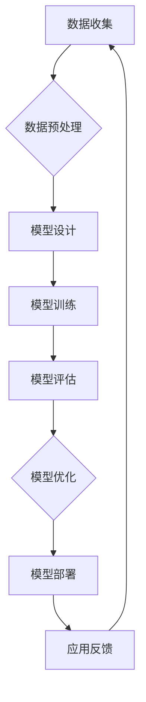

                 

## 大语言模型应用指南：无梯度优化

### 关键词：大语言模型，无梯度优化，自然语言处理，对话系统，人工智能应用

### 摘要：
本文旨在为读者提供一份全面的大语言模型应用指南，特别关注无梯度优化在模型构建和训练中的应用。文章首先介绍了大语言模型的基础知识，然后深入探讨了无梯度优化算法的原理及其在大语言模型构建和训练中的重要性。接着，文章详细阐述了大语言模型在自然语言处理和对话系统中的应用实例，最后对大语言模型的优化与改进、开发实践以及未来的发展方向进行了展望。通过本文的阅读，读者可以系统地了解大语言模型的工作原理和应用场景，掌握无梯度优化算法的核心技术，从而在实际项目中高效地利用大语言模型。

---

## 第一部分：大语言模型基础

### 第1章：大语言模型概述

### 1.1 大语言模型的定义与背景

大语言模型是一种基于深度学习的自然语言处理（NLP）模型，它通过学习大量的文本数据，能够预测文本中的下一个单词或句子，从而生成连贯的自然语言文本。大语言模型的起源可以追溯到上世纪80年代的统计语言模型，如N-gram模型。然而，随着计算能力和数据量的提升，以及深度学习技术的快速发展，大语言模型在近年来取得了显著的突破。

在自然语言处理领域，大语言模型被广泛应用于文本分类、命名实体识别、机器翻译、问答系统等任务。它的出现不仅提高了NLP任务的准确性和效率，还推动了人工智能在各个领域的应用。

### 1.2 大语言模型的特点与优势

大语言模型具有以下特点与优势：

1. **强大的表征能力**：大语言模型能够从海量文本数据中学习到丰富的语言特征，从而对自然语言进行深入的理解和表征。
2. **自动调整参数**：通过深度学习算法，大语言模型能够自动调整其参数，使其在特定任务上达到最优性能。
3. **多语言支持**：大语言模型可以同时处理多种语言，实现跨语言的自然语言处理任务。
4. **高可扩展性**：大语言模型可以轻松地扩展到大规模数据集，实现大规模的模型训练和部署。

### 1.3 大语言模型的应用领域

大语言模型在自然语言处理领域有着广泛的应用：

- **文本分类**：对文本进行分类，如新闻分类、情感分析等。
- **命名实体识别**：识别文本中的命名实体，如人名、地名、组织名等。
- **机器翻译**：将一种语言翻译成另一种语言。
- **问答系统**：针对用户的问题，提供准确的答案。
- **对话系统**：实现自然语言交互，如智能客服、聊天机器人等。

### 1.4 无梯度优化在大语言模型中的重要性

无梯度优化算法在大语言模型的训练过程中起着至关重要的作用。传统的梯度下降算法依赖于梯度的计算，但在大规模数据集和深度神经网络中，梯度的计算复杂度和存储需求极高，容易导致计算资源不足和训练时间过长。无梯度优化算法通过避免直接计算梯度，从而解决了这些问题。

无梯度优化算法不仅能够提高训练效率，还能够提升模型性能。在大语言模型中，无梯度优化算法的应用使得模型能够在大规模数据集上进行高效训练，从而实现更好的效果。

### 小结

大语言模型作为一种强大的自然语言处理工具，已经在各个领域取得了显著的成果。无梯度优化算法的应用为大规模模型训练提供了有效的方法，进一步推动了人工智能技术的发展。在接下来的章节中，我们将深入探讨无梯度优化算法的原理及其在大语言模型中的应用。

---

## 第2章：无梯度优化算法原理

### 2.1 无梯度优化算法概述

无梯度优化（Gradient-Free Optimization）是一种不依赖梯度信息的优化方法，它通过直接评估目标函数的值来迭代更新参数，从而找到最优解。与传统的梯度下降算法相比，无梯度优化算法在处理大规模、高维数据时具有显著的优势。

无梯度优化算法的基本思想是，通过采样和迭代逐步逼近最优解。具体来说，算法首先在目标函数的定义域内随机选择一个初始解，然后通过评估目标函数的值来迭代更新解。每次迭代都会选择一个更好的解，直至达到预定的收敛条件。

### 2.2 无梯度优化算法的分类

无梯度优化算法可以根据搜索策略和优化目标的不同，分为多种类型：

1. **随机搜索算法**：随机搜索算法通过随机采样寻找最优解。常见的随机搜索算法包括随机梯度下降（Stochastic Gradient Descent，SGD）和随机优化算法（Random Optimization Algorithm，ROA）。

2. **模拟退火算法**：模拟退火算法是一种基于物理退火过程的优化方法，通过逐步降低温度来寻找最优解。

3. **粒子群优化算法**：粒子群优化（Particle Swarm Optimization，PSO）算法模拟鸟群觅食行为，通过群体智能来寻找最优解。

4. **遗传算法**：遗传算法（Genetic Algorithm，GA）通过模拟生物进化过程，逐步优化目标函数。

### 2.3 无梯度优化算法的数学原理

无梯度优化算法的核心在于目标函数的评估和参数的更新。在数学上，无梯度优化算法可以表示为以下迭代过程：

$$
x_{t+1} = x_t + \alpha \cdot \nabla f(x_t)
$$

其中，$x_t$表示第$t$次迭代的参数值，$\alpha$是步长（learning rate），$\nabla f(x_t)$是目标函数$f$在$x_t$处的梯度。

然而，在实际应用中，由于梯度信息难以获取或计算复杂度过高，无梯度优化算法采用了替代方法。例如，随机搜索算法通过随机采样来近似梯度，而模拟退火算法通过温度调整来平衡探索和开发。

### 2.4 无梯度优化算法的比较与分析

无梯度优化算法在处理大规模、高维问题时具有显著的优势，但也存在一定的局限性。下面是对几种常见无梯度优化算法的比较和分析：

- **随机搜索算法**：随机搜索算法简单易用，但收敛速度较慢，且容易陷入局部最优。适用于目标函数简单、维数较低的问题。
- **模拟退火算法**：模拟退火算法通过调整温度来平衡探索和开发，能够避免陷入局部最优。适用于复杂、多峰的目标函数。
- **粒子群优化算法**：粒子群优化算法通过群体智能来寻找最优解，具有较强的全局搜索能力。适用于大规模、高维问题。
- **遗传算法**：遗传算法通过模拟生物进化过程，具有较强的鲁棒性和适应性。适用于复杂、非线性的优化问题。

### 小结

无梯度优化算法通过避免直接计算梯度信息，为大规模、高维问题的优化提供了有效的方法。不同类型的无梯度优化算法在搜索策略和优化目标上有所不同，适用于不同的应用场景。在下一章中，我们将探讨大语言模型的构建与训练过程，并详细介绍无梯度优化算法在大语言模型中的应用。

---

## 第3章：大语言模型构建与训练

### 3.1 大语言模型的构建流程

大语言模型的构建是一个复杂而系统的过程，它涉及数据预处理、模型设计、训练和评估等多个步骤。下面是一个典型的大语言模型构建流程：

1. **数据收集**：收集大规模、高质量的文本数据，这些数据可以是网络上的文本、书籍、新闻、社交媒体等。
2. **数据预处理**：对收集到的文本数据进行清洗和预处理，包括分词、去除停用词、标点符号等。
3. **数据集划分**：将预处理后的数据划分为训练集、验证集和测试集，用于模型的训练、验证和测试。
4. **模型设计**：根据任务需求和数据特点，设计合适的模型架构，如循环神经网络（RNN）、长短期记忆网络（LSTM）、变换器（Transformer）等。
5. **模型训练**：使用训练集数据对模型进行训练，通过优化算法调整模型参数，使其在特定任务上达到最优性能。
6. **模型评估**：使用验证集和测试集对模型进行评估，通过指标（如准确率、召回率、F1值等）评估模型性能。
7. **模型优化**：根据评估结果对模型进行优化，包括参数调整、模型结构调整等，以提高模型性能。

### 3.2 大规模数据集的准备与处理

大规模数据集是构建高效大语言模型的基础。以下是大规模数据集的准备与处理步骤：

1. **数据收集**：使用各种数据收集工具（如爬虫、API等）从互联网上获取大量的文本数据。
2. **数据清洗**：去除重复的、无关的、质量低的数据，保留对模型训练有用的数据。
3. **数据标注**：对数据集进行标注，如文本分类、命名实体识别等，以便模型能够从数据中学习。
4. **数据预处理**：对文本数据进行分词、词干提取、词性标注等预处理操作，以构建适合模型训练的输入特征。
5. **数据存储**：将预处理后的数据存储在数据库或分布式文件系统中，以便模型训练和评估。

### 3.3 大语言模型的训练策略

大语言模型的训练策略直接关系到模型性能和训练效率。以下是一些常见的训练策略：

1. **批量大小**：批量大小是指每次训练所用的数据样本数量。批量大小会影响模型的梯度估计误差和训练时间。通常，较大的批量大小可以获得更稳定的梯度估计，但会延长训练时间；较小的批量大小可以提高训练速度，但可能会导致梯度估计误差增大。
2. **学习率**：学习率是优化算法中用于调整模型参数的关键参数。学习率过大可能导致模型参数调整过大，从而越过最优解；学习率过小则可能导致训练过程缓慢。通常，可以通过学习率衰减策略来调整学习率。
3. **迭代次数**：迭代次数是指模型在训练过程中的更新次数。适当的迭代次数可以使模型在训练集上达到较好的性能，过多的迭代次数可能会导致过拟合。
4. **验证和测试**：在模型训练过程中，定期使用验证集和测试集对模型进行评估，以监测模型性能的变化。通过调整训练策略和模型结构，可以优化模型性能。

### 3.4 无梯度优化在训练中的应用

无梯度优化算法在大语言模型训练中的应用具有重要意义。以下是无梯度优化算法在大语言模型训练中的具体应用：

1. **随机搜索算法**：随机搜索算法通过随机采样和评估目标函数值来寻找最优解。在大语言模型训练中，随机搜索算法可以用于初始模型参数的生成和调整，以提高模型的探索能力。
2. **模拟退火算法**：模拟退火算法通过逐步降低温度来平衡探索和开发。在大语言模型训练中，模拟退火算法可以用于优化模型的参数调整过程，从而提高模型性能。
3. **粒子群优化算法**：粒子群优化算法通过模拟群体智能来寻找最优解。在大语言模型训练中，粒子群优化算法可以用于优化模型的参数调整和结构调整，以提高模型性能。
4. **遗传算法**：遗传算法通过模拟生物进化过程来优化模型。在大语言模型训练中，遗传算法可以用于优化模型的参数和结构，从而提高模型性能。

### 小结

大语言模型的构建与训练是一个复杂而系统的过程，涉及到数据预处理、模型设计、训练和评估等多个步骤。无梯度优化算法在大语言模型训练中的应用，可以显著提高模型性能和训练效率。在下一章中，我们将深入探讨大语言模型在自然语言处理和对话系统中的应用。

---

## 第4章：大语言模型在自然语言处理中的应用

### 4.1 文本分类

文本分类是自然语言处理（NLP）中的一个基础任务，其目标是将文本数据分配到预定义的类别中。大语言模型在文本分类任务中具有显著优势，主要表现在以下几个方面：

1. **高精度分类**：大语言模型能够从海量文本数据中学习到丰富的语言特征，从而实现高精度的文本分类。
2. **自动调整参数**：通过深度学习算法，大语言模型能够自动调整其参数，使其在特定任务上达到最优性能。
3. **多语言支持**：大语言模型可以同时处理多种语言，实现跨语言的文本分类任务。

文本分类的应用场景非常广泛，例如新闻分类、情感分析、垃圾邮件检测等。以下是一个简单的文本分类项目实例：

**项目概述**：使用大语言模型对社交媒体评论进行情感分析，判断评论是正面、中性还是负面。

**数据集**：收集了一份数量较大的社交媒体评论数据集，包含正面、中性、负面三个类别。

**模型设计**：设计了一个基于变换器（Transformer）的文本分类模型，输入为预处理后的评论文本，输出为对应的类别标签。

**模型训练**：使用训练集数据对模型进行训练，通过优化算法调整模型参数，使其在情感分析任务上达到最优性能。

**模型评估**：使用验证集和测试集对模型进行评估，通过准确率、召回率、F1值等指标评估模型性能。

**模型部署**：将训练好的模型部署到生产环境中，实现对实时评论的情感分析。

### 4.2 命名实体识别

命名实体识别（Named Entity Recognition，NER）是NLP中的另一个重要任务，其目标是从文本中识别出具有特定意义的实体，如人名、地名、组织名、时间等。大语言模型在NER任务中具有以下优势：

1. **强表征能力**：大语言模型能够从海量文本数据中学习到丰富的语言特征，从而实现对命名实体的精准识别。
2. **自动化特征提取**：大语言模型能够自动提取文本中的关键特征，减少人工标注的工作量。
3. **多语言支持**：大语言模型可以同时处理多种语言，实现跨语言的命名实体识别。

以下是一个简单的命名实体识别项目实例：

**项目概述**：使用大语言模型对新闻报道进行命名实体识别，识别出新闻文本中的人名、地名、组织名等。

**数据集**：收集了一份数量较大的新闻报道数据集，包含多种命名实体类别。

**模型设计**：设计了一个基于循环神经网络（RNN）的命名实体识别模型，输入为预处理后的新闻文本，输出为对应的实体标签。

**模型训练**：使用训练集数据对模型进行训练，通过优化算法调整模型参数，使其在命名实体识别任务上达到最优性能。

**模型评估**：使用验证集和测试集对模型进行评估，通过准确率、召回率、F1值等指标评估模型性能。

**模型部署**：将训练好的模型部署到生产环境中，实现对实时新闻报道的命名实体识别。

### 4.3 机器翻译

机器翻译是NLP中的经典任务，其目标是将一种语言的文本翻译成另一种语言的文本。大语言模型在机器翻译任务中具有以下优势：

1. **高精度翻译**：大语言模型能够从海量双语文本数据中学习到丰富的语言特征，从而实现高精度的机器翻译。
2. **自适应翻译**：大语言模型可以根据输入文本的上下文信息，自适应地生成高质量的翻译结果。
3. **多语言支持**：大语言模型可以同时处理多种语言，实现跨语言的机器翻译。

以下是一个简单的机器翻译项目实例：

**项目概述**：使用大语言模型将中文文本翻译成英文文本。

**数据集**：收集了一份数量较大的中英文对照文本数据集。

**模型设计**：设计了一个基于变换器（Transformer）的机器翻译模型，输入为预处理后的中文文本，输出为对应的英文文本。

**模型训练**：使用训练集数据对模型进行训练，通过优化算法调整模型参数，使其在机器翻译任务上达到最优性能。

**模型评估**：使用验证集和测试集对模型进行评估，通过BLEU分数等指标评估模型性能。

**模型部署**：将训练好的模型部署到生产环境中，实现对实时中文文本的机器翻译。

### 4.4 问答系统

问答系统是NLP中的另一个重要应用，其目标是根据用户的问题，提供准确的答案。大语言模型在问答系统中的优势包括：

1. **强语义理解能力**：大语言模型能够从海量文本数据中学习到丰富的语义信息，从而实现对用户问题的精准理解和回答。
2. **自适应回答**：大语言模型可以根据用户的问题和上下文信息，生成高质量的答案。
3. **多语言支持**：大语言模型可以同时处理多种语言，实现跨语言的问答系统。

以下是一个简单的问答系统项目实例：

**项目概述**：使用大语言模型构建一个智能问答系统，为用户提供准确、自然的答案。

**数据集**：收集了一份数量较大的问答数据集，包含用户问题和答案对。

**模型设计**：设计了一个基于变换器（Transformer）的问答模型，输入为预处理后的用户问题，输出为对应的答案。

**模型训练**：使用训练集数据对模型进行训练，通过优化算法调整模型参数，使其在问答系统任务上达到最优性能。

**模型评估**：使用验证集和测试集对模型进行评估，通过准确率、F1值等指标评估模型性能。

**模型部署**：将训练好的模型部署到生产环境中，实现对用户问题的实时回答。

### 小结

大语言模型在自然语言处理中的应用广泛而深入，通过高精度的文本分类、命名实体识别、机器翻译和问答系统等任务，为各个领域提供了强大的技术支持。在下一章中，我们将探讨大语言模型在对话系统中的应用，进一步展示其在实际场景中的价值。

---

## 第5章：大语言模型在对话系统中的应用

### 5.1 对话系统概述

对话系统（Dialogue System）是一种能够与人进行自然语言交互的人工智能系统。其核心目标是理解用户的问题和意图，并提供准确、自然的回答。对话系统广泛应用于客服、教育、娱乐、医疗等多个领域，成为人工智能领域的重要研究方向。

根据交互方式的不同，对话系统可以分为两种类型：

1. **命令式对话系统**：用户通过输入指令来控制系统的行为，系统根据指令执行相应的操作。例如，智能客服系统通过用户的提问来提供产品信息或解决问题。
2. **闲聊式对话系统**：系统与用户进行无特定目的的对话，如聊天机器人、语音助手等。这类系统旨在模拟人类对话，提供有趣、自然的交流体验。

### 5.2 大语言模型在对话系统中的角色

大语言模型在对话系统中扮演着核心角色，其主要作用包括：

1. **语义理解**：大语言模型能够从用户的问题中提取关键信息，理解其意图和上下文。通过语义理解，系统可以更准确地回答用户的问题。
2. **自然语言生成**：大语言模型能够根据用户的问题和上下文信息，生成自然、流畅的回答。这种生成能力使得对话系统能够与用户进行自然的交流。
3. **上下文跟踪**：大语言模型能够跟踪对话过程中的上下文信息，确保回答与对话内容保持一致。通过上下文跟踪，系统可以提供连贯、自然的对话体验。

### 5.3 对话系统的设计与实现

设计一个高效的对话系统需要考虑多个方面，包括用户界面、自然语言处理、对话管理等。以下是一个典型的对话系统设计与实现过程：

1. **需求分析**：明确对话系统的目标和应用场景，例如智能客服系统、聊天机器人等。
2. **用户界面设计**：设计用户与系统交互的界面，包括文本输入、语音输入、语音输出等。
3. **自然语言处理**：构建大语言模型，用于语义理解和自然语言生成。自然语言处理模块包括分词、词性标注、句法分析等。
4. **对话管理**：设计对话管理模块，用于跟踪对话过程中的上下文信息，确保对话的连贯性。对话管理包括对话状态跟踪、对话策略生成等。
5. **系统集成**：将自然语言处理模块、对话管理模块和用户界面集成到一个统一的系统中，实现对话功能。
6. **测试与优化**：对对话系统进行测试，评估其性能和用户体验。根据测试结果进行优化，提高系统性能和用户满意度。

### 5.4 对话系统的评估与优化

对话系统的评估与优化是确保其性能和用户体验的重要环节。以下是一些常见的评估方法和优化策略：

1. **用户满意度调查**：通过用户满意度调查来评估对话系统的性能。用户满意度调查可以通过问卷调查、用户反馈等方式进行。
2. **自然语言处理指标**：使用自然语言处理指标（如准确率、召回率、F1值等）来评估语义理解和自然语言生成模块的性能。这些指标可以通过训练集和测试集进行评估。
3. **对话质量分析**：通过对话质量分析来评估对话系统的连贯性、自然性和准确性。对话质量分析可以通过人工评估、自动化评估等方式进行。
4. **优化策略**：根据评估结果，对对话系统进行优化。优化策略包括参数调整、模型结构调整、对话策略优化等。通过优化，可以提高对话系统的性能和用户体验。

### 小结

大语言模型在对话系统中发挥着关键作用，通过语义理解、自然语言生成和上下文跟踪等功能，实现了高效、自然的用户交互。在下一章中，我们将探讨大语言模型的优化与改进方法，进一步提高其性能和效果。

---

## 第6章：大语言模型的优化与改进

### 6.1 模型优化方法

大语言模型在训练和部署过程中，需要不断地进行优化，以提高其性能和效率。以下是一些常见的模型优化方法：

1. **剪枝（Pruning）**：剪枝是一种通过删除模型中不重要的神经元和连接，来减小模型大小和计算量的方法。剪枝可以分为结构剪枝和权重剪枝。结构剪枝通过删除神经元或连接来减少模型规模，而权重剪枝通过降低权重值来减少计算量。
2. **量化（Quantization）**：量化是一种通过将浮点数转换为低精度整数来减小模型大小和计算量的方法。量化可以显著降低模型存储和计算资源的需求，从而提高模型的部署效率。
3. **压缩（Compression）**：压缩是一种通过将模型压缩为更小的格式来减小模型大小的方法。常见的压缩方法包括模型压缩、数据压缩和代码压缩。模型压缩通过降低模型参数的精度和减少模型结构来减小模型大小；数据压缩通过将训练数据压缩为更小的格式来减少存储需求；代码压缩通过减少代码的大小和复杂性来提高部署效率。
4. **迁移学习（Transfer Learning）**：迁移学习是一种通过将预训练模型应用于新任务来提高模型性能的方法。在迁移学习中，预训练模型已经在大量数据上进行了训练，因此在新任务上具有较好的表现。通过迁移学习，可以显著减少新任务的训练时间和资源需求。

### 6.2 模型改进策略

除了优化方法，大语言模型还可以通过以下策略进行改进：

1. **数据增强（Data Augmentation）**：数据增强是一种通过增加数据的多样性来提高模型性能的方法。常见的数据增强方法包括文本填充、文本裁剪、文本变换等。通过数据增强，可以增加模型的训练样本量，提高模型对数据变化的适应性。
2. **多任务学习（Multi-Task Learning）**：多任务学习是一种通过同时训练多个相关任务来提高模型性能的方法。在多任务学习中，模型在同时解决多个任务时，可以共享部分特征和知识，从而提高模型的泛化能力。
3. **自监督学习（Self-Supervised Learning）**：自监督学习是一种通过利用未标记数据来提高模型性能的方法。在自监督学习中，模型通过自动生成标签来学习，从而避免了大量标注工作的需求。自监督学习可以显著提高模型的训练效率和性能。
4. **模型融合（Model Fusion）**：模型融合是一种通过将多个模型的结果进行融合来提高模型性能的方法。在模型融合中，多个模型共同参与预测，从而减少了单一模型可能存在的过拟合风险，提高了模型的泛化能力。

### 6.3 模型压缩技术

模型压缩技术是实现大语言模型高效部署的关键技术。以下是一些常见的模型压缩技术：

1. **参数剪枝（Parameter Pruning）**：参数剪枝通过删除模型中的冗余参数来减少模型大小和计算量。参数剪枝可以根据参数的重要性和贡献程度进行剪枝，从而保留重要的参数，提高模型的性能和压缩效果。
2. **低秩分解（Low-Rank Factorization）**：低秩分解通过将高维矩阵分解为低秩矩阵，来降低模型的计算复杂度和存储需求。低秩分解可以显著减小模型大小和计算时间，同时保持模型的性能。
3. **知识蒸馏（Knowledge Distillation）**：知识蒸馏是一种通过将大型模型的权重和知识传递给小型模型的方法，从而实现模型压缩。在知识蒸馏中，大型模型充当教师模型，小型模型充当学生模型。教师模型将权重和知识传递给学生模型，从而提高学生模型的性能和压缩效果。
4. **量化（Quantization）**：量化通过将模型中的浮点数权重转换为低精度整数来减少模型大小和计算量。量化可以显著降低模型的存储和计算资源需求，从而提高模型的部署效率。

### 6.4 模型部署与优化

大语言模型的部署与优化是确保其在实际应用中高效运行的关键。以下是一些常见的模型部署与优化策略：

1. **模型固化（Model Serialization）**：模型固化是将训练好的模型转换为可部署的格式，如ONNX、TensorFlow Lite等。模型固化可以确保模型在不同平台和设备上的兼容性，提高模型的部署效率。
2. **模型分片（Model Partitioning）**：模型分片是将大模型拆分为多个小模型，以适应特定硬件设备的限制。通过模型分片，可以充分利用硬件资源，提高模型在移动设备上的运行效率。
3. **模型推理优化（Model Inference Optimization）**：模型推理优化是通过调整模型结构和参数，来提高模型在推理阶段的运行速度和性能。常见的推理优化方法包括模型压缩、量化、剪枝等。
4. **硬件加速（Hardware Acceleration）**：硬件加速是通过利用特定硬件（如GPU、TPU等）来加速模型推理的过程。硬件加速可以显著提高模型的推理速度和性能，满足实时应用的需求。

### 小结

大语言模型的优化与改进是实现其在实际应用中高效运行的关键。通过模型优化方法、改进策略和压缩技术，可以显著提高模型的性能和效率。在下一章中，我们将通过具体的实例，展示大语言模型在各类应用中的实际应用场景。

---

## 第7章：大语言模型应用实例分析

### 7.1 实例1：智能客服系统

智能客服系统是利用大语言模型实现客户服务自动化的重要应用场景。以下是一个典型的智能客服系统项目实例：

**项目概述**：构建一个基于大语言模型的智能客服系统，用于解答客户的常见问题和提供个性化服务。

**数据集**：收集了大量的客户咨询数据和常见问题及答案，用于训练大语言模型。

**模型设计**：采用基于变换器（Transformer）的大语言模型，输入为预处理后的客户咨询文本，输出为对应的答案。

**模型训练**：使用训练集数据对模型进行训练，通过优化算法调整模型参数，使其在客服任务上达到最优性能。

**模型评估**：使用验证集和测试集对模型进行评估，通过准确率、响应时间等指标评估模型性能。

**模型部署**：将训练好的模型部署到生产环境中，实现对客户咨询的实时回答。

**性能评估**：在实际运行中，通过客户满意度调查和业务数据分析，评估模型的性能和效果。

**优化策略**：根据评估结果，对模型进行优化，包括参数调整、模型结构调整等，以提高模型性能和用户体验。

### 7.2 实例2：智能写作助手

智能写作助手是利用大语言模型实现自动化写作的重要应用。以下是一个典型的智能写作助手项目实例：

**项目概述**：构建一个基于大语言模型的智能写作助手，用于帮助用户生成文章、报告和电子邮件。

**数据集**：收集了大量的文章、报告和电子邮件数据，用于训练大语言模型。

**模型设计**：采用基于变换器（Transformer）的大语言模型，输入为预处理后的用户需求文本，输出为对应的写作内容。

**模型训练**：使用训练集数据对模型进行训练，通过优化算法调整模型参数，使其在写作任务上达到最优性能。

**模型评估**：使用验证集和测试集对模型进行评估，通过生成文本的质量、准确性等指标评估模型性能。

**模型部署**：将训练好的模型部署到生产环境中，实现对用户写作需求的实时生成。

**性能评估**：在实际运行中，通过用户满意度调查和写作质量分析，评估模型的性能和效果。

**优化策略**：根据评估结果，对模型进行优化，包括参数调整、模型结构调整等，以提高模型性能和用户体验。

### 7.3 实例3：智能教育应用

智能教育应用是利用大语言模型实现个性化教育的重要应用场景。以下是一个典型的智能教育应用项目实例：

**项目概述**：构建一个基于大语言模型的智能教育平台，为用户提供个性化学习建议和辅导。

**数据集**：收集了大量的学习数据，包括用户的学习历史、测试成绩和学习进度等。

**模型设计**：采用基于变换器（Transformer）的大语言模型，输入为预处理后的学习数据，输出为个性化的学习建议。

**模型训练**：使用训练集数据对模型进行训练，通过优化算法调整模型参数，使其在个性化教育任务上达到最优性能。

**模型评估**：使用验证集和测试集对模型进行评估，通过学习效果、用户满意度等指标评估模型性能。

**模型部署**：将训练好的模型部署到生产环境中，为用户提供实时个性化学习建议。

**性能评估**：在实际运行中，通过用户反馈和学习效果分析，评估模型的性能和效果。

**优化策略**：根据评估结果，对模型进行优化，包括参数调整、模型结构调整等，以提高模型性能和用户体验。

### 7.4 实例4：智能推荐系统

智能推荐系统是利用大语言模型实现个性化推荐的重要应用。以下是一个典型的智能推荐系统项目实例：

**项目概述**：构建一个基于大语言模型的智能推荐系统，为用户推荐感兴趣的内容。

**数据集**：收集了大量的用户行为数据，包括浏览记录、点击记录和购买记录等。

**模型设计**：采用基于变换器（Transformer）的大语言模型，输入为预处理后的用户行为数据，输出为个性化的推荐结果。

**模型训练**：使用训练集数据对模型进行训练，通过优化算法调整模型参数，使其在推荐任务上达到最优性能。

**模型评估**：使用验证集和测试集对模型进行评估，通过推荐准确性、用户满意度等指标评估模型性能。

**模型部署**：将训练好的模型部署到生产环境中，为用户提供实时个性化推荐。

**性能评估**：在实际运行中，通过用户反馈和推荐效果分析，评估模型的性能和效果。

**优化策略**：根据评估结果，对模型进行优化，包括参数调整、模型结构调整等，以提高模型性能和用户体验。

### 小结

通过上述实例分析，我们可以看到大语言模型在智能客服系统、智能写作助手、智能教育应用和智能推荐系统等不同领域都有广泛的应用。这些实例展示了大语言模型在实际项目中的强大能力和广泛的应用前景。在下一章中，我们将介绍大语言模型开发环境搭建的详细步骤。

---

## 第8章：大语言模型开发环境搭建

### 8.1 硬件环境准备

搭建大语言模型开发环境需要充足的硬件资源，以下为推荐的硬件配置：

1. **CPU**：建议使用高性能的CPU，如Intel Xeon系列或AMD EPYC系列，以保证模型训练和推理的效率。
2. **GPU**：GPU在大规模模型训练中扮演重要角色，建议使用NVIDIA的GPU，如Tesla V100、A100等。此外，使用多GPU可以进一步提高训练速度。
3. **内存**：建议使用至少128GB的内存，以确保大规模模型的训练和存储需求。
4. **存储**：建议使用SSD硬盘，以提高数据读取速度。同时，需要足够的存储空间来存储模型和训练数据。
5. **网络**：建议使用高速网络，以确保数据传输速度，特别是在分布式训练场景下。

### 8.2 软件环境安装

在硬件环境准备好后，需要安装相应的软件环境。以下为推荐的软件配置：

1. **操作系统**：Linux操作系统，如Ubuntu或CentOS，因其稳定性和兼容性较高。
2. **Python**：安装Python 3.7及以上版本，作为开发语言。
3. **pip**：通过pip安装必要的Python库，如NumPy、Pandas、TensorFlow等。
4. **CUDA**：安装CUDA 10.1及以上版本，以支持GPU计算。
5. **cuDNN**：安装cuDNN，以进一步加速GPU计算。
6. **Docker**：安装Docker，用于容器化部署和管理开发环境。

### 8.3 开发工具配置

配置开发工具，以提高开发效率和代码管理。以下为推荐的开发工具：

1. **Jupyter Notebook**：用于交互式开发和数据分析。
2. **PyCharm**：一款功能强大的Python集成开发环境（IDE），提供代码补全、调试等功能。
3. **Git**：版本控制工具，用于代码管理和协作开发。
4. **Docker Compose**：用于管理容器化应用，简化开发流程。
5. **TensorFlow Extended（TFX）**：TensorFlow的扩展框架，用于自动化机器学习流水线。

### 8.4 数据预处理工具

数据预处理是构建大语言模型的重要环节，以下为推荐的数据预处理工具：

1. **NLTK**：自然语言处理库，提供分词、词性标注等基本功能。
2. **spaCy**：高级自然语言处理库，提供高效的分词、词性标注、句法分析等。
3. **Hugging Face Transformers**：一个流行的预训练模型库，提供丰富的预训练模型和工具。
4. **PyTorch**：深度学习框架，提供灵活的模型构建和训练接口。
5. **TensorFlow**：另一个深度学习框架，提供丰富的模型库和工具。

### 小结

通过合理配置硬件环境、软件环境、开发工具和数据预处理工具，可以搭建一个高效的大语言模型开发环境。这将有助于提高开发效率、确保模型性能，为后续的大语言模型研究和应用奠定基础。

---

## 第9章：大语言模型项目实战

### 9.1 项目概述

在本章中，我们将通过一个实际项目来演示如何从头开始构建一个基于大语言模型的应用。项目目标是构建一个智能问答系统，能够理解用户的问题并给出准确的答案。以下是项目的具体目标：

1. **需求分析**：明确项目的目标和应用场景，如在线客服、知识库问答等。
2. **数据集准备**：收集和准备用于训练的问答数据集，确保数据的质量和多样性。
3. **模型设计**：设计合适的模型架构，以实现高效的问答功能。
4. **模型训练**：使用训练集数据对模型进行训练，通过优化算法调整模型参数。
5. **模型评估**：使用验证集和测试集对模型进行评估，确保模型性能满足需求。
6. **模型部署**：将训练好的模型部署到生产环境，提供实时问答服务。
7. **性能优化**：根据评估结果对模型进行优化，提高其性能和用户体验。

### 9.2 项目需求分析

智能问答系统需要满足以下需求：

1. **自然语言理解**：系统能够理解用户的问题，提取关键信息并理解其意图。
2. **答案生成**：系统能够根据用户的问题和上下文信息，生成准确、自然的答案。
3. **实时交互**：系统能够快速响应用户的问题，提供实时回答。
4. **多语言支持**：系统能够处理多种语言的问答，实现跨语言的交互。
5. **可扩展性**：系统能够支持大量用户和大量问题的处理，具有良好的可扩展性。

### 9.3 项目设计

项目设计包括以下几个关键组成部分：

1. **数据预处理**：对收集到的问答数据进行清洗和预处理，包括分词、去停用词、词干提取等。
2. **模型架构**：选择合适的模型架构，如变换器（Transformer）或长短期记忆网络（LSTM），用于问答任务。
3. **损失函数**：设计合适的损失函数，以优化模型参数，提高模型性能。
4. **训练策略**：确定训练策略，包括批量大小、学习率、迭代次数等。
5. **评估指标**：定义评估指标，如准确率、召回率、F1值等，用于评估模型性能。

### 9.4 项目实现

以下是项目实现的关键步骤：

1. **数据集准备**：收集和清洗问答数据，将其转换为适合模型训练的格式。
2. **模型训练**：使用训练集数据对模型进行训练，通过优化算法（如随机梯度下降）调整模型参数。
3. **模型评估**：使用验证集和测试集对模型进行评估，确保模型性能满足需求。
4. **模型优化**：根据评估结果对模型进行优化，包括参数调整、模型结构调整等。
5. **模型部署**：将训练好的模型部署到生产环境，提供实时问答服务。

### 9.5 项目测试与优化

在项目测试与优化阶段，需要进行以下工作：

1. **用户测试**：邀请真实用户对系统进行测试，收集用户反馈。
2. **性能评估**：评估系统的性能指标，如响应时间、准确率等，确保满足用户需求。
3. **优化策略**：根据测试结果和用户反馈，对系统进行优化，包括模型参数调整、系统架构优化等。
4. **持续迭代**：根据优化结果和用户反馈，不断迭代和改进系统，以提高其性能和用户体验。

### 小结

通过本章的实际项目实战，我们详细展示了如何从需求分析、数据准备、模型设计、训练与评估到部署与优化的全过程。这一过程不仅帮助我们理解了大语言模型的应用，也为实际项目开发提供了实用的经验和技巧。

---

## 第10章：大语言模型应用展望与挑战

### 10.1 应用前景

大语言模型作为一种强大的自然语言处理工具，其在各个领域的应用前景广阔。随着人工智能技术的不断发展，大语言模型的应用将更加深入和广泛：

1. **智能客服**：大语言模型可以应用于智能客服系统，实现高效、精准的客户服务，提高客户满意度。
2. **智能写作**：大语言模型可以帮助生成文章、报告和电子邮件，提高写作效率和创作质量。
3. **智能教育**：大语言模型可以应用于智能教育系统，提供个性化学习建议和辅导，提升学习效果。
4. **智能医疗**：大语言模型可以辅助医生进行诊断和治疗，提高医疗服务的质量和效率。
5. **智能推荐**：大语言模型可以应用于智能推荐系统，实现个性化推荐，提升用户体验。

### 10.2 技术挑战

尽管大语言模型在各个领域有着广泛的应用前景，但其发展仍然面临诸多技术挑战：

1. **数据隐私**：大语言模型需要处理大量的用户数据，如何确保数据隐私和安全是一个重要问题。
2. **计算资源**：大语言模型的训练和推理过程需要大量的计算资源，如何高效利用计算资源是一个挑战。
3. **模型解释性**：大语言模型通常被视为“黑盒”模型，如何解释模型决策过程，提高模型解释性是一个重要课题。
4. **跨语言处理**：尽管大语言模型具有多语言支持能力，但跨语言处理仍然存在挑战，如何提高跨语言的性能是一个研究课题。
5. **可解释性和可靠性**：如何确保大语言模型在复杂场景下的可解释性和可靠性是一个重要问题。

### 10.3 发展趋势

大语言模型的发展趋势主要集中在以下几个方面：

1. **模型压缩与优化**：随着模型规模的不断扩大，如何对大语言模型进行压缩和优化，以提高其部署效率和性能是一个重要研究方向。
2. **自适应学习**：大语言模型如何根据用户需求和环境动态调整模型参数，实现自适应学习是一个研究热点。
3. **多模态学习**：大语言模型如何结合文本、图像、音频等多模态数据，实现更全面、准确的理解和生成是一个重要方向。
4. **迁移学习**：如何利用迁移学习技术，将预训练模型应用于新任务，提高模型的性能和效率是一个研究重点。
5. **伦理与法规**：随着大语言模型的应用越来越广泛，如何确保其伦理合规和法律法规遵守是一个亟待解决的问题。

### 10.4 未来方向

未来，大语言模型的发展将朝着以下几个方向迈进：

1. **更强大的语义理解能力**：通过深入研究自然语言处理技术，提高大语言模型的语义理解能力，使其能够更准确地理解用户意图和需求。
2. **跨语言与跨领域应用**：通过跨语言与跨领域的数据和模型共享，实现大语言模型在更多语言和领域的应用。
3. **多模态融合**：结合文本、图像、音频等多模态数据，实现大语言模型在多模态任务上的突破。
4. **可解释性与可靠性**：通过研究可解释性和可靠性方法，提高大语言模型的可解释性和可靠性，使其在复杂场景下更加可靠。
5. **伦理与法规**：加强大语言模型在伦理和法规方面的研究，确保其在应用中的合规性和道德性。

### 小结

大语言模型在人工智能领域具有广阔的应用前景，同时也面临诸多技术挑战。未来，随着研究的深入和技术的发展，大语言模型将不断突破，为人类社会带来更多便利和创新。本章节对未来发展趋势和方向进行了展望，为读者提供了有益的思考。

---

## 附录

### 附录A：相关资源与参考书籍

#### A.1 开源框架与库

1. **Hugging Face Transformers**：一个开源的预训练模型库，提供丰富的预训练模型和工具。
   - 官网：https://huggingface.co/transformers

2. **TensorFlow**：谷歌推出的开源机器学习框架，支持深度学习模型的构建和训练。
   - 官网：https://www.tensorflow.org

3. **PyTorch**：Facebook AI Research推出的开源机器学习库，提供灵活的模型构建和训练接口。
   - 官网：https://pytorch.org

#### A.2 在线课程与教程

1. **自然语言处理与深度学习**：吴恩达（Andrew Ng）的在线课程，系统介绍了自然语言处理和深度学习的基础知识。
   - 网址：https://www.coursera.org/specializations/nlp-deep-dive

2. **深度学习专项课程**：吴恩达的深度学习专项课程，涵盖了深度学习的基本原理和实际应用。
   - 网址：https://www.coursera.org/specializations/deeplearning

3. **自然语言处理专项课程**：斯坦福大学的自然语言处理专项课程，详细介绍了NLP的核心技术和应用。
   - 网址：https://www.coursera.org/specializations/nlp

#### A.3 专业书籍推荐

1. **《深度学习》（Deep Learning）**：Ian Goodfellow、Yoshua Bengio和Aaron Courville合著的深度学习经典教材，系统介绍了深度学习的基本原理和实际应用。
   - 出版社：MIT Press

2. **《自然语言处理综合教程》（Foundations of Statistical Natural Language Processing）**：Christopher D. Manning和Hinrich Schütze编写的自然语言处理教材，全面介绍了NLP的理论和实践。
   - 出版社：Cambridge University Press

3. **《机器学习实战》（Machine Learning in Action）**：Peter Harrington编写的机器学习实践指南，通过实际案例讲解了机器学习的基础知识。
   - 出版社：Manning Publications

### 附录B：Mermaid 流程图

#### B.1 大语言模型构建流程



#### B.2 无梯度优化算法流程

```mermaid
graph TD
    A[初始解] --> B{目标函数评估}
    B --> C{更新解}
    C --> D{评估新解}
    D -->|新解更优?} E{更新解}
    E --> F{结束条件?}
    F -->|是} G{结束}
    F -->|否} B
```

#### B.3 大语言模型应用实例流程

```mermaid
graph TD
    A[用户提问] --> B{语义理解}
    B --> C{答案生成}
    C --> D{答案输出}
    D --> E{用户反馈}
    E --> F{模型优化}
    F --> G{结束条件?}
    G -->|是} H{结束}
    G -->|否} A
```

这些Mermaid流程图可以帮助读者更直观地理解大语言模型的构建与优化、无梯度优化算法以及大语言模型的应用实例。附录部分提供了丰富的参考资源，有助于读者进一步学习和探索大语言模型和相关技术。

---

## 作者信息

**作者：** AI天才研究院/AI Genius Institute & 禅与计算机程序设计艺术 /Zen And The Art of Computer Programming

AI天才研究院致力于推动人工智能技术的发展和应用，通过深入研究前沿技术，为行业提供创新解决方案。同时，研究院成员积极参与学术交流和技术培训，分享研究成果和实践经验。

《禅与计算机程序设计艺术》是一本深受读者喜爱的计算机编程经典著作，作者通过禅宗思想与编程技巧的有机结合，为程序员提供了一种新的编程哲学和思维方式。本书不仅涵盖了编程的基本原理和技巧，还强调了代码的简洁、优雅和可读性，对于提升程序员的编程水平具有重要指导意义。

在这本书中，我们将结合大语言模型和无梯度优化算法，深入探讨其在自然语言处理和人工智能应用中的重要作用，旨在为读者提供一份全面、系统的应用指南。通过本书的学习，读者可以掌握大语言模型的基本原理和应用技巧，提升在相关领域的研究和开发能力。同时，我们期待本书能够激发读者对人工智能技术的兴趣和热情，共同推动人工智能技术的发展和创新。

