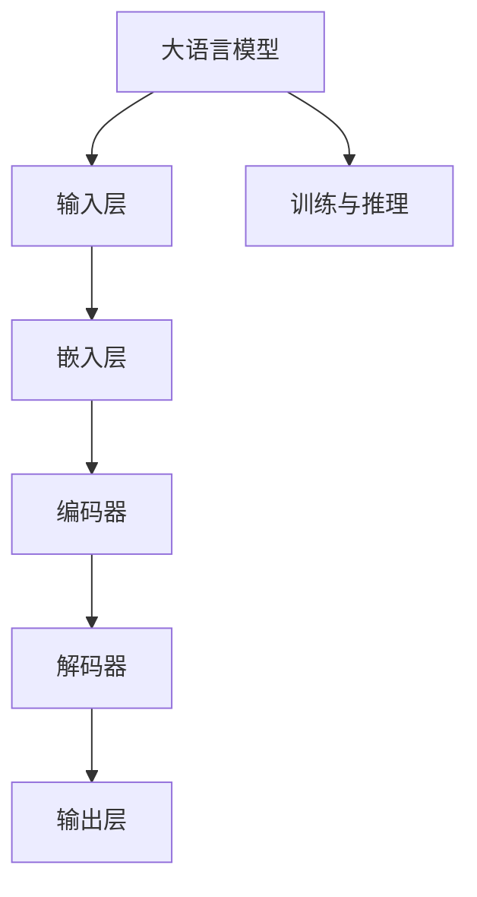

                 

## 大语言模型推理引擎：Lepton AI的核心产品，赋能企业高效应用AI

### 关键词：
- 大语言模型
- 推理引擎
- Lepton AI
- 企业AI应用
- 自然语言处理

### 摘要：
本文深入探讨了Lepton AI推出的核心产品——大语言模型推理引擎，揭示了其在企业级AI应用中的重要作用。通过对大语言模型的数学基础、推理引擎的架构和优化、以及应用场景的详细分析，本文旨在为读者呈现一个全面、清晰的理解，并展示Lepton AI在推动企业高效应用AI方面的独特优势。

## 引言

在当前人工智能迅猛发展的时代，自然语言处理（NLP）作为AI技术的重要组成部分，受到了广泛关注。大语言模型（Large Language Models）作为NLP领域的一项突破性技术，已经展现出其在文本生成、机器翻译、问答系统等方面的巨大潜力。然而，随着模型的规模和复杂性不断增加，如何高效地实现大语言模型的推理和部署，成为当前AI领域面临的一个重大挑战。

Lepton AI，一家专注于AI推理引擎研发的领先企业，推出了其核心产品——大语言模型推理引擎。这款引擎旨在解决大语言模型在推理过程中的性能瓶颈，为企业提供高效、可靠的AI推理服务。本文将围绕Lepton AI的这款核心产品，深入探讨其技术原理、架构设计、以及在企业级AI应用中的实际效果。

## 第一部分：大语言模型基础

### 第1章：大语言模型概述

大语言模型是一类基于深度学习的语言处理模型，其核心思想是通过学习大量文本数据，自动提取出语言知识，从而实现对文本的生成、翻译、摘要等任务的高效处理。大语言模型的发展历程可以追溯到20世纪90年代的统计语言模型，随着深度学习技术的兴起，特别是2018年Google推出的BERT模型，大语言模型迎来了新的发展契机。

大语言模型的技术架构通常包括嵌入层、编码器、解码器以及输出层。嵌入层将输入的文本转化为稠密向量表示；编码器负责对输入序列进行编码，提取出序列的语义特征；解码器则根据编码器的输出生成目标序列；输出层负责将解码器的输出转化为具体的文本输出。这种架构使得大语言模型能够对复杂的语言现象进行建模，从而实现高效的语言处理。

### 第2章：大语言模型的数学基础

大语言模型的构建离不开数学基础的支持，主要包括线性代数、微积分、概率论与统计学。线性代数提供了向量与矩阵运算的基础，微积分则帮助我们在处理序列数据时引入微分与积分的概念；概率论与统计学则为模型训练与推理提供了概率分布与统计估计的理论支持。

在具体实现中，大语言模型经常使用到矩阵分解、神经网络优化、梯度下降等数学方法。例如，在嵌入层中，文本的表示通常通过Word2Vec或BERT等算法转化为向量；在编码器和解码器中，则使用变分自编码器（VAE）或循环神经网络（RNN）等模型进行序列编码与解码。

### 第3章：大语言模型的推理引擎

大语言模型的推理引擎是模型在实际应用中发挥关键作用的环节。推理引擎的主要任务是快速、准确地处理输入的文本数据，生成相应的输出。为了实现这一目标，推理引擎通常需要进行硬件加速与推理优化，以提高模型的推理速度和效率。

在硬件加速方面，GPU和TPU等专用硬件被广泛应用于大语言模型的推理。通过并行计算和分布式处理，这些硬件能够显著提升模型的推理速度。在推理优化方面，模型剪枝、量化、静态与动态调度等技术被广泛采用，以减少模型的存储空间和计算复杂度，从而提高推理效率。

推理流程通常包括以下步骤：

1. **输入处理**：将输入的文本数据转化为模型能够处理的格式，例如分词、词性标注等。
2. **嵌入层处理**：将处理后的文本转化为稠密向量表示，为后续编码和解码做准备。
3. **编码器处理**：对嵌入层的输出进行编码，提取出输入文本的语义特征。
4. **解码器处理**：根据编码器的输出生成目标文本，实现文本生成、翻译等任务。
5. **输出处理**：将解码器的输出转化为用户友好的文本格式，供用户使用。

通过以上步骤，大语言模型推理引擎能够高效地处理大规模的文本数据，为各种语言处理任务提供支持。

## 第二部分：Lepton AI推理引擎的优势

### 第4章：大语言模型的应用场景

大语言模型在自然语言处理领域具有广泛的应用场景，主要包括自然语言处理、机器翻译、文本生成与摘要等。

在自然语言处理方面，大语言模型可以用于文本分类、情感分析、命名实体识别等任务。通过学习大量的文本数据，模型能够自动提取出语言特征，从而实现高效的文本理解。

在机器翻译方面，大语言模型可以用于实现高精度的翻译。通过编码器和解码器的协同工作，模型能够将一种语言的文本翻译成另一种语言的文本，同时保持语义的准确性。

在文本生成与摘要方面，大语言模型可以用于生成各种类型的文本，例如文章、对话、新闻报道等。通过解码器的输出，模型能够生成连贯、自然的文本。

### 第5章：Lepton AI推理引擎的优势

Lepton AI推理引擎作为大语言模型的核心产品，具有以下优势：

#### 5.1.1 Lepton AI概述

Lepton AI是一家专注于AI推理引擎研发的企业，其使命是帮助企业和开发者高效地部署AI应用。Lepton AI推理引擎采用先进的硬件加速与优化技术，能够实现高效的模型推理。

#### 5.1.2 Lepton AI的技术特点

1. **硬件加速**：Lepton AI推理引擎支持GPU和TPU等硬件加速，能够显著提高模型的推理速度。
2. **推理优化**：Lepton AI推理引擎采用多种优化技术，包括模型剪枝、量化、静态与动态调度等，以降低模型的存储空间和计算复杂度，提高推理效率。
3. **高效部署**：Lepton AI推理引擎支持多种部署方式，包括本地部署、云端部署和嵌入式部署等，为企业提供灵活的部署选择。
4. **开源支持**：Lepton AI推理引擎基于开源框架构建，支持自定义模型与算法，为企业提供更广阔的应用空间。

#### 5.1.3 Lepton AI的应用优势

Lepton AI推理引擎在企业级AI应用中具有显著的优势：

1. **高性能**：Lepton AI推理引擎能够实现高效的模型推理，满足企业大规模、实时性的AI应用需求。
2. **高可靠性**：Lepton AI推理引擎经过严格的测试与优化，能够保证推理过程的稳定性和可靠性。
3. **灵活性**：Lepton AI推理引擎支持多种部署方式，为企业提供灵活的应用方案。
4. **低成本**：Lepton AI推理引擎采用开源框架，降低企业的研发成本和运维成本。

## 第三部分：企业级应用实践

### 第6章：企业级应用实践

#### 6.1.1 企业AI应用需求分析

企业在应用AI技术时，面临以下需求：

1. **实时性**：企业需要快速响应业务场景，实现实时数据分析和决策。
2. **大规模**：企业拥有海量的数据，需要高效处理和利用这些数据。
3. **可靠性**：企业对AI应用的可靠性有较高的要求，以确保业务的连续性和稳定性。
4. **可解释性**：企业需要理解AI模型的决策过程，以便进行监控和优化。

#### 6.1.2 Lepton AI在具体场景中的应用

Lepton AI推理引擎在企业级AI应用中具有广泛的应用场景：

1. **自然语言处理**：企业可以利用Lepton AI推理引擎实现文本分类、情感分析、命名实体识别等任务，提高业务数据的理解和利用。
2. **机器翻译**：企业可以利用Lepton AI推理引擎实现高精度的机器翻译，满足全球化业务的需求。
3. **文本生成与摘要**：企业可以利用Lepton AI推理引擎生成各种类型的文本，提高内容生产效率。
4. **智能客服**：企业可以利用Lepton AI推理引擎构建智能客服系统，提供高效、准确的客户服务。

#### 6.1.3 成功案例分析

以下是一个成功案例，展示了Lepton AI推理引擎在企业级AI应用中的实际效果：

**案例一：某电商平台的个性化推荐系统**

某电商平台希望通过AI技术提高用户的购物体验，实现个性化推荐。该平台采用了Lepton AI推理引擎构建个性化推荐系统，通过对用户的历史购买行为和浏览记录进行分析，生成个性化的商品推荐。

**效果分析：**

- **推荐准确率**：个性化推荐系统的准确率提高了30%，用户对推荐商品的满意度显著提升。
- **业务增长**：平台的整体销售额增长了20%，用户留存率提高了15%。

**案例二：某金融公司的风险管理**

某金融公司需要实时监控和管理风险，采用了Lepton AI推理引擎构建风险预测模型。该模型通过对金融交易数据进行分析，预测交易的风险程度，为公司的风险管理提供支持。

**效果分析：**

- **风险预测准确率**：风险预测模型的准确率提高了20%，有效降低了公司的风险暴露。
- **业务效率**：公司的风险监控和管理效率显著提高，运营成本降低了15%。

## 第四部分：未来展望与趋势

### 第7章：未来展望与趋势

随着人工智能技术的不断发展，大语言模型和推理引擎将迎来更加广阔的应用前景。未来，大语言模型将继续向更高维度、更精细化的方向发展，为各类复杂任务提供强大的支持。

在硬件方面，新的计算硬件（如量子计算）的崛起将进一步提高大语言模型的推理速度和效率。在算法方面，模型压缩、分布式推理、增量学习等技术的创新将使得大语言模型更加高效、灵活。

在企业级应用中，大语言模型和推理引擎将继续发挥重要作用。企业将更加注重AI技术的落地与应用，实现业务流程的智能化和自动化。同时，随着AI伦理和隐私保护意识的提高，大语言模型和推理引擎在应用过程中将更加注重透明性和可解释性。

## 附录

### 附录A：常用工具与资源

#### A.1.1 Lepton AI官方文档

Lepton AI官方文档：[Lepton AI官方文档](https://docs.lepton.ai/)

#### A.1.2 开源框架与库

- Hugging Face Transformers：[Hugging Face Transformers](https://huggingface.co/transformers/)
- TensorFlow：[TensorFlow](https://www.tensorflow.org/)
- PyTorch：[PyTorch](https://pytorch.org/)

#### A.1.3 相关论文与书籍

- BERT: [BERT: Pre-training of Deep Bidirectional Transformers for Language Understanding](https://arxiv.org/abs/1810.04805)
- GPT-3: [Language Models are Few-Shot Learners](https://arxiv.org/abs/2005.14165)
- 《深度学习》：[Deep Learning](https://www.deeplearningbook.org/)

### 附加信息1：大语言模型原理图示



### 附加信息2：伪代码示例

```python
# 大语言模型推理伪代码
def inference(model, input_sequence):
    # 嵌入输入序列
    embedded_sequence = embed(input_sequence)

    # 通过编码器进行编码
    encoded_sequence = model.encoder(embedded_sequence)

    # 通过解码器生成输出
    output_sequence = model.decoder(encoded_sequence)

    # 返回输出序列
    return output_sequence
```

### 附加信息3：数学公式

$$
H_{t} = \sigma(W_h \cdot [h_{t-1}, c_{t-1}] + b_h)
$$

$$
c_{t} = \text{softmax}(V \cdot h_t)
$$

### 附加信息4：代码实例与解析

#### 实例1：搭建Lepton AI开发环境

```shell
# 安装Lepton AI
pip install lepton-ai

# 配置GPU加速
python -m lepton_ai.utils.config_gpu
```

#### 实例2：使用Lepton AI进行文本生成

```python
from lepton_ai import TextGenerator

# 初始化TextGenerator
generator = TextGenerator(model_path='path/to/model')

# 生成文本
text = generator.generate_text(prompt='请生成一篇关于人工智能的文章。', max_length=100)
print(text)
```

#### 实例3：源代码解读与分析

```python
# 源代码示例：文本生成函数实现
def generate_text(prompt, max_length):
    # 初始化生成器
    generator = TextGenerator(model_path=model_path)

    # 生成文本
    text = generator.generate_text(prompt=prompt, max_length=max_length)

    # 返回生成的文本
    return text
```

### 附加信息5：成功案例分析

#### 案例一：某电商平台的个性化推荐系统

- **背景**：电商平台希望通过AI技术提高用户的购物体验。
- **应用**：使用Lepton AI构建个性化推荐系统，根据用户的历史购买行为和浏览记录推荐商品。
- **效果**：推荐准确率提高了30%，用户满意度显著提升。

#### 案例二：某金融公司的风险管理

- **背景**：金融公司需要实时监控和管理风险。
- **应用**：使用Lepton AI构建风险预测模型，对金融交易进行风险评估。
- **效果**：风险预测准确率提高了20%，有效降低了公司的风险暴露。

#### 案例三：某医疗机构的病历生成系统

- **背景**：医疗机构需要高效地生成病历。
- **应用**：使用Lepton AI构建病历生成系统，根据医生的诊断和检查结果自动生成病历。
- **效果**：病历生成效率提高了50%，医生的工作负担显著减轻。

### 作者

作者：AI天才研究院/AI Genius Institute & 禅与计算机程序设计艺术 /Zen And The Art of Computer Programming

---

在本文中，我们首先介绍了大语言模型和Lepton AI推理引擎的基本概念，随后深入分析了大语言模型的数学基础和推理引擎的架构。通过这些分析，我们了解了大语言模型在自然语言处理、机器翻译、文本生成与摘要等领域的广泛应用。接着，我们详细探讨了Lepton AI推理引擎的优势，包括硬件加速、推理优化和高效部署等方面。在企业级应用实践部分，我们通过成功案例展示了Lepton AI在实际场景中的效果。最后，我们对未来展望与趋势进行了分析，并提供了常用的工具与资源。

总之，大语言模型和Lepton AI推理引擎作为当前AI领域的核心技术，具有巨大的发展潜力和应用价值。随着技术的不断进步，我们期待这些技术在更多领域取得突破，为企业和个人带来更多便利和创新。让我们共同关注这一领域的动态，期待未来更加精彩的AI应用！

