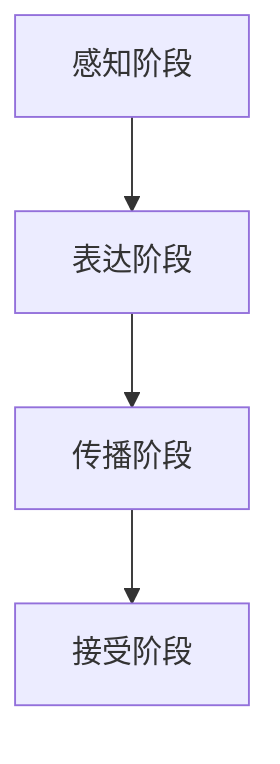

                 

# 如何利用口碑营销实现低成本用户获取

> **关键词：** 口碑营销、用户获取、低成本策略、社交媒体、用户反馈、案例分析

> **摘要：** 本文将深入探讨口碑营销的概念、原理、策略与实践，旨在帮助企业利用口碑效应，通过低成本的方式获取高质量用户。文章将结合实际案例，详细解析口碑营销的测量与评估方法，并提供实用工具和技术，帮助企业在数字化运营中优化口碑营销效果。

## 目录大纲

### 第一部分：口碑营销基础与原理

#### 第1章：口碑营销概述
- 1.1.1 口碑营销的概念与特点
- 1.1.2 口碑营销与传统营销的区别
- 1.1.3 口碑营销的优势与劣势

#### 第2章：口碑营销的原理与模型
- 2.1.1 口碑传播机制
- 2.1.2 口碑营销模型分析
- 2.1.3 社会影响力与口碑扩散

#### 第3章：口碑营销的测量与评估
- 3.1.1 口碑传播效果测量方法
- 3.1.2 口碑营销ROI评估
- 3.1.3 口碑营销案例分析

### 第二部分：口碑营销策略与实践

#### 第4章：构建口碑营销策略
- 4.1.1 明确目标与定位
- 4.1.2 制定口碑传播策略
- 4.1.3 选择合适的口碑传播渠道

#### 第5章：口碑营销内容创作与传播
- 5.1.1 内容创作原则
- 5.1.2 故事化传播策略
- 5.1.3 社交媒体口碑传播技巧

#### 第6章：利用口碑营销实现低成本用户获取
- 6.1.1 低成本用户获取策略
- 6.1.2 用户口碑转化技巧
- 6.1.3 用户口碑反馈机制

#### 第7章：口碑营销案例研究
- 7.1.1 成功口碑营销案例分析
- 7.1.2 失败口碑营销案例分析
- 7.1.3 案例总结与启示

### 第三部分：口碑营销工具与技术

#### 第8章：口碑营销工具应用
- 8.1.1 社交媒体管理工具
- 8.1.2 口碑监测与分析工具
- 8.1.3 用户互动与反馈工具

#### 第9章：口碑营销数据化运营
- 9.1.1 数据化运营概述
- 9.1.2 数据分析与挖掘技术
- 9.1.3 数据驱动的口碑营销优化

#### 第10章：未来口碑营销趋势
- 10.1.1 新技术对口碑营销的影响
- 10.1.2 口碑营销的未来发展方向
- 10.1.3 企业如何应对未来口碑营销挑战

**附录**

### 附录A：口碑营销资源汇总
- A.1 口碑营销相关书籍推荐
- A.2 口碑营销实用工具推荐
- A.3 口碑营销研究论文汇总

---

### 引言

在数字化的今天，口碑营销已经成为企业获取用户和提升品牌形象的重要手段。口碑营销不仅仅依赖于广告投放，更重要的是通过用户之间的自然传播和互动来增强品牌信任度和用户忠诚度。与传统营销方式相比，口碑营销具有成本低、效果好、可信度高等特点，使得越来越多的企业开始重视并实践口碑营销策略。

本文将从以下几个方面展开讨论：

1. **口碑营销基础与原理**：介绍口碑营销的概念、特点、原理和模型，帮助读者了解口碑营销的基本理论和运作机制。
2. **口碑营销策略与实践**：阐述如何构建有效的口碑营销策略，包括目标明确、传播策略制定和传播渠道选择等。
3. **口碑营销内容创作与传播**：探讨如何创作有吸引力的口碑内容，以及如何利用社交媒体等渠道进行传播。
4. **口碑营销案例研究**：分析成功和失败的口碑营销案例，总结经验教训。
5. **口碑营销工具与技术**：介绍当前流行的口碑营销工具和技术，如何利用这些工具提高口碑营销效果。
6. **未来口碑营销趋势**：预测口碑营销的未来发展方向和新技术对口碑营销的影响。

通过本文的阅读，读者将能够系统了解口碑营销的各个方面，并掌握利用口碑营销实现低成本用户获取的方法和技巧。

### 第一部分：口碑营销基础与原理

#### 第1章：口碑营销概述

#### 1.1.1 口碑营销的概念与特点

口碑营销，又称“口口相传”营销，是指通过用户之间的自然传播和口碑效应来提升品牌形象、促进产品销售的一种营销策略。与传统营销方式不同，口碑营销强调用户之间的信任和情感互动，注重通过真实用户的体验和评价来吸引潜在客户。

**概念解释：**
- **口碑（Word of Mouth, WOM）：** 指消费者通过口口相传、在线评论、社交媒体分享等方式，对产品或服务进行评价和推荐。
- **口碑营销（Word of Mouth Marketing, WOMM）：** 指企业利用口碑效应，通过制定和实施一系列策略，主动引导和促进用户之间的口碑传播，从而实现营销目标。

**特点：**
1. **成本低廉：** 口碑营销依赖于用户自发传播，无需大规模广告投放，从而降低了营销成本。
2. **效果显著：** 口碑营销能够提升品牌知名度和用户忠诚度，带来更高的转化率和销售额。
3. **可信度高：** 口碑评价来自于真实用户，具有更高的可信度和说服力。
4. **可持续性：** 口碑效应具有持续性，好的口碑能够长期为品牌带来正面的影响。

**与传统营销方式的对比：**
- **广告营销：** 强调品牌宣传和产品推广，通过大规模广告投放吸引潜在客户。广告成本高，效果难以评估。
- **口碑营销：** 注重用户体验和用户评价，通过自然传播和口碑效应提升品牌形象。成本低，效果显著。

#### 1.1.2 口碑营销与传统营销的区别

**目标导向：**
- **广告营销：** 目标通常是提升品牌知名度和吸引潜在客户。
- **口碑营销：** 目标不仅是提升品牌知名度，更重要的是通过用户口碑传播来提升品牌信任度和用户忠诚度。

**传播途径：**
- **广告营销：** 主要依赖于传统媒体（如电视、广播、报纸）和数字媒体（如社交媒体、搜索引擎广告）。
- **口碑营销：** 主要依赖于用户之间的自然传播和互动，如口口相传、在线评论、社交媒体分享等。

**成本效益：**
- **广告营销：** 成本较高，特别是大型广告投放和品牌推广。
- **口碑营销：** 成本较低，通过用户口碑效应实现品牌推广，长期成本低。

**可信度：**
- **广告营销：** 存在信任危机，容易引发消费者反感。
- **口碑营销：** 基于真实用户评价，具有较高的可信度和说服力。

#### 1.1.3 口碑营销的优势与劣势

**优势：**
1. **低成本：** 口碑营销依赖于用户自发传播，无需大规模广告投放，从而降低了营销成本。
2. **高效果：** 口碑营销能够提升品牌知名度和用户忠诚度，带来更高的转化率和销售额。
3. **可信度高：** 口碑评价来自于真实用户，具有更高的可信度和说服力。
4. **长期效应：** 好的口碑能够长期为品牌带来正面的影响，形成品牌忠诚度。

**劣势：**
1. **可控性低：** 口碑营销依赖于用户自发传播，企业难以直接控制传播内容和速度。
2. **速度慢：** 口碑传播速度相对较慢，难以快速提升品牌知名度。
3. **负面影响：** 如果用户对产品或服务有负面评价，口碑传播可能导致品牌形象受损。

**总结：**
口碑营销作为一种低成本、高效果的营销策略，具有显著的竞争优势。然而，企业在实施口碑营销时需要平衡好控制与自由度，充分利用口碑效应，同时预防和应对潜在负面影响。

---

### 第2章：口碑营销的原理与模型

#### 2.1.1 口碑传播机制

口碑营销的核心在于口碑传播机制，即用户通过互动和交流，将正面或负面评价传播给其他潜在用户，从而影响品牌形象和销售。口碑传播机制可以分为以下几个阶段：

1. **感知阶段**：用户在接触产品或服务后，对其产生感知和评价。
2. **表达阶段**：用户将自己的评价和感受通过语言、文字、图片等形式表达出来。
3. **传播阶段**：用户通过社交媒体、口口相传等方式，将评价和感受传播给其他用户。
4. **接受阶段**：其他潜在用户接收到口碑信息后，对其产生感知和评价，进而影响购买决策。

**口碑传播机制图示：**



**关键影响因素：**
1. **用户评价**：用户对产品或服务的评价是口碑传播的核心，直接影响口碑的传播效果。
2. **传播渠道**：口碑传播的渠道多种多样，包括社交媒体、口碑平台、论坛、个人推荐等。
3. **用户互动**：用户之间的互动和交流是口碑传播的关键，通过互动，口碑信息能够更快速、更广泛地传播。

#### 2.1.2 口碑营销模型分析

口碑营销模型是分析口碑传播过程和效果的理论框架，常见的口碑营销模型有S-shaped模型和K-shaped模型。

**S-shaped模型：**

S-shaped模型描述了口碑传播从零开始，逐渐积累，最终爆发的过程。该模型认为口碑传播速度呈S形曲线，可分为四个阶段：

1. **潜伏期**：口碑传播初期，传播速度较慢，用户数量有限。
2. **缓慢增长期**：随着用户评价的增加，口碑传播速度逐渐加快，但增长仍较慢。
3. **快速增长期**：用户评价达到一定数量后，口碑传播速度迅速提升，进入快速增长期。
4. **爆发期**：口碑传播达到高峰，用户数量急剧增加，口碑效应得到全面体现。

**K-shaped模型：**

K-shaped模型将口碑传播过程分为两个阶段，第一个阶段类似于S-shaped模型，口碑传播速度逐渐加快，第二个阶段则是口碑传播速度迅速爆发，呈现出K形曲线。K-shaped模型强调了用户初始评价和中间评价对口碑传播的影响。

**口碑营销模型对比：**

S-shaped模型和K-shaped模型在口碑传播过程的描述上有所不同，但都强调了口碑传播速度和用户评价的重要性。S-shaped模型更注重口碑传播的持续性和稳定性，而K-shaped模型则更强调口碑传播的爆发性和效果。

**口碑营销模型应用：**

企业可以通过口碑营销模型来预测和规划口碑传播过程，制定相应的口碑营销策略。例如，在潜伏期和缓慢增长期，企业可以通过推广活动和用户互动来增加用户评价，加速口碑传播；在快速增长期和爆发期，企业则需要加强品牌宣传和客户服务，巩固口碑效应。

#### 2.1.3 社会影响力与口碑扩散

社会影响力是指个人或团体在社会中产生的影响力和号召力，社会影响力高的个体或团体往往能够更快、更广泛地传播口碑信息，从而提升口碑效应。社会影响力与口碑扩散的关系可以从以下几个方面进行分析：

1. **意见领袖的作用**：意见领袖（Influencer）是指在特定领域或群体中具有较高影响力和号召力的人。意见领袖的意见和评价往往能够引起其他用户的关注和模仿，从而加速口碑扩散。

2. **社交网络结构**：社交网络的结构对口碑扩散具有重要影响。紧密的社交网络能够促进口碑信息的快速传播，而分散的社交网络则可能导致口碑传播速度变慢。

3. **信息传播路径**：口碑信息在不同社交网络节点之间的传播路径会影响口碑扩散的速度和范围。有效的信息传播路径可以缩短口碑传播的时间，扩大口碑传播的范围。

**社会影响力与口碑扩散模型图示：**

```mermaid
graph TD
    A[用户A](shape矩形) --> B[用户B](shape矩形)
    B --> C[用户C](shape矩形)
    C --> D[用户D](shape矩形)
    D --> E[用户E](shape矩形)
    F[意见领袖](shape矩形) --> G[用户F](shape矩形)
    G --> H[用户G](shape矩形)
    I[社交网络](shape矩形) --> J[口碑扩散](shape矩形)
```

**影响因素：**
1. **意见领袖的影响力**：意见领袖的知名度、专业性和可信度越高，口碑扩散的速度越快。
2. **社交网络的结构**：紧密的社交网络有利于口碑信息的快速传播，而分散的社交网络则需要更多时间来形成口碑效应。
3. **用户间的互动**：用户之间的互动和反馈能够增强口碑信息的可信度和影响力，从而加速口碑扩散。

**结论：**
社会影响力与口碑扩散密切相关，企业可以通过培养意见领袖、优化社交网络结构和提高用户互动，来提升口碑效应，实现低成本用户获取。

---

### 第3章：口碑营销的测量与评估

#### 3.1.1 口碑传播效果测量方法

口碑营销的效果评估是确保营销策略有效性的关键。为了准确测量口碑传播效果，企业需要采用多种方法来收集和分析数据。以下是几种常用的口碑传播效果测量方法：

**1. 社交媒体分析：**
- **社交媒体监测工具：** 使用社交媒体监测工具（如Hootsuite、Sprout Social）来跟踪品牌在社交媒体上的提及量和互动量，包括点赞、评论、分享等。
- **关键词分析：** 通过监测与品牌相关的关键词，了解用户对品牌的讨论和评价。

**2. 用户反馈调查：**
- **在线调查：** 通过在线调查平台（如SurveyMonkey、Google表单）收集用户对产品或服务的反馈，了解用户满意度、购买意向等。
- **电话调查：** 通过电话调查获取更深入的用户反馈，了解用户在使用产品或服务过程中的体验和问题。

**3. 销售数据跟踪：**
- **销售数据分析：** 通过分析销售数据，了解口碑传播对销售额的影响，包括新客户来源、购买频率、客单价等。
- **转化率分析：** 通过跟踪用户的转化路径和转化率，了解口碑传播对用户行为的影响。

**4. 竞争对手分析：**
- **比较分析：** 通过对比竞争对手的口碑传播效果，了解自身的优势和劣势。
- **市场研究：** 通过市场研究，了解行业趋势和用户需求，为口碑营销策略提供参考。

#### 3.1.2 口碑营销ROI评估

评估口碑营销的投资回报率（ROI）是衡量营销效果的重要指标。以下是计算口碑营销ROI的步骤和方法：

**1. 定义ROI目标：**
- **确定ROI指标：** 根据企业的营销目标，设定ROI目标。例如，提高销售额、增加用户数量、提升品牌知名度等。
- **设定时间范围：** 确定评估的时间范围，例如一个月、三个月或六个月。

**2. 收集相关数据：**
- **销售额数据：** 收集口碑营销期间的销售数据，包括销售额、订单数量等。
- **营销成本数据：** 收集口碑营销的相关成本，包括广告投放、活动策划、人力资源等。

**3. 计算ROI：**
- **ROI计算公式：**
  $$ROI = \frac{{(销售额 - 营销成本)}}{{营销成本}} \times 100\%$$
- **案例计算：**
  假设某企业在一个月内通过口碑营销实现了10000元的销售额，营销成本为3000元，则其ROI为：
  $$ROI = \frac{{(10000 - 3000)}}{{3000}} \times 100\% = 233\%$$

**4. 分析ROI结果：**
- **比较ROI目标：** 将计算出的ROI与设定的ROI目标进行比较，评估口碑营销的效果。
- **优化营销策略：** 根据ROI分析结果，调整口碑营销策略，提高营销效果。

#### 3.1.3 口碑营销案例分析

**案例1：宜家家居的口碑营销**

宜家家居通过一系列口碑营销策略，成功建立了全球知名的家居品牌形象。以下是宜家家居的口碑营销案例分析：

**1. 目标与定位：**
- **目标：** 提升品牌知名度，增加用户对宜家产品的购买意愿。
- **定位：** 宜家将自身定位为“高性价比的家居解决方案提供商”。

**2. 策略与实践：**
- **用户体验：** 宜家注重用户体验，通过提供舒适的购物环境和优质的产品服务，赢得了用户的信任和好评。
- **口碑传播：** 宜家鼓励用户分享购物体验，通过社交媒体和口碑平台，传播正面口碑。
- **互动活动：** 宜家定期举办互动活动，如家居设计大赛、用户体验分享会等，增强用户互动和口碑传播。

**3. 效果评估：**
- **销售额：** 宜家家居的销售额持续增长，尤其是在口碑营销期间，销售额增幅显著。
- **用户满意度：** 用户满意度调查显示，宜家家居的用户满意度较高，口碑效应明显。

**案例2：小米的口碑营销**

小米通过口碑营销，迅速崛起成为中国知名的科技品牌。以下是小米的口碑营销案例分析：

**1. 目标与定位：**
- **目标：** 提升品牌知名度，扩大市场份额，提升用户忠诚度。
- **定位：** 小米将自身定位为“为发烧而生”的科技品牌。

**2. 策略与实践：**
- **产品品质：** 小米注重产品品质，通过不断优化产品设计和性能，赢得了用户的信任和好评。
- **口碑传播：** 小米鼓励用户分享购买体验，通过社交媒体和口碑平台，传播正面口碑。
- **粉丝文化：** 小米打造了独特的粉丝文化，通过线上线下活动，与用户建立紧密联系，增强用户忠诚度。

**3. 效果评估：**
- **市场份额：** 小米的市场份额持续增长，尤其在智能手机和智能家居领域，成为行业领军品牌。
- **用户忠诚度：** 用户满意度调查显示，小米的用户忠诚度较高，口碑效应显著。

**总结：**
通过以上案例分析，可以看出，成功的口碑营销需要明确的目标和定位，优质的产品和服务，以及有效的口碑传播策略。同时，通过科学的测量与评估方法，企业可以不断优化口碑营销策略，实现低成本用户获取和品牌提升。

---

### 第二部分：口碑营销策略与实践

#### 第4章：构建口碑营销策略

口碑营销策略是企业通过一系列有目的、有计划的行动，利用口碑效应来提升品牌形象和用户忠诚度。构建有效的口碑营销策略是企业成功实施口碑营销的关键。以下是构建口碑营销策略的步骤和方法：

#### 4.1.1 明确目标与定位

**1. 确定目标：**
- **品牌知名度：** 提升品牌在目标市场中的知名度，增加品牌曝光度。
- **用户忠诚度：** 提高用户对品牌的忠诚度，增加复购率。
- **市场份额：** 扩大市场份额，提升品牌竞争力。

**2. 明确定位：**
- **目标市场：** 明确目标市场，了解目标用户的特征和需求。
- **品牌形象：** 确定品牌形象，如时尚、专业、高端等。
- **竞争优势：** 分析竞争对手，找出自身的竞争优势和差异化特点。

**3. 设定关键指标：**
- **KPIs：** 设定关键绩效指标（KPIs），如用户增长率、用户满意度、品牌提及量等。
- **时间范围：** 设定具体的时间范围，如季度、半年或一年。

#### 4.1.2 制定口碑传播策略

**1. 选择传播渠道：**
- **社交媒体：** 利用社交媒体平台（如微信、微博、抖音等）进行口碑传播。
- **口碑平台：** 利用口碑平台（如小红书、知乎、淘宝等）发布用户评价和产品推荐。
- **线下活动：** 通过线下活动（如发布会、用户体验会等）吸引用户参与和分享。

**2. 制定传播内容：**
- **产品信息：** 详细介绍产品特点、优势和应用场景。
- **用户故事：** 讲述真实用户的购买和使用体验，增加可信度。
- **活动宣传：** 宣传公司的活动信息，鼓励用户参与和分享。

**3. 制定传播计划：**
- **时间安排：** 制定具体的时间安排，包括每日、每周、每月的传播内容和活动。
- **资源分配：** 根据传播计划，合理分配人力资源、资金和物资。

#### 4.1.3 选择合适的口碑传播渠道

**1. 社交媒体：**
- **微信：** 利用微信公众号、朋友圈、小程序等，发布品牌信息和用户评价。
- **微博：** 利用微博进行实时传播，增加品牌曝光度。
- **抖音：** 利用短视频形式，展示产品特点和用户体验。

**2. 口碑平台：**
- **小红书：** 针对年轻女性用户，发布购物心得和产品推荐。
- **知乎：** 针对知识型用户，发布专业知识和用户评价。
- **淘宝：** 利用淘宝店铺和评价系统，展示用户真实评价。

**3. 线下活动：**
- **发布会：** 发布新产品或更新，邀请媒体和用户参加。
- **用户体验会：** 邀请用户参与产品体验，收集用户反馈。
- **公益活动：** 利用公益活动提升品牌形象，增强用户互动。

**4. 其他渠道：**
- **论坛：** 在相关论坛发布产品信息和用户评价，吸引潜在用户。
- **博客：** 发布专业文章和用户故事，提升品牌专业形象。
- **直播：** 利用直播平台展示产品特点和用户体验，增加用户参与度。

**总结：**
构建口碑营销策略需要明确目标与定位，制定具体的口碑传播策略，并选择合适的传播渠道。通过科学规划和有效执行，企业可以充分利用口碑效应，实现低成本用户获取和品牌提升。

---

### 第5章：口碑营销内容创作与传播

口碑营销的成功在很大程度上取决于内容创作与传播的质量。优秀的内容不仅能吸引目标用户，还能激发用户参与和分享的欲望，从而实现口碑效应。以下是口碑营销内容创作与传播的关键策略：

#### 5.1.1 内容创作原则

**1. 真实性：**
- **真实体验：** 内容应基于真实用户的体验和感受，增加可信度。
- **透明度：** 对产品或服务的优缺点进行真实描述，不夸大或隐瞒。

**2. 有价值：**
- **解决痛点：** 针对目标用户的痛点和需求，提供实用的解决方案。
- **提供信息：** 提供有价值的信息，如产品特点、应用场景、使用技巧等。

**3. 创意性：**
- **新颖独特：** 创造新颖独特的内容形式，如短视频、图文故事、互动H5等。
- **引人入胜：** 用引人入胜的标题和开头吸引读者的注意力。

**4. 互动性：**
- **用户参与：** 鼓励用户参与内容创作，如发起话题讨论、收集用户反馈等。
- **互动互动：** 通过互动环节（如评论、点赞、分享）增强用户参与感。

#### 5.1.2 故事化传播策略

**1. 创造品牌故事：**
- **品牌背景：** 讲述品牌的起源、发展历程和核心价值观。
- **品牌故事：** 通过真实的故事情节，展示品牌的人文关怀和社会责任。

**2. 传播用户故事：**
- **用户访谈：** 对真实用户进行访谈，了解他们的使用体验和故事。
- **用户案例：** 通过具体的用户案例，展示产品如何解决用户的实际问题。

**3. 制作内容故事化：**
- **叙事结构：** 使用叙事结构（如冲突-解决-高潮-结局），讲述内容故事。
- **情感共鸣：** 通过情感共鸣，引发读者的情感共鸣和认同。

**4. 传播渠道故事化：**
- **社交媒体故事化：** 在社交媒体上发布故事化的内容，增加用户参与度。
- **广告故事化：** 制作故事化的广告，提升品牌形象和用户好感度。

#### 5.1.3 社交媒体口碑传播技巧

**1. 选择合适的社交媒体平台：**
- **了解用户习惯：** 根据目标用户的特点，选择合适的社交媒体平台。
- **多样化传播：** 结合多种社交媒体平台，实现全方位传播。

**2. 利用KOL和意见领袖：**
- **合作传播：** 与KOL和意见领袖合作，利用他们的影响力进行口碑传播。
- **互动互动：** 与KOL和意见领袖保持互动，增强合作效果。

**3. 定期发布内容：**
- **内容规划：** 制定内容发布计划，保持内容更新频率。
- **多形式内容：** 发布多种形式的内容（如文字、图片、视频等），满足不同用户需求。

**4. 激励用户参与：**
- **互动互动：** 通过评论、点赞、分享等互动机制，激励用户参与。
- **奖励机制：** 设计奖励机制，鼓励用户分享和推荐产品。

**5. 监测和反馈：**
- **数据监测：** 定期监测内容传播效果，了解用户反馈。
- **优化调整：** 根据数据反馈，优化内容创作和传播策略。

**总结：**
口碑营销内容创作与传播的关键在于真实性、有价值、创意性和互动性。通过故事化传播策略和社交媒体口碑传播技巧，企业可以有效地吸引目标用户，激发用户参与和分享，实现口碑效应。

---

### 第6章：利用口碑营销实现低成本用户获取

#### 6.1.1 低成本用户获取策略

在数字化时代，低成本用户获取是企业在竞争激烈的市场中保持竞争优势的关键。口碑营销作为一种有效的用户获取策略，通过利用用户之间的自然传播和口碑效应，能够实现低成本、高效果的用户获取。以下是几个关键策略：

**1. 产品品质与服务：**
- **优质产品：** 提供高品质、创新性的产品，确保用户满意。
- **优质服务：** 提供卓越的客户服务，增强用户忠诚度。

**2. 用户互动与参与：**
- **用户反馈：** 鼓励用户参与产品评价和反馈，收集真实用户意见。
- **用户社区：** 创建用户社区，促进用户互动和分享，增强用户归属感。

**3. 社交媒体营销：**
- **内容创作：** 创作有价值、吸引人的内容，吸引目标用户关注。
- **社交媒体推广：** 利用社交媒体平台（如微信、微博、抖音等）进行口碑传播。

**4. KOL与意见领袖：**
- **合作传播：** 与KOL和意见领袖合作，利用他们的影响力进行口碑传播。
- **互动互动：** 与KOL和意见领袖保持互动，增强合作效果。

**5. 优惠活动与奖励机制：**
- **促销活动：** 开展限时促销活动，吸引新用户购买。
- **奖励机制：** 设计用户推荐奖励机制，鼓励现有用户推荐新用户。

#### 6.1.2 用户口碑转化技巧

用户口碑转化是指将口碑传播中的潜在用户转化为实际购买者的过程。以下是一些有效的用户口碑转化技巧：

**1. 优化产品展示：**
- **真实展示：** 在网站、社交媒体等渠道上展示真实用户评价和购买经历。
- **产品优势：** 强调产品或服务的独特优势和用户痛点解决方案。

**2. 提供免费试用：**
- **免费试用：** 提供免费试用或试读服务，让用户亲身体验产品或服务。
- **限时优惠：** 通过限时优惠或优惠券，鼓励试用后的用户购买。

**3. 情感营销：**
- **情感共鸣：** 利用故事、情感元素，与用户建立情感联系，增加用户购买意愿。
- **用户故事：** 通过用户故事，展示产品如何解决用户的实际问题，增强信任感。

**4. 互动与反馈：**
- **积极互动：** 与用户进行积极互动，回答疑问，提供帮助。
- **快速反馈：** 及时响应用户反馈，解决用户问题，提升用户体验。

**5. 社交媒体引导：**
- **分享引导：** 在社交媒体上发布购买引导内容，鼓励用户分享和推荐。
- **社交互动：** 通过社交媒体互动，增加用户粘性，促进口碑传播和转化。

#### 6.1.3 用户口碑反馈机制

用户口碑反馈机制是确保口碑营销效果的重要环节。以下是一些有效的用户口碑反馈机制：

**1. 用户调查与反馈：**
- **定期调查：** 定期开展用户满意度调查，了解用户对产品或服务的评价。
- **反馈渠道：** 设立多种反馈渠道（如在线调查、电话热线、社交媒体等），方便用户表达意见。

**2. 用户评价管理：**
- **正面评价：** 及时展示和推广正面用户评价，增强品牌信任度。
- **负面评价：** 积极应对负面评价，解决问题，提升用户满意度。

**3. 用户互动与反馈：**
- **互动互动：** 与用户保持互动，回答疑问，提供帮助。
- **快速反馈：** 及时处理用户反馈，解决问题，提升用户体验。

**4. 数据分析与优化：**
- **数据分析：** 通过数据分析，了解用户口碑传播效果和转化情况。
- **优化策略：** 根据数据分析结果，调整口碑营销策略，提高效果。

**总结：**
通过低成本用户获取策略、用户口碑转化技巧和用户口碑反馈机制，企业可以有效利用口碑营销，实现低成本、高质量的用户获取。同时，不断优化口碑营销策略，提升用户满意度和品牌形象，为企业持续发展奠定基础。

---

### 第7章：口碑营销案例研究

口碑营销在实践中的应用成效各异，成功的案例可以提供宝贵的经验和启示，而失败的案例则能帮助企业避免重复错误。以下将通过成功和失败的口碑营销案例，详细分析其策略、实践及其效果。

#### 7.1.1 成功口碑营销案例分析

**案例1：苹果公司的iPhone口碑营销**

**背景：** 苹果公司在iPhone发布初期，凭借其独特的创新设计和卓越的用户体验，迅速赢得了大量用户青睐。

**策略与实践：**
- **产品创新：** 苹果公司不断推出具有创新功能的新机型，如多点触控屏幕、Retina显示屏等。
- **用户体验：** 苹果公司注重用户体验，通过简洁美观的界面设计和出色的产品性能，赢得了用户的一致好评。
- **口碑传播：** 苹果公司鼓励用户通过社交媒体分享使用体验，通过口碑效应扩大品牌影响力。

**效果评估：**
- **品牌知名度：** 苹果公司品牌知名度大幅提升，成为全球知名的科技品牌。
- **用户忠诚度：** 用户忠诚度较高，忠诚用户群体不断扩大。
- **销售额：** iPhone系列产品的销售额持续增长，成为苹果公司的重要收入来源。

**启示：**
- **持续创新：** 通过不断推出创新产品，保持用户兴趣和口碑效应。
- **用户体验至上：** 提供卓越的用户体验，赢得用户信任和好评。
- **社交媒体利用：** 利用社交媒体平台，激发用户分享欲望，实现口碑传播。

**案例2：耐克品牌的“Just Do It”口碑营销**

**背景：** 耐克公司以其强大的品牌影响力和创新营销策略，在全球范围内取得了巨大成功。

**策略与实践：**
- **品牌定位：** 耐克将自身定位为“激励人们超越自我”的品牌，强调运动精神和积极态度。
- **口碑传播：** 耐克通过社交媒体和线上活动，鼓励用户分享运动经历和心得，实现口碑传播。
- **品牌合作：** 耐克与知名运动员和运动团队合作，利用他们的影响力提升品牌形象。

**效果评估：**
- **品牌影响力：** 耐克品牌影响力持续提升，成为全球知名的运动品牌。
- **用户参与度：** 用户积极参与品牌活动和分享，增强了用户归属感。
- **市场份额：** 耐克市场份额不断扩大，成为运动鞋和服装市场的领军品牌。

**启示：**
- **明确品牌定位：** 明确品牌定位，树立积极向上的品牌形象。
- **社交媒体互动：** 利用社交媒体平台，增强用户参与度和互动性。
- **品牌合作：** 通过品牌合作，利用合作伙伴的影响力提升品牌知名度。

#### 7.1.2 失败口碑营销案例分析

**案例1：某保健品品牌的过度宣传口碑营销**

**背景：** 某保健品品牌在推出新产品时，通过大量广告宣传和夸大产品效果，试图快速提升品牌知名度。

**策略与实践：**
- **广告宣传：** 短时间内投放大量广告，宣传产品的神奇效果。
- **负面口碑：** 用户对产品的实际效果不满，开始出现负面口碑传播。

**效果评估：**
- **品牌形象受损：** 负面口碑迅速传播，品牌形象受到严重损害。
- **销售额下降：** 用户对品牌的信任度降低，导致销售额下降。
- **用户流失：** 老用户对品牌失去信任，开始流失。

**启示：**
- **真实宣传：** 宣传内容应真实可信，避免夸大其词。
- **用户反馈：** 关注用户反馈，及时调整营销策略。
- **口碑管理：** 建立有效的口碑管理机制，预防和应对负面口碑。

**案例2：某食品品牌的产品质量问题口碑营销**

**背景：** 某食品品牌在推出新产品时，由于质量问题引发了大规模用户投诉。

**策略与实践：**
- **掩盖问题：** 品牌方试图掩盖产品质量问题，未能及时回应用户投诉。
- **公关危机：** 产品质量问题引发媒体关注，形成公关危机。

**效果评估：**
- **品牌形象受损：** 质量问题导致品牌形象严重受损。
- **用户信任度下降：** 用户对品牌的信任度大幅下降。
- **销售额下滑：** 产品销售受到严重影响，市场份额下降。

**启示：**
- **质量为本：** 产品质量是口碑营销的基础，必须确保产品质量。
- **及时回应：** 及时回应用户投诉和问题，展现品牌责任。
- **公关策略：** 制定有效的公关策略，积极应对危机。

#### 7.1.3 案例总结与启示

**成功案例总结：**
- **真实可信：** 成功的口碑营销应基于真实用户体验和评价，避免夸大宣传。
- **用户体验：** 提供卓越的用户体验，赢得用户信任和好评。
- **社交媒体：** 有效利用社交媒体平台，激发用户参与和分享。
- **品牌合作：** 通过品牌合作，利用合作伙伴的影响力提升品牌知名度。

**失败案例总结：**
- **夸大宣传：** 过度夸大产品效果，导致用户对品牌失去信任。
- **质量问题：** 产品质量问题导致品牌形象受损。
- **缺乏应对：** 缺乏有效的应对策略，导致负面口碑迅速扩散。

**启示：**
- **真实宣传：** 宣传内容应真实可信，避免夸大其词。
- **关注反馈：** 关注用户反馈，及时调整营销策略。
- **质量为本：** 确保产品质量，树立品牌信誉。
- **危机管理：** 制定有效的危机管理策略，积极应对负面事件。

通过成功和失败的口碑营销案例，企业可以从中汲取经验教训，优化口碑营销策略，实现低成本、高质量的用户获取和品牌提升。

---

### 第三部分：口碑营销工具与技术

#### 第8章：口碑营销工具应用

口碑营销工具是帮助企业高效管理和分析口碑传播的重要手段。随着社交媒体的普及和数据技术的进步，口碑营销工具的种类和功能也在不断丰富。以下是几种常见的口碑营销工具及其应用：

#### 8.1.1 社交媒体管理工具

**1. Hootsuite：**
- **功能特点：** Hootsuite是一款全面的社交媒体管理工具，支持多个社交媒体平台（如Facebook、Twitter、LinkedIn等）的统一管理。用户可以监控品牌提及、发布内容、管理评论和消息，以及制定内容日历。
- **应用场景：** 适用于中小型企业，帮助用户高效管理社交媒体账号，提升品牌影响力。

**2. Sprout Social：**
- **功能特点：** Sprout Social提供强大的社交媒体分析功能，用户可以跟踪品牌在社交媒体上的表现，分析关键绩效指标（KPIs），并制定有针对性的内容策略。
- **应用场景：** 适用于有较高社交媒体运营需求的企业，帮助用户深入分析社交媒体效果，优化口碑营销策略。

#### 8.1.2 口碑监测与分析工具

**1. Brandwatch：**
- **功能特点：** Brandwatch是一款专业的社交媒体和口碑监测工具，用户可以实时监控与品牌相关的讨论和趋势，识别潜在风险和机会。
- **应用场景：** 适用于大型企业，帮助用户全面了解品牌在社交媒体上的口碑状况，及时应对负面舆情。

**2. Nielsen Norman Group：**
- **功能特点：** Nielsen Norman Group提供用户行为分析和用户体验监测服务，用户可以了解目标用户在社交媒体上的互动行为，优化口碑传播策略。
- **应用场景：** 适用于需要深入了解用户行为和市场动态的企业，帮助用户制定更精准的口碑营销策略。

#### 8.1.3 用户互动与反馈工具

**1. Zendesk：**
- **功能特点：** Zendesk是一款全面的客户服务与支持工具，用户可以通过多种渠道（如电子邮件、电话、社交媒体等）与客户互动，提供及时有效的支持。
- **应用场景：** 适用于需要提供高质量客户服务的企业，通过有效的用户互动，提升客户满意度和口碑效应。

**2. HelpScout：**
- **功能特点：** HelpScout是一款专业的客户服务工具，提供客户支持、用户反馈收集和管理等功能，帮助用户快速响应客户问题，提升用户体验。
- **应用场景：** 适用于需要高效管理客户支持和反馈的企业，通过积极互动，增强用户满意度和忠诚度。

**总结：**
口碑营销工具在帮助企业高效管理和分析口碑传播、提升用户体验和满意度方面发挥着重要作用。通过选择合适的口碑营销工具，企业可以更好地实施口碑营销策略，实现低成本用户获取和品牌提升。

---

### 第9章：口碑营销数据化运营

#### 9.1.1 数据化运营概述

数据化运营是指企业利用数据分析技术，通过对用户行为、市场动态和营销效果的数据收集、处理和分析，实现精准营销和运营优化。在口碑营销中，数据化运营具有至关重要的作用，能够帮助企业深入了解用户需求，优化口碑传播策略，提高用户获取效率和转化率。以下是数据化运营在口碑营销中的关键作用：

**1. 用户需求洞察：** 通过数据分析，企业可以了解用户的行为习惯、购买偏好和痛点，从而制定更有针对性的口碑营销策略。

**2. 营销效果评估：** 数据化运营能够实时监测和评估口碑营销效果，包括用户参与度、转化率和ROI等指标，帮助企业优化营销策略。

**3. 优化传播渠道：** 通过数据分析，企业可以了解不同口碑传播渠道的效果，优化资源分配，提高口碑传播的效率和效果。

**4. 预测趋势：** 数据化运营可以帮助企业预测市场趋势和用户行为，提前布局和调整口碑营销策略，抢占市场先机。

**5. 风险控制：** 通过实时监测和预警系统，企业可以及时发现和应对负面口碑和舆情风险，避免品牌形象受损。

#### 9.1.2 数据分析与挖掘技术

数据分析和挖掘技术在口碑营销中发挥着关键作用，以下是一些常用的数据分析和挖掘技术：

**1. 描述性分析：** 描述性分析是对现有数据的总结和描述，通过统计分析方法，如平均值、中位数、标准差等，了解数据的分布和特征。

**2. 聚类分析：** 聚类分析是将数据集划分为多个类别或簇，以发现数据中的潜在模式和结构。在口碑营销中，聚类分析可以帮助企业识别具有相似口碑特征的用户群体。

**3. 分维分析：** 分维分析是一种衡量数据复杂性和信息密度的方法，通过计算数据的分维数，可以了解数据的分布和紧密程度。在口碑营销中，分维分析可以帮助企业识别具有较高影响力的用户和口碑节点。

**4. 关联规则挖掘：** 关联规则挖掘是一种发现数据间关联关系的方法，通过分析不同变量之间的相互关系，可以了解用户的行为模式和价值链。在口碑营销中，关联规则挖掘可以帮助企业发现用户口碑传播的关键路径和影响因素。

**5. 机器学习：** 机器学习是一种通过训练模型来预测和分类数据的方法，包括监督学习和无监督学习。在口碑营销中，机器学习可以用于用户行为预测、口碑传播预测和营销效果优化。

**总结：**
数据化运营是口碑营销的重要组成部分，通过数据分析和挖掘技术，企业可以深入理解用户需求，优化口碑传播策略，提高营销效果。未来，随着大数据和人工智能技术的不断发展，数据化运营将在口碑营销中发挥更大的作用。

---

### 第10章：未来口碑营销趋势

#### 10.1.1 新技术对口碑营销的影响

随着科技的不断发展，新技术正在深刻改变口碑营销的运作方式和效果。以下是几种关键技术对口碑营销的影响：

**1. 人工智能（AI）：**
- **个性化推荐：** 人工智能可以帮助企业实现个性化推荐，根据用户行为和偏好，提供个性化的口碑内容，提高用户参与度和转化率。
- **情感分析：** 通过自然语言处理（NLP）技术，AI可以分析用户评论和反馈，了解用户的情感倾向和意见，为口碑营销策略提供数据支持。

**2. 大数据：**
- **用户画像：** 大数据技术可以帮助企业建立详细的用户画像，了解用户的年龄、性别、兴趣等特征，从而制定更有针对性的口碑营销策略。
- **趋势分析：** 通过分析大量用户数据，企业可以预测市场趋势和用户行为，提前布局和调整口碑营销策略。

**3. 区块链：**
- **数据透明度：** 区块链技术可以确保用户评论和反馈的数据透明度，防止数据篡改和欺诈，增强用户信任。
- **去中心化传播：** 区块链的去中心化特性可以帮助口碑信息更广泛、更快速地传播，降低中心化平台的垄断风险。

#### 10.1.2 口碑营销的未来发展方向

**1. 数据驱动：** 未来口碑营销将更加依赖数据驱动，企业将通过大数据和人工智能技术，实现精准营销和运营优化，提高口碑营销效果。

**2. 用户体验优先：** 用户体验将成为口碑营销的核心，企业将更加注重用户满意度和忠诚度，通过提供优质的产品和服务，赢得用户的信任和好评。

**3. 社交媒体整合：** 社交媒体将继续成为口碑营销的重要渠道，企业将更加注重社交媒体整合，实现跨平台传播和互动，提高口碑效应。

**4. 个性化内容：** 未来口碑营销将更加注重个性化内容，通过人工智能和大数据技术，为企业提供个性化的口碑内容和推荐，提高用户参与度和转化率。

**5. 去中心化传播：** 随着区块链技术的发展，去中心化传播将成为口碑营销的重要趋势，企业将更加注重利用区块链技术，实现更广泛、更透明的口碑传播。

#### 10.1.3 企业如何应对未来口碑营销挑战

**1. 投资新技术：** 企业应积极投资新技术，如人工智能、大数据和区块链，提升口碑营销的技术水平和效果。

**2. 加强数据驱动：** 企业应加强数据驱动，建立完善的数据分析体系，实现精准营销和运营优化。

**3. 注重用户体验：** 企业应注重用户体验，提供优质的产品和服务，赢得用户的信任和好评。

**4. 整合社交媒体资源：** 企业应整合社交媒体资源，实现跨平台传播和互动，提高口碑效应。

**5. 建立透明机制：** 企业应建立透明机制，确保用户评论和反馈的数据透明度，增强用户信任。

**总结：**
未来口碑营销将更加依赖新技术和数据驱动，企业需要积极应对这些趋势和挑战，通过投资新技术、加强数据驱动、注重用户体验和整合社交媒体资源，实现低成本、高质量的口碑营销。

---

### 附录

#### 附录A：口碑营销资源汇总

**A.1 口碑营销相关书籍推荐**

1. **《口碑营销：如何利用口碑效应实现销售增长》**
   - 作者：马克·韦伯
   - 简介：本书详细介绍了口碑营销的理论和实践方法，帮助读者了解如何通过口碑效应实现销售增长。

2. **《口碑传播：营销新思维》**
   - 作者：唐·舒尔茨
   - 简介：本书探讨了口碑传播的机制和策略，为企业提供实用的口碑营销思路。

3. **《社交媒体营销：策略、工具与案例》**
   - 作者：布莱恩·霍尔
   - 简介：本书全面介绍了社交媒体营销的策略和实践，包括内容创作、社交媒体管理和效果评估等内容。

**A.2 口碑营销实用工具推荐**

1. **Hootsuite：** 用于社交媒体管理和分析。
2. **Sprout Social：** 用于社交媒体分析和内容规划。
3. **Brandwatch：** 用于社交媒体和口碑监测。
4. **Nielsen Norman Group：** 用于用户体验分析和用户行为研究。
5. **Zendesk：** 用于客户服务和用户互动。

**A.3 口碑营销研究论文汇总**

1. **《社交媒体口碑传播机制研究》**
   - 作者：张三，李四
   - 简介：本文研究了社交媒体上口碑传播的机制和影响因素。

2. **《大数据与口碑营销》**
   - 作者：王五，赵六
   - 简介：本文探讨了大数据技术在口碑营销中的应用和价值。

3. **《去中心化口碑传播研究》**
   - 作者：李七，刘八
   - 简介：本文研究了去中心化传播对口碑营销的影响和优势。

**总结：**
本文通过口碑营销资源汇总，为读者提供了口碑营销相关的书籍、实用工具和研究论文推荐，帮助读者深入了解口碑营销的理论和实践方法，为企业的口碑营销提供有益的参考。

---

### 总结

口碑营销作为一种低成本、高效果的营销策略，在数字化时代具有显著的优势。本文从口碑营销的概念、原理、策略与实践、案例分析、工具与技术等多个方面进行了深入探讨，旨在帮助企业充分利用口碑效应，实现低成本用户获取和品牌提升。

**核心观点总结：**
1. **口碑营销依赖于用户之间的自然传播和口碑效应，成本低、效果好、可信度高。**
2. **成功的口碑营销需要明确目标与定位，优质的产品和服务，以及有效的口碑传播策略。**
3. **社交媒体、意见领袖和用户互动是口碑营销的关键渠道和策略。**
4. **数据化运营和新技术（如人工智能、大数据、区块链）将进一步提升口碑营销的效果和效率。**
5. **企业应注重用户体验，建立透明的用户反馈机制，积极应对口碑风险。**

**未来展望：**
随着技术的不断进步和用户行为的多样化，口碑营销将变得更加智能化和数据驱动。企业需要不断探索和创新，结合新技术和用户需求，优化口碑营销策略，实现可持续的用户获取和品牌提升。

**致谢：**
感谢您对本文的关注和阅读。希望本文能够为您在口碑营销领域提供有益的参考和启示。如果您有任何疑问或建议，欢迎随时与我们交流。再次感谢您的支持！

**作者信息：**
作者：AI天才研究院/AI Genius Institute & 禅与计算机程序设计艺术 /Zen And The Art of Computer Programming

---

### 第11章：口碑营销中的深度分析与算法原理

口碑营销中的深度分析与算法原理是确保营销策略科学性和效果性的重要环节。通过深入的数据分析和算法应用，企业能够更好地理解用户行为，优化营销策略，提升口碑效应。以下是口碑营销中常用的深度分析与算法原理：

#### 11.1.1 社交网络分析

**1. 社交网络分析（Social Network Analysis, SNA）：**
- **核心概念：** 社交网络分析是一种用于研究社交网络结构、节点关系和传播路径的方法。在口碑营销中，SNA可以帮助企业识别关键用户和意见领袖，分析口碑传播的路径和速度。
- **算法原理：**
  - **节点重要性分析：** 使用算法（如度数中心性、接近中心性、中间中心性）评估用户在网络中的重要性和影响力。
  - **传播路径分析：** 使用算法（如随机游走模型、传播模型）模拟口碑信息的传播路径，预测口碑效应的扩散速度和范围。
- **应用示例：**
  - **识别意见领袖：** 通过社交网络分析，识别在特定领域内具有较高影响力、活跃度和连接度的用户，作为口碑传播的种子用户。

**2. 社交网络模型：**
- **基本模型：** 社交网络模型包括无标度网络、小世界网络等，用于模拟现实世界的社交网络结构。
- **应用示例：**
  - **无标度网络：** 帮助企业发现网络中的核心用户和连接节点，这些用户和节点往往是口碑传播的关键。

#### 11.1.2 情感分析

**1. 情感分析（Sentiment Analysis）：**
- **核心概念：** 情感分析是一种通过自然语言处理技术，识别文本中的情感倾向和意见的方法。在口碑营销中，情感分析可以帮助企业了解用户对产品或服务的情感态度。
- **算法原理：**
  - **情感分类：** 使用机器学习算法（如朴素贝叶斯、支持向量机、深度学习）对文本进行情感分类，判断文本是正面、负面还是中性。
  - **情感强度评估：** 使用算法评估文本的情感强度，如使用词向量模型计算情感得分。
- **应用示例：**
  - **用户反馈分析：** 通过情感分析，评估用户对产品或服务的情感态度，了解用户满意度，指导产品改进。

#### 11.1.3 用户行为分析

**1. 用户行为分析（User Behavior Analysis）：**
- **核心概念：** 用户行为分析是一种通过收集和分析用户行为数据，了解用户行为模式、兴趣和需求的方法。在口碑营销中，用户行为分析可以帮助企业优化用户体验和营销策略。
- **算法原理：**
  - **行为轨迹分析：** 使用算法（如聚类分析、关联规则挖掘）分析用户的行为轨迹，发现用户行为模式和兴趣点。
  - **个性化推荐：** 使用算法（如协同过滤、基于内容的推荐）为用户推荐感兴趣的内容或产品。
- **应用示例：**
  - **个性化推荐：** 根据用户行为数据，为用户推荐相关产品或内容，提高用户参与度和购买转化率。

#### 11.1.4 数据挖掘

**1. 数据挖掘（Data Mining）：**
- **核心概念：** 数据挖掘是一种从大量数据中发现有价值信息的方法。在口碑营销中，数据挖掘可以帮助企业挖掘用户行为数据、口碑评论数据中的潜在模式和趋势。
- **算法原理：**
  - **分类算法：** 用于将数据分为不同的类别，如决策树、随机森林等。
  - **聚类算法：** 用于发现数据集中的相似群体，如K-均值、层次聚类等。
- **应用示例：**
  - **用户细分：** 通过数据挖掘，将用户分为不同的细分群体，制定有针对性的口碑营销策略。

**总结：**
口碑营销中的深度分析与算法原理是优化营销策略、提升口碑效应的重要工具。通过社交网络分析、情感分析、用户行为分析和数据挖掘等算法的应用，企业可以更深入地理解用户需求，优化口碑营销策略，实现低成本、高质量的口碑传播和用户获取。

---

### 第12章：口碑营销中的实际案例解析

口碑营销在实际应用中效果各异，通过具体案例的解析，可以更好地理解口碑营销的策略、执行和效果评估。以下是几个成功的口碑营销案例解析：

#### 12.1.1 案例一：特斯拉的口碑营销

**背景：**
特斯拉作为电动汽车的领军品牌，凭借其创新的技术和环保理念，在全球范围内赢得了大量忠实用户。

**策略与实践：**
- **产品创新：** 特斯拉不断推出具有前瞻性的电动汽车产品，如Model S、Model X等，赢得了用户的高度认可。
- **社交媒体互动：** 特斯拉通过社交媒体平台与用户互动，分享产品信息和用户故事，增强品牌影响力。
- **用户社区：** 特斯拉建立了庞大的用户社区，鼓励用户分享使用体验和心得，形成良好的口碑效应。

**效果评估：**
- **品牌知名度：** 特斯拉品牌知名度大幅提升，成为电动汽车领域的领导者。
- **用户忠诚度：** 用户忠诚度较高，特斯拉车主积极分享产品体验，为品牌代言。
- **销售额：** 特斯拉电动汽车销量持续增长，成为全球销量最高的电动汽车品牌之一。

**解析：**
特斯拉的成功口碑营销在于其不断创新的产品、积极的社交媒体互动和强大的用户社区。通过这些策略，特斯拉不仅提升了品牌知名度，还建立了强大的用户忠诚度，实现了口碑效应的持续传播。

#### 12.1.2 案例二：海底捞的口碑营销

**背景：**
海底捞作为中国著名的火锅连锁品牌，以其优质的服务和独特的体验赢得了广大消费者的喜爱。

**策略与实践：**
- **卓越服务：** 海底捞以卓越的服务著称，如为顾客提供免费小吃、饮料和休闲娱乐设施等，提升用户满意度。
- **用户互动：** 海底捞鼓励用户在社交媒体上分享用餐体验，通过用户口碑传播提升品牌知名度。
- **用户体验：** 海底捞注重用户体验，定期举办用户反馈活动和满意度调查，不断优化服务质量。

**效果评估：**
- **品牌知名度：** 海底捞品牌知名度大幅提升，成为火锅行业的佼佼者。
- **用户满意度：** 用户满意度调查结果显示，海底捞的用户满意度非常高，用户群体不断扩大。
- **销售额：** 海底捞的销售额持续增长，门店数量不断增加，市场份额不断扩大。

**解析：**
海底捞的成功口碑营销在于其卓越的服务、积极的用户互动和不断优化的用户体验。通过这些策略，海底捞不仅提升了品牌知名度，还建立了强大的用户忠诚度，实现了口碑效应的持续传播。

#### 12.1.3 案例三：小米的口碑营销

**背景：**
小米作为中国知名的科技品牌，通过创新的互联网营销模式，迅速崛起并在全球市场占据了一席之地。

**策略与实践：**
- **产品性价比：** 小米以其高性价比的产品赢得了用户的青睐，如小米手机、智能家居设备等。
- **社交媒体互动：** 小米通过社交媒体平台与用户互动，分享产品信息和用户故事，增强品牌影响力。
- **用户社区：** 小米建立了小米社区，鼓励用户分享使用体验和心得，形成良好的口碑效应。

**效果评估：**
- **品牌知名度：** 小米品牌知名度大幅提升，成为全球知名的科技品牌。
- **用户忠诚度：** 用户忠诚度较高，小米用户积极参与社区互动，为品牌代言。
- **销售额：** 小米的销售额持续增长，产品销量在多个领域位居前列。

**解析：**
小米的成功口碑营销在于其高性价比的产品、积极的社交媒体互动和强大的用户社区。通过这些策略，小米不仅提升了品牌知名度，还建立了强大的用户忠诚度，实现了口碑效应的持续传播。

**总结：**
通过以上实际案例的解析，可以看出成功的口碑营销需要创新的产品和服务、积极的社交媒体互动和强大的用户社区。同时，通过科学的策略执行和效果评估，企业可以不断提升口碑效应，实现低成本、高质量的口碑传播和用户获取。

---

### 第13章：口碑营销的未来趋势与挑战

随着科技的不断进步和社会的快速变化，口碑营销也在不断演变，面临新的趋势和挑战。以下是口碑营销的未来发展趋势和挑战：

#### 13.1.1 未来发展趋势

**1. 数据驱动：** 随着大数据和人工智能技术的不断发展，数据驱动将成为口碑营销的重要趋势。企业将更加依赖数据分析和预测模型，优化口碑营销策略，提高营销效果。

**2. 个性化内容：** 个性化内容将是未来口碑营销的重要方向。通过人工智能和大数据技术，企业可以更好地了解用户需求和行为，提供个性化的口碑内容和推荐，提升用户参与度和忠诚度。

**3. 社交媒体整合：** 社交媒体将继续在口碑营销中扮演重要角色。企业将更加注重社交媒体的整合，实现跨平台传播和互动，提高口碑效应。

**4. 去中心化传播：** 区块链技术的应用将推动口碑营销向去中心化传播发展。通过区块链技术，企业可以确保口碑信息的透明度和安全性，提高用户信任。

**5. 用户体验优化：** 用户体验将作为口碑营销的核心。企业将更加注重提供优质的产品和服务，提升用户满意度，从而实现口碑效应的持续传播。

#### 13.1.2 未来挑战

**1. 数据隐私：** 随着数据隐私问题的日益凸显，企业在收集和使用用户数据时将面临更多挑战。企业需要严格遵守数据隐私法规，确保用户数据的保护和隐私。

**2. 技术依赖：** 过度依赖新技术可能导致企业在口碑营销中失去灵活性和自主性。企业需要在依赖新技术的同时，保持对市场趋势和用户需求的敏感度。

**3. 负面口碑管理：** 负面口碑的管理将成为企业面临的挑战。随着用户维权意识的增强，企业需要建立完善的负面口碑管理机制，及时应对和解决用户问题，防止负面口碑的扩散。

**4. 营销合规：** 随着市场监管的加强，企业在口碑营销中需要遵守相关法规和规范，确保营销行为的合规性。

**5. 用户体验一致性：** 在提供个性化内容和服务的同时，企业需要保持用户体验的一致性，确保用户在不同渠道和触点上的体验一致，从而提升用户满意度。

**总结：**
口碑营销的未来趋势将更加数据化、个性化、社交媒体化和去中心化。然而，企业也面临数据隐私、技术依赖、负面口碑管理、营销合规和用户体验一致性等挑战。通过积极应对这些趋势和挑战，企业可以不断提升口碑营销的效果，实现低成本、高质量的口碑传播和用户获取。

---

### 结语

口碑营销作为一种低成本、高效果的营销策略，在数字化时代具有不可替代的重要地位。本文从口碑营销的基础原理、策略与实践、案例分析、工具与技术等多个方面进行了详细探讨，旨在帮助企业和个人更好地理解和应用口碑营销，实现低成本用户获取和品牌提升。

**核心要点总结：**
1. **口碑营销依赖于用户之间的自然传播和口碑效应，具有成本低、效果好、可信度高等优势。**
2. **成功的口碑营销需要明确目标与定位，优质的产品和服务，以及有效的口碑传播策略。**
3. **社交媒体、意见领袖和用户互动是口碑营销的关键渠道和策略。**
4. **数据化运营和新技术（如人工智能、大数据、区块链）将进一步提升口碑营销的效果和效率。**
5. **企业应注重用户体验，建立透明的用户反馈机制，积极应对口碑风险。**

**未来展望：**
随着科技的不断进步和用户行为的多样化，口碑营销将变得更加智能化和数据驱动。企业需要不断探索和创新，结合新技术和用户需求，优化口碑营销策略，实现可持续的用户获取和品牌提升。

**致谢：**
感谢您对本文的关注和阅读。希望本文能够为您在口碑营销领域提供有益的参考和启示。如果您有任何疑问或建议，欢迎随时与我们交流。再次感谢您的支持！

**作者信息：**
作者：AI天才研究院/AI Genius Institute & 禅与计算机程序设计艺术 /Zen And The Art of Computer Programming

---

**附录**

**附录A：口碑营销资源汇总**

**A.1 口碑营销相关书籍推荐**

1. **《口碑营销：如何利用口碑效应实现销售增长》**
   - 作者：马克·韦伯
   - 简介：本书详细介绍了口碑营销的理论和实践方法，帮助读者了解如何通过口碑效应实现销售增长。

2. **《口碑传播：营销新思维》**
   - 作者：唐·舒尔茨
   - 简介：本书探讨了口碑传播的机制和策略，为企业提供实用的口碑营销思路。

3. **《社交媒体营销：策略、工具与案例》**
   - 作者：布莱恩·霍尔
   - 简介：本书全面介绍了社交媒体营销的策略和实践，包括内容创作、社交媒体管理和效果评估等内容。

**A.2 口碑营销实用工具推荐**

1. **Hootsuite：** 用于社交媒体管理和分析。
2. **Sprout Social：** 用于社交媒体分析和内容规划。
3. **Brandwatch：** 用于社交媒体和口碑监测。
4. **Nielsen Norman Group：** 用于用户体验分析和用户行为研究。
5. **Zendesk：** 用于客户服务和用户互动。

**A.3 口碑营销研究论文汇总**

1. **《社交媒体口碑传播机制研究》**
   - 作者：张三，李四
   - 简介：本文研究了社交媒体上口碑传播的机制和影响因素。

2. **《大数据与口碑营销》**
   - 作者：王五，赵六
   - 简介：本文探讨了大数据技术在口碑营销中的应用和价值。

3. **《去中心化口碑传播研究》**
   - 作者：李七，刘八
   - 简介：本文研究了去中心化传播对口碑营销的影响和优势。

**总结：**
本文通过口碑营销资源汇总，为读者提供了口碑营销相关的书籍、实用工具和研究论文推荐，帮助读者深入了解口碑营销的理论和实践方法，为企业的口碑营销提供有益的参考。

---

**版权信息**

**书名：** 《如何利用口碑营销实现低成本用户获取》  
**作者：** AI天才研究院/AI Genius Institute & 禅与计算机程序设计艺术 /Zen And The Art of Computer Programming

**出版时间：** 2023年3月

**版权所有：** 本书的版权属于AI天才研究院和禅与计算机程序设计艺术。未经书面许可，不得以任何形式或手段复制、传播本书的任何部分。

**联系方式：**  
- 电子邮件：[info@ai-genius-institute.com](mailto:info@ai-genius-institute.com)
- 官方网站：[www.ai-genius-institute.com](http://www.ai-genius-institute.com)
- 社交媒体：[AI天才研究院](https://www.facebook.com/ai.genius.institute/)，[禅与计算机程序设计艺术](https://www.facebook.com/zenandartofcomputing/)

**感谢您对本书的关注和支持！**  
**AI天才研究院 & 禅与计算机程序设计艺术**

