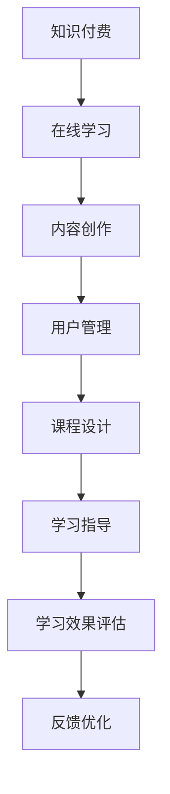

                 

# 《如何利用知识付费实现在线学习与在线学习指导？》

## 关键词：
知识付费、在线学习、在线学习指导、平台构建、盈利模式、用户管理、教学实施、案例解析、发展趋势

## 摘要：
本文将深入探讨如何利用知识付费模式实现在线学习的有效开展与学习指导的高效实施。通过分析知识付费和在线学习的理论基础，讨论当前市场的现状与需求，探讨在线学习模式，构建与运营知识付费平台，详细阐述在线学习指导的方法与实践，并进行案例分析，最后展望知识付费与在线学习的发展趋势。本文旨在为教育科技领域从业者提供一套系统、实用的指南。

---

## 《如何利用知识付费实现在线学习与在线学习指导？》目录大纲

### 第一部分：知识付费与在线学习的理论基础

### 第二部分：知识付费平台的构建与运营

### 第三部分：在线学习指导方法与实践

### 第四部分：知识付费与在线学习的发展趋势

### 附录

### Mermaid 流程图

---

### 第一部分：知识付费与在线学习的理论基础

#### 第1章：知识付费概述

##### 1.1 知识付费的定义与价值

知识付费是一种以知识作为主要交易对象的商业模式，它通过提供专业的、有价值的知识内容来吸引用户，实现知识的传播和价值的转化。知识付费的价值在于它能够为知识提供者带来经济收益，同时也为知识需求者提供了学习资源和指导。

在知识付费的背景下，在线学习成为了知识传播的一种重要形式。在线学习具有以下优势：

1. **灵活性**：学习者可以根据自己的时间安排进行学习，不受地点限制。
2. **个性化**：在线学习平台可以根据学习者的学习进度和兴趣提供个性化的学习资源。
3. **互动性**：在线学习平台提供了学习者之间的交流互动功能，有助于知识的深入理解和应用。

##### 1.2 在线学习的现状与需求

随着互联网技术的快速发展，在线学习已经成为教育行业的重要组成部分。根据统计，全球在线学习市场在过去几年中呈现出快速增长的趋势。以下是一些在线学习现状和需求的关键点：

1. **市场规模**：全球在线学习市场规模逐年扩大，预计未来几年仍将保持高速增长。
2. **用户增长**：越来越多的学习者选择在线学习，包括企业员工、学生和专业人士等。
3. **需求多样化**：用户对在线学习内容的需求越来越多样化，包括技能培训、学历教育、兴趣爱好等。

##### 1.3 知识付费与在线学习的关系

知识付费与在线学习密切相关，二者相辅相成。知识付费为在线学习提供了经济支持，使得在线学习平台能够持续提供高质量的内容和服务。同时，在线学习则为知识付费提供了广阔的市场和用户基础。

知识付费与在线学习的关系可以总结为以下几点：

1. **促进内容创作**：知识付费激励了专业内容创作者投入更多的时间和精力创作高质量的学习内容。
2. **提升学习体验**：知识付费使得学习者能够获得更专业的学习指导和服务，提升学习效果。
3. **扩大知识传播**：知识付费和在线学习的结合，有助于将知识传播到更广泛的受众，提高知识的普及率。

#### 第2章：知识付费市场分析

##### 2.1 知识付费市场的现状

知识付费市场在全球范围内呈现出快速增长的趋势，尤其是在互联网普及率和教育需求较高的地区。以下是一些知识付费市场的现状：

1. **平台多样**：市场上涌现出众多知识付费平台，包括专业教育机构、自媒体平台、社交媒体平台等。
2. **内容丰富**：知识付费平台提供了丰富的学习内容，涵盖各个领域，如编程、语言学习、金融投资、健康养生等。
3. **支付方式**：知识付费市场的支付方式多样化，包括月度订阅、一次性购买、课程包等。

##### 2.2 知识付费市场的用户分析

知识付费市场的用户群体呈现出多样化的特点：

1. **年龄分布**：用户年龄主要集中在25-45岁之间，这一年龄段的用户具有较高的学习需求和消费能力。
2. **职业背景**：知识付费用户主要集中在企业员工、自由职业者、学生等群体。
3. **消费习惯**：知识付费用户愿意为有价值的学习内容支付费用，并且具有复购行为。

##### 2.3 知识付费市场的竞争格局

知识付费市场正处于快速发展阶段，市场竞争激烈。以下是知识付费市场的竞争格局：

1. **平台竞争**：市场上存在多家大型知识付费平台，如得到、喜马拉雅、网易云课堂等，这些平台在用户规模、内容质量、用户体验等方面展开激烈竞争。
2. **内容竞争**：知识付费平台在争夺优质内容创作者和用户资源，优质内容成为平台竞争力的关键因素。
3. **差异化竞争**：一些平台通过细分市场和专业化内容来满足不同用户群体的需求，实现差异化竞争。

#### 第3章：在线学习模式探讨

##### 3.1 自主学习模式

自主学习模式是一种以学习者为中心的学习模式，学习者可以根据自己的兴趣和需求选择学习内容和进度。以下是一些自主学习模式的特点：

1. **灵活性**：学习者可以根据自己的时间安排进行学习，不受地点和时间的限制。
2. **个性化**：在线学习平台可以根据学习者的学习进度和兴趣提供个性化的学习资源。
3. **互动性**：一些在线学习平台提供了学习者之间的交流互动功能，有助于知识的深入理解和应用。

##### 3.2 社群学习模式

社群学习模式是一种以学习社群为中心的学习模式，学习者通过加入学习社群与他人交流和分享学习经验。以下是一些社群学习模式的特点：

1. **协作性**：学习者可以在社群中共同讨论、分享知识和经验，提高学习效果。
2. **互动性**：社群学习模式提供了学习者之间的互动交流平台，有助于建立学习共同体。
3. **互助性**：学习者可以通过互助学习解决学习中的问题，提高学习动力。

##### 3.3 混合学习模式

混合学习模式是将线上学习和线下学习相结合的一种学习模式，它充分发挥了线上学习灵活性和线下学习互动性的优势。以下是一些混合学习模式的特点：

1. **灵活性**：学习者可以根据自己的需求和时间安排进行线上学习，同时可以参加线下活动进行交流和讨论。
2. **互动性**：混合学习模式提供了线上和线下互动的机会，有助于加深对知识的理解和应用。
3. **个性化**：在线学习平台可以根据学习者的学习进度和兴趣提供个性化的学习资源。

##### 3.4 知识付费在在线学习中的应用场景

知识付费在在线学习中的应用场景广泛，以下是一些典型的应用场景：

1. **技能培训**：企业员工可以通过知识付费平台学习专业技能，提高工作效率。
2. **学历教育**：学生可以通过知识付费平台进行在线学习，获取学历证书。
3. **兴趣爱好**：爱好者可以通过知识付费平台学习兴趣爱好，丰富生活。
4. **职业规划**：专业人士可以通过知识付费平台进行职业规划学习，提升职业竞争力。

---

### 第二部分：知识付费平台的构建与运营

#### 第4章：知识付费平台建设

##### 4.1 平台架构设计

知识付费平台的架构设计是平台建设的基础，以下是一些关键的架构设计要点：

1. **用户体系**：平台需要建立完整的用户体系，包括用户注册、登录、认证、个人信息管理等功能。
2. **内容体系**：平台需要建立完善的内容体系，包括课程分类、课程发布、内容审核、版权保护等功能。
3. **支付体系**：平台需要实现便捷的支付体系，支持多种支付方式，确保交易安全和顺畅。
4. **营销体系**：平台需要建立营销体系，包括用户推广、活动策划、优惠促销等功能。

##### 4.2 功能模块划分

知识付费平台的功能模块划分直接影响平台的用户体验和运营效率，以下是一些常见的功能模块：

1. **课程模块**：包括课程发布、课程分类、课程搜索、课程学习等功能。
2. **用户模块**：包括用户注册、登录、个人信息管理、学习记录、评价反馈等功能。
3. **支付模块**：包括支付方式选择、支付流程管理、支付记录查询等功能。
4. **营销模块**：包括活动策划、优惠促销、用户推广、数据统计等功能。

##### 4.3 技术选型与开发环境搭建

技术选型与开发环境搭建是平台建设的关键，以下是一些技术选型和开发环境搭建的建议：

1. **前端技术**：推荐使用Vue.js、React等现代前端框架，提高开发效率和用户体验。
2. **后端技术**：推荐使用Spring Boot、Django等主流后端框架，确保系统稳定性和扩展性。
3. **数据库技术**：推荐使用MySQL、PostgreSQL等关系型数据库，或者使用MongoDB、Redis等NoSQL数据库，根据业务需求进行选择。
4. **开发环境**：推荐使用Docker容器化技术进行开发环境搭建，提高开发效率和部署灵活性。

##### 4.4 数据库设计与数据存储方案

数据库设计与数据存储方案是平台建设的重要环节，以下是一些数据库设计和数据存储方案的建议：

1. **用户数据**：包括用户基本信息、学习记录、支付记录等，建议使用关系型数据库进行存储和管理。
2. **课程数据**：包括课程信息、课程内容、课程评价等，建议使用关系型数据库或者文档数据库进行存储。
3. **支付数据**：包括支付记录、交易记录等，建议使用关系型数据库进行存储和管理。
4. **数据存储**：建议使用云存储服务，如阿里云OSS、腾讯云COS等，确保数据的安全性和可扩展性。

#### 第5章：内容制作与发布

##### 5.1 内容规划与定位

内容规划与定位是知识付费平台的核心环节，以下是一些内容规划与定位的建议：

1. **内容类型**：根据平台定位和用户需求，确定内容类型，如课程、电子书、直播等。
2. **内容主题**：根据内容类型，确定内容主题，如专业技能、学历教育、兴趣爱好等。
3. **内容质量**：确保内容质量，包括内容准确性、实用性、权威性等，提高用户满意度。

##### 5.2 内容创作流程

内容创作流程是确保知识付费平台内容质量的重要环节，以下是一些内容创作流程的建议：

1. **需求调研**：通过用户调研、市场分析等手段，确定内容需求，明确创作方向。
2. **内容编写**：根据需求调研结果，编写内容大纲，制定内容创作计划。
3. **内容审核**：对内容进行多轮审核，确保内容准确性、实用性和权威性。
4. **内容发布**：根据内容发布计划，将审核通过的内容发布到平台。

##### 5.3 内容发布与推广策略

内容发布与推广策略是知识付费平台吸引用户关注和参与的重要手段，以下是一些内容发布与推广策略的建议：

1. **精准定位**：根据用户需求和兴趣，精准定位内容，提高内容曝光率。
2. **渠道推广**：通过社交媒体、搜索引擎、合作伙伴等渠道进行内容推广，提高用户访问量。
3. **互动营销**：通过用户互动、评论、分享等方式，提高用户参与度，促进内容传播。
4. **优惠促销**：通过优惠活动、限时促销等方式，吸引用户购买和参与。

#### 第6章：用户管理与服务

##### 6.1 用户注册与身份认证

用户注册与身份认证是知识付费平台的基础服务，以下是一些用户注册与身份认证的建议：

1. **注册流程**：设计简洁明了的注册流程，提供多种注册方式，如手机号注册、邮箱注册等。
2. **身份认证**：对用户进行身份认证，确保用户信息的真实性和安全性，如实名认证、人脸识别等。
3. **用户隐私**：保护用户隐私，遵循相关法律法规，确保用户信息安全。

##### 6.2 用户行为分析

用户行为分析是了解用户需求和行为的重要手段，以下是一些用户行为分析的建议：

1. **行为数据**：收集用户在平台上的行为数据，如学习记录、购买记录、互动记录等。
2. **数据分析**：对行为数据进行深入分析，挖掘用户需求和行为模式，为产品优化和营销策略提供依据。
3. **个性化推荐**：根据用户行为数据，提供个性化的学习推荐和内容推荐，提高用户满意度。

##### 6.3 用户服务与支持

用户服务与支持是知识付费平台提升用户满意度和口碑的重要环节，以下是一些用户服务与支持的建议：

1. **在线客服**：提供在线客服服务，及时解答用户问题和需求，提高用户满意度。
2. **用户论坛**：建立用户论坛，提供用户交流和分享的平台，促进用户互动和社区建设。
3. **学习指导**：提供学习指导服务，如学习计划制定、学习进度跟踪、学习问题解答等，帮助用户更好地完成学习任务。

#### 第7章：盈利模式与运营策略

##### 7.1 盈利模式设计

盈利模式设计是知识付费平台实现盈利的关键环节，以下是一些盈利模式设计的建议：

1. **课程销售**：通过销售课程实现盈利，可以采取一次性购买、订阅等方式。
2. **增值服务**：提供增值服务，如课程辅导、学习工具、职业规划等，增加用户粘性和收入来源。
3. **广告投放**：通过广告投放实现盈利，可以选择平台内广告和合作伙伴广告等。
4. **会员服务**：提供会员服务，如会员专属课程、会员优惠等，提高用户付费意愿。

##### 7.2 营销策略与活动策划

营销策略与活动策划是知识付费平台吸引用户和提升销量的重要手段，以下是一些营销策略与活动策划的建议：

1. **内容营销**：通过优质的内容营销，提高平台知名度和用户关注度。
2. **渠道推广**：通过社交媒体、搜索引擎、合作伙伴等渠道进行推广，扩大用户基础。
3. **优惠促销**：通过限时促销、优惠券、团购等方式，刺激用户购买和参与。
4. **活动策划**：策划有趣有创意的活动，如线上讲座、线下活动等，提高用户参与度和平台活跃度。

##### 7.3 用户增长与留存策略

用户增长与留存策略是知识付费平台持续发展的关键，以下是一些用户增长与留存策略的建议：

1. **用户引流**：通过内容营销、渠道推广等方式，吸引更多新用户。
2. **用户留存**：通过优质的内容、良好的服务体验、个性化的学习推荐等，提高用户留存率。
3. **用户互动**：通过用户论坛、社群互动等方式，增强用户参与感和归属感。
4. **用户激励**：通过积分、奖励等方式，激励用户积极参与和传播。

---

### 第三部分：在线学习指导方法与实践

#### 第8章：在线学习指导理论

##### 8.1 在线学习指导的概念与原则

在线学习指导是一种通过互联网平台提供的个性化学习支持和服务，旨在帮助学习者更有效地达成学习目标。以下是在线学习指导的基本概念与原则：

1. **概念**：在线学习指导包括教师对学习者的个性化指导、学习进度跟踪、学习问题解答、学习资源推荐等。
2. **原则**：
   - **个性化**：根据学习者的学习需求、兴趣和能力，提供个性化的学习资源和指导。
   - **及时性**：及时响应学习者的提问和需求，提供实时指导。
   - **互动性**：鼓励学习者与教师、同学之间的互动，提高学习效果。
   - **反馈性**：通过及时反馈，帮助学习者了解学习进度和效果，调整学习策略。

##### 8.2 在线学习指导的方法论

在线学习指导的方法论包括以下关键步骤：

1. **需求分析**：通过问卷调查、访谈等方式，了解学习者的学习需求、兴趣、背景和目标。
2. **目标设定**：根据需求分析结果，设定明确的学习目标和任务。
3. **资源准备**：准备适合的学习资源，包括课程内容、教学视频、阅读材料、练习题等。
4. **教学实施**：根据设定的目标和资源，进行教学实施，包括直播授课、视频教学、在线讨论等。
5. **效果评估**：通过考试、作业、问卷调查等方式，评估学习效果，并根据反馈调整教学策略。

##### 8.3 在线学习指导的技术工具

在线学习指导需要利用一系列技术工具来支持教学活动和管理。以下是一些常用的技术工具：

1. **教学平台**：如Moodle、Canvas、Blackboard等，提供课程管理、教学活动组织、学习进度跟踪等功能。
2. **视频会议工具**：如Zoom、Microsoft Teams、Google Meet等，用于直播授课、互动讨论。
3. **学习管理系统**：如Sakai、Bb Learn、Moodle等，用于课程管理、学生成绩记录、学习资源发布等。
4. **在线问答系统**：如Quizlet、Socrative等，用于在线测试和问答。
5. **协作工具**：如Google Docs、Microsoft Teams等，用于学生间的协作和文档共享。

#### 第9章：在线学习指导实践

##### 9.1 教师角色与任务

在线学习指导中的教师角色与传统的教师角色有所不同，以下是一些具体的教师角色和任务：

1. **内容提供者**：提供高质量的学习内容，包括课程视频、课件、阅读材料等。
2. **学习引导者**：引导学习者制定学习计划，提供学习指导，解答学习问题。
3. **评价者**：对学习者的学习成果进行评价，提供反馈和建议。
4. **社区管理者**：管理在线学习社区，促进学习者之间的交流和协作。

##### 9.2 学生管理与服务

在线学习指导中的学生管理与服务包括以下几个方面：

1. **学习计划管理**：帮助学生制定个性化的学习计划，跟踪学习进度。
2. **学习支持服务**：提供在线问答、学习辅导、作业批改等服务。
3. **学习反馈**：收集学生的学习反馈，了解学习效果，调整教学策略。
4. **学习资源推荐**：根据学生的学习需求和进度，推荐合适的学习资源。

##### 9.3 课程设计与教学实施

课程设计与教学实施是在线学习指导的核心环节，以下是一些关键步骤和要点：

1. **课程设计**：
   - 确定课程目标：明确课程的学习目标和教学内容。
   - 设计课程结构：划分课程模块，设计教学内容和活动。
   - 选择教学资源：根据课程内容和目标，选择合适的教材、视频、练习等资源。

2. **教学实施**：
   - 直播授课：通过直播平台进行授课，确保教学内容的实时传递。
   - 在线讨论：组织在线讨论，鼓励学生参与，促进知识共享。
   - 作业与测试：布置作业和测试，检查学习效果，提供反馈。
   - 学习活动：设计多样化的学习活动，如小组讨论、案例分析、项目实践等。

##### 9.4 学习效果评估与反馈

学习效果评估与反馈是确保在线学习指导质量的重要环节，以下是一些评估与反馈的方法：

1. **量化评估**：通过考试、测试等量化手段，评估学习者的知识掌握程度和能力水平。
2. **质性评估**：通过观察、访谈、问卷调查等质性手段，了解学习者的学习体验和满意度。
3. **反馈机制**：建立反馈机制，及时向学习者提供学习成果和改进建议，鼓励持续学习。
4. **持续改进**：根据评估结果，调整课程内容、教学方法和学习资源，持续改进教学效果。

#### 第10章：案例分析

##### 10.1 成功案例分析

成功案例是知识付费与在线学习指导的典范，以下是一些成功案例分析：

1. **案例1：网易云课堂**：网易云课堂通过丰富的课程资源和优质的教学内容，吸引了大量用户。其成功的关键在于精准的内容定位、优秀的教师团队和良好的用户体验。

2. **案例2：知乎Live**：知乎Live通过知乎平台的影响力，吸引了大量专业人士进行知识分享。其成功之处在于强大的社区氛围、高质量的问答和专业的讲师阵容。

3. **案例3：得到App**：得到App以其高质量的内容和专业的讲师团队赢得了用户的信任。其成功经验包括优质的内容策划、个性化的学习推荐和良好的用户服务。

##### 10.2 失败案例分析

失败案例同样能为我们提供宝贵的教训，以下是一些失败案例分析：

1. **案例1：某在线教育平台**：该平台由于课程内容质量不高、用户体验差，导致用户流失严重。其失败原因在于对市场需求的把握不准确、内容创作团队不够专业。

2. **案例2：某知识付费平台**：该平台由于内容同质化严重、用户互动不足，导致用户活跃度下降。其失败经验在于内容策划和推广策略不够创新，缺乏用户粘性。

3. **案例3：某在线学习社区**：该社区由于管理不善、用户参与度低，最终关闭。其失败教训在于社区氛围营造不足、用户互动渠道不畅。

##### 10.3 启示与借鉴

通过对成功案例和失败案例的分析，我们可以得出以下启示和借鉴：

1. **内容质量**：优质的内容是知识付费平台的核心竞争力，平台需要注重课程内容的策划和质量。
2. **用户体验**：良好的用户体验能够提高用户满意度和忠诚度，平台需要不断优化用户体验。
3. **用户互动**：有效的用户互动能够促进知识传播和用户成长，平台需要设计多样化的互动机制。
4. **市场定位**：准确的市场定位能够帮助平台找到目标用户，实现精准营销。

---

### 第四部分：知识付费与在线学习的发展趋势

#### 第11章：行业趋势分析

##### 11.1 知识付费市场的未来趋势

知识付费市场的未来趋势表现在以下几个方面：

1. **市场规模扩大**：随着互联网技术的不断发展和教育需求的增长，知识付费市场将继续扩大，预计未来几年仍将保持高速增长。
2. **内容多元化**：知识付费内容将更加多元化，涵盖更多领域和主题，满足不同用户群体的需求。
3. **个性化服务**：知识付费平台将更加注重个性化服务，通过大数据分析和人工智能技术，提供个性化的学习推荐和指导。
4. **国际化发展**：知识付费市场将向国际化方向发展，吸引更多国际用户和内容创作者，形成全球化的知识付费生态。

##### 11.2 在线学习的发展趋势

在线学习的发展趋势主要体现在以下几个方面：

1. **技术驱动**：在线学习将更加依赖先进的技术，如人工智能、大数据、虚拟现实等，提高学习效果和用户体验。
2. **混合式学习**：混合式学习模式将得到更广泛的应用，结合线上学习和线下学习，实现学习效果的最优化。
3. **教育个性化**：在线学习将更加注重个性化教育，根据学生的学习需求和兴趣，提供定制化的学习方案。
4. **终身学习**：在线学习将促进终身学习理念的普及，使学习成为人们生活的一部分，提高个人综合素质和竞争力。

##### 11.3 知识付费与在线学习的融合发展前景

知识付费与在线学习的融合发展前景广阔，以下是几个关键点：

1. **市场空间**：知识付费与在线学习的融合为市场提供了巨大的空间，预计未来几年将成为教育行业的重要增长点。
2. **技术创新**：融合了知识付费和在线学习的新技术，如人工智能教育、大数据分析等，将推动在线学习的发展。
3. **教育变革**：知识付费与在线学习的融合将带来教育模式的变革，推动教育公平和教育的普及。
4. **产业生态**：知识付费与在线学习的融合发展将形成完整的产业生态，包括内容创作、平台运营、技术服务等环节。

#### 第12章：未来展望

##### 12.1 新技术的应用

未来，新技术将在知识付费和在线学习领域得到更广泛的应用，推动教育模式的创新和发展。以下是一些新技术的应用前景：

1. **人工智能**：人工智能将用于个性化学习推荐、学习行为分析、智能问答等，提高学习效果和用户体验。
2. **大数据**：大数据将用于用户行为分析、市场趋势预测、教育资源优化等，为教育决策提供数据支持。
3. **虚拟现实**：虚拟现实将用于沉浸式学习体验、虚拟实验室等，提高学习的趣味性和互动性。
4. **区块链**：区块链技术将用于学习认证、知识产权保护等，确保教育过程的透明性和可信度。

##### 12.2 行业规范与监管

随着知识付费和在线学习的快速发展，行业规范和监管将成为行业健康发展的重要保障。以下是行业规范与监管的发展趋势：

1. **内容审核**：加强对知识付费平台的内容审核，确保内容的准确性和合法性。
2. **用户权益保护**：加强用户权益保护，建立健全的用户投诉处理机制。
3. **数据安全**：加强数据安全保护，防止用户信息泄露和数据滥用。
4. **行业标准**：制定统一的行业标准和规范，推动知识付费和在线学习的规范化发展。

##### 12.3 知识付费与在线学习的社会影响

知识付费与在线学习的快速发展将对社会产生深远的影响，以下是一些主要影响：

1. **教育公平**：知识付费与在线学习的融合有助于提高教育公平，使更多人有机会接受高质量的教育。
2. **终身学习**：知识付费与在线学习将推动终身学习理念的普及，提高人们的综合素质和竞争力。
3. **知识传播**：知识付费与在线学习有助于知识的快速传播和普及，提高公众的知识水平和素养。
4. **就业竞争**：知识付费与在线学习将促进就业竞争，提高人才的市场适应能力和职业发展空间。

---

### 附录

#### 附录 A：知识付费与在线学习相关资源

##### A.1 知识付费平台推荐

1. 网易云课堂
2. 得到App
3. 知乎Live
4. 学堂在线
5. Coursera

##### A.2 在线学习平台推荐

1. 好未来
2. 新东方在线
3. Udemy
4. edX
5. Khan Academy

##### A.3 相关书籍与文章推荐

1. 《互联网+教育：在线学习的创新与实践》
2. 《知识付费：新媒体时代的知识服务》
3. 《在线学习：技术、方法与实践》
4. 《教育信息化2.0行动计划》
5. 《教育大数据》

##### A.4 技术工具推荐

1. Zoom
2. Microsoft Teams
3. Google Meet
4. Moodle
5. Sakai

---

### Mermaid 流程图

---

### 作者

作者：AI天才研究院/AI Genius Institute & 禅与计算机程序设计艺术 /Zen And The Art of Computer Programming

---

文章标题：《如何利用知识付费实现在线学习与在线学习指导？》

文章关键词：知识付费、在线学习、在线学习指导、平台建设、盈利模式、用户管理、教学实践

文章摘要：本文深入探讨知识付费与在线学习的理论基础、市场分析、平台构建、运营策略、学习指导方法以及发展趋势，旨在为教育科技从业者提供一套系统、实用的指南。通过详细阐述核心概念、算法原理、项目实战以及案例分析，文章旨在促进知识付费与在线学习的健康发展，推动教育模式的创新与变革。

