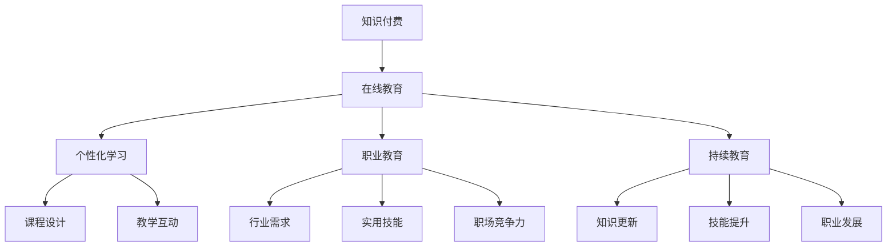
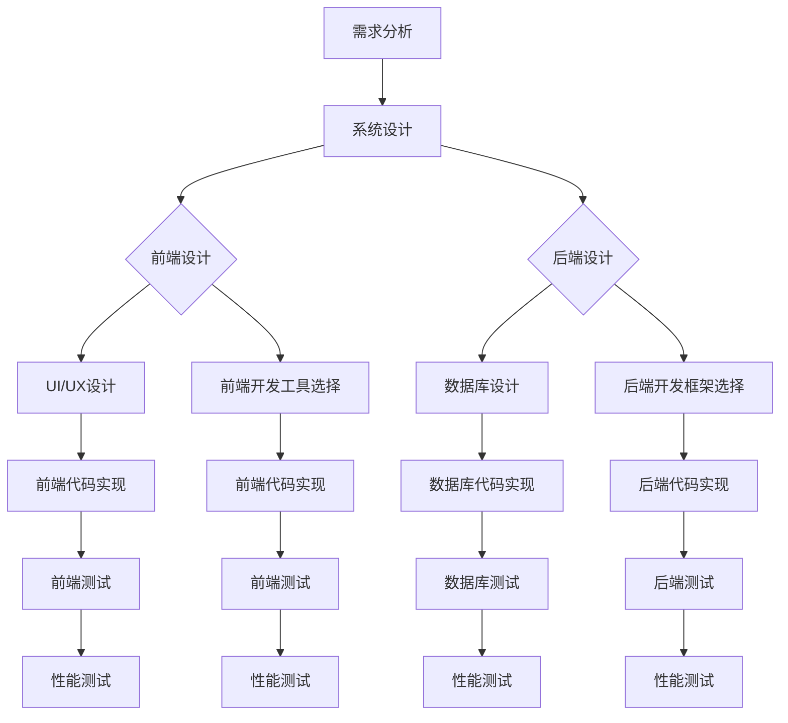
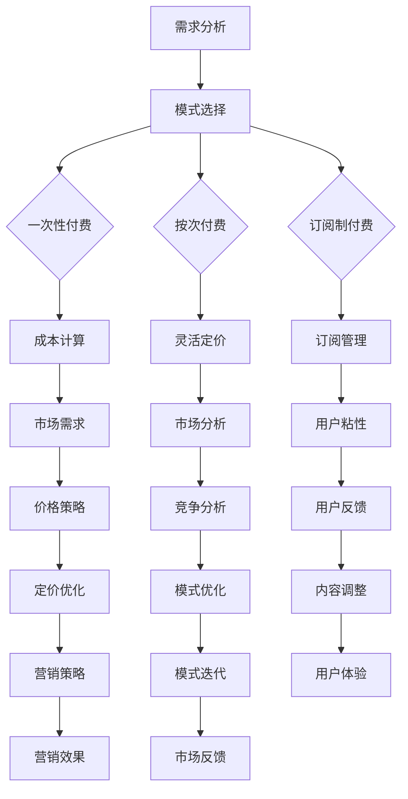
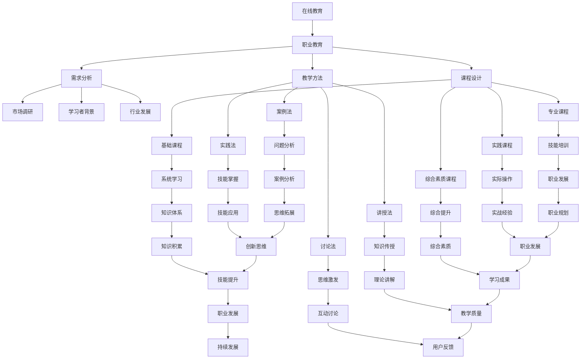
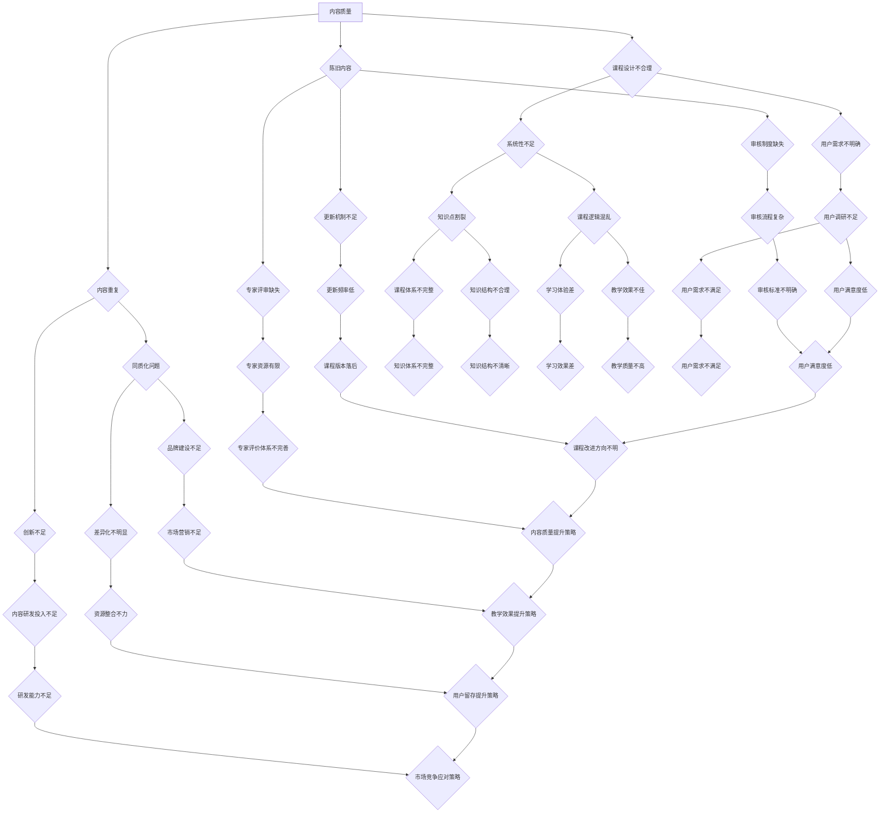
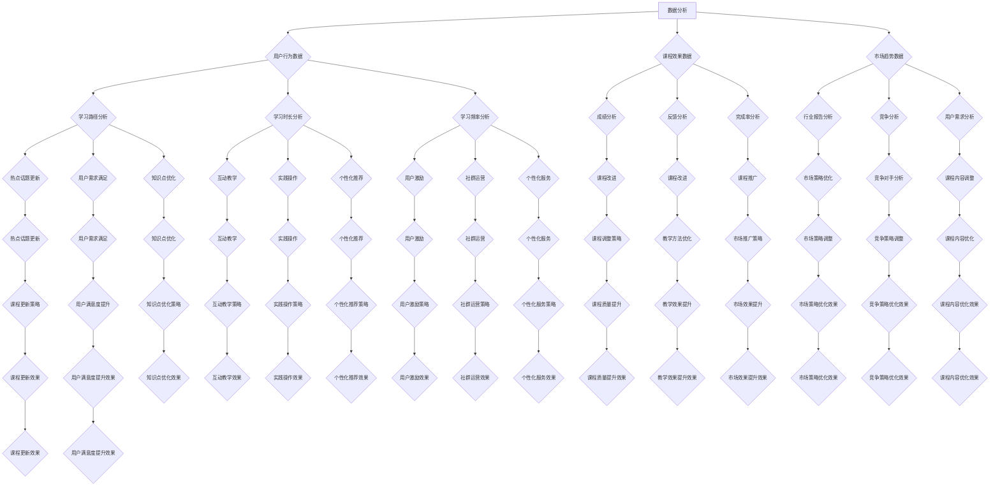
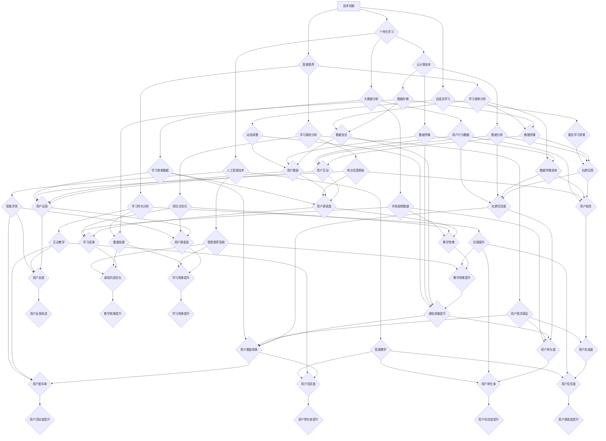

                 

# 如何利用知识付费实现在线技能培训与职业教育？

> **关键词：知识付费、在线教育、职业教育、技能培训、市场分析、技术实现、案例分析**
>
> **摘要：本文从知识付费与在线教育的背景和重要性出发，详细分析了在线教育平台的技术基础、知识付费模式的设计与实施、在线教育与职业教育的结合，以及在线教育中知识付费的挑战与解决方案。通过案例分析，探讨了数据分析在在线教育中的应用，并展望了知识付费与在线教育的未来发展。**

## 第一部分：知识付费与在线教育概述

### 第1章：知识付费与在线教育的背景和重要性

#### 1.1 知识付费的发展历程

##### 1.1.1 知识付费的起源与发展

知识付费作为一种商业模式，起源于互联网经济的兴起。早在20世纪90年代末，随着互联网的普及，人们逐渐开始通过互联网获取知识和信息。这为知识付费模式的诞生提供了土壤。

在21世纪初，随着移动设备的普及和社交媒体的发展，知识付费逐渐从线上线下的模式中分离出来，成为一种独立的服务形态。这一阶段，知识付费主要表现在线上付费课程的购买，如在线课程、电子书等。

近年来，随着人工智能、大数据等技术的不断发展，知识付费市场得到了进一步拓展。个性化学习推荐系统、智能题库、在线考试等技术的应用，使得知识付费更加智能化和个性化。

##### 1.1.2 知识付费与传统教育的区别

传统教育主要依赖于线下教育机构和课程，教育资源和教育方式相对固定。而知识付费则更加灵活，教育资源和教育方式可以根据用户需求进行定制。此外，知识付费强调个性化学习，用户可以根据自己的兴趣和需求选择学习内容，实现自我提升。

##### 1.1.3 在线教育市场的发展趋势

随着互联网技术的不断发展，在线教育市场呈现出快速增长的趋势。根据市场调研数据显示，全球在线教育市场规模在过去几年中呈现出爆发式增长，预计未来几年仍将保持高速增长。

此外，随着5G技术的推广和应用，在线教育的速度和稳定性将得到进一步提升，为知识付费的普及提供更好的技术保障。

#### 1.2 在线教育的核心要素

##### 1.2.1 学习者需求分析

学习者需求是在线教育的核心，了解学习者的需求是课程设计和教学实施的关键。学习者需求主要包括学习目标、学习时间、学习方式等。

- 学习目标：学习者希望通过在线教育实现自我提升，获取新的知识和技能。
- 学习时间：学习者可以根据自己的时间安排选择学习时间，实现灵活学习。
- 学习方式：学习者可以通过在线课程、直播教学、社群互动等多种方式进行学习。

##### 1.2.2 课程设计与内容构建

课程设计是在线教育的核心，课程内容的质量直接影响学习者的学习体验和学习成果。课程设计应充分考虑学习者的需求，设计符合学习者特点的课程体系。

课程内容构建主要包括教材、视频、练习、作业、考试等。教材应结合实际应用，讲解清晰，易于理解。视频应生动有趣，提高学习者的学习兴趣。练习和作业应具有针对性，帮助学习者巩固所学知识。考试应科学合理，评估学习者的学习成果。

##### 1.2.3 教学方法和互动设计

在线教育强调互动性，教学方法和互动设计是提高学习效果的重要因素。教学方法应结合在线教育的特点，采用多种教学方式，如讲授、讨论、实践、考核等。

互动设计包括在线答疑、社群互动、直播教学等。在线答疑可以及时解决学习者的疑问，提高学习效果。社群互动可以促进学习者之间的交流和合作，增强学习氛围。直播教学可以实时互动，提高学习体验。

#### 1.3 知识付费与在线教育的融合

##### 1.3.1 知识付费模式在在线教育中的应用

知识付费模式在在线教育中的应用，使得学习者可以按照自己的需求选择学习内容，实现个性化学习。知识付费模式包括一次性付费、按次付费、订阅制等。

- 一次性付费：学习者购买一次课程，可以无限次学习。
- 按次付费：学习者按课程章节或课时进行付费。
- 订阅制：学习者按月或按年订阅课程，享受会员权益。

##### 1.3.2 职业教育与知识付费的结合

职业教育与知识付费的结合，可以帮助学习者快速掌握实用技能，提升职场竞争力。职业教育课程可以结合行业需求，设计符合市场需求的课程体系。

- 行业需求分析：通过对行业需求的调研，确定课程内容。
- 实用技能培训：通过实际案例和实践操作，帮助学习者掌握实用技能。
- 职场竞争力提升：通过职业素养和职业技能的提升，增强学习者的职场竞争力。

##### 1.3.3 持续教育与知识付费的关系

持续教育与知识付费密切相关。持续教育是指学习者通过不断学习，提升自己的知识水平和技能。知识付费为持续教育提供了有力支持。

- 知识更新：知识付费可以帮助学习者获取最新的知识和技能。
- 技能提升：知识付费课程可以提供实践操作和案例分析，帮助学习者提升技能。
- 职业发展：持续教育可以帮助学习者实现职业发展，提升职场竞争力。

## 第一部分总结

知识付费与在线教育的融合，为学习者提供了更加灵活、个性化的学习方式，也为职业教育提供了新的发展机遇。通过分析知识付费与在线教育的背景、核心要素和融合方式，我们可以更好地理解在线教育的发展趋势，为未来的在线教育发展提供指导。

### Mermaid 流程图：知识付费与在线教育的融合过程

## 第二部分：在线教育平台技术基础

### 第2章：在线教育平台技术基础

#### 2.1 在线教育平台的架构

在线教育平台是一个复杂的应用系统，它需要满足教学、学习、管理等多种功能。一个典型的在线教育平台通常包括以下几个核心模块：

- **用户管理模块**：用于管理用户信息，包括注册、登录、个人信息维护、权限控制等。
- **课程管理模块**：用于管理课程信息，包括课程创建、发布、更新、分类、搜索等。
- **学习管理模块**：用于跟踪学习者的学习进度，包括学习计划、学习记录、成绩记录等。
- **内容管理模块**：用于管理教学资源，包括文本、图片、视频、音频等多种形式的内容。
- **互动管理模块**：用于支持学习者之间的互动，包括讨论区、直播教学、在线答疑等。

#### 2.1.1 教学管理系统（LMS）

教学管理系统（Learning Management System，简称LMS）是在线教育平台的核心模块，它负责管理和协调教学活动。LMS的主要功能包括：

- **课程管理**：支持课程的创建、发布、更新和删除。
- **学习跟踪**：跟踪学习者的学习进度，记录学习行为和成绩。
- **内容分发**：管理和分发教学资源，包括文档、视频、音频等。
- **互动支持**：提供讨论区、在线答疑、直播教学等功能，促进师生互动。
- **考核评估**：支持在线考试、作业提交和成绩评估。

#### 2.1.2 学习管理系统（LMS）的核心功能

学习管理系统（LMS）的核心功能可以分为以下几个方面：

- **用户管理**：包括用户注册、登录、信息维护、权限管理等。
- **课程管理**：支持课程创建、发布、更新、分类、搜索等。
- **学习跟踪**：记录学习者的学习行为，生成学习报告。
- **内容管理**：管理和分发教学资源，支持多种文件格式。
- **互动支持**：提供讨论区、在线答疑、直播教学等互动功能。
- **考核评估**：支持在线考试、作业提交和成绩记录。

#### 2.1.3 用户数据管理与隐私保护

用户数据管理与隐私保护是在线教育平台必须重视的问题。用户数据包括个人信息、学习记录、支付信息等敏感数据。平台需要采取以下措施确保用户数据的安全和隐私：

- **数据加密**：对用户数据进行加密存储，防止数据泄露。
- **访问控制**：设置严格的访问权限，确保只有授权人员可以访问用户数据。
- **数据备份**：定期备份数据，防止数据丢失。
- **隐私政策**：明确告知用户其数据的使用方式和保护措施，确保用户知情同意。
- **安全审计**：定期进行安全审计，及时发现和解决潜在的安全问题。

#### 2.2 技术支持与开发环境

在线教育平台的开发需要多种技术支持，包括前端开发、后端开发、数据库管理、服务器配置等。以下是开发环境的一些关键技术：

- **前端开发**：使用HTML、CSS、JavaScript等前端技术，构建用户界面和交互体验。
- **后端开发**：使用Python、Java、Node.js等后端技术，实现业务逻辑和数据管理。
- **数据库管理**：使用MySQL、MongoDB等数据库技术，存储和管理用户数据、课程内容等。
- **服务器配置**：使用Linux操作系统和Nginx、Apache等Web服务器，提供稳定的服务器环境。
- **开发框架**：使用Django、Spring Boot、React等开发框架，提高开发效率和稳定性。

#### 2.2.1 开发框架与工具

开发框架和工具的选择对在线教育平台的开发效率和质量有着重要影响。以下是几种常用的开发框架和工具：

- **前端开发框架**：React、Vue.js、Angular等，用于构建用户界面和交互。
- **后端开发框架**：Django、Spring Boot、Express.js等，用于实现业务逻辑和数据管理。
- **数据库管理工具**：MySQL Workbench、MongoDB Compass等，用于数据库设计和维护。
- **持续集成工具**：Jenkins、Travis CI等，用于自动化构建和部署。
- **代码管理工具**：Git、GitLab等，用于代码管理和版本控制。

#### 2.2.2 前端开发技术

前端开发是构建在线教育平台用户界面的关键，以下是一些前端开发技术：

- **HTML**：用于构建网页结构。
- **CSS**：用于美化网页，包括布局、颜色、字体等。
- **JavaScript**：用于实现网页交互和动态效果。
- **前端框架**：React、Vue.js、Angular等，用于构建复杂的前端应用。
- **UI库**：Bootstrap、Ant Design等，提供丰富的UI组件和样式。

#### 2.2.3 后端开发技术

后端开发是处理业务逻辑和数据管理的关键，以下是一些后端开发技术：

- **编程语言**：Python、Java、Node.js等，用于实现业务逻辑。
- **框架**：Django、Spring Boot、Express.js等，用于简化开发流程。
- **数据库**：MySQL、MongoDB、PostgreSQL等，用于存储和管理数据。
- **缓存技术**：Redis、Memcached等，用于提高数据访问速度。
- **消息队列**：RabbitMQ、Kafka等，用于处理高并发消息。

#### 2.3 技术实现与性能优化

在线教育平台的技术实现需要考虑到系统的可扩展性、稳定性和性能。以下是一些技术实现和性能优化的方法：

- **分布式系统架构**：通过分布式架构提高系统的可扩展性和稳定性。
- **负载均衡**：使用负载均衡器（如Nginx）分配网络请求，提高系统性能。
- **缓存机制**：使用缓存技术（如Redis、Memcached）减少数据库访问次数，提高响应速度。
- **数据库优化**：使用数据库索引、分库分表等优化数据库性能。
- **前端优化**：使用懒加载、代码压缩等优化前端性能。
- **监控与运维**：使用监控工具（如Prometheus、Grafana）监控系统性能，及时处理故障。

### 2.3.1 数据存储与管理

数据存储与管理是在线教育平台的重要任务，以下是一些数据存储与管理的方法：

- **关系型数据库**：如MySQL、PostgreSQL，适用于结构化数据存储。
- **非关系型数据库**：如MongoDB、Redis，适用于非结构化数据存储。
- **数据仓库**：如Hive、Hadoop，适用于大数据存储和处理。
- **分布式数据库**：如Cassandra、HBase，适用于分布式存储和高并发访问。
- **数据备份与恢复**：定期备份数据，确保数据安全。

### 2.3.2 网络与数据传输优化

网络与数据传输优化是提高在线教育平台性能的关键，以下是一些优化方法：

- **CDN**：使用内容分发网络（CDN）加速静态资源的加载。
- **HTTP/2**：使用HTTP/2协议提高数据传输速度。
- **GZIP**：使用GZIP压缩技术减小数据传输体积。
- **网络监控**：使用网络监控工具监控网络状态，及时发现和解决问题。
- **负载均衡**：使用负载均衡器（如Nginx）分配网络请求，提高系统性能。

### 2.3.3 安全性与稳定性保障

安全性与稳定性是在线教育平台的基本要求，以下是一些安全性和稳定性保障的方法：

- **安全防护**：使用防火墙、入侵检测系统等安全防护工具，防止网络攻击。
- **数据加密**：使用SSL/TLS协议加密数据传输，保护数据安全。
- **权限控制**：设置严格的权限控制，确保只有授权用户可以访问敏感数据。
- **备份与恢复**：定期备份数据，确保在发生故障时可以快速恢复。
- **系统监控**：使用监控工具（如Prometheus、Grafana）监控系统性能，及时发现和解决问题。

### 2.3.4 性能优化与测试

性能优化与测试是确保在线教育平台稳定运行的重要环节，以下是一些性能优化与测试的方法：

- **负载测试**：模拟高并发访问，测试系统的性能和稳定性。
- **压力测试**：测试系统在极端条件下的表现，确保系统可以承受高负载。
- **性能调优**：通过分析性能数据，找出系统瓶颈并进行优化。
- **自动化测试**：使用自动化测试工具（如JMeter、Selenium）进行测试，提高测试效率。
- **性能监控**：使用性能监控工具（如New Relic、AppDynamics）监控系统性能，及时发现和解决问题。

### 第二部分总结

在线教育平台技术基础是构建在线教育系统的重要组成部分。通过分析在线教育平台的架构、核心功能、用户数据管理、技术支持与开发环境、技术实现与性能优化等方面的内容，我们可以更好地理解在线教育平台的技术实现过程，为构建高效、稳定的在线教育平台提供参考。

### Mermaid 流程图：在线教育平台技术实现流程

## 第三部分：知识付费模式的设计与实施

### 第3章：知识付费模式的设计与实施

#### 3.1 知识付费模式的类型

知识付费模式多种多样，不同的模式适用于不同的学习场景和用户需求。以下是几种常见的知识付费模式：

##### 3.1.1 一次性付费模式

一次性付费模式是指用户一次性支付一定费用，即可获得课程的所有权限，永久学习。这种模式适用于学习内容较为完整、用户愿意一次性投入的课程。

- **优点**：操作简单，用户决策成本低，适合市场推广。
- **缺点**：无法多次收费，课程更新后用户无法免费访问。

##### 3.1.2 按次付费模式

按次付费模式是指用户根据实际学习内容，按章节或课时支付费用。这种模式适用于学习内容较为碎片化、用户选择性学习的场景。

- **优点**：灵活性好，用户可以根据自己的需求选择学习内容。
- **缺点**：交易次数多，操作复杂，不利于市场推广。

##### 3.1.3 订阅制付费模式

订阅制付费模式是指用户按月或按年支付一定费用，即可享受课程的所有权限。这种模式适用于持续学习、需要不断更新内容的课程。

- **优点**：用户粘性强，有利于培养长期用户。
- **缺点**：运营成本较高，需提供持续的高质量内容。

#### 3.2 收费标准的制定

制定合理的收费标准是知识付费模式成功的关键。以下是一些制定收费标准的策略：

##### 3.2.1 成本导向定价策略

成本导向定价策略是根据课程制作成本、运营成本和预期利润来制定收费价格。这种策略的优点是计算简单，缺点是过于注重成本，可能无法满足用户需求。

- **计算公式**：收费标准 = （课程制作成本 + 运营成本）/ 预期销售量。

##### 3.2.2 需求导向定价策略

需求导向定价策略是根据用户需求和市场竞争情况来制定收费价格。这种策略的优点是更能满足用户需求，缺点是定价复杂，需要深入了解市场和用户。

- **计算公式**：收费标准 = （用户支付意愿最高价 - 竞争对手价格）/ 2。

##### 3.2.3 竞争导向定价策略

竞争导向定价策略是根据竞争对手的收费价格来制定自己的收费价格。这种策略的优点是易于执行，缺点是可能导致恶性竞争。

- **计算公式**：收费标准 = 竞争对手价格 ± （一定比例的溢价或折价）。

#### 3.3 促销与营销策略

促销与营销策略是提高知识付费课程销量的重要手段。以下是一些常见的促销与营销策略：

##### 3.3.1 传统营销手段的应用

传统营销手段包括广告、宣传单页、海报等，适用于线下场景。在线上场景，可以将其转化为网络广告、社交媒体宣传、电子邮件营销等。

- **优点**：效果直观，易于传播。
- **缺点**：成本较高，用户转化率较低。

##### 3.3.2 数字营销策略

数字营销策略包括搜索引擎优化（SEO）、搜索引擎营销（SEM）、社交媒体营销（SMM）等，适用于线上场景。

- **搜索引擎优化（SEO）**：通过优化网站内容和结构，提高在搜索引擎中的排名。
- **搜索引擎营销（SEM）**：通过购买关键词广告，提高在搜索引擎中的曝光率。
- **社交媒体营销（SMM）**：通过社交媒体平台推广课程，增加课程知名度和用户参与度。

- **优点**：成本相对较低，用户转化率较高。
- **缺点**：需要持续投入，效果较慢。

##### 3.3.3 社交媒体营销技巧

社交媒体营销是数字营销的重要组成部分，以下是一些社交媒体营销技巧：

- **内容营销**：制作有价值、有趣的内容，吸引用户关注和分享。
- **互动营销**：通过提问、投票、抽奖等方式与用户互动，提高用户参与度。
- **KOL营销**：与行业意见领袖合作，借助他们的影响力推广课程。
- **用户评价**：鼓励用户发表评价，提高课程口碑。

#### 3.4 用户行为分析与数据利用

用户行为分析是优化知识付费模式的重要手段。通过分析用户行为数据，可以了解用户需求、学习习惯和购买偏好，从而优化课程内容、营销策略和服务体验。

- **用户行为分析**：包括学习时长、学习频率、学习内容、购买行为等。
- **数据利用**：根据用户行为数据，调整课程内容、推送个性化推荐、优化营销策略等。

#### 3.5 持续优化与迭代

知识付费模式需要持续优化与迭代，以适应不断变化的市场和用户需求。以下是一些优化与迭代的方法：

- **市场调研**：定期进行市场调研，了解行业动态和用户需求。
- **用户反馈**：收集用户反馈，了解用户对课程、服务的不满意之处。
- **数据驱动**：根据用户行为数据和反馈，调整课程内容、营销策略和服务体验。
- **竞争对手分析**：分析竞争对手的课程、营销策略和服务，借鉴优秀经验。

### 第三部分总结

知识付费模式的设计与实施是在线教育的重要环节。通过分析知识付费模式的类型、收费标准制定策略、促销与营销策略、用户行为分析与数据利用以及持续优化与迭代的方法，我们可以更好地设计出符合用户需求、具有市场竞争力的知识付费模式。

### Mermaid 流程图：知识付费模式设计与实施流程

## 第四部分：在线教育与职业教育的结合

### 第4章：在线教育与职业教育的结合

#### 4.1 职业教育的需求分析

职业教育是针对职业技能和职业素养的培养，以满足职场需求为目标。在线教育与职业教育的结合，可以更好地满足职业教育的需求。以下是对职业教育需求的分析：

##### 4.1.1 市场调研与分析

市场调研与分析是了解职业教育市场需求的重要手段。通过市场调研，可以获取以下信息：

- **行业趋势**：了解各个行业的发展趋势，为课程设计提供依据。
- **岗位需求**：了解各个岗位的技能要求和职业发展路径，为课程内容提供指导。
- **学习者特点**：了解学习者的年龄、学历、职业背景等，为课程设计提供参考。

##### 4.1.2 学习者背景与需求

职业教育的学习者主要包括以下几类：

- **职场新人**：刚进入职场，需要提升专业技能和职业素养。
- **在职人员**：希望提升职业技能，应对职场挑战，实现职业发展。
- **职业转型者**：希望改变职业方向，需要学习新技能。

学习者的需求主要包括以下几个方面：

- **技能提升**：掌握新技能，提升职场竞争力。
- **职业规划**：明确职业发展方向，制定职业规划。
- **自我提升**：提升个人综合素质，实现自我价值。

##### 4.1.3 职业教育的发展趋势

随着互联网技术的不断发展，职业教育呈现出以下发展趋势：

- **在线化**：在线教育平台的普及，使得职业教育可以突破地域限制，实现远程教学。
- **个性化**：通过大数据和人工智能技术，实现个性化教学，满足不同学习者的需求。
- **多元化**：职业教育课程内容逐渐丰富，涵盖各个行业和岗位。
- **职业认证**：与职业认证机构合作，提供职业资格证书，提升学习者的就业竞争力。

#### 4.2 课程设计与教学实施

课程设计与教学实施是职业教育的重要环节。以下是对课程设计与教学实施的分析：

##### 4.2.1 课程体系构建

课程体系构建是职业教育的基础。课程体系应包括以下几个方面：

- **基础课程**：培养学习者的基本技能和职业素养。
- **专业课程**：针对不同行业和岗位，提供专业知识和技能培训。
- **实践课程**：通过实际操作，培养学习者的动手能力和实战经验。
- **综合素质课程**：提升学习者的团队协作、沟通表达等综合素质。

##### 4.2.2 教学内容设计与更新

教学内容设计是课程质量的关键。以下是一些教学内容设计的原则：

- **实用性**：教学内容应紧密结合实际工作，提高学习者的实战能力。
- **系统性**：教学内容应具有系统性，使学习者能够逐步掌握知识体系。
- **针对性**：根据学习者的需求和职业发展方向，设计针对性的教学内容。
- **创新性**：引入新技术、新理念，使教学内容具有前瞻性和创新性。

教学内容更新是职业教育的重要任务。以下是一些教学内容更新的方法：

- **定期更新**：根据行业发展和新技术，定期更新教学内容。
- **案例教学**：通过实际案例，将理论知识与实践相结合。
- **互动教学**：通过在线讨论、互动问答等方式，提高学习者的参与度。
- **个性化推荐**：根据学习者的学习进度和需求，推荐合适的课程内容。

##### 4.2.3 教学方法与评估体系

教学方法是影响教学效果的重要因素。以下是一些教学方法：

- **讲授法**：通过讲解，传授知识。
- **讨论法**：通过讨论，激发思考。
- **案例法**：通过案例，分析问题。
- **实践法**：通过实践，掌握技能。

评估体系是衡量教学效果的重要手段。以下是一些评估体系：

- **过程评估**：通过学习进度、作业完成情况等，评估学习者的学习效果。
- **成果评估**：通过考试、项目完成情况等，评估学习者的实际能力。
- **反馈评估**：通过学习者反馈、教师评价等，评估教学质量和效果。

#### 4.3 职业教育与知识付费的案例研究

以下是对几个职业教育与知识付费案例的研究：

##### 4.3.1 案例一：职业技能提升培训

某在线教育平台推出职业技能提升培训课程，包括编程、数据分析和职场沟通等。课程采用订阅制付费模式，学习者按月支付费用，享受会员权益。课程设计注重实用性和系统性，教学内容更新及时，教学方法多样，包括视频讲解、互动讨论和实践操作等。课程效果显著，学习者反馈良好，课程口碑不断提升。

##### 4.3.2 案例二：在线职业教育平台

某在线职业教育平台专注于职业技能培训，提供包括IT、金融、市场营销等多个领域的课程。平台采用一次性付费和订阅制付费相结合的模式，满足不同学习者的需求。平台与多家职业认证机构合作，提供职业资格证书考试服务。平台课程设计科学，教学方法先进，学习效果显著，深受学员好评。

##### 4.3.3 案例三：企业内训与知识付费

某企业推出企业内训课程，针对员工职业发展和岗位技能提升。课程采用知识付费模式，员工按课程报名，支付相应费用。课程内容根据企业需求和员工岗位特点设计，教学方法灵活，包括线上直播教学、线下实践操作等。课程效果显著，员工职业技能和职业素养得到提升，企业整体竞争力增强。

#### 4.4 在线教育与职业教育的融合

在线教育与职业教育的融合，有助于提升职业教育的质量和效果。以下是在线教育与职业教育的融合策略：

- **课程融合**：将在线教育资源与职业教育课程相结合，提供多样化的学习方式。
- **教学融合**：采用在线教育与线下教育相结合的教学模式，提高教学效果。
- **认证融合**：与职业认证机构合作，提供职业资格证书考试服务，增强学习者的就业竞争力。
- **资源融合**：整合优质教育资源和行业资源，提供全方位的学习支持和服务。

#### 4.5 持续发展策略

在线教育与职业教育的融合，需要持续发展策略的支持。以下是一些持续发展策略：

- **技术创新**：持续引入新技术，提升在线教育平台的技术水平和用户体验。
- **课程优化**：根据市场需求和用户反馈，不断优化课程内容和教学方法。
- **合作拓展**：与行业企业、职业认证机构等合作，拓展职业教育资源和服务范围。
- **市场推广**：加大市场推广力度，提高在线职业教育平台的知名度和用户量。

### 第四部分总结

在线教育与职业教育的结合，有助于提升职业教育的质量和效果，满足职场需求。通过分析职业教育的需求、课程设计与教学实施、案例研究以及在线教育与职业教育的融合和持续发展策略，我们可以更好地推动在线教育与职业教育的融合，实现职业教育的高质量发展。

### Mermaid 流程图：在线教育与职业教育的融合过程

## 第五部分：知识付费在在线教育中的挑战与解决方案

### 第5章：知识付费在在线教育中的挑战与解决方案

#### 5.1 挑战分析

知识付费在在线教育中面临诸多挑战，以下是其中一些主要挑战及其分析：

##### 5.1.1 内容质量与课程设计

内容质量是知识付费的核心，直接关系到用户的学习体验和学习效果。以下是一些内容质量和课程设计方面的问题：

- **内容陈旧**：由于课程更新不及时，部分课程内容可能已经过时，无法满足用户需求。
- **内容重复**：一些课程内容相似甚至雷同，缺乏创新性，导致用户选择困难。
- **课程设计不合理**：部分课程设计缺乏系统性，难以满足用户的学习需求。

##### 5.1.2 教学效果与学习成果

教学效果是知识付费的重要衡量指标，以下是一些教学效果和学习成果方面的问题：

- **学习效果不佳**：部分课程教学方法单一，缺乏互动和实践，导致学习效果不佳。
- **学习成果不明显**：部分用户在学习过程中缺乏动力和目标，导致学习成果不明显。
- **考核机制不完善**：部分课程考核机制不完善，无法准确评估学习者的学习成果。

##### 5.1.3 市场竞争与用户留存

市场竞争是知识付费面临的重大挑战，以下是一些市场竞争和用户留存方面的问题：

- **市场竞争激烈**：随着知识付费市场的不断发展，竞争日益激烈，部分平台面临盈利压力。
- **用户留存困难**：部分用户在学习过程中容易流失，导致用户留存率较低。
- **同质化竞争**：部分平台课程内容、教学方法等存在同质化现象，难以形成差异化竞争优势。

#### 5.2 解决方案

针对上述挑战，以下是一些解决方案：

##### 5.2.1 内容质量保障机制

为了保障内容质量，可以从以下几个方面入手：

- **课程审核制度**：建立严格的课程审核制度，确保课程内容符合质量标准。
- **内容更新机制**：建立定期更新机制，确保课程内容与时俱进。
- **专家评审机制**：邀请行业专家对课程进行评审，提高课程质量。
- **用户反馈机制**：建立用户反馈机制，及时收集用户意见和建议，优化课程内容。

##### 5.2.2 教学效果提升策略

为了提升教学效果，可以从以下几个方面入手：

- **多样化教学方法**：采用多种教学方法，如讲授、互动、实践等，提高学习体验。
- **个性化学习推荐**：利用大数据和人工智能技术，为用户提供个性化学习推荐，提高学习效果。
- **学习激励机制**：建立学习激励机制，如积分、排名等，激发用户学习动力。
- **学习成果评估**：建立科学的学习成果评估体系，如考试、作业、项目等，确保学习成果。

##### 5.2.3 用户留存与活跃度提升

为了提升用户留存和活跃度，可以从以下几个方面入手：

- **社区建设**：建立学习者社区，促进学习者之间的交流和合作，提高用户粘性。
- **内容营销**：通过内容营销，提高课程知名度，吸引更多用户。
- **优惠活动**：定期举办优惠活动，降低用户购买门槛，提高用户购买意愿。
- **用户调研**：定期进行用户调研，了解用户需求和满意度，优化产品和服务。

##### 5.2.4 市场竞争与差异化策略

为了应对市场竞争，可以从以下几个方面入手：

- **课程差异化**：通过差异化课程设计，打造独特课程，提高竞争力。
- **品牌建设**：加强品牌建设，提高品牌知名度和美誉度。
- **战略合作**：与行业企业、职业认证机构等建立战略合作，拓展教育资源和服务范围。
- **技术创新**：持续引入新技术，提升平台技术水平和用户体验。

### 第五部分总结

知识付费在在线教育中面临诸多挑战，但通过合理的解决方案，可以有效应对这些挑战。通过对内容质量保障机制、教学效果提升策略、用户留存与活跃度提升策略以及市场竞争与差异化策略的分析，我们可以更好地推动知识付费在在线教育中的发展，实现教育质量的提升。

### Mermaid 流程图：知识付费在在线教育中的挑战与解决方案

## 第六部分：数据驱动与在线教育的优化

### 第6章：数据驱动与在线教育的优化

#### 6.1 数据分析在知识付费中的应用

数据分析是知识付费的重要组成部分，通过对用户行为数据、学习效果数据和市场趋势数据的分析，可以优化课程设计、教学方法和市场策略，提高知识付费的效果。以下是数据分析在知识付费中的应用：

##### 6.1.1 用户行为数据分析

用户行为数据分析可以了解用户的学习习惯、偏好和需求，为课程设计和教学策略提供依据。以下是一些用户行为数据分析的方法：

- **学习路径分析**：通过分析用户的学习路径，了解用户在课程中的学习进度和停留时间，识别学习难点和兴趣点。
- **学习时长分析**：通过分析用户的学习时长，了解用户的活跃度，为课程安排和课程难度调整提供参考。
- **学习频率分析**：通过分析用户的学习频率，了解用户的参与度和学习热情，为课程推广和用户激励提供依据。

##### 6.1.2 课程效果数据分析

课程效果数据分析可以评估课程的教学质量和学习效果，为课程优化提供数据支持。以下是一些课程效果数据分析的方法：

- **成绩分析**：通过分析学生的学习成绩，了解课程的教学效果，识别课程中的薄弱环节。
- **反馈分析**：通过分析用户对课程的反馈，了解用户的满意度和改进意见，为课程改进提供参考。
- **完成率分析**：通过分析课程的完成率，了解课程的吸引力，为课程推广和优化提供依据。

##### 6.1.3 市场趋势分析

市场趋势分析可以了解行业动态和市场变化，为知识付费策略的制定和调整提供参考。以下是一些市场趋势分析的方法：

- **行业报告分析**：通过分析行业报告，了解行业的发展趋势和市场需求，为课程设计和市场策略提供依据。
- **竞争分析**：通过分析竞争对手的市场策略和用户反馈，了解市场动态，为自身的市场策略调整提供参考。
- **用户需求分析**：通过分析用户需求，了解用户对课程内容、教学方法和服务的期望，为课程优化和市场营销提供依据。

#### 6.2 数据驱动的课程优化

数据驱动是课程优化的重要方法，通过数据分析和反馈，可以持续优化课程内容和教学方法，提高课程质量。以下是一些数据驱动的课程优化方法：

##### 6.2.1 课程内容调整策略

根据数据分析结果，可以调整课程内容，使其更加符合用户需求。以下是一些课程内容调整策略：

- **热点话题更新**：根据用户的学习路径和学习时长，识别热点话题，及时更新课程内容。
- **用户需求满足**：根据用户反馈和需求分析，调整课程内容，满足用户的需求。
- **知识点优化**：根据用户的学习难度和学习成果，优化课程知识点，提高课程的可理解性。

##### 6.2.2 教学方法优化建议

根据数据分析结果，可以优化教学方法，提高教学效果。以下是一些教学方法优化建议：

- **互动教学**：根据用户的学习频率和学习时长，增加互动环节，提高学习参与度。
- **实践操作**：根据用户的学习成果和反馈，增加实践操作环节，提高学习者的实际应用能力。
- **个性化推荐**：根据用户的学习习惯和偏好，推荐适合的学习内容和教学方法，提高学习效果。

##### 6.2.3 用户体验改进措施

根据数据分析结果，可以改进用户体验，提高用户满意度。以下是一些用户体验改进措施：

- **界面优化**：根据用户的行为数据，优化用户界面，提高用户操作的便捷性和舒适度。
- **学习支持**：根据用户的需求和反馈，提供及时的学习支持和帮助，提高学习效果。
- **服务提升**：根据用户的反馈和满意度，提升服务质量，提高用户满意度和忠诚度。

#### 6.3 数据驱动的运营优化

数据驱动不仅可以优化课程内容和教学方法，还可以优化运营策略，提高整体运营效率。以下是一些数据驱动的运营优化方法：

##### 6.3.1 营销策略优化

根据数据分析结果，可以优化营销策略，提高市场推广效果。以下是一些营销策略优化方法：

- **目标用户定位**：根据用户行为数据和用户画像，精准定位目标用户，提高营销效果。
- **渠道选择**：根据用户渠道偏好，选择合适的营销渠道，提高用户覆盖面。
- **内容优化**：根据用户需求和兴趣，优化营销内容，提高用户参与度。

##### 6.3.2 用户留存策略

根据数据分析结果，可以制定有效的用户留存策略，提高用户留存率。以下是一些用户留存策略：

- **用户激励**：根据用户活跃度和学习成果，设计激励措施，提高用户参与度和留存率。
- **社群运营**：建立用户社群，促进用户互动，提高用户粘性。
- **个性化服务**：根据用户需求和偏好，提供个性化的学习和服务，提高用户满意度和忠诚度。

##### 6.3.3 数据监控与反馈

数据监控与反馈是数据驱动的核心，通过实时监控和分析数据，可以及时发现问题和优化运营策略。以下是一些数据监控与反馈方法：

- **实时监控**：建立实时监控体系，实时监控关键指标，及时发现异常情况。
- **数据报告**：定期生成数据报告，分析运营数据，为运营决策提供依据。
- **用户反馈**：建立用户反馈机制，及时收集用户意见和建议，优化产品和运营。

### 第六部分总结

数据驱动是优化在线教育的重要方法，通过数据分析，可以深入了解用户需求、优化课程内容和教学方法、提升用户体验和运营效率。通过对用户行为数据分析、课程效果数据分析、市场趋势分析以及数据驱动的课程优化、运营优化和用户留存策略的分析，我们可以更好地推动在线教育的优化，实现教育质量的提升。

### Mermaid 流程图：数据驱动的课程优化过程

## 第七部分：知识付费与在线教育的前景与发展趋势

### 第7章：知识付费与在线教育的前景与发展趋势

#### 7.1 行业发展趋势分析

知识付费与在线教育行业正迎来快速发展的黄金时期，以下是该行业的主要发展趋势：

##### 7.1.1 技术创新与教育模式变革

随着人工智能、大数据、云计算等技术的不断进步，在线教育行业正在发生深刻的变革。技术驱动下的个性化学习、智能推荐、自适应学习等功能，将大大提升学习效果和用户体验。

- **个性化学习**：通过大数据分析和人工智能技术，可以为学习者提供量身定制的学习方案，满足个性化学习需求。
- **智能推荐**：智能推荐系统可以根据学习者的学习行为和偏好，推荐合适的学习资源，提高学习效率。
- **自适应学习**：自适应学习系统可以根据学习者的学习进度和效果，动态调整教学内容和教学方法，实现最佳学习效果。

##### 7.1.2 市场规模与增长潜力

随着互联网普及和用户消费观念的转变，知识付费市场呈现出高速增长的趋势。根据市场研究报告，预计未来几年，全球在线教育市场规模将继续保持两位数的增长。

- **在线教育市场规模**：预计到2025年，全球在线教育市场规模将达到6000亿美元，年均增长率达到20%以上。
- **知识付费占比**：在线教育市场中，知识付费占比逐年提升，预计到2025年，知识付费占比将达到40%以上。

##### 7.1.3 国际化发展机遇

随着全球化进程的加快，知识付费与在线教育国际化发展机遇日益凸显。以下是一些国际化发展的关键因素：

- **跨国合作**：通过跨国合作，可以引进国外优质教育资源和先进教育技术，提升自身竞争力。
- **本地化运营**：针对不同国家和地区的教育需求，进行本地化运营，提供符合当地文化和教育习惯的服务。
- **国际认证**：与国际教育机构和职业认证机构合作，提供国际认可的证书和认证，提升用户信任度和市场竞争力。

#### 7.2 未来发展方向与挑战

知识付费与在线教育的未来发展充满机遇，同时也面临诸多挑战。以下是未来发展方向与挑战的分析：

##### 7.2.1 新的教育模式探索

未来，知识付费与在线教育将不断探索新的教育模式，以适应不断变化的市场需求。以下是一些新教育模式的探索方向：

- **终身学习**：随着社会知识更新速度加快，终身学习将成为主流。知识付费平台将提供更多终身学习课程，满足用户持续学习的需求。
- **跨界融合**：知识付费与在线教育将与其他行业（如医疗、金融、娱乐等）融合，提供多元化、跨界的教育服务。
- **个性化教育**：基于大数据和人工智能技术，个性化教育将成为未来教育的主流。知识付费平台将提供更精准的个性化学习方案，满足用户个性化学习需求。

##### 7.2.2 跨界融合与创新应用

知识付费与在线教育的跨界融合，将创造更多创新应用场景。以下是一些跨界融合与创新应用的探索方向：

- **在线教育+虚拟现实（VR）**：通过VR技术，提供沉浸式的在线学习体验，提高学习效果。
- **在线教育+人工智能**：利用人工智能技术，提供智能教学、智能评测、智能推荐等服务，提升教育质量。
- **在线教育+互联网医疗**：通过互联网医疗技术，提供在线咨询、远程医疗等服务，实现教育与医疗的融合。

##### 7.2.3 长期发展面临的挑战

知识付费与在线教育的长期发展面临诸多挑战。以下是一些主要挑战：

- **内容质量**：保证知识付费课程的内容质量，是知识付费平台持续发展的关键。未来，平台需要不断提高内容制作和审核标准，确保课程质量。
- **用户信任**：用户信任是知识付费平台发展的基石。未来，平台需要通过建立完善的用户评价体系、提供优质的售后服务等，增强用户信任。
- **政策法规**：知识付费与在线教育行业面临日益严格的监管政策。未来，平台需要遵循相关法规政策，确保合规运营。

#### 7.3 未来发展建议

为了实现知识付费与在线教育的可持续发展，以下是一些建议：

- **加强技术创新**：持续引入新技术，提升在线教育平台的竞争力和用户体验。
- **优化课程内容**：不断优化课程内容，确保课程与时俱进，满足用户需求。
- **提升服务质量**：提供优质的服务，包括课程咨询、学习支持、售后服务等，增强用户满意度。
- **拓展国际市场**：积极参与国际化发展，拓展国际市场，提升全球影响力。

### 第七部分总结

知识付费与在线教育行业具有广阔的发展前景，同时面临诸多挑战。通过技术创新、模式探索、跨界融合和长期发展策略，我们可以更好地应对挑战，推动知识付费与在线教育的持续发展，为用户提供更加优质、个性化的教育服务。

### Mermaid 流程图：知识付费与在线教育的前景与发展趋势

## 附录

### 附录 A：知识付费与在线教育相关资源与工具

#### A.1 开源教育平台与工具

开源教育平台和工具为在线教育提供了丰富的资源和技术支持。以下是一些常用的开源教育平台和工具：

- **Moodle**：一个基于PHP的开源学习管理系统，提供课程管理、学习跟踪、互动讨论等功能。
- **Canvas**：一个基于JavaScript的开源学习管理系统，提供丰富的交互功能和学习资源。
- **Open edX**：一个开源的在线教育平台，由麻省理工学院和哈佛大学合作开发，提供灵活的课程管理和个性化学习功能。
- **Khan Academy**：一个提供免费教育视频的开源平台，涵盖数学、科学、计算机科学等多个学科。
- **H5P**：一个提供交互式内容的开源工具，可用于创建和分享各种学习资源，如游戏、测验、互动图表等。

#### A.2 数据分析工具与资源

数据分析在知识付费和在线教育中扮演着重要角色，以下是一些常用的数据分析工具和资源：

- **Python**：一种广泛使用的编程语言，提供丰富的数据分析库，如Pandas、NumPy、Matplotlib等。
- **R**：一种专门用于统计分析和图形绘制的编程语言，提供强大的数据处理和分析功能。
- **Tableau**：一个数据可视化工具，可以轻松地将数据转化为直观的图表和报告。
- **Power BI**：一个由微软开发的商业智能工具，提供数据整合、分析和可视化功能。
- **Google Analytics**：一个免费的网站分析工具，可以追踪和分析用户行为，提供详细的网站流量报告。

#### A.3 知识付费案例分析与研究报告

知识付费案例分析和研究报告可以帮助了解行业动态和发展趋势。以下是一些有用的案例分析和研究报告：

- **《2021年中国在线教育行业白皮书》**：详细分析了我国在线教育市场的发展现状、趋势和机遇。
- **《知识付费行业发展报告》**：分析了知识付费行业的市场规模、用户特征、商业模式和挑战。
- **《在线教育平台案例分析》**：对多个知名在线教育平台的商业模式、课程内容、用户评价等方面进行了深入分析。
- **《知识付费用户行为研究报告》**：分析了知识付费用户的消费习惯、学习需求和偏好。

#### A.4 知识付费与在线教育法律法规

知识付费与在线教育行业的法律法规对于平台运营和用户权益保护具有重要意义。以下是一些相关法律法规：

- **《中华人民共和国教育法》**：规定了教育的宗旨、基本制度、教育机构和教师等方面的内容。
- **《中华人民共和国网络安全法》**：规定了网络运营者的网络安全义务、网络安全事件处置、法律责任等方面的内容。
- **《中华人民共和国个人信息保护法》**：规定了个人信息保护的基本原则、个人信息处理规则、个人信息权益等方面的内容。
- **《在线教育服务管理暂行办法》**：规定了在线教育服务的准入条件、服务内容、监督管理等方面的内容。
- **《互联网信息服务管理办法》**：规定了互联网信息服务的管理原则、服务内容、违法行为的法律责任等方面的内容。

#### A.5 知识付费与在线教育行业组织与协会

知识付费与在线教育行业组织与协会为行业规范和发展提供了支持和指导。以下是一些重要的行业组织与协会：

- **中国互联网协会**：是中国互联网行业的全国性协会，负责推动互联网行业的健康发展。
- **中国教育技术协会**：是中国教育技术行业的全国性协会，致力于推动教育技术的发展和应用。
- **中国电子商务协会在线教育分会**：是中国在线教育行业的专业组织，致力于推动在线教育行业的规范和发展。
- **国际在线教育协会（iNACOL）**：是全球在线教育行业的领先组织，专注于推动在线教育的创新和发展。
- **美国在线学习协会（ATD）**：是全球在线学习行业的领先组织，致力于提升在线学习效果和用户体验。

### 附录 B：知识付费与在线教育法律法规

#### B.1 知识付费相关法律法规概述

知识付费作为一种新兴的商业模式，在我国受到相关法律法规的保护和规范。以下是知识付费相关法律法规的概述：

- **《中华人民共和国合同法》**：规定了合同的成立、效力、履行、变更和解除等方面的内容，为知识付费交易提供了法律依据。
- **《中华人民共和国著作权法》**：规定了著作权的保护范围、权利内容、权利行使等方面的内容，为知识付费内容的版权保护提供了法律支持。
- **《中华人民共和国反垄断法》**：规定了垄断行为的界定、法律责任等方面的内容，防止知识付费市场出现垄断行为，保障市场竞争秩序。
- **《互联网信息服务管理办法》**：规定了互联网信息服务的管理原则、服务内容、违法行为的法律责任等方面的内容，为知识付费平台的运营提供了法律规范。

#### B.2 在线教育行业监管政策

在线教育行业的监管政策主要包括以下几个方面：

- **市场准入**：在线教育平台需要依法取得相关资质和许可，如教育部门颁发的办学许可证等。
- **内容审查**：在线教育平台需要建立内容审查机制，确保教学内容合法、合规，不传播违法违规信息。
- **用户隐私保护**：在线教育平台需要依法保护用户隐私，不得泄露用户个人信息，确保用户信息安全。
- **网络安全**：在线教育平台需要采取安全措施，保障网络信息安全，防止网络攻击和数据泄露。
- **质量管理**：在线教育平台需要建立教学质量保障机制，确保课程内容质量，提高用户满意度。

#### B.3 知识产权保护与合规建议

知识付费涉及到知识产权的保护，以下是一些知识产权保护与合规建议：

- **版权保护**：知识付费平台需要对内容进行版权保护，确保内容的原创性和合法性。可以采取以下措施：签订版权转让协议、进行版权登记、使用数字版权管理技术等。
- **知识产权维权**：知识付费平台需要建立健全的知识产权维权机制，及时发现和处理侵权行为，维护自身合法权益。
- **合规经营**：知识付费平台需要遵守相关法律法规，确保业务合规经营。可以采取以下措施：了解相关法律法规、制定合规经营手册、进行定期合规培训等。

### 附录总结

附录部分为知识付费与在线教育提供了丰富的资源与工具，包括开源教育平台与工具、数据分析工具与资源、知识付费案例分析与研究报告、知识付费与在线教育法律法规以及行业组织与协会。这些资源与工具有助于我们更好地了解知识付费与在线教育的现状、趋势和发展方向，为在线教育实践提供指导。同时，法律法规的概述和合规建议为知识付费与在线教育平台的运营提供了法律依据和合规指导。通过合理利用这些资源与工具，我们可以更好地推动知识付费与在线教育的发展，实现教育质量的提升。

## 作者信息

作者：AI天才研究院（AI Genius Institute）与《禅与计算机程序设计艺术》（Zen And The Art of Computer Programming）作者共同撰写。AI天才研究院专注于人工智能领域的研究与开发，致力于推动人工智能技术的创新与应用。而《禅与计算机程序设计艺术》作者以其深厚的计算机科学背景和卓越的编程哲学，为计算机编程和人工智能领域提供了深刻的思考和洞见。本文结合两者的专业知识和实践经验，旨在为知识付费与在线教育领域提供有价值的技术分析和策略建议。

