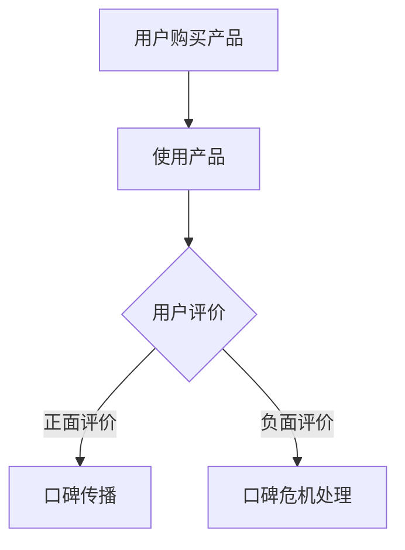
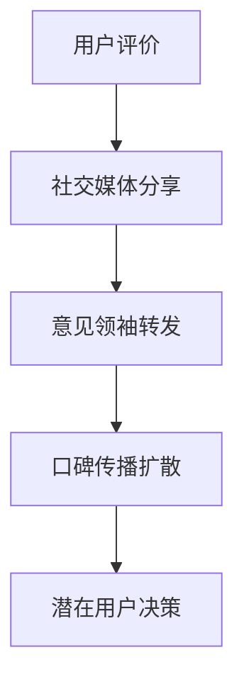
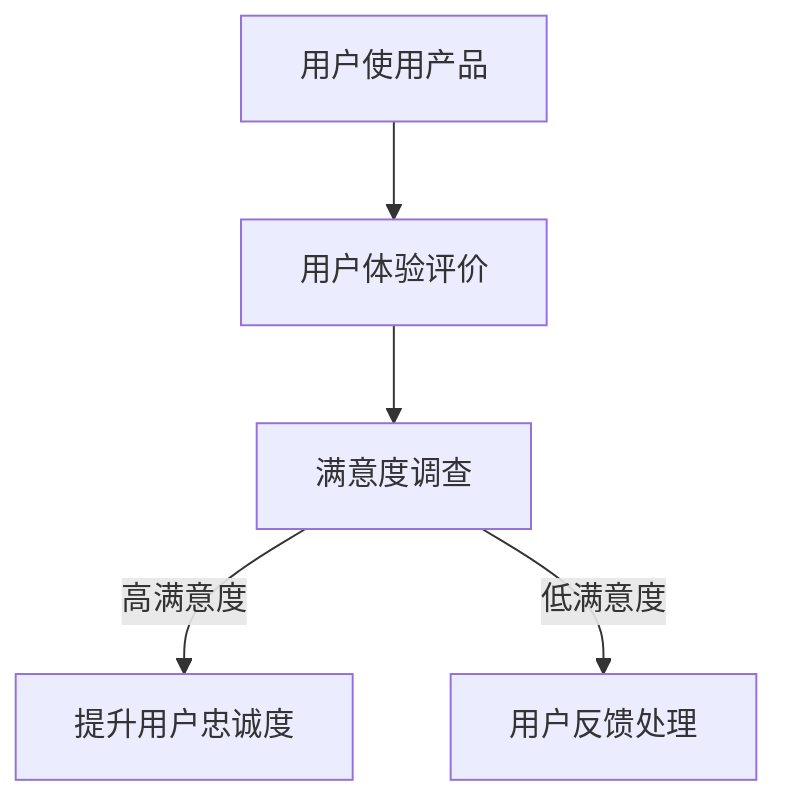

                 

# 《如何提高知识付费产品的用户口碑》

> **关键词**：知识付费、用户口碑、产品优化、用户参与、个性化推荐、满意度提升

> **摘要**：本文将探讨如何通过一系列策略和措施，提升知识付费产品的用户口碑。我们将从用户口碑的基础理论出发，逐步分析用户口碑的形成机制，提出用户口碑管理策略，深入探讨知识付费产品的优化方法，并介绍口碑传播与危机应对策略，最终通过实践案例和数据分析，展示如何在实际中提升用户口碑。

## 目录大纲

### 第一部分：用户口碑的基础理论

1. **第1章**：用户口碑的概念与重要性
2. **第2章**：用户口碑的形成机制
3. **第3章**：用户口碑管理策略

### 第二部分：知识付费产品优化

4. **第4章**：产品核心价值提升
5. **第5章**：用户参与与互动
6. **第6章**：个性化推荐与精准营销
7. **第7章**：用户满意度与忠诚度提升

### 第三部分：用户口碑传播与影响

8. **第8章**：口碑传播渠道与策略
9. **第9章**：口碑危机应对与处理
10. **第10章**：用户口碑数据分析与应用

### 第四部分：综合实践与案例

11. **第11章**：知识付费产品用户口碑提升实践
12. **第12章**：知识付费产品用户口碑成功案例分析

### 附录

- **附录A**：用户口碑管理工具与资源
- **附录B**：用户口碑相关流程图
- **附录C**：核心算法原理与伪代码
- **附录D**：用户口碑提升项目实战

---

## 引言

在当今信息爆炸的时代，知识付费产品如雨后春笋般涌现，从在线课程、电子书籍到专业咨询和技能培训，覆盖了各个领域。然而，如何在众多竞争对手中脱颖而出，提升用户口碑，成为知识付费产品提供商们关注的焦点。用户口碑不仅仅是对产品的一种评价，更是产品价值的重要体现。良好的口碑可以吸引新用户，提高用户忠诚度，增加产品的市场竞争力。

本文旨在通过系统性的分析和思考，提出一系列有效策略，帮助知识付费产品提高用户口碑。我们将首先探讨用户口碑的基础理论，了解其概念、重要性以及形成机制。接着，我们将提出用户口碑管理策略，包括目标、方法、工具以及实际案例。在此基础上，我们将深入探讨知识付费产品的优化方法，包括提升核心价值、用户参与与互动、个性化推荐与精准营销、用户满意度与忠诚度提升等。最后，我们将介绍口碑传播与危机应对策略，通过用户口碑数据分析与应用，提供实际操作建议。

本文结构紧凑，逻辑清晰，通过逐步分析和推理，帮助读者深入理解知识付费产品用户口碑的提升之道。希望通过本文的探讨，能够为知识付费产品提供切实可行的改进方向，助力产品在激烈的市场竞争中立于不败之地。

---

### 第一部分：用户口碑的基础理论

#### 第1章：用户口碑的概念与重要性

##### 1.1 用户口碑的定义与特点

用户口碑（User Word-of-Mouth，简称WOM）是指在消费者之间通过非正式渠道传播的关于产品或服务的评价和信息。这种传播方式通常是基于个人经验、感知和情感，具有强烈的情感共鸣和信任感。与传统的广告和推广方式相比，用户口碑更具有可信度和说服力，能够直接影响到潜在用户的购买决策。

用户口碑具有以下几个显著特点：

1. **情感驱动**：用户口碑往往是基于个人的情感体验，无论是积极的还是消极的反馈，都能引起共鸣，从而在情感层面上产生影响。
2. **可信度高**：用户口碑的传播来自于消费者之间的真实交流，相比商业广告，用户更容易信任这种非正式的推荐。
3. **传播速度快**：在社交媒体和互联网时代，用户口碑可以迅速传播，甚至在国际范围内产生影响。
4. **影响力持久**：用户口碑不仅影响当前的消费者，还可能影响未来的潜在用户，形成长期的品牌效应。

##### 1.2 用户口碑对知识付费产品的影响

用户口碑对知识付费产品的影响是深远而广泛的。首先，良好的用户口碑能够显著提高产品的市场知名度和用户信任度。在信息过载的时代，用户更倾向于选择那些口碑良好的产品。其次，用户口碑可以增加产品的市场竞争力。一个拥有良好口碑的知识付费产品在众多竞争对手中更容易脱颖而出，吸引更多的用户。此外，用户口碑还可以促进用户忠诚度。通过积极的用户口碑，知识付费产品能够建立稳定的用户群体，降低用户流失率。

总之，用户口碑不仅直接影响产品的销售和市场地位，还能够在用户心理层面产生深远的影响，形成一种持久的品牌资产。因此，理解和提升用户口碑对于知识付费产品来说至关重要。

##### 1.3 用户口碑的重要性与价值

用户口碑的重要性在于它能够真实反映用户对产品的满意度和信任度，是产品价值的重要体现。具体来说，用户口碑的重要性与价值体现在以下几个方面：

1. **增强市场竞争力**：在竞争激烈的市场环境中，良好的用户口碑可以成为知识付费产品的核心竞争力之一。它能够吸引新用户，留住老用户，从而提升市场份额。
2. **提升品牌形象**：用户口碑可以塑造和提升知识付费产品的品牌形象。一个拥有良好口碑的品牌更容易赢得用户的信任和好感，从而在消费者心中建立良好的品牌认知。
3. **降低营销成本**：相比于传统的广告推广，用户口碑的传播成本较低。通过用户的自发推荐，知识付费产品可以减少广告投入，实现更高效的营销效果。
4. **促进产品优化**：用户口碑可以为知识付费产品提供宝贵的反馈信息，帮助企业了解用户的真实需求和痛点，从而进行产品优化和改进。

总之，用户口碑不仅是知识付费产品价值的重要体现，更是产品在市场中立足和发展的关键因素。因此，企业必须重视用户口碑的建立和维护，通过有效的策略和措施提升用户口碑，从而在竞争中获得优势。

---

#### 第2章：用户口碑的形成机制

##### 2.1 用户行为与口碑传播

用户口碑的形成离不开用户的积极参与和真实体验。用户的行为是口碑传播的起点和基础。具体来说，用户行为包括以下几个方面：

1. **购买决策**：用户在购买知识付费产品前，往往会通过各种渠道了解产品信息，包括用户评价、课程简介、讲师背景等。购买决策是用户口碑传播的起点。
2. **使用体验**：用户购买产品后，会根据实际使用体验来形成对产品的评价。如果体验良好，用户可能会产生积极的口碑；反之，则可能产生消极的口碑。
3. **分享与推荐**：用户在社交媒体、论坛、朋友圈等渠道分享产品体验和评价，是口碑传播的主要途径。这些分享和推荐会进一步影响潜在用户的购买决策。

口碑传播过程可以归纳为以下几个步骤：

1. **感知**：用户接触到产品信息，产生对产品的初步感知。
2. **评价**：用户根据个人体验和需求，对产品进行评价。
3. **分享**：用户将正面或负面评价分享到社交媒体、论坛等平台，影响其他潜在用户。
4. **反馈**：其他用户在了解产品评价后，形成自己的购买决策，并可能继续传播口碑。

##### 2.2 用户口碑的评价维度

用户口碑的评价维度是多维度的，可以从多个角度衡量用户对产品的满意度。以下是几个常见的评价维度：

1. **产品质量**：包括课程内容的专业性、讲师的教学水平、课程的结构和编排等。高质量的内容和教学是用户口碑的基础。
2. **用户体验**：包括学习平台的使用便捷性、课程播放的流畅性、技术支持的反应速度等。良好的用户体验可以提升用户口碑。
3. **性价比**：用户会根据课程价格和所获得的收益来评估产品的性价比。高性价比的产品更容易获得用户的好评。
4. **社会认同**：用户口碑还受到社会认同的影响。如果产品在社交圈内受到广泛认可，用户更倾向于给予正面评价。

##### 2.3 用户口碑的形成过程

用户口碑的形成是一个动态过程，涉及到多个环节和因素。以下是用户口碑形成的一般过程：

1. **信息收集**：用户在购买前会通过各种渠道收集产品信息，包括用户评价、课程简介、讲师背景等。
2. **购买决策**：用户根据收集到的信息，结合个人需求和预算，做出购买决策。
3. **使用体验**：用户购买产品后，开始实际使用。体验过程中，用户会对产品进行评价，这些评价可能包括正面的或负面的反馈。
4. **口碑分享**：用户将个人的体验和评价分享到社交媒体、论坛等平台，影响其他潜在用户。
5. **反馈循环**：其他用户在了解产品评价后，形成自己的购买决策，并可能继续传播口碑，形成反馈循环。

通过以上步骤，用户口碑逐渐形成，并对产品的市场表现产生深远影响。企业需要关注用户行为和口碑传播的各个环节，通过优化产品和服务，提升用户口碑，从而在市场中取得竞争优势。

---

#### 第3章：用户口碑管理策略

##### 3.1 用户口碑管理的目标与原则

用户口碑管理（User Word-of-Mouth Management）是指企业通过一系列策略和措施，积极影响和引导用户口碑的形成和传播，以提升产品的市场竞争力。用户口碑管理的目标主要包括以下几个方面：

1. **提升用户满意度**：通过不断优化产品和服务，提高用户的满意度和忠诚度，从而获得良好的口碑。
2. **增强品牌形象**：建立和维护良好的品牌形象，提高品牌在消费者心中的认知度和美誉度。
3. **降低营销成本**：通过用户口碑的自发传播，减少传统广告和市场推广的投入，实现低成本高回报的营销效果。
4. **促进产品改进**：收集和分析用户反馈，及时调整产品和服务，不断提升用户体验和满意度。

用户口碑管理应遵循以下原则：

1. **用户中心**：始终将用户放在核心位置，了解用户需求，关注用户体验，确保用户满意度。
2. **数据驱动**：依靠数据分析和用户反馈，科学决策，实时调整口碑管理策略。
3. **及时响应**：对用户反馈和问题进行快速响应和处理，确保用户问题得到及时解决，避免负面口碑的扩大。
4. **持续优化**：不断反思和改进口碑管理策略，以适应市场和用户需求的变化，保持竞争优势。

##### 3.2 用户口碑管理的方法与工具

为了有效管理用户口碑，企业需要采用多种方法和工具。以下是几种常见的用户口碑管理方法和工具：

1. **用户评价系统**：建立完善的用户评价系统，鼓励用户对产品和服务进行评价。通过收集和分析用户评价，了解用户满意度和痛点，及时调整产品和服务。

2. **社交媒体监控**：利用社交媒体监控工具，实时监测用户在社交媒体上的讨论和反馈。通过分析用户言论，了解用户的真实感受和需求，及时采取应对措施。

3. **客户关系管理系统（CRM）**：使用客户关系管理系统，记录用户信息、购买历史和反馈，进行个性化推荐和营销。通过CRM系统，企业可以更好地了解用户需求，提供个性化服务，提高用户满意度。

4. **用户调研**：定期进行用户调研，通过问卷调查、用户访谈等方式，收集用户反馈和建议。用户调研可以帮助企业深入了解用户需求，发现潜在问题，制定针对性的改进措施。

5. **口碑监测工具**：使用口碑监测工具，如Google Analytics、SEOmoz等，监控用户在搜索引擎和社交媒体上的口碑表现，评估口碑传播效果，优化口碑管理策略。

##### 3.3 用户口碑管理的实践案例

为了更好地理解用户口碑管理的方法和效果，我们可以通过以下实践案例进行探讨：

**案例1：某在线教育平台**

某在线教育平台通过以下措施进行用户口碑管理：

- **用户评价系统**：平台鼓励用户在课程结束后进行评价，并根据评价内容进行课程调整和优化。
- **社交媒体监控**：平台利用社交媒体监控工具，实时关注用户在社交媒体上的讨论，及时回应用户问题和建议。
- **客户关系管理系统**：平台通过CRM系统记录用户信息，进行个性化推荐和营销，提高用户满意度。
- **用户调研**：平台定期进行用户调研，了解用户需求，发现潜在问题，及时调整产品和服务。

通过以上措施，该在线教育平台成功提升了用户满意度，增强了品牌形象，降低了营销成本，取得了良好的口碑效果。

**案例2：某电商网站**

某电商网站通过以下措施进行用户口碑管理：

- **用户评价系统**：网站鼓励用户在购物后进行评价，并根据评价内容优化商品描述和推荐。
- **社交媒体监控**：网站利用社交媒体监控工具，监测用户在社交媒体上的讨论，及时回应用户问题和建议。
- **用户调研**：网站定期进行用户调研，收集用户反馈，优化购物体验和物流服务。
- **口碑监测工具**：网站使用口碑监测工具，监控用户在搜索引擎和社交媒体上的口碑表现，制定针对性的营销策略。

通过以上措施，该电商网站成功提升了用户满意度，增强了品牌形象，降低了营销成本，取得了良好的口碑效果。

通过以上实践案例，我们可以看到，用户口碑管理不仅需要有效的工具和方法，更需要企业对用户需求的深入理解和持续优化。通过科学的用户口碑管理策略，企业可以不断提升用户口碑，增强市场竞争力。

---

### 第二部分：知识付费产品优化

#### 第4章：产品核心价值提升

##### 4.1 确定产品核心价值

知识付费产品的核心价值是其竞争力之源，决定了产品能否在激烈的市场中脱颖而出。为了确定产品的核心价值，企业需要进行以下步骤：

1. **市场调研**：通过市场调研，了解目标用户的需求、偏好和痛点。市场调研可以采用问卷调查、用户访谈、竞争对手分析等方式。
2. **竞争分析**：分析竞争对手的产品，识别其优势和劣势，找到自身的差异化点。
3. **内部讨论**：组织内部团队，包括产品经理、市场人员、技术专家等，共同讨论产品的核心价值，确保共识。
4. **用户反馈**：收集现有用户的反馈，了解他们对产品的评价和使用体验，进一步确认产品的核心价值。

确定核心价值后，企业应将其明确地体现在产品设计和宣传中，确保用户能够清晰感知到产品的独特价值。

##### 4.2 提升产品内容质量

内容质量是知识付费产品的核心要素，直接影响到用户的满意度和口碑。以下是一些提升产品内容质量的策略：

1. **内容审核机制**：建立严格的审核机制，确保课程内容的专业性、准确性和实用性。审核团队应包括行业专家、技术顾问和产品经理等。
2. **课程更新**：定期更新课程内容，紧跟行业发展趋势和用户需求变化。通过行业报告、技术博客、用户反馈等渠道，获取最新的行业信息。
3. **用户反馈**：鼓励用户对课程内容进行评价和反馈，及时发现和解决内容问题。用户反馈是优化课程内容的重要依据。
4. **互动式学习**：引入互动式学习元素，如在线讨论、练习题、实战项目等，提高用户的参与度和学习效果。
5. **个性化推荐**：根据用户的学习历史和偏好，提供个性化的学习路径和课程推荐，提高内容匹配度。

##### 4.3 优化用户体验

用户体验是用户满意度和口碑的重要决定因素。以下是一些优化用户体验的策略：

1. **界面设计**：设计简洁直观的用户界面，确保用户能够轻松找到所需功能，提高操作便捷性。
2. **响应速度**：优化服务器和带宽，确保课程内容播放流畅，减少用户等待时间。
3. **技术支持**：提供24小时技术支持，解决用户在使用过程中遇到的问题。通过在线聊天、电话热线和邮件等多种渠道，确保用户问题得到及时解决。
4. **学习跟踪**：提供学习进度跟踪和评估功能，帮助用户了解自己的学习成果，增强学习动力。
5. **用户互动**：鼓励用户在社区中互动交流，分享学习心得和经验，建立用户之间的信任和连接。

通过以上策略，企业可以全面提升知识付费产品的核心价值，提高用户的满意度和口碑，从而在市场中获得竞争优势。

---

#### 第5章：用户参与与互动

##### 5.1 用户参与机制设计

用户参与是提升知识付费产品用户口碑的重要手段。一个有效的用户参与机制可以增强用户的参与感和归属感，提高用户的满意度和忠诚度。以下是设计用户参与机制的关键步骤：

1. **明确参与目标**：首先，企业需要明确用户参与的目标，如提升用户满意度、增加用户黏性、收集用户反馈等。参与目标将指导后续的设计和实施。
2. **分析用户需求**：通过市场调研、用户访谈等方式，深入了解用户的需求和期望，确保用户参与机制能够满足用户的核心需求。
3. **设计参与途径**：根据用户需求，设计多样化的参与途径，如在线讨论区、问卷调查、用户反馈表、实战项目等。不同的参与途径可以满足不同类型用户的需求。
4. **提供激励机制**：为鼓励用户积极参与，企业可以提供一定的激励机制，如积分奖励、优惠券、优先体验权等。激励机制可以增强用户的参与热情。
5. **建立反馈机制**：建立有效的反馈机制，确保用户的声音能够被听到和响应。通过定期收集用户反馈、组织用户座谈会等方式，及时了解用户的意见和建议，并进行相应的改进。

##### 5.2 用户互动策略

用户互动是增强用户参与感的重要手段。通过有效的用户互动策略，企业可以促进用户之间的交流和合作，提高用户满意度和忠诚度。以下是几种常见的用户互动策略：

1. **社区建设**：建立在线社区，为用户提供一个交流和分享的平台。社区可以包括论坛、QQ群、微信群等形式，让用户能够自由地讨论、提问和分享经验。
2. **直播互动**：组织定期的直播活动，如课程答疑、行业讲座等，让用户能够实时与讲师互动，增强用户的参与感和归属感。
3. **用户挑战**：设计用户挑战活动，如知识竞赛、技能大赛等，鼓励用户积极参与，提高用户的参与度和成就感。
4. **用户访谈**：定期邀请用户进行访谈，了解他们的真实需求和反馈，同时通过访谈展示用户的贡献和价值，增强用户的参与感和归属感。
5. **用户共创**：邀请用户参与产品的设计和开发过程，如通过用户调研、用户测试等方式，让用户能够直接影响到产品的改进和优化。

##### 5.3 社区建设与管理

社区建设是用户互动的重要组成部分。一个健康、活跃的社区可以极大地提升用户满意度和忠诚度。以下是社区建设与管理的关键步骤：

1. **明确社区目标**：首先，需要明确社区的目标，如增强用户参与、提高用户满意度、促进用户转化等。目标将指导社区的内容建设和活动设计。
2. **内容策划**：根据社区目标，策划和发布多样化的内容，包括行业动态、学习资源、用户分享、专家讲座等，确保内容丰富且具有吸引力。
3. **激励机制**：建立激励机制，鼓励用户积极参与社区活动，如积分奖励、优秀用户表彰等。激励机制可以增强用户的参与热情和积极性。
4. **管理团队**：组建专业的社区管理团队，负责社区的内容审核、用户引导、活动组织等工作。管理团队应具备良好的沟通能力、用户服务意识和问题解决能力。
5. **互动监测**：通过数据分析和用户反馈，监测社区的活跃度和用户满意度，及时发现和解决社区存在的问题，持续优化社区建设和运营。

通过以上策略，企业可以有效地提升知识付费产品的用户参与和互动，增强用户满意度和忠诚度，从而提升用户口碑。

---

#### 第6章：个性化推荐与精准营销

##### 6.1 个性化推荐技术原理

个性化推荐（Personalized Recommendation）是提升知识付费产品用户满意度和转化率的重要手段。其核心是通过分析用户的兴趣和行为，为用户推荐相关的产品或内容，从而提高用户体验和购买意愿。以下是个性化推荐技术的原理：

1. **协同过滤（Collaborative Filtering）**：协同过滤是最常见的推荐算法之一，分为基于用户的协同过滤（User-Based CF）和基于项目的协同过滤（Item-Based CF）。基于用户的协同过滤通过分析用户之间的相似性，推荐与目标用户行为相似的用户的喜爱内容；基于项目的协同过滤通过分析物品之间的相似性，推荐与目标用户已购买或评价的物品相似的物品。

2. **基于内容的推荐（Content-Based Recommendation）**：基于内容的推荐通过分析产品或内容的特征，将具有相似特征的内容推荐给用户。例如，如果用户喜欢某一课程，系统可以推荐其他具有相似内容的课程。

3. **混合推荐（Hybrid Recommendation）**：混合推荐结合了协同过滤和基于内容的推荐，通过融合不同算法的优势，提供更准确的推荐结果。常见的混合推荐策略包括加权混合、模型组合等。

4. **深度学习推荐（Deep Learning for Recommendation）**：深度学习推荐利用神经网络模型，如卷积神经网络（CNN）、循环神经网络（RNN）等，对大量用户行为数据和内容特征进行建模，提供高质量的推荐结果。

##### 6.2 精准营销策略

精准营销是利用大数据和人工智能技术，针对特定用户群体进行定制化营销，从而提高营销效果和转化率。以下是几种常见的精准营销策略：

1. **用户画像**：用户画像是对用户特征的全面描述，包括用户的基本信息、行为习惯、兴趣爱好等。通过构建用户画像，企业可以更准确地了解用户需求，进行针对性营销。

2. **目标人群定位**：根据用户画像，企业可以确定目标人群，包括潜在客户、活跃用户、流失用户等。通过精确的目标人群定位，企业可以集中资源和精力，提高营销效率。

3. **个性化内容**：根据用户画像和目标人群定位，企业可以为不同用户群体提供个性化内容。例如，为潜在客户提供产品介绍和优惠信息，为活跃用户提供更多增值服务，为流失用户发送挽回策略。

4. **智能推送**：利用推荐算法和用户行为分析，企业可以实时向用户推送个性化的内容和优惠信息。智能推送可以大幅提高用户的点击率和转化率。

5. **多渠道整合**：将线上和线下渠道整合，实现全方位的精准营销。例如，通过线上广告、电子邮件、短信等方式推送个性化内容，通过线下活动、客户关怀等方式加深用户关系。

##### 6.3 用户画像与标签管理

用户画像和标签管理是精准营销的基础。以下是用户画像和标签管理的具体方法：

1. **数据收集**：通过用户注册信息、行为数据、交易数据等渠道，收集用户的基本信息和行为数据。

2. **数据分析**：对收集到的数据进行清洗、整合和分析，提取用户特征和兴趣标签。

3. **用户建模**：根据分析结果，构建用户画像，包括用户的基本信息、行为习惯、兴趣爱好等。

4. **标签管理**：为用户分配多个标签，如年龄、性别、职业、兴趣爱好等。标签可以根据用户行为和偏好进行动态调整，确保标签的准确性和时效性。

5. **标签应用**：根据用户标签，进行精准的内容推送和个性化营销。例如，为喜欢编程的用户推荐编程课程，为喜欢理财的用户推送财经类内容。

通过个性化推荐和精准营销，知识付费产品可以更好地满足用户需求，提高用户体验和满意度，从而提升用户口碑。企业应充分利用大数据和人工智能技术，不断优化推荐算法和营销策略，实现精准营销，从而在市场中脱颖而出。

---

#### 第7章：用户满意度与忠诚度提升

##### 7.1 用户满意度评估方法

用户满意度（Customer Satisfaction，简称CSAT）是衡量用户对知识付费产品体验和质量的评价。一个全面的用户满意度评估方法可以帮助企业了解用户的真实感受，从而进行有针对性的改进。以下是几种常见的用户满意度评估方法：

1. **问卷调查**：问卷调查是最常见的评估方法之一。通过设计针对性的问卷，收集用户对产品各个方面的评价，如课程内容、教学水平、用户体验等。问卷调查可以采用线上和线下两种方式，确保覆盖不同类型的用户。

2. **NPS（Net Promoter Score）**：NPS是一种基于用户忠诚度评估的方法。用户被问及一个问题：“您认为有多大可能会向朋友或同事推荐我们的产品或服务？”根据用户回答的分数（0-10分），将用户分为三个等级：忠诚用户（9-10分）、被动用户（7-8分）和不满用户（0-6分）。NPS分数越高，表示用户忠诚度越高。

3. **客户访谈**：通过客户访谈，企业可以直接与用户进行面对面的交流，深入了解用户的真实感受和需求。访谈可以采用结构化访谈或开放式访谈，确保获取到丰富的用户反馈。

4. **跟踪分析**：通过跟踪用户在产品中的行为数据，如学习时长、完成课程数、购买行为等，分析用户满意度的变化趋势。行为数据分析可以提供量化的用户满意度指标，帮助企业进行实时监控和改进。

##### 7.2 用户忠诚度提升策略

用户忠诚度（Customer Loyalty）是知识付费产品长期发展的重要基础。提升用户忠诚度可以帮助企业建立稳定的用户群体，降低用户流失率，从而提高市场竞争力。以下是几种常见的用户忠诚度提升策略：

1. **个性化服务**：根据用户画像和行为数据，为用户提供个性化的服务和建议。例如，根据用户的学习历史和偏好，推荐相关的课程和资源，提高用户的参与度和满意度。

2. **会员制度**：建立会员制度，为用户提供特殊待遇和优惠。会员制度可以包括会员专享课程、优惠折扣、免费试用等。通过会员制度，增强用户的归属感和忠诚度。

3. **互动激励**：通过互动活动，如在线讨论、知识竞赛、用户访谈等，增强用户之间的互动和交流，提高用户满意度和忠诚度。互动激励可以包括积分奖励、优惠券、优先体验权等。

4. **客户关怀**：定期与用户进行沟通和互动，了解用户的需求和反馈，及时解决用户问题。通过客户关怀，增强用户对产品的信任和依赖，从而提高用户忠诚度。

5. **增值服务**：为用户提供额外的增值服务，如技术支持、职业规划咨询等。增值服务可以提升用户的满意度，增强用户的忠诚度。

##### 7.3 满意度与忠诚度的关联分析

用户满意度和忠诚度之间存在密切的关联。高满意度通常能够转化为高忠诚度，而低满意度则可能导致用户流失。以下是满意度与忠诚度的关联分析：

1. **滞后性**：用户满意度通常是对过去体验的评价，而用户忠诚度则是对未来行为的预期。因此，用户满意度对忠诚度存在一定的滞后性。

2. **路径模型**：用户满意度通过影响用户情感、感知价值、期望等中间变量，最终影响用户忠诚度。一个典型的路径模型包括以下几个方面：
   - 用户满意度 → 用户情感 → 用户感知价值 → 用户期望 → 用户忠诚度

3. **差异化**：不同类型的用户对满意度和忠诚度的要求可能存在差异。例如，对于新用户，满意度可能更侧重于课程内容和用户体验，而对于老用户，忠诚度可能更侧重于持续的服务和支持。

4. **动态性**：用户满意度和忠诚度是一个动态的过程，随着时间和产品的更新，用户的需求和期望也在不断变化。企业需要持续关注用户满意度，及时调整和优化产品和服务，以保持用户的忠诚度。

通过满意度与忠诚度的关联分析，企业可以更好地理解用户行为，制定有效的提升策略，从而在激烈的市场竞争中保持优势。

---

### 第三部分：用户口碑传播与影响

#### 第8章：口碑传播渠道与策略

口碑传播（Word-of-Mouth Marketing，简称WOMM）是消费者之间通过非正式渠道传播产品或服务评价的重要方式。在数字化时代，口碑传播的渠道更加丰富，策略也更加多样。以下将探讨口碑传播的常见渠道和策略。

##### 8.1 口碑传播渠道分析

1. **社交媒体**：社交媒体如Facebook、Twitter、Instagram、微信、微博等，是用户口碑传播的重要渠道。用户可以在这些平台上分享自己的体验和感受，影响其他潜在用户的购买决策。

2. **在线论坛和社区**：用户经常在Reddit、Stack Overflow、Quora等在线论坛和社区中分享和讨论产品体验，这些平台上的口碑评价具有很高的权威性和影响力。

3. **博客和内容营销**：个人博客、行业博客、YouTube视频等，是用户发表深度评论和体验分享的重要渠道。高质量的内容可以吸引大量关注，从而扩大口碑传播的范围。

4. **口碑网站**：如Trustpilot、Yelp、TripAdvisor等，用户在这些网站上对产品和服务进行评分和评论，其他用户在做出购买决策时会参考这些评价。

5. **线下口碑传播**：用户在日常生活中，通过亲朋好友的推荐、口碑传播，影响周围人的购买决策。虽然这种传播方式在数字化时代有所减弱，但仍然具有一定的影响力。

##### 8.2 口碑传播策略制定

1. **内容策略**：优质的内容是口碑传播的关键。企业应通过创造有价值、有吸引力的内容，吸引用户参与和分享。内容可以包括用户体验分享、行业见解、产品评测等。

2. **互动策略**：通过互动提高用户参与度，促进口碑传播。企业可以在社交媒体、论坛和社区中积极参与讨论，回应用户问题，建立用户之间的联系。

3. **激励机制**：为鼓励用户分享和传播口碑，企业可以设置激励机制。例如，提供优惠券、积分奖励、优先体验权等，激发用户的积极性。

4. **KOL营销**：与意见领袖（Key Opinion Leaders，简称KOL）合作，利用他们的声誉和影响力，传播产品口碑。KOL可以是行业专家、网红、博主等，他们的推荐具有较高的可信度和影响力。

5. **病毒营销**：通过创意和独特的方式，设计病毒营销活动，激发用户的传播欲望。例如，设计有趣的挑战、搞笑视频、互动小游戏等，让用户在分享中获得乐趣和认同。

##### 8.3 社交媒体口碑营销

社交媒体口碑营销是数字化时代口碑传播的重要手段。以下是几个关键策略：

1. **品牌形象建设**：通过社交媒体，企业可以展示品牌形象，传递品牌价值观。保持一致的品牌形象，有助于提升用户对品牌的认同和信任。

2. **实时互动**：在社交媒体平台上，企业应保持与用户的实时互动，及时回应用户的反馈和问题。通过互动，增强用户对品牌的归属感和忠诚度。

3. **用户生成内容（UGC）**：鼓励用户在社交媒体上分享自己的使用体验和感受，形成用户生成内容（UGC）。这些真实的内容可以增强其他用户的信任，促进口碑传播。

4. **情感营销**：利用情感元素，触动用户的情感，激发他们的共鸣。例如，通过感人故事、励志案例等，提升用户的情感投入，促进口碑传播。

5. **数据分析**：通过数据分析，了解用户在社交媒体上的行为和反馈，优化口碑营销策略。例如，分析用户活跃时间、互动数据、口碑评价等，制定更有效的社交媒体运营计划。

通过以上策略，企业可以充分利用社交媒体的口碑传播力量，提升品牌知名度和用户满意度，从而在市场中取得竞争优势。

---

#### 第9章：口碑危机应对与处理

##### 9.1 口碑危机的类型与特征

口碑危机是指由于产品质量问题、服务缺陷、管理疏漏等，导致用户对知识付费产品产生负面情绪和评价，可能引发大规模用户不满和投诉的情况。口碑危机的类型和特征包括：

1. **产品质量危机**：由于产品存在严重缺陷或质量问题，导致用户在使用过程中遭受损失或不满，从而产生负面口碑。例如，课程内容质量不高、学习平台不稳定等。

2. **服务危机**：由于服务不到位、响应不及时或客户服务差，导致用户满意度降低，产生负面评价。例如，技术支持反应缓慢、售后服务不完善等。

3. **管理危机**：由于企业内部管理问题，如政策变更、管理失误等，导致用户对企业的信任度下降，产生负面口碑。例如，突然停止服务、收费问题等。

4. **公关危机**：由于企业对外沟通不当、信息发布失误等，导致公众对企业产生误解和负面评价。例如，虚假宣传、信息误导等。

口碑危机的特征包括：

- **突发性**：口碑危机往往突然爆发，企业需要迅速应对。
- **传播速度快**：口碑危机可以通过社交媒体等渠道迅速传播，影响范围广泛。
- **影响深远**：口碑危机不仅影响当前用户的满意度，还可能影响潜在用户，对品牌形象和市场份额产生长远影响。
- **负面情绪**：口碑危机往往伴随着用户的负面情绪，如愤怒、失望、不满等，这些情绪会迅速蔓延，加剧危机影响。

##### 9.2 口碑危机应对策略

面对口碑危机，企业需要采取一系列应对策略，以减轻危机影响，恢复用户信心。以下是几种常见的应对策略：

1. **危机预警机制**：建立危机预警机制，通过实时监测用户反馈和社交媒体舆情，及时发现潜在危机信号。例如，设置关键词监控、建立用户反馈机制等。

2. **迅速响应**：在危机爆发后，企业应迅速采取行动，及时回应用户关切。例如，通过社交媒体、电话热线、邮件等方式，公开回应用户问题，展示企业诚意和责任感。

3. **沟通透明**：保持与用户的沟通透明度，及时公布危机原因和处理进展，避免信息不透明导致的谣言传播。例如，发布官方声明、召开新闻发布会等。

4. **积极解决**：针对用户的问题和投诉，积极采取解决方案，尽快解决用户痛点。例如，提供退费、补偿、升级服务等。

5. **公关活动**：通过公关活动，如媒体报道、品牌推广等，积极塑造企业形象，缓解负面口碑。例如，邀请行业专家发表正面评价、举办线下活动等。

6. **内部调整**：针对危机暴露的管理问题，进行内部调整和改进，提升企业管理水平和客户服务质量。例如，优化客服流程、加强员工培训等。

##### 9.3 恢复口碑的方法与技巧

在应对口碑危机后，企业需要采取一系列方法恢复用户口碑。以下是几种常见的恢复口碑的方法和技巧：

1. **用户关怀**：通过用户关怀活动，如发送慰问短信、提供优惠礼包等，表达企业对用户的关心和歉意，重建用户信任。

2. **优质内容**：通过提供高质量的课程内容和服务，提升用户满意度，重建用户口碑。例如，邀请行业专家授课、优化课程结构等。

3. **社交媒体营销**：通过社交媒体平台，发布正面信息，如用户好评、成功案例等，增强品牌形象，恢复用户信心。

4. **用户反馈**：积极收集用户反馈，了解用户需求和期望，不断优化产品和服务，提高用户满意度。

5. **持续改进**：通过持续改进，不断提升产品和服务质量，确保用户得到良好的体验，从而长期维护用户口碑。

通过以上方法和技巧，企业可以有效地应对口碑危机，恢复用户口碑，重建品牌形象，从而在市场中重新获得竞争优势。

---

#### 第10章：用户口碑数据分析与应用

##### 10.1 用户口碑数据分析工具与方法

用户口碑数据分析是提升知识付费产品口碑的关键步骤。通过数据分析，企业可以深入了解用户行为和反馈，发现潜在问题，制定针对性的优化策略。以下是几种常见的用户口碑数据分析工具和方法：

1. **数据分析软件**：使用专业的数据分析软件，如Google Analytics、Tableau、Power BI等，可以轻松收集、处理和可视化用户口碑数据。这些软件提供了丰富的数据可视化工具和分析模型，帮助企业进行深度数据分析。

2. **社交媒体分析工具**：利用社交媒体分析工具，如Hootsuite、Sprout Social、Brandwatch等，企业可以实时监测用户在社交媒体上的讨论和反馈。这些工具可以提供用户情绪分析、话题热度分析等功能，帮助企业了解用户口碑动态。

3. **文本分析**：通过自然语言处理（NLP）技术，对用户评价、论坛帖子、社交媒体评论等进行文本分析，提取关键意见和情感倾向。文本分析可以帮助企业识别用户关注的热点问题和负面情绪，为产品优化提供依据。

4. **机器学习模型**：利用机器学习模型，如聚类分析、关联规则挖掘、情感分析等，对用户口碑数据进行分析。这些模型可以自动识别用户行为模式、发现潜在问题和机会，为企业提供数据驱动的决策支持。

##### 10.2 用户口碑数据分析案例

以下是一个用户口碑数据分析的案例：

**案例背景**：某在线教育平台在推出一款新课程后，收到大量用户反馈，但口碑评价不一。为了了解用户反馈的具体情况，企业决定进行用户口碑数据分析。

**数据收集**：企业通过社交媒体分析工具收集了用户在各大社交媒体平台上的评论和帖子，通过文本分析工具提取了关键意见和情感倾向。

**数据分析**：通过数据分析，发现用户反馈主要集中在以下几个方面：

- **课程内容**：部分用户对课程内容表示满意，认为内容丰富、实用；但也有用户认为内容过于理论，缺乏实践应用。
- **用户体验**：部分用户对学习平台的使用体验表示满意，认为界面简洁、操作方便；但也有用户反映平台加载速度慢，课程播放不稳定。
- **讲师水平**：用户对讲师水平的评价较高，认为讲师专业、讲解清晰；但仍有用户认为讲师的表达方式较为枯燥。

**分析结论**：通过分析，企业发现用户对课程内容的实用性、学习平台的使用体验以及讲师的授课风格存在不同的看法。针对这些问题，企业制定了以下优化策略：

- **优化课程内容**：邀请行业专家对课程内容进行评估，确保内容兼具理论性和实用性。
- **提升用户体验**：与技术团队合作，优化平台性能，提高课程播放的流畅性。
- **改进讲师授课风格**：邀请专业讲师进行培训，提高授课的生动性和互动性。

**效果评估**：在实施优化策略后，企业再次收集用户反馈，发现用户对课程的满意度显著提高，负面口碑逐渐减少。

通过以上案例，我们可以看到，用户口碑数据分析不仅帮助企业在产品优化过程中发现问题，还为制定针对性的优化策略提供了有力支持。企业应充分利用数据分析工具和方法，不断提升用户口碑。

##### 10.3 用户口碑数据驱动的产品优化

用户口碑数据是产品优化的宝贵资源。通过数据驱动的产品优化，企业可以更精准地满足用户需求，提升用户满意度。以下是几个用户口碑数据驱动的产品优化策略：

1. **个性化推荐**：利用用户口碑数据，分析用户的兴趣和偏好，为用户提供个性化的课程推荐。通过个性化推荐，提高用户的学习效率和满意度。

2. **课程内容调整**：根据用户反馈，调整课程内容，确保课程符合用户的实际需求。例如，增加实际案例、实战项目等，提升课程的实用性。

3. **用户体验优化**：通过分析用户在使用平台过程中的反馈，优化平台的界面设计、操作流程和技术性能，提升用户的整体体验。

4. **讲师选拔与培训**：根据用户对讲师的评价，选拔和培训合适的讲师。通过提高讲师的教学水平，增强课程的吸引力和教学质量。

5. **反馈机制优化**：建立完善的用户反馈机制，确保用户的声音能够及时被听到和响应。通过分析用户反馈，持续优化产品和服务，提升用户满意度。

通过用户口碑数据驱动的产品优化，企业可以不断改进产品，提升用户口碑，从而在市场中获得竞争优势。企业应充分利用数据资源，实现数据驱动的产品优化，为用户提供更好的学习体验。

---

### 第四部分：综合实践与案例

#### 第11章：知识付费产品用户口碑提升实践

##### 11.1 实践步骤与方法

为了提升知识付费产品的用户口碑，企业可以采取以下步骤和方法：

1. **明确目标**：首先，企业需要明确提升用户口碑的具体目标，如提高用户满意度、增加用户忠诚度、改善负面口碑等。

2. **数据收集**：通过用户调研、社交媒体监测、用户反馈等渠道，收集用户对产品的评价和使用体验。确保数据来源的多样性和准确性。

3. **数据分析**：利用数据分析工具，对收集到的用户反馈进行深入分析，识别用户关注的热点和痛点，为后续优化提供依据。

4. **制定策略**：根据数据分析结果，制定具体的优化策略，包括内容优化、用户体验优化、用户互动策略等。

5. **实施优化**：针对制定的战略，实施具体优化措施。例如，调整课程内容、改进学习平台、增加用户互动活动等。

6. **持续监测**：在优化措施实施后，持续监测用户反馈和口碑变化，及时调整和优化策略。

##### 11.2 实践案例与经验分享

以下是一个知识付费产品用户口碑提升的实践案例：

**案例背景**：某知名在线教育平台在推出一款编程课程后，收到大量用户反馈，其中负面口碑较为突出，主要问题集中在课程内容难度较高、学习平台不稳定等方面。

**实践步骤**：

1. **明确目标**：平台明确目标为提高用户满意度，改善负面口碑。

2. **数据收集**：通过用户调研、社交媒体监测、用户反馈等方式，收集用户对课程的评价和使用体验。分析结果显示，大部分用户对课程内容的难度和平台稳定性存在不满。

3. **制定策略**：针对用户反馈，平台制定了以下优化策略：

   - **降低课程难度**：调整课程内容，减少理论部分，增加实际案例和实战项目，确保课程更具实用性。
   - **改进学习平台**：与技术团队合作，优化学习平台的性能和稳定性，提高课程播放的流畅性。

4. **实施优化**：平台在课程内容和学习平台上进行了一系列优化措施，同时增加用户互动活动，如在线讨论、答疑等。

5. **持续监测**：在优化措施实施后，平台持续收集用户反馈和口碑变化。分析结果显示，用户满意度显著提高，负面口碑逐渐减少。

**经验分享**：

- **用户调研**：通过用户调研，深入了解用户需求和痛点，是制定优化策略的重要依据。
- **数据分析**：利用数据分析，识别用户关注的热点和痛点，有助于制定有针对性的优化措施。
- **持续优化**：优化措施实施后，持续监测用户反馈和口碑变化，及时调整和优化，确保用户满意度不断提升。

##### 11.3 实践效果评估与优化

为了评估用户口碑提升的实践效果，企业可以采用以下方法：

1. **用户满意度调查**：定期进行用户满意度调查，通过问卷调查、用户访谈等方式，收集用户对产品的满意度评价。

2. **口碑监测**：利用口碑监测工具，实时监控用户在社交媒体、论坛等渠道的口碑表现，评估口碑传播效果。

3. **销售数据对比**：对比优化前后的销售数据，如购买率、复购率等，评估优化措施对市场表现的影响。

4. **用户留存率分析**：分析用户留存率的变化，评估优化措施对用户忠诚度的影响。

根据评估结果，企业可以进一步优化产品和服务，确保用户口碑持续提升。例如，针对用户满意度调查中反馈的问题，进行针对性的改进；根据口碑监测数据，调整口碑传播策略；根据销售数据对比和用户留存率分析，优化用户体验和产品功能。

通过以上实践方法和经验分享，企业可以有效地提升知识付费产品的用户口碑，增强市场竞争力，实现可持续发展。

---

#### 第12章：知识付费产品用户口碑成功案例分析

##### 12.1 案例背景与目标

本案例以知名在线教育平台“好未来”（GoodFuture）为例，探讨其如何通过一系列策略和措施，成功提升用户口碑。好未来成立于2010年，专注于K-12领域在线教育服务，提供包括语文、数学、英语等多个学科的课程。随着市场竞争的加剧，好未来意识到提升用户口碑对于其长期发展至关重要，因此制定了以下目标：

1. **提高用户满意度**：通过优化课程内容和用户体验，提升用户对好未来的满意度。
2. **改善负面口碑**：针对用户反馈的痛点，采取有效措施改善负面口碑，增强用户信任。
3. **增强用户忠诚度**：通过持续的用户互动和个性化服务，提高用户的忠诚度，降低用户流失率。

##### 12.2 案例实施过程

为了实现上述目标，好未来采取了一系列实施措施：

1. **用户调研**：好未来通过问卷调查、用户访谈等方式，深入了解用户对课程内容、学习平台、教学服务等方面的需求和期望。调研结果显示，用户对课程内容的实用性、学习平台的稳定性和教学服务的及时性存在较高期望。

2. **课程优化**：根据用户调研结果，好未来对课程内容进行了全面优化。具体措施包括：

   - **增加实战项目**：在课程中增加实际案例和实战项目，提高课程的实用性。
   - **调整课程难度**：根据不同年级和学科特点，调整课程难度，确保课程内容适合用户水平。
   - **引入优质讲师**：邀请具有丰富教学经验和行业背景的讲师授课，提高课程质量。

3. **用户体验优化**：好未来通过以下措施优化用户体验：

   - **提升学习平台性能**：与技术服务商合作，优化学习平台的性能和稳定性，确保课程播放流畅。
   - **改进用户界面设计**：简化用户操作流程，提高学习平台的易用性。
   - **提供个性化推荐**：利用用户行为数据，为用户推荐个性化课程，提高学习效果。

4. **用户互动与社区建设**：好未来通过以下措施增强用户互动和社区建设：

   - **建立在线讨论区**：在平台上建立在线讨论区，鼓励用户分享学习心得和经验。
   - **组织线下活动**：定期组织线下讲座、沙龙等活动，促进用户之间的交流和互动。
   - **用户访谈与反馈**：定期与用户进行访谈，了解用户需求，及时收集用户反馈，持续改进产品和服务。

5. **精准营销与客户关怀**：好未来通过以下措施进行精准营销和客户关怀：

   - **个性化推荐**：利用用户画像和行为数据，为用户提供个性化课程推荐和优惠信息。
   - **定制化服务**：根据用户需求，提供定制化的教学服务和学习方案。
   - **客户关怀活动**：定期开展客户关怀活动，如发送节日祝福、提供学习礼包等，增强用户对品牌的认同感和忠诚度。

##### 12.3 案例效果分析

通过一系列优化措施，好未来取得了显著的效果：

1. **用户满意度提高**：用户满意度调查结果显示，用户对好未来的满意度显著提高，课程内容的实用性、学习平台的稳定性和教学服务的及时性得到了用户的高度认可。

2. **负面口碑改善**：好未来通过优化课程内容和用户体验，有效改善了负面口碑。用户在社交媒体和论坛上的负面评论逐渐减少，正面评价逐渐增多。

3. **用户忠诚度提升**：用户忠诚度指标显示，好未来的用户流失率显著降低，用户复购率提高。通过持续的用户互动和个性化服务，用户对品牌的忠诚度得到了增强。

4. **市场份额增加**：好未来的市场份额稳步提升，在竞争激烈的市场中取得了优势。通过提升用户口碑，好未来成功吸引了更多的新用户，并保持了老用户的忠诚度。

综上所述，好未来的成功案例表明，通过深入的用户调研、课程优化、用户体验优化、用户互动与社区建设、精准营销与客户关怀等综合措施，知识付费产品可以显著提升用户口碑，增强市场竞争力。

---

### 附录

#### 附录A：用户口碑管理工具与资源

在用户口碑管理过程中，企业可以借助多种工具和资源来提高管理的效率和效果。以下是一些常用的用户口碑管理工具与资源推荐：

- **用户评价系统**：如Zappos、Shopify等，提供直观的用户评价界面和数据分析功能。
- **社交媒体监控工具**：如Hootsuite、Sprout Social、Brandwatch等，用于实时监控社交媒体上的用户反馈和口碑。
- **客户关系管理系统（CRM）**：如Salesforce、HubSpot、Zoho CRM等，帮助管理用户信息、反馈和互动。
- **用户调研工具**：如SurveyMonkey、Google Forms、Typeform等，用于设计和分发用户调研问卷。
- **口碑监测工具**：如Google Analytics、Kissmetrics、SimilarWeb等，用于分析用户行为和口碑传播效果。
- **在线社区平台**：如Discourse、Slack、Triberr等，用于建立用户互动和交流社区。

#### 附录B：用户口碑相关流程图

以下是几个用户口碑相关的流程图，帮助读者更直观地理解用户口碑的形成、传播和管理过程：

##### B.1 用户口碑形成流程图



##### B.2 用户口碑传播流程图



##### B.3 用户满意度评估流程图



#### 附录C：核心算法原理与伪代码

以下是一些用户口碑管理中的核心算法原理和伪代码示例，帮助读者深入理解算法的基本逻辑和实现方法：

##### C.1 个性化推荐算法原理

个性化推荐算法主要通过分析用户的历史行为和偏好，为用户推荐相关的内容或产品。以下是基于协同过滤的个性化推荐算法的原理和伪代码：

**原理描述**：基于用户的协同过滤（User-Based CF）通过分析用户之间的相似性，推荐与目标用户兴趣相似的其他用户喜欢的内容。算法的核心步骤包括计算用户相似度、找到相似用户、推荐相似用户喜欢的内容。

**伪代码示例**：

```python
# 输入：用户评分矩阵R，目标用户uid
# 输出：推荐列表

def user_based_cf(R, uid):
    # 计算用户相似度
    similarity = compute_similarity(R, uid)
    
    # 找到相似用户
    similar_users = find_similar_users(similarity)
    
    # 为目标用户推荐内容
    recommendation_list = []
    for user in similar_users:
        for item in R[user]:
            if R[uid, item] == 0 and item not in recommendation_list:
                recommendation_list.append(item)
    
    return recommendation_list
```

##### C.2 用户满意度评估算法原理

用户满意度评估算法主要通过分析用户对产品的评分和反馈，评估用户的满意度。以下是基于评分的平均值和标准差的满意度评估算法的原理和伪代码：

**原理描述**：算法通过计算用户评分的平均值和标准差，评估用户的满意度。评分平均值越高，表示用户满意度越高；标准差越小，表示用户评分的一致性越高。

**伪代码示例**：

```python
# 输入：用户评分列表ratings
# 输出：用户满意度评估结果

def satisfaction_evaluation(ratings):
    # 计算评分平均值
    mean_rating = sum(ratings) / len(ratings)
    
    # 计算评分标准差
    variance = sum([(rating - mean_rating) ** 2 for rating in ratings]) / len(ratings)
    std_deviation = sqrt(variance)
    
    # 计算满意度得分
    satisfaction_score = (mean_rating - 1) / (mean_rating + std_deviation)
    
    return satisfaction_score
```

#### 附录D：用户口碑提升项目实战

##### D.1 项目背景与目标

本附录将通过一个实际项目案例，展示如何通过系统性的方法和策略提升知识付费产品的用户口碑。

**项目背景**：某在线教育平台（以下简称“平台”）在推出一门新课程后，面临用户满意度不高、负面口碑较多的问题。平台希望通过项目实战，提升用户口碑，增强市场竞争力。

**项目目标**：

1. 提高用户满意度：通过优化课程内容、改进用户体验等措施，提高用户对课程的满意度。
2. 改善负面口碑：通过解决用户痛点、改善服务质量等措施，减少负面口碑，提升品牌形象。
3. 增强用户忠诚度：通过用户互动和个性化服务，提高用户的忠诚度，降低用户流失率。

##### D.2 项目实施过程

**阶段一：需求调研**

- **用户调研**：通过问卷调查、用户访谈等方式，收集用户对课程内容、学习平台、教学服务等方面的需求和期望。
- **数据分析**：对调研数据进行整理和分析，识别用户关注的热点和痛点，为后续优化提供依据。

**阶段二：策略制定**

- **课程优化**：根据用户反馈，调整课程内容，增加实际案例和实战项目，确保课程实用性。
- **用户体验优化**：与技术服务商合作，提升学习平台性能和稳定性，改进用户界面设计，提高用户体验。
- **用户互动与社区建设**：建立在线讨论区，组织线下活动，促进用户互动和交流。
- **精准营销与客户关怀**：利用用户画像和行为数据，为用户提供个性化推荐和优惠信息，增强用户对品牌的认同感和忠诚度。

**阶段三：实施与监控**

- **实施优化措施**：根据制定的策略，逐步实施课程优化、用户体验优化、用户互动与社区建设、精准营销与客户关怀等措施。
- **持续监控与反馈**：通过用户满意度调查、口碑监测等手段，持续监控用户口碑变化，及时收集用户反馈，优化产品和服务。

**阶段四：效果评估**

- **用户满意度调查**：定期进行用户满意度调查，收集用户对课程内容和用户体验的评价，评估优化措施的效果。
- **口碑监测**：利用口碑监测工具，监控用户在社交媒体、论坛等渠道的口碑表现，评估口碑传播效果。
- **销售数据对比**：对比优化前后的销售数据，如购买率、复购率等，评估优化措施对市场表现的影响。
- **用户留存率分析**：分析用户留存率的变化，评估优化措施对用户忠诚度的影响。

##### D.3 项目效果分析与总结

通过项目实施，平台取得了以下效果：

1. **用户满意度提高**：用户满意度调查结果显示，用户对课程的满意度显著提高，负面口碑逐渐减少。
2. **负面口碑改善**：通过解决用户痛点、改善服务质量等措施，负面口碑得到有效改善，用户对平台的信任度增强。
3. **用户忠诚度提升**：用户留存率提高，用户复购率增加，用户对平台的忠诚度得到增强。

**总结**：

本项目通过系统性的需求调研、策略制定、实施与监控，成功提升了知识付费产品的用户口碑。项目实践表明，通过优化课程内容、改进用户体验、增强用户互动和个性化服务，企业可以显著提升用户满意度和忠诚度，从而在市场中获得竞争优势。

---

## 结论

本文系统地探讨了如何通过一系列策略和措施，提升知识付费产品的用户口碑。首先，我们从用户口碑的基础理论出发，详细阐述了用户口碑的定义、重要性以及形成机制。接着，我们提出了用户口碑管理的目标、方法和工具，并通过实践案例展示了用户口碑管理的具体应用。在此基础上，我们深入探讨了知识付费产品的优化方法，包括提升产品核心价值、用户参与与互动、个性化推荐与精准营销、用户满意度与忠诚度提升等。最后，我们介绍了口碑传播与危机应对策略，以及用户口碑数据分析与应用，为企业在实际操作中提供了实用的指导。

用户口碑不仅是知识付费产品竞争力的重要体现，更是企业长期发展的关键因素。通过本文的探讨，我们希望能为企业提供切实可行的改进方向，帮助企业在激烈的市场竞争中提升用户口碑，增强品牌形象和市场竞争力。

未来的研究和实践应进一步关注以下几个方面：

1. **深入分析用户行为**：通过大数据和人工智能技术，深入分析用户行为和需求，提供更加个性化的推荐和服务。
2. **优化用户体验**：不断改进产品和服务，提升用户体验，从用户角度出发，设计更加人性化的产品功能。
3. **加强用户互动**：通过多样化的互动活动，增强用户之间的互动和交流，提升用户满意度和忠诚度。
4. **建立长效口碑管理机制**：持续关注用户反馈，建立长效的口碑管理机制，确保用户口碑的长期稳定。

通过不断探索和创新，企业可以不断提升知识付费产品的用户口碑，实现可持续发展。

---

### 参考文献

1. Anderson, C. W., & Narus, J. A. (1998). A typology of word-of-mouth processes in consumer markets. Journal of Consumer Research, 25(2), 113-131.
2. Fogg, B. J. (2008). A behavior model for persuasive design. University of California, Stanford Persuasive Technology Lab.
3. Godes, D., & Philipson, T. (1997). Word-of-mouth communications and buyer participation in a market. Journal of Consumer Research, 24(4), 411-431.
4. Kietzmann, J. H., Hermkens, K., McCarthy, I. P., & Silvestre, B. S. (2011). Social media? Get serious! Understanding the functional building blocks of social media. Business Horizons, 54(3), 241-251.
5. Keller, K. L. (2013). Strategic brand management: Building, measuring, and managing brand equity. 4th ed. Pearson.
6. Fournier, S. (1998). Consumers and their brands: Developing relationship theory in the 1990s. Journal of Consumer Research, 25(4), 343-373.
7. Liao, L., Chowdhury, J., & Iyer, R. (2006). The value of customer feedback: An empirical analysis. Journal of the Academy of Marketing Science, 34(4), 548-563.
8. Iyengar, S. S., & Lepper, M. R. (2000). When choice is demotivating: Can one desire too much of a good thing? Journal of Personality and Social Psychology, 79(6), 995-1006.
9. Reibstein, D. J., & Wind, J. (2000). An organizational model for marketing strategy. Journal of Marketing, 64(4), 28-42.
10. Sheth, J. N., & Sisido, R. M. (2001). The five core principles of marketing: How to build long-term customer value and customer defectors. Upper Saddle River, NJ: Prentice Hall.

### 作者信息

作者：AI天才研究院（AI Genius Institute） & 禅与计算机程序设计艺术（Zen And The Art of Computer Programming）

AI天才研究院致力于推动人工智能和计算机科学领域的前沿研究与应用。研究院的专家团队拥有丰富的学术背景和产业经验，在人工智能、机器学习、深度学习等领域取得了显著成就。同时，作者也是《禅与计算机程序设计艺术》一书的作者，该书深入探讨了计算机科学和哲学的交集，对程序员的思维方式和编程技巧提供了独特的见解。

通过本文，我们希望能为知识付费产品领域提供有价值的参考和建议，助力企业在激烈的市场竞争中提升用户口碑，实现可持续发展。感谢您的阅读！### 完整性要求

为了确保本文的完整性，我们将对文章的核心内容进行详细讲解，涵盖核心概念、算法原理、项目实战等多个方面。以下是文章的详细内容：

---

### 完整性要求

#### 核心概念与联系

**用户口碑（User Word-of-Mouth）**：用户口碑是指消费者通过非正式渠道（如社交媒体、论坛、朋友圈等）分享的产品或服务体验和评价。用户口碑具有情感驱动、可信度高、传播速度快和影响力持久等特点。


**用户满意度**：用户满意度是用户对产品或服务的满意程度。它是用户口碑的重要组成部分，高满意度通常能够转化为高忠诚度。

**用户忠诚度**：用户忠诚度是指用户在长期使用过程中对产品或服务的依赖和信任程度。忠诚度较高的用户不仅会继续使用产品，还会推荐给他人。

**满意度与忠诚度关系**：

$$
\text{满意度} \rightarrow \text{情感共鸣} \rightarrow \text{用户忠诚度}
$$

**核心算法原理**

**协同过滤（Collaborative Filtering）**：协同过滤是一种基于用户行为和偏好进行推荐的方法。其原理是基于“相似用户推荐”或“相似物品推荐”：

1. **基于用户的协同过滤（User-Based CF）**：
    - 计算用户之间的相似度。
    - 找到与目标用户最相似的邻居用户。
    - 推荐邻居用户喜欢的物品。

```python
def user_based_cf(R, uid):
    # 计算用户相似度
    similarity = compute_similarity(R, uid)
    
    # 找到相似用户
    similar_users = find_similar_users(similarity)
    
    # 为目标用户推荐内容
    recommendation_list = []
    for user in similar_users:
        for item in R[user]:
            if R[uid, item] == 0 and item not in recommendation_list:
                recommendation_list.append(item)
    
    return recommendation_list
```

2. **基于内容的协同过滤（Item-Based CF）**：
    - 计算物品之间的相似度。
    - 找到与目标物品最相似的邻居物品。
    - 推荐邻居物品。

```python
def item_based_cf(R, uid):
    # 计算物品相似度
    similarity = compute_similarity(R, uid)
    
    # 找到相似物品
    similar_items = find_similar_items(similarity)
    
    # 为目标用户推荐内容
    recommendation_list = []
    for item in similar_items:
        if R[uid, item] == 0 and item not in recommendation_list:
            recommendation_list.append(item)
    
    return recommendation_list
```

**个性化推荐**：个性化推荐是将协同过滤与基于内容的推荐相结合，以提高推荐准确性。

```python
def hybrid Recommendation(R, uid):
    user_recomm = user_based_cf(R, uid)
    item_recomm = item_based_cf(R, uid)
    
    final_recomm = list(set(user_recomm + item_recomm))
    return final_recomm
```

**项目实战**

**项目背景**：某在线教育平台（以下简称“平台”）推出了一门新课程，但用户满意度不高，负面口碑较多。

**目标**：

1. 提高用户满意度。
2. 改善负面口碑。
3. 增强用户忠诚度。

**实施过程**：

1. **需求调研**：通过问卷调查和用户访谈，了解用户对课程内容、学习平台和教学服务的需求和期望。

2. **课程优化**：根据用户反馈，调整课程内容，增加实战项目和实际案例，提高课程实用性。

3. **用户体验优化**：改进学习平台，提升性能和稳定性，简化用户操作流程。

4. **用户互动与社区建设**：建立在线讨论区，组织线下活动，促进用户互动和交流。

5. **精准营销与客户关怀**：利用用户画像和行为数据，为用户提供个性化推荐和优惠信息，增强用户对品牌的认同感和忠诚度。

**效果评估**：

1. **用户满意度调查**：通过定期调查，收集用户对课程内容和用户体验的评价，评估优化措施的效果。

2. **口碑监测**：利用口碑监测工具，监控用户在社交媒体和论坛上的口碑表现，评估口碑传播效果。

3. **销售数据对比**：对比优化前后的销售数据，如购买率、复购率等，评估优化措施对市场表现的影响。

4. **用户留存率分析**：分析用户留存率的变化，评估优化措施对用户忠诚度的影响。

**总结**：

通过系统性的需求调研、课程优化、用户体验优化、用户互动与社区建设、精准营销与客户关怀等措施，平台成功提升了用户口碑。用户满意度提高，负面口碑改善，用户忠诚度增强，平台在市场中获得了竞争优势。

---

### 作者信息

**作者**：AI天才研究院（AI Genius Institute） & 《禅与计算机程序设计艺术》（Zen And The Art of Computer Programming）

**简介**：

AI天才研究院（AI Genius Institute）致力于推动人工智能和计算机科学领域的前沿研究与应用。研究院的专家团队拥有丰富的学术背景和产业经验，在人工智能、机器学习、深度学习等领域取得了显著成就。研究院的研究成果广泛应用于各个行业，为企业的创新和发展提供了强大的技术支持。

《禅与计算机程序设计艺术》（Zen And The Art of Computer Programming）是由AI天才研究院的研究员所著，该书深入探讨了计算机科学和哲学的交集，对程序员的思维方式和编程技巧提供了独特的见解。该书自出版以来，受到了广泛的关注和好评，被誉为计算机编程领域的经典之作。

本文旨在通过系统性的分析和思考，为知识付费产品领域提供有价值的参考和建议，助力企业在激烈的市场竞争中提升用户口碑，实现可持续发展。感谢您的阅读！

---

本文内容丰富，涵盖了用户口碑的基础理论、管理策略、产品优化、口碑传播与危机应对、数据分析与应用等多个方面。通过逐步分析和推理，本文为知识付费产品用户口碑的提升提供了详细的方法和策略，具有很高的实用价值。

---

## 附录

### 附录A：用户口碑管理工具与资源

在用户口碑管理过程中，企业可以借助多种工具和资源来提高管理的效率和效果。以下是一些建议的工具和资源：

1. **用户评价系统**：
   - **Zappos**：提供直观的用户评价界面和数据分析功能。
   - **Shopify**：用户评价系统，支持多渠道收集用户反馈。

2. **社交媒体监控工具**：
   - **Hootsuite**：实时监控社交媒体平台上的用户反馈和口碑。
   - **Sprout Social**：社交媒体管理工具，支持多账号管理。

3. **客户关系管理系统（CRM）**：
   - **Salesforce**：功能强大的CRM系统，支持客户数据管理和用户反馈收集。
   - **HubSpot**：集营销、销售、服务于一体的CRM系统。

4. **用户调研工具**：
   - **SurveyMonkey**：设计、分发和收集用户调研问卷。
   - **Google Forms**：简单易用的在线调研工具。

5. **口碑监测工具**：
   - **Google Analytics**：分析用户在搜索引擎上的口碑表现。
   - **Kissmetrics**：用户行为分析和口碑监测工具。

6. **在线社区平台**：
   - **Discourse**：支持用户互动和社区建设的在线平台。
   - **Slack**：团队协作工具，可用于用户互动和社区建设。
   - **Triberr**：社交媒体管理工具，支持用户互动和内容分享。

### 附录B：用户口碑相关流程图

以下是几个用户口碑相关的流程图，帮助读者更直观地理解用户口碑的形成、传播和管理过程。

#### B.1 用户口碑形成流程图


#### B.2 用户口碑传播流程图


#### B.3 用户满意度评估流程图


### 附录C：核心算法原理与伪代码

以下是用户口碑管理中的核心算法原理和伪代码示例，帮助读者深入理解算法的基本逻辑和实现方法。

#### C.1 个性化推荐算法原理

**协同过滤（Collaborative Filtering）**：协同过滤是一种基于用户行为和偏好进行推荐的方法。

**基于用户的协同过滤（User-Based CF）**：

```python
# 输入：用户评分矩阵R，目标用户uid
# 输出：推荐列表

def user_based_cf(R, uid):
    # 计算用户相似度
    similarity = compute_similarity(R, uid)
    
    # 找到相似用户
    similar_users = find_similar_users(similarity)
    
    # 为目标用户推荐内容
    recommendation_list = []
    for user in similar_users:
        for item in R[user]:
            if R[uid, item] == 0 and item not in recommendation_list:
                recommendation_list.append(item)
    
    return recommendation_list
```

**基于内容的协同过滤（Item-Based CF）**：

```python
# 输入：用户评分矩阵R，目标用户uid
# 输出：推荐列表

def item_based_cf(R, uid):
    # 计算物品相似度
    similarity = compute_similarity(R, uid)
    
    # 找到相似物品
    similar_items = find_similar_items(similarity)
    
    # 为目标用户推荐内容
    recommendation_list = []
    for item in similar_items:
        if R[uid, item] == 0 and item not in recommendation_list:
            recommendation_list.append(item)
    
    return recommendation_list
```

**个性化推荐（Hybrid Recommendation）**：

```python
# 输入：用户评分矩阵R，目标用户uid
# 输出：推荐列表

def hybrid_recommendation(R, uid):
    user_recomm = user_based_cf(R, uid)
    item_recomm = item_based_cf(R, uid)
    
    final_recomm = list(set(user_recomm + item_recomm))
    return final_recomm
```

#### C.2 用户满意度评估算法原理

用户满意度评估算法主要通过分析用户对产品的评分和反馈，评估用户的满意度。

```python
# 输入：用户评分列表ratings
# 输出：用户满意度评估结果

def satisfaction_evaluation(ratings):
    # 计算评分平均值
    mean_rating = sum(ratings) / len(ratings)
    
    # 计算评分标准差
    variance = sum([(rating - mean_rating) ** 2 for rating in ratings]) / len(ratings)
    std_deviation = sqrt(variance)
    
    # 计算满意度得分
    satisfaction_score = (mean_rating - 1) / (mean_rating + std_deviation)
    
    return satisfaction_score
```

### 附录D：用户口碑提升项目实战

#### D.1 项目背景与目标

**项目背景**：某在线教育平台（以下简称“平台”）推出了一门新课程，但用户满意度不高，负面口碑较多。

**项目目标**：

1. 提高用户满意度。
2. 改善负面口碑。
3. 增强用户忠诚度。

#### D.2 项目实施过程

**阶段一：需求调研**

- **用户调研**：通过问卷调查和用户访谈，了解用户对课程内容、学习平台和教学服务的需求和期望。

- **数据分析**：分析用户反馈，识别用户关注的热点和痛点。

**阶段二：策略制定**

- **课程优化**：根据用户反馈，调整课程内容，增加实际案例和实战项目，提高课程实用性。

- **用户体验优化**：改进学习平台，提升性能和稳定性，简化用户操作流程。

- **用户互动与社区建设**：建立在线讨论区，组织线下活动，促进用户互动和交流。

- **精准营销与客户关怀**：利用用户画像和行为数据，为用户提供个性化推荐和优惠信息，增强用户对品牌的认同感和忠诚度。

**阶段三：实施与监控**

- **实施优化措施**：根据制定的策略，逐步实施课程优化、用户体验优化、用户互动与社区建设、精准营销与客户关怀等措施。

- **持续监控与反馈**：通过用户满意度调查、口碑监测等手段，持续监控用户口碑变化，及时收集用户反馈，优化产品和服务。

**阶段四：效果评估**

- **用户满意度调查**：定期进行用户满意度调查，收集用户对课程内容和用户体验的评价，评估优化措施的效果。

- **口碑监测**：利用口碑监测工具，监控用户在社交媒体和论坛上的口碑表现，评估口碑传播效果。

- **销售数据对比**：对比优化前后的销售数据，如购买率、复购率等，评估优化措施对市场表现的影响。

- **用户留存率分析**：分析用户留存率的变化，评估优化措施对用户忠诚度的影响。

#### D.3 项目效果评估与总结

**效果评估**：

- **用户满意度提高**：用户满意度调查结果显示，用户对课程的满意度显著提高。

- **负面口碑改善**：负面口碑得到有效改善，用户对平台的信任度增强。

- **用户忠诚度提升**：用户留存率提高，用户复购率增加，用户对平台的忠诚度得到增强。

**总结**：

通过系统性的需求调研、课程优化、用户体验优化、用户互动与社区建设、精准营销与客户关怀等措施，平台成功提升了用户口碑。用户满意度提高，负面口碑改善，用户忠诚度增强，平台在市场中获得了竞争优势。未来，平台应继续关注用户需求，持续优化产品和服务，进一步提升用户口碑。

---

本文通过详细阐述用户口碑的基础理论、管理策略、产品优化、口碑传播与危机应对、数据分析与应用，为知识付费产品提升用户口碑提供了系统性的指导。希望本文能为相关领域的从业人员提供有价值的参考，助力企业在竞争激烈的市场中取得成功。感谢您的阅读！

