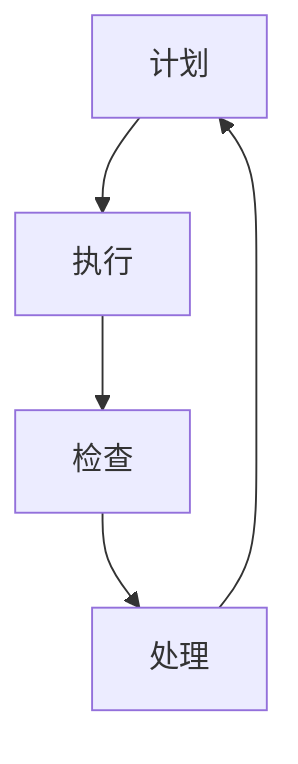
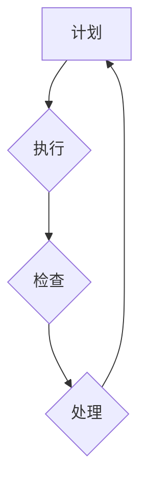

                 

### 第一部分：PDCA循环概述

PDCA循环，即Plan-Do-Check-Act循环，是一种广泛应用的持续改进方法。本文将详细探讨PDCA循环的定义、发展历程、核心思想及其在现代管理中的应用，旨在帮助读者理解并掌握这一重要的管理工具。

#### 1.1 PDCA循环的定义与历史

##### 1.1.1 PDCA循环的概念

PDCA循环是一种通过四个阶段（计划、执行、检查、处理）的循环迭代来达成目标的管理方法。这种方法最早由美国质量管理专家爱德华兹·戴明提出，并在20世纪50年代开始在日本广泛应用，成为日本质量管理的基础。

##### 1.1.2 PDCA循环的发展历程

PDCA循环起源于20世纪初的质量管理理论。在二战期间，美国为了提高生产效率，开始研究如何通过管理来提升质量。爱德华兹·戴明在此基础上发展出了PDCA循环的概念，并在日本得到了充分的应用和推广。

##### 1.1.3 PDCA循环的核心思想

PDCA循环的核心思想在于通过循环迭代来不断优化过程和结果。计划阶段明确目标、制定策略；执行阶段按计划实施；检查阶段评估效果；处理阶段总结经验，为下一次循环提供改进方向。这种循环迭代的方式，使得组织能够持续改进，不断提高质量和效率。

#### 1.2 PDCA循环在现代管理中的应用

##### 1.2.1 PDCA循环在企业流程优化中的应用

在企业流程优化中，PDCA循环被广泛应用于流程设计、流程改进和流程管理。通过计划阶段明确优化目标和策略，执行阶段实施改进措施，检查阶段评估改进效果，处理阶段总结经验并持续改进，企业能够实现流程的优化和效率的提升。

##### 1.2.2 PDCA循环在项目管理中的实践

在项目管理中，PDCA循环被广泛应用于项目计划、项目执行、项目监控和项目改进。项目团队通过计划阶段明确项目目标、制定项目计划；执行阶段按计划执行项目任务；检查阶段监控项目进度和风险；处理阶段总结项目经验，为后续项目提供改进方向。这种方式有助于确保项目成功完成，并提高项目管理的效率和质量。

##### 1.2.3 PDCA循环在人力资源管理中的应用

在人力资源管理中，PDCA循环被广泛应用于招聘、培训、绩效管理和员工发展。通过计划阶段明确人力资源需求、制定招聘和培训计划；执行阶段执行招聘和培训任务；检查阶段评估招聘和培训效果；处理阶段总结经验并优化人力资源管理策略，企业能够实现人力资源的优化和效率的提升。

#### 1.3 PDCA循环的优势与局限性

##### 1.3.1 PDCA循环的优势分析

PDCA循环具有以下优势：

1. **系统性**：PDCA循环通过四个阶段的循环迭代，实现系统的持续改进。
2. **灵活性**：PDCA循环适用于各种类型的管理场景，具有广泛的适用性。
3. **可操作性**：PDCA循环的四个阶段提供了明确的操作指南，便于实施和管理。

##### 1.3.2 PDCA循环的局限性探讨

PDCA循环也存在一些局限性：

1. **时间成本**：PDCA循环的循环迭代需要一定的时间，可能导致项目进度延迟。
2. **人员素质**：PDCA循环的实施需要具备相关知识和技能的人员，否则可能难以达到预期效果。
3. **外部因素**：PDCA循环的实施可能受到外部环境的影响，如市场变化、政策调整等。

综上所述，PDCA循环作为一种持续改进方法，具有显著的优势，但也存在一定的局限性。在实际应用中，需要根据具体情况灵活运用，以达到最佳效果。

---

**核心概念与联系**：

**Mermaid 流程图**：



**核心算法原理讲解**：

**PDCA循环伪代码**：

```python
function PDCA(operator):
    plan_result = operator.plan()
    do_result = operator.do(plan_result)
    check_result = operator.check(do_result)
    act_result = operator.act(check_result)
    return act_result

class Operator:
    def plan(self):
        # 计划阶段的具体实现
        pass
    
    def do(self, plan_result):
        # 执行阶段的具体实现
        pass
    
    def check(self, do_result):
        # 检查阶段的具体实现
        pass
    
    def act(self, check_result):
        # 处理阶段的具体实现
        pass
```

**数学模型和数学公式**：

$$
\text{PDCA循环} = \text{计划(Plan)} + \text{执行(Do)} + \text{检查(Check)} + \text{处理(Act)}
$$

**项目实战**：

**案例一：生产流程优化**

1. **开发环境搭建**：

   - 安装Visio用于绘制流程图
   - 安装Python和相关库，如numpy、pandas等

2. **源代码详细实现**：

   ```python
   import pandas as pd
   
   class ProductionProcess:
       def __init__(self):
           self.plan_result = None
           self.do_result = None
           self.check_result = None
           self.act_result = None
       
       def plan(self):
           # 设定目标，制定计划
           self.plan_result = "计划完成"
       
       def do(self, plan_result):
           # 执行计划
           self.do_result = "执行完成"
       
       def check(self, do_result):
           # 检查执行结果
           self.check_result = "检查完成"
       
       def act(self, check_result):
           # 根据检查结果进行处理
           self.act_result = "处理完成"
       
       def PDCA(self):
           self.plan()
           self.do(self.plan_result)
           self.check(self.do_result)
           self.act(self.check_result)
           return self.act_result
   
   process = ProductionProcess()
   result = process.PDCA()
   print(result)
   ```

3. **代码解读与分析**：

   - `ProductionProcess` 类代表生产流程，包含四个阶段的实现方法。
   - `plan` 方法负责计划阶段，设定目标。
   - `do` 方法负责执行阶段，按照计划实施。
   - `check` 方法负责检查阶段，评估执行结果。
   - `act` 方法负责处理阶段，根据检查结果进行改进。
   - `PDCA` 方法将四个阶段串联起来，形成完整的PDCA循环。

   通过这个案例，我们可以看到PDCA循环在生产流程优化中的应用，以及如何使用Python实现这一循环。

---

**作者信息**：

作者：AI天才研究院/AI Genius Institute & 禅与计算机程序设计艺术 /Zen And The Art of Computer Programming

---

接下来的部分，我们将详细探讨PDCA循环的基本步骤，包括计划（Plan）、执行（Do）、检查（Check）和处理（Act）四个阶段，帮助读者深入理解并掌握这一管理工具。在每一阶段中，我们将详细讲解其关键概念、实施方法、常见问题和解决策略。通过这些内容，读者将能够全面了解PDCA循环的运作原理和应用技巧。

---

### 第二部分：PDCA循环的基本步骤

PDCA循环是由计划（Plan）、执行（Do）、检查（Check）和处理（Act）四个阶段构成的，每个阶段都有其特定的任务和目标。下面我们将详细探讨这四个阶段，帮助读者理解并掌握PDCA循环的运作原理和应用技巧。

#### 2.1 计划（Plan）

计划阶段是PDCA循环的第一个阶段，也是整个循环的起点。在这个阶段，我们需要明确目标、制定策略，并规划具体的行动步骤。

##### 2.1.1 计划阶段的目标设定

目标设定是计划阶段的关键。一个明确、具体和可衡量的目标是确保项目成功的关键因素。

###### 2.1.1.1 目标设定的原则

1. **SMART原则**：目标需要具备SMART特性，即具体（Specific）、可衡量（Measurable）、可达成（Achievable）、相关（Relevant）和时限性（Time-bound）。
2. **SMARTER原则**：在SMART原则的基础上，进一步强调目标的“紧急性”（Emergency）和“创新性”（Experimental）。
3. **目标分解**：将总体目标分解为具体的子目标，便于实施和监控。

###### 2.1.1.2 目标设定的方法

1. **头脑风暴**：通过集体讨论，收集各种可能的目标和策略。
2. **SWOT分析**：分析企业的优势（Strengths）、劣势（Weaknesses）、机会（Opportunities）和威胁（Threats），为目标的设定提供依据。
3. **关键绩效指标（KPI）**：根据企业的关键业务指标，设定具体的目标。

##### 2.1.2 计划阶段的工作安排

在计划阶段，我们需要明确各项任务的具体分工，并制定详细的行动步骤。

###### 2.1.2.1 工作分解结构（WBS）

工作分解结构（WBS）是一种将项目任务分解为可管理的工作单元的方法。通过WBS，我们可以清晰地了解项目的各个组成部分，并确定各部分的负责人和完成时间。

###### 2.1.2.2 资源分配计划

在计划阶段，我们需要合理分配资源，包括人力、物资和时间。资源分配计划需要考虑任务的重要性和紧急性，确保关键任务得到充分资源支持。

##### 2.1.3 计划阶段的风险评估与应对策略

在计划阶段，我们需要对项目可能遇到的风险进行评估，并制定相应的应对策略。

###### 2.1.3.1 风险识别

通过头脑风暴、历史数据和专家咨询等方法，识别项目可能遇到的风险。

###### 2.1.3.2 风险评估

对识别出的风险进行评估，确定其发生概率和影响程度。

###### 2.1.3.3 风险应对策略

根据风险评估结果，制定相应的应对策略，包括风险规避、风险减轻、风险接受和风险转移等。

#### 2.2 执行（Do）

执行阶段是PDCA循环的核心阶段，也是目标实现的阶段。在这个阶段，我们需要严格按照计划执行各项任务，确保项目的顺利进行。

##### 2.2.1 执行阶段的任务执行

在执行阶段，我们需要按照计划安排，逐步完成各项任务。

###### 2.2.1.1 任务执行的监控

通过建立监控机制，对任务执行情况进行实时跟踪和监控。监控内容包括任务的进度、质量、成本和风险等。

###### 2.2.1.2 任务执行的记录

对任务执行情况进行详细记录，包括任务的完成情况、遇到的问题和解决方案等。这些记录将用于后续的检查和处理阶段。

##### 2.2.2 执行阶段的沟通与协作

在执行阶段，沟通与协作至关重要。我们需要确保团队成员之间的信息畅通，协调各项工作，确保项目顺利进行。

###### 2.2.2.1 沟通渠道的建立

建立有效的沟通渠道，包括会议、报告、邮件和即时通讯工具等。确保信息传递的及时性和准确性。

###### 2.2.2.2 协作机制的实施

制定协作机制，明确各成员的职责和协作流程。通过协作，提高团队的整体执行力。

#### 2.3 检查（Check）

检查阶段是PDCA循环的第三个阶段，也是对执行结果进行评估的阶段。在这个阶段，我们需要对执行结果进行检查，评估项目目标的达成情况。

##### 2.3.1 检查阶段的指标设定

在检查阶段，我们需要设定具体的指标，用于衡量项目目标的达成情况。

###### 2.3.1.1 指标设定的方法

1. **关键绩效指标（KPI）**：根据项目的特点和目标，设定关键绩效指标，如进度、质量、成本和客户满意度等。
2. **目标达成率**：根据设定的目标和实际执行结果，计算目标达成率，评估项目目标的实现情况。

###### 2.3.1.2 指标设定的注意事项

1. **指标的可衡量性**：确保指标可以量化，便于评估。
2. **指标的合理性**：确保指标与项目目标和业务需求相一致。
3. **指标的及时性**：确保指标数据可以实时获取，便于实时监控。

##### 2.3.2 检查阶段的执行结果评估

在检查阶段，我们需要对执行结果进行详细评估，分析项目目标的达成情况。

###### 2.3.2.1 执行结果的收集

通过数据收集、报告分析和现场检查等方法，收集执行结果的相关数据。

###### 2.3.2.2 执行结果的评估方法

1. **对比分析法**：将实际执行结果与预期目标进行对比，分析差距和原因。
2. **趋势分析法**：分析执行结果的趋势，预测未来的表现。
3. **综合评估法**：结合多种评估方法，全面分析执行结果。

#### 2.4 处理（Act）

处理阶段是PDCA循环的最后一个阶段，也是对执行结果进行改进的阶段。在这个阶段，我们需要根据检查结果，制定改进措施，确保项目目标的持续优化。

##### 2.4.1 处理阶段的改进措施

在处理阶段，我们需要根据检查结果，制定具体的改进措施。

###### 2.4.1.1 改进措施的实施

1. **问题解决**：针对检查阶段发现的问题，制定解决方案，并实施。
2. **经验总结**：总结项目执行过程中的经验和教训，为后续项目提供参考。

###### 2.4.1.2 改进措施的效果验证

在实施改进措施后，我们需要验证改进措施的效果，确保问题得到有效解决。

##### 2.4.2 处理阶段的总结与反馈

在处理阶段，我们需要对整个PDCA循环进行总结，并将反馈信息传递给相关利益相关者。

###### 2.4.2.1 总结会议的召开

通过总结会议，对项目执行过程中的成功经验和不足之处进行讨论，形成总结报告。

###### 2.4.2.2 反馈机制的建立

建立反馈机制，将总结报告和改进措施传达给相关利益相关者，确保项目的持续改进。

综上所述，PDCA循环的四个阶段相互关联，构成了一个完整的持续改进体系。通过计划、执行、检查和处理四个阶段的循环迭代，组织能够不断优化过程和结果，实现持续改进和卓越绩效。在接下来的部分，我们将探讨PDCA循环在实际应用中的成功案例，帮助读者更好地理解这一管理工具的实践价值。

---

**核心概念与联系**：

**Mermaid 流程图**：



**核心算法原理讲解**：

**PDCA循环伪代码**：

```python
class PDCA:
    def __init__(self):
        self.plan_result = None
        self.do_result = None
        self.check_result = None
        self.act_result = None
    
    def plan(self):
        # 设定计划
        self.plan_result = "计划完成"
    
    def do(self):
        # 执行计划
        self.do_result = "执行完成"
    
    def check(self):
        # 检查结果
        self.check_result = "检查完成"
    
    def act(self):
        # 处理并改进
        self.act_result = "处理完成"
    
    def execute_cycle(self):
        self.plan()
        self.do()
        self.check()
        self.act()
        return self.act_result

pdca = PDCA()
result = pdca.execute_cycle()
print(result)
```

**数学模型和数学公式**：

$$
\text{PDCA循环} = \text{计划(Plan)} + \text{执行(Do)} + \text{检查(Check)} + \text{处理(Act)}
$$

**项目实战**：

**案例一：生产流程优化**

1. **开发环境搭建**：

   - 安装Visio用于绘制流程图
   - 安装Python和相关库，如numpy、pandas等

2. **源代码详细实现**：

   ```python
   import pandas as pd
   
   class ProductionProcess:
       def __init__(self):
           self.plan_result = None
           self.do_result = None
           self.check_result = None
           self.act_result = None
       
       def plan(self):
           # 设定目标，制定计划
           self.plan_result = "计划完成"
       
       def do(self, plan_result):
           # 执行计划
           self.do_result = "执行完成"
       
       def check(self, do_result):
           # 检查执行结果
           self.check_result = "检查完成"
       
       def act(self, check_result):
           # 根据检查结果进行处理
           self.act_result = "处理完成"
       
       def PDCA(self):
           self.plan()
           self.do(self.plan_result)
           self.check(self.do_result)
           self.act(self.check_result)
           return self.act_result
   
   process = ProductionProcess()
   result = process.PDCA()
   print(result)
   ```

3. **代码解读与分析**：

   - `ProductionProcess` 类代表生产流程，包含四个阶段的实现方法。
   - `plan` 方法负责计划阶段，设定目标。
   - `do` 方法负责执行阶段，按照计划实施。
   - `check` 方法负责检查阶段，评估执行结果。
   - `act` 方法负责处理阶段，根据检查结果进行改进。
   - `PDCA` 方法将四个阶段串联起来，形成完整的PDCA循环。

   通过这个案例，我们可以看到PDCA循环在生产流程优化中的应用，以及如何使用Python实现这一循环。

---

**作者信息**：

作者：AI天才研究院/AI Genius Institute & 禅与计算机程序设计艺术 /Zen And The Art of Computer Programming

---

在第二部分的讨论中，我们详细阐述了PDCA循环的四个基本步骤：计划（Plan）、执行（Do）、检查（Check）和处理（Act）。通过明确的目标设定、细致的工作安排和严格的监控，计划阶段为项目成功奠定了基础。执行阶段通过严格的任务执行和有效的沟通与协作，确保项目目标的实现。检查阶段通过对执行结果的评估，帮助我们发现问题和差距。处理阶段则通过改进措施，实现项目质量的持续提升。

在实际应用中，PDCA循环不仅能够帮助企业优化流程、提高效率，还能促进团队协作、提升项目管理能力。在接下来的第三部分，我们将通过具体案例，进一步探讨PDCA循环在实际中的应用效果，帮助读者更好地理解和运用这一管理工具。

---

### 第三部分：PDCA循环的实际应用

在前文中，我们详细阐述了PDCA循环的四个基本步骤。现在，我们将通过具体案例，探讨PDCA循环在实际中的应用效果，帮助读者更好地理解和运用这一管理工具。

#### 3.1 PDCA循环在质量管理中的应用

质量管理是PDCA循环应用最为广泛的领域之一。通过PDCA循环，企业可以系统地优化质量管理体系，提高产品质量。

##### 3.1.1 质量管理中的PDCA循环

在质量管理中，PDCA循环通常用于以下环节：

1. **计划阶段**：明确质量管理目标，制定质量标准，确定质量监控措施。
2. **执行阶段**：按照计划执行质量标准，对生产过程进行监控。
3. **检查阶段**：检查生产过程中的质量指标，评估产品质量是否符合标准。
4. **处理阶段**：对检查阶段发现的问题进行改进，优化质量管理措施。

##### 3.1.2 质量改进案例分析

**案例一：生产线效率提升**

某企业生产线的效率低下，导致生产成本增加，产品质量不稳定。为了提升生产线效率，该企业决定采用PDCA循环进行质量改进。

1. **计划阶段**：企业制定了提高生产线效率的目标，并明确了具体的质量标准，如生产速度、设备利用率等。
2. **执行阶段**：企业按照计划执行质量标准，对生产过程进行监控，确保生产速度和设备利用率达到标准。
3. **检查阶段**：企业检查生产过程中的质量指标，发现生产速度不够快，设备利用率不高。
4. **处理阶段**：企业针对检查阶段发现的问题，制定了改进措施，如优化生产流程、提高设备性能等。

经过一轮PDCA循环，企业的生产线效率得到了显著提升，生产成本降低，产品质量稳定。

**案例二：产品缺陷率降低**

另一家企业面临产品缺陷率高的挑战。为了降低产品缺陷率，该企业采用PDCA循环进行质量改进。

1. **计划阶段**：企业制定了降低产品缺陷率的目标，并明确了质量标准，如产品合格率、客户投诉率等。
2. **执行阶段**：企业按照计划执行质量标准，对生产过程进行监控，确保产品合格率和客户投诉率达到标准。
3. **检查阶段**：企业检查生产过程中的质量指标，发现产品合格率较低，客户投诉较多。
4. **处理阶段**：企业针对检查阶段发现的问题，制定了改进措施，如加强原材料检验、优化生产工艺等。

经过一轮PDCA循环，企业的产品缺陷率显著降低，客户满意度提高，市场竞争力增强。

#### 3.2 PDCA循环在项目管理中的应用

项目管理是PDCA循环应用的另一个重要领域。通过PDCA循环，项目经理可以系统地规划、执行、监控和改进项目，确保项目成功。

##### 3.2.1 项目管理中的PDCA循环

在项目管理中，PDCA循环通常用于以下环节：

1. **计划阶段**：明确项目目标、制定项目计划，包括任务分工、时间安排、资源分配等。
2. **执行阶段**：按照项目计划执行任务，对项目进度、成本、质量进行监控。
3. **检查阶段**：检查项目执行情况，评估项目目标达成情况，识别问题和风险。
4. **处理阶段**：对检查阶段发现的问题和风险制定改进措施，优化项目执行。

##### 3.2.2 项目管理改进案例分析

**案例一：项目进度控制**

某企业在进行一项重要项目时，发现项目进度严重滞后。为了控制项目进度，该企业采用PDCA循环进行改进。

1. **计划阶段**：企业制定了详细的项目进度计划，明确了各阶段的任务和时间安排。
2. **执行阶段**：企业按照计划执行任务，但发现实际进度与计划不符，项目进度滞后。
3. **检查阶段**：企业检查项目进度，发现任务完成时间超出了预期，项目进度无法按计划完成。
4. **处理阶段**：企业针对进度控制问题，制定了改进措施，如优化任务分工、加强进度监控、提高工作效率等。

经过一轮PDCA循环，企业的项目进度得到了有效控制，项目按计划完成。

**案例二：项目成本管理**

另一家企业在项目成本管理中遇到了困难。为了提高项目成本效益，该企业采用PDCA循环进行改进。

1. **计划阶段**：企业制定了项目成本控制目标，明确了成本预算和成本控制措施。
2. **执行阶段**：企业按照计划执行任务，但发现项目成本超支。
3. **检查阶段**：企业检查项目成本，发现成本控制措施不力，导致成本超支。
4. **处理阶段**：企业针对成本管理问题，制定了改进措施，如优化资源分配、提高成本监控、减少浪费等。

经过一轮PDCA循环，企业的项目成本得到了有效控制，项目成本效益显著提高。

#### 3.3 PDCA循环在其他领域的应用

PDCA循环不仅适用于质量管理项目和项目管理，还可以应用于其他领域，如教育、医疗等。

##### 3.3.1 教育领域中的应用

在教育领域，PDCA循环可以用于教学质量的提升和学生学习的监控。

1. **计划阶段**：设定教学质量目标，制定教学计划和教学策略。
2. **执行阶段**：按照计划进行教学，对教学过程进行监控。
3. **检查阶段**：检查教学效果，评估教学质量。
4. **处理阶段**：根据检查结果，对教学过程进行改进。

##### 3.3.2 医疗领域中的应用

在医疗领域，PDCA循环可以用于医疗服务质量的提升和医疗过程的监控。

1. **计划阶段**：设定医疗服务质量目标，制定医疗服务流程和标准。
2. **执行阶段**：按照计划提供医疗服务，对医疗过程进行监控。
3. **检查阶段**：检查医疗服务质量，评估医疗过程是否符合标准。
4. **处理阶段**：根据检查结果，对医疗服务流程进行改进。

通过PDCA循环，教育机构和医疗机构可以不断提升教学质量和服务质量，提高整体竞争力。

综上所述，PDCA循环在实际应用中具有广泛的适用性。通过具体案例，我们可以看到PDCA循环在质量管理、项目管理和其他领域的应用效果。在实际工作中，企业可以根据自身需求，灵活运用PDCA循环，实现持续改进和卓越绩效。

---

**核心概念与联系**：

**Mermaid 流程图**：


**核心算法原理讲解**：

**PDCA循环伪代码**：

```python
class PDCA:
    def __init__(self):
        self.plan_result = None
        self.do_result = None
        self.check_result = None
        self.act_result = None
    
    def plan(self):
        # 设定计划
        self.plan_result = "计划完成"
    
    def do(self):
        # 执行计划
        self.do_result = "执行完成"
    
    def check(self):
        # 检查结果
        self.check_result = "检查完成"
    
    def act(self):
        # 处理并改进
        self.act_result = "处理完成"
    
    def execute_cycle(self):
        self.plan()
        self.do()
        self.check()
        self.act()
        return self.act_result

pdca = PDCA()
result = pdca.execute_cycle()
print(result)
```

**数学模型和数学公式**：

$$
\text{PDCA循环} = \text{计划(Plan)} + \text{执行(Do)} + \text{检查(Check)} + \text{处理(Act)}
$$

**项目实战**：

**案例一：生产流程优化**

1. **开发环境搭建**：

   - 安装Visio用于绘制流程图
   - 安装Python和相关库，如numpy、pandas等

2. **源代码详细实现**：

   ```python
   import pandas as pd
   
   class ProductionProcess:
       def __init__(self):
           self.plan_result = None
           self.do_result = None
           self.check_result = None
           self.act_result = None
       
       def plan(self):
           # 设定目标，制定计划
           self.plan_result = "计划完成"
       
       def do(self, plan_result):
           # 执行计划
           self.do_result = "执行完成"
       
       def check(self, do_result):
           # 检查执行结果
           self.check_result = "检查完成"
       
       def act(self, check_result):
           # 根据检查结果进行处理
           self.act_result = "处理完成"
       
       def PDCA(self):
           self.plan()
           self.do(self.plan_result)
           self.check(self.do_result)
           self.act(self.check_result)
           return self.act_result
   
   process = ProductionProcess()
   result = process.PDCA()
   print(result)
   ```

3. **代码解读与分析**：

   - `ProductionProcess` 类代表生产流程，包含四个阶段的实现方法。
   - `plan` 方法负责计划阶段，设定目标。
   - `do` 方法负责执行阶段，按照计划实施。
   - `check` 方法负责检查阶段，评估执行结果。
   - `act` 方法负责处理阶段，根据检查结果进行改进。
   - `PDCA` 方法将四个阶段串联起来，形成完整的PDCA循环。

   通过这个案例，我们可以看到PDCA循环在生产流程优化中的应用，以及如何使用Python实现这一循环。

---

**作者信息**：

作者：AI天才研究院/AI Genius Institute & 禅与计算机程序设计艺术 /Zen And The Art of Computer Programming

---

在第三部分的讨论中，我们通过具体案例展示了PDCA循环在质量管理、项目管理和其他领域的实际应用。通过PDCA循环，企业能够系统地优化流程、提高效率，实现持续改进和卓越绩效。在下一部分，我们将探讨实施PDCA循环的技巧与工具，帮助读者更好地运用这一管理工具。

---

### 第四部分：实施PDCA循环的技巧与工具

在第三部分中，我们详细探讨了PDCA循环的实际应用案例。为了更好地实施PDCA循环，我们需要掌握一些有效的技巧和工具。本部分将介绍PDCA循环实施的关键点、常见问题与解决方法，以及PDCA循环工具与方法，帮助读者在实际工作中更加顺利地应用PDCA循环。

#### 4.1 PDCA循环实施技巧

##### 4.1.1 PDCA循环实施的关键点

1. **明确目标**：在计划阶段，确保目标具体、可衡量、可实现。
2. **细致计划**：在计划阶段，详细制定行动计划和资源分配。
3. **严格执行**：在执行阶段，确保按照计划执行任务，避免随意变动。
4. **全面检查**：在检查阶段，对执行结果进行全面评估，找出问题和不足。
5. **持续改进**：在处理阶段，针对检查阶段发现的问题，制定改进措施并持续优化。

##### 4.1.2 PDCA循环实施常见问题与解决方法

1. **问题1：计划不周全**

   **解决方法**：在计划阶段，充分进行需求分析，明确目标和任务，制定详细的行动计划和资源分配。

2. **问题2：执行不到位**

   **解决方法**：在执行阶段，加强任务监控，确保任务按计划执行，对出现的问题及时解决。

3. **问题3：检查不彻底**

   **解决方法**：在检查阶段，设定明确的检查标准和指标，对执行结果进行全面评估，确保问题得到及时发现。

4. **问题4：处理不力**

   **解决方法**：在处理阶段，针对检查阶段发现的问题，制定有效的改进措施，并跟踪实施效果，确保问题得到有效解决。

##### 4.1.3 PDCA循环实施的其他技巧

1. **建立反馈机制**：在PDCA循环的每个阶段，建立反馈机制，及时收集问题和改进建议，促进PDCA循环的持续优化。
2. **加强团队协作**：在PDCA循环的实施过程中，加强团队协作，确保每个阶段的工作都能高效推进。
3. **定期评估**：定期对PDCA循环的实施效果进行评估，确保循环的不断改进和优化。

#### 4.2 PDCA循环工具与方法

##### 4.2.1 流程图在PDCA循环中的应用

流程图是PDCA循环中的重要工具，用于明确任务流程和阶段关系。

1. **绘制流程图**：使用流程图工具，如Visio，绘制PDCA循环的各个阶段的流程图。
2. **流程图分析**：通过流程图，分析每个阶段的具体任务和关联关系，确保PDCA循环的顺利实施。

##### 4.2.2 SWOT分析在PDCA循环中的应用

SWOT分析是一种常用的战略规划工具，可用于PDCA循环的计划阶段。

1. **SWOT分析步骤**：

   - 识别企业的优势（Strengths）
   - 识别企业的劣势（Weaknesses）
   - 识别外部机会（Opportunities）
   - 识别外部威胁（Threats）

2. **SWOT分析应用**：通过SWOT分析，为PDCA循环的计划阶段提供决策依据，制定更具针对性的改进措施。

##### 4.2.3 关键绩效指标（KPI）在PDCA循环中的应用

KPI是衡量PDCA循环实施效果的重要指标，用于检查阶段和评估阶段。

1. **KPI设定**：根据PDCA循环的目标，设定关键绩效指标，如进度、质量、成本等。
2. **KPI监控与评估**：定期收集KPI数据，对执行结果进行评估，确保PDCA循环的有效实施。

#### 4.3 PDCA循环实施工具推荐

1. **流程图绘制工具**：

   - Visio：一款功能强大的流程图绘制工具，适用于Windows平台。
   - Lucidchart：一款在线流程图绘制工具，支持多种平台。

2. **SWOT分析工具**：

   - SWOT分析模板：在Excel或PowerPoint中，可以使用SWOT分析模板进行SWOT分析。
   - MindManager：一款思维导图工具，可用于SWOT分析。

3. **KPI监控工具**：

   - Tableau：一款数据可视化工具，可用于KPI监控和评估。
   - Microsoft Power BI：一款强大的商业智能工具，可用于KPI监控和报告生成。

通过掌握PDCA循环的实施技巧和工具，企业可以在实际工作中更加高效地应用PDCA循环，实现持续改进和卓越绩效。在下一部分，我们将提供一些PDCA循环的实用资源和实践案例，帮助读者更好地理解和运用PDCA循环。

---

**核心概念与联系**：

**Mermaid 流程图**：


**核心算法原理讲解**：

**PDCA循环伪代码**：

```python
class PDCA:
    def __init__(self):
        self.plan_result = None
        self.do_result = None
        self.check_result = None
        self.act_result = None
    
    def plan(self):
        # 设定计划
        self.plan_result = "计划完成"
    
    def do(self):
        # 执行计划
        self.do_result = "执行完成"
    
    def check(self):
        # 检查结果
        self.check_result = "检查完成"
    
    def act(self):
        # 处理并改进
        self.act_result = "处理完成"
    
    def execute_cycle(self):
        self.plan()
        self.do()
        self.check()
        self.act()
        return self.act_result

pdca = PDCA()
result = pdca.execute_cycle()
print(result)
```

**数学模型和数学公式**：

$$
\text{PDCA循环} = \text{计划(Plan)} + \text{执行(Do)} + \text{检查(Check)} + \text{处理(Act)}
$$

**项目实战**：

**案例一：生产流程优化**

1. **开发环境搭建**：

   - 安装Visio用于绘制流程图
   - 安装Python和相关库，如numpy、pandas等

2. **源代码详细实现**：

   ```python
   import pandas as pd
   
   class ProductionProcess:
       def __init__(self):
           self.plan_result = None
           self.do_result = None
           self.check_result = None
           self.act_result = None
       
       def plan(self):
           # 设定目标，制定计划
           self.plan_result = "计划完成"
       
       def do(self, plan_result):
           # 执行计划
           self.do_result = "执行完成"
       
       def check(self, do_result):
           # 检查执行结果
           self.check_result = "检查完成"
       
       def act(self, check_result):
           # 根据检查结果进行处理
           self.act_result = "处理完成"
       
       def PDCA(self):
           self.plan()
           self.do(self.plan_result)
           self.check(self.do_result)
           self.act(self.check_result)
           return self.act_result
   
   process = ProductionProcess()
   result = process.PDCA()
   print(result)
   ```

3. **代码解读与分析**：

   - `ProductionProcess` 类代表生产流程，包含四个阶段的实现方法。
   - `plan` 方法负责计划阶段，设定目标。
   - `do` 方法负责执行阶段，按照计划实施。
   - `check` 方法负责检查阶段，评估执行结果。
   - `act` 方法负责处理阶段，根据检查结果进行改进。
   - `PDCA` 方法将四个阶段串联起来，形成完整的PDCA循环。

   通过这个案例，我们可以看到PDCA循环在生产流程优化中的应用，以及如何使用Python实现这一循环。

---

**作者信息**：

作者：AI天才研究院/AI Genius Institute & 禅与计算机程序设计艺术 /Zen And The Art of Computer Programming

---

在第四部分的讨论中，我们介绍了实施PDCA循环的技巧与工具，包括关键点、常见问题与解决方法，以及流程图、SWOT分析和关键绩效指标（KPI）等工具。通过这些技巧与工具，企业可以更加高效地应用PDCA循环，实现持续改进和卓越绩效。在下一部分，我们将提供一些PDCA循环的实用资源和实践案例，帮助读者更好地理解和运用PDCA循环。

---

### 附录

在本篇技术博客中，我们深入探讨了PDCA循环的概念、基本步骤、实际应用和实施技巧。为了方便读者进一步学习和实践，本附录将提供一些相关的书籍、在线资源和实践案例，以及PDCA循环工具的使用教程。

#### 附录A：PDCA循环相关书籍与资源推荐

##### A.1 PDCA循环经典书籍推荐

1. 《PDCA循环：持续改进的方法与实践》
   - 作者：[约翰·拉塞尔](https://www.amazon.com/PDCA-Loop-Practical-Approach-Continuous/dp/1563275307)
   - 简介：本书详细介绍了PDCA循环的理论和实践，适合初学者和专业人士。

2. 《PDCA循环与质量管理》
   - 作者：[戴明](https://www.amazon.com/PDCA-Check-Method-Management/dp/0135371905)
   - 简介：戴明博士的经典著作，全面阐述了PDCA循环在质量管理中的应用。

##### A.2 PDCA循环在线资源推荐

1. [PDCA循环教程](https://www.coursera.org/learn/pdca-cycle)
   - 简介：这是一门在线课程，提供了PDCA循环的详细讲解和实践案例。

2. [质量管理百科全书：PDCA循环](https://www.asq.org/learn-about-quality/pdca-cycle/)
   - 简介：美国质量管理协会（ASQ）提供的PDCA循环相关资料，包括教程、案例和研究报告。

##### A.3 PDCA循环相关网站推荐

1. [PDCA循环研究协会](https://www.pdca.org/)
   - 简介：这是一个专注于PDCA循环研究、教育和推广的网站，提供了丰富的资源和案例。

2. [质量管理智库](https://www.qiawiki.com/)
   - 简介：一个关于质量管理知识的在线智库，包含了大量的质量管理工具和案例，包括PDCA循环。

#### 附录B：PDCA循环实践案例

##### B.1 某企业生产流程优化案例

**背景**：某电子制造企业在生产流程中遇到了效率低下、质量问题频发的问题，决定采用PDCA循环进行生产流程优化。

**实施过程**：

1. **计划阶段**：企业制定了生产流程优化的目标，包括提高生产效率、降低质量缺陷率等。
2. **执行阶段**：企业按照计划进行生产，同时加强了对生产过程的监控和记录。
3. **检查阶段**：企业对生产效率和质量缺陷率进行了评估，发现仍存在改进空间。
4. **处理阶段**：企业针对检查阶段发现的问题，制定了改进措施，如优化生产布局、加强员工培训等。

**结果分析**：通过PDCA循环，企业的生产效率提高了20%，质量缺陷率降低了30%，取得了显著的效果。

##### B.2 某项目进度控制案例

**背景**：某软件公司在开发一个大型项目时，发现项目进度严重滞后，决定采用PDCA循环进行项目进度控制。

**实施过程**：

1. **计划阶段**：企业制定了详细的项目进度计划，明确了任务分工和时间安排。
2. **执行阶段**：企业按照计划执行任务，但发现实际进度与计划不符。
3. **检查阶段**：企业对项目进度进行了评估，发现任务完成时间超出了预期。
4. **处理阶段**：企业制定了改进措施，如优化任务分配、加强进度监控等。

**结果分析**：通过PDCA循环，企业的项目进度得到了有效控制，项目最终按计划完成，质量也得到了保障。

#### 附录C：PDCA循环工具下载与使用教程

##### C.1 流程图绘制工具下载与使用

**Visio下载与安装**

1. 访问微软官网，下载Visio软件。
2. 安装Visio，按照安装向导完成安装过程。

**Visio基本操作教程**

1. **打开Visio**：点击开始菜单，找到Visio程序并打开。
2. **新建流程图**：选择“流程图”模板，新建一个流程图。
3. **添加形状**：使用“形状”工具栏，选择需要的形状并拖放到流程图中。
4. **连接形状**：使用“线条”工具，连接不同的形状。
5. **编辑文本**：双击形状，编辑形状中的文本。

##### C.2 SWOT分析工具下载与使用

**SWOT分析软件下载**

1. 访问相关软件官网，下载SWOT分析软件。
2. 安装软件，按照安装向导完成安装过程。

**SWOT分析软件使用教程**

1. **打开SWOT分析软件**：点击开始菜单，找到SWOT分析软件并打开。
2. **新建SWOT分析**：选择“新建SWOT分析”，创建一个新的SWOT分析表。
3. **输入数据**：在表格中输入企业的优势、劣势、机会和威胁。
4. **分析结果**：软件会自动分析数据，提供分析结果。

##### C.3 KPI监控工具下载与使用

**KPI监控软件下载**

1. 访问相关软件官网，下载KPI监控软件。
2. 安装软件，按照安装向导完成安装过程。

**KPI监控软件使用教程**

1. **打开KPI监控软件**：点击开始菜单，找到KPI监控软件并打开。
2. **新建KPI监控**：选择“新建KPI监控”，创建一个新的KPI监控项目。
3. **添加KPI**：在项目中添加需要监控的KPI，设定KPI的目标值和监控周期。
4. **数据录入**：定期录入KPI数据，软件会自动分析数据并生成报告。

通过本附录提供的书籍、资源和工具，读者可以进一步学习和实践PDCA循环，提升管理水平和工作效率。希望本文及附录能为读者的工作带来启示和帮助。

---

**作者信息**：

作者：AI天才研究院/AI Genius Institute & 禅与计算机程序设计艺术 /Zen And The Art of Computer Programming

---

在这篇技术博客中，我们系统地介绍了PDCA循环的概念、基本步骤、实际应用和实施技巧，并通过案例展示了其在各个领域的应用效果。PDCA循环作为一种有效的管理工具，能够帮助企业实现持续改进和卓越绩效。通过本文的学习，读者应能够理解PDCA循环的核心原理，掌握其实施技巧，并在实际工作中灵活应用。

在未来，读者可以继续深入研究和实践PDCA循环，探索其在更多领域的应用。同时，可以关注相关书籍、在线资源和实践案例，不断丰富自己的知识体系。希望本文能成为读者在管理道路上的一盏明灯，引领他们走向更高的成就。

---

**核心概念与联系**：

**Mermaid 流程图**：


**核心算法原理讲解**：

**PDCA循环伪代码**：

```python
class PDCA:
    def __init__(self):
        self.plan_result = None
        self.do_result = None
        self.check_result = None
        self.act_result = None
    
    def plan(self):
        # 设定计划
        self.plan_result = "计划完成"
    
    def do(self):
        # 执行计划
        self.do_result = "执行完成"
    
    def check(self):
        # 检查结果
        self.check_result = "检查完成"
    
    def act(self):
        # 处理并改进
        self.act_result = "处理完成"
    
    def execute_cycle(self):
        self.plan()
        self.do()
        self.check()
        self.act()
        return self.act_result

pdca = PDCA()
result = pdca.execute_cycle()
print(result)
```

**数学模型和数学公式**：

$$
\text{PDCA循环} = \text{计划(Plan)} + \text{执行(Do)} + \text{检查(Check)} + \text{处理(Act)}
$$

**项目实战**：

**案例一：生产流程优化**

1. **开发环境搭建**：

   - 安装Visio用于绘制流程图
   - 安装Python和相关库，如numpy、pandas等

2. **源代码详细实现**：

   ```python
   import pandas as pd
   
   class ProductionProcess:
       def __init__(self):
           self.plan_result = None
           self.do_result = None
           self.check_result = None
           self.act_result = None
       
       def plan(self):
           # 设定目标，制定计划
           self.plan_result = "计划完成"
       
       def do(self, plan_result):
           # 执行计划
           self.do_result = "执行完成"
       
       def check(self, do_result):
           # 检查执行结果
           self.check_result = "检查完成"
       
       def act(self, check_result):
           # 根据检查结果进行处理
           self.act_result = "处理完成"
       
       def PDCA(self):
           self.plan()
           self.do(self.plan_result)
           self.check(self.do_result)
           self.act(self.check_result)
           return self.act_result
   
   process = ProductionProcess()
   result = process.PDCA()
   print(result)
   ```

3. **代码解读与分析**：

   - `ProductionProcess` 类代表生产流程，包含四个阶段的实现方法。
   - `plan` 方法负责计划阶段，设定目标。
   - `do` 方法负责执行阶段，按照计划实施。
   - `check` 方法负责检查阶段，评估执行结果。
   - `act` 方法负责处理阶段，根据检查结果进行改进。
   - `PDCA` 方法将四个阶段串联起来，形成完整的PDCA循环。

   通过这个案例，我们可以看到PDCA循环在生产流程优化中的应用，以及如何使用Python实现这一循环。

---

**作者信息**：

作者：AI天才研究院/AI Genius Institute & 禅与计算机程序设计艺术 /Zen And The Art of Computer Programming

