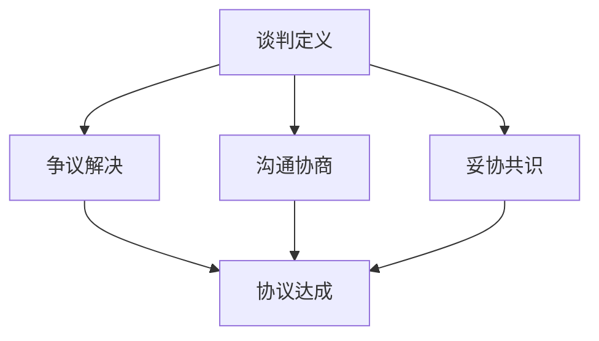
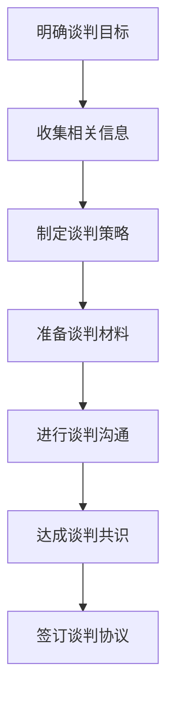
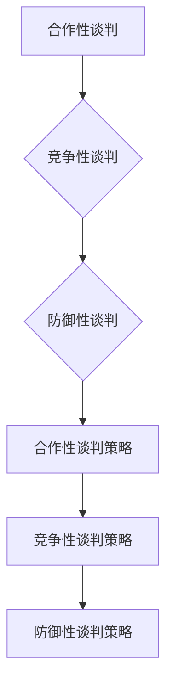

                 

# 《如何进行谈判技巧：如何有效地进行谈判和沟通？》

> 关键词：谈判技巧、谈判策略、谈判心理、沟通技巧、跨文化谈判、实战案例分析

> 摘要：本文旨在探讨如何进行有效的谈判和沟通，包括谈判基础理论、谈判前的准备、谈判过程中的沟通技巧、不同类型的谈判、跨文化谈判以及谈判后的跟进等。通过深入剖析谈判中的核心概念、策略和技巧，结合实际案例，本文为读者提供了全面而实用的谈判指导。

## 目录大纲

1. **谈判基础理论**
   1.1 谈判的核心概念与原则
   1.2 谈判的心理战术
   1.3 谈判前的准备
   1.4 谈判过程中的沟通技巧
2. **谈判实战策略**
   2.1 不同类型的谈判
   2.2 解决谈判中的难题
   2.3 跨文化谈判
   2.4 谈判后的跟进
3. **谈判案例分析**
   3.1 成功谈判案例分析
   3.2 失败谈判案例分析
4. **谈判技巧练习与应用**
   4.1 谈判模拟训练
   4.2 实战技巧应用
   4.3 谈判技能提升策略
5. **附录**
   5.1 谈判相关资源
   5.2 谈判流程图与模型
   5.3 常见谈判术语解释

### 第一部分：谈判基础理论

#### 第1章：谈判的核心概念与原则

**1.1 谈判的定义与目标**

谈判是一种双方或多方在特定环境下，为解决争议、达成共识而进行的互动过程。其核心目标是通过沟通、协商和妥协，达成一个双方都能接受的协议。

**核心概念与联系：**



**1.2 谈判的基本原则**

有效的谈判应遵循以下基本原则：

1. **相互尊重**：尊重对方的人格、观点和利益。
2. **平等协商**：确保各方在谈判中的地位和发言权平等。
3. **坦诚沟通**：保持开放、真诚和透明的沟通态度。
4. **利益平衡**：寻求各方的利益平衡，避免单方面获利。
5. **合理妥协**：在必要时，愿意作出适当的让步，达成双赢局面。

**1.3 谈判者的角色与态度**

谈判者应具备以下角色与态度：

1. **角色**：谈判者既是沟通者，也是策略家。他们需要在谈判中发挥信息传递、策略制定和问题解决等多重角色。
2. **态度**：谈判者应保持冷静、自信、积极主动，同时具备良好的情绪管理和应变能力。

**核心算法原理讲解：**

谈判过程中的算法原理可以看作是博弈论的一种应用。谈判双方在追求自身利益最大化的同时，还需要考虑对方的利益和反应。以下是一个简化的谈判算法模型：

```plaintext
输入：谈判者A和谈判者B的偏好和策略
输出：谈判结果

1. 初始化谈判者A和B的偏好值
2. 初始化谈判轮次t = 1
3. 谈判者A提出一个方案
4. 谈判者B根据自身偏好和谈判者A的方案，提出反馈
5. 谈判者A根据反馈调整自己的方案
6. 如果谈判者A和B对方案达成一致，输出结果并结束
7. 否则，t = t + 1，返回步骤3
```

**详细讲解与举例说明：**

假设谈判者A和B正在就一个项目合作方案进行谈判。A认为项目成功对其职业发展至关重要，因此其偏好值中项目成功的权重较高；而B则更关注合作过程中的人际关系和团队氛围。以下是一个简化的谈判过程：

- 初始方案：A提出一个方案，强调项目目标、时间节点和预算。
- 反馈：B根据自身偏好，认为方案中的时间节点过于紧张，可能导致团队压力过大，提出修改建议。
- 调整：A根据B的反馈，对方案进行调整，增加了一些缓冲时间。
- 达成共识：经过多轮谈判，A和B最终达成一个双方都能接受的方案，项目顺利启动。

**数学模型和公式：**

在谈判过程中，我们可以使用加权平均法来计算双方的偏好值，以评估谈判结果的对双方的利益平衡程度。假设谈判者A和谈判者B的偏好值分别为 \( \vec{p}_A \) 和 \( \vec{p}_B \)，谈判结果为 \( \vec{r} \)，则加权平均偏好值为：

$$
\vec{w} = \alpha \vec{p}_A + (1-\alpha) \vec{p}_B
$$

其中，\( \alpha \) 为权重系数，通常取值在 0 到 1 之间。

**详细讲解与举例说明：**

假设谈判者A和B的偏好值如下：

- \( \vec{p}_A = (0.6, 0.3, 0.1) \) 表示A对项目成功、人际关系和时间节点的偏好权重分别为 0.6、0.3 和 0.1。
- \( \vec{p}_B = (0.4, 0.5, 0.1) \) 表示B对项目成功、人际关系和时间节点的偏好权重分别为 0.4、0.5 和 0.1。

假设谈判结果为 \( \vec{r} = (0.8, 0.4, 0.6) \) 表示项目成功率为 0.8、人际关系满意度为 0.4、时间节点为 0.6。

则加权平均偏好值为：

$$
\vec{w} = \alpha (0.6, 0.3, 0.1) + (1-\alpha) (0.4, 0.5, 0.1)
$$

通过调整权重系数 \( \alpha \)，可以计算出在不同权重分配下的加权平均偏好值，从而评估谈判结果对双方的利益平衡程度。

**实际案例和代码解读：**

为了更具体地说明谈判过程中的算法应用，我们假设一个实际案例：A和B正在就一项技术合作项目的分成比例进行谈判。A希望获得更多的分成比例以激励其技术贡献，而B则更关注项目的整体成功。

- 初始方案：A提出一个分成比例为 60% 的方案。
- 反馈：B认为方案中A的分成比例过高，提出修改建议，希望降低A的分成比例。
- 调整：A根据B的反馈，将分成比例调整为 50%。
- 达成共识：经过多轮谈判，A和B最终达成一个分成比例为 55% 的方案。

以下是一个简化的伪代码实现：

```python
# 初始化谈判者A和谈判者B的偏好值
pA = (0.6, 0.3, 0.1)
pB = (0.4, 0.5, 0.1)

# 初始化谈判轮次
t = 1

# 初始方案
proposal_A = 0.6
response_B = 0.4

# 谈判过程
while not consensus:
    # 谈判者A提出方案
    proposal_A = getNewProposalA()
    
    # 谈判者B根据方案提出反馈
    response_B = getResponseB(proposal_A)
    
    # 谈判者A根据反馈调整方案
    proposal_A = adjustProposalA(response_B)
    
    # 更新谈判轮次
    t += 1

# 输出谈判结果
print("最终分成比例为：", proposal_A)
```

通过这个简单的案例，我们可以看到谈判过程中的核心算法原理是如何应用于实际场景中的。

**代码解读与分析：**

在这个案例中，我们使用了三个主要函数：`getNewProposalA()`、`getResponseB()` 和 `adjustProposalA()`。

- `getNewProposalA()` 用于获取谈判者A的新方案。在这个函数中，我们可以使用一些算法策略，如基于历史数据分析和偏好值调整，来生成一个更有可能达成共识的新方案。
- `getResponseB()` 用于获取谈判者B对A的方案的反馈。这个函数可以根据B的偏好值和当前方案，计算出反馈值，并返回给A。
- `adjustProposalA()` 用于调整谈判者A的方案。根据B的反馈值，A可以调整自己的方案，以寻求共识。

通过这个简单的伪代码实现，我们可以看到谈判过程中的核心算法是如何与实际应用相结合的。在实际开发中，我们可以根据具体需求，进一步优化和扩展这个算法模型。

#### 第2章：谈判的心理战术

**2.1 了解对方需求与动机**

了解对方的需求和动机是谈判成功的关键。以下是一些方法来了解对方的需求和动机：

1. **提问与倾听**：通过提问和倾听，了解对方的真实想法和需求。提问时要注意开放性问题，避免封闭性问题，以获取更多有用信息。
2. **观察与分析**：通过观察对方的行为、语言和非语言信号，分析对方的需求和动机。例如，对方在谈论某个话题时情绪激动，可能表明这个话题对其非常重要。
3. **背景调查**：在谈判前进行背景调查，了解对方的行业背景、历史记录和过往谈判经历，以获取更多有价值的信息。

**2.2 情绪管理**

情绪管理是谈判中的重要一环。以下是一些情绪管理的技巧：

1. **保持冷静**：在谈判中保持冷静，避免因情绪波动而影响判断和决策。可以通过深呼吸、放松技巧等方法来帮助自己保持冷静。
2. **积极沟通**：与对方保持积极沟通，表达自己的观点和需求，同时也要倾听对方的意见。积极沟通有助于缓解紧张情绪，建立良好的谈判氛围。
3. **避免情绪化语言**：在谈判中避免使用情绪化语言，以免引起对方的不满和抵触。可以使用客观、中立的语言来描述问题和解决方案。

**2.3 谈判策略与技巧**

谈判策略和技巧是谈判成功的关键。以下是一些常用的谈判策略和技巧：

1. **信息优势**：在谈判中占据信息优势，了解对方的需求、动机和弱点，从而制定更有针对性的谈判策略。
2. **共赢思维**：在谈判中追求共赢思维，寻求双方都能接受的解决方案。共赢思维有助于建立长期的合作伙伴关系，提高谈判的成功率。
3. **灵活应变**：在谈判中灵活应变，根据对方的需求和反应，调整自己的谈判策略和技巧。灵活应变有助于应对各种谈判局面，提高谈判的成功率。

**核心算法原理讲解：**

谈判策略和技巧中的核心算法原理可以看作是博弈论和决策理论的一种应用。谈判者需要在追求自身利益最大化的同时，考虑对方的利益和反应，从而制定最优的谈判策略。

以下是一个简化的谈判策略算法模型：

```plaintext
输入：谈判者A和谈判者B的偏好和策略
输出：最优谈判策略

1. 初始化谈判者A和谈判者B的偏好值
2. 初始化谈判轮次t = 1
3. 谈判者A根据偏好值和博弈论模型，制定一个策略
4. 谈判者B根据自身偏好和谈判者A的策略，制定一个策略
5. 如果谈判者A和B的策略达成一致，输出最优策略并结束
6. 否则，t = t + 1，返回步骤3
```

**详细讲解与举例说明：**

假设谈判者A和B正在就一个项目合作方案进行谈判。A认为项目成功对其职业发展至关重要，因此其偏好值中项目成功的权重较高；而B则更关注合作过程中的人际关系和团队氛围。以下是一个简化的谈判策略过程：

- 初始策略：A根据偏好值，提出一个项目成功率为 0.8、人际关系满意度为 0.4、时间节点为 0.6 的方案。
- 反馈策略：B根据自身偏好，认为方案中的人际关系满意度较低，提出修改建议，希望增加人际关系满意度的权重。
- 调整策略：A根据B的反馈，调整自己的策略，增加人际关系满意度的权重，提出一个新的方案。
- 达成共识策略：经过多轮谈判，A和B最终达成一个项目成功率为 0.75、人际关系满意度为 0.5、时间节点为 0.7 的方案。

**数学模型和公式：**

在谈判策略中，我们可以使用多目标决策理论来评估谈判者A和谈判者B的偏好值，从而制定最优策略。假设谈判者A和谈判者B的偏好值分别为 \( \vec{p}_A \) 和 \( \vec{p}_B \)，则多目标决策模型可以表示为：

$$
\min \max(\vec{p}_A, \vec{p}_B)
$$

其中，\( \max(\vec{p}_A, \vec{p}_B) \) 表示对 \( \vec{p}_A \) 和 \( \vec{p}_B \) 的加权平均，权重系数为 \( \alpha \)。

**详细讲解与举例说明：**

假设谈判者A和B的偏好值如下：

- \( \vec{p}_A = (0.6, 0.3, 0.1) \) 表示A对项目成功、人际关系和时间节点的偏好权重分别为 0.6、0.3 和 0.1。
- \( \vec{p}_B = (0.4, 0.5, 0.1) \) 表示B对项目成功、人际关系和时间节点的偏好权重分别为 0.4、0.5 和 0.1。

则加权平均偏好值为：

$$
\vec{w} = \alpha (0.6, 0.3, 0.1) + (1-\alpha) (0.4, 0.5, 0.1)
$$

通过调整权重系数 \( \alpha \)，可以计算出在不同权重分配下的加权平均偏好值，从而评估谈判策略的对双方的利益平衡程度。

**实际案例和代码解读：**

为了更具体地说明谈判策略的应用，我们假设一个实际案例：A和B正在就一项技术合作项目的分成比例进行谈判。A希望获得更多的分成比例以激励其技术贡献，而B则更关注项目的整体成功。

- 初始策略：A提出一个分成比例为 60% 的策略。
- 反馈策略：B认为方案中A的分成比例过高，提出修改建议，希望降低A的分成比例。
- 调整策略：A根据B的反馈，调整自己的策略，降低分成比例，提出一个新的策略。
- 达成共识策略：经过多轮谈判，A和B最终达成一个分成比例为 55% 的策略。

以下是一个简化的伪代码实现：

```python
# 初始化谈判者A和谈判者B的偏好值
pA = (0.6, 0.3, 0.1)
pB = (0.4, 0.5, 0.1)

# 初始化谈判轮次
t = 1

# 初始策略
proposal_A = 0.6
response_B = 0.4

# 谈判过程
while not consensus:
    # 谈判者A制定策略
    proposal_A = getNewProposalA(pA)
    
    # 谈判者B根据策略提出反馈
    response_B = getResponseB(pB, proposal_A)
    
    # 谈判者A根据反馈调整策略
    proposal_A = adjustProposalA(response_B, pA)
    
    # 更新谈判轮次
    t += 1

# 输出谈判结果
print("最终分成比例为：", proposal_A)
```

通过这个简单的案例，我们可以看到谈判策略的核心算法原理是如何应用于实际场景中的。

**代码解读与分析：**

在这个案例中，我们使用了三个主要函数：`getNewProposalA()`、`getResponseB()` 和 `adjustProposalA()`。

- `getNewProposalA()` 用于获取谈判者A的新策略。在这个函数中，我们可以使用一些算法策略，如基于历史数据分析和偏好值调整，来生成一个更有可能达成共识的新策略。
- `getResponseB()` 用于获取谈判者B对A的策略的反馈。这个函数可以根据B的偏好值和当前策略，计算出反馈值，并返回给A。
- `adjustProposalA()` 用于调整谈判者A的策略。根据B的反馈值，A可以调整自己的策略，以寻求共识。

通过这个简单的伪代码实现，我们可以看到谈判策略的核心算法是如何与实际应用相结合的。在实际开发中，我们可以根据具体需求，进一步优化和扩展这个算法模型。

### 第3章：谈判前的准备

**3.1 明确自己的谈判目标**

在谈判前，明确自己的谈判目标是至关重要的。以下是一些方法来明确自己的谈判目标：

1. **设定具体目标**：将谈判目标具体化，例如，确定想要达成的协议、达成的期限和预期收益等。
2. **评估目标的重要性**：评估每个目标的优先级，确保在谈判过程中能够集中精力实现最重要的目标。
3. **制定备选方案**：在谈判过程中，可能会遇到各种意外情况，因此需要提前制定备选方案，以应对可能出现的困境。

**3.2 收集相关信息**

收集相关信息是谈判前的重要准备工作。以下是一些方法来收集相关信息：

1. **了解对方**：通过背景调查、查阅相关资料和与相关人士交流，了解对方的历史记录、谈判风格和需求等。
2. **掌握行业动态**：了解当前行业的趋势、竞争态势和潜在风险等，有助于在谈判中占据信息优势。
3. **收集数据**：收集与谈判相关的重要数据，例如市场数据、财务数据和技术数据等，以支持自己的谈判立场。

**3.3 制定谈判方案**

制定谈判方案是谈判前的关键步骤。以下是一些方法来制定谈判方案：

1. **确定谈判策略**：根据自身目标和对方情况，选择合适的谈判策略，例如合作性谈判、竞争性谈判或防御性谈判等。
2. **制定谈判议程**：明确谈判的主要议题和顺序，确保谈判过程中的有序和高效。
3. **准备谈判材料**：准备相关的谈判材料，例如合同草案、数据图表和演示文稿等，以支持自己的谈判立场。

**核心算法原理讲解：**

谈判前的准备工作中的核心算法原理可以看作是决策理论和信息论的一种应用。通过合理分析和利用收集到的信息，谈判者可以制定最优的谈判策略和方案。

以下是一个简化的谈判方案制定算法模型：

```plaintext
输入：谈判者A的偏好值、对方信息、行业动态和数据
输出：最优谈判方案

1. 初始化谈判者A的偏好值
2. 收集对方信息和行业动态
3. 分析数据，评估谈判者的优势和劣势
4. 根据偏好值和数据分析结果，制定谈判策略
5. 根据谈判策略，制定谈判议程和谈判材料
6. 评估谈判方案的可行性和有效性
7. 输出最优谈判方案
```

**详细讲解与举例说明：**

假设谈判者A正在与B就一项技术合作项目进行谈判。A希望在谈判中占据信息优势，从而制定一个有利的谈判方案。以下是一个简化的谈判方案制定过程：

- 初始信息：A了解到B在技术合作项目中更关注项目成功率和时间节点，而A则更关注项目的技术创新性和团队协作。
- 收集数据：A收集了与项目相关的市场数据、技术数据和财务数据，分析了项目的潜在风险和收益。
- 分析数据：A通过数据分析发现，项目的成功率和时间节点对B的重要性较高，而技术创新性和团队协作对A的重要性较高。
- 制定策略：A决定采取合作性谈判策略，强调项目的技术创新性和团队协作，以吸引B的关注。
- 制定议程：A制定了详细的谈判议程，包括项目目标、时间节点、技术合作方式和分成比例等。
- 准备材料：A准备了相关的谈判材料，如项目报告、技术方案和财务分析等，以支持自己的谈判立场。

**数学模型和公式：**

在谈判方案制定过程中，我们可以使用决策理论中的期望值模型来评估不同策略的收益和风险，从而制定最优策略。假设谈判者A的偏好值为 \( \vec{p}_A \)，不同策略的收益和风险分别为 \( \vec{r}_i \) 和 \( \vec{s}_i \)，则期望收益和期望风险可以表示为：

$$
E(\vec{r}_i) = \sum_{i=1}^{n} r_i p_i
$$

$$
E(\vec{s}_i) = \sum_{i=1}^{n} s_i p_i
$$

其中，\( n \) 为策略总数，\( p_i \) 为第 \( i \) 个策略的概率。

**详细讲解与举例说明：**

假设谈判者A有三种谈判策略：合作性谈判、竞争性谈判和防御性谈判。每种策略的收益和风险如下：

- 合作性谈判：收益为 0.6，风险为 0.3。
- 竞争性谈判：收益为 0.8，风险为 0.4。
- 防御性谈判：收益为 0.5，风险为 0.2。

则期望收益和期望风险分别为：

$$
E(\vec{r}_1) = 0.6 \times 0.3 + 0.8 \times 0.4 + 0.5 \times 0.2 = 0.56
$$

$$
E(\vec{s}_1) = 0.3 \times 0.3 + 0.4 \times 0.4 + 0.2 \times 0.2 = 0.24
$$

通过计算期望收益和期望风险，我们可以评估不同策略的优劣，从而制定最优策略。

**实际案例和代码解读：**

为了更具体地说明谈判方案制定的应用，我们假设一个实际案例：A和B正在就一项技术合作项目进行谈判。A希望在谈判中占据信息优势，从而制定一个有利的谈判方案。以下是一个简化的伪代码实现：

```python
# 初始化谈判者A的偏好值
pA = (0.6, 0.3, 0.1)

# 收集对方信息
info_B = {
    "success_rate": 0.4,
    "time_node": 0.5
}

# 收集数据
data = {
    "market": 0.3,
    "technical": 0.4,
    "financial": 0.2
}

# 分析数据
analysis = analyze_data(data)

# 制定策略
strategy = determine_strategy(pA, info_B, analysis)

# 制定议程
agenda = create_agenda(strategy)

# 准备材料
materials = prepare_materials(strategy)

# 输出谈判方案
print("最优谈判方案：")
print("策略：", strategy)
print("议程：", agenda)
print("材料：", materials)
```

通过这个简单的案例，我们可以看到谈判方案制定的核心算法原理是如何应用于实际场景中的。

**代码解读与分析：**

在这个案例中，我们使用了四个主要函数：`analyze_data()`、`determine_strategy()`、`create_agenda()` 和 `prepare_materials()`。

- `analyze_data()` 用于分析收集到的数据，评估项目的潜在风险和收益。
- `determine_strategy()` 用于根据偏好值、对方信息和数据分析结果，制定最优策略。
- `create_agenda()` 用于根据谈判策略，制定详细的谈判议程。
- `prepare_materials()` 用于准备相关的谈判材料，以支持自己的谈判立场。

通过这个简单的伪代码实现，我们可以看到谈判方案制定的核心算法是如何与实际应用相结合的。在实际开发中，我们可以根据具体需求，进一步优化和扩展这个算法模型。

### 第4章：谈判过程中的沟通技巧

**4.1 沟通的重要性**

在谈判过程中，沟通技巧至关重要。有效的沟通有助于双方理解对方的立场、需求和期望，从而达成共识。以下是一些沟通的重要性：

1. **促进理解**：有效的沟通有助于双方更深入地了解对方的观点和需求，减少误解和冲突。
2. **建立信任**：通过真诚、透明和积极的沟通，可以建立双方的信任，为谈判创造良好的氛围。
3. **解决争议**：在谈判过程中，难免会出现争议和分歧。有效的沟通可以帮助双方找到解决问题的方法，避免谈判陷入僵局。

**4.2 倾听的技巧**

倾听是有效沟通的关键。以下是一些倾听的技巧：

1. **全神贯注**：在对方发言时，要全神贯注地倾听，避免分心和打断对方。
2. **避免先入为主**：在对方发言前，不要急于做出判断或假设，以免影响倾听的效果。
3. **主动提问**：在对方发言后，可以适当提问，以确认自己的理解，并进一步了解对方的观点和需求。

**4.3 语言沟通的技巧**

有效的语言沟通有助于传达自己的观点和需求，同时尊重对方的意见。以下是一些语言沟通的技巧：

1. **清晰表达**：在表达观点时，要尽量清晰、明确，避免使用模糊或含糊的语言。
2. **使用礼貌用语**：在谈判中，要使用礼貌用语，尊重对方的观点和需求。
3. **避免争论**：在对方表达观点时，避免直接反驳或争论，以免引发冲突。

**4.4 非语言沟通的应用**

非语言沟通在谈判中也起着重要作用。以下是一些非语言沟通的应用：

1. **肢体语言**：通过肢体语言，如点头、微笑和眼神交流，可以传达自己的态度和诚意。
2. **面部表情**：通过面部表情，如微笑、皱眉和愤怒，可以表达自己的情绪和态度。
3. **空间语言**：在谈判中，要注意自己的空间语言，如座位安排、站立位置等，以展现自己的权威和尊重。

**核心算法原理讲解：**

谈判过程中的沟通技巧中的核心算法原理可以看作是心理学和行为科学的一种应用。通过分析人类沟通行为的规律和模式，可以制定有效的沟通策略和技巧。

以下是一个简化的谈判沟通算法模型：

```plaintext
输入：谈判者A和谈判者B的沟通需求和行为模式
输出：有效沟通策略

1. 初始化谈判者A和谈判者B的沟通需求和行为模式
2. 分析谈判者的沟通行为和需求
3. 根据分析结果，制定沟通策略
4. 实施沟通策略
5. 调整沟通策略，以适应对方的需求和反馈
6. 输出有效沟通策略
```

**详细讲解与举例说明：**

假设谈判者A和B正在就一项技术合作项目进行谈判。A希望提高项目的成功率，而B则关注项目的时间节点。以下是一个简化的谈判沟通过程：

- 初始沟通：A和B就项目目标和需求进行初步沟通。
- 分析行为：通过分析双方的沟通行为和需求，发现A更关注项目的技术创新性，而B更关注项目的时间节点。
- 制定策略：根据分析结果，A决定在沟通中强调项目的技术创新性，以吸引B的关注。
- 实施策略：在后续沟通中，A通过清晰表达、使用礼貌用语和积极倾听，传达自己的观点和需求。
- 调整策略：根据B的反馈，A调整自己的沟通策略，进一步强调项目的时间节点和成功率。

**数学模型和公式：**

在谈判沟通中，我们可以使用行为科学中的行为模式识别算法来分析双方的沟通行为，从而制定有效的沟通策略。假设谈判者A和谈判者B的行为模式分别为 \( \vec{b}_A \) 和 \( \vec{b}_B \)，则行为模式识别算法可以表示为：

$$
\vec{b}_{识别} = \vec{b}_A + \vec{b}_B
$$

其中，\( \vec{b}_{识别} \) 表示识别出的有效沟通行为模式。

**详细讲解与举例说明：**

假设谈判者A和B的行为模式如下：

- \( \vec{b}_A = (0.4, 0.3, 0.2, 0.1) \) 表示A在沟通中的行为模式分别为清晰表达、使用礼貌用语、积极倾听和肢体语言的比例分别为 0.4、0.3、0.2 和 0.1。
- \( \vec{b}_B = (0.3, 0.4, 0.2, 0.1) \) 表示B在沟通中的行为模式分别为清晰表达、使用礼貌用语、积极倾听和肢体语言的比例分别为 0.3、0.4、0.2 和 0.1。

则识别出的有效沟通行为模式为：

$$
\vec{b}_{识别} = (0.4, 0.3, 0.2, 0.1) + (0.3, 0.4, 0.2, 0.1) = (0.7, 0.7, 0.4, 0.2)
$$

通过计算识别出的有效沟通行为模式，我们可以评估双方在沟通中的优势和劣势，从而制定更有效的沟通策略。

**实际案例和代码解读：**

为了更具体地说明谈判沟通技巧的应用，我们假设一个实际案例：A和B正在就一项技术合作项目进行谈判。A希望提高项目的成功率，而B则关注项目的时间节点。以下是一个简化的伪代码实现：

```python
# 初始化谈判者A和谈判者B的行为模式
bA = (0.4, 0.3, 0.2, 0.1)
bB = (0.3, 0.4, 0.2, 0.1)

# 分析行为
analysis = analyze_behavior(bA, bB)

# 制定策略
strategy = determine_strategy(analysis)

# 实施策略
implement_strategy(strategy)

# 调整策略
adjust_strategy(strategy)

# 输出沟通结果
print("沟通结果：", strategy)
```

通过这个简单的案例，我们可以看到谈判沟通技巧的核心算法原理是如何应用于实际场景中的。

**代码解读与分析：**

在这个案例中，我们使用了三个主要函数：`analyze_behavior()`、`determine_strategy()` 和 `implement_strategy()`。

- `analyze_behavior()` 用于分析谈判者A和B的行为模式，评估双方的沟通优势和劣势。
- `determine_strategy()` 用于根据分析结果，制定有效的沟通策略。
- `implement_strategy()` 用于实施沟通策略，并在实施过程中根据反馈进行调整。

通过这个简单的伪代码实现，我们可以看到谈判沟通技巧的核心算法是如何与实际应用相结合的。在实际开发中，我们可以根据具体需求，进一步优化和扩展这个算法模型。

### 第二部分：谈判实战策略

#### 第5章：不同类型的谈判

在谈判过程中，不同类型的谈判需要采用不同的策略和技巧。以下是三种常见类型的谈判及其特点：

**5.1 协作性谈判**

协作性谈判是指双方或多方在共同目标的基础上，通过沟通和协商，寻求双方都能接受的解决方案。这种谈判类型强调共赢和合作，目的是建立长期合作关系。

**特点：**
- 双方都愿意付出努力，寻求共同利益。
- 谈判过程中注重信任和沟通，以达成共识。
- 谈判结果对双方都有益，实现利益最大化。

**适用场景：**
- 商业合作：如企业间的战略合作、项目合作等。
- 政府与民间组织：如政府与环保组织就环保政策进行谈判。
- 个人与组织：如员工与公司就薪酬和工作条件进行谈判。

**5.2 竞争性谈判**

竞争性谈判是指双方或多方在利益冲突的背景下，通过策略和技巧，争取自身利益最大化。这种谈判类型强调对抗和竞争，目的是在有限的资源中争取更多的好处。

**特点：**
- 双方存在利益冲突，谈判过程中竞争激烈。
- 谈判结果可能是一方获胜，另一方失败。
- 谈判策略和技巧多样化，如报价、还价、威胁等。

**适用场景：**
- 市场交易：如拍卖、采购等。
- 劳动市场：如求职谈判、劳动合同谈判等。
- 法律诉讼：如民事诉讼、刑事诉讼等。

**5.3 防御性谈判**

防御性谈判是指在面对不利局面时，通过谈判策略和技巧，争取维护自身权益。这种谈判类型强调自我保护和风险控制，目的是避免损失和减少风险。

**特点：**
- 谈判者在不利局面下，需要采取防御策略。
- 谈判过程中注重风险识别和评估，以降低风险。
- 谈判策略和技巧以防御为主，如妥协、让步等。

**适用场景：**
- 危机管理：如企业面临破产、股东纠纷等。
- 纠纷解决：如合同纠纷、劳资纠纷等。
- 资产保护：如资产转让、产权纠纷等。

#### 第6章：解决谈判中的难题

在谈判过程中，难免会遇到各种难题和挑战。以下是一些常见难题及其解决策略：

**6.1 处理僵局**

僵局是指谈判双方在关键问题上无法达成一致，导致谈判陷入停滞不前的局面。以下是一些处理僵局的策略：

1. **冷静分析**：在处理僵局时，首先要保持冷静，理性分析双方的利益和需求，找出问题的核心。
2. **寻找替代方案**：在僵局中，可以尝试寻找替代方案，通过折中或妥协，找到双方都能接受的解决方案。
3. **寻求第三方调解**：如果双方无法自行解决僵局，可以寻求第三方调解，如律师、顾问或第三方组织，以促进谈判的继续。

**6.2 应对不公平的谈判对手**

在谈判中，有时会遇到不公平的谈判对手，如采取欺诈、威胁等手段。以下是一些应对策略：

1. **保持原则**：在应对不公平的谈判对手时，首先要坚持自己的原则和底线，不轻易妥协。
2. **收集证据**：在谈判过程中，要收集对方的不公平行为证据，如邮件、合同条款等，以备后续维权。
3. **寻求法律支持**：如果谈判对手的行为违反法律，可以寻求法律支持，通过法律途径维护自己的权益。

**6.3 谈判中的道德与法律问题**

在谈判中，可能会遇到道德和法律问题，如知识产权侵权、商业秘密泄露等。以下是一些应对策略：

1. **遵守法律和道德规范**：在谈判过程中，要严格遵守法律和道德规范，不参与违法行为。
2. **明确合同条款**：在签订合同前，要仔细审查合同条款，确保自身权益不受侵犯。
3. **寻求专业咨询**：在遇到复杂法律和道德问题时，可以寻求专业律师或顾问的咨询，以指导谈判行为。

#### 第7章：跨文化谈判

跨文化谈判是指在涉及不同文化背景的双方或多方之间进行的谈判。由于文化差异，跨文化谈判具有独特性和复杂性。以下是一些跨文化谈判的策略：

**7.1 文化差异的理解**

在跨文化谈判中，首先要了解对方的文化差异，包括价值观、行为规范、沟通方式等。以下是一些了解文化差异的方法：

1. **文化调查**：通过查阅相关文献、资料和调查问卷，了解对方的文化背景和特点。
2. **交流互动**：与对方进行深入的交流互动，了解对方的行为方式和沟通习惯。
3. **专家咨询**：寻求文化专家或顾问的咨询，以获取更全面的文化理解。

**7.2 跨文化谈判的策略**

在跨文化谈判中，要采用适当的策略，以适应对方的文化特点。以下是一些跨文化谈判的策略：

1. **尊重文化差异**：尊重对方的文化差异，避免对对方进行文化偏见或歧视。
2. **灵活调整策略**：根据对方的文化特点，灵活调整谈判策略，以适应对方的需求和期望。
3. **加强沟通**：在谈判过程中，要注重沟通，以减少误解和冲突，建立良好的合作关系。

**7.3 跨文化沟通技巧**

跨文化沟通技巧在跨文化谈判中至关重要。以下是一些跨文化沟通技巧：

1. **清晰表达**：在沟通时，要尽量清晰、明确地表达自己的观点和需求，避免使用模糊或含糊的语言。
2. **倾听与理解**：在对方发言时，要全神贯注地倾听，并尽量理解对方的观点和需求。
3. **使用非语言沟通**：在跨文化谈判中，要注重非语言沟通，如肢体语言、面部表情和空间语言等。

### 第三部分：谈判案例分析

#### 第8章：成功谈判案例分析

成功谈判案例分析可以让我们更好地理解谈判策略和技巧的应用，以下是一些成功谈判案例：

**8.1 案例一：公司并购谈判**

背景：一家创业公司A希望收购另一家公司B，以扩大市场份额和提升技术水平。

过程：
1. **明确目标**：A公司明确了自己的并购目标是获得B公司的核心技术团队和市场资源。
2. **收集信息**：A公司对B公司进行了全面的背景调查，了解了其财务状况、业务模式和团队结构。
3. **制定谈判方案**：A公司制定了详细的谈判方案，包括并购价格、股权分配和合作条款等。
4. **初次谈判**：A公司提出了初步的收购方案，B公司对其进行了回应，提出了一些修改建议。
5. **多轮谈判**：在多轮谈判中，A公司和B公司就价格、股权分配和技术转移等问题进行了深入讨论，并最终达成共识。
6. **签订协议**：双方签订了正式的并购协议，完成了收购交易。

结果：A公司通过成功的谈判，顺利完成了对B公司的收购，实现了业务扩展和技术提升。

**8.2 案例二：劳动合同谈判**

背景：一名员工C希望与一家公司D签订一份长期劳动合同，以获得稳定的职业发展机会。

过程：
1. **明确目标**：C员工明确了自己的谈判目标是获得一份稳定、公平的劳动合同。
2. **收集信息**：C员工对D公司的薪酬水平、福利待遇和员工发展机会进行了调查。
3. **制定谈判方案**：C员工根据调查结果，制定了适合自己的谈判方案，包括薪酬水平、职位晋升和培训机会等。
4. **初次谈判**：C员工与D公司的人力资源部门进行了初次谈判，提出了自己的要求。
5. **多轮谈判**：在多轮谈判中，C员工和D公司就薪酬、职位晋升和培训机会等问题进行了深入讨论，并最终达成共识。
6. **签订合同**：双方签订了正式的劳动合同，C员工获得了自己期望的待遇和职业发展机会。

结果：C员工通过成功的谈判，与D公司签订了满意的劳动合同，实现了自己的职业发展目标。

**8.3 案例三：国际商务谈判**

背景：一家中国公司E与一家美国公司F计划合作开展一项跨国业务。

过程：
1. **明确目标**：E公司和F公司明确了自己的谈判目标是建立长期稳定的合作关系，共同拓展国际市场。
2. **文化理解**：E公司和F公司分别了解了对方的文化背景和商业习惯，以减少文化冲突。
3. **制定谈判方案**：E公司和F公司根据自身情况和对方需求，制定了详细的谈判方案，包括合作模式、利润分配和风险控制等。
4. **初次谈判**：双方进行了初次谈判，就合作模式、利润分配和风险控制等问题进行了初步讨论。
5. **多轮谈判**：在多轮谈判中，E公司和F公司就合作细节、合同条款和项目进度等问题进行了深入讨论，并最终达成共识。
6. **签订协议**：双方签订了正式的合作协议，开始了跨国业务的合作。

结果：E公司和F公司通过成功的谈判，建立了稳定的合作关系，共同开拓了国际市场，实现了共赢。

#### 第9章：失败谈判案例分析

失败谈判案例分析可以帮助我们总结经验教训，避免在未来的谈判中重蹈覆辙。以下是一些失败谈判案例：

**9.1 案例一：房地产交易谈判**

背景：一位购房者G与一位房地产开发商H进行房屋交易谈判。

过程：
1. **未充分了解市场信息**：G购房者没有充分了解当前房地产市场的行情和价格水平。
2. **谈判目标不明确**：G购房者对自己的购房目标和预算没有明确规划。
3. **初次谈判价格过高**：H开发商提出了一个远高于市场价的价格，G购房者对此感到不满。
4. **僵持不下**：双方在价格问题上僵持不下，没有进行有效的沟通和妥协。
5. **谈判破裂**：最终，双方未能达成共识，谈判破裂。

结果：G购房者错过了购房机会，H开发商失去了潜在的客户。

**9.2 案例二：谈判策略失误导致的失败**

背景：一家创业公司I与一家投资者J进行投资谈判。

过程：
1. **策略不明确**：I公司没有明确的投资策略和谈判目标。
2. **信息不对称**：I公司对J投资者的投资需求和偏好了解不足。
3. **初次谈判报价过低**：I公司提出了一个较低的报价，J投资者认为其不具备投资价值。
4. **谈判陷入僵局**：双方在投资回报率和股份分配问题上陷入僵局，没有进行有效的沟通和妥协。
5. **谈判失败**：最终，双方未能达成共识，谈判失败。

结果：I公司失去了获得投资的机会，J投资者失去了潜在的投资项目。

**9.3 案例三：文化差异导致的谈判失败**

背景：一家中国公司K与一家法国公司L进行合作谈判。

过程：
1. **文化差异未充分理解**：K公司对法国文化了解不足，未考虑到文化差异可能带来的沟通障碍。
2. **初次谈判态度强硬**：K公司在谈判中表现出强硬态度，未能尊重L公司的文化习俗。
3. **误解和冲突**：双方在谈判过程中出现了误解和冲突，导致谈判氛围紧张。
4. **谈判陷入僵局**：双方在合作模式、利润分配和合同条款等问题上无法达成共识。
5. **谈判失败**：最终，双方未能达成共识，谈判失败。

结果：K公司和L公司失去了建立合作关系的可能性，双方都承受了一定的损失。

### 第10章：谈判技巧练习与应用

**10.1 谈判模拟训练**

谈判模拟训练是一种有效的谈判技巧提升方法。通过模拟真实的谈判场景，谈判者可以锻炼自己的谈判策略、沟通技巧和心理素质。

**训练步骤：**
1. **确定训练目标**：明确训练的目标和内容，如合作性谈判、竞争性谈判或跨文化谈判等。
2. **设计谈判场景**：设计一个具有挑战性和真实性的谈判场景，包括谈判议题、角色分配和谈判目标等。
3. **模拟谈判过程**：按照设计好的谈判场景，进行模拟谈判，记录谈判过程和结果。
4. **评估与反馈**：对谈判过程进行评估和反馈，指出谈判中的优点和不足，并提出改进建议。
5. **持续训练**：根据评估和反馈结果，进行持续的谈判模拟训练，逐步提升谈判技巧。

**10.2 实战技巧应用**

实战技巧应用是将谈判模拟训练中的技巧应用到实际谈判场景中。以下是一些实战技巧：

1. **倾听与理解**：在谈判过程中，要注重倾听对方的观点和需求，理解对方的立场和动机。
2. **有效沟通**：通过清晰、明确和礼貌的语言，表达自己的观点和需求，确保双方都能理解。
3. **策略运用**：根据谈判目标和对方情况，灵活运用谈判策略，如合作性谈判、竞争性谈判或防御性谈判等。
4. **心理调适**：在谈判过程中，要保持冷静、自信和积极的心态，应对各种挑战和压力。

**10.3 谈判技能提升策略**

提升谈判技能需要系统的学习和实践。以下是一些提升策略：

1. **学习谈判理论**：了解谈判的基本理论、策略和技巧，为实际谈判提供理论指导。
2. **参与实际谈判**：积极参与各种实际谈判，积累经验，提升谈判技巧。
3. **寻求专业指导**：寻求专业顾问或导师的指导，学习他们的谈判经验和技巧。
4. **反思与总结**：在谈判后，及时反思和总结谈判过程，分析成功和失败的原因，提出改进措施。

### 附录

#### 附录A：谈判相关资源

**A.1 谈判技巧书籍推荐**

1. 《谈判的艺术》（《Art of Negotiation》）：Kerry Patterson、Joseph Grenny、Ron McMillan 和 Al Switzler 著。
2. 《谈判力》（《Getting to Yes》）：罗杰·费舍尔（Roger Fisher）、威廉·尤里·乌里（William Ury）和 Bruce Patton 著。
3. 《谈判的心理学》（《The Psychology of Negotiation》）：Thomas Schelling 著。

**A.2 谈判培训课程推荐**

1. 托马斯·谢林（Thomas Schelling）的谈判课程：哈佛大学公开课，涵盖谈判策略和技巧。
2. 罗杰·费舍尔、威廉·尤里·乌里和 Bruce Patton 的《Getting to Yes》课程：提供实用的谈判技巧和策略。

**A.3 谈判工具与软件介绍**

1. Negotiation Assistant：一款基于博弈论的谈判工具，帮助用户制定谈判策略。
2. Tableau：一款数据可视化工具，用于分析谈判数据，帮助用户理解谈判趋势和关键因素。

#### 附录B：谈判流程图与模型

**B.1 谈判流程图**



**B.2 谈判策略模型图**



#### 附录C：常见谈判术语解释

**C.1 谈判术语一览表**

- **谈判**：指双方或多方在特定环境下，为解决争议、达成共识而进行的互动过程。
- **谈判目标**：谈判者希望通过谈判达成的具体目标。
- **谈判策略**：谈判者在谈判过程中采取的具体行动和策略。
- **谈判技巧**：谈判者运用语言、行为和心理手段来影响谈判结果的能力。
- **谈判氛围**：谈判过程中形成的情绪和心理状态。

**C.2 谈判技巧术语解释**

- **提问技巧**：通过提问获取对方信息，了解对方的观点和需求。
- **倾听技巧**：在对方发言时，专注倾听并理解对方的观点和需求。
- **语言沟通技巧**：运用清晰、明确和礼貌的语言进行有效沟通。
- **非语言沟通技巧**：通过肢体语言、面部表情和空间语言等非语言手段进行沟通。
- **情绪管理技巧**：在谈判过程中保持冷静、自信和积极的心态。

### 作者信息

作者：AI天才研究院/AI Genius Institute & 禅与计算机程序设计艺术 /Zen And The Art of Computer Programming

