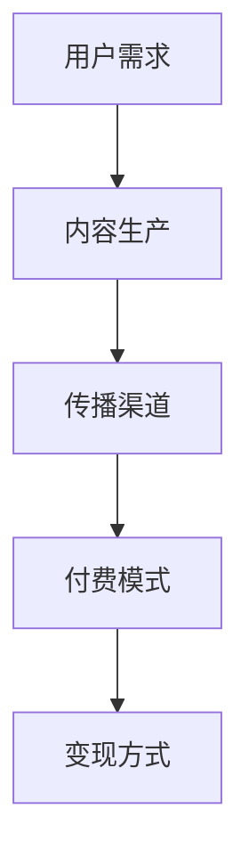

                 

# 《如何选择适合自己的知识付费领域》

## 关键词
知识付费、领域选择、自我评估、市场调研、案例分析、行动方案

## 摘要
本文旨在探讨如何选择适合自己的知识付费领域。通过逐步分析自我评估、市场调研、案例分析、制定行动方案等关键环节，帮助读者找到适合自己的知识付费领域，实现个人价值最大化。

## 目录

### 第一部分：知识付费领域概述

#### 第1章：知识付费领域的兴起与发展

1.1 知识付费的定义与意义  
1.2 知识付费领域的发展历程  
1.3 知识付费领域的市场规模与趋势

#### 第2章：知识付费的核心要素

2.1 用户需求分析  
2.2 内容生产与传播  
2.3 付费模式与变现方式

### 第二部分：自我评估与定位

#### 第3章：了解自己的兴趣与优势

3.1 兴趣爱好与专业知识  
3.2 自我能力评估  
3.3 职业规划与目标设定

#### 第4章：市场调研与竞争分析

4.1 市场需求分析  
4.2 竞争对手分析  
4.3 自身优势与劣势分析

#### 第5章：知识付费领域的细分市场

5.1 知识付费领域的细分市场概述  
5.2 各细分市场的特点与机会  
5.3 选择适合自己的细分市场

### 第三部分：选择适合自己的知识付费领域

#### 第6章：案例分析与借鉴

6.1 成功案例分析  
6.2 失败案例分析  
6.3 从案例中汲取经验教训

#### 第7章：制定具体行动方案

7.1 制定内容策划方案  
7.2 确定付费模式与价格策略  
7.3 推广与营销策略

#### 第8章：持续优化与调整

8.1 用户反馈与数据分析  
8.2 内容更新与迭代  
8.3 业务拓展与创新发展

### 第四部分：附录

#### 附录1：知识付费领域相关资源与工具

1.1 开放课程与在线学习平台  
1.2 知识付费平台的运营策略  
1.3 知识付费领域的法律法规与知识产权保护

#### 附录2：行业报告与趋势分析

2.1 知识付费行业报告汇总  
2.2 知识付费领域发展趋势分析  
2.3 知识付费领域创新案例集锦

#### 附录3：核心概念与联系

#### 附录4：核心算法原理讲解

#### 附录5：数学模型与公式

#### 附录6：项目实战

### 正文开始

在当今知识经济时代，知识付费已成为一个新兴且充满潜力的市场。面对众多的知识付费领域，如何选择适合自己的知识付费领域，实现个人价值最大化，成为许多创作者和从业者面临的重要课题。本文将带你一步步分析如何选择适合自己的知识付费领域。

### 第一部分：知识付费领域概述

#### 第1章：知识付费领域的兴起与发展

1.1 知识付费的定义与意义

知识付费，即用户为获取特定知识或服务而支付的费用。与传统免费知识获取方式相比，知识付费具有以下特点：

- **付费获取**：用户需支付费用才能获得知识或服务。
- **优质内容**：知识付费领域的内容通常具有较高的质量和专业性。
- **针对性**：知识付费领域内容更加针对用户的实际需求。

知识付费的兴起，源于以下几个因素：

- **互联网普及**：互联网技术的发展，使得知识传播更加便捷和高效。
- **用户需求**：随着人们对知识的需求不断提升，知识付费市场应运而生。
- **内容创造者**：越来越多的专业人士和创作者加入到知识付费领域，提供有价值的内容。

1.2 知识付费领域的发展历程

知识付费领域的发展可以追溯到20世纪末。以下是知识付费领域的发展历程：

- **2000年代**：传统教育机构开始尝试在线教育，知识付费市场初步形成。
- **2010年代**：随着移动互联网的发展，知识付费市场进入高速发展阶段。各类知识付费平台如雨后春笋般涌现。
- **2020年代**：知识付费市场继续扩大，细分市场不断涌现，竞争加剧。

1.3 知识付费领域的市场规模与趋势

根据相关报告，我国知识付费市场规模逐年增长，预计未来几年仍将保持高速增长。以下是知识付费领域的市场规模与趋势：

- **市场规模**：2019年，我国知识付费市场规模达到3000亿元，预计2025年将突破1万亿元。
- **用户规模**：知识付费用户数量逐年增加，预计2025年将达到5亿人。
- **细分市场**：知识付费领域逐渐细分，如在线教育、职业培训、个人成长等。
- **发展趋势**：知识付费市场将更加专业化、细分化和个性化。

### 第二部分：自我评估与定位

#### 第2章：了解自己的兴趣与优势

2.1 兴趣爱好与专业知识

兴趣是选择知识付费领域的首要因素。兴趣爱好能够激发创作者的激情和创造力，有助于持续产出高质量内容。以下是如何找到自己兴趣爱好的方法：

- **反思过去**：回顾自己的成长经历，思考哪些领域让自己感到兴奋和投入。
- **尝试新领域**：勇于尝试新的领域，探索自己未知的兴趣。
- **交流与分享**：与朋友、同事或专业人士交流，了解他们的兴趣爱好和经验。

在找到自己的兴趣爱好后，需要进一步挖掘与之相关的专业知识。以下方法有助于拓展自己的专业知识：

- **阅读书籍**：阅读与兴趣爱好相关的书籍，了解领域内的基本概念和理论。
- **在线课程**：报名参加在线课程，系统学习专业知识。
- **实践操作**：通过实际操作，将理论知识转化为实践技能。

2.2 自我能力评估

在了解自己的兴趣和专业知识后，需要对自己进行能力评估，以确定自己在所选知识付费领域的竞争力。以下方法可以帮助进行自我能力评估：

- **技能评估**：了解自己在所选领域的专业技能，如编程、设计、写作等。
- **知识储备**：评估自己在领域内的知识储备，包括基础理论和前沿动态。
- **实战经验**：评估自己在实际项目中的经验和成果。

通过自我能力评估，可以明确自己在知识付费领域的优势与劣势，为后续发展提供参考。

2.3 职业规划与目标设定

在自我评估和定位的基础上，需要制定职业规划与目标。以下步骤可以帮助你制定职业规划：

- **明确目标**：确定自己在知识付费领域的长远目标，如成为领域专家、创建知识付费平台等。
- **短期目标**：制定实现长期目标的短期目标，如学习某项技能、完成某个项目等。
- **行动计划**：制定具体的行动计划，包括学习计划、工作计划等。

通过职业规划与目标设定，可以明确自己在知识付费领域的方向和努力目标，提高发展效率。

### 第三部分：市场调研与竞争分析

#### 第3章：市场调研与竞争分析

3.1 市场需求分析

市场需求分析是选择知识付费领域的重要环节。以下方法可以帮助进行市场需求分析：

- **用户调研**：通过问卷调查、访谈等方式，了解用户在知识付费领域的需求和痛点。
- **竞品分析**：研究竞争对手的产品、服务和市场策略，了解市场需求和趋势。
- **行业报告**：查阅相关行业报告，了解知识付费领域的市场规模、用户分布、需求变化等。

通过市场需求分析，可以了解自己所在领域的用户需求和潜在市场机会。

3.2 竞争对手分析

在知识付费领域，竞争对手分析至关重要。以下方法可以帮助进行竞争对手分析：

- **竞品对比**：对比竞争对手的产品、服务、价格、市场策略等。
- **市场份额**：分析竞争对手在市场中的地位和影响力。
- **用户评价**：了解用户对竞争对手的评价和反馈。

通过竞争对手分析，可以了解自己在知识付费领域的竞争优势和不足，为后续发展提供参考。

3.3 自身优势与劣势分析

在市场调研和竞争对手分析的基础上，需要对自身优势与劣势进行分析。以下方法可以帮助进行自身优势与劣势分析：

- **技能优势**：评估自己在专业技能方面的优势，如编程、设计、写作等。
- **知识储备**：评估自己在领域内的知识储备，包括基础理论和前沿动态。
- **经验优势**：评估自己在实际项目中的经验和成果。
- **劣势分析**：分析自己在知识付费领域的劣势，如市场知名度、用户体验等。

通过自身优势与劣势分析，可以明确自己在知识付费领域的核心竞争力，为后续发展提供参考。

### 第四部分：选择适合自己的知识付费领域

#### 第4章：知识付费领域的细分市场

4.1 知识付费领域的细分市场概述

知识付费领域涵盖了多个细分市场，以下是一些常见的细分市场：

- **在线教育**：包括课程学习、考试培训、技能提升等。
- **职业培训**：包括职业技能培训、管理培训、财务培训等。
- **个人成长**：包括心理成长、人际关系、时间管理、自我提升等。
- **技能培训**：包括编程、设计、摄影、音乐、舞蹈等。
- **健康养生**：包括养生知识、运动健身、营养饮食等。

每个细分市场都有其独特的特点、需求和竞争格局。

4.2 各细分市场的特点与机会

以下是对各细分市场的特点与机会的简要介绍：

- **在线教育**：市场需求庞大，随着在线教育政策的出台，市场前景广阔。但竞争激烈，需要创新和差异化。
- **职业培训**：市场需求稳定，随着职场竞争加剧，培训需求不断增长。但市场较为成熟，需要专注于细分领域。
- **个人成长**：市场需求多样化，用户关注自我提升，市场潜力巨大。但内容同质化严重，需要打造独特品牌。
- **技能培训**：市场需求旺盛，技能提升成为用户关注重点。但市场竞争激烈，需要提高内容质量和用户体验。
- **健康养生**：市场需求逐年增长，随着人们对健康意识的提高，市场前景看好。但需要关注用户需求变化，提供专业服务。

4.3 选择适合自己的细分市场

在选择适合自己的细分市场时，需要考虑以下几个因素：

- **个人兴趣与专业知识**：选择自己感兴趣的领域，能够提高创作热情和持续输出高质量内容。
- **市场需求与竞争格局**：选择市场需求大、竞争格局良好的细分市场，有利于快速积累用户和市场影响力。
- **自身优势与劣势**：选择能够发挥自身优势、弥补自身劣势的细分市场，有助于提高竞争力。
- **发展潜力与趋势**：选择具有发展潜力、符合行业趋势的细分市场，有利于长期发展。

通过综合考虑以上因素，可以找到适合自己的细分市场，为后续发展奠定基础。

### 第五部分：案例分析与借鉴

#### 第5章：案例分析与借鉴

5.1 成功案例分析

以下是一个成功案例的分析：

**案例：**一位编程爱好者在知识付费领域成功创立了自己的在线教育平台，专注于Python编程培训。

**分析：**该案例成功的原因有以下几点：

- **个人兴趣与专业知识**：创始人对编程充满热情，具备丰富的编程经验和专业知识。
- **市场需求与竞争格局**：Python编程市场需求旺盛，竞争格局良好，为创始人提供了发展空间。
- **内容质量与用户体验**：创始人注重内容质量，课程体系完整，教学方式生动有趣，用户满意度高。
- **持续创新与迭代**：创始人不断优化课程内容，紧跟行业发展趋势，提供高质量的教学服务。

5.2 失败案例分析

以下是一个失败案例的分析：

**案例：**一位瑜伽教练在知识付费领域尝试创建瑜伽教学平台，但因市场调研不足和内容质量不高而失败。

**分析：**该案例失败的原因有以下几点：

- **市场调研不足**：瑜伽教练未对市场进行充分调研，对用户需求了解不足，导致内容不符合用户期望。
- **内容质量不高**：瑜伽教练的专业水平和教学能力有待提高，课程内容缺乏吸引力，用户体验不佳。
- **推广与营销不足**：瑜伽教练在推广和营销方面投入不足，导致平台知名度低，用户增长缓慢。

5.3 从案例中汲取经验教训

通过以上成功和失败案例的分析，可以得出以下经验教训：

- **充分调研市场需求**：在选择知识付费领域前，要充分了解市场需求和用户痛点，避免盲目跟风。
- **注重内容质量**：知识付费的核心是内容，要注重内容的质量和实用性，提供有价值的教学服务。
- **持续创新与迭代**：要紧跟行业发展趋势，持续优化课程内容和教学方式，提高用户体验。
- **积极推广与营销**：要重视推广和营销，提高平台知名度和用户增长率，为业务发展奠定基础。

### 第六部分：制定具体行动方案

#### 第6章：制定具体行动方案

6.1 制定内容策划方案

制定内容策划方案是知识付费领域的关键环节。以下步骤可以帮助制定内容策划方案：

- **确定内容方向**：根据市场需求和个人兴趣，确定内容的主攻方向。
- **设计课程体系**：根据内容方向，设计系统的课程体系，确保课程内容的完整性和系统性。
- **制定教学计划**：为每个课程制定详细的教学计划，包括教学内容、教学方式、教学时长等。
- **搭建内容平台**：选择合适的内容平台，如微信公众号、知乎专栏、小鹅通等，搭建自己的内容发布平台。

6.2 确定付费模式与价格策略

确定付费模式与价格策略是知识付费领域的重要环节。以下方法可以帮助确定付费模式与价格策略：

- **了解用户需求**：通过市场调研和用户反馈，了解用户对付费模式的需求。
- **分析竞争对手**：研究竞争对手的付费模式与价格策略，了解市场行情。
- **制定合理价格**：根据内容质量和市场需求，制定合理的价格策略，确保价格具有竞争力。
- **多样化付费模式**：提供多样化的付费模式，如按课程付费、按季度付费、按年付费等，满足不同用户的需求。

6.3 推广与营销策略

推广与营销是知识付费领域成功的关键。以下方法可以帮助制定推广与营销策略：

- **内容营销**：通过优质的内容吸引潜在用户，提高平台知名度和用户增长率。
- **社交媒体推广**：利用社交媒体平台，如微信公众号、微博、知乎等，进行推广和营销。
- **合作与联盟**：与其他知识付费平台、行业专家、教育机构等进行合作，扩大影响力。
- **活动策划**：举办线上线下活动，如讲座、沙龙、训练营等，提高用户参与度和粘性。
- **数据监测与分析**：通过数据监测与分析，了解用户行为和需求，优化推广与营销策略。

### 第七部分：持续优化与调整

#### 第7章：持续优化与调整

7.1 用户反馈与数据分析

持续优化与调整是知识付费领域的核心。以下方法可以帮助进行用户反馈与数据分析：

- **收集用户反馈**：通过问卷调查、在线评论、电话回访等方式，收集用户对课程和服务的反馈。
- **分析用户行为**：通过数据分析工具，分析用户行为数据，了解用户偏好和需求。
- **评估课程效果**：根据用户反馈和行为数据，评估课程效果，找出问题和改进点。

7.2 内容更新与迭代

内容更新与迭代是保持课程竞争力的关键。以下方法可以帮助进行内容更新与迭代：

- **跟进行业动态**：关注行业动态和趋势，及时更新课程内容，确保课程的前沿性和实用性。
- **用户调研**：定期进行用户调研，了解用户对课程内容的期望和需求，调整课程内容。
- **反馈机制**：建立反馈机制，鼓励用户提出建议和意见，根据用户反馈优化课程内容。

7.3 业务拓展与创新发展

业务拓展与创新发展是知识付费领域长期发展的关键。以下方法可以帮助进行业务拓展与创新发展：

- **拓展业务领域**：根据市场需求和个人兴趣，拓展业务领域，提供多样化的知识付费服务。
- **创新教学方式**：尝试新的教学方式，如直播授课、互动教学、虚拟现实教学等，提高用户体验。
- **跨行业合作**：与其他行业的企业、机构和专家进行合作，共同开发知识付费产品。
- **探索新兴领域**：关注新兴领域和趋势，提前布局，抓住市场机会。

### 附录

#### 附录1：知识付费领域相关资源与工具

1.1 开放课程与在线学习平台

- **Coursera**：提供全球顶尖大学和企业的在线课程。
- **edX**：由哈佛大学和麻省理工学院共同创办的在线学习平台。
- **Udemy**：提供各种技能和兴趣领域的在线课程。

1.2 知识付费平台的运营策略

- **内容运营**：制定内容策略，确保课程内容丰富、有吸引力。
- **用户运营**：关注用户需求，提高用户满意度和忠诚度。
- **推广运营**：通过多种渠道进行推广，提高平台知名度和用户增长率。

1.3 知识付费领域的法律法规与知识产权保护

- **版权保护**：了解相关法律法规，保护自己的知识产权。
- **合规经营**：遵守相关法律法规，确保知识付费平台的合规经营。

#### 附录2：行业报告与趋势分析

2.1 知识付费行业报告汇总

- **艾瑞咨询**：《2021年中国知识付费行业研究报告》
- **报告大厅**：《2021-2026年中国知识付费市场前景及投资策略分析报告》
- **前瞻产业研究院**：《2021-2026年中国知识付费行业市场分析报告》

2.2 知识付费领域发展趋势分析

- **个性化推荐**：通过人工智能技术，实现个性化内容推荐。
- **直播互动**：直播授课成为知识付费领域的新趋势。
- **垂直细分**：知识付费领域逐渐细分，满足用户多样化的需求。

2.3 知识付费领域创新案例集锦

- **知乎Live**：知乎推出的付费问答产品，为用户提供了专业的知识服务。
- **喜马拉雅**：国内领先的音频分享平台，通过付费课程为用户提供丰富的知识内容。
- **得到**：罗永浩创办的知识付费平台，专注于个人成长和职业发展领域的知识分享。

### 附录3：核心概念与联系

知识付费领域涉及多个核心概念，如图所示：



- **用户需求**：知识付费的核心驱动力，了解用户需求有助于提供有价值的内容。
- **内容生产**：知识付费的基础，优质内容是吸引用户的关键。
- **传播渠道**：知识付费的传播途径，选择合适的传播渠道有助于提高用户覆盖率。
- **付费模式**：知识付费的实现方式，包括按课程付费、会员制等。
- **变现方式**：知识付费的收益方式，包括广告、电商等。

### 附录4：核心算法原理讲解

#### 内容推荐算法

内容推荐算法是知识付费领域的重要技术之一，以下为两种常见的内容推荐算法：

#### 1. 基于协同过滤的推荐算法

- **协同过滤算法**：通过分析用户与物品之间的互动关系，预测用户对未知物品的喜好。
- **算法原理**：假设用户A喜欢物品X，用户B也喜欢物品X，那么用户A可能也会喜欢用户B喜欢的物品Y。
- **伪代码**：

```python
def collaborative_filtering(user):
    similar_users = find_similar_users(user)
    recommended_items = []
    for item in all_items:
        if item not in user.rated_items():
            similarity_scores = [similarity(user, u) for u in similar_users]
            recommended_items.append((item, sum(similarity_scores)))
    return sorted(recommended_items, key=lambda x: x[1], reverse=True)
```

#### 2. 基于内容的推荐算法

- **内容推荐算法**：通过分析物品的内容特征，为用户推荐与其兴趣相关的物品。
- **算法原理**：如果物品X和物品Y具有相似的内容特征，那么用户可能对物品Y也感兴趣。
- **伪代码**：

```python
def content_based_filtering(user, item):
    similar_items = find_similar_items(item)
    recommended_items = []
    for i in similar_items:
        if i not in user.rated_items():
            recommended_items.append(i)
    return recommended_items
```

#### 附录5：数学模型与公式

以下为知识付费领域的一些常用数学模型与公式：

#### 1. 转化率

$$
\text{转化率} = \frac{\text{成功转化次数}}{\text{总曝光次数}} \times 100\%
$$

#### 2. 留存率

$$
\text{留存率} = \frac{\text{某时间段内留存用户数}}{\text{某时间段内新增用户数}} \times 100\%
$$

### 附录6：项目实战

以下为两个知识付费领域的项目实战案例：

#### 实战1：搭建一个简单的知识付费平台

1. **环境搭建**：使用Python和Flask框架搭建后端，使用HTML、CSS和JavaScript搭建前端。

2. **数据库设计**：设计用户表、课程表、订单表等，使用MySQL数据库存储数据。

3. **后端开发**：实现用户注册、登录、课程发布、购买等功能，使用Flask框架和SQLAlchemy ORM进行开发。

4. **前端开发**：实现用户界面，包括首页、课程列表、课程详情等，使用HTML、CSS和JavaScript进行开发。

5. **部署上线**：将开发完成的应用部署到服务器，如阿里云、腾讯云等。

#### 实战2：分析用户行为数据，优化内容推荐算法

1. **数据收集**：收集用户的浏览、搜索、购买等行为数据，使用日志分析工具进行数据收集。

2. **数据处理**：对收集到的数据进行清洗、转换和存储，使用Python和Pandas进行数据处理。

3. **算法实现**：实现基于协同过滤和基于内容的推荐算法，使用Python和Scikit-learn进行算法实现。

4. **算法优化**：根据用户反馈和数据分析结果，优化推荐算法，提高推荐效果。

5. **性能评估**：评估推荐算法的效果，如准确率、召回率等，使用Python和Matplotlib进行性能评估。

### 结语

选择适合自己的知识付费领域，是实现个人价值的重要一步。通过本文的逐步分析，相信你已经对如何选择知识付费领域有了更清晰的认识。接下来，付诸实践，不断优化与调整，你一定能在知识付费领域取得成功。

## 作者

作者：AI天才研究院/AI Genius Institute & 禅与计算机程序设计艺术 /Zen And The Art of Computer Programming

