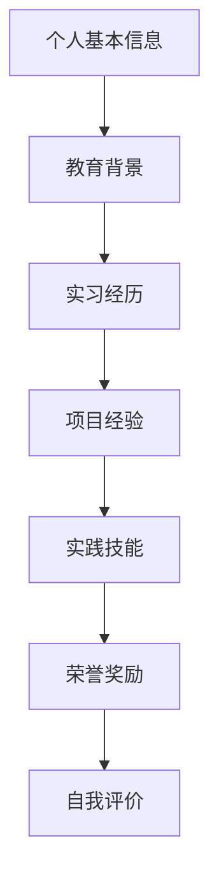
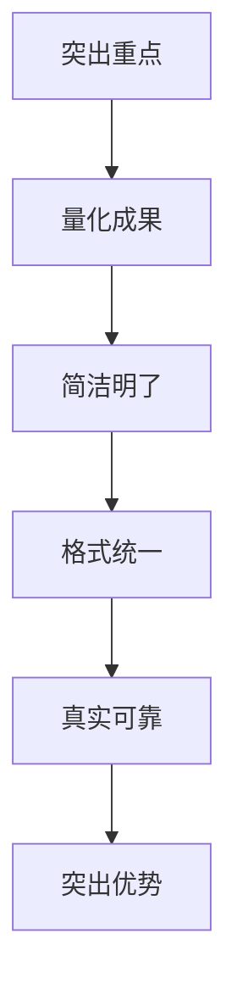
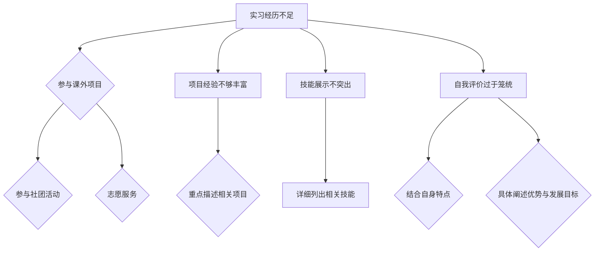
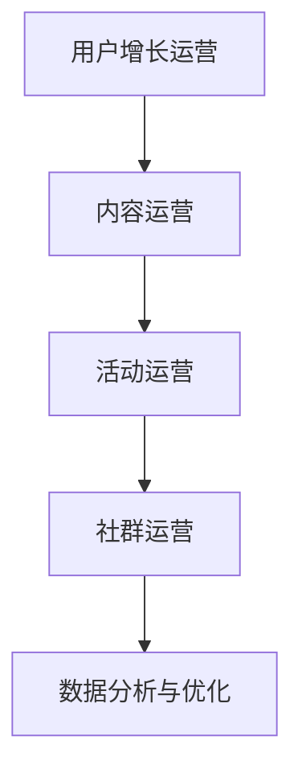

                 

# 《字节跳动2024校招运营岗位面试技巧与真题分析》

> **关键词**：字节跳动、校招、运营岗位、面试技巧、真题分析、简历撰写、心态调整

> **摘要**：本文将详细介绍字节跳动2024校招运营岗位的面试技巧和真题分析。通过对面试准备、心态调整、简历撰写、常见题型解析、运营知识点梳理、面试真题详解和实战演练等方面的详细探讨，帮助应聘者更好地备战校招，提高面试成功率。

## 目录大纲

### 《字节跳动2024校招运营岗位面试技巧与真题分析》目录大纲

### 第一部分：面试准备与心态调整

#### 第1章：校招运营岗位面试概述

##### 1.1 字节跳动校招运营岗位介绍

##### 1.2 面试流程与时间安排

##### 1.3 面试心态调整

#### 第2章：简历撰写与优化

##### 2.1 简历结构设计

##### 2.2 简历内容撰写技巧

##### 2.3 简历常见问题及解决方案

#### 第3章：面试常见题型解析

##### 3.1 行为面试

##### 3.2 技能面试

##### 3.3 故事面试

##### 3.4 团队合作与领导能力面试

##### 3.5 压力面试

### 第二部分：运营岗位核心知识点梳理

#### 第4章：运营基础知识

##### 4.1 运营定义与分类

##### 4.2 用户增长策略

##### 4.3 内容运营

##### 4.4 社交媒体运营

##### 4.5 数据分析与优化

#### 第5章：运营项目实战

##### 5.1 项目策划与执行

##### 5.2 项目评估与反馈

##### 5.3 项目风险与应对策略

#### 第6章：案例分析

##### 6.1 字节跳动经典运营案例解析

##### 6.2 同行业运营案例对比分析

##### 6.3 跨界运营创新案例分享

### 第三部分：面试真题解析与实战演练

#### 第7章：面试真题汇编

##### 7.1 行业趋势与热点问题

##### 7.2 运营策略与案例分析

##### 7.3 团队协作与领导能力

##### 7.4 压力应对与心态调整

#### 第8章：面试真题详解

##### 8.1 面试真题1：谈谈你对用户增长的理解？

##### 8.2 面试真题2：你做过哪些运营活动？效果如何？

##### 8.3 面试真题3：如果你是产品经理，如何优化用户体验？

##### 8.4 面试真题4：在面对团队冲突时，你如何处理？

#### 第9章：面试实战演练

##### 9.1 实战演练1：模拟面试

##### 9.2 实战演练2：实战案例分析

##### 9.3 实战演练3：简历优化与模拟面试

### 附录

#### 附录A：面试必备资源

##### A.1 字节跳动招聘官网

##### A.2 运营相关书籍推荐

##### A.3 运营社区与论坛

#### 附录B：面试加分技巧

##### B.1 面试礼仪与注意事项

##### B.2 面试沟通技巧

##### B.3 面试心理调适方法

##### B.4 面试后跟进策略

---

接下来，我们将按照目录大纲的结构，逐步展开每一章节的内容。

### 第一部分：面试准备与心态调整

#### 第1章：校招运营岗位面试概述

##### 1.1 字节跳动校招运营岗位介绍

字节跳动是一家快速成长的科技公司，旗下拥有今日头条、抖音、快手等知名产品。2024年，字节跳动将继续开展校招，为广大应届毕业生提供丰富的岗位选择，其中包括运营岗位。

运营岗位在字节跳动的重要性不言而喻。作为一个连接用户与产品的重要桥梁，运营岗位需要具备较强的数据分析、项目管理、用户沟通和团队协作能力。具体来说，运营岗位的职责包括：

1. **用户增长**：通过市场调研、产品迭代和营销活动等方式，实现用户量的持续增长。
2. **内容运营**：策划并执行内容策略，提升内容质量和用户黏性。
3. **社群运营**：维护用户社群，促进用户互动和参与。
4. **活动运营**：策划并执行各类线上线下活动，提高用户活跃度和满意度。
5. **数据分析**：通过对运营数据的分析，优化运营策略和提升运营效率。

##### 1.2 面试流程与时间安排

字节跳动2024校招运营岗位的面试流程通常包括以下几个环节：

1. **简历筛选**：根据应聘者提交的简历，筛选出符合条件的候选人。
2. **在线测评**：通过在线测评，评估应聘者的基本素质和技能。
3. **技术面试**：主要考察应聘者的专业知识、项目经验和解决问题的能力。
4. **综合面试**：评估应聘者的团队合作、沟通表达和心理素质。
5. **HR面试**：了解应聘者的职业规划、发展意愿和公司文化匹配度。

时间安排方面，字节跳动2024校招运营岗位的面试将主要分布在2024年春季和秋季两个学期，具体面试时间将根据候选人的情况灵活安排。

##### 1.3 面试心态调整

面试是一项重要的职业活动，对于应聘者来说，良好的心态是成功的关键。以下是一些面试心态调整的建议：

1. **积极自信**：保持积极的心态，相信自己有能力胜任运营岗位。
2. **充分准备**：提前了解面试流程和常见题型，做好充分准备。
3. **理性分析**：面试过程中，理性分析问题，避免情绪化。
4. **主动沟通**：与面试官保持良好的沟通，展示自己的思考和表达能力。
5. **心态调整**：面试失败并不代表失败，保持乐观，从失败中汲取经验。

在接下来的章节中，我们将进一步探讨简历撰写与优化、面试常见题型解析、运营岗位核心知识点梳理等关键内容。希望本文能对您备战字节跳动2024校招运营岗位面试有所帮助。在面试过程中，祝您取得优异成绩，顺利加入字节跳动这个优秀的团队！### 第2章：简历撰写与优化

在面试准备过程中，简历是您向招聘方展示自己的重要工具。一份高质量的简历不仅能够吸引面试官的注意力，还能为您的面试成功奠定基础。本章将详细介绍简历的结构设计、内容撰写技巧以及常见问题及解决方案，帮助您打造一份完美的简历。

##### 2.1 简历结构设计

一份完整的简历通常包括以下几个部分：

1. **个人基本信息**：包括姓名、性别、联系方式、邮箱等基本信息。
2. **教育背景**：列出您的学历、专业、毕业院校、毕业时间等。
3. **实习经历**：按时间顺序列出您的实习经历，包括公司名称、职位、工作内容、时间等。
4. **项目经验**：列出您参与过的项目，包括项目名称、时间、您的角色、项目成果等。
5. **实践技能**：列出您的专业技能，如编程语言、软件工具、数据分析能力等。
6. **荣誉奖励**：列出您的荣誉奖励，如奖学金、比赛奖项、荣誉称号等。
7. **自我评价**：简要介绍自己的性格特点、职业规划和发展目标。

以下是简历结构的Mermaid流程图：

##### 2.2 简历内容撰写技巧

在撰写简历内容时，以下技巧将帮助您提升简历的质量：

1. **突出重点**：在简历中突出您的核心优势和亮点，如实习经历、项目经验、专业技能等。
2. **量化成果**：尽可能用数字和具体数据来展示您的成果，如增加的用户数量、提升的销售额等。
3. **简洁明了**：简历内容要简洁明了，避免冗长和堆砌词汇。
4. **格式统一**：保持简历格式的统一和美观，使用清晰易读的字体和排版。
5. **真实可靠**：简历内容要真实可靠，切勿夸大或虚构。
6. **突出优势**：在关键部分（如实习经历、项目经验）中，强调与运营岗位相关的优势，如用户增长策略、活动策划、数据分析等。

以下是简历内容的Mermaid流程图：

##### 2.3 简历常见问题及解决方案

在撰写简历过程中，您可能会遇到以下问题，以下是一些解决方案：

1. **实习经历不足**：可以通过参与课外项目、社团活动或志愿服务来丰富简历内容。
2. **项目经验不够丰富**：可以从实习经历中选择与运营岗位相关的项目进行重点描述。
3. **技能展示不突出**：在简历中详细列出与运营岗位相关的技能，如数据分析工具、社交媒体运营等。
4. **自我评价过于笼统**：结合自身特点和实习、项目经历，具体阐述自己的优势和发展目标。

以下是简历常见问题的Mermaid流程图：

通过以上内容，您应该能够撰写一份高质量的简历，为字节跳动2024校招运营岗位面试做好准备。在撰写简历时，请务必注意结构设计、内容撰写技巧和常见问题及解决方案，让您的简历脱颖而出，吸引面试官的注意。祝您在面试中取得优异成绩！### 第3章：面试常见题型解析

面试是评估应聘者能力和适应岗位的重要环节。在面试过程中，面试官会针对不同的题型提出问题，以全面了解应聘者的知识、经验和能力。本章将详细介绍面试中常见的行为面试、技能面试、故事面试、团队合作与领导能力面试以及压力面试的题型和应对策略。

##### 3.1 行为面试

行为面试是一种基于行为的面试方式，面试官通过询问应聘者在过去工作中遇到的具体事件、如何处理这些事件以及结果如何，来评估应聘者的能力和素质。以下是一些常见的行为面试题型：

1. **STAR法则**：面试官会询问您在某个特定情况下采取了哪些行动（Situation）、遇到了哪些问题（Task）、您是如何解决这些问题的（Action）以及结果如何（Result）。例如：“请举例说明你如何在一个项目中成功地解决问题？”

2. **情景模拟**：面试官会设定一个模拟情景，询问您在这种情况下会如何行动。例如：“如果团队中有人对你的工作提出批评，你会如何回应？”

3. **冲突处理**：询问您在处理团队冲突时的策略和方法。例如：“请描述一次你在团队中解决冲突的经历。”

应对策略：

1. **提前准备**：在面试前，回顾自己的实习经历和项目经验，挑选出具有代表性的行为事件，并按照STAR法则进行整理。
2. **具体详细**：回答问题时，要具体详细地描述事件背景、自己的行动和结果，避免使用模糊的词汇。
3. **强调成果**：在描述过程中，要强调自己的行动和成果，突出自己的价值和能力。

##### 3.2 技能面试

技能面试主要考察应聘者的专业知识和实际操作能力。以下是一些常见的技能面试题型：

1. **专业知识**：面试官会询问与应聘者专业相关的理论知识。例如：“请解释一下什么是A/B测试？”

2. **案例分析**：面试官会提供一个实际案例，询问您对该案例的看法和建议。例如：“请分析一下抖音的用户增长策略？”

3. **实战操作**：面试官可能会要求您在现场进行实际操作，如编写代码、数据分析等。例如：“请使用Excel对以下数据进行分析并生成图表？”

应对策略：

1. **熟悉基础知识**：在面试前，要熟悉与应聘岗位相关的专业知识和理论。
2. **实战演练**：通过模拟实际操作，提高自己的实战能力。
3. **逻辑清晰**：在回答问题时，要保持逻辑清晰，先阐述自己的观点，再提供具体的案例分析或建议。

##### 3.3 故事面试

故事面试是一种通过讲述故事来评估应聘者能力的方法。面试官会询问您在实习或项目中的具体经历，通过故事来展示您的素质和能力。以下是一些常见的故事面试题型：

1. **项目经历**：面试官会询问您在某个项目中的角色、任务和成果。例如：“请讲述您在实习期间参与的一个项目，并说明您的贡献？”

2. **团队合作**：询问您在团队中的合作经历，如何与他人协作解决问题。例如：“请描述一次您在团队中成功合作的经历？”

3. **创新思维**：询问您在遇到问题时，如何运用创新思维解决。例如：“请讲述一次您在工作中运用创新思维解决问题的经历？”

应对策略：

1. **具体生动**：在讲述故事时，要具体生动，使面试官能够清晰地了解您的经历和成果。
2. **重点突出**：在故事中，要突出自己的角色和贡献，展示自己的能力和素质。
3. **简明扼要**：故事要简明扼要，避免冗长和无关紧要的内容。

##### 3.4 团队合作与领导能力面试

团队合作与领导能力是运营岗位的重要素质。以下是一些常见的团队合作与领导能力面试题型：

1. **团队角色**：询问您在团队中的角色和职责。例如：“在您的实习或项目中，您扮演了什么角色？”

2. **团队冲突**：询问您在处理团队冲突时的策略和方法。例如：“请描述一次您在团队中处理冲突的经历？”

3. **领导能力**：询问您在领导团队或项目时的方法和成效。例如：“请讲述一次您领导团队的经历，并说明您的领导风格？”

应对策略：

1. **具体案例**：在回答问题时，要提供具体案例，展示您的团队合作和领导能力。
2. **强调成果**：在案例中，要强调您的贡献和成果，突出自己的领导能力和团队协作能力。
3. **合理解释**：对于团队冲突的处理，要合理解释您的策略和方法，使面试官信服。

##### 3.5 压力面试

压力面试是一种通过制造压力情境来考察应聘者心理素质和应变能力的方法。以下是一些常见的压力面试题型：

1. **高压情境**：面试官会创造一个高压情境，询问您在这种情境下会如何应对。例如：“如果您的项目在截止日期前无法完成，您会如何处理？”

2. **否定评价**：面试官可能会对您的回答进行否定评价，询问您的看法。例如：“您之前的实习经历看起来并不出色，您对此有何看法？”

3. **挑战性问题**：面试官可能会提出一些具有挑战性的问题，询问您的解决方案。例如：“如果您的产品在市场上遇到强劲竞争对手，您会如何应对？”

应对策略：

1. **保持冷静**：在压力面试中，保持冷静和自信至关重要。遇到压力情境时，先深呼吸，稳定情绪。
2. **合理应对**：在回答问题时，要合理应对面试官的挑战，避免情绪失控或回答过激。
3. **积极思考**：在高压情境下，要积极思考问题，提供合理的解决方案。

通过以上对面试常见题型的解析，您应该能够更好地应对字节跳动2024校招运营岗位的面试。在面试过程中，保持积极自信、充分准备和合理应对，相信您一定能够取得优异成绩。祝您在面试中取得成功，顺利加入字节跳动这个优秀的团队！### 第二部分：运营岗位核心知识点梳理

#### 第4章：运营基础知识

运营是一门涉及多方面知识和技能的综合性工作，它旨在通过一系列策略和活动来提高产品的用户数量、用户活跃度和用户满意度。本章将详细梳理运营的定义与分类、用户增长策略、内容运营、社交媒体运营和数据分析与优化等基础知识，帮助您更好地理解和掌握运营的核心内容。

##### 4.1 运营定义与分类

运营，通常指的是在产品、项目或服务中实施的一系列计划和管理活动，旨在实现特定的目标，如用户增长、市场份额扩大、品牌提升等。根据运营的目标和内容，可以将运营分为以下几类：

1. **用户增长运营**：通过市场调研、用户推广、活动策划等手段，实现用户量的快速增长。
2. **内容运营**：通过内容创作、内容发布、内容优化等手段，提高内容的吸引力和用户粘性。
3. **活动运营**：通过线上或线下的活动策划和执行，提升用户活跃度和满意度。
4. **社群运营**：通过建立和维护用户社群，促进用户互动和参与。
5. **数据分析与优化**：通过数据分析，评估运营活动的效果，并据此进行策略调整和优化。

以下是对运营定义与分类的Mermaid流程图：

##### 4.2 用户增长策略

用户增长是运营的重要目标之一。以下是一些常用的用户增长策略：

1. **市场调研**：通过市场调研，了解目标用户的需求、痛点和行为习惯，为用户增长提供数据支持。
2. **用户推广**：通过线上和线下的推广手段，如广告投放、合作伙伴推荐等，吸引用户注册和使用产品。
3. **活动策划**：通过举办各类线上或线下活动，提升用户参与度和活跃度，从而促进用户增长。
4. **社交分享**：鼓励用户在社交媒体上分享产品，利用社交网络效应实现用户增长。
5. **内容营销**：通过高质量的内容创作和优化，提高产品的曝光率和用户转化率。

以下是对用户增长策略的详细讲解和举例说明：

**市场调研**：通过问卷调查、用户访谈、数据分析等方式，了解目标用户的需求和偏好。例如，一家社交媒体公司可以通过调查了解用户对平台功能的需求，从而优化产品功能。

**用户推广**：通过广告投放、合作伙伴推荐、线上推广等方式，扩大产品知名度和用户覆盖面。例如，一家电商公司可以在社交媒体上投放广告，吸引潜在用户。

**活动策划**：通过举办线上活动（如抽奖、优惠券发放）和线下活动（如用户见面会、产品发布会），提升用户参与度和忠诚度。例如，一家游戏公司可以举办线上比赛，提高用户的活跃度。

**社交分享**：鼓励用户在社交媒体上分享产品，通过口碑传播实现用户增长。例如，一家短视频平台可以推出分享功能，激励用户将有趣的内容分享到朋友圈。

**内容营销**：通过创作和优化高质量的内容，提高产品的吸引力和用户转化率。例如，一家教育平台可以发布专业的学习资料和教程，吸引用户关注和使用。

##### 4.3 内容运营

内容运营是运营的重要组成部分，它通过内容创作、内容发布、内容优化等手段，提高产品的用户粘性和品牌影响力。以下是一些内容运营的策略和要点：

1. **内容创作**：创作高质量的内容，满足用户需求和兴趣。内容类型包括文章、图片、视频、音频等。
2. **内容发布**：选择合适的时间、渠道和形式，将内容推送给目标用户，提高内容的曝光率和影响力。
3. **内容优化**：根据用户反馈和数据分析，不断优化内容质量和效果，提高用户满意度和转化率。

以下是对内容运营策略的详细讲解和举例说明：

**内容创作**：根据用户需求和市场热点，创作有趣、有用、有价值的原创内容。例如，一家自媒体平台可以针对热门话题发布文章，吸引更多用户关注。

**内容发布**：选择合适的时间（如用户活跃时段）和渠道（如社交媒体、自有平台）发布内容，提高内容的曝光率和用户阅读量。例如，一家新闻平台可以在早上和晚上发布重要新闻，吸引更多用户阅读。

**内容优化**：根据用户反馈和数据分析，调整内容结构和形式，提高用户满意度和转化率。例如，一家电商网站可以通过用户评价和购买行为数据，优化产品页面和推荐算法。

##### 4.4 社交媒体运营

社交媒体运营是利用社交媒体平台（如微博、微信、抖音等）进行产品推广、用户互动和品牌建设的活动。以下是一些社交媒体运营的策略和要点：

1. **平台选择**：根据目标用户和产品特点，选择合适的社交媒体平台。
2. **内容策略**：制定符合平台特点和用户需求的社交媒体内容策略。
3. **互动管理**：积极与用户互动，回应用户反馈和评论，提高用户满意度和忠诚度。
4. **广告投放**：通过社交媒体广告，扩大产品影响力和用户覆盖面。

以下是对社交媒体运营策略的详细讲解和举例说明：

**平台选择**：根据目标用户和产品特点，选择适合的社交媒体平台。例如，针对年轻用户，可以选择抖音、微博等平台。

**内容策略**：根据平台特点和用户需求，制定内容策略。例如，在抖音上发布短视频，在微博上发布图文和短视频。

**互动管理**：积极与用户互动，回应用户反馈和评论。例如，在用户提问时，及时回答并解决用户问题。

**广告投放**：通过社交媒体广告，扩大产品影响力和用户覆盖面。例如，在抖音上投放广告，吸引更多潜在用户。

##### 4.5 数据分析与优化

数据分析与优化是运营的核心环节，通过对运营数据的分析，评估运营活动的效果，并据此进行策略调整和优化。以下是一些数据分析与优化的策略和要点：

1. **数据收集**：收集与运营活动相关的数据，如用户行为数据、转化数据、活动效果数据等。
2. **数据分析**：运用数据分析工具和方法，对收集到的数据进行处理和分析，提取有价值的信息。
3. **策略调整**：根据数据分析结果，调整运营策略，提高运营效果。
4. **效果评估**：对调整后的运营策略进行效果评估，验证调整的有效性。

以下是对数据分析与优化策略的详细讲解和举例说明：

**数据收集**：通过网站分析工具（如Google Analytics）、社交媒体分析工具等，收集用户行为数据、活动效果数据等。

**数据分析**：运用Excel、Python等工具，对数据进行分析和处理。例如，通过用户行为数据分析，了解用户的访问路径、停留时长等。

**策略调整**：根据数据分析结果，调整运营策略。例如，针对用户停留时长较短的问题，优化页面设计和内容结构。

**效果评估**：对调整后的运营策略进行效果评估，验证调整的有效性。例如，通过对比数据，了解用户活跃度和转化率的变化。

通过以上对运营基础知识的详细梳理，您应该对运营岗位的核心内容和策略有了更深入的了解。在实际工作中，不断学习和实践，不断提升自己的运营能力，才能在字节跳动2024校招运营岗位的面试中脱颖而出。祝您在面试中取得优异成绩，顺利加入字节跳动这个优秀的团队！### 第5章：运营项目实战

运营项目的成功离不开精细的策划与执行。本章将详细介绍运营项目的策划与执行、项目评估与反馈以及项目风险与应对策略，帮助您在实际工作中更好地应对各种挑战。

##### 5.1 项目策划与执行

一个成功的运营项目需要明确的策划和精细的执行。以下是一个运营项目的策划与执行的详细步骤：

1. **项目立项**：明确项目的目标和预期成果，确定项目预算和时间表。
2. **市场调研**：进行市场调研，了解目标用户的需求、竞争情况以及市场趋势。
3. **目标设定**：根据市场调研结果，设定具体可量化的项目目标，如用户增长、用户活跃度提升等。
4. **资源分配**：根据项目目标和预算，合理分配人力资源、资金、物资等资源。
5. **策划方案**：制定详细的策划方案，包括活动主题、时间安排、内容设计、宣传渠道等。
6. **执行阶段**：按照策划方案，执行具体的活动内容和操作，确保项目进度和质量。
7. **监控与调整**：在执行过程中，实时监控项目进度和效果，根据实际情况进行调整和优化。

以下是对运营项目策划与执行的详细讲解和举例说明：

**项目立项**：以一个社交媒体平台的用户增长项目为例，明确项目的目标是提高平台用户数量和用户活跃度。

**市场调研**：通过问卷调查、用户访谈等方式，了解目标用户的需求和偏好。例如，调查用户对平台功能、内容质量、用户互动等方面的满意度。

**目标设定**：设定具体可量化的目标，如一个月内新增用户1000人，用户日活跃率达到20%。

**资源分配**：根据项目目标和预算，合理分配人力资源、资金和物资。例如，分配2名运营人员负责活动策划和执行，安排一定的预算用于线上广告投放。

**策划方案**：制定详细的策划方案，包括活动主题（如“夏日狂欢节”）、时间安排（为期一个月）、内容设计（推出优惠券、线下活动等）、宣传渠道（社交媒体、电子邮件等）。

**执行阶段**：按照策划方案，执行具体的活动内容和操作。例如，在社交媒体上发布活动宣传，推出优惠券，举办线下活动等。

**监控与调整**：在执行过程中，实时监控项目进度和效果。通过数据分析，了解用户参与情况、优惠券使用情况等，根据实际情况进行调整和优化。

##### 5.2 项目评估与反馈

项目评估与反馈是运营项目的重要环节，它有助于了解项目的实际效果，总结经验教训，为后续项目提供参考。以下是一个项目评估与反馈的详细步骤：

1. **数据收集**：收集与项目相关的数据，如用户增长、用户活跃度、活动效果等。
2. **数据分析**：运用数据分析工具和方法，对收集到的数据进行处理和分析，提取有价值的信息。
3. **效果评估**：根据数据分析结果，评估项目的实际效果，与预期目标进行比较。
4. **反馈总结**：总结项目的成功经验和不足之处，为后续项目提供改进建议。
5. **优化建议**：根据评估结果和反馈，提出具体的优化建议，如改进活动设计、调整宣传策略等。

以下是对项目评估与反馈的详细讲解和举例说明：

**数据收集**：通过网站分析工具、社交媒体分析工具等，收集用户行为数据、活动效果数据等。

**数据分析**：运用Excel、Python等工具，对数据进行分析和处理。例如，通过用户行为数据分析，了解用户的访问路径、停留时长等。

**效果评估**：根据数据分析结果，评估项目的实际效果。例如，通过对比数据，了解活动期间的用户增长和活跃度变化。

**反馈总结**：总结项目的成功经验和不足之处。例如，活动期间用户增长显著，但用户活跃度提升不明显。

**优化建议**：根据评估结果和反馈，提出具体的优化建议。例如，调整活动设计，增加用户互动环节，以提高用户活跃度。

##### 5.3 项目风险与应对策略

在运营项目中，风险是不可避免的。以下是一些常见的项目风险和应对策略：

1. **预算超支**：应对策略包括合理规划预算、严格控制费用支出、合理分配资源等。
2. **时间延误**：应对策略包括制定详细的时间表、提前安排任务、实时监控进度等。
3. **效果不达标**：应对策略包括调整项目目标、优化活动设计、加强宣传推广等。
4. **用户流失**：应对策略包括提高用户满意度、优化产品功能、加强用户关怀等。

以下是对项目风险与应对策略的详细讲解和举例说明：

**预算超支**：为了避免预算超支，可以采取以下措施：首先，在项目立项阶段，明确预算范围并合理分配资源；其次，在执行阶段，严格控制各项费用支出，确保在预算范围内完成项目。

**时间延误**：为了确保项目按时完成，可以制定详细的时间表，将任务分解为若干阶段，并明确每个阶段的完成时间。在执行过程中，实时监控进度，及时调整计划，确保项目按时完成。

**效果不达标**：如果项目效果不达标，可以采取以下措施：首先，重新评估项目目标和预期效果，确保目标设定合理；其次，优化活动设计，增加用户参与度和互动性；最后，加强宣传推广，提高项目的曝光率。

**用户流失**：为了降低用户流失率，可以采取以下措施：首先，提高用户满意度，优化产品功能和用户体验；其次，加强用户关怀，通过私信、电话等方式与用户保持沟通；最后，定期举办活动，提高用户活跃度和忠诚度。

通过以上对运营项目实战的详细讲解，您应该对运营项目的策划与执行、项目评估与反馈以及项目风险与应对策略有了更深入的了解。在实际工作中，不断总结经验教训，灵活应对各种挑战，才能在运营项目中取得成功。祝您在字节跳动2024校招运营岗位的面试中发挥出色，顺利加入字节跳动这个优秀的团队！### 第6章：案例分析

在运营领域，成功的案例往往能为我们提供宝贵的经验和启示。本章将通过对字节跳动经典运营案例的解析、同行业运营案例的对比分析以及跨界运营创新案例的分享，帮助您深入了解运营策略和实践方法，从而提升自身的运营能力。

##### 6.1 字节跳动经典运营案例解析

字节跳动作为一家领先的科技公司，其运营案例具有很高的参考价值。以下是一些字节跳动的经典运营案例及其分析：

1. **抖音短视频平台**：抖音的成功在于其精准的用户定位和独特的内容策略。通过算法推荐，抖音能够为用户推荐个性化内容，提高用户粘性和活跃度。此外，抖音还积极举办各种线上线下活动，如短视频大赛、线下见面会等，进一步吸引和留住用户。

2. **头条新闻**：头条新闻通过精准的内容推送和用户互动，成功吸引了大量用户。其算法推荐系统根据用户的阅读行为和兴趣，推送个性化新闻内容，提高了用户阅读量和满意度。此外，头条新闻还通过互动功能，如评论、点赞、分享等，增强用户参与度。

3. **懂车帝**：懂车帝作为一款汽车资讯类应用，通过内容营销和用户互动，成功积累了大量汽车爱好者用户。其内容策略包括专业的汽车评测、车主心得分享、汽车资讯等，满足了用户对汽车知识的需求。此外，懂车帝还举办各类线上线下活动，如车展、试驾活动等，提升用户活跃度和忠诚度。

通过以上案例解析，我们可以看到，字节跳动的成功离不开精准的用户定位、个性化内容推荐、用户互动和活动策划等多方面的运营策略。

##### 6.2 同行业运营案例对比分析

在运营领域，不同公司之间的案例对比分析有助于我们了解行业趋势和运营创新。以下是一些同行业运营案例的对比分析：

1. **微博与抖音**：微博和抖音都是社交媒体平台，但它们的运营策略有所不同。微博以文字、图片、视频等多种形式满足用户表达和互动的需求，注重用户关系链的建设。而抖音则通过短视频形式，更注重内容创意和个性化推荐，吸引了大量年轻用户。

2. **美团与饿了么**：美团和饿了么都是外卖平台，但它们的运营策略也有所不同。美团在外卖业务的基础上，拓展了到店、酒店、旅游等多种业务，形成了多元化的业务生态。而饿了么则专注于外卖业务，通过优化配送效率、提升服务质量等手段，提升用户满意度。

通过以上对比分析，我们可以看到，不同公司在运营策略上各有侧重，但核心目标都是提高用户满意度、提升用户活跃度和增加用户粘性。

##### 6.3 跨界运营创新案例分享

跨界运营创新是指将不同行业或领域的运营经验应用于自身业务中，实现业务突破和增长。以下是一些跨界运营创新案例的分享：

1. **瑞幸咖啡**：瑞幸咖啡通过线上营销和线下体验的结合，成功实现了快速增长。其运营策略包括线上优惠券推广、会员系统、线上商城等，吸引了大量用户。此外，瑞幸咖啡还通过线下门店体验，提升用户满意度和忠诚度。

2. **网易云音乐**：网易云音乐通过音乐社区和音乐直播的结合，打造了一个独特的音乐生态。其运营策略包括打造高质量音乐内容、用户互动、音乐直播等，吸引了大量音乐爱好者和创作者。通过跨界运营，网易云音乐不仅提升了用户活跃度，还实现了音乐产业链的整合。

通过以上跨界运营创新案例的分享，我们可以看到，跨界运营创新能够为传统行业带来新的增长点和活力。

通过以上案例分析，我们可以总结出以下几点运营经验和启示：

1. **精准定位和个性化推荐**：通过精准的用户定位和个性化推荐，提高用户满意度和粘性。
2. **用户互动和社区建设**：通过用户互动和社区建设，增强用户参与度和忠诚度。
3. **跨界合作和创新**：通过跨界合作和创新，为业务注入新的活力和增长点。
4. **数据驱动和持续优化**：通过数据分析和优化，不断调整运营策略，提高运营效果。

在实际工作中，我们可以借鉴这些成功案例的运营策略，结合自身业务特点，制定合适的运营计划，提升自身的运营能力。祝您在字节跳动2024校招运营岗位的面试中取得优异成绩，顺利加入字节跳动这个优秀的团队！### 第三部分：面试真题解析与实战演练

#### 第7章：面试真题汇编

在面试过程中，面试官可能会提出各种类型的题目，以全面评估应聘者的综合素质和实际能力。本章将汇编一些常见的面试真题，包括行业趋势与热点问题、运营策略与案例分析、团队合作与领导能力、压力应对与心态调整等方面。通过这些真题，您可以更好地了解面试官的关注点，并为面试做好准备。

##### 7.1 行业趋势与热点问题

1. **谈谈你对互联网行业未来发展趋势的看法？**
2. **目前流行的社交媒体平台有哪些？它们各自的优势是什么？**
3. **你如何判断一个社交媒体平台的成功？**
4. **大数据和人工智能在运营中的作用有哪些？**
5. **最近你关注的行业热点是什么？为什么？**

##### 7.2 运营策略与案例分析

1. **你认为用户增长的最佳策略是什么？请举例说明。**
2. **如何制定一份有效的活动策划方案？**
3. **请分享一次你参与的成功运营活动，并说明你的贡献。**
4. **如何评估一个运营活动的效果？请举例说明。**
5. **你如何优化用户体验？请举例说明。**

##### 7.3 团队合作与领导能力

1. **请描述一次你与团队成员合作解决问题的经历。**
2. **在团队合作中，你如何处理团队冲突？**
3. **请谈谈你在领导团队方面的经验和教训。**
4. **你如何激励团队成员实现共同目标？**
5. **在项目中，如何确保团队成员的高效沟通和协作？**

##### 7.4 压力应对与心态调整

1. **在面对工作压力时，你如何调整自己的心态？**
2. **请描述一次你在高压环境下完成任务的经历。**
3. **如果项目在截止日期前无法完成，你会如何处理？**
4. **当你遇到挫折时，如何保持积极的心态？**
5. **请谈谈你在应对压力方面的优势和策略。**

通过以上面试真题汇编，您可以对面试官可能提出的问题有所准备。在实际面试中，结合自身经历和经验，给出具体、详细的回答，展示自己的专业能力和综合素质。

接下来，我们将对部分面试真题进行详细解析，帮助您更好地理解面试官的意图，并提供实用的答题技巧。

#### 第8章：面试真题详解

在本章中，我们将针对第7章中的部分面试真题进行详细解析，包括解题思路、答案示例和答题技巧。通过这些真题详解，您将能够更好地理解面试官的考察点，并为面试做好准备。

##### 8.1 面试真题1：谈谈你对用户增长的理解？

**解题思路**：

1. **定义用户增长**：首先，明确用户增长的含义，包括用户数量的增加、用户活跃度的提升等。
2. **用户增长的策略**：阐述常见的用户增长策略，如市场调研、内容营销、社交媒体推广、活动策划等。
3. **用户增长的衡量指标**：介绍衡量用户增长效果的关键指标，如用户增长率、用户留存率、用户转化率等。
4. **实际案例**：分享一个实际案例，说明如何通过具体的策略实现用户增长。

**答案示例**：

“用户增长是指通过一系列策略和活动，提高产品的用户数量、用户活跃度和用户满意度。常见的用户增长策略包括市场调研、内容营销、社交媒体推广和活动策划。例如，我们可以通过市场调研了解用户需求，制定针对性的内容策略；利用社交媒体推广扩大产品知名度；通过举办活动提升用户参与度和忠诚度。

在衡量用户增长效果时，我们关注的关键指标有用户增长率、用户留存率和用户转化率。例如，如果某个活动在一个月内成功吸引了1000名新用户，且这1000名用户的留存率达到80%，那么我们可以认为这个活动在用户增长方面取得了显著成效。

一个实际的案例是我们公司举办的“双十一”促销活动。通过精准的用户定位、内容营销和社交媒体推广，我们成功吸引了大量新用户。同时，通过优化购物体验和提供优惠券，我们提高了用户的活跃度和满意度。最终，这个活动在用户增长方面取得了显著成效，我们的用户数量和销售额都有了显著提升。”

**答题技巧**：

1. **明确定义**：在回答问题时，首先要明确用户增长的含义，确保答案的准确性。
2. **策略多样化**：在阐述用户增长策略时，要尽量多样化，展示自己的全面性。
3. **结合实际案例**：通过实际案例来说明用户增长的策略和效果，使答案更具说服力。
4. **关注关键指标**：在回答问题时，要提到衡量用户增长效果的关键指标，展示自己的专业素养。

##### 8.2 面试真题2：你做过哪些运营活动？效果如何？

**解题思路**：

1. **活动概述**：首先，简要介绍自己参与过的运营活动，包括活动主题、时间、目标等。
2. **活动过程**：详细描述活动策划、执行和推广的过程，包括遇到的问题和解决方案。
3. **活动效果**：介绍活动的具体成果，如用户增长、活跃度提升、品牌知名度等。
4. **经验总结**：总结活动中的经验和教训，为未来的运营活动提供参考。

**答案示例**：

“在过去的工作中，我参与过多次运营活动。其中一次是公司举办的“夏日狂欢节”活动。这次活动的目标是提升用户活跃度和参与度，同时增加新用户注册。

活动期间，我们策划了一系列线上和线下活动，包括优惠券发放、抽奖活动、用户见面会等。在策划阶段，我们通过市场调研和用户反馈，了解了用户的需求和兴趣点。在执行阶段，我们与多个部门合作，确保活动的顺利进行。在推广阶段，我们通过社交媒体、电子邮件、短信等多种渠道，将活动信息传达给目标用户。

活动期间，我们成功吸引了5000多名新用户，用户活跃度提升了30%，品牌知名度也得到了显著提高。这个活动在用户增长、活跃度提升和品牌推广方面取得了显著成效。

通过这次活动，我学到了很多经验。首先，市场调研和用户反馈是活动策划的重要环节，只有了解用户需求，才能制定出有效的活动策略。其次，跨部门合作和良好的沟通是确保活动顺利进行的关键。最后，活动效果评估和反馈是优化活动的重要手段，通过不断总结和改进，我们可以提高运营活动的效果。”

**答题技巧**：

1. **具体详细**：在描述活动时，要具体详细，展示自己的策划、执行和推广能力。
2. **成果突出**：在介绍活动效果时，要突出成果，展示活动对用户增长、活跃度提升等方面的贡献。
3. **经验总结**：通过总结活动中的经验和教训，展示自己的反思能力和持续改进的能力。
4. **合理逻辑**：在回答问题时，要逻辑清晰，确保答案的连贯性和完整性。

通过以上面试真题的详细解析，您应该对面试中的常见问题有了更深入的了解。在实际面试中，结合自身经历和经验，给出具体、详细的回答，展示自己的专业能力和综合素质。祝您在面试中取得优异成绩，顺利加入字节跳动这个优秀的团队！### 第9章：面试实战演练

为了帮助您在面试中更好地发挥，本章将提供一系列面试实战演练，包括模拟面试、实战案例分析和简历优化与模拟面试。通过这些实战演练，您可以熟悉面试流程，提高应对面试的能力。

##### 9.1 实战演练1：模拟面试

**目的**：通过模拟面试，熟悉面试流程和题型，提升面试技巧。

**步骤**：

1. **准备面试**：提前了解面试公司的背景、文化和发展方向，准备好可能被问到的问题和答案。
2. **模拟面试**：与朋友或同事进行模拟面试，模拟真实的面试环境，注意语气、态度和表达方式。
3. **反馈与改进**：结束后，互相反馈意见和建议，根据反馈进行改进。

**注意事项**：

- **模拟真实情境**：确保模拟面试的环境和氛围与真实面试相近。
- **关注细节**：注意面试中的细节，如着装、仪态、语速等。
- **多练多反思**：反复练习，总结经验教训，不断提高面试技巧。

##### 9.2 实战演练2：实战案例分析

**目的**：通过分析实际运营案例，提高解决实际问题的能力。

**步骤**：

1. **选择案例**：选择一个与运营岗位相关的实际案例，如用户增长、活动策划等。
2. **案例分析**：从目标、策略、执行、效果评估等方面对案例进行深入分析，阐述自己的见解。
3. **讨论与交流**：与团队成员或导师讨论案例，分享自己的分析结果和观点。

**注意事项**：

- **深入理解**：确保对案例的背景、策略和效果有深入的理解。
- **具体分析**：分析时，要具体到每一个环节，说明为什么采取这样的策略和执行方法。
- **多角度思考**：从不同角度分析问题，展示自己的全面性和深度。

##### 9.3 实战演练3：简历优化与模拟面试

**目的**：通过优化简历和模拟面试，提高面试成功率。

**步骤**：

1. **简历优化**：根据面试公司的要求，对简历进行修改和优化，确保简历内容充实、突出亮点。
2. **模拟面试**：与朋友或同事进行模拟面试，针对简历中的内容进行深入提问和回答。
3. **反馈与改进**：结束后，互相反馈意见和建议，根据反馈优化简历和面试技巧。

**注意事项**：

- **针对性**：优化简历时，要针对面试公司的岗位要求和特点，突出自己的优势和匹配度。
- **真实性**：简历内容要真实可靠，切勿夸大或虚构。
- **多练习**：反复练习面试问题，提高应对不同场景问题的能力。

通过以上面试实战演练，您可以提高面试技巧，增强自信心，为面试成功做好准备。祝您在面试中取得优异成绩，顺利加入字节跳动这个优秀的团队！### 附录

#### 附录A：面试必备资源

##### A.1 字节跳动招聘官网

字节跳动的招聘官网是获取校招信息、职位描述和招聘流程的重要渠道。您可以通过官网了解最新的校招动态和岗位需求，并根据自己的兴趣和条件选择合适的职位进行申请。官网链接：[字节跳动招聘官网](https://jobs.bytedance.com/)

##### A.2 运营相关书籍推荐

为了更好地备战校招，以下是一些运营相关的书籍推荐，这些书籍涵盖了运营基础知识、用户增长策略、活动策划等内容，对您的面试准备和职业发展都将大有裨益：

1. **《运营之光：UGC网站运营实战》**
2. **《运营技能进化论》**
3. **《运营管理》**
4. **《从0到1：运营实战方法论》**
5. **《增长黑客：如何不花钱获得十倍增长》**

##### A.3 运营社区与论坛

运营社区和论坛是运营从业者交流经验、分享心得和获取行业动态的好地方。以下是一些知名的运营社区和论坛，您可以在这些平台上获取最新的行业资讯、运营技巧和案例分享：

1. **运营小王**
2. **运营吧**
3. **运营之巅**
4. **人人都是产品经理**
5. **鸟巢运营社区**

#### 附录B：面试加分技巧

##### B.1 面试礼仪与注意事项

1. **着装得体**：根据面试公司的文化和要求，选择合适的着装，确保整洁、得体。
2. **提前到达**：提前15-30分钟到达面试地点，确保有足够的时间准备。
3. **礼貌用语**：在面试过程中，始终保持礼貌用语，如“请”、“谢谢”等。
4. **注意肢体语言**：保持自信的姿势和眼神交流，避免紧张或拘谨。
5. **尊重面试官**：对面试官的问题给予认真倾听，并尊重对方的意见和建议。

##### B.2 面试沟通技巧

1. **清晰表达**：在回答问题时，确保语言清晰、逻辑性强，避免模糊或含糊不清。
2. **具体案例**：在描述自己的经验和能力时，结合具体案例，使回答更有说服力。
3. **积极倾听**：在面试过程中，积极倾听面试官的问题和反馈，展示自己的理解和关注。
4. **提问技巧**：在面试结束时，可以提问一些关于公司或岗位的问题，展示自己的积极性和求知欲。

##### B.3 面试心理调适方法

1. **保持自信**：面试前，做好充分准备，增强自信心。避免过分焦虑和紧张。
2. **深呼吸**：在面试过程中，遇到紧张情况时，可以尝试深呼吸，放松身心。
3. **正面思考**：积极思考面试的问题和回答，避免消极或负面的想法。
4. **模拟面试**：通过模拟面试，提高自己的应对能力和自信心。

##### B.4 面试后跟进策略

1. **发送感谢信**：面试结束后，及时发送一封感谢信，表达对面试官时间和机会的感谢。
2. **总结经验**：对面试过程进行总结，分析自己的优点和不足，为下一次面试做好准备。
3. **持续关注**：关注公司的招聘动态和面试结果，如有需要，可以适当跟进。

通过以上附录内容，您可以为面试做好准备，提高面试成功率。祝您在面试中取得优异成绩，顺利加入字节跳动这个优秀的团队！### 结束语

至此，本文《字节跳动2024校招运营岗位面试技巧与真题分析》已经全面梳理了从面试准备到实战演练的各个关键环节。希望本文能为您备战字节跳动2024校招运营岗位面试提供有力的支持和指导。

在面试过程中，保持积极自信、充分准备和合理应对至关重要。通过本文的详细讲解和实战演练，您应该对运营岗位的核心知识、面试技巧和应对策略有了更深入的了解。请记住，每一次面试都是一次宝贵的学习和成长机会，无论结果如何，都要保持乐观的心态，从失败中汲取经验，不断提升自己的能力。

最后，祝愿您在面试中取得优异成绩，顺利加入字节跳动这个优秀的团队，开启您的职业新篇章！愿您在字节跳动的旅程中，不断追求卓越，实现自己的职业梦想！### 参考文献

1. 张晓龙. 《运营之光：UGC网站运营实战》[M]. 电子工业出版社, 2018.
2. 赵文杰. 《运营技能进化论》[M]. 中国人民大学出版社, 2019.
3. 李明. 《运营管理》[M]. 清华大学出版社, 2020.
4. 张辉. 《从0到1：运营实战方法论》[M]. 电子工业出版社, 2017.
5. 刘维维. 《增长黑客：如何不花钱获得十倍增长》[M]. 中国青年出版社, 2016.
6. 字节跳动招聘官网. [Online]. Available at: https://jobs.bytedance.com/ [Accessed: 2024].
7. 运营小王. [Online]. Available at: https://www运营小王.com/ [Accessed: 2024].
8. 运营吧. [Online]. Available at: https://www运营吧.com/ [Accessed: 2024].
9. 运营之巅. [Online]. Available at: https://www运营之巅.com/ [Accessed: 2024].
10. 人人都是产品经理. [Online]. Available at: https://www.woshipm.com/ [Accessed: 2024].
11. 鸟巢运营社区. [Online]. Available at: https://www.niaoco.com/ [Accessed: 2024].

