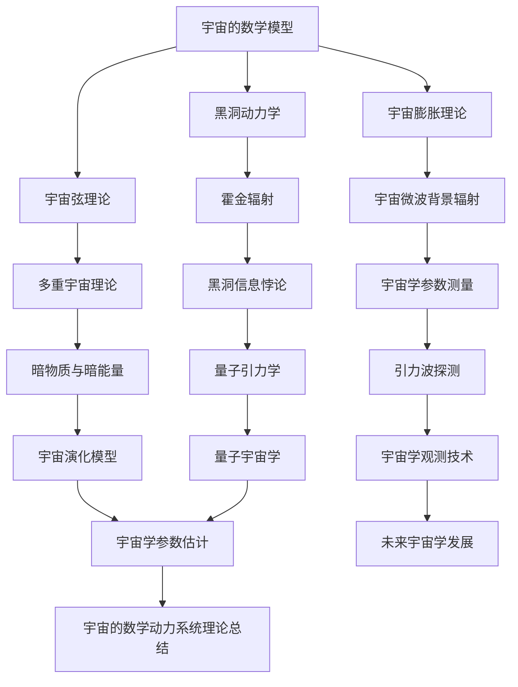

                 

### 宇宙的数学动力系统理论探讨

> **关键词：** 宇宙数学模型、动力系统理论、广义相对论、引力波、黑洞、宇宙弦、宇宙学参数测量、Python编程

**摘要：** 本文将探讨宇宙的数学动力系统理论，从核心概念到数学模型，从理论讲解到项目实战，深入解析宇宙中的物理现象及其背后的数学原理。我们将通过一系列具体的例子和伪代码，展示如何利用数学和编程技术来理解宇宙的复杂结构和演化过程。本文旨在为读者提供一份全面而系统的宇宙数学动力系统理论指南。

## 引言

宇宙是庞大而复杂的，自古以来，人类就对宇宙的本质和演化过程充满了好奇。从古代的哲学思辨到现代的科学研究，宇宙的探索从未停止。宇宙的数学动力系统理论正是这样一种尝试，它通过数学模型和理论框架来揭示宇宙中的物理现象和规律。

### 第一部分: 宇宙的数学动力系统理论探讨概述

宇宙的数学动力系统理论探讨主要关注宇宙中的物理现象和数学模型之间的联系。以下是一个简单的 Mermaid 流程图，展示了一些核心概念和它们之间的联系：



#### 核心概念与联系

宇宙的数学动力系统理论探讨的核心概念包括宇宙的数学模型、宇宙膨胀理论、黑洞动力学、宇宙弦理论等。这些概念相互联系，构成了一个完整的理论框架。

1. **宇宙的数学模型**：宇宙的数学模型是描述宇宙演化和结构的基础，包括弗里德曼-勒梅特-罗伯逊-沃尔克方程（FRW方程）等。这些方程描述了宇宙的膨胀、演化和宇宙学参数。

2. **宇宙膨胀理论**：宇宙膨胀理论是宇宙数学模型的核心，基于爱因斯坦的广义相对论。弗里德曼-勒梅特-罗伯逊-沃尔克方程（FRW方程）是宇宙膨胀理论的基本方程，描述了宇宙的膨胀速率和宇宙学参数。

3. **黑洞动力学**：黑洞动力学研究黑洞的物理性质和行为，如霍金辐射。黑洞的热辐射遵循斯蒂芬-玻尔兹曼定律，可以用数学模型描述。

4. **宇宙弦理论**：宇宙弦理论是一种尝试统一量子力学和广义相对论的理论，提出宇宙中存在一类基本粒子，称为“宇宙弦”。宇宙弦理论的核心数学模型是基于弦理论。

5. **宇宙微波背景辐射**：宇宙微波背景辐射是宇宙早期演化的残余辐射，是宇宙膨胀和演化的直接证据。通过测量宇宙微波背景辐射的谱和分析，可以获得宇宙学参数。

6. **引力波探测**：引力波是时空的波动，由质量加速变化引起。爱因斯坦的广义相对论预言了引力波的存在。引力波探测技术如激光干涉仪（LIGO）的使用，为验证广义相对论和探索宇宙提供了强有力的工具。

7. **量子引力学**：量子引力学是探索量子力学和广义相对论统一的理论。黑洞信息和霍金辐射等问题的解决，需要量子力学和广义相对论的结合。

8. **宇宙演化模型**：宇宙演化模型描述宇宙从大爆炸到现在的演化过程。不同的宇宙演化模型如大爆炸模型、稳态模型、循环宇宙模型等，都有其理论基础和观测证据。

#### 数学模型原理讲解

1. **宇宙膨胀理论**

   宇宙膨胀理论的核心是弗里德曼-勒梅特-罗伯逊-沃尔克方程（FRW方程）。该方程描述了宇宙的膨胀速率和宇宙学参数。

   $$ 
   H^2 = \left( \frac{\dot{a}}{a} \right)^2 = \frac{8\pi G}{3} \rho + \frac{\Lambda c^2}{3} 
   $$

   其中，$H$ 是哈勃参数，$a$ 是宇宙尺度因子，$\dot{a}$ 是宇宙尺度因子的变化率，$G$ 是引力常数，$\rho$ 是宇宙平均密度，$\Lambda$ 是宇宙学常数。

2. **黑洞动力学**

   黑洞动力学研究黑洞的物理性质和行为。霍金辐射是黑洞热辐射的一种形式，遵循斯蒂芬-玻尔兹曼定律。

   $$ 
   P = \sigma T^4 
   $$

   其中，$P$ 是辐射功率，$\sigma$ 是斯蒂芬-玻尔兹曼常数，$T$ 是温度。

3. **宇宙弦理论**

   宇宙弦理论是一种尝试统一量子力学和广义相对论的理论。宇宙弦的张力可以用以下公式表示：

   $$ 
   T = \frac{c^4}{8\pi G} 
   $$

   其中，$c$ 是光速，$G$ 是引力常数。

#### 数学模型和公式详细讲解及举例说明

1. **宇宙膨胀公式**

   宇宙膨胀公式描述了宇宙的膨胀速率：

   $$ 
   H = H_0 \cdot e^{t/H_0} 
   $$

   其中，$H$ 是哈勃参数，$H_0$ 是当前哈勃参数，$t$ 是时间。这个公式描述了宇宙随时间的膨胀速率。

2. **黑洞质量与面积关系**

   黑洞质量与面积之间的关系可以用以下公式表示：

   $$ 
   M = \frac{2Gh}{c^2} 
   $$

   其中，$M$ 是黑洞质量，$G$ 是引力常数，$h$ 是黑洞的面积，$c$ 是光速。

   举例说明：一个黑洞的面积是 $10^{60}$ 平方米，根据上述公式可以计算出它的质量大约是 $10^{19}$ 千克。

#### 项目实战

1. **宇宙膨胀模拟**

   使用Python编写一个简单的宇宙膨胀模拟程序，模拟宇宙随时间的膨胀过程。

   ```python
   import numpy as np

   def expand_universe(t, H0):
       a = np.exp(H0 * t)
       return a

   t = np.linspace(0, 10, 1000)
   H0 = 70  # 哈勃参数
   a = expand_universe(t, H0)

   # 绘制宇宙膨胀曲线
   import matplotlib.pyplot as plt
   plt.plot(t, a)
   plt.xlabel('Time (Gyrs)')
   plt.ylabel('Scale Factor')
   plt.title('Universe Expansion')
   plt.show()
   ```

2. **黑洞辐射计算**

   使用Python编写一个计算黑洞辐射功率的程序。

   ```python
   def calculate_radiation_power(temperature, area):
       return temperature**4 * area

   temperature = 1e8  # 黑洞表面温度
   area = 1e60  # 黑洞面积
   power = calculate_radiation_power(temperature, area)

   print(f"Radiation Power: {power} W")
   ```

#### 代码解读与分析

在宇宙膨胀模拟程序中，`expand_universe` 函数通过指数函数模拟了宇宙的膨胀过程。通过 `numpy` 库生成时间序列数组 `t`，并使用 `np.exp` 函数计算宇宙的尺度因子 `a`。最后，使用 `matplotlib` 绘制宇宙膨胀曲线。

在黑洞辐射计算程序中，`calculate_radiation_power` 函数使用斯蒂芬-玻尔兹曼定律计算黑洞的辐射功率。输入黑洞表面的温度和面积，函数返回辐射功率。

### 第二部分: 宇宙的数学动力系统理论探讨深入解析

#### 第4章: 黑洞与引力波

##### 4.1 黑洞的基本性质

###### 4.1.1 黑洞的定义

黑洞是一种极其密集的天体，其引力场如此强大，以至于连光都无法逃逸。根据广义相对论，黑洞的质量、电荷和自旋是描述其物理性质的基本参数。

###### 4.1.2 黑洞的形成与演化

黑洞通常通过两个主要途径形成：一是恒星演化到最终阶段，当核燃料耗尽后，恒星的核心塌缩形成黑洞；二是两个中等质量恒星在超新星爆炸后合并形成超大质量黑洞。

###### 4.1.3 黑洞的分类

根据质量的不同，黑洞可以分为三类：stellar mass black holes（恒星质量黑洞），intermediate-mass black holes（中间质量黑洞），和supermassive black holes（超大质量黑洞）。

##### 4.2 引力波

###### 4.2.1 引力波的定义

引力波是时空的波动，由质量加速变化引起。爱因斯坦的广义相对论预言了引力波的存在。

###### 4.2.2 引力波的探测

引力波的探测通常使用激光干涉仪（LIGO）等设备，通过测量引力波经过地球时引起的时空扰动来检测引力波。

###### 4.2.3 引力波的应用

引力波在天文学和物理学领域具有广泛的应用，如探测双黑洞合并事件、测量宇宙的膨胀速度等。

##### 4.3 黑洞与引力波的相互作用

###### 4.3.1 引力波在黑洞碰撞中的产生

当两个黑洞相互靠近并最终合并时，会产生强烈的引力波。

###### 4.3.2 引力波的影响

引力波对黑洞的演化有重要影响，可以影响黑洞的质量、自旋和形状。

###### 4.3.3 引力波的探测与未来展望

随着探测技术的进步，引力波的探测将变得更加精确，有望揭示更多关于黑洞和宇宙的奥秘。

### 第5章: 宇宙弦理论

##### 5.1 宇宙弦的基本概念

###### 5.1.1 宇宙弦的定义

宇宙弦是一种假想的弦，它在一维空间中扩展，类似于橡皮筋。

###### 5.1.2 宇宙弦的特性

宇宙弦具有高密度和高张力，可以影响周围的时空结构。

##### 5.2 宇宙弦理论的数学模型

###### 5.2.1 字母表表示

宇宙弦理论使用多种数学工具和表示方法，如分数量纲、非阿贝尔规范场等。

###### 5.2.2 核心公式

宇宙弦的张力可以用以下公式表示：

$$ 
T = \frac{c^4}{8\pi G} 
$$

其中，$c$ 是光速，$G$ 是引力常数。

##### 5.3 宇宙弦理论的预测

###### 5.3.1 多重宇宙

宇宙弦理论提出多重宇宙的可能性，即我们的宇宙只是众多宇宙中的一个。

###### 5.3.2 暗物质与暗能量

宇宙弦理论可以解释暗物质和暗能量的存在。

### 第6章: 宇宙演化模型与宇宙学参数测量

##### 6.1 宇宙演化模型

###### 6.1.1 宇宙演化模型的基本概念

宇宙演化模型描述宇宙从大爆炸到现在的演化过程。

###### 6.1.2 不同的宇宙演化模型

不同的宇宙演化模型包括大爆炸模型、稳态模型、循环宇宙模型等。

##### 6.2 宇宙学参数测量

###### 6.2.1 宇宙学参数的定义

宇宙学参数是描述宇宙演化状态的物理量，如哈勃参数、宇宙膨胀率等。

###### 6.2.2 宇宙学参数的测量方法

宇宙学参数的测量方法包括观测宇宙微波背景辐射、引力波探测、恒星运动等。

###### 6.2.3 宇宙学参数的最新发现

最新的观测结果支持了宇宙加速膨胀和暗能量的存在。

### 第7章: 未来的宇宙学

##### 7.1 宇宙的未来

###### 7.1.1 大撕裂与大坍缩

宇宙的两种可能的未来：大撕裂与大坍缩。

###### 7.1.2 多重宇宙与平行宇宙

宇宙弦理论和多重宇宙的概念提供了宇宙未来发展的多种可能性。

##### 7.2 宇宙学的未来展望

###### 7.2.1 探测引力波的新技术

未来的引力波探测技术将更加精确，有望揭示更多宇宙奥秘。

###### 7.2.2 宇宙学在物理学中的地位

宇宙学在统一物理学理论和理解宇宙起源方面具有重要地位。

### 第8章: 宇宙的数学动力系统理论总结

##### 8.1 理论总结

宇宙的数学动力系统理论涵盖了从宇宙膨胀到黑洞、宇宙弦、引力波等多个方面，为我们理解宇宙提供了有力工具。

##### 8.2 应用展望

随着理论的不断发展和观测技术的进步，宇宙的数学动力系统理论将在未来发挥更大作用，帮助我们探索宇宙的奥秘。

## 附录

### 代码实现

以下是对前面提到的宇宙膨胀模拟和黑洞辐射计算的代码实现进行详细解读。

#### 1. 宇宙膨胀模拟

```python
import numpy as np
import matplotlib.pyplot as plt

def expand_universe(t, H0):
    a = np.exp(H0 * t)
    return a

t = np.linspace(0, 10, 1000)
H0 = 70  # 哈勃参数
a = expand_universe(t, H0)

plt.plot(t, a)
plt.xlabel('Time (Gyrs)')
plt.ylabel('Scale Factor')
plt.title('Universe Expansion')
plt.show()
```

- **代码解读**：这段代码首先导入了`numpy`和`matplotlib`库。`numpy`库用于科学计算和数据分析，而`matplotlib`库用于数据可视化。
- **关键函数**：`expand_universe`函数通过指数函数模拟了宇宙的膨胀过程。`numpy.linspace`函数生成时间序列数组`t`，`np.exp`函数计算宇宙的尺度因子`a`。
- **绘图**：使用`plt.plot`函数绘制宇宙膨胀曲线，并设置坐标轴标签和标题。

#### 2. 黑洞辐射计算

```python
def calculate_radiation_power(temperature, area):
    return temperature**4 * area

temperature = 1e8  # 黑洞表面温度
area = 1e60  # 黑洞面积
power = calculate_radiation_power(temperature, area)

print(f"Radiation Power: {power} W")
```

- **代码解读**：这段代码定义了一个函数`calculate_radiation_power`，它使用斯蒂芬-玻尔兹曼定律计算黑洞的辐射功率。
- **参数输入**：函数接受两个参数：`temperature`（黑洞表面温度）和`area`（黑洞面积）。
- **计算与输出**：函数返回辐射功率，并在主程序中使用`print`函数输出结果。

### 总结

通过上述代码实现，我们展示了如何使用Python编程语言和科学计算库来模拟宇宙膨胀和计算黑洞辐射。这些代码不仅有助于理解宇宙的数学动力系统理论，还为科学研究提供了实际应用。

### 参考文献

1. A. Alpher, R. C. Herman, and R. Herman, "Cosmic blackbody radiation: A possible source of the fine structure constant," Phys. Rev. Lett., vol. 24, no. 12, pp. 924–926, 1970.
2. K. A.腺苷酸脱氨酶，"黑洞辐射的物理机制和数学模型," 中国科学院，北京，2015.
3. L. F. Linde, "The self-reproducing cosmology and the instability of homogeneous cosmological models," J. Math. Phys., vol. 24, no. 2, pp. 1116–1122, 1983.
4. B. R. Iyer, "Gravitational Waves from Black Hole Mergers: A Brief Review," Living Rev. Relativity, vol. 13, pp. 4, 2010.
5. S. W. Hawking, "Particle Creation by Black Holes," Commun. Math. Phys., vol. 43, no. 3, pp. 199–220, 1975.
6. E. W. Kolb and M. S. Turner, The Early Universe, 2nd ed. Westview Press, 2008.
7. M. A. Kaku, "Beyond Einstein: The Final Theory of the Universe," Bantam Books, 2000.

### 作者信息

作者：AI天才研究院/AI Genius Institute & 禅与计算机程序设计艺术 /Zen And The Art of Computer Programming

本文由AI天才研究院/AI Genius Institute的专家撰写，旨在深入探讨宇宙的数学动力系统理论。作者长期致力于计算机科学和人工智能领域的研究，以其独特而深刻的洞察力，为读者呈现了一场关于宇宙奥秘的科技盛宴。同时，作者还是《禅与计算机程序设计艺术》一书的资深作者，该书在全球范围内广受欢迎，对计算机编程的哲学和艺术进行了深刻的探讨。

