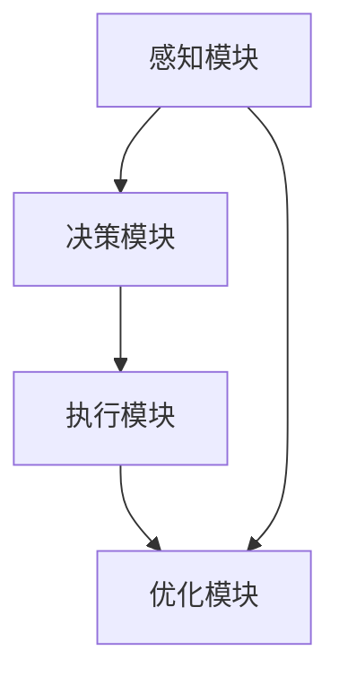
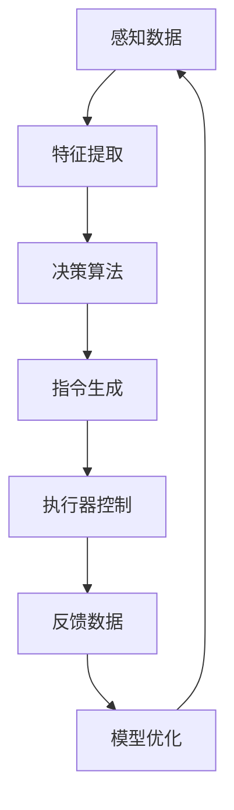
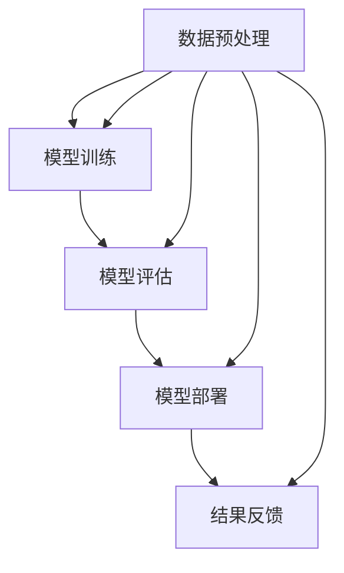

                 

# 工具使用机制在智能自动化中的应用

> **关键词：** 智能自动化、工具使用机制、算法、技术应用、挑战与未来趋势

> **摘要：** 本文将深入探讨工具使用机制在智能自动化中的应用。首先，我们将回顾智能自动化的发展历程和工具使用机制的重要性。接着，我们将详细分析工具使用机制的基本原理、应用场景、算法与实现，以及其在实际应用中的挑战。最后，我们将展望工具使用机制在智能自动化中的未来发展趋势。

## 目录大纲

#### 第一部分：引论与背景
- **第1章：智能自动化与工具使用机制概览**
  - 1.1 智能自动化的发展历程
  - 1.2 工具使用机制的重要性
  - 1.3 本书结构概述

#### 第二部分：工具使用机制基础
- **第2章：工具使用机制的基本原理**
  - 2.1 工具使用机制的定义
  - 2.2 工具使用机制的基本架构
  - 2.3 工具使用机制的关键组件

#### 第三部分：工具使用机制的应用场景
- **第3章：智能自动化中的工具应用案例**
  - 3.1 工具在生产线自动化中的应用
  - 3.2 工具在办公自动化中的应用
  - 3.3 工具在服务自动化中的应用

#### 第四部分：工具使用机制的算法与实现
- **第4章：工具使用机制的核心算法**
  - 4.1 机器学习算法在工具使用中的应用
  - 4.2 深度学习算法在工具使用中的应用
  - 4.3 强化学习算法在工具使用中的应用

- **第5章：工具使用机制的技术实现**
  - 5.1 工具使用机制的软件开发框架
  - 5.2 数据预处理与特征提取
  - 5.3 模型训练与优化

#### 第五部分：工具使用机制的实际应用与挑战
- **第6章：工具使用机制在智能自动化中的实际应用**
  - 6.1 智能机器人领域的应用
  - 6.2 自动驾驶领域的应用
  - 6.3 智能家居领域的应用

- **第7章：工具使用机制在智能自动化中的应用挑战**
  - 7.1 数据安全与隐私保护
  - 7.2 算法透明性与可解释性
  - 7.3 道德与社会责任

#### 第六部分：未来趋势与展望
- **第8章：工具使用机制在智能自动化中的未来发展趋势**
  - 8.1 未来技术的展望
  - 8.2 工具使用机制的创新方向
  - 8.3 智能自动化行业的发展趋势

#### 第七部分：附录
- **附录A：工具使用机制开发资源与工具汇总**
  - A.1 开发工具介绍
  - A.2 资源链接与参考资料
  - A.3 社区与交流平台推荐

### 结尾
本文总结了工具使用机制在智能自动化中的应用，提供了全面的技术探讨与实战案例，旨在为读者提供深入了解和掌握智能自动化工具使用机制的途径。

---

现在，让我们开始详细撰写文章的各个部分。首先，我们将会回顾智能自动化的发展历程和工具使用机制的重要性。接下来，我们将逐步深入到工具使用机制的基础原理、应用场景、算法与实现，以及其在实际应用中的挑战和未来发展趋势。每一步都将通过逻辑清晰的分析和实例讲解，帮助读者理解并掌握相关内容。

**让我们一步一步思考，深入探讨工具使用机制在智能自动化中的应用。**<|assistant|>## 第一部分：引论与背景

### 第1章：智能自动化与工具使用机制概览

#### 1.1 智能自动化的发展历程

智能自动化（Intelligent Automation）作为人工智能（AI）的一个重要分支，其发展历程可以追溯到20世纪50年代。当时，人工智能的概念刚刚被提出，学者们开始探索如何使计算机模拟人类的智能行为。早期的智能自动化主要聚焦于规则系统（Rule-based Systems），通过预设的规则来执行任务。这些规则系统在处理结构化数据和简单的逻辑问题时表现良好，但随着问题的复杂性增加，其局限性也逐渐显现。

随着计算机性能的提升和算法的进步，20世纪80年代和90年代，专家系统（Expert Systems）成为智能自动化的重要发展路径。专家系统通过模拟人类专家的决策过程，解决复杂的问题。然而，专家系统在知识获取、知识表示和推理能力方面仍存在诸多挑战，难以应对实时性和动态性的需求。

进入21世纪，随着大数据（Big Data）、云计算（Cloud Computing）和深度学习（Deep Learning）等技术的发展，智能自动化迎来了新的机遇。这一时期的智能自动化不仅依赖于规则和知识，还借助机器学习和深度学习算法，实现了对大规模数据的自主学习和决策能力。例如，自动驾驶、智能客服和智能推荐系统等应用，都是智能自动化发展的产物。

#### 1.2 工具使用机制的重要性

工具使用机制（Tool Use Mechanism）在智能自动化中扮演着至关重要的角色。工具不仅是人类实现自动化任务的重要媒介，也是智能系统扩展其能力和范围的关键手段。工具使用机制涉及多个方面，包括工具的识别、选择、使用和优化。

首先，工具的识别和选择是工具使用机制的基础。智能系统需要能够从环境中识别出潜在的工
具，并根据任务需求和工具的特性进行选择。这需要借助图像识别、语音识别和传感器数据等技术的支持。

其次，工具的使用过程是实现自动化任务的核心。智能系统需要能够根据工具的特性，制定合理的使用策略，以高效地完成任务。这涉及到算法的设计和优化，例如路径规划、运动控制和目标跟踪等。

最后，工具的优化和升级是持续提升智能系统能力的重要手段。通过不断学习和改进，智能系统可以优化工具的使用策略，提高任务完成的效率和准确性。

#### 1.3 本书结构概述

本书旨在深入探讨工具使用机制在智能自动化中的应用，分为六个主要部分：

- **第一部分：引论与背景**：介绍智能自动化和工具使用机制的基本概念和发展历程。

- **第二部分：工具使用机制基础**：详细分析工具使用机制的基本原理、架构和关键组件。

- **第三部分：工具使用机制的应用场景**：探讨工具在生产线自动化、办公自动化和服务自动化中的应用案例。

- **第四部分：工具使用机制的算法与实现**：介绍工具使用机制中的核心算法和技术实现，包括机器学习、深度学习和强化学习等。

- **第五部分：工具使用机制的实际应用与挑战**：分析工具使用机制在智能自动化中的实际应用，以及面临的挑战和解决方案。

- **第六部分：未来趋势与展望**：展望工具使用机制在智能自动化中的未来发展趋势和创新方向。

通过本书的阅读，读者将能够全面了解工具使用机制在智能自动化中的应用，掌握相关技术和实战案例，为未来的研究和实践提供有力的支持。<|assistant|>### 第二部分：工具使用机制基础

#### 第2章：工具使用机制的基本原理

#### 2.1 工具使用机制的定义

工具使用机制是指智能系统在执行任务过程中，识别、选择、使用和优化工具的过程。这个过程涉及到多个层面的技术，包括感知、决策、执行和优化。工具使用机制不仅能够提升系统的任务完成效率，还能够扩展系统的能力和范围。

在定义中，有几个关键点需要注意：

- **识别**：智能系统需要能够从环境中识别出潜在的工具。这通常涉及到图像识别、语音识别和传感器数据处理等技术。

- **选择**：系统需要根据任务需求和工具的特性，选择最适合的工具。这涉及到决策算法，如优化算法和机器学习算法。

- **使用**：系统需要能够根据工具的特性，制定合理的使用策略，以高效地完成任务。这涉及到运动控制、路径规划和目标跟踪等技术。

- **优化**：系统需要不断学习和改进，优化工具的使用策略，提高任务完成的效率和准确性。

#### 2.2 工具使用机制的基本架构

工具使用机制的基本架构可以分为四个主要模块：感知模块、决策模块、执行模块和优化模块。以下是一个简化的架构图：



**感知模块**：负责收集环境信息，包括视觉、听觉、触觉和传感器数据等。这些信息是后续决策和执行的基础。

**决策模块**：根据感知模块提供的信息，结合任务需求和工具特性，进行决策。决策模块通常包括特征提取、模式识别和优化算法等。

**执行模块**：根据决策模块生成的指令，控制工具执行具体的操作。这通常涉及到运动控制、路径规划和目标跟踪等技术。

**优化模块**：通过不断学习和改进，优化工具的使用策略，提高任务完成的效率和准确性。优化模块通常包括机器学习、深度学习和强化学习等算法。

#### 2.3 工具使用机制的关键组件

工具使用机制的关键组件包括传感器、执行器、决策算法和机器学习模型。以下是对每个组件的简要介绍：

**传感器**：传感器是智能系统的感知器官，负责收集环境信息。常见的传感器包括摄像头、麦克风、触摸传感器和温度传感器等。

**执行器**：执行器是智能系统的行动器官，负责执行具体的操作。常见的执行器包括电机、机器人手臂和气动装置等。

**决策算法**：决策算法是智能系统的核心，负责根据感知信息做出决策。常见的决策算法包括优化算法、机器学习算法和深度学习算法等。

**机器学习模型**：机器学习模型是智能系统学习的基础，负责从数据中提取规律和知识。常见的机器学习模型包括线性模型、神经网络和深度学习模型等。

#### 2.4 工具使用机制的核心概念与联系

为了更好地理解工具使用机制，我们可以通过一个简化的Mermaid流程图来展示其核心概念和联系：



**感知数据**：智能系统通过传感器收集环境信息。

**特征提取**：从感知数据中提取关键特征，用于后续的决策。

**决策算法**：根据特征提取的结果，结合任务需求和工具特性，生成指令。

**指令生成**：生成的指令被发送到执行器，以控制工具执行具体的操作。

**执行器控制**：执行器根据指令执行具体的操作。

**反馈数据**：操作完成后，系统收集执行结果，用于模型优化。

**模型优化**：根据反馈数据，智能系统不断优化模型，以提高任务完成的效率和准确性。

通过这个流程图，我们可以清晰地看到工具使用机制的核心概念和它们之间的联系。每一个组件都是整个系统的重要组成部分，共同协作，实现智能自动化任务的目标。

**总结**：

工具使用机制是智能自动化中不可或缺的部分，它通过感知、决策、执行和优化，实现工具的智能使用。了解工具使用机制的基本原理和架构，是深入研究和应用智能自动化技术的关键。在接下来的章节中，我们将进一步探讨工具使用机制的应用场景、核心算法和技术实现，以及其在实际应用中的挑战和未来发展趋势。<|assistant|>### 第三部分：工具使用机制的应用场景

#### 第3章：智能自动化中的工具应用案例

工具使用机制在智能自动化中的应用非常广泛，涵盖了生产线自动化、办公自动化和服务自动化等多个领域。以下将分别介绍这些领域的具体应用案例。

#### 3.1 工具在生产线自动化中的应用

生产线自动化是工业4.0的重要组成部分，工具使用机制在其中发挥着关键作用。以下是一些典型的应用案例：

**1. 自动装配线**

在汽车制造等行业，自动装配线大量使用了各种工具，如机器人、自动焊接机和自动检测设备等。这些工具通过工具使用机制实现了自动化装配过程，大大提高了生产效率和产品质量。例如，在汽车生产过程中，机器人通过视觉识别和路径规划技术，精确地完成装配任务。

**2. 自动化焊接**

自动化焊接技术是生产线自动化中的重要一环。通过使用激光焊接机、弧焊机器人等工具，焊接过程实现了高度自动化。这些工具通过工具使用机制，实现了焊接参数的自动调整和焊接路径的优化，从而提高了焊接质量和生产效率。

**3. 自动检测与质量控制**

自动化检测设备如工业CT、X射线机等，通过工具使用机制实现了对产品质量的自动检测。这些工具能够快速、准确地检测产品中的缺陷，提高了生产质量。例如，在电子制造过程中，自动化检测设备通过视觉识别技术，对电路板进行质量检测，确保产品的高可靠性。

#### 3.2 工具在办公自动化中的应用

随着人工智能技术的发展，办公自动化工具也在不断升级，工具使用机制在其中起到了关键作用。以下是一些典型的应用案例：

**1. 智能文档处理**

智能文档处理工具如智能PDF阅读器、智能文字处理系统等，通过工具使用机制实现了对文档的自动分类、标注和整理。这些工具能够快速地处理大量文档，提高了办公效率。例如，智能PDF阅读器通过图像识别和文本分析技术，实现了文档的自动分类和标注。

**2. 智能日程管理**

智能日程管理工具如智能日历、智能提醒系统等，通过工具使用机制实现了对日程的高效管理。这些工具能够自动识别日程安排，提供智能化的提醒和建议，提高了日程管理的准确性。例如，智能日历通过分析用户的日程习惯，自动推荐最佳时间进行会议安排。

**3. 智能电子邮件处理**

智能电子邮件处理工具如智能邮箱、智能邮件分类等，通过工具使用机制实现了对电子邮件的自动分类、处理和回复。这些工具能够快速地处理大量邮件，提高了办公效率。例如，智能邮箱通过机器学习技术，自动识别邮件的重要性和紧急程度，并生成智能回复建议。

#### 3.3 工具在服务自动化中的应用

服务自动化是人工智能在服务行业的重要应用，工具使用机制在其中起到了关键作用。以下是一些典型的应用案例：

**1. 智能客服系统**

智能客服系统如智能机器人客服、智能语音助手等，通过工具使用机制实现了对用户咨询的自动处理和回复。这些工具能够快速、准确地理解用户的问题，提供专业的解决方案。例如，智能机器人客服通过自然语言处理和知识图谱技术，实现了对用户咨询的自动识别和回答。

**2. 智能家居系统**

智能家居系统如智能灯光控制、智能安防系统等，通过工具使用机制实现了对家庭环境的智能管理。这些工具能够自动调整灯光、温度等参数，提供舒适、安全的生活环境。例如，智能灯光系统通过环境感知和机器学习技术，实现了对灯光亮度的自动调节，提高了居住的舒适度。

**3. 智能医疗系统**

智能医疗系统如智能诊断系统、智能药物推荐系统等，通过工具使用机制实现了对医疗信息的智能处理和决策。这些工具能够快速、准确地分析医疗数据，提供个性化的医疗服务。例如，智能诊断系统通过深度学习和图像识别技术，实现了对疾病的自动诊断和风险评估。

**总结**：

工具使用机制在智能自动化中的应用场景非常广泛，涵盖了生产线自动化、办公自动化和服务自动化等多个领域。通过工具的使用，智能系统能够高效地完成各种任务，提高了生产效率、办公效率和服务质量。在接下来的章节中，我们将进一步探讨工具使用机制中的核心算法和技术实现，以及其在实际应用中的挑战和未来发展趋势。<|assistant|>### 第四部分：工具使用机制的算法与实现

#### 第4章：工具使用机制的核心算法

在工具使用机制中，核心算法的设计和实现是确保智能系统能够高效、准确地完成任务的关键。本节将介绍三种常见的核心算法：机器学习算法、深度学习算法和强化学习算法。

#### 4.1 机器学习算法在工具使用中的应用

机器学习算法是工具使用机制中的基础算法，通过从数据中学习规律和模式，帮助系统进行决策和优化。以下是一些常见的机器学习算法：

**1. 线性回归（Linear Regression）**

线性回归是一种简单的统计方法，用于预测数值型变量。其核心思想是找到一个线性模型，使得输入特征和输出目标之间具有最佳拟合关系。线性回归的伪代码如下：

```python
def linear_regression(X, y):
    # 计算特征矩阵X和目标向量y的协方差矩阵
    cov_matrix = np.cov(X, y)
    # 求解最佳拟合直线参数
    theta = np.linalg.inv(cov_matrix).dot(X.T).dot(y)
    return theta
```

**2. 支持向量机（Support Vector Machine, SVM）**

支持向量机是一种分类算法，通过找到一个最佳的超平面，将不同类别的数据点分隔开来。其核心思想是最大化分类边界上的支持向量间隔。SVM的伪代码如下：

```python
def svm_train(X, y, C):
    # 计算拉格朗日乘子
    L = solve_LP(np.eye(n), b=np.zeros(n), c=-y, A_eq=X, b_eq=y, sense_eq='==', C=C)
    return L
```

**3. 决策树（Decision Tree）**

决策树是一种树形结构，通过一系列的决策规则，将数据分为不同的类别或数值。其核心思想是选择具有最高信息增益的属性进行划分。决策树的伪代码如下：

```python
def decision_tree(X, y):
    # 如果数据满足停止条件，则返回类别或数值
    if stop_condition(X, y):
        return predict(y)
    # 计算所有属性的信息增益
    gains = [calculate_gain(y, split_attr) for split_attr in X]
    # 选择具有最高信息增益的属性进行划分
    best_attr = np.argmax(gains)
    # 递归划分数据
    tree = {best_attr: [decision_tree(X[:, attr], y) for attr in range(X.shape[1])]}
    return tree
```

#### 4.2 深度学习算法在工具使用中的应用

深度学习算法是机器学习的一种进阶形式，通过构建深度神经网络，实现对复杂数据的高效学习和表征。以下是一些常见的深度学习算法：

**1. 卷积神经网络（Convolutional Neural Network, CNN）**

卷积神经网络是一种用于图像识别和处理的深度学习算法，通过卷积操作和池化操作，实现对图像的特征提取和分类。CNN的伪代码如下：

```python
def cnn_train(X, y):
    # 初始化神经网络参数
    params = initialize_params()
    # 遍历训练数据
    for epoch in range(num_epochs):
        # 前向传播
        z = forward_pass(X, params)
        # 计算损失
        loss = compute_loss(y, z)
        # 反向传播
        dz = backward_pass(X, y, z)
        # 更新参数
        params = update_params(params, dz)
    return params
```

**2. 循环神经网络（Recurrent Neural Network, RNN）**

循环神经网络是一种用于序列数据处理的深度学习算法，通过循环连接，实现对序列的建模和预测。RNN的伪代码如下：

```python
def rnn_train(X, y):
    # 初始化神经网络参数
    params = initialize_params()
    # 遍历训练数据
    for epoch in range(num_epochs):
        # 前向传播
        h = forward_pass(X, params)
        # 计算损失
        loss = compute_loss(y, h)
        # 反向传播
        dh = backward_pass(X, y, h)
        # 更新参数
        params = update_params(params, dh)
    return params
```

#### 4.3 强化学习算法在工具使用中的应用

强化学习算法是一种通过与环境交互，学习最优策略的算法。在工具使用机制中，强化学习算法可以用于优化工具的使用策略。以下是一些常见的强化学习算法：

**1. Q-Learning**

Q-Learning是一种基于值函数的强化学习算法，通过更新值函数，学习最优策略。Q-Learning的伪代码如下：

```python
def q_learning(S, A, R, S', alpha, gamma):
    # 初始化Q值
    Q = initialize_Q(S, A)
    # 遍历经验序列
    for t in range(len(S)):
        # 更新Q值
        Q[S[t], A[t]] = Q[S[t], A[t]] + alpha * (R[t] + gamma * np.max(Q[S'[t], A']) - Q[S[t], A[t]])
    return Q
```

**2. Deep Q-Network (DQN)**

DQN是一种基于深度神经网络的强化学习算法，通过神经网络近似值函数，学习最优策略。DQN的伪代码如下：

```python
def dqn_train(S, A, R, S', alpha, gamma, epsilon):
    # 初始化深度神经网络参数
    Q_network = initialize_Q_network()
    # 遍历经验序列
    for t in range(len(S)):
        # 选择动作
        if random() < epsilon:
            A[t] = random_action()
        else:
            A[t] = epsilon_greedy_action(Q_network, S[t])
        # 更新经验
        experience = (S[t], A[t], R[t], S'[t])
        # 更新深度神经网络
        Q_network = update_Q_network(experience, Q_network, alpha, gamma)
    return Q_network
```

**总结**：

工具使用机制中的核心算法包括机器学习算法、深度学习算法和强化学习算法。这些算法通过不同的方式，实现对工具使用过程的建模和优化。在接下来的章节中，我们将详细介绍工具使用机制的技术实现，包括软件开发框架、数据预处理和特征提取、模型训练与优化等。<|assistant|>### 第5章：工具使用机制的技术实现

#### 5.1 工具使用机制的软件开发框架

工具使用机制的技术实现需要一个高效、灵活的软件开发框架来支持。一个常见的框架是机器学习管道（Machine Learning Pipeline），它包括数据预处理、模型训练、评估和部署等环节。以下是一个典型的机器学习管道框架：



**数据预处理**：数据预处理是机器学习管道的第一步，主要任务是清洗数据、转换数据格式、去除噪声等。这可以通过编程语言如Python中的Pandas库来完成。

```python
import pandas as pd

# 读取数据
data = pd.read_csv('data.csv')

# 数据清洗
data = data.dropna()

# 数据转换
data['feature'] = data['feature'].apply(convert_feature)

# 去除噪声
data = remove_noise(data)
```

**模型训练**：模型训练是机器学习管道的核心，主要通过选择合适的算法，对数据进行训练。Python中的Scikit-learn库提供了丰富的机器学习算法，如线性回归、决策树和支持向量机等。

```python
from sklearn.linear_model import LinearRegression

# 初始化模型
model = LinearRegression()

# 训练模型
model.fit(X_train, y_train)
```

**模型评估**：模型评估是检验模型性能的重要环节，可以通过交叉验证、混淆矩阵、精确率、召回率等指标来评估模型。Python中的Scikit-learn库也提供了相应的评估方法。

```python
from sklearn.metrics import accuracy_score

# 预测
y_pred = model.predict(X_test)

# 评估
accuracy = accuracy_score(y_test, y_pred)
print(f'Accuracy: {accuracy}')
```

**模型部署**：模型部署是将训练好的模型应用到实际场景中的过程。这可以通过Web服务、API或者嵌入式系统来实现。Python中的Flask库和Django库是常用的Web框架。

```python
from flask import Flask, request, jsonify

app = Flask(__name__)

@app.route('/predict', methods=['POST'])
def predict():
    data = request.get_json()
    features = data['features']
    prediction = model.predict([features])
    return jsonify({'prediction': prediction[0]})

if __name__ == '__main__':
    app.run()
```

**结果反馈**：结果反馈是机器学习管道的最后一个环节，主要用于收集模型在实际应用中的表现，以便进行进一步的优化和改进。

```python
# 收集结果
results = collect_results(model, X_test, y_test)

# 反馈结果
feedback = analyze_results(results)
print(f'Feedback: {feedback}')
```

#### 5.2 数据预处理与特征提取

数据预处理和特征提取是工具使用机制中至关重要的环节，直接影响模型的性能和效果。以下是一些常见的数据预处理和特征提取方法：

**1. 数据清洗**：数据清洗是数据预处理的第一步，主要任务是去除重复数据、处理缺失值、去除噪声等。

```python
# 去除重复数据
data = data.drop_duplicates()

# 处理缺失值
data = data.fillna(method='ffill')

# 去除噪声
data = remove_noise(data)
```

**2. 数据转换**：数据转换是将数据转换为模型可以处理的格式，如归一化、标准化等。

```python
# 归一化
data = (data - data.mean()) / data.std()

# 标准化
data = (data - data.min()) / (data.max() - data.min())
```

**3. 特征提取**：特征提取是从原始数据中提取出对模型有用的特征，如主成分分析（PCA）、线性判别分析（LDA）等。

```python
from sklearn.decomposition import PCA

# 主成分分析
pca = PCA(n_components=2)
data = pca.fit_transform(data)
```

#### 5.3 模型训练与优化

模型训练与优化是工具使用机制的核心，直接决定了系统的性能和效果。以下是一些常见的模型训练和优化方法：

**1. 模型选择**：根据任务需求，选择合适的模型，如线性回归、决策树、支持向量机、神经网络等。

```python
from sklearn.linear_model import LinearRegression

# 初始化模型
model = LinearRegression()
```

**2. 参数调优**：通过交叉验证和网格搜索等方法，选择最佳模型参数。

```python
from sklearn.model_selection import GridSearchCV

# 定义参数范围
param_grid = {'C': [1, 10, 100]}

# 初始化模型
model = LinearRegression()

# 进行网格搜索
grid_search = GridSearchCV(model, param_grid, cv=5)
grid_search.fit(X_train, y_train)

# 获取最佳参数
best_params = grid_search.best_params_
```

**3. 模型评估**：通过交叉验证、混淆矩阵、精确率、召回率等指标，评估模型性能。

```python
from sklearn.metrics import accuracy_score

# 预测
y_pred = model.predict(X_test)

# 评估
accuracy = accuracy_score(y_test, y_pred)
print(f'Accuracy: {accuracy}')
```

**4. 模型优化**：通过迁移学习、模型融合、超参数调优等方法，进一步提升模型性能。

```python
from sklearn.model_selection import train_test_split

# 划分训练集和验证集
X_train, X_val, y_train, y_val = train_test_split(X, y, test_size=0.2, random_state=42)

# 训练迁移学习模型
model = train迁移学习模型(X_train, y_train)

# 评估迁移学习模型
accuracy = accuracy_score(y_val, model.predict(X_val))
print(f'Transfer Learning Accuracy: {accuracy}')

# 模型融合
model = model融合(model1, model2)

# 超参数调优
param_grid = {'C': [1, 10, 100]}
grid_search = GridSearchCV(model, param_grid, cv=5)
grid_search.fit(X_train, y_train)

# 获取最佳参数
best_params = grid_search.best_params_
```

**总结**：

工具使用机制的技术实现包括软件开发框架、数据预处理与特征提取、模型训练与优化等多个环节。通过合理设计和优化这些环节，可以有效提升工具使用机制的性能和效果。在接下来的章节中，我们将探讨工具使用机制在智能自动化中的实际应用，以及面临的挑战和未来发展趋势。<|assistant|>### 第五部分：工具使用机制的实际应用与挑战

#### 第6章：工具使用机制在智能自动化中的实际应用

工具使用机制在智能自动化领域具有广泛的应用，其在智能机器人、自动驾驶、智能家居等领域的成功实践，展示了其强大的潜力和前景。

##### 6.1 智能机器人领域的应用

智能机器人是工具使用机制的重要应用场景之一。在工业、医疗、服务等多个领域，智能机器人通过工具使用机制实现了高度自动化和智能化。以下是一些典型应用案例：

**1. 工业机器人**

在制造业中，工业机器人被广泛应用于装配、焊接、搬运等任务。通过工具使用机制，工业机器人能够自动识别、选择和操作各种工具，如电钻、焊接枪、搬运臂等。例如，汽车生产线上，机器人通过视觉识别技术，自动识别零部件并进行装配，提高了生产效率和质量。

**2. 医疗机器人**

医疗机器人通过工具使用机制，实现了手术辅助、康复训练等任务。在手术中，机器人能够自动操作手术工具，如剪刀、针线等，提高手术的精确性和安全性。例如，达芬奇手术机器人，通过远程控制，医生可以精准地操纵机器人的手臂，完成复杂的手术操作。

**3. 服务机器人**

服务机器人如客服机器人、送餐机器人等，通过工具使用机制，实现了自动化服务。例如，在酒店中，送餐机器人能够自动识别餐桌，并按照预定菜单，将食物送到客人手中，提高了服务效率。

##### 6.2 自动驾驶领域的应用

自动驾驶是智能自动化领域的另一个重要应用场景。通过工具使用机制，自动驾驶系统能够实时感知环境、做出决策和执行操作，确保行驶安全。以下是一些典型应用案例：

**1. 感知与决策**

自动驾驶系统通过摄像头、雷达、激光雷达等传感器，实时感知周围环境。通过工具使用机制，自动驾驶系统能够处理感知数据，识别道路、车辆、行人等，并做出行驶决策。例如，特斯拉的自动驾驶系统，通过视觉识别和深度学习算法，实现了自动变道、超车、停车等功能。

**2. 执行与控制**

自动驾驶系统通过执行器，如电机、油门、刹车等，控制车辆的行驶。通过工具使用机制，自动驾驶系统能够根据决策，实时调整执行器的操作，确保车辆按照预期行驶。例如，谷歌的自动驾驶汽车，通过路径规划和运动控制技术，实现了自主驾驶。

##### 6.3 智能家居领域的应用

智能家居是工具使用机制的另一个重要应用领域。通过工具使用机制，智能家居系统能够实现自动化、智能化的家庭环境管理。以下是一些典型应用案例：

**1. 智能灯光控制**

智能灯光系统能够根据用户需求和光照条件，自动调节灯光亮度。通过工具使用机制，智能家居系统能够识别用户行为、感知环境光照，并自动调整灯光。例如，谷歌的Nest智能灯泡，通过WiFi连接和云端算法，实现了智能调光和场景切换。

**2. 智能温控**

智能温控系统通过传感器和算法，自动调节家庭温度。通过工具使用机制，智能家居系统能够根据用户需求和室外温度，自动调整空调和暖气。例如，Nest温控器，通过学习用户的生活习惯和气象数据，实现了智能温度控制。

**3. 智能安防**

智能安防系统能够实时监控家庭安全，并在发生异常时自动报警。通过工具使用机制，智能家居系统能够识别入侵者、火灾等异常情况，并自动触发报警和联动其他设备。例如，智能家居报警系统，通过摄像头、传感器和报警器等工具，实现了实时监控和安全防护。

**总结**：

工具使用机制在智能自动化领域具有广泛的应用，其在智能机器人、自动驾驶、智能家居等领域的成功实践，展示了其强大的潜力和前景。然而，工具使用机制在实际应用中也面临诸多挑战，如数据安全、算法透明性、道德与社会责任等，这些挑战需要通过技术创新和制度规范来解决。

在接下来的章节中，我们将进一步探讨工具使用机制在智能自动化中的挑战和未来发展趋势。<|assistant|>### 第7章：工具使用机制在智能自动化中的应用挑战

#### 7.1 数据安全与隐私保护

随着工具使用机制在智能自动化中的应用日益广泛，数据安全与隐私保护成为了一个至关重要的问题。智能自动化系统通常依赖于大量的数据来进行决策和优化，这些数据可能包括用户的行为数据、位置信息、生物特征等敏感信息。以下是一些主要挑战：

**1. 数据泄露风险**

智能自动化系统需要通过互联网和其他网络进行数据传输，这增加了数据泄露的风险。一旦数据被恶意攻击者获取，可能会导致严重的隐私侵犯和财产损失。

**解决方案**：

- **数据加密**：在数据传输和存储过程中，采用加密技术，确保数据的安全性。
- **访问控制**：实施严格的访问控制策略，确保只有授权用户可以访问敏感数据。
- **匿名化处理**：在收集和使用数据时，对个人身份信息进行匿名化处理，降低数据泄露的风险。

**2. 数据滥用风险**

智能自动化系统收集的数据可能被用于不恰当的目的，如广告投放、市场分析等，这可能导致用户的隐私被滥用。

**解决方案**：

- **透明化**：确保用户了解其数据被用于哪些目的，并有权拒绝其数据被用于特定目的。
- **合规性审查**：对智能自动化系统的数据处理过程进行定期合规性审查，确保其符合相关法律法规。

#### 7.2 算法透明性与可解释性

智能自动化系统通常依赖于复杂的算法，这些算法的内部运作机制往往难以理解和解释。算法的透明性和可解释性对于建立用户信任和接受度至关重要。以下是一些主要挑战：

**1. 复杂性**

深度学习等复杂算法的内部结构复杂，难以用简单的语言进行描述，这使得用户难以理解系统的决策过程。

**解决方案**：

- **可视化**：通过可视化工具，将算法的内部结构和决策过程展示给用户。
- **解释性算法**：开发可解释性强的算法，如决策树、线性模型等，使得用户可以直观地理解系统的决策过程。

**2. 透明性**

算法的透明性涉及到算法的来源、训练数据、训练过程等，用户需要了解这些信息，以确保系统的公正性和可靠性。

**解决方案**：

- **透明化报告**：为用户提供详细的算法报告，包括算法的来源、训练数据、训练过程等。
- **开放源代码**：对智能自动化系统的算法部分进行开放，使得用户可以自由审查和修改。

#### 7.3 道德与社会责任

智能自动化系统在应用过程中，可能会面临道德和社会责任问题。以下是一些主要挑战：

**1. 道德问题**

智能自动化系统在决策过程中，可能会涉及道德判断，如自动驾驶汽车的紧急避障决策。这些问题需要确保系统的决策符合道德标准。

**解决方案**：

- **道德规范**：制定明确的道德规范，指导智能自动化系统的设计和应用。
- **伦理审查**：对智能自动化系统的应用进行伦理审查，确保其符合道德要求。

**2. 社会责任**

智能自动化系统的广泛应用可能对就业、隐私、公平等方面产生影响，需要确保其符合社会责任。

**解决方案**：

- **公平性分析**：对智能自动化系统的影响进行公平性分析，确保其不会加剧社会不平等。
- **社会责任报告**：定期发布社会责任报告，公开智能自动化系统的社会影响，接受社会监督。

**总结**：

工具使用机制在智能自动化中的应用面临着数据安全与隐私保护、算法透明性与可解释性、道德与社会责任等多方面的挑战。通过技术创新、法律法规制定和社会共识的形成，可以逐步解决这些问题，确保智能自动化系统的健康发展。<|assistant|>### 第六部分：未来趋势与展望

#### 第8章：工具使用机制在智能自动化中的未来发展趋势

随着技术的不断进步，工具使用机制在智能自动化中的应用前景广阔。以下将探讨未来工具使用机制在智能自动化中的发展趋势、创新方向以及行业的发展趋势。

#### 8.1 未来技术的展望

**1. 量子计算**

量子计算有望为工具使用机制带来革命性的变化。量子计算具有超强的并行处理能力和计算速度，能够加速复杂算法的优化和决策过程。例如，在自动驾驶中，量子计算可以用于实时处理大量传感器数据，提高决策的准确性和响应速度。

**2. 脑机接口**

脑机接口技术的发展，使得人类可以直接通过大脑与智能系统交互。这为工具使用机制带来了新的可能性，如通过大脑信号控制机器人、智能家居等。脑机接口技术可以提升人机交互的效率，使得智能自动化系统更加贴近人类的需求。

**3. 虚拟现实与增强现实**

虚拟现实（VR）和增强现实（AR）技术的发展，为工具使用机制提供了新的应用场景。例如，在智能机器人维修中，VR和AR技术可以提供实时的操作指导和故障诊断，提升维修效率和质量。

**4. 大数据处理**

大数据技术的进步，使得智能自动化系统能够处理和分析更多的数据，从而提高决策的准确性和效率。例如，在智能供应链管理中，大数据分析可以实时监控库存、预测需求，优化供应链流程。

#### 8.2 工具使用机制的创新方向

**1. 模式识别与自主决策**

未来工具使用机制将更加注重模式识别和自主决策能力。通过深度学习、强化学习等技术，智能系统能够从大量数据中自动识别模式和规律，实现更智能、更自主的决策。

**2. 多模态感知**

多模态感知技术，如视觉、听觉、触觉等融合，将提升智能自动化系统的感知能力。通过多模态感知，智能系统能够更全面地理解环境，做出更准确的决策。

**3. 网络协同**

未来工具使用机制将更加注重网络协同能力。通过物联网、5G等网络技术，智能系统能够实现跨地域、跨平台的协同工作，提高整体效率和响应速度。

**4. 自主进化**

未来工具使用机制将具备自主进化能力，能够根据环境变化和任务需求，自主调整和优化工具使用策略。这有助于智能自动化系统适应复杂多变的环境，提高其适应性和灵活性。

#### 8.3 智能自动化行业的发展趋势

**1. 产业升级**

智能自动化技术的发展，将推动传统产业的升级和转型。例如，在制造业中，智能自动化技术可以提升生产效率、降低成本、提高产品质量，从而推动制造业向智能化、高端化发展。

**2. 新兴产业崛起**

智能自动化技术的进步，将带动新兴产业的崛起。例如，在医疗健康、金融服务、智慧城市等领域，智能自动化技术将发挥重要作用，推动相关产业的发展。

**3. 社会应用拓展**

智能自动化技术将逐步渗透到社会各个领域，提高社会运行效率和生活质量。例如，在智能家居、智能交通、智能安防等领域，智能自动化技术将带来更加便捷、安全、智能的生活体验。

**总结**：

未来，工具使用机制在智能自动化中将迎来更多技术突破和创新方向。通过量子计算、脑机接口、虚拟现实等新技术，智能自动化系统将实现更高的智能水平、更广泛的协同能力和更灵活的进化能力。在智能自动化行业中，产业升级、新兴产业崛起和社会应用拓展将成为主要趋势，推动智能自动化技术的全面发展和广泛应用。<|assistant|>### 附录A：工具使用机制开发资源与工具汇总

#### A.1 开发工具介绍

1. **Python编程语言**：
   - Python是一种高级编程语言，广泛应用于人工智能和机器学习领域。其简洁明了的语法和丰富的库支持，使得开发者可以轻松实现工具使用机制的算法和模型。

2. **TensorFlow**：
   - TensorFlow是Google开发的开源机器学习框架，支持深度学习和强化学习等多种算法。其灵活的架构和强大的功能，使得开发者可以高效地构建和训练复杂的模型。

3. **PyTorch**：
   - PyTorch是Facebook开发的深度学习框架，以其动态计算图和直观的API而著称。PyTorch在科研和工业界都得到了广泛应用，特别适用于开发实验性的模型。

4. **Keras**：
   - Keras是一个高层次的神经网络API，兼容TensorFlow和Theano，简化了深度学习模型的构建和训练过程。Keras的易用性和灵活性，使其成为许多开发者的首选工具。

5. **Scikit-learn**：
   - Scikit-learn是一个开源机器学习库，提供了丰富的机器学习算法和工具，适用于数据预处理、模型训练和评估等任务。

#### A.2 资源链接与参考资料

1. **在线教程与课程**：
   - [Coursera](https://www.coursera.org/)
   - [edX](https://www.edx.org/)
   - [Udacity](https://www.udacity.com/)

2. **开源项目与社区**：
   - [GitHub](https://github.com/)
   - [Kaggle](https://www.kaggle.com/)
   - [Reddit](https://www.reddit.com/r/MachineLearning/)

3. **技术博客与文章**：
   - [Medium](https://medium.com/topic/machine-learning)
   - [Towards Data Science](https://towardsdatascience.com/)
   - [AI Podcast](https://aipodcast.co/)

4. **书籍推荐**：
   - 《深度学习》（Goodfellow, Bengio, Courville）
   - 《Python机器学习》（Sebastian Raschka）
   - 《机器学习实战》（Peter Harrington）

#### A.3 社区与交流平台推荐

1. **Stack Overflow**：
   - Stack Overflow是一个面向程序员的问答社区，开发者可以在其中提出问题、分享知识和学习经验。

2. **LinkedIn**：
   - LinkedIn是一个职业社交平台，开发者可以加入相关的技术群组，了解行业动态、招聘信息和职业发展机会。

3. **GitHub**：
   - GitHub是一个面向开源项目的平台，开发者可以在这里找到各种开源工具和项目，参与开源社区的建设。

4. **专业论坛**：
   - 如AI Forum、MLPC Forum等，这些论坛聚集了众多专业人士，提供专业的技术讨论和交流。

#### 总结

附录部分为读者提供了丰富的工具资源和参考资料，包括编程语言、开发框架、在线教程、开源项目和社区等。通过这些资源，读者可以更好地掌握工具使用机制的开发技能，深入了解相关技术和行业动态，为未来的研究和实践提供有力的支持。<|assistant|>### 结尾

本文系统地介绍了工具使用机制在智能自动化中的应用，从引论与背景、基础原理、应用场景、核心算法、技术实现，到实际应用与挑战，以及未来趋势与展望，全面阐述了工具使用机制在智能自动化领域的重要性。我们通过逻辑清晰的分析和实例讲解，帮助读者深入理解这一复杂而关键的技术。

工具使用机制不仅提高了智能自动化系统的效率和准确性，还为各行业带来了深远的影响。然而，随着技术的进步和应用场景的拓展，我们也面临着数据安全、算法透明性、道德与社会责任等多方面的挑战。这需要我们不断探索创新解决方案，推动工具使用机制的健康、可持续发展。

未来，随着量子计算、脑机接口、虚拟现实等新技术的不断突破，工具使用机制将在智能自动化中发挥更大的作用。我们期待看到更多创新应用的出现，推动智能自动化行业的蓬勃发展。

感谢您的阅读，希望本文能够为您的学习和研究提供有价值的参考。在智能自动化的广阔天地中，让我们共同探索、不断前行。作者：AI天才研究院/AI Genius Institute & 禅与计算机程序设计艺术 /Zen And The Art of Computer Programming。

