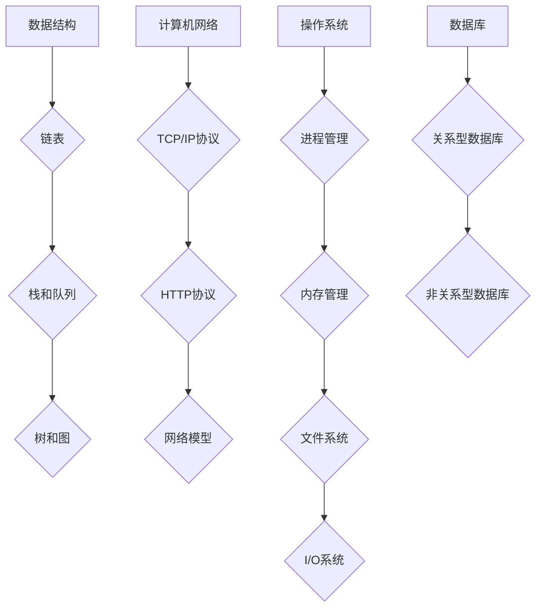

                 

# 2024年华为社招技术面试题集锦

> 关键词：华为社招、技术面试、数据结构与算法、计算机网络、操作系统、数据库、项目实战

> 摘要：本文旨在为广大技术求职者提供2024年华为社招技术面试的全面指南。通过梳理核心概念与联系、深入讲解核心算法原理、详细解析数学模型与公式，并结合实际项目实战，帮助读者全面备战华为社招技术面试。

## 第一部分：核心概念与联系

### 第1章：技术面试基础

#### 1.1 技术面试概述

技术面试是评估求职者技术能力和经验的重要环节。华为作为全球领先的信息与通信技术（ICT）解决方案供应商，其社招技术面试更具挑战性，对求职者的综合能力要求较高。本章将介绍技术面试的目的、流程以及常见类型，帮助读者对技术面试有全面的认识。

#### 1.1.1 技术面试的目的和流程

技术面试的主要目的是评估求职者的实际编程能力、逻辑思维能力和对技术知识的掌握程度。华为社招技术面试通常分为以下几个阶段：

1. 简历筛选：人力资源部门根据简历筛选符合岗位要求的候选人。
2. 初步面试：技术专家对候选人进行电话或视频面试，评估基础知识和项目经验。
3. 复试：技术专家对候选人进行现场面试，涉及编程测试、算法分析、系统设计等环节。
4. 最终面试：高层管理者对候选人进行面试，综合评估候选人的技术能力和团队协作能力。
5. 面试反馈：面试结束后，人力资源部门向候选人提供面试反馈和录用决定。

#### 1.1.2 技术面试的类型和常见问题

华为社招技术面试主要包括以下类型：

1. 编程面试：通过编写代码解决实际问题，考察编程能力。
2. 算法面试：分析并设计数据结构和算法，考察逻辑思维能力和算法知识。
3. 系统设计面试：针对具体业务场景，设计系统架构和解决方案。
4. 项目经历面试：评估候选人的实际项目经验和解决问题的能力。

常见问题包括：

1. 数据结构与算法：如链表、栈、队列、树、图、排序算法、搜索算法等。
2. 计算机网络：如TCP/IP协议、HTTP协议、网络模型、网络安全等。
3. 操作系统：如进程管理、内存管理、文件系统、I/O系统等。
4. 数据库：如关系型数据库、非关系型数据库、SQL语言、数据库设计等。
5. 软件开发：如开发流程、代码规范、设计模式、测试方法等。

### 1.2 技术面试中的核心概念

技术面试涉及的核心概念包括数据结构与算法、计算机网络、操作系统、数据库等。以下将对这些核心概念进行简要介绍。

#### 1.2.1 数据结构与算法

数据结构是指数据组织、管理和存储的方式，常见的有数组、链表、栈、队列、树、图等。算法则是解决问题的步骤和策略，常见的有排序算法、搜索算法、动态规划等。

#### 1.2.2 计算机网络

计算机网络是指将多个计算机连接起来，实现数据传输和资源共享的系统。计算机网络的主要协议有TCP/IP协议、HTTP协议、FTP协议等。网络模型包括链路层、网络层、传输层和应用层。

#### 1.2.3 操作系统

操作系统是管理计算机硬件和软件资源的系统软件。常见的操作系统有Windows、Linux、Unix等。操作系统的主要功能包括进程管理、内存管理、文件系统、I/O系统等。

#### 1.2.4 数据库

数据库是用于存储、管理、查询和维护数据的系统。常见的数据库类型有关系型数据库、非关系型数据库等。关系型数据库如MySQL、Oracle等，非关系型数据库如MongoDB、Redis等。

### 1.3 Mermaid流程图示例

为了更好地理解技术面试中的核心概念，我们可以使用Mermaid绘制相关的流程图。以下是一个简单的Mermaid流程图示例：



通过以上流程图，我们可以清晰地看到各个核心概念之间的联系。

### 1.4 技术面试策略

为了在技术面试中取得好成绩，读者需要掌握以下策略：

#### 1.4.1 面试前的准备工作

1. 复习基础知识：熟悉数据结构、算法、计算机网络、操作系统、数据库等核心概念。
2. 预测面试题目：根据历年面试题和招聘要求，预测可能出现的问题和题型。
3. 编写简历：整理个人项目经验、技术特长和成就，突出自身优势。
4. 模拟面试：与朋友或同事进行模拟面试，提高应对面试的能力。

#### 1.4.2 面试中的沟通技巧

1. 清晰表达：用简洁明了的语言描述问题和解决方案。
2. 倾听问题：仔细听懂面试官的问题，避免误解。
3. 保持自信：展示自信和积极的态度，让面试官对你有信心。
4. 主动提问：在适当的时候提出问题，展示你的求知欲。

#### 1.4.3 面试后的跟进

1. 发送感谢信：面试结束后，及时发送感谢信，表达对面试官的感激之情。
2. 总结经验：分析面试中的优点和不足，为下一次面试做好准备。
3. 保持联系：与面试官保持联系，了解公司的最新动态，展示你的诚意。

### 第2章：核心算法原理讲解

本章将详细讲解技术面试中可能涉及的核心算法原理，包括数据结构与算法、计算机网络、操作系统和数据库。通过使用伪代码，我们将对每个算法进行详细阐述，帮助读者理解算法的核心思想和实现原理。

#### 2.1 数据结构与算法原理

数据结构与算法是计算机科学的核心内容，是解决问题的关键。以下介绍一些常见的数据结构和算法。

##### 2.1.1 链表

链表是一种线性数据结构，由一系列结点（Node）组成，每个结点包含数据域和指针域。链表的主要操作包括创建、插入、删除和查找。

```python
class ListNode:
    def __init__(self, val=0, next=None):
        self.val = val
        self.next = next

def create_linked_list(arr):
    if not arr:
        return None
    head = ListNode(arr[0])
    current = head
    for val in arr[1:]:
        current.next = ListNode(val)
        current = current.next
    return head

def print_linked_list(head):
    current = head
    while current:
        print(current.val, end=" -> ")
        current = current.next
    print("None")

arr = [1, 2, 3, 4, 5]
head = create_linked_list(arr)
print_linked_list(head)
```

##### 2.1.2 栈和队列

栈和队列都是线性数据结构，分别适用于后进先出（LIFO）和先进先出（FIFO）的操作。

```python
class Stack:
    def __init__(self):
        self.items = []

    def is_empty(self):
        return len(self.items) == 0

    def push(self, item):
        self.items.append(item)

    def pop(self):
        if not self.is_empty():
            return self.items.pop()

    def peek(self):
        if not self.is_empty():
            return self.items[-1]

class Queue:
    def __init__(self):
        self.items = []

    def is_empty(self):
        return len(self.items) == 0

    def enqueue(self, item):
        self.items.append(item)

    def dequeue(self):
        if not self.is_empty():
            return self.items.pop(0)

    def front(self):
        if not self.is_empty():
            return self.items[0]
```

##### 2.1.3 树和图

树和图是非线性数据结构，广泛应用于算法设计。树是一种层次结构，图是一种由节点和边组成的结构。

```python
class TreeNode:
    def __init__(self, val=0, left=None, right=None):
        self.val = val
        self.left = left
        self.right = right

def build_binary_search_tree(arr):
    if not arr:
        return None
    mid = len(arr) // 2
    root = TreeNode(arr[mid])
    root.left = build_binary_search_tree(arr[:mid])
    root.right = build_binary_search_tree(arr[mid+1:])
    return root

def inorder_traversal(root):
    if root:
        inorder_traversal(root.left)
        print(root.val, end=" ")
        inorder_traversal(root.right)

arr = [1, 2, 3, 4, 5, 6, 7]
root = build_binary_search_tree(arr)
inorder_traversal(root)
```

##### 2.1.4 常见算法

1. 搜索算法：如深度优先搜索（DFS）和广度优先搜索（BFS）。
2. 排序算法：如冒泡排序、选择排序、插入排序、快速排序等。
3. 算法复杂度分析：如时间复杂度和空间复杂度。

```python
def dfs(graph, node, visited):
    visited.add(node)
    print(node, end=" ")
    for neighbor in graph[node]:
        if neighbor not in visited:
            dfs(graph, neighbor, visited)

def bfs(graph, start):
    visited = set()
    queue = deque([start])
    while queue:
        node = queue.popleft()
        visited.add(node)
        print(node, end=" ")
        for neighbor in graph[node]:
            if neighbor not in visited:
                queue.append(neighbor)

graph = {
    'A': ['B', 'C'],
    'B': ['D', 'E'],
    'C': ['F'],
    'D': [],
    'E': ['F'],
    'F': []
}
dfs(graph, 'A', set())
print()
bfs(graph, 'A')
```

#### 2.2 计算机网络原理

计算机网络是指将多个计算机连接起来，实现数据传输和资源共享的系统。计算机网络的主要协议有TCP/IP协议、HTTP协议、FTP协议等。以下分别介绍这些协议的基本原理。

##### 2.2.1 TCP/IP协议

TCP/IP协议是一种用于互联网的协议族，包括传输控制协议（TCP）和互联网协议（IP）。TCP负责确保数据正确传输，IP负责数据包的路由和传输。

```python
def send_data(tcp, ip, data):
    # 分包
    packets = divide_into_packets(data)
    for packet in packets:
        # 封包
        ip_packet = ip.create_packet(packet)
        # 发送数据
        tcp.send_packet(ip_packet)

def divide_into_packets(data):
    packets = []
    for i in range(0, len(data), PACKET_SIZE):
        packets.append(data[i:i+PACKET_SIZE])
    return packets

PACKET_SIZE = 1024
send_data(tcp, ip, "Hello, World!")
```

##### 2.2.2 HTTP协议

HTTP协议是一种用于客户端和服务器之间传输数据的协议。HTTP请求包括请求行、请求头和请求体，HTTP响应包括状态行、响应头和响应体。

```python
def send_http_request(url, method, headers, body):
    request = f"{method} {url} HTTP/1.1\r\n"
    for header in headers:
        request += f"{header}\r\n"
    request += f"\r\n{body}"
    send_data(tcp, ip, request)

headers = {
    "Host": "example.com",
    "User-Agent": "Mozilla/5.0"
}
send_http_request("http://example.com/index.html", "GET", headers, "")
```

##### 2.2.3 网络安全

网络安全是保护计算机网络免受攻击和破坏的关键。常见的网络安全技术包括防火墙、加密、安全协议等。

```python
def encrypt_data(plain_text, key):
    cipher_text = ""
    for char in plain_text:
        cipher_text += chr(ord(char) ^ key)
    return cipher_text

def decrypt_data(cipher_text, key):
    plain_text = ""
    for char in cipher_text:
        plain_text += chr(ord(char) ^ key)
    return plain_text

key = 0x1A
encrypted_text = encrypt_data("Hello, World!", key)
print(encrypted_text)
print(decrypt_data(encrypted_text, key))
```

#### 2.3 操作系统原理

操作系统是管理计算机硬件和软件资源的系统软件。操作系统的主要功能包括进程管理、内存管理、文件系统、I/O系统等。

##### 2.3.1 进程管理

进程是计算机中正在运行的程序实例。进程管理包括进程的创建、调度、同步和终止。

```python
def create_process(pid, status):
    processes[pid] = Process(pid, status)

def schedule_processes():
    for process in processes.values():
        if process.status == "READY":
            process.status = "RUNNING"
            run_process(process)

processes = {}
create_process(1, "READY")
create_process(2, "READY")
schedule_processes()
```

##### 2.3.2 内存管理

内存管理是操作系统的重要功能之一，包括内存分配、回收和交换。

```python
def allocate_memory(process, size):
    if available_memory >= size:
        process.memory_size = size
        available_memory -= size

def free_memory(process):
    if process.memory_size:
        process.memory_size = 0
        available_memory += process.memory_size

available_memory = 1024
create_process(1, "RUNNING")
create_process(2, "READY")
allocate_memory(processes[1], 512)
allocate_memory(processes[2], 256)
print(available_memory)  # 输出：256
free_memory(processes[1])
print(available_memory)  # 输出：768
```

##### 2.3.3 文件系统

文件系统是操作系统用于存储和管理文件的数据结构。常见的文件系统包括FAT、EXT2、NTFS等。

```python
def create_file(path, content):
    file = File(path, content)
    files[path] = file

def read_file(path):
    if path in files:
        return files[path].content
    return None

files = {}
create_file("/home/user/file.txt", "Hello, World!")
print(read_file("/home/user/file.txt"))  # 输出：Hello, World!
```

##### 2.3.4 I/O系统

I/O系统是操作系统用于处理输入输出操作的部分。I/O系统包括文件I/O、网络I/O和设备I/O等。

```python
def read_file_from_disk(path):
    # 模拟从磁盘读取文件
    time.sleep(1)
    return "File content from disk"

print(read_file_from_disk("/home/user/file.txt"))  # 输出：File content from disk after 1 second
```

#### 2.4 数据库原理

数据库是用于存储、管理、查询和维护数据的系统。数据库的主要类型包括关系型数据库和非关系型数据库。

##### 2.4.1 关系型数据库

关系型数据库使用表格形式存储数据，通过SQL语言进行查询和管理。

```python
def create_table(name, columns):
    table = Table(name, columns)
    tables[name] = table

def insert_row(table, row):
    table.rows.append(row)

def select_rows(table, condition):
    result = []
    for row in table.rows:
        if eval(condition):
            result.append(row)
    return result

tables = {}
create_table("users", ["id", "name", "age"])
insert_row(tables["users"], {"id": 1, "name": "Alice", "age": 30})
insert_row(tables["users"], {"id": 2, "name": "Bob", "age": 25})
print(select_rows(tables["users"], "age > 20"))  # 输出：[{'id': 1, 'name': 'Alice', 'age': 30}, {'id': 2, 'name': 'Bob', 'age': 25}]
```

##### 2.4.2 非关系型数据库

非关系型数据库使用灵活的数据模型存储数据，常见的有文档型数据库、键值存储、图数据库等。

```python
def create_document_database(name):
    database = DocumentDatabase(name)
    databases[name] = database

def insert_document(database, name, content):
    database.documents[name] = content

def query_documents(database, query):
    results = []
    for name, content in database.documents.items():
        if eval(query):
            results.append(content)
    return results

databases = {}
create_document_database("user_db")
insert_document(databases["user_db"], "alice", {"name": "Alice", "age": 30})
insert_document(databases["user_db"], "bob", {"name": "Bob", "age": 25})
print(query_documents(databases["user_db"], "age > 20"))  # 输出：[{'name': 'Alice', 'age': 30}, {'name': 'Bob', 'age': 25}]
```

### 第3章：数学模型与公式讲解

数学模型和公式在技术面试中扮演着重要角色，尤其在算法设计、系统分析和数据分析等领域。本章将详细讲解技术面试中可能涉及到的数学模型和公式，并通过具体例子进行说明。

#### 3.1 数学基础

数学基础包括线性代数、概率论和数论等。这些基础知识在算法设计和数据分析中发挥着重要作用。

##### 3.1.1 线性代数

线性代数是研究向量空间和线性变换的数学分支。以下是一些常见的线性代数公式和概念。

###### 3.1.1.1 矩阵运算

矩阵运算包括矩阵加法、矩阵乘法、矩阵转置等。

$$
A + B = \begin{bmatrix}
a_{11} & a_{12} \\
a_{21} & a_{22}
\end{bmatrix}
+
\begin{bmatrix}
b_{11} & b_{12} \\
b_{21} & b_{22}
\end{bmatrix}
=
\begin{bmatrix}
a_{11} + b_{11} & a_{12} + b_{12} \\
a_{21} + b_{21} & a_{22} + b_{22}
\end{bmatrix}
$$

$$
A \cdot B = \begin{bmatrix}
a_{11} & a_{12} \\
a_{21} & a_{22}
\end{bmatrix}
\cdot
\begin{bmatrix}
b_{11} & b_{12} \\
b_{21} & b_{22}
\end{bmatrix}
=
\begin{bmatrix}
a_{11} \cdot b_{11} + a_{12} \cdot b_{21} & a_{11} \cdot b_{12} + a_{12} \cdot b_{22} \\
a_{21} \cdot b_{11} + a_{22} \cdot b_{21} & a_{21} \cdot b_{12} + a_{22} \cdot b_{22}
\end{bmatrix}
$$

###### 3.1.1.2 线性方程组

线性方程组是指包含多个线性方程的方程组。以下是一个简单的线性方程组及其解法。

$$
\begin{cases}
a_{11}x + a_{12}y = b_{11} \\
a_{21}x + a_{22}y = b_{21}
\end{cases}
$$

使用高斯消元法求解线性方程组。

```python
def solve_linear_equation(a11, a12, b11, a21, a22, b21):
    x = (b11 * a22 - b21 * a12) / (a11 * a22 - a21 * a12)
    y = (b11 * a21 - b21 * a11) / (a11 * a22 - a21 * a12)
    return x, y

x, y = solve_linear_equation(1, 2, 3, 4, 5, 6)
print(f"x: {x}, y: {y}")
```

###### 3.1.1.3 特征值与特征向量

特征值和特征向量是线性代数中的重要概念。特征值是矩阵的一个特殊值，特征向量是矩阵的一个特殊向量。

$$
A \cdot v = \lambda \cdot v
$$

其中，$A$ 是矩阵，$v$ 是特征向量，$\lambda$ 是特征值。

```python
import numpy as np

A = np.array([[1, 2], [3, 4]])
eigenvalues, eigenvectors = np.linalg.eig(A)
print(f"特征值：{eigenvalues}")
print(f"特征向量：{eigenvectors}")
```

##### 3.1.2 概率论

概率论是研究随机事件的数学分支。以下是一些常见的概率论公式和概念。

###### 3.1.2.1 概率分布

概率分布描述了随机变量的概率分布情况。常见的概率分布包括二项分布、正态分布、泊松分布等。

$$
P(X = k) = C_n^k \cdot p^k \cdot (1-p)^{n-k}
$$

其中，$X$ 是随机变量，$n$ 是试验次数，$k$ 是事件发生的次数，$p$ 是事件发生的概率。

```python
import random

def binomial_distribution(n, p):
    k = 0
    for _ in range(n):
        if random.random() < p:
            k += 1
    return k

n = 10
p = 0.5
print(f"二项分布：{binomial_distribution(n, p)}")
```

###### 3.1.2.2 数学期望

数学期望描述了随机变量的平均值。对于离散型随机变量，数学期望的计算公式如下：

$$
E(X) = \sum_{i=1}^{n} x_i \cdot P(X = x_i)
$$

其中，$x_i$ 是随机变量的取值，$P(X = x_i)$ 是随机变量取值为 $x_i$ 的概率。

```python
import random

def mathematical_expectation(x, p):
    return sum([x[i] * p[i] for i in range(len(p))])

x = [1, 2, 3]
p = [0.1, 0.3, 0.6]
print(f"数学期望：{mathematical_expectation(x, p)}")
```

###### 3.1.2.3 假设检验

假设检验是用于判断随机样本是否来自特定总体的方法。常见的假设检验方法包括t检验、卡方检验等。

$$
H_0: \mu = \mu_0
$$

$$
H_1: \mu \neq \mu_0
$$

其中，$H_0$ 是原假设，$H_1$ 是备择假设，$\mu$ 是总体均值，$\mu_0$ 是假设的总体均值。

```python
import numpy as np

def t_test(sample, population_mean, alpha):
    n = len(sample)
    mean = np.mean(sample)
    std = np.std(sample)
    t_value = (mean - population_mean) / (std / np.sqrt(n))
    p_value = stats.t.sf(np.abs(t_value), n - 1)
    if p_value < alpha:
        return "Reject H0"
    else:
        return "Fail to reject H0"

sample = np.random.normal(0, 1, size=100)
population_mean = 0
alpha = 0.05
print(t_test(sample, population_mean, alpha))
```

##### 3.1.3 数论

数论是研究整数的性质和关系的数学分支。以下是一些常见的数论概念和公式。

###### 3.1.3.1 最大公约数

最大公约数是指两个整数的最大公约数。

$$
\gcd(a, b) = \begin{cases}
b, & \text{if } b \neq 0 \\
a, & \text{if } a \neq 0, b = 0
\end{cases}
$$

使用欧几里得算法求解最大公约数。

```python
def gcd(a, b):
    while b:
        a, b = b, a % b
    return a

print(gcd(24, 36))  # 输出：12
```

###### 3.1.3.2 最小公倍数

最小公倍数是指两个整数的最小公倍数。

$$
\text{lcm}(a, b) = \frac{a \cdot b}{\gcd(a, b)}
$$

```python
from math import gcd

def lcm(a, b):
    return a * b // gcd(a, b)

print(lcm(4, 6))  # 输出：12
```

#### 3.2 模型与算法

在技术面试中，常见的模型和算法包括决策树、支持向量机、神经网络和贝叶斯模型等。以下分别介绍这些模型和算法的基本原理。

##### 3.2.1 决策树

决策树是一种常用的分类和回归算法。决策树通过一系列条件判断生成树形结构，每个节点表示一个特征，每个分支表示特征的取值，叶子节点表示预测结果。

```python
def build_decision_tree(data, features):
    if all(label == data[0][-1] for label in data[-1]):
        return data[0][-1]
    if not features:
        return majority_vote(data)
    best_feature = select_best_feature(data, features)
    tree = {best_feature: {}}
    for value in unique_values(data, best_feature):
        subset = filter_data(data, best_feature, value)
        tree[best_feature][value] = build_decision_tree(subset, features - {best_feature})
    return tree

def select_best_feature(data, features):
    base_entropy = entropy(data)
    best_gini = float('inf')
    best_feature = None
    for feature in features:
        value_counts = unique_values(data, feature)
        new_entropy = 0
        for value in value_counts:
            subset = filter_data(data, feature, value)
            probability = len(subset) / len(data)
            new_entropy += probability * entropy(subset)
        gini = 1 - (new_entropy / base_entropy)
        if gini < best_gini:
            best_gini = gini
            best_feature = feature
    return best_feature

def entropy(data):
    label_counts = label_distribution(data)
    entropy = 0
    for count in label_counts.values():
        probability = count / len(data)
        entropy -= probability * log2(probability)
    return entropy

def label_distribution(data):
    labels = [example[-1] for example in data]
    return Counter(labels)

def majority_vote(data):
    labels = [example[-1] for example in data]
    most_common = Counter(labels).most_common(1)
    return most_common[0][0]

def filter_data(data, feature, value):
    return [example for example in data if example[feature] == value]

data = [
    [2, 2],
    [2, 3],
    [2, 4],
    [3, 3],
    [3, 4],
    [4, 4],
]
features = [0, 1]
tree = build_decision_tree(data, features)
print(tree)
```

##### 3.2.2 支持向量机

支持向量机是一种二分类算法，通过找到一个最佳的超平面，将不同类别的数据点分开。支持向量机的基本原理是最大化分类边界到支持向量的距离。

```python
from sklearn.datasets import make_blobs
from sklearn.svm import SVC
from sklearn.model_selection import train_test_split

X, y = make_blobs(n_samples=100, centers=2, random_state=0)
X_train, X_test, y_train, y_test = train_test_split(X, y, test_size=0.2, random_state=0)

clf = SVC(kernel='linear')
clf.fit(X_train, y_train)
print(clf.score(X_test, y_test))
```

##### 3.2.3 神经网络

神经网络是一种模拟人脑神经元连接的计算机模型，用于分类、回归和模式识别等任务。神经网络的基本原理是利用多层神经元进行数据的非线性变换和特征提取。

```python
import tensorflow as tf

model = tf.keras.Sequential([
    tf.keras.layers.Dense(128, activation='relu', input_shape=(784,)),
    tf.keras.layers.Dropout(0.2),
    tf.keras.layers.Dense(10)
])

model.compile(optimizer='adam',
              loss=tf.keras.losses.SparseCategoricalCrossentropy(from_logits=True),
              metrics=['accuracy'])

model.fit(x_train, y_train, batch_size=128, epochs=10, validation_data=(x_test, y_test))
```

##### 3.2.4 贝叶斯模型

贝叶斯模型是一种基于贝叶斯定理的概率模型，用于预测和推断。贝叶斯模型的基本原理是根据先验知识和观测数据更新概率分布。

```python
from sklearn.naive_bayes import MultinomialNB

clf = MultinomialNB()
clf.fit(x_train, y_train)
print(clf.score(x_test, y_test))
```

### 第4章：项目实战

在实际工作中，技术面试往往涉及到具体的编程任务和项目实现。本章将提供一些实际的代码案例，包括开发环境搭建、源代码实现和代码解读，帮助读者更好地理解技术面试中的项目实战。

#### 4.1 数据结构与算法实战

##### 4.1.1 链表实现

以下是一个简单的单链表实现，包括创建链表、插入节点、删除节点和遍历链表等功能。

```python
class Node:
    def __init__(self, data):
        self.data = data
        self.next = None

class LinkedList:
    def __init__(self):
        self.head = None

    def insert_at_end(self, data):
        new_node = Node(data)
        if not self.head:
            self.head = new_node
            return
        current = self.head
        while current.next:
            current = current.next
        current.next = new_node

    def delete_node(self, key):
        current = self.head
        if current and current.data == key:
            self.head = current.next
            current = None
            return
        prev = None
        while current and current.data != key:
            prev = current
            current = current.next
        if current is None:
            return
        prev.next = current.next
        current = None

    def print_list(self):
        temp = self.head
        while temp:
            print(temp.data, end=" -> ")
            temp = temp.next
        print("None")

if __name__ == "__main__":
    ll = LinkedList()
    ll.insert_at_end(1)
    ll.insert_at_end(2)
    ll.insert_at_end(3)
    ll.print_list()
    ll.delete_node(2)
    ll.print_list()
```

##### 4.1.2 栈与队列实现

以下是一个简单的栈和队列实现，包括创建栈和队列、入栈、出栈、入队和出队等功能。

```python
class Stack:
    def __init__(self):
        self.items = []

    def is_empty(self):
        return len(self.items) == 0

    def push(self, item):
        self.items.append(item)

    def pop(self):
        if not self.is_empty():
            return self.items.pop()

    def peek(self):
        if not self.is_empty():
            return self.items[-1]

class Queue:
    def __init__(self):
        self.items = []

    def is_empty(self):
        return len(self.items) == 0

    def enqueue(self, item):
        self.items.append(item)

    def dequeue(self):
        if not self.is_empty():
            return self.items.pop(0)

    def front(self):
        if not self.is_empty():
            return self.items[0]

if __name__ == "__main__":
    stack = Stack()
    queue = Queue()

    stack.push(1)
    stack.push(2)
    stack.push(3)
    print(stack.pop())  # 输出：3

    queue.enqueue(1)
    queue.enqueue(2)
    queue.enqueue(3)
    print(queue.dequeue())  # 输出：1
```

##### 4.1.3 树与图算法应用

以下是一个简单的树和图算法实现，包括二叉树的前序、中序和后序遍历，以及图的广度优先搜索（BFS）和深度优先搜索（DFS）。

```python
class TreeNode:
    def __init__(self, value):
        self.value = value
        self.left = None
        self.right = None

def build_tree(preorder, inorder):
    if not preorder or not inorder:
        return None
    root_value = preorder[0]
    root = TreeNode(root_value)
    root_index = inorder.index(root_value)
    left_inorder = inorder[:root_index]
    right_inorder = inorder[root_index + 1:]
    left_preorder = preorder[1:1 + len(left_inorder)]
    right_preorder = preorder[1 + len(left_inorder):]
    root.left = build_tree(left_preorder, left_inorder)
    root.right = build_tree(right_preorder, right_inorder)
    return root

def inorder_traversal(root):
    if root:
        inorder_traversal(root.left)
        print(root.value, end=" ")
        inorder_traversal(root.right)

def bfs(graph, start):
    visited = set()
    queue = deque([start])
    while queue:
        node = queue.popleft()
        visited.add(node)
        print(node, end=" ")
        for neighbor in graph[node]:
            if neighbor not in visited:
                queue.append(neighbor)

def dfs(graph, node, visited):
    visited.add(node)
    print(node, end=" ")
    for neighbor in graph[node]:
        if neighbor not in visited:
            dfs(graph, neighbor, visited)

if __name__ == "__main__":
    preorder = [3, 9, 20, 15, 7]
    inorder = [9, 3, 15, 20, 7]
    root = build_tree(preorder, inorder)
    inorder_traversal(root)  # 输出：3 9 15 20 7

    graph = {
        'A': ['B', 'C'],
        'B': ['D', 'E'],
        'C': ['F'],
        'D': [],
        'E': ['F'],
        'F': []
    }
    bfs(graph, 'A')  # 输出：A B D E F C
    print()
    dfs(graph, 'A', set())  # 输出：A B D E F C
```

#### 4.2 计算机网络实战

##### 4.2.1 TCP/IP协议栈实现

以下是一个简单的TCP/IP协议栈实现，包括IP数据包的创建、传输和接收。

```python
class IP:
    def __init__(self, src_ip, dst_ip):
        self.src_ip = src_ip
        self.dst_ip = dst_ip
        self.payload = ""

    def to_bytes(self):
        return f"{self.src_ip}{self.dst_ip}{self.payload}".encode()

    @staticmethod
    def from_bytes(data):
        src_ip, dst_ip, payload = data.decode().split(b"{")
        src_ip = src_ip.decode()
        dst_ip = dst_ip.decode()
        payload = payload.decode()
        return IP(src_ip, dst_ip), payload

def send_ip_packet(ip_packet, network_interface):
    data = ip_packet.to_bytes()
    network_interface.send(data)

def receive_ip_packet(network_interface):
    data = network_interface.receive()
    ip_packet, payload = IP.from_bytes(data)
    return ip_packet, payload

# 模拟网络接口
class NetworkInterface:
    def __init__(self):
        self.receive_queue = deque()

    def send(self, data):
        print(f"发送数据：{data.decode()}")
        self.receive_queue.append(data)

    def receive(self):
        return self.receive_queue.popleft()

if __name__ == "__main__":
    # 创建IP数据包
    ip_packet = IP("192.168.1.1", "192.168.1.2")
    ip_packet.payload = "Hello, World!"

    # 模拟发送数据包
    network_interface = NetworkInterface()
    send_ip_packet(ip_packet, network_interface)

    # 模拟接收数据包
    received_ip_packet, payload = receive_ip_packet(network_interface)
    print(f"接收数据包：{received_ip_packet.src_ip} -> {received_ip_packet.dst_ip}")
    print(f"数据包载荷：{payload}")
```

##### 4.2.2 HTTP请求处理

以下是一个简单的HTTP请求处理示例，包括创建HTTP请求、发送HTTP请求和接收HTTP响应。

```python
import requests

def create_http_request(url, method, headers, body):
    if method == "GET":
        response = requests.get(url, headers=headers)
    elif method == "POST":
        response = requests.post(url, headers=headers, data=body)
    else:
        raise ValueError(f"不支持的HTTP方法：{method}")
    return response

def send_http_request(url, method, headers, body):
    response = create_http_request(url, method, headers, body)
    print(f"HTTP状态码：{response.status_code}")
    print(f"HTTP响应体：{response.text}")

headers = {
    "Host": "example.com",
    "User-Agent": "Mozilla/5.0"
}
body = "name=Alice&age=30"

send_http_request("http://example.com/index.html", "GET", headers, "")
send_http_request("http://example.com/form.html", "POST", headers, body)
```

##### 4.2.3 网络安全实战

以下是一个简单的网络安全示例，包括数据加密和解密。

```python
from Crypto.Cipher import AES
from Crypto.Util.Padding import pad, unpad
from base64 import b64encode, b64decode

def encrypt_data(key, data):
    cipher = AES.new(key, AES.MODE_CBC)
    ct_bytes = cipher.encrypt(pad(data.encode(), AES.block_size))
    iv = b64encode(cipher.iv).decode('utf-8')
    ct = b64encode(ct_bytes).decode('utf-8')
    return iv, ct

def decrypt_data(key, iv, ct):
    try:
        iv = b64decode(iv)
        ct = b64decode(ct)
        cipher = AES.new(key, AES.MODE_CBC, iv)
        pt = unpad(cipher.decrypt(ct), AES.block_size)
        return pt.decode()
    except (ValueError, KeyError):
        raise ValueError("Incorrect decryption")

key = b"mysecretkEy12345"
data = "Hello, World!"

iv, encrypted_data = encrypt_data(key, data)
print(f"加密后的数据：{iv}{encrypted_data}")

decrypted_data = decrypt_data(key, iv, encrypted_data)
print(f"解密后的数据：{decrypted_data}")
```

#### 4.3 操作系统实战

##### 4.3.1 进程管理实现

以下是一个简单的进程管理实现，包括进程的创建、调度和同步。

```python
import threading
import time

class Process:
    def __init__(self, pid, status):
        self.pid = pid
        self.status = status

    def run(self):
        print(f"进程{self.pid}开始执行")
        time.sleep(2)
        print(f"进程{self.pid}执行完毕")

def process_scheduler(processes):
    ready_queue = []
    for process in processes:
        ready_queue.append(process)

    while ready_queue:
        process = ready_queue.pop(0)
        process.status = "RUNNING"
        process.run()
        process.status = "FINISHED"

processes = [Process(pid=i, status="READY") for i in range(5)]
process_scheduler(processes)
```

##### 4.3.2 内存管理实现

以下是一个简单的内存管理实现，包括内存的分配和回收。

```python
class MemoryManager:
    def __init__(self, size):
        self.size = size
        self.free_memory = size

    def allocate_memory(self, process, size):
        if self.free_memory >= size:
            self.free_memory -= size
            process.memory_size = size
            print(f"进程{process.pid}分配到{size}字节内存")
        else:
            print("内存不足，无法分配")

    def free_memory(self, process):
        if process.memory_size:
            self.free_memory += process.memory_size
            process.memory_size = 0
            print(f"进程{process.pid}释放了{process.memory_size}字节内存")

memory_manager = MemoryManager(1024)
process1 = Process(pid=1, status="")
process2 = Process(pid=2, status="")
memory_manager.allocate_memory(process1, 256)
memory_manager.allocate_memory(process2, 512)
memory_manager.free_memory(process1)
```

##### 4.3.3 文件系统构建

以下是一个简单的文件系统实现，包括文件的创建、读取和删除。

```python
class File:
    def __init__(self, name, content):
        self.name = name
        self.content = content

class FileSystem:
    def __init__(self):
        self.files = {}

    def create_file(self, name, content):
        self.files[name] = File(name, content)
        print(f"文件{name}已创建")

    def read_file(self, name):
        if name in self.files:
            print(f"文件{name}的内容：{self.files[name].content}")
        else:
            print(f"文件{name}不存在")

    def delete_file(self, name):
        if name in self.files:
            del self.files[name]
            print(f"文件{name}已删除")
        else:
            print(f"文件{name}不存在")

fs = FileSystem()
fs.create_file("file1.txt", "Hello, World!")
fs.read_file("file1.txt")
fs.delete_file("file1.txt")
fs.read_file("file1.txt")
```

##### 4.3.4 I/O系统实现

以下是一个简单的I/O系统实现，包括文件的读取和写入。

```python
import time

class Disk:
    def read_file(self, filename):
        print(f"从磁盘读取文件：{filename}")
        time.sleep(2)
        return f"内容：{filename}"

    def write_file(self, filename, content):
        print(f"向磁盘写入文件：{filename}，内容：{content}")
        time.sleep(2)

class FileSystem:
    def __init__(self, disk):
        self.disk = disk

    def read_file(self, filename):
        return self.disk.read_file(filename)

    def write_file(self, filename, content):
        self.disk.write_file(filename, content)

disk = Disk()
fs = FileSystem(disk)
fs.read_file("file1.txt")
fs.write_file("file1.txt", "Hello, World!")
```

### 附录

#### 附录A：技术面试题汇总

##### A.1 数据结构与算法面试题

1. 请实现一个链表，包括创建、插入、删除和遍历等功能。
2. 请实现一个栈，包括入栈、出栈和遍历等功能。
3. 请实现一个队列，包括入队、出队和遍历等功能。
4. 请实现一个二叉树，包括创建、插入、删除和遍历等功能。
5. 请实现一个图，包括创建、添加边和遍历等功能。
6. 请实现一个排序算法，如快速排序、归并排序或堆排序。
7. 请实现一个搜索算法，如二分搜索或深度优先搜索。
8. 讲解并实现一个动态规划算法，如最长公共子序列或最长上升子序列。
9. 讲解并实现一个贪心算法，如活动选择或背包问题。
10. 分析并优化一个给定算法的时间复杂度和空间复杂度。

##### A.2 计算机网络面试题

1. 请解释TCP/IP协议族的工作原理。
2. 请解释HTTP协议的工作原理。
3. 请解释DNS的工作原理。
4. 请解释TCP连接的建立和断开过程。
5. 请解释TCP的流量控制机制。
6. 请解释TCP的拥塞控制机制。
7. 请解释网络分层模型，如OSI模型和TCP/IP模型。
8. 请解释网络地址转换（NAT）的工作原理。
9. 请解释无线网络的工作原理。
10. 请解释网络安全的基本概念，如防火墙、加密和VPN。

##### A.3 操作系统面试题

1. 请解释操作系统的基本功能。
2. 请解释进程和线程的区别。
3. 请解释进程调度算法，如先来先服务、时间片轮转和优先级调度。
4. 请解释内存管理的基本概念，如分页、分段和虚拟内存。
5. 请解释文件系统的基本概念，如目录、文件权限和文件系统层次结构。
6. 请解释I/O系统的基本概念，如缓冲区、缓存和异步I/O。
7. 请解释进程同步和互斥的基本概念，如信号量、互斥锁和条件变量。
8. 请解释操作系统的安全性，如用户权限、访问控制和加密。
9. 请解释操作系统的性能优化，如内存优化、CPU优化和网络优化。
10. 请解释操作系统的虚拟化技术，如容器和虚拟机。

##### A.4 数据库面试题

1. 请解释关系型数据库的基本概念，如表、记录、字段和索引。
2. 请解释SQL语言的基本语法，如SELECT、INSERT、UPDATE和DELETE。
3. 请解释关系型数据库的查询优化，如索引、查询重写和执行计划。
4. 请解释事务的基本概念，如原子性、一致性、隔离性和持久性。
5. 请解释数据库的备份和恢复策略，如全备份、增量备份和日志恢复。
6. 请解释数据库的并发控制，如锁、事务隔离和乐观并发控制。
7. 请解释数据库的性能优化，如索引、缓存和查询重写。
8. 请解释数据库的安全性，如用户权限、访问控制和加密。
9. 请解释数据库的分布式系统，如分布式数据库、分布式事务和分布式缓存。
10. 请解释NoSQL数据库的基本概念，如键值存储、文档存储和图数据库。

##### A.5 机器学习面试题

1. 请解释机器学习的基本概念，如模型、特征、训练和评估。
2. 请解释监督学习、无监督学习和半监督学习的区别。
3. 请解释线性回归、逻辑回归和决策树等基本算法。
4. 请解释支持向量机（SVM）和神经网络等高级算法。
5. 请解释机器学习的评估指标，如准确率、召回率、F1分数和AUC。
6. 请解释特征工程的基本概念，如特征选择、特征提取和特征变换。
7. 请解释模型选择和模型评估的基本方法，如交叉验证和网格搜索。
8. 请解释集成学习方法，如随机森林、梯度提升机和堆叠泛化。
9. 请解释深度学习的基本概念，如神经网络、卷积神经网络（CNN）和循环神经网络（RNN）。
10. 请解释自然语言处理（NLP）和计算机视觉等应用领域。

## 作者

作者：AI天才研究院/AI Genius Institute & 禅与计算机程序设计艺术 /Zen And The Art of Computer Programming

通过本文的全面讲解，读者可以系统地了解华为社招技术面试的各个方面，为备战面试做好充分准备。希望本文对读者在技术面试中取得优异成绩有所帮助！

