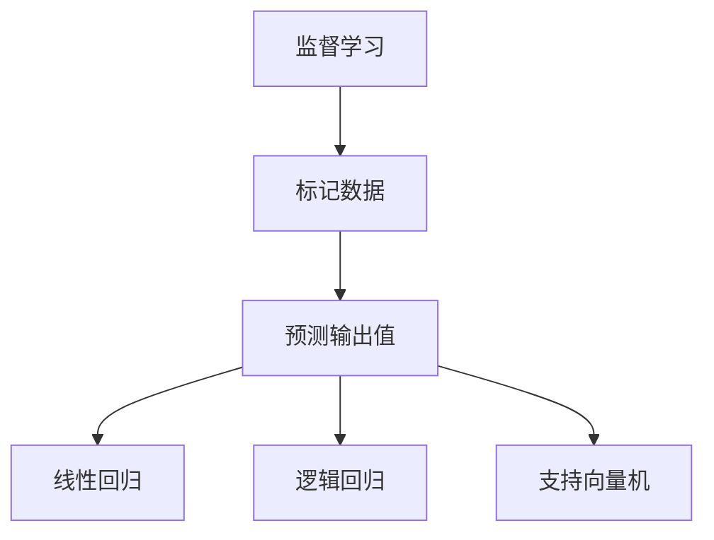
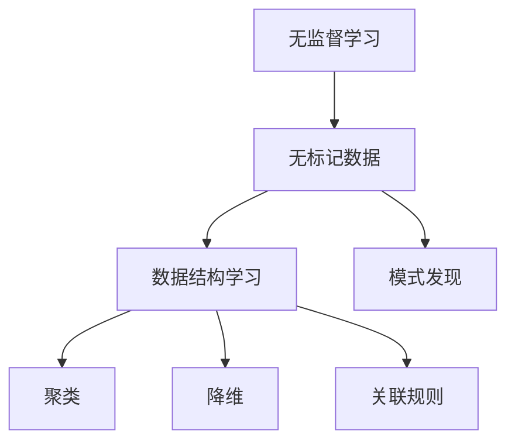
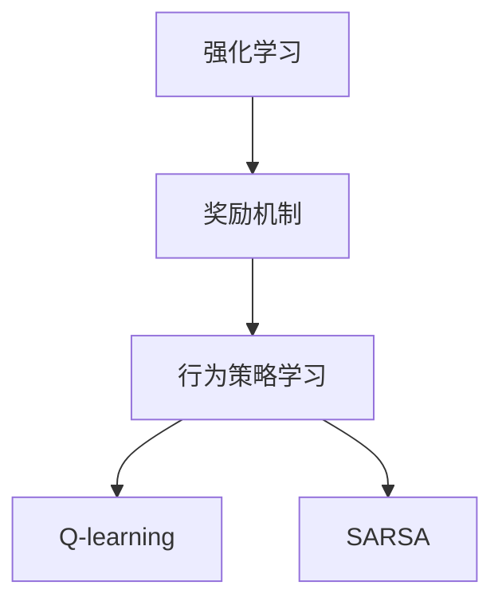
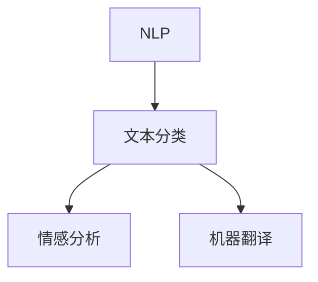
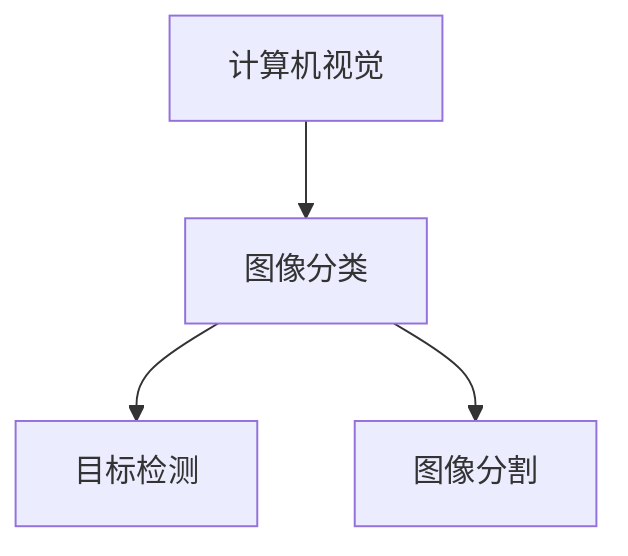
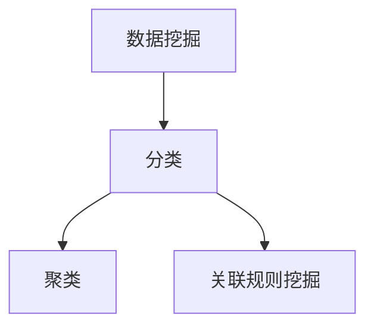
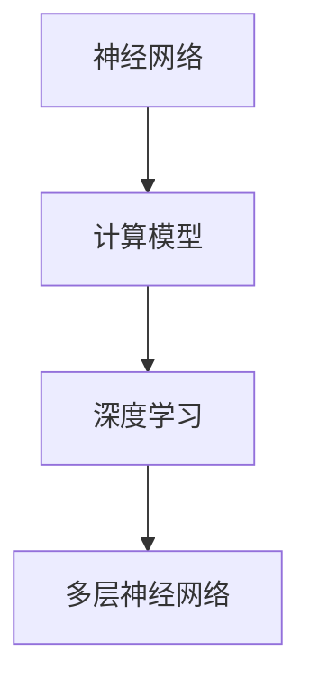
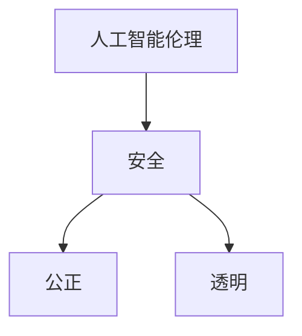
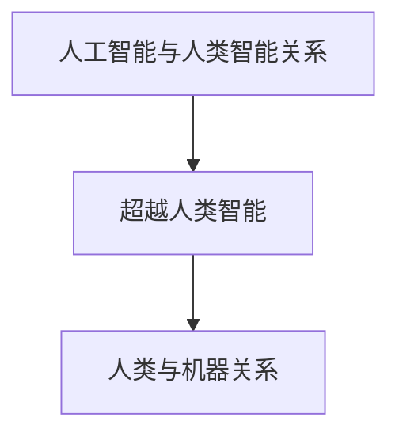

                 

# 2050年的人工智能：从弱人工智能到强人工智能的技术跨越

> **关键词：** 人工智能，弱人工智能，强人工智能，技术趋势，应用领域，未来展望  
>
> **摘要：** 本文将深入探讨人工智能的发展历程，从弱人工智能到强人工智能的技术跨越。通过分析现有技术和未来的发展趋势，探讨人工智能在2050年可能达到的高度及其对社会的深远影响。

## 第一部分：引言

### 1.1 人工智能的发展历程

人工智能（Artificial Intelligence，简称AI）的概念最早可以追溯到20世纪50年代。早期的AI研究主要集中在模拟人类智能的各个层面，如逻辑推理、问题解决、语言理解和图像识别等。这一阶段的人工智能被称为**弱人工智能**（Narrow AI）。

#### 1.1.1 弱人工智能

弱人工智能的特点是针对特定任务进行优化，如语音识别、图像分类、自然语言处理等。这种人工智能依赖于大量的数据、强大的计算能力和先进的算法。例如，语音助手Siri和Alexa就是弱人工智能的典型代表。

随着技术的不断发展，特别是在机器学习和深度学习领域的突破，人工智能开始进入一个新的阶段——**强人工智能**（General AI）。

#### 1.1.2 强人工智能的定义与特性

强人工智能是指具备人类智能的广泛能力，能够在各种任务中表现出高度的自主性和学习能力。这种人工智能不仅能够处理特定的任务，还能够理解、思考、学习和适应复杂环境。

### 1.2 2050年的人工智能展望

#### 1.2.1 技术趋势

未来30年，人工智能技术将继续快速发展。量子计算、神经网络、自然语言处理、计算机视觉等领域的突破，将为强人工智能的实现提供强有力的技术支持。

#### 1.2.2 社会影响

随着人工智能技术的普及，社会将发生深刻变革。医疗、教育、交通、金融等各个领域都将受益于人工智能的应用。然而，人工智能的发展也将带来一系列社会挑战，如就业结构变化、隐私保护、伦理道德等。

## 第二部分：弱人工智能技术基础

### 2.1 机器学习基础

机器学习是人工智能的核心技术之一，它使计算机能够从数据中学习，进行预测和决策。机器学习主要分为以下几类：

#### 2.1.1 监督学习

监督学习是一种从标记数据中学习的方法，其目标是预测输出值。常见的监督学习算法包括线性回归、逻辑回归、支持向量机等。



#### 2.1.2 无监督学习

无监督学习是在没有标记数据的情况下学习数据结构和模式的方法。常见的无监督学习算法包括聚类、降维、关联规则等。



#### 2.1.3 强化学习

强化学习是一种通过奖励机制来学习最佳行为策略的方法。常见的强化学习算法包括Q-learning、SARSA等。



### 2.2 人工智能应用案例

#### 2.2.1 自然语言处理

自然语言处理（Natural Language Processing，简称NLP）是人工智能的一个重要分支，旨在使计算机能够理解、处理和生成人类语言。常见的NLP任务包括文本分类、情感分析、机器翻译等。



#### 2.2.2 计算机视觉

计算机视觉（Computer Vision）是使计算机能够从图像或视频中提取信息的技术。常见的计算机视觉任务包括图像分类、目标检测、图像分割等。



#### 2.2.3 数据挖掘

数据挖掘（Data Mining）是一种从大量数据中发现有价值信息的方法。常见的数据挖掘任务包括分类、聚类、关联规则挖掘等。



### 2.3 弱人工智能的未来发展

#### 2.3.1 技术瓶颈

尽管弱人工智能在特定任务上表现出色，但仍存在一些技术瓶颈。例如，数据质量和数量、算法的复杂度、计算资源的限制等。

#### 2.3.2 发展方向

未来，弱人工智能的发展方向将集中在以下几个方面：更高效的数据处理算法、更丰富的数据来源、更先进的模型架构、更广泛的领域应用等。

## 第三部分：强人工智能技术探索

### 3.1 强人工智能核心概念与联系

#### 3.1.1 神经网络与深度学习

神经网络（Neural Networks）是模拟人脑神经元连接结构的计算模型，是强人工智能的基础。深度学习（Deep Learning）是一种基于多层神经网络的机器学习方法，它在图像识别、语音识别等领域取得了显著成果。



#### 3.1.2 人工智能伦理

人工智能伦理（AI Ethics）是探讨人工智能在道德和伦理层面的影响。随着人工智能技术的发展，如何确保人工智能的安全、公正、透明等成为重要议题。



#### 3.1.3 人工智能与人类智能的关系

人工智能与人类智能的关系是强人工智能领域的一个重要议题。未来，人工智能是否能够超越人类智能，以及人类与机器的关系将如何演变，都是值得探讨的问题。



### 3.2 强人工智能算法原理讲解

#### 3.2.1 神经网络算法

神经网络算法是强人工智能的核心算法之一。以下是一个简单的神经网络算法伪代码：

```python
# 初始化神经网络
initialize_neural_network()

# 前向传播
output = forward_propagation(input_data)

# 反向传播
error = backward_propagation(output, expected_output)

# 更新权重
update_weights(error)
```

#### 3.2.2 深度学习算法

深度学习算法是构建在神经网络基础上的，以下是一个简单的深度学习算法伪代码：

```python
# 初始化深度学习模型
initialize_deeplearning_model()

# 前向传播
output = forward_propagation(input_data)

# 反向传播
error = backward_propagation(output, expected_output)

# 更新权重
update_weights(error)
```

#### 3.2.3 机器学习优化算法

机器学习优化算法用于调整模型参数，以最小化损失函数。以下是一个简单的机器学习优化算法伪代码：

```python
# 初始化模型参数
initialize_model_parameters()

# 训练模型
for epoch in range(num_epochs):
    # 前向传播
    output = forward_propagation(input_data)
    
    # 反向传播
    error = backward_propagation(output, expected_output)
    
    # 更新模型参数
    update_model_parameters(error)
```

### 3.3 强人工智能数学模型与公式

#### 3.3.1 概率论基础

概率论是强人工智能数学模型的基础。以下是一些概率论的基本公式：

$$ P(A \cap B) = P(A) \cdot P(B|A) $$

$$ P(A \cup B) = P(A) + P(B) - P(A \cap B) $$

$$ P(A') = 1 - P(A) $$

#### 3.3.2 信息论基础

信息论是研究信息传递和处理的理论。以下是一些信息论的基本公式：

$$ H(X) = -\sum_{i} p(x_i) \cdot \log_2 p(x_i) $$

$$ H(X, Y) = -\sum_{i} \sum_{j} p(x_i, y_j) \cdot \log_2 p(x_i, y_j) $$

$$ I(X; Y) = H(X) - H(X | Y) $$

#### 3.3.3 模型评估指标

模型评估指标用于衡量模型性能。以下是一些常见的模型评估指标：

$$ Accuracy = \frac{TP + TN}{TP + TN + FP + FN} $$

$$ Precision = \frac{TP}{TP + FP} $$

$$ Recall = \frac{TP}{TP + FN} $$

### 3.4 强人工智能项目实战

#### 3.4.1 项目实战一：图像识别

图像识别是强人工智能的一个重要应用领域。以下是一个简单的图像识别项目实战：

1. **开发环境搭建**：安装Python、TensorFlow等依赖库。
2. **数据准备**：收集和标注图像数据。
3. **模型构建**：使用卷积神经网络（CNN）构建图像识别模型。
4. **模型训练**：使用训练数据训练模型。
5. **模型评估**：使用测试数据评估模型性能。
6. **模型部署**：将模型部署到生产环境。

```python
import tensorflow as tf

# 构建模型
model = tf.keras.Sequential([
    tf.keras.layers.Conv2D(32, (3, 3), activation='relu', input_shape=(28, 28, 1)),
    tf.keras.layers.MaxPooling2D((2, 2)),
    tf.keras.layers.Flatten(),
    tf.keras.layers.Dense(128, activation='relu'),
    tf.keras.layers.Dense(10, activation='softmax')
])

# 训练模型
model.compile(optimizer='adam',
              loss='sparse_categorical_crossentropy',
              metrics=['accuracy'])

model.fit(train_images, train_labels, epochs=5)

# 评估模型
test_loss, test_acc = model.evaluate(test_images, test_labels)

# 部署模型
model.save('image_recognition_model.h5')
```

#### 3.4.2 项目实战二：自然语言生成

自然语言生成（Natural Language Generation，简称NLG）是强人工智能的另一个重要应用领域。以下是一个简单的自然语言生成项目实战：

1. **开发环境搭建**：安装Python、TensorFlow等依赖库。
2. **数据准备**：收集和标注文本数据。
3. **模型构建**：使用循环神经网络（RNN）或生成对抗网络（GAN）构建自然语言生成模型。
4. **模型训练**：使用训练数据训练模型。
5. **模型评估**：使用测试数据评估模型性能。
6. **模型部署**：将模型部署到生产环境。

```python
import tensorflow as tf

# 构建模型
model = tf.keras.Sequential([
    tf.keras.layers.Embedding(vocab_size, embedding_dim),
    tf.keras.layers.SimpleRNN(units=hidden_size),
    tf.keras.layers.Dense(vocab_size)
])

# 训练模型
model.compile(optimizer='adam',
              loss='sparse_categorical_crossentropy',
              metrics=['accuracy'])

model.fit(train_data, train_labels, epochs=100)

# 评估模型
test_loss, test_acc = model.evaluate(test_data, test_labels)

# 部署模型
model.save('nlg_model.h5')
```

#### 3.4.3 项目实战三：智能问答系统

智能问答系统（Intelligent Question Answering，简称QA）是强人工智能的又一个应用领域。以下是一个简单的智能问答系统项目实战：

1. **开发环境搭建**：安装Python、TensorFlow等依赖库。
2. **数据准备**：收集和标注问答数据。
3. **模型构建**：使用卷积神经网络（CNN）或变换器（Transformer）构建问答系统模型。
4. **模型训练**：使用训练数据训练模型。
5. **模型评估**：使用测试数据评估模型性能。
6. **模型部署**：将模型部署到生产环境。

```python
import tensorflow as tf

# 构建模型
model = tf.keras.Sequential([
    tf.keras.layers.Embedding(vocab_size, embedding_dim),
    tf.keras.layers.CuDNNGRU(units=hidden_size),
    tf.keras.layers.Dense(vocab_size, activation='softmax')
])

# 训练模型
model.compile(optimizer='adam',
              loss='sparse_categorical_crossentropy',
              metrics=['accuracy'])

model.fit(train_data, train_labels, epochs=5)

# 评估模型
test_loss, test_acc = model.evaluate(test_data, test_labels)

# 部署模型
model.save('qa_model.h5')
```

## 第四部分：强人工智能未来展望

### 4.1 强人工智能可能的应用领域

#### 4.1.1 医疗保健

强人工智能在医疗保健领域的应用前景广阔，如疾病诊断、治疗方案推荐、个性化医疗等。

#### 4.1.2 交通运输

自动驾驶、智能交通管理、车联网等领域的强人工智能应用将极大提升交通运输的效率与安全性。

#### 4.1.3 工业自动化

工业自动化领域的强人工智能应用将推动生产效率的提升，降低人力成本，实现智能化生产。

### 4.2 强人工智能面临的挑战与解决方案

#### 4.2.1 技术挑战

强人工智能技术的发展面临诸多挑战，如算法复杂性、计算资源需求、数据质量等。解决这些挑战需要不断创新和突破。

#### 4.2.2 社会伦理挑战

强人工智能的发展引发了一系列社会伦理问题，如隐私保护、就业影响、伦理道德等。需要制定相关法律法规和伦理规范，确保人工智能的安全、公正、透明。

#### 4.2.3 法律法规挑战

随着强人工智能技术的应用，法律法规面临巨大挑战。需要制定适应人工智能时代的法律法规，确保人工智能的发展与社会的和谐共生。

### 4.3 2050年强人工智能的愿景

#### 4.3.1 技术发展预测

到2050年，强人工智能技术将在各个领域实现广泛应用，成为社会发展的重要驱动力。

#### 4.3.2 社会影响预测

强人工智能将深刻改变人类社会，带来生产方式、生活方式、社会结构等方面的变革。

#### 4.3.3 人与机器的关系预测

随着强人工智能的发展，人类与机器的关系将更加紧密，人类将更加依赖人工智能，同时人工智能也将更加智能，具备一定的情感和意识。

## 附录

### 附录 A：参考文献

- [1] 李航。统计学习方法[M]. 清华大学出版社，2012.
- [2] 周志华。机器学习[M]. 清华大学出版社，2016.
- [3] Goodfellow, Ian, et al. Deep Learning[M]. MIT Press，2016.

### 附录 B：AI技术发展时间线

- 1956年：达特茅斯会议，人工智能概念诞生。
- 1980年代：专家系统广泛应用。
- 2006年：深度学习崛起。
- 2012年：AlexNet在ImageNet挑战赛上取得突破。
- 2016年：AlphaGo战胜世界围棋冠军。
- 2020年：自动驾驶汽车开始商用。

### 附录 C：AI技术术语表

- **人工智能（AI）**：模拟人类智能的计算机系统。
- **弱人工智能（Narrow AI）**：针对特定任务的人工智能系统。
- **强人工智能（General AI）**：具备广泛能力的人工智能系统。
- **机器学习（ML）**：让计算机从数据中学习的方法。
- **深度学习（DL）**：基于多层神经网络的机器学习方法。
- **神经网络（NN）**：模拟人脑神经元连接结构的计算模型。

## 作者

作者：AI天才研究院/AI Genius Institute & 禅与计算机程序设计艺术 /Zen And The Art of Computer Programming

