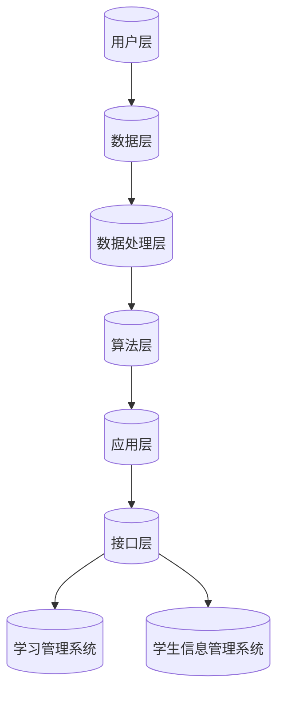
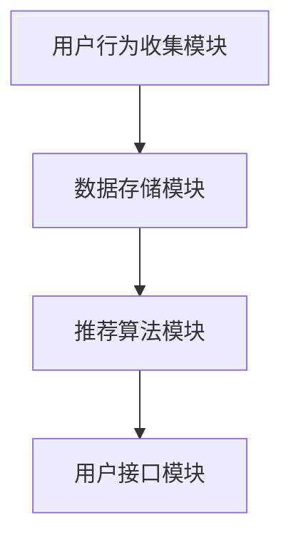

                 

### 2050年的教育变革：个性化与智能化学习

> **关键词：** 教育变革、个性化学习、智能化学习、未来教育、技术驱动
> 
> **摘要：** 本文章深入探讨了2050年教育系统的可能变革，重点关注个性化与智能化学习的理念、原理和实际应用。通过分析社会趋势、科技进步和教育体系的变化，文章展望了未来教育的蓝图，并探讨了实现这一蓝图的必要技术基础和实践路径。

#### 引言

随着科技的迅猛发展，社会各个领域正在经历深刻的变革。教育领域也不例外，技术的进步正在引发教育模式的根本性转变。2050年的教育系统，将会是一个高度个性化与智能化的学习环境，它将极大地改变我们传统上所认识的教育模式。本文将围绕这一主题，探讨2050年教育变革的背景、核心概念、技术基础以及其实际应用。

首先，我们需要理解2050年的社会与教育环境。随着人口结构的变化、科技水平的提升和经济发展的新趋势，教育体系正面临着前所未有的挑战和机遇。个性化教育、数据驱动教育和智能化学习系统的兴起，正是这些变化的直接反映。

其次，个性化学习作为未来教育的重要方向，其核心在于利用技术手段满足每个学生的独特需求。这不仅涉及到学生数据的收集与处理，还涉及个性化的学习模型和推荐算法。这些技术的应用，将使得教育更加精准和高效。

最后，智能化学习系统的设计与实现，是确保个性化学习得以落实的关键。通过智能推荐算法、个性化学习路径规划以及智能学习环境的搭建，教育系统将变得更加智能和灵活。

本文将分七个部分展开讨论：

1. **教育变革的时代背景**：分析2050年的社会与教育环境，探讨传统教育模式的挑战以及个性化教育和智能化学习技术的兴起。
2. **个性化学习的原理与方法**：介绍个性化学习的概念、数据驱动教育以及个性化学习模型。
3. **智能化学习系统的设计与实现**：探讨智能化学习系统的架构、智能推荐算法和智能化学习环境的搭建。
4. **K-12教育的变革**：分析个性化学习和智能化学习工具在K-12教育中的应用场景。
5. **高等教育的转型**：探讨个性化学习在高等教育和职业教育中的实施策略和智能学习平台的应用。
6. **成人教育与终身学习的革命**：分析个性化学习在成人教育中的应用以及智能化学习在终身教育中的角色。
7. **教育变革的未来展望**：展望教育技术的未来潜力、教育公平与包容性发展以及教育政策的调整。

通过本文的讨论，我们希望能够提供一个关于2050年教育变革的全面视角，并探讨实现这一变革的路径和挑战。

#### 第一部分: 教育变革的时代背景

教育变革的时代背景是一个多维度的概念，它涉及社会、经济、科技等多个方面的发展趋势。为了理解2050年教育系统可能面临的变革，我们需要先分析这些背景因素。

##### 1.1 2050年的社会发展趋势

1. **人口结构变化**：随着全球人口老龄化趋势加剧，人口结构将发生显著变化。生育率的下降、寿命的延长以及跨国移民的增加，都将对教育体系提出新的要求。教育需要更加灵活和个性化，以满足不同年龄段和职业阶段的学习需求。

2. **社会流动性增加**：全球化带来了社会流动性的增加，人们更容易跨越国界进行工作、学习和生活。这要求教育系统具备国际化和跨文化适应性，能够提供适应不同文化背景和语言环境的教育服务。

3. **城市化进程加速**：城市化进程的加速导致了城市与农村之间的教育不平衡问题。未来教育需要更加注重区域教育资源的均衡配置，确保每个地区的学生都能获得优质的教育资源。

##### 1.2 科技进步的影响

1. **人工智能与大数据**：人工智能和大数据技术的快速发展，使得个性化教育和智能化学习成为可能。通过收集和分析学生的行为数据，教育系统能够更加精准地了解每个学生的学习状态和需求，从而提供个性化的学习方案。

2. **虚拟现实与增强现实**：虚拟现实（VR）和增强现实（AR）技术的应用，为教育提供了更加丰富和互动的学习体验。学生可以通过虚拟环境进行沉浸式学习，提高学习兴趣和效果。

3. **云计算与物联网**：云计算和物联网技术的普及，使得教育资源的获取和共享变得更加便捷。学生可以通过智能设备随时随地访问学习资源，实现自主学习。

##### 1.3 经济发展的新趋势

1. **知识经济的崛起**：随着知识经济的崛起，对于高素质人才的需求不断增加。教育系统需要培养具备创新思维和解决问题的能力，能够适应快速变化的职场环境。

2. **行业变革与就业市场的不确定性**：许多传统行业正面临着颠覆和重构，就业市场的不确定性增加。教育系统需要更加注重跨学科的综合性教育和职业培训，提高学生的适应能力和就业竞争力。

3. **教育成本问题**：随着教育成本的不断增加，教育公平成为一个重要的议题。未来教育需要更加注重成本效益，确保每个家庭都能够承担得起高质量的教育。

##### 1.4 教育体系的演变

1. **传统教育模式的挑战**：传统的教育模式，如教师为中心的教学方法和固定的课程设置，已经无法满足现代学生的多样化需求。个性化教育和智能化学习技术提供了新的解决方案。

2. **个性化教育的兴起**：个性化教育强调以学生为中心，通过数据分析和智能算法，为每个学生提供个性化的学习方案。这有助于提高学习效果和学生的满意度。

3. **智能化学习技术的发展**：智能化学习系统利用人工智能技术，为学生提供智能推荐、个性化辅导和实时反馈。这不仅提高了学习效率，还为学生提供了更加灵活和自主的学习方式。

综上所述，2050年的教育变革将是在社会、经济和科技背景下，对传统教育模式进行深刻改革的结果。个性化与智能化学习将成为教育系统的重要组成部分，为每个学生提供更加公平、高效和高质量的教育服务。

#### 第1章: 2050年的社会与教育环境

##### 1.1 2050年的社会发展趋势

在探讨2050年的社会与教育环境时，首先需要关注的是社会发展趋势。这些趋势不仅塑造了教育的需求，还决定了教育系统的设计和方法。

###### 1.1.1 社会结构的变化

1. **人口老龄化**：随着医疗技术和生活质量的提升，全球人口老龄化现象日益明显。到2050年，许多国家都将面临大量退休人口，这将对劳动力市场和社会福利体系产生深远影响。教育系统需要为老年人提供继续教育和终身学习的机会，以保持他们的社会参与和独立性。

2. **多元文化融合**：全球化进程加速了跨国婚姻和移民的增多，社会结构变得更加多元化。这意味着教育需要具备跨文化适应能力，培养学生具备全球视野和跨文化交流能力。

3. **社会分层与流动性**：尽管科技进步和经济全球化带来了许多机会，但社会分层现象依然存在，且在某些地区变得更加明显。教育系统需要采取措施，促进社会流动性，减少教育机会的不平等。

###### 1.1.2 科技进步的影响

1. **人工智能的普及**：人工智能技术将在2050年得到广泛应用，不仅改变着生产方式，还深刻影响着人们的生活方式。教育系统需要整合人工智能技术，提供适应未来工作需求的课程和培训。

2. **虚拟现实与增强现实**：VR和AR技术的发展，将为学生提供沉浸式的学习体验。这不仅能够提高学生的学习兴趣，还能够模拟复杂的现实场景，增强学习效果。

3. **大数据与数据科学**：数据已成为新的生产要素，大数据和数据分析技术将使得教育系统能够更好地了解学生的学习行为和需求，提供个性化的教育方案。

###### 1.1.3 经济发展的新趋势

1. **知识经济**：知识经济成为主导，对人才的需求越来越高。教育系统需要培养具备创新思维、解决问题的能力和跨学科知识的人才。

2. **可持续经济**：随着环境问题日益严重，可持续发展成为经济发展的新趋势。教育系统需要培养学生的环保意识和社会责任感，推动可持续发展。

3. **共享经济**：共享经济模式的发展，改变了人们对资源获取和分配的方式。教育系统需要适应这一变化，提供更加灵活和开放的学习资源和服务。

##### 1.2 教育体系的演变

随着社会的发展，教育体系也在不断演变。这种演变不仅体现在教育内容和方法的改变上，还体现在教育体系的整体结构上。

###### 1.2.1 传统教育模式的挑战

1. **一刀切的教学方法**：传统的教育模式往往采用“一刀切”的教学方法，无法满足不同学生的学习需求。随着学生个性化需求的增加，这种模式变得越来越不可行。

2. **教育资源分配不均**：许多地区的教育资源分配不均，导致部分学生无法获得优质的教育。这种不平等现象不仅阻碍了教育公平，也影响了社会流动性和经济发展。

3. **师生互动不足**：在传统教育模式中，教师往往是知识的传授者，而学生则是被动的接受者。这种模式导致师生互动不足，学生的学习积极性和创造力受到限制。

###### 1.2.2 个性化教育的兴起

1. **以学生为中心**：个性化教育强调以学生为中心，关注每个学生的学习需求和发展。通过数据分析和智能算法，教育系统能够为每个学生提供个性化的学习方案，提高学习效果和满意度。

2. **差异化教学**：个性化教育通过差异化教学，满足不同学生的学习需求和进度。这有助于提高学生的学习兴趣和自信心，促进全面发展。

3. **终身学习**：个性化教育鼓励终身学习，帮助学生适应快速变化的社会和经济环境。通过提供灵活和持续的教育服务，教育系统能够满足不同年龄段和职业阶段的学习需求。

###### 1.2.3 智能化学习技术的发展

1. **智能化学习系统**：智能化学习系统利用人工智能技术，提供智能推荐、个性化辅导和实时反馈。这不仅提高了学习效率，还为学生提供了更加灵活和自主的学习方式。

2. **智能教学辅助工具**：智能教学辅助工具，如虚拟教师、智能作业系统和智能辅导平台，将大大提高教师的效率和学生的学习效果。

3. **教育资源的智能化管理**：通过云计算和大数据技术，教育系统能够实现教育资源的智能化管理，提高资源的利用效率和可及性。

综上所述，2050年的社会与教育环境将面临诸多挑战和机遇。教育系统需要不断变革，以适应社会的发展需求，提供更加公平、高效和高质量的教育服务。

#### 第2章: 个性化学习的原理与方法

个性化学习是未来教育的重要方向，它通过利用技术手段，满足每个学生的独特学习需求。这一章将介绍个性化学习的概念、原理和方法，探讨其在教育中的应用。

##### 2.1 个性化学习的概念与意义

###### 2.1.1 个性化学习的定义

个性化学习是指根据学生的个人兴趣、能力、学习风格和学习需求，为他们提供定制化的学习内容和教学方法。它强调教育的个性化、差异化和灵活性，旨在提升每个学生的学习效果和满意度。

###### 2.1.2 个性化学习的重要性

1. **提高学习效果**：个性化学习能够根据学生的实际情况，提供合适的学习内容和难度，从而提高学习效果。研究表明，个性化学习能够显著提高学生的学习成绩和兴趣。

2. **促进全面发展**：个性化学习不仅关注学生的学术成绩，还关注他们的情感、社交和创造力发展。通过多样化的学习活动和项目，学生能够在多个方面得到提升。

3. **适应社会需求**：个性化学习能够培养具备创新思维、解决问题的能力和跨学科知识的综合性人才，满足社会对高素质人才的需求。

###### 2.1.3 个性化学习的目标

1. **定制化学习路径**：为每个学生制定个性化的学习计划，根据其兴趣和需求调整学习内容和进度。

2. **灵活的学习方式**：提供多样化的学习方式，如在线学习、面对面辅导、合作学习等，以满足不同学生的需求。

3. **全面的评价体系**：建立全面的评价体系，不仅关注学生的学术成绩，还关注其学习态度、情感和社会能力。

##### 2.2 数据驱动教育

数据驱动教育是个性化学习的重要基础，它通过收集、分析和利用学生数据，为个性化学习提供支持。

###### 2.2.1 学生数据的收集与处理

1. **数据收集**：通过在线学习平台、智能设备和教育管理系统，收集学生的行为数据，如学习时间、学习内容、考试成绩、学习态度等。

2. **数据处理**：对收集到的数据进行分析和处理，提取有价值的信息，如学习模式、学习困难点、学习习惯等。

3. **数据存储**：将处理后的数据存储在云数据库中，以便后续分析和应用。

###### 2.2.2 数据分析在教育中的应用

1. **学习诊断**：通过数据分析，教师可以及时发现学生的学习困难和需求，提供有针对性的辅导和支持。

2. **学习预测**：利用数据挖掘技术，预测学生的学习趋势和成绩，提前采取措施，防止学习问题恶化。

3. **学习评估**：通过数据分析，评估学生的学习效果和进展，为教学调整提供依据。

###### 2.2.3 数据隐私与伦理问题

1. **数据保护**：确保学生数据的隐私和安全，遵循相关法律法规，如《通用数据保护条例》（GDPR）。

2. **数据伦理**：在使用学生数据时，尊重学生的隐私权和知情权，避免数据滥用和歧视。

##### 2.3 个性化学习模型

个性化学习模型是实施个性化学习的关键，它通过算法和数据分析，为每个学生提供个性化的学习方案。

###### 2.3.1 模型类型与分类

1. **基于内容的个性化模型**：根据学生的兴趣和学习历史，推荐相关的学习内容。

2. **基于协作的个性化模型**：利用学生的协作学习数据，推荐合适的学习伙伴和协作任务。

3. **基于行为的个性化模型**：通过分析学生的学习行为数据，预测其学习需求和提供个性化的学习支持。

###### 2.3.2 模型构建与训练方法

1. **数据预处理**：对收集到的学生数据进行分析和处理，提取有用的特征。

2. **模型选择**：根据个性化学习的需求，选择合适的机器学习算法，如决策树、神经网络、关联规则等。

3. **模型训练**：使用训练数据集，对选定的模型进行训练和优化。

4. **模型评估**：使用验证数据集，评估模型的性能和准确性。

###### 2.3.3 模型评估与优化

1. **模型评估指标**：使用准确率、召回率、F1分数等指标，评估模型的性能。

2. **模型优化**：通过调整模型参数、增加训练数据或改进算法，提高模型性能。

3. **持续优化**：随着新的数据不断产生，持续优化和更新个性化学习模型。

##### 2.4 个性化学习案例

以下是一个个性化学习的具体案例：

- **案例背景**：某在线学习平台，学生可以选择不同的课程进行学习。
- **数据收集**：通过学生在学习平台上的行为数据，如学习时间、学习进度、考试成绩、互动情况等。
- **数据分析**：分析学生的行为数据，识别其学习习惯和需求。
- **个性化推荐**：根据学生的学习数据和兴趣，推荐相关的课程和学习资源。
- **学习反馈**：学生在学习过程中，可以随时进行自我评估和反馈，教师也可以提供个性化的辅导和建议。
- **效果评估**：通过学生的学习成绩和反馈，评估个性化学习的效果，并不断调整推荐策略。

通过个性化学习，学生能够获得更加个性化的学习体验，提高学习效果和满意度。

#### 第2章: 个性化学习的原理与方法

在上一章中，我们探讨了个性化学习的概念和重要性。在这一章中，我们将深入探讨个性化学习的核心方法和技术，特别是数据驱动教育及其在实际应用中的具体实现。

##### 2.2 数据驱动教育

数据驱动教育是个性化学习的核心，它通过收集和分析学生数据，为个性化学习提供支持。以下将详细介绍数据驱动教育的各个方面。

###### 2.2.1 学生数据的收集与处理

1. **数据收集**：学生数据的收集是数据驱动教育的第一步。这些数据可以来自多种渠道，如在线学习平台、智能设备、考试系统、教育管理系统等。具体的数据类型包括：

   - **行为数据**：学生的学习行为数据，如学习时间、学习频率、学习路径、互动情况等。
   - **成绩数据**：学生的考试成绩和成绩变化趋势。
   - **心理数据**：学生的学习情绪、动机、兴趣等。
   - **生理数据**：学生的生理特征，如视力、听力、身体素质等。

2. **数据处理**：收集到的数据需要进行处理，以便后续分析。数据处理通常包括以下步骤：

   - **数据清洗**：去除重复数据、缺失值填充、异常值处理等。
   - **数据转换**：将不同类型的数据转换为统一的格式，如将文本数据转换为数值数据。
   - **特征工程**：提取和构造新的特征，以便更好地描述学生的学习和心理状态。

   ```python
   # 伪代码：数据预处理
   def preprocess_data(data):
       # 数据清洗
       clean_data = remove_duplicates(data)
       clean_data = fill_missing_values(clean_data)
       
       # 数据转换
       converted_data = convert_to_numerical(clean_data)
       
       # 特征工程
       engineered_data = extract_features(converted_data)
       
       return engineered_data
   ```

###### 2.2.2 数据分析在教育中的应用

1. **学习诊断**：数据分析可以帮助教师和学生了解学生的学习状态和问题。具体应用包括：

   - **学习困难诊断**：通过分析学生的学习行为和成绩数据，识别其学习困难点。
   - **学习趋势预测**：通过分析历史数据，预测学生的学习趋势和成绩变化。
   - **学习习惯分析**：通过分析学生的学习行为数据，识别其学习习惯和偏好。

   ```python
   # 伪代码：学习诊断
   def diagnose_learning(data):
       # 分析学习行为
       learning_behavior = analyze_behavior(data)
       
       # 识别学习困难点
       learning_difficulties = identify_difficulties(learning_behavior)
       
       return learning_difficulties
   ```

2. **学习评估**：数据分析可以用于评估学生的学习效果和进展。具体应用包括：

   - **学习效果评估**：通过分析学生的考试成绩和反馈，评估其学习效果。
   - **学习进展评估**：通过分析学生的进步情况，评估其学习效果和教学方法的有效性。
   - **学习满意度评估**：通过分析学生的反馈，评估其学习体验和满意度。

   ```python
   # 伪代码：学习评估
   def evaluate_learning(data):
       # 分析考试成绩
       exam_results = analyze_exam_results(data)
       
       # 分析学习进展
       learning_progress = analyze_progress(data)
       
       # 分析学习满意度
       satisfaction_level = analyze_satisfaction(data)
       
       return exam_results, learning_progress, satisfaction_level
   ```

3. **学习预测**：数据分析可以用于预测学生的学习趋势和成绩。具体应用包括：

   - **成绩预测**：通过分析历史数据和当前学习情况，预测学生的未来成绩。
   - **学习路径预测**：通过分析学生的学习行为和兴趣，预测其可能的学习路径。
   - **学习需求预测**：通过分析学生的学习行为和成绩，预测其未来的学习需求和资源需求。

   ```python
   # 伪代码：学习预测
   def predict_learning(data):
       # 预测成绩
       predicted_scores = predict_scores(data)
       
       # 预测学习路径
       predicted_path = predict_learning_path(data)
       
       # 预测学习需求
       predicted需求的 = predict_learning_needs(data)
       
       return predicted_scores, predicted_path, predicted_needs
   ```

###### 2.2.3 数据隐私与伦理问题

1. **数据保护**：确保学生数据的隐私和安全是数据驱动教育的关键。具体措施包括：

   - **数据加密**：对数据进行加密处理，确保数据在传输和存储过程中的安全性。
   - **访问控制**：设定严格的访问权限，确保只有授权人员可以访问敏感数据。
   - **数据匿名化**：对数据进行匿名化处理，保护学生的隐私。

   ```python
   # 伪代码：数据保护
   def protect_data(data):
       # 数据加密
       encrypted_data = encrypt_data(data)
       
       # 设定访问权限
       access_control = set_access_permissions(encrypted_data)
       
       # 数据匿名化
       anonymized_data = anonymize_data(access_control)
       
       return anonymized_data
   ```

2. **数据伦理**：在使用学生数据时，需要遵循伦理原则，确保数据的合理使用。具体措施包括：

   - **知情同意**：在收集和使用数据前，告知学生数据的使用目的和范围，并获取其同意。
   - **数据使用限制**：明确数据的使用范围和目的，避免数据滥用。
   - **数据责任**：明确数据责任，确保数据使用的安全和合法性。

   ```python
   # 伪代码：数据伦理
   def adhere_to_ethics(data):
       # 知情同意
       informed_consent = obtain_informed_consent(data)
       
       # 数据使用限制
       usage_limitations = set_usage_limitations(informed_consent)
       
       # 数据责任
       data_responsibility = establish_data_responsibility(usage_limitations)
       
       return data_responsibility
   ```

##### 2.3 个性化学习模型

个性化学习模型是数据驱动教育的核心，它通过算法和数据分析，为每个学生提供个性化的学习方案。以下将详细介绍个性化学习模型的不同类型、构建方法及其评估和优化。

###### 2.3.1 模型类型与分类

1. **基于内容的个性化模型**：这种模型根据学生的兴趣和学习历史，推荐相关的学习内容。其核心思想是“以内容为中心”，主要应用场景包括在线教育平台和电子图书馆。

2. **基于协作的个性化模型**：这种模型利用学生的协作学习数据，推荐合适的学习伙伴和协作任务。其核心思想是“以人为中心”，主要应用场景包括学习社区和协作学习平台。

3. **基于行为的个性化模型**：这种模型通过分析学生的学习行为数据，预测其学习需求和提供个性化的学习支持。其核心思想是“以行为为中心”，主要应用场景包括智能辅导系统和自适应学习系统。

###### 2.3.2 模型构建与训练方法

1. **数据收集**：收集学生的行为数据、学习数据和学习偏好数据。

2. **数据预处理**：对收集到的数据进行清洗、转换和特征提取。

3. **模型选择**：根据应用场景和数据特点，选择合适的机器学习算法，如决策树、神经网络、关联规则、协同过滤等。

4. **模型训练**：使用训练数据集，对选定的模型进行训练和优化。

5. **模型评估**：使用验证数据集，评估模型的性能和准确性。

   ```python
   # 伪代码：模型构建与训练
   def build_and_train_model(data):
       # 数据预处理
       preprocessed_data = preprocess_data(data)
       
       # 模型选择
       model = select_model(preprocessed_data)
       
       # 模型训练
       trained_model = train_model(preprocessed_data, model)
       
       # 模型评估
       evaluation_results = evaluate_model(trained_model, validation_data)
       
       return trained_model, evaluation_results
   ```

###### 2.3.3 模型评估与优化

1. **模型评估指标**：使用准确率、召回率、F1分数、均方误差等指标，评估模型的性能。

2. **模型优化**：通过调整模型参数、增加训练数据或改进算法，提高模型性能。

3. **持续优化**：随着新的数据不断产生，持续优化和更新个性化学习模型。

   ```python
   # 伪代码：模型评估与优化
   def optimize_model(model, new_data):
       # 模型评估
       evaluation_results = evaluate_model(model, new_data)
       
       # 调整模型参数
       optimized_model = adjust_model_parameters(model, evaluation_results)
       
       # 模型重训练
       retrained_model = retrain_model(optimized_model, new_data)
       
       # 模型重新评估
       new_evaluation_results = evaluate_model(retrained_model, new_data)
       
       return retrained_model, new_evaluation_results
   ```

##### 2.4 个性化学习案例

以下是一个个性化学习的具体案例：

- **案例背景**：某在线学习平台，学生可以选择不同的课程进行学习。
- **数据收集**：通过学生在学习平台上的行为数据，如学习时间、学习进度、考试成绩、互动情况等。
- **数据分析**：分析学生的行为数据，识别其学习习惯和需求。
- **个性化推荐**：根据学生的学习数据和兴趣，推荐相关的课程和学习资源。
- **学习反馈**：学生在学习过程中，可以随时进行自我评估和反馈，教师也可以提供个性化的辅导和建议。
- **效果评估**：通过学生的学习成绩和反馈，评估个性化学习的效果，并不断调整推荐策略。

通过个性化学习，学生能够获得更加个性化的学习体验，提高学习效果和满意度。

#### 第3章: 智能化学习系统的设计与实现

在上一章中，我们详细探讨了个性化学习的原理与方法。在这一章中，我们将进一步深入讨论智能化学习系统的设计与实现，包括其整体架构、关键技术以及开发环境的配置和系统集成。

##### 3.1 智能化学习系统的架构

智能化学习系统是一个复杂的多层次系统，其核心目标是利用人工智能技术，为学生提供个性化的学习体验和高效的学习支持。以下是智能化学习系统的整体架构：

1. **用户层**：用户层包括学生、教师和管理员等角色。学生可以通过系统进行学习、完成作业和参与讨论；教师可以上传教学内容、布置作业和监控学生的学习进度；管理员负责系统的维护和用户管理。

2. **数据层**：数据层包括学生行为数据、学习数据、考试成绩和其他相关数据。这些数据通过在线学习平台、智能设备和教育管理系统等渠道收集，并存储在数据库中。

3. **数据处理层**：数据处理层负责对收集到的数据进行分析和处理，提取有用的信息，如学习模式、学习困难点、学习习惯等。这一层通常包括数据清洗、数据转换和特征提取等过程。

4. **算法层**：算法层包括各种机器学习算法和深度学习模型，如协同过滤、关联规则、神经网络等。这些算法用于构建个性化学习模型，为学生提供个性化的学习推荐和辅导。

5. **应用层**：应用层包括智能推荐系统、智能作业系统、智能辅导平台等。这些应用系统利用算法层提供的个性化学习模型，为学生提供智能化的学习支持。

6. **接口层**：接口层提供与外部系统的集成接口，如学习管理系统（LMS）、学生信息管理系统（SIMS）等。这些接口确保智能化学习系统与其他教育管理系统的无缝对接。

##### 3.2 智能推荐算法

智能推荐算法是智能化学习系统的核心组件，其目标是根据学生的兴趣、学习历史和成绩，推荐相关的学习资源和任务。以下是几种常见的智能推荐算法：

1. **协同过滤算法**：协同过滤算法通过分析用户的行为数据，发现相似的用户或物品，从而进行推荐。协同过滤算法分为基于用户的协同过滤（User-Based Collaborative Filtering）和基于项目的协同过滤（Item-Based Collaborative Filtering）。

   - **基于用户的协同过滤**：通过计算用户之间的相似度，推荐与目标用户兴趣相似的其他用户喜欢的项目。
   - **基于项目的协同过滤**：通过计算项目之间的相似度，推荐与目标项目相似的其他项目。

   ```python
   # 伪代码：基于用户的协同过滤
   def user_based_collaborative_filtering(target_user, users_data):
       similar_users = find_similar_users(target_user, users_data)
       recommended_items = recommend_items(similar_users, users_data)
       return recommended_items
   
   # 伪代码：基于项目的协同过滤
   def item_based_collaborative_filtering(target_item, items_data):
       similar_items = find_similar_items(target_item, items_data)
       recommended_users = recommend_users(similar_items, users_data)
       return recommended_users
   ```

2. **基于内容的推荐算法**：基于内容的推荐算法通过分析项目的内容特征，推荐与目标项目内容相似的其他项目。这种方法通常用于推荐文本、图片和音频等类型的内容。

   ```python
   # 伪代码：基于内容的推荐
   def content_based_recommendation(target_item, items_data):
       content_features = extract_content_features(target_item)
       similar_items = find_similar_items_by_content(content_features, items_data)
       recommended_items = recommend_items(similar_items, items_data)
       return recommended_items
   ```

3. **深度学习推荐算法**：深度学习推荐算法利用深度神经网络，自动学习用户和项目之间的复杂关系，进行推荐。常见的深度学习推荐算法包括基于模型的协同过滤（Model-Based Collaborative Filtering）和基于神经网络的推荐算法。

   ```python
   # 伪代码：深度学习推荐
   def neural_network_recommendation(user_features, item_features):
       model = build_neural_network_model(user_features, item_features)
       trained_model = train_model(model, training_data)
       recommendations = generate_recommendations(trained_model, user_features, item_features)
       return recommendations
   ```

##### 3.3 智能化学习环境的搭建

搭建智能化学习环境是实施智能化学习系统的关键步骤。以下将介绍开发环境的配置、开源框架的选择以及系统集成与测试。

1. **开发环境的配置**

   - **硬件环境**：根据系统的需求和负载，配置服务器、存储设备和网络设备。通常需要高性能的计算资源和大数据存储解决方案，如Hadoop或Docker。

   - **软件环境**：安装操作系统、数据库管理系统、编程语言和开发工具。常用的操作系统包括Linux和Windows，数据库管理系统包括MySQL、PostgreSQL和MongoDB，编程语言包括Python、Java和JavaScript。

2. **开源框架的选择**

   - **数据处理框架**：如Apache Spark和Flink，用于大规模数据处理和分析。
   - **机器学习框架**：如TensorFlow和PyTorch，用于构建和训练机器学习模型。
   - **推荐系统框架**：如Surprise和LightFM，用于构建和优化推荐算法。
   - **Web框架**：如Django和Flask，用于开发Web应用程序。

3. **系统集成与测试**

   - **系统集成**：将各个模块和组件集成到一起，确保系统能够正常运行。通常需要编写集成测试脚本，确保数据在各个模块之间传递无误。

   - **功能测试**：测试系统的各项功能，如用户注册、登录、数据上传和下载、推荐算法等。

   - **性能测试**：测试系统的性能，如处理速度、响应时间和并发处理能力。

   ```python
   # 伪代码：系统集成与测试
   def integrate_and_test_system(components):
       # 集成组件
       integrated_system = integrate_components(components)
       
       # 功能测试
       test_results = functional_test(integrated_system)
       
       # 性能测试
       performance_results = performance_test(integrated_system)
       
       return integrated_system, test_results, performance_results
   ```

通过以上步骤，我们可以搭建一个功能完善、性能高效的智能化学习系统，为学生提供个性化的学习体验和支持。

#### 第3章: 智能化学习系统的设计与实现

在前两章中，我们分别探讨了个性化学习的原理与方法以及数据驱动教育。在这一章中，我们将详细探讨智能化学习系统的设计与实现，包括系统架构、智能推荐算法以及智能化学习环境的搭建。

##### 3.1 智能化学习系统的架构

智能化学习系统是未来教育的重要组成部分，它通过整合人工智能技术，为学生提供个性化的学习路径、智能化的学习推荐和实时反馈。以下是智能化学习系统的整体架构：

1. **用户层**：用户层包括学生、教师和管理员等角色。学生可以通过系统进行学习、完成作业和参与讨论；教师可以上传教学内容、布置作业和监控学生的学习进度；管理员负责系统的维护和用户管理。

2. **数据层**：数据层包括学生行为数据、学习数据、考试成绩和其他相关数据。这些数据通过在线学习平台、智能设备和教育管理系统等渠道收集，并存储在数据库中。

3. **数据处理层**：数据处理层负责对收集到的数据进行分析和处理，提取有用的信息，如学习模式、学习困难点、学习习惯等。这一层通常包括数据清洗、数据转换和特征提取等过程。

4. **算法层**：算法层包括各种机器学习算法和深度学习模型，如协同过滤、关联规则、神经网络等。这些算法用于构建个性化学习模型，为学生提供个性化的学习推荐和辅导。

5. **应用层**：应用层包括智能推荐系统、智能作业系统、智能辅导平台等。这些应用系统利用算法层提供的个性化学习模型，为学生提供智能化的学习支持。

6. **接口层**：接口层提供与外部系统的集成接口，如学习管理系统（LMS）、学生信息管理系统（SIMS）等。这些接口确保智能化学习系统与其他教育管理系统的无缝对接。

以下是一个简化的智能化学习系统的Mermaid流程图：



##### 3.2 智能推荐算法

智能推荐算法是智能化学习系统的核心组件，其目标是根据学生的兴趣、学习历史和成绩，推荐相关的学习资源和任务。以下是几种常见的智能推荐算法：

1. **协同过滤算法**：协同过滤算法通过分析用户的行为数据，发现相似的用户或物品，从而进行推荐。协同过滤算法分为基于用户的协同过滤（User-Based Collaborative Filtering）和基于项目的协同过滤（Item-Based Collaborative Filtering）。

   - **基于用户的协同过滤**：通过计算用户之间的相似度，推荐与目标用户兴趣相似的其他用户喜欢的项目。

     ```python
     # 伪代码：基于用户的协同过滤
     def user_based_collaborative_filtering(target_user, users_data):
         similar_users = find_similar_users(target_user, users_data)
         recommended_items = recommend_items(similar_users, users_data)
         return recommended_items
     ```

   - **基于项目的协同过滤**：通过计算项目之间的相似度，推荐与目标项目相似的其他项目。

     ```python
     # 伪代码：基于项目的协同过滤
     def item_based_collaborative_filtering(target_item, items_data):
         similar_items = find_similar_items(target_item, items_data)
         recommended_users = recommend_users(similar_items, users_data)
         return recommended_users
     ```

2. **基于内容的推荐算法**：基于内容的推荐算法通过分析项目的内容特征，推荐与目标项目内容相似的其他项目。这种方法通常用于推荐文本、图片和音频等类型的内容。

   ```python
   # 伪代码：基于内容的推荐
   def content_based_recommendation(target_item, items_data):
       content_features = extract_content_features(target_item)
       similar_items = find_similar_items_by_content(content_features, items_data)
       recommended_items = recommend_items(similar_items, items_data)
       return recommended_items
   ```

3. **深度学习推荐算法**：深度学习推荐算法利用深度神经网络，自动学习用户和项目之间的复杂关系，进行推荐。常见的深度学习推荐算法包括基于模型的协同过滤（Model-Based Collaborative Filtering）和基于神经网络的推荐算法。

   ```python
   # 伪代码：深度学习推荐
   def neural_network_recommendation(user_features, item_features):
       model = build_neural_network_model(user_features, item_features)
       trained_model = train_model(model, training_data)
       recommendations = generate_recommendations(trained_model, user_features, item_features)
       return recommendations
   ```

##### 3.3 智能化学习环境的搭建

搭建智能化学习环境是实施智能化学习系统的关键步骤。以下将介绍开发环境的配置、开源框架的选择以及系统集成与测试。

1. **开发环境的配置**

   - **硬件环境**：根据系统的需求和负载，配置服务器、存储设备和网络设备。通常需要高性能的计算资源和大数据存储解决方案，如Hadoop或Docker。

   - **软件环境**：安装操作系统、数据库管理系统、编程语言和开发工具。常用的操作系统包括Linux和Windows，数据库管理系统包括MySQL、PostgreSQL和MongoDB，编程语言包括Python、Java和JavaScript。

2. **开源框架的选择**

   - **数据处理框架**：如Apache Spark和Flink，用于大规模数据处理和分析。
   - **机器学习框架**：如TensorFlow和PyTorch，用于构建和训练机器学习模型。
   - **推荐系统框架**：如Surprise和LightFM，用于构建和优化推荐算法。
   - **Web框架**：如Django和Flask，用于开发Web应用程序。

3. **系统集成与测试**

   - **系统集成**：将各个模块和组件集成到一起，确保系统能够正常运行。通常需要编写集成测试脚本，确保数据在各个模块之间传递无误。

   - **功能测试**：测试系统的各项功能，如用户注册、登录、数据上传和下载、推荐算法等。

   - **性能测试**：测试系统的性能，如处理速度、响应时间和并发处理能力。

   ```python
   # 伪代码：系统集成与测试
   def integrate_and_test_system(components):
       # 集成组件
       integrated_system = integrate_components(components)
       
       # 功能测试
       test_results = functional_test(integrated_system)
       
       # 性能测试
       performance_results = performance_test(integrated_system)
       
       return integrated_system, test_results, performance_results
   ```

通过以上步骤，我们可以搭建一个功能完善、性能高效的智能化学习系统，为学生提供个性化的学习体验和支持。

#### 第4章: K-12教育的变革

随着教育技术的不断发展，K-12教育正在经历深刻的变革。个性化学习和智能化学习工具的应用，正在重新定义课堂和学习方式。这一章将探讨个性化学习和智能化学习工具在K-12教育中的应用场景，分析这些工具如何提高学生的学习效果和教师的教学效率。

##### 4.1 个性化学习的应用场景

个性化学习强调以学生为中心，通过数据分析和智能算法，为每个学生提供个性化的学习方案。以下是一些典型的个性化学习应用场景：

###### 4.1.1 课堂上的个性化教学

1. **差异化教学**：教师可以根据学生的不同水平和学习需求，设计个性化的教学计划和教学内容。通过分析学生的学习数据，教师可以识别出每个学生的弱点，并提供有针对性的辅导和支持。

   ```python
   # 伪代码：差异化教学
   def differentiate_instruction(student_data):
       student_levels = analyze_student_data(student_data)
       tailored_content = generate_tailored_content(student_levels)
       return tailored_content
   ```

2. **适应性学习**：一些智能学习平台能够根据学生的学习行为和进度，自动调整学习内容和难度。学生可以根据自己的节奏进行学习，从而提高学习效率和兴趣。

   ```python
   # 伪代码：适应性学习
   def adaptive_learning(student_progress, content_data):
       current_level = analyze_student_progress(student_progress)
       recommended_content = recommend_content(current_level, content_data)
       return recommended_content
   ```

3. **个性化作业**：通过分析学生的学习数据，教师可以为学生生成个性化的作业。这些作业不仅能够满足学生的学习需求，还能够帮助他们巩固所学知识。

   ```python
   # 伪代码：个性化作业
   def generate_individualized_assignment(student_data, assignment_data):
       student_strengths = analyze_student_data(student_data)
       tailored_assignment = generate_specific_assignment(student_strengths, assignment_data)
       return tailored_assignment
   ```

###### 4.1.2 家庭教育的个性化支持

1. **远程辅导**：家长可以通过在线学习平台，实时监控孩子的学习进度和成绩，并与教师保持沟通。教师可以提供个性化的辅导建议，帮助家长更好地支持孩子的学习。

   ```python
   # 伪代码：远程辅导
   def remote_tutoring(student_progress, parent_communication):
       tutoring_advice = generate_tutoring_advice(student_progress)
       send_tutoring_advice(parent_communication, tutoring_advice)
       return tutoring_advice
   ```

2. **学习资源推荐**：基于学生的学习兴趣和需求，家长可以收到个性化的学习资源推荐，如学习应用、电子书籍和视频教程。这些资源有助于孩子进行自主学习和扩展知识。

   ```python
   # 伪代码：学习资源推荐
   def recommend_learning_resources(student_interests, resource_database):
       recommended_resources = find_relevant_resources(student_interests, resource_database)
       return recommended_resources
   ```

3. **家庭作业指导**：通过智能作业系统，家长可以获取详细的作业说明和辅导材料。这些工具可以帮助家长更好地理解作业要求，并指导孩子完成作业。

   ```python
   # 伪代码：家庭作业指导
   def guide_home_assignment(assignment_details, parent_guidance):
       assignment_explanation = generate_assignment_explanation(assignment_details)
       send_guidance(parent_guidance, assignment_explanation)
       return assignment_explanation
   ```

###### 4.1.3 学习评估的个性化反馈

1. **实时反馈**：通过智能学习平台，教师可以实时监控学生的学习状态，并提供即时反馈。这种反馈不仅能够帮助学生纠正错误，还能够激励他们继续努力。

   ```python
   # 伪代码：实时反馈
   def real_time_feedback(student_activity, feedback_policy):
       feedback_messages = generate_feedback_messages(student_activity, feedback_policy)
       send_feedback(student_activity, feedback_messages)
       return feedback_messages
   ```

2. **个性化评估报告**：通过分析学生的学习数据和成绩，智能系统可以生成个性化的评估报告。这些报告不仅包含学生的整体表现，还提供了详细的改进建议。

   ```python
   # 伪代码：个性化评估报告
   def personalized_evaluation_report(student_data, evaluation_criteria):
       evaluation_results = analyze_student_data(student_data)
       tailored_report = generate_evaluation_report(evaluation_results, evaluation_criteria)
       return tailored_report
   ```

##### 4.2 智能化学习工具的引入

智能化学习工具的应用，极大地提升了K-12教育的质量和效率。以下是一些常见的智能化学习工具及其在课堂中的应用：

1. **智能作业系统**：智能作业系统可以自动布置、批改和反馈作业。教师可以通过系统监控学生的作业完成情况，及时发现和解决学习问题。

   ```python
   # 伪代码：智能作业系统
   def intelligent_assignment_system(assignment_data, student_answers):
       graded_answers = auto_grade_answers(student_answers)
       feedback = generate_assignment_feedback(graded_answers)
       return feedback
   ```

2. **智能辅导平台**：智能辅导平台通过人工智能技术，为学生提供个性化的辅导服务。平台可以根据学生的学习进度和需求，推荐相应的辅导材料和练习题。

   ```python
   # 伪代码：智能辅导平台
   def intelligent_tutoring_platform(student_progress, tutoring_data):
       recommended_resources = recommend_tutoring_resources(student_progress, tutoring_data)
       tutoring_session = schedule_tutoring_session(recommended_resources)
       return tutoring_session
   ```

3. **智能学习终端设备**：智能学习终端设备，如平板电脑和智能手机，使学生能够随时随地访问学习资源。这些设备不仅支持在线学习，还提供了丰富的互动学习工具和游戏化学习体验。

   ```python
   # 伪代码：智能学习终端设备
   def intelligent_learning_device(student_account, learning_resources):
       available_resources = fetch_learning_resources(student_account)
       interactive_sessions = start_interactive_sessions(available_resources)
       return interactive_sessions
   ```

通过个性化学习和智能化学习工具的引入，K-12教育将变得更加灵活、高效和个性化。学生可以根据自己的学习节奏和兴趣进行学习，教师则可以更好地关注每个学生的学习需求和进步。这种教育变革不仅提高了学生的学习效果，也为未来教育的发展奠定了基础。

#### 第5章: 高等教育与职业教育的转型

随着教育技术的不断发展，高等教育和职业教育正经历着深刻的变革。个性化学习在高等教育和职业教育中的应用，以及智能学习平台的建设，正在重新定义教学和学习方式。这一章将探讨个性化学习在高等教育和职业教育中的实施策略，以及智能学习平台的应用，分析这些变革对教育质量和学生就业竞争力的提升。

##### 5.1 个性化学习的实施策略

个性化学习在高等教育和职业教育中的应用，旨在满足不同学习者的多样化需求，提高教学效果和学生的就业竞争力。以下是一些关键的实施策略：

###### 5.1.1 课程设计与个性化教学

1. **个性化课程设计**：高等教育和职业教育机构应结合学生的专业背景、兴趣和职业发展需求，设计灵活的、模块化的课程。通过提供多样化的课程选项，学生可以根据自己的兴趣和需求进行选择，从而实现个性化学习。

   ```mermaid
   graph TD
       Course_Design[个性化课程设计] --> Module_Selection[模块化课程选择]
       Module_Selection --> Student_Interest[学生兴趣]
       Module_Selection --> Professional_Dev[职业发展]
   ```

2. **个性化教学策略**：教师应采用差异化教学策略，根据学生的不同水平、学习风格和需求，设计个性化的教学计划和教学方法。通过利用人工智能技术，教师可以实时分析学生的学习行为和成绩，提供有针对性的辅导和支持。

   ```mermaid
   graph TD
       Teaching_Strategy[个性化教学策略] --> Learning_Analysis[学习行为分析]
       Teaching_Strategy --> Adaptive_Learning[适应性学习]
       Teaching_Strategy --> Targeted_Direction[有针对性指导]
   ```

###### 5.1.2 个性化学习路径规划

1. **个性化学习路径规划**：通过智能学习平台，学生可以根据自己的学习目标和职业规划，制定个性化的学习路径。学习平台可以提供学习建议、资源推荐和进度跟踪，帮助学生高效地达成学习目标。

   ```mermaid
   graph TD
       Learning_Path_Planning[个性化学习路径规划] --> Learning_Objectives[学习目标]
       Learning_Path_Planning --> Resource_Recommendation[资源推荐]
       Learning_Path_Planning --> Progress_Tracking[进度跟踪]
   ```

2. **学习进度管理**：通过智能系统，学生可以实时了解自己的学习进度和成绩，发现学习中的问题和瓶颈。教师也可以通过系统监控学生的学习进度，提供及时的帮助和指导。

   ```mermaid
   graph TD
       Learning_Progress_Management[学习进度管理] --> Real_Time_Tracking[实时跟踪]
       Learning_Progress_Management --> Issue_Detection[问题检测]
       Learning_Progress_Management --> Timely_Assistance[及时帮助]
   ```

###### 5.1.3 学生学习进度管理

1. **学习数据收集与分析**：通过智能学习平台，收集学生的学习行为数据，如学习时间、学习路径、互动情况等。通过对这些数据的分析，教育机构可以了解学生的学习状态和需求，提供个性化的学习支持。

   ```mermaid
   graph TD
       Data_Collection[数据收集] --> Data_Analysis[数据分析]
       Data_Collection --> Learning_State[学习状态]
       Data_Collection --> Learning_Demand[学习需求]
   ```

2. **个性化学习反馈**：通过智能学习平台，为学生提供实时反馈和个性化建议。这些反馈不仅能够帮助学生纠正错误，还能够激励他们继续努力，提高学习效果。

   ```mermaid
   graph TD
       Personalized_Feedback[个性化反馈] --> Real_Time_Assessment[实时评估]
       Personalized_Feedback --> Improvement_Suggestions[改进建议]
       Personalized_Feedback --> Motivation_Boost[激励提升]
   ```

##### 5.2 智能化学习平台的应用

智能学习平台是实施个性化学习的重要工具，它通过整合多种教育技术，提供智能化、个性化、互动化的学习体验。以下是一些常见的高等教育和职业教育智能学习平台及其功能：

1. **开源学习管理系统（LMS）**：开源学习管理系统（LMS）如Moodle、Canvas和Blackboard，提供了丰富的教学和管理功能。这些系统支持在线课程建设、学生管理、学习资源管理、作业提交与反馈等。

   ```mermaid
   graph TD
       LMS[LMS系统] --> Course_Building[课程建设]
       LMS --> Student_Management[学生管理]
       LMS --> Resource_Management[资源管理]
       LMS --> Assignment_Submission[作业提交]
       LMS --> Feedback_Generation[反馈生成]
   ```

2. **个性化学习分析工具**：个性化学习分析工具如Learning Analytics Tools，可以收集和分析学生的学习数据，提供学习分析报告，帮助教育机构了解学生的学习状态和需求，优化教学策略。

   ```mermaid
   graph TD
       Learning_Analytics_Tools[学习分析工具] --> Data_Collection[数据收集]
       Learning_Analytics_Tools --> Data_Analysis[数据分析]
       Learning_Analytics_Tools --> Reporting[报告生成]
       Learning_Analytics_Tools --> Decision_Making[决策支持]
   ```

3. **智能教学辅助系统**：智能教学辅助系统如智能教师助手、智能作业系统和智能评估系统，通过人工智能技术，提供自动化、智能化的教学支持，提高教学效率和质量。

   ```mermaid
   graph TD
       Intelligent_Teaching_Assistant[智能教师助手] --> Real_Time_Diagnosis[实时诊断]
       Intelligent_Assignment_System[智能作业系统] --> Auto_Grade_Assignments[自动批改作业]
       Intelligent_Evaluation_System[智能评估系统] --> Real_Time_Feedback[实时反馈]
   ```

通过个性化学习和智能化学习平台的应用，高等教育和职业教育将实现教学模式的深刻变革。学生可以根据自己的需求和兴趣进行学习，教师则可以更好地关注每个学生的学习状态和需求，提供个性化的教学支持。这种教育变革不仅提高了教育质量，也为学生未来的职业发展奠定了坚实基础。

#### 第6章: 成人教育与终身学习的革命

随着社会的发展和技术的进步，成人教育和终身学习正经历一场深刻的革命。个性化学习在成人教育中的应用，以及智能化学习在终身教育中的角色，正在重新定义学习的方式和目标。这一章将探讨个性化学习在成人教育中的应用，智能化学习在终身教育中的角色，以及教育数据的价值与挑战。

##### 6.1 个性化学习在成人教育中的应用

个性化学习在成人教育中的应用，旨在满足成年人多样化的学习需求，提高他们的学习效果和职业发展能力。以下是一些关键应用场景：

###### 6.1.1 工作场所的个性化学习

1. **定制化培训计划**：成人学习者通常在工作中需要不断更新知识和技能。通过个性化学习平台，企业可以为员工制定定制化的培训计划，根据员工的职位、兴趣和职业发展需求，提供针对性的培训内容。

   ```mermaid
   graph TD
       Customized_Training_Plan[定制化培训计划] --> Job_Title[职位需求]
       Customized_Training_Plan --> Interest[兴趣]
       Customized_Training_Plan --> Professional_Development[职业发展]
   ```

2. **实时技能评估**：通过智能化学习平台，企业可以实时评估员工的学习进度和技能水平，发现员工的弱点并提供有针对性的辅导。这种实时反馈机制有助于提高员工的学习效果和职业竞争力。

   ```mermaid
   graph TD
       Real_Time_Skill_Assessment[实时技能评估] --> Learning_Progress[学习进度]
       Real_Time_Skill_Assessment --> Weakness_Detection[弱点检测]
       Real_Time_Skill_Assessment --> Targeted_Direction[有针对性指导]
   ```

3. **灵活的学习方式**：成人学习者通常需要兼顾工作和家庭，个性化学习平台提供了灵活的学习方式，如在线课程、视频教程、互动讨论等，使员工能够根据自己的时间安排进行学习。

   ```mermaid
   graph TD
       Flexible_Learning_Methods[灵活的学习方式] --> Online_Courses[在线课程]
       Flexible_Learning_Methods --> Video_Tutorials[视频教程]
       Flexible_Learning_Methods --> Interactive_Discussions[互动讨论]
   ```

###### 6.1.2 在线课程的个性化推荐

1. **基于兴趣的推荐**：通过分析学习者的兴趣和学习历史，个性化学习平台可以推荐与学习者兴趣相关的在线课程。这种推荐机制有助于提高学习者的学习动机和参与度。

   ```mermaid
   graph TD
       Interest_Based_Recommendation[基于兴趣的推荐] --> Learning_History[学习历史]
       Interest_Based_Recommendation --> Relevant_Courses[相关课程]
   ```

2. **基于需求的推荐**：通过分析学习者的职业需求和发展目标，个性化学习平台可以推荐与其职业发展相关的课程。这种推荐机制有助于提高学习者的职业竞争力。

   ```mermaid
   graph TD
       Demand_Based_Recommendation[基于需求的推荐] --> Professional_Demand[职业需求]
       Demand_Based_Recommendation --> Relevant_Courses[相关课程]
   ```

3. **基于社交网络的推荐**：通过分析学习者所在的社交网络，个性化学习平台可以推荐与其社交网络成员相关的课程。这种推荐机制有助于提高学习者的社交互动和学习共享。

   ```mermaid
   graph TD
       Social_Network_Based_Recommendation[基于社交网络的推荐] --> Social_Network[社交网络]
       Social_Network_Based_Recommendation --> Shared_Interest[共享兴趣]
   ```

###### 6.1.3 个性化学习计划的设计

1. **学习目标设定**：通过个性化学习平台，学习者可以设定明确的学习目标，如提高某项技能、通过某项考试等。学习平台可以根据学习目标，为学习者提供个性化的学习资源和路径。

   ```mermaid
   graph TD
       Learning_Goal_Setting[学习目标设定] --> Learning_Targets[学习目标]
       Learning_Goal_Setting --> Personalized_Learning_Plan[个性化学习计划]
   ```

2. **学习路径规划**：根据学习目标和学习者的兴趣，个性化学习平台可以设计合理的学习路径，包括课程、作业、实践活动等。学习平台可以实时调整学习路径，确保学习者高效地达成学习目标。

   ```mermaid
   graph TD
       Learning_Path_Planning[学习路径规划] --> Learning_Targets[学习目标]
       Learning_Path_Planning --> Personalized_Course_Options[个性化课程选项]
       Learning_Path_Planning --> Practical_Activities[实践活动]
   ```

3. **学习进度监控**：通过个性化学习平台，学习者可以实时监控自己的学习进度和成绩，发现学习中的问题并及时调整学习策略。学习平台可以提供详细的进度报告，帮助学习者了解自己的学习状态。

   ```mermaid
   graph TD
       Learning_Progress_Monitoring[学习进度监控] --> Real_Time_Tracking[实时跟踪]
       Learning_Progress_Monitoring --> Performance_Reports[成绩报告]
       Learning_Progress_Monitoring --> Problem_Detection[问题检测]
   ```

##### 6.2 智能化学习在终身教育中的角色

智能化学习在终身教育中扮演着重要角色，它不仅为学习者提供了个性化的学习体验，还提高了学习效率和质量。以下是一些关键应用：

###### 6.2.1 智能化学习资源的获取

1. **智能资源推荐**：通过智能化学习平台，学习者可以根据自己的兴趣、需求和知识水平，获取适合的学习资源。平台可以推荐相关的课程、书籍、文章和视频，帮助学习者快速找到所需的知识。

   ```mermaid
   graph TD
       Intelligent_Resources_Recommendation[智能资源推荐] --> User_Profile[用户档案]
       Intelligent_Resources_Recommendation --> Relevant_Resources[相关资源]
   ```

2. **智能搜索工具**：智能化学习平台提供了强大的搜索工具，可以帮助学习者快速找到所需的信息。这些工具可以基于关键词、标签、分类等多种方式进行搜索，提高学习效率。

   ```mermaid
   graph TD
       Intelligent_Search_Tool[智能搜索工具] --> Keyword_Search[关键词搜索]
       Intelligent_Search_Tool --> Tag_Search[标签搜索]
       Intelligent_Search_Tool --> Category_Search[分类搜索]
   ```

3. **在线学习社区**：智能化学习平台通常提供在线学习社区，学习者可以在这里交流学习心得、分享学习资源，甚至参加在线讨论和实践活动。这种社交互动有助于提高学习者的学习动机和效果。

   ```mermaid
   graph TD
       Online_Learning_Community[在线学习社区] --> Learning_Exchange[学习交流]
       Online_Learning_Community --> Resource_Sharing[资源共享]
       Online_Learning_Community --> Discussion_Parts[讨论参与]
   ```

##### 6.3 教育数据的价值与挑战

教育数据在个性化学习和智能化学习中具有巨大的价值，它能够帮助教育机构更好地了解学生的学习行为和需求，优化教学策略。然而，教育数据的价值也伴随着隐私和安全方面的挑战。

###### 6.3.1 教育数据的价值

1. **学习诊断**：通过分析教育数据，教育机构可以识别学生的学习弱点，提供有针对性的辅导和支持。

   ```mermaid
   graph TD
       Learning_Diagnosis[学习诊断] --> Data_Analysis[数据分析]
       Learning_Diagnosis --> Weakness_Identification[弱点识别]
       Learning_Diagnosis --> Targeted_Assistance[有针对性支持]
   ```

2. **学习评估**：通过分析教育数据，教育机构可以评估学生的学习效果和进展，优化课程设计和教学方法。

   ```mermaid
   graph TD
       Learning_Assessment[学习评估] --> Performance_Analysis[成绩分析]
       Learning_Assessment --> Teaching_Strategy_Optimization[教学策略优化]
       Learning_Assessment --> Learning_Path_Adjustment[学习路径调整]
   ```

3. **学习预测**：通过分析教育数据，教育机构可以预测学生的学习趋势和成绩，提前采取措施，防止学习问题恶化。

   ```mermaid
   graph TD
       Learning_Prediction[学习预测] --> Trend_Analysis[趋势分析]
       Learning_Prediction --> Score_Prediction[成绩预测]
       Learning_Prediction --> Early_ Intervention[早期干预]
   ```

###### 6.3.2 教育数据的挑战

1. **数据隐私**：教育数据通常包含敏感的个人信息，如学习记录、成绩、行为数据等。如何保护这些数据不受泄露和滥用，是教育数据面临的主要挑战。

   ```mermaid
   graph TD
       Data_Privacy[数据隐私] --> Data_Security[数据安全]
       Data_Privacy --> Consent_Management[同意管理]
       Data_Privacy --> Access_Control[访问控制]
   ```

2. **数据安全**：教育数据一旦泄露或被恶意利用，可能会对学生的隐私和安全造成严重威胁。如何确保教育数据的安全存储和传输，是教育数据面临的重要挑战。

   ```mermaid
   graph TD
       Data_Security[数据安全] --> Encryption[加密]
       Data_Security --> Firewalls[防火墙]
       Data_Security --> Intrusion_Detection[入侵检测]
   ```

3. **数据伦理**：在教育数据的使用过程中，需要遵循伦理原则，确保数据的合理使用，避免数据滥用和歧视。

   ```mermaid
   graph TD
       Data_Ethics[数据伦理] --> Informed_Consent[知情同意]
       Data_Ethics --> Fairness[公平]
       Data_Ethics --> Transparency[透明]
   ```

通过个性化学习和智能化学习的应用，成人教育和终身学习将变得更加灵活、高效和个性化。同时，教育数据的价值也将在教育改革中发挥重要作用，但我们需要同时应对数据隐私和安全方面的挑战，确保教育的公平和可持续发展。

#### 第7章: 教育变革的未来展望

随着科技的不断进步，教育系统正在经历深刻的变革。人工智能、大数据、云计算等技术的应用，正在推动教育向个性化、智能化和高效化的方向发展。这一章将探讨教育技术的未来潜力、教育数据的价值与挑战，以及教育公平与包容性发展的趋势。

##### 7.1 教育技术与未来教育

1. **人工智能在教育中的应用**：人工智能技术在教育领域的应用日益广泛，从个性化学习推荐、智能辅导系统到自动化评估，人工智能正在改变传统教育模式。未来的教育系统将更加注重利用人工智能技术，实现教育资源的智能化配置和学生学习的个性化定制。

   ```mermaid
   graph TD
       AI_Education[人工智能在教育] --> Personalized_ Learning[个性化学习]
       AI_Education --> Intelligent_Diagnosis[智能诊断]
       AI_Education --> Automated_Assessment[自动化评估]
   ```

2. **大数据在教育中的作用**：大数据技术可以帮助教育机构更好地了解学生的学习行为和需求，从而优化教学策略和提高教育质量。未来的教育系统将更加依赖大数据分析，实现精准教学和个性化教育。

   ```mermaid
   graph TD
       Big_Data_Education[大数据在教育] --> Learning_Analytics[学习分析]
       Big_Data_Education --> Performance_Tracking[成绩追踪]
       Big_Data_Education --> Student_Profiles[学生档案]
   ```

3. **云计算与教育资源共享**：云计算技术的应用，使得教育资源的获取和共享变得更加便捷。未来的教育系统将更加注重云计算平台的建设，提供全球范围内的教育资源共享和学习支持。

   ```mermaid
   graph TD
       Cloud_Computing_Education[云计算与教育] --> Resource_Sharing[资源共享]
       Cloud_Computing_Education --> Remote_Learning[远程学习]
       Cloud_Computing_Education --> Scalable_Solutions[可扩展解决方案]
   ```

##### 7.2 教育数据的价值与挑战

教育数据在个性化学习和智能化学习中具有巨大的价值，它能够帮助教育机构更好地了解学生的学习行为和需求，优化教学策略。然而，教育数据的价值也伴随着隐私和安全方面的挑战。

1. **教育数据的价值**：

   - **学习诊断**：通过分析教育数据，教育机构可以识别学生的学习弱点，提供有针对性的辅导和支持。

   - **学习评估**：通过分析教育数据，教育机构可以评估学生的学习效果和进展，优化课程设计和教学方法。

   - **学习预测**：通过分析教育数据，教育机构可以预测学生的学习趋势和成绩，提前采取措施，防止学习问题恶化。

   ```mermaid
   graph TD
       Value_of_Education_Data[教育数据的价值] --> Learning_Diagnosis[学习诊断]
       Value_of_Education_Data --> Learning_Assessment[学习评估]
       Value_of_Education_Data --> Learning_Prediction[学习预测]
   ```

2. **教育数据的挑战**：

   - **数据隐私**：教育数据通常包含敏感的个人信息，如学习记录、成绩、行为数据等。如何保护这些数据不受泄露和滥用，是教育数据面临的主要挑战。

   - **数据安全**：教育数据一旦泄露或被恶意利用，可能会对学生的隐私和安全造成严重威胁。如何确保教育数据的安全存储和传输，是教育数据面临的重要挑战。

   - **数据伦理**：在教育数据的使用过程中，需要遵循伦理原则，确保数据的合理使用，避免数据滥用和歧视。

   ```mermaid
   graph TD
       Challenges_of_Education_Data[教育数据的挑战] --> Data_Privacy[数据隐私]
       Challenges_of_Education_Data --> Data_Security[数据安全]
       Challenges_of_Education_Data --> Data_Ethics[数据伦理]
   ```

##### 7.3 未来教育的发展趋势

1. **教育个性化**：随着人工智能和大数据技术的发展，教育个性化将成为未来教育的重要趋势。教育系统将更加注重满足每个学生的学习需求，提供个性化的学习体验和资源。

   ```mermaid
   graph TD
       Education_Personalization[教育个性化] --> Adaptive_Learning[适应性学习]
       Education_Personalization --> Customized_Content[定制化内容]
       Education_Personalization --> Intelligent_Recommendation[智能推荐]
   ```

2. **教育智能化**：未来教育将更加依赖智能化技术，如人工智能、机器学习和自然语言处理等。教育系统将实现自动化、智能化的教学和评估，提高教育效率和教学质量。

   ```mermaid
   graph TD
       Education_Intelligence[教育智能化] --> Automated_Teaching[自动化教学]
       Education_Intelligence --> Intelligent_Assessment[智能评估]
       Education_Intelligence --> AI_Driven_Instruction[人工智能驱动的教学]
   ```

3. **教育公平与包容性发展**：未来教育将更加注重公平和包容性发展，通过利用技术手段，缩小教育差距，促进教育资源的均衡配置。教育系统将提供多样化的学习资源和方式，满足不同背景和需求的学习者。

   ```mermaid
   graph TD
       Education_Equity_and_Inclusivity[教育公平与包容性] --> Resource_Equity[资源公平]
       Education_Equity_and_Inclusivity --> Diverse_Learning_Opportunities[多样化的学习机会]
       Education_Equity_and_Inclusivity --> Accessibility[可及性]
   ```

通过以上探讨，我们可以看到，未来的教育将是一个高度个性化、智能化和公平化的教育体系。教育技术的不断进步，将为教育变革提供强大的动力，推动教育走向更加美好的未来。

#### 附录 A: 个性化与智能化学习的关键技术

个性化与智能化学习的关键技术是教育变革的核心驱动力。这些技术不仅使得教育更加灵活和高效，还为教育创新提供了无限的可能。本附录将详细介绍数据分析和挖掘技术、智能推荐系统的开发以及智能学习环境的搭建与维护。

##### A.1 数据分析与挖掘技术

数据分析和挖掘技术在个性化与智能化学习中扮演着至关重要的角色。它们通过处理和分析大量教育数据，提取有价值的信息，为教育决策提供支持。

###### A.1.1 数据预处理方法

数据预处理是数据分析的首要步骤，它包括以下内容：

- **数据清洗**：去除重复数据、缺失值填充和异常值处理。例如，使用Python的Pandas库可以轻松实现数据清洗。

  ```python
  import pandas as pd

  # 读取数据
  data = pd.read_csv('data.csv')

  # 去除重复数据
  data.drop_duplicates(inplace=True)

  # 缺失值填充
  data.fillna(method='ffill', inplace=True)

  # 异常值处理
  data = remove_outliers(data)
  ```

- **数据转换**：将不同类型的数据转换为统一的格式，如将文本数据转换为数值数据。使用Scikit-learn库中的Transformer类可以实现这一过程。

  ```python
  from sklearn.preprocessing import StandardScaler

  # 数据标准化
  scaler = StandardScaler()
  scaled_data = scaler.fit_transform(data)
  ```

- **特征工程**：提取和构造新的特征，以便更好地描述学生的学习和心理状态。例如，可以使用词袋模型（Bag of Words）对文本数据进行特征提取。

  ```python
  from sklearn.feature_extraction.text import TfidfVectorizer

  # 特征提取
  vectorizer = TfidfVectorizer()
  feature_matrix = vectorizer.fit_transform(data['text'])
  ```

###### A.1.2 特征工程

特征工程是数据预处理的关键步骤，它通过构建和选择合适的特征，提高模型的预测性能。

- **特征选择**：通过评估特征的重要性，选择对模型预测有显著影响的特征。例如，可以使用递归特征消除（Recursive Feature Elimination，RFE）来选择特征。

  ```python
  from sklearn.feature_selection import RFE
  from sklearn.linear_model import LinearRegression

  # 特征选择
  estimator = LinearRegression()
  selector = RFE(estimator, n_features_to_select=5)
  selector = selector.fit(data, labels)
  selected_features = selector.support_
  ```

- **特征构造**：通过组合和变换现有特征，构造新的特征。例如，可以使用主成分分析（Principal Component Analysis，PCA）来降维和构造新特征。

  ```python
  from sklearn.decomposition import PCA

  # 特征构造
  pca = PCA(n_components=3)
  transformed_data = pca.fit_transform(data)
  ```

###### A.1.3 学习分析模型的建立

学习分析模型是数据挖掘技术在教育领域的具体应用。以下是一个简单的学习分析模型构建示例：

1. **模型选择**：根据分析目标，选择合适的机器学习模型。例如，可以使用随机森林（Random Forest）进行分类分析。

  ```python
  from sklearn.ensemble import RandomForestClassifier

  # 模型选择
  model = RandomForestClassifier()
  ```

2. **模型训练**：使用训练数据集对模型进行训练。

  ```python
  # 模型训练
  model.fit(X_train, y_train)
  ```

3. **模型评估**：使用验证数据集评估模型性能。

  ```python
  from sklearn.metrics import accuracy_score

  # 模型评估
  predictions = model.predict(X_val)
  accuracy = accuracy_score(y_val, predictions)
  print(f"Accuracy: {accuracy}")
  ```

##### A.2 智能推荐系统的开发

智能推荐系统是个性化学习的重要组成部分，它通过分析用户行为和兴趣，为用户提供个性化的推荐。

###### A.2.1 推荐系统架构

一个典型的推荐系统架构包括以下组件：

- **用户行为收集模块**：收集用户的行为数据，如浏览记录、购买历史、评分等。
- **数据存储模块**：存储用户行为数据和推荐结果。
- **推荐算法模块**：根据用户行为和兴趣，生成推荐结果。
- **用户接口模块**：为用户提供推荐结果和交互界面。



###### A.2.2 推荐算法实现

推荐算法可以分为基于内容的推荐、协同过滤和深度学习推荐。以下是一个简单的协同过滤算法实现示例：

1. **基于用户的协同过滤**：通过计算用户之间的相似度，推荐与目标用户兴趣相似的其他用户喜欢的项目。

  ```python
  import numpy as np

  # 基于用户的协同过滤
  def user_based_collaborative_filtering(target_user, users_data, similarity_matrix):
      similar_users = find_similar_users(target_user, users_data, similarity_matrix)
      recommended_items = recommend_items(similar_users, users_data)
      return recommended_items

  # 计算用户相似度矩阵
  similarity_matrix = calculate_similarity_matrix(users_data)

  # 找到目标用户的相似用户
  similar_users = find_similar_users(target_user, users_data, similarity_matrix)

  # 推荐项目
  recommended_items = recommend_items(similar_users, users_data)
  ```

2. **基于内容的推荐**：通过分析项目的内容特征，推荐与目标项目内容相似的其他项目。

  ```python
  # 基于内容的推荐
  def content_based_recommendation(target_item, items_data, content_features):
      similar_items = find_similar_items_by_content(target_item, items_data, content_features)
      recommended_items = recommend_items(similar_items, items_data)
      return recommended_items

  # 计算项目内容特征
  content_features = extract_content_features(items_data)

  # 找到目标项目的相似项目
  similar_items = find_similar_items_by_content(target_item, items_data, content_features)

  # 推荐项目
  recommended_items = recommend_items(similar_items, items_data)
  ```

3. **深度学习推荐**：利用深度学习模型，自动学习用户和项目之间的复杂关系。

  ```python
  # 深度学习推荐
  def neural_network_recommendation(user_features, item_features, model):
      trained_model = train_model(model, user_features, item_features)
      recommendations = generate_recommendations(trained_model, user_features, item_features)
      return recommendations

  # 加载模型
  model = load_model('model.h5')

  # 训练模型
  trained_model = train_model(model, user_features, item_features)

  # 生成推荐
  recommendations = generate_recommendations(trained_model, user_features, item_features)
  ```

##### A.3 智能学习环境的搭建与维护

智能学习环境的搭建与维护是确保个性化与智能化学习系统正常运行的关键。以下将介绍硬件设备选择、软件平台部署以及系统维护策略。

###### A.3.1 硬件设备选择

1. **服务器**：选择高性能的服务器，确保系统能够处理大量的数据和用户请求。

2. **存储设备**：选择大容量、高可靠性的存储设备，如SSD或NAS，确保数据的快速访问和存储。

3. **网络设备**：选择高速、稳定的网络设备，如交换机和路由器，确保网络连接的可靠性和性能。

###### A.3.2 软件平台部署

1. **操作系统**：选择稳定的操作系统，如Linux或Windows，确保系统的安全和可靠性。

2. **数据库管理系统**：选择合适的数据库管理系统，如MySQL、PostgreSQL或MongoDB，确保数据的存储和管理。

3. **开发工具**：选择适合的编程语言和开发工具，如Python、Java或JavaScript，确保系统的开发效率和性能。

4. **集成平台**：选择适合的集成平台，如Docker或Kubernetes，确保系统的部署、维护和扩展。

###### A.3.3 系统维护策略

1. **数据备份与恢复**：定期备份数据，确保数据的安全性和可靠性。在发生数据丢失或系统故障时，能够快速恢复数据。

2. **系统监控与维护**：定期监控系统性能和运行状态，及时发现和解决系统故障。定期更新系统软件和硬件设备，确保系统的稳定性和安全性。

3. **用户支持与服务**：提供用户支持服务，及时响应用户的问题和反馈，确保用户的满意度和系统的稳定性。

通过以上技术手段和策略，可以搭建一个功能完善、性能高效、安全稳定的智能学习环境，为个性化与智能化学习提供坚实的技术基础。

### 作者

**作者：** AI天才研究院（AI Genius Institute） & 禅与计算机程序设计艺术（Zen And The Art of Computer Programming）

**简介：** 本文作者AI天才研究院（AI Genius Institute）致力于推动人工智能和机器学习技术在教育领域的应用，帮助教育机构实现教育模式的个性化与智能化。同时，作者在《禅与计算机程序设计艺术》一书中，深入探讨了编程、人工智能和哲学的融合，为读者提供了独特的视角和深刻的洞察。

