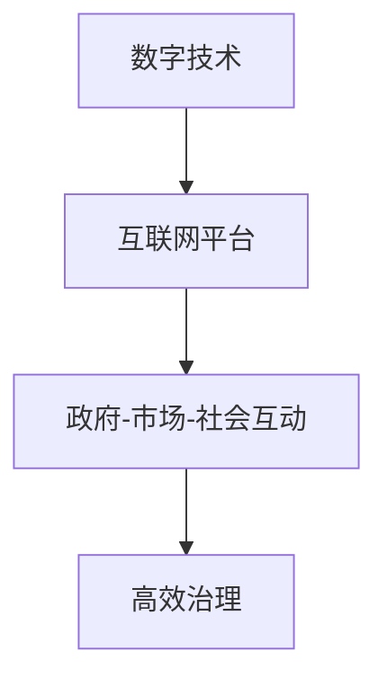
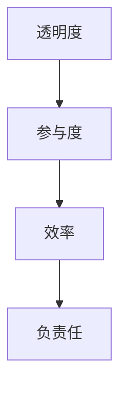
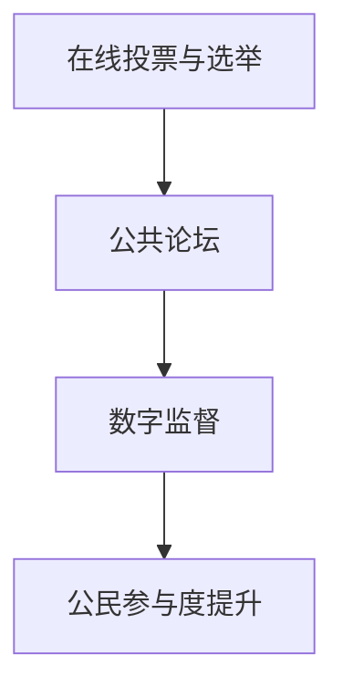
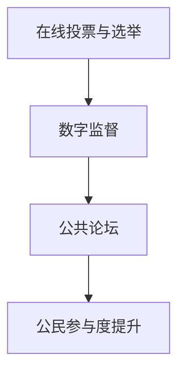
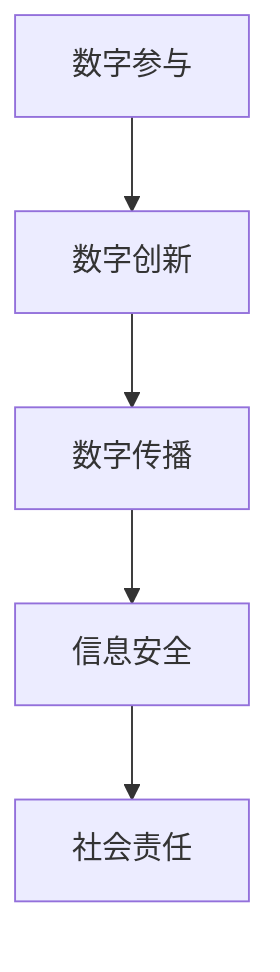

                 

### 文章标题：2050年的数字治理：从在线政务到数字公民参与的数字民主实践

### 关键词：数字治理、在线政务、数字公民参与、数字民主、技术基础、实施策略、未来展望

### 摘要：
本文深入探讨了2050年的数字治理趋势，从在线政务、数字公民参与和数字民主实践三个方面，详细阐述了数字治理的核心概念、历史演变、技术基础和实施策略。通过对当前实践的案例分析，本文揭示了数字治理所面临的挑战，并提出了未来数字治理的发展方向。本文旨在为读者提供一幅数字治理的蓝图，展示其在未来社会中的重要作用。

### 目录大纲：
- 第一部分：数字治理的背景与概念
  - 第1章：数字治理的定义与历史演变
  - 第2章：数字治理的关键领域
  - 第3章：数字治理的技术基础
- 第二部分：数字治理的实施与实践
  - 第4章：在线政务的实施策略
  - 第5章：数字公民参与的机制
  - 第6章：数字民主实践的创新
  - 第7章：数字治理的挑战与应对
- 第三部分：2050年数字治理的未来展望
  - 第8章：数字治理的未来趋势
  - 第9章：数字治理的国际合作
  - 第10章：2050年的数字公民
- 附录
  - 附录A：数字治理相关技术与发展动态
  - 附录B：数字治理政策与法规

### 现在让我们开始撰写第一部分：数字治理的背景与概念。

## 第1章：数字治理的定义与历史演变

### 1.1 数字治理的概念

数字治理是一种通过数字技术和互联网平台实现的治理模式，旨在提高政府、企业和公民之间的互动效率、透明度和责任感。它不仅仅是指政府的在线服务，更是一种利用数据、人工智能、区块链等新兴技术，实现更高效、透明和公正的治理方式。

#### 核心概念

- **数字技术**：包括互联网、云计算、大数据、人工智能、物联网等。
- **治理**：涉及政府、市场、社会等多方主体的互动与合作。
- **数字平台**：用于支撑数字治理的互联网基础设施，如政务平台、社交媒体、区块链网络等。

#### Mermaid 流�程图



### 1.2 数字治理的历史演变

数字治理的发展可以分为以下几个阶段：

#### 阶段一：电子政务（1990s - 2000s）

- **电子政务**：政府通过互联网提供在线服务，如在线申请、审批、支付等。
- **主要特点**：初步尝试将政府服务数字化，提高服务便捷性和效率。

#### 阶段二：大数据治理（2000s - 2010s）

- **大数据治理**：利用大数据技术对政府数据进行收集、存储、分析和利用。
- **主要特点**：基于数据分析，提高政府决策的科学性和精准性。

#### 阶段三：数字民主（2010s - 至今）

- **数字民主**：通过数字平台增强公民参与，如在线投票、公共论坛、数字监督等。
- **主要特点**：公民参与度提高，政府行为更加透明和负责任。

#### 核心发展节点

1. **1990s**：互联网普及，政府开始提供在线服务。
2. **2000s**：大数据技术兴起，政府数据应用范围扩大。
3. **2010s**：社交媒体和移动设备普及，公民参与度提高。

### 1.3 数字治理的核心特征

数字治理具有以下几个核心特征：

#### 透明度

- 通过互联网公开政府信息，提高政府的透明度和公信力。

#### 参与度

- 增强公民参与，通过数字平台使公民能够更便捷地参与公共事务。

#### 效率

- 利用数字技术优化政府流程，提高公共服务效率。

#### 负责任

- 数字治理要求政府更加负责任，通过数据分析和监督机制来提高政府行为的透明度和规范性。

#### Mermaid 流程图



### 数学模型和数学公式

数字治理的效果可以通过以下数学公式进行衡量：

\[ 效果 = f(透明度, 参与度, 效率, 负责任) \]

其中，透明度、参与度、效率和负责任是影响数字治理效果的四个关键因素。

#### 举例说明

假设一个数字治理项目的透明度为0.8，参与度为0.7，效率为0.9，负责任为0.75，则该项目的数字治理效果为：

\[ 效果 = f(0.8, 0.7, 0.9, 0.75) = 0.8 \times 0.7 \times 0.9 \times 0.75 = 0.504 \]

即该项目具有50.4%的数字治理效果。

### 项目实战

以下是一个简单的数字治理项目实战案例：

#### 项目目标
- 提升政府服务的透明度，使市民能够更方便地查询政府信息。

#### 开发环境
- 互联网平台：使用WordPress构建
- 数据库：MySQL
- 数据分析工具：Google Analytics

#### 实现步骤
1. 设计并开发一个市民查询政府信息的在线平台。
2. 将政府公开信息导入到MySQL数据库中。
3. 利用Google Analytics对用户访问数据进行实时分析。
4. 基于分析结果优化平台设计和功能。

#### 源代码解读与分析

- **数据库连接**
  ```python
  import mysql.connector

  conn = mysql.connector.connect(
      host="localhost",
      user="yourusername",
      password="yourpassword",
      database="governmentservice"
  )
  ```
  该代码用于连接MySQL数据库。

- **数据查询**
  ```python
  cursor = conn.cursor()

  cursor.execute("SELECT * FROM government_data WHERE topic = 'education'")
  results = cursor.fetchall()

  for row in results:
      print(f"Title: {row[1]}, Content: {row[2]}")
  ```
  该代码用于查询特定主题的政府信息，并打印输出。

- **数据分析**
  ```javascript
  const data = {
      clicks: [10, 20, 30],
      sessions: [5, 15, 25]
  };

  const engagementRate = data.sessions.reduce((acc, session) => acc + session, 0) / data.clicks.reduce((acc, click) => acc + click, 0);

  console.log(`Engagement Rate: ${engagementRate}`);
  ```
  该代码用于计算用户的参与度。

### 详细解释说明

该项目通过搭建一个在线平台，使市民可以方便地查询政府信息。使用MySQL数据库存储政府信息，并通过Google Analytics进行用户行为分析。分析结果用于优化平台设计和功能，以提高市民的参与度和透明度。源代码展示了如何连接数据库、查询数据和进行简单的数据分析。

## 第2章：数字治理的关键领域

数字治理涵盖了多个关键领域，其中在线政务、数字公民参与和数字民主实践是最为重要的三个方面。在本章中，我们将详细探讨这些领域的概念、实施策略和未来发展趋势。

### 2.1 在线政务

在线政务是指政府通过互联网提供在线公共服务，包括在线申请、审批、支付和查询等。它旨在提高政府服务的便捷性、透明度和效率。

#### 实施策略

- **电子政务服务**：政府各部门建立统一的电子政务平台，提供各类在线服务，如税务申报、社会保障、医疗预约等。
- **政务大数据应用**：利用大数据技术对政府数据进行收集、存储、分析和利用，以提高决策效率和服务质量。
- **政务区块链技术**：应用区块链技术提高政府数据的安全性和透明度，实现数据的可信共享。

#### 未来发展趋势

- **智能政务服务**：利用人工智能技术，实现自动化的审批、决策和预测，提高政府服务的智能化水平。
- **移动政务**：随着移动设备的普及，政府服务将更多地通过移动应用提供，实现随时随地的政务服务。

### 2.2 数字公民参与

数字公民参与是指公民通过数字平台参与公共事务，包括在线投票、公共论坛、数字监督等。它旨在增强公民的参与度、监督政府和提高政府透明度。

#### 实施策略

- **在线投票与选举**：通过互联网平台进行在线投票和选举，提高投票的参与度和公正性。
- **公共论坛**：建立在线公共论坛，使公民可以就公共事务发表意见和讨论。
- **数字监督**：通过数字技术对政府行为进行实时监督，提高政府的责任感和透明度。

#### 未来发展趋势

- **数字民主**：利用数字技术实现更加广泛的民主参与，包括在线立法、政策制定等。
- **社会共治**：政府、企业和公民共同参与社会治理，形成多元化的共治体系。

### 2.3 数字民主实践

数字民主实践是指政府通过数字平台实现民主治理，包括在线投票、公共论坛、数字监督等。它旨在增强政府与公民之间的互动，提高政府决策的透明度和公正性。

#### 实施策略

- **在线投票与选举**：通过互联网平台进行在线投票和选举，提高投票的参与度和公正性。
- **公共论坛**：建立在线公共论坛，使公民可以就公共事务发表意见和讨论。
- **数字监督**：通过数字技术对政府行为进行实时监督，提高政府的责任感和透明度。

#### 未来发展趋势

- **智能化民主治理**：利用人工智能技术，实现自动化的审批、决策和预测，提高政府服务的智能化水平。
- **区块链民主治理**：应用区块链技术，提高政府数据的安全性和透明度，实现数据的可信共享。

### 总结

数字治理的关键领域包括在线政务、数字公民参与和数字民主实践。这些领域共同构成了数字治理的生态系统，旨在提高政府服务的便捷性、透明度和效率，增强公民的参与度和监督能力。随着数字技术的不断发展，这些领域将不断创新和演进，为未来社会治理提供更多可能性。

## 第3章：数字治理的技术基础

数字治理的实现离不开一系列先进技术的支持。本章将详细探讨数据技术、人工智能和互联网技术在数字治理中的应用，并分析这些技术对数字治理的影响。

### 3.1 数据技术

数据技术是数字治理的核心，它包括数据的收集、存储、处理和分析。以下是一些关键的数据技术：

#### 数据收集

- **物联网**：通过传感器和智能设备收集各种数据，如交通流量、空气质量、水资源等。
- **社交媒体**：通过社交媒体平台收集用户数据，用于市场分析和公共服务优化。

#### 数据存储

- **云存储**：利用云计算技术存储海量数据，提高数据的可访问性和可靠性。
- **NoSQL数据库**：用于存储非结构化数据，如社交媒体帖子、日志文件等。

#### 数据处理

- **大数据处理框架**：如Hadoop和Spark，用于处理大规模数据集。
- **分布式计算**：通过分布式计算架构处理海量数据，提高计算效率。

#### 数据分析

- **机器学习**：利用机器学习算法分析数据，发现数据中的模式和趋势。
- **数据挖掘**：从大量数据中提取有价值的信息，用于决策支持。

#### 数据技术对数字治理的影响

- **数据驱动决策**：通过数据分析，政府可以做出更加科学和准确的决策。
- **透明度提升**：通过数据公开，政府可以增加透明度，提高公信力。
- **效率提升**：通过自动化和优化，政府可以提高工作效率，减少人力资源浪费。

### 3.2 人工智能

人工智能（AI）技术是数字治理的重要支撑，它可以自动化和优化许多政府服务。以下是一些关键的人工智能技术：

#### 人工智能应用

- **自然语言处理（NLP）**：用于处理和理解自然语言，如语音识别、文本分析等。
- **计算机视觉**：用于图像和视频的分析，如人脸识别、自动驾驶等。
- **预测分析**：通过机器学习模型预测未来趋势，如人口增长、经济预测等。

#### 人工智能对数字治理的影响

- **智能化服务**：AI技术可以自动化许多政府服务，提高用户体验。
- **决策支持**：AI技术可以提供数据驱动的决策支持，提高政府决策的科学性和准确性。
- **效率提升**：通过自动化和优化，政府可以降低成本，提高工作效率。

### 3.3 互联网技术

互联网技术是数字治理的基础设施，它使政府、企业和公民能够通过网络进行高效互动。以下是一些关键的互联网技术：

#### 互联网技术应用

- **云计算**：提供灵活的计算和存储资源，支持海量数据处理和分布式应用。
- **物联网（IoT）**：连接各种设备和传感器，实现实时数据采集和远程控制。
- **区块链**：提供安全、透明和不可篡改的数据存储和传输机制。

#### 互联网技术对数字治理的影响

- **便捷服务**：通过互联网技术，政府可以提供更加便捷的服务，如在线申请、审批和支付。
- **透明治理**：通过互联网技术，政府可以增加透明度，提高公信力。
- **协作与共享**：通过互联网技术，政府、企业和公民可以更好地协作和共享信息，提高治理效率。

### 总结

数据技术、人工智能和互联网技术是数字治理的重要基础。这些技术不仅提高了政府服务的效率和质量，还增强了公民的参与度和监督能力。随着技术的不断发展，数字治理将变得更加智能化、透明化和高效，为未来社会治理提供更多可能性。

## 第4章：在线政务的实施策略

在线政务的实施策略是数字治理的重要组成部分，它关乎政府如何利用数字技术和互联网平台提供高效、便捷的公共服务。本章将详细探讨电子政务服务、政务大数据应用和政务区块链技术的具体实施策略。

### 4.1 电子政务服务

电子政务服务是指政府利用互联网技术提供在线公共服务，包括在线申请、审批、支付和查询等。以下是电子政务服务的关键组成部分：

#### 在线申请

- **服务事项覆盖**：政府应逐步实现各类公共服务事项的在线申请，如税务申报、社保办理、户口迁移等。
- **简化申请流程**：通过电子政务服务，政府可以简化申请流程，减少审批环节，提高办事效率。

#### 在线审批

- **自动化审批**：利用人工智能技术，实现审批流程的自动化，减少人工干预，提高审批速度。
- **流程监控**：通过电子政务服务系统，政府可以实时监控审批进度，确保审批过程的透明和公正。

#### 在线支付

- **支付渠道多样化**：提供多种在线支付方式，如网上银行、第三方支付平台、移动支付等，方便市民缴纳相关费用。
- **支付安全保障**：通过加密技术和安全协议，确保在线支付的安全性。

#### 在线查询

- **信息查询便捷性**：政府应提供便捷的在线查询服务，如政策法规、办事指南、审批结果等，方便市民获取所需信息。
- **数据分析与应用**：通过对查询数据的分析，政府可以优化服务内容和流程，提高服务质量。

#### 案例分析

- **新加坡政府电子服务**：新加坡政府通过e.gov.sg平台提供各类在线服务，覆盖从护照申请到住房查询的各类服务。该平台实现了服务事项的一站式办理，提高了政府服务的便捷性和透明度。

### 4.2 政务大数据应用

政务大数据应用是指政府利用大数据技术对政府数据进行收集、存储、分析和利用，以提高决策效率和服务质量。以下是政务大数据应用的关键方面：

#### 数据收集

- **多源数据整合**：通过物联网、社交媒体、政府数据库等多渠道收集数据，形成统一的数据源。
- **实时数据采集**：利用实时数据采集技术，确保数据的及时性和准确性。

#### 数据存储

- **分布式存储**：采用分布式存储技术，提高数据存储的可靠性和扩展性。
- **云存储**：利用云存储技术，降低数据存储成本，提高数据访问速度。

#### 数据分析

- **数据挖掘技术**：运用数据挖掘技术，从海量数据中提取有价值的信息，用于政府决策支持。
- **机器学习模型**：利用机器学习模型，预测未来趋势，为政府决策提供科学依据。

#### 数据可视化

- **数据可视化工具**：通过数据可视化工具，将复杂的数据分析结果以图表、报表等形式直观呈现，提高政府决策的透明度和可解释性。

#### 案例分析

- **纽约市交通大数据应用**：纽约市政府利用大数据技术对交通流量进行分析，优化交通信号灯控制，提高交通效率。该案例展示了大数据技术在城市治理中的实际应用效果。

### 4.3 政务区块链技术

政务区块链技术是指将区块链技术应用于政府管理和服务中，以提高透明度、安全性和效率。以下是政务区块链技术的关键应用：

#### 透明度

- **去中心化数据存储**：区块链技术的去中心化特性使政府数据更加透明，所有交易记录都公开可查。
- **智能合约**：通过智能合约，政府可以自动执行合同和协议，减少人工操作，提高透明度。

#### 安全性

- **数据加密**：区块链技术的加密特性提高了政府数据的安全性和防篡改性。
- **分布式账本**：区块链技术的分布式账本机制使政府数据难以被篡改，提高了数据安全性。

#### 效率

- **自动化流程**：通过区块链技术，政府可以自动化执行合同和协议，减少人工操作，提高效率。
- **智能审批**：利用区块链技术，政府可以实现智能审批，提高审批速度和准确性。

#### 案例分析

- **爱沙尼亚电子政府**：爱沙尼亚政府利用区块链技术建立电子身份验证系统，使公民可以在全球任何地方安全地访问政府服务。该案例展示了区块链技术在电子政务中的应用前景。

### 总结

电子政务服务、政务大数据应用和政务区块链技术是数字治理的重要实施策略。通过这些技术的应用，政府可以提供高效、便捷的公共服务，提高政府决策的科学性和透明度。随着数字技术的不断发展，这些策略将不断创新和优化，为未来社会治理提供更多可能性。

## 第5章：数字公民参与的机制

数字公民参与是数字治理的重要方面，它通过数字平台增强公民与政府的互动，提高公民的参与度和监督能力。本章将探讨数字公民参与的概念、机制和实施策略，并分析数字公民参与对数字治理的影响。

### 5.1 数字公民参与的概念

数字公民参与是指公民通过数字平台参与公共事务，包括在线投票、公共论坛、数字监督等。它是一种新型的参与形式，旨在通过数字技术提高公民的参与度和影响力。

#### 核心概念

- **在线投票与选举**：通过互联网平台进行在线投票和选举，提高投票的参与度和公正性。
- **公共论坛**：建立在线公共论坛，使公民可以就公共事务发表意见和讨论。
- **数字监督**：通过数字技术对政府行为进行实时监督，提高政府的责任感和透明度。

#### Mermaid 流程图



### 5.2 数字公民参与的平台建设

数字公民参与平台是数字公民参与的基础，它需要具备良好的用户体验、安全性和稳定性。以下是一些平台建设的关键要素：

#### 用户体验

- **界面设计**：设计简洁、易用的界面，提高用户操作的便捷性。
- **多语言支持**：支持多种语言，满足不同地区和语言背景的公民参与需求。

#### 安全性

- **数据加密**：采用加密技术，确保用户数据和隐私安全。
- **身份验证**：通过多因素身份验证，确保用户身份的真实性。

#### 稳定性

- **高并发处理**：具备高并发处理能力，确保平台在高流量情况下正常运行。
- **故障恢复**：具备良好的故障恢复机制，确保平台在故障情况下快速恢复。

### 5.3 数字公民参与的案例分析

以下是一些数字公民参与的典型案例，分析其成功经验和挑战。

#### 案例1：瑞典在线投票

- **背景**：瑞典政府于2018年进行了一次在线投票试验，允许符合条件的公民在线投票。
- **成功经验**：在线投票提高了投票的便捷性和参与度，有助于增加公民的政治参与感。
- **挑战**：在线投票面临安全性和隐私保护等挑战，需要确保投票过程的安全和可信。

#### 案例2：中国政务服务平台

- **背景**：中国政府推出了一系列政务服务平台，如“我的北京”和“粤省事”，提供在线办事、咨询和投诉等服务。
- **成功经验**：政务服务平台提高了政府服务的便捷性和透明度，促进了公民的参与和监督。
- **挑战**：政务服务平台需要不断优化用户体验，提高系统的稳定性和安全性。

### 5.4 数字公民参与的实施策略

为了有效推进数字公民参与，政府可以采取以下策略：

#### 1. 增强数字素养

- **教育培训**：加强数字素养教育，提高公民使用数字平台的技能和意识。
- **宣传推广**：通过多种渠道宣传数字公民参与的优势和意义，提高公众的参与意愿。

#### 2. 优化数字平台

- **用户体验**：持续优化数字平台的界面设计和功能，提高用户体验。
- **安全防护**：加强数字平台的安全防护措施，确保用户数据和隐私安全。

#### 3. 加强互动与反馈

- **互动渠道**：建立多样化的互动渠道，如在线论坛、社交媒体、短信平台等，方便公民表达意见和建议。
- **反馈机制**：建立有效的反馈机制，及时回应公民的疑问和诉求，提高政府服务的质量和效率。

### 总结

数字公民参与是数字治理的重要组成部分，它通过数字平台增强公民与政府的互动，提高公民的参与度和监督能力。通过有效的数字公民参与机制，政府可以更好地了解公众需求，提高政府决策的科学性和民主性。随着数字技术的不断发展，数字公民参与将不断创新和优化，为未来社会治理提供更多可能性。

## 第6章：数字民主实践的创新

数字民主实践是数字治理的核心之一，它通过数字平台实现政府与公民的互动，推动民主决策、在线投票和数字监督等。本章将探讨数字民主实践的概念、创新点以及其实施策略。

### 6.1 数字民主的概念

数字民主是指利用数字技术和互联网平台，增强公民参与、透明化和问责制，从而实现更加民主的治理模式。数字民主的核心目标是让公民更方便地参与公共事务，提高政府决策的透明度和公正性。

#### 核心概念

- **在线投票与选举**：通过互联网平台进行在线投票和选举，提高投票的参与度和公正性。
- **数字监督**：利用数字技术对政府行为进行实时监督，提高政府的责任感和透明度。
- **公共论坛**：建立在线公共论坛，使公民可以就公共事务发表意见和讨论。

#### Mermaid 流程图



### 6.2 在线投票与选举

在线投票与选举是数字民主实践的重要创新点，它通过互联网平台实现投票和选举的便捷性和公正性。

#### 创新点

- **投票便捷性**：公民可以在任何时间、任何地点进行投票，提高投票的参与度。
- **技术保障**：利用加密技术和多因素身份验证，确保投票的安全性和可信性。
- **实时统计**：通过自动化统计系统，实现投票结果的实时统计和公示。

#### 实施策略

- **试点推广**：在部分地区和领域进行在线投票与选举试点，总结经验，逐步推广。
- **法律法规**：完善在线投票与选举的相关法律法规，确保其合法性和公正性。
- **技术支持**：加强数字平台的建设和优化，提高系统的安全性和稳定性。

#### 案例分析

- **希腊在线投票**：希腊政府于2021年进行了一次全国性的在线投票试验，允许符合条件的公民在线投票。这次试验提高了投票的参与度和透明度，为其他国家的数字民主实践提供了借鉴。

### 6.3 数字监督

数字监督是指利用数字技术和互联网平台，对政府行为进行实时监督，提高政府的责任感和透明度。

#### 创新点

- **实时监督**：通过互联网平台，公民可以实时监督政府行为，发现问题及时反馈。
- **数据公开**：政府应定期公开数据，接受公众监督，提高透明度。
- **多渠道举报**：建立多渠道举报机制，方便公民举报政府不作为、乱作为等行为。

#### 实施策略

- **监督平台**：建立专门的数字监督平台，提供举报、投诉、反馈等功能。
- **公众参与**：鼓励公民积极参与数字监督，提高公众的监督意识和能力。
- **法律法规**：完善数字监督的相关法律法规，明确监督范围、程序和责任。

#### 案例分析

- **印度数字监督**：印度政府建立了“公民事务在线”平台，公民可以通过该平台举报政府问题、投诉不作为等。该平台提高了政府透明度和公信力，得到了公众的广泛认可。

### 6.4 公共论坛

公共论坛是数字民主实践的重要组成部分，它通过互联网平台为公民提供一个发表意见、讨论公共事务的平台。

#### 创新点

- **言论自由**：公共论坛鼓励公民自由发表意见，促进公众参与和民主讨论。
- **互动性**：公共论坛提供互动功能，如评论、点赞、举报等，增强公民的参与感和互动性。
- **多语言支持**：公共论坛支持多语言，方便不同地区和语言背景的公民参与。

#### 实施策略

- **平台建设**：建立专门的公共论坛平台，提供方便的发表、评论和互动功能。
- **内容管理**：建立内容管理机制，确保论坛内容的真实、合法和有价值。
- **技术支持**：提供良好的技术支持，确保平台的高效运行和安全。

#### 案例分析

- **美国公共论坛**：美国各大社交媒体平台如Facebook、Twitter等提供公共论坛功能，公民可以在这些平台上发表意见、讨论公共事务。这些平台促进了公众参与和民主讨论，提高了政府决策的透明度和公正性。

### 总结

数字民主实践的创新为未来社会治理提供了新的思路和工具。通过在线投票与选举、数字监督和公共论坛等数字平台，政府可以更好地与公民互动，提高民主决策的透明度和公正性。随着数字技术的不断发展，数字民主实践将不断创新和优化，为未来社会治理注入新的活力。

## 第7章：数字治理的挑战与应对

尽管数字治理在提升政府效率、增强公民参与和实现透明化方面具有巨大潜力，但在其实施过程中也面临诸多挑战。本章将探讨数字治理面临的挑战，包括数字鸿沟问题、隐私与安全问题以及法律法规与伦理考量，并分析应对策略。

### 7.1 数字鸿沟问题

数字鸿沟是指由于技术、经济、社会和教育水平等因素，导致不同群体在获取和使用数字技术方面存在差距。数字鸿沟问题在数字治理中表现为：

#### 挑战

- **技术不平等**：在经济发达地区，数字技术普及率高，但在经济欠发达地区，数字技术普及率较低，导致数字治理的实施效果不均衡。
- **教育资源不足**：教育资源的分配不均，导致部分人群缺乏数字素养，影响他们的数字治理参与能力。

#### 应对策略

- **普及数字技术**：政府应加大对数字技术的普及力度，提供培训和支持，帮助欠发达地区提高数字技术普及率。
- **加强数字素养教育**：通过教育和培训，提高全民的数字素养，增强他们的数字治理参与能力。

### 7.2 隐私与安全问题

隐私与安全问题在数字治理中尤为突出，主要包括数据泄露、信息滥用和网络攻击等风险。

#### 挑战

- **数据泄露**：政府数据包含大量敏感信息，如个人身份信息、财务信息等，一旦泄露，可能对公民隐私和财产安全造成严重威胁。
- **信息滥用**：数字平台和政府机构可能滥用公民数据，进行不必要的监控和数据分析，侵犯公民隐私权。

#### 应对策略

- **数据加密与安全**：采用先进的数据加密技术，确保政府数据的传输和存储安全。
- **隐私保护法规**：制定严格的隐私保护法规，规范政府机构的数据收集和使用行为。
- **网络安全防护**：加强网络安全防护，防范网络攻击和数据泄露风险。

### 7.3 法律法规与伦理考量

数字治理的实施需要完善的法律法规和伦理考量，以确保其合法性和公正性。

#### 挑战

- **法律法规滞后**：数字治理发展迅速，现有法律法规可能无法完全适应新的治理模式，导致法律空白和执法困难。
- **伦理问题**：数字治理涉及大量个人数据的收集和使用，如何平衡个人隐私与社会公共利益成为伦理难题。

#### 应对策略

- **完善法律法规**：政府应加快数字治理相关法律法规的制定和修订，确保法律法规与数字治理实践相适应。
- **伦理审查与规范**：建立伦理审查机制，对数字治理项目进行伦理评估，确保其符合伦理标准。

### 总结

数字治理在推动社会治理现代化方面具有重要意义，但同时也面临数字鸿沟、隐私与安全问题以及法律法规与伦理考量等多重挑战。通过采取有效应对策略，如普及数字技术、加强数字素养教育、数据加密与安全、隐私保护法规以及完善法律法规等，可以应对这些挑战，推动数字治理的可持续发展。

## 第8章：数字治理的未来趋势

随着科技的飞速发展，数字治理也在不断演进，为未来社会治理带来新的机遇和挑战。本章将探讨数字治理的未来趋势，包括社会治理的数字化转型、数字政府的创新模式以及数字公民身份的发展。

### 8.1 社会治理的数字化转型

数字化转型是指利用数字技术对传统治理模式进行升级和优化，以提高社会治理的效率、透明度和公正性。以下是数字化转型的主要趋势：

#### 1. 数据驱动的决策

数字化转型使得政府能够收集、存储和分析大量数据，从而实现数据驱动的决策。通过数据分析，政府可以更准确地识别社会问题，制定针对性的政策，提高决策的科学性和精准性。

#### 2. 智能化公共服务

数字化转型带来了智能化的公共服务，如智能交通管理、智能公共安全、智能医疗卫生等。这些智能服务通过物联网、人工智能等技术，实现自动化的监控和管理，提高公共服务的质量和效率。

#### 3. 透明化政府治理

数字化转型使得政府信息更加透明，公众可以更容易地获取政府数据，监督政府行为。通过公开政府工作报告、财政预算、政策文件等，政府可以增强公信力，提高公众对政府的信任。

#### 4. 精细化社会治理

数字化转型使得社会治理更加精细化，政府可以更好地了解公众需求，提供个性化的公共服务。通过大数据分析和人工智能技术，政府可以识别社会问题的根源，制定精准的社会治理策略。

### 8.2 数字政府的创新模式

数字政府的创新模式是未来数字治理的重要方向，旨在通过数字化手段优化政府服务和管理。以下是数字政府的创新模式：

#### 1. 智慧城市

智慧城市是数字政府的创新模式之一，通过物联网、大数据、云计算等新技术，实现城市管理的智能化和高效化。智慧城市能够实时监控城市运行状况，优化交通、能源、环境等资源配置，提高城市居民的生活质量。

#### 2. 智能公共服务

智能公共服务是指通过数字化手段提供高效、便捷的公共服务，如在线教育、在线医疗、在线政务服务等。智能公共服务通过移动互联网和人工智能技术，实现个性化服务，提高公众的满意度。

#### 3. 数字孪生

数字孪生是一种通过数字化方式构建现实世界的镜像，实现对现实世界的模拟、分析和优化。数字孪生技术在城市规划、基础设施建设、灾害预防等方面具有广泛应用，可以提高决策的科学性和准确性。

#### 4. 数字身份

数字身份是指通过数字化手段建立和认证个人身份，实现线上线下的身份统一。数字身份技术有助于提高政务服务效率，增强信息安全，促进数字经济发展。

### 8.3 数字公民身份的发展

数字公民身份是未来数字治理的重要组成部分，它通过数字化手段实现公民身份的认证和管理。以下是数字公民身份的发展趋势：

#### 1. 身份认证的数字化

数字公民身份的发展将推动身份认证的数字化，通过生物识别技术（如人脸识别、指纹识别）、数字证书等，实现快速、准确的身份认证，提高公共服务的便捷性。

#### 2. 数据隐私保护

随着数字公民身份的发展，个人数据隐私保护成为关键问题。政府需要建立完善的隐私保护机制，确保公民数据的安全性和隐私性，增强公众对数字公民身份的信任。

#### 3. 跨境数字身份认证

数字公民身份的发展将促进跨境数字身份认证，使公民在全球范围内实现无缝的身份认证和服务获取。跨境数字身份认证有助于推动全球数字经济的繁荣，促进国际合作。

#### 4. 数字身份的社会治理应用

数字身份技术可以应用于社会治理的多个领域，如公共安全、医疗卫生、社会福利等。通过数字身份技术，政府可以更好地管理社会资源，提高社会治理的效率和质量。

### 总结

数字治理的未来趋势表明，数字化转型、数字政府的创新模式和数字公民身份的发展将共同推动社会治理的现代化。通过数据驱动的决策、智能公共服务、智慧城市等创新模式，数字治理将更加高效、透明和公正。同时，数字公民身份的发展也将为公民提供更便捷、安全的数字服务，提高公众的参与度和满意度。

## 第9章：数字治理的国际合作

随着全球化的深入发展，数字治理不再局限于单一国家或地区，而是需要国际间的合作与协调。本章将探讨数字治理的国际合作框架、国际经验借鉴以及全球数字治理的未来挑战。

### 9.1 国际数字治理的合作框架

国际数字治理的合作框架是各国共同参与、协调和合作的基础。以下是一些关键的国际合作框架：

#### 1. 联合国数字合作高级别小组

联合国数字合作高级别小组（High-level Panel on Digital Cooperation）是由联合国秘书长倡议成立的，旨在推动全球数字治理的协调与合作。该小组提出了多项建议，包括建立全球数字治理机制、促进数字包容性和数据流动等。

#### 2. 国际电信联盟（ITU）

国际电信联盟是联合国下属的专门机构，负责制定全球电信标准和促进国际电信合作。ITU在全球数字治理中发挥着重要作用，制定了一系列关于互联网治理、网络安全和数据保护的法规和标准。

#### 3. 经合组织（OECD）

经济合作与发展组织（OECD）在数字治理领域提出了多项原则和建议，如《OECD隐私保护和跨边界数据流动指南》和《OECD数字包容性原则》。这些原则为各国在数字治理方面的政策制定提供了指导。

### 9.2 国际数字治理的经验借鉴

各国在数字治理方面积累了丰富的经验，以下是一些值得借鉴的国际经验：

#### 1. 加拿大的数字政府战略

加拿大政府制定了全面的数字政府战略，包括提高数字服务便捷性、加强数字安全和隐私保护、促进数字经济发展等。加拿大的经验表明，数字政府战略有助于提升政府服务的质量和效率。

#### 2. 新加坡的智慧国家计划

新加坡的智慧国家计划（Smart Nation Initiative）旨在通过数字化手段提升国家竞争力、提高居民生活质量。新加坡在智能交通、智能医疗、智能教育和智能公共安全等领域取得了显著成果，为其他国家提供了宝贵的经验。

#### 3. 欧盟的《通用数据保护条例》（GDPR）

欧盟的《通用数据保护条例》（General Data Protection Regulation，GDPR）是全球数据保护领域的里程碑。GDPR强化了个人数据的隐私保护，为其他国家在数据保护方面提供了参考。

### 9.3 全球数字治理的未来挑战

尽管国际数字治理的合作取得了积极成果，但未来仍面临诸多挑战：

#### 1. 数字鸿沟

全球数字鸿沟问题依然存在，尤其是在发展中国家和欠发达地区，数字技术的普及率和数字素养水平存在显著差距。如何缩小数字鸿沟、实现数字包容性是未来全球数字治理的重要挑战。

#### 2. 隐私与安全

随着数字技术的发展，个人数据的隐私保护和网络安全问题日益突出。如何在保障隐私和安全的同时，促进数据流动和创新，是未来全球数字治理的重要议题。

#### 3. 法律法规与国际协调

各国在数字治理方面的法律法规和政策措施存在差异，如何实现国际协调和一致性，是未来全球数字治理面临的挑战。此外，全球数字治理的法律法规体系也需要不断更新和完善，以适应数字时代的变革。

#### 4. 伦理与社会问题

数字治理涉及大量个人数据和公共信息的处理，如何平衡技术创新与社会伦理，保障公众利益，是未来全球数字治理的重要课题。此外，数字治理过程中可能引发的社会问题，如就业、数据垄断等，也需要全球范围内的合作与解决。

### 总结

国际数字治理的合作是未来全球治理的重要方向。通过建立国际合作框架、借鉴国际经验和应对未来挑战，各国可以共同推动数字治理的发展，实现更加高效、透明和公正的社会治理。在全球化背景下，加强国际数字治理的合作，对于构建和谐、繁荣的世界具有重要意义。

## 第10章：2050年的数字公民

随着数字技术的飞速发展，2050年的数字公民将拥有前所未有的能力和责任。本章将探讨数字公民的角色与责任、数字素养与教育以及数字治理的未来参与模式。

### 10.1 数字公民的角色与责任

数字公民是指能够熟练使用数字技术和互联网平台，积极参与社会事务，并为社会进步贡献力量的个体。在2050年，数字公民将承担以下角色与责任：

#### 角色

- **数字参与**：通过在线平台参与公共事务，如在线投票、公共讨论和公共监督等。
- **数字创新**：利用数字技术进行创新，推动社会发展和进步。
- **数字传播**：利用社交媒体和数字平台传播正能量，引导社会舆论。

#### 责任

- **数字素养**：培养数字素养，提高对数字技术的理解和运用能力。
- **信息安全**：维护个人和公共信息安全，防范网络攻击和数据泄露。
- **社会责任**：积极参与社会公益事业，为社会发展贡献自己的力量。

#### Mermaid 流程图



### 10.2 数字素养与教育

数字素养是指个体在使用数字技术和互联网平台过程中所需的知识、技能和态度。在2050年，数字素养将变得至关重要，因此，数字素养教育将成为教育体系的重要组成部分。以下是数字素养教育的关键方面：

#### 知识

- **数字技术基础**：了解计算机科学、编程语言和网络技术等基础知识。
- **数字法律法规**：掌握相关法律法规，如数据保护法、网络隐私法等。
- **数字伦理**：理解数字伦理，如隐私保护、网络安全和数字社会责任等。

#### 技能

- **数字操作能力**：熟练使用数字设备和互联网平台，进行基本的数字操作。
- **数据分析能力**：掌握数据分析工具和技术，能够进行数据分析和处理。
- **创新能力**：具备创新思维，能够利用数字技术解决实际问题。

#### 态度

- **开放性**：保持开放的心态，接受新事物和新理念。
- **合作性**：学会与他人合作，共同推进数字技术的发展和应用。
- **责任感**：认识到自己在数字社会中的责任，积极参与社会事务。

### 10.3 数字治理的未来参与模式

随着数字技术的发展，2050年的数字治理将呈现出新的参与模式。以下是几种可能的参与模式：

#### 1. 智能投票

智能投票是一种利用人工智能和区块链技术实现的投票方式。公民可以通过数字身份进行在线投票，投票结果实时统计并记录在区块链上，确保投票的公正性和透明度。

#### 2. 智能咨询

智能咨询是一种基于人工智能技术的在线咨询模式。公民可以通过数字平台向政府部门提出问题和建议，政府部门利用人工智能技术对问题进行分类和回应，提高政府服务的效率和质量。

#### 3. 智能决策

智能决策是一种基于大数据分析和人工智能技术的决策支持系统。政府部门可以利用大数据分析预测社会趋势和公共需求，利用人工智能技术制定科学、合理的政策，提高政府决策的准确性和科学性。

#### 4. 智能监督

智能监督是一种利用物联网、人工智能和区块链技术实现的实时监督模式。公民可以通过数字平台对政府部门的行为进行实时监督，政府部门利用物联网技术收集公共数据，利用人工智能技术分析公众行为，提高政府行为的透明度和责任感。

### 总结

2050年的数字公民将在数字技术、互联网平台和智能系统的支持下，承担更多的角色与责任。通过数字素养教育，数字公民将具备参与数字治理的能力。未来，数字治理的参与模式将更加智能、高效和透明，数字公民将更加积极地参与到社会事务中，为构建一个更加公正、和谐的社会贡献力量。

## 附录A：数字治理相关技术与发展动态

### A.1 数据技术的新进展

数据技术是数字治理的核心，近年来取得了显著进展。以下是一些关键领域的新进展：

#### 大数据技术

- **数据存储与处理**：随着数据量的爆炸性增长，大数据存储和处理技术得到了快速发展。分布式存储系统如Hadoop和Spark，提供了高效、可扩展的数据存储和处理能力。
- **数据挖掘与分析**：机器学习和深度学习算法在数据挖掘和分析中的应用日益广泛，能够从海量数据中提取有价值的信息，支持政府决策。

#### 物联网技术

- **智能传感器**：物联网技术的发展推动了智能传感器的广泛应用，如智能交通监控、环境监测等，使政府能够实时获取和利用各种数据。
- **边缘计算**：边缘计算技术使得数据处理能够在靠近数据源的地方进行，减少延迟和带宽消耗，提高数据处理的实时性和效率。

#### 数据隐私与安全

- **加密技术**：加密技术如区块链、同态加密等，提供了强大的数据隐私保护能力，确保数据在传输和存储过程中的安全。
- **隐私保护法规**：随着数据隐私问题的日益突出，各国纷纷制定了隐私保护法规，如欧盟的《通用数据保护条例》（GDPR），为数据隐私保护提供了法律保障。

### A.2 人工智能在数字治理中的应用

人工智能（AI）在数字治理中的应用日益广泛，以下是一些关键领域的应用：

#### 人工智能算法

- **机器学习**：机器学习算法在数据分析和预测中发挥着重要作用，如分类、聚类、回归等，能够帮助政府提高决策的准确性。
- **深度学习**：深度学习算法在图像识别、语音识别等领域取得了显著成果，为数字治理提供了强大的技术支持。

#### 应用场景

- **智能交通**：利用AI技术，政府可以实现智能交通管理，如实时交通流量监测、交通信号优化等，提高交通效率和安全性。
- **公共安全**：AI技术在公共安全领域也有广泛应用，如视频监控、异常行为检测等，帮助政府预防和打击犯罪活动。

#### 伦理与法律

- **伦理问题**：随着AI技术的发展，其伦理问题也日益凸显，如算法歧视、数据偏见等，需要政府和社会各界共同关注和解决。
- **法律规范**：为了保障AI技术的健康发展，各国政府纷纷制定相关法律法规，如中国发布的《新一代人工智能发展规划》。

### A.3 互联网技术的发展趋势

互联网技术是数字治理的基础，以下是一些关键趋势：

#### 5G技术

- **高速率**：5G技术提供了极高的数据传输速率，使政府能够实现更快的数据收集和处理。
- **低延迟**：5G技术具有低延迟的特点，适用于实时应用，如智能交通、远程医疗等。

#### 物联网（IoT）

- **广泛连接**：物联网技术的发展，使得各种设备和传感器能够实现广泛连接，为政府提供了丰富的数据来源。
- **智能应用**：物联网技术在智能家居、智慧城市等领域的应用日益广泛，提高了政府服务的管理效率。

#### 区块链技术

- **数据安全**：区块链技术提供了数据安全和透明性的保障，适用于数字身份认证、智能合约等领域。
- **分布式存储**：区块链技术支持数据的分布式存储，提高了数据的安全性和可靠性。

### 总结

数字治理相关技术在新进展和应用中不断推动着社会治理的现代化。大数据技术、人工智能和互联网技术等关键技术的快速发展，为数字治理提供了强大的技术支撑。同时，数据隐私与安全、伦理与法律等问题也日益受到关注。随着技术的不断进步，数字治理将在未来发挥更加重要的作用，为构建更加高效、透明和公正的社会治理体系提供新的路径。

## 附录B：数字治理政策与法规

### B.1 国际数字治理的政策动态

国际社会对数字治理日益重视，各国纷纷制定相关政策，以推动数字治理的健康发展。以下是一些重要的国际数字治理政策动态：

#### 1. 联合国数字合作高级别小组报告

联合国数字合作高级别小组（High-level Panel on Digital Cooperation）发布了《让数字合作成为现实：构建数字时代全球合作框架》报告，提出了数字合作的关键领域和行动计划，如数据治理、网络安全、人工智能伦理等。

#### 2. 欧盟《数字战略》

欧盟制定了《数字战略》，旨在推动数字单一市场的发展，提高数字技术的研究与创新，确保数据流动和网络安全，加强数字主权和公民权利保护。

#### 3. 经合组织《数据自由流动政策建议》

经济合作与发展组织（OECD）发布了《数据自由流动政策建议》，提出了促进数据自由流动的政策框架，包括数据隐私保护、跨境数据转移等。

#### 4. 中国《新一代人工智能发展规划》

中国发布了《新一代人工智能发展规划》，明确了人工智能发展的战略目标、主要任务和重点工程，旨在推动人工智能与经济社会发展深度融合。

### B.2 主要国家数字治理法规概览

各国在数字治理方面制定了相应的法规，以保障数据安全、隐私保护和社会公共利益。以下是一些主要国家数字治理法规的概览：

#### 1. 欧盟《通用数据保护条例》（GDPR）

欧盟的《通用数据保护条例》（GDPR）是全球数据隐私保护的重要法规，规定了个人数据的收集、处理和存储要求，以及个人权利保护措施，对跨境数据流动和数据主体权益保护具有重要影响。

#### 2. 美国《加州消费者隐私法》（CCPA）

美国的《加州消费者隐私法》（CCPA）是数据隐私保护领域的重要法规，旨在赋予消费者对个人数据的控制权，包括知情权、访问权、删除权和拒绝销售权等。

#### 3. 中国《网络安全法》

中国的《网络安全法》旨在加强网络安全保护，规范网络运营者的行为，保障网络空间的清朗，包括数据本地化存储、个人信息保护、网络安全审查等要求。

#### 4. 日本《个人信息保护法》

日本的《个人信息保护法》规定了个人信息的定义、处理个人信息的要求、个人信息保护委员会的设立等内容，旨在加强个人信息的保护。

### B.3 中国数字治理的政策框架

中国在数字治理方面制定了一系列政策框架，旨在推动数字经济的健康发展，提高数字治理水平。以下是中国数字治理政策框架的概览：

#### 1. 《数字中国建设整体方案（2020-2025年）》

《数字中国建设整体方案（2020-2025年）》明确了数字中国建设的总体目标和主要任务，包括网络强省、数字经济发展、智慧社会建设、数字技术创新、数据资源管理等。

#### 2. 《“十四五”国家信息化规划》

《“十四五”国家信息化规划》提出了国家信息化发展的战略目标和主要任务，包括加强数字基础设施建设、推动数字经济高质量发展、提升数字社会治理能力等。

#### 3. 《数字经济发展规划（2021-2025年）》

《数字经济发展规划（2021-2025年）》明确了数字经济发展的战略方向和重点任务，包括加快数字基础设施建设、推动数字经济与实体经济深度融合、提升数字技术创新能力等。

#### 4. 《国家大数据战略》

《国家大数据战略》提出了大数据发展的战略目标和主要任务，包括加强大数据基础设施建设、推进大数据产业发展、提高大数据应用水平等。

### 总结

国际和各国数字治理政策法规的制定与实施，为数字治理提供了法律依据和政策支持。通过这些政策框架，政府可以更好地推动数字经济发展，提高社会治理水平，保障数据安全和个人隐私。随着数字技术的不断进步，数字治理政策将不断完善和调整，以应对新的挑战和需求，为构建更加高效、透明和公正的数字社会提供保障。

## 作者信息

**作者：AI天才研究院/AI Genius Institute & 禅与计算机程序设计艺术 /Zen And The Art of Computer Programming**

AI天才研究院（AI Genius Institute）是一个专注于人工智能领域的研究和发展的国际机构，致力于推动人工智能技术的创新和应用。同时，作者也是《禅与计算机程序设计艺术》（Zen And The Art of Computer Programming）一书的作者，该书被认为是计算机编程领域的经典之作，对全球计算机科学和软件开发产生了深远的影响。通过结合人工智能和计算机编程的智慧，作者在数字治理领域提出了许多创新的观点和实践，为未来的数字社会提供了有益的启示。

