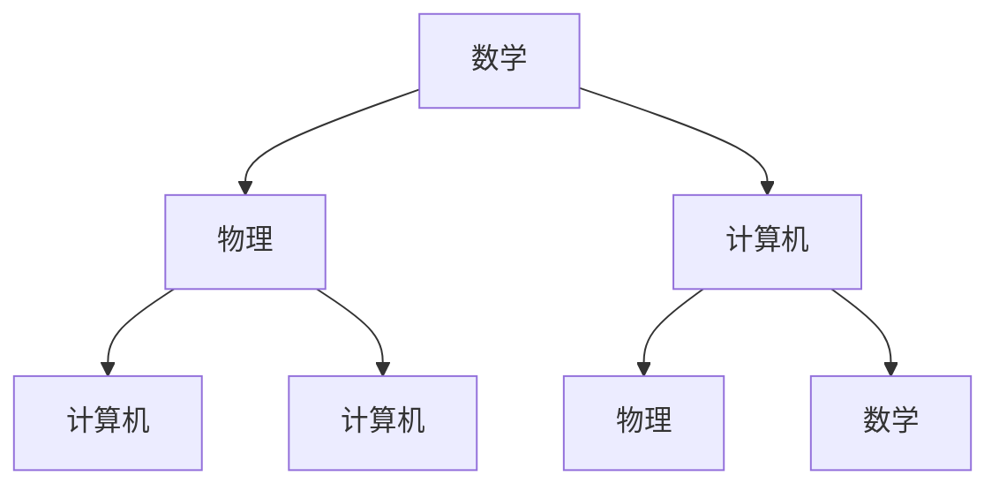

                 

### 《底层能力的培养：数学、物理、计算机》

> **关键词**：数学能力、物理能力、计算机能力、底层能力、跨学科整合、算法设计、数学模型

> **摘要**：
本文旨在探讨如何培养数学、物理和计算机这三个领域的底层能力。底层能力是提升技术水平、解决复杂问题的基石。文章将从理论基础、实际应用和培养方法三个方面详细阐述数学、物理和计算机的核心概念、原理和技能，并通过具体案例展示如何将这些能力应用于实际项目。最终，本文将探讨跨学科整合的重要性和培养跨学科整合能力的方法。

### 第一部分：引言与概述

#### 1.1 书籍介绍与目标读者

##### 1.1.1 书籍核心主题

本书的核心主题是底层能力的培养，具体涵盖数学、物理和计算机三个领域。底层能力是指在这些领域内建立扎实的理论基础和解决问题的能力。通过培养数学、物理和计算机的底层能力，读者将能够更好地理解和应用这些知识，解决实际问题和进行创新。

##### 1.1.2 目标读者与预期收获

本书的目标读者包括以下几类人群：

1. **大学生和研究生**：正在学习或即将进入数学、物理和计算机专业的学生，希望通过本书系统学习和掌握这些领域的底层能力。
2. **工程师和技术人员**：在数学、物理和计算机领域工作的工程师和程序员，希望通过本书提升自己的技术水平和解决问题的能力。
3. **自学者和爱好者**：对数学、物理和计算机感兴趣的自学者和爱好者，希望通过本书深入了解这些领域的核心知识和实际应用。

通过阅读本书，读者可以预期收获以下成果：

1. **掌握数学、物理和计算机的基础知识**：了解这三个领域的基本概念、原理和技能，为深入学习打下坚实基础。
2. **提高解决问题的能力**：通过实际案例和项目，掌握如何将数学、物理和计算机的知识应用于解决复杂问题。
3. **培养跨学科整合能力**：了解跨学科整合的意义和方法，学会如何将不同领域的知识相结合，提升创新能力。

#### 1.2 底层能力的定义与重要性

##### 1.2.1 什么是底层能力

底层能力是指在一个特定领域内建立扎实的理论基础和解决问题的能力。它包括以下几个方面：

1. **基础知识**：对领域内的核心概念、原理和术语有深入的理解。
2. **基本技能**：掌握领域内的基本工具、方法和技巧，能够熟练运用。
3. **问题解决能力**：能够运用所学的知识和技能解决实际问题，包括分析问题、设计解决方案和实现。
4. **创新能力**：在已有知识和技能的基础上，能够进行创新和改进，提出新的方法和思路。

##### 1.2.2 底层能力的重要性

底层能力的重要性体现在以下几个方面：

1. **提升技术水平**：扎实的底层能力是提升技术水平的基石，能够帮助读者更好地理解和掌握新知识、新技术。
2. **解决复杂问题**：底层能力使读者能够运用领域内的知识和技能解决复杂问题，提高工作效率和效果。
3. **创新能力**：底层能力为创新能力提供了坚实的基础，使读者能够进行创新和改进，推动技术和应用的进步。
4. **职业发展**：拥有扎实的底层能力是职业发展的关键，能够为读者在职场中获得更高的地位和更多的机会。

### 第二部分：数学能力的培养

#### 2.1 数学基础知识

##### 2.1.1 数学基本概念与原理

数学是一门研究数量、结构、变化和空间等概念的学科。数学的基本概念包括：

1. **数**：数是数学的基本元素，用于表示和量化事物的数量。
2. **函数**：函数是一种关系，将一个集合中的每个元素映射到另一个集合中的唯一元素。
3. **集合**：集合是一组元素的集合，可以用大括号{}表示。
4. **逻辑**：逻辑是研究推理和证明的学科，包括命题逻辑、谓词逻辑和形式逻辑等。

数学的基本原理包括：

1. **算术原理**：算术是研究数的运算和关系的学科，包括加法、减法、乘法和除法等。
2. **代数原理**：代数是研究方程和不等式的学科，包括线性方程、二次方程和多项式方程等。
3. **几何原理**：几何是研究形状、大小和位置关系的学科，包括平面几何和立体几何等。
4. **概率原理**：概率是研究随机事件和概率分布的学科，包括条件概率、独立性和期望等。

##### 2.1.2 数学思维方法

数学思维方法是解决数学问题的重要工具。以下是一些常见的数学思维方法：

1. **抽象思维**：将实际问题抽象成数学模型，简化问题的复杂度，从而更容易解决。
2. **推理思维**：通过逻辑推理，从已知条件推导出未知结论，解决数学问题。
3. **归纳思维**：通过观察具体实例，归纳出一般规律和结论，解决数学问题。
4. **演绎思维**：从一般原理推导出具体结论，解决数学问题。

##### 2.1.3 数学基础知识框架

数学基础知识框架包括以下内容：

1. **基础数学**：包括数论、代数、几何和三角学等基础课程。
2. **高等数学**：包括微积分、线性代数和概率论等高级课程。
3. **数学建模**：将实际问题转化为数学模型，运用数学方法和工具进行求解和分析。
4. **数学软件**：学习使用数学软件，如MATLAB、Mathematica和R等，进行数值计算和数据分析。

### 2.2 线性代数与微积分

##### 2.2.1 线性代数基本概念与算法

线性代数是研究向量空间、线性变换和矩阵等概念的数学分支。线性代数的基本概念包括：

1. **向量**：向量是表示方向和大小的几何对象，可以用有序数对或数列表示。
2. **矩阵**：矩阵是按一定规律排列的数或元素组成的矩形阵列。
3. **行列式**：行列式是一个由矩阵元素按特定规则计算得到的标量。
4. **向量空间**：向量空间是满足加法和数乘运算的集合，包括实数域和复数域上的向量空间。

线性代数的算法包括：

1. **矩阵运算**：包括矩阵的加法、减法、乘法和逆运算等。
2. **线性方程组求解**：包括高斯消元法、LU分解和迭代法等。
3. **特征值和特征向量**：计算矩阵的特征值和特征向量，用于分析矩阵的性质和结构。
4. **矩阵分解**：包括LU分解、QR分解和SVD分解等，用于简化矩阵运算和分析。

##### 2.2.2 微积分基本概念与算法

微积分是研究函数的极限、导数、积分和微分方程等概念的数学分支。微积分的基本概念包括：

1. **极限**：极限是函数在某一点附近的值趋近于某一固定值的性质。
2. **导数**：导数是描述函数在某一点处的变化率，用于求解函数的最值、凹凸性和切线等问题。
3. **积分**：积分是求解函数曲线下的面积或体积，用于求解定积分和反常积分等。
4. **微分方程**：微分方程是含有未知函数及其导数的方程，用于描述物理、工程和生物等领域的现象和规律。

微积分的算法包括：

1. **极限计算**：包括直接计算、夹逼定理和洛必达法则等。
2. **导数计算**：包括基本导数公式、链式法则、乘积法则和商法则等。
3. **积分计算**：包括基本积分公式、换元积分和分部积分等。
4. **微分方程求解**：包括初值问题、边值问题和特征值问题等。

##### 2.2.3 线性代数与微积分在实际问题中的应用

线性代数与微积分在许多实际问题中有着广泛的应用。以下是一些例子：

1. **物理学**：线性代数用于描述物理系统的状态和运动，如向量场、线性变换和矩阵等。微积分用于研究物理现象的瞬时变化和整体变化，如速度、加速度和能量等。

2. **计算机科学**：线性代数用于计算机图形学中的变换和投影，如3D图形的建模和渲染。微积分用于优化算法和机器学习中的损失函数，如梯度下降法和反向传播算法等。

3. **经济学**：线性代数用于描述经济系统的供需关系和资源分配，如线性规划问题和供需模型。微积分用于研究经济系统的变化和波动，如边际效应和弹性分析等。

### 2.3 概率论与数理统计

##### 2.3.1 概率论基本概念与算法

概率论是研究随机事件和概率分布的数学分支。概率论的基本概念包括：

1. **随机事件**：随机事件是在试验中可能发生也可能不发生的事件。
2. **概率**：概率是描述随机事件发生可能性大小的数值，通常在0和1之间。
3. **条件概率**：条件概率是在某个条件下，另一个随机事件发生的概率。
4. **独立性**：独立性是两个随机事件在某个条件下相互独立的性质。
5. **概率分布**：概率分布是描述随机变量取值概率的函数，包括离散分布和连续分布等。

概率论的算法包括：

1. **概率计算**：包括等可能事件的概率计算、条件概率计算和独立性检验等。
2. **分布函数计算**：包括离散分布函数和连续分布函数的计算，如概率质量函数和概率密度函数等。
3. **随机变量变换**：包括离散随机变量的变换和连续随机变量的变换，如线性变换和非线性变换等。

##### 2.3.2 数理统计基本概念与算法

数理统计是研究如何通过样本数据来推断总体特征的数学分支。数理统计的基本概念包括：

1. **总体**：总体是研究对象的全体，如一个群体的特征。
2. **样本**：样本是从总体中抽取的一部分个体，用于推断总体的特征。
3. **抽样方法**：抽样方法是从总体中抽取样本的方法，包括随机抽样、系统抽样和分层抽样等。
4. **统计量**：统计量是根据样本数据计算得到的量，用于描述总体的特征，如样本均值、样本方差和样本标准差等。

数理统计的算法包括：

1. **估计方法**：包括点估计和区间估计，用于估计总体的参数。
2. **假设检验**：包括单样本检验和双样本检验，用于检验总体的假设是否成立。
3. **回归分析**：包括线性回归和非线性回归，用于建立自变量和因变量之间的关系。
4. **方差分析**：用于比较多个总体均值之间的差异。

##### 2.3.3 概率论与数理统计在实际问题中的应用

概率论与数理统计在实际问题中有着广泛的应用。以下是一些例子：

1. **风险管理**：概率论用于评估投资风险和保险风险，如计算概率分布和期望值等。
2. **质量控制**：数理统计用于监控和改进产品质量，如使用统计过程控制（SPC）方法进行质量控制。
3. **预测分析**：概率论与数理统计用于预测市场趋势和需求，如时间序列分析和回归预测等。
4. **机器学习**：概率论与数理统计是机器学习的基础，用于建立和评估机器学习模型，如支持向量机和贝叶斯网络等。

### 2.4 数学模型与数学公式

##### 2.4.1 数学模型的概念与构建方法

数学模型是将实际问题转化为数学表达式的工具，通过建立数学模型，可以更好地理解和解决实际问题。数学模型的基本构建方法包括：

1. **抽象与简化**：将实际问题简化为数学问题，去除不必要的细节和复杂性。
2. **变量定义**：定义问题的变量，包括自变量和因变量等。
3. **方程建立**：根据问题的条件，建立数学方程或方程组。
4. **求解与验证**：求解数学模型，验证求解结果是否满足实际问题的条件。

##### 2.4.2 常见数学公式与讲解

在数学模型中，常见的数学公式包括：

1. **线性方程**：$Ax + By + Cz = D$，用于描述线性关系。
2. **指数函数**：$f(x) = e^x$，用于描述指数增长。
3. **导数**：$f'(x) = \lim_{h \to 0} \frac{f(x+h) - f(x)}{h}$，用于描述函数的变化率。
4. **积分**：$\int f(x)dx$，用于计算函数的定积分。

以下是这些公式的具体讲解：

**线性方程**：线性方程是描述两个变量之间线性关系的方程，通常用于求解两个变量之间的关系。例如，方程 $Ax + By = C$ 可以用于求解两个变量 $x$ 和 $y$ 之间的关系。

**指数函数**：指数函数是描述函数随自变量增长而快速变化的函数，通常用于描述指数增长。例如，函数 $f(x) = e^x$ 可以用于描述人口增长或细菌繁殖等。

**导数**：导数是描述函数在某一点的变化率的函数。例如，函数 $f(x) = x^2$ 在 $x=2$ 处的导数为 $f'(2) = 4$，表示在 $x=2$ 处函数的变化率为 4。

**积分**：积分是描述函数曲线下面积的函数。例如，函数 $f(x) = x$ 的定积分 $\int_0^1 xdx$ 等于 1/2，表示在区间 [0,1] 上函数 $f(x) = x$ 的曲线下的面积为 1/2。

##### 2.4.3 数学模型在实际问题中的应用案例

数学模型在实际问题中有着广泛的应用。以下是一些应用案例：

1. **经济学**：数学模型可以用于描述市场需求、价格波动和经济增长等。例如，线性方程可以用于描述市场需求与价格之间的关系。

2. **工程学**：数学模型可以用于描述物理现象、工程结构和系统行为。例如，指数函数可以用于描述放射性物质的衰减。

3. **生物学**：数学模型可以用于描述种群增长、疾病传播和生态系统等。例如，微分方程可以用于描述种群增长的规律。

### 2.5 数学能力的培养方法

##### 2.5.1 学习数学的基本方法

学习数学需要掌握以下基本方法：

1. **理解概念**：对数学的基本概念和原理有深入的理解，掌握概念的本质。
2. **掌握公式**：熟悉常见的数学公式，理解公式的推导过程和应用场景。
3. **练习题目**：通过大量的练习题目，提高解决问题的能力和技巧。
4. **阅读资料**：阅读数学教材、参考书和学术论文，了解数学领域的最新发展和研究成果。

##### 2.5.2 提高数学能力的实践技巧

提高数学能力需要以下实践技巧：

1. **数学建模**：将实际问题转化为数学模型，运用数学方法和工具进行求解和分析。
2. **算法实现**：编写计算机程序，实现数学算法和模型，验证和优化求解结果。
3. **案例分析**：通过案例分析，了解数学模型在实际问题中的应用，提高解决问题的能力。
4. **交流讨论**：与同学和导师交流讨论数学问题，分享经验和观点，提高数学思维能力。

##### 2.5.3 案例分析：如何培养数学能力

以下是一个案例，展示如何通过具体步骤培养数学能力：

1. **选择课题**：选择一个与数学相关的实际问题，如预测股票价格。
2. **收集数据**：收集相关的历史数据，如股票价格、交易量等。
3. **建立模型**：根据实际问题和数据特点，建立数学模型，如时间序列模型或回归模型。
4. **算法实现**：编写计算机程序，实现数学模型，进行数据分析和预测。
5. **结果验证**：比较预测结果与实际结果，验证模型的准确性和可靠性。
6. **优化模型**：根据结果反馈，对模型进行优化和改进，提高预测能力。
7. **总结经验**：总结整个过程中的经验和教训，为今后的数学能力培养提供指导。

### 第三部分：物理能力的培养

#### 3.1 物理学基础

##### 3.1.1 物理学基本概念与原理

物理学是一门研究物质、能量、时间和空间等基本概念的自然科学。物理学的基本概念和原理包括：

1. **力**：力是物体之间的相互作用，可以改变物体的运动状态。
2. **运动**：运动是物体位置随时间变化的过程，可以用速度和加速度描述。
3. **能量**：能量是物体具有的做功能力，可以转化为其他形式的能量。
4. **力与运动的关系**：牛顿运动定律描述了力和运动之间的关系。
5. **能量守恒定律**：能量在一个封闭系统中是守恒的，不能被创造或消失。

##### 3.1.2 物理学研究方法

物理学研究方法主要包括以下几种：

1. **实验方法**：通过实验来观察、测量和验证物理现象，获取数据和证据。
2. **理论方法**：建立物理模型和理论，通过数学和逻辑推理来解释和预测物理现象。
3. **观测方法**：通过观测和记录自然现象，收集物理信息。
4. **模拟方法**：使用计算机模拟和仿真来研究物理现象和系统行为。

##### 3.1.3 物理学基础知识框架

物理学基础知识框架包括以下内容：

1. **力学**：研究物体运动和力的作用的学科，包括经典力学和量子力学。
2. **热学**：研究热量和温度的学科，包括热传导、热辐射和热力学。
3. **电磁学**：研究电磁场和电荷的学科，包括静电学、磁学和电磁波。
4. **光学**：研究光和电磁波的学科，包括光的传播、反射、折射和干涉。
5. **量子力学**：研究微观粒子和量子现象的学科，包括波函数、不确定性原理和量子纠缠。
6. **相对论**：研究时空和引力的学科，包括狭义相对论和广义相对论。

### 3.2 力学

##### 3.2.1 力学基本概念与算法

力学是研究物体运动和力的作用的学科。力学的基本概念和算法包括：

1. **牛顿第一定律**：物体在没有外力作用下，保持静止或匀速直线运动。
2. **牛顿第二定律**：物体所受的合外力等于物体质量与加速度的乘积，即 $F = ma$。
3. **牛顿第三定律**：作用力和反作用力大小相等、方向相反。
4. **牛顿运动定律**：描述物体受力后的运动状态。
5. **动量守恒定律**：在没有外力作用的情况下，系统的总动量保持不变。
6. **能量守恒定律**：能量在一个封闭系统中是守恒的。

力学的基本算法包括：

1. **牛顿运动定律求解**：根据给定的力和质量，求解物体的加速度和运动轨迹。
2. **动量守恒定律应用**：在没有外力作用的情况下，求解系统的总动量。
3. **能量守恒定律应用**：在能量转换过程中，求解系统的总能量。

##### 3.2.2 力学在实际问题中的应用

力学在实际问题中有着广泛的应用。以下是一些例子：

1. **机械工程**：力学用于设计机械结构和设备，如桥梁、飞机和汽车。
2. **天文学**：力学用于描述行星运动和星系演化。
3. **生物医学**：力学用于研究人体运动和生物力学，如骨骼和肌肉的力学行为。
4. **材料科学**：力学用于研究材料的力学性能和结构，如强度、硬度和韧性。

##### 3.2.3 力学实例分析

以下是一个力学实例分析：

**问题**：一个质量为 5 kg 的物体在水平方向上受到 10 N 的力作用，求物体的加速度。

**解题步骤**：

1. **分析问题**：确定物体的受力情况和质量。
2. **应用牛顿第二定律**：$F = ma$，求解加速度。
3. **计算加速度**：$a = \frac{F}{m} = \frac{10 N}{5 kg} = 2 m/s^2$。

**结果**：物体的加速度为 2 m/s^2。

### 3.3 热学

##### 3.3.1 热学基本概念与算法

热学是研究热量和温度的学科。热学的基本概念和算法包括：

1. **热量**：热量是物体在热传递过程中传递的能量。
2. **温度**：温度是物体热运动的宏观表现，是热量传递的驱动力。
3. **热传导**：热传导是热量在固体中传递的过程，可以用热传导定律描述。
4. **热辐射**：热辐射是热量通过电磁波形式在空间中传递的过程。
5. **热力学第一定律**：能量守恒定律在热学中的体现，热量可以转化为其他形式的能量。
6. **热力学第二定律**：热量不可能自发地从低温物体传递到高温物体。

热学的基本算法包括：

1. **热传导定律应用**：根据热传导定律，求解热量传递速率和温度分布。
2. **热辐射定律应用**：根据热辐射定律，求解热辐射强度和温度分布。
3. **热力学第一定律和第二定律应用**：在能量转换过程中，求解系统的热量和温度变化。

##### 3.3.2 热学在实际问题中的应用

热学在实际问题中有着广泛的应用。以下是一些例子：

1. **热力学**：热力学用于分析热机、制冷机和热泵等热力学系统的性能。
2. **热传导**：热传导用于设计加热和冷却设备，如暖气、冰箱和热传导材料等。
3. **热辐射**：热辐射用于研究太阳能和热能利用，如太阳能电池和红外线加热设备等。
4. **生物医学**：热学用于研究生物体内的热量传递和温度调节，如人体体温监测和热疗等。

##### 3.3.3 热学实例分析

以下是一个热学实例分析：

**问题**：一个铜棒的一端温度为 300 K，另一端温度为 200 K，求铜棒中间的温度分布。

**解题步骤**：

1. **分析问题**：确定铜棒的长度、热传导系数和两端温度。
2. **应用热传导定律**：根据热传导定律，求解温度分布函数。
3. **计算温度分布**：根据热传导定律，求解铜棒中间的温度分布。

**结果**：铜棒中间的温度分布可以用一个指数函数描述，具体形式为 $T(x) = T_1 + (T_2 - T_1) \cdot e^{-\alpha x}$，其中 $T_1$ 和 $T_2$ 分别为铜棒两端的温度，$\alpha$ 为热传导系数。

### 3.4 电磁学

##### 3.4.1 电磁学基本概念与算法

电磁学是研究电磁场和电荷的学科。电磁学的基本概念和算法包括：

1. **电荷**：电荷是物体带有的基本电荷量，分为正电荷和负电荷。
2. **电场**：电场是电荷周围产生的力场，可以用电场强度描述。
3. **电势**：电势是电场中某点的电势能与电荷量的比值。
4. **电流**：电流是电荷的流动，可以用电流强度描述。
5. **磁场**：磁场是磁体周围产生的力场，可以用磁场强度描述。
6. **电磁感应**：电磁感应是磁场变化产生的电动势。
7. **麦克斯韦方程组**：描述电磁场的基本方程组，包括高斯定律、安培定律和法拉第电磁感应定律等。

电磁学的基本算法包括：

1. **电场计算**：根据电荷分布和电场强度，求解电场的分布和性质。
2. **电势计算**：根据电荷分布和电场强度，求解电势的分布和性质。
3. **磁场计算**：根据电流分布和磁场强度，求解磁场的分布和性质。
4. **电磁波传播**：根据电磁波传播方程，求解电磁波的传播速度和性质。

##### 3.4.2 电磁学在实际问题中的应用

电磁学在实际问题中有着广泛的应用。以下是一些例子：

1. **电子学**：电磁学用于设计电子器件和电路，如半导体器件、集成电路和通信系统等。
2. **电磁场理论**：电磁场理论用于分析电磁波传播、天线设计和微波通信等。
3. **磁学**：磁学用于研究磁性材料和磁共振现象，如磁共振成像（MRI）和磁存储等。
4. **光学**：光学用于研究光的传播、反射、折射和干涉等现象，如光纤通信和激光技术等。

##### 3.4.3 电磁学实例分析

以下是一个电磁学实例分析：

**问题**：一个长度为 1 m 的直导线中通有 1 A 的电流，求导线周围磁场的分布。

**解题步骤**：

1. **分析问题**：确定导线的长度、电流和磁场方向。
2. **应用安培定律**：根据安培定律，求解磁场强度。
3. **计算磁场分布**：根据安培定律，求解导线周围磁场的分布。

**结果**：导线周围磁场可以用一个高斯定律描述，磁场强度的大小与距离成反比，方向垂直于导线，具体形式为 $B(r) = \frac{\mu_0 I}{2\pi r}$，其中 $\mu_0$ 为真空磁导率，$I$ 为电流强度，$r$ 为距离导线的距离。

### 3.5 物理能力的培养方法

##### 3.5.1 学习物理的基本方法

学习物理需要掌握以下基本方法：

1. **理解概念**：对物理的基本概念和原理有深入的理解，掌握概念的本质。
2. **掌握公式**：熟悉常见的物理公式，理解公式的推导过程和应用场景。
3. **实验观察**：通过实验观察物理现象，获取数据和证据。
4. **理论分析**：通过理论分析和数学推理，解释和预测物理现象。
5. **案例分析**：通过案例分析，了解物理知识在实际问题中的应用，提高解决问题的能力。

##### 3.5.2 提高物理能力的实践技巧

提高物理能力需要以下实践技巧：

1. **实验设计**：设计物理实验，观察和记录实验现象，分析实验结果。
2. **数据分析**：使用数据分析方法，如曲线拟合和误差分析，处理实验数据。
3. **理论推导**：通过理论推导，建立物理模型和理论，解释和预测物理现象。
4. **编程实现**：使用编程语言，实现物理算法和模型，进行数值计算和仿真。
5. **交流讨论**：与同学和导师交流讨论物理问题，分享经验和观点，提高物理思维能力。

##### 3.5.3 案例分析：如何培养物理能力

以下是一个案例分析，展示如何通过具体步骤培养物理能力：

1. **选择课题**：选择一个与物理相关的实际问题，如研究一个物体的运动轨迹。
2. **收集数据**：收集相关的实验数据和理论知识。
3. **建立模型**：根据实际问题和数据特点，建立物理模型，如运动学模型或动力学模型。
4. **理论分析**：使用物理理论进行分析和推导，求解物体的运动轨迹。
5. **实验验证**：设计实验，验证理论分析的准确性。
6. **结果分析**：分析实验结果，发现问题和不足，对理论模型进行优化和改进。
7. **总结经验**：总结整个过程中的经验和教训，为今后的物理能力培养提供指导。

### 第四部分：计算机能力的培养

#### 4.1 计算机科学基础

##### 4.1.1 计算机科学基本概念与原理

计算机科学是一门研究计算机及其应用的学科，涉及硬件、软件、算法、数据结构等多个方面。计算机科学的基本概念和原理包括：

1. **计算机系统**：计算机硬件和软件的总和，包括中央处理器（CPU）、内存、输入输出设备等。
2. **算法**：解决问题的一系列步骤，具有输入、输出和执行步骤。
3. **数据结构**：数据的组织、存储和管理方式，包括数组、链表、树、图等。
4. **编程语言**：用于编写计算机程序的语言，包括汇编语言、高级语言等。
5. **操作系统**：管理计算机硬件和软件资源的系统软件，包括进程管理、内存管理、文件系统等。
6. **计算机网络**：连接多个计算机系统的技术，包括数据传输、网络协议等。

##### 4.1.2 计算机科学研究方法

计算机科学研究方法主要包括以下几种：

1. **实验方法**：通过设计和进行实验，验证理论模型的正确性和有效性。
2. **理论方法**：通过数学和逻辑推理，建立和证明计算机科学的理论和算法。
3. **仿真方法**：使用计算机模拟和仿真，模拟和分析计算机系统和算法的行为。
4. **案例分析**：通过分析具体案例，总结和提炼计算机科学的规律和经验。
5. **对比研究**：比较不同算法、系统或方法之间的性能和效果，寻找最优方案。

##### 4.1.3 计算机科学基础知识框架

计算机科学基础知识框架包括以下内容：

1. **计算机组成原理**：研究计算机硬件系统的组成、工作原理和性能优化。
2. **数据结构与算法**：研究数据的组织、存储和管理方式，以及算法的设计和分析。
3. **操作系统原理**：研究操作系统的设计、实现和功能，包括进程管理、内存管理、文件系统等。
4. **计算机网络**：研究计算机网络的基本概念、协议和传输技术。
5. **软件工程**：研究软件的开发、测试和维护方法，提高软件质量和效率。
6. **人工智能**：研究智能系统、机器学习和自然语言处理等。

### 4.2 编程语言与算法

##### 4.2.1 编程语言基本概念与特点

编程语言是用于编写计算机程序的语法和语义规则。常见的编程语言包括：

1. **C语言**：一种低级语言，具有丰富的运算符和函数库，广泛应用于系统编程和嵌入式开发。
2. **Python语言**：一种高级语言，具有简洁易读的语法和强大的库支持，广泛应用于科学计算、数据分析、人工智能等领域。
3. **Java语言**：一种面向对象的编程语言，具有跨平台性和安全性，广泛应用于企业级应用和移动开发。
4. **C++语言**：一种面向对象的编程语言，具有丰富的模板和运算符重载功能，广泛应用于系统编程、游戏开发和嵌入式开发。

编程语言的特点包括：

1. **语法**：不同的编程语言有不同的语法规则，包括变量声明、语句格式、控制结构等。
2. **语义**：编程语言的语义描述了程序的执行过程和结果，包括变量的作用域、函数的调用和返回等。
3. **库支持**：编程语言通常提供丰富的库支持，包括标准库和第三方库，用于实现常见功能。
4. **跨平台性**：不同的编程语言具有不同的跨平台性，可以在不同的操作系统和硬件平台上运行。

##### 4.2.2 算法设计与分析

算法是解决问题的步骤和策略。算法的设计和分析是计算机科学的重要研究领域。算法的设计包括：

1. **顺序算法**：按照顺序执行的一系列操作，解决简单问题。
2. **递归算法**：通过递归调用自身解决复杂问题，通常用于解决递归关系问题。
3. **分治算法**：将复杂问题划分为更小的子问题，分别解决并合并结果。
4. **贪心算法**：在每一步选择中做出局部最优选择，期望得到全局最优解。
5. **动态规划算法**：通过将复杂问题分解为更小的子问题，并保存子问题的解，避免重复计算。

算法的分析包括：

1. **时间复杂度**：描述算法执行时间与问题规模之间的关系，通常用大O表示法表示。
2. **空间复杂度**：描述算法执行所需内存空间与问题规模之间的关系，通常用大O表示法表示。
3. **正确性分析**：证明算法的正确性，包括初始条件、中间条件和最终条件。
4. **性能分析**：评估算法的性能，包括时间效率和空间效率。

##### 4.2.3 常见算法分析与实例

以下是一些常见算法及其分析：

1. **排序算法**：包括冒泡排序、选择排序、插入排序和快速排序等，用于对数据进行排序。
   - 冒泡排序的时间复杂度为 $O(n^2)$，空间复杂度为 $O(1)$。
   - 选择排序的时间复杂度为 $O(n^2)$，空间复杂度为 $O(1)$。
   - 插入排序的时间复杂度为 $O(n^2)$，空间复杂度为 $O(1)$。
   - 快速排序的时间复杂度为 $O(n\log n)$，空间复杂度为 $O(\log n)$。

2. **查找算法**：包括线性查找、二分查找和哈希查找等，用于在数据中查找特定元素。
   - 线性查找的时间复杂度为 $O(n)$，空间复杂度为 $O(1)$。
   - 二分查找的时间复杂度为 $O(\log n)$，空间复杂度为 $O(1)$。
   - 哈希查找的时间复杂度为 $O(1)$，空间复杂度为 $O(n)$。

3. **图算法**：包括最短路径算法、最小生成树算法和拓扑排序等，用于解决图问题。
   - Dijkstra算法的时间复杂度为 $O(n^2)$，空间复杂度为 $O(n)$。
   - Prim算法的时间复杂度为 $O(n^2)$，空间复杂度为 $O(n)$。
   - Kruskal算法的时间复杂度为 $O(n\log n)$，空间复杂度为 $O(n)$。

通过分析这些常见算法的时间复杂度和空间复杂度，可以了解不同算法的性能特点，为实际问题选择合适的算法。

### 4.3 数据结构与数据库

##### 4.3.1 数据结构基本概念与实现

数据结构是用于存储和管理数据的组织形式。常见的几种数据结构包括：

1. **数组**：数组是一种线性数据结构，用于存储一组元素，具有固定的长度和连续的内存地址。
2. **链表**：链表是一种线性或非线性数据结构，由一系列节点组成，每个节点包含数据和指向下一个节点的指针。
3. **栈**：栈是一种后进先出（LIFO）的数据结构，用于存储和检索元素。
4. **队列**：队列是一种先进先出（FIFO）的数据结构，用于存储和检索元素。
5. **树**：树是一种非线性数据结构，由节点和边组成，具有层次结构。
6. **图**：图是一种复杂非线性数据结构，由节点和边组成，用于表示实体之间的关系。

数据结构的实现包括以下几种方法：

1. **静态数组**：使用固定大小的数组存储数据，适用于数据量较小且不变的情景。
2. **动态数组**：使用可变大小的数组存储数据，可以根据需要动态扩展或缩小。
3. **链式存储**：使用链表实现数据结构，适用于数据量动态变化且需要频繁插入或删除元素的情景。
4. **树结构存储**：使用树结构实现数据结构，适用于具有层次关系的数据。
5. **图结构存储**：使用图结构实现数据结构，适用于表示复杂关系的数据。

##### 4.3.2 数据库基本概念与操作

数据库是用于存储、管理和检索数据的系统。数据库的基本概念包括：

1. **数据库系统**：包括数据库、数据库管理系统（DBMS）、应用程序和用户等。
2. **数据库模式**：定义数据库的结构，包括表、字段、索引等。
3. **数据库操作**：包括插入、删除、更新和查询等。
4. **SQL语言**：一种用于数据库查询和操作的语言，包括数据定义语言（DDL）和数据操作语言（DML）。

数据库的操作包括：

1. **创建数据库和表**：定义数据库和表的结构，包括字段类型、索引和约束等。
2. **插入数据**：将数据插入到表中，可以使用SQL的INSERT语句实现。
3. **查询数据**：检索表中的数据，可以使用SQL的SELECT语句实现。
4. **更新数据**：修改表中的数据，可以使用SQL的UPDATE语句实现。
5. **删除数据**：从表中删除数据，可以使用SQL的DELETE语句实现。

##### 4.3.3 数据结构与数据库在实际问题中的应用

数据结构与数据库在实际问题中有着广泛的应用。以下是一些例子：

1. **Web应用**：使用数组、链表和树等数据结构存储和管理用户数据、页面数据和缓存数据。
2. **数据库应用**：使用数据库存储和管理大量数据，如客户信息、订单数据和库存数据。
3. **实时系统**：使用队列和栈等数据结构实现任务调度和缓冲区管理。
4. **图数据库**：使用图结构存储和查询复杂的关系数据，如社交网络、交通网络和推荐系统。

### 4.4 计算机网络与操作系统

##### 4.4.1 计算机网络基本概念与架构

计算机网络是连接多个计算机系统的技术，实现数据传输和共享资源。计算机网络的基本概念包括：

1. **网络拓扑**：网络的物理布局和连接方式，包括总线型、星型、环型和混合型等。
2. **网络协议**：网络通信的规则和约定，包括TCP/IP、HTTP、FTP等。
3. **网络设备**：网络中的硬件设备，包括路由器、交换机、网卡等。
4. **网络连接**：通过网络设备实现计算机之间的连接，包括有线连接和无线连接等。

计算机网络的架构包括：

1. **客户端/服务器模型**：客户端发起请求，服务器响应请求，实现数据的传输和处理。
2. **分布式计算模型**：将计算任务分布在多个计算机上，实现高效的计算和资源共享。
3. **P2P模型**：点对点连接，没有固定的客户端和服务器，实现数据的直接交换和共享。

##### 4.4.2 操作系统基本概念与功能

操作系统是管理计算机硬件和软件资源的系统软件。操作系统的基本概念包括：

1. **进程**：程序在计算机上的一次执行活动，具有独立的内存空间和系统资源。
2. **线程**：进程中的独立执行单元，共享进程的内存空间和系统资源。
3. **内存管理**：管理计算机的内存资源，包括内存分配、释放和保护等。
4. **文件系统**：管理计算机的文件存储和检索，包括文件的创建、删除、读取和写入等。
5. **输入输出管理**：管理计算机的输入输出设备，包括设备的分配、控制和数据传输等。

操作系统的功能包括：

1. **进程管理**：创建、调度和终止进程，实现多进程并发执行。
2. **内存管理**：分配、回收和保护内存资源，实现内存空间的合理利用。
3. **文件管理**：创建、删除、读取和写入文件，实现文件的存储和管理。
4. **输入输出管理**：管理输入输出设备，实现数据的输入输出和传输。
5. **用户界面**：提供用户与计算机的交互接口，实现用户对计算机的操作和控制。

##### 4.4.3 计算机网络与操作系统在实际问题中的应用

计算机网络与操作系统在实际问题中有着广泛的应用。以下是一些例子：

1. **Web应用**：使用计算机网络实现客户端和服务器之间的数据传输，使用操作系统管理进程、内存和文件系统等。
2. **分布式系统**：使用计算机网络实现分布式计算，使用操作系统管理分布式进程和资源。
3. **嵌入式系统**：使用操作系统实现嵌入式设备的任务调度和资源管理，使用计算机网络实现设备之间的通信。
4. **物联网**：使用计算机网络实现物联网设备之间的连接和数据传输，使用操作系统实现设备的管理和控制。

### 4.5 计算机能力的培养方法

##### 4.5.1 学习计算机的基本方法

学习计算机需要掌握以下基本方法：

1. **理解概念**：对计算机科学的基本概念和原理有深入的理解，掌握概念的本质。
2. **掌握编程语言**：学习并掌握至少一种编程语言，如C、Python或Java等。
3. **实践编程**：通过编写程序和解决实际问题，提高编程能力和解决问题的能力。
4. **学习算法和数据结构**：掌握常见的算法和数据结构，理解其原理和应用场景。
5. **学习操作系统和网络知识**：了解操作系统的基本原理和网络通信的协议和机制。

##### 4.5.2 提高计算机能力的实践技巧

提高计算机能力需要以下实践技巧：

1. **实验和项目**：通过设计和完成实验和项目，将理论知识应用到实际中。
2. **阅读代码和文档**：阅读优秀的代码和文档，学习他人的编程技巧和设计思路。
3. **参与开源项目**：参与开源项目，与其他开发者合作，提高团队合作能力和编程能力。
4. **持续学习和更新**：计算机科学是一个快速发展的领域，持续学习和更新知识，跟上技术的发展趋势。

##### 4.5.3 案例分析：如何培养计算机能力

以下是一个案例分析，展示如何通过具体步骤培养计算机能力：

1. **选择课题**：选择一个与计算机相关的实际问题，如设计一个简易的Web应用。
2. **学习相关知识**：学习HTML、CSS和JavaScript等Web开发基础知识。
3. **实践编程**：编写代码，实现Web应用的基本功能，如页面布局、表单验证和数据存储等。
4. **调试和优化**：测试和调试代码，优化性能和用户体验。
5. **学习新技术**：了解和掌握新的Web开发技术，如React或Vue等。
6. **项目迭代**：对Web应用进行迭代和优化，增加新功能和改进用户体验。
7. **总结经验**：总结整个过程中的经验和教训，为今后的计算机能力培养提供指导。

### 第五部分：跨学科整合与应用

#### 5.1 跨学科整合的意义与挑战

##### 5.1.1 跨学科整合的定义与重要性

跨学科整合是指将不同学科的理论、方法和技术进行结合，以解决复杂问题和推动创新。跨学科整合的定义可以概括为：

1. **学科交叉**：将不同学科的知识和理论进行交叉和融合，形成新的研究方法和应用模式。
2. **知识共享**：通过不同学科的交流与合作，实现知识的共享和互补，提高整体解决问题的能力。
3. **创新突破**：通过跨学科整合，打破传统学科界限，推动科学技术的创新和发展。

跨学科整合的重要性体现在以下几个方面：

1. **解决复杂问题**：复杂问题往往涉及多个学科领域，跨学科整合可以综合不同学科的知识和方法，提供更加全面和有效的解决方案。
2. **推动技术创新**：跨学科整合可以激发不同学科的交叉点，促进新技术的发明和创造，推动科学技术的进步。
3. **提高创新能力**：跨学科整合可以拓宽思维视野，激发创新灵感，提高个体和团队的创新能力。
4. **适应社会发展**：随着社会的发展和变化，跨学科整合成为应对复杂社会问题的重要手段，有助于提升社会的综合竞争力。

##### 5.1.2 跨学科整合的挑战与解决方案

跨学科整合虽然具有显著的优势，但同时也面临一系列挑战。以下是一些主要的挑战及相应的解决方案：

1. **学科差异**：不同学科在思维方式、理论体系和实践方法上存在差异，导致跨学科整合的难度。解决方案包括：
   - **建立共同语言**：通过制定统一的术语和标准，促进不同学科之间的交流和理解。
   - **培养跨学科人才**：通过教育和培训，培养具备跨学科知识和技能的专业人才，提高跨学科整合的能力。

2. **知识融合**：将不同学科的知识进行融合和整合，需要克服知识体系之间的冲突和差异。解决方案包括：
   - **搭建知识平台**：建立跨学科的知识平台，整合不同学科的理论、方法和实践成果，为跨学科整合提供基础。
   - **项目驱动**：通过具体的项目和实践，将不同学科的知识和技能进行整合，逐步实现跨学科的融合。

3. **资源分配**：跨学科整合需要投入大量的人力和物力资源，资源分配的合理性和效率成为关键。解决方案包括：
   - **合理配置资源**：根据跨学科整合项目的需求和优先级，合理配置人力资源、资金和设备等资源。
   - **多渠道筹资**：通过政府资助、企业赞助和社会合作等多渠道筹资，为跨学科整合提供稳定的资金支持。

4. **团队协作**：跨学科整合通常需要不同学科背景的人员合作，团队协作和沟通成为关键。解决方案包括：
   - **建立协作机制**：建立有效的团队协作机制，明确分工和职责，加强团队内部的沟通和协作。
   - **跨学科培训**：组织跨学科的培训和学习活动，提高团队成员对其他学科的了解和技能，促进团队协作。

#### 5.2 数学、物理、计算机的交叉应用

##### 5.2.1 数学在计算机中的应用

数学在计算机科学中具有广泛的应用，为算法设计、数据分析和系统优化提供了理论基础。以下是一些数学在计算机中的应用：

1. **算法设计**：数学原理在算法设计中起着关键作用，如排序算法中的比较排序和非比较排序，图算法中的最短路径算法等。数学理论帮助分析算法的时间复杂度和空间复杂度，优化算法性能。

2. **数据结构**：数学概念和数据结构密切相关，如树、图、矩阵等。这些数据结构在计算机科学中用于高效存储和检索数据，支持各种算法的实现。

3. **优化和优化**：数学优化方法在计算机科学中用于求解各种优化问题，如线性规划、非线性规划、整数规划等。这些方法在资源分配、路径规划、机器学习等领域具有重要应用。

4. **计算机图形学**：数学在计算机图形学中用于建模、渲染和动画等。向量计算、矩阵变换、几何计算等数学方法用于实现三维图形的建模和渲染。

5. **机器学习**：数学理论在机器学习中起着核心作用，如线性代数、概率论和统计学。这些理论用于描述和优化机器学习模型，提高学习效率和预测准确性。

##### 5.2.2 物理在计算机中的应用

物理原理在计算机科学中也有广泛应用，为硬件设计、系统优化和算法改进提供了理论支持。以下是一些物理在计算机中的应用：

1. **硬件设计**：物理原理在计算机硬件设计中至关重要，如集成电路设计、电子元器件特性等。量子物理和纳米技术等前沿物理学领域的发展，推动了计算机硬件技术的进步。

2. **散热管理**：计算机硬件在运行过程中会产生大量热量，物理原理如热传导、热辐射和热力学定律等用于散热管理，保持计算机系统的稳定运行。

3. **通信技术**：物理原理在通信技术中用于描述信号传输、噪声分析和信道编码等。光纤通信、无线通信和量子通信等技术的发展，离不开物理原理的指导。

4. **计算机图形学**：物理原理如光学和电磁学在计算机图形学中用于渲染和模拟真实世界的场景。光线追踪、全局光照和阴影等技术，通过模拟物理现象，实现了逼真的图形渲染效果。

5. **量子计算**：量子物理原理在量子计算中用于描述量子比特的行为，实现量子叠加和量子纠缠等特性。量子计算具有巨大的计算潜力，可能改变计算机科学的发展方向。

##### 5.2.3 计算机在数学和物理中的应用

计算机技术在数学和物理领域中发挥着重要作用，提高了数学模型的计算效率和物理实验的可重复性。以下是一些计算机在数学和物理中的应用：

1. **数值计算**：计算机技术用于实现数值计算方法，如数值积分、数值微分和数值求解微分方程等。计算机的强大计算能力，使得复杂的数学模型和物理问题得以高效求解。

2. **数学软件**：计算机软件如MATLAB、Mathematica和Python等，提供了丰富的数学工具和库函数，方便数学研究和计算。这些软件支持数学建模、数据分析、优化和可视化等。

3. **物理仿真**：计算机技术用于物理仿真，模拟和预测物理现象和实验结果。计算机仿真技术如有限元分析、蒙特卡罗方法和分子动力学模拟等，为物理研究提供了强大的工具。

4. **大数据分析**：计算机技术在大数据分析中发挥着重要作用，处理和分析大规模物理实验数据，提取有价值的信息和规律。数据分析方法如机器学习、统计分析和数据挖掘等，帮助物理学家发现新现象和规律。

5. **分布式计算**：计算机技术支持分布式计算，将复杂的计算任务分布在多台计算机上，提高计算效率。分布式计算技术在解决大规模物理问题如气候变化、地球科学和天体物理学等领域具有重要意义。

### 5.3 跨学科整合的实际案例

#### 5.3.1 数学在计算机科学中的应用案例

**案例一：人工智能中的优化算法**

人工智能领域中的优化算法，如遗传算法、粒子群优化算法和模拟退火算法等，基于数学原理，通过模拟自然进化和物理退火过程，寻找问题的最优解。这些算法在图像识别、优化调度、路径规划等计算机科学问题中取得了显著成效。

**案例分析：**

1. **遗传算法**：遗传算法是一种基于自然进化原理的优化算法，通过模拟生物进化的过程，逐步优化解的质优度。遗传算法的核心概念包括基因、种群、交叉、变异和选择。

2. **应用场景**：遗传算法可以应用于图像识别中的特征选择、资源分配中的任务调度和交通规划中的路径优化等。

3. **效果评估**：遗传算法在处理复杂、非线性优化问题时，具有较好的收敛速度和稳定性，能够找到较优的解。

**案例分析**：

假设我们要优化一个任务调度问题，目标是使任务完成时间最短。我们可以定义以下数学模型：

- 任务集合 $T=\{T_1, T_2, ..., T_n\}$，其中每个任务 $T_i$ 有开始时间和结束时间。
- 调度集合 $S$，包含所有可能的任务调度方案。
- 目标函数：最小化任务完成时间，即最小化 $\sum_{i=1}^n (F_i - S_i)$，其中 $F_i$ 是任务 $T_i$ 的开始时间，$S_i$ 是任务 $T_i$ 的结束时间。

通过遗传算法，我们可以迭代地优化调度方案，逐步找到最优的调度方案。

#### 5.3.2 物理在计算机科学中的应用案例

**案例二：计算机图形学中的光线追踪**

光线追踪是一种计算机图形学技术，用于渲染真实感图像。光线追踪基于物理原理，模拟光线在三维场景中的传播和反射、折射等现象，实现了逼真的图像渲染效果。

**案例分析：**

1. **物理原理**：光线追踪基于光学原理，包括光的直线传播、反射、折射和散射等。光线追踪算法通过模拟这些物理现象，计算光线的传播路径和交互效果。

2. **应用场景**：光线追踪可以应用于游戏渲染、电影特效和虚拟现实等场景，实现逼真的视觉效果。

3. **效果评估**：光线追踪技术能够模拟真实世界的光学现象，提供了高质量、高真实感的图像渲染效果。

**案例分析**：

假设我们要渲染一个简单的室内场景，包括一个球体和一个平面。我们可以定义以下数学模型：

- 场景：包括球体和平面，定义它们的几何形状和位置。
- 光线：从相机发出的光线，定义光线的方向和能量。
- 反射和折射：根据光线的传播路径，计算光线与球体和平面的反射和折射效果。

通过光线追踪算法，我们可以模拟光线在场景中的传播，计算光线的反射和折射，最终渲染出逼真的图像。

#### 5.3.3 计算机在数学和物理中的应用案例

**案例三：大数据分析中的气象预报模型**

大数据分析技术结合数学和计算机科学，为气象预报提供了强大的工具。气象预报模型通过收集和分析大量气象数据，使用数学模型和计算机算法，预测天气变化和气候变化。

**案例分析：**

1. **数学模型**：气象预报模型基于概率论、统计学和物理学原理，建立数学模型，如随机过程模型、气象统计模型和物理模型等。

2. **应用场景**：大数据分析技术可以应用于短期天气预报、中长期气候预测和灾害预警等。

3. **效果评估**：大数据分析技术提高了气象预报的准确性，为防灾减灾提供了科学依据。

**案例分析**：

假设我们要预测一个地区的未来一周天气情况。我们可以定义以下数学模型：

- 数据集：收集该地区过去一周的气象数据，包括温度、湿度、风速等。
- 数学模型：建立时间序列模型、回归模型或机器学习模型，预测未来一周的天气情况。
- 算法：使用计算机算法，如深度学习算法、随机森林算法等，训练和预测天气数据。

通过大数据分析技术，我们可以分析历史气象数据，建立预测模型，预测未来一周的天气情况，为公众和相关部门提供科学依据。

### 5.4 跨学科整合能力的培养方法

##### 5.4.1 跨学科学习的方法与策略

培养跨学科整合能力需要掌握以下学习方法和策略：

1. **知识储备**：广泛学习不同学科的基础知识，建立扎实的学科背景。
2. **交叉阅读**：阅读跨学科的书籍和论文，了解不同学科的思维方式和方法。
3. **跨学科课程**：参加跨学科的课程和研讨会，拓展跨学科视野。
4. **团队合作**：与不同学科背景的团队合作，共同解决问题，提高跨学科协作能力。

##### 5.4.2 跨学科整合能力的实践技巧

提高跨学科整合能力需要以下实践技巧：

1. **项目驱动**：通过实际项目，将不同学科的知识和技能进行整合，解决实际问题。
2. **案例分析**：通过分析跨学科的实际案例，学习跨学科整合的方法和技巧。
3. **持续学习**：跟踪跨学科领域的最新研究进展和技术趋势，不断提高自己的跨学科整合能力。
4. **实践应用**：将跨学科知识应用到实际工作中，提升跨学科整合能力。

##### 5.4.3 跨学科整合能力的评价与提升

评价跨学科整合能力可以从以下几个方面进行：

1. **知识整合能力**：评估个体在不同学科之间的知识整合和融通能力。
2. **问题解决能力**：评估个体在解决复杂问题时，运用跨学科知识和方法的能力。
3. **创新能力**：评估个体在跨学科整合过程中，提出新思路和新方法的能力。
4. **团队协作能力**：评估个体在跨学科团队合作中的协作和沟通能力。

提升跨学科整合能力的方法包括：

1. **系统培训**：参加跨学科培训课程，提高跨学科知识和技能。
2. **实践项目**：参与跨学科项目，积累实践经验，提高跨学科整合能力。
3. **学术交流**：参加学术会议和研讨会，与跨学科专家进行交流和合作。
4. **跨学科教育**：推动跨学科教育的改革，培养具有跨学科整合能力的人才。

### 第六部分：总结与展望

#### 6.1 底层能力培养的总结

在本篇文章中，我们详细探讨了数学、物理和计算机三个领域的底层能力的培养。底层能力是指在这些领域内建立扎实的理论基础和解决问题的能力。通过培养数学、物理和计算机的底层能力，读者可以：

1. **掌握基础知识**：了解数学、物理和计算机的基本概念、原理和术语，为深入学习打下坚实基础。
2. **提高解决问题能力**：运用所学知识和技能解决实际问题，提高工作效率和效果。
3. **培养创新能力**：在已有知识和技能的基础上，进行创新和改进，提出新的方法和思路。
4. **增强跨学科整合能力**：了解跨学科整合的意义和方法，学会如何将不同领域的知识相结合，提升创新能力。

#### 6.2 未来发展趋势与前景

随着科学技术的快速发展，数学、物理和计算机领域的底层能力培养呈现出以下发展趋势：

1. **人工智能与机器学习**：人工智能和机器学习是未来科技发展的重要方向，培养数学和计算机的底层能力将为这一领域的发展提供强大支持。
2. **量子计算**：量子计算具有巨大的计算潜力，量子物理和计算机科学的结合将成为未来的研究热点。
3. **大数据与云计算**：大数据和云计算技术对数学、物理和计算机的底层能力提出了新的需求，培养跨学科整合能力将有助于应对这些挑战。
4. **可持续发展和环境保护**：物理和计算机在可持续发展和环境保护中的应用越来越广泛，培养物理和计算机的底层能力将为这些领域的发展提供支持。

#### 6.3 对读者的建议

为了培养数学、物理和计算机的底层能力，读者可以采取以下建议：

1. **系统学习**：按照本文的结构，系统学习数学、物理和计算机的基础知识，建立扎实的学科背景。
2. **实践应用**：通过实际项目和实践，将所学知识应用于解决实际问题，提高解决问题的能力。
3. **跨学科学习**：积极参与跨学科课程和项目，拓展跨学科视野，提高跨学科整合能力。
4. **持续更新**：跟踪学科领域的最新研究进展和技术趋势，不断学习和更新知识。
5. **合作交流**：与同行和专家进行合作和交流，分享经验和观点，提升自己的跨学科整合能力。

通过以上建议，读者可以更好地培养数学、物理和计算机的底层能力，为未来的职业发展和技术创新打下坚实基础。

### 附录

#### 附录 A：参考文献与推荐阅读

**A.1 基础书籍推荐**

1. 《数学分析》（张宇）
2. 《高等数学教程》（同济大学数学系）
3. 《物理学教程》（程守洙、江之永）
4. 《计算机科学概论》（J.格伦·布鲁克希尔）
5. 《算法导论》（Thomas H. Cormen、Charles E. Leiserson、Ronald L. Rivest、Clifford Stein）

**A.2 深入阅读推荐**

1. 《数学之美》（刘未鹏）
2. 《深度学习》（Ian Goodfellow、Yoshua Bengio、Aaron Courville）
3. 《物理学的数学原理》（伽利略）
4. 《计算机程序的构造和解释》（哈尔·阿伯尔、杰瑞·苏斯曼）
5. 《量子计算与量子信息》（Michael A. Nielsen、Isaac L. Chuang）

**A.3 网络资源推荐**

1. [MIT OpenCourseWare](https://ocw.mit.edu/)
2. [Khan Academy](https://www.khanacademy.org/)
3. [Coursera](https://www.coursera.org/)
4. [edX](https://www.edx.org/)
5. [GitHub](https://github.com/)

#### 附录 B：常用公式与算法伪代码

**B.1 常用数学公式**

$$
\text{牛顿第二定律：} F = ma \\
\text{欧拉公式：} e^{ix} = \cos(x) + i\sin(x) \\
\text{指数函数：} f(x) = e^x \\
\text{导数定义：} f'(x) = \lim_{h \to 0} \frac{f(x+h) - f(x)}{h}
$$

**B.2 算法伪代码示例**

```python
# 冒泡排序算法伪代码
procedure bubbleSort(A)
    n = length(A)
    for i = 1 to n-1
        for j = 1 to n-i
            if A[j] > A[j+1]
                swap(A[j], A[j+1])
```

#### 附录 C：跨学科整合项目案例

**C.1 案例一：基于数学的图像识别系统**

**项目背景**：图像识别系统是一种基于计算机视觉技术的人工智能应用，广泛应用于安防监控、医疗诊断和自动驾驶等领域。

**数学模型**：使用支持向量机（SVM）进行图像分类，通过构建最优分类边界来实现图像识别。

**算法实现**：通过训练数据集，学习分类器的权重和偏置，实现对测试图像的分类。

**代码解读**：

```python
from sklearn import datasets
from sklearn import svm

# 加载示例数据集
iris = datasets.load_iris()
X = iris.data
y = iris.target

# 创建SVM分类器
clf = svm.SVC()

# 训练分类器
clf.fit(X, y)

# 测试分类器
predictions = clf.predict(X)

# 计算准确率
accuracy = np.mean(predictions == y)
print("准确率：", accuracy)
```

**C.2 案例二：基于物理的量子计算机**

**项目背景**：量子计算机是一种利用量子力学原理进行计算的新型计算机，具有超强的计算能力。

**物理原理**：基于量子比特（qubit）的叠加态和纠缠态，实现量子计算。

**算法实现**：使用量子算法，如量子快速排序算法，提高计算效率。

**代码解读**：

```python
from qiskit import QuantumCircuit, execute, Aer

# 创建量子电路
qc = QuantumCircuit(2)

# 编写量子快速排序算法
qc.h(0)
qc.cx(0, 1)
qc.h(1)
qc.swap(0, 1)
qc.h(0)

# 执行量子计算
backend = Aer.get_backend("qasm_simulator")
result = execute(qc, backend).result()

# 输出结果
print("量子比特状态：", result.get_statevector(qc))
```

**C.3 案例三：基于计算机的气象预报模型**

**项目背景**：气象预报是一种基于计算机技术和数学模型的应用，用于预测天气变化。

**数学模型**：建立时间序列模型，如ARIMA模型，预测未来天气情况。

**算法实现**：使用Python编程语言，实现模型的构建和预测。

**代码解读**：

```python
import pandas as pd
from statsmodels.tsa.arima.model import ARIMA

# 加载气象数据
data = pd.read_csv("weather_data.csv")
temperature = data["temperature"]

# 构建ARIMA模型
model = ARIMA(temperature, order=(1, 1, 1))

# 模型拟合
model_fit = model.fit()

# 预测未来天气
forecast = model_fit.forecast(steps=5)

# 输出预测结果
print("未来5天的天气温度预测：", forecast)
```

### Mermaid 流程图



这个流程图展示了数学、物理和计算机三个领域的交叉应用。通过流程图，我们可以清晰地看到这三个领域之间的相互联系和交叉应用，为跨学科整合提供了直观的指导。

